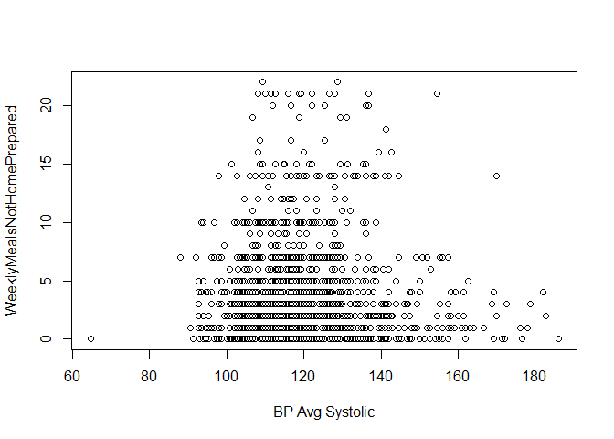
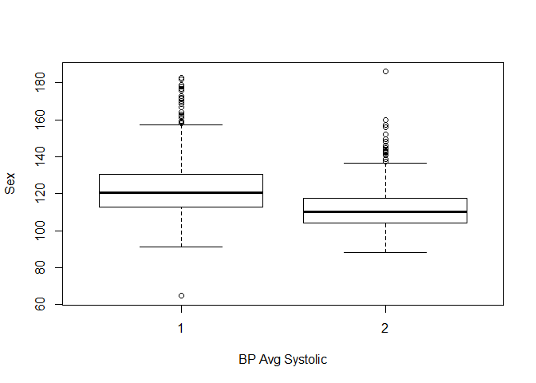
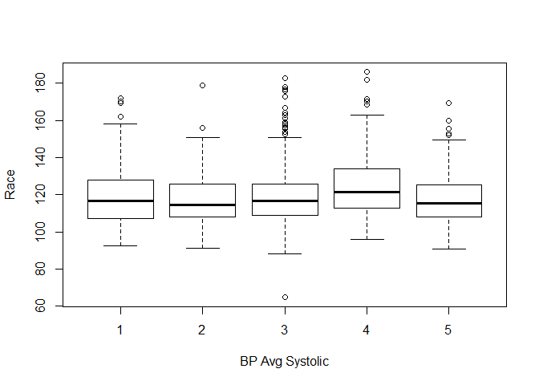
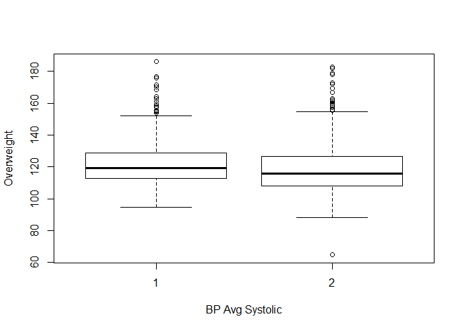
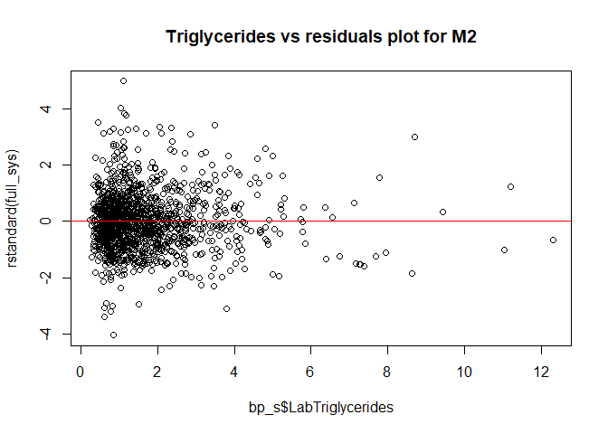

R Notebook
================
11/12/2019

### Load data, calculate mean diastolic and systolic blood pressures, and removing individual blood pressure readings and other non-essential variables

``` r
bp = read.csv("NHANES Filtered Workbook.csv")
bp$BPAvgSys = rowMeans(bp[c("BPXSY1", "BPXSY2", "BPXSY3")], na.rm=TRUE)
bp$BPAvgDias = rowMeans(bp[c("BPXDI1", "BPXDI2", "BPXDI3")], na.rm=TRUE)
library(dplyr)
```

    ## 
    ## Attaching package: 'dplyr'

    ## The following objects are masked from 'package:stats':
    ## 
    ##     filter, lag

    ## The following objects are masked from 'package:base':
    ## 
    ##     intersect, setdiff, setequal, union

``` r
bp = select(bp,-c(SEQN, BPXSY1, BPXSY2, BPXSY3,BPXDI1,BPXDI2, BPXDI3, LBXIN, LBDINSI, LBDLDL, DIQ050, URXPREG,IND235))
```

### Ommiting any nulls in the dataset and replacing values in DBD895 (\# of meals not prepared at home) with 22 where it shows value “5,555”. This is an obvious error in the data, so we replaced with average for the column.

``` r
bp = na.omit(bp)
bp$DBD895 = replace(bp$DBD895, bp$DBD895==5555, 22)
```

### Filtering down the dataset to remove dysfunctional data

``` r
bp = bp %>% filter(RIDEXPRG != 3, INDHHIN2 %in% c(1:10,14,15), DRQSPREP != 9, DRQSDIET != 9, !ALQ130 %in% c(777,999), !DIQ010 %in% c(7,9), !DIQ160 %in% c(7,9), !DBD895 %in% c(7777,9999), !DPQ030 %in% c(7,9), !MCQ080 %in% c(7,9), !MCQ160B %in% c(7,9), !MCQ160C %in% c(7,9), !MCQ160F %in% c(7,9), !PAD680 %in% c(7777,9999), !SMQ020 %in% c(7,9))
```

### Renaming columns

``` r
colnames(bp)[1:34] = c("Sex","Age","Race","Pregnant", "InfantsInHousehold", "ChildrenInHousehold", "SeniorsInHousehold", "Income", "SaltUsed", "SpecialDiet", "Calcium","Magnesium","Sodium","Potassium","Alcohol", "Weight","BMI", "Waist", "LabCalcium", "LabCholesterol", "LabTriglycerides", "LabHDL", "LabGlucose", "DailyAlcoholicDrinks", "Diabetic","Prediabetic", "WeeklyMealsNotHomePrepared", "HighBP", "Overweight", "CongestiveHeartFailure", "CoronaryHeartDisease", "Stroke", "SedentaryMins", "SmokedCigarettes")
```

### Drop diabetic variable because only 1 value after filtering

``` r
bp = select(bp,-c(Diabetic))
```

### Splitin dataset: 75% training, 25 testing

``` r
set.seed(6573)
select.bp <- sample(1:nrow(bp), 0.75*nrow(bp))
bp <- bp[select.bp,]
bp_test <- bp[-select.bp,]
```

### Breaking data down into two sets: one for diastolic and one systolic

``` r
bp_d = subset(bp, select= -c(BPAvgSys))
bp_s = subset(bp, select= -c(BPAvgDias))
```

### Creating histograms for average diastolic and average systolic blood pressure

``` r
hist(bp$BPAvgSys, breaks =40)
```

<!-- -->

``` r
hist(bp$BPAvgDias, breaks=40)
```

<!-- -->

### Loop to create scatterplots of average systolic blood pressure against all other numerical variables

``` r
numerical = subset(bp, select = c(Age, Calcium, Magnesium, Sodium, Potassium, Alcohol, Weight, BMI, Waist, LabCalcium, LabCholesterol, LabTriglycerides, LabHDL, LabGlucose, DailyAlcoholicDrinks, WeeklyMealsNotHomePrepared, SedentaryMins))
i = 1
while (i <= length(names(numerical))) {
  plot(bp$BPAvgSys, numerical[,i], xlab = "BP Avg Systolic", ylab = names(numerical)[i])
  i = i + 1
}
```

<!-- --><!-- --><!-- --><!-- --><!-- --><!-- --><!-- --><!-- --><!-- --><!-- --><!-- --><!-- --><!-- --><!-- --><!-- --><!-- --><!-- -->

### Loop to create scatterplots of average diastolic blood pressure against all other numerical variables

``` r
i=1
while (i <= length(names(numerical))) {
  plot(bp$BPAvgDias, numerical[,i], xlab = "BP Avg Diastolic", ylab = names(numerical)[i])
  i = i + 1
}
```

<!-- --><!-- --><!-- --><!-- --><!-- --><!-- --><!-- --><!-- --><!-- --><!-- --><!-- --><!-- --><!-- --><!-- --><!-- --><!-- --><!-- -->

### Loop to create boxlots of average systolic blood pressure against all categorical variables.

``` r
characs = subset(bp, select = -c(Age, Calcium, Magnesium, Sodium, Potassium, Alcohol, Weight, BMI, Waist, LabCalcium, LabCholesterol, LabTriglycerides, LabHDL, LabGlucose, DailyAlcoholicDrinks, WeeklyMealsNotHomePrepared, SedentaryMins, BPAvgSys, BPAvgDias))
i = 1
while (i <= length(names(characs))) {
  boxplot(bp$BPAvgSys ~ characs[,i], xlab = "BP Avg Systolic", ylab = names(characs)[i])
  i = i + 1
}
```

<!-- --><!-- --><!-- --><!-- --><!-- --><!-- --><!-- --><!-- --><!-- --><!-- --><!-- --><!-- --><!-- --><!-- --><!-- --><!-- -->

### Loop to create boxlots of average diastolic blood pressure against all categorical variables

``` r
i = 1
while (i <= length(names(characs))) {
  boxplot(bp$BPAvgDias ~ characs[,i], xlab = "BP Avg Diastolic", ylab = names(characs)[i])
  i = i + 1
}
```

<!-- --><!-- --><!-- --><!-- --><!-- --><!-- --><!-- --><!-- --><!-- --><!-- --><!-- --><!-- --><!-- --><!-- --><!-- --><!-- -->

### Correlation coefficients for average systolic blood pressure

``` r
cor(bp, method = "pearson")[,"BPAvgSys"]
```

    ##                        Sex                        Age 
    ##               -0.350497453                0.399454125 
    ##                       Race                   Pregnant 
    ##                0.030944221                0.033810849 
    ##         InfantsInHousehold        ChildrenInHousehold 
    ##               -0.151602521               -0.087519878 
    ##         SeniorsInHousehold                     Income 
    ##                0.264388988               -0.045015167 
    ##                   SaltUsed                SpecialDiet 
    ##               -0.074926499               -0.040427859 
    ##                    Calcium                  Magnesium 
    ##               -0.046239960                0.018868025 
    ##                     Sodium                  Potassium 
    ##                0.026664368                0.038095449 
    ##                    Alcohol                     Weight 
    ##                0.106759639                0.258227497 
    ##                        BMI                      Waist 
    ##                0.187396225                0.274093997 
    ##                 LabCalcium             LabCholesterol 
    ##                0.016311991                0.179460584 
    ##           LabTriglycerides                     LabHDL 
    ##                0.189587116               -0.035437641 
    ##                 LabGlucose       DailyAlcoholicDrinks 
    ##                0.168845014                0.047763184 
    ##                Prediabetic WeeklyMealsNotHomePrepared 
    ##               -0.048972008               -0.034324738 
    ##                     HighBP                 Overweight 
    ##                0.022444826               -0.113207545 
    ##     CongestiveHeartFailure       CoronaryHeartDisease 
    ##               -0.004134801               -0.027029238 
    ##                     Stroke              SedentaryMins 
    ##               -0.018407819                0.034428923 
    ##           SmokedCigarettes                   BPAvgSys 
    ##               -0.079823984                1.000000000 
    ##                  BPAvgDias 
    ##                0.449557142

### Correlation coefficients for average diastolic blood pressure

``` r
cor(bp_d, method = "pearson")[,"BPAvgDias"]
```

    ##                        Sex                        Age 
    ##               -0.110631770                0.140596399 
    ##                       Race                   Pregnant 
    ##                0.032848975                0.056202310 
    ##         InfantsInHousehold        ChildrenInHousehold 
    ##               -0.049878540                0.034977962 
    ##         SeniorsInHousehold                     Income 
    ##               -0.007888105                0.020102260 
    ##                   SaltUsed                SpecialDiet 
    ##               -0.031269983                0.010293214 
    ##                    Calcium                  Magnesium 
    ##               -0.053452777               -0.007557070 
    ##                     Sodium                  Potassium 
    ##                0.005486701               -0.011078916 
    ##                    Alcohol                     Weight 
    ##                0.078017964                0.167722452 
    ##                        BMI                      Waist 
    ##                0.152625817                0.177205274 
    ##                 LabCalcium             LabCholesterol 
    ##                0.010446952                0.218582314 
    ##           LabTriglycerides                     LabHDL 
    ##                0.184445196               -0.052970623 
    ##                 LabGlucose       DailyAlcoholicDrinks 
    ##                0.006867540                0.030278122 
    ##                Prediabetic WeeklyMealsNotHomePrepared 
    ##               -0.004740324               -0.004099000 
    ##                     HighBP                 Overweight 
    ##                0.025234485               -0.084704609 
    ##     CongestiveHeartFailure       CoronaryHeartDisease 
    ##                0.032674412                0.063427864 
    ##                     Stroke              SedentaryMins 
    ##                0.008591004               -0.028028639 
    ##           SmokedCigarettes                  BPAvgDias 
    ##                0.053996091                1.000000000

### First full linear model for average systolic blood pressure

``` r
full_sys = lm(BPAvgSys ~ as.factor(Sex)+Age+as.factor(Race)+as.factor(Pregnant)+as.factor(InfantsInHousehold)+as.factor(ChildrenInHousehold)+as.factor(SeniorsInHousehold)+as.factor(Income)+as.factor(SaltUsed)+as.factor(SpecialDiet)+Calcium+Magnesium+Sodium+ Potassium + Alcohol + BMI + Waist + LabCalcium + LabCholesterol + LabTriglycerides + LabHDL + LabGlucose + DailyAlcoholicDrinks + as.factor(Prediabetic) + WeeklyMealsNotHomePrepared + as.factor(HighBP) + as.factor(Overweight) + as.factor(CongestiveHeartFailure)+as.factor(CoronaryHeartDisease)+as.factor(Stroke)+SedentaryMins + as.factor(SmokedCigarettes), data=bp_s)
summary(full_sys)
```

    ## 
    ## Call:
    ## lm(formula = BPAvgSys ~ as.factor(Sex) + Age + as.factor(Race) + 
    ##     as.factor(Pregnant) + as.factor(InfantsInHousehold) + as.factor(ChildrenInHousehold) + 
    ##     as.factor(SeniorsInHousehold) + as.factor(Income) + as.factor(SaltUsed) + 
    ##     as.factor(SpecialDiet) + Calcium + Magnesium + Sodium + Potassium + 
    ##     Alcohol + BMI + Waist + LabCalcium + LabCholesterol + LabTriglycerides + 
    ##     LabHDL + LabGlucose + DailyAlcoholicDrinks + as.factor(Prediabetic) + 
    ##     WeeklyMealsNotHomePrepared + as.factor(HighBP) + as.factor(Overweight) + 
    ##     as.factor(CongestiveHeartFailure) + as.factor(CoronaryHeartDisease) + 
    ##     as.factor(Stroke) + SedentaryMins + as.factor(SmokedCigarettes), 
    ##     data = bp_s)
    ## 
    ## Residuals:
    ##     Min      1Q  Median      3Q     Max 
    ## -49.636  -7.686  -0.861   6.643  61.413 
    ## 
    ## Coefficients:
    ##                                      Estimate Std. Error t value Pr(>|t|)
    ## (Intercept)                         8.087e+01  1.310e+01   6.174 8.81e-10
    ## as.factor(Sex)2                    -7.482e+00  9.524e-01  -7.856 8.13e-15
    ## Age                                 2.570e-01  3.481e-02   7.381 2.75e-13
    ## as.factor(Race)2                    4.883e-01  1.604e+00   0.305 0.760765
    ## as.factor(Race)3                   -1.496e+00  1.140e+00  -1.311 0.189946
    ## as.factor(Race)4                    5.559e+00  1.342e+00   4.142 3.65e-05
    ## as.factor(Race)5                    1.030e+00  1.431e+00   0.720 0.471673
    ## as.factor(Pregnant)2               -2.635e-01  3.771e+00  -0.070 0.944305
    ## as.factor(InfantsInHousehold)1     -8.690e-01  9.271e-01  -0.937 0.348733
    ## as.factor(InfantsInHousehold)2     -7.614e-01  1.462e+00  -0.521 0.602694
    ## as.factor(InfantsInHousehold)3      3.811e-01  3.278e+00   0.116 0.907454
    ## as.factor(ChildrenInHousehold)1    -2.317e-01  9.587e-01  -0.242 0.809104
    ## as.factor(ChildrenInHousehold)2    -9.324e-01  1.108e+00  -0.841 0.400412
    ## as.factor(ChildrenInHousehold)3     1.480e-01  1.715e+00   0.086 0.931231
    ## as.factor(ChildrenInHousehold)4    -1.866e+00  2.420e+00  -0.771 0.440876
    ## as.factor(SeniorsInHousehold)1      2.705e+00  1.175e+00   2.302 0.021507
    ## as.factor(SeniorsInHousehold)2      2.344e+00  1.366e+00   1.716 0.086309
    ## as.factor(SeniorsInHousehold)3      6.115e+00  7.361e+00   0.831 0.406315
    ## as.factor(Income)2                  2.259e+00  3.166e+00   0.714 0.475568
    ## as.factor(Income)3                  1.304e+00  3.020e+00   0.432 0.665876
    ## as.factor(Income)4                 -2.511e+00  3.037e+00  -0.827 0.408381
    ## as.factor(Income)5                 -1.615e-01  2.900e+00  -0.056 0.955585
    ## as.factor(Income)6                 -1.344e+00  2.803e+00  -0.479 0.631702
    ## as.factor(Income)7                 -3.396e+00  2.851e+00  -1.191 0.233728
    ## as.factor(Income)8                  3.447e-02  2.878e+00   0.012 0.990445
    ## as.factor(Income)9                  6.386e-02  2.902e+00   0.022 0.982449
    ## as.factor(Income)10                -2.187e+00  3.085e+00  -0.709 0.478357
    ## as.factor(Income)14                -1.782e+00  2.815e+00  -0.633 0.526797
    ## as.factor(Income)15                -1.616e+00  2.729e+00  -0.592 0.553943
    ## as.factor(SaltUsed)2               -3.702e+00  1.629e+00  -2.272 0.023232
    ## as.factor(SaltUsed)3               -2.341e+00  1.553e+00  -1.507 0.132008
    ## as.factor(SaltUsed)4               -4.367e+00  1.531e+00  -2.852 0.004418
    ## as.factor(SpecialDiet)2            -1.536e+00  1.055e+00  -1.456 0.145631
    ## Calcium                            -5.490e-04  7.728e-04  -0.710 0.477548
    ## Magnesium                          -5.150e-03  4.007e-03  -1.285 0.198878
    ## Sodium                              3.590e-04  2.545e-04   1.410 0.158710
    ## Potassium                          -4.524e-05  5.302e-04  -0.085 0.932024
    ## Alcohol                             1.091e-02  1.111e-02   0.982 0.326327
    ## BMI                                 4.624e-01  1.612e-01   2.869 0.004188
    ## Waist                              -2.261e-02  6.521e-02  -0.347 0.728884
    ## LabCalcium                         -6.997e-01  3.980e+00  -0.176 0.860487
    ## LabCholesterol                      8.916e-01  3.953e-01   2.256 0.024255
    ## LabTriglycerides                    1.531e+00  3.500e-01   4.375 1.31e-05
    ## LabHDL                              1.013e-01  2.927e-02   3.460 0.000556
    ## LabGlucose                          3.669e-01  3.487e-01   1.052 0.292867
    ## DailyAlcoholicDrinks                1.603e-01  1.599e-01   1.002 0.316390
    ## as.factor(Prediabetic)2            -5.189e-01  1.679e+00  -0.309 0.757378
    ## WeeklyMealsNotHomePrepared          4.032e-02  8.455e-02   0.477 0.633517
    ## as.factor(HighBP)1                  1.575e-01  8.664e-01   0.182 0.855754
    ## as.factor(HighBP)2                 -1.294e+00  1.506e+00  -0.859 0.390375
    ## as.factor(HighBP)3                  2.434e+00  1.380e+00   1.764 0.077918
    ## as.factor(Overweight)2             -3.282e-01  9.425e-01  -0.348 0.727726
    ## as.factor(CongestiveHeartFailure)2  5.847e+00  3.786e+00   1.544 0.122774
    ## as.factor(CoronaryHeartDisease)2    4.596e+00  2.683e+00   1.713 0.086957
    ## as.factor(Stroke)2                  3.159e+00  4.106e+00   0.769 0.441849
    ## SedentaryMins                       1.099e-03  1.803e-03   0.609 0.542430
    ## as.factor(SmokedCigarettes)2       -2.460e-01  7.460e-01  -0.330 0.741621
    ##                                       
    ## (Intercept)                        ***
    ## as.factor(Sex)2                    ***
    ## Age                                ***
    ## as.factor(Race)2                      
    ## as.factor(Race)3                      
    ## as.factor(Race)4                   ***
    ## as.factor(Race)5                      
    ## as.factor(Pregnant)2                  
    ## as.factor(InfantsInHousehold)1        
    ## as.factor(InfantsInHousehold)2        
    ## as.factor(InfantsInHousehold)3        
    ## as.factor(ChildrenInHousehold)1       
    ## as.factor(ChildrenInHousehold)2       
    ## as.factor(ChildrenInHousehold)3       
    ## as.factor(ChildrenInHousehold)4       
    ## as.factor(SeniorsInHousehold)1     *  
    ## as.factor(SeniorsInHousehold)2     .  
    ## as.factor(SeniorsInHousehold)3        
    ## as.factor(Income)2                    
    ## as.factor(Income)3                    
    ## as.factor(Income)4                    
    ## as.factor(Income)5                    
    ## as.factor(Income)6                    
    ## as.factor(Income)7                    
    ## as.factor(Income)8                    
    ## as.factor(Income)9                    
    ## as.factor(Income)10                   
    ## as.factor(Income)14                   
    ## as.factor(Income)15                   
    ## as.factor(SaltUsed)2               *  
    ## as.factor(SaltUsed)3                  
    ## as.factor(SaltUsed)4               ** 
    ## as.factor(SpecialDiet)2               
    ## Calcium                               
    ## Magnesium                             
    ## Sodium                                
    ## Potassium                             
    ## Alcohol                               
    ## BMI                                ** 
    ## Waist                                 
    ## LabCalcium                            
    ## LabCholesterol                     *  
    ## LabTriglycerides                   ***
    ## LabHDL                             ***
    ## LabGlucose                            
    ## DailyAlcoholicDrinks                  
    ## as.factor(Prediabetic)2               
    ## WeeklyMealsNotHomePrepared            
    ## as.factor(HighBP)1                    
    ## as.factor(HighBP)2                    
    ## as.factor(HighBP)3                 .  
    ## as.factor(Overweight)2                
    ## as.factor(CongestiveHeartFailure)2    
    ## as.factor(CoronaryHeartDisease)2   .  
    ## as.factor(Stroke)2                    
    ## SedentaryMins                         
    ## as.factor(SmokedCigarettes)2          
    ## ---
    ## Signif. codes:  0 '***' 0.001 '**' 0.01 '*' 0.05 '.' 0.1 ' ' 1
    ## 
    ## Residual standard error: 12.55 on 1333 degrees of freedom
    ## Multiple R-squared:  0.3291, Adjusted R-squared:  0.3009 
    ## F-statistic: 11.67 on 56 and 1333 DF,  p-value: < 2.2e-16

### VIF computed to determine if there is any multi-collinearity in systolic model. Weight removed because VIF \> 10 due to multicollinearity with Waist and BMI.

``` r
library(car)
```

    ## Loading required package: carData

    ## 
    ## Attaching package: 'car'

    ## The following object is masked from 'package:dplyr':
    ## 
    ##     recode

``` r
vif(full_sys)
```

    ##                                       GVIF Df GVIF^(1/(2*Df))
    ## as.factor(Sex)                    1.788960  1        1.337520
    ## Age                               2.565150  1        1.601609
    ## as.factor(Race)                   1.827234  4        1.078262
    ## as.factor(Pregnant)               1.075105  1        1.036873
    ## as.factor(InfantsInHousehold)     1.397894  3        1.057416
    ## as.factor(ChildrenInHousehold)    1.471640  4        1.049482
    ## as.factor(SeniorsInHousehold)     1.897711  3        1.112684
    ## as.factor(Income)                 2.003371 11        1.032087
    ## as.factor(SaltUsed)               1.204982  3        1.031565
    ## as.factor(SpecialDiet)            1.113867  1        1.055399
    ## Calcium                           2.085186  1        1.444017
    ## Magnesium                         4.209750  1        2.051768
    ## Sodium                            2.307858  1        1.519164
    ## Potassium                         4.666774  1        2.160272
    ## Alcohol                           1.339880  1        1.157532
    ## BMI                               9.045799  1        3.007623
    ## Waist                             9.606796  1        3.099483
    ## LabCalcium                        1.158959  1        1.076550
    ## LabCholesterol                    1.390774  1        1.179311
    ## LabTriglycerides                  1.742893  1        1.320187
    ## LabHDL                            1.809318  1        1.345109
    ## LabGlucose                        1.195646  1        1.093456
    ## DailyAlcoholicDrinks              1.315753  1        1.147063
    ## as.factor(Prediabetic)            1.093982  1        1.045936
    ## WeeklyMealsNotHomePrepared        1.163826  1        1.078807
    ## as.factor(HighBP)                 1.209226  3        1.032170
    ## as.factor(Overweight)             1.614907  1        1.270790
    ## as.factor(CongestiveHeartFailure) 1.173117  1        1.083105
    ## as.factor(CoronaryHeartDisease)   1.211218  1        1.100553
    ## as.factor(Stroke)                 1.063578  1        1.031299
    ## SedentaryMins                     1.146046  1        1.070536
    ## as.factor(SmokedCigarettes)       1.214244  1        1.101927

### Computation of influential points and studentized vs hat value plot for systolic model. 27 outliers were removed.

``` r
# compute influential points statistics
influence.measures(full_sys)
```

    ## Influence measures of
    ##   lm(formula = BPAvgSys ~ as.factor(Sex) + Age + as.factor(Race) +      as.factor(Pregnant) + as.factor(InfantsInHousehold) + as.factor(ChildrenInHousehold) +      as.factor(SeniorsInHousehold) + as.factor(Income) + as.factor(SaltUsed) +      as.factor(SpecialDiet) + Calcium + Magnesium + Sodium + Potassium +      Alcohol + BMI + Waist + LabCalcium + LabCholesterol + LabTriglycerides +      LabHDL + LabGlucose + DailyAlcoholicDrinks + as.factor(Prediabetic) +      WeeklyMealsNotHomePrepared + as.factor(HighBP) + as.factor(Overweight) +      as.factor(CongestiveHeartFailure) + as.factor(CoronaryHeartDisease) +      as.factor(Stroke) + SedentaryMins + as.factor(SmokedCigarettes),      data = bp_s) :
    ## 
    ##         dfb.1_ dfb.as.fctr.Sx.2   dfb.Age dfb.a..R.2 dfb.a..R.3 dfb.a..R.4
    ## 21    4.53e-03        -6.48e-03 -3.24e-03   1.22e-03   3.33e-03   9.51e-04
    ## 1383  1.37e-03        -8.43e-04  5.55e-04  -5.30e-04  -1.22e-03  -1.91e-04
    ## 1459 -3.86e-03         5.74e-03  4.50e-05   1.76e-03  -5.67e-03   7.78e-04
    ## 1595  6.02e-04         1.18e-02  2.07e-02  -2.62e-04  -1.55e-02  -6.04e-05
    ## 1480 -3.06e-04         3.30e-05 -2.77e-05   1.62e-05  -2.51e-05   5.73e-06
    ## 630   4.99e-03        -1.01e-02 -1.62e-02  -4.62e-03  -3.28e-03  -1.41e-02
    ## 712   3.93e-02        -1.83e-02 -2.51e-02  -1.60e-03  -1.05e-02   1.30e-02
    ## 1731 -3.76e-02         3.62e-02  3.66e-02   4.01e-02   4.69e-02   4.89e-02
    ## 552  -2.55e-02         1.57e-02 -5.17e-03   2.66e-03   8.89e-03   7.27e-03
    ## 1246 -2.40e-03        -4.88e-03 -6.20e-03  -1.18e-03  -6.40e-03  -5.64e-03
    ## 928  -1.08e-02         5.09e-02 -3.24e-02   7.09e-03  -5.00e-03  -3.03e-02
    ## 747   5.06e-02         4.73e-02 -4.21e-03   1.27e-01   2.52e-02   3.13e-02
    ## 553  -2.08e-02        -1.30e-02 -4.28e-02   2.07e-02   4.90e-02   1.38e-02
    ## 1600  4.39e-05        -5.33e-04  1.93e-04  -1.35e-03  -5.37e-05  -9.16e-05
    ## 876  -8.20e-03         2.36e-03 -2.73e-02   8.75e-03  -5.89e-03   4.41e-03
    ## 701  -2.32e-04        -8.21e-04 -4.38e-04   1.01e-03   4.52e-05  -1.30e-04
    ## 1472 -1.11e-03        -1.26e-03 -2.23e-03   3.37e-04  -2.01e-03   1.18e-03
    ## 1752  1.57e-02        -1.23e-03 -6.37e-03  -6.63e-03  -1.37e-02  -1.25e-03
    ## 1673  3.61e-02         9.86e-03 -2.26e-02   6.24e-03  -4.19e-03   1.98e-02
    ## 106   2.36e-02        -2.78e-02 -8.01e-03  -6.54e-03  -2.90e-02  -1.35e-03
    ## 1576  1.69e-03         1.67e-02  2.40e-03   4.24e-03   1.50e-02   8.20e-03
    ## 1639 -5.06e-03         1.68e-02 -3.77e-02  -5.67e-03   1.68e-03   2.05e-02
    ## 1530 -1.70e-03        -1.66e-02 -2.00e-02  -2.61e-03  -9.89e-03  -9.36e-03
    ## 1781  5.78e-03        -8.56e-03 -3.18e-03   2.18e-04  -6.28e-04  -8.80e-04
    ## 571   2.17e-02        -2.51e-02  1.35e-03   3.31e-03   5.45e-03   2.80e-02
    ## 420   4.87e-02        -7.19e-02 -1.55e-02  -6.00e-02  -8.96e-02  -8.25e-02
    ## 18   -9.45e-03         1.30e-02  1.48e-02  -5.16e-03  -1.77e-02  -1.17e-02
    ## 550   5.05e-03        -7.94e-03 -8.70e-03   2.75e-03   5.13e-04   3.16e-03
    ## 1318 -1.42e-02         1.46e-02  9.60e-03   3.56e-03   6.03e-03   3.08e-03
    ## 988  -7.64e-02         6.65e-02  3.44e-02   8.68e-03   3.89e-02  -7.79e-03
    ## 107   1.38e-02         3.44e-02  1.84e-02   1.19e-01   5.11e-03   1.51e-02
    ## 925   4.93e-03         4.66e-03  1.46e-03  -3.36e-03   2.60e-03   1.36e-02
    ## 1487 -3.81e-03        -4.45e-03 -4.97e-03  -9.23e-04   2.86e-03  -2.33e-03
    ## 375  -1.36e-04         1.13e-03  1.33e-04  -1.95e-04  -2.79e-04  -1.90e-04
    ## 688  -2.63e-03         9.60e-03  2.38e-02  -1.96e-03  -8.00e-05  -1.73e-02
    ## 441  -6.66e-03         2.68e-02  1.40e-02   4.98e-02   7.35e-02   5.90e-02
    ## 1750 -1.02e-02         2.60e-02  2.34e-03  -1.48e-03   1.59e-02  -9.29e-04
    ## 62    1.41e-02        -3.94e-02 -1.93e-02  -6.08e-03   2.21e-02   7.41e-02
    ## 1649 -3.57e-02         8.24e-02  3.68e-02  -8.74e-03   2.97e-02   1.75e-02
    ## 1502 -5.85e-03         8.60e-03 -6.33e-03   1.61e-03  -3.50e-03  -3.91e-02
    ## 993  -2.39e-03         1.42e-02 -3.27e-03   2.51e-03   9.62e-03   1.22e-03
    ## 272   4.02e-03         4.27e-03  3.44e-03  -1.21e-03   7.48e-04  -1.08e-03
    ## 317   1.16e-03        -2.33e-02 -3.37e-02   6.70e-03  -2.59e-02   1.82e-02
    ## 1849  7.38e-02        -7.44e-02 -7.67e-02  -9.07e-03   5.23e-02  -1.09e-01
    ## 1522 -7.53e-03         1.11e-02 -7.41e-04   5.86e-03   3.20e-03   4.62e-04
    ## 1684  5.77e-03        -8.73e-03 -8.01e-03   8.62e-04  -2.61e-04  -7.14e-03
    ## 288   2.05e-03        -5.77e-04  4.79e-03  -4.53e-04   2.60e-03   1.01e-03
    ## 819  -2.15e-02         4.76e-02  5.71e-02   8.75e-03   3.45e-04   1.07e-02
    ## 1160 -1.62e-02         2.85e-02  4.21e-02   6.37e-02   8.19e-03  -4.35e-03
    ## 1397 -1.74e-03        -1.13e-02 -2.15e-02  -1.43e-03  -8.21e-04  -3.23e-03
    ## 1708  2.83e-02         2.39e-02  4.78e-02   1.19e-01  -1.06e-02  -2.56e-03
    ## 1292  1.81e-03        -8.98e-03  1.27e-04  -1.91e-03   5.32e-03  -5.09e-03
    ## 1293 -9.13e-03         1.16e-02 -2.05e-03  -1.35e-03   3.12e-03  -3.55e-04
    ## 1371  2.54e-02         1.21e-02  2.49e-02  -9.02e-02   1.07e-02   3.82e-03
    ## 1141  2.84e-03         9.37e-03  6.81e-04  -8.75e-03  -1.22e-02  -9.43e-03
    ## 104   5.23e-03         9.07e-03 -7.21e-03  -2.36e-03   3.84e-03  -3.60e-04
    ## 700  -5.32e-04        -2.12e-02 -1.50e-02  -4.21e-02   9.44e-04  -8.44e-03
    ## 511   1.84e-02        -3.04e-02 -2.31e-02   4.24e-03  -1.50e-03   1.30e-02
    ## 1820 -1.73e-02        -9.17e-03 -2.88e-02   2.63e-03   1.18e-02  -2.84e-02
    ## 831   1.13e-02         2.76e-02 -1.85e-02   2.82e-03   1.68e-02   5.08e-03
    ## 365   4.54e-02        -2.88e-02  6.65e-02  -8.45e-04   2.05e-02  -1.07e-02
    ## 11   -1.33e-02        -2.68e-03  2.11e-02  -6.11e-04   5.50e-03  -5.85e-03
    ## 537   2.94e-02        -1.98e-02 -2.28e-04   4.44e-03  -5.31e-03   1.11e-02
    ## 512  -1.79e-03         4.80e-03  2.79e-03   2.35e-03   4.14e-03   1.91e-03
    ## 898   2.20e-02        -4.09e-03 -3.86e-02  -2.67e-03  -6.79e-04  -3.77e-02
    ## 1027 -1.12e-02        -7.89e-03 -9.55e-03   6.92e-04  -4.63e-03   2.34e-02
    ## 1626 -2.08e-03         1.98e-02  9.00e-03   2.23e-02   2.64e-02   2.34e-02
    ## 567   8.17e-03        -4.34e-03 -9.45e-03  -1.11e-03   4.19e-03   2.74e-03
    ## 444   1.50e-02        -3.96e-02 -2.64e-02   1.87e-03   8.94e-03   2.94e-03
    ## 893   1.53e-01         4.09e-02 -7.15e-02  -2.95e-01  -3.74e-03   2.45e-02
    ## 1619  3.13e-02        -8.50e-02 -1.71e-02   2.24e-02   8.90e-02   7.65e-02
    ## 486  -4.25e-05         4.09e-04 -1.21e-04  -4.41e-05  -1.17e-04   8.68e-06
    ## 1633 -2.27e-02         2.05e-02  2.88e-02  -1.13e-03  -7.60e-03   4.59e-02
    ## 1590  3.37e-02        -2.45e-02  9.79e-03  -7.86e-03  -1.97e-02  -2.05e-02
    ## 947  -1.30e-03        -1.06e-02 -9.26e-03   2.81e-03   7.12e-03   4.54e-03
    ## 1191  2.04e-02        -2.71e-02 -2.66e-02  -7.83e-03   1.72e-02  -3.79e-03
    ## 285   4.77e-03        -1.17e-02 -2.14e-03   1.82e-03   8.68e-03   4.32e-03
    ## 1064 -3.60e-04         4.93e-02  2.89e-03  -6.60e-04  -8.81e-03  -2.82e-02
    ## 417  -2.07e-03         7.05e-03 -2.22e-03  -1.63e-02   2.64e-03   5.32e-04
    ## 766  -1.77e-03        -1.23e-02  1.12e-02  -1.28e-02  -2.00e-02  -9.22e-03
    ## 233   7.06e-06         2.38e-03  2.19e-04   2.00e-04   2.26e-04   2.78e-03
    ## 548   4.47e-03        -4.73e-03 -7.61e-03  -4.67e-04   2.23e-03  -9.64e-04
    ## 1636 -3.81e-03        -2.27e-03 -2.21e-03   1.54e-03   4.03e-03   2.19e-03
    ## 575  -3.00e-03         2.84e-03  1.67e-04   7.48e-04   2.59e-03   1.74e-03
    ## 636  -7.47e-02         1.12e-02  1.34e-02   1.01e-02  -1.15e-02   2.51e-02
    ## 191   2.47e-02         3.51e-02  1.82e-03  -6.64e-03  -7.97e-03  -3.57e-02
    ## 1438  8.10e-03         8.77e-04  1.91e-02  -2.16e-02  -4.15e-03  -1.74e-03
    ## 131   2.74e-03        -1.73e-02  1.24e-02  -1.03e-02  -2.79e-02   4.77e-02
    ## 212  -6.85e-03         7.12e-03  9.22e-03   1.20e-02   1.49e-02   1.18e-02
    ## 1753 -6.03e-02        -1.54e-02 -4.55e-02   2.03e-02   8.56e-03  -3.90e-02
    ## 598   2.61e-02        -4.19e-03 -3.02e-02  -6.50e-03  -8.27e-03   8.76e-03
    ## 261   1.91e-02        -4.45e-02 -4.22e-02  -1.29e-02  -3.32e-02  -1.37e-02
    ## 1128 -2.02e-04         9.76e-03 -2.23e-02   2.93e-02   4.49e-02   4.99e-02
    ## 629   2.99e-03        -1.12e-02 -1.75e-02   7.10e-03   1.95e-02   9.16e-03
    ## 217   1.76e-03        -6.85e-04 -2.61e-03  -2.03e-04   6.23e-05   2.61e-03
    ## 764   2.28e-02         3.53e-03  2.62e-02  -1.17e-03  -3.02e-03  -3.28e-02
    ## 806  -8.72e-04        -2.36e-03  3.67e-04  -3.55e-04   9.67e-06  -2.57e-03
    ## 753  -8.01e-04         5.34e-04  3.08e-04   1.77e-04   2.36e-05   3.39e-04
    ## 1145  9.91e-05         8.48e-05  9.91e-05   4.38e-04   4.13e-05   1.69e-05
    ## 1277 -5.31e-03        -4.29e-03  3.95e-03  -5.84e-04   1.76e-03  -3.30e-03
    ## 1049  1.37e-03        -2.13e-02  1.84e-02   3.97e-03  -4.54e-03   9.03e-04
    ## 1069 -1.04e-03         1.51e-03 -5.70e-04  -2.22e-04   4.55e-03  -1.64e-03
    ## 1399  4.54e-02        -6.61e-03 -7.98e-03  -2.74e-03   6.46e-03  -4.38e-04
    ## 24   -3.65e-02         5.24e-02 -1.61e-02  -3.80e-03   1.58e-02  -1.34e-02
    ## 1159 -2.49e-03        -2.61e-03 -8.65e-03  -6.96e-05   5.60e-03   8.80e-04
    ## 864  -7.21e-03        -2.40e-02 -2.59e-03  -2.92e-03  -6.05e-03  -3.83e-02
    ## 1086 -1.66e-03        -1.99e-03  8.69e-04   8.75e-04  -1.40e-03   1.15e-05
    ## 200   6.60e-03         1.18e-02 -1.22e-02   5.59e-04   6.66e-03   3.02e-03
    ## 759  -2.01e-02         2.41e-03 -7.87e-03  -2.42e-02  -9.98e-04   1.04e-03
    ## 73   -1.33e-02        -1.77e-02 -1.16e-02  -2.83e-03  -6.21e-03   3.21e-03
    ## 1529 -1.15e-02        -7.30e-03  2.41e-02   1.96e-03   1.06e-03   1.97e-02
    ## 270  -5.03e-02         8.74e-03  1.09e-03   1.31e-02   2.95e-02  -5.16e-04
    ## 187  -3.37e-02         2.92e-02  7.52e-03   2.36e-03   4.01e-04  -3.11e-02
    ## 1574  1.60e-03        -1.23e-02  6.95e-04   6.96e-03   1.83e-02   1.02e-02
    ## 721  -4.83e-03         9.90e-03  1.62e-03   1.38e-02   2.51e-02   1.64e-02
    ## 257   3.12e-03        -5.98e-03  2.35e-03  -2.11e-03  -6.73e-03  -2.30e-03
    ## 693  -3.85e-03        -1.03e-02  5.31e-03  -6.50e-04  -1.05e-02  -1.45e-03
    ## 966  -4.39e-02         5.00e-02 -9.98e-03   5.04e-03   9.67e-03  -5.53e-02
    ## 1596 -6.29e-02         4.62e-02  8.63e-02   5.21e-02   8.97e-02   7.01e-02
    ## 1612 -1.04e-01        -9.36e-02  3.30e-03   2.73e-03   1.77e-02  -1.16e-02
    ## 811   1.99e-03         8.96e-04  8.40e-04   3.21e-04  -2.84e-04   9.71e-04
    ## 194   4.08e-03        -3.52e-03 -6.27e-04  -8.58e-04  -2.47e-03   1.42e-04
    ## 1680  1.53e-02        -1.84e-02 -6.44e-02   3.04e-03   4.45e-03   1.21e-02
    ## 1570 -2.92e-02         2.35e-02 -1.20e-02  -1.52e-03  -2.96e-02  -4.27e-03
    ## 1556 -3.72e-03        -2.44e-02  1.56e-02   2.99e-04  -5.21e-03  -4.58e-03
    ## 1358 -3.36e-03         4.74e-03  2.61e-03   8.50e-05  -1.58e-04  -5.10e-03
    ## 810   1.53e-02        -2.79e-02 -4.26e-02   4.93e-02   6.14e-02   6.35e-02
    ## 458   4.43e-03         1.53e-02  1.73e-03  -2.61e-03   2.77e-03   2.39e-03
    ## 1802  2.18e-02         3.14e-02  3.20e-02   1.34e-03  -1.34e-02   1.24e-02
    ## 1273  3.11e-03        -1.21e-03 -4.65e-03  -2.17e-04  -2.30e-03  -3.31e-04
    ## 265  -3.97e-03        -1.27e-02 -3.75e-03   4.65e-02   5.47e-03   1.60e-03
    ## 923  -6.04e-04        -1.03e-04  7.36e-04  -4.73e-04   9.43e-04  -3.65e-04
    ## 1384 -2.50e-03        -3.60e-03 -2.05e-03   1.41e-03   2.27e-03   9.37e-03
    ## 1124 -6.94e-03         4.50e-02  1.42e-03   6.09e-03   1.56e-02   1.78e-02
    ## 1519  4.58e-03        -4.02e-03  4.20e-03  -2.12e-03   2.08e-03  -3.07e-03
    ## 1041 -1.07e-02         4.02e-02  1.44e-02  -1.84e-03   6.05e-03  -6.38e-03
    ## 53    2.75e-02         5.86e-03  7.23e-03  -6.36e-02   7.10e-03   1.22e-03
    ## 1770 -6.02e-03        -2.47e-03 -2.91e-03   1.85e-03   1.24e-03   3.59e-03
    ## 1380 -2.15e-02         4.66e-02  7.34e-03   9.89e-03   4.98e-03   1.61e-03
    ## 1362 -1.15e-02        -1.51e-04  1.21e-02   6.72e-04  -3.20e-03  -4.56e-04
    ## 1589  2.09e-02        -7.79e-03 -4.62e-03  -7.91e-03  -2.10e-02  -1.99e-02
    ## 464   1.02e-02         2.16e-02 -1.75e-02   3.32e-03  -4.14e-02   4.27e-04
    ## 1539  3.06e-03         2.70e-02 -5.05e-02  -2.33e-02  -3.29e-02  -1.15e-02
    ## 1018 -8.07e-04        -1.22e-03 -7.18e-04  -5.52e-04   4.32e-04  -2.79e-04
    ## 814  -4.81e-03        -1.13e-02  2.05e-02   4.13e-03  -1.37e-03   1.19e-03
    ## 1555 -2.38e-02         1.98e-02  9.87e-03  -6.43e-03  -1.74e-02  -8.93e-03
    ## 706  -2.68e-02         5.86e-02 -1.09e-01  -6.43e-02  -9.55e-02  -6.18e-02
    ## 1414  2.97e-02        -5.13e-02 -1.44e-02   2.74e-03   3.69e-02   1.36e-03
    ## 1533  7.63e-03         3.26e-02  2.25e-02   6.68e-02  -8.95e-03   1.58e-04
    ## 394  -3.29e-03        -7.90e-03 -4.47e-03   3.58e-04  -6.90e-03  -1.26e-03
    ## 1656  1.88e-03        -4.02e-03  2.64e-03  -6.45e-03  -8.07e-03  -7.59e-03
    ## 1561 -1.10e-02         3.39e-02  1.06e-02   6.63e-02  -1.54e-03   4.52e-03
    ## 1224  2.24e-02         1.32e-01 -2.34e-02  -2.46e-04  -6.35e-03  -1.78e-04
    ## 289   5.62e-04         1.03e-02  1.35e-02   1.40e-03  -3.71e-04   6.72e-03
    ## 826  -1.30e-02         9.98e-03  2.03e-02  -9.02e-03   3.39e-02  -1.34e-02
    ## 1607 -4.69e-04         6.90e-04  8.65e-05  -1.32e-04  -9.88e-04  -1.65e-04
    ## 465  -1.10e-02        -8.02e-03 -5.65e-03   7.09e-04   1.23e-02   3.65e-03
    ## 1532 -5.29e-03        -1.22e-02 -6.99e-03  -4.06e-03  -4.57e-03   9.12e-03
    ## 1662 -3.02e-03         9.75e-03 -1.54e-03  -1.41e-03  -8.21e-03  -9.85e-04
    ## 121  -2.01e-02         4.05e-02 -3.20e-02   9.40e-03   5.54e-03   1.54e-02
    ## 949   2.25e-03        -1.11e-04 -1.05e-03  -2.97e-04   9.03e-04   1.80e-04
    ## 605   4.62e-02        -6.88e-02 -5.81e-02   5.08e-02   6.63e-02   4.99e-02
    ## 1072  1.70e-02        -2.91e-02 -2.97e-02  -1.65e-01  -2.13e-02  -2.54e-02
    ## 615   6.17e-03        -1.87e-02  7.38e-03  -2.50e-02  -3.35e-02  -2.76e-02
    ## 116  -8.11e-02         2.86e-02  1.61e-02  -3.25e-03  -3.86e-03  -8.08e-03
    ## 1028  6.57e-02        -8.83e-02 -1.14e-02  -2.80e-02  -6.23e-02  -5.68e-02
    ## 1111 -5.63e-03         2.92e-02  6.55e-03  -3.48e-03  -2.09e-02  -4.34e-03
    ## 1693 -2.33e-02        -6.97e-03 -6.42e-04  -1.59e-03  -2.52e-03   1.85e-02
    ## 349   3.16e-03        -4.50e-03 -7.41e-03  -7.47e-04   2.16e-03  -5.55e-04
    ## 1388 -6.90e-03        -4.37e-03 -1.30e-02  -2.90e-04   2.69e-03   2.27e-02
    ## 619   9.67e-04         1.69e-02 -2.13e-02   3.84e-04   1.13e-02   9.10e-03
    ## 339   1.08e-02        -1.83e-02  7.96e-03  -2.38e-03   1.94e-04   1.95e-02
    ## 264  -1.48e-03        -8.26e-03 -4.11e-04   3.51e-04   1.81e-03   5.40e-04
    ## 963   1.61e-02         1.51e-03 -5.65e-02   5.85e-02   8.24e-02   7.12e-02
    ## 858   5.63e-03         3.33e-03  3.51e-03   1.04e-03   3.85e-03   3.09e-03
    ## 1818  3.61e-03        -6.51e-03  9.50e-04   1.49e-04  -4.43e-03   2.13e-03
    ## 580  -2.28e-03        -1.62e-02  1.48e-02   1.59e-03   1.54e-03  -1.67e-02
    ## 832   1.41e-02        -1.30e-02 -7.32e-03   1.78e-02   1.13e-04   8.38e-04
    ## 964  -2.34e-02         1.72e-02  1.58e-02  -4.04e-03  -1.02e-02  -4.99e-02
    ## 1147  4.54e-03         9.32e-03  2.65e-02   3.40e-03  -2.16e-02  -1.13e-02
    ## 23   -9.70e-03         1.22e-02  1.19e-02  -2.45e-03  -1.21e-02   5.69e-03
    ## 1304  1.66e-04        -1.09e-03 -1.62e-05   1.10e-04   1.07e-04  -8.34e-04
    ## 490   2.12e-02        -5.57e-02  6.64e-04  -6.81e-02  -1.06e-01  -8.43e-02
    ## 505   3.57e-03        -3.11e-03 -1.04e-03  -2.04e-04   1.27e-03  -1.81e-03
    ## 431   7.70e-03         7.57e-03  6.69e-03  -1.95e-03  -7.59e-03   1.49e-03
    ## 570   1.12e-03         2.31e-03 -2.15e-03   3.59e-04   3.28e-04   6.16e-04
    ## 1356 -8.03e-04        -5.99e-03  8.00e-04  -2.12e-03  -3.72e-03  -1.10e-02
    ## 1624  2.66e-03         1.42e-02  1.39e-02  -2.47e-02  -3.95e-02  -2.95e-02
    ## 989  -7.13e-03         2.37e-02  6.25e-03   2.35e-02   2.81e-02   2.65e-02
    ## 1020 -2.02e-02         2.03e-02 -1.36e-02   1.78e-02   2.75e-02   2.70e-02
    ## 1196 -1.83e-02         4.36e-02  6.30e-02   3.74e-03  -5.08e-03  -3.76e-02
    ## 547  -5.28e-03        -8.60e-03  1.75e-02   2.85e-03   5.02e-03   1.19e-04
    ## 985  -3.72e-03        -8.22e-03  2.46e-03   8.91e-04  -3.58e-05  -7.91e-04
    ## 585  -5.07e-02         3.19e-02 -1.13e-02  -1.37e-01  -3.45e-02  -2.41e-02
    ## 1223 -2.20e-04        -3.25e-03  3.26e-03   1.37e-04  -3.46e-03  -1.86e-04
    ## 769  -7.94e-03        -1.96e-02 -1.74e-03   2.48e-03   2.45e-03  -1.44e-03
    ## 397   4.74e-03        -3.42e-02 -1.09e-02  -2.66e-03  -1.89e-02   6.39e-03
    ## 1370 -4.11e-02         3.44e-02 -4.39e-02  -2.83e-05  -2.55e-02   3.25e-04
    ## 1116  3.22e-04        -7.01e-04 -1.68e-03  -1.86e-03  -2.37e-03  -1.68e-03
    ## 243   1.61e-04        -9.59e-03 -4.99e-05   1.37e-04   2.50e-03  -1.93e-03
    ## 120   1.09e-02         3.99e-02 -1.35e-02   5.73e-03   2.43e-02   1.61e-02
    ## 976   4.91e-02        -4.59e-02 -9.25e-02   4.10e-03  -1.36e-02   2.07e-02
    ## 386  -1.45e-02        -5.75e-02 -3.21e-02  -7.71e-02  -1.11e-01  -1.02e-01
    ## 1772 -5.47e-03         1.26e-02 -1.66e-02  -1.33e-02  -5.12e-02  -1.34e-02
    ## 1498 -2.49e-03         8.76e-03  1.24e-03  -7.64e-04  -5.94e-03   1.04e-03
    ## 638  -1.99e-03         1.80e-02  5.35e-03   2.49e-02   3.39e-02   3.68e-02
    ## 1797  3.25e-02        -2.33e-03  1.19e-02  -3.04e-03  -9.40e-05  -3.27e-03
    ## 286   8.91e-04        -1.18e-03 -5.68e-04   2.77e-03   3.60e-03   3.75e-03
    ## 1812 -1.82e-03        -4.82e-05  1.65e-03   4.06e-04   5.82e-04   1.35e-03
    ## 181   2.46e-03        -2.70e-03  1.22e-03  -7.02e-03  -6.19e-04  -7.24e-04
    ## 743   6.19e-03        -1.77e-02 -4.18e-02  -4.05e-03  -2.11e-03   1.31e-02
    ## 1238 -5.66e-03        -5.37e-03  9.74e-03  -2.51e-02  -2.57e-02  -2.39e-02
    ## 1393 -1.82e-02         2.01e-02  1.59e-02   6.53e-02   4.83e-03  -3.14e-04
    ## 507  -9.06e-04        -1.64e-02 -1.15e-02  -1.66e-03  -1.23e-02  -6.16e-04
    ## 170  -2.19e-03        -2.77e-02 -2.25e-02  -1.06e-03  -1.58e-02   1.97e-03
    ## 628  -6.59e-03         1.09e-02 -1.42e-02   1.15e-02   2.17e-02   2.22e-02
    ## 1376 -2.32e-03        -2.10e-03  6.26e-03  -3.45e-03   1.65e-03   2.00e-02
    ## 263   1.27e-03         3.37e-03  1.13e-03  -3.48e-03   7.65e-03  -1.18e-03
    ## 1349  1.02e-02        -3.99e-02  2.53e-02   1.01e-02   2.11e-02   1.74e-02
    ## 1422 -1.29e-02         1.84e-02 -9.99e-03  -4.90e-02   2.24e-03   3.38e-03
    ## 492  -2.19e-02        -3.01e-02 -6.66e-03   2.60e-02   3.40e-02   3.29e-02
    ## 755  -1.75e-02         1.87e-02 -3.30e-02   4.42e-03   7.19e-03  -2.38e-02
    ## 959  -1.77e-02        -5.62e-03 -2.88e-02  -4.87e-02  -7.00e-02  -5.57e-02
    ## 1070 -1.69e-02        -3.40e-02 -3.56e-02   9.69e-03  -3.40e-02   1.24e-02
    ## 1518  5.47e-02        -1.51e-03  2.40e-02   1.41e-01   9.60e-03   2.76e-02
    ## 1307 -3.21e-03         1.27e-03 -3.56e-03   5.42e-04  -1.29e-03   1.66e-03
    ## 432  -1.60e-02        -2.01e-02  9.21e-02   2.54e-02   3.28e-02   3.06e-02
    ## 1328 -1.97e-02        -1.44e-02  9.23e-02  -1.16e-01  -1.88e-01  -1.28e-01
    ## 175   1.59e-02        -1.89e-02  1.95e-02  -1.30e-02  -3.60e-02  -2.62e-02
    ## 1658  2.03e-02         6.53e-02  4.30e-02  -1.75e-02  -2.88e-02  -8.70e-03
    ## 874  -1.76e-02        -2.61e-02 -2.24e-02   7.58e-03   2.05e-02   1.21e-02
    ## 816  -3.01e-03        -8.91e-04 -4.45e-03   1.91e-03  -2.28e-03   3.53e-03
    ## 1102  3.13e-04         3.99e-03  3.78e-03  -2.15e-02   2.47e-03  -2.75e-03
    ## 214  -5.80e-03         3.31e-03 -4.13e-03   8.95e-05  -2.69e-03   6.96e-04
    ## 1667 -2.02e-03        -3.50e-02  2.26e-03  -2.42e-03  -1.09e-02  -6.62e-02
    ## 1620  3.84e-03        -3.15e-03 -1.12e-03  -7.98e-03  -8.95e-03  -9.92e-03
    ## 686  -2.53e-02        -3.04e-02  4.62e-02   1.10e-02  -1.26e-02   7.58e-03
    ## 699  -2.27e-02        -1.25e-02 -2.59e-03  -1.44e-03  -1.15e-02   6.55e-03
    ## 370   8.16e-05        -1.83e-04 -2.18e-04  -5.66e-04  -8.42e-06  -8.17e-05
    ## 502   2.43e-02         4.66e-03  6.06e-02  -6.01e-02  -8.66e-02  -5.45e-02
    ## 1200 -5.26e-04        -1.03e-02 -1.75e-02   9.82e-04   8.48e-03  -4.73e-04
    ## 952  -1.78e-02         1.43e-02 -4.08e-03   4.00e-03   6.71e-03  -8.73e-03
    ## 722   4.37e-03         2.14e-03 -1.60e-02   1.29e-02   1.70e-02   1.65e-02
    ## 506  -9.14e-04        -1.01e-02 -4.03e-03   2.55e-03  -3.90e-03   5.16e-03
    ## 221   5.17e-02         9.54e-02  4.78e-02   9.06e-02   1.26e-01   1.30e-01
    ## 99   -3.43e-03         1.14e-02 -4.70e-03   3.11e-02   2.67e-03   4.50e-03
    ## 1444 -2.89e-02         3.32e-02  1.60e-01   2.09e-02   6.84e-02  -1.12e-02
    ## 1832  1.22e-02         3.46e-02  3.20e-02   3.87e-03  -2.16e-02  -5.40e-03
    ## 1406 -3.78e-03        -5.22e-05  2.82e-03  -6.88e-03   4.83e-04  -2.75e-04
    ## 60    8.89e-03        -1.19e-02  3.52e-02  -4.06e-02  -6.65e-02  -5.76e-02
    ## 39    6.13e-03        -6.35e-03 -1.78e-03   4.11e-04   1.82e-03  -2.07e-02
    ## 406  -5.81e-02         4.64e-02 -1.40e-02   2.30e-03  -2.76e-02   2.10e-02
    ## 521   4.31e-04        -7.04e-04  1.95e-03   8.57e-04   1.95e-03   5.45e-04
    ## 602   3.38e-03        -3.91e-03 -1.39e-03   6.73e-04  -1.12e-03   7.71e-04
    ## 1197  1.41e-02        -1.33e-02 -8.48e-03  -8.43e-04  -7.23e-05   2.09e-04
    ## 716  -4.28e-04        -5.34e-03 -4.60e-03   5.84e-04   5.00e-03  -6.79e-05
    ## 333  -1.33e-02         1.46e-02 -1.04e-02   4.78e-02   1.14e-03  -2.48e-03
    ## 1198  7.03e-03         8.92e-03 -2.50e-02  -3.62e-03   1.09e-02  -1.28e-03
    ## 1740 -3.41e-03         5.63e-03  7.09e-03  -1.55e-03  -2.71e-04  -9.28e-03
    ## 827  -4.81e-05         4.20e-03  7.18e-03  -1.83e-03   4.08e-03  -2.10e-03
    ## 587  -3.05e-02         3.25e-02  9.53e-04  -5.49e-02   7.39e-03   7.07e-03
    ## 504  -1.27e-02        -5.56e-03 -2.55e-02   6.33e-02   7.92e-02   7.76e-02
    ## 1507 -7.31e-03         1.52e-02  1.40e-02   2.43e-03   3.61e-03  -2.37e-03
    ## 1248 -3.69e-02         9.81e-03  3.02e-02   1.59e-03   1.31e-03  -1.76e-02
    ## 579  -1.60e-02         7.93e-03  1.99e-02   1.79e-04  -4.45e-03  -1.06e-03
    ## 875   8.67e-03         3.23e-02 -4.15e-02  -4.62e-03  -3.26e-02  -3.43e-02
    ## 1347  1.39e-02         6.48e-03 -1.51e-03  -9.14e-04  -2.90e-03   1.19e-03
    ## 1563  8.48e-03        -1.28e-02 -3.42e-03  -3.02e-03  -2.53e-03  -1.25e-02
    ## 1803  1.76e-02        -2.37e-02  2.41e-02   9.41e-03  -2.04e-02   2.59e-02
    ## 1476 -2.00e-02         1.00e-03  9.51e-02  -7.34e-03  -2.64e-02  -1.89e-02
    ## 10   -7.91e-03        -2.20e-02 -1.37e-02   3.17e-02   4.99e-02   3.74e-02
    ## 720  -3.40e-03         1.84e-03  1.31e-03  -8.82e-04   1.38e-03  -3.76e-03
    ## 1678 -3.81e-02         3.49e-03 -2.67e-02  -1.43e-02  -3.37e-02  -2.44e-02
    ## 1169  3.91e-03         1.08e-03 -1.65e-03   5.00e-05   7.59e-04   1.14e-03
    ## 1782 -2.19e-02         2.73e-02  6.27e-02   3.19e-03  -1.91e-02   8.41e-03
    ## 1184  3.59e-03        -1.96e-03  3.03e-03  -2.86e-03  -5.51e-04  -4.04e-03
    ## 190   3.06e-05         6.06e-04  2.13e-04  -2.04e-04  -7.72e-04  -1.27e-04
    ## 955   3.40e-03        -4.09e-04  5.21e-03  -1.87e-04  -2.79e-03  -1.04e-03
    ## 220  -1.10e-02         1.32e-02  2.40e-03  -2.36e-03  -9.96e-03  -1.61e-03
    ## 157   4.55e-03        -9.39e-03 -1.50e-02   4.51e-04  -7.25e-03   2.20e-04
    ## 325  -1.76e-02         1.63e-02 -3.36e-02   4.60e-03   7.43e-03   1.35e-02
    ## 518  -1.32e-03        -9.58e-03  1.36e-03   5.84e-05  -7.94e-03  -2.79e-03
    ## 1756 -1.47e-02         1.71e-02  7.83e-03  -4.87e-05  -6.44e-03  -1.07e-03
    ## 1207 -1.16e-02         3.71e-02  1.43e-02   2.15e-03   4.46e-03   9.87e-03
    ## 1405  5.59e-03        -1.99e-02  6.05e-03   3.28e-03  -7.52e-03   5.01e-03
    ## 1765 -6.13e-03         1.03e-03  1.94e-02   4.63e-03   4.65e-03   1.01e-03
    ## 1826 -1.24e-02         1.68e-02  1.15e-02  -2.65e-03  -2.21e-02  -9.34e-03
    ## 1140  6.45e-05         4.38e-04  4.64e-04  -4.42e-05  -5.53e-04  -2.86e-04
    ## 227   1.33e-02        -2.86e-02 -2.46e-02   3.30e-02   1.32e-03  -4.13e-03
    ## 173   3.66e-03        -1.27e-02 -1.19e-02  -1.07e-03   1.18e-03  -3.25e-03
    ## 153  -6.26e-03        -1.34e-02 -1.24e-03   4.29e-03  -1.69e-03   5.66e-03
    ## 1441 -2.59e-03         5.13e-02 -3.43e-03   6.51e-03   2.00e-02   2.09e-03
    ## 1598  5.95e-03         6.84e-03 -3.88e-03   3.17e-03  -2.03e-03   8.95e-03
    ## 1757  3.65e-03         5.91e-03  1.72e-02   3.08e-02   4.02e-02   3.52e-02
    ## 1260 -1.04e-02        -2.72e-02  3.16e-02  -3.24e-04   2.94e-03  -4.11e-02
    ## 1290  2.94e-03        -3.97e-02  1.97e-02   8.35e-03   5.19e-03  -3.49e-02
    ## 1500  3.56e-03        -4.65e-03  4.19e-04   2.99e-05   1.39e-04   6.25e-03
    ## 1778  6.13e-03         2.76e-02 -1.17e-02  -3.84e-03   1.11e-02  -1.67e-03
    ## 135  -3.75e-04         1.06e-03 -7.00e-05   2.36e-04   6.73e-04  -6.06e-05
    ## 228  -7.18e-03        -9.40e-02 -1.01e-01   9.80e-03   1.90e-02   1.03e-01
    ## 71   -6.61e-03         2.25e-03 -6.91e-04   1.43e-03   6.37e-03   3.28e-03
    ## 924   1.41e-02        -2.37e-02 -5.24e-03   6.30e-03   1.92e-02  -1.11e-04
    ## 994  -3.19e-02         1.97e-02  2.59e-02  -8.24e-03  -1.13e-02  -1.80e-02
    ## 1604 -9.81e-04        -8.85e-05 -5.48e-04   4.50e-05  -3.03e-04  -1.09e-04
    ## 890   1.52e-02        -1.83e-02 -9.89e-03   3.08e-02   4.64e-02   3.50e-02
    ## 1303 -1.46e-02         2.66e-02 -6.04e-03   5.74e-02   6.91e-02   6.79e-02
    ## 29   -5.77e-03        -2.75e-02  1.01e-01  -1.38e-02   2.73e-02  -3.42e-02
    ## 651  -4.40e-02         6.87e-02  5.21e-02  -1.18e-02   2.14e-02  -1.46e-02
    ## 1583 -1.02e-02         3.55e-02  2.35e-02  -6.64e-03  -2.24e-02  -4.21e-03
    ## 1369 -9.11e-03         1.71e-02  8.33e-03   5.93e-03   9.61e-03  -2.35e-02
    ## 944   1.43e-01        -6.18e-03  1.78e-02   2.71e-02   3.84e-02   1.75e-02
    ## 1705 -8.51e-02         2.43e-02  1.82e-02   1.08e-02  -5.03e-03   1.06e-02
    ## 1256 -6.04e-03         1.22e-03 -1.05e-02   5.57e-04  -1.51e-02  -4.67e-03
    ## 756   2.71e-03         1.66e-03 -2.61e-02   2.03e-03   2.20e-02   1.38e-02
    ## 1149  1.92e-01        -1.35e-02 -1.13e-01  -1.68e-03   3.58e-02   3.02e-03
    ## 26   -4.43e-03         1.10e-02  7.37e-03  -1.62e-03  -9.01e-03  -2.30e-03
    ## 445  -2.86e-03        -1.34e-02  5.16e-02   2.13e-04   1.59e-02  -6.92e-03
    ## 1762 -5.36e-02        -2.80e-02 -4.91e-02   8.36e-02   1.27e-01   9.09e-02
    ## 669  -8.43e-03        -1.18e-03  7.09e-03   2.47e-03  -1.60e-02  -1.82e-04
    ## 239   1.69e-03        -1.88e-03 -2.44e-03  -5.44e-05  -9.79e-04  -8.85e-04
    ## 604  -2.97e-02         2.85e-02 -6.87e-03  -5.29e-03   1.97e-02  -1.49e-02
    ## 1445 -9.16e-03         1.28e-02 -2.59e-02   6.18e-02   8.94e-02   7.71e-02
    ## 1496 -1.31e-02         1.78e-02 -1.97e-03  -7.06e-05  -6.50e-03  -2.38e-03
    ## 1485 -2.81e-03        -8.80e-03 -1.59e-03   1.36e-03  -4.91e-03  -1.11e-03
    ## 1322 -9.71e-03         1.66e-02  9.88e-03  -1.16e-02  -2.24e-02   8.13e-04
    ## 1544  2.55e-03        -3.07e-03 -5.25e-04   6.19e-04  -2.20e-03  -1.83e-04
    ## 20   -2.02e-02         2.24e-03  2.95e-03   1.45e-03   5.48e-03  -9.10e-05
    ## 281   1.70e-03         4.98e-03 -1.21e-02   4.64e-04  -3.97e-03   1.88e-03
    ## 224   1.72e-02        -1.68e-02 -1.64e-02  -7.22e-03  -2.20e-02  -2.93e-03
    ## 1709 -1.36e-02        -3.56e-02 -4.56e-02   8.70e-03   1.17e-03   2.26e-02
    ## 1286 -6.78e-05        -3.80e-04 -1.12e-04   4.53e-04   7.34e-04   5.72e-04
    ## 649  -7.09e-03         7.81e-02 -8.14e-02  -7.58e-02  -1.11e-01  -8.51e-02
    ## 1158 -1.91e-02        -4.94e-03 -2.93e-02   6.46e-03  -2.11e-02   6.14e-03
    ## 1054 -8.94e-03        -1.42e-02 -1.72e-02   2.14e-03   1.46e-03  -2.42e-02
    ## 409   5.55e-02        -4.66e-02 -2.44e-02   2.06e-02   6.36e-02   4.74e-02
    ## 1409  8.86e-03         1.10e-02  4.25e-02  -1.51e-03  -7.48e-03  -1.21e-02
    ## 1372  7.18e-03        -1.64e-02 -3.36e-02  -4.34e-03  -8.89e-03  -4.87e-02
    ## 1083  1.76e-01         1.63e-02  2.13e-01  -4.11e-02   1.75e-02   1.41e-01
    ## 1501  6.69e-03        -2.23e-02  3.29e-02   2.19e-02   3.59e-02   3.51e-02
    ## 1410  2.50e-02         2.95e-02 -4.52e-03  -1.68e-03  -9.19e-03   3.32e-03
    ## 911   1.46e-02         8.99e-04 -1.14e-02  -5.52e-03   9.52e-03  -3.57e-03
    ## 1368 -9.27e-03         3.66e-02  2.91e-02  -5.12e-02  -4.78e-03   1.66e-03
    ## 1565  1.52e-03        -2.63e-02  1.41e-02  -6.43e-04  -1.14e-03  -1.91e-02
    ## 1834  1.30e-03         5.83e-03  2.22e-03   6.44e-04  -2.62e-03   1.48e-03
    ## 1163 -1.75e-02         2.54e-03 -4.38e-03   9.50e-03   1.84e-02   1.54e-02
    ## 666   1.96e-02        -5.64e-03 -6.39e-03   1.11e-03   4.56e-03   3.67e-02
    ## 424   1.75e-02        -4.14e-02 -2.20e-02  -1.17e-03  -4.44e-02  -1.76e-02
    ## 1559 -1.52e-02        -1.55e-02  5.38e-03   2.64e-03  -7.80e-03   4.21e-04
    ## 1413  7.33e-03        -1.00e-02  9.49e-03  -1.52e-03   7.31e-03  -2.62e-03
    ## 1161  2.70e-03        -1.12e-02 -1.66e-02  -9.56e-03  -1.78e-02  -6.76e-03
    ## 969   2.63e-04        -1.66e-03 -1.40e-03  -1.48e-04  -1.94e-03  -1.88e-03
    ## 6     3.97e-03        -4.84e-03 -3.50e-03   3.75e-04   6.23e-03   2.24e-03
    ## 1769  3.14e-03         6.60e-03  4.01e-03  -8.14e-04  -3.17e-03   1.84e-03
    ## 1771  1.30e-03        -1.27e-03 -1.67e-03  -1.65e-05  -5.82e-04  -2.27e-04
    ## 1403  9.00e-04        -1.95e-03 -1.09e-03   4.28e-05  -1.44e-04   5.47e-04
    ## 1571  6.64e-02        -9.66e-03  2.85e-02  -1.81e-02  -4.05e-02  -4.17e-02
    ## 779  -2.58e-02         2.03e-03  2.87e-03  -2.90e-02  -3.92e-02  -4.11e-02
    ## 623   1.08e-02        -2.60e-02 -3.38e-03  -1.56e-03  -9.57e-04  -1.30e-03
    ## 1166 -8.05e-04         1.26e-03 -3.00e-04   3.06e-04   5.48e-04   2.26e-03
    ## 1299  3.10e-02        -4.47e-03 -1.56e-02   5.76e-02   9.60e-02   7.93e-02
    ## 1143 -4.85e-03        -2.02e-02 -5.46e-02   9.83e-05   1.91e-02  -9.81e-03
    ## 1815  3.89e-03        -6.07e-03 -1.72e-02   6.69e-06   6.13e-03  -1.44e-02
    ## 1281 -1.83e-02        -4.12e-02 -5.30e-03   6.85e-03  -4.93e-03   8.57e-03
    ## 1436 -4.30e-03         6.66e-02 -6.65e-02   1.25e-02  -9.63e-04   3.78e-02
    ## 1119 -1.04e-02         1.70e-02  5.12e-03  -2.49e-02  -3.52e-02  -3.11e-02
    ## 132   1.07e-05         5.88e-05  5.20e-04  -1.19e-03  -6.41e-05  -9.51e-05
    ## 383  -1.50e-02        -4.90e-03  1.01e-02   4.78e-02  -2.93e-03  -6.91e-04
    ## 631  -6.19e-04        -9.90e-04  1.17e-04  -1.88e-04  -6.08e-04  -5.32e-04
    ## 1729 -6.75e-03         3.20e-03 -2.30e-02   3.23e-02   3.92e-02   2.91e-02
    ## 1663  1.03e-01        -3.06e-02 -6.11e-02  -4.57e-03  -1.31e-02   1.01e-02
    ## 1080  1.57e-02         2.43e-02  5.80e-03  -6.32e-03  -2.02e-03  -2.69e-02
    ## 373  -5.53e-04         4.70e-04  6.99e-04  -6.47e-04  -3.46e-03  -2.01e-03
    ## 225  -6.10e-02        -4.77e-02 -8.80e-02   9.26e-03   6.46e-02   1.81e-02
    ## 812  -2.26e-02        -4.06e-02 -3.61e-02   4.48e-03   4.87e-02  -1.18e-03
    ## 824   8.50e-03        -2.31e-02 -1.62e-02  -3.59e-02  -4.07e-02  -5.25e-02
    ## 599   3.32e-03         2.51e-03 -1.50e-03   3.35e-03   6.55e-03   4.21e-03
    ## 1793  2.54e-03        -4.06e-02  2.43e-03   3.84e-02   5.15e-02   3.72e-02
    ## 532  -1.82e-02        -3.62e-02  2.14e-02   6.15e-03  -8.60e-03  -5.26e-03
    ## 1219 -2.19e-02         2.33e-02 -4.83e-02  -2.19e-02  -2.85e-02  -3.73e-02
    ## 1345 -1.61e-02        -5.82e-02 -5.27e-02   1.55e-01  -1.17e-02  -2.07e-02
    ## 1732  4.37e-03         1.25e-02 -1.28e-02   3.09e-02   3.76e-03   9.01e-04
    ## 1655 -4.91e-03         7.73e-03 -2.92e-03  -6.97e-03  -6.67e-03  -1.39e-02
    ## 207   1.95e-01         2.78e-02 -1.04e-01  -1.53e-01  -1.65e-01  -1.51e-01
    ## 1584  1.77e-03        -7.84e-03 -1.02e-03   4.63e-04   2.11e-03   1.47e-03
    ## 1808 -1.09e-03         1.58e-03 -9.23e-04  -3.71e-04  -3.13e-04   1.62e-03
    ## 479   1.15e-02        -5.16e-03 -2.04e-02   7.70e-04  -4.95e-03   3.95e-03
    ## 1674  5.79e-03        -1.02e-02  9.62e-03   2.07e-03  -1.11e-02   4.49e-03
    ## 1767 -1.40e-03         6.10e-03  1.16e-02  -6.68e-05   1.38e-03   6.89e-04
    ## 922  -1.96e-02        -1.76e-02 -2.38e-02   4.07e-02  -1.78e-03  -5.59e-03
    ## 1611  5.55e-03        -5.26e-03 -3.93e-03  -6.31e-04   5.55e-03   1.01e-03
    ## 620  -3.22e-03        -2.92e-03  2.74e-03   5.24e-03   1.47e-02   9.55e-03
    ## 1535 -1.82e-02        -1.35e-04 -4.79e-03   1.96e-03   1.08e-03  -1.58e-02
    ## 1205 -2.02e-02         1.14e-01  1.08e-02  -2.14e-02   5.06e-03  -1.73e-03
    ## 145  -2.99e-04        -8.22e-04 -4.37e-04  -1.72e-04  -9.69e-04  -6.99e-04
    ## 1257  6.30e-03         3.10e-02  1.42e-02  -4.52e-03   1.10e-02  -5.10e-03
    ## 522  -2.00e-02        -4.29e-02 -2.39e-02   1.66e-02   2.89e-02  -3.91e-02
    ## 313   1.04e-02         2.46e-02 -7.43e-03  -3.53e-02  -5.00e-02  -4.33e-02
    ## 758  -1.66e-02         4.89e-02 -3.99e-02  -5.27e-02  -8.98e-02  -4.95e-02
    ## 1225  6.87e-03        -6.98e-03 -6.83e-03   1.67e-03  -4.89e-04   2.54e-04
    ## 203   1.73e-02        -2.74e-02 -2.73e-02  -6.52e-03   2.30e-03  -7.19e-03
    ## 968   3.78e-03        -6.70e-03 -4.62e-03   1.33e-03  -1.45e-03   6.63e-04
    ## 52    5.30e-03        -7.31e-03 -2.07e-02  -5.04e-03   1.94e-03  -2.42e-03
    ## 1796 -1.03e-01         3.74e-02 -2.98e-02  -1.83e-03   2.10e-02  -2.43e-02
    ## 1719  1.23e-03        -3.28e-03 -4.70e-03  -9.01e-04   1.44e-03  -7.51e-04
    ## 1396  1.72e-03        -3.67e-02 -3.26e-02   6.41e-03   4.38e-03   5.65e-02
    ## 113  -1.23e-03        -6.84e-03  5.85e-03  -1.40e-03   8.18e-03  -2.91e-03
    ## 1836 -1.33e-02         1.12e-02 -6.79e-03  -5.12e-03   1.56e-02  -5.87e-03
    ## 833  -1.10e-02        -2.52e-02  1.56e-02   5.05e-02   5.41e-02   6.14e-02
    ## 1554  3.34e-02        -5.10e-02 -3.23e-02  -1.16e-02   1.48e-02  -1.58e-02
    ## 1142  7.38e-03        -8.54e-03 -4.91e-03   1.24e-03   7.97e-03   2.72e-03
    ## 749  -2.55e-03        -9.09e-03 -7.68e-03  -2.55e-03  -5.22e-03   1.53e-02
    ## 1567 -2.12e-03         2.27e-02  2.54e-02  -2.97e-03  -2.08e-02  -3.86e-03
    ## 1645  5.52e-03         1.76e-02 -2.12e-02  -2.97e-04   1.35e-02  -4.33e-03
    ## 1744  7.52e-04         6.08e-04 -6.92e-04   2.50e-05   2.51e-04  -7.65e-05
    ## 1715  1.67e-02        -7.05e-03 -1.55e-02  -3.43e-02  -4.97e-02  -3.85e-02
    ## 516   1.17e-02         2.38e-02  4.47e-02  -6.84e-03   8.35e-03   5.50e-02
    ## 1816  1.77e-03         2.48e-03  1.59e-02  -1.75e-03   2.68e-03  -3.75e-03
    ## 1334 -2.74e-03        -5.28e-03 -1.33e-02   1.70e-03   6.25e-03   8.15e-04
    ## 236   2.46e-04        -1.12e-02  1.02e-02   2.55e-03  -4.06e-03   2.40e-04
    ## 1231  5.32e-03         7.75e-03  1.80e-03  -4.54e-03  -3.99e-03  -8.19e-03
    ## 1743  8.97e-03         1.66e-02  4.46e-02  -1.18e-04  -1.15e-02  -8.97e-03
    ## 1203 -1.72e-03        -6.14e-03 -7.72e-04  -9.37e-04  -2.09e-03  -7.30e-03
    ## 1201  8.14e-03        -1.17e-02 -6.25e-03   3.75e-03  -9.79e-03   4.30e-04
    ## 843   2.64e-02         7.87e-03  1.79e-02  -2.09e-03  -9.28e-03   5.12e-03
    ## 467   5.51e-03        -1.20e-02 -1.81e-03   1.12e-03  -8.20e-03   2.28e-04
    ## 799   5.83e-04        -4.22e-04 -2.54e-04   1.25e-04   3.41e-05   1.16e-04
    ## 926   1.63e-03        -1.41e-02 -3.33e-02  -1.72e-03   6.19e-03  -3.85e-03
    ## 1726  2.45e-03         2.17e-03  1.38e-03  -5.96e-04   5.28e-03   1.87e-03
    ## 369   7.94e-03        -9.95e-03  1.80e-03  -2.62e-02  -1.35e-03  -2.67e-03
    ## 390  -3.81e-04         5.23e-05 -1.29e-04   8.17e-05  -2.38e-05  -1.52e-05
    ## 1704  1.64e-04        -1.45e-04 -2.88e-04   6.88e-04   1.25e-03   9.73e-04
    ## 1210 -2.26e-02        -2.83e-03  1.07e-02   2.35e-02   2.60e-02   2.25e-02
    ## 1016  3.75e-02         4.11e-02  2.75e-02   6.96e-03  -2.06e-03  -3.71e-02
    ## 1094 -1.10e-02        -4.31e-03 -4.34e-02   3.56e-02   4.50e-02   4.86e-02
    ## 823  -1.53e-02         3.04e-02 -8.10e-03   2.77e-02   3.65e-02   3.96e-02
    ## 1703  3.06e-03        -1.98e-02  6.01e-03   1.15e-03   4.94e-03  -1.32e-02
    ## 114   6.16e-03         6.72e-03 -1.62e-03  -3.01e-03  -1.70e-03  -3.38e-03
    ## 1799 -6.12e-02         4.30e-02  2.05e-03   9.39e-02  -1.80e-03   6.07e-03
    ## 1467 -8.39e-04         1.05e-04  6.37e-03  -3.55e-04   3.96e-03   2.26e-05
    ## 363  -1.90e-03         2.36e-02 -6.34e-03  -7.60e-04   5.33e-03   1.05e-03
    ## 1454  4.17e-03        -1.22e-02 -3.60e-03  -1.87e-02   7.92e-04   1.90e-03
    ## 624   6.87e-04        -1.18e-03 -7.17e-04  -1.22e-04  -6.93e-04   2.59e-04
    ## 807  -8.95e-02         1.31e-02  8.14e-02   1.47e-02   1.28e-02   5.59e-03
    ## 909  -3.75e-03        -7.63e-04  1.52e-02   1.29e-03   1.74e-03   1.22e-02
    ## 1185  1.16e-02         6.30e-03  3.94e-03  -3.32e-02  -5.37e-02  -3.95e-02
    ## 105  -8.84e-03         5.22e-03  7.94e-02   2.04e-02  -1.33e-02   8.41e-02
    ## 357   2.18e-02        -6.72e-02  5.90e-02   7.11e-02   9.42e-02   6.15e-02
    ## 1829 -2.08e-02        -3.24e-04  3.33e-02   7.67e-03   6.98e-03   3.80e-02
    ## 986  -7.10e-03        -1.03e-02 -1.80e-02   4.77e-03   1.66e-02   6.11e-03
    ## 1774  1.15e-02        -9.29e-03  2.92e-03  -3.54e-02  -4.70e-02  -5.03e-02
    ## 258   2.34e-02        -1.66e-02 -3.36e-03  -5.13e-03  -6.30e-03   2.53e-02
    ## 1492 -3.75e-03         6.31e-03  2.92e-02   2.27e-03   1.19e-02   3.33e-03
    ## 905   2.02e-04        -1.86e-04  1.50e-04   2.25e-05  -1.98e-05   1.45e-04
    ## 1237 -4.50e-02        -9.23e-02  5.21e-03   4.61e-04  -1.46e-02   8.06e-02
    ## 80   -2.10e-02         6.46e-03 -2.10e-02   6.89e-04  -1.60e-02   6.75e-03
    ## 1402 -2.06e-02         2.84e-02  2.41e-02  -1.17e-02  -4.35e-02  -3.22e-02
    ## 50    2.03e-02        -6.21e-02 -1.77e-02  -3.10e-03   2.50e-03  -1.57e-02
    ## 1084  6.14e-03        -9.20e-03 -1.62e-02   4.42e-03   1.33e-02   8.25e-03
    ## 1779  2.67e-03         1.05e-02  3.09e-03   2.32e-03  -8.60e-04  -1.87e-02
    ## 469   1.85e-02        -1.42e-02  2.13e-02  -3.35e-02   2.52e-03   5.26e-03
    ## 1043 -2.12e-02         1.41e-03 -1.68e-02  -2.75e-05  -5.25e-03   2.15e-03
    ## 526   2.28e-02         7.12e-02  2.03e-02  -6.40e-03  -1.76e-02  -6.09e-02
    ## 1177 -1.43e-02        -8.58e-03  6.20e-03   6.42e-03  -1.59e-05   9.97e-03
    ## 1432  8.96e-05         3.08e-03  3.00e-03  -9.49e-05  -3.96e-04  -2.98e-04
    ## 1078 -9.79e-05        -1.77e-04 -2.38e-04   3.33e-06   3.31e-04  -3.64e-05
    ## 1580  1.07e-02        -2.13e-02 -1.21e-02  -1.99e-03   2.08e-03  -8.44e-03
    ## 1249  7.80e-04        -1.05e-02  7.81e-03   2.60e-03  -8.70e-04   7.08e-04
    ## 326   1.09e-02         1.70e-02 -1.31e-03  -1.41e-01   2.59e-02  -5.73e-04
    ## 1439 -9.94e-03         1.79e-02  2.07e-03  -5.65e-02  -6.74e-03  -9.30e-04
    ## 1520 -1.14e-02         1.09e-02  4.57e-03   2.82e-03  -1.17e-02   9.77e-04
    ## 37   -8.02e-03         7.67e-02  1.31e-01   7.48e-04  -3.67e-02  -1.36e-02
    ## 694   1.34e-02         4.88e-02  1.30e-03   5.16e-03   2.19e-02   7.11e-02
    ## 501   9.97e-03         2.12e-02  7.74e-04  -5.44e-03  -1.55e-02   8.13e-03
    ## 1686  2.39e-03        -1.05e-02 -2.74e-02  -1.56e-03   6.01e-03   7.50e-04
    ## 1461 -1.44e-02         8.06e-03 -2.77e-02  -5.63e-03  -1.40e-02  -5.44e-03
    ## 1052  5.59e-02        -2.99e-02 -3.33e-02   2.41e-03   3.66e-02  -4.63e-03
    ## 481  -3.57e-02         1.46e-02  1.85e-02  -2.22e-03   8.21e-03  -9.85e-03
    ## 1736 -1.65e-02         6.18e-03  1.96e-02   1.13e-02  -1.10e-02   1.19e-02
    ## 1528 -4.70e-02         4.03e-03  1.12e-02  -4.75e-04  -5.09e-03  -5.90e-03
    ## 1375 -2.45e-02        -4.37e-03  4.23e-02   2.07e-03   1.67e-03   5.53e-02
    ## 34   -7.04e-03        -1.45e-02 -2.68e-03   4.44e-03   2.77e-03  -4.13e-03
    ## 487   6.12e-02        -7.99e-02 -2.86e-02  -5.70e-03   7.37e-04  -4.59e-02
    ## 1813  2.25e-02         3.99e-02  5.50e-02  -9.07e-03  -1.27e-02   7.45e-03
    ## 724  -2.53e-04         6.84e-04  2.11e-04   1.75e-05   2.06e-04   1.13e-05
    ## 741  -1.38e-02        -4.52e-03 -3.94e-03   1.44e-03   2.34e-03  -1.14e-02
    ## 1023 -8.63e-03        -2.62e-02  2.63e-03   8.42e-03   1.58e-02   4.92e-03
    ## 169   5.40e-02        -3.44e-02 -1.41e-02  -1.57e-03  -1.34e-02   3.35e-03
    ## 273   1.35e-02        -6.46e-03  5.57e-02   5.04e-03   1.77e-02  -2.61e-04
    ## 119  -1.09e-02        -2.46e-02 -5.17e-03   1.11e-02   2.29e-03   1.36e-02
    ## 1121  4.81e-03         1.22e-02  2.85e-03  -1.81e-03  -2.29e-03  -1.31e-03
    ## 584   1.14e-02         2.92e-02  2.78e-02   7.09e-04   2.20e-03  -1.90e-02
    ## 1564  2.10e-02         1.50e-02  6.54e-03  -8.58e-03  -1.31e-02  -9.94e-03
    ## 1059  7.18e-03         5.86e-03 -1.08e-03  -9.80e-04  -1.60e-03  -3.76e-03
    ## 679   7.88e-03        -2.70e-02 -2.04e-02   7.14e-03   1.04e-02  -1.59e-02
    ## 1614  7.70e-03         1.44e-02 -5.08e-04  -1.36e-03  -1.79e-02  -7.58e-05
    ## 752   4.89e-04         9.75e-04  3.95e-03  -1.19e-02  -1.82e-02  -1.56e-02
    ## 237  -1.06e-03        -4.25e-03  1.18e-02  -1.72e-03   8.59e-04  -2.88e-03
    ## 332  -1.98e-03         2.97e-03 -3.38e-03   1.55e-02   2.14e-02   1.24e-02
    ## 1351 -3.23e-03         6.25e-03 -7.88e-04  -2.27e-04   8.80e-04  -7.68e-04
    ## 1689  1.80e-02        -4.97e-03 -9.42e-03  -3.01e-04  -2.65e-03   4.14e-04
    ## 690  -1.09e-03         4.19e-03  7.91e-03  -1.99e-03  -7.56e-03  -3.30e-03
    ## 1850  4.19e-03         7.07e-03  3.01e-03   2.43e-03   3.01e-03   6.22e-03
    ## 1433 -3.40e-03         4.99e-03  3.80e-03  -3.89e-04   2.39e-03  -3.55e-03
    ## 1700  9.59e-03         2.28e-03 -2.52e-02   2.60e-02   3.89e-02   3.95e-02
    ## 61    3.41e-02        -2.88e-03 -8.24e-03  -1.36e-02  -2.84e-02  -2.37e-02
    ## 1170 -3.84e-05         6.80e-04 -5.89e-04  -1.60e-04  -8.93e-05  -2.14e-03
    ## 961  -5.02e-03        -5.35e-03 -1.05e-03  -1.56e-02  -1.79e-06   1.02e-03
    ## 401  -3.54e-03         1.18e-02  4.18e-03   1.26e-03  -8.19e-03   2.04e-03
    ## 1350 -1.55e-02         2.85e-02  2.35e-02   7.44e-02  -6.82e-03  -7.56e-03
    ## 1479 -1.51e-02         1.39e-02 -2.33e-03  -4.50e-03  -4.06e-03   7.64e-03
    ## 803   3.33e-02         2.96e-02  1.12e-02  -1.60e-02  -3.91e-02  -1.61e-02
    ## 1628  8.61e-02        -3.94e-02 -4.64e-02  -3.54e-03   7.10e-03   1.06e-02
    ## 517  -1.12e-01         9.64e-03 -4.42e-02   1.21e-03   2.86e-02  -3.98e-02
    ## 992  -1.78e-02         2.10e-03  9.50e-03   3.12e-03   4.79e-03   2.36e-03
    ## 1606  4.97e-03        -1.04e-02 -2.30e-02   1.22e-03   1.42e-02   3.88e-03
    ## 772  -1.98e-04        -1.78e-02 -1.08e-02  -1.79e-03   5.55e-03  -2.16e-02
    ## 1629 -1.59e-02         4.29e-03 -8.21e-03  -3.61e-03  -1.42e-02  -9.72e-03
    ## 1338 -6.12e-03         6.24e-03 -2.44e-02   5.20e-04   2.41e-02   7.81e-03
    ## 1648  1.03e-02         1.91e-02  1.04e-02  -3.57e-02  -4.76e-02  -3.91e-02
    ## 426   4.87e-03         1.71e-02 -1.46e-02  -2.95e-03  -3.41e-03   1.16e-02
    ## 1516 -4.68e-02        -8.25e-03  4.92e-02  -2.83e-02  -5.67e-02  -4.80e-02
    ## 418   1.41e-03        -1.24e-02 -1.86e-02  -3.86e-03   6.14e-03   2.03e-03
    ## 702   3.92e-03        -7.67e-03  1.50e-03   1.81e-03   5.16e-04   2.58e-03
    ## 1379 -9.21e-03         3.51e-03 -6.08e-03   1.25e-02   1.77e-02   1.45e-02
    ## 822   3.07e-04         5.43e-04 -1.64e-03  -4.83e-04  -2.49e-03  -2.30e-03
    ## 1442 -5.15e-03         6.08e-03  1.94e-03  -1.34e-06   4.15e-03  -2.43e-03
    ## 97   -4.32e-04        -2.40e-03 -2.83e-03   3.13e-03   4.54e-03   3.49e-03
    ## 873   1.27e-01        -6.13e-02  1.32e-02  -6.06e-03   3.10e-04   5.80e-02
    ## 539  -9.41e-04         1.25e-03  1.56e-03  -9.47e-04   3.08e-04  -5.57e-04
    ## 1466  1.16e-02        -1.43e-02 -2.50e-03   4.09e-02   2.56e-03   6.39e-04
    ## 1420  1.83e-03        -9.08e-03  2.22e-02  -1.71e-03  -1.14e-02  -4.60e-03
    ## 635  -3.64e-03        -3.46e-03 -5.62e-03  -6.12e-04   1.80e-03  -3.42e-03
    ## 287  -3.43e-02        -5.96e-02 -6.64e-02   1.42e-01   5.10e-03   2.32e-02
    ## 588  -8.73e-02        -3.76e-02 -3.42e-02   2.71e-02   5.03e-02   1.54e-02
    ## 65   -6.64e-04        -2.79e-03 -3.17e-04   5.98e-04   7.03e-04  -3.76e-03
    ## 3    -6.06e-04        -1.40e-03  2.48e-03   4.17e-04  -1.14e-03   2.65e-04
    ## 860   2.34e-03         1.02e-02 -3.01e-03  -3.68e-04   1.07e-02  -8.33e-04
    ## 1527  6.95e-03        -4.63e-03 -3.73e-02   3.22e-03  -2.61e-03   5.43e-02
    ## 1087 -1.67e-01         6.34e-02  8.39e-02   1.75e-02   4.22e-02  -1.02e-02
    ## 1382  1.75e-02         2.48e-02 -6.61e-02  -2.44e-03   1.52e-02  -3.74e-02
    ## 1398 -2.95e-03        -8.42e-03  3.70e-03  -4.09e-03   2.64e-03  -3.77e-03
    ## 1825 -2.68e-03        -2.34e-02 -4.30e-02   1.31e-03   1.74e-02   3.52e-03
    ## 366  -2.41e-02         6.52e-02  7.37e-02  -3.01e-02  -1.76e-02  -1.03e-02
    ## 1690  1.10e-02         1.38e-03  4.14e-02   5.59e-02  -4.51e-04  -1.56e-03
    ## 1387 -6.31e-03         4.77e-03 -5.85e-03   2.65e-02   3.11e-03  -1.62e-03
    ## 57    6.41e-03        -2.85e-02  2.07e-02   2.22e-02   2.82e-02   2.02e-02
    ## 1408 -5.31e-04        -1.16e-03  3.69e-04   2.35e-04  -7.51e-04   3.47e-04
    ## 256   1.92e-03        -1.66e-03 -3.36e-02  -1.72e-03   8.77e-03  -1.99e-04
    ## 1429 -3.67e-02         1.63e-02 -2.71e-03  -2.81e-02  -4.74e-02  -2.11e-02
    ## 1385 -1.31e-03         2.94e-04 -6.64e-03  -2.33e-04  -3.61e-03  -3.80e-04
    ## 453   5.43e-03         4.99e-03  2.18e-03   9.65e-04  -1.85e-03   5.29e-03
    ## 528   3.27e-03         7.93e-02  1.19e-02   1.52e-03   2.46e-02   8.51e-02
    ## 1401  1.77e-03        -2.19e-03  4.13e-04   2.80e-04  -6.84e-04   2.16e-04
    ## 1720  3.31e-03        -1.91e-03  4.82e-04   2.61e-04  -1.97e-04   4.64e-04
    ## 1503 -2.41e-02        -5.49e-03 -6.10e-03   2.75e-03  -1.17e-02  -1.23e-03
    ## 1575 -1.16e-03         4.05e-03  3.82e-03  -3.38e-03  -1.04e-02  -4.22e-03
    ## 1421  8.10e-03        -3.44e-03 -3.78e-03  -4.35e-04  -1.15e-03   8.34e-03
    ## 112   9.22e-04         1.21e-02 -9.67e-03   4.09e-03  -2.04e-03   1.00e-02
    ## 1065  1.72e-03         3.36e-03  1.19e-02   4.49e-02   2.83e-03  -3.21e-03
    ## 1153  6.18e-03        -2.09e-02  4.49e-04   1.99e-02   3.28e-02   2.75e-02
    ## 396  -5.65e-04        -2.13e-03  5.99e-04  -1.43e-05  -3.84e-04  -2.61e-03
    ## 45    2.28e-03        -5.54e-03  3.09e-03   7.24e-04   1.77e-03  -4.22e-03
    ## 707   1.74e-02         1.20e-02  1.99e-02  -3.34e-03  -9.64e-03   4.82e-02
    ## 355   2.86e-03        -4.74e-03 -2.83e-03   1.51e-02   5.21e-04   8.79e-04
    ## 1712 -1.03e-02        -1.69e-03  1.42e-02   1.17e-02   2.94e-02   2.31e-02
    ## 948   5.11e-03         1.27e-02  1.46e-02  -3.29e-03   2.16e-03  -5.05e-03
    ## 1647 -1.99e-02        -2.80e-02  1.14e-01   2.56e-01  -3.02e-02  -3.75e-02
    ## 653   9.80e-03        -1.42e-02 -3.85e-03   9.52e-02   1.08e-02   1.80e-02
    ## 1758  5.71e-03         6.33e-02  2.87e-02   7.43e-03  -1.15e-03   1.13e-02
    ## 77   -6.27e-02        -3.93e-03 -1.37e-02   9.32e-03   1.73e-02  -8.39e-03
    ## 674  -2.43e-02         3.54e-02 -9.15e-03   2.80e-03  -9.33e-04  -6.15e-02
    ## 1186 -2.47e-02         1.59e-03  4.26e-02  -9.56e-04  -8.28e-04   3.69e-02
    ## 410   6.28e-03        -1.04e-03  9.46e-04   9.87e-05   4.92e-04  -1.99e-03
    ## 133   3.92e-04         3.64e-04  1.59e-06  -3.29e-05  -1.50e-05  -7.45e-04
    ## 927   1.59e-03         1.91e-02  1.02e-02  -6.03e-03  -5.63e-03  -4.24e-02
    ## 1342 -6.09e-03         2.37e-02 -4.98e-02   2.14e-03   4.49e-03   7.81e-03
    ## 452  -6.69e-02         4.04e-02  2.93e-02  -1.18e-02  -2.20e-02  -1.31e-02
    ## 1773  5.07e-03         5.34e-03  1.04e-02   1.06e-03   2.41e-03  -1.49e-03
    ## 796  -4.68e-03         1.47e-03 -4.32e-03  -4.16e-04  -2.55e-03   1.99e-03
    ## 657  -2.33e-03         2.78e-03  9.56e-04   7.19e-03  -8.92e-05  -5.76e-04
    ## 296   1.40e-02         2.16e-02 -7.50e-03  -4.82e-03   7.95e-03  -2.22e-03
    ## 100  -2.91e-02        -1.24e-02  1.37e-02   1.11e-02   1.66e-02  -9.36e-03
    ## 886   1.98e-03         5.59e-04  1.40e-02   1.69e-03  -2.85e-04  -6.32e-04
    ## 137   2.14e-01        -2.66e-02 -1.60e-01   2.32e-02  -4.43e-03   6.59e-02
    ## 531   6.16e-02        -8.70e-03 -8.64e-02  -1.38e-03  -1.09e-02   2.99e-02
    ## 1447 -7.41e-05        -4.20e-03  2.65e-03  -7.03e-03  -1.12e-02  -1.18e-02
    ## 440   5.18e-03         2.02e-02 -1.52e-03   4.53e-02   5.86e-02   5.16e-02
    ## 364  -1.26e-02         2.47e-02  1.85e-02   4.94e-03  -2.03e-03   3.05e-03
    ## 1819  1.08e-02         1.92e-02  2.33e-02  -7.68e-03  -9.86e-03  -1.48e-02
    ## 997   8.37e-04        -2.23e-04 -2.63e-04   6.49e-05   2.70e-04  -4.29e-04
    ## 321  -1.39e-03         1.09e-03  1.18e-03   3.88e-03   4.86e-03   4.46e-03
    ## 1227 -7.24e-03        -2.30e-04  3.44e-02   7.20e-03   3.64e-02  -9.86e-03
    ## 805   4.02e-03        -5.04e-03  1.37e-03   1.93e-03  -3.91e-03  -1.45e-04
    ## 566   1.29e-03        -3.86e-04 -1.01e-03  -1.29e-04  -1.09e-03   8.59e-04
    ## 48   -3.54e-03         6.15e-03  6.84e-03  -1.00e-03  -1.76e-03  -2.39e-02
    ## 1269  7.62e-04         1.88e-03  1.12e-03   6.15e-04   1.27e-03   1.05e-03
    ## 868  -2.68e-03        -8.24e-03 -4.61e-03  -1.47e-04   1.17e-04   1.51e-02
    ## 1155  8.77e-03        -2.04e-02 -3.15e-02  -2.67e-03  -3.67e-03   3.28e-02
    ## 1095 -3.74e-02        -2.81e-02 -1.00e-02   1.07e-02   1.66e-02   7.78e-03
    ## 541  -7.61e-03        -4.40e-03  2.63e-02  -4.74e-03  -7.28e-03   8.02e-03
    ## 305  -7.44e-04         3.75e-04  5.22e-03   9.19e-03   1.12e-02   9.16e-03
    ## 782   5.18e-03         1.11e-02  5.80e-03   1.14e-04   1.09e-02   5.95e-03
    ## 1453  6.49e-03        -1.31e-03 -1.32e-02  -1.22e-03  -1.26e-02   6.24e-03
    ## 1573  4.60e-03         1.51e-02  3.96e-03  -1.55e-02  -2.03e-02  -1.64e-02
    ## 344  -4.72e-02         8.78e-02  9.13e-02  -5.99e-03  -2.81e-02   4.27e-02
    ## 783  -4.06e-02        -4.28e-02 -1.01e-01   9.02e-03   2.87e-02   3.16e-02
    ## 1284 -9.75e-04        -1.11e-02 -2.35e-02   6.58e-04   7.44e-03   3.36e-03
    ## 211  -1.43e-02         1.63e-02  1.90e-03   6.28e-04  -8.32e-03   5.96e-03
    ## 1120  3.01e-02        -4.59e-02  1.69e-02   1.11e-02   5.94e-02  -6.94e-04
    ## 1730  2.59e-03         2.04e-04  2.89e-03  -3.98e-02  -4.11e-03  -1.20e-04
    ## 1053 -1.48e-02         5.70e-03  1.59e-02  -3.79e-03   3.89e-03  -7.80e-03
    ## 1821  1.68e-02        -2.10e-02  8.25e-03  -7.76e-05   1.86e-02   9.16e-04
    ## 951   2.04e-03        -4.85e-03 -7.62e-03  -4.74e-03  -7.49e-03  -5.48e-03
    ## 592   7.45e-03         3.97e-03  1.52e-03  -8.14e-04  -2.36e-03  -8.23e-03
    ## 534  -1.29e-02        -1.29e-02  6.42e-03   1.09e-01  -6.17e-03  -8.99e-04
    ## 1090  2.64e-03        -1.36e-02 -5.05e-03   2.08e-03   1.13e-02   2.21e-03
    ## 1508 -1.28e-04         1.48e-02  2.68e-03  -1.87e-02  -2.41e-02  -1.89e-02
    ## 711   1.26e-02         6.30e-03  9.23e-03  -4.57e-02  -6.97e-02  -4.81e-02
    ## 1659  1.81e-02        -1.05e-02  2.27e-02  -3.70e-03   1.41e-03  -7.87e-03
    ## 206   6.45e-03        -7.34e-03 -8.34e-04   4.85e-03   1.13e-02   1.25e-02
    ## 1475  5.37e-03        -1.20e-02 -1.13e-03  -4.80e-03   8.59e-03  -3.27e-03
    ## 231  -2.23e-02         1.59e-02  1.56e-02   5.01e-03   6.56e-03   6.10e-03
    ## 367  -2.66e-04         2.38e-04 -5.18e-04  -1.99e-04  -3.15e-04  -2.42e-04
    ## 483   1.07e-02        -3.71e-02 -1.37e-02  -6.48e-03   1.70e-02  -7.32e-03
    ## 1134 -2.18e-03         1.85e-02 -5.17e-03  -1.29e-03   9.32e-03  -3.11e-03
    ## 853   7.68e-03         7.56e-03 -1.51e-02   6.12e-03  -5.76e-03   7.59e-03
    ## 1226 -2.85e-04        -2.85e-02 -1.61e-02   4.36e-03   1.88e-02   4.12e-03
    ## 654  -3.39e-03        -7.92e-04 -4.27e-03   7.49e-03   2.54e-02   1.64e-02
    ## 1846 -4.31e-03         9.72e-03  8.84e-03  -2.44e-03   2.98e-03  -7.92e-05
    ## 1617  7.25e-06         6.70e-03 -3.42e-03   8.61e-05   5.80e-05   8.10e-04
    ## 1363  2.03e-02        -2.35e-02 -4.35e-03   2.48e-02  -2.94e-03  -3.95e-03
    ## 489   2.69e-03        -1.51e-02 -1.73e-04   1.75e-02   2.45e-02   2.28e-02
    ## 1615  2.34e-02        -2.88e-02 -1.56e-03  -6.96e-03  -2.02e-02  -6.03e-03
    ## 771  -6.52e-02         7.04e-03 -3.39e-02   5.79e-02   7.46e-02   4.45e-02
    ## 88    2.47e-01        -7.54e-02  1.38e-01  -4.23e-02  -1.20e-01  -1.16e-01
    ## 1599 -1.47e-03        -1.62e-03 -1.69e-04  -1.37e-02  -1.92e-02  -1.60e-02
    ## 360   1.59e-03        -1.15e-02 -4.49e-03  -5.29e-04   5.35e-03  -1.30e-03
    ## 1817  2.35e-02        -5.86e-03 -1.49e-02  -6.07e-03   4.01e-03  -2.52e-03
    ## 921   3.72e-03        -4.13e-02 -2.28e-02   6.75e-03   8.07e-04   1.51e-02
    ## 1807 -1.79e-03        -2.40e-03  1.41e-03   1.44e-04  -4.36e-04  -7.39e-03
    ## 398   5.01e-03        -1.77e-02 -1.10e-02   9.03e-03  -1.17e-02   8.78e-03
    ## 1337 -4.57e-03        -9.79e-03  1.80e-03   2.98e-03   1.97e-04  -9.37e-03
    ## 960  -7.34e-03        -1.75e-02 -2.27e-02  -3.91e-02   1.20e-02   1.72e-02
    ## 889  -8.30e-02         4.92e-02 -1.67e-03  -1.30e-02  -9.96e-03  -1.33e-02
    ## 1172 -1.49e-03        -1.34e-03  2.11e-03   1.43e-04  -5.42e-04  -5.03e-04
    ## 1634  3.29e-04         2.09e-03  1.33e-04   2.34e-03   3.83e-03   2.48e-03
    ## 1718  1.02e-02        -4.02e-02 -2.26e-02   5.28e-03  -1.16e-02   8.27e-03
    ## 774  -1.51e-02         2.93e-02  1.12e-02  -1.30e-02  -3.48e-02  -2.78e-02
    ## 1426  1.92e-04         5.37e-04  1.59e-04  -2.30e-04  -1.19e-04  -2.04e-04
    ## 795   8.18e-04         1.39e-02 -6.95e-03  -8.01e-04  -1.24e-02  -4.47e-03
    ## 607   1.73e-04        -6.70e-05 -3.42e-04   7.89e-05   2.30e-04   3.24e-04
    ## 201  -1.12e-03        -6.50e-04  1.55e-03  -7.88e-04  -4.35e-03  -5.06e-03
    ## 980  -4.03e-03        -9.26e-03  1.47e-02   6.58e-03   6.41e-03   1.83e-02
    ## 813   5.57e-04        -1.42e-03 -3.85e-04  -5.75e-03  -7.67e-03  -7.27e-03
    ## 1641  2.17e-02         1.25e-02 -1.97e-02   5.05e-03  -1.69e-02   1.45e-02
    ## 1412 -7.55e-03         2.43e-02 -2.74e-03   2.16e-03  -1.28e-03   1.79e-02
    ## 586  -1.36e-02        -2.50e-02 -3.05e-02   7.73e-03   1.27e-02   3.66e-02
    ## 804   6.09e-03         5.41e-03  2.55e-02   4.69e-03   1.41e-02   1.98e-03
    ## 1661  8.85e-03        -2.44e-02  4.13e-02   2.24e-03   1.19e-03  -2.42e-02
    ## 954  -9.04e-04         1.55e-03 -7.88e-04  -1.04e-03  -2.24e-03  -9.01e-04
    ## 1000  1.56e-03        -8.46e-03 -8.83e-03   1.28e-04   5.85e-03   2.09e-03
    ## 977  -8.88e-05        -1.79e-03  1.92e-03  -2.03e-04  -2.95e-04   8.47e-05
    ## 1036 -3.02e-03        -1.44e-02 -1.06e-02  -4.30e-04   1.28e-02   6.21e-03
    ## 109   9.92e-04         1.07e-02 -4.68e-03  -1.96e-03   4.66e-03   7.75e-04
    ## 1768  2.69e-03        -5.63e-03 -5.83e-03  -8.64e-04   1.51e-03  -1.32e-03
    ## 1638 -1.25e-02        -4.43e-03 -5.74e-03   3.55e-03  -7.48e-03   2.05e-03
    ## 1032 -1.95e-02         5.79e-04 -3.84e-03   1.24e-03  -1.91e-03  -3.04e-04
    ## 1841  2.24e-02         9.32e-03  9.73e-03   1.78e-03  -2.92e-03  -2.15e-02
    ## 1557  2.14e-04         2.00e-02 -6.47e-03  -2.10e-03   4.80e-03   2.97e-03
    ## 1390  9.32e-04        -1.25e-03 -8.49e-04   5.24e-04  -3.54e-04   1.03e-03
    ## 691   3.00e-03        -1.41e-02  3.16e-02  -2.25e-03  -1.03e-02  -2.81e-02
    ## 13    5.70e-03         4.61e-04  1.87e-03   6.72e-03   1.17e-02   1.04e-02
    ## 1187 -5.10e-03        -1.28e-04  1.29e-02   1.53e-02   1.88e-02  -5.26e-03
    ## 936  -2.27e-02        -1.20e-02 -8.28e-03  -4.01e-03  -9.79e-03  -4.20e-03
    ## 1171 -2.21e-02        -6.53e-03  2.48e-02  -8.98e-04  -3.14e-02  -1.04e-02
    ## 1188 -6.42e-04         3.52e-04  1.41e-03  -3.04e-05   7.48e-04  -2.24e-04
    ## 372  -8.38e-04         2.03e-03 -1.73e-03  -2.84e-03  -4.41e-03  -3.95e-03
    ## 672  -1.34e-02         1.37e-02 -6.22e-02   4.95e-03   1.54e-02   9.98e-03
    ## 1125  5.32e-02         5.56e-02 -5.26e-02   1.08e-02  -3.93e-02   3.80e-02
    ## 15   -1.47e-03        -2.18e-03  3.06e-03   6.70e-04   1.71e-03   2.32e-04
    ## 1101 -6.46e-05         3.92e-05 -9.57e-05   1.02e-04   4.53e-04  -4.30e-05
    ## 593   2.02e-04        -6.28e-04 -4.04e-04  -1.16e-03  -3.02e-03  -7.25e-04
    ## 1192  4.95e-02         1.79e-02  3.65e-02  -2.45e-02  -4.69e-02  -5.57e-02
    ## 750   7.63e-03         2.13e-03  2.96e-02   3.51e-02   3.27e-02   1.94e-02
    ## 155  -4.20e-03        -9.31e-03 -2.05e-02  -2.72e-02  -3.25e-02  -2.98e-02
    ## 895  -9.62e-06        -1.94e-03 -6.21e-03  -4.49e-04  -6.60e-04   2.42e-04
    ## 1022 -9.12e-03        -1.65e-02  1.74e-02  -3.13e-03  -2.96e-03  -6.83e-03
    ## 337   1.60e-02        -2.86e-02 -1.79e-03  -7.39e-02   1.28e-02   8.93e-04
    ## 1179 -1.65e-05         2.02e-02  1.78e-02   1.36e-02   2.37e-02   2.23e-02
    ## 938  -6.44e-03         2.66e-02  5.59e-05   4.16e-04  -2.26e-03  -1.64e-02
    ## 1289  2.50e-03        -1.29e-02 -4.92e-03   3.09e-03   1.26e-02   8.42e-03
    ## 36    1.72e-02        -4.86e-02 -1.45e-02   5.93e-02   8.37e-02   5.33e-02
    ## 436   2.30e-02        -2.06e-02  5.95e-03   4.97e-02   6.66e-02   5.83e-02
    ## 196  -6.83e-03         6.94e-03 -1.86e-03  -6.94e-03  -1.08e-02  -1.14e-02
    ## 1312 -6.26e-03         7.62e-03  6.94e-03  -1.27e-03  -2.89e-03  -8.56e-05
    ## 92    2.19e-04        -2.81e-05  1.67e-04  -3.17e-05   8.09e-05  -1.82e-04
    ## 729  -9.21e-03         9.97e-04  8.78e-04   1.24e-03  -2.62e-03   1.78e-02
    ## 899   9.09e-03        -3.90e-03  8.61e-03   1.52e-03   1.06e-02   1.30e-03
    ## 1311  3.32e-02        -6.06e-02  5.79e-02  -7.70e-03   2.33e-02  -3.78e-02
    ## 1003 -1.66e-03         1.59e-02 -1.78e-02  -7.13e-03   1.03e-02  -2.31e-03
    ## 1381 -6.40e-03         2.00e-02  1.58e-02  -7.71e-02  -4.29e-03   8.48e-03
    ## 885   1.83e-02        -4.51e-02  2.47e-02   1.50e-02   1.67e-02  -5.52e-02
    ## 1306  2.30e-04         5.32e-05  9.57e-05  -8.00e-05  -1.08e-04  -7.43e-04
    ## 974   1.05e-02        -1.21e-02 -1.31e-02   2.20e-03   1.29e-02   1.91e-04
    ## 1367 -1.06e-01        -4.12e-02 -3.55e-02   2.30e-02   2.53e-02   8.54e-03
    ## 497  -1.02e-02        -7.86e-03  3.64e-02   5.74e-03   2.96e-02   1.82e-02
    ## 1515  6.93e-03        -1.32e-02 -1.24e-02   7.59e-03   6.06e-03   1.88e-02
    ## 1737  1.98e-03         2.77e-04 -1.09e-03  -1.26e-05   2.26e-04  -5.64e-04
    ## 1329 -1.46e-04        -2.67e-02  9.03e-03   4.73e-03   1.61e-02   6.70e-02
    ## 1130 -6.51e-02         3.36e-02 -1.61e-02  -1.14e-01  -1.75e-01  -1.20e-01
    ## 639   4.86e-03        -2.90e-02  8.16e-02   6.23e-03   1.68e-02   4.50e-02
    ## 1691 -2.81e-03         1.54e-02 -4.52e-03  -1.77e-03  -1.06e-03  -4.99e-03
    ## 1665  1.34e-02         2.58e-02 -4.19e-02  -1.16e-02   5.45e-03  -1.18e-02
    ## 667  -4.05e-03         1.48e-03 -1.02e-04   6.61e-03   1.00e-02   8.16e-03
    ## 1108  6.48e-03        -1.27e-05 -2.09e-02   3.26e-03   2.31e-03  -1.98e-02
    ## 941   4.38e-02         2.62e-03 -6.01e-03   2.46e-04  -3.21e-03  -4.39e-03
    ## 83   -1.08e-02         1.21e-02  1.08e-01   9.55e-03   4.44e-02   1.41e-05
    ## 956   3.00e-03        -2.89e-03  3.94e-03  -6.86e-05   9.98e-04  -6.28e-03
    ## 794  -3.74e-04         1.81e-03 -8.57e-03   1.15e-03   2.79e-03   4.39e-03
    ## 1654  2.34e-02         1.56e-03 -3.67e-02   1.77e-03  -1.90e-02   5.44e-03
    ## 422   3.94e-02        -1.24e-02  5.27e-02  -1.45e-02  -2.68e-02   6.38e-02
    ## 1478  8.89e-03         7.27e-03  3.24e-02   1.03e-01  -1.55e-02  -2.49e-03
    ## 519  -2.37e-03         5.38e-03  1.35e-02   2.38e-03   1.94e-02   2.69e-03
    ## 1042  7.08e-02        -4.36e-02 -1.17e-02  -1.92e-02  -1.60e-02  -1.03e-01
    ## 1002 -4.88e-03         5.84e-03  1.94e-02   1.14e-03   7.27e-03   3.13e-03
    ## 1847 -1.17e-02         4.59e-03  1.91e-02   6.84e-04   3.48e-03  -3.10e-03
    ## 589  -2.83e-03         1.08e-02  4.73e-03  -1.09e-03  -8.77e-03  -2.79e-03
    ## 1751  2.07e-02        -4.16e-04 -5.11e-02  -1.12e-01   3.97e-03  -6.70e-03
    ## 515  -8.74e-03        -6.64e-03 -1.04e-02  -9.29e-04  -5.22e-03   3.06e-05
    ## 388  -1.78e-03         1.75e-02  2.07e-03  -2.00e-03   6.08e-03  -4.64e-03
    ## 555  -6.93e-03        -5.02e-03  2.32e-03   1.61e-03  -1.04e-02  -1.40e-03
    ## 1610 -3.23e-02         2.46e-02  3.45e-02   1.29e-02   1.53e-03  -4.84e-02
    ## 1214  1.93e-03         3.73e-03  3.01e-03  -1.37e-03  -4.90e-03  -2.32e-03
    ## 438  -3.73e-02        -9.83e-03 -1.17e-02   1.02e-02  -1.58e-02   2.49e-03
    ## 1484 -5.01e-03        -3.64e-03 -5.47e-03   1.44e-02   1.47e-02   1.73e-02
    ## 788   1.16e-02        -3.50e-02  2.56e-02  -3.33e-03   7.64e-03  -7.72e-03
    ## 312  -1.12e-02         1.78e-03  7.85e-03   2.12e-02   2.99e-02   2.60e-02
    ## 1625 -6.30e-04        -1.06e-03  7.49e-05   2.65e-03  -4.99e-04  -7.19e-04
    ## 1452  1.84e-02        -2.25e-02 -3.14e-02  -7.10e-03  -1.83e-02  -1.26e-02
    ## 900   3.44e-02        -1.55e-02 -1.59e-02   2.17e-03   3.24e-03  -8.13e-03
    ## 1109  6.51e-02        -2.47e-02 -3.77e-02  -7.71e-03   1.07e-02  -5.41e-02
    ## 118   5.01e-03         3.58e-03 -3.15e-03  -7.71e-04  -1.70e-02  -7.75e-03
    ## 533  -1.11e-02        -7.03e-03 -3.39e-02   7.33e-03  -4.17e-03   1.24e-02
    ## 195  -1.83e-03         2.76e-03 -2.34e-03   1.20e-02   1.58e-02   1.21e-02
    ## 1259 -7.19e-03        -2.48e-02 -1.06e-03   1.64e-02   2.43e-02   1.97e-02
    ## 1747  1.22e-02        -6.01e-04 -3.77e-03   2.70e-04   5.27e-03  -3.21e-03
    ## 1215  1.09e-02        -5.86e-03 -5.77e-03  -2.15e-02  -3.43e-02  -2.71e-02
    ## 1089  2.06e-03         8.26e-02  8.59e-03  -1.86e-02   2.88e-02   1.05e-02
    ## 829  -9.86e-03         3.90e-03 -2.50e-02   3.54e-03  -2.11e-02   9.53e-03
    ## 309  -1.24e-02        -9.33e-03 -1.68e-03   1.05e-02   2.51e-03  -2.37e-02
    ## 617   8.94e-03         5.41e-03 -2.23e-02   2.82e-03   1.86e-02   3.77e-02
    ## 1199  3.27e-02        -1.86e-02 -2.45e-02   2.51e-04  -1.18e-02  -5.33e-03
    ## 358  -1.31e-02         2.19e-02 -2.06e-03  -1.62e-03   5.94e-03   9.02e-04
    ## 1419  1.15e-03         3.50e-04 -8.01e-04  -9.41e-04  -2.24e-03  -1.88e-03
    ## 35   -5.61e-03        -8.96e-03  1.10e-02   2.26e-02   3.01e-02   2.15e-02
    ## 1677 -8.51e-04         5.52e-03 -4.08e-02  -7.00e-03  -1.29e-02  -1.27e-02
    ## 1400 -4.54e-04         4.90e-03  3.86e-04  -5.62e-04   4.69e-04  -1.24e-04
    ## 415  -1.84e-03         4.09e-03  2.58e-03   1.79e-02  -7.23e-03  -2.26e-03
    ## 1270  1.13e-02        -3.53e-03  5.72e-03   1.56e-03   6.32e-03   3.49e-03
    ## 697  -1.90e-01         7.59e-03 -1.69e-02   9.57e-03  -1.12e-03   1.65e-02
    ## 1085 -3.88e-03         8.27e-03  5.28e-02   6.52e-03   9.56e-03   5.76e-02
    ## 451   1.82e-03        -9.61e-03  1.05e-03  -5.38e-03  -1.16e-02  -9.78e-03
    ## 1151  1.46e-02         2.50e-02  3.35e-02   4.78e-02   6.69e-02   4.57e-02
    ## 377   1.06e-02        -2.10e-02  2.52e-02  -2.31e-03  -3.66e-03   1.26e-02
    ## 882  -7.43e-07        -2.00e-03 -2.56e-03  -1.96e-03  -3.32e-03  -8.96e-04
    ## 1113  2.75e-03         3.20e-04 -1.34e-02  -8.80e-04  -4.74e-03  -2.92e-03
    ## 1506 -7.07e-02        -1.09e-02  4.98e-02   1.72e-02   3.79e-02   3.52e-02
    ## 834  -6.89e-03         1.16e-02  1.55e-02  -2.63e-03   4.29e-04  -6.04e-03
    ## 292  -4.24e-02        -2.00e-02  4.92e-03  -1.29e-02   1.02e-03  -2.79e-04
    ## 937  -8.46e-03         8.21e-03 -1.74e-02   3.96e-02   6.76e-02   3.19e-02
    ## 140  -2.08e-02        -1.06e-02 -1.15e-02  -3.91e-03  -7.01e-03  -2.63e-02
    ## 1302 -1.63e-03         1.18e-02  2.17e-03   6.28e-04  -6.25e-03   1.76e-04
    ## 362  -1.49e-03         1.62e-03  2.34e-03  -2.97e-04   8.16e-04  -8.26e-04
    ## 849   1.41e-02         1.23e-02 -1.16e-03   2.47e-02   3.09e-02   3.34e-02
    ## 1104 -5.38e-03         2.14e-02 -1.44e-02  -4.91e-03   2.24e-03  -2.08e-03
    ## 1274  1.43e-02        -9.87e-03 -8.94e-03   4.16e-02  -5.36e-04  -9.34e-04
    ## 606  -2.98e-03         7.19e-03 -2.77e-03  -9.02e-04   8.31e-03   1.43e-03
    ## 867   1.24e-02        -9.98e-03 -3.06e-03  -2.20e-03  -2.92e-03   3.30e-03
    ## 940  -4.64e-03         3.53e-03 -1.80e-03   2.88e-04  -3.32e-03  -2.34e-05
    ## 222   6.58e-04         3.23e-03  1.28e-03  -7.26e-04  -2.37e-03  -1.19e-03
    ## 1568 -1.15e-02         4.46e-02  2.11e-04  -3.52e-03  -3.47e-03   8.78e-03
    ## 275   1.90e-04         4.45e-04  1.94e-04  -1.79e-04  -6.48e-04  -9.60e-05
    ## 642   7.10e-03        -2.05e-02 -1.38e-02   5.54e-03  -1.99e-03  -2.68e-02
    ## 102   5.76e-03        -1.45e-02 -4.20e-02   1.45e-03   1.09e-02   5.82e-04
    ## 219  -1.04e-02        -2.09e-02 -9.58e-03   3.69e-03  -2.87e-02   1.41e-02
    ## 1490 -2.86e-02         1.06e-02  2.03e-02  -2.21e-03  -1.66e-02  -7.64e-03
    ## 74   -8.15e-03        -1.71e-02 -3.26e-03  -3.98e-03  -3.61e-03  -2.86e-02
    ## 668   2.68e-03        -8.80e-03  1.93e-02  -6.01e-02   3.99e-03   9.05e-03
    ## 38   -1.39e-02         1.59e-02  2.54e-02   7.26e-03   1.49e-02   7.24e-03
    ## 304  -3.58e-02        -4.07e-02 -3.97e-02   3.09e-03   2.55e-02  -4.89e-03
    ## 673  -3.53e-02         3.08e-02  1.43e-02   4.56e-03  -3.05e-02   3.92e-03
    ## 330   5.95e-03        -1.04e-02 -1.25e-02  -5.11e-03  -1.31e-02   1.03e-02
    ## 662  -1.30e-02        -7.77e-03  3.19e-03  -7.34e-03  -1.31e-02  -1.30e-02
    ## 1851 -2.50e-03         2.04e-02  7.27e-03   6.15e-05   1.29e-02   6.82e-03
    ## 1209 -1.86e-03         4.63e-03  4.64e-04  -6.72e-04  -2.96e-03  -7.52e-04
    ## 166   8.57e-02        -2.41e-02  2.86e-02   8.95e-04   3.83e-02   3.67e-03
    ## 825   3.89e-02        -1.38e-02  2.06e-02  -4.86e-02  -7.94e-02  -5.83e-02
    ## 307   1.03e-01        -4.33e-02 -2.27e-01   2.43e-02  -2.25e-02   5.96e-02
    ## 1676 -3.08e-04        -7.85e-03 -1.59e-03   2.07e-03   8.16e-03   3.55e-03
    ## 199   4.51e-03         1.00e-02  5.62e-02  -2.06e-02  -2.44e-02  -8.56e-02
    ## 1357 -1.72e-02        -3.80e-02 -1.85e-02   4.90e-03  -7.57e-03  -2.61e-02
    ## 1324  1.29e-03        -2.05e-02 -1.15e-02  -7.10e-05  -7.97e-03   4.74e-03
    ## 8    -2.78e-02        -2.89e-02 -4.19e-02   2.22e-02   1.26e-02   1.09e-01
    ## 5    -2.51e-02         5.13e-02  1.84e-02  -1.52e-03  -2.45e-03   1.17e-02
    ## 1044 -1.07e-02        -1.17e-02  1.55e-03  -3.31e-02   2.90e-03   1.31e-03
    ## 1082  2.10e-03        -1.54e-02 -8.05e-03  -2.95e-02  -3.66e-02  -4.37e-02
    ## 717   2.38e-03        -2.98e-02  1.57e-02   9.78e-04   3.56e-02   4.05e-03
    ## 1058  1.17e-02        -1.87e-02 -1.11e-02   2.52e-03  -1.71e-03  -5.76e-03
    ## 614  -1.04e-03        -4.84e-04 -3.41e-03  -9.88e-04  -1.02e-04  -1.39e-03
    ## 282  -2.69e-03         7.37e-02  3.35e-02   1.84e-02   1.13e-02   3.72e-02
    ## 568   1.83e-03        -6.89e-03 -3.60e-03   1.43e-03  -3.65e-03  -1.68e-03
    ## 650  -2.67e-02        -2.79e-02 -1.88e-02   3.14e-03  -8.63e-03   6.67e-03
    ## 914   6.70e-03         6.71e-03  2.16e-03  -1.23e-03  -4.61e-03   4.91e-03
    ## 1675  7.58e-03         2.48e-03  7.23e-03  -3.35e-03  -8.47e-03  -7.75e-03
    ## 1455 -1.92e-02         1.59e-02  2.22e-03   1.29e-02  -6.21e-03   1.60e-02
    ## 865   9.57e-03        -4.53e-02 -5.75e-02  -4.46e-04  -1.13e-03   4.02e-02
    ## 1355  8.27e-03        -5.73e-03 -3.93e-03  -5.55e-03  -2.67e-02  -2.87e-02
    ## 12   -8.90e-02         2.82e-02  2.49e-03   1.38e-03  -2.27e-02  -1.92e-02
    ## 962  -5.35e-03        -2.42e-03  8.30e-04  -3.03e-03  -8.93e-03  -3.42e-03
    ## 482   2.04e-02        -1.61e-02  2.68e-02   2.91e-04   6.03e-03  -3.73e-02
    ## 315  -1.25e-02        -2.99e-02  2.53e-02   2.19e-03   1.77e-02  -7.95e-03
    ## 474  -3.14e-04        -8.99e-03 -1.49e-02  -3.30e-03  -9.46e-03   1.29e-02
    ## 967   5.57e-02        -5.72e-02  5.65e-02  -2.18e-03   1.23e-02   4.25e-02
    ## 472  -3.30e-03         1.90e-03 -9.02e-03  -1.82e-02   8.74e-04   1.89e-03
    ## 1077 -4.91e-02        -5.68e-02 -2.97e-02  -4.93e-02  -7.08e-02  -9.12e-02
    ## 1060  6.09e-03        -1.92e-02 -1.13e-02   4.76e-03  -1.83e-03   3.08e-03
    ## 338   1.93e-02         3.09e-02  4.58e-03  -1.49e-03   1.59e-02   6.62e-02
    ## 1505  3.13e-02         2.89e-02  1.58e-02   5.93e-03   9.49e-03  -4.91e-02
    ## 582   3.74e-03        -4.63e-03  1.66e-03   1.10e-03   5.69e-04   9.74e-03
    ## 850  -1.73e-02         5.22e-03  3.88e-02  -3.19e-02   9.66e-04  -4.51e-03
    ## 28   -2.01e-03        -2.99e-03 -4.01e-03   1.05e-02   1.68e-02   1.37e-02
    ## 786  -1.16e-03         6.19e-04 -1.16e-03   1.94e-03   2.42e-03   2.43e-03
    ## 1577 -4.17e-02        -3.16e-02  2.54e-03  -6.31e-03   7.08e-05  -1.65e-02
    ## 536   2.58e-03         1.74e-02  2.00e-02   3.12e-03  -4.85e-03   4.09e-02
    ## 1033 -4.04e-04         1.05e-02  1.31e-02   4.66e-04  -3.61e-03   1.72e-03
    ## 1364 -2.56e-02         1.58e-01  8.79e-02   6.10e-03   5.70e-02   3.86e-02
    ## 280   1.96e-03        -2.75e-03 -4.05e-03  -5.92e-04  -2.73e-03  -8.07e-04
    ## 698  -3.81e-03        -3.55e-02 -4.02e-02   8.64e-04   1.81e-02  -1.67e-03
    ## 186   1.36e-03        -2.18e-02 -8.31e-03   3.96e-02   5.55e-02   5.26e-02
    ## 736  -2.06e-02        -1.52e-02  2.98e-02  -4.17e-03  -2.57e-03   3.22e-02
    ## 780   4.55e-02        -6.91e-02 -6.65e-02   1.15e-01   4.87e-03   2.54e-03
    ## 765  -1.06e-02         2.48e-02 -1.53e-02  -2.10e-02  -4.21e-02  -6.57e-02
    ## 1242  1.85e-02        -2.93e-02 -2.09e-02  -5.23e-03  -5.62e-03  -4.33e-03
    ## 595  -5.70e-04        -1.48e-03 -5.66e-03  -5.17e-04   8.35e-04   3.71e-03
    ## 1129  4.14e-03         2.33e-02 -7.99e-03   5.13e-02   6.06e-04   1.45e-03
    ## 213   3.49e-05        -9.29e-03  2.73e-03   1.15e-02   1.51e-02   1.06e-02
    ## 1695  9.18e-03        -1.81e-02  2.42e-02   1.34e-02   1.31e-02   1.92e-02
    ## 523  -2.15e-02        -1.02e-02  8.99e-03   4.06e-03  -2.08e-03  -1.42e-03
    ## 1637  9.55e-03        -1.21e-02 -2.32e-02   4.40e-02   5.08e-02   6.49e-02
    ## 148   3.74e-02        -1.46e-02 -5.22e-03   2.02e-03   9.50e-03   3.16e-03
    ## 535  -3.82e-03         8.96e-04 -6.20e-03   1.64e-03  -1.08e-03   5.64e-03
    ## 1608  1.88e-03         7.11e-03  3.12e-03  -1.01e-03  -4.18e-03  -4.80e-05
    ## 1255  1.36e-02         1.64e-02 -7.03e-03  -3.11e-03  -7.45e-03   2.14e-03
    ## 659  -1.12e-02        -1.76e-02 -3.22e-02  -8.33e-03   1.30e-02  -1.36e-02
    ## 341  -1.86e-02        -1.70e-02  1.16e-02   3.15e-03  -1.25e-02   6.70e-03
    ## 713   5.52e-03         2.75e-03  2.50e-03  -1.19e-02  -8.95e-04   1.10e-03
    ## 1294  1.00e-03        -1.59e-02  4.70e-04   2.94e-02   3.32e-02   3.83e-02
    ## 1233 -3.02e-02        -5.63e-03  2.18e-02   1.34e-03   8.49e-03  -5.47e-03
    ## 1067 -5.56e-03        -2.16e-02 -5.80e-02   2.36e-03   6.53e-03  -1.97e-02
    ## 1245 -2.66e-03        -1.24e-03  1.17e-02   1.26e-03  -5.23e-03  -2.69e-03
    ## 1470  9.91e-03        -8.56e-03 -5.30e-03  -2.84e-03   1.98e-03  -3.65e-03
    ## 618  -1.03e-02         1.25e-01  7.48e-02   3.56e-03   6.60e-02  -2.27e-03
    ## 852   6.43e-04        -1.02e-03  2.72e-03   5.28e-04  -1.10e-03   5.83e-04
    ## 845   9.68e-03         1.92e-02 -5.04e-02   8.53e-03  -2.49e-03  -1.64e-04
    ## 72   -9.84e-02         3.14e-02 -7.97e-03   1.27e-02  -1.47e-02  -2.32e-02
    ## 612   5.33e-03        -3.42e-03 -8.56e-04  -6.74e-03  -1.02e-02  -1.23e-02
    ## 892   1.18e-02         3.43e-02 -4.31e-03  -1.49e-02  -1.67e-02  -4.83e-02
    ## 897   1.61e-02        -2.62e-03 -7.47e-03  -2.52e-02  -3.54e-02  -2.83e-02
    ## 1216 -4.95e-03         7.44e-03  7.52e-04   8.27e-03   1.18e-02   1.24e-02
    ## 1122  1.97e-03         2.61e-03  4.27e-03   1.22e-03  -5.65e-05   2.17e-03
    ## 336  -8.42e-03         7.16e-03  7.42e-03   1.20e-02   1.53e-02   1.29e-02
    ## 311  -2.58e-03         2.61e-03  4.09e-03   3.41e-04  -1.59e-03   4.58e-04
    ## 306   1.94e-02         3.82e-02  1.98e-02  -4.19e-03   2.11e-02   1.01e-02
    ## 91    7.73e-03        -2.41e-02 -2.00e-02  -4.64e-04   1.20e-02  -2.41e-03
    ## 689  -2.45e-03        -2.56e-03 -7.33e-03   7.02e-04   6.71e-04   1.82e-03
    ## 600  -3.09e-03        -2.09e-02  9.60e-04   1.99e-02   2.72e-02   2.43e-02
    ## 1029  1.84e-04         2.32e-03  2.32e-03  -3.84e-03  -4.43e-03  -4.96e-03
    ## 371  -7.41e-03        -5.05e-03  1.77e-02   4.23e-03   7.51e-03  -1.72e-02
    ## 1034  4.38e-03         1.61e-03 -9.44e-03  -6.05e-04   3.49e-03  -2.71e-04
    ## 352   3.28e-03        -2.63e-03 -2.77e-02  -8.80e-03  -1.65e-02  -3.37e-03
    ## 1541 -4.72e-02         6.07e-02  2.12e-02   3.26e-03   2.95e-03  -2.83e-02
    ## 1657 -2.88e-04        -6.00e-03  7.83e-04   2.80e-02   7.29e-04  -1.61e-03
    ## 1722  6.84e-02         9.84e-02  8.37e-02  -1.25e-01  -1.75e-01  -1.46e-01
    ## 1341 -5.96e-02        -7.79e-02 -4.17e-02  -8.05e-04  -1.59e-02  -1.12e-03
    ## 268  -1.18e-01         2.66e-02  9.32e-02   5.04e-03   2.85e-02   1.03e-02
    ## 919   9.35e-03        -2.10e-02 -7.76e-03   2.05e-03   8.31e-03   1.10e-03
    ## 164   1.34e-03        -4.81e-02 -3.09e-02   2.88e-02   6.74e-02   1.02e-02
    ## 594  -9.56e-04         3.79e-03 -3.87e-03  -1.57e-03   5.95e-03  -1.84e-03
    ## 754  -5.31e-03         1.10e-04  7.81e-03   2.07e-03   5.11e-03  -2.09e-03
    ## 1504  1.83e-02        -2.14e-02 -2.92e-02   1.75e-04   1.50e-03  -2.61e-03
    ## 848   2.11e-04         6.19e-04 -2.11e-03  -8.11e-05  -1.13e-03   2.92e-04
    ## 466   1.14e-02        -1.10e-02 -1.91e-02  -6.28e-04   6.97e-03   5.19e-03
    ## 1713 -9.00e-03         2.79e-02  8.01e-02   5.03e-04  -1.14e-02   6.90e-03
    ## 768  -1.27e-04         2.33e-03 -1.15e-03  -1.07e-03   1.13e-03  -1.18e-03
    ## 361   8.38e-03        -8.39e-03 -9.66e-03   8.91e-05  -1.48e-03  -2.81e-04
    ## 1560  4.98e-03        -7.89e-03 -1.14e-02   7.72e-04  -7.61e-03   1.11e-03
    ## 269  -1.09e-03         7.84e-03  8.71e-04  -5.67e-04  -1.48e-03  -4.88e-03
    ## 1278 -3.30e-03         3.86e-02 -4.31e-02  -7.93e-04   2.03e-02   8.48e-02
    ## 1814 -2.49e-03         9.72e-03 -6.31e-03   1.32e-02   1.74e-02   1.81e-02
    ## 591   5.35e-03        -9.46e-03 -4.70e-03   5.26e-04   7.83e-04  -1.27e-02
    ## 1838 -2.69e-02         1.18e-02 -1.65e-02   3.80e-03  -6.79e-03   9.66e-03
    ## 514  -1.17e-02         4.56e-03  1.61e-03   5.15e-03   1.40e-03  -4.29e-03
    ## 1313 -7.55e-03         1.63e-02  9.43e-04  -1.30e-03   1.50e-02   5.52e-03
    ## 247   2.64e-03        -1.43e-03 -2.91e-03  -4.25e-04  -7.36e-04  -1.70e-04
    ## 316  -1.00e-04        -7.92e-05  4.96e-05  -4.68e-05  -7.56e-05  -5.67e-05
    ## 299  -2.43e-02        -4.38e-03  5.30e-02  -1.15e-02  -4.79e-04   3.85e-02
    ## 1471  7.45e-03        -5.91e-03 -5.18e-03  -4.78e-03   2.52e-03  -4.60e-03
    ## 1805  5.76e-03        -1.60e-02  1.13e-02  -4.59e-03  -9.17e-03  -3.15e-02
    ## 1431  3.42e-02         6.77e-03  1.22e-02   4.02e-04  -3.66e-03  -9.95e-03
    ## 473   6.01e-04         4.14e-03 -7.83e-04   1.93e-04   1.64e-03   1.54e-03
    ## 1395 -1.39e-05         1.45e-04  2.61e-05  -1.01e-03   1.43e-04  -8.70e-05
    ## 603  -6.44e-03         1.32e-02  6.34e-03   1.88e-03   9.96e-04   2.08e-03
    ## 1848 -2.00e-03        -1.82e-02  2.98e-03   1.20e-03  -7.63e-04  -1.34e-02
    ## 359  -1.02e-02         6.44e-03 -1.20e-02  -9.17e-03  -4.87e-02  -3.31e-03
    ## 1139  9.78e-02        -5.47e-02 -5.60e-02  -2.52e-02  -7.08e-02  -5.57e-02
    ## 1694 -6.44e-03         3.03e-02 -1.59e-02  -1.11e-02   2.64e-02  -1.71e-02
    ## 294  -2.44e-02         4.17e-02 -1.71e-02   2.13e-03  -4.12e-03   2.37e-02
    ## 356  -7.66e-03        -1.16e-02  6.78e-03  -1.29e-03  -1.42e-03  -2.53e-02
    ## 234   7.06e-04         2.55e-02  1.02e-02  -4.43e-02  -9.63e-04   5.79e-03
    ## 1843  1.10e-02        -4.88e-03  1.88e-04  -3.45e-03  -1.10e-02  -5.02e-03
    ## 19   -9.39e-03         6.94e-03 -3.82e-03   5.12e-03   1.17e-02   4.66e-03
    ## 1788 -3.68e-03         5.88e-03  5.30e-03  -7.17e-04  -7.13e-03  -4.92e-03
    ## 457  -3.08e-03        -3.12e-03  3.13e-03   3.77e-04   7.29e-03  -3.65e-03
    ## 1030 -2.45e-02         3.11e-02 -8.88e-03   4.16e-02   5.43e-02   4.63e-02
    ## 154  -8.05e-03         9.09e-03  1.51e-03   1.11e-02   1.61e-02   1.29e-02
    ## 652   5.85e-03         1.11e-02 -2.25e-03   4.22e-03  -3.04e-03   3.56e-03
    ## 844   3.06e-03        -1.15e-02  2.48e-03   3.01e-02   4.07e-02   2.80e-02
    ## 334   5.19e-03         7.14e-03  1.79e-02  -3.70e-03   5.12e-03  -9.97e-03
    ## 1317 -3.96e-03        -1.86e-03  4.18e-03  -8.92e-04  -1.03e-03   3.31e-03
    ## 1831  1.86e-04         8.63e-06  1.39e-03  -1.95e-04   6.26e-04  -2.72e-04
    ## 1443 -1.09e-03         2.97e-03  2.37e-03   1.17e-04   5.89e-04   6.65e-04
    ## 408   9.03e-03        -1.36e-02 -1.25e-02  -1.01e-03  -2.24e-03   5.19e-03
    ## 1489 -3.00e-02        -2.14e-03  5.32e-02   1.28e-03   1.78e-03  -1.39e-02
    ## 797   9.47e-03         4.72e-03  1.89e-02   1.73e-03   6.23e-03  -2.35e-02
    ## 1621  7.57e-03        -9.60e-03 -5.82e-02  -4.88e-03  -3.09e-03  -2.50e-02
    ## 1081  1.79e-03        -8.74e-03 -4.35e-03  -1.66e-03  -9.40e-04  -3.79e-03
    ## 734   1.32e-03         4.26e-04 -2.74e-03  -1.25e-02   3.54e-03   3.19e-03
    ## 1784  2.13e-02        -5.27e-02 -6.99e-03  -7.81e-03  -2.19e-02  -8.30e-03
    ## 1828 -1.73e-02         4.03e-03 -3.80e-02   1.92e-03  -1.02e-02   7.98e-03
    ## 1374 -3.24e-03         2.13e-02 -1.06e-02  -6.87e-03  -8.67e-03  -3.82e-03
    ## 793  -4.20e-02         4.55e-02  1.28e-02  -4.45e-03  -1.22e-02  -1.40e-02
    ## 1271  1.91e-02        -3.46e-03 -1.50e-03  -1.11e-02  -2.07e-02   3.08e-02
    ## 1265  4.37e-03        -6.29e-03  1.17e-02   6.69e-04  -8.61e-03  -3.81e-03
    ## 563   1.86e-02        -5.55e-02  8.62e-02  -3.62e-02  -7.45e-03  -4.44e-02
    ## 1791 -2.49e-04        -2.90e-02  3.60e-03   5.81e-03   6.12e-03   2.25e-03
    ## 714   9.66e-03         4.41e-03 -5.37e-03  -6.06e-03   5.04e-03  -5.57e-02
    ## 1154 -7.17e-04         1.07e-03  1.18e-04  -1.10e-03   6.99e-04  -2.79e-04
    ## 1325  3.74e-03         1.45e-02 -3.37e-03  -5.38e-03  -6.02e-03  -6.74e-03
    ## 1760 -5.98e-04         1.60e-02  4.13e-04  -1.49e-02  -2.11e-02  -1.42e-02
    ## 1076  2.28e-02        -1.14e-02  5.13e-02   1.13e-03   3.58e-02   1.37e-02
    ## 883   1.02e-02         1.32e-03 -7.60e-03  -3.94e-03   5.91e-03  -7.59e-03
    ## 1103  3.02e-02        -3.51e-02 -3.39e-02  -8.69e-03  -8.58e-03  -1.32e-03
    ## 776   9.09e-03         3.91e-03 -9.06e-03  -2.00e-03   1.83e-03  -1.68e-04
    ## 115  -2.55e-02        -8.25e-02  1.74e-02   7.27e-02   1.01e-01   7.31e-02
    ## 1144 -1.52e-03         3.75e-03 -3.40e-03  -1.11e-03   1.33e-04   6.00e-03
    ## 1653  1.72e-03        -5.60e-04 -9.12e-03  -7.37e-03  -1.02e-02  -7.87e-03
    ## 382  -1.52e-03        -9.09e-04  1.32e-03   9.00e-06  -2.79e-04  -2.21e-03
    ## 139   1.06e-02         4.41e-03 -4.50e-03   2.08e-04   8.67e-03   2.14e-03
    ## 1538  1.20e-02        -2.39e-03  2.00e-04   2.04e-03  -1.47e-04  -1.67e-03
    ## 1651 -2.12e-03         5.83e-03  1.83e-03  -1.30e-03  -4.79e-03  -2.97e-03
    ## 59    3.83e-04        -1.16e-03 -6.10e-04  -1.01e-04  -1.48e-04   1.00e-03
    ## 255   8.88e-05         1.49e-02  5.47e-03   3.97e-04   5.93e-04   1.50e-02
    ## 1251 -1.12e-01         1.37e-02 -1.86e-02  -8.52e-02  -4.35e-03   1.18e-02
    ## 800   4.83e-03        -7.49e-04  6.72e-04   9.48e-04   2.49e-03   1.67e-03
    ## 158   1.46e-03        -4.05e-03  6.61e-03   2.36e-03  -5.83e-03  -2.05e-03
    ## 1845  1.15e-03        -1.53e-02  6.55e-03  -7.71e-04   6.35e-03  -1.27e-03
    ## 1010  1.38e-03         2.00e-02 -2.51e-02  -5.21e-03  -6.12e-03   2.33e-02
    ## 731   5.32e-03        -1.61e-02  1.33e-02   3.15e-03   1.77e-02   3.18e-03
    ## 1340 -1.39e-04         4.69e-05  2.85e-04  -1.03e-05   8.30e-04   2.45e-04
    ## 1450 -1.04e-02         1.31e-02 -4.81e-03  -7.95e-05  -8.58e-03  -1.58e-03
    ## 1366  1.05e-03         4.16e-04  1.28e-03  -4.62e-04  -9.80e-04  -1.37e-04
    ## 790  -3.76e-03        -2.35e-02 -1.30e-02   3.16e-03   2.41e-02   8.20e-03
    ## 1526  3.49e-02         2.64e-02  1.03e-03  -1.35e-02   2.19e-03   4.23e-02
    ## 1495  1.08e-02        -1.77e-02  6.41e-03   1.11e-02   1.93e-02   1.53e-02
    ## 854  -1.47e-01         3.76e-02 -1.19e-02   4.17e-02   6.88e-02   6.28e-02
    ## 1253  1.16e-03         1.87e-02 -1.98e-02   3.20e-03   1.71e-02   5.19e-03
    ## 732  -8.22e-02         2.86e-02  1.41e-01  -1.70e-01  -2.44e-01  -2.07e-01
    ## 1314 -7.14e-03        -5.45e-04  1.02e-02  -5.48e-02  -8.40e-02  -6.23e-02
    ## 1389 -7.88e-03         1.36e-02  4.89e-03   1.11e-03   5.03e-05   1.51e-03
    ## 746   1.56e-02        -2.16e-02 -2.01e-02  -5.15e-03  -6.09e-04  -1.91e-03
    ## 1088  6.87e-04        -3.56e-02  8.61e-02   2.27e-02   4.47e-02   1.16e-01
    ## 392   6.93e-04         7.71e-03  2.56e-03   5.29e-04  -1.08e-02  -2.40e-03
    ## 695   1.64e-02        -5.25e-02 -7.19e-02   4.56e-03   4.97e-02   3.13e-03
    ## 188  -1.47e-02         5.97e-02  4.47e-02   2.84e-02   3.82e-03   8.78e-02
    ## 576   2.24e-02         1.14e-02  2.43e-02   7.46e-03   5.18e-03   5.25e-03
    ## 484  -1.25e-02         1.64e-03  3.08e-02   3.53e-03   1.26e-02  -4.11e-03
    ## 789   2.20e-03         4.66e-03  7.60e-03  -2.70e-05  -5.11e-04  -2.24e-03
    ## 627   1.14e-03        -1.94e-03 -2.06e-03  -1.02e-03  -1.18e-03  -9.46e-03
    ## 1079 -2.20e-02        -1.38e-02  1.69e-02   1.61e-03   1.15e-02  -2.55e-03
    ## 562  -1.33e-02         1.72e-02 -9.26e-03  -5.38e-03  -6.41e-03  -6.63e-04
    ## 1742 -6.17e-03        -1.19e-02  1.94e-02  -2.23e-02  -2.52e-02  -2.45e-02
    ## 640  -1.38e-03        -3.93e-02  3.89e-02   7.51e-03  -1.54e-02  -7.04e-04
    ## 320  -2.02e-02        -7.55e-03  1.08e-02   6.30e-03  -1.76e-03  -2.06e-02
    ## 476  -2.96e-04        -5.36e-03  4.23e-03   5.56e-03   1.68e-02   8.73e-03
    ## 385   8.75e-02         9.35e-04  5.01e-03  -1.92e-03   1.88e-02   2.45e-02
    ## 1451 -1.64e-03         2.71e-02 -2.41e-02  -8.18e-03  -1.28e-02   3.13e-02
    ## 979  -1.12e-02        -2.72e-03  2.66e-03   5.23e-04   7.29e-03  -7.09e-04
    ## 384  -1.65e-02        -8.27e-03  2.01e-03   2.77e-02   3.77e-02   3.75e-02
    ## 1449 -1.14e-02        -6.62e-04 -5.53e-03   7.35e-04   6.98e-03   3.26e-03
    ## 1766 -3.33e-02        -3.63e-02 -1.15e-02   1.04e-02   6.70e-03  -1.72e-02
    ## 965   7.72e-02         4.96e-02  2.64e-03  -1.35e-02  -8.12e-04  -1.87e-02
    ## 226  -4.75e-03        -3.85e-02 -9.00e-03  -2.82e-03  -3.63e-03   1.74e-02
    ## 678   1.12e-02        -2.77e-02 -3.80e-02  -6.17e-03  -9.21e-03  -2.97e-03
    ## 1652 -5.72e-04        -6.77e-04 -2.62e-03  -6.17e-04  -2.77e-03  -1.74e-03
    ## 1106  1.52e-03        -4.14e-06 -3.37e-03  -1.56e-04  -1.17e-03   2.17e-04
    ## 1640 -9.77e-03        -1.75e-02  7.31e-03  -4.27e-02  -5.81e-02  -5.81e-02
    ## 1206 -9.46e-03        -4.61e-03  2.45e-02   4.74e-03  -1.87e-03   2.29e-03
    ## 1148  7.81e-03         1.72e-02  2.48e-04   2.47e-02   3.53e-02   2.57e-02
    ## 1549  1.23e-03        -1.09e-02  1.32e-02  -7.13e-04  -2.06e-02  -2.65e-03
    ## 381  -1.75e-02        -1.28e-02  7.91e-03  -1.59e-03  -3.17e-03   1.10e-02
    ## 419  -8.50e-03         6.97e-03 -1.18e-02   5.02e-03   2.39e-04   5.29e-03
    ## 773  -1.05e-02         6.95e-02  4.70e-02  -5.18e-03   5.91e-02   6.55e-03
    ## 278   1.10e-01        -3.18e-02  3.34e-03  -3.33e-02  -5.33e-02  -2.43e-02
    ## 727   5.82e-03         2.67e-02  1.55e-02   5.66e-03  -2.70e-03   9.38e-03
    ## 1702  7.86e-03         9.21e-03 -6.14e-03  -8.61e-04   2.84e-03   5.58e-03
    ## 1217  2.35e-04         2.78e-03  4.04e-04  -7.67e-04  -8.23e-04  -3.77e-04
    ## 1558 -6.77e-03         1.44e-02  1.64e-02   6.40e-04  -1.22e-02   1.17e-03
    ## 777   4.40e-05        -1.11e-04  1.18e-05   4.13e-06   4.31e-06  -2.05e-04
    ## 851  -1.85e-03        -1.81e-02  1.62e-03   5.81e-04   1.33e-03   1.38e-02
    ## 901   5.59e-03        -1.92e-02 -2.12e-02  -2.67e-03  -5.40e-03  -2.73e-04
    ## 1741  1.15e-02         2.25e-02 -1.71e-02   4.87e-02   1.36e-03   6.99e-03
    ## 1291 -1.22e-02         2.10e-02  3.16e-02  -8.14e-03   6.02e-03  -4.68e-02
    ## 611   1.67e-02        -1.20e-02 -1.69e-02   1.32e-03  -1.39e-02   8.88e-04
    ## 524  -4.89e-03        -1.18e-02 -7.55e-03   3.32e-03   6.53e-03   5.14e-03
    ## 374  -2.55e-02        -2.60e-02 -2.62e-02   3.44e-03   2.71e-02   4.09e-03
    ## 1540  5.49e-03         1.06e-03 -3.48e-03   1.06e-03  -2.28e-04   9.12e-04
    ## 859   2.12e-02         6.02e-03 -4.96e-03  -3.21e-03  -5.03e-04  -3.02e-03
    ## 1827 -1.11e-03        -6.30e-04  5.81e-03  -4.06e-04   3.70e-03   4.68e-04
    ## 1026  1.30e-02         1.02e-02 -9.22e-03   4.22e-03   3.84e-03  -6.29e-02
    ## 681   7.41e-04         4.87e-03  2.50e-03  -3.65e-04  -3.79e-03   1.27e-03
    ## 1250 -1.55e-02        -1.39e-02 -6.63e-03   4.69e-04   4.72e-03  -3.06e-03
    ## 399   1.31e-03         3.86e-04 -1.25e-03   2.61e-04  -1.61e-05  -1.31e-03
    ## 970   5.96e-03         1.52e-02  2.42e-03  -1.82e-03  -9.13e-03  -8.71e-04
    ## 821   5.51e-04        -1.30e-02 -1.11e-02  -1.56e-02  -2.28e-02  -1.94e-02
    ## 634   1.95e-02         3.84e-02  9.89e-03   2.10e-03   1.24e-03   4.36e-02
    ## 442  -5.75e-05         3.97e-04  4.11e-04  -3.57e-04  -6.65e-04  -2.29e-04
    ## 404   1.93e-06        -2.70e-04 -1.28e-05   5.47e-05   6.44e-05   2.92e-04
    ## 1297  2.36e-03        -2.56e-03 -1.01e-03  -5.91e-04   1.38e-04  -1.67e-03
    ## 126  -2.41e-02         2.37e-02  6.75e-03   1.18e-04   1.01e-03  -1.09e-04
    ## 427   1.61e-02        -8.21e-03  2.08e-02  -2.13e-03   6.28e-03   1.61e-02
    ## 544  -5.28e-05        -5.66e-04 -4.39e-04   1.10e-04   2.63e-04   2.53e-04
    ## 1136  1.69e-02        -9.82e-03 -7.95e-03  -1.92e-03  -7.96e-04   3.16e-03
    ## 915  -3.48e-03         1.93e-02 -2.63e-02  -3.18e-03  -1.51e-02   4.13e-03
    ## 204  -1.82e-03        -1.15e-02  1.64e-02   1.72e-03  -7.50e-03   6.11e-03
    ## 93   -1.19e-02        -2.36e-03  9.75e-03  -1.67e-02  -2.28e-02  -2.21e-02
    ## 990  -2.21e-04        -8.14e-03  2.39e-02  -3.79e-03   6.43e-03  -1.55e-02
    ## 1234  3.50e-08         2.30e-03 -2.10e-03   3.48e-05  -4.59e-03  -1.50e-03
    ## 1017  2.15e-02        -8.17e-03 -7.15e-04  -7.10e-03  -1.15e-02  -6.56e-03
    ## 737  -1.34e-03         2.30e-03  5.99e-03  -5.34e-04   1.40e-03  -1.19e-02
    ## 583   1.41e-02        -1.78e-02  1.05e-02  -3.03e-02  -4.03e-02  -4.33e-02
    ## 1057 -4.70e-02        -4.33e-03  9.10e-03   4.40e-03  -6.80e-03  -1.22e-03
    ## 129  -1.44e-02         7.58e-03  9.81e-03   3.07e-03   2.78e-03  -3.90e-03
    ## 560   2.40e-02        -1.76e-02 -4.21e-02  -6.43e-03   1.64e-02  -9.04e-03
    ## 75    1.34e-02         1.20e-02 -1.11e-02  -1.77e-03  -7.73e-03   2.14e-03
    ## 1131 -2.86e-02         3.13e-02  5.75e-03  -9.60e-04   6.86e-03   1.64e-03
    ## 1417 -3.15e-02         2.22e-02  3.50e-02   3.92e-04  -1.19e-02  -1.34e-02
    ## 884   2.28e-02        -3.31e-02 -2.25e-02   3.20e-03  -6.65e-03  -1.88e-03
    ## 861   1.98e-03        -1.31e-02 -4.32e-03   3.89e-03  -8.38e-03  -1.71e-04
    ## 601   2.01e-03        -2.85e-02 -9.54e-03  -5.27e-03   2.39e-02   4.70e-03
    ## 908   4.18e-02        -3.99e-02  4.38e-02   2.15e-03   5.30e-02   6.98e-03
    ## 655  -8.49e-03         1.77e-02  1.16e-02  -3.49e-03  -6.06e-03  -4.26e-03
    ## 1699  2.07e-02        -3.83e-02 -1.14e-01   1.69e-02  -3.65e-03   2.46e-02
    ## 1440 -1.06e-02        -1.62e-02  1.10e-02   4.49e-02   1.06e-02   7.75e-03
    ## 32    2.17e-03        -9.20e-05 -2.03e-03  -3.66e-04  -5.25e-03  -1.90e-03
    ## 110  -3.86e-02        -2.27e-02  1.67e-02   1.11e-02   1.96e-03   1.43e-02
    ## 1298 -1.38e-02         7.17e-03  2.94e-02   1.31e-03   1.90e-02  -5.63e-03
    ## 324  -2.23e-02         4.48e-03 -1.55e-04   2.80e-02   4.04e-02   2.61e-02
    ## 998  -1.27e-02        -1.97e-02  1.34e-02  -7.41e-04  -2.98e-02  -1.66e-03
    ## 1005 -2.92e-04         8.14e-03 -2.91e-03  -1.06e-02  -1.52e-02  -1.15e-02
    ## 1189  4.07e-02        -5.58e-02  1.97e-02  -3.64e-03   6.38e-02  -4.12e-03
    ## 223  -1.68e-02         3.06e-03 -2.53e-02  -7.77e-03  -9.99e-03  -1.34e-02
    ## 245   5.19e-03         1.11e-02 -5.61e-03  -2.40e-02  -3.22e-02  -3.19e-02
    ## 423  -1.07e-02        -1.12e-02 -5.19e-02   6.51e-02   9.27e-02   6.70e-02
    ## 182   1.78e-02        -1.85e-02  5.08e-02  -1.40e-02  -7.07e-03   6.61e-02
    ## 1701  2.18e-03        -1.68e-03 -3.99e-03   5.69e-04  -1.39e-03  -1.39e-03
    ## 1547  1.04e-01         2.94e-04 -1.29e-02   2.53e-02   4.06e-02   4.95e-02
    ## 1190 -5.68e-02        -1.83e-03  2.97e-02   8.62e-02   5.06e-03   8.65e-03
    ## 1287  1.69e-03        -3.02e-03 -1.37e-03   2.22e-04   1.42e-03  -6.18e-04
    ## 1063  1.28e-02         1.00e-02  1.20e-02  -5.28e-02  -6.97e-02  -8.75e-02
    ## 1330  1.70e-03        -4.02e-03  1.20e-02  -2.14e-03   2.89e-03  -1.22e-03
    ## 1739 -1.93e-02        -2.76e-02  1.32e-02  -1.36e-04  -8.67e-03   2.26e-03
    ## 896  -2.15e-03        -1.93e-02  2.50e-02   1.68e-03   5.02e-03  -2.41e-03
    ## 189   1.84e-02        -1.10e-02 -1.12e-02  -7.72e-03  -4.41e-02  -1.66e-02
    ## 1728  8.59e-02        -3.59e-02 -5.72e-02   4.61e-03  -5.71e-03   1.26e-02
    ## 1332 -1.74e-02         2.89e-02  2.17e-02   8.50e-02   3.78e-03  -1.47e-02
    ## 1282  3.28e-03         1.21e-02  1.35e-02   2.29e-02   2.86e-02   2.55e-02
    ## 122  -3.26e-04         1.31e-03 -3.32e-04   1.69e-03  -1.39e-04   5.56e-04
    ## 1333 -1.23e-02         5.54e-02 -1.89e-02  -1.64e-01  -3.74e-02  -2.69e-02
    ## 1669  2.20e-02        -1.96e-02  6.55e-03  -1.07e-02  -3.07e-02   6.08e-03
    ## 1165 -5.77e-02         3.40e-02  2.63e-02   5.63e-02   7.93e-02   5.07e-02
    ## 1075  2.53e-02         2.53e-03 -4.57e-02   1.86e-03  -8.16e-03   7.11e-03
    ## 1727 -8.78e-03         1.27e-02  2.03e-03   2.45e-03  -9.91e-03   3.54e-03
    ## 1021 -3.34e-03         1.30e-02 -2.37e-05   2.79e-04   2.72e-04  -1.90e-03
    ## 17    4.98e-03         5.40e-03  9.73e-03  -3.98e-04  -4.57e-03  -7.39e-04
    ## 1499 -8.50e-04         1.05e-03 -1.40e-04  -7.29e-03  -4.70e-03  -2.81e-02
    ## 1623 -6.00e-02        -3.12e-02 -1.31e-02   5.85e-03   1.90e-02   3.01e-03
    ## 82   -1.61e-03        -4.01e-03 -4.66e-03  -7.04e-04  -2.61e-03   4.81e-03
    ## 913  -1.99e-03        -7.44e-04  9.25e-03   2.44e-03  -8.45e-03  -2.35e-03
    ## 1007  7.06e-02        -1.01e-02 -3.81e-02   6.19e-03   7.85e-03   1.07e-02
    ## 1428 -7.66e-03         4.37e-02 -1.02e-02  -2.68e-03   1.31e-02  -4.46e-03
    ## 192  -4.63e-03         2.09e-02  8.08e-02   5.80e-03  -9.98e-03   1.61e-03
    ## 353  -9.20e-03         1.97e-02  5.80e-03   1.11e-04   4.38e-03   2.55e-04
    ## 1764  3.12e-02         1.38e-02  6.91e-03  -2.86e-04   2.11e-02  -4.82e-03
    ## 455   8.86e-03         8.81e-03  6.91e-04   4.73e-02  -8.18e-03  -4.99e-03
    ## 96   -1.19e-04         2.69e-03 -2.71e-03  -1.26e-02  -2.35e-03  -3.07e-03
    ## 176   2.54e-02        -3.86e-02  1.60e-02   9.21e-04  -1.16e-02  -4.54e-03
    ## 1261  2.45e-02        -1.11e-02 -7.96e-03  -2.82e-03  -4.44e-04  -4.72e-03
    ## 58   -1.13e-02        -4.13e-02 -4.81e-02   3.72e-05   2.14e-02  -2.14e-03
    ## 658   1.94e-03         3.19e-03 -2.33e-03  -4.65e-04  -3.06e-03  -1.20e-04
    ## 1051  1.95e-02        -8.96e-03  4.15e-03  -3.77e-03  -1.34e-04  -7.75e-03
    ## 159   7.84e-03        -4.71e-03  6.55e-03   4.05e-03   6.49e-03   9.77e-03
    ## 31    1.92e-02        -4.96e-02  3.52e-02   5.06e-02   7.50e-02   5.86e-02
    ## 235  -7.18e-04         1.30e-02  6.85e-03   2.44e-05   1.18e-03  -1.09e-03
    ## 178  -5.81e-04        -3.73e-04  5.55e-04   4.12e-03  -5.35e-04  -4.16e-04
    ## 1569 -8.41e-03        -1.80e-03 -3.15e-03   7.62e-03   2.32e-02   1.52e-02
    ## 429  -2.50e-02         1.26e-02  4.32e-03  -2.14e-03   2.61e-03  -6.72e-03
    ## 1581 -4.44e-03         3.14e-03  3.24e-03   1.13e-04  -5.68e-04  -5.76e-03
    ## 229   3.38e-03        -7.57e-03  1.13e-02   1.31e-04  -1.62e-03  -1.62e-03
    ## 1631  8.96e-04         1.81e-03 -3.38e-03   7.33e-03  -1.47e-03  -1.63e-03
    ## 744   3.20e-03        -1.23e-02 -7.09e-03   6.85e-04   5.34e-03   1.62e-02
    ## 147   3.13e-02        -1.24e-02 -7.28e-03  -4.96e-03   2.29e-03  -1.45e-03
    ## 1548 -2.27e-03         2.27e-02 -6.62e-03  -4.92e-03  -1.22e-03   1.26e-02
    ## 809   3.06e-02        -8.10e-03  3.80e-02   3.97e-03   1.00e-02  -8.94e-03
    ## 1798  9.88e-03        -7.58e-02 -6.12e-03   7.24e-03  -1.12e-02  -2.70e-03
    ## 412   1.45e-02        -2.67e-02  4.36e-02   7.02e-03   4.24e-03   6.72e-02
    ## 1835 -2.19e-03         1.82e-02  6.76e-03  -4.50e-03  -3.98e-03  -1.84e-03
    ## 1114 -4.14e-02        -2.03e-02 -3.36e-02  -2.02e-02  -3.34e-02  -2.86e-02
    ## 1810 -2.34e-03         1.40e-03  7.91e-03  -5.42e-04  -2.27e-03  -2.06e-03
    ## 1488  6.25e-03        -2.14e-03 -1.49e-02   1.32e-03   1.13e-02  -3.23e-02
    ## 982   1.05e-02        -1.35e-02  1.29e-02  -6.99e-03  -9.07e-03  -1.83e-02
    ## 1280  3.34e-03        -6.53e-03 -7.23e-04   3.01e-04   4.09e-03   3.00e-03
    ## 508  -1.34e-03         4.89e-03  5.88e-03  -1.65e-03  -4.01e-03  -6.90e-04
    ## 183  -1.10e-04        -1.44e-03  2.33e-03   1.15e-04  -2.10e-03  -5.02e-04
    ## 1616 -3.69e-02        -4.56e-02  3.94e-02  -6.64e-03  -1.60e-02   6.04e-03
    ## 172   6.87e-02        -2.64e-02  2.37e-01  -1.92e-01  -2.53e-01  -2.63e-01
    ## 328   1.04e-03         5.36e-02 -1.12e-02   4.76e-02   6.62e-02   5.59e-02
    ## 331   1.18e-03        -1.74e-03 -5.66e-03   6.64e-04   3.29e-03   5.91e-04
    ## 549  -4.07e-03         7.31e-03 -1.48e-03   1.77e-03   3.41e-03   1.58e-03
    ## 933  -1.63e-02         1.42e-02 -6.00e-02  -1.34e-02  -4.89e-02  -1.46e-03
    ## 1562  3.03e-03        -6.86e-03 -4.63e-03   7.97e-04  -1.44e-03   9.59e-04
    ## 1066 -2.62e-03         5.67e-03 -5.45e-03  -2.14e-03   6.22e-04  -2.96e-03
    ## 1326  1.67e-02        -6.14e-03 -1.33e-02  -2.93e-04   4.87e-03  -1.76e-02
    ## 348   3.03e-03        -5.17e-03 -1.70e-03  -2.52e-03  -8.55e-03  -6.30e-03
    ## 439   9.99e-03        -1.87e-02  5.40e-02   2.39e-03   2.86e-02   1.13e-02
    ## 1331 -1.54e-03         4.15e-03 -3.36e-03   1.49e-02   1.38e-03   3.39e-03
    ## 1258 -1.03e-02         7.82e-02  6.56e-02  -1.13e-02  -1.64e-02   7.39e-02
    ## 171   5.44e-03        -7.39e-03  2.06e-03   6.47e-04   7.27e-03  -8.43e-04
    ## 1267 -3.25e-02         3.01e-03  5.94e-02   9.43e-03   2.07e-02  -1.22e-02
    ## 297   3.50e-02        -2.30e-02 -5.86e-04  -1.24e-01  -2.07e-01  -1.41e-01
    ## 14    7.11e-03        -5.12e-03 -6.14e-03   1.44e-03   4.44e-03   1.82e-02
    ## 136   6.16e-04         3.33e-03  9.38e-05   1.51e-04  -5.86e-05   1.58e-03
    ## 163   1.26e-02         1.06e-03 -1.60e-02   4.25e-02   6.43e-02   6.68e-02
    ## 1107 -3.02e-02        -8.29e-03 -8.65e-02   9.32e-02   1.49e-01   1.32e-01
    ## 1264  1.81e-02        -1.77e-02 -2.04e-01  -1.82e-02  -4.77e-02  -3.27e-02
    ## 108   9.46e-02         2.89e-02  1.81e-02  -2.52e-02  -1.63e-02   3.03e-02
    ## 1418  9.78e-03        -3.62e-02 -3.04e-02  -4.29e-04   1.45e-03  -1.70e-02
    ## 1157 -1.12e-03         1.67e-03  4.72e-03   6.01e-02   1.04e-01   7.36e-02
    ## 1110  2.15e-02         1.03e-02 -3.50e-02   4.83e-02   8.34e-02   6.42e-02
    ## 271   2.96e-03         5.53e-03  4.08e-03   1.80e-03   1.28e-03   2.64e-03
    ## 1204 -7.24e-03         7.13e-02  1.15e-02  -4.21e-03  -2.98e-02   1.57e-02
    ## 1309  4.15e-03        -2.94e-04  8.23e-03   8.15e-03   1.50e-02   1.03e-02
    ## 641   2.20e-03        -2.05e-03  8.48e-03   2.36e-03  -3.58e-03  -3.09e-03
    ## 1854 -4.66e-03         8.43e-03 -2.66e-02   8.69e-04  -6.14e-03   1.15e-03
    ## 778  -3.01e-03         2.39e-02  4.03e-02   3.72e-03   9.85e-04  -1.74e-02
    ## 1721 -3.14e-02        -4.41e-02  2.33e-02   9.97e-03   5.05e-02   2.57e-03
    ## 1272 -4.28e-04        -1.13e-02 -3.59e-03   2.91e-03  -5.91e-03   6.14e-04
    ## 1566  5.26e-03         1.40e-02 -5.09e-02   6.46e-02   9.47e-02   7.72e-02
    ## 953   3.17e-04        -1.87e-02 -1.95e-04  -7.68e-04   1.43e-03  -1.89e-02
    ## 1180 -1.81e-02         2.05e-02  2.44e-02   2.08e-02   3.49e-02   2.56e-02
    ## 917   6.46e-03        -2.59e-03  3.34e-02  -1.02e-03   8.08e-03  -3.90e-04
    ## 240   1.69e-03         2.18e-03  2.73e-03   1.69e-04  -1.06e-04  -4.90e-03
    ## 407   2.89e-03         2.69e-03 -1.06e-02  -3.24e-03  -1.67e-02  -1.25e-02
    ## 95    9.76e-03        -2.30e-03 -1.97e-03   1.01e-02   1.49e-02   6.92e-03
    ## 676  -3.69e-03        -6.77e-03  6.03e-03   3.94e-03   1.43e-02   3.59e-03
    ## 267  -5.59e-03        -1.06e-04  2.15e-02  -5.87e-04  -4.05e-03  -5.24e-03
    ## 448  -3.39e-02         1.90e-03 -1.25e-02   3.34e-03   2.62e-03   1.06e-02
    ## 184  -1.13e-02         8.01e-03  1.30e-02   1.81e-02   2.49e-02   2.37e-02
    ## 546  -8.63e-04        -9.96e-04  3.03e-04  -5.35e-03  -1.19e-04   1.94e-04
    ## 1404  4.81e-03        -8.93e-04 -1.26e-03  -4.19e-04  -2.21e-03  -7.63e-04
    ## 1688 -1.93e-02        -1.10e-02 -5.69e-02   1.64e-02   4.57e-02   2.50e-02
    ## 290  -7.00e-03         2.23e-03 -4.71e-03  -1.13e-03  -2.05e-03  -1.41e-03
    ## 784   4.48e-03         7.99e-02  7.81e-02   2.43e-02  -5.99e-03   6.67e-02
    ## 596  -3.54e-02         7.00e-03  9.59e-03  -2.68e-03  -1.48e-02   5.03e-02
    ## 1118 -2.99e-03        -3.79e-04  8.11e-03  -1.92e-03   3.44e-03  -2.45e-03
    ## 613   4.98e-03         2.38e-03 -4.31e-02  -5.18e-04  -1.12e-02   9.91e-03
    ## 1230 -2.81e-03        -9.61e-04  1.21e-03  -4.71e-04   3.48e-04  -6.31e-04
    ## 335  -1.96e-02         2.86e-02  7.10e-02  -1.56e-02  -9.12e-03  -3.33e-02
    ## 1759 -4.04e-04        -6.34e-03 -3.58e-03   2.80e-03  -1.94e-03   3.26e-03
    ## 1683  3.46e-04        -2.67e-03 -5.96e-04   9.94e-04   3.40e-03   1.16e-03
    ## 1008  8.63e-03         4.33e-03 -4.77e-02   2.25e-03   1.45e-02   2.98e-03
    ## 1670 -8.33e-02        -3.10e-03 -2.12e-03   8.90e-04   3.20e-03   1.91e-02
    ## 1415  1.20e-02         1.03e-03  1.36e-03  -2.90e-03   1.01e-02  -2.73e-03
    ## 259  -3.09e-04         2.07e-03  1.71e-03   1.60e-03   3.80e-03  -3.65e-03
    ## 1685 -1.87e-02         7.51e-03 -3.42e-03   8.50e-04   1.09e-03   1.10e-03
    ## 762  -5.31e-03         2.43e-04 -5.67e-03   7.59e-03   1.31e-02   3.28e-02
    ## 1780  1.85e-02        -1.75e-02 -6.96e-03  -3.91e-03   3.62e-03  -2.89e-03
    ## 1679  6.88e-03        -4.94e-02  4.40e-02   6.34e-02   7.93e-02   7.98e-02
    ## 995  -1.49e-02         2.73e-02 -2.16e-02  -3.42e-03  -2.02e-02  -1.23e-02
    ## 935   3.33e-03        -9.51e-03 -5.67e-04   9.51e-05   4.96e-04  -8.62e-03
    ## 1354 -5.28e-02         7.10e-03 -1.78e-02  -4.33e-03   2.63e-02  -3.78e-03
    ## 1006 -2.63e-03         6.29e-03  8.53e-03  -1.28e-04  -9.09e-04   1.75e-03
    ## 1706  2.02e-04        -2.23e-02  3.68e-03  -2.45e-03  -7.04e-03  -4.79e-02
    ## 1150  1.30e-03         7.33e-03 -2.07e-03  -1.16e-03   2.29e-04   1.16e-02
    ## 525   5.93e-04         4.00e-03 -7.82e-03   1.03e-02   1.49e-02   1.31e-02
    ## 1091  2.97e-04         7.49e-04 -4.34e-04  -2.65e-04  -3.15e-04  -3.00e-06
    ## 871   2.41e-02         1.24e-02  2.51e-02   1.00e-04  -1.11e-03  -4.21e-02
    ## 1839 -4.20e-03        -9.44e-03 -3.54e-03   8.34e-04   4.68e-03  -3.05e-03
    ## 368  -4.59e-03        -2.34e-02  1.50e-02   1.36e-04  -3.34e-03  -2.06e-03
    ## 1050  1.07e-02        -1.39e-02 -2.23e-03   3.72e-04   1.61e-03  -3.06e-03
    ## 1279 -2.64e-02        -1.20e-02  6.43e-03  -8.45e-04   6.38e-04   6.41e-03
    ## 910  -4.09e-02        -2.50e-02  1.25e-02   1.00e-02  -7.92e-03  -1.10e-02
    ## 1493  1.60e-03         6.44e-03 -2.11e-03  -8.57e-04   2.48e-03  -5.86e-05
    ## 1112 -1.81e-02        -2.97e-02 -4.08e-02  -9.23e-02   1.01e-02  -4.04e-03
    ## 303   3.90e-02         1.77e-02 -6.70e-02  -7.07e-02  -6.27e-03   2.46e-03
    ## 847   9.02e-03         1.52e-02  7.74e-03  -6.42e-03  -1.82e-02  -5.75e-03
    ## 1681 -3.92e-03        -9.40e-03  1.51e-02   2.50e-03  -1.24e-02  -7.74e-05
    ## 929   1.35e-02        -8.42e-03  1.49e-02  -1.86e-03  -3.16e-03  -7.75e-03
    ## 1096 -4.84e-03        -2.47e-02  8.76e-03   4.34e-03   5.44e-03  -3.17e-02
    ## 837   3.06e-04        -6.15e-05  1.45e-03  -3.06e-05  -3.48e-04  -2.80e-04
    ## 43    2.49e-02         9.60e-03  8.28e-02  -6.13e-02  -9.48e-02  -7.87e-02
    ## 402  -1.68e-02        -6.33e-03  2.12e-02  -7.67e-02  -9.12e-03  -1.96e-02
    ## 912  -4.16e-03         1.58e-03 -6.54e-04  -1.23e-03  -1.45e-03   6.60e-03
    ## 1783  1.75e-02        -1.54e-02 -1.24e-02  -5.71e-02  -8.97e-02  -7.27e-02
    ## 151   3.85e-03        -5.04e-03 -5.64e-03  -1.76e-04   1.95e-03  -2.75e-03
    ## 167  -2.95e-03         6.36e-03  1.31e-03  -1.33e-03  -1.67e-04  -1.93e-03
    ## 1745  1.67e-02        -2.40e-02 -9.36e-02   4.75e-03   2.85e-02  -1.33e-02
    ## 79   -1.24e-03        -2.04e-03 -2.62e-03   4.47e-04   1.00e-03   2.83e-03
    ## 510   7.54e-03        -7.38e-03 -2.36e-03  -2.19e-04   1.20e-03   2.79e-03
    ## 1135 -1.09e-02         8.23e-02  8.38e-02   1.70e-05  -5.86e-03  -3.26e-02
    ## 647  -1.03e-02        -2.28e-02  6.91e-03   3.36e-03   1.14e-02  -1.16e-02
    ## 27    1.68e-03         1.68e-02  5.29e-03  -1.91e-03  -7.47e-03   4.29e-03
    ## 683   3.20e-02         6.78e-03  8.55e-03   1.09e-02  -1.81e-02   3.61e-03
    ## 428  -3.92e-03         1.25e-03  4.67e-03   7.36e-04   3.34e-03   3.43e-04
    ## 291   1.85e-02         1.29e-02  2.73e-02   2.18e-03   4.52e-03   5.28e-02
    ## 1618 -2.94e-04        -1.20e-02  5.73e-03   3.29e-03   1.87e-02  -2.26e-03
    ## 920  -4.64e-03        -2.76e-02  2.44e-02  -6.83e-02   7.51e-03   1.28e-02
    ## 1510 -1.79e-03        -3.88e-03  1.08e-02   2.76e-02  -7.15e-04  -4.44e-04
    ## 887  -2.24e-02         4.10e-02  2.40e-02   4.20e-03   5.38e-03  -1.27e-02
    ## 1430 -3.76e-02         5.89e-02  1.81e-01  -3.80e-02  -6.63e-03  -4.02e-02
    ## 1707  5.51e-02         4.14e-02 -4.72e-02   1.16e-02   4.27e-02   1.77e-02
    ## 160   1.76e-02         3.57e-02  2.07e-02   3.13e-05  -2.12e-02   1.10e-02
    ## 1632  2.14e-02         2.72e-02 -1.15e-02  -1.26e-02  -1.21e-03  -3.40e-02
    ## 1212 -4.10e-03         1.00e-03  5.24e-03   1.14e-03   1.93e-03  -5.14e-03
    ## 709  -2.19e-03        -1.96e-02  4.66e-03  -3.52e-05  -2.43e-04  -2.07e-02
    ## 1512  1.09e-02        -2.34e-02  1.11e-02  -4.43e-03  -1.71e-02  -1.13e-02
    ## 1525 -1.43e-02         1.11e-02  1.66e-02   6.59e-04   2.87e-03   5.05e-03
    ## 1777  6.26e-04        -6.63e-03 -8.34e-03   3.04e-03   3.50e-03   1.89e-02
    ## 1830 -2.20e-03         9.93e-04  1.06e-02  -4.15e-04   2.73e-04   1.06e-04
    ## 1792  3.48e-02         9.36e-03 -3.32e-02  -1.08e-01   2.30e-02   2.01e-02
    ## 1092  3.23e-03        -3.71e-03 -7.56e-04   5.89e-03   8.28e-03   7.83e-03
    ## 978   1.77e-02        -2.85e-02 -2.50e-02   1.52e-03  -5.66e-03   2.43e-02
    ## 1105  1.21e-03        -8.37e-04 -9.31e-04  -5.90e-04  -3.34e-04  -1.65e-03
    ## 1474  9.26e-03         1.71e-03 -7.04e-03   3.70e-03   2.45e-04   5.47e-03
    ## 857  -5.11e-03         1.00e-02  2.97e-03   2.92e-04  -4.21e-03   8.86e-04
    ## 894  -7.01e-03         2.27e-02  4.65e-03  -3.56e-03  -1.85e-02  -5.68e-03
    ## 1497 -7.07e-04         2.60e-03 -1.01e-03  -3.17e-04   2.34e-03   2.07e-04
    ## 346  -5.77e-04        -1.28e-02 -9.74e-04  -4.39e-04   3.81e-03  -5.11e-03
    ## 380  -1.06e-02         1.04e-02  1.54e-03   2.00e-04  -5.15e-04   5.70e-04
    ## 808   2.78e-02        -4.74e-02 -2.11e-02   4.81e-05   1.40e-02  -2.29e-02
    ## 51    4.01e-03         3.74e-03  2.00e-03  -4.13e-04  -2.40e-03   4.14e-04
    ## 879   2.70e-02        -8.77e-03 -3.02e-02  -5.13e-03  -1.41e-02  -7.71e-03
    ## 1786  2.27e-03         7.14e-03 -8.76e-03   7.45e-04  -4.21e-03   3.99e-03
    ## 238   5.57e-02         8.91e-03 -7.66e-02   3.21e-03   5.62e-03   2.46e-02
    ## 49   -3.33e-02        -1.45e-02  2.46e-02   6.76e-04  -2.33e-02   4.63e-02
    ## 1068 -6.57e-04         1.20e-03  1.69e-03   7.28e-04  -7.06e-06   2.46e-04
    ## 499   1.82e-03         3.76e-03 -2.60e-03  -7.88e-04  -3.58e-03  -7.13e-04
    ## 1687  4.19e-02        -2.78e-02  1.06e-02   2.60e-03  -2.60e-04  -5.32e-04
    ## 907  -4.39e-02        -3.85e-02 -4.55e-02   3.57e-04  -9.34e-03  -1.32e-02
    ## 425   4.88e-02        -1.90e-02 -1.34e-01  -1.56e-03  -2.27e-02   2.15e-02
    ## 1074  4.87e-03         7.85e-03  4.45e-03  -8.38e-05  -6.63e-03  -6.28e-04
    ## 817  -2.60e-02         1.32e-02 -1.29e-02   1.30e-02   2.19e-02   1.94e-02
    ## 1048 -5.34e-03        -9.81e-03  6.64e-03   1.27e-03  -8.06e-03   1.94e-03
    ## 1276 -4.63e-02         5.02e-02  6.06e-03   2.56e-03   9.26e-03   1.49e-02
    ## 378   2.50e-02        -1.02e-02 -1.64e-02   8.72e-05   2.35e-03  -1.89e-02
    ## 168  -1.11e-04        -7.64e-04  6.93e-05  -1.67e-04  -1.06e-03  -1.19e-04
    ## 1117 -2.39e-02        -3.68e-02 -4.34e-02   4.88e-03   7.92e-03   8.31e-03
    ## 1514 -3.30e-03         1.54e-02 -7.78e-03   8.32e-03   1.39e-02  -1.67e-02
    ## 435   1.24e-02         2.22e-02  2.31e-02  -3.43e-02  -4.33e-02  -4.34e-02
    ## 165   1.61e-02        -4.16e-03 -6.18e-03  -3.93e-03   2.90e-03  -5.62e-03
    ## 836   4.92e-03        -1.12e-02 -3.55e-02   4.59e-03   3.11e-02   1.29e-02
    ## 276   3.43e-03        -1.34e-02 -8.07e-03   3.75e-02   4.80e-02   6.01e-02
    ## 1511  4.66e-03        -2.83e-02 -3.16e-02  -1.30e-03   1.05e-02   2.99e-02
    ## 314  -1.56e-03         1.49e-02  4.13e-03   1.92e-02   2.50e-02   2.11e-02
    ## 572   6.82e-03         6.12e-03 -8.14e-03   4.26e-04  -1.69e-03  -4.91e-03
    ## 46   -9.71e-03        -2.43e-02 -9.65e-03   3.23e-03   2.66e-02   2.74e-03
    ## 1642 -1.79e-02        -1.15e-02 -1.17e-02   2.61e-03   1.66e-03  -9.79e-04
    ## 1660 -2.18e-03         3.22e-04  3.58e-03   2.99e-03   5.06e-03  -6.28e-03
    ## 1394  4.41e-03        -1.84e-02 -9.94e-03  -2.66e-03  -9.64e-03  -3.31e-02
    ## 1137  1.04e-02        -1.08e-02 -1.91e-02   9.59e-03   1.47e-03   9.04e-03
    ## 616  -6.49e-03         1.78e-02  8.80e-03  -2.70e-03   1.16e-03  -3.41e-03
    ## 322  -3.30e-03         6.52e-03  1.88e-03   9.89e-04   7.25e-04   5.46e-03
    ## 1716  6.89e-02        -5.84e-03  4.13e-02  -7.96e-02  -8.43e-02  -9.67e-02
    ## 1755  3.90e-02        -2.15e-02 -1.34e-02  -6.45e-03  -2.79e-04  -9.44e-03
    ## 1605 -3.63e-03         1.24e-05  1.38e-03  -7.83e-04  -2.21e-03  -1.34e-03
    ## 725  -5.02e-02         1.34e-01  1.77e-02   7.88e-03   4.20e-02   3.15e-02
    ## 124   2.04e-03        -1.06e-02  2.73e-02   4.28e-03   2.11e-02   1.69e-03
    ## 551  -2.48e-03         5.31e-03 -5.82e-03   7.06e-04   1.94e-03  -3.36e-03
    ## 1283  3.65e-03        -6.24e-03 -4.38e-04  -1.38e-04   5.50e-04  -2.33e-04
    ## 403   1.21e-02         3.40e-03 -1.77e-02   3.19e-03   2.14e-03   8.52e-03
    ## 1597  1.19e-02        -1.10e-02 -7.07e-03  -1.31e-03  -3.90e-03   1.60e-03
    ## 1025  3.00e-02         9.09e-03 -1.08e-01  -2.59e-01  -3.06e-02  -1.73e-02
    ## 1009 -1.21e-03         9.83e-04 -3.88e-03   4.12e-03   6.99e-04   2.92e-03
    ## 1221 -5.08e-03        -3.64e-03 -5.36e-03   9.90e-04   6.18e-03  -6.88e-04
    ## 1697  1.37e-03        -7.87e-04  2.05e-02  -1.01e-03   9.79e-03  -2.10e-03
    ## 972  -1.10e-03         6.46e-03  4.13e-03  -3.13e-04   2.48e-03   7.12e-04
    ## 177  -1.11e-02        -1.27e-02  4.53e-05   4.71e-02   5.37e-03   5.72e-03
    ## 456  -2.86e-02        -4.33e-03  1.94e-02   1.71e-03  -3.71e-03   1.24e-02
    ## 1601 -7.11e-03        -5.24e-03  1.29e-02   1.44e-02   2.48e-02   9.26e-03
    ## 1613  6.12e-03         1.45e-03 -5.91e-03  -1.48e-03  -8.39e-03   4.98e-04
    ## 503  -8.61e-02         1.20e-01 -5.19e-03  -7.86e-02  -1.54e-01  -1.36e-01
    ## 1240 -2.31e-02         2.72e-03 -2.19e-02  -2.32e-02  -3.43e-02  -1.07e-01
    ## 1630 -6.34e-04         6.36e-03  2.44e-03  -6.65e-05   1.43e-03  -7.10e-03
    ## 496   1.36e-01        -7.44e-02  1.09e-01  -8.53e-03  -5.35e-02   9.05e-02
    ## 68   -1.48e-02         2.06e-02  2.02e-03   3.59e-02   4.41e-02   3.75e-02
    ## 216  -4.43e-04         9.83e-03  2.68e-02  -1.55e-03  -6.28e-03  -1.69e-03
    ## 1222 -3.17e-02         1.47e-02  2.43e-03   3.47e-03   9.80e-03  -2.94e-02
    ## 569  -2.42e-02         2.03e-02  3.64e-03   7.85e-04   2.52e-04  -4.42e-03
    ## 1537  1.74e-02        -1.72e-02 -5.47e-03  -5.42e-03  -5.88e-03  -3.00e-02
    ## 1482  1.99e-03         6.90e-03 -2.67e-03   1.49e-02   2.15e-02   1.75e-02
    ## 957   1.42e-03        -9.20e-03  1.98e-04   1.40e-03   5.71e-03  -1.28e-03
    ## 1336 -3.83e-02         3.24e-02  8.47e-03   1.18e-02  -1.88e-02   1.85e-03
    ## 1178 -1.36e-03         3.22e-03  3.36e-04   4.70e-03  -7.56e-04  -3.78e-04
    ## 210   4.15e-04        -1.48e-03 -7.39e-04   1.39e-04   1.03e-03   7.71e-04
    ## 1646 -9.29e-03        -2.05e-02 -1.56e-02  -6.22e-02   8.32e-03   8.91e-05
    ## 878   2.23e-02        -3.32e-02 -4.25e-02   1.63e-03   1.72e-02   4.31e-03
    ## 1468 -5.89e-04         1.09e-03 -3.92e-04  -1.47e-04   1.04e-04  -8.27e-05
    ## 1359 -4.04e-03        -8.37e-03  1.16e-02   1.55e-03  -3.12e-03  -1.51e-02
    ## 1853  2.61e-03         1.15e-03 -3.04e-03  -2.91e-03  -4.56e-03  -3.62e-03
    ## 1268  7.33e-03         5.87e-03  1.42e-02  -2.73e-02  -3.54e-02  -3.11e-02
    ## 209  -5.38e-02         8.20e-02  8.35e-02  -2.76e-02  -5.13e-02  -1.99e-02
    ## 1247  3.48e-03         6.28e-03  1.88e-03  -9.09e-03  -1.64e-03  -3.91e-05
    ## 1365  1.11e-03         2.18e-03 -2.64e-03  -1.51e-03  -3.75e-04  -1.35e-03
    ## 1244 -1.69e-03         5.33e-03  2.09e-02   8.57e-03   1.30e-02   8.47e-03
    ## 477  -8.14e-03         6.80e-03  5.48e-03   1.31e-02   2.13e-02   1.32e-02
    ## 632   1.88e-02        -2.71e-02  8.00e-03  -4.96e-03  -4.14e-03  -3.61e-02
    ## 656  -3.00e-02        -1.05e-02 -3.66e-03   1.38e-02   1.45e-02   5.46e-03
    ## 1761 -3.58e-03         5.60e-03 -1.78e-02   4.10e-03   1.03e-03   1.12e-02
    ## 1572 -2.58e-02         1.72e-02  1.54e-02   6.85e-03   1.19e-03   2.42e-02
    ## 90   -1.09e-02         2.23e-02 -5.04e-02   2.58e-03  -1.03e-04  -2.63e-02
    ## 739   6.96e-03        -4.56e-02 -2.43e-02   5.03e-03  -5.43e-03  -4.31e-02
    ## 1323  1.62e-03         2.43e-04  3.30e-03  -7.51e-04   4.04e-04   1.96e-04
    ## 376  -1.08e-02        -1.29e-02  1.14e-02   2.22e-04  -7.42e-04  -2.61e-02
    ## 76   -2.80e-03        -1.20e-03 -4.68e-04  -7.80e-04  -1.20e-03   6.76e-03
    ## 1593  1.20e-02         2.76e-02 -1.44e-02   6.08e-02   9.08e-02   7.88e-02
    ## 1434 -6.14e-03         6.58e-03  2.52e-03   4.40e-03   3.94e-03   1.17e-02
    ## 1460 -1.69e-03        -5.61e-03 -4.89e-03   4.28e-05  -3.46e-03   1.90e-02
    ## 1553 -1.04e-03         3.98e-04  3.96e-03  -1.15e-04  -1.39e-03  -1.50e-03
    ## 643  -4.61e-03         1.22e-03 -5.06e-03  -2.85e-03  -1.20e-02   4.09e-02
    ## 1592 -2.49e-02         3.30e-02 -2.41e-03  -4.19e-04  -9.35e-04   2.72e-03
    ## 1012  1.93e-03         5.43e-03 -8.96e-04  -6.07e-04  -2.66e-03  -1.42e-03
    ## 146   2.09e-01         3.91e-02  5.53e-02  -1.51e-02  -2.40e-02   1.07e-01
    ## 904   1.45e-02         3.03e-02  1.37e-02  -3.31e-04   8.93e-04  -1.20e-03
    ## 343   8.24e-04        -1.32e-02 -1.68e-02  -3.26e-02  -5.43e-02  -4.46e-02
    ## 1194 -1.21e-03        -4.00e-03 -1.12e-03   2.56e-03   8.75e-03   1.87e-03
    ## 56    5.57e-02        -5.74e-02 -1.25e-04  -6.44e-04  -6.76e-03  -5.60e-05
    ## 117  -8.40e-03        -3.23e-04 -4.20e-02   1.90e-03  -1.71e-02  -3.08e-03
    ## 1014  6.45e-03         2.15e-03  7.55e-03   5.98e-03   4.08e-03   1.27e-02
    ## 703  -1.03e-03        -3.25e-03 -1.42e-02   4.32e-03  -1.44e-02   7.99e-03
    ## 520  -5.57e-02        -2.91e-02  6.16e-02  -1.07e-01  -1.48e-01  -1.51e-01
    ## 735   2.42e-03        -6.46e-03 -1.96e-03  -9.49e-03  -1.29e-02  -1.13e-02
    ## 767  -2.85e-04         4.48e-03  3.49e-03  -2.27e-04   1.56e-04  -1.96e-03
    ## 801  -1.69e-02        -4.00e-02 -1.40e-02   2.25e-03   1.27e-02  -7.85e-03
    ## 1175 -1.18e-02         2.30e-03  1.83e-02  -3.94e-03  -1.13e-03  -5.99e-03
    ## 1254 -6.04e-03         2.88e-03  1.50e-03  -2.50e-03  -4.87e-03  -1.38e-02
    ## 934  -1.04e-02        -4.49e-03  1.12e-02  -2.54e-02  -4.69e-03  -1.50e-03
    ## 128  -1.11e-02         3.18e-02 -7.25e-03  -6.22e-03  -3.33e-02   4.41e-03
    ## 1587  2.19e-03         4.53e-02 -4.88e-03  -1.79e-02  -2.79e-02  -6.04e-02
    ## 421  -2.34e-02         4.14e-02  1.46e-02  -9.81e-03  -1.15e-02  -6.36e-02
    ## 564  -8.30e-03         6.49e-03 -1.89e-03  -1.03e-02  -7.60e-03  -2.53e-02
    ## 463   7.06e-03        -2.25e-02  2.42e-02   3.22e-03  -8.87e-04   8.88e-05
    ## 958   4.11e-02        -2.12e-03 -2.87e-02   4.86e-03   9.38e-03  -3.16e-03
    ## 1099 -1.38e-02         1.30e-02 -1.44e-02   5.30e-04  -4.83e-03   1.64e-03
    ## 1800  7.22e-02        -3.03e-02 -4.23e-02  -5.62e-02  -7.42e-02  -6.31e-02
    ## 888   2.02e-04        -4.20e-04  3.57e-04  -1.93e-03   3.02e-04   3.17e-04
    ## 232  -3.53e-02        -3.89e-02  1.05e-02   2.16e-02   2.19e-02   8.49e-03
    ## 180   8.21e-03         5.53e-03  4.24e-03  -7.00e-03  -9.42e-03  -8.86e-03
    ## 459  -3.85e-03         8.77e-03 -4.91e-03  -3.81e-02  -2.33e-03   1.16e-03
    ## 1378  6.28e-03        -5.92e-03 -2.74e-03  -1.01e-03  -3.02e-03  -7.42e-03
    ## 1696 -1.39e-02         4.67e-03 -6.60e-02   2.88e-03  -2.71e-02  -3.79e-03
    ## 1133 -4.62e-02         2.45e-02  2.53e-02  -2.13e-03   8.17e-03  -4.24e-03
    ## 1062 -2.55e-02         1.11e-02 -2.75e-02   5.69e-03  -6.85e-03   6.52e-03
    ## 413  -9.65e-04         3.78e-03 -1.63e-04  -1.31e-03  -3.09e-03  -2.47e-03
    ## 842   8.60e-04        -3.26e-03 -3.11e-03  -4.51e-03  -8.59e-06  -5.24e-04
    ## 1448  3.73e-03        -1.27e-02 -5.92e-03  -1.52e-03  -1.88e-02  -7.59e-03
    ## 1776 -2.76e-03        -2.02e-03  8.43e-03  -9.38e-04   8.93e-04  -2.72e-03
    ## 1262 -6.15e-03         1.02e-01 -2.26e-02  -1.12e-02  -8.48e-02   2.40e-02
    ## 748   9.27e-03         1.29e-02 -7.70e-03  -3.94e-03  -3.60e-03  -3.10e-03
    ## 545   2.93e-02        -3.68e-02 -8.90e-03  -1.69e-01  -2.41e-01  -1.99e-01
    ## 1844 -2.52e-04         3.59e-03 -6.70e-04  -1.06e-03  -1.52e-03  -3.64e-03
    ## 1097 -2.10e-02         5.42e-04  3.34e-02  -2.85e-03   3.55e-03  -5.03e-03
    ##      dfb.a..R.5 dfb.as.fctr.Prg.2 dfb.a..IIH.1 dfb.a..IIH.2 dfb.a..IIH.3
    ## 21    -6.01e-04         -1.09e-03    -2.68e-03    -7.80e-04     6.96e-04
    ## 1383  -1.33e-03         -1.20e-03    -7.87e-05    -3.91e-03     1.38e-04
    ## 1459   8.26e-03         -2.27e-04     4.92e-03     3.77e-03    -9.29e-04
    ## 1595  -1.93e-03         -6.03e-05     9.76e-03     1.41e-02     6.78e-03
    ## 1480  -3.23e-05         -1.05e-05    -3.56e-05    -2.94e-05    -1.82e-05
    ## 630   -2.83e-03         -4.77e-03     2.67e-03    -8.62e-04     9.67e-03
    ## 712   -4.66e-02         -2.11e-02    -4.27e-02    -5.08e-03     5.18e-03
    ## 1731   4.38e-02          5.70e-03     1.46e-02     1.07e-02     6.94e-03
    ## 552    2.24e-03          5.91e-04    -2.33e-03    -7.95e-04    -1.33e-03
    ## 1246  -1.88e-03          1.82e-03    -1.72e-02    -2.88e-03     1.87e-04
    ## 928    2.39e-03          4.07e-03    -5.69e-02     3.01e-03    -1.13e-02
    ## 747    2.85e-02         -9.85e-05    -2.95e-02    -3.85e-03    -1.52e-02
    ## 553    9.52e-03         -1.31e-03    -2.65e-02    -2.66e-02    -1.48e-02
    ## 1600   9.43e-05         -3.05e-04     1.34e-04    -1.73e-03     1.01e-04
    ## 876    9.87e-03          5.86e-03     8.68e-03     1.09e-02    -2.88e-04
    ## 701    9.78e-05          3.42e-05    -3.96e-04    -6.85e-05    -8.54e-05
    ## 1472  -1.04e-03         -1.55e-04     1.58e-03     1.62e-03     1.07e-04
    ## 1752  -7.96e-03         -2.63e-03     1.53e-03     1.55e-03     7.02e-03
    ## 1673   2.25e-03          1.26e-03     1.18e-02     8.83e-03     2.54e-03
    ## 106   -1.04e-02          2.30e-03     2.95e-02     2.04e-02     4.20e-03
    ## 1576  -3.46e-04          2.58e-03    -1.60e-02    -6.72e-03    -4.84e-03
    ## 1639  -1.02e-02         -2.73e-03    -1.31e-02    -9.91e-03    -2.72e-04
    ## 1530  -5.46e-02         -1.18e-02    -4.60e-02    -1.71e-03     6.50e-03
    ## 1781  -6.66e-03         -2.83e-03    -7.52e-03     6.69e-04     2.61e-03
    ## 571   -6.30e-04         -3.80e-03    -5.13e-03     4.26e-03     1.35e-03
    ## 420   -8.69e-02          4.16e-03     5.37e-02    -2.15e-03     1.44e-02
    ## 18    -1.35e-02         -1.35e-03     4.97e-03    -3.49e-02     4.83e-03
    ## 550    4.69e-03         -2.65e-03     1.93e-03     7.56e-04    -5.67e-04
    ## 1318  -2.08e-02          7.92e-04     7.69e-03     3.30e-03     3.07e-03
    ## 988    1.70e-02          6.59e-03    -4.42e-02    -3.85e-02    -1.20e-02
    ## 107    1.26e-02          1.05e-02    -3.97e-02    -1.44e-02    -4.32e-03
    ## 925   -3.55e-03          2.58e-03     1.77e-02    -1.37e-03     2.80e-03
    ## 1487  -1.54e-03         -1.30e-03    -2.97e-03    -3.03e-03    -4.11e-04
    ## 375    8.64e-04          1.70e-04    -5.75e-04    -3.22e-04    -9.67e-05
    ## 688    2.81e-04          4.25e-03     1.37e-02     6.64e-03     5.56e-03
    ## 441    5.98e-02         -5.51e-03    -3.47e-03    -1.12e-01    -3.63e-03
    ## 1750   8.06e-03          2.04e-03    -1.76e-02    -1.10e-02    -2.67e-03
    ## 62     1.27e-03         -4.40e-03     6.35e-02     2.68e-03    -8.66e-03
    ## 1649  -1.85e-02          6.09e-03     8.52e-02    -4.38e-03     8.75e-03
    ## 1502   4.44e-03          7.65e-03    -7.91e-03    -5.27e-03    -2.39e-01
    ## 993    2.26e-03         -3.88e-04    -9.48e-03    -5.71e-03    -3.50e-03
    ## 272    1.13e-02          1.67e-03     4.12e-04     2.68e-02    -3.31e-04
    ## 317    4.46e-03          3.57e-03     8.36e-03     1.62e-03     2.31e-04
    ## 1849  -3.64e-02          3.32e-02     6.52e-03    -5.74e-03    -1.39e-04
    ## 1522   3.90e-03          6.71e-03    -2.88e-03    -1.34e-03    -1.20e-04
    ## 1684  -9.57e-04         -4.71e-03     2.97e-03     1.28e-03     8.54e-04
    ## 288   -8.94e-05         -1.33e-03    -6.71e-05    -7.49e-04    -7.97e-04
    ## 819   -5.05e-02         -4.73e-03     8.93e-03    -5.13e-03    -2.55e-03
    ## 1160  -6.55e-03          8.03e-03     3.10e-02    -5.44e-03    -6.46e-03
    ## 1397   1.92e-02          3.18e-03    -1.24e-02    -6.08e-03    -3.38e-03
    ## 1708  -9.04e-03          1.66e-02    -2.36e-03     8.21e-03    -1.09e-02
    ## 1292  -3.84e-04         -1.63e-03    -9.38e-03    -8.67e-03     7.76e-04
    ## 1293   2.14e-03          1.25e-03    -7.78e-03    -1.63e-03    -3.45e-03
    ## 1371   1.03e-03         -3.70e-03     2.82e-02     8.96e-03     1.92e-03
    ## 1141  -9.03e-03          1.31e-03    -2.88e-03    -2.77e-03    -2.08e-03
    ## 104   -1.28e-03          1.78e-03    -8.91e-03    -7.54e-03    -3.05e-03
    ## 700    9.58e-05         -4.00e-03    -2.90e-02    -1.34e-03     1.91e-03
    ## 511   -1.99e-02         -7.80e-03     1.01e-02     1.64e-02     2.21e-03
    ## 1820   4.94e-03          3.58e-03     5.32e-03    -1.53e-03     4.60e-04
    ## 831    9.12e-04          3.04e-03    -1.14e-02    -1.25e-02    -5.16e-03
    ## 365   -1.58e-02         -6.21e-03    -1.61e-02    -1.67e-02    -4.54e-03
    ## 11     2.55e-04         -7.29e-04    -2.76e-04     4.87e-04     3.31e-03
    ## 537    4.12e-03          2.66e-03     1.03e-02     8.25e-03     5.27e-04
    ## 512    1.03e-02          1.58e-03     1.05e-02     1.95e-03     1.29e-04
    ## 898    8.36e-04         -4.12e-03     7.65e-03     6.26e-03     9.98e-03
    ## 1027  -1.63e-03         -1.14e-04    -8.25e-03    -3.24e-04    -2.45e-03
    ## 1626   1.39e-02          8.42e-04    -3.45e-02    -4.12e-04     1.11e-03
    ## 567    1.28e-03          2.90e-04    -3.28e-03    -2.13e-03    -1.94e-03
    ## 444    5.86e-02          2.15e-04    -2.28e-02    -1.41e-02    -1.29e-02
    ## 893   -2.49e-02          2.78e-04     1.89e-02    -1.09e-02     1.55e-02
    ## 1619   2.39e-02         -9.39e-03    -1.80e-02     1.57e-03    -9.26e-03
    ## 486    4.09e-04          1.00e-04    -1.72e-04    -1.84e-05    -1.13e-04
    ## 1633   9.12e-03          4.94e-03     5.34e-02     5.12e-03    -4.10e-03
    ## 1590   3.77e-02         -3.62e-03    -2.26e-02    -9.03e-03     6.00e-03
    ## 947    4.26e-03          6.09e-03     6.72e-03     4.72e-02    -5.38e-06
    ## 1191  -5.55e-03         -7.10e-03    -1.59e-02    -1.89e-02    -4.02e-03
    ## 285    3.33e-04         -2.68e-03    -6.78e-03    -2.37e-03    -2.20e-03
    ## 1064  -6.71e-03          1.14e-03    -3.98e-02    -3.95e-03    -2.58e-03
    ## 417    2.54e-03          1.99e-03     4.66e-03     1.24e-03    -5.57e-04
    ## 766   -2.09e-02         -1.67e-02     8.27e-03     3.40e-03     6.77e-03
    ## 233    6.39e-04          1.26e-04    -1.20e-03    -3.47e-04     1.51e-04
    ## 548   -3.27e-04          7.86e-05    -4.80e-03    -3.29e-03    -3.09e-04
    ## 1636   4.42e-03         -9.00e-05    -2.65e-03    -3.61e-03    -1.17e-03
    ## 575    1.82e-03          6.63e-04    -1.47e-03    -2.54e-03    -9.16e-04
    ## 636    2.68e-02          3.19e-01    -3.35e-02     2.51e-02    -1.71e-02
    ## 191   -1.15e-02         -1.58e-03     4.81e-03    -1.02e-01     7.09e-04
    ## 1438  -1.31e-05          5.22e-04     1.04e-02     7.00e-03     8.97e-04
    ## 131    2.44e-03          1.75e-03     1.71e-03    -7.72e-03     1.54e-02
    ## 212    1.44e-02         -4.38e-03    -1.28e-02     2.67e-03     3.84e-03
    ## 1753   1.35e-02         -1.27e-02    -6.51e-04     1.15e-02     1.06e-02
    ## 598   -2.81e-03         -7.73e-03    -2.37e-03     1.51e-04     2.01e-03
    ## 261   -1.92e-02         -1.16e-02     2.77e-02     2.60e-02     1.13e-02
    ## 1128   3.72e-02         -2.92e-03     2.87e-03     7.74e-03    -1.81e-04
    ## 629    9.34e-03          3.08e-04     2.70e-02    -1.29e-03    -1.42e-03
    ## 217    9.96e-04          1.25e-04    -7.99e-04    -3.30e-04    -1.02e-03
    ## 764    3.82e-03         -9.85e-03    -4.71e-02    -3.71e-03     4.13e-03
    ## 806   -1.56e-04         -1.01e-03     2.09e-03     1.59e-03    -2.26e-05
    ## 753   -7.95e-04         -1.58e-04     2.76e-04     2.60e-04     2.14e-04
    ## 1145   7.74e-05          1.68e-05    -1.32e-04    -7.11e-05    -2.00e-05
    ## 1277  -9.03e-04         -5.65e-04     7.29e-04    -1.29e-04     1.34e-04
    ## 1049   6.72e-03         -2.08e-03     1.03e-02     7.93e-03     2.33e-03
    ## 1069   1.97e-03          1.10e-04    -3.62e-03    -2.27e-03    -1.63e-03
    ## 1399  -7.40e-03         -4.25e-03    -4.85e-03    -1.16e-03    -1.25e-03
    ## 24    -2.03e-03         -6.52e-03     4.33e-03    -1.75e-02     8.44e-03
    ## 1159  -1.54e-03         -1.41e-03    -9.67e-03    -6.56e-03    -2.01e-03
    ## 864   -3.10e-03          3.21e-04     2.13e-02     5.77e-03    -9.66e-04
    ## 1086   1.39e-03         -1.37e-03    -5.99e-03     9.32e-04    -5.46e-04
    ## 200    1.91e-03          2.37e-03    -8.44e-03    -4.97e-03    -3.85e-03
    ## 759    2.02e-03          8.57e-02    -1.02e-02     2.18e-03    -1.38e-04
    ## 73    -4.56e-02          7.00e-05     1.92e-02     9.13e-03     9.11e-03
    ## 1529  -3.67e-03          8.73e-03     5.37e-02     7.36e-03     9.27e-03
    ## 270    1.55e-02          3.65e-03     7.42e-04    -5.21e-03    -4.01e-03
    ## 187    7.57e-03          7.95e-03     6.53e-03     2.21e-03     2.00e-03
    ## 1574   6.81e-03         -2.74e-03    -4.41e-03    -1.67e-03    -4.38e-03
    ## 721    2.04e-02         -6.19e-04    -2.18e-03    -3.15e-02    -1.34e-03
    ## 257   -1.26e-03          1.09e-03     7.84e-03     7.00e-03     2.14e-04
    ## 693   -3.13e-03         -5.73e-03    -2.49e-02    -6.46e-03    -3.03e-03
    ## 966    1.52e-02          1.41e-02     1.51e-02    -9.35e-03    -5.28e-03
    ## 1596   6.74e-02          6.04e-03     2.14e-02     2.66e-02     7.85e-04
    ## 1612   3.12e-03          2.27e-02     7.84e-03     1.39e-02    -1.84e-03
    ## 811    1.17e-03          8.28e-04    -3.56e-06    -4.10e-04    -3.14e-04
    ## 194   -5.42e-04         -1.57e-03     5.15e-04    -1.11e-02    -7.11e-04
    ## 1680   1.35e-02          4.08e-03    -4.18e-04     1.46e-03    -5.06e-03
    ## 1570  -1.04e-02          1.18e-02     2.82e-02     2.31e-02     4.14e-03
    ## 1556  -5.24e-04         -1.06e-03     4.52e-03     4.61e-03     1.54e-03
    ## 1358  -1.12e-04         -2.36e-04     2.49e-03     1.20e-03     1.98e-03
    ## 810    5.99e-02          7.80e-03    -4.80e-03     1.55e-02    -2.55e-03
    ## 458   -1.83e-03          3.25e-03     1.34e-02    -1.78e-03    -9.44e-04
    ## 1802   1.83e-02         -3.26e-03     9.27e-03     4.81e-03     7.85e-04
    ## 1273  -3.70e-04          6.59e-04    -7.70e-04     5.36e-04    -3.36e-04
    ## 265    2.27e-05          6.53e-03     2.04e-02    -2.89e-03    -5.28e-03
    ## 923    6.74e-05         -7.33e-04    -9.05e-04    -1.06e-03    -1.99e-04
    ## 1384   1.05e-03         -2.29e-03    -3.21e-03    -1.24e-03    -3.07e-04
    ## 1124   8.74e-02          1.25e-02    -3.27e-02    -3.20e-02    -3.11e-02
    ## 1519  -1.74e-03         -2.63e-03    -7.86e-04     1.83e-03    -9.42e-04
    ## 1041  -8.30e-03          2.26e-03    -2.21e-02    -2.12e-02     1.21e-03
    ## 53    -9.31e-03          1.49e-03     8.18e-03    -7.94e-03    -6.23e-03
    ## 1770   3.80e-03         -9.50e-04     1.73e-03     1.10e-03    -1.70e-03
    ## 1380   4.53e-02          1.88e-02    -1.29e-02    -5.71e-03     1.96e-01
    ## 1362   1.44e-02          1.72e-03    -4.88e-05     2.02e-03    -7.12e-04
    ## 1589  -1.55e-03         -8.62e-03    -9.25e-03    -5.79e-03    -9.21e-03
    ## 464   -1.38e-02          1.90e-02     4.77e-02     4.07e-02     9.84e-03
    ## 1539  -1.52e-02         -8.46e-04    -8.05e-03    -8.39e-03    -1.92e-03
    ## 1018  -7.72e-04          3.46e-05     2.68e-03    -2.01e-04     1.85e-04
    ## 814    6.66e-03         -2.00e-03     5.76e-03     4.07e-03    -8.62e-04
    ## 1555  -1.20e-02         -4.26e-03     9.87e-03     8.04e-03     1.89e-03
    ## 706   -6.67e-02          7.07e-03    -4.13e-02    -2.64e-02    -5.43e-03
    ## 1414   5.60e-03          6.17e-04    -3.51e-02    -1.29e-02    -1.22e-02
    ## 1533  -8.75e-03          3.41e-03    -2.34e-02    -2.75e-03    -1.45e-03
    ## 394   -1.59e-03         -3.27e-03    -1.21e-02     2.12e-03     1.78e-03
    ## 1656  -6.74e-03         -2.75e-05     9.01e-03    -1.81e-04    -5.69e-04
    ## 1561  -7.54e-03         -9.73e-04    -2.21e-02    -6.91e-03    -1.15e-03
    ## 1224   2.16e-01          4.14e-02    -7.11e-02    -4.87e-02    -5.40e-02
    ## 289    3.27e-03         -6.20e-05     3.57e-03     1.27e-03    -9.76e-04
    ## 826   -2.52e-03          7.15e-03     6.25e-02    -4.45e-03     2.41e-03
    ## 1607  -1.74e-04          3.43e-04     4.36e-04     3.92e-04     3.01e-04
    ## 465    4.16e-03         -1.38e-03    -1.07e-02    -7.75e-03    -3.58e-03
    ## 1532  -3.45e-03         -1.29e-03    -1.30e-02    -5.96e-03    -1.55e-03
    ## 1662  -1.70e-03          2.10e-03     6.04e-03     4.98e-03    -1.35e-03
    ## 121    3.45e-02          2.59e-03    -1.86e-02    -6.76e-03    -1.33e-02
    ## 949   -4.74e-04         -9.92e-05    -1.43e-03    -9.51e-04    -3.10e-04
    ## 605    4.74e-02         -6.89e-03    -4.84e-02     2.85e-02     7.25e-03
    ## 1072  -7.54e-02         -1.75e-02     3.27e-02     3.00e-02     4.08e-02
    ## 615   -2.91e-02         -2.10e-03     3.47e-02     1.31e-03     4.65e-03
    ## 116   -5.64e-03         -2.55e-03    -4.03e-03    -1.44e-03    -3.67e-05
    ## 1028  -2.54e-02         -3.05e-02     7.75e-03     1.10e-02     1.55e-02
    ## 1111  -7.48e-03         -1.50e-03    -3.18e-02    -2.83e-03    -2.61e-03
    ## 1693  -7.35e-03         -2.00e-03    -1.16e-04    -5.11e-04     1.05e-03
    ## 349   -2.58e-03          1.02e-03    -4.40e-03    -3.42e-03    -1.94e-03
    ## 1388   4.89e-03         -1.37e-03    -1.16e-02    -8.58e-03    -3.47e-03
    ## 619    9.88e-04         -7.73e-04    -1.51e-02    -8.62e-03    -2.54e-03
    ## 339   -9.04e-03         -3.12e-03     2.61e-02     5.28e-04     5.83e-04
    ## 264    1.26e-02          3.76e-03     1.32e-02     3.10e-03    -1.87e-03
    ## 963    7.05e-02          8.85e-03     6.07e-05     1.70e-04    -4.45e-03
    ## 858   -1.21e-02         -9.88e-04     3.71e-03     5.11e-05     1.85e-03
    ## 1818   1.88e-03         -8.36e-04     4.58e-03     3.51e-03     7.73e-04
    ## 580    1.58e-03         -2.24e-03     1.05e-02     5.46e-03     2.40e-03
    ## 832   -2.73e-03          2.19e-03     1.30e-02     1.14e-03     2.10e-03
    ## 964   -1.11e-02          8.52e-03     2.49e-02     2.67e-02     1.41e-02
    ## 1147  -1.57e-02          6.22e-03     1.54e-02     1.20e-02     9.32e-03
    ## 23    -5.60e-03          1.29e-03     7.85e-03     5.63e-03    -4.93e-03
    ## 1304   1.65e-04          8.38e-05     8.19e-04     7.76e-04     1.75e-04
    ## 490   -6.35e-02         -2.37e-03    -3.96e-02    -2.64e-02    -1.75e-02
    ## 505   -2.03e-03          5.66e-04    -2.48e-03    -2.14e-03    -7.98e-04
    ## 431   -3.66e-03          2.36e-04     6.11e-03     2.36e-03     2.65e-03
    ## 570   -3.02e-03          3.42e-04     8.25e-04     5.39e-04     1.01e-04
    ## 1356  -2.49e-03         -1.56e-03     7.75e-04    -2.06e-02     4.99e-04
    ## 1624  -3.50e-02         -3.37e-03    -7.66e-03    -9.84e-03    -4.77e-04
    ## 989    2.55e-02         -3.94e-03    -2.64e-02     5.75e-03     1.80e-03
    ## 1020   2.60e-02          2.12e-03     8.84e-03     6.76e-03    -1.76e-03
    ## 1196   2.16e-03          6.81e-04     1.05e-02     8.90e-03     2.48e-03
    ## 547   -2.16e-02         -7.08e-03     1.02e-02    -1.75e-05     2.16e-03
    ## 985    4.28e-04         -1.06e-03     3.24e-03     2.73e-03     6.77e-04
    ## 585   -3.54e-02         -1.04e-02     2.53e-02     3.41e-02     6.49e-03
    ## 1223  -6.30e-04         -1.65e-03     3.13e-03     1.33e-03     5.73e-04
    ## 769    2.50e-02          2.73e-03     2.90e-02     6.17e-03    -1.89e-03
    ## 397   -8.82e-03         -1.85e-02     1.52e-02     1.93e-02     2.97e-03
    ## 1370   1.37e-03          4.52e-03     4.50e-03     1.01e-02     1.46e-02
    ## 1116  -1.63e-03          1.90e-04     3.23e-04     5.21e-03     6.14e-05
    ## 243   -7.08e-03         -3.45e-03     3.45e-03     1.04e-03     1.09e-03
    ## 120    5.42e-03          4.06e-03    -1.84e-02    -1.92e-02    -9.25e-03
    ## 976    1.50e-02          9.57e-03    -5.72e-03     1.18e-02     1.43e-03
    ## 386   -1.00e-01         -9.96e-03    -2.49e-02    -2.30e-02    -2.28e-03
    ## 1772  -3.90e-03         -1.35e-02     1.03e-02     8.28e-03     5.29e-03
    ## 1498   2.43e-03          2.24e-03    -2.39e-03     2.10e-04    -6.63e-02
    ## 638    3.12e-02         -1.94e-03     1.22e-02     9.44e-03     4.19e-03
    ## 1797   1.47e-02         -1.13e-01     8.48e-03    -2.69e-03     5.91e-04
    ## 286    3.53e-03         -1.43e-04    -2.37e-03     2.94e-04    -1.92e-05
    ## 1812   1.24e-03          3.04e-04     1.90e-04    -4.91e-05    -7.11e-05
    ## 181   -1.31e-03         -1.67e-03    -4.94e-03    -1.10e-04     4.79e-04
    ## 743   -1.02e-03         -3.73e-03    -6.95e-03    -4.51e-03     5.68e-03
    ## 1238  -2.35e-02         -1.74e-02    -2.06e-03    -9.33e-03     1.67e-01
    ## 1393   8.99e-03          7.46e-03     3.24e-02    -6.55e-03     1.25e-03
    ## 507   -5.49e-03         -5.43e-03     1.14e-03    -4.73e-02    -1.99e-03
    ## 170    1.49e-03         -1.11e-02    -8.89e-03    -9.03e-02    -7.82e-03
    ## 628   -1.36e-02         -9.21e-04     7.61e-03    -2.35e-03    -4.34e-03
    ## 1376  -8.18e-04         -4.89e-03    -2.09e-03    -2.60e-03     1.93e-03
    ## 263   -8.44e-04          4.26e-03     2.56e-02    -1.85e-03    -9.59e-04
    ## 1349   7.61e-02          2.52e-02     6.42e-02     1.00e-02     1.91e-03
    ## 1422   5.73e-03          4.48e-03     1.14e-02     4.02e-04    -2.69e-03
    ## 492    1.62e-02         -8.07e-03     1.39e-02    -6.58e-02     8.71e-03
    ## 755    1.96e-02          8.55e-03     1.17e-02     1.43e-02    -2.51e-03
    ## 959   -5.13e-02         -2.18e-04     5.29e-02    -5.40e-03    -5.18e-04
    ## 1070  -1.10e-03         -9.22e-03     1.81e-02     1.60e-02     9.51e-03
    ## 1518  -7.41e-03         -7.38e-03    -1.64e-02    -5.04e-03    -1.18e-02
    ## 1307  -1.06e-03          6.04e-04     2.77e-03     1.76e-03    -2.99e-04
    ## 432    2.79e-02          2.39e-02     5.30e-02     3.36e-01    -2.73e-04
    ## 1328  -1.46e-01          1.01e-03    -8.40e-03    -1.33e-02     7.35e-03
    ## 175   -1.34e-02          1.15e-04     5.66e-03     5.19e-03     1.56e-02
    ## 1658   3.54e-02          4.87e-03    -2.08e-02    -8.97e-03    -4.40e-03
    ## 874    1.11e-02          1.21e-02     2.76e-02     1.73e-01    -3.79e-05
    ## 816    1.57e-03         -1.16e-03     3.18e-03     2.58e-03    -1.67e-03
    ## 1102   1.92e-04         -1.77e-03    -1.56e-02    -1.59e-03    -1.66e-03
    ## 214    1.94e-03         -4.10e-04     4.72e-03     5.57e-03    -1.73e-03
    ## 1667  -7.43e-03         -1.18e-04     2.64e-02     2.48e-03     2.46e-03
    ## 1620  -8.36e-03          1.30e-03    -1.95e-03    -1.96e-03    -1.36e-03
    ## 686    5.58e-03         -5.65e-03     1.42e-02     9.20e-03     2.62e-03
    ## 699    5.75e-03          9.89e-04     2.05e-02     1.02e-02    -2.77e-03
    ## 370   -5.29e-05         -6.93e-05     3.83e-05    -6.42e-04     3.09e-06
    ## 502   -5.44e-02          4.47e-03     1.67e-02     1.33e-01     2.49e-03
    ## 1200  -4.01e-04         -9.17e-04    -7.51e-04    -1.64e-03    -1.22e-03
    ## 952    5.20e-03          5.33e-03     8.73e-03     1.53e-03    -2.38e-03
    ## 722    1.18e-02          7.74e-04    -3.41e-04     1.45e-03    -2.92e-04
    ## 506    3.39e-04         -3.17e-03     4.91e-03     2.16e-03     1.65e-03
    ## 221    1.01e-01          7.47e-03     4.52e-02     2.59e-02     1.33e-02
    ## 99     4.40e-03          6.12e-03     2.01e-02     2.54e-05    -1.10e-03
    ## 1444  -4.28e-04         -1.90e-02     3.70e-02    -2.98e-03    -1.01e-03
    ## 1832  -1.04e-02          2.83e-03     2.98e-02     3.16e-02     1.21e-02
    ## 1406   1.01e-03         -2.93e-04     3.76e-03     1.79e-03     9.72e-06
    ## 60    -4.88e-02         -3.32e-03    -6.27e-03    -1.90e-02    -1.34e-03
    ## 39    -2.33e-03          6.16e-05     4.67e-03     1.22e-03     4.14e-03
    ## 406   -8.62e-03         -3.82e-03     2.71e-02     2.05e-02     3.26e-03
    ## 521    3.91e-04         -1.85e-04    -3.05e-04    -1.04e-03    -4.04e-04
    ## 602    4.02e-04         -4.28e-04     1.42e-03     1.24e-03     5.19e-04
    ## 1197  -9.61e-03         -1.32e-03     2.13e-03     1.68e-03     2.60e-03
    ## 716   -2.81e-03         -7.80e-04    -2.18e-03    -2.44e-03    -1.07e-03
    ## 333   -1.52e-03          9.38e-03     1.66e-02    -5.64e-03    -3.83e-03
    ## 1198  -4.79e-04          6.90e-03    -1.68e-02    -1.00e-02    -3.31e-04
    ## 1740   1.25e-03         -3.32e-03     7.82e-04    -9.35e-04     1.61e-04
    ## 827   -2.21e-02         -5.26e-03     3.28e-03    -3.74e-03     5.64e-03
    ## 587    1.31e-02          9.54e-03     1.56e-02     1.12e-02    -5.50e-04
    ## 504    7.45e-02         -2.06e-03     2.63e-02     3.31e-02     1.45e-02
    ## 1507   5.36e-03         -4.56e-04     5.72e-03     4.06e-03    -2.89e-03
    ## 1248   5.87e-03         -6.40e-03     1.07e-02     1.71e-03    -1.23e-03
    ## 579    5.60e-03          1.71e-03     7.42e-03     1.91e-03    -1.61e-03
    ## 875   -9.57e-02         -1.95e-02    -1.09e-01    -2.37e-02    -4.38e-03
    ## 1347   1.02e-03          2.83e-03     1.11e-03    -2.74e-03    -5.78e-04
    ## 1563  -2.36e-03          7.90e-04     6.88e-03     2.90e-03     9.33e-04
    ## 1803   2.24e-02          3.85e-03     3.75e-02     3.90e-02    -1.08e-02
    ## 1476  -8.19e-03         -1.15e-02     1.36e-02     1.63e-02     1.01e-02
    ## 10     3.21e-02         -7.70e-03     1.31e-02     6.13e-03     3.02e-03
    ## 720   -2.10e-03          1.59e-03    -1.83e-03    -9.99e-04     9.06e-05
    ## 1678  -1.09e-02         -1.73e-02     1.68e-02     1.74e-02     1.22e-02
    ## 1169  -5.21e-03          2.34e-04     7.35e-04     6.81e-04     8.11e-04
    ## 1782   2.95e-03         -3.75e-03     1.58e-02     1.49e-02     4.49e-03
    ## 1184  -1.49e-02         -1.18e-03     5.71e-03     2.54e-03     1.99e-03
    ## 190   -9.24e-05         -1.32e-04    -7.93e-04    -5.52e-03    -1.08e-04
    ## 955   -1.88e-03         -1.07e-03     3.27e-03     2.35e-03     3.06e-03
    ## 220   -2.00e-04          2.48e-03     5.72e-03     2.78e-03    -1.65e-03
    ## 157    8.99e-05         -4.92e-04     3.69e-03     2.66e-03     1.21e-03
    ## 325   -2.86e-02          2.62e-03     1.92e-02     1.32e-02     4.40e-03
    ## 518   -4.42e-04         -2.32e-04     6.50e-03     4.90e-03     8.49e-04
    ## 1756   2.94e-03          2.67e-03     9.79e-03     3.59e-03    -3.83e-03
    ## 1207  -3.81e-02          3.63e-03     1.99e-02     1.18e-02     2.81e-03
    ## 1405  -6.48e-05         -8.30e-03    -3.12e-02    -1.81e-03    -9.76e-04
    ## 1765   2.25e-02          2.20e-03     6.86e-03     3.65e-02     1.55e-03
    ## 1826  -9.86e-03         -6.82e-03    -3.34e-02    -6.80e-04     3.51e-03
    ## 1140   2.01e-04         -2.34e-05     3.21e-04     2.23e-04     1.22e-04
    ## 227   -4.81e-03         -2.62e-03     2.77e-02     3.49e-03     2.68e-03
    ## 173    2.15e-02          3.80e-03     1.53e-02    -3.63e-03    -5.91e-04
    ## 153    9.53e-03         -6.08e-03    -2.30e-02     4.42e-04    -2.31e-03
    ## 1441   9.74e-04          1.55e-02     8.50e-03     1.12e-01     3.12e-03
    ## 1598   7.66e-03          2.52e-03     2.87e-03     1.52e-03    -1.84e-03
    ## 1757   3.37e-02         -2.92e-03    -2.13e-02     8.41e-03     2.93e-03
    ## 1260  -1.04e-02         -1.64e-02     1.50e-02    -5.60e-03     1.64e-02
    ## 1290   2.90e-03         -8.50e-03    -4.06e-02    -5.66e-03     3.74e-03
    ## 1500  -2.63e-03         -1.74e-03    -2.24e-04    -1.55e-03    -5.06e-04
    ## 1778  -7.26e-03          1.64e-02     3.63e-02    -7.78e-03     1.87e-03
    ## 135    3.06e-03          8.90e-04     1.81e-03    -5.60e-04    -5.66e-04
    ## 228    3.22e-02          2.83e-04    -3.66e-02    -4.12e-03    -1.33e-02
    ## 71     4.95e-03         -1.89e-04    -3.34e-03    -1.44e-03    -2.32e-03
    ## 924    8.12e-05          4.90e-04     1.11e-02     7.14e-02     2.98e-03
    ## 994   -1.44e-02         -3.01e-03    -8.85e-04     5.42e-03     1.87e-03
    ## 1604  -8.55e-05          1.10e-04    -2.10e-04     1.17e-06    -8.34e-05
    ## 890    2.80e-02         -2.10e-03     6.73e-03     8.32e-03     9.27e-03
    ## 1303   6.50e-02          3.31e-03    -5.29e-02     1.30e-02    -1.93e-03
    ## 29    -9.07e-03         -7.90e-03     1.31e-03     2.08e-03     4.89e-03
    ## 651   -2.35e-02          1.99e-03    -3.08e-02    -2.06e-02     1.74e-03
    ## 1583  -1.46e-03          1.34e-03    -2.23e-03    -8.01e-02    -7.02e-03
    ## 1369   9.98e-03          3.77e-03     1.51e-02     1.00e-02     4.78e-04
    ## 944    1.69e-02         -2.33e-03     2.35e-02     9.68e-03     1.43e-02
    ## 1705   8.48e-03          8.54e-03     2.50e-03    -4.30e-03    -1.30e-02
    ## 1256  -4.50e-03          3.31e-03     1.89e-02     1.66e-02     2.13e-03
    ## 756    2.03e-02          2.15e-03    -1.93e-02    -3.64e-02     8.66e-03
    ## 1149   2.55e-03         -3.30e-03    -4.77e-03    -2.31e-02    -5.18e-03
    ## 26    -5.72e-03         -2.03e-03     6.30e-03     5.44e-03     4.03e-03
    ## 445    3.69e-04         -6.85e-03     6.15e-03    -9.14e-04     7.24e-03
    ## 1762   1.01e-01         -5.88e-03     2.17e-02     1.58e-02     3.34e-03
    ## 669    9.44e-05         -1.85e-03     5.27e-03     5.62e-03     7.30e-04
    ## 239    4.65e-03          4.33e-04    -2.13e-03    -1.17e-03    -3.83e-04
    ## 604   -6.76e-03          2.21e-03    -2.18e-02    -1.99e-02    -1.17e-03
    ## 1445   6.35e-02          3.08e-03     8.41e-03     6.58e-03    -5.38e-03
    ## 1496   1.41e-02          6.14e-04    -7.97e-03    -7.93e-03    -2.14e-01
    ## 1485   1.23e-03         -2.82e-03     4.89e-03     4.44e-03     2.58e-03
    ## 1322   3.20e-03         -2.08e-04     9.25e-03     1.15e-02     2.24e-02
    ## 1544  -4.66e-05         -7.09e-04    -6.40e-03    -8.84e-05    -1.08e-04
    ## 20     1.54e-03          8.91e-04    -2.52e-03     3.30e-04    -1.67e-03
    ## 281    1.57e-03          3.86e-04     4.16e-04     2.51e-03     1.48e-03
    ## 224   -1.59e-02         -9.40e-03     2.01e-02     4.11e-03     1.25e-02
    ## 1709   7.82e-02          2.12e-02     7.67e-02     1.97e-02    -1.66e-02
    ## 1286   5.48e-04          1.02e-06     2.67e-04     1.66e-04    -4.84e-05
    ## 649   -1.16e-01         -4.21e-04    -4.58e-02    -3.80e-02    -3.35e-03
    ## 1158  -4.03e-03         -9.72e-03    -3.96e-02     4.71e-03    -1.04e-03
    ## 1054   4.96e-03          7.01e-03     1.80e-02     1.56e-02    -5.67e-03
    ## 409    1.90e-02          6.40e-03     9.23e-02     1.49e-02     2.29e-02
    ## 1409   2.43e-03          1.75e-03    -2.09e-03    -6.89e-03     7.95e-05
    ## 1372  -1.03e-02          8.89e-03     2.15e-02     2.21e-02     7.67e-03
    ## 1083  -2.74e-03          4.65e-02     2.25e-01    -4.98e-03     4.00e-02
    ## 1501   2.87e-02         -1.17e-02     1.82e-02     9.28e-03     1.57e-02
    ## 1410  -3.51e-04         -4.80e-03    -2.02e-02    -1.11e-01    -7.84e-03
    ## 911   -2.39e-03          4.43e-03     1.98e-02    -7.20e-04     5.48e-03
    ## 1368  -1.08e-03         -3.50e-03     7.73e-03    -5.60e-02    -3.63e-03
    ## 1565  -6.67e-04         -6.16e-04     7.40e-03     3.02e-03     2.68e-03
    ## 1834   2.17e-03         -3.81e-04    -9.83e-03    -8.94e-04    -3.27e-04
    ## 1163   1.21e-02          1.57e-04    -2.43e-03     3.90e-02    -1.12e-03
    ## 666    3.71e-03         -4.48e-03    -8.57e-03    -4.72e-03    -4.69e-03
    ## 424   -2.97e-02         -1.68e-02    -5.83e-02     1.02e-02    -5.99e-03
    ## 1559   2.19e-03         -6.12e-03     8.28e-03     9.80e-03     2.38e-03
    ## 1413  -1.87e-03         -1.45e-03    -4.14e-03    -6.85e-03     2.40e-03
    ## 1161  -4.21e-03         -3.02e-03    -4.49e-03    -6.52e-02    -3.57e-03
    ## 969   -5.73e-04         -1.42e-03    -8.27e-04    -1.11e-03    -5.60e-04
    ## 6      2.77e-03         -2.47e-04    -2.49e-03    -3.50e-03    -2.42e-03
    ## 1769  -1.09e-03         -6.69e-04    -7.17e-03    -1.60e-03     1.50e-03
    ## 1771  -7.86e-04          1.25e-04     3.60e-04     7.57e-05     4.94e-04
    ## 1403  -3.25e-03         -8.28e-04     4.25e-04    -6.91e-05     7.60e-04
    ## 1571  -3.50e-02          5.89e-03     4.69e-02     1.60e-02     3.72e-02
    ## 779   -2.05e-02          2.66e-03    -1.28e-02    -1.35e-02    -3.56e-03
    ## 623   -2.37e-02         -3.10e-03     1.29e-02     7.96e-03     3.89e-03
    ## 1166  -2.14e-04         -8.52e-06    -1.00e-03    -1.64e-04     1.92e-04
    ## 1299   7.97e-02          6.14e-03     4.18e-02     3.98e-02     5.92e-03
    ## 1143  -5.06e-03          1.45e-03    -2.72e-02    -1.35e-02     2.77e-03
    ## 1815   7.74e-04         -8.54e-05     3.01e-03    -3.49e-03     8.89e-05
    ## 1281   1.93e-04         -8.47e-03     2.90e-02     2.13e-02     6.66e-03
    ## 1436   3.01e-02          2.76e-02     1.15e-02     5.46e-03    -1.53e-02
    ## 1119  -2.61e-02          3.30e-03     2.07e-02    -7.43e-03    -9.76e-04
    ## 132   -7.77e-05          2.04e-05     2.54e-04     1.30e-04     3.30e-05
    ## 383   -1.74e-03          5.34e-04    -8.58e-03    -2.41e-03    -3.58e-03
    ## 631    1.02e-04         -5.73e-04     2.50e-04    -3.31e-03    -2.19e-04
    ## 1729   2.69e-02          2.93e-03     2.31e-03     3.62e-03     6.91e-03
    ## 1663  -7.45e-03         -9.18e-04    -3.44e-03    -5.06e-03     9.88e-04
    ## 1080  -1.16e-02          1.23e-03     5.69e-03     9.25e-03     2.55e-03
    ## 373   -1.59e-03         -9.04e-04    -7.95e-03     3.49e-04     2.32e-04
    ## 225    2.28e-02          9.48e-03    -2.11e-02    -1.15e-02    -8.31e-03
    ## 812    1.77e-02          7.13e-03    -3.16e-02    -4.52e-02    -1.23e-02
    ## 824   -3.71e-02          5.48e-03    -3.30e-02    -3.57e-02    -4.32e-03
    ## 599    3.50e-03          3.80e-04    -1.24e-04    -1.35e-02    -4.58e-04
    ## 1793   4.76e-02         -7.52e-03     2.02e-02    -7.37e-02     1.41e-02
    ## 532    6.39e-04         -5.56e-04     1.08e-02     8.07e-03     3.35e-03
    ## 1219  -9.22e-02         -1.39e-02     2.63e-03    -1.26e-02     1.92e-02
    ## 1345  -1.09e-02          9.36e-03    -4.84e-02    -7.28e-03    -1.10e-02
    ## 1732   2.52e-04          2.86e-03     2.17e-02    -3.23e-04     7.11e-04
    ## 1655  -1.55e-02          6.84e-03    -2.19e-03     5.28e-03     4.16e-03
    ## 207   -1.16e-01          6.94e-02    -9.78e-02    -9.95e-02    -1.42e-02
    ## 1584   9.48e-03          1.64e-03     1.10e-02     2.01e-03     3.43e-04
    ## 1808  -4.35e-04         -3.31e-04    -1.42e-03    -5.71e-04    -3.81e-05
    ## 479   -1.92e-03          2.39e-04    -1.75e-03    -5.52e-04    -5.66e-04
    ## 1674  -3.78e-05         -2.37e-03     1.65e-02     8.36e-03     4.25e-03
    ## 1767  -3.74e-03         -1.87e-03     7.64e-04    -3.83e-04    -6.16e-04
    ## 922   -3.02e-04          2.04e-03    -2.00e-02    -1.10e-02    -2.78e-03
    ## 1611  -5.70e-04          3.85e-04     1.12e-02    -8.41e-04     1.76e-03
    ## 620    2.41e-03          1.31e-03     2.38e-02    -1.08e-03     3.26e-03
    ## 1535   6.21e-03          1.55e-01    -2.11e-02     4.60e-03    -8.02e-03
    ## 1205  -3.38e-02         -6.65e-03    -2.04e-02    -2.79e-02    -1.14e-03
    ## 145   -5.14e-04         -2.17e-04    -2.61e-04    -3.54e-03    -3.57e-05
    ## 1257  -6.37e-03         -2.69e-03    -2.13e-02    -1.62e-02    -2.76e-03
    ## 522    3.85e-02         -8.29e-05     2.53e-02    -7.04e-03    -1.48e-02
    ## 313   -3.54e-02          1.20e-02     3.08e-02    -4.82e-03    -4.87e-03
    ## 758   -6.72e-02          8.31e-03    -2.92e-02    -1.90e-02    -2.56e-02
    ## 1225  -1.14e-02         -6.96e-04    -7.82e-03     1.83e-03     1.19e-04
    ## 203   -8.48e-03         -4.96e-04    -5.91e-03    -2.26e-03    -1.26e-03
    ## 968    6.10e-04         -4.47e-04     3.47e-03     1.85e-03     5.69e-04
    ## 52    -1.77e-02          3.01e-03    -4.02e-03     5.64e-03    -2.57e-03
    ## 1796   8.56e-03          3.36e-03    -7.35e-03    -1.96e-02     1.28e-02
    ## 1719   1.42e-04         -7.98e-04    -1.52e-03    -1.13e-03    -1.66e-04
    ## 1396   3.59e-04         -8.90e-03    -1.56e-02     3.14e-03     4.34e-03
    ## 113    2.63e-03         -1.53e-03    -6.13e-03    -5.03e-03     2.00e-03
    ## 1836  -1.32e-03          1.18e-03    -7.63e-03    -9.84e-03    -8.46e-03
    ## 833    5.27e-02         -1.37e-03    -5.67e-02     8.28e-03    -7.07e-03
    ## 1554  -2.32e-02         -1.02e-02    -3.12e-02    -2.67e-02    -2.15e-03
    ## 1142   1.68e-03          1.80e-05     1.67e-02    -1.92e-03    -9.41e-04
    ## 749   -7.78e-03         -8.65e-04    -2.70e-03     8.24e-04    -1.05e-03
    ## 1567  -4.84e-03          5.54e-04     4.19e-03     6.08e-03     9.30e-03
    ## 1645  -4.22e-03          4.74e-03    -1.22e-02    -1.28e-02    -8.02e-03
    ## 1744   2.32e-03          1.11e-04    -1.50e-03    -7.65e-04    -5.72e-04
    ## 1715  -3.57e-02         -7.51e-05    -1.18e-02    -1.09e-02    -1.79e-03
    ## 516   -2.85e-03          4.68e-03     6.77e-02    -4.38e-03     3.55e-03
    ## 1816  -5.12e-03         -2.67e-04    -9.93e-04    -1.49e-03    -1.74e-03
    ## 1334  -8.98e-04         -1.26e-03    -7.57e-03    -4.30e-03    -3.08e-04
    ## 236    5.25e-03         -2.74e-03     6.51e-03     4.08e-03     7.36e-04
    ## 1231  -3.24e-02          2.11e-03     9.64e-03     1.87e-03     2.10e-03
    ## 1743   9.05e-03          6.36e-04     6.14e-03    -2.31e-03    -7.54e-03
    ## 1203  -1.12e-04          2.47e-04     4.94e-03     2.36e-03     2.02e-04
    ## 1201   2.00e-03         -1.80e-03    -1.58e-02     4.42e-03     4.26e-03
    ## 843   -5.18e-03         -9.43e-04     1.18e-02     6.54e-03     6.64e-03
    ## 467   -8.06e-04         -8.05e-03    -2.40e-02    -1.78e-03     1.23e-03
    ## 799   -6.12e-04         -2.15e-04    -6.43e-04     7.94e-06     9.77e-05
    ## 926   -7.91e-03         -7.48e-04    -4.32e-03    -3.70e-03    -1.58e-04
    ## 1726   9.03e-05          6.28e-05     7.51e-03    -1.24e-04     1.01e-03
    ## 369   -3.98e-04         -7.04e-03    -1.53e-02    -1.65e-03     3.82e-03
    ## 390    3.74e-05          3.95e-05    -1.97e-05    -7.41e-05     6.59e-06
    ## 1704   8.66e-04         -6.61e-06     2.08e-04     8.31e-05     1.29e-04
    ## 1210   2.65e-02         -9.37e-04    -2.02e-02    -9.75e-04    -2.23e-03
    ## 1016   1.44e-03         -1.42e-02    -7.07e-02     9.79e-03    -1.40e-02
    ## 1094   4.29e-02         -8.22e-03    -3.51e-02    -1.12e-03    -3.84e-03
    ## 823    2.93e-02         -6.97e-03    -5.47e-02     6.03e-03     2.44e-02
    ## 1703   1.56e-03         -3.88e-03     4.14e-03     9.31e-04     2.75e-03
    ## 114    5.99e-03          4.00e-03    -2.92e-03    -1.21e-03    -1.42e-03
    ## 1799   1.23e-02          1.69e-03    -3.13e-02    -2.93e-04    -5.12e-03
    ## 1467  -3.10e-03         -6.95e-04    -7.96e-04    -1.28e-03    -1.05e-03
    ## 363   -2.32e-03          3.63e-03    -9.84e-03    -6.69e-03    -4.00e-03
    ## 1454   1.60e-03         -1.61e-03     2.30e-03     6.37e-04     1.40e-04
    ## 624   -3.20e-06          4.89e-06     5.10e-04     2.77e-04     1.20e-04
    ## 807    6.44e-02         -1.16e-02    -7.10e-03     4.74e-04    -1.52e-03
    ## 909    7.26e-04         -1.93e-03    -4.37e-03    -6.77e-03    -1.28e-03
    ## 1185  -3.38e-02         -4.53e-03    -1.40e-02    -1.88e-02    -3.01e-03
    ## 105   -8.99e-03          2.56e-02     4.72e-03     2.33e-02    -4.88e-03
    ## 357    7.17e-02         -1.23e-02     8.40e-03    -1.47e-01     9.83e-03
    ## 1829   8.29e-03         -4.39e-03     7.52e-03     6.72e-03    -2.07e-03
    ## 986    5.51e-03          2.74e-03    -7.47e-03    -7.41e-03    -6.35e-03
    ## 1774  -3.02e-02         -6.64e-03    -1.02e-02    -5.65e-03    -1.41e-03
    ## 258   -8.29e-03         -1.18e-03    -3.02e-03     5.05e-04    -2.52e-04
    ## 1492   3.89e-03         -1.52e-03     1.92e-03    -2.78e-04    -1.86e-03
    ## 905   -3.48e-04         -1.51e-04    -5.05e-04     5.23e-06    -8.58e-06
    ## 1237   5.94e-03          1.39e-02     1.86e-02     4.51e-02     5.07e-03
    ## 80     1.93e-03         -6.20e-03     1.16e-02     1.17e-02     1.06e-02
    ## 1402  -1.31e-02         -2.44e-02    -7.84e-02     3.67e-03    -9.89e-03
    ## 50     3.86e-02          4.88e-03    -2.25e-02    -1.40e-02    -1.31e-02
    ## 1084   4.47e-03          6.16e-03    -4.18e-03    -3.22e-03    -3.65e-03
    ## 1779  -1.39e-03         -2.87e-03    -2.86e-02    -6.63e-03    -1.49e-03
    ## 469    2.22e-03          3.52e-04     1.38e-02     6.32e-03     1.93e-03
    ## 1043   2.52e-02          2.30e-03    -8.68e-03    -3.47e-03    -6.81e-03
    ## 526    2.61e-03         -1.46e-03    -5.10e-03     3.32e-03    -8.30e-03
    ## 1177   6.97e-03         -3.55e-03     1.69e-02     1.44e-02    -3.29e-03
    ## 1432  -4.71e-03         -2.22e-04     1.70e-03     8.03e-04     1.31e-03
    ## 1078   3.69e-06          4.01e-05     3.05e-05     1.39e-03     1.48e-04
    ## 1580  -8.58e-03          1.44e-03    -5.54e-03    -4.80e-03    -4.45e-04
    ## 1249  -8.55e-03          5.06e-04    -5.74e-04    -1.39e-03    -8.43e-02
    ## 326   -1.10e-02         -8.99e-03     1.44e-02     3.85e-04     1.03e-02
    ## 1439   1.20e-03         -8.08e-03    -4.08e-02    -9.84e-05    -4.42e-03
    ## 1520  -5.39e-04          1.14e-03     1.15e-02     1.47e-02     2.38e-04
    ## 37     9.81e-03         -1.19e-02    -1.14e-01    -2.32e-02    -4.66e-03
    ## 694    2.45e-02          1.37e-02    -4.27e-02    -1.30e-02    -2.78e-02
    ## 501   -4.83e-03         -1.99e-03     1.40e-02     1.27e-02     1.61e-02
    ## 1686   9.86e-04          1.83e-03    -1.33e-02    -5.86e-03    -5.33e-03
    ## 1461  -6.20e-02         -6.28e-03     4.21e-03     5.52e-03     3.53e-03
    ## 1052   1.87e-02          2.30e-02    -5.70e-03    -4.70e-03    -1.24e-02
    ## 481   -2.83e-03          8.03e-03     4.15e-02     2.37e-03     8.70e-04
    ## 1736   1.21e-02          1.83e-03     4.38e-03     4.25e-03     5.16e-03
    ## 1528  -6.66e-03          9.96e-05    -2.39e-03    -1.64e-03     6.65e-04
    ## 1375   1.34e-02         -1.18e-03    -2.23e-03     9.17e-03     3.61e-03
    ## 34    -2.36e-02         -5.44e-03    -2.27e-02     2.70e-03     1.16e-04
    ## 487   -1.63e-02         -1.66e-02     1.39e-02    -1.44e-03     1.31e-02
    ## 1813   1.05e-02         -1.26e-02     3.70e-02     2.71e-03     4.65e-03
    ## 724   -7.92e-04         -9.87e-05     6.51e-04     2.83e-04     1.27e-04
    ## 741    4.56e-03         -3.10e-03     1.70e-03    -4.13e-02    -4.12e-03
    ## 1023  -6.00e-02         -1.35e-02     2.72e-02     7.40e-03     7.40e-03
    ## 169    1.04e-02          1.47e-02    -5.11e-03     1.11e-02     1.30e-03
    ## 273    4.84e-03         -3.62e-03     5.41e-03     7.71e-03     1.39e-03
    ## 119   -3.93e-02         -2.80e-03     1.80e-02     1.44e-02     3.27e-03
    ## 1121  -1.57e-02         -7.80e-04     2.02e-03    -4.70e-04    -7.52e-02
    ## 584    9.03e-04          2.56e-03     8.09e-03     8.87e-03     5.00e-03
    ## 1564   1.95e-02          4.97e-03    -1.43e-02    -5.98e-03    -1.88e-03
    ## 1059  -1.86e-02          4.43e-04     8.06e-03     1.49e-03     2.58e-03
    ## 679    1.54e-02         -5.82e-03    -3.65e-02    -7.14e-03    -2.53e-03
    ## 1614   8.06e-03          6.59e-03     1.16e-02     8.48e-03     1.74e-03
    ## 752   -1.42e-02         -4.15e-04    -1.92e-03    -3.65e-03    -2.25e-03
    ## 237   -1.18e-03         -9.38e-04     1.60e-03     1.84e-03     9.16e-04
    ## 332    1.84e-02          3.27e-04    -1.30e-02     9.58e-04    -2.25e-03
    ## 1351  -6.66e-05          5.11e-04    -2.97e-03    -1.56e-03    -1.05e-03
    ## 1689   2.00e-02          2.35e-03    -9.69e-03    -6.59e-03    -3.26e-03
    ## 690   -2.90e-03         -2.34e-03     3.20e-03     2.72e-03     4.08e-03
    ## 1850   1.31e-02          5.08e-03    -3.57e-03     2.21e-02     1.53e-04
    ## 1433  -2.07e-03          6.12e-04    -3.01e-03    -2.32e-03     4.05e-04
    ## 1700   2.99e-02          3.17e-04     5.72e-03     1.78e-03     2.57e-03
    ## 61    -1.87e-02         -5.83e-03    -5.07e-02    -2.58e-03     1.40e-02
    ## 1170  -3.76e-04          3.52e-04     3.67e-04    -3.37e-04    -2.78e-05
    ## 961    1.99e-03         -2.22e-04     5.93e-03     3.83e-03     1.12e-03
    ## 401    7.46e-04          3.64e-03     9.38e-03     7.74e-03     2.37e-03
    ## 1350  -2.39e-02         -3.04e-03     4.18e-02    -1.15e-02     5.23e-03
    ## 1479  -2.51e-02          2.45e-03     1.99e-02     5.70e-03     4.64e-03
    ## 803   -2.01e-02         -2.11e-03    -6.80e-02    -1.03e-02     4.88e-03
    ## 1628  -8.52e-02         -4.00e-03     2.62e-02     2.73e-02     1.37e-02
    ## 517    5.87e-03          3.12e-03     1.45e-03    -1.43e-02     9.13e-05
    ## 992   -2.25e-03          1.33e-03     3.41e-03     3.01e-03     3.75e-03
    ## 1606   5.11e-03         -2.38e-03    -6.44e-03    -7.46e-03    -5.88e-03
    ## 772    3.77e-03         -9.78e-03     9.16e-03     4.67e-03     4.38e-03
    ## 1629  -9.42e-03         -8.12e-04    -6.57e-04     2.59e-03     4.84e-03
    ## 1338   9.77e-03          7.13e-03     4.30e-02     1.23e-02     8.62e-05
    ## 1648  -4.16e-02          2.79e-03    -8.00e-04     6.81e-02     4.53e-03
    ## 426   -4.40e-03          4.63e-04    -6.45e-03    -2.31e-03     1.65e-03
    ## 1516  -2.61e-02         -5.96e-03     1.84e-02     1.56e-03     1.68e-02
    ## 418   -1.01e-02         -2.16e-04    -7.11e-03    -3.91e-03     3.63e-05
    ## 702   -2.21e-02         -8.70e-03    -2.07e-02    -1.99e-03    -1.31e-03
    ## 1379   1.47e-02          1.29e-03     2.29e-04    -3.56e-04    -1.84e-03
    ## 822   -6.57e-04         -2.50e-04    -6.68e-03     4.04e-04    -6.90e-04
    ## 1442   8.03e-04          2.40e-03    -1.61e-03    -2.18e-03    -5.31e-04
    ## 97     3.40e-03          4.59e-05     1.29e-03     3.67e-04     4.05e-05
    ## 873   -2.68e-02          3.58e-02     1.49e-01     2.70e-02    -5.90e-02
    ## 539   -5.46e-04          3.09e-04    -1.11e-03    -2.22e-04    -3.50e-04
    ## 1466  -5.44e-04         -7.52e-05     2.03e-02    -7.28e-03     3.53e-03
    ## 1420  -1.27e-03         -4.81e-03    -1.83e-02     1.77e-03    -2.64e-03
    ## 635   -1.65e-03         -4.52e-04    -2.75e-03    -2.49e-03    -8.60e-04
    ## 287    2.71e-02          6.71e-04    -3.99e-02    -2.14e-02    -5.06e-03
    ## 588    5.18e-02          7.19e-03    -3.10e-02     7.53e-03    -4.13e-03
    ## 65     4.36e-04         -9.17e-04    -4.81e-03    -1.09e-03    -1.11e-04
    ## 3      5.65e-04         -5.82e-04     1.41e-03     1.28e-03     6.90e-05
    ## 860   -5.60e-03         -1.06e-03    -7.33e-03     5.31e-02     4.45e-03
    ## 1527   4.16e-03          3.72e-03    -1.38e-02    -1.12e-02    -9.79e-04
    ## 1087  -1.22e-02         -3.72e-03     1.87e-02     5.19e-03     6.53e-03
    ## 1382   1.18e-02          3.43e-04     1.50e-03    -6.00e-03     4.10e-03
    ## 1398  -6.28e-03          1.25e-03     2.78e-02     3.13e-03     1.78e-03
    ## 1825   9.77e-03          7.00e-03     2.45e-02    -3.84e-03    -6.15e-03
    ## 366   -6.36e-02         -1.47e-02    -7.42e-04    -3.96e-03     5.81e-03
    ## 1690  -5.88e-04         -5.73e-03    -8.41e-03    -8.41e-03    -5.00e-03
    ## 1387  -2.93e-03          1.44e-03     1.80e-02     6.07e-03     2.39e-03
    ## 57     1.96e-02         -4.85e-03    -2.43e-02     4.39e-04     2.96e-03
    ## 1408  -8.88e-05         -3.92e-04     1.21e-03     1.16e-03     6.96e-05
    ## 256   -3.75e-02         -9.65e-03     5.58e-03     1.59e-03     5.23e-03
    ## 1429  -2.48e-02          7.45e-03    -4.98e-03     7.80e-02    -9.82e-03
    ## 1385  -1.14e-03          5.19e-04    -3.12e-04     1.18e-03    -1.72e-04
    ## 453    6.77e-04         -1.21e-04     2.68e-03     3.71e-03     3.57e-04
    ## 528   -4.84e-04          2.88e-02     9.55e-02     1.50e-02    -1.70e-02
    ## 1401   4.84e-04         -8.60e-05     7.70e-04     9.02e-04     3.97e-04
    ## 1720  -1.61e-03          1.02e-05     8.03e-04     3.54e-04    -1.12e-05
    ## 1503   2.96e-03         -1.76e-03    -2.53e-02    -3.91e-03    -3.47e-03
    ## 1575  -5.05e-03         -1.32e-03    -1.24e-02     2.54e-03    -3.34e-04
    ## 1421  -2.33e-03          7.32e-04    -2.68e-03    -1.11e-03    -1.97e-03
    ## 112    6.11e-03          1.99e-03     5.09e-03     5.05e-03     7.75e-04
    ## 1065   1.38e-03          2.56e-04    -1.03e-02    -5.44e-03    -4.95e-03
    ## 1153   2.87e-02         -2.83e-03     1.03e-02     1.25e-02     4.23e-03
    ## 396    4.87e-05         -2.34e-04     1.07e-03     1.22e-03     6.35e-04
    ## 45     4.38e-04         -3.13e-04     4.33e-03     1.37e-03     3.09e-04
    ## 707   -7.67e-03          3.82e-03    -1.28e-02    -1.31e-02    -6.16e-03
    ## 355    3.96e-04         -4.65e-04    -5.23e-03    -1.20e-03     5.90e-04
    ## 1712   1.01e-02         -6.26e-03     5.16e-03     1.69e-03     1.14e-03
    ## 948   -5.96e-03          3.26e-03    -4.20e-03    -2.92e-03    -1.10e-03
    ## 1647   8.89e-03          1.41e-02    -4.19e-02    -2.58e-03     2.29e-02
    ## 653    1.57e-02         -6.93e-03     6.58e-03     6.43e-03     2.55e-01
    ## 1758   7.46e-02          1.54e-02    -2.20e-02    -1.04e-02    -1.31e-02
    ## 77     3.01e-03          6.51e-04    -8.17e-03     2.49e-03    -2.22e-03
    ## 674   -2.10e-03         -8.56e-03    -9.20e-02    -2.52e-02    -7.70e-03
    ## 1186   2.87e-03          2.31e-03    -1.25e-02    -1.14e-02    -1.33e-02
    ## 410    1.21e-03          2.38e-03    -1.40e-04     2.86e-04     1.75e-04
    ## 133    3.32e-04          4.43e-05     6.14e-04     2.72e-04    -6.11e-05
    ## 927   -8.75e-03          6.08e-03    -5.34e-03    -6.63e-03    -2.00e-01
    ## 1342   4.99e-02          1.85e-02     4.65e-02     3.21e-03     1.88e-03
    ## 452    5.41e-02          1.29e-02    -1.59e-02     4.35e-03    -1.09e-02
    ## 1773   1.51e-02          1.99e-03     1.50e-02    -5.03e-04    -8.21e-07
    ## 796   -1.35e-03          7.79e-04     8.26e-04     4.76e-04     3.74e-04
    ## 657    8.84e-04          6.95e-04    -1.80e-03    -9.28e-04    -1.17e-03
    ## 296   -3.73e-03          7.64e-04    -1.35e-02    -1.22e-02    -1.86e-03
    ## 100    1.40e-02         -6.74e-03     2.11e-02     9.02e-03    -6.02e-03
    ## 886    5.20e-04         -1.18e-03     8.65e-03     4.57e-03     2.62e-03
    ## 137    4.87e-03          3.39e-03    -4.26e-02    -5.04e-02     2.17e-03
    ## 531   -9.32e-08          1.23e-03    -6.58e-03    -5.32e-03    -6.24e-03
    ## 1447  -7.95e-03          9.41e-04    -4.39e-03    -5.62e-03    -7.56e-03
    ## 440    5.15e-02          3.61e-03    -5.68e-02     8.40e-03     7.27e-03
    ## 364    4.29e-03         -2.70e-03     5.65e-03     5.74e-04     2.94e-03
    ## 1819  -8.97e-02         -1.48e-02     3.68e-02     1.14e-02     3.08e-02
    ## 997    1.26e-04          4.29e-05     4.33e-05     3.08e-05    -4.06e-05
    ## 321    4.67e-03          4.81e-04     1.55e-03     1.22e-03    -9.74e-05
    ## 1227   1.61e-02          1.16e-02    -2.78e-02    -1.69e-02    -7.40e-03
    ## 805   -7.32e-04         -2.93e-03    -1.21e-02     9.32e-04     6.42e-04
    ## 566    2.78e-04          8.80e-04    -1.22e-04     8.35e-05     2.49e-04
    ## 48    -5.42e-03          1.64e-03     3.47e-03     2.97e-03     6.13e-03
    ## 1269  -2.48e-03         -3.03e-04     1.13e-03     2.97e-04     2.66e-04
    ## 868    2.24e-03         -9.75e-04    -5.33e-03    -5.08e-03    -2.11e-03
    ## 1155   1.10e-03         -2.23e-03    -3.35e-02    -2.10e-02    -4.03e-03
    ## 1095   7.87e-02         -1.09e-03    -2.26e-02    -5.57e-03    -9.01e-03
    ## 541   -6.92e-03         -7.85e-04    -2.78e-03     4.10e-03    -1.50e-03
    ## 305    9.88e-03         -8.40e-04    -6.72e-03     1.54e-03     6.27e-04
    ## 782   -1.68e-05         -1.28e-04     6.66e-03     4.22e-02     1.05e-03
    ## 1453  -1.05e-03         -6.37e-03     9.43e-03     8.11e-03     2.70e-03
    ## 1573  -1.92e-02          3.69e-04     1.63e-02    -3.74e-03    -2.12e-03
    ## 344   -8.85e-03          6.76e-03    -4.37e-02    -1.61e-02     4.74e-03
    ## 783   -2.14e-03         -4.42e-03    -4.44e-02    -2.31e-02    -1.02e-02
    ## 1284   1.90e-03          4.85e-03    -7.70e-03    -4.99e-03    -6.82e-03
    ## 211    1.47e-03         -1.38e-03     2.41e-03     1.49e-03    -3.04e-04
    ## 1120   7.79e-02          3.08e-02    -8.54e-03     1.23e-02     3.25e-04
    ## 1730   8.67e-04         -2.98e-03    -1.77e-02     5.96e-03    -1.38e-04
    ## 1053  -1.76e-02          6.91e-03    -4.96e-04    -7.57e-04     1.10e-03
    ## 1821   3.20e-03         -3.88e-04    -1.44e-02    -1.34e-02    -1.61e-03
    ## 951   -5.80e-03          9.67e-04    -5.34e-03    -3.23e-03    -6.71e-05
    ## 592   -1.62e-03         -8.31e-04    -1.22e-02    -1.45e-03     6.19e-04
    ## 534   -9.79e-03         -5.19e-03    -1.82e-02     9.15e-03     7.04e-03
    ## 1090   1.34e-04          2.77e-03     1.68e-02    -2.15e-04    -2.73e-03
    ## 1508  -1.92e-02          3.67e-03    -4.39e-05     4.03e-02    -4.46e-03
    ## 711   -5.38e-02         -9.00e-03    -5.68e-03    -6.99e-03     1.13e-03
    ## 1659  -9.20e-03          2.73e-03     1.11e-02     1.48e-02     6.98e-03
    ## 206    4.45e-03          5.53e-04    -6.15e-03    -1.30e-03     5.17e-03
    ## 1475  -8.16e-03         -6.95e-03     3.66e-03     4.63e-03     1.45e-03
    ## 231    5.33e-02          5.02e-03    -2.43e-03    -6.39e-03    -6.08e-03
    ## 367   -4.17e-05         -1.03e-04    -5.62e-05    -2.46e-05     6.63e-05
    ## 483   -1.46e-02         -8.34e-03     4.53e-02     2.32e-03     1.09e-02
    ## 1134  -1.71e-03          9.83e-03     3.74e-02    -1.34e-03    -1.06e-03
    ## 853    3.15e-03          2.85e-03     5.00e-03     6.31e-03     1.00e-03
    ## 1226   2.67e-03         -3.91e-03    -8.00e-04     5.71e-02     3.97e-03
    ## 654    1.61e-02         -7.72e-05    -1.33e-02    -9.82e-03    -5.72e-03
    ## 1846  -3.65e-03          2.59e-03     1.88e-02     3.86e-03     1.79e-03
    ## 1617  -8.52e-03         -1.93e-04     3.60e-03     8.86e-04     5.93e-04
    ## 1363  -3.69e-03         -2.60e-03    -3.60e-03     1.34e-03     1.43e-04
    ## 489    2.01e-02          3.03e-04    -1.18e-02     3.77e-03    -2.83e-03
    ## 1615  -1.33e-02         -1.11e-02    -3.27e-02     5.47e-03     1.64e-02
    ## 771    6.07e-02          9.70e-03    -1.13e-02    -3.07e-03     2.12e-03
    ## 88     4.53e-02         -9.24e-03    -3.53e-03    -2.98e-02    -8.01e-03
    ## 1599  -1.29e-02         -2.72e-03    -7.35e-03    -7.17e-03    -3.97e-03
    ## 360   -1.41e-03          3.51e-04    -5.88e-03    -4.18e-03    -3.05e-04
    ## 1817  -4.45e-02         -6.69e-03    -2.99e-03    -5.01e-03     9.52e-03
    ## 921    1.22e-02         -1.39e-03     1.73e-02     8.41e-03    -4.56e-03
    ## 1807  -2.04e-03         -3.05e-04     1.44e-03     1.83e-03     1.32e-03
    ## 398    1.97e-02         -5.09e-03    -4.55e-02     2.85e-03    -1.03e-02
    ## 1337   3.22e-03         -2.05e-03     7.39e-03     5.61e-03     2.96e-03
    ## 960    1.63e-02         -2.50e-03     1.69e-02     6.17e-03    -2.49e-03
    ## 889   -8.04e-02         -7.08e-03     1.67e-02     6.77e-03     1.40e-02
    ## 1172   2.59e-04         -1.31e-04     1.63e-03     1.24e-03     9.10e-05
    ## 1634   1.89e-03         -1.16e-04    -4.61e-04    -5.62e-03    -3.95e-06
    ## 1718   8.91e-03         -1.90e-03     1.67e-02     1.49e-02     4.19e-04
    ## 774   -6.56e-03         -4.61e-03    -3.88e-02    -1.11e-02    -1.14e-02
    ## 1426  -1.36e-03          6.91e-05     5.72e-04     1.18e-04     2.03e-04
    ## 795    1.47e-02         -1.57e-03     6.37e-03     5.08e-03    -1.74e-03
    ## 607    1.89e-04         -2.65e-05    -2.61e-04    -1.53e-04    -1.02e-04
    ## 201   -1.92e-03         -1.62e-03    -1.01e-02    -2.79e-05     3.97e-04
    ## 980    4.65e-03          5.74e-03     5.38e-04    -3.23e-03     5.24e-03
    ## 813   -6.60e-03          4.11e-04     7.99e-03    -5.74e-04    -1.37e-03
    ## 1641   1.67e-04         -5.88e-03     5.16e-04    -5.02e-03     3.68e-03
    ## 1412   3.73e-03          3.22e-03    -1.22e-02    -5.95e-03    -2.09e-03
    ## 586    1.16e-02         -3.61e-03    -7.51e-03    -6.35e-03    -7.28e-03
    ## 804   -2.79e-03          1.60e-03     2.67e-03    -2.88e-03     6.59e-03
    ## 1661   3.68e-03         -5.12e-03     1.16e-02     7.32e-03     7.03e-03
    ## 954   -8.82e-04          1.88e-05     3.87e-04     1.40e-04     5.92e-04
    ## 1000  -1.99e-03         -5.48e-04    -3.08e-03    -3.59e-03    -1.28e-03
    ## 977   -1.97e-03         -3.35e-04     7.07e-04     5.93e-04     4.65e-04
    ## 1036  -1.31e-03         -1.35e-03     3.15e-02     5.41e-03     2.27e-03
    ## 109    6.56e-04          1.30e-03    -6.04e-04    -2.15e-04     7.85e-02
    ## 1768  -1.01e-03         -7.09e-06    -2.98e-03    -2.74e-03    -8.32e-04
    ## 1638   1.47e-03         -4.10e-03     5.34e-03     6.08e-03     5.81e-04
    ## 1032   4.82e-03          6.14e-02     2.34e-03    -1.88e-02    -2.03e-03
    ## 1841   3.77e-03          9.50e-04     3.68e-03     3.65e-04     7.59e-03
    ## 1557  -3.18e-03          4.67e-03    -5.75e-03    -9.86e-04    -1.56e-03
    ## 1390  -4.08e-04         -3.30e-04     6.74e-04     7.06e-04     4.12e-04
    ## 691   -6.16e-03         -8.57e-03     1.18e-02     5.76e-03     4.16e-03
    ## 13     9.77e-03          7.73e-04     3.32e-03     2.72e-03     5.84e-04
    ## 1187   1.29e-01          3.16e-02     2.66e-03     2.31e-01     4.05e-03
    ## 936    4.63e-02          3.26e-03    -2.17e-02    -9.03e-03    -1.12e-02
    ## 1171  -8.84e-03          7.87e-04     6.91e-03    -1.94e-03    -1.88e-03
    ## 1188   5.66e-06         -9.58e-05    -4.07e-04    -5.38e-04    -3.93e-04
    ## 372   -3.78e-03         -1.63e-04    -2.49e-03    -1.65e-03    -1.47e-04
    ## 672   -5.15e-02          7.61e-04     3.03e-02     1.63e-02    -3.42e-03
    ## 1125   4.53e-03          7.37e-03    -1.19e-03     4.56e-03    -1.12e-02
    ## 15    -2.98e-04         -1.87e-04    -9.68e-04    -2.69e-04     1.22e-04
    ## 1101   9.30e-05          1.80e-04    -2.24e-04    -3.27e-04    -4.23e-05
    ## 593   -3.38e-04         -1.51e-03    -3.38e-04    -1.11e-02     2.36e-04
    ## 1192  -4.57e-02         -2.92e-02     6.07e-02     3.77e-02     1.38e-02
    ## 750    2.94e-02          7.80e-03     5.68e-03     5.54e-03     1.05e-02
    ## 155   -3.02e-02          6.41e-03     1.85e-02    -8.34e-03    -7.30e-03
    ## 895    3.27e-03          3.16e-04    -1.08e-03    -1.99e-05    -1.68e-04
    ## 1022   1.86e-02          1.18e-03     2.84e-02     1.73e-03     4.28e-03
    ## 337    4.19e-03         -6.46e-03     3.04e-02     1.20e-02     3.85e-04
    ## 1179   1.74e-02         -4.62e-03     9.31e-03     1.17e-02     3.76e-03
    ## 938    5.77e-03          4.17e-03     3.03e-03     2.74e-03     4.88e-03
    ## 1289   3.93e-03         -2.04e-03     8.15e-03     4.06e-02    -6.33e-04
    ## 36     7.32e-02          1.72e-03    -5.59e-02     8.78e-04     1.22e-03
    ## 436    5.11e-02          1.23e-03     2.83e-02     1.78e-02     8.09e-03
    ## 196   -6.37e-03          3.41e-03    -3.94e-03     2.02e-02    -1.26e-03
    ## 1312   5.37e-05          8.61e-04     1.92e-03     3.18e-04    -1.53e-03
    ## 92    -7.17e-05          9.77e-05    -1.05e-04    -7.08e-05    -2.05e-04
    ## 729   -6.89e-04          4.66e-03    -5.56e-03    -7.40e-04    -1.20e-03
    ## 899    2.43e-03         -2.10e-03    -8.18e-03    -7.69e-03    -2.21e-04
    ## 1311  -1.65e-02          5.81e-03    -2.02e-02    -3.74e-02     1.01e-02
    ## 1003  -2.62e-03          4.03e-03    -5.81e-03    -1.75e-03    -1.25e-04
    ## 1381   7.88e-05          6.17e-03     1.91e-02     1.36e-02     5.68e-03
    ## 885    1.25e-02         -1.34e-03     1.77e-02     1.04e-03    -1.04e-02
    ## 1306  -1.24e-04         -1.90e-05     8.28e-05    -1.26e-03    -8.10e-05
    ## 974    6.57e-04         -1.34e-03    -7.03e-03    -8.01e-03     5.01e-04
    ## 1367   1.08e-01          5.32e-03    -2.61e-02     9.31e-03    -3.52e-03
    ## 497    2.79e-02          9.13e-03    -7.09e-03    -4.99e-03    -9.62e-03
    ## 1515  -1.07e-04         -6.83e-04    -9.16e-03    -6.63e-03    -1.10e-02
    ## 1737  -2.35e-04          2.20e-05    -1.86e-04    -3.48e-04    -2.48e-05
    ## 1329   6.06e-03         -3.62e-03     6.08e-02     4.16e-04    -3.47e-03
    ## 1130  -1.13e-01          4.64e-04    -4.94e-03     2.92e-01    -3.47e-02
    ## 639    2.75e-02          8.13e-04     1.96e-02     1.49e-02    -8.09e-03
    ## 1691  -3.04e-02         -5.49e-03    -4.25e-02    -7.18e-03     6.63e-04
    ## 1665  -1.22e-02          6.89e-03    -2.85e-02    -2.10e-02    -1.96e-03
    ## 667    7.89e-03         -1.52e-03    -7.85e-03     5.26e-05    -5.30e-04
    ## 1108   8.00e-03          5.54e-03     6.98e-03     6.40e-03     1.31e-03
    ## 941   -2.08e-04          2.05e-03    -3.17e-03    -6.82e-04     1.97e-03
    ## 83     2.48e-02         -4.92e-03    -1.63e-03     7.68e-03    -8.86e-03
    ## 956    3.58e-04          2.68e-03    -7.26e-03    -1.27e-03    -4.02e-03
    ## 794   -4.09e-03         -1.18e-04     7.88e-04    -6.38e-04    -9.35e-04
    ## 1654  -1.41e-02         -1.31e-02    -6.35e-02    -6.48e-03    -6.18e-03
    ## 422   -1.75e-02          6.62e-03     1.68e-03     1.35e-02     3.62e-03
    ## 1478  -7.54e-03         -1.61e-03    -1.01e-02     4.47e-03     1.06e-02
    ## 519    2.55e-03          1.97e-03    -9.09e-03    -2.16e-03     1.31e-03
    ## 1042  -1.45e-02         -1.34e-02    -2.76e-03    -1.74e-02    -2.77e-03
    ## 1002   3.09e-03         -1.22e-03     1.65e-02     2.74e-03    -9.26e-04
    ## 1847   8.63e-04         -2.26e-03     1.98e-03    -5.70e-04     6.70e-04
    ## 589   -2.94e-03         -2.78e-04    -1.22e-02     3.68e-03    -2.73e-03
    ## 1751  -3.11e-03          2.67e-03     6.66e-03    -4.90e-03     3.74e-04
    ## 515   -2.11e-02         -1.66e-04     7.57e-03     4.96e-03     2.56e-03
    ## 388    1.88e-03          4.15e-03    -7.53e-03    -1.24e-02    -1.26e-03
    ## 555   -2.44e-03         -3.64e-04     5.47e-03     5.25e-03     5.49e-03
    ## 1610   3.50e-03         -1.37e-02     9.98e-03     9.77e-03     1.04e-02
    ## 1214  -2.17e-03         -1.15e-03     1.06e-03    -2.09e-02    -3.28e-04
    ## 438    1.52e-02          1.70e-03     2.06e-02     6.08e-03    -7.98e-04
    ## 1484   1.27e-02          5.78e-04     4.28e-03     4.47e-03     2.02e-03
    ## 788    3.34e-02         -1.07e-02    -1.22e-02    -8.52e-03     1.75e-03
    ## 312    2.54e-02          3.77e-03     5.21e-03     1.01e-02     2.17e-03
    ## 1625  -3.84e-04         -2.51e-05    -6.09e-04    -3.20e-04    -1.14e-04
    ## 1452   1.23e-03          7.60e-03     2.60e-03     1.57e-03    -3.77e-03
    ## 900   -2.80e-03          1.25e-03     2.88e-03     1.13e-02     8.02e-04
    ## 1109  -2.19e-02         -4.48e-04     5.48e-03    -5.90e-03     4.71e-03
    ## 118   -1.10e-02          4.58e-03     1.12e-02     1.06e-02     7.67e-03
    ## 533    1.09e-02         -2.79e-03     9.53e-03    -2.73e-03    -5.02e-03
    ## 195    1.36e-02         -2.54e-03    -9.78e-03     4.74e-03     1.45e-03
    ## 1259   1.91e-02          1.12e-03     1.49e-02     1.22e-02     2.54e-03
    ## 1747  -5.01e-04          8.71e-04    -1.19e-03     3.42e-03    -6.75e-04
    ## 1215  -2.67e-02          2.40e-03    -2.14e-02    -1.81e-02    -2.80e-03
    ## 1089  -2.33e-02         -4.36e-03    -3.99e-02    -2.19e-02    -1.02e-03
    ## 829    5.12e-03         -2.69e-03     1.26e-02    -2.00e-03    -7.15e-03
    ## 309   -2.79e-03         -1.10e-02     3.26e-03    -2.19e-04     1.79e-02
    ## 617    6.70e-03          1.74e-02     3.78e-02    -1.43e-02     5.33e-03
    ## 1199  -1.20e-02          4.16e-03    -5.16e-04    -1.17e-03     4.03e-03
    ## 358   -4.96e-03          4.84e-03     2.18e-02    -2.65e-03    -6.97e-04
    ## 1419  -1.85e-03          3.66e-04     8.86e-04     6.60e-04     6.29e-04
    ## 35     2.47e-02         -1.63e-03     9.07e-03     6.30e-03     2.11e-03
    ## 1677  -3.78e-02         -1.17e-03    -2.86e-03    -6.63e-03    -2.26e-01
    ## 1400   5.16e-03          5.77e-04     4.41e-03    -1.80e-03     1.44e-04
    ## 415   -3.48e-03          3.25e-03     1.56e-02     4.59e-03     2.37e-03
    ## 1270   2.08e-03          3.50e-03    -8.15e-03    -4.83e-03    -8.36e-05
    ## 697    5.18e-03         -6.31e-04    -1.01e-03     7.10e-03    -1.04e-02
    ## 1085   4.09e-03         -9.35e-03     5.18e-03     1.33e-02    -1.63e-03
    ## 451   -1.05e-02         -3.85e-03     1.38e-03    -2.58e-02    -6.60e-04
    ## 1151   4.10e-02          1.16e-02     3.01e-02     2.75e-02     9.40e-03
    ## 377   -3.16e-03          1.35e-03     1.52e-04     8.01e-03     1.28e-03
    ## 882    5.54e-04          3.77e-04     1.31e-03     1.77e-03     1.35e-03
    ## 1113   2.05e-03          1.22e-03    -1.97e-03    -1.07e-03     2.38e-03
    ## 1506  -6.28e-03          2.10e-03     1.71e-02     2.29e-02     3.87e-04
    ## 834   -2.58e-02         -1.53e-03     9.88e-03     2.09e-03     3.46e-03
    ## 292    6.50e-02         -6.03e-03    -2.41e-02    -1.59e-02    -3.89e-03
    ## 937    5.61e-02         -1.57e-03     1.64e-02     1.84e-02     3.49e-03
    ## 140   -1.39e-02          3.32e-03    -7.02e-03    -2.60e-03     7.44e-03
    ## 1302   4.89e-03          1.87e-04    -1.83e-02     1.01e-03    -3.94e-03
    ## 362   -6.54e-04          5.43e-04     2.99e-03     2.21e-04     6.87e-05
    ## 849    2.77e-02         -8.50e-03    -2.54e-02    -1.69e-03     2.39e-03
    ## 1104  -8.67e-03          1.14e-03    -8.42e-03    -7.91e-03    -2.02e-03
    ## 1274  -8.60e-04         -2.46e-03    -1.32e-02    -8.55e-03    -2.77e-03
    ## 606    2.23e-03          4.37e-03     1.70e-02    -4.46e-03     2.81e-03
    ## 867   -8.42e-03          7.93e-04     1.29e-02    -2.61e-04     1.67e-03
    ## 940    1.23e-04          9.59e-04     5.01e-03     3.91e-03    -3.09e-04
    ## 222    9.18e-05         -3.80e-05    -5.65e-03    -6.04e-04    -3.47e-04
    ## 1568  -3.94e-02         -1.88e-03     4.47e-02     2.80e-02     4.96e-03
    ## 275   -2.05e-04         -6.90e-05    -1.42e-03     5.57e-05    -1.78e-05
    ## 642    1.17e-02          3.40e-03    -3.83e-02    -1.83e-03    -4.14e-03
    ## 102   -6.47e-03         -2.05e-03    -5.85e-03    -4.06e-03    -2.06e-03
    ## 219    7.12e-03         -3.29e-04     3.18e-02     2.15e-02     9.02e-03
    ## 1490  -4.00e-03          3.82e-03     1.21e-02     8.34e-03    -5.97e-04
    ## 74     3.09e-03          2.88e-03     2.28e-02     1.01e-02     8.52e-04
    ## 668    1.68e-02         -3.53e-03     1.55e-02     7.95e-03    -3.00e-04
    ## 38     6.06e-03         -5.63e-05    -1.76e-02    -1.20e-02    -1.25e-02
    ## 304    3.34e-03          2.11e-04    -2.68e-02    -8.76e-03    -1.28e-02
    ## 673   -5.82e-03          1.25e-03    -5.88e-02     6.54e-03    -1.03e-02
    ## 330   -4.48e-03          1.52e-03    -6.03e-03    -3.91e-03    -1.75e-03
    ## 662   -7.81e-03          1.60e-03     1.46e-03     2.51e-02    -2.31e-03
    ## 1851  -3.99e-04          4.14e-03     2.54e-03     4.65e-02     3.62e-03
    ## 1209  -2.93e-04          1.35e-03     2.92e-03     8.65e-04     4.01e-04
    ## 166    6.37e-04         -9.00e-03    -2.86e-02    -3.56e-02    -2.21e-02
    ## 825   -5.61e-02          7.90e-04    -2.46e-02    -2.38e-02    -1.07e-02
    ## 307    4.22e-02         -9.55e-03     8.17e-03     1.23e-02     3.00e-02
    ## 1676   3.11e-03         -2.54e-04     1.59e-02    -1.17e-03     4.50e-03
    ## 199   -2.25e-02         -2.37e-03    -9.86e-02    -1.41e-02     8.87e-03
    ## 1357  -1.06e-01         -1.12e-02     2.38e-02    -1.67e-01     4.46e-03
    ## 1324   2.63e-03         -1.21e-03     4.77e-03    -4.30e-02    -6.98e-04
    ## 8      6.45e-02          4.64e-03    -2.29e-02    -4.69e-03    -2.28e-02
    ## 5     -6.67e-02          4.41e-03     1.43e-02     1.55e-02    -1.70e-03
    ## 1044   1.19e-03          2.86e-04     1.47e-02     9.31e-03     2.65e-03
    ## 1082  -3.22e-02         -2.99e-04    -1.23e-02    -5.64e-03    -2.82e-03
    ## 717    2.41e-02         -4.31e-04    -9.11e-03    -1.44e-02    -2.27e-02
    ## 1058  -2.88e-02         -6.69e-03    -2.72e-02     3.18e-04     1.84e-03
    ## 614   -1.47e-03         -3.69e-04    -1.99e-03    -1.64e-03    -2.50e-04
    ## 282    3.49e-02         -1.21e-03    -6.53e-02    -8.99e-03    -1.97e-02
    ## 568    1.42e-03          1.82e-04    -1.14e-02    -1.22e-03    -5.30e-04
    ## 650   -4.80e-02         -1.14e-02     2.78e-02     7.32e-03     7.82e-03
    ## 914    1.36e-03          1.85e-04     3.57e-03     3.59e-03     2.02e-03
    ## 1675   2.29e-05         -2.71e-03     7.73e-03     1.84e-03     3.22e-04
    ## 1455   2.64e-02          8.39e-03     4.45e-03     1.25e-03    -7.72e-03
    ## 865   -1.19e-02         -1.21e-02    -2.46e-02    -5.44e-03     2.37e-03
    ## 1355  -9.78e-03         -1.36e-03     1.22e-02     5.18e-03    -2.24e-03
    ## 12    -2.53e-02         -5.68e-03    -1.11e-02    -1.16e-02    -2.96e-03
    ## 962   -6.42e-05         -1.23e-03     2.07e-03    -2.46e-02    -3.77e-04
    ## 482   -9.13e-03         -2.60e-03     1.34e-02     9.22e-03     1.39e-02
    ## 315    6.38e-03          6.43e-04    -8.02e-03    -1.18e-02     5.76e-04
    ## 474   -1.45e-02         -3.67e-03    -7.38e-03     7.63e-04     6.40e-03
    ## 967   -2.67e-02          2.55e-02     3.28e-02     3.37e-02     4.67e-01
    ## 472    2.52e-03          2.10e-03     3.49e-03     1.44e-03    -1.45e-04
    ## 1077  -1.20e-02          2.86e-02    -7.03e-03     2.11e-01    -2.07e-02
    ## 1060   8.33e-03         -1.62e-04     4.22e-03     3.23e-03    -1.64e-04
    ## 338    3.63e-03          3.13e-02     8.14e-02    -9.71e-03     1.18e-02
    ## 1505  -6.28e-03         -6.59e-03     1.82e-02     1.69e-02     8.31e-03
    ## 582    3.25e-03         -2.80e-05    -2.03e-03     1.30e-04    -1.45e-03
    ## 850   -5.82e-03         -1.37e-03     1.64e-02     1.28e-02     5.06e-03
    ## 28     1.33e-02          5.73e-04     5.12e-03     6.02e-03     1.93e-03
    ## 786    1.75e-03         -4.17e-04     6.07e-04     9.02e-04     5.41e-05
    ## 1577  -3.81e-02          1.91e-01     3.32e-02     1.64e-02     6.80e-03
    ## 536   -4.74e-03         -3.63e-03     1.41e-03     3.34e-03    -1.12e-03
    ## 1033  -2.79e-03          2.26e-04     6.49e-03     9.45e-03    -3.78e-04
    ## 1364   3.28e-02          1.63e-02    -4.51e-02    -5.59e-02    -4.39e-02
    ## 280   -2.35e-03         -1.19e-03    -5.76e-03    -3.40e-04     6.79e-04
    ## 698    1.54e-02          4.61e-03    -1.43e-02    -7.57e-03    -1.18e-02
    ## 186    4.65e-02          1.99e-03     2.06e-02     1.46e-02    -3.45e-03
    ## 736    6.63e-04         -3.74e-03     4.15e-02     1.08e-03     4.63e-03
    ## 780    1.05e-02         -1.43e-03    -4.96e-02    -2.25e-02    -1.44e-02
    ## 765   -4.39e-02         -2.48e-02     2.70e-02     1.45e-02     5.55e-02
    ## 1242  -3.54e-02          8.25e-04     1.75e-02     5.62e-03     5.07e-03
    ## 595   -1.03e-04         -4.18e-04    -1.09e-03    -1.50e-03    -6.34e-04
    ## 1129  -5.25e-03          3.08e-03    -1.62e-02    -1.09e-02    -6.39e-03
    ## 213    1.03e-02         -1.12e-03     7.07e-03     5.59e-03     2.61e-03
    ## 1695   6.48e-02          2.87e-03    -1.12e-04     1.01e-02     7.34e-03
    ## 523    9.20e-04          1.12e-03     6.34e-04     3.94e-04    -6.68e-04
    ## 1637   3.12e-02         -2.11e-02     1.71e-02    -9.98e-02     3.42e-03
    ## 148    3.34e-02          5.08e-03    -2.71e-02    -1.39e-02     3.65e-03
    ## 535    4.36e-03          2.67e-03    -5.74e-04     2.63e-03    -3.12e-03
    ## 1608  -3.41e-04         -1.88e-04    -9.90e-03    -1.72e-03    -1.29e-03
    ## 1255   4.11e-03          2.71e-03     9.46e-03     4.56e-03     1.45e-03
    ## 659   -6.06e-03         -1.34e-03     5.27e-02     2.61e-03     5.96e-03
    ## 341    4.08e-03         -1.29e-03     1.45e-02     5.71e-03     1.13e-03
    ## 713   -1.58e-03         -9.89e-05    -7.91e-03    -1.92e-03    -1.51e-03
    ## 1294   3.63e-02         -2.49e-03     2.39e-02     1.41e-02     6.80e-03
    ## 1233   5.80e-03         -6.83e-04    -1.43e-03    -1.29e-03    -1.99e-03
    ## 1067   1.24e-02         -6.48e-03    -5.14e-03     1.21e-02    -1.71e-02
    ## 1245  -8.52e-04         -7.58e-04     3.15e-03     9.73e-04     1.30e-04
    ## 1470  -2.39e-03         -2.13e-04    -4.73e-03    -3.26e-03    -4.96e-04
    ## 618   -1.59e-02          1.79e-02    -4.46e-02    -6.45e-02    -1.90e-02
    ## 852    1.34e-04         -6.01e-04     2.32e-03     1.35e-03     3.80e-04
    ## 845    8.15e-02          1.33e-02    -3.55e-02     4.15e-03    -2.65e-03
    ## 72     9.05e-02          8.03e-03    -3.64e-02    -4.62e-02    -5.48e-02
    ## 612   -1.02e-02          1.91e-04    -1.09e-03    -2.41e-02     1.54e-03
    ## 892   -1.63e-02         -2.11e-03    -5.61e-02    -1.44e-02    -9.39e-04
    ## 897   -2.02e-02         -7.11e-04    -8.89e-03    -9.32e-03    -2.60e-03
    ## 1216   1.16e-02          1.46e-03     3.56e-03     2.20e-03     8.20e-04
    ## 1122   1.89e-03         -3.66e-04     1.52e-03     6.73e-04     8.30e-04
    ## 336    1.38e-02         -3.26e-04     6.66e-03     5.73e-03     2.16e-03
    ## 311   -2.65e-04         -1.17e-04     8.70e-04     1.06e-03     1.10e-04
    ## 306   -3.17e-03          5.83e-03     5.70e-02    -1.26e-03    -1.18e-03
    ## 91     4.09e-03         -2.57e-03    -4.43e-03    -7.63e-03    -4.72e-03
    ## 689    5.40e-03         -3.09e-04     8.87e-04    -1.97e-03     7.59e-04
    ## 600    2.35e-02         -4.61e-03    -1.56e-02     9.99e-03     1.71e-03
    ## 1029  -4.61e-03          8.25e-04     3.44e-03    -3.61e-04    -4.57e-04
    ## 371    3.86e-03         -9.53e-03    -2.78e-02    -5.67e-03    -6.17e-03
    ## 1034  -3.33e-03          2.64e-03    -4.73e-03    -2.53e-03    -7.62e-04
    ## 352    9.95e-03         -1.94e-03    -8.49e-03    -5.71e-03    -5.07e-03
    ## 1541   1.22e-02          6.95e-03     1.91e-02     5.39e-03    -1.01e-02
    ## 1657  -2.16e-05         -2.71e-03    -6.53e-03    -3.45e-03    -3.29e-03
    ## 1722  -1.57e-01          2.32e-02    -6.51e-04     2.85e-01     1.11e-02
    ## 1341   1.02e-01          2.52e-02     1.30e-01     3.18e-02    -1.10e-02
    ## 268    9.61e-03         -5.25e-03     3.05e-02     1.72e-02     9.30e-03
    ## 919   -1.92e-02         -3.35e-03     1.22e-02     6.55e-03     3.07e-03
    ## 164    4.93e-02         -2.82e-03    -2.52e-02     1.33e-02    -3.03e-03
    ## 594   -9.32e-04          3.40e-04    -6.24e-03    -6.05e-03    -2.04e-03
    ## 754   -3.06e-02         -1.76e-03     1.41e-02     1.16e-02     3.35e-03
    ## 1504  -2.91e-02         -9.55e-03    -4.06e-02    -5.19e-03     4.33e-03
    ## 848    4.06e-04         -2.65e-04     5.59e-04     5.26e-04     7.52e-04
    ## 466   -5.67e-04         -3.77e-03    -1.33e-02    -1.02e-02    -2.88e-03
    ## 1713   7.91e-02         -4.07e-03    -6.14e-03    -1.38e-02    -1.16e-03
    ## 768   -1.79e-03          5.44e-05    -2.41e-03    -2.27e-03    -5.16e-04
    ## 361   -9.27e-03         -7.89e-04    -7.75e-03     1.32e-03     3.78e-04
    ## 1560  -7.02e-03          2.68e-03    -2.04e-03    -1.29e-05     1.38e-03
    ## 269   -1.39e-05          3.51e-04    -7.71e-03    -2.63e-03    -1.37e-03
    ## 1278   1.42e-02          4.01e-02     5.71e-02    -8.20e-03    -2.39e-02
    ## 1814   1.52e-02          3.11e-03     6.79e-03     5.50e-03     2.29e-03
    ## 591    8.35e-04         -1.64e-03    -1.17e-02    -1.58e-03    -6.96e-04
    ## 1838   5.59e-03         -1.53e-03     7.35e-03     1.06e-02     9.06e-04
    ## 514    2.51e-03         -2.04e-03     6.16e-04    -7.36e-04     2.15e-03
    ## 1313  -2.62e-03          4.34e-03     3.87e-02     7.59e-03     3.79e-03
    ## 247    2.94e-03          2.39e-04    -8.77e-04    -4.46e-04     6.96e-04
    ## 316    2.22e-04         -2.01e-05    -1.09e-04    -3.72e-05     2.34e-05
    ## 299   -6.47e-03         -1.78e-02    -2.99e-03    -3.42e-03    -7.15e-04
    ## 1471  -5.46e-03         -1.20e-03    -5.90e-03    -6.19e-03     7.27e-04
    ## 1805  -1.80e-02         -9.91e-03     2.41e-02     1.83e-02     6.92e-03
    ## 1431  -1.81e-03         -9.89e-04     2.25e-04    -1.96e-03    -1.33e-03
    ## 473   -1.02e-02         -8.20e-04     3.56e-03    -1.48e-04     4.65e-05
    ## 1395   1.68e-05          5.20e-05     2.36e-04     8.74e-06     1.55e-05
    ## 603   -9.60e-03         -9.40e-04    -1.17e-02     1.06e-04     1.89e-04
    ## 1848  -2.34e-03          1.17e-03     1.03e-02     7.87e-03     4.34e-03
    ## 359   -3.39e-02         -1.19e-02     6.85e-03     1.61e-02     4.01e-02
    ## 1139  -7.86e-02         -1.56e-03     4.69e-02     5.03e-02     5.58e-02
    ## 1694  -8.22e-03          2.32e-02     6.19e-02    -6.10e-03    -2.54e-03
    ## 294    8.68e-03          1.05e-02    -1.81e-02    -8.87e-03    -1.26e-02
    ## 356    4.89e-03         -7.08e-03     1.55e-02     1.81e-02     1.42e-03
    ## 234    2.12e-03         -5.94e-03    -3.09e-02    -3.28e-03     5.85e-03
    ## 1843  -4.12e-03          1.61e-03     4.24e-04     2.48e-03     1.86e-03
    ## 19     7.04e-03          6.56e-03     5.92e-05     3.04e-02    -9.21e-03
    ## 1788  -2.11e-03         -8.98e-04    -1.30e-03    -2.64e-02    -6.06e-04
    ## 457   -8.59e-03         -3.17e-03     1.21e-03     4.43e-03     7.95e-04
    ## 1030   4.66e-02          3.70e-03    -4.79e-02     1.50e-03    -7.90e-03
    ## 154    1.34e-02         -7.93e-04     9.21e-03     7.70e-03    -7.10e-04
    ## 652    6.79e-03         -1.50e-03    -2.83e-02    -2.96e-03    -2.01e-03
    ## 844    3.61e-02         -2.65e-03    -2.06e-02     1.00e-03    -9.51e-04
    ## 334    8.42e-05          2.18e-03    -1.03e-02    -9.06e-03     3.36e-03
    ## 1317  -2.70e-03          1.31e-04    -3.28e-04     7.76e-04    -2.30e-04
    ## 1831  -8.97e-05         -1.71e-04    -3.57e-05    -2.80e-04     4.45e-05
    ## 1443   2.70e-03          9.75e-05    -1.90e-03    -9.04e-04     5.60e-05
    ## 408   -3.82e-03         -7.21e-04    -3.62e-03    -3.25e-03    -1.20e-04
    ## 1489  -1.66e-02         -2.81e-03     1.38e-02     1.75e-02     8.70e-03
    ## 797    1.86e-03         -1.32e-05     7.33e-03     3.81e-03     6.56e-03
    ## 1621  -5.15e-03         -8.88e-03    -6.35e-02    -1.64e-02    -1.31e-02
    ## 1081   1.00e-02         -1.28e-04    -5.62e-03    -2.96e-03    -6.15e-04
    ## 734    1.82e-03          3.65e-05     2.03e-03    -1.10e-03    -1.33e-03
    ## 1784  -7.26e-02         -2.71e-02    -8.86e-02    -1.09e-02    -4.26e-03
    ## 1828   9.69e-03         -1.30e-02     1.51e-02     1.61e-02    -2.34e-03
    ## 1374   2.44e-02          4.20e-03    -1.57e-02    -9.00e-03    -4.63e-03
    ## 793    5.87e-02          2.23e-02    -2.90e-02    -2.67e-03    -1.92e-02
    ## 1271  -1.23e-02         -9.57e-03    -1.43e-02    -5.22e-04     4.27e-03
    ## 1265  -4.11e-03         -9.36e-03    -2.20e-02    -6.99e-04     3.33e-03
    ## 563   -4.54e-02         -3.90e-02    -9.47e-03    -7.41e-03     1.20e-02
    ## 1791  -2.09e-02         -5.23e-03     1.71e-02     1.09e-02     8.86e-03
    ## 714   -1.55e-02         -5.39e-03    -9.39e-05    -5.64e-03     1.18e-02
    ## 1154  -1.03e-02         -4.06e-04     1.10e-03    -2.18e-04     9.75e-04
    ## 1325  -3.67e-02         -7.00e-03    -7.30e-04    -6.25e-02     5.58e-03
    ## 1760  -1.60e-02          2.48e-03     7.03e-05     3.01e-02    -4.39e-04
    ## 1076   4.17e-03         -4.81e-03     1.51e-03     3.11e-04    -4.49e-03
    ## 883    1.67e-03          5.01e-03    -1.92e-03    -1.94e-03    -2.69e-03
    ## 1103   4.24e-02         -1.28e-04    -1.57e-02    -5.35e-03    -1.57e-02
    ## 776   -2.53e-03          2.16e-03    -3.60e-03    -2.26e-03     1.23e-05
    ## 115    8.76e-02         -3.04e-02     4.77e-02     2.31e-02     9.94e-03
    ## 1144  -1.13e-03          2.65e-03     7.23e-03    -2.98e-03     1.93e-03
    ## 1653  -6.19e-03          1.76e-04    -1.97e-03    -2.69e-03     2.67e-05
    ## 382   -1.68e-04         -3.86e-04     4.84e-04     1.77e-04     2.91e-04
    ## 139    2.79e-03          3.83e-03     9.84e-03    -2.48e-03    -6.41e-05
    ## 1538  -1.86e-02          1.19e-03     3.85e-03     5.79e-04    -3.16e-04
    ## 1651  -2.37e-03         -1.09e-03    -1.98e-03    -1.94e-02     2.64e-04
    ## 59    -2.75e-04          2.37e-05    -5.22e-04    -2.73e-04     3.21e-05
    ## 255    3.72e-04         -2.22e-03    -8.50e-03    -5.02e-03    -1.19e-03
    ## 1251  -1.65e-02         -3.88e-03    -1.23e-02    -2.24e-02    -4.19e-03
    ## 800    1.43e-03          4.04e-04     3.57e-04     1.93e-04    -5.57e-04
    ## 158    2.89e-03         -1.50e-04     9.97e-03     6.23e-03     1.08e-03
    ## 1845  -2.06e-04         -4.46e-03    -3.02e-03     1.18e-03     1.90e-03
    ## 1010  -3.46e-03          7.36e-03    -2.39e-02    -1.40e-02    -3.06e-03
    ## 731    1.22e-03         -4.00e-03    -1.03e-03     6.26e-02     1.20e-03
    ## 1340  -7.33e-04          3.18e-04     4.51e-03     8.65e-04     3.65e-04
    ## 1450   4.18e-03          1.72e-03    -3.14e-03    -3.03e-03     5.22e-04
    ## 1366  -8.84e-04         -4.02e-04     4.53e-04     3.46e-04     1.04e-03
    ## 790    1.85e-03         -8.13e-03    -6.12e-03     8.56e-04    -1.19e-04
    ## 1526  -1.26e-02          1.95e-03     6.63e-02     4.42e-03     4.71e-03
    ## 1495   1.36e-02         -2.53e-03     3.95e-03     2.20e-03    -6.87e-02
    ## 854    6.87e-02          4.22e-01     4.08e-02    -1.34e-01     3.49e-02
    ## 1253  -1.19e-03          5.00e-03    -1.23e-02    -1.17e-02    -1.11e-02
    ## 732   -1.52e-01         -2.69e-04    -3.94e-02    -2.53e-02    -1.62e-02
    ## 1314  -6.51e-02         -4.63e-03    -1.67e-02    -1.67e-02    -7.97e-03
    ## 1389  -1.45e-02         -3.79e-03    -1.57e-02    -4.47e-03     1.18e-04
    ## 746   -1.27e-02         -3.00e-03    -9.30e-03    -6.49e-03    -4.14e-03
    ## 1088   2.30e-02          5.51e-03    -2.03e-02    -4.23e-02    -1.79e-02
    ## 392   -5.93e-03          7.15e-04     3.18e-03     5.20e-03     5.04e-03
    ## 695    2.04e-02          1.05e-02    -2.96e-02    -2.92e-02    -2.58e-02
    ## 188    2.24e-02          4.46e-03    -1.83e-02     7.49e-03    -2.17e-03
    ## 576    1.18e-02          2.82e-03     1.33e-02     8.64e-03     5.50e-03
    ## 484    8.85e-04         -4.86e-03     4.62e-03    -3.33e-03    -9.74e-04
    ## 789   -1.05e-02          1.90e-03     5.35e-03     2.12e-03     1.04e-03
    ## 627   -3.27e-03         -2.17e-04    -5.37e-05     1.06e-03     1.53e-04
    ## 1079  -2.94e-03         -4.82e-03    -9.32e-03    -1.69e-03     5.79e-05
    ## 562    3.37e-02          7.04e-03     2.84e-02    -2.53e-03    -1.76e-03
    ## 1742  -2.29e-02          7.71e-04     2.01e-02    -4.59e-03    -2.77e-03
    ## 640    3.88e-03          1.10e-03     1.60e-02     1.41e-02     7.35e-03
    ## 320    8.57e-03         -9.29e-03    -2.97e-02     6.12e-03    -5.70e-03
    ## 476    7.65e-05         -5.36e-03     6.03e-03    -3.98e-03     7.28e-03
    ## 385    9.47e-03         -8.16e-03     3.07e-03    -1.83e-03    -5.89e-03
    ## 1451  -1.70e-02          3.00e-03    -1.57e-02    -5.12e-03    -1.85e-03
    ## 979    1.15e-03         -1.05e-03    -9.69e-04    -2.56e-03    -2.58e-03
    ## 384    3.44e-02         -6.44e-03    -1.72e-02     8.22e-03    -4.35e-04
    ## 1449   2.77e-03         -1.35e-04    -2.32e-03    -3.77e-03    -1.45e-03
    ## 1766   7.10e-03         -8.63e-03     1.78e-02     4.12e-03     2.45e-03
    ## 965   -8.69e-03          1.12e-02    -1.98e-02    -1.70e-02    -6.49e-03
    ## 226   -9.16e-03         -2.13e-03    -2.43e-03     3.32e-03     6.82e-03
    ## 678    2.98e-02          3.03e-03    -2.53e-02    -1.34e-02    -2.56e-03
    ## 1652  -2.43e-03         -9.87e-04    -2.99e-05     7.97e-04     5.46e-04
    ## 1106   4.29e-04         -4.74e-05     5.04e-04     3.79e-04     3.62e-05
    ## 1640  -5.20e-02          1.59e-03     3.95e-02    -1.65e-02    -5.71e-03
    ## 1206   4.16e-02          1.86e-03     3.33e-03     3.32e-03    -1.46e-03
    ## 1148   1.77e-02          1.15e-03     3.23e-03    -7.20e-02     6.75e-03
    ## 1549  -5.43e-03         -1.04e-02    -2.58e-02     9.56e-03    -3.77e-03
    ## 381    1.47e-03          3.93e-03    -5.69e-03    -6.68e-03     1.30e-03
    ## 419    5.39e-03         -5.92e-03     5.97e-05    -6.46e-03    -3.10e-03
    ## 773    5.38e-03          1.54e-02     1.50e-01     2.36e-02     1.01e-02
    ## 278   -5.95e-02         -1.62e-02     7.17e-03     6.75e-03     3.72e-02
    ## 727    7.63e-03         -7.59e-04    -3.09e-02    -3.51e-03    -4.72e-03
    ## 1702   1.51e-02          4.23e-03     1.19e-02    -1.27e-03    -1.69e-04
    ## 1217  -4.22e-03         -4.80e-04    -3.65e-03    -7.16e-04     3.84e-04
    ## 1558  -4.74e-04          3.63e-03     1.55e-02     8.33e-03     1.19e-03
    ## 777    1.02e-04         -3.44e-05     7.77e-05    -7.74e-04    -8.58e-05
    ## 851    2.37e-03          2.57e-03     2.29e-02     1.25e-03     1.50e-03
    ## 901   -3.18e-02         -7.91e-03     3.27e-03     9.57e-04     6.40e-03
    ## 1741  -7.35e-04          1.11e-02     2.81e-02    -1.24e-03    -4.12e-04
    ## 1291   2.16e-03         -1.03e-02     2.37e-02     2.83e-03     9.30e-03
    ## 611    5.14e-03          7.04e-03     6.67e-03     9.36e-03     1.80e-03
    ## 524    2.48e-02          2.63e-03     1.88e-02    -4.68e-04    -6.37e-03
    ## 374   -4.64e-03          1.85e-03     8.64e-02     5.20e-03    -6.33e-03
    ## 1540   8.43e-04         -1.12e-04     6.00e-03     3.11e-03     1.24e-05
    ## 859   -8.38e-03         -8.42e-02    -1.22e-02    -8.39e-03    -3.70e-05
    ## 1827  -1.03e-04         -1.28e-03    -1.88e-03    -3.28e-03    -2.16e-03
    ## 1026  -5.87e-03          3.64e-03     8.76e-03     3.17e-03    -4.94e-03
    ## 681    2.18e-03         -1.89e-04    -1.30e-03    -1.40e-03    -1.51e-03
    ## 1250  -1.15e-03          4.63e-04    -5.58e-03    -3.69e-03     7.07e-04
    ## 399    6.36e-03          1.58e-03    -2.86e-03    -5.72e-04    -1.87e-04
    ## 970   -2.42e-02         -6.08e-03    -2.85e-02    -1.85e-03     6.49e-03
    ## 821   -1.81e-02         -4.81e-04    -6.15e-03    -3.28e-03    -1.30e-03
    ## 634   -2.47e-03          1.37e-02    -1.24e-02    -6.79e-03    -3.97e-03
    ## 442   -2.24e-04         -1.77e-04     5.19e-05     2.20e-05    -3.44e-03
    ## 404    3.65e-05          5.69e-05     7.83e-05     6.27e-04     2.15e-05
    ## 1297   7.15e-04         -8.66e-04     1.45e-03     6.47e-04     1.50e-03
    ## 126   -3.72e-02          2.02e-04     1.39e-02     1.56e-03     1.47e-03
    ## 427    3.66e-04          1.15e-03    -2.11e-02    -1.10e-02    -4.27e-03
    ## 544    8.77e-04         -1.01e-04    -2.74e-04    -1.07e-05    -9.46e-05
    ## 1136  -2.32e-02         -6.80e-03    -2.25e-02    -2.88e-03     2.29e-03
    ## 915    1.42e-02          3.31e-03     1.79e-02     1.17e-02     2.67e-03
    ## 204    1.25e-02         -9.37e-03     1.19e-02     6.82e-03     4.34e-03
    ## 93    -1.87e-02         -2.12e-03    -6.79e-03    -5.03e-03    -7.58e-04
    ## 990   -5.83e-03         -1.64e-03    -7.28e-03     2.26e-04     4.32e-03
    ## 1234  -1.49e-03          1.14e-03    -7.31e-03     7.64e-04     9.85e-04
    ## 1017  -1.03e-02         -1.84e-03     1.06e-03     4.27e-03     9.36e-03
    ## 737    5.94e-05          1.62e-03     3.55e-03     3.50e-03     3.52e-03
    ## 583   -3.16e-02         -5.22e-03    -6.50e-03    -2.71e-03     1.26e-03
    ## 1057   6.67e-03          8.10e-02    -8.49e-03     5.38e-03     5.50e-04
    ## 129    1.68e-02          1.22e-03     1.03e-02     7.26e-03     1.48e-03
    ## 560   -1.24e-02         -1.20e-03    -1.15e-02    -1.13e-02    -5.75e-03
    ## 75     3.38e-03          6.33e-04    -4.31e-03    -4.11e-03    -1.38e-03
    ## 1131   9.23e-03          4.16e-03    -1.53e-02    -8.69e-03    -2.62e-03
    ## 1417  -4.45e-02         -3.85e-03    -4.34e-02     1.91e-03    -4.94e-06
    ## 884   -3.70e-02         -1.17e-02    -2.74e-02     8.10e-03     5.71e-03
    ## 861    1.83e-03         -1.98e-03    -2.05e-02     3.41e-03    -6.65e-04
    ## 601   -7.05e-04         -6.64e-04     5.78e-02    -2.33e-03     2.72e-03
    ## 908   -3.39e-02         -1.01e-02     7.27e-04    -2.02e-03    -4.46e-03
    ## 655   -1.62e-02          1.80e-03     6.62e-03     1.89e-03     1.43e-03
    ## 1699   1.88e-02          6.75e-03     1.64e-02     1.04e-02     1.14e-02
    ## 1440   1.03e-02         -7.54e-04     2.61e-02     1.88e-03    -1.24e-03
    ## 32    -2.11e-03          9.07e-05     2.43e-04     2.54e-03    -7.92e-04
    ## 110    1.95e-02         -2.15e-03     4.48e-02     2.04e-02    -8.93e-04
    ## 1298  -1.58e-02         -2.37e-03    -2.96e-03    -5.87e-03    -8.57e-03
    ## 324    3.18e-02          1.71e-03     1.32e-02     1.50e-02     3.65e-03
    ## 998   -1.19e-02         -2.35e-02    -4.13e-02     1.48e-02    -7.38e-03
    ## 1005  -1.31e-02          1.77e-03    -4.08e-03    -2.16e-03    -1.24e-03
    ## 1189  -7.20e-03          1.16e-02    -5.20e-02    -2.90e-02     2.86e-03
    ## 223    3.19e-03         -1.60e-02     2.39e-03     3.58e-04     6.05e-03
    ## 245   -3.54e-02          3.96e-04    -1.18e-02    -1.39e-02     1.25e-01
    ## 423    7.70e-02          4.69e-03     2.59e-02     3.74e-02    -3.49e-03
    ## 182    2.80e-03          1.14e-02     2.28e-03     3.47e-03    -8.40e-03
    ## 1701   7.66e-03          1.14e-03    -2.30e-03    -9.67e-04    -9.36e-04
    ## 1547   1.57e-01          4.90e-02     9.25e-02     1.80e-02    -1.57e-02
    ## 1190   1.24e-02         -3.25e-03     4.25e-02    -8.30e-03    -1.20e-02
    ## 1287  -8.75e-04          4.10e-04    -1.51e-03    -8.82e-04    -7.97e-05
    ## 1063  -6.60e-02          1.23e-02     4.79e-02    -7.68e-03    -1.42e-02
    ## 1330  -1.16e-03         -1.27e-03     1.56e-03     3.21e-04    -1.28e-03
    ## 1739   8.02e-03         -1.94e-03     1.29e-02     1.46e-02     3.89e-03
    ## 896   -1.94e-02         -2.01e-03     1.07e-02     2.43e-03     3.55e-03
    ## 189   -1.33e-02          1.34e-04    -3.98e-03    -5.74e-04    -5.29e-03
    ## 1728  -5.35e-03          4.41e-03    -8.39e-03    -4.25e-03     6.83e-03
    ## 1332  -6.53e-04          2.04e-03    -3.23e-02    -1.10e-02    -3.69e-03
    ## 1282   2.05e-02         -2.64e-03    -2.07e-02     6.62e-03     3.77e-03
    ## 122    2.22e-03          1.01e-03     7.14e-04     8.16e-04    -4.46e-04
    ## 1333  -2.78e-02         -3.79e-02    -1.31e-01    -2.88e-02     2.43e-02
    ## 1669  -1.41e-02         -1.99e-02     1.86e-02     1.33e-02     3.15e-02
    ## 1165   8.12e-02          7.85e-03     3.44e-02     1.70e-02    -7.64e-03
    ## 1075   1.11e-02          8.31e-03     1.61e-02     1.27e-02     3.50e-03
    ## 1727   5.44e-03         -1.71e-03    -3.04e-02     1.12e-03    -8.95e-04
    ## 1021   2.00e-02          5.91e-03     1.96e-02     2.20e-03    -7.37e-04
    ## 17    -6.15e-04          1.64e-04     3.51e-03     2.53e-03     3.00e-03
    ## 1499  -7.83e-04          5.79e-04     2.56e-03     5.12e-04     1.11e-02
    ## 1623   5.17e-04          8.56e-04     9.84e-02     1.47e-02    -2.20e-03
    ## 82    -3.76e-03         -1.23e-03    -2.17e-03    -4.26e-04     5.40e-04
    ## 913   -5.05e-03          1.08e-03     5.95e-03     8.82e-03     5.56e-03
    ## 1007   3.53e-02         -1.70e-01    -3.49e-02    -1.39e-02    -1.02e-02
    ## 1428  -6.74e-03          3.40e-03    -1.11e-02    -1.18e-02    -9.99e-03
    ## 192    7.27e-02         -4.27e-03    -1.88e-03     2.51e-03    -1.21e-02
    ## 353    2.23e-05          8.99e-04    -6.13e-03    -2.08e-03    -1.91e-04
    ## 1764  -7.67e-03          9.39e-03    -1.45e-02    -3.73e-03     1.10e-02
    ## 455   -3.16e-03          6.52e-03    -1.13e-02     5.86e-04    -1.85e-03
    ## 96    -3.74e-03         -1.77e-04    -5.84e-04    -1.33e-02     1.03e-03
    ## 176   -6.43e-03         -6.78e-03     1.75e-02     1.29e-02     9.26e-03
    ## 1261  -1.32e-02          2.37e-03    -7.28e-03    -4.81e-03    -2.56e-03
    ## 58     8.72e-03          1.03e-02    -2.26e-02    -2.09e-02    -1.33e-02
    ## 658    1.38e-03          9.25e-04     1.82e-03     1.52e-03     1.64e-04
    ## 1051   9.46e-03         -8.75e-02     4.64e-03    -5.61e-03     2.99e-03
    ## 159    1.53e-02         -5.98e-03    -3.35e-03    -9.85e-03    -1.15e-02
    ## 31     5.47e-02         -9.54e-03     2.99e-02     2.45e-02     1.47e-02
    ## 235   -1.80e-02         -5.05e-03     9.81e-03     2.90e-03     1.84e-03
    ## 178   -6.48e-04         -7.94e-04    -1.21e-03    -8.17e-04    -1.80e-04
    ## 1569   1.66e-02         -4.52e-03    -3.77e-04    -7.97e-03    -4.20e-03
    ## 429   -3.13e-03          2.74e-03    -5.58e-03    -3.34e-03    -3.64e-03
    ## 1581   7.10e-04          1.20e-03     1.59e-03     2.54e-03     9.73e-04
    ## 229    4.13e-02          1.61e-03    -1.23e-02    -7.64e-03    -2.89e-03
    ## 1631  -9.32e-04          7.29e-04    -2.95e-03    -9.40e-04     6.72e-05
    ## 744    2.53e-03          2.44e-03     1.80e-02     1.44e-03    -1.77e-03
    ## 147    1.30e-04         -3.80e-04    -5.83e-03    -2.50e-03    -1.94e-03
    ## 1548   1.88e-03          8.91e-03    -5.88e-03    -3.90e-03    -5.70e-03
    ## 809   -9.39e-03         -2.60e-03     1.20e-02     6.73e-03     1.45e-02
    ## 1798   1.80e-02         -8.23e-03     1.63e-02     1.44e-02     8.48e-03
    ## 412   -1.98e-02         -1.74e-02    -2.04e-02    -3.69e-03     4.43e-03
    ## 1835   1.85e-02          2.06e-04    -1.20e-02    -1.11e-02    -3.83e-03
    ## 1114   9.48e-02          3.83e-03    -7.36e-02    -4.47e-02    -5.88e-03
    ## 1810  -2.23e-03          3.66e-04     4.27e-04    -1.43e-03     9.17e-04
    ## 1488   6.37e-03         -3.58e-04     6.65e-03    -3.15e-04     4.63e-03
    ## 982   -5.60e-03         -4.13e-03     1.13e-02     9.14e-03     1.46e-02
    ## 1280   4.82e-04         -1.17e-03    -7.39e-03    -7.00e-03    -9.62e-04
    ## 508   -1.75e-03         -1.16e-03     5.09e-04    -1.75e-02    -1.43e-03
    ## 183   -9.01e-04         -5.61e-04     7.68e-04     8.27e-04     5.77e-04
    ## 1616  -5.74e-02         -7.65e-03    -2.59e-02     5.56e-03     1.04e-02
    ## 172   -2.06e-01         -1.47e-02    -1.13e-02    -4.50e-02    -1.43e-02
    ## 328    5.40e-02          1.32e-02    -6.45e-02     3.28e-04    -4.53e-04
    ## 331    1.84e-03          6.75e-04    -3.05e-03    -3.75e-03    -2.88e-03
    ## 549   -9.71e-03         -1.85e-03    -1.12e-02    -3.82e-05     1.19e-04
    ## 933   -2.14e-03          1.99e-03    -2.54e-02    -1.03e-02    -4.01e-03
    ## 1562   5.87e-04         -1.85e-04     3.36e-03     3.15e-03     1.12e-03
    ## 1066  -3.29e-03         -2.94e-04    -3.02e-03    -3.25e-03     6.76e-04
    ## 1326   3.01e-03          1.82e-03    -1.49e-03    -2.59e-03    -6.24e-04
    ## 348   -7.28e-03          1.86e-04    -1.58e-02    -5.59e-04    -3.64e-03
    ## 439   -9.47e-05         -3.15e-03    -2.95e-03    -8.31e-03    -4.74e-03
    ## 1331   2.49e-03          1.26e-03    -5.06e-03    -1.20e-03    -2.08e-03
    ## 1258  -1.38e-02         -1.05e-02    -4.07e-02    -3.04e-02     7.53e-03
    ## 171   -2.94e-03         -3.21e-04     4.18e-04     1.23e-03     5.40e-04
    ## 1267   3.32e-03          1.88e-04     1.98e-03    -5.12e-03     2.04e-03
    ## 297   -1.43e-01         -1.54e-02    -9.42e-02    -6.86e-02     4.98e-04
    ## 14     3.26e-03          2.76e-03     1.83e-02     3.77e-03    -2.10e-03
    ## 136   -3.05e-03          1.39e-04     1.08e-03     8.49e-04     1.41e-04
    ## 163    5.64e-02          2.60e-03     2.30e-02     1.91e-02    -2.06e-03
    ## 1107   1.13e-01          7.70e-03     1.52e-02     2.15e-02    -1.15e-02
    ## 1264  -4.07e-02          9.93e-03     1.89e-02     5.00e-02     3.44e-02
    ## 108   -1.58e-02          9.48e-03    -3.16e-02    -2.32e-02    -5.37e-03
    ## 1418  -6.90e-03          5.33e-04     1.13e-02     8.06e-03     7.30e-03
    ## 1157   7.65e-02          4.83e-04     1.38e-02     9.35e-03     4.42e-04
    ## 1110   5.23e-02         -1.10e-02    -6.73e-02     6.43e-03     1.59e-02
    ## 271   -5.44e-03          2.96e-04     3.09e-03     1.77e-03     5.84e-04
    ## 1204   1.06e-02          4.82e-03     5.16e-03    -1.27e-01    -1.84e-02
    ## 1309   1.02e-02         -5.62e-04     6.09e-03     3.74e-03     3.45e-03
    ## 641    5.95e-03          1.37e-03     5.47e-03     1.62e-04     8.12e-05
    ## 1854   9.65e-04         -1.30e-03     4.35e-04    -1.25e-03    -5.56e-04
    ## 778   -1.96e-03         -5.79e-03    -1.64e-02    -1.06e-03     6.49e-03
    ## 1721   2.18e-02         -1.72e-02    -1.37e-03     1.53e-02     8.84e-03
    ## 1272   1.21e-04          4.35e-04     1.04e-02     1.02e-02     5.85e-04
    ## 1566   7.24e-02          1.88e-02     2.66e-02     2.80e-02     1.25e-02
    ## 953    2.10e-03         -8.06e-04     9.05e-03     2.43e-03     1.39e-03
    ## 1180   1.98e-02         -6.98e-03     1.90e-02    -5.53e-02     5.22e-03
    ## 917   -4.51e-03         -1.74e-03    -4.43e-03    -7.35e-03     1.26e-03
    ## 240   -1.10e-03          1.64e-04     1.07e-04    -5.35e-05     1.15e-03
    ## 407   -1.08e-02          2.00e-03     5.06e-03     3.31e-03     4.07e-03
    ## 95     1.00e-02         -1.95e-04     3.14e-03    -2.70e-02     4.10e-03
    ## 676    5.18e-03         -4.21e-03    -5.53e-03    -6.55e-03    -1.11e-03
    ## 267   -2.38e-02         -3.53e-03     1.39e-02     3.97e-03     3.92e-03
    ## 448    2.28e-03         -3.79e-03     3.51e-03     1.55e-03    -2.25e-03
    ## 184    2.48e-02          2.41e-03     5.62e-03     3.79e-03     8.73e-04
    ## 546    5.64e-04         -9.14e-04    -2.08e-03     9.52e-04     3.57e-04
    ## 1404  -1.68e-03          1.70e-04    -3.91e-03     1.95e-03     1.34e-04
    ## 1688   1.75e-02          1.67e-02     6.80e-02     7.43e-03    -1.22e-04
    ## 290    3.03e-04         -9.60e-04     1.06e-03     9.98e-04     2.09e-03
    ## 784    1.58e-01          4.89e-04    -1.31e-02     3.75e-03    -4.07e-02
    ## 596   -2.12e-02         -5.77e-03    -5.14e-03     4.93e-03    -3.34e-03
    ## 1118  -7.96e-04         -1.34e-06    -1.52e-03    -1.62e-03    -4.24e-04
    ## 613   -4.42e-04          1.45e-03     2.20e-05     4.44e-03    -4.09e-03
    ## 1230  -5.43e-04         -4.81e-04    -3.39e-04     6.29e-05     1.31e-04
    ## 335   -9.97e-02         -1.32e-02     3.55e-02     1.80e-02     4.17e-02
    ## 1759   5.11e-03         -5.81e-04    -1.03e-02     1.64e-03    -1.90e-03
    ## 1683   2.58e-03          5.19e-05     3.92e-03     2.44e-04    -1.07e-03
    ## 1008   1.28e-03          8.37e-03    -5.72e-03    -1.13e-03    -4.14e-03
    ## 1670   7.38e-03          5.65e-03     9.96e-04     1.12e-03    -7.70e-03
    ## 1415  -9.49e-03         -3.89e-03    -7.38e-03    -1.38e-02    -6.16e-03
    ## 259   -1.48e-02         -4.10e-03    -1.87e-02    -1.31e-03    -3.09e-03
    ## 1685   3.55e-03          1.05e-03    -8.35e-04     2.19e-03    -3.49e-03
    ## 762    1.53e-02          2.24e-03     2.54e-02     3.75e-03    -8.29e-03
    ## 1780  -3.92e-03         -1.35e-03    -6.65e-03    -6.39e-03    -1.22e-03
    ## 1679   4.88e-02         -3.66e-02    -3.70e-02     4.50e-02     1.00e-02
    ## 995   -5.55e-03          3.03e-03    -2.67e-03     2.71e-03     3.22e-03
    ## 935   -4.47e-03         -3.28e-03     7.24e-03     3.61e-03     1.75e-03
    ## 1354  -4.70e-02         -3.00e-03     7.20e-03    -1.62e-02     5.52e-03
    ## 1006  -5.08e-03          1.90e-04     1.18e-03     9.94e-04     2.26e-04
    ## 1706  -1.52e-02          7.26e-03     1.34e-03     5.38e-03     1.89e-02
    ## 1150  -3.38e-04          1.13e-03    -1.25e-02    -6.79e-03    -1.83e-03
    ## 525    9.18e-03         -3.71e-04     6.90e-03     8.50e-03     2.40e-03
    ## 1091   7.29e-04          7.96e-05    -6.87e-04    -3.10e-04    -9.29e-05
    ## 871   -1.15e-02         -9.69e-04     3.58e-02     1.83e-02     1.53e-02
    ## 1839  -4.26e-04          8.93e-05    -7.11e-04    -1.16e-03    -6.76e-06
    ## 368   -6.33e-03         -3.99e-03    -1.99e-02    -1.17e-03     1.11e-03
    ## 1050  -2.54e-02         -2.16e-03     1.28e-02     4.02e-03     4.02e-03
    ## 1279   3.58e-02          1.50e-03     4.52e-02     8.77e-03     1.56e-03
    ## 910    3.88e-03         -1.65e-03    -3.36e-02    -1.89e-03    -5.36e-03
    ## 1493  -1.06e-03          2.95e-04    -4.33e-03    -2.66e-03     5.86e-05
    ## 1112   1.38e-02         -1.15e-02    -7.17e-02    -1.33e-02    -4.61e-03
    ## 303   -2.94e-04          7.66e-03    -4.76e-02    -1.85e-03    -1.85e-03
    ## 847   -3.17e-03         -1.38e-03     3.12e-03    -5.41e-02    -2.53e-03
    ## 1681   7.16e-03         -5.57e-03     1.60e-03    -6.42e-02    -2.89e-03
    ## 929    2.46e-02         -4.68e-03    -3.39e-03    -2.09e-04     2.09e-03
    ## 1096  -7.34e-04         -1.54e-03     1.89e-02     7.45e-03     6.67e-03
    ## 837   -1.33e-04         -4.19e-05     2.56e-04     1.68e-04     1.48e-04
    ## 43    -7.03e-02         -6.90e-03    -2.40e-02    -2.77e-02    -2.14e-02
    ## 402   -1.12e-02         -7.13e-03     2.52e-03    -9.33e-02     3.30e-03
    ## 912    1.36e-03          3.67e-03     1.05e-02     1.39e-03     1.42e-03
    ## 1783  -5.61e-02          6.48e-04    -3.43e-02    -1.98e-02     6.55e-04
    ## 151   -2.97e-03          2.13e-03    -9.70e-03    -5.62e-03     2.29e-03
    ## 167   -2.48e-03          6.64e-04    -5.93e-04    -4.41e-04     8.67e-04
    ## 1745  -8.54e-02         -7.32e-03     1.76e-02     9.80e-03     6.97e-03
    ## 79     7.25e-04          1.22e-03     3.54e-03    -2.10e-04    -7.22e-06
    ## 510    1.29e-02          1.78e-03     1.75e-02     1.41e-03    -1.52e-03
    ## 1135   5.63e-03         -3.86e-03     9.15e-03    -6.84e-03    -2.06e-03
    ## 647    5.82e-03          3.76e-03    -6.52e-03    -2.17e-03    -6.98e-03
    ## 27    -2.83e-03         -2.84e-03     1.13e-02     8.69e-03     3.12e-03
    ## 683    6.64e-03          1.09e-02     1.56e-02     9.93e-03    -5.61e-03
    ## 428    1.93e-03          2.29e-04    -1.69e-03    -3.10e-03    -1.06e-03
    ## 291    7.45e-03         -5.41e-03    -2.43e-02    -2.20e-02    -1.54e-02
    ## 1618   5.27e-03          5.35e-03    -6.23e-03    -9.22e-03    -8.82e-03
    ## 920    3.15e-02          1.44e-03     3.94e-02     2.77e-02     3.43e-03
    ## 1510   1.91e-03         -7.93e-04    -9.76e-03    -6.66e-03    -8.65e-04
    ## 887    1.38e-02          6.20e-03     1.03e-02     1.06e-02     4.29e-04
    ## 1430  -8.19e-02         -4.42e-02     4.72e-03    -2.20e-02     1.69e-02
    ## 1707   4.42e-04          1.51e-02    -4.88e-02    -2.90e-02    -5.63e-03
    ## 160    1.51e-02          4.96e-03     1.61e-02     1.57e-03     3.83e-03
    ## 1632  -1.60e-02         -3.57e-04     4.15e-03    -7.69e-03     2.58e-02
    ## 1212   4.82e-03          2.16e-03     1.92e-03     2.68e-03    -6.78e-04
    ## 709    1.73e-03         -5.34e-05     1.31e-02     4.59e-03     7.72e-04
    ## 1512  -1.57e-02         -1.10e-02     1.75e-03    -5.64e-02     3.09e-04
    ## 1525  -1.75e-03         -3.66e-04     7.29e-04    -1.74e-03    -1.10e-03
    ## 1777   3.13e-03         -1.98e-03    -1.71e-03     2.97e-02     9.96e-04
    ## 1830  -3.18e-03         -2.03e-04    -2.35e-04    -7.21e-04    -1.37e-03
    ## 1792   1.63e-02         -1.45e-03     9.09e-03    -8.62e-03    -2.03e-03
    ## 1092   7.66e-03         -4.63e-04    -5.84e-03     6.33e-04    -7.41e-05
    ## 978   -3.95e-03          8.12e-04    -6.32e-03     4.99e-03     6.91e-03
    ## 1105  -3.27e-04         -4.10e-04     1.67e-04    -4.01e-03    -4.39e-05
    ## 1474   7.75e-03         -4.76e-05    -1.88e-02    -3.86e-03    -2.88e-03
    ## 857   -7.11e-04         -1.22e-04     4.40e-03     2.25e-03     7.96e-04
    ## 894   -2.32e-03          8.01e-03     4.18e-03     1.52e-03     5.60e-05
    ## 1497   1.33e-04          8.83e-04     4.57e-03    -3.81e-04    -8.85e-04
    ## 346   -1.15e-03         -8.29e-04    -2.93e-03    -8.28e-04     2.61e-05
    ## 380   -8.31e-03          1.42e-03     6.10e-03     6.50e-03     2.58e-04
    ## 808    7.55e-03         -1.19e-02     1.69e-02     3.39e-03     6.78e-03
    ## 51    -2.76e-03          4.98e-04     2.17e-03     4.69e-04     5.89e-04
    ## 879   -8.41e-03         -1.25e-03    -3.58e-02     2.21e-04     5.76e-03
    ## 1786   4.15e-03          2.72e-03     3.09e-03     7.66e-04    -1.00e-03
    ## 238    7.87e-03          7.99e-03    -1.41e-02    -3.47e-03    -6.18e-03
    ## 49    -1.05e-03         -2.96e-03    -1.21e-02     1.01e-02     3.17e-03
    ## 1068   1.18e-03          2.72e-04     1.02e-03     7.60e-04     2.80e-04
    ## 499   -1.73e-03          1.04e-03    -1.22e-03    -1.59e-03     6.20e-04
    ## 1687  -4.53e-02         -1.41e-02    -2.32e-02     1.23e-02     2.31e-03
    ## 907    6.85e-03          2.66e-03     1.57e-02     5.77e-03    -3.89e-03
    ## 425   -3.30e-02         -1.08e-02     1.33e-03    -1.91e-02     5.79e-03
    ## 1074  -4.09e-04          1.89e-03     3.59e-03     4.72e-03     2.08e-03
    ## 817    1.16e-02          8.21e-03    -9.34e-03    -6.55e-03    -2.20e-02
    ## 1048   1.45e-03         -3.77e-03     1.38e-02     1.19e-02     2.90e-03
    ## 1276  -6.20e-02          1.49e-03     4.33e-02     2.49e-02     8.11e-03
    ## 378   -2.20e-03          4.13e-03     1.02e-03     2.28e-04     3.31e-03
    ## 168   -1.84e-04         -3.53e-04    -1.58e-03     1.54e-04    -2.10e-04
    ## 1117  -4.73e-02         -1.37e-02     7.86e-03    -1.35e-01    -5.63e-03
    ## 1514   1.51e-02          9.55e-03     1.46e-02     7.04e-03     1.13e-03
    ## 435   -4.67e-02         -2.22e-03     3.78e-02    -3.23e-03    -2.22e-03
    ## 165   -2.52e-03          4.07e-03    -1.10e-03    -1.13e-03    -2.89e-03
    ## 836    5.61e-03          4.64e-03    -1.62e-02    -1.67e-02    -1.12e-02
    ## 276    4.54e-02         -5.11e-03     2.24e-02     2.25e-02    -1.19e-03
    ## 1511  -3.44e-03         -9.94e-05    -1.61e-02    -1.38e-02    -8.53e-03
    ## 314    2.47e-02          1.33e-03    -1.53e-02     3.56e-03     5.00e-04
    ## 572   -3.62e-02         -7.80e-03    -5.41e-02    -7.24e-03     1.34e-03
    ## 46     4.49e-03          1.84e-03     6.92e-02     1.11e-02     1.21e-02
    ## 1642   3.41e-02          2.46e-03    -7.96e-03    -6.16e-03    -1.05e-02
    ## 1660  -2.66e-02         -1.37e-03     7.40e-03     1.34e-03     3.27e-03
    ## 1394  -8.95e-03         -8.60e-03    -3.53e-02    -6.56e-03     5.44e-03
    ## 1137  -8.06e-04          5.99e-04     3.61e-03     1.38e-04    -1.98e-04
    ## 616    8.01e-04          2.74e-03    -3.21e-03    -4.51e-03    -1.95e-03
    ## 322    6.52e-04          2.88e-04    -2.27e-03    -4.28e-04    -1.45e-03
    ## 1716  -8.54e-02         -2.51e-04    -3.83e-03    -8.72e-03    -5.68e-03
    ## 1755   3.95e-02          1.50e-02    -1.17e-02    -9.78e-03    -1.19e-02
    ## 1605  -4.43e-04         -1.40e-03     6.21e-04    -6.94e-03    -8.24e-04
    ## 725   -1.51e-02          4.47e-02     2.00e-01     5.41e-02     5.12e-03
    ## 124   -7.97e-04         -1.49e-02    -1.95e-02    -1.47e-02     3.74e-03
    ## 551    2.62e-03          1.48e-04     3.11e-04    -1.91e-04     1.23e-04
    ## 1283   1.39e-02          1.78e-03    -3.15e-03     1.42e-03    -1.18e-03
    ## 403    1.01e-02         -2.14e-03     3.57e-03     2.85e-03     1.04e-03
    ## 1597   2.29e-03         -1.48e-03     4.48e-03     5.62e-04     1.25e-03
    ## 1025  -1.06e-02          1.91e-02     2.00e-02     6.22e-03     1.82e-03
    ## 1009   5.54e-03          2.84e-04     9.82e-04     1.49e-03     4.75e-04
    ## 1221   2.72e-04         -1.03e-03    -1.75e-03    -2.84e-03     7.72e-04
    ## 1697   5.42e-03         -4.45e-03    -4.96e-03    -7.05e-03    -1.38e-03
    ## 972   -1.35e-03          5.64e-04     2.38e-03     1.89e-02    -2.90e-04
    ## 177    2.52e-03          4.51e-03     3.26e-02     2.76e-03    -2.52e-03
    ## 456   -1.57e-03         -3.13e-03    -2.55e-03     4.75e-03     3.58e-04
    ## 1601   1.74e-02         -7.36e-04     3.65e-03     2.12e-03     2.29e-03
    ## 1613  -3.38e-03          1.84e-03     5.55e-03     3.96e-03     3.74e-03
    ## 503   -8.71e-02          4.04e-02    -7.78e-02    -6.15e-02    -1.07e-01
    ## 1240  -2.79e-02          1.80e-02     6.94e-03     1.81e-02     3.06e-02
    ## 1630   4.05e-04          7.12e-04     2.18e-03     2.36e-03     2.74e-04
    ## 496   -2.90e-02         -1.84e-03     7.35e-03     3.06e-02     4.04e-02
    ## 68     6.00e-02         -5.45e-04    -5.63e-02    -7.02e-03    -1.50e-02
    ## 216   -2.05e-03         -2.83e-03     5.14e-03    -4.63e-03    -2.32e-03
    ## 1222   1.37e-02          1.11e-05    -9.68e-04    -8.01e-03    -3.58e-03
    ## 569   -2.57e-02         -2.39e-03     6.90e-03     9.29e-04     3.63e-03
    ## 1537  -1.58e-02         -8.82e-03     1.71e-02    -2.10e-03     6.58e-03
    ## 1482   1.56e-02          3.11e-03     3.21e-03     1.49e-03    -7.15e-04
    ## 957    1.07e-03          2.31e-04    -2.76e-03    -1.30e-03    -2.66e-03
    ## 1336   2.04e-02          1.30e-02     1.77e-02     4.27e-03    -1.89e-02
    ## 1178  -7.84e-04          5.71e-04    -3.09e-03    -1.59e-03    -4.60e-04
    ## 210   -2.39e-04          1.09e-04     8.48e-04     6.61e-03     1.60e-04
    ## 1646   1.40e-02         -6.23e-03    -5.44e-02    -7.51e-03    -8.57e-03
    ## 878   -8.39e-03         -4.55e-03    -2.50e-02    -2.42e-02    -4.80e-03
    ## 1468  -2.35e-04          1.07e-04    -4.09e-04    -3.50e-04    -1.76e-04
    ## 1359  -5.22e-04         -5.49e-03     1.35e-02     4.95e-03     2.08e-03
    ## 1853  -2.54e-03         -2.40e-04    -3.61e-03    -1.40e-02     1.39e-04
    ## 1268  -2.87e-02          1.47e-03     2.19e-02    -1.62e-03     4.82e-03
    ## 209   -1.16e-01          9.88e-03     3.69e-02     1.62e-02     3.67e-03
    ## 1247  -1.18e-03          8.99e-04     2.33e-03     3.25e-04     8.34e-04
    ## 1365  -2.33e-03          3.96e-05    -3.59e-03    -2.13e-03     4.66e-04
    ## 1244   9.11e-03          1.88e-04     4.77e-03     2.74e-03     1.49e-03
    ## 477    1.88e-02         -2.49e-03     7.15e-04    -3.37e-02     1.09e-03
    ## 632   -8.53e-03         -1.19e-02    -3.33e-02    -8.57e-03     5.35e-03
    ## 656    9.96e-03          1.55e-03     6.45e-03     5.50e-03    -9.77e-04
    ## 1761   8.73e-03         -2.26e-03    -3.15e-03    -9.34e-03    -3.75e-03
    ## 1572   1.04e-02          3.04e-03    -8.98e-03    -8.39e-04    -2.52e-03
    ## 90    -3.45e-03         -3.74e-03     4.84e-03     6.27e-03    -5.74e-04
    ## 739    4.28e-03         -1.95e-02    -5.11e-02     2.99e-03     3.75e-03
    ## 1323  -1.29e-03          2.96e-04    -3.37e-04     9.40e-05    -6.80e-05
    ## 376   -5.45e-03         -6.50e-03     8.59e-03     7.20e-04     6.06e-03
    ## 76    -6.79e-04         -1.12e-03    -1.80e-03    -4.23e-04    -1.24e-03
    ## 1593   7.65e-02          3.50e-03    -7.08e-02    -4.81e-03    -2.94e-03
    ## 1434   6.57e-03          1.67e-03    -4.60e-03    -2.83e-03    -6.52e-03
    ## 1460   1.79e-03          1.92e-03    -1.11e-02    -9.07e-03     1.53e-03
    ## 1553  -2.42e-06         -1.39e-03     1.13e-03     6.76e-04     5.82e-04
    ## 643   -6.76e-03         -4.91e-03    -3.08e-03     2.11e-03    -8.30e-04
    ## 1592  -2.03e-02         -6.27e-03    -4.66e-02    -3.66e-03    -3.88e-05
    ## 1012   5.81e-03          2.37e-03    -3.60e-03    -1.36e-03    -1.45e-03
    ## 146   -5.02e-02         -8.63e-01     5.16e-02    -6.92e-02    -1.25e-03
    ## 904    3.80e-02          1.15e-02     4.88e-02     6.24e-03    -1.83e-04
    ## 343   -3.85e-02         -1.72e-03    -2.80e-02    -1.89e-02    -5.32e-04
    ## 1194   6.98e-03          1.78e-03    -5.08e-03    -4.03e-03    -8.17e-03
    ## 56     1.70e-02         -1.65e-03    -1.70e-03    -1.05e-03    -8.40e-03
    ## 117   -4.11e-03          7.58e-03     5.29e-03     8.54e-03    -4.30e-03
    ## 1014   1.37e-02          2.96e-03    -1.18e-03    -9.23e-03     2.16e-03
    ## 703    6.76e-03          3.05e-03    -3.16e-03     5.07e-04    -1.48e-01
    ## 520   -1.31e-01         -2.57e-02    -3.46e-02    -4.19e-02    -2.09e-02
    ## 735   -9.97e-03         -1.02e-03    -4.96e-03    -2.53e-03     3.43e-04
    ## 767    5.16e-03          1.90e-04    -4.51e-03    -3.10e-03     3.05e-04
    ## 801   -3.19e-03         -1.49e-03    -2.41e-02    -1.29e-02    -1.76e-03
    ## 1175  -3.57e-03          1.86e-03    -1.00e-03    -2.86e-04     1.40e-04
    ## 1254  -2.30e-03         -2.43e-03    -1.47e-02    -3.00e-03    -2.66e-03
    ## 934   -9.84e-04          1.01e-03     8.19e-03     1.64e-03    -4.77e-05
    ## 128   -6.30e-03         -3.16e-03     4.09e-04     2.50e-03     2.46e-03
    ## 1587  -2.44e-02         -1.50e-02     4.53e-03    -1.20e-01    -1.11e-02
    ## 421   -6.37e-03          1.51e-02     2.04e-02     1.08e-02    -3.10e-03
    ## 564   -6.85e-02          5.32e-03     2.75e-02     1.29e-02     1.53e-02
    ## 463   -3.27e-04         -9.00e-03     1.50e-02     4.96e-03     1.90e-03
    ## 958    3.53e-03          7.30e-04     2.10e-04     1.27e-03     4.80e-05
    ## 1099   8.30e-03          4.21e-03     1.31e-02     9.89e-03     3.99e-04
    ## 1800  -6.35e-02          6.48e-03    -5.63e-02    -6.48e-02     8.82e-05
    ## 888    1.33e-04         -1.73e-04     5.04e-04    -8.99e-05    -5.41e-05
    ## 232    8.07e-02          1.05e-02     8.38e-03     1.42e-01    -6.61e-03
    ## 180   -6.70e-03          4.18e-03     1.18e-02    -1.43e-03    -4.92e-03
    ## 459   -2.64e-03          1.25e-03     4.92e-03     2.93e-03     4.70e-03
    ## 1378  -1.04e-03         -3.79e-03    -1.05e-02     1.78e-03    -3.61e-05
    ## 1696   7.38e-03          1.24e-02     1.03e-02     1.55e-02     7.76e-03
    ## 1133  -5.52e-02         -5.34e-03     2.61e-02     1.19e-02     1.38e-02
    ## 1062   1.16e-02          1.87e-03     7.85e-03     1.15e-02     3.53e-03
    ## 413   -3.90e-04          4.60e-05    -2.04e-03    -1.82e-02    -1.06e-04
    ## 842   -4.93e-04          2.39e-04     1.45e-03     1.20e-03     9.55e-04
    ## 1448  -7.46e-03         -8.37e-04    -3.92e-03     2.63e-03     2.34e-03
    ## 1776   2.00e-02          4.17e-04    -3.81e-03     4.52e-02     1.73e-03
    ## 1262  -2.27e-02         -9.65e-04     2.78e-02     2.21e-02     2.75e-02
    ## 748    1.84e-02          6.53e-03    -8.56e-03    -4.69e-03    -4.21e-03
    ## 545   -1.88e-01          5.41e-03    -5.35e-02    -4.00e-02    -4.91e-03
    ## 1844  -1.50e-03         -4.36e-04    -4.11e-03    -1.20e-03     2.72e-05
    ## 1097  -3.62e-03         -7.95e-04     1.67e-03    -1.30e-04    -1.07e-04
    ##      dfb.a..CIH.1 dfb.a..CIH.2 dfb.a..CIH.3 dfb.a..CIH.4 dfb.a..SIH.1
    ## 21       1.99e-03     1.15e-02     6.73e-04     1.56e-03    -2.16e-03
    ## 1383     1.52e-03     6.30e-04     3.26e-04     4.66e-04    -4.94e-04
    ## 1459     1.26e-02     8.98e-03     9.31e-03     4.64e-03     6.14e-03
    ## 1595     4.79e-03    -5.27e-05     5.67e-03    -2.28e-03     3.23e-03
    ## 1480     3.50e-06     1.94e-06    -8.85e-07     4.37e-07     5.82e-05
    ## 630      6.04e-03     4.19e-03     3.03e-03    -6.57e-02     1.75e-03
    ## 712      1.89e-02    -7.17e-02     3.65e-03     7.06e-03    -6.06e-03
    ## 1731     2.50e-03     1.02e-02    -7.53e-05     2.87e-03    -6.44e-02
    ## 552     -5.35e-03    -6.00e-03    -7.84e-03    -8.73e-03    -2.36e-02
    ## 1246     2.79e-03     1.81e-03    -2.88e-02    -5.45e-04     6.41e-04
    ## 928     -5.49e-02     7.82e-03     7.06e-03     1.00e-02     7.60e-03
    ## 747     -9.98e-04     6.64e-04     1.78e-01     1.34e-02    -2.08e-02
    ## 553     -2.45e-02    -4.05e-02    -4.16e-02    -1.73e-02    -1.49e-02
    ## 1600     6.11e-04     1.87e-04     1.32e-04     7.80e-05     1.51e-04
    ## 876      6.40e-03     2.53e-03     1.26e-02     7.01e-03     1.25e-02
    ## 701      5.68e-04    -5.87e-05     2.75e-05    -6.90e-05     1.65e-04
    ## 1472     1.68e-03     1.01e-03     1.75e-03     6.08e-04     5.07e-03
    ## 1752     2.22e-04    -1.69e-03     3.59e-03     2.51e-03     1.42e-02
    ## 1673     2.01e-02     2.50e-02     1.85e-02     1.19e-02     3.43e-02
    ## 106     -1.48e-03    -6.55e-02     6.55e-03    -2.50e-03     7.26e-03
    ## 1576    -2.87e-03     4.54e-02     7.73e-04     4.73e-04    -5.73e-03
    ## 1639     4.35e-04    -2.89e-03     5.99e-04    -2.84e-04     1.93e-02
    ## 1530     3.63e-02     2.80e-02     1.81e-02     9.21e-03     5.39e-04
    ## 1781     5.83e-03     4.04e-03     2.57e-03     2.13e-03     2.95e-03
    ## 571      8.60e-03     5.58e-02     3.93e-03     1.85e-03    -8.02e-03
    ## 420      5.16e-02    -1.00e-02     1.05e-03    -3.08e-04    -5.19e-03
    ## 18      -2.27e-02    -8.77e-03    -2.33e-03    -3.94e-03    -4.56e-03
    ## 550      6.86e-03     4.44e-03     3.26e-03     2.66e-03     5.62e-03
    ## 1318     1.01e-02     1.11e-02     7.45e-03     1.27e-03     5.91e-03
    ## 988      5.37e-02    -3.61e-03    -2.22e-02    -1.84e-02     3.44e-03
    ## 107     -2.82e-03     8.98e-02    -2.31e-03     4.61e-03    -2.37e-02
    ## 925      1.72e-02    -5.16e-03    -2.45e-03    -2.05e-03    -1.47e-03
    ## 1487    -2.60e-03    -2.35e-03    -2.11e-03    -3.20e-04    -5.31e-04
    ## 375     -3.05e-04    -3.94e-04    -2.91e-04    -2.40e-05    -3.45e-04
    ## 688     -3.62e-03    -3.06e-02    -3.07e-04    -2.36e-03     1.44e-03
    ## 441      3.38e-02     1.15e-02     1.26e-02     9.27e-03     1.92e-02
    ## 1750    -4.90e-03    -6.64e-03     9.93e-02    -9.42e-03     4.20e-03
    ## 62       5.90e-02    -8.62e-04     1.28e-03    -7.64e-03    -5.22e-03
    ## 1649     6.97e-02    -1.85e-02    -5.86e-03    -7.97e-04    -1.86e-02
    ## 1502     7.56e-03     9.45e-03     3.04e-03     3.39e-02     7.05e-03
    ## 993      9.55e-05     1.95e-02    -3.26e-03    -1.13e-03    -1.22e-03
    ## 272     -8.59e-03    -5.46e-03    -3.22e-03    -1.34e-03    -1.30e-03
    ## 317     -9.16e-03     6.28e-03    -1.66e-01     2.82e-03    -8.38e-03
    ## 1849    -2.00e-02    -5.56e-02    -2.01e-02    -2.95e-02     7.60e-02
    ## 1522    -3.13e-03     1.03e-04     1.63e-03     5.32e-03    -1.24e-02
    ## 1684     8.97e-03     6.37e-03     7.54e-03     6.61e-03     6.97e-03
    ## 288     -1.66e-03    -2.39e-03    -1.19e-03    -6.51e-04     8.86e-03
    ## 819      6.52e-03     7.00e-03    -6.90e-03    -2.40e-03    -1.12e-01
    ## 1160     2.63e-02    -8.42e-03    -7.66e-03    -3.37e-03    -1.60e-02
    ## 1397    -5.31e-03    -4.40e-03    -5.07e-03    -1.96e-03    -1.08e-03
    ## 1708    -2.02e-03    -3.69e-03    -9.56e-04    -9.20e-03    -3.13e-02
    ## 1292     2.52e-02     3.36e-03     2.78e-03     4.29e-03    -2.63e-03
    ## 1293     1.28e-04     2.43e-02     5.57e-04     5.66e-04    -5.89e-04
    ## 1371     9.07e-03     3.05e-03     5.30e-03    -5.21e-03     2.51e-02
    ## 1141    -4.21e-03    -7.25e-03    -3.91e-03    -2.74e-03    -3.45e-03
    ## 104     -4.42e-03    -3.57e-03    -2.57e-03    -1.17e-03     3.24e-04
    ## 700      2.15e-02     1.90e-02     1.14e-02     3.05e-03     1.06e-02
    ## 511      1.52e-02     1.12e-02     7.94e-03     3.56e-03     1.21e-02
    ## 1820     1.29e-02     1.15e-02     9.49e-03     1.02e-02    -3.22e-02
    ## 831     -7.42e-03    -1.91e-02    -8.29e-03    -1.87e-03    -3.25e-03
    ## 365     -2.79e-02    -2.38e-02    -2.13e-02    -1.93e-02    -6.86e-02
    ## 11       2.30e-03     1.05e-03    -2.13e-04     3.73e-03    -7.15e-03
    ## 537     -3.24e-02    -6.63e-03    -6.63e-03    -4.17e-03    -1.19e-02
    ## 512     -4.97e-04     1.24e-02    -6.28e-04     9.26e-04     1.49e-02
    ## 898      2.47e-02     1.58e-02     1.62e-02     1.83e-02     3.50e-02
    ## 1027    -1.64e-02    -1.31e-02    -7.58e-03    -1.24e-02    -1.67e-02
    ## 1626     1.28e-02    -3.60e-02     2.52e-03     2.36e-03    -1.31e-03
    ## 567     -4.30e-03    -2.11e-03    -1.25e-03    -4.94e-04     1.38e-03
    ## 444     -1.86e-02    -1.66e-02    -1.04e-02    -1.94e-03    -3.37e-03
    ## 893      5.62e-02    -1.57e-02     1.62e-02    -1.45e-02     4.94e-02
    ## 1619    -7.03e-02    -6.26e-02    -5.58e-02    -2.63e-02    -3.76e-02
    ## 486     -2.38e-04    -2.15e-04    -1.23e-04    -6.12e-05     2.13e-05
    ## 1633    -2.58e-02    -1.79e-02    -1.35e-02    -9.60e-03    -2.88e-02
    ## 1590    -8.06e-03    -1.22e-02    -1.64e-02    -1.03e-02    -2.27e-02
    ## 947     -1.67e-02    -7.23e-03    -1.97e-03    -6.57e-03    -6.30e-04
    ## 1191    -3.93e-03    -7.90e-03    -6.15e-03    -1.03e-03    -1.86e-03
    ## 285      1.81e-03     2.70e-02    -3.38e-04     6.67e-04    -3.20e-03
    ## 1064    -3.22e-02     2.60e-03     3.87e-03    -1.20e-03     6.07e-04
    ## 417     -1.27e-02     4.47e-04     6.66e-04    -9.38e-04     4.82e-03
    ## 766      1.03e-02     6.11e-03    -1.84e-04    -7.17e-03     3.93e-03
    ## 233      5.67e-04     3.60e-03    -1.51e-04     1.28e-04    -8.41e-04
    ## 548      8.47e-03     1.26e-03     1.71e-04     4.36e-04     8.07e-04
    ## 1636    -1.19e-03    -3.29e-03    -2.20e-03     2.16e-04    -1.44e-03
    ## 575     -2.64e-03    -3.58e-03    -1.34e-03     3.86e-04    -5.31e-03
    ## 636      1.89e-02     1.86e-03     5.10e-03     1.31e-02    -1.52e-02
    ## 191     -3.39e-02    -5.64e-03     9.15e-04     6.44e-03    -3.07e-03
    ## 1438    -1.93e-02    -5.26e-03    -6.35e-03    -3.89e-03    -2.65e-02
    ## 131     -1.37e-02    -1.93e-02     1.06e-03     2.45e-04     1.05e-01
    ## 212      1.03e-02     6.62e-03     3.46e-03     3.49e-03     2.46e-03
    ## 1753     1.85e-02     3.64e-02     1.31e-02     3.21e-02     6.85e-02
    ## 598      7.24e-05    -1.28e-02    -9.01e-05    -8.72e-04     2.77e-02
    ## 261      2.67e-02     2.50e-02     2.46e-02     1.28e-02     6.56e-02
    ## 1128     1.24e-02     1.21e-02     1.39e-03     1.68e-03     1.64e-02
    ## 629     -2.07e-03     3.49e-02    -1.59e-03     3.13e-03     1.44e-04
    ## 217     -1.17e-03    -7.85e-04    -2.99e-04    -7.37e-04    -2.10e-04
    ## 764     -4.23e-02     3.64e-03    -5.73e-03    -8.03e-03    -2.87e-03
    ## 806     -2.19e-04    -1.11e-04    -8.66e-03     1.02e-04    -3.17e-04
    ## 753     -6.13e-05     2.61e-04     3.74e-05     1.46e-04     8.91e-05
    ## 1145     1.63e-05     3.31e-06     6.51e-04     1.54e-05    -6.69e-05
    ## 1277    -1.91e-03    -1.89e-03    -6.69e-04    -7.29e-04    -1.92e-03
    ## 1049     1.17e-02     1.26e-02     4.86e-03     1.77e-03    -6.67e-05
    ## 1069    -3.05e-04     8.23e-03    -3.93e-04    -1.20e-03     7.21e-04
    ## 1399    -5.28e-03    -1.27e-02    -9.80e-04    -3.87e-03     5.45e-02
    ## 24      -1.31e-02    -1.41e-02    -8.42e-04    -4.58e-03    -4.62e-03
    ## 1159     2.30e-02     2.34e-03     2.75e-03     2.39e-03     3.71e-03
    ## 864      3.58e-03    -4.72e-02     1.10e-02     9.18e-03     4.46e-03
    ## 1086    -5.50e-03     1.58e-03     1.10e-03     7.53e-04    -2.61e-04
    ## 200     -1.79e-03    -4.14e-03    -3.88e-03    -9.28e-04    -1.24e-03
    ## 759      1.23e-02     3.58e-03     1.03e-04     5.62e-03     1.23e-03
    ## 73      -7.01e-03    -5.88e-02    -4.04e-04    -8.31e-03     9.82e-03
    ## 1529    -1.85e-02    -1.25e-02    -3.98e-03    -6.34e-03    -1.80e-02
    ## 270     -3.32e-03    -3.62e-03    -8.54e-03    -6.57e-03    -9.49e-03
    ## 187      6.72e-03     8.37e-03     3.77e-03     5.93e-03     7.88e-03
    ## 1574     3.23e-03     3.35e-02     2.48e-03    -2.37e-04    -4.10e-03
    ## 721      9.00e-03     6.10e-03     3.83e-03     4.83e-03     5.41e-03
    ## 257     -1.88e-02    -1.12e-03     3.41e-03    -1.14e-03     3.10e-03
    ## 693      9.83e-03    -3.44e-02     1.12e-03     5.71e-03     5.69e-03
    ## 966     -2.82e-03    -9.59e-02     5.51e-04     6.39e-03     2.29e-02
    ## 1596    -1.61e-02     5.31e-03    -7.99e-03    -5.16e-03    -2.59e-02
    ## 1612    -4.26e-02    -1.36e-02    -6.87e-03     1.84e-03    -6.13e-02
    ## 811      4.02e-04     1.02e-04    -1.67e-04     6.46e-05     1.80e-04
    ## 194     -5.42e-03    -9.54e-04    -1.10e-03     5.32e-06     1.05e-03
    ## 1680     9.13e-03     1.13e-02     3.47e-03    -6.67e-03     1.24e-02
    ## 1570    -9.27e-02    -1.05e-02    -7.52e-03    -9.26e-03     1.24e-02
    ## 1556     1.92e-03     8.20e-04     3.77e-04     8.45e-04    -9.95e-03
    ## 1358     1.95e-03     8.09e-04     9.31e-04     8.23e-04     6.80e-04
    ## 810      1.84e-02     2.95e-02     7.00e-03     1.12e-02    -5.24e-02
    ## 458      1.27e-02    -2.06e-03    -1.60e-03     1.12e-04    -1.49e-03
    ## 1802     2.26e-02     1.90e-02     1.12e-02     2.36e-03     1.00e-02
    ## 1273     3.18e-04     6.19e-04     8.10e-04     1.21e-04    -2.40e-03
    ## 265      2.32e-02     1.61e-03    -2.57e-03     4.36e-04    -8.86e-03
    ## 923      5.41e-04     3.95e-04     7.36e-03     2.42e-04    -1.95e-04
    ## 1384     1.27e-03     1.17e-02    -1.22e-03    -8.45e-04    -1.91e-03
    ## 1124    -3.25e-02    -3.09e-02    -1.22e-02    -1.05e-02    -2.75e-03
    ## 1519    -4.99e-03    -2.45e-03     2.13e-03    -3.00e-03    -1.35e-03
    ## 1041     4.28e-02     6.35e-04    -5.99e-03     3.87e-05    -1.06e-02
    ## 53      -2.14e-03    -2.03e-03     1.86e-03     2.25e-03    -5.15e-02
    ## 1770     2.68e-03     3.87e-03     3.23e-03     2.33e-03     5.12e-03
    ## 1380     6.09e-03     1.05e-02     4.84e-03     1.35e-01    -5.38e-03
    ## 1362    -4.45e-03    -3.77e-03    -2.40e-03     2.03e-04    -7.00e-03
    ## 1589     9.31e-03     5.50e-03    -2.57e-03    -8.89e-03     8.37e-03
    ## 464     -1.12e-01    -1.43e-02    -4.57e-03    -6.22e-03     6.35e-03
    ## 1539    -1.47e-03    -6.03e-03    -1.79e-03     2.48e-03     5.96e-02
    ## 1018     2.61e-03     1.08e-04     3.91e-05    -2.04e-05    -3.80e-04
    ## 814      1.68e-04     1.44e-03     2.46e-04    -1.02e-03    -9.13e-03
    ## 1555    -3.71e-02    -1.82e-03    -6.81e-03    -9.88e-03     4.11e-03
    ## 706     -2.88e-03    -2.48e-02    -1.06e-02    -2.03e-02     1.53e-02
    ## 1414     1.19e-02     1.12e-01     7.25e-03     8.54e-03    -1.67e-02
    ## 1533    -4.33e-03     5.99e-02    -3.21e-03     1.77e-03    -2.08e-02
    ## 394      7.64e-03     4.70e-03     5.08e-03     1.88e-03     3.55e-03
    ## 1656    -1.73e-03     9.21e-03    -2.88e-04    -1.66e-03    -1.38e-03
    ## 1561    -5.63e-03     5.08e-02    -3.62e-03     2.11e-03    -1.85e-02
    ## 1224    -5.55e-02    -8.84e-02    -4.75e-02    -1.08e-02    -1.73e-02
    ## 289      1.64e-03     1.95e-03     1.30e-03    -1.45e-04     5.40e-03
    ## 826     -4.43e-02    -3.90e-02    -2.27e-02    -2.18e-02     7.85e-03
    ## 1607     5.42e-05    -2.34e-05    -3.14e-03    -6.70e-05    -1.74e-04
    ## 465     -1.05e-02    -7.34e-03    -1.11e-02    -2.51e-03    -9.90e-03
    ## 1532     3.02e-02     2.57e-03     2.74e-03     8.11e-04    -5.04e-03
    ## 1662    -1.99e-02     1.92e-03     4.08e-03     1.03e-03     3.84e-03
    ## 121      1.07e-02     5.44e-02     1.07e-02     1.03e-02     2.08e-02
    ## 949     -1.54e-03    -1.50e-03    -2.47e-03    -7.34e-04    -2.83e-03
    ## 605     -3.50e-02     2.67e-02     1.94e-02     1.37e-02     1.80e-02
    ## 1072     2.81e-02     1.81e-02     1.49e-02    -1.82e-02     3.35e-02
    ## 615     -5.23e-03     3.00e-02    -8.48e-03    -6.49e-03    -1.01e-02
    ## 116      1.20e-02     3.71e-03     3.99e-03     1.83e-03    -2.75e-03
    ## 1028     6.44e-02     2.95e-02     2.48e-02     1.09e-02     4.65e-02
    ## 1111    -3.63e-02    -4.94e-03    -5.23e-03    -3.93e-03     4.87e-03
    ## 1693     1.15e-03     8.47e-03    -2.13e-03     3.25e-03    -1.11e-02
    ## 349     -5.67e-03    -2.05e-03    -1.71e-03    -7.13e-04    -2.48e-04
    ## 1388     2.37e-02     3.06e-03     2.27e-03    -1.00e-03    -8.23e-04
    ## 619      2.73e-03     3.50e-02     7.29e-04     2.63e-03     3.37e-03
    ## 339      1.70e-02    -3.80e-03    -2.01e-03    -4.56e-03    -5.54e-03
    ## 264     -6.48e-03    -2.80e-03    -5.55e-04    -1.87e-03    -6.18e-05
    ## 963      2.43e-02     3.13e-02     4.61e-03     1.22e-02    -5.88e-02
    ## 858      3.54e-03     3.08e-03     5.65e-04     8.42e-04     1.57e-03
    ## 1818     2.70e-03     2.90e-03     2.49e-03     1.55e-03     2.31e-03
    ## 580      8.27e-03     9.89e-03     9.41e-03     7.50e-03     4.25e-03
    ## 832     -6.67e-03    -4.45e-03    -3.07e-03     4.36e-04    -3.54e-03
    ## 964     -5.79e-02    -7.82e-03    -6.44e-03    -7.18e-03    -3.17e-03
    ## 1147    -5.95e-02    -1.91e-03    -1.04e-02    -2.02e-03    -7.88e-02
    ## 23      -7.01e-03    -4.76e-02    -1.38e-03     1.05e-04     5.91e-03
    ## 1304    -1.47e-03     9.42e-05    -2.49e-05     3.32e-05     2.61e-04
    ## 490      4.54e-03     1.28e-01     1.76e-02     6.03e-03    -2.26e-02
    ## 505     -1.09e-03    -6.98e-04    -9.53e-04    -8.35e-04    -3.33e-03
    ## 431      7.60e-03     5.83e-03     5.12e-03     3.56e-03     4.91e-03
    ## 570      9.20e-04     3.77e-04     1.29e-03     4.59e-04     2.65e-03
    ## 1356     2.54e-03    -1.51e-02     5.67e-04     9.03e-04     1.57e-03
    ## 1624    -8.51e-03    -1.02e-02    -8.84e-03    -2.70e-03    -5.35e-03
    ## 989     -2.35e-02     5.53e-03     2.74e-03     7.40e-03    -8.76e-04
    ## 1020    -1.75e-03    -2.75e-02     2.90e-03     2.60e-03     1.10e-02
    ## 1196     5.98e-03     6.82e-03    -4.67e-03     1.02e-02    -9.17e-02
    ## 547      5.58e-03     3.56e-03     7.38e-04     3.92e-05    -4.25e-02
    ## 985      1.58e-03     3.21e-03     3.57e-03     1.51e-03     2.25e-03
    ## 585      2.82e-02     2.62e-02     2.91e-02    -1.15e-03     3.58e-02
    ## 1223     1.10e-03     1.63e-03     1.65e-03     8.94e-04     8.26e-04
    ## 769     -6.76e-03     3.51e-02     1.49e-04     1.16e-03    -1.92e-03
    ## 397      1.63e-02     9.33e-03     7.70e-03     3.31e-03     2.93e-03
    ## 1370     3.21e-02     3.02e-02     1.95e-02     8.65e-03     2.80e-02
    ## 1116    -9.58e-04    -6.21e-04     1.53e-04    -2.62e-04     4.59e-03
    ## 243      4.48e-03     3.55e-03     3.37e-03     1.89e-03     2.54e-03
    ## 120     -1.75e-02    -2.09e-02    -1.80e-02    -8.54e-03    -7.26e-03
    ## 976      1.63e-02     2.49e-02     1.84e-02     1.23e-02    -3.22e-02
    ## 386     -1.89e-02    -3.01e-02    -5.76e-03    -8.30e-03    -1.37e-02
    ## 1772     9.78e-03    -2.95e-03    -2.03e-04    -2.79e-03     2.57e-03
    ## 1498     3.76e-05     2.53e-03     1.57e-04     8.20e-03     5.94e-04
    ## 638      1.09e-02     8.91e-03     3.67e-03     7.60e-03     3.54e-03
    ## 1797     1.96e-02     3.12e-03     4.23e-03    -5.22e-03    -4.10e-03
    ## 286      8.61e-04    -3.01e-03     3.35e-04     1.69e-04     6.70e-04
    ## 1812    -6.74e-04    -1.20e-04     5.88e-06     8.58e-05     2.25e-03
    ## 181      2.04e-03     6.43e-04     3.40e-04     5.92e-05    -6.39e-03
    ## 743     -8.61e-04     3.61e-04     1.92e-03     1.61e-03     4.60e-02
    ## 1238     2.69e-03     5.29e-02     1.13e-02    -1.54e-02     9.68e-03
    ## 1393     3.61e-02    -1.08e-02    -5.01e-03     5.06e-04    -4.99e-03
    ## 507     -2.14e-02     3.99e-03    -5.23e-04     3.01e-03     1.42e-03
    ## 170      3.57e-02     2.05e-02     1.75e-02     1.14e-02     1.08e-02
    ## 628      1.11e-02     2.69e-03     3.48e-03     4.90e-03     1.46e-02
    ## 1376    -3.43e-03    -6.04e-03    -4.47e-03    -5.31e-03     2.94e-02
    ## 263     -1.40e-02    -1.21e-02    -5.60e-03    -5.34e-03    -2.08e-03
    ## 1349     6.17e-02     8.75e-03    -3.75e-03     1.94e-04    -9.31e-03
    ## 1422    -8.64e-04    -4.03e-02     3.69e-04    -4.23e-03     9.82e-03
    ## 492     -3.57e-02     3.29e-03    -5.25e-03    -6.41e-03    -1.53e-02
    ## 755      2.39e-02     3.16e-02     3.20e-02     2.54e-02     3.15e-02
    ## 959     -1.54e-02     7.56e-02    -6.22e-03    -6.26e-03    -1.29e-02
    ## 1070    -7.86e-03    -6.92e-02    -3.29e-03     1.01e-02     1.48e-02
    ## 1518    -3.78e-02    -2.95e-02    -2.23e-02    -4.14e-03     1.04e-01
    ## 1307    -8.61e-03    -5.14e-04    -8.74e-04     6.08e-05    -6.38e-03
    ## 432     -9.14e-02    -3.91e-02    -3.64e-02    -3.66e-02    -7.35e-02
    ## 1328    -7.41e-02    -7.22e-02    -4.13e-02    -3.85e-02    -8.23e-02
    ## 175     -2.22e-03     4.53e-03     3.98e-04    -4.83e-03     5.78e-03
    ## 1658    -3.23e-02    -3.97e-02    -3.21e-02    -1.36e-02    -3.47e-02
    ## 874     -4.68e-02    -2.57e-02    -5.81e-03    -1.05e-02    -1.33e-02
    ## 816      3.37e-03     2.77e-03     1.17e-03    -1.03e-04     5.55e-03
    ## 1102     9.68e-03     5.88e-03     2.50e-03    -8.01e-04     3.83e-03
    ## 214     -1.29e-02    -1.88e-03     7.34e-04    -8.30e-04     5.53e-03
    ## 1667    -4.97e-03    -7.11e-02     1.02e-02     6.02e-03     1.58e-02
    ## 1620    -1.47e-03    -2.93e-03    -9.85e-04    -2.88e-03    -3.15e-03
    ## 686     -5.41e-03    -2.63e-03    -3.68e-03    -3.83e-03    -7.55e-02
    ## 699     -2.89e-03    -4.18e-02     1.12e-02     6.32e-03     1.16e-02
    ## 370     -2.56e-04    -1.51e-05    -1.63e-05    -1.61e-05     7.25e-05
    ## 502     -5.47e-02    -3.77e-02    -2.34e-02    -3.25e-02    -3.96e-02
    ## 1200     1.68e-03     7.05e-04     1.92e-03     1.39e-03     9.41e-03
    ## 952      3.68e-04    -2.67e-02    -7.53e-04     1.83e-03     9.89e-03
    ## 722      3.87e-03     4.38e-03     1.10e-03     2.43e-03    -7.99e-03
    ## 506      1.13e-02     1.30e-02     4.92e-03     5.86e-03    -3.82e-04
    ## 221     -1.58e-02    -1.54e-01    -2.61e-02     3.93e-03    -7.10e-04
    ## 99      -1.36e-02    -1.26e-02    -5.40e-03    -1.42e-03    -5.06e-03
    ## 1444     5.92e-03    -3.76e-02    -2.38e-02     5.41e-03    -3.72e-02
    ## 1832     9.31e-03     4.25e-03     5.18e-03    -1.07e-03     2.74e-05
    ## 1406    -5.26e-03     3.45e-04     4.15e-04    -3.90e-04    -3.38e-05
    ## 60      -3.50e-03    -1.47e-02     1.52e-03    -4.49e-04    -8.62e-03
    ## 39       2.73e-03     1.26e-03     3.54e-03     5.26e-03    -2.10e-02
    ## 406     -1.14e-01    -7.28e-03    -6.53e-03    -1.20e-02     1.53e-02
    ## 521     -1.28e-03    -1.08e-03    -1.14e-03    -7.04e-04    -1.89e-03
    ## 602      1.72e-03     1.73e-03     1.28e-03     5.69e-04     1.52e-03
    ## 1197     5.14e-03     5.47e-03     2.93e-03     9.65e-04     3.92e-03
    ## 716     -4.72e-03    -5.12e-03    -3.53e-03    -6.53e-04    -2.17e-03
    ## 333      2.34e-02    -7.24e-04     1.14e-03    -1.52e-03     4.67e-04
    ## 1198    -1.48e-02    -1.58e-02    -1.06e-02    -3.92e-03    -3.54e-03
    ## 1740     3.50e-03     2.56e-03     1.75e-04     1.40e-04     1.44e-03
    ## 827      4.60e-03     2.14e-03    -2.74e-04    -1.64e-03     3.61e-03
    ## 587      9.69e-03     1.65e-02     1.89e-02     7.01e-03     1.99e-02
    ## 504      3.24e-02     3.06e-02     2.02e-02     2.17e-02     3.18e-02
    ## 1507     5.52e-03     4.63e-03     4.26e-03     1.81e-03     3.21e-04
    ## 1248     7.43e-03     1.20e-02     7.02e-03     2.87e-03     9.23e-03
    ## 579     -5.95e-03    -3.26e-02    -5.60e-03    -1.99e-03     2.00e-03
    ## 875     -1.05e-01    -2.20e-02    -3.77e-03    -1.18e-02    -4.08e-03
    ## 1347     4.85e-04    -1.07e-03    -2.58e-03    -2.27e-03    -1.33e-03
    ## 1563     1.91e-03    -1.48e-02     1.87e-03     1.85e-03     5.01e-03
    ## 1803    -9.49e-02    -2.72e-03    -5.97e-03    -1.19e-02    -9.55e-04
    ## 1476    -4.81e-04    -1.35e-02    -1.31e-02    -1.27e-02    -2.70e-02
    ## 10       9.63e-03     1.32e-02     6.55e-03     5.71e-03     1.51e-02
    ## 720     -3.26e-03    -3.06e-03    -2.63e-03    -1.38e-03    -2.24e-03
    ## 1678     2.62e-02     8.63e-03     1.19e-02     1.81e-03     2.43e-02
    ## 1169     9.24e-04     1.05e-03     4.65e-04     1.13e-04     1.17e-03
    ## 1782    -5.97e-03    -6.23e-03     1.81e-03    -4.18e-03    -7.03e-02
    ## 1184    -8.29e-04    -1.09e-03    -2.92e-02    -4.89e-04     1.58e-03
    ## 190      1.21e-03     4.25e-04     1.26e-04     2.24e-04     8.08e-04
    ## 955      1.89e-03     6.46e-04     6.64e-04     8.20e-04     2.78e-04
    ## 220     -2.96e-03    -2.07e-02     2.92e-03     5.95e-04     3.44e-03
    ## 157      3.35e-04     4.41e-04    -4.35e-02     1.29e-03     2.98e-03
    ## 325     -4.21e-02     5.40e-03     3.76e-03     1.11e-03     1.96e-02
    ## 518      7.95e-03     7.82e-03     8.68e-03     6.42e-03     2.49e-03
    ## 1756    -5.27e-03    -3.83e-02     8.31e-04    -2.34e-03     2.58e-04
    ## 1207     1.03e-02     1.01e-02     1.31e-02     3.90e-03     1.05e-02
    ## 1405     1.87e-02     1.58e-02     1.01e-02     8.98e-03     6.18e-03
    ## 1765    -1.11e-02    -6.54e-03    -2.90e-03    -1.26e-03     1.98e-02
    ## 1826    -2.85e-02     2.07e-03     5.61e-04     2.25e-03     4.74e-03
    ## 1140     7.55e-04     8.16e-04     5.54e-04     3.23e-04     5.32e-04
    ## 227     -4.76e-03    -3.40e-03     5.71e-05     2.89e-03     4.26e-02
    ## 173      1.78e-02     2.25e-05     1.41e-03     3.05e-03     2.36e-03
    ## 153      1.61e-02     1.41e-02     7.77e-03     4.17e-03     4.94e-03
    ## 1441    -3.46e-02    -1.88e-02    -1.08e-02    -8.26e-03    -1.06e-02
    ## 1598    -7.58e-04    -9.95e-04    -5.61e-02    -2.37e-03     2.31e-03
    ## 1757    -2.83e-02     1.80e-03    -2.78e-03     2.78e-03    -1.75e-03
    ## 1260     9.37e-03     9.76e-03    -7.93e-04     1.14e-02    -5.86e-02
    ## 1290     2.17e-02     1.50e-02     1.07e-02     4.44e-03     3.77e-04
    ## 1500    -2.94e-03    -3.93e-03    -1.92e-03    -2.33e-03    -2.08e-03
    ## 1778    -2.02e-02    -4.88e-03    -1.05e-02    -3.47e-03    -7.60e-03
    ## 135      1.88e-03    -6.17e-04    -4.87e-04    -3.93e-04     1.30e-04
    ## 228      1.18e-01     1.66e-02     2.56e-02     3.12e-03     1.78e-01
    ## 71       1.31e-03     7.33e-04     1.08e-03    -2.67e-04     1.46e-02
    ## 924     -1.62e-02    -8.50e-03    -2.81e-03    -3.84e-03    -5.06e-03
    ## 994     -1.09e-02    -2.69e-05     3.35e-03    -5.60e-03    -1.78e-02
    ## 1604     9.83e-05     1.95e-04     3.05e-04    -4.61e-05     1.79e-04
    ## 890      1.41e-02     1.48e-02     7.56e-03     8.72e-03     2.20e-02
    ## 1303     2.52e-02     2.58e-02     1.21e-02     7.42e-03     1.17e-02
    ## 29      -1.99e-02    -6.54e-03    -6.81e-03    -8.30e-03     6.76e-02
    ## 651      7.28e-02    -4.53e-03    -7.55e-03    -7.57e-03    -8.96e-03
    ## 1583     3.65e-03    -3.00e-03    -9.44e-02     7.76e-04    -1.08e-02
    ## 1369     1.49e-02     1.44e-02     1.40e-02     9.91e-03     1.35e-02
    ## 944      1.75e-02     4.46e-03     1.11e-02    -1.32e-02     5.12e-03
    ## 1705     9.67e-03    -5.71e-03     6.10e-03    -3.52e-03     1.35e-02
    ## 1256    -4.38e-02    -2.64e-03    -1.12e-04    -3.15e-03     1.10e-02
    ## 756      6.14e-02     2.93e-03     6.18e-03     6.15e-03    -2.88e-03
    ## 1149     9.51e-03     7.36e-03     1.71e-02    -3.21e-02     5.68e-02
    ## 26       4.34e-03     3.52e-03     5.18e-04     5.09e-04     5.39e-04
    ## 445     -5.87e-03    -1.54e-02    -1.40e-02    -3.61e-03     2.89e-02
    ## 1762     4.30e-02     5.79e-02     3.13e-02     2.40e-02     3.48e-02
    ## 669      9.72e-03     1.60e-02     8.29e-03     5.51e-03    -2.90e-03
    ## 239     -9.49e-04    -1.70e-03    -1.58e-03    -2.62e-04    -1.49e-03
    ## 604     -2.51e-02    -3.01e-02    -2.01e-02    -9.86e-03    -8.71e-03
    ## 1445    -1.35e-03     8.36e-03     3.49e-03     1.83e-03     8.43e-03
    ## 1496     8.26e-03     4.19e-03     7.75e-04     3.01e-02     8.45e-03
    ## 1485     1.02e-02     9.23e-03     4.97e-03     2.67e-03     5.37e-03
    ## 1322    -3.16e-03     4.13e-03     3.54e-04    -1.49e-01     6.78e-03
    ## 1544     3.16e-03     3.67e-03     2.17e-03     1.16e-03     9.09e-04
    ## 20       6.15e-04     5.42e-03    -1.73e-05     1.48e-03    -2.26e-03
    ## 281      6.88e-03     4.32e-03     3.72e-03     2.40e-03     9.01e-03
    ## 224      2.27e-03    -5.22e-02     2.71e-03     5.21e-03     1.88e-03
    ## 1709    -4.21e-02    -2.87e-02    -1.28e-02    -8.70e-03    -4.92e-03
    ## 1286     1.49e-05    -4.91e-04     1.16e-05     6.60e-07     1.12e-04
    ## 649     -9.50e-03    -3.42e-02    -2.32e-02    -2.58e-02     3.16e-02
    ## 1158    -2.29e-02     1.06e-02     5.77e-03     1.47e-02     1.45e-03
    ## 1054    -4.27e-02     4.52e-03     2.48e-03     7.25e-03     1.83e-02
    ## 409     -1.40e-02     8.65e-02    -2.02e-02     7.76e-04     2.44e-03
    ## 1409    -4.88e-03     6.75e-03    -1.18e-03    -1.55e-02    -4.52e-03
    ## 1372    -4.06e-02     6.20e-03     1.02e-02     8.44e-03     1.43e-02
    ## 1083     1.32e-01    -1.22e-01    -1.10e-01    -1.13e-01    -4.08e-02
    ## 1501    -2.91e-03     3.88e-03     1.04e-03    -1.27e-01    -6.37e-02
    ## 1410     2.82e-02     9.67e-03     1.71e-03     9.49e-04     8.61e-03
    ## 911      2.38e-02    -5.43e-04     6.83e-04     1.74e-03     3.88e-02
    ## 1368    -3.35e-02    -1.16e-02    -5.06e-03    -8.17e-03     4.71e-03
    ## 1565     6.96e-03     7.91e-03     3.55e-03     4.81e-03    -3.35e-02
    ## 1834     5.30e-03     3.83e-03     1.63e-03     8.41e-04     8.03e-04
    ## 1163     1.58e-02    -2.17e-04    -1.28e-04     1.36e-03     6.87e-05
    ## 666     -1.70e-02    -1.21e-02    -1.14e-02    -3.93e-03    -9.45e-03
    ## 424     -4.01e-02     1.93e-02     1.57e-02     9.88e-03    -1.39e-02
    ## 1559     9.79e-03     9.99e-03     5.54e-03     5.05e-03     4.60e-03
    ## 1413    -8.23e-03    -1.15e-02    -1.34e-02    -7.48e-03    -1.47e-02
    ## 1161     3.91e-03    -4.70e-02    -2.15e-03    -3.81e-05     1.20e-02
    ## 969      8.23e-04    -4.55e-04    -2.54e-04     2.70e-04     3.42e-04
    ## 6       -3.02e-03    -4.18e-03    -2.64e-03    -2.15e-03    -2.43e-03
    ## 1769    -2.69e-03    -3.82e-03    -3.56e-03    -2.67e-02    -1.19e-02
    ## 1771    -1.79e-03    -4.84e-04    -3.17e-04    -3.33e-04    -2.13e-04
    ## 1403     9.24e-04     1.06e-03     2.82e-04    -1.98e-04     5.94e-04
    ## 1571     1.99e-02    -9.69e-03     1.64e-02    -6.51e-03     3.46e-02
    ## 779      4.18e-02     9.74e-03     6.16e-03    -4.61e-04     1.96e-03
    ## 623      1.10e-02     1.59e-02     1.58e-02     6.32e-03     1.08e-02
    ## 1166    -6.99e-04     2.69e-03    -4.86e-04    -8.12e-04     7.22e-05
    ## 1299    -7.76e-02     6.97e-03     1.36e-02     1.17e-02     4.18e-02
    ## 1143     7.30e-02     4.91e-03     1.25e-04    -4.87e-03     1.77e-02
    ## 1815     1.03e-03     1.33e-03     1.31e-03     1.59e-03    -1.93e-02
    ## 1281    -4.84e-02     3.81e-03    -1.84e-03     7.68e-03     1.51e-02
    ## 1436    -1.24e-02    -1.34e-01    -1.69e-03    -3.54e-03     2.27e-02
    ## 1119     2.45e-02    -1.04e-02     1.11e-03     6.81e-04    -1.59e-03
    ## 132      2.83e-04     2.95e-04     2.25e-04     4.88e-05     2.22e-04
    ## 383     -1.82e-02    -1.66e-02    -9.78e-03    -6.54e-03    -1.23e-02
    ## 631     -1.40e-03     4.02e-05    -6.38e-05    -5.45e-05     2.11e-04
    ## 1729     1.26e-02     2.05e-02     8.70e-03     9.56e-03    -4.45e-02
    ## 1663     1.33e-02     8.57e-03     1.60e-02     8.69e-03     2.17e-02
    ## 1080     8.77e-03     1.26e-02     2.43e-03     3.41e-04     8.97e-03
    ## 373      3.61e-03     2.76e-03     1.88e-03     1.05e-03     9.44e-04
    ## 225      1.34e-02     3.77e-02    -2.26e-03     1.21e-02     1.66e-02
    ## 812     -1.62e-02    -3.93e-03    -7.93e-03     1.19e-02     3.66e-03
    ## 824      4.35e-02    -1.33e-03    -3.10e-03    -3.25e-03     7.69e-03
    ## 599      8.47e-04    -8.50e-03     7.34e-04     4.79e-04     1.52e-03
    ## 1793    -3.52e-02     7.15e-03    -1.01e-03     7.77e-03     3.26e-03
    ## 532      2.54e-03     9.71e-03     1.29e-03     5.50e-04    -6.07e-02
    ## 1219     1.68e-02     1.01e-02     1.59e-02    -1.85e-03     1.60e-02
    ## 1345    -1.84e-02    -3.40e-03    -1.84e-02     3.89e-03    -3.29e-02
    ## 1732    -6.50e-03    -6.44e-03     4.36e-04     2.08e-03     3.29e-02
    ## 1655    -1.32e-02    -9.11e-03    -2.17e-03    -4.27e-03    -1.05e-02
    ## 207      1.53e-01    -1.22e-02    -1.27e-02    -2.32e-03    -3.98e-02
    ## 1584    -6.75e-03    -5.16e-03    -3.39e-03    -6.05e-04    -9.89e-04
    ## 1808     2.76e-03     3.33e-04     4.41e-04    -1.25e-04     3.82e-03
    ## 479      6.81e-03     4.55e-03     3.34e-03     1.70e-03    -1.38e-02
    ## 1674     6.46e-03     1.09e-02     5.61e-03     2.16e-03     3.50e-03
    ## 1767    -1.64e-03    -3.34e-03    -2.56e-03    -1.05e-03    -4.89e-03
    ## 922      3.57e-02     1.15e-02     3.59e-03     5.64e-03    -6.52e-03
    ## 1611    -4.81e-03    -4.22e-03    -2.55e-03    -1.06e-03     1.30e-05
    ## 620     -1.24e-02    -1.12e-02    -5.45e-03    -2.66e-03    -3.31e-03
    ## 1535     8.02e-03    -2.53e-03    -1.93e-03     5.53e-03    -2.83e-03
    ## 1205    -3.94e-02    -5.04e-02    -3.08e-02    -1.63e-02    -3.32e-02
    ## 145      1.14e-03     7.20e-04     2.70e-04     1.41e-04     3.44e-05
    ## 1257     4.51e-03     4.72e-02    -1.34e-03     1.32e-03    -8.26e-03
    ## 522      7.29e-03     1.19e-02    -2.11e-01     1.18e-02    -8.33e-04
    ## 313     -2.20e-02    -2.72e-02    -9.63e-03    -1.16e-02    -8.46e-03
    ## 758     -9.06e-04    -1.12e-02    -9.15e-03    -3.82e-03    -8.67e-03
    ## 1225    -1.02e-02    -3.20e-05    -2.22e-04    -6.00e-04     1.83e-03
    ## 203     -8.44e-03    -7.19e-03    -3.97e-03    -1.33e-05     1.54e-04
    ## 968     -8.18e-03     1.19e-03     5.67e-04     7.52e-04     1.11e-03
    ## 52      -1.51e-02    -1.73e-02    -9.50e-03     1.41e-04    -1.68e-02
    ## 1796    -7.22e-03    -1.11e-02    -7.45e-03    -1.69e-01     1.50e-02
    ## 1719     1.26e-03     9.59e-04     1.19e-03     8.17e-04     9.98e-03
    ## 1396     2.87e-02     9.92e-02     1.28e-02     9.65e-03     7.37e-03
    ## 113      2.77e-02     4.83e-03     4.62e-03     2.37e-03     2.78e-02
    ## 1836    -8.41e-03    -1.53e-03     1.34e-06    -4.25e-03     4.40e-02
    ## 833      2.36e-03    -6.13e-02     7.62e-03     7.23e-03    -1.05e-01
    ## 1554     7.11e-02     4.87e-03     9.04e-03     8.28e-03     1.00e-02
    ## 1142    -5.98e-03    -6.24e-03    -2.71e-03    -1.97e-03    -4.35e-03
    ## 749     -1.19e-02    -1.09e-02    -4.94e-03    -4.28e-03    -6.25e-03
    ## 1567     7.48e-03     1.14e-02     2.60e-03    -3.78e-04     1.81e-04
    ## 1645    -8.42e-03    -1.76e-02    -5.84e-03     8.50e-04    -2.84e-03
    ## 1744    -1.65e-04     2.79e-03     7.20e-05     1.29e-04     3.90e-04
    ## 1715     1.96e-03    -1.13e-03    -3.85e-03    -7.14e-03    -8.83e-03
    ## 516      5.52e-02    -1.83e-02    -1.16e-02    -1.08e-02    -1.10e-02
    ## 1816    -1.29e-02    -1.25e-02    -1.02e-02    -4.18e-03    -1.92e-02
    ## 1334     4.37e-03     2.17e-02    -9.06e-04     9.93e-04    -2.81e-03
    ## 236      8.16e-03     9.34e-03     6.63e-03     3.02e-03     1.79e-03
    ## 1231    -2.87e-03    -3.85e-02     3.17e-04    -7.65e-04     6.03e-03
    ## 1743     5.18e-03    -9.13e-04    -9.56e-04     9.96e-04    -1.48e-02
    ## 1203     1.72e-03    -1.02e-02     2.49e-03     1.80e-03     9.42e-04
    ## 1201    -1.79e-02     1.35e-03    -3.11e-04    -1.03e-03     8.59e-04
    ## 843      2.60e-03     2.73e-03    -1.48e-03    -2.98e-04     2.72e-03
    ## 467      1.54e-02     1.02e-02     4.82e-03     6.04e-03     2.19e-03
    ## 799      4.58e-04     3.04e-04     1.77e-04     8.08e-05     2.67e-04
    ## 926      1.19e-03     1.05e-03     2.83e-03     2.41e-03     1.42e-02
    ## 1726    -4.41e-04     1.02e-02    -9.30e-04    -6.74e-05     1.12e-05
    ## 369      1.28e-02     7.85e-03     4.89e-03     3.18e-03     4.71e-03
    ## 390      9.16e-05     1.28e-04     1.24e-05     8.78e-05    -4.02e-04
    ## 1704    -2.63e-05     2.27e-04     7.89e-05     3.16e-05     2.06e-04
    ## 1210     2.48e-03    -2.26e-02    -3.20e-03     2.56e-04    -3.97e-02
    ## 1016     2.98e-02     1.36e-02     7.14e-03    -2.42e-05    -2.13e-03
    ## 1094    -1.65e-02     1.80e-02     7.86e-03     1.50e-02     3.11e-03
    ## 823      1.80e-02     1.99e-02     1.01e-02    -1.79e-01     7.64e-03
    ## 1703     5.89e-03     4.64e-03     2.64e-03     3.95e-03     2.82e-03
    ## 114     -7.90e-04    -2.19e-03    -3.24e-04    -1.77e-03    -1.18e-03
    ## 1799    -2.82e-03     9.24e-02     8.49e-03     8.44e-03    -2.76e-02
    ## 1467    -7.01e-03    -5.60e-03    -4.89e-03    -2.91e-03    -6.22e-03
    ## 363     -1.20e-02    -1.43e-02    -8.49e-03    -4.86e-03    -4.53e-03
    ## 1454     4.51e-03     6.17e-03     2.48e-03     5.65e-04     2.79e-03
    ## 624     -1.35e-04    -1.96e-03    -5.47e-05    -1.29e-05     2.84e-04
    ## 807      1.97e-02     1.19e-01     7.34e-03     1.54e-02    -2.77e-02
    ## 909      1.57e-02     1.48e-04    -1.40e-04    -1.56e-03    -9.44e-03
    ## 1185    -1.03e-02    -1.49e-02    -6.76e-03    -5.92e-03    -1.38e-02
    ## 105     -5.13e-02    -2.50e-02    -2.33e-02    -2.32e-02    -6.83e-02
    ## 357      3.22e-02     2.06e-02    -5.80e-04     1.51e-02    -1.32e-01
    ## 1829    -6.04e-03    -9.37e-03    -1.10e-02    -9.54e-03    -3.67e-03
    ## 986     -1.12e-02    -1.13e-02    -5.61e-03    -3.83e-03    -2.12e-04
    ## 1774     1.12e-02     1.54e-02     1.04e-01     6.87e-03     5.12e-02
    ## 258     -6.70e-03    -5.79e-03    -3.56e-03    -3.37e-03    -1.33e-03
    ## 1492    -7.73e-03    -9.07e-03    -4.70e-03    -3.91e-03     2.04e-02
    ## 905      3.88e-04     3.37e-04     2.23e-04     7.48e-05     1.12e-04
    ## 1237    -3.32e-02    -1.06e-02    -7.81e-04     2.58e-03    -3.89e-03
    ## 80       1.52e-02     1.12e-02     1.16e-02     5.50e-03     1.39e-02
    ## 1402     3.93e-02     1.65e-02     2.81e-02     5.51e-03     1.61e-02
    ## 50      -1.53e-02    -9.79e-03    -7.32e-03    -2.21e-03    -7.57e-03
    ## 1084    -1.28e-02    -9.32e-03    -3.44e-03    -7.18e-04    -1.11e-03
    ## 1779     1.20e-02     9.57e-03     5.87e-03     6.19e-03     6.38e-03
    ## 469      1.11e-03     2.30e-03    -5.81e-04    -3.69e-03    -4.19e-02
    ## 1043    -8.52e-03    -6.57e-03    -3.47e-03    -2.08e-03    -6.62e-03
    ## 526      2.99e-03    -7.90e-03     8.32e-03    -1.16e-02     2.28e-02
    ## 1177    -2.29e-02    -2.47e-03    -9.21e-04     2.43e-04     5.71e-04
    ## 1432     8.03e-04     8.60e-04     3.97e-04     1.18e-04     7.82e-05
    ## 1078     8.81e-04     4.22e-04     2.98e-04     1.04e-04     1.25e-03
    ## 1580    -7.49e-03    -4.57e-03    -2.01e-03    -3.87e-04    -1.76e-04
    ## 1249     2.78e-03     3.13e-03    -1.02e-03     9.78e-03    -3.03e-02
    ## 326      1.50e-02     1.32e-02     1.05e-02     4.17e-03     2.69e-02
    ## 1439     2.26e-02     1.03e-02     1.49e-02     3.93e-03     2.04e-02
    ## 1520    -3.04e-02    -5.70e-03    -5.71e-04    -2.62e-03     5.06e-03
    ## 37       2.39e-02    -8.98e-03    -1.15e-02    -3.90e-03    -6.75e-02
    ## 694     -1.01e-02     8.61e-02    -1.09e-02    -2.23e-02    -2.83e-03
    ## 501     -3.66e-03    -3.83e-03     2.96e-03    -1.35e-01     6.23e-03
    ## 1686     5.23e-05    -1.65e-03    -2.33e-03    -1.10e-03    -4.23e-03
    ## 1461     8.04e-03     8.80e-03     6.60e-03    -1.23e-03     1.64e-04
    ## 1052    -3.23e-03    -1.65e-02    -3.19e-03    -2.07e-02     1.61e-03
    ## 481      2.99e-02    -4.60e-03    -2.77e-03     2.43e-04    -4.72e-03
    ## 1736     1.37e-02     1.85e-02    -4.01e-03     4.38e-03    -8.54e-02
    ## 1528    -4.33e-04     2.10e-04     1.15e-04     4.43e-03    -2.24e-03
    ## 1375    -6.32e-03    -2.78e-03    -9.52e-03    -8.62e-03     5.14e-02
    ## 34      -2.49e-02     6.93e-03     4.43e-03    -2.63e-04     1.92e-03
    ## 487      3.96e-02     3.75e-02     2.89e-02     2.46e-02     2.69e-02
    ## 1813     1.38e-02     6.50e-03     6.52e-03     1.12e-03     3.15e-02
    ## 724     -1.19e-03    -2.10e-04    -1.44e-05    -7.54e-05     1.22e-04
    ## 741     -1.39e-02    -2.73e-04     1.59e-03     3.90e-03    -1.65e-03
    ## 1023     2.91e-02     3.41e-02     2.38e-02     5.33e-03     1.28e-02
    ## 169     -4.98e-03     4.00e-03     1.61e-03     5.96e-04     1.02e-02
    ## 273      9.10e-03     1.78e-03    -5.61e-03     9.03e-03    -1.76e-02
    ## 119      1.37e-02     2.05e-02     1.10e-02    -5.04e-04     1.17e-02
    ## 1121     2.06e-03    -2.21e-04     1.12e-03     1.05e-02     3.84e-04
    ## 584      1.20e-02     1.39e-02     5.65e-03     9.88e-03     8.94e-03
    ## 1564    -1.39e-02    -1.83e-02    -1.17e-02    -5.68e-03    -5.64e-03
    ## 1059    -2.33e-03    -2.67e-02    -1.57e-03    -7.14e-04     3.47e-03
    ## 679      2.55e-02     1.89e-02     1.14e-02     9.83e-03     1.27e-02
    ## 1614     6.18e-04    -5.56e-02    -1.54e-03    -1.10e-03     1.29e-02
    ## 752     -4.33e-03    -7.31e-03    -2.51e-03    -2.06e-03    -6.17e-03
    ## 237     -4.65e-03    -4.38e-03    -2.09e-03    -1.73e-03    -5.35e-03
    ## 332     -1.16e-02     3.65e-03     1.19e-03     1.43e-03     2.88e-03
    ## 1351     5.35e-03     2.07e-05    -5.31e-05     5.95e-04    -1.89e-04
    ## 1689    -4.50e-03    -6.13e-03    -7.30e-03    -1.85e-03    -7.29e-03
    ## 690      3.65e-03     2.24e-03     1.09e-03     5.25e-04     1.29e-03
    ## 1850     8.99e-03     1.29e-03     7.25e-04     1.33e-03    -9.31e-04
    ## 1433    -8.13e-04    -8.66e-04     1.88e-02    -1.88e-03    -1.50e-03
    ## 1700     3.54e-03     7.58e-03     2.97e-03     6.61e-03    -2.24e-02
    ## 61       2.51e-02     8.68e-03     7.22e-03    -3.01e-03     7.56e-03
    ## 1170     5.95e-04     3.97e-04     4.87e-04     4.80e-04    -2.39e-03
    ## 961      4.85e-03     5.66e-03     5.18e-03     1.35e-03     3.44e-03
    ## 401      9.42e-03     1.03e-02     8.27e-03     7.57e-03     8.91e-03
    ## 1350     4.85e-02    -2.71e-03    -6.62e-03     1.93e-03    -1.06e-02
    ## 1479    -1.16e-02    -2.19e-03    -3.34e-03    -3.42e-03    -6.19e-04
    ## 803      1.37e-02     1.06e-02     5.56e-03     5.68e-04    -1.27e-02
    ## 1628     4.28e-02     3.55e-02     2.53e-02     1.79e-02     3.84e-02
    ## 517      1.21e-02     8.43e-03     6.02e-03     4.04e-02     4.87e-02
    ## 992     -4.89e-03    -1.33e-03    -6.76e-04     4.87e-04    -2.36e-03
    ## 1606    -4.96e-03    -4.94e-03    -1.87e-03    -2.96e-04     6.33e-04
    ## 772      2.15e-02     2.22e-02     1.35e-02     1.63e-02     1.65e-02
    ## 1629     2.50e-03     2.53e-03     1.48e-03     2.68e-03    -2.00e-03
    ## 1338    -2.19e-03     4.82e-02     7.09e-03     1.40e-03     7.38e-02
    ## 1648    -3.02e-02    -2.63e-02    -1.48e-02    -1.31e-02    -1.05e-02
    ## 426     -3.69e-03    -5.34e-03    -8.92e-04    -2.37e-03     2.90e-02
    ## 1516     6.14e-03     6.97e-03     2.02e-03    -5.57e-03    -1.17e-01
    ## 418     -1.16e-02    -7.79e-03    -8.50e-03    -4.72e-03    -4.73e-03
    ## 702      1.24e-02     8.93e-03     4.61e-03     2.33e-03     2.88e-03
    ## 1379     1.50e-03     4.12e-03     1.40e-03     1.79e-03    -9.69e-03
    ## 822     -5.75e-03     1.08e-03     2.98e-04    -6.34e-04     1.26e-03
    ## 1442    -4.02e-03    -5.97e-03    -3.61e-03    -1.42e-03    -2.78e-03
    ## 97      -1.82e-04    -4.42e-03     9.88e-04     8.31e-04     1.09e-03
    ## 873     -1.07e-03    -2.79e-04     1.10e-02     3.82e-01    -6.31e-02
    ## 539      2.08e-04     5.66e-04     8.28e-03     4.62e-05    -5.20e-04
    ## 1466     2.65e-02     2.06e-03    -1.46e-03     4.25e-03    -3.37e-03
    ## 1420     4.59e-03     3.58e-03     2.17e-03    -7.59e-04    -1.28e-02
    ## 635     -2.15e-03    -1.82e-03    -9.86e-04     7.29e-05    -1.38e-03
    ## 287      1.13e-01     1.93e-02     8.69e-03     2.31e-02    -2.30e-02
    ## 588      3.34e-02     1.41e-01     2.80e-02     1.87e-02     5.17e-03
    ## 65       2.99e-03     2.77e-03     1.50e-03     1.23e-03     8.09e-04
    ## 3        1.64e-03     2.47e-03     1.10e-03     1.19e-04     5.17e-04
    ## 860      3.15e-02    -2.14e-03    -3.40e-03    -6.54e-05     1.40e-03
    ## 1527    -1.28e-02    -8.82e-03    -1.15e-02    -1.03e-02    -8.91e-03
    ## 1087    -1.83e-03    -1.63e-02    -2.25e-02    -3.74e-03    -6.01e-03
    ## 1382     3.98e-02     2.99e-02     2.02e-02     2.12e-02     4.19e-02
    ## 1398    -1.45e-02    -9.08e-03    -4.09e-03    -3.81e-03    -3.78e-03
    ## 1825     3.19e-02     1.33e-03     2.09e-03     3.01e-03     7.31e-03
    ## 366     -4.78e-02    -4.14e-02    -3.88e-02    -2.13e-02    -7.51e-02
    ## 1690    -1.54e-02    -1.57e-02    -1.95e-02    -5.97e-03    -2.84e-02
    ## 1387    -2.40e-03     2.38e-02     3.74e-03     2.52e-03     3.19e-02
    ## 57      -3.57e-03    -4.02e-02    -6.72e-03    -1.85e-03    -5.37e-02
    ## 1408    -2.08e-03     2.08e-04     7.16e-06    -8.37e-06     1.41e-04
    ## 256      2.36e-02     1.89e-02     1.25e-02     3.61e-03     3.73e-02
    ## 1429    -3.20e-02    -1.93e-02    -4.19e-03    -2.96e-03     2.09e-03
    ## 1385     8.96e-04     1.27e-03     1.81e-03    -4.42e-04    -5.98e-03
    ## 453      2.80e-03     2.69e-03     2.58e-03     2.48e-03     6.32e-03
    ## 528     -3.78e-02     1.12e-01    -9.09e-03    -1.76e-02    -2.05e-02
    ## 1401     6.97e-04     5.90e-04     5.16e-04     2.43e-04     4.77e-04
    ## 1720     2.47e-04     6.93e-05     3.27e-04    -2.71e-05    -1.03e-03
    ## 1503     2.52e-03    -3.05e-02     4.34e-04     2.26e-03     6.18e-03
    ## 1575    -2.38e-04    -2.04e-02    -1.50e-03    -3.22e-03    -1.93e-03
    ## 1421    -6.81e-04     1.23e-03    -9.13e-04    -8.35e-04     1.69e-03
    ## 112      7.18e-03     4.68e-03     2.65e-03     4.19e-03     1.30e-02
    ## 1065    -1.97e-02    -2.07e-02    -1.17e-02    -1.22e-02    -6.52e-03
    ## 1153     1.08e-02     1.45e-02     6.87e-03     6.34e-03     1.17e-02
    ## 396      9.30e-04     5.59e-04     9.01e-04     4.42e-04     7.44e-04
    ## 45      -4.44e-04     7.79e-04    -1.83e-02     1.24e-03    -8.36e-04
    ## 707     -2.37e-02    -1.41e-02    -1.95e-02    -1.46e-02    -3.22e-02
    ## 355      2.00e-04     1.22e-02    -4.71e-04     1.02e-03    -1.93e-03
    ## 1712    -6.32e-03    -1.76e-02    -6.32e-03     1.93e-03     4.78e-02
    ## 948     -7.27e-03    -4.61e-03    -4.71e-03    -3.67e-03    -5.87e-03
    ## 1647    -2.37e-02     1.60e-02    -2.83e-03     6.05e-03     1.24e-01
    ## 653     -7.28e-03    -1.63e-02    -1.19e-03    -2.88e-02    -2.65e-03
    ## 1758    -3.46e-02    -4.47e-02    -2.91e-02    -8.52e-03    -2.52e-02
    ## 77       3.34e-03    -7.75e-04     1.10e-02     4.25e-03    -2.14e-02
    ## 674      5.45e-02     3.54e-02     3.14e-02     2.60e-02     1.63e-02
    ## 1186    -2.58e-02    -1.63e-02    -1.47e-02    -1.06e-02    -3.43e-02
    ## 410     -1.38e-03     2.72e-05     1.06e-03    -1.58e-04    -4.36e-03
    ## 133     -1.09e-03    -1.05e-04     3.71e-06     1.10e-05     3.85e-04
    ## 927      6.86e-03     2.42e-03     2.03e-03     3.24e-02     2.21e-03
    ## 1342     6.15e-02     3.79e-03     9.49e-03     1.64e-02     4.06e-02
    ## 452     -3.53e-02    -2.64e-02    -8.90e-03    -1.15e-02    -1.24e-02
    ## 1773    -2.85e-03     1.75e-02    -1.28e-03    -5.79e-05    -4.62e-03
    ## 796      1.10e-03     8.07e-04     1.24e-03    -3.27e-04     4.15e-03
    ## 657     -2.46e-03    -2.73e-03    -2.02e-03    -1.34e-03    -9.47e-04
    ## 296     -5.28e-03    -9.70e-03    -5.91e-03    -1.38e-03    -6.73e-05
    ## 100     -3.99e-02     3.08e-03    -2.47e-03     7.07e-03     6.54e-03
    ## 886     -1.96e-02    -1.57e-03    -1.96e-03    -8.77e-04     1.59e-03
    ## 137      3.65e-02     2.26e-02    -1.70e-02     2.67e-02    -1.08e-01
    ## 531      1.12e-02     2.16e-02     1.69e-02     9.60e-03     2.46e-02
    ## 1447     1.42e-03     4.04e-04    -7.90e-04     4.10e-02    -6.56e-03
    ## 440      2.49e-02     3.44e-02     1.07e-02     1.17e-02     7.27e-03
    ## 364      1.14e-02     4.64e-03     2.93e-03     1.71e-03     6.80e-03
    ## 1819     3.05e-02     1.30e-02     1.33e-02     6.92e-03     2.04e-02
    ## 997      1.42e-04     1.12e-04     2.15e-06     1.54e-04    -1.17e-03
    ## 321      5.45e-04     9.54e-04     7.24e-04     9.07e-04     5.65e-04
    ## 1227     5.31e-02    -6.97e-03    -2.28e-03    -1.13e-02    -9.98e-03
    ## 805      6.29e-03     3.28e-03     2.86e-03     2.08e-03     2.71e-03
    ## 566      8.68e-04     3.21e-04     3.71e-04     1.18e-04     8.71e-04
    ## 48       1.11e-02     9.68e-03     6.26e-03     5.83e-03     9.23e-03
    ## 1269     1.17e-03     7.33e-04     2.58e-04     1.07e-04     4.03e-04
    ## 868     -6.54e-03    -5.68e-03    -3.94e-03    -4.28e-03    -6.16e-03
    ## 1155     5.63e-02     6.13e-03    -2.88e-03     3.81e-04    -5.72e-03
    ## 1095    -9.41e-04     1.07e-03     1.36e-01    -1.31e-03     5.16e-03
    ## 541     -9.86e-03     6.49e-04    -3.39e-03    -4.17e-03    -1.91e-02
    ## 305      2.35e-04    -3.33e-04    -2.09e-02     5.29e-04    -1.08e-03
    ## 782     -1.21e-02    -1.06e-02    -4.74e-03    -3.15e-03    -3.00e-03
    ## 1453    -1.80e-02     2.44e-03    -1.83e-03     2.10e-03     3.99e-03
    ## 1573    -5.00e-03     1.73e-02    -6.53e-03    -2.61e-03    -4.90e-03
    ## 344      8.41e-02    -1.22e-03    -1.62e-02    -1.78e-02    -3.07e-02
    ## 783      1.22e-01     1.03e-02     1.21e-02     1.11e-02     7.62e-03
    ## 1284    -7.27e-03    -6.33e-03    -3.53e-03    -4.84e-03    -6.65e-03
    ## 211      4.56e-03     4.23e-03     5.08e-03     3.56e-03     1.54e-02
    ## 1120     5.46e-03    -1.18e-02     1.87e-03     1.71e-02     1.84e-01
    ## 1730    -2.40e-02     1.26e-03     1.62e-04    -2.09e-03    -5.74e-04
    ## 1053    -1.31e-02    -1.82e-03     4.48e-03    -2.10e-03     5.53e-02
    ## 1821     3.63e-02     1.34e-03    -3.23e-03    -2.32e-03    -1.07e-02
    ## 951      7.62e-03    -1.58e-03    -5.01e-04    -1.08e-03     3.29e-04
    ## 592      6.17e-03     4.55e-03     2.36e-03     1.44e-03     2.19e-03
    ## 534      2.55e-02     2.61e-02     1.81e-01     2.53e-02     8.39e-03
    ## 1090    -8.09e-03    -4.66e-03    -3.00e-03    -2.12e-03    -8.22e-04
    ## 1508    -1.89e-02    -1.43e-02    -4.52e-03    -7.30e-03    -1.43e-03
    ## 711      1.37e-03    -1.45e-02    -1.37e-02    -6.98e-03    -1.55e-02
    ## 1659    -1.08e-03     1.02e-03     4.13e-03     8.78e-03    -6.67e-03
    ## 206     -4.05e-05     3.10e-02    -2.87e-03     1.45e-03    -3.31e-03
    ## 1475    -2.87e-03    -3.23e-03    -1.93e-03     2.44e-03     5.95e-03
    ## 231     -5.81e-03    -4.44e-03    -8.66e-03     2.93e-03     3.28e-02
    ## 367      4.15e-04     4.01e-04     1.51e-04     4.35e-05     5.85e-04
    ## 483      5.56e-03     6.33e-02    -7.89e-04     4.90e-03     1.71e-03
    ## 1134    -1.92e-02    -1.22e-02    -4.76e-03    -3.16e-03    -3.97e-03
    ## 853      7.67e-03     8.39e-03     6.69e-03     6.14e-03     1.08e-02
    ## 1226     3.35e-02     4.45e-03     8.52e-04     1.21e-03     2.74e-03
    ## 654     -5.28e-03    -1.85e-03     9.53e-02     3.95e-03     1.50e-03
    ## 1846    -1.16e-02    -5.41e-03    -3.33e-03    -1.90e-03    -6.26e-03
    ## 1617    -9.45e-03    -6.05e-04     3.22e-04    -2.88e-04     2.99e-03
    ## 1363    -7.95e-03    -6.64e-03    -3.20e-03    -2.15e-04    -3.23e-03
    ## 489     -1.31e-02     3.73e-03     1.66e-04     4.96e-04     2.10e-03
    ## 1615     9.73e-03     6.40e-03     3.95e-03    -1.22e-01     4.42e-03
    ## 771      1.84e-02     2.40e-02     2.15e-02     3.60e-03     2.24e-02
    ## 88       2.50e-02    -3.84e-02     8.88e-03     5.04e-02    -1.31e-01
    ## 1599    -2.03e-03    -5.09e-03    -1.34e-03    -1.58e-03    -2.98e-03
    ## 360      1.37e-02     3.52e-03     2.02e-03     1.56e-03     2.21e-03
    ## 1817     1.82e-03     1.66e-03    -2.13e-03    -3.14e-03     4.44e-03
    ## 921     -4.27e-02     1.13e-05     1.22e-03    -3.89e-07     1.48e-02
    ## 1807     1.08e-03     7.13e-04     1.67e-03     1.10e-03    -8.19e-03
    ## 398     -3.81e-02     1.16e-02     3.45e-03     1.08e-03     2.60e-03
    ## 1337     7.52e-03     7.65e-03     5.50e-03     5.47e-03     2.38e-03
    ## 960     -2.71e-02     4.22e-03     3.28e-03     3.29e-03     1.03e-02
    ## 889      1.57e-02     3.32e-02     2.28e-02     3.63e-03     2.34e-02
    ## 1172    -2.64e-03     1.77e-04    -2.26e-04    -3.19e-04    -2.86e-04
    ## 1634     1.50e-03     1.00e-03     7.61e-05     5.73e-04     1.85e-04
    ## 1718    -4.49e-02     3.96e-03     2.79e-03     2.13e-04     4.77e-03
    ## 774      5.41e-03    -4.18e-02     4.57e-03    -5.80e-03    -4.29e-03
    ## 1426    -9.79e-05    -1.85e-03    -1.77e-05    -1.18e-04     3.25e-04
    ## 795      2.69e-02     1.73e-02     1.25e-02     8.28e-03     1.75e-02
    ## 607      8.10e-05     7.13e-04    -6.27e-07     3.67e-05     6.94e-05
    ## 201     -8.71e-03     2.88e-04     1.13e-03    -2.68e-04    -3.72e-04
    ## 980     -2.82e-03    -1.23e-03    -2.42e-03     3.15e-03    -3.94e-03
    ## 813     -3.98e-03    -4.62e-03    -1.34e-03    -1.34e-03    -1.67e-03
    ## 1641     5.83e-03    -5.14e-03    -1.12e-03    -5.41e-05    -4.94e-02
    ## 1412    -3.85e-03     2.74e-02    -1.49e-03    -2.04e-03    -5.63e-03
    ## 586     -1.69e-02    -2.62e-02    -1.78e-02    -1.32e-02    -3.09e-03
    ## 804     -4.44e-03    -6.27e-03    -9.45e-03    -1.19e-03    -1.35e-02
    ## 1661     7.22e-03     9.48e-03    -3.89e-03     7.05e-03    -7.47e-02
    ## 954     -1.75e-04    -4.03e-03    -1.80e-04    -2.47e-04     6.48e-04
    ## 1000    -6.22e-03    -4.73e-03    -3.00e-03    -3.01e-03     7.16e-05
    ## 977     -1.19e-04     3.00e-04    -1.39e-04    -1.86e-04    -1.47e-03
    ## 1036    -1.11e-02    -7.46e-03    -5.43e-03    -3.80e-03    -4.71e-03
    ## 109     -3.73e-03    -5.94e-03    -1.33e-03    -1.42e-02     2.38e-04
    ## 1768    -5.85e-04    -6.45e-04    -5.32e-04    -1.77e-04    -3.09e-04
    ## 1638     7.94e-03     5.42e-03     7.81e-03     4.76e-03     9.30e-03
    ## 1032     5.27e-03     2.38e-03     6.91e-04     4.31e-03     1.14e-03
    ## 1841     4.88e-03    -1.87e-03    -2.73e-03     2.11e-03    -3.95e-02
    ## 1557    -9.78e-03    -7.97e-03    -7.10e-03    -5.69e-03     7.52e-04
    ## 1390     1.15e-03     9.56e-04     6.06e-04     9.09e-04     7.53e-04
    ## 691      6.04e-03     8.64e-03     3.51e-03     3.31e-03    -4.70e-02
    ## 13       1.94e-03     3.17e-03     2.73e-03     2.79e-03     1.93e-03
    ## 1187    -2.45e-02     1.47e-02     2.60e-01    -6.25e-03    -1.18e-03
    ## 936     -1.12e-02    -4.03e-03    -3.36e-03    -3.35e-03    -7.60e-03
    ## 1171    -6.14e-03    -5.57e-02    -6.70e-03    -6.01e-03    -7.12e-02
    ## 1188    -5.58e-04    -6.89e-04    -5.75e-04    -2.36e-04    -1.51e-03
    ## 372      6.39e-04     3.74e-03    -5.17e-04    -2.57e-05    -6.19e-04
    ## 672     -6.03e-02     4.01e-03     1.02e-02     5.07e-03     2.06e-02
    ## 1125     2.88e-02     2.26e-02     1.90e-02     8.29e-03    -1.10e-01
    ## 15       5.87e-03    -2.18e-04     5.23e-04     1.74e-04    -2.38e-03
    ## 1101    -2.33e-04    -2.12e-04    -1.49e-04    -2.13e-05     8.28e-06
    ## 593      3.08e-03     1.21e-03     5.34e-04     5.47e-04     9.22e-04
    ## 1192     6.74e-03    -1.21e-01     3.92e-03     5.14e-03    -2.05e-02
    ## 750      7.86e-03     1.20e-02     4.32e-03     1.43e-02    -5.05e-02
    ## 155      2.55e-02    -1.23e-03    -8.97e-04    -2.90e-03     4.55e-04
    ## 895      4.77e-04     7.68e-04     6.75e-04     6.76e-04     2.82e-03
    ## 1022     1.92e-02    -4.91e-03    -1.65e-03     1.60e-03    -3.64e-03
    ## 337     -4.93e-02     8.73e-03     1.36e-03    -5.95e-03     1.94e-02
    ## 1179     5.21e-03     7.80e-03     4.87e-04    -2.94e-05     6.03e-03
    ## 938      1.01e-02     1.29e-02     5.71e-03     5.64e-03     7.41e-03
    ## 1289    -8.50e-03    -6.14e-03    -1.52e-03    -4.35e-04    -2.72e-03
    ## 36       1.85e-02    -5.61e-02     3.86e-03     3.08e-03     2.00e-02
    ## 436     -6.67e-03    -7.03e-02    -1.69e-04    -7.21e-04     7.12e-03
    ## 196     -2.72e-03     1.57e-02     1.10e-03     7.89e-04     2.87e-03
    ## 1312    -4.43e-03    -1.06e-02    -1.21e-04    -1.17e-03    -3.92e-03
    ## 92      -6.35e-05    -4.13e-05    -4.41e-05     1.73e-03    -2.27e-05
    ## 729     -8.63e-03    -2.76e-03    -3.17e-03    -1.38e-03     3.25e-02
    ## 899      2.09e-02     2.15e-04    -2.39e-03     2.99e-04    -1.37e-03
    ## 1311    -2.38e-02    -9.88e-03    -2.63e-02    -6.99e-03    -2.99e-02
    ## 1003    -8.38e-03    -6.46e-03    -3.18e-03    -7.16e-03     6.99e-02
    ## 1381     7.96e-03     4.47e-03     1.17e-03    -8.20e-03    -7.56e-02
    ## 885     -2.47e-03    -3.89e-03     1.21e-02     1.47e-02    -2.21e-02
    ## 1306    -5.83e-04    -1.25e-04    -1.17e-05     3.44e-05     9.00e-06
    ## 974     -6.43e-03    -1.19e-02    -1.09e-02    -5.81e-03    -4.61e-03
    ## 1367     2.76e-02     1.41e-01     3.01e-02     3.21e-02     1.44e-01
    ## 497     -3.08e-02    -2.81e-02    -1.72e-02    -1.38e-02    -2.75e-02
    ## 1515     3.65e-03    -1.50e-04    -6.61e-03     1.01e-01    -3.35e-03
    ## 1737     3.24e-04     2.57e-04     2.66e-04     7.76e-05    -9.50e-04
    ## 1329    -3.05e-02    -2.05e-02    -1.71e-02    -1.22e-02    -3.89e-03
    ## 1130    -1.01e-01    -1.93e-02     5.84e-04    -1.39e-02    -1.28e-02
    ## 639     -2.59e-02    -3.23e-02    -7.65e-03    -1.41e-02     6.89e-02
    ## 1691     2.24e-02     1.87e-02     1.04e-02     2.41e-03     1.20e-02
    ## 1665    -9.38e-03    -1.39e-02    -9.38e-03    -1.35e-03    -2.02e-03
    ## 667      3.16e-03     3.47e-03     1.92e-03     1.60e-03     1.92e-03
    ## 1108     1.23e-02     1.20e-02     1.14e-02     8.75e-03     1.66e-02
    ## 941     -3.01e-04     1.94e-03     3.33e-03    -5.82e-03    -2.21e-03
    ## 83      -3.91e-03     3.41e-03    -6.14e-03     1.32e-02     9.98e-02
    ## 956     -4.69e-03    -3.06e-03    -2.40e-03    -1.66e-03    -1.66e-02
    ## 794      1.80e-03     1.83e-03     1.41e-03     1.34e-03     4.91e-03
    ## 1654     2.35e-02     7.18e-03     7.16e-03    -1.52e-03     1.23e-02
    ## 422     -4.42e-02    -3.68e-02    -1.94e-02    -2.49e-02     1.18e-01
    ## 1478    -1.12e-03     8.65e-03    -1.17e-02    -2.22e-03     3.95e-02
    ## 519     -4.69e-03     4.25e-02    -1.16e-03     2.90e-03    -7.04e-03
    ## 1042     4.78e-02     2.76e-02     2.92e-02     3.77e-02    -1.35e-01
    ## 1002    -6.14e-03    -2.04e-03    -1.56e-03    -1.78e-03     9.15e-03
    ## 1847    -2.25e-03    -2.84e-03    -9.40e-04    -1.38e-03     9.12e-03
    ## 589     -1.32e-02     1.16e-03     1.04e-03    -1.66e-03    -1.08e-03
    ## 1751     1.91e-02     4.60e-03     1.64e-02     6.37e-03     2.04e-02
    ## 515     -1.05e-03    -2.30e-02     1.12e-03     5.01e-04     4.71e-03
    ## 388     -9.26e-03    -1.22e-02    -6.25e-03    -3.05e-03    -1.05e-02
    ## 555      8.10e-03     7.26e-03     5.54e-03     2.39e-03    -3.46e-03
    ## 1610     5.23e-03     1.46e-02     1.76e-03     2.52e-02     2.44e-02
    ## 1214    -1.13e-02    -1.49e-03    -1.64e-03    -1.30e-04    -7.00e-04
    ## 438      5.50e-03    -6.82e-02     5.36e-03     1.59e-03     3.96e-03
    ## 1484     4.95e-03     6.84e-03     1.54e-03     4.37e-03    -2.16e-02
    ## 788     -4.99e-03     6.51e-02    -2.92e-03    -7.63e-03    -2.40e-02
    ## 312      4.45e-03     9.58e-03     2.88e-03     3.19e-03     8.05e-03
    ## 1625    -5.48e-04    -2.03e-04     6.98e-05    -5.43e-05    -3.35e-04
    ## 1452    -5.86e-03     3.73e-04     2.31e-03    -1.31e-03     2.21e-02
    ## 900     -2.79e-03    -1.42e-03     8.98e-03    -1.53e-02    -9.53e-03
    ## 1109     1.04e-02     1.57e-02     1.52e-02     7.49e-03    -5.95e-02
    ## 118     -3.63e-02    -7.26e-03    -5.53e-03    -4.03e-03    -8.72e-03
    ## 533      4.39e-03    -5.23e-02     4.04e-03     9.41e-03     5.34e-03
    ## 195     -1.22e-02     2.76e-03     2.11e-03     8.07e-04     3.67e-03
    ## 1259    -2.23e-04    -2.09e-02     7.64e-03     4.09e-03     6.63e-03
    ## 1747    -3.97e-03    -6.11e-03    -3.82e-03    -1.46e-03     2.31e-02
    ## 1215     2.73e-02    -1.47e-03    -1.91e-03     1.73e-03    -1.05e-02
    ## 1089    -4.64e-05    -9.76e-03     2.92e-01     4.33e-04    -8.11e-03
    ## 829      6.93e-03    -6.31e-02     3.77e-04     1.01e-04     2.58e-03
    ## 309      3.00e-03     9.15e-03    -3.40e-03     1.31e-02    -4.83e-02
    ## 617      4.34e-02    -7.27e-03     1.48e-04     4.46e-03     7.18e-03
    ## 1199     6.07e-03     1.04e-02    -4.81e-04    -2.68e-03    -7.28e-02
    ## 358     -1.73e-02    -1.11e-02    -1.10e-02    -7.17e-03    -4.16e-03
    ## 1419     1.43e-04    -4.29e-03    -8.91e-05    -3.99e-04    -2.68e-04
    ## 35       9.22e-03     1.27e-02     5.12e-03     5.29e-03     2.51e-03
    ## 1677     1.53e-02     9.60e-03     1.43e-02     3.36e-02     2.64e-02
    ## 1400     5.28e-03    -1.32e-03    -1.14e-03    -3.28e-04    -1.73e-03
    ## 415     -1.07e-02    -4.79e-03    -1.52e-03    -3.04e-03    -8.09e-03
    ## 1270     2.30e-02     1.29e-04     2.51e-03     3.95e-03    -5.73e-03
    ## 697     -1.80e-02    -1.02e-02     1.08e-02     2.30e-02    -7.15e-02
    ## 1085    -2.35e-02    -3.17e-02    -1.83e-02    -1.90e-02     5.99e-02
    ## 451      7.87e-03     3.38e-03     1.55e-03    -1.82e-03    -9.80e-04
    ## 1151    -9.30e-03    -8.46e-02    -1.45e-02    -2.98e-03    -3.89e-03
    ## 377     -5.70e-03    -3.96e-03     8.75e-05    -3.85e-03     3.01e-02
    ## 882      2.48e-03     3.19e-03     4.10e-03     1.83e-03     5.40e-03
    ## 1113     5.01e-03     3.59e-03     2.78e-03     2.37e-03     2.28e-03
    ## 1506    -2.64e-02    -1.83e-02    -6.67e-03    -4.08e-03    -4.84e-03
    ## 834      4.15e-03     5.55e-03     7.29e-03     1.82e-03     9.07e-03
    ## 292     -2.78e-02    -2.56e-02    -2.22e-02    -1.42e-02    -2.90e-02
    ## 937      2.98e-02     4.56e-02     3.67e-02     2.21e-02     3.59e-02
    ## 140      5.01e-04     7.68e-03     3.93e-03     1.17e-03    -1.05e-02
    ## 1302    -1.58e-02     3.08e-03     7.64e-04    -1.43e-03     7.54e-04
    ## 362     -1.93e-03    -1.46e-03    -8.85e-04    -7.70e-04    -8.18e-04
    ## 849      9.50e-03     1.23e-03    -6.67e-02     2.97e-03     4.62e-03
    ## 1104    -9.13e-03    -1.05e-02    -5.95e-03    -4.64e-03    -1.16e-03
    ## 1274    -1.83e-03    -4.94e-03    -4.99e-03     1.66e-03    -5.14e-03
    ## 606      2.30e-02     1.03e-03     5.39e-04     1.18e-03     1.05e-04
    ## 867     -8.17e-03    -5.60e-03    -4.22e-03    -3.43e-03    -3.38e-03
    ## 940     -9.41e-03    -4.24e-04     1.82e-03     8.97e-04     2.22e-03
    ## 222      9.88e-04    -6.78e-03    -7.16e-04    -4.85e-04     3.75e-04
    ## 1568    -7.79e-02    -4.92e-03     3.51e-03    -9.13e-03     1.62e-02
    ## 275      4.61e-04     5.78e-04     2.18e-04     2.27e-04     1.97e-04
    ## 642      4.60e-03    -3.73e-03    -8.63e-02     4.40e-03     1.44e-02
    ## 102      1.45e-03    -1.03e-03     1.08e-03     3.30e-03     1.61e-02
    ## 219     -6.07e-03    -3.95e-03    -1.66e-01    -1.60e-03    -6.84e-03
    ## 1490     5.62e-03     3.59e-03     5.11e-03    -8.66e-04    -5.34e-02
    ## 74      -3.19e-03    -4.83e-02     1.12e-02     5.73e-03     9.63e-03
    ## 668      2.17e-02     2.27e-02     9.97e-03     7.29e-04     9.53e-03
    ## 38      -2.02e-02    -2.47e-02    -3.52e-02    -1.41e-02    -4.54e-02
    ## 304      1.13e-02     9.00e-02     1.18e-02     4.48e-03     1.09e-02
    ## 673     -7.44e-02    -7.99e-03    -5.89e-03    -7.75e-03    -1.13e-01
    ## 330     -1.67e-03    -1.04e-03    -4.62e-03    -8.65e-04    -1.25e-02
    ## 662     -1.23e-02    -6.78e-03    -2.87e-03    -4.42e-03    -2.73e-03
    ## 1851    -1.73e-02    -8.34e-03    -8.04e-03    -4.15e-03    -4.79e-03
    ## 1209    -1.21e-03    -1.18e-02    -1.01e-03    -1.21e-03     4.22e-04
    ## 166     -4.05e-02    -3.81e-02    -3.78e-02    -8.88e-03    -3.89e-02
    ## 825     -2.96e-03     8.57e-02     1.57e-02     3.68e-03    -2.23e-02
    ## 307      4.29e-02     1.02e-02     1.75e-02     3.34e-02    -1.13e-01
    ## 1676    -8.20e-04     1.92e-02    -8.72e-04     1.28e-03    -1.60e-03
    ## 199      2.31e-02     6.22e-03     1.14e-02     4.60e-05    -3.62e-02
    ## 1357    -8.61e-02    -1.09e-03     1.80e-04    -1.12e-02     1.26e-02
    ## 1324    -1.98e-02    -1.76e-03     5.99e-04    -1.90e-03    -2.28e-03
    ## 8        8.71e-03     1.30e-02     2.14e-01     8.02e-03     1.58e-02
    ## 5        2.73e-02     3.91e-02     2.39e-02     1.19e-02     2.62e-02
    ## 1044     7.02e-03     8.75e-03     7.40e-03     5.69e-04     6.37e-03
    ## 1082     4.16e-02     7.83e-03     9.19e-03     1.69e-03     1.07e-02
    ## 717     -2.58e-02    -2.17e-02    -1.15e-02    -1.38e-02     3.83e-03
    ## 1058    -2.24e-02     7.75e-03     4.39e-03     1.76e-03     3.85e-03
    ## 614     -2.69e-04    -3.28e-04    -2.20e-04    -1.11e-05    -2.63e-04
    ## 282     -6.70e-02    -1.32e-02    -1.81e-02    -4.16e-03     8.39e-03
    ## 568      2.66e-03    -1.19e-02     9.39e-04     5.87e-04     1.41e-03
    ## 650      3.00e-02     2.48e-02     3.01e-02     2.41e-02     1.70e-02
    ## 914      4.79e-03     3.34e-03     2.70e-03     1.38e-03     2.56e-03
    ## 1675    -2.32e-02    -1.67e-03    -1.07e-03     1.28e-03     4.32e-03
    ## 1455    -2.16e-03     2.33e-03    -1.77e-01    -8.91e-03     9.17e-03
    ## 865      9.48e-03     8.21e-03     1.49e-01     9.00e-03     7.98e-03
    ## 1355    -6.51e-02     1.33e-03    -8.30e-03    -1.23e-02    -7.83e-02
    ## 12       1.37e-02     9.74e-03     1.41e-02     9.78e-05    -4.33e-02
    ## 962     -1.25e-02    -3.46e-05     1.49e-03    -1.07e-04    -4.90e-04
    ## 482      1.43e-02     1.26e-02     9.22e-03     1.46e-02     1.28e-02
    ## 315     -1.06e-02    -4.94e-03    -6.94e-03     3.79e-03    -2.67e-02
    ## 474      4.09e-03     7.60e-03     3.71e-03    -1.63e-03    -1.00e-03
    ## 967      3.20e-02     3.06e-02     2.65e-02     2.76e-01    -2.90e-02
    ## 472      1.77e-03     1.44e-03     2.12e-03     3.78e-04    -1.29e-02
    ## 1077    -3.41e-02     1.52e-01     2.10e-02     9.95e-04     1.46e-02
    ## 1060     9.77e-03     9.82e-03     8.34e-03     5.75e-03     7.14e-03
    ## 338     -6.45e-02    -3.80e-02    -4.09e-02    -3.14e-02    -7.96e-03
    ## 1505     1.77e-02     5.77e-03     1.95e-02     8.50e-03     4.78e-02
    ## 582     -4.01e-03    -4.45e-03    -3.12e-03    -1.75e-03    -4.32e-03
    ## 850     -3.38e-03    -4.19e-03    -5.37e-03    -6.95e-03    -3.76e-02
    ## 28       5.35e-03     7.06e-03     4.75e-03     3.11e-03     8.35e-03
    ## 786      8.26e-04     7.70e-04     7.01e-04     3.81e-04     6.92e-04
    ## 1577     9.76e-04    -5.12e-03    -1.80e-04     6.61e-03     3.05e-03
    ## 536     -1.19e-02    -1.22e-02    -9.69e-03    -7.98e-03    -8.57e-03
    ## 1033     1.06e-03     3.54e-03     1.37e-03    -6.58e-04     1.80e-03
    ## 1364    -5.41e-02    -4.54e-02    -3.69e-02    -7.59e-03    -3.56e-02
    ## 280      3.82e-03     3.31e-03     1.38e-03     1.55e-03     1.47e-03
    ## 698     -1.73e-02    -1.80e-02    -1.32e-02    -9.24e-03    -1.99e-03
    ## 186     -3.37e-03    -4.87e-02     3.62e-03     8.93e-03     8.47e-03
    ## 736      3.63e-02     3.66e-03     4.27e-04    -8.57e-04    -1.41e-02
    ## 780      7.84e-02    -4.44e-04     6.30e-03     6.73e-03     1.71e-02
    ## 765      1.80e-02     2.25e-02     1.37e-02    -3.12e-01    -5.78e-03
    ## 1242     8.87e-04    -3.90e-02     1.16e-02     1.41e-03     8.18e-03
    ## 595      5.87e-05     1.13e-04     8.40e-05    -2.20e-05     6.04e-03
    ## 1129    -1.29e-02    -1.58e-02    -1.57e-02    -5.30e-03    -1.54e-02
    ## 213      3.79e-03     5.80e-03     1.99e-03     1.87e-03     1.55e-03
    ## 1695    -2.23e-02    -2.10e-02    -2.30e-02    -7.74e-03     2.05e-03
    ## 523     -1.42e-04    -1.02e-03     2.57e-03    -1.14e-03     7.31e-03
    ## 1637    -4.42e-02     1.75e-02    -6.82e-04     3.59e-03    -1.00e-02
    ## 148      7.85e-02     1.62e-02     1.37e-02     1.29e-03     1.00e-01
    ## 535     -5.79e-04    -6.92e-04    -8.91e-04     4.31e-04     2.23e-03
    ## 1608     1.28e-03    -1.41e-02    -4.35e-04    -4.88e-04     1.77e-03
    ## 1255    -3.09e-03    -4.73e-02    -2.63e-03    -1.66e-03     1.01e-02
    ## 659     -1.60e-02    -2.84e-03     3.12e-03     2.59e-04     7.64e-02
    ## 341     -8.46e-03    -5.72e-02    -5.18e-03    -9.37e-03     1.04e-03
    ## 713     -1.81e-03    -1.09e-02    -2.35e-03    -1.15e-03    -1.01e-02
    ## 1294     2.96e-03    -4.02e-02     4.17e-03     5.68e-03     2.49e-03
    ## 1233    -8.65e-03    -2.45e-03    -5.54e-03    -8.10e-04     3.21e-02
    ## 1067     2.91e-02     2.48e-02     1.77e-02     1.26e-02     4.36e-02
    ## 1245    -3.23e-04    -3.69e-03    -1.45e-03    -3.98e-04    -5.65e-03
    ## 1470    -3.16e-03    -2.05e-03    -1.78e-03    -1.81e-03    -2.23e-03
    ## 618     -6.17e-02    -6.68e-02    -6.74e-02    -2.85e-02    -7.42e-02
    ## 852     -3.40e-03    -3.86e-04    -3.43e-04     9.31e-05    -3.92e-04
    ## 845      3.45e-02     1.49e-01     2.75e-02     2.55e-02     5.77e-02
    ## 72       1.99e-02     1.50e-02     1.72e-02     3.07e-01    -1.76e-02
    ## 612      7.50e-05    -1.86e-02    -1.79e-03    -2.13e-03    -1.21e-03
    ## 892      5.77e-03    -5.81e-02     8.14e-03     9.35e-04     1.16e-02
    ## 897     -5.78e-03    -9.33e-03    -2.98e-03    -4.44e-03    -3.59e-03
    ## 1216    -2.15e-03    -1.23e-02    -9.54e-04    -4.03e-04     2.58e-03
    ## 1122     2.33e-03     1.54e-03     3.52e-04     1.83e-04    -5.51e-05
    ## 336      2.03e-03     4.24e-03     2.33e-03     2.36e-03     3.87e-03
    ## 311     -6.06e-04    -1.90e-04    -6.18e-05    -3.55e-04    -5.20e-03
    ## 306     -4.11e-02    -3.68e-02    -1.77e-02    -1.21e-02    -8.41e-03
    ## 91       1.23e-03    -1.25e-03     3.69e-03     2.59e-03     5.12e-02
    ## 689      9.13e-03     7.48e-03     4.01e-03     2.77e-03     1.75e-02
    ## 600     -1.50e-02     8.65e-03     3.12e-03     9.64e-04     2.60e-03
    ## 1029    -1.64e-03    -1.52e-03     8.82e-03    -6.91e-04    -5.67e-04
    ## 371      1.54e-02     9.56e-03     4.49e-03     6.77e-03     5.30e-03
    ## 1034    -5.89e-03    -5.69e-03    -4.05e-03    -2.03e-03     1.73e-05
    ## 352      1.09e-02     7.09e-03     7.12e-03     2.08e-03     3.45e-03
    ## 1541    -9.74e-03    -2.40e-04    -1.33e-01     6.42e-03     3.27e-03
    ## 1657    -8.92e-03    -6.64e-03    -6.60e-03    -2.97e-03    -5.68e-03
    ## 1722    -1.47e-01    -1.23e-01    -8.04e-02    -6.12e-02    -5.57e-02
    ## 1341    -6.57e-02    -3.03e-02    -1.89e-03    -5.11e-03     7.84e-04
    ## 268     -2.39e-02    -2.95e-02    -5.37e-03     5.47e-03    -3.27e-02
    ## 919      1.45e-02     1.37e-02     1.16e-02     5.11e-03     4.55e-03
    ## 164      3.25e-02     1.62e-01     1.85e-02    -8.95e-03     1.19e-01
    ## 594     -4.01e-03    -5.80e-03    -2.82e-03    -2.77e-04    -1.35e-03
    ## 754      2.67e-03     6.72e-03     5.58e-03    -1.96e-03     6.76e-03
    ## 1504     3.05e-02     2.15e-02     1.17e-02     6.63e-03     1.34e-02
    ## 848      1.18e-03     7.03e-04     8.69e-04     6.97e-04     1.71e-03
    ## 466      2.53e-02     1.65e-03     2.58e-03     2.85e-03     4.68e-03
    ## 1713    -2.75e-03    -1.29e-02    -7.21e-03     7.28e-04     5.75e-02
    ## 768     -1.29e-03    -1.56e-03    -1.20e-03    -8.95e-04    -5.08e-04
    ## 361     -6.78e-03     2.75e-03     2.54e-03     9.26e-04     2.60e-03
    ## 1560     3.79e-03     1.52e-03     5.09e-04     3.38e-04    -2.12e-02
    ## 269     -3.17e-04    -7.75e-04    -1.70e-02    -2.20e-04    -8.57e-04
    ## 1278     5.62e-02    -8.07e-03    -4.41e-03    -2.25e-02     7.48e-03
    ## 1814    -3.26e-04    -1.80e-02    -3.46e-04     1.92e-03     5.36e-03
    ## 591     -8.89e-03     2.64e-03     1.30e-03     5.63e-04     2.55e-03
    ## 1838     1.04e-02     5.76e-03     1.15e-02     7.29e-03     3.37e-02
    ## 514     -9.52e-04     7.30e-04    -1.97e-03     2.97e-03    -1.76e-02
    ## 1313    -9.29e-03    -6.85e-03     7.74e-02     1.78e-04     3.48e-04
    ## 247     -2.37e-04    -2.20e-04     2.50e-05     2.64e-04     1.80e-03
    ## 316      3.81e-04    -1.59e-05     4.51e-06     2.74e-05    -1.37e-04
    ## 299     -1.26e-02    -1.51e-02    -1.16e-02    -1.42e-02     6.79e-02
    ## 1471    -1.95e-03    -2.00e-03    -2.92e-03    -1.29e-03    -1.55e-03
    ## 1805    -3.79e-02     3.00e-03     3.21e-03    -3.75e-03    -3.25e-03
    ## 1431    -6.22e-03    -4.69e-03    -4.05e-03    -1.17e-02    -1.17e-02
    ## 473     -1.67e-03    -3.54e-03    -2.64e-02    -5.82e-04     8.75e-04
    ## 1395    -5.55e-06    -5.70e-05    -1.49e-03    -1.28e-04     8.43e-05
    ## 603     -1.39e-02     1.22e-04    -8.01e-04    -1.21e-03    -2.02e-03
    ## 1848    -1.63e-02     9.26e-04     2.31e-04     1.30e-03     9.44e-04
    ## 359      2.19e-02     1.88e-02     7.31e-03     1.68e-02    -6.81e-03
    ## 1139    -1.07e-01    -8.85e-03    -1.22e-02     4.83e-03     1.23e-02
    ## 1694    -4.12e-02    -2.55e-02    -1.31e-02    -8.30e-03    -2.76e-03
    ## 294     -2.26e-02    -2.60e-02    -1.40e-02    -1.23e-02    -6.46e-03
    ## 356      2.56e-02     2.48e-02     1.58e-02     1.89e-02     3.81e-03
    ## 234      1.89e-02     1.25e-02     3.87e-03     3.79e-03     8.26e-03
    ## 1843     1.01e-03     9.54e-04     2.35e-03     5.72e-04    -2.33e-02
    ## 19      -2.76e-03     1.25e-03     1.81e-03     5.36e-02     1.83e-03
    ## 1788     6.82e-03     1.80e-03     4.03e-03     3.04e-03     3.57e-04
    ## 457     -2.00e-03    -3.15e-03    -1.86e-04     3.68e-03    -5.38e-04
    ## 1030     5.79e-03     1.11e-02    -1.02e-01     7.08e-03     1.14e-03
    ## 154     -1.61e-02     1.13e-03     5.34e-04     4.61e-04     3.14e-03
    ## 652      1.55e-02     9.96e-03     7.17e-03     5.59e-03     4.58e-03
    ## 844     -1.92e-02     8.53e-03     2.72e-03     3.70e-03     3.81e-03
    ## 334      1.99e-02    -1.76e-03    -3.88e-03    -3.32e-03     1.87e-04
    ## 1317    -1.20e-03     6.18e-04    -2.81e-04    -2.69e-04    -1.81e-03
    ## 1831    -1.04e-04    -2.10e-04    -1.01e-04     4.80e-05    -2.52e-04
    ## 1443    -1.40e-04     4.73e-03    -1.74e-04     6.99e-04    -1.03e-03
    ## 408     -2.52e-03    -3.41e-03    -1.14e-03    -1.03e-03    -1.95e-03
    ## 1489    -1.05e-02    -7.72e-03     7.22e-04     9.41e-05    -2.38e-02
    ## 797      1.29e-02     1.13e-02     6.30e-03     5.46e-03     6.10e-03
    ## 1621     2.77e-02    -5.80e-02     7.60e-03     8.43e-03     6.94e-04
    ## 1081    -2.76e-03    -3.12e-03    -2.73e-03    -1.08e-03    -1.30e-03
    ## 734      1.89e-03    -7.94e-04    -6.70e-04    -2.74e-04    -8.05e-03
    ## 1784     4.16e-02     3.60e-02     2.08e-02    -3.60e-03    -1.04e-01
    ## 1828     1.98e-02     6.47e-03     1.58e-02     6.27e-03     4.61e-02
    ## 1374    -1.41e-02    -1.64e-02    -8.97e-03    -4.92e-03    -1.14e-03
    ## 793     -2.50e-02    -1.52e-02    -9.47e-03    -1.80e-02    -1.66e-02
    ## 1271    -9.56e-03    -1.23e-02    -8.07e-03    -1.82e-02     5.54e-02
    ## 1265     1.12e-02     8.75e-03     5.29e-03     2.34e-03     6.52e-05
    ## 563      1.93e-02     3.97e-02     5.29e-03    -1.16e-03    -1.24e-01
    ## 1791     2.16e-02     2.17e-02     1.23e-02     5.17e-03     8.35e-03
    ## 714      2.09e-02     1.61e-02     8.59e-03     8.57e-03     2.15e-02
    ## 1154     1.34e-03     2.12e-03     1.09e-03    -7.19e-04    -7.73e-04
    ## 1325     1.51e-02     5.42e-03     4.58e-03     4.87e-03     8.25e-04
    ## 1760    -1.12e-02    -8.86e-03    -2.07e-03    -4.86e-03    -2.64e-03
    ## 1076    -3.09e-03    -7.85e-03    -5.92e-03     5.60e-03    -1.15e-02
    ## 883      1.32e-03    -1.39e-03     9.50e-04    -3.82e-03    -6.45e-04
    ## 1103    -1.95e-02    -2.13e-02    -6.20e-03    -1.28e-03    -4.15e-03
    ## 776     -1.84e-03    -1.91e-03    -1.75e-05    -5.01e-05     1.55e-02
    ## 115      4.42e-02     5.02e-02     3.52e-02     3.26e-02     1.23e-02
    ## 1144     1.03e-02     1.27e-03     8.24e-04     1.45e-03     5.59e-05
    ## 1653     7.72e-04    -1.48e-03     1.54e-03     1.01e-03     1.32e-02
    ## 382      8.68e-04     1.38e-03     4.92e-04     4.28e-04     6.98e-05
    ## 139      9.46e-03    -4.39e-03    -3.52e-03    -2.72e-03     5.67e-06
    ## 1538     3.55e-03     1.06e-03     3.09e-03     5.46e-05     2.84e-03
    ## 1651     5.08e-03     2.11e-03     2.18e-04     6.54e-04     6.91e-04
    ## 59      -7.95e-04    -5.92e-04    -6.37e-04    -3.37e-04    -5.25e-04
    ## 255      8.66e-04    -6.23e-03     4.43e-02    -5.44e-03    -1.99e-03
    ## 1251     1.18e-03    -5.02e-03     2.84e-03     2.08e-03    -6.23e-02
    ## 800     -1.40e-04    -4.01e-04    -7.28e-04     2.64e-04     2.79e-03
    ## 158     -1.88e-02     7.88e-04    -1.27e-03     1.89e-04    -2.77e-03
    ## 1845     1.35e-03     2.70e-02     2.22e-03     1.81e-03    -7.08e-04
    ## 1010     4.06e-02     2.02e-03     2.54e-03     2.80e-03    -2.84e-03
    ## 731      3.29e-02     4.03e-03    -1.70e-03    -1.13e-04    -5.21e-03
    ## 1340    -1.15e-03    -5.68e-04    -4.10e-04     8.26e-05     1.02e-04
    ## 1450     4.92e-03     5.69e-03     2.03e-03     8.18e-04    -2.45e-02
    ## 1366    -3.15e-04    -2.50e-04    -2.14e-04    -6.14e-03    -3.26e-04
    ## 790      1.02e-02     5.44e-02     6.10e-03     2.62e-03     5.64e-02
    ## 1526    -1.53e-02    -1.41e-02     1.49e-01    -5.05e-03     7.68e-03
    ## 1495     2.32e-03     5.28e-03     6.60e-04     1.00e-02     5.21e-03
    ## 854      1.40e-02    -1.08e-02    -1.51e-02    -2.53e-01    -5.90e-03
    ## 1253    -9.59e-03    -1.29e-02    -5.84e-03    -2.30e-03    -7.57e-04
    ## 732     -6.32e-02    -7.72e-02    -4.27e-02    -5.34e-02    -9.36e-02
    ## 1314    -2.65e-02    -3.22e-02    -1.70e-02    -1.71e-02    -2.39e-02
    ## 1389     4.88e-03     4.02e-03     1.76e-03     9.57e-04     2.94e-03
    ## 746     -6.45e-03    -7.85e-03    -6.42e-03    -3.11e-03    -8.03e-03
    ## 1088    -5.85e-02    -4.46e-02    -4.69e-02    -7.21e-03    -6.78e-02
    ## 392      5.01e-03     5.16e-03     1.52e-03     2.18e-03     1.06e-03
    ## 695     -3.09e-02    -2.70e-02    -1.57e-02    -1.91e-02     9.91e-03
    ## 188      6.20e-02     1.65e-02    -1.39e-03     9.86e-03    -2.91e-02
    ## 576      1.11e-02     1.31e-03     1.05e-03     3.12e-05     1.05e-03
    ## 484     -1.49e-03    -2.72e-03    -1.28e-03     1.80e-05    -6.61e-03
    ## 789     -1.55e-02    -1.85e-03    -2.87e-03    -3.04e-03    -1.85e-02
    ## 627      6.30e-04     1.64e-03     1.91e-03     6.57e-05    -8.27e-03
    ## 1079     6.01e-04     5.60e-02    -5.30e-04     1.95e-04    -1.21e-02
    ## 562     -1.42e-02    -4.45e-03    -7.29e-03     2.09e-03    -9.05e-03
    ## 1742     1.70e-02    -4.68e-03    -2.72e-03    -2.50e-03    -8.00e-03
    ## 640      2.23e-03     8.90e-03     7.48e-03     1.57e-03    -7.11e-02
    ## 320     -2.83e-02     1.09e-02     1.03e-02     1.07e-02    -4.25e-03
    ## 476      3.48e-03    -2.61e-03    -4.21e-03    -3.41e-03    -3.17e-03
    ## 385      1.61e-04    -1.55e-03    -7.44e-03     4.52e-03    -1.95e-02
    ## 1451    -1.83e-02    -1.81e-02    -9.48e-03    -7.03e-03    -6.89e-03
    ## 979     -2.80e-03    -5.41e-03    -1.94e-03     4.90e-04    -3.88e-03
    ## 384     -2.83e-02     8.69e-03     1.40e-03     2.23e-04     7.33e-03
    ## 1449    -4.50e-03    -3.90e-03    -2.94e-03    -2.14e-03    -1.82e-03
    ## 1766    -6.69e-03    -5.26e-02    -1.57e-03     1.34e-02     1.56e-02
    ## 965     -1.65e-02    -1.27e-02    -1.17e-02    -2.98e-02    -7.34e-03
    ## 226     -2.90e-03    -6.62e-03    -7.16e-03     1.89e-05     4.21e-02
    ## 678      4.43e-02     6.36e-03     4.49e-03     6.07e-03     5.69e-03
    ## 1652     5.88e-04     1.20e-04     3.52e-04    -7.07e-04    -4.10e-03
    ## 1106    -3.26e-03    -4.94e-05    -7.11e-05     2.38e-04     8.77e-04
    ## 1640     3.21e-02    -1.18e-02    -4.89e-03    -5.55e-03    -1.02e-02
    ## 1206    -1.24e-03    -1.49e-03    -1.51e-03    -1.79e-04    -4.72e-03
    ## 1148    -3.13e-02     3.88e-03    -6.18e-03     2.80e-03     5.21e-03
    ## 1549     1.29e-03    -4.63e-02    -2.19e-04    -5.86e-03    -5.86e-03
    ## 381     -7.71e-03    -3.94e-03    -4.53e-03    -7.64e-04    -1.31e-02
    ## 419      1.10e-02     1.04e-02     9.07e-03     7.65e-03     1.22e-02
    ## 773     -2.37e-02     1.37e-01    -1.26e-02    -1.25e-02     1.17e-03
    ## 278      8.39e-03    -1.44e-02    -7.69e-03    -1.27e-02    -1.01e-01
    ## 727      7.14e-03     3.99e-04    -1.09e-03    -2.48e-04     6.14e-03
    ## 1702     1.43e-02    -3.86e-04     2.61e-03     2.81e-03     2.46e-02
    ## 1217     4.64e-04    -2.02e-04    -7.74e-03    -2.00e-04    -4.57e-05
    ## 1558    -9.84e-03    -4.97e-02    -3.33e-04    -3.07e-03     3.43e-03
    ## 777     -2.94e-04     2.80e-05     2.84e-05     4.71e-05    -1.96e-05
    ## 851      1.78e-02    -1.90e-03    -3.26e-03    -4.64e-04    -7.11e-03
    ## 901      1.50e-02     1.56e-02     7.41e-03     7.27e-03     5.46e-03
    ## 1741    -1.99e-02    -1.33e-02    -5.00e-03     1.59e-03    -5.18e-03
    ## 1291     1.43e-02     4.90e-03     1.39e-02     1.38e-02     2.23e-02
    ## 611      1.18e-02     1.02e-02     1.05e-02     5.93e-03     1.64e-02
    ## 524     -1.28e-02    -9.16e-03    -5.49e-03     1.88e-04    -1.35e-03
    ## 374     -3.52e-02    -2.05e-02    -2.34e-02    -6.25e-03    -1.45e-02
    ## 1540    -1.62e-02    -2.22e-03     5.15e-04    -4.61e-04     2.84e-03
    ## 859     -3.89e-03    -2.62e-03    -1.30e-03    -4.44e-03    -7.74e-04
    ## 1827    -3.60e-03    -4.70e-03    -3.14e-03    -2.30e-03    -6.47e-03
    ## 1026     4.79e-03     2.84e-03     1.31e-02     8.95e-03     2.04e-03
    ## 681      8.96e-04     6.95e-04     5.04e-04    -4.76e-04    -1.46e-03
    ## 1250     1.90e-02     2.92e-03     2.81e-03     2.57e-03    -1.58e-03
    ## 399      6.57e-05    -4.51e-04     1.53e-02     3.25e-04     3.71e-04
    ## 970      1.83e-02     1.22e-02     7.90e-03     4.64e-03     5.48e-03
    ## 821     -5.44e-03    -6.68e-03    -1.74e-03    -3.25e-03    -1.62e-03
    ## 634     -2.25e-02    -1.37e-02    -2.54e-02    -1.35e-02    -2.64e-02
    ## 442     -2.43e-04    -2.87e-04    -1.57e-04    -2.45e-03    -6.01e-05
    ## 404     -1.69e-04    -1.82e-07    -8.40e-06    -2.21e-05    -5.05e-05
    ## 1297    -8.11e-05    -1.94e-04     9.22e-04    -1.41e-02     1.22e-03
    ## 126      2.14e-04     1.09e-03    -1.16e-01    -5.70e-04     1.12e-02
    ## 427      2.94e-02    -1.32e-02    -1.19e-02    -1.63e-02    -1.79e-03
    ## 544      2.05e-04     1.14e-03     1.79e-04     1.64e-04     1.28e-03
    ## 1136     7.26e-03     3.83e-03    -5.30e-02     8.90e-04     4.19e-04
    ## 915     -5.13e-02    -1.39e-03     2.05e-03     2.40e-03     1.13e-02
    ## 204      1.87e-02     1.63e-02     8.63e-03     4.52e-03     7.08e-03
    ## 93      -9.47e-04     2.47e-02     3.71e-04    -3.03e-03    -5.84e-03
    ## 990      2.88e-03     3.62e-03     1.01e-01     1.04e-03    -1.19e-02
    ## 1234     2.36e-04    -9.85e-03    -3.20e-04    -2.28e-04     1.01e-03
    ## 1017     7.28e-03     3.65e-03     4.13e-03     1.68e-03     1.49e-02
    ## 737      3.77e-03     5.26e-03     5.03e-03     3.60e-03     4.62e-03
    ## 583      5.16e-04    -5.77e-03    -8.80e-04    -2.14e-03     3.31e-02
    ## 1057     3.03e-03     3.56e-03     3.31e-03     8.15e-03    -1.05e-03
    ## 129      1.58e-02     1.11e-02     1.71e-02     2.10e-03     1.75e-02
    ## 560      2.05e-04    -3.79e-03     1.44e-03     1.34e-04     5.55e-02
    ## 75       4.42e-03     1.27e-03     9.22e-04     7.43e-04     1.20e-03
    ## 1131     2.86e-02     1.21e-03    -2.82e-03     9.23e-04    -6.39e-03
    ## 1417    -4.83e-02    -5.57e-03    -1.36e-02    -1.50e-02    -8.05e-02
    ## 884     -2.94e-02     6.54e-03     7.27e-03     4.13e-03     8.70e-03
    ## 861      1.17e-02     1.13e-02     7.97e-03     4.56e-03     3.14e-03
    ## 601     -3.03e-02    -1.70e-02    -1.59e-02    -6.06e-03    -1.59e-03
    ## 908     -4.17e-02    -3.09e-02    -2.27e-02    -1.91e-02     1.54e-01
    ## 655     -3.25e-03    -2.17e-02    -1.51e-03    -2.06e-03    -9.59e-05
    ## 1699     1.56e-02     6.09e-03     9.38e-03     1.46e-02    -6.04e-02
    ## 1440     2.11e-02    -4.66e-04     2.90e-04     1.83e-04    -3.12e-03
    ## 32       5.04e-04     8.92e-04     1.00e-03    -2.73e-04    -1.21e-03
    ## 110     -7.07e-02     1.80e-03    -3.61e-03     5.69e-03     1.41e-02
    ## 1298    -3.56e-02    -3.12e-02    -2.11e-02    -1.34e-02    -3.57e-02
    ## 324      3.12e-03     5.84e-03     4.65e-03     2.92e-03     8.98e-03
    ## 998     -4.43e-02     5.21e-03    -4.71e-04    -2.09e-03    -2.94e-03
    ## 1005    -6.52e-03    -6.29e-03    -3.68e-03    -4.87e-03    -2.02e-03
    ## 1189     1.39e-01     2.33e-02    -6.99e-03     4.32e-03    -2.30e-02
    ## 223      2.87e-02     1.82e-02     1.01e-02    -1.44e-03     3.84e-02
    ## 245      3.28e-02     3.49e-03     4.58e-04    -1.50e-02    -5.58e-03
    ## 423      2.52e-02     3.46e-02     2.43e-02     1.42e-02     5.15e-02
    ## 182     -2.44e-02    -1.01e-02    -1.88e-02    -1.19e-02     1.15e-01
    ## 1701    -2.50e-04     8.42e-05    -5.02e-04     6.09e-04     2.18e-03
    ## 1547    -2.55e-02     1.49e-01     1.49e-02     4.80e-03    -6.10e-03
    ## 1190     4.27e-02     1.14e-02     5.38e-03     6.68e-03    -6.78e-03
    ## 1287    -8.64e-04    -4.44e-04    -7.73e-04    -6.60e-04    -1.41e-03
    ## 1063    -1.33e-02    -1.74e-02     2.68e-04     1.78e-01    -9.02e-03
    ## 1330    -8.32e-03    -7.86e-03    -3.43e-03     2.92e-05    -1.18e-02
    ## 1739     8.41e-03     1.38e-02     9.00e-03     5.36e-03     1.01e-02
    ## 896      5.96e-04    -1.85e-03    -2.09e-03    -3.29e-03    -1.26e-02
    ## 189      1.47e-02     2.78e-02     3.19e-02     1.50e-02    -9.12e-02
    ## 1728     8.00e-03     8.15e-03    -7.66e-03     2.50e-04    -5.07e-02
    ## 1332    -7.13e-03     6.03e-02    -1.09e-02    -2.66e-03    -1.39e-02
    ## 1282     1.08e-02     7.06e-03     5.64e-03     3.28e-03     4.17e-03
    ## 122      1.95e-03     9.99e-04     4.95e-04     1.20e-03     1.43e-03
    ## 1333     5.70e-02     3.93e-02     2.05e-02     2.21e-02     4.59e-02
    ## 1669     4.85e-03    -6.74e-04    -1.04e-03    -1.86e-01    -9.24e-03
    ## 1165     3.80e-03     1.96e-02    -1.63e-01     1.02e-02     1.36e-02
    ## 1075    -5.65e-02     3.86e-04    -9.80e-04    -3.05e-03     2.69e-02
    ## 1727     1.68e-02     1.22e-02     9.62e-03     5.14e-03     9.42e-03
    ## 1021    -4.57e-03    -4.59e-03     4.61e-02    -7.58e-04    -1.41e-03
    ## 17       4.51e-03     3.89e-03     1.86e-03     1.23e-03     1.28e-04
    ## 1499     1.25e-03     9.96e-04     3.56e-03    -9.21e-02     4.94e-03
    ## 1623    -2.45e-02    -1.42e-02    -3.16e-03    -1.36e-03    -4.90e-02
    ## 82      -2.67e-03    -3.44e-03    -2.38e-03    -2.69e-03    -3.97e-03
    ## 913      5.76e-03     4.42e-03     1.77e-03     3.09e-03     1.45e-03
    ## 1007    -1.07e-02    -1.57e-03    -4.04e-03    -1.27e-02    -3.92e-05
    ## 1428    -1.35e-02    -8.06e-03    -5.17e-03    -1.81e-03    -1.92e-03
    ## 192     -2.26e-02    -2.52e-02    -1.76e-02    -1.21e-03    -1.72e-02
    ## 353     -9.74e-04     2.11e-02     1.13e-03     8.38e-05    -2.98e-03
    ## 1764    -2.07e-02    -2.12e-02    -1.83e-02    -1.36e-02    -1.65e-02
    ## 455     -1.72e-02    -1.77e-02    -9.88e-03    -5.36e-03    -7.18e-03
    ## 96       4.14e-03     1.37e-03     1.22e-03     7.69e-04     5.90e-04
    ## 176      1.34e-02     1.16e-02     8.92e-03     5.79e-03     2.50e-03
    ## 1261    -8.94e-03    -6.25e-03    -6.54e-03    -3.45e-03    -1.12e-02
    ## 58      -9.33e-03     2.01e-03    -7.57e-03    -5.47e-03    -1.77e-02
    ## 658     -7.58e-03     2.04e-05    -6.43e-05     2.73e-04     1.88e-03
    ## 1051     1.29e-02     4.44e-04     6.77e-04    -4.04e-03     5.18e-03
    ## 159      8.88e-03     5.50e-03    -3.28e-03     3.17e-04     1.43e-03
    ## 31       2.04e-02     3.79e-02     1.65e-02     1.72e-02     1.65e-02
    ## 235     -2.12e-02    -3.73e-03    -3.05e-03    -5.29e-03     5.95e-03
    ## 178     -8.18e-04    -8.07e-04    -5.98e-04     7.20e-05    -1.09e-03
    ## 1569    -2.71e-03    -1.02e-02    -1.16e-03     8.06e-04    -3.04e-03
    ## 429     -6.80e-03    -4.27e-03    -3.53e-03    -3.91e-03    -2.97e-03
    ## 1581     1.79e-03     3.10e-03     1.10e-03     6.98e-04     5.99e-04
    ## 229     -9.86e-03    -1.18e-02    -1.66e-02    -6.58e-03    -1.72e-02
    ## 1631    -1.75e-03    -1.94e-03    -1.90e-03    -5.95e-04    -1.44e-03
    ## 744     -4.01e-03     2.88e-02     3.65e-04    -1.44e-03     1.63e-03
    ## 147     -3.63e-03    -8.08e-03    -1.95e-03    -1.11e-04    -1.58e-02
    ## 1548    -6.49e-03    -7.97e-03    -2.80e-03    -7.67e-03    -6.26e-03
    ## 809     -1.24e-03    -8.13e-03    -7.36e-04    -2.07e-03    -1.97e-02
    ## 1798     3.42e-02     4.02e-02     2.61e-02     1.13e-02     3.67e-02
    ## 412     -1.11e-02     9.88e-02    -9.86e-03    -1.27e-02    -2.48e-02
    ## 1835    -7.21e-03    -9.73e-03    -8.52e-03    -3.69e-03    -7.52e-03
    ## 1114     1.57e-01     2.07e-02     1.09e-02     1.14e-02    -2.91e-02
    ## 1810    -1.26e-03    -1.10e-03    -2.62e-03    -7.89e-04    -1.19e-02
    ## 1488     1.97e-02     1.41e-02     1.55e-02     1.10e-02     2.02e-02
    ## 982      1.81e-03     5.94e-03     6.14e-03    -8.64e-02    -1.71e-03
    ## 1280     1.62e-02     1.05e-03     5.40e-05     1.22e-05    -1.07e-03
    ## 508     -1.09e-02    -2.43e-03    -2.25e-03    -1.45e-03     1.32e-03
    ## 183      4.06e-04     5.90e-04    -3.28e-04     2.68e-04    -6.24e-03
    ## 1616    -2.51e-03     1.05e-02    -4.09e-03    -4.13e-03    -2.03e-02
    ## 172     -2.77e-02    -3.00e-02    -3.04e-02    -1.05e-03     1.09e-01
    ## 328      1.38e-03    -6.30e-02     1.42e-02     4.90e-03     2.28e-02
    ## 331     -6.97e-04    -1.14e-03    -1.29e-03     1.44e-04    -2.46e-03
    ## 549     -1.11e-02    -8.38e-04    -2.04e-05     4.66e-05    -4.05e-04
    ## 933      1.93e-03     1.96e-02     9.47e-03    -7.79e-04     1.24e-02
    ## 1562    -5.40e-03     8.35e-04     6.24e-04     1.79e-04     7.04e-04
    ## 1066     4.75e-05    -9.06e-04    -9.26e-04    -2.41e-04     1.30e-02
    ## 1326     4.66e-03     2.76e-03     2.17e-03     1.57e-03     4.56e-03
    ## 348     -2.09e-03    -1.70e-02    -4.64e-03    -3.42e-05    -2.13e-02
    ## 439     -4.11e-02    -4.02e-02    -2.48e-02    -1.39e-02    -4.65e-02
    ## 1331     2.17e-04     1.16e-02     3.53e-04     4.01e-04    -1.82e-03
    ## 1258     4.59e-03    -1.87e-02     3.23e-01    -2.39e-02    -2.67e-02
    ## 171     -4.64e-03    -3.96e-03     3.29e-04    -2.41e-04     3.33e-02
    ## 1267    -5.63e-03    -1.63e-02    -2.00e-02    -2.48e-03    -2.98e-02
    ## 297      1.81e-01    -2.62e-02    -2.86e-02    -3.00e-04    -5.83e-02
    ## 14      -2.62e-03     2.30e-02    -3.94e-04    -1.44e-03    -4.24e-03
    ## 136      1.03e-03     1.45e-03     1.15e-03     4.37e-04     5.78e-04
    ## 163      7.14e-03    -5.36e-02     7.24e-03     8.48e-03     2.72e-02
    ## 1107     1.90e-02     3.62e-02     3.06e-02     2.06e-02     4.17e-02
    ## 1264     6.82e-02     7.96e-02     4.99e-02     4.02e-02     1.55e-01
    ## 108      8.89e-02    -7.00e-03    -6.27e-03    -2.17e-02    -2.18e-02
    ## 1418    -2.13e-02    -1.14e-03     2.25e-03     3.44e-03     5.62e-03
    ## 1157    -1.76e-03    -7.43e-04    -5.47e-03    -1.36e-03     1.19e-02
    ## 1110     3.86e-02     3.35e-02     1.25e-02     1.16e-02     3.27e-02
    ## 271      7.14e-04     7.47e-04     3.78e-04    -2.11e-04     6.65e-04
    ## 1204    -7.02e-02    -9.04e-03     3.67e-03    -5.62e-04    -8.90e-03
    ## 1309    -2.60e-03    -1.89e-02    -1.91e-03    -5.59e-04     6.22e-04
    ## 641      4.60e-03     7.89e-03     5.21e-03     2.26e-03     2.58e-02
    ## 1854     1.46e-02     1.44e-02     6.92e-03     3.49e-03     1.85e-02
    ## 778     -2.46e-02    -4.80e-03    -3.71e-03     3.17e-03    -4.10e-03
    ## 1721    -1.47e-02    -1.72e-02    -2.39e-02    -1.51e-02     1.12e-01
    ## 1272    -1.84e-02     1.14e-03     1.31e-03    -6.42e-04     2.18e-03
    ## 1566     4.11e-02     4.62e-02     2.87e-02     2.10e-02     4.78e-02
    ## 953      1.65e-03    -2.43e-02     2.07e-03     1.13e-03     4.44e-03
    ## 1180    -4.45e-02     1.06e-03    -2.32e-03    -6.48e-03    -5.40e-03
    ## 917     -1.87e-02    -1.78e-02    -1.56e-02    -7.74e-03    -1.91e-02
    ## 240      1.71e-03     2.07e-03     7.45e-04     7.91e-04     1.22e-03
    ## 407      3.95e-04    -3.39e-02     5.94e-04     8.75e-04     6.17e-03
    ## 95      -1.39e-02    -4.71e-03    -1.06e-03    -1.16e-03     1.95e-03
    ## 676     -4.42e-04     3.00e-02     1.19e-03     2.30e-03    -1.46e-03
    ## 267     -5.45e-03    -2.62e-02    -1.06e-03    -3.51e-03    -4.09e-03
    ## 448     -5.30e-04    -3.10e-03    -1.92e-04     5.70e-03     1.99e-02
    ## 184      2.24e-03     2.81e-03    -1.19e-03     3.32e-03    -2.72e-02
    ## 546     -3.32e-03     1.12e-04     2.73e-04    -1.88e-04     3.71e-04
    ## 1404    -4.46e-03     6.36e-04     2.67e-04     9.23e-05     5.24e-04
    ## 1688    -2.49e-02    -7.27e-03    -5.27e-03     4.09e-03     2.45e-02
    ## 290      4.27e-03     4.91e-03     2.63e-03     8.20e-04     5.14e-03
    ## 784     -2.34e-02     3.63e-03     5.79e-03     1.11e-02    -4.04e-02
    ## 596     -3.11e-02    -2.23e-02    -1.73e-02    -1.34e-02    -1.99e-02
    ## 1118    -4.54e-03    -2.96e-03    -3.74e-03    -2.25e-03    -5.73e-03
    ## 613      9.70e-03     1.05e-02     1.32e-02     6.98e-03     1.39e-02
    ## 1230    -1.02e-04     4.93e-04     7.04e-03     5.80e-05    -2.64e-04
    ## 335      4.34e-02     2.60e-02     1.57e-02     3.32e-03    -5.64e-03
    ## 1759    -8.22e-03     3.10e-03     1.05e-03     8.01e-04     1.47e-03
    ## 1683     2.84e-03     1.78e-04     5.29e-04     1.19e-03     5.31e-04
    ## 1008     1.86e-03    -1.13e-03     2.72e-03     3.22e-03     2.57e-02
    ## 1670    -4.58e-03    -8.35e-04    -1.13e-03     1.52e-02    -1.39e-03
    ## 1415    -1.74e-02    -1.88e-02    -8.51e-03    -6.00e-03    -9.07e-03
    ## 259     -1.90e-02     2.44e-04     1.97e-03    -4.26e-04     2.24e-03
    ## 1685    -3.73e-03    -2.38e-03     1.11e-03    -3.44e-03     6.46e-04
    ## 762     -1.53e-02    -9.08e-03    -7.46e-03    -3.35e-03    -2.57e-03
    ## 1780    -2.16e-03    -1.04e-03    -2.91e-03    -8.61e-04    -1.72e-03
    ## 1679    -6.29e-02     2.66e-02     1.01e-02     6.07e-03    -1.42e-02
    ## 995      1.31e-02     5.17e-03     1.66e-02     4.66e-03     4.53e-02
    ## 935     -1.15e-02     4.17e-03     4.27e-03     4.98e-03     3.05e-03
    ## 1354     1.55e-02     9.45e-03    -2.21e-03     1.99e-02     3.43e-02
    ## 1006    -1.34e-03    -1.86e-06    -1.17e-03    -1.53e-03    -4.89e-03
    ## 1706     1.51e-02     4.05e-03     2.43e-03    -3.09e-03     4.22e-03
    ## 1150     1.75e-02     1.59e-03    -5.50e-05    -9.47e-04    -1.39e-03
    ## 525     -1.36e-02     1.50e-04     1.48e-03     7.36e-04     7.74e-03
    ## 1091     1.50e-03     2.15e-04     1.54e-04     9.61e-05     1.73e-03
    ## 871     -6.70e-02     1.08e-04    -1.66e-03     1.78e-03     2.68e-03
    ## 1839    -3.00e-03    -2.22e-03    -1.91e-03    -6.65e-04    -1.69e-03
    ## 368      5.43e-03     4.85e-03     3.94e-04     4.24e-04    -6.74e-03
    ## 1050     8.61e-04    -3.14e-02    -2.27e-04    -3.15e-03     4.13e-03
    ## 1279     3.45e-02    -4.33e-03     6.15e-04     4.96e-03    -4.92e-03
    ## 910     -3.65e-02     3.42e-04    -1.31e-03     7.01e-03     1.55e-03
    ## 1493     8.19e-07    -5.01e-04     1.74e-02    -1.21e-03     1.92e-05
    ## 1112     4.73e-02     4.04e-02     2.79e-02     8.96e-03     3.04e-02
    ## 303     -3.82e-02    -1.12e-03     1.60e-03    -5.70e-03     2.64e-02
    ## 847     -2.22e-02    -7.19e-03    -6.29e-04    -7.74e-04    -1.37e-03
    ## 1681     1.79e-02     4.10e-04     7.73e-03     5.21e-03     9.55e-03
    ## 929     -2.79e-03    -9.79e-03    -7.14e-03    -6.22e-03     2.75e-02
    ## 1096    -3.10e-02     8.51e-03     2.47e-03     5.27e-03     2.96e-03
    ## 837      4.81e-05     4.15e-05    -4.82e-05    -4.44e-05    -1.55e-03
    ## 43      -4.58e-02    -5.88e-02    -4.27e-02    -2.32e-02    -6.22e-02
    ## 402     -6.57e-03    -7.45e-02    -1.30e-02    -9.16e-04     1.03e-02
    ## 912      7.86e-03    -1.49e-03    -1.04e-03    -1.78e-03     3.89e-04
    ## 1783     1.97e-03     7.25e-02    -4.93e-03    -5.43e-03    -2.39e-02
    ## 151      2.08e-02     5.15e-03     2.82e-03     3.14e-03    -4.61e-03
    ## 167     -2.00e-03    -2.20e-03    -1.30e-03    -1.06e-03    -1.96e-03
    ## 1745     5.06e-02     4.11e-02     4.17e-02     1.50e-02     6.71e-02
    ## 79      -1.91e-03    -9.62e-04    -9.05e-04    -5.03e-04     4.26e-04
    ## 510     -1.03e-02    -8.70e-03    -4.06e-03    -1.83e-03    -3.34e-03
    ## 1135    -6.94e-03    -6.47e-03    -1.30e-02    -3.75e-04    -4.60e-02
    ## 647     -1.54e-02    -1.44e-02    -1.21e-02    -1.04e-02    -1.06e-02
    ## 27      -3.88e-02    -2.73e-03    -3.27e-03    -1.91e-03     3.95e-03
    ## 683     -1.69e-02    -1.24e-02    -1.68e-01    -8.68e-03     4.73e-03
    ## 428     -2.88e-03    -5.86e-04    -1.30e-03     4.71e-04    -3.15e-03
    ## 291      5.57e-02    -2.98e-03    -5.70e-03    -1.03e-02    -2.65e-02
    ## 1618    -1.48e-02    -1.28e-02    -1.30e-02    -3.49e-03    -2.11e-02
    ## 920     -4.84e-02     6.98e-03     2.72e-03    -9.65e-04     5.17e-03
    ## 1510     1.64e-02     7.85e-04    -2.73e-03     4.20e-04    -8.39e-03
    ## 887      7.81e-03     1.19e-02     4.10e-03     5.65e-03     8.60e-03
    ## 1430    -8.19e-02    -5.38e-02    -3.63e-02    -3.80e-02    -1.08e-01
    ## 1707    -1.57e-02    -3.52e-02    -2.65e-02    -3.61e-03    -2.00e-03
    ## 160     -3.85e-03    -6.91e-03    -1.99e-01    -9.39e-03     9.61e-04
    ## 1632    -6.10e-03    -1.21e-02    -1.04e-02    -2.05e-01     1.65e-02
    ## 1212     2.26e-03     3.08e-03     1.29e-03     2.45e-03     4.87e-03
    ## 709     -2.56e-03     4.48e-03    -7.15e-02     4.02e-03    -1.00e-03
    ## 1512     1.72e-02     3.55e-03    -1.88e-03    -4.38e-03    -3.01e-03
    ## 1525    -4.16e-03    -8.33e-04    -2.44e-03    -2.13e-03    -5.04e-03
    ## 1777     1.48e-02     8.25e-04    -2.14e-03    -1.27e-03     5.86e-04
    ## 1830    -6.09e-03    -5.62e-03    -4.04e-03    -2.49e-03    -1.00e-02
    ## 1792     2.68e-02     1.45e-02     8.40e-03    -2.52e-03    -7.37e-02
    ## 1092     2.79e-03     4.11e-03     1.32e-03     1.17e-03     9.24e-04
    ## 978      6.08e-03     6.73e-03     5.07e-03     1.35e-03     5.56e-03
    ## 1105     5.00e-04    -2.72e-03    -8.50e-05     3.74e-04     2.70e-04
    ## 1474     9.54e-03     3.52e-03     2.11e-03     3.61e-03     4.68e-03
    ## 857      9.31e-04     8.95e-04     2.69e-03     9.73e-04     2.48e-03
    ## 894     -6.49e-03    -2.72e-03    -6.80e-02     4.93e-04    -1.34e-03
    ## 1497    -2.83e-03    -2.32e-03    -8.05e-04    -7.72e-04    -1.04e-04
    ## 346     -4.93e-04     1.40e-02     1.44e-03    -5.08e-05     7.72e-04
    ## 380     -1.42e-02    -1.35e-03    -8.75e-04    -8.88e-04     1.99e-03
    ## 808      1.75e-02     1.01e-02     1.14e-02     1.11e-02     3.00e-02
    ## 51      -1.14e-03    -3.72e-03    -2.53e-02    -2.49e-03     1.62e-03
    ## 879      1.87e-02     1.31e-02     1.35e-02     9.62e-03     1.56e-02
    ## 1786    -9.28e-04    -2.36e-02    -1.72e-04     4.06e-04     6.42e-03
    ## 238     -3.58e-03    -6.84e-03     3.54e-03     2.11e-04     2.67e-02
    ## 49      -2.60e-02    -8.00e-03    -1.44e-02    -1.45e-02    -6.19e-02
    ## 1068     1.14e-03     1.03e-03     7.26e-04     3.19e-04     1.00e-03
    ## 499     -6.88e-04     5.39e-04    -7.12e-04    -3.06e-04     9.90e-04
    ## 1687    -3.74e-02    -5.07e-03     5.76e-04    -6.57e-03     8.88e-04
    ## 907      1.67e-02     1.30e-02     2.42e-02     2.30e-02     4.23e-02
    ## 425      1.01e-02     1.32e-02    -1.44e-03     3.39e-03    -1.01e-01
    ## 1074     1.79e-03     1.93e-03     1.21e-03     1.14e-03     7.35e-04
    ## 817     -3.50e-02    -2.18e-02    -9.74e-03    -1.30e-03    -1.12e-02
    ## 1048    -1.96e-02     5.79e-04     1.00e-03     3.49e-03    -1.70e-03
    ## 1276    -8.90e-02     4.64e-03    -1.45e-03    -7.47e-03     1.23e-02
    ## 378      1.31e-03     1.83e-03     2.02e-03     2.07e-03     7.61e-03
    ## 168      6.52e-04    -2.06e-03     1.93e-04     1.74e-04    -3.13e-05
    ## 1117    -4.99e-02     7.94e-03    -6.92e-07     2.32e-03     9.83e-03
    ## 1514    -4.07e-02    -1.25e-03    -1.17e-03    -1.81e-03     1.08e-02
    ## 435     -7.74e-03     3.11e-02    -4.46e-03    -4.59e-03    -9.66e-03
    ## 165      1.58e-03    -5.26e-04     4.40e-03    -3.01e-03     1.74e-02
    ## 836     -1.13e-02    -7.68e-03    -8.27e-03    -2.39e-03     1.93e-04
    ## 276     -1.28e-03     6.24e-03    -9.42e-02    -3.37e-03     4.26e-04
    ## 1511    -1.79e-02    -1.18e-02    -9.49e-03    -8.25e-03     3.05e-03
    ## 314     -1.46e-02     2.41e-03    -9.75e-04     1.84e-03    -1.50e-03
    ## 572      3.12e-02     2.27e-02     1.12e-02     5.68e-03     1.36e-02
    ## 46      -7.47e-04     2.52e-03     1.39e-01    -6.23e-04     8.08e-03
    ## 1642    -1.05e-02    -5.26e-03    -2.09e-03    -1.36e-03    -7.54e-03
    ## 1660     1.50e-02     1.15e-02     9.50e-03     4.86e-03     7.85e-03
    ## 1394     2.59e-02     2.24e-02     1.19e-02     1.13e-02     7.52e-03
    ## 1137     6.51e-03     4.82e-03    -2.61e-03     5.16e-03    -3.09e-02
    ## 616     -3.52e-03    -2.23e-03     5.10e-04    -1.01e-03    -3.01e-03
    ## 322      4.30e-04     8.66e-03     1.94e-04    -2.64e-04    -1.21e-03
    ## 1716    -6.37e-03    -3.15e-02    -3.18e-05    -3.06e-02     5.39e-02
    ## 1755    -1.61e-03    -5.50e-03     2.69e-03    -5.22e-03    -4.79e-03
    ## 1605    -3.08e-03    -2.06e-04     1.71e-05    -1.08e-04    -3.30e-04
    ## 725     -4.39e-02    -1.50e-02     3.99e-01     7.38e-03    -7.88e-03
    ## 124      6.87e-02     1.60e-02     2.64e-03     7.00e-03    -2.86e-03
    ## 551      3.12e-03     3.33e-03     2.56e-03     1.71e-03     4.48e-03
    ## 1283    -1.96e-04     2.37e-03    -6.95e-05     5.93e-04    -8.76e-04
    ## 403      1.59e-02     8.95e-03     9.67e-03     6.72e-03     2.11e-02
    ## 1597     1.76e-04    -2.17e-02    -1.16e-03    -1.50e-03     4.37e-03
    ## 1025     4.16e-02     3.30e-02     4.92e-02     9.78e-03     4.30e-02
    ## 1009     7.99e-03     6.83e-03     4.19e-03     1.60e-03     9.64e-03
    ## 1221    -3.68e-03    -4.17e-03    -2.14e-03    -1.21e-03    -1.45e-03
    ## 1697    -7.91e-03    -8.04e-03    -6.74e-03    -5.12e-04    -1.44e-02
    ## 972     -6.75e-03    -4.32e-03    -1.83e-03    -1.53e-03    -1.47e-03
    ## 177     -2.26e-02    -1.28e-02    -7.66e-03    -2.64e-03    -6.93e-03
    ## 456     -1.86e-04     3.23e-02     2.21e-03     1.09e-03    -7.55e-03
    ## 1601     2.27e-03     8.05e-03     2.49e-03     2.03e-03     7.96e-05
    ## 1613     1.13e-03    -2.21e-02     3.71e-04    -5.24e-04     2.12e-03
    ## 503     -1.34e-02    -3.06e-02     1.13e-03     4.51e-01    -2.52e-02
    ## 1240     3.55e-02     4.46e-02     2.52e-02     1.21e-02     1.46e-02
    ## 1630     2.26e-03     3.44e-03     2.32e-03     1.98e-03     4.31e-03
    ## 496     -3.22e-02    -5.85e-02    -4.21e-02    -2.45e-02     1.56e-01
    ## 68       1.44e-02    -5.21e-02     6.45e-03    -3.87e-03     6.94e-03
    ## 216     -7.38e-03    -4.42e-03    -7.99e-02    -4.24e-03    -1.50e-04
    ## 1222     7.09e-03     8.35e-03     5.09e-03     4.57e-03    -3.69e-05
    ## 569      1.53e-02     1.55e-02     1.03e-02     3.80e-03     1.03e-02
    ## 1537     1.33e-02     9.78e-03    -1.07e-01     1.72e-02    -7.09e-03
    ## 1482    -5.62e-04     1.81e-03    -3.48e-02    -4.59e-04     2.00e-03
    ## 957     -2.26e-03    -2.24e-03    -1.64e-03     4.50e-04    -5.09e-03
    ## 1336    -1.75e-02    -9.03e-03    -1.79e-01    -1.01e-02     5.32e-05
    ## 1178     3.65e-03     2.68e-04    -4.27e-04     9.17e-05    -1.10e-03
    ## 210     -1.86e-03    -9.53e-04    -5.70e-04    -5.99e-04    -6.64e-04
    ## 1646     3.64e-02     3.23e-02     1.82e-02     3.24e-03     2.10e-02
    ## 878     -8.95e-03    -1.45e-02    -1.53e-02    -7.97e-03    -1.34e-02
    ## 1468    -4.41e-04    -5.61e-04    -2.54e-04    -5.68e-05    -1.47e-04
    ## 1359    -2.02e-02     4.09e-04     1.02e-03     3.37e-03    -2.77e-03
    ## 1853     1.67e-03     5.04e-04    -1.13e-04     1.60e-04    -1.12e-03
    ## 1268    -4.05e-03     2.62e-02    -2.27e-03    -3.06e-03    -3.65e-03
    ## 209     -4.31e-02    -1.59e-01    -1.78e-02    -1.89e-02    -1.70e-01
    ## 1247    -2.51e-04    -8.27e-03    -1.36e-03    -9.43e-04    -2.10e-04
    ## 1365     5.84e-03     8.44e-04     5.54e-04     4.52e-04    -5.07e-05
    ## 1244    -2.14e-03     2.33e-03     1.06e-03     2.64e-04    -5.46e-03
    ## 477      1.26e-02     6.18e-03     3.89e-03     3.21e-03     3.12e-03
    ## 632      5.06e-03    -5.64e-02    -2.28e-04     4.45e-03     4.80e-03
    ## 656      3.44e-04    -1.62e-02     1.05e-02     1.68e-03     5.87e-03
    ## 1761     6.23e-03     6.33e-03     8.54e-04     7.27e-04     4.11e-03
    ## 1572     4.07e-04     3.92e-02     3.82e-03    -2.32e-03    -8.72e-03
    ## 90       2.39e-02     1.88e-02     1.66e-02     1.13e-02     2.71e-02
    ## 739     -5.00e-02     1.26e-02     5.24e-03     1.24e-02     4.30e-03
    ## 1323    -3.01e-03    -2.84e-03    -1.77e-03    -1.43e-03    -4.50e-03
    ## 376      1.75e-02     1.97e-02     6.75e-03     1.39e-02     5.66e-03
    ## 76      -1.73e-04    -8.82e-05    -1.65e-03    -1.34e-03    -1.35e-05
    ## 1593     1.98e-03    -8.35e-02    -8.46e-03    -2.84e-03     2.26e-02
    ## 1434    -2.70e-04    -2.64e-03    -2.78e-03     4.05e-02    -1.71e-03
    ## 1460    -6.84e-03     1.51e-03    -4.37e-03     1.27e-03    -1.24e-02
    ## 1553     3.06e-03     1.81e-03     8.16e-04    -3.54e-04     1.47e-03
    ## 643     -8.22e-03    -1.13e-02     7.70e-04    -6.59e-04    -4.00e-03
    ## 1592     2.99e-02     2.30e-02     1.19e-02     6.71e-03     8.36e-03
    ## 1012    -3.64e-03    -3.53e-03    -1.86e-03    -4.69e-04    -1.51e-03
    ## 146      1.66e-01     5.92e-02     1.09e-02    -2.03e-02    -4.82e-02
    ## 904     -1.81e-02     5.36e-02    -7.30e-03    -1.41e-03    -7.52e-03
    ## 343      5.18e-02     9.86e-03     7.03e-03     4.48e-03    -3.08e-03
    ## 1194     6.12e-03     6.23e-03     1.77e-03     6.31e-02     5.71e-04
    ## 56       1.38e-02     8.15e-03     2.16e-03    -3.57e-03     8.29e-04
    ## 117     -5.41e-03    -1.18e-03     3.86e-03    -5.32e-03     5.93e-03
    ## 1014     8.15e-03     6.13e-03    -8.82e-03    -2.21e-03     1.66e-02
    ## 703      1.41e-02     1.54e-02     8.39e-03     2.54e-02     2.56e-03
    ## 520      1.79e-01     1.34e-02     3.38e-02     1.51e-02     1.65e-01
    ## 735      1.09e-03     1.24e-02    -1.63e-05    -6.84e-04    -2.67e-03
    ## 767      7.81e-03    -1.48e-03    -2.67e-03    -5.95e-04    -1.98e-03
    ## 801      5.98e-02     1.48e-02     9.27e-03     8.07e-03    -6.57e-03
    ## 1175    -1.58e-02    -1.35e-02    -8.65e-03    -5.40e-03    -1.72e-02
    ## 1254     3.34e-03    -1.38e-02     4.90e-03     1.27e-03     1.95e-03
    ## 934     -5.48e-03    -3.58e-03    -4.27e-02    -2.79e-03    -1.26e-02
    ## 128      1.75e-02     2.36e-02     1.34e-02     5.46e-03     1.42e-02
    ## 1587    -5.57e-02    -1.22e-02     1.09e-04     1.07e-03    -6.53e-03
    ## 421     -9.44e-03     1.14e-02    -1.65e-01     5.41e-03     1.32e-02
    ## 564     -1.11e-03    -7.34e-02    -3.07e-03    -6.52e-03     1.07e-02
    ## 463      1.92e-03     2.39e-03     5.34e-03     3.50e-03     5.49e-03
    ## 958      4.50e-03    -4.10e-04     3.14e-04     6.79e-04    -2.60e-02
    ## 1099    -3.36e-02    -1.36e-03     8.40e-04     6.73e-04     9.77e-03
    ## 1800     8.77e-02     5.32e-03     1.68e-03     3.71e-03     4.57e-03
    ## 888      6.14e-04     5.23e-04     3.90e-04     1.49e-04     2.92e-04
    ## 232     -5.48e-02    -2.82e-02    -2.34e-02    -1.44e-02    -8.22e-03
    ## 180     -6.03e-03    -7.43e-03    -4.01e-03     4.21e-02    -1.33e-03
    ## 459      7.47e-03     8.50e-03     4.36e-03     6.24e-04     4.45e-03
    ## 1378     7.89e-03     4.91e-03     3.04e-03     2.25e-03    -1.23e-04
    ## 1696     2.66e-02     2.84e-02     3.01e-02     1.01e-02     4.08e-02
    ## 1133     2.93e-02     3.43e-02     2.49e-02     6.63e-03     2.10e-02
    ## 1062     2.29e-02     2.09e-02     1.73e-02     1.05e-02     2.49e-02
    ## 413      5.30e-03     3.21e-03     9.23e-04     6.82e-04     8.78e-04
    ## 842      1.46e-03     1.39e-03     1.14e-03     1.72e-04     1.62e-03
    ## 1448     5.85e-03     1.17e-02     4.73e-03     4.18e-03    -4.81e-02
    ## 1776     2.37e-02     2.43e-03     1.70e-03    -6.63e-04    -9.50e-03
    ## 1262     5.41e-02     1.75e-02     1.97e-02    -8.66e-03     1.04e-01
    ## 748     -1.36e-02    -1.50e-02    -5.60e-03    -2.35e-03    -3.98e-03
    ## 545     -2.86e-02    -3.48e-02    -1.24e-02    -2.02e-02     1.78e-01
    ## 1844     5.37e-04    -5.14e-03    -2.59e-04     3.69e-04     2.74e-04
    ## 1097    -1.63e-02    -8.34e-03    -7.08e-03    -9.38e-04    -1.87e-02
    ##      dfb.a..SIH.2 dfb.a..SIH.3 dfb.a..I.2 dfb.a..I.3 dfb.a..I.4 dfb.a..I.5
    ## 21      -1.15e-03     1.72e-04   4.53e-04  -3.98e-04   3.37e-04  -3.31e-05
    ## 1383    -8.05e-05    -1.49e-04  -2.98e-03   2.80e-04   4.34e-04   2.78e-04
    ## 1459     8.67e-03     1.66e-03  -2.98e-03  -1.48e-03  -1.37e-03  -1.72e-03
    ## 1595    -4.91e-03    -1.32e-03  -3.31e-03   7.02e-05  -3.92e-02  -2.16e-03
    ## 1480    -4.91e-05    -1.69e-05  -9.93e-06  -1.84e-05  -4.19e-05  -3.77e-05
    ## 630      1.73e-03     8.32e-04  -4.26e-03  -6.53e-03  -4.71e-03  -4.16e-03
    ## 712     -6.26e-03     7.32e-04  -7.85e-03  -1.06e-02  -6.83e-03  -6.07e-03
    ## 1731    -1.44e-02    -6.88e-03   2.78e-05   2.35e-03   4.70e-03   2.58e-03
    ## 552     -2.24e-02    -2.79e-03   6.47e-04  -1.78e-03  -2.63e-04   2.43e-05
    ## 1246    -8.30e-04     1.40e-04   2.67e-03   2.55e-03   1.88e-03   2.16e-04
    ## 928      4.28e-03     4.55e-03   3.08e-03  -3.07e-03   2.05e-03  -2.08e-03
    ## 747     -2.89e-02     6.00e-04   1.25e-02   1.07e-01   2.22e-02   1.70e-02
    ## 553     -1.16e-02     1.45e-03   3.45e-03  -1.41e-03  -1.70e-03   4.00e-04
    ## 1600    -4.31e-05    -2.40e-05   4.16e-05  -1.18e-04  -7.57e-05  -6.77e-05
    ## 876      9.61e-03    -1.57e-03  -5.34e-03  -7.22e-03  -6.88e-03  -3.85e-03
    ## 701      1.49e-04     4.76e-05   1.28e-05   5.21e-05  -7.17e-05  -4.91e-05
    ## 1472     3.77e-03     2.63e-04  -1.47e-04  -1.00e-02  -3.30e-04   8.14e-04
    ## 1752    -3.21e-02     2.29e-04   5.02e-03   3.18e-03  -3.34e-02   5.16e-03
    ## 1673     4.62e-02     1.60e-03   5.93e-03   9.23e-03   9.87e-03   1.04e-02
    ## 106      4.15e-03     4.69e-03  -8.04e-04   1.77e-03  -2.38e-04   2.00e-04
    ## 1576    -5.55e-03     4.52e-04  -5.91e-04  -1.35e-03   3.66e-03  -2.15e-03
    ## 1639     6.76e-02     3.18e-03   1.44e-03   1.30e-03   1.15e-03   3.15e-03
    ## 1530     4.95e-03     1.24e-02   3.59e-04   2.78e-03   3.34e-03   8.13e-04
    ## 1781     2.78e-03     1.41e-03   4.42e-04   2.73e-04  -5.75e-05  -1.73e-04
    ## 571     -1.04e-03    -4.04e-03   2.07e-03   6.70e-03   1.00e-02   5.38e-03
    ## 420     -2.43e-03     3.69e-03  -2.22e-03  -5.38e-03  -3.78e-03  -7.99e-03
    ## 18      -9.63e-03    -2.10e-03   3.35e-03   2.87e-03  -2.52e-02   3.41e-03
    ## 550      6.48e-03     1.58e-03  -6.09e-04  -1.08e-03  -1.49e-03  -6.78e-04
    ## 1318     7.15e-03     3.64e-03  -3.68e-03  -1.78e-03  -9.94e-04  -2.22e-03
    ## 988      2.16e-03    -1.59e-03   5.97e-03   9.22e-03  -2.05e-04   1.28e-03
    ## 107     -9.60e-03     1.08e-03   1.16e-02   9.78e-03   1.09e-02   6.70e-02
    ## 925      1.05e-03     1.63e-04  -2.69e-03  -1.10e-03  -6.43e-05   3.10e-05
    ## 1487     8.64e-04    -5.56e-04   9.82e-04   1.02e-05   2.01e-04  -1.25e-04
    ## 375     -4.71e-04    -1.03e-04   1.79e-05  -1.08e-04  -2.97e-05  -3.46e-05
    ## 688     -1.85e-03    -1.62e-03   8.90e-05  -5.02e-04  -2.24e-03  -9.31e-04
    ## 441      5.11e-03     1.30e-05   5.24e-03   2.65e-03  -6.92e-02   4.29e-03
    ## 1750    -3.44e-03    -1.22e-03  -4.64e-03  -5.58e-03  -6.90e-03  -6.53e-03
    ## 62       1.16e-02    -9.51e-04  -8.76e-03  -8.26e-03  -5.12e-03  -7.49e-03
    ## 1649    -1.07e-02    -4.96e-03  -1.44e-02  -1.43e-02  -5.53e-03  -1.08e-02
    ## 1502     4.49e-03    -2.41e-03  -7.73e-03  -6.53e-03  -8.50e-03  -5.73e-03
    ## 993      4.62e-04     5.34e-04  -5.26e-04  -3.43e-04   9.98e-05  -4.27e-04
    ## 272     -2.60e-03    -1.42e-03  -1.03e-03  -2.26e-04  -1.18e-03   2.61e-04
    ## 317      1.04e-03     6.27e-03   4.34e-03   3.38e-03   1.22e-02   4.86e-03
    ## 1849    -1.54e-01    -7.76e-03   3.42e-02  -2.11e-03  -1.73e-01  -1.65e-02
    ## 1522     1.83e-02    -8.75e-04  -3.25e-03  -3.27e-03  -5.90e-03  -4.18e-03
    ## 1684     6.71e-03     1.57e-03  -2.30e-04  -1.29e-03  -1.70e-02  -9.08e-04
    ## 288     -1.64e-03    -8.81e-04   1.58e-05  -5.32e-04  -6.83e-04   5.79e-05
    ## 819     -4.10e-02    -2.46e-03  -1.45e-02  -4.59e-03  -1.15e-02  -9.24e-03
    ## 1160    -1.28e-02    -3.19e-03  -3.64e-03  -1.28e-04  -2.34e-03  -2.56e-03
    ## 1397    -2.75e-03    -1.50e-03   3.06e-03   2.02e-03   1.74e-03   2.47e-03
    ## 1708     8.16e-02     2.60e-03  -2.57e-01  -2.81e-01  -2.85e-01  -2.95e-01
    ## 1292    -4.00e-03     1.73e-03  -1.50e-04  -5.21e-04   2.01e-04  -1.40e-03
    ## 1293    -2.10e-03     5.27e-04  -1.86e-03  -1.01e-03  -1.95e-03  -1.10e-03
    ## 1371     7.57e-03    -2.03e-03  -1.07e-02  -7.47e-02  -5.59e-03  -4.67e-03
    ## 1141    -4.36e-03    -1.62e-03  -1.34e-03  -7.71e-04  -7.63e-04  -1.20e-03
    ## 104     -1.11e-04     5.99e-04  -2.52e-04  -1.44e-03   2.97e-04  -7.29e-04
    ## 700      8.20e-03     4.88e-03   1.13e-03  -3.04e-04  -7.34e-04  -2.30e-03
    ## 511      8.80e-03     2.87e-03  -4.62e-02  -2.75e-04  -5.49e-03  -3.49e-03
    ## 1820     1.93e-02     7.96e-03   3.06e-03   3.00e-04   5.92e-03  -2.40e-03
    ## 831     -2.06e-03    -3.62e-03  -1.99e-03  -5.31e-03  -1.89e-03  -1.99e-03
    ## 365     -7.11e-02    -5.27e-03  -6.46e-03  -1.42e-03  -7.07e-03  -5.89e-03
    ## 11       2.63e-02    -7.14e-04   7.95e-04  -1.88e-03  -2.61e-03  -6.45e-04
    ## 537     -3.92e-02    -5.18e-03   1.59e-03   5.09e-04   3.31e-03   1.70e-03
    ## 512      3.16e-03    -4.23e-04   1.10e-03   3.18e-04   6.26e-04   8.85e-04
    ## 898      3.57e-02     6.33e-03  -3.43e-03  -5.27e-03  -4.82e-03  -4.12e-03
    ## 1027    -8.62e-03    -4.40e-03  -2.05e-03   2.69e-03  -2.76e-04   1.78e-03
    ## 1626    -3.40e-03     1.44e-03   1.53e-03   5.44e-03   2.23e-03   5.45e-03
    ## 567      2.68e-03     3.01e-04   2.50e-04  -6.56e-04   1.57e-03  -4.14e-04
    ## 444     -7.10e-04    -1.01e-02   3.43e-03  -2.48e-03   4.00e-03   2.20e-04
    ## 893     -1.72e-01     1.01e-02  -3.46e-02  -3.07e-02  -2.39e-02  -1.80e-02
    ## 1619    -5.15e-02    -1.23e-02   1.43e-02  -1.13e-02  -1.68e-02   1.46e-01
    ## 486     -5.65e-05    -2.07e-05  -3.06e-05  -5.63e-05  -5.85e-05  -1.08e-05
    ## 1633    -3.59e-02    -5.47e-03  -5.94e-03  -2.54e-03   3.65e-04   1.75e-03
    ## 1590    -1.91e-02    -1.30e-03  -6.35e-05   1.75e-03   5.57e-03   7.74e-03
    ## 947     -3.85e-03     5.55e-04  -1.62e-03   7.13e-04  -1.58e-03  -1.41e-03
    ## 1191     2.44e-03     1.37e-03   1.21e-03  -2.35e-03   3.17e-03  -5.61e-04
    ## 285     -3.09e-03    -1.06e-03  -8.34e-05  -3.54e-05   7.17e-04  -1.12e-03
    ## 1064    -5.68e-03     7.13e-03   1.30e-03   3.33e-04   1.58e-05   3.52e-04
    ## 417      2.92e-03     3.13e-04  -3.58e-04  -1.08e-03   3.33e-04   2.89e-04
    ## 766     -5.07e-02    -1.39e-03   6.96e-03   1.24e-02   1.09e-02   1.29e-02
    ## 233     -2.64e-04    -1.39e-04   8.52e-05   2.66e-04   4.47e-04   2.43e-04
    ## 548      1.66e-03     2.32e-04  -1.07e-04  -1.72e-05   1.57e-04  -7.40e-04
    ## 1636    -2.01e-03     2.00e-04   1.05e-05   1.96e-04   2.95e-04   4.91e-04
    ## 575     -8.58e-03    -2.15e-03   4.27e-04  -1.39e-03  -8.26e-04  -1.11e-03
    ## 636     -9.82e-03    -8.95e-03  -9.56e-02  -6.46e-03  -9.72e-03  -1.42e-02
    ## 191     -6.14e-03     2.17e-03   5.46e-03  -6.39e-03   3.28e-04  -1.46e-03
    ## 1438    -1.32e-02    -3.69e-03  -3.80e-03  -7.88e-04  -1.66e-03  -2.24e-04
    ## 131     -3.82e-02    -1.08e-02   1.50e-02  -1.74e-04  -4.18e-03   6.14e-03
    ## 212      2.18e-03     7.38e-04  -4.64e-05   6.78e-04  -4.00e-04   6.30e-04
    ## 1753     4.67e-02     1.32e-02   2.42e-01   2.53e-01   2.42e-01   2.56e-01
    ## 598     -4.59e-02    -1.14e-03   1.16e-03   5.24e-06  -5.89e-02   3.93e-03
    ## 261      5.51e-02     7.70e-04  -2.83e-03  -1.19e-01  -5.22e-03   3.88e-03
    ## 1128     2.66e-02     3.28e-03   1.19e-03   3.46e-04   1.16e-03   8.85e-04
    ## 629      2.98e-03    -1.33e-03  -4.98e-04  -3.23e-03  -1.15e-03  -2.65e-03
    ## 217     -3.61e-05     1.66e-04  -4.11e-04  -1.52e-04   5.85e-05   2.75e-03
    ## 764     -1.88e-03     3.67e-03   1.79e-04   6.30e-04  -8.41e-05  -1.59e-03
    ## 806     -2.64e-04    -1.58e-04  -5.96e-03   5.01e-05   1.23e-04  -3.85e-04
    ## 753     -7.50e-05     2.72e-05   2.72e-03   2.84e-03   2.83e-03   2.94e-03
    ## 1145    -1.12e-05    -9.49e-06  -1.38e-05   5.26e-06   3.28e-04  -2.30e-05
    ## 1277    -2.76e-03    -1.01e-03   4.80e-04   2.53e-04   3.55e-05   1.07e-04
    ## 1049    -9.51e-04    -1.70e-04   7.75e-04   4.19e-03   1.58e-03   2.33e-03
    ## 1069    -7.18e-04     8.81e-04  -5.23e-04  -5.32e-04  -8.07e-04  -7.88e-04
    ## 1399    -6.31e-03    -1.97e-04  -5.92e-03  -5.94e-03  -1.14e-02  -4.22e-03
    ## 24       7.42e-03     5.91e-03   5.39e-03   4.71e-04   1.02e-02   2.87e-03
    ## 1159     5.56e-03     3.39e-03  -9.31e-04  -1.78e-03   6.46e-04  -1.16e-03
    ## 864     -4.51e-03     4.08e-03   7.44e-04  -2.39e-03  -1.89e-03  -1.23e-03
    ## 1086     1.92e-04     1.27e-04   9.21e-04   1.01e-03   5.31e-04   8.09e-04
    ## 200      3.78e-03    -4.87e-05  -1.39e-03   1.76e-02  -5.16e-04  -1.99e-03
    ## 759      4.02e-03    -5.37e-04  -9.81e-04  -4.95e-03  -3.21e-03  -1.83e-02
    ## 73       1.47e-02     9.22e-03  -1.87e-03   6.87e-04  -1.45e-03  -1.69e-03
    ## 1529    -2.31e-03    -5.40e-04   5.82e-02   2.47e-03   1.88e-03   4.53e-03
    ## 270      5.26e-02     2.42e-03   2.54e-03  -2.69e-03   4.82e-02  -1.90e-03
    ## 187      5.03e-03     5.68e-03   1.54e-03  -5.23e-03  -7.08e-03  -7.13e-03
    ## 1574    -5.45e-03    -1.44e-03   5.15e-04  -5.74e-04   1.37e-03  -2.71e-03
    ## 721      5.93e-03     5.12e-04   2.60e-03  -1.65e-04   9.79e-04   6.89e-04
    ## 257      1.53e-03    -1.56e-03  -2.13e-04   8.14e-04  -4.44e-04   1.17e-03
    ## 693      3.40e-03     6.62e-04   6.05e-03   2.33e-03   3.84e-03   2.38e-03
    ## 966      1.67e-02     4.80e-03   3.26e-03  -2.41e-03  -1.97e-03   8.76e-04
    ## 1596    -1.17e-01    -1.02e-02   1.36e-03   1.02e-02   4.43e-03   6.50e-03
    ## 1612    -6.88e-02    -1.50e-02   2.00e-02   1.13e-02   2.13e-02   1.20e-02
    ## 811     -4.96e-03    -5.12e-04   1.47e-05   3.52e-04   5.00e-04  -7.10e-05
    ## 194      1.50e-03    -3.71e-04   6.24e-04  -2.61e-04   1.51e-04   5.98e-04
    ## 1680    -6.49e-02     1.42e-03   4.26e-03   9.22e-03   1.16e-02   4.78e-03
    ## 1570     2.85e-02     4.78e-03   8.71e-03   5.82e-03   6.83e-03   5.21e-03
    ## 1556    -3.58e-02    -2.72e-03   8.88e-04   5.16e-04  -8.18e-04   6.65e-04
    ## 1358     6.39e-04     4.20e-04  -2.27e-04  -1.53e-04  -5.42e-05  -7.14e-05
    ## 810      2.38e-02     6.73e-03  -8.10e-03   1.94e-03   8.29e-04  -1.45e-03
    ## 458     -9.68e-04    -8.95e-04  -3.20e-03  -3.01e-03  -1.49e-03  -2.18e-03
    ## 1802     1.11e-02    -2.04e-03  -6.59e-03  -2.29e-03  -5.17e-03  -3.57e-03
    ## 1273     1.38e-03     6.67e-04  -5.97e-04  -1.50e-04  -4.67e-03  -3.72e-04
    ## 265     -4.48e-03    -5.31e-04   3.59e-04   2.28e-03   1.03e-03  -1.01e-03
    ## 923     -7.51e-04     9.96e-05  -1.85e-04  -4.04e-04  -3.96e-04  -4.00e-04
    ## 1384     7.93e-04    -2.78e-04   3.86e-04   1.36e-03   1.23e-03   1.15e-03
    ## 1124    -7.00e-03    -9.48e-03   1.67e-03   2.52e-03   5.15e-03   6.46e-02
    ## 1519     1.75e-02     1.44e-04  -1.97e-03   1.14e-03  -2.48e-03  -1.86e-04
    ## 1041    -8.04e-03     3.60e-03  -1.07e-04  -4.03e-05   2.24e-03  -1.48e-03
    ## 53      -7.32e-03    -5.33e-03  -5.58e-03  -1.12e-02  -5.57e-03  -9.37e-03
    ## 1770     4.50e-03     1.63e-04   1.11e-03   1.12e-03   1.03e-03   6.75e-04
    ## 1380    -3.56e-03    -1.01e-03   1.82e-02   1.42e-02   1.52e-02   7.59e-03
    ## 1362    -9.61e-03    -3.14e-03   1.24e-03   1.46e-03   5.56e-04   1.20e-03
    ## 1589    -5.57e-02     6.92e-04  -2.84e-03   3.59e-03   4.67e-03   5.47e-03
    ## 464      5.29e-03    -5.61e-03   7.91e-03   7.44e-03   3.64e-03   1.12e-02
    ## 1539     2.12e-02     4.53e-04   4.14e-03   6.46e-05   2.15e-03  -9.56e-04
    ## 1018    -2.81e-04    -6.31e-05  -2.73e-04  -1.80e-04  -1.36e-04  -2.45e-04
    ## 814     -3.53e-02    -1.40e-03  -6.12e-05   7.55e-04  -1.31e-04   5.04e-04
    ## 1555     1.22e-02     2.20e-03   3.24e-03   5.97e-03   5.15e-03   8.29e-03
    ## 706      1.15e-01     1.17e-02  -1.46e-02  -5.23e-03  -1.68e-02  -8.18e-03
    ## 1414    -1.24e-02     1.64e-03   4.07e-04  -4.81e-03   3.69e-03  -6.96e-03
    ## 1533    -1.56e-02    -2.14e-03   1.86e-03   8.01e-03   9.28e-03   3.47e-03
    ## 394      1.92e-03     1.05e-03   7.77e-04   1.33e-03  -1.36e-02   2.72e-04
    ## 1656    -2.63e-04     5.09e-05  -8.28e-04   2.55e-04   3.84e-04   7.45e-03
    ## 1561    -1.41e-02    -1.48e-03   3.80e-03   5.66e-03   6.12e-03   2.98e-03
    ## 1224    -4.12e-02    -6.08e-02  -1.12e-03  -8.57e-03  -1.31e-02   9.58e-03
    ## 289      1.97e-03    -1.12e-03   7.19e-04   9.14e-04   1.05e-03   8.41e-04
    ## 826      2.92e-04    -3.67e-03  -4.14e-03  -6.58e-03  -8.91e-03  -3.98e-03
    ## 1607    -2.05e-04     8.94e-05   4.48e-05   1.53e-04   1.12e-04   1.00e-04
    ## 465     -6.63e-03    -4.74e-03   1.04e-03   1.48e-03   3.81e-03   1.33e-03
    ## 1532    -6.95e-03     2.65e-03  -2.68e-03  -8.13e-04  -9.63e-04  -1.72e-03
    ## 1662     1.68e-03     4.38e-04   5.32e-04   7.79e-04   1.85e-03   2.30e-03
    ## 121      6.92e-02     3.93e-03   4.77e-04   7.51e-04   3.16e-03   2.25e-03
    ## 949     -2.61e-03    -6.46e-04   2.09e-04  -2.55e-04  -9.93e-07  -2.38e-04
    ## 605      2.14e-02     1.05e-02   5.06e-03   1.32e-03   1.88e-03   5.95e-03
    ## 1072     3.70e-02     4.19e-03  -1.35e-01   8.55e-03   3.37e-03   7.69e-03
    ## 615     -5.30e-03    -1.21e-03  -3.20e-03  -2.09e-03  -1.28e-03  -4.54e-03
    ## 116     -4.53e-03     5.52e-04   1.15e-03   2.86e-03  -9.54e-04   1.68e-03
    ## 1028     4.88e-02    -5.22e-03  -1.78e-02   1.19e-02  -1.25e-02   7.91e-04
    ## 1111     1.12e-03    -1.87e-03   4.65e-03  -3.84e-02   3.04e-03   4.07e-03
    ## 1693     4.41e-02    -1.83e-04   3.41e-03   3.65e-03   4.68e-02   5.08e-03
    ## 349     -1.56e-03     1.17e-03   1.26e-03   1.55e-03   2.31e-03   7.83e-04
    ## 1388     4.93e-03    -1.85e-04   1.03e-03   6.23e-04   2.12e-03   1.98e-02
    ## 619      6.97e-03    -4.61e-04  -4.28e-04  -6.35e-04   7.81e-04  -2.17e-03
    ## 339     -4.20e-03    -1.63e-03  -1.10e-03   1.19e-03   1.02e-03   1.03e-03
    ## 264     -1.26e-04    -7.72e-04   5.35e-04   1.11e-03   1.34e-03   1.01e-02
    ## 963      2.34e-02     2.48e-03   1.65e-03   7.13e-03   1.04e-02   2.53e-03
    ## 858      2.15e-03     4.13e-04  -1.86e-04  -4.61e-04  -7.34e-04  -5.72e-04
    ## 1818    -1.02e-03    -3.62e-04  -5.30e-04  -1.59e-02  -1.10e-03  -7.01e-04
    ## 580     -4.72e-04     2.70e-03   4.80e-04  -6.77e-04  -1.28e-03  -9.46e-04
    ## 832     -2.77e-03    -3.91e-04   6.96e-04   4.66e-04  -2.41e-04  -1.45e-04
    ## 964     -1.17e-02     1.66e-03   1.64e-03   2.30e-03  -3.89e-03  -2.22e-03
    ## 1147    -1.27e-02    -2.86e-03   3.07e-03   5.95e-03   1.07e-02   8.96e-03
    ## 23       5.15e-03    -3.63e-03  -1.59e-03   6.25e-04  -3.23e-05   4.13e-03
    ## 1304     1.90e-04     2.52e-05   1.67e-04   8.00e-05   2.50e-05   6.85e-05
    ## 490     -1.41e-02     4.48e-03   4.98e-03  -1.16e-03   1.13e-02   7.74e-02
    ## 505     -2.36e-03     3.73e-04   2.03e-04   8.22e-03   8.29e-04  -1.03e-04
    ## 431      7.05e-03    -2.48e-04   1.03e-03  -1.82e-04   3.06e-04  -4.97e-04
    ## 570      2.50e-03     7.55e-04  -4.13e-04  -4.13e-04  -4.46e-03  -4.96e-04
    ## 1356    -1.51e-03    -4.94e-04   1.47e-03  -7.55e-04  -1.39e-02   1.19e-04
    ## 1624     3.05e-02    -2.49e-03  -2.53e-04  -2.51e-03  -1.46e-03  -7.14e-04
    ## 989     -4.06e-03    -5.92e-04   1.20e-04  -1.80e-03  -2.35e-04  -2.39e-02
    ## 1020     1.05e-02    -1.18e-03   1.42e-03  -6.19e-04  -2.55e-04   3.30e-03
    ## 1196    -4.03e-02    -1.76e-03  -1.18e-02  -8.35e-03  -4.45e-03  -5.86e-02
    ## 547     -8.49e-03     2.26e-03  -4.35e-03  -1.74e-03  -9.11e-04  -3.13e-03
    ## 985      2.20e-03    -2.51e-04   1.16e-03   1.32e-03   1.70e-04   9.61e-04
    ## 585      1.67e-02     1.02e-02  -1.34e-01  -5.14e-03  -1.13e-02  -1.34e-03
    ## 1223    -2.02e-03    -2.71e-07  -1.04e-04  -9.93e-03  -9.24e-04   2.75e-04
    ## 769     -4.31e-03    -2.04e-03   8.44e-04   1.46e-03   1.68e-03   1.21e-03
    ## 397      1.51e-03    -2.56e-03  -6.97e-02   2.22e-03  -3.23e-03   1.16e-03
    ## 1370     3.92e-02     9.11e-03   3.71e-03   5.77e-03   3.95e-04   1.02e-03
    ## 1116     1.47e-03     4.80e-04  -1.95e-04  -2.09e-04  -3.43e-04  -1.58e-04
    ## 243      2.89e-03     1.56e-03  -8.93e-04  -1.01e-03  -1.29e-03  -8.75e-04
    ## 120      3.35e-03    -5.42e-03   6.78e-04  -6.55e-04   3.74e-03   1.72e-04
    ## 976      4.88e-02     1.48e-03   7.89e-04   3.87e-03  -1.68e-03  -4.44e-03
    ## 386     -9.33e-03    -8.55e-04  -2.33e-03   8.46e-04   8.41e-04   1.94e-03
    ## 1772    -8.59e-02    -2.73e-03  -1.71e-03   8.07e-03   9.32e-03   1.03e-02
    ## 1498     1.18e-03     1.66e-03  -2.40e-03  -1.94e-03  -8.92e-04  -1.29e-03
    ## 638      4.46e-03    -1.76e-03  -1.16e-03   3.06e-04   8.71e-04   2.18e-03
    ## 1797    -4.65e-03    -1.83e-03  -3.32e-03   7.88e-04  -1.38e-03   1.62e-03
    ## 286      2.64e-04     1.42e-04   3.71e-04   1.53e-04  -1.18e-04   1.48e-04
    ## 1812    -3.92e-04    -4.56e-05   3.26e-03   1.99e-04   8.53e-05   2.37e-04
    ## 181     -1.76e-03    -2.56e-04  -3.56e-04  -5.44e-04  -6.33e-03  -3.89e-04
    ## 743      1.54e-02     6.17e-03   5.19e-03   2.70e-03   6.32e-03   7.28e-03
    ## 1238     1.65e-02     2.64e-03   5.77e-03  -9.53e-04   3.14e-03   3.32e-02
    ## 1393    -2.86e-03     3.82e-04  -3.47e-03  -3.23e-04  -2.90e-03  -2.37e-03
    ## 507      1.11e-03    -7.86e-04   5.47e-03   2.67e-03   5.25e-03  -1.90e-02
    ## 170      1.17e-02     4.06e-03   4.85e-03   9.22e-05   3.88e-03   2.76e-03
    ## 628      1.65e-02     7.18e-04  -1.84e-03  -6.18e-03  -7.27e-03  -7.96e-03
    ## 1376    -3.04e-03    -2.78e-03   3.84e-03   2.04e-03   5.06e-04   3.55e-03
    ## 263     -2.52e-03    -1.69e-03  -1.68e-03  -3.11e-03  -5.39e-04   1.89e-02
    ## 1349    -2.71e-03    -8.91e-03   9.63e-03   8.25e-03   7.04e-03  -4.11e-04
    ## 1422     7.38e-03    -4.70e-04  -3.97e-03  -5.66e-03  -3.84e-03  -2.51e-03
    ## 492     -1.94e-02    -6.40e-03  -5.65e-02   8.66e-03   9.68e-03   1.12e-02
    ## 755      2.47e-02     5.39e-03  -1.02e-03  -5.78e-03  -3.98e-03  -8.92e-03
    ## 959      1.69e-03     1.27e-05  -2.84e-03  -2.89e-03   5.42e-03  -4.53e-03
    ## 1070     5.91e-03     5.17e-04   1.90e-01   2.00e-01   1.96e-01   2.12e-01
    ## 1518    -3.49e-03    -9.26e-03   1.52e-02   7.23e-03   4.52e-03   1.68e-02
    ## 1307     5.49e-03     5.60e-04   1.87e-04  -3.27e-04   1.08e-03   1.19e-04
    ## 432     -9.86e-02    -1.21e-02  -1.68e-02  -6.48e-03  -2.08e-02   1.39e-01
    ## 1328    -1.02e-01    -1.67e-02   6.80e-03   3.86e-03  -6.03e-04  -7.80e-03
    ## 175     -1.01e-01    -3.94e-03   3.68e-03   1.27e-02   6.08e-03  -6.07e-02
    ## 1658    -3.99e-02    -1.54e-02   1.64e-04  -1.74e-03  -2.48e-03   1.87e-03
    ## 874     -2.24e-02     6.22e-04  -1.51e-02  -5.92e-03  -1.23e-02  -1.10e-02
    ## 816      5.03e-03     3.10e-04  -1.70e-02   1.35e-03   2.27e-03   7.91e-04
    ## 1102     2.89e-03     9.00e-04  -1.54e-03  -7.94e-04  -1.45e-03  -9.24e-04
    ## 214      5.70e-03    -1.38e-04  -3.27e-04  -6.92e-05  -5.47e-04   1.57e-03
    ## 1667     4.52e-03     4.77e-03   1.82e-03  -3.94e-03  -5.99e-03  -1.14e-03
    ## 1620    -1.93e-03    -5.20e-04  -2.23e-02  -2.34e-02  -2.35e-02  -2.47e-02
    ## 686     -3.23e-02    -8.82e-03   2.22e-03   3.53e-03  -5.69e-02   3.86e-03
    ## 699      1.01e-02    -1.40e-03   1.88e-03  -2.36e-04   8.17e-05  -1.08e-03
    ## 370      6.66e-05     5.00e-05   2.80e-05  -5.66e-05  -9.49e-06   9.42e-06
    ## 502     -3.98e-02    -1.08e-02  -9.63e-03   1.81e-03  -4.46e-03   5.61e-02
    ## 1200     2.62e-02     9.11e-04   1.61e-03   4.70e-04   7.57e-04   2.21e-04
    ## 952      1.32e-02     1.48e-03  -8.47e-04  -4.01e-03  -2.38e-03  -3.25e-03
    ## 722      8.60e-03     2.02e-03  -7.78e-04   2.56e-04   9.00e-04  -1.04e-02
    ## 506      4.08e-03     2.01e-05   2.84e-03   3.27e-03   4.16e-03   2.68e-03
    ## 221     -2.57e-02    -1.35e-02  -1.15e-02  -1.55e-02  -1.84e-02  -9.40e-02
    ## 99      -1.07e-03    -1.85e-03   1.10e-03   1.16e-04   5.86e-04   1.82e-02
    ## 1444     1.79e-01    -3.24e-02   5.84e-04  -1.99e-02  -3.37e-02  -2.02e-02
    ## 1832     5.62e-03     1.14e-03  -6.64e-03  -4.90e-03  -4.42e-03  -2.76e-03
    ## 1406    -1.40e-03     2.26e-04  -1.21e-04  -4.58e-04  -4.13e-04   1.89e-04
    ## 60       4.81e-02     2.60e-04  -9.24e-03  -2.13e-03  -9.22e-03  -7.98e-03
    ## 39       6.54e-03     1.79e-03  -1.13e-03  -2.56e-03  -1.12e-03  -2.34e-03
    ## 406      3.58e-02     1.44e-03   1.03e-02   8.32e-03   5.52e-03   1.59e-02
    ## 521     -2.31e-03    -2.82e-04   2.71e-04   1.42e-04   2.09e-04  -2.52e-05
    ## 602      1.91e-03     1.34e-04   2.03e-04   1.43e-04   1.07e-04  -1.02e-04
    ## 1197     7.29e-03     3.25e-03  -4.79e-04   2.40e-05   7.53e-04  -6.56e-04
    ## 716     -7.34e-04    -8.34e-05   1.22e-03   6.80e-04   1.02e-03   1.32e-03
    ## 333      1.89e-03     2.97e-03  -3.99e-03   1.03e-03  -1.67e-03  -4.87e-05
    ## 1198    -2.24e-03    -2.80e-03  -1.48e-04  -4.57e-03  -1.09e-03  -2.47e-03
    ## 1740     2.60e-03     4.13e-04  -1.06e-03  -1.73e-03  -1.72e-03  -1.16e-03
    ## 827      5.66e-03     6.97e-05   2.92e-04  -1.37e-03  -2.55e-03  -1.14e-04
    ## 587      8.68e-03     4.33e-03  -3.19e-03  -4.98e-03  -2.16e-03  -2.33e-03
    ## 504      3.12e-02     2.60e-03   1.17e-03   9.58e-04  -2.84e-03   1.75e-04
    ## 1507    -5.13e-04     6.30e-04  -3.62e-03  -1.63e-03  -9.28e-04  -2.26e-03
    ## 1248     4.06e-04     2.34e-03   8.67e-04   1.24e-03   2.24e-04  -1.55e-03
    ## 579     -6.27e-03    -3.46e-03   1.09e-03  -6.31e-04  -2.13e-03   1.40e-03
    ## 875     -1.24e-01     1.23e-02  -4.94e-03   4.58e-03   1.15e-02   6.11e-03
    ## 1347    -2.92e-02    -1.61e-03   1.13e-03   7.12e-04   1.62e-03  -9.78e-04
    ## 1563     2.61e-03     9.01e-04   3.75e-04  -1.72e-03  -2.50e-03  -3.18e-03
    ## 1803    -9.70e-03    -7.49e-03  -4.42e-03   1.08e-03   1.31e-03   3.28e-03
    ## 1476    -9.83e-02    -1.40e-02  -6.03e-03   3.45e-04  -9.24e-04  -4.34e-02
    ## 10       1.06e-02     4.53e-04   1.95e-03  -4.22e-02  -6.91e-04   2.07e-03
    ## 720     -2.25e-03     2.91e-04   2.76e-04   1.29e-04   2.43e-04   3.14e-05
    ## 1678     3.69e-02     1.82e-03  -4.52e-03   4.02e-03  -1.52e-03   9.86e-04
    ## 1169     1.51e-03     4.54e-04  -3.38e-04  -3.62e-04  -1.77e-04  -3.53e-04
    ## 1782    -2.59e-02    -7.42e-03  -6.22e-03  -3.37e-04  -5.36e-02  -1.70e-03
    ## 1184     1.54e-03     1.86e-03  -1.02e-03  -8.70e-04  -4.18e-04  -8.66e-04
    ## 190      6.50e-04     4.99e-05   3.72e-04   8.36e-05   1.22e-04   1.92e-04
    ## 955      6.00e-04    -3.42e-04   1.88e-04   5.95e-04   2.02e-04   5.65e-04
    ## 220     -7.42e-04     1.35e-03  -1.82e-03  -1.13e-03  -1.79e-03  -1.74e-04
    ## 157      3.64e-03     5.06e-04   9.72e-04   6.33e-04   7.49e-04  -1.51e-02
    ## 325      2.69e-02     6.15e-03   3.02e-03   1.53e-03   1.29e-03   2.30e-03
    ## 518      2.56e-03     4.63e-04   6.39e-04   2.55e-04   2.49e-04  -9.69e-04
    ## 1756    -1.84e-03    -1.08e-04  -2.89e-03  -2.78e-03  -2.12e-03  -6.56e-04
    ## 1207     1.10e-02     5.36e-03  -3.27e-03  -3.75e-03  -2.51e-03  -7.24e-03
    ## 1405     7.62e-03    -2.10e-03   5.48e-03   3.35e-03   1.11e-03   8.79e-04
    ## 1765    -5.40e-03    -2.92e-03   1.41e-03   9.41e-04  -1.23e-03   1.88e-03
    ## 1826     4.77e-03    -3.66e-04   4.71e-03   5.42e-03   3.37e-03  -2.39e-02
    ## 1140     6.33e-04     1.73e-04  -3.31e-05   5.35e-05  -6.88e-06   2.61e-05
    ## 227      1.49e-02     1.78e-03   4.45e-03   1.80e-03  -2.71e-05   1.64e-03
    ## 173      4.69e-03    -1.37e-03   2.64e-04  -2.61e-03   6.14e-04  -1.16e-03
    ## 153      7.51e-03     1.27e-03   1.30e-03   2.49e-03   1.40e-03   1.73e-04
    ## 1441    -1.13e-02     1.09e-03  -7.38e-03  -1.74e-03  -3.52e-03  -2.02e-03
    ## 1598     6.78e-03    -1.52e-03   4.03e-04   1.47e-03   2.05e-03   1.38e-03
    ## 1757    -7.14e-03    -3.86e-03   4.59e-03   9.52e-04   1.51e-04  -2.30e-02
    ## 1260    -4.51e-03    -1.94e-03   9.31e-03   4.29e-03   6.80e-03   6.57e-04
    ## 1290    -3.04e-03    -1.59e-03   3.43e-03   2.05e-03  -5.92e-04  -2.12e-03
    ## 1500    -1.65e-03    -1.60e-03   6.52e-04   5.54e-04   1.06e-03   1.64e-03
    ## 1778    -5.44e-03     2.66e-03  -7.06e-04  -1.60e-03   4.67e-02  -1.68e-03
    ## 135      8.98e-05    -3.92e-04  -2.01e-04  -2.15e-05  -2.54e-05  -1.87e-04
    ## 228      6.64e-02     3.30e-03   5.80e-03   1.19e-02  -9.07e-04   4.36e-03
    ## 71      -2.47e-03    -2.43e-04   4.86e-04   1.59e-02  -1.19e-03   7.95e-05
    ## 924     -3.13e-03     1.62e-03  -3.26e-03   9.72e-05  -7.66e-04  -1.41e-03
    ## 994      1.36e-02     4.56e-05  -2.57e-03   7.09e-03  -5.35e-03   3.47e-03
    ## 1604    -4.91e-04     1.88e-05  -7.64e-05   9.16e-05  -1.12e-04  -6.21e-05
    ## 890      1.99e-02    -2.45e-04   2.28e-03  -2.03e-04  -3.77e-03  -2.92e-02
    ## 1303     7.15e-03     1.51e-03   2.68e-03   5.13e-04  -1.98e-03  -3.70e-03
    ## 29      -6.06e-02    -4.67e-03   5.02e-03  -4.74e-03  -6.02e-03   4.51e-03
    ## 651     -4.97e-03     1.07e-03  -1.92e-03   2.88e-03   4.11e-03  -1.93e-03
    ## 1583    -1.01e-02    -2.85e-03   4.41e-03   1.01e-04   6.89e-03   3.49e-03
    ## 1369     1.02e-02     8.03e-03  -1.02e-03  -2.45e-03  -1.60e-03  -3.39e-03
    ## 944      6.26e-02    -9.23e-03   2.07e-03  -1.55e-02  -2.32e-02  -2.17e-02
    ## 1705    -2.70e-02    -2.70e-03  -1.15e-02  -9.14e-03  -1.71e-02  -2.20e-02
    ## 1256     1.45e-02    -7.41e-04   2.43e-03   5.39e-03   1.13e-03   6.42e-03
    ## 756      4.02e-03     2.70e-03   1.25e-02  -2.58e-04   7.31e-03   4.61e-02
    ## 1149     1.61e-01     1.54e-02   4.63e-03  -1.48e-02  -3.63e-03   6.98e-02
    ## 26      -2.87e-04    -2.37e-04   3.31e-04   2.07e-04   1.22e-03   7.05e-04
    ## 445     -2.38e-02    -6.78e-03   4.86e-03  -1.61e-03  -3.69e-03   5.07e-04
    ## 1762     4.70e-02     7.74e-03   7.86e-03   4.73e-03   8.66e-03   6.91e-03
    ## 669     -1.82e-03     5.96e-03  -1.46e-04   1.03e-03   2.40e-03   2.46e-03
    ## 239     -1.42e-03    -4.42e-04   2.06e-04  -3.32e-04  -6.51e-05  -1.37e-04
    ## 604     -3.97e-03    -8.58e-03   2.12e-03  -2.44e-03  -3.43e-03   2.44e-05
    ## 1445    -5.39e-02     6.78e-04   3.92e-03   4.28e-03   8.88e-03   6.74e-03
    ## 1496     7.16e-03    -9.16e-05  -9.58e-03  -6.59e-03  -7.24e-03  -2.40e-03
    ## 1485     6.71e-03     2.26e-03   3.68e-04   5.94e-04  -1.11e-03   8.40e-04
    ## 1322     1.11e-03    -8.17e-04  -8.47e-03  -4.57e-03  -7.47e-03  -6.45e-03
    ## 1544     5.85e-04     3.84e-04   9.40e-04   8.32e-04   5.57e-04   8.10e-04
    ## 20       2.51e-02     1.59e-03   1.63e-03   2.27e-04  -2.25e-05  -1.22e-03
    ## 281      1.12e-02     1.15e-03  -1.88e-03  -6.53e-04  -5.55e-04  -1.36e-02
    ## 224      9.67e-03    -3.18e-03   3.53e-03   4.56e-03   3.66e-03   4.66e-03
    ## 1709    -1.37e-02    -9.75e-03  -1.72e-03  -1.38e-03  -3.55e-03  -2.67e-03
    ## 1286     1.15e-04    -2.08e-05   2.27e-05   3.23e-05   8.39e-06   3.75e-05
    ## 649      1.70e-01     1.27e-02  -2.72e-03  -6.01e-03  -4.08e-03  -9.21e-03
    ## 1158     3.32e-03     9.69e-04   6.19e-03   4.20e-03   4.05e-03  -2.73e-02
    ## 1054     8.79e-03     5.43e-03   4.65e-03  -2.20e-03  -2.44e-04  -4.01e-03
    ## 409      1.22e-02     5.14e-03   9.84e-03  -8.56e-03   3.86e-03  -4.14e-03
    ## 1409    -8.05e-02    -2.52e-03  -5.60e-04   7.93e-03   1.14e-02   6.46e-03
    ## 1372     5.09e-03     3.82e-03   4.47e-03  -4.62e-03  -7.39e-03  -5.25e-03
    ## 1083    -3.87e-02    -6.11e-02  -4.19e-02  -1.39e-02  -3.91e-02  -1.75e-02
    ## 1501    -2.36e-02    -3.34e-03  -1.24e-02  -5.96e-03  -3.99e-03  -2.68e-03
    ## 1410     1.35e-02     1.23e-03   2.74e-03  -1.65e-03   2.84e-03   1.74e-03
    ## 911      1.36e-02    -1.38e-04  -1.04e-03  -3.38e-03  -2.87e-03  -2.95e-03
    ## 1368    -9.74e-03    -5.78e-03  -4.47e-05  -1.72e-03  -3.94e-02   1.64e-03
    ## 1565    -1.41e-02     1.44e-04   3.60e-04   1.32e-04   2.10e-03  -2.42e-03
    ## 1834     1.66e-03     4.18e-04  -6.27e-05   5.25e-04   4.70e-04   1.48e-04
    ## 1163     5.67e-04    -2.34e-04  -2.36e-03  -2.52e-03  -1.74e-03  -2.63e-03
    ## 666     -1.04e-03    -4.23e-03   4.83e-04   1.78e-03   8.13e-03   2.65e-03
    ## 424     -1.26e-02     9.06e-03   2.79e-03   5.68e-03   7.35e-03   7.67e-03
    ## 1559     9.16e-04     8.08e-04  -1.72e-03   7.93e-04  -1.70e-03  -2.45e-02
    ## 1413    -1.49e-02    -4.46e-03   1.66e-03  -8.12e-05  -6.35e-04  -1.50e-03
    ## 1161     7.32e-03    -2.12e-04   3.91e-03  -2.01e-03  -4.72e-03  -2.93e-03
    ## 969     -7.97e-03    -8.91e-05   2.53e-04  -8.69e-05   3.18e-04   6.97e-04
    ## 6       -1.48e-03    -9.37e-04   1.71e-04  -4.86e-04  -2.70e-04   9.82e-03
    ## 1769    -4.48e-03    -1.19e-03  -1.78e-03  -9.46e-03  -6.72e-04  -1.26e-03
    ## 1771     2.41e-04    -1.88e-04   2.54e-04   2.61e-04   1.69e-04   2.34e-04
    ## 1403     6.46e-04     7.05e-04  -1.18e-04  -1.10e-04  -5.57e-04  -3.64e-04
    ## 1571     2.20e-02     6.95e-03  -1.08e-03  -1.38e-01   5.70e-03  -6.88e-03
    ## 779      4.47e-02     5.56e-03  -2.42e-03  -4.56e-03   3.44e-02  -7.26e-03
    ## 623      1.10e-02     5.07e-03  -1.07e-03  -7.21e-05   4.74e-04  -1.14e-03
    ## 1166     7.60e-04    -1.48e-04   2.68e-04   3.05e-04   1.75e-04   3.59e-04
    ## 1299     3.21e-02    -7.70e-04   2.65e-03  -4.01e-03  -3.21e-03   3.94e-03
    ## 1143     3.04e-02     1.09e-02   8.83e-04   3.82e-03   1.33e-03  -2.73e-03
    ## 1815     8.92e-03     1.24e-03  -7.23e-04  -2.73e-02   2.02e-03  -1.83e-03
    ## 1281     1.39e-02    -4.86e-04   1.21e-02   7.79e-03   1.16e-02  -3.05e-02
    ## 1436     3.17e-02    -6.09e-03  -9.14e-03  -3.39e-03  -4.34e-03  -4.33e-03
    ## 1119    -4.33e-03    -2.44e-03  -6.39e-03  -5.18e-03  -5.02e-03  -5.04e-03
    ## 132     -3.76e-05     1.08e-06  -6.99e-05  -6.00e-05  -1.08e-04  -2.68e-05
    ## 383     -1.43e-02    -1.51e-03   2.23e-03   2.22e-03   2.94e-04   2.67e-03
    ## 631      1.82e-04     6.47e-05   4.73e-04   3.94e-05   2.58e-04   2.06e-04
    ## 1729     8.59e-03     3.91e-03   3.91e-04   5.99e-04   3.90e-03  -3.51e-02
    ## 1663    -5.74e-02     5.47e-03   5.65e-04  -3.42e-04   7.39e-03   2.20e-03
    ## 1080     1.05e-02     3.24e-03  -3.43e-03  -4.23e-03  -2.47e-03  -5.84e-03
    ## 373      8.58e-04    -1.88e-04   2.32e-05   2.71e-04  -4.54e-04   3.93e-04
    ## 225      2.32e-01     8.45e-03   2.11e-02   1.25e-02   1.54e-02  -9.37e-04
    ## 812      7.71e-03    -8.59e-04   1.36e-01   2.45e-04   4.85e-03   8.07e-04
    ## 824      1.34e-02     3.28e-03   6.63e-02   3.73e-04   7.66e-04  -3.90e-03
    ## 599      6.08e-04     1.21e-04   7.28e-04  -5.56e-04   1.02e-04   7.54e-05
    ## 1793    -2.14e-03    -4.83e-03   1.27e-02   1.77e-03   5.26e-03   7.23e-03
    ## 532     -1.75e-02    -1.68e-03   2.40e-03   3.11e-03   2.34e-03   1.71e-03
    ## 1219    -8.32e-02     1.29e-02  -1.14e-02  -1.77e-03   3.56e-03  -4.82e-04
    ## 1345    -2.34e-03     1.74e-03   1.80e-02   1.37e-01   9.61e-03   9.92e-03
    ## 1732     1.28e-02     1.74e-03   1.80e-03   6.52e-04   1.21e-03   1.84e-03
    ## 1655    -7.56e-03     1.54e-03  -3.07e-04   8.87e-04  -2.67e-03   7.70e-04
    ## 207     -3.69e-02     1.36e-02   2.72e-01   2.02e-03   5.34e-02   1.11e-02
    ## 1584    -1.06e-03    -2.20e-03   9.81e-04   1.20e-04   4.19e-04   1.10e-03
    ## 1808     9.56e-04     1.87e-04  -1.28e-04   2.03e-04  -1.01e-04   4.17e-04
    ## 479      1.08e-02     1.70e-03  -1.24e-03   6.43e-04   1.02e-03   2.81e-05
    ## 1674    -1.50e-03    -5.31e-04   9.54e-04  -4.04e-02   3.45e-03   2.96e-03
    ## 1767     1.00e-02    -1.16e-03  -1.50e-03  -1.60e-03  -1.81e-03  -1.12e-03
    ## 922      2.07e-03     3.69e-03   2.01e-03   4.50e-03   3.73e-02  -6.68e-04
    ## 1611     4.98e-05     2.43e-04   5.60e-04  -1.24e-03   9.67e-05  -6.21e-04
    ## 620     -3.35e-03    -1.43e-03   2.07e-03  -2.11e-03   1.15e-03   8.70e-04
    ## 1535    -8.67e-03    -1.19e-03  -4.86e-02  -9.58e-03  -1.12e-02  -1.06e-02
    ## 1205    -3.07e-02    -6.68e-03  -1.37e-03  -7.66e-03  -6.17e-03  -2.63e-03
    ## 145      2.79e-04    -1.02e-04   1.98e-04   1.81e-04   2.21e-04   1.60e-04
    ## 1257    -1.02e-02     7.06e-04  -2.69e-03  -2.02e-03   4.14e-04  -1.07e-03
    ## 522     -2.17e-03    -1.16e-03   5.55e-03   2.54e-03   8.58e-03  -2.86e-03
    ## 313     -4.01e-03    -7.58e-04  -9.19e-03   3.86e-02  -6.60e-03  -8.07e-03
    ## 758      7.95e-02     3.20e-03  -8.90e-03  -1.02e-02  -9.23e-03  -1.29e-02
    ## 1225     3.31e-03     1.44e-03   1.47e-03  -2.25e-05   1.91e-04  -4.72e-04
    ## 203     -1.57e-03     1.54e-03   9.46e-04  -1.03e-03  -1.33e-03  -9.48e-04
    ## 968      1.57e-03     2.39e-04   1.44e-03   7.02e-04   1.08e-03   1.33e-03
    ## 52      -2.11e-02     4.72e-03  -8.66e-04  -3.13e-03  -5.44e-04  -2.76e-03
    ## 1796     2.72e-02     2.80e-03  -8.42e-03  -9.63e-03  -3.75e-03  -9.35e-05
    ## 1719     3.25e-03     1.13e-03   5.22e-04  -3.29e-04   1.15e-04   1.61e-04
    ## 1396     2.36e-02    -1.51e-03   7.14e-03   1.36e-02   1.58e-02   9.46e-03
    ## 113      1.02e-03     9.34e-04   1.90e-03  -1.55e-03  -2.74e-03   1.70e-02
    ## 1836     9.80e-04     3.51e-03   2.25e-03  -1.31e-03   9.27e-04  -4.99e-04
    ## 833     -3.50e-02    -4.01e-03   6.48e-04   1.44e-03   3.32e-03   2.46e-03
    ## 1554     1.55e-02     5.88e-03  -3.76e-03  -1.93e-03   2.81e-03  -5.08e-03
    ## 1142    -4.33e-03    -7.81e-04  -1.74e-03  -2.80e-03  -7.21e-04  -1.78e-03
    ## 749     -5.18e-03    -2.62e-04  -2.73e-04   1.23e-03   1.82e-03   1.84e-03
    ## 1567     2.25e-03     2.22e-03   1.07e-03   2.17e-03  -8.71e-04   2.15e-03
    ## 1645    -7.02e-03    -3.41e-03  -2.39e-03  -4.32e-03  -1.36e-03  -1.71e-03
    ## 1744     2.68e-04    -2.29e-04  -5.48e-06  -1.99e-05   3.19e-05   5.37e-05
    ## 1715     4.04e-02     2.29e-03  -5.82e-03  -2.58e-03   3.93e-02  -2.58e-03
    ## 516     -1.24e-02    -5.38e-04  -7.09e-03  -5.83e-04  -4.09e-03   3.71e-04
    ## 1816    -2.31e-02    -2.80e-03  -8.18e-04  -2.91e-03  -1.27e-03  -2.06e-03
    ## 1334    -4.45e-04     1.49e-03   1.09e-03   6.29e-04   1.78e-03  -2.95e-04
    ## 236      6.54e-05     1.05e-03  -3.57e-04   4.49e-04  -4.84e-04   3.81e-05
    ## 1231     2.42e-03     4.78e-03  -3.59e-03  -4.01e-03  -3.22e-03  -2.10e-03
    ## 1743    -6.20e-02    -2.87e-03  -4.57e-03  -1.91e-03   1.74e-03  -3.42e-03
    ## 1203    -4.30e-04     7.99e-04  -4.69e-04  -6.82e-04  -9.01e-04  -6.11e-04
    ## 1201     6.60e-04    -3.77e-04   4.08e-03   5.15e-03   3.95e-03   4.15e-03
    ## 843     -1.26e-03    -3.79e-03   8.95e-04  -3.44e-02   3.25e-04   2.34e-03
    ## 467      3.24e-03    -3.29e-05   6.45e-04   6.01e-04   4.90e-04  -1.66e-02
    ## 799      3.93e-04     1.41e-04   2.86e-05   1.05e-05  -3.83e-05  -4.83e-05
    ## 926      4.68e-02     3.86e-03   2.15e-03   1.01e-03   1.59e-03   2.04e-03
    ## 1726     1.26e-03    -5.21e-04  -3.02e-04  -9.85e-05   5.16e-04  -5.92e-04
    ## 369      3.00e-03     4.58e-04   1.59e-04  -7.51e-04  -7.58e-05   7.52e-04
    ## 390      2.62e-04     1.46e-05   1.95e-05  -2.44e-05   5.69e-05  -2.21e-05
    ## 1704    -1.12e-03    -5.26e-05   1.23e-04  -1.12e-03   1.53e-04   1.27e-04
    ## 1210    -1.15e-02    -1.49e-03   3.00e-03   3.07e-03   3.06e-03   3.13e-03
    ## 1016    -1.51e-02     3.29e-03  -1.10e-01  -6.48e-03  -8.65e-03  -7.74e-03
    ## 1094     6.18e-03     4.35e-04   6.42e-03  -4.92e-04   2.79e-03   3.93e-03
    ## 823      2.09e-03     5.46e-03  -7.47e-03  -4.65e-03  -9.04e-03  -2.12e-03
    ## 1703     7.22e-04    -3.76e-04   6.27e-04  -1.31e-03  -2.96e-03  -7.48e-04
    ## 114      1.22e-03    -1.35e-04  -2.70e-02  -2.91e-02  -2.79e-02  -2.96e-02
    ## 1799    -1.77e-02     4.55e-03   2.75e-03   1.10e-02   1.21e-02   6.14e-02
    ## 1467    -7.30e-03    -1.16e-03   3.06e-04   1.10e-04   7.43e-04  -2.11e-04
    ## 363     -6.23e-03    -3.33e-04  -2.06e-03  -3.55e-03  -2.05e-03  -1.56e-03
    ## 1454     1.79e-03     4.74e-04  -7.13e-04  -1.35e-03  -8.52e-04  -9.39e-04
    ## 624      4.85e-04     8.91e-05   6.48e-05   1.63e-04   9.06e-05   1.58e-04
    ## 807      5.93e-02    -4.62e-03   6.13e-03   8.48e-03   6.12e-03   7.18e-03
    ## 909     -5.62e-03    -4.52e-05   9.04e-04   2.30e-03   4.13e-03   1.77e-02
    ## 1185    -1.61e-02    -8.36e-04  -3.52e-03  -4.22e-03  -2.01e-03  -3.73e-03
    ## 105     -7.90e-02    -6.37e-03   2.92e-03   2.21e-02   1.63e-02   1.45e-02
    ## 357     -3.64e-02    -7.84e-03   1.09e-02  -9.32e-04   6.02e-03   5.35e-03
    ## 1829     4.28e-02    -1.13e-02   2.11e-03   5.00e-03  -2.98e-03   1.70e-03
    ## 986     -2.85e-03    -3.36e-04   2.07e-03  -1.06e-03  -6.14e-04   2.19e-02
    ## 1774     3.46e-03     5.12e-03  -2.39e-03  -2.72e-03   4.48e-02   1.73e-03
    ## 258      1.66e-03    -5.11e-03   3.18e-03   6.30e-03   6.89e-03   5.95e-03
    ## 1492    -1.45e-02    -2.28e-03   9.84e-04  -3.77e-03  -3.77e-03   1.98e-02
    ## 905      1.08e-04     9.96e-05  -3.37e-05   3.54e-05   6.69e-06  -5.92e-05
    ## 1237     1.29e-01    -1.19e-02   8.21e-03   9.48e-03   2.32e-03   1.06e-02
    ## 80       1.72e-02     1.45e-04   2.14e-04   1.75e-03  -1.19e-03  -7.60e-04
    ## 1402     6.04e-03     6.14e-03  -1.65e-02  -3.19e-03  -8.85e-02  -7.32e-04
    ## 50      -1.20e-02    -3.62e-03   1.04e-02   4.87e-03   2.14e-03   4.85e-03
    ## 1084    -7.41e-03     4.47e-04   2.78e-04  -1.54e-03  -7.35e-04  -1.97e-03
    ## 1779     5.89e-03     1.85e-03   1.07e-03  -3.80e-05  -3.95e-04  -7.81e-05
    ## 469     -1.36e-02    -2.08e-03  -4.32e-03  -2.67e-03   1.27e-04  -2.63e-03
    ## 1043    -8.66e-03    -4.39e-03   1.11e-03   5.08e-04  -3.39e-04   2.34e-03
    ## 526     -1.34e-01     8.82e-04  -1.67e-02  -8.47e-03  -1.39e-01  -1.18e-02
    ## 1177     4.84e-03    -9.24e-04  -2.89e-02  -1.32e-03   2.31e-03   1.31e-03
    ## 1432     4.65e-04    -3.72e-05  -3.74e-04  -3.54e-04  -3.18e-04  -3.22e-04
    ## 1078     4.33e-04     2.08e-04   2.36e-05   9.59e-05   5.22e-05   1.00e-05
    ## 1580    -1.83e-03     1.84e-03   2.56e-03   1.19e-03   2.40e-03   2.43e-03
    ## 1249    -1.06e-02     3.28e-04  -5.47e-03  -2.15e-03  -1.87e-03  -2.92e-03
    ## 326      2.49e-02     3.67e-03  -6.56e-03  -1.56e-02  -1.87e-02  -9.44e-03
    ## 1439     8.13e-03     2.36e-03  -6.43e-03  -5.67e-03  -5.17e-02  -3.55e-03
    ## 1520    -1.39e-03    -1.70e-03   3.78e-04   5.72e-04  -3.05e-02   2.58e-03
    ## 37      -1.99e-01    -1.34e-02  -5.61e-03  -3.37e-04  -5.11e-03   3.79e-03
    ## 694      1.88e-03    -1.07e-03  -1.02e-02  -1.94e-03  -2.72e-03  -6.20e-03
    ## 501      5.16e-03     3.57e-03  -1.09e-02  -7.30e-03  -6.91e-03  -3.85e-03
    ## 1686     1.55e-03     1.03e-03  -1.82e-03   3.51e-02  -2.22e-03  -3.65e-03
    ## 1461    -6.07e-02     9.30e-03  -7.26e-03   7.06e-04   2.51e-03   1.34e-03
    ## 1052     1.01e-02     8.82e-03  -1.91e-01  -2.01e-01  -2.02e-01  -2.14e-01
    ## 481     -1.28e-02     1.21e-03  -6.24e-03  -3.46e-03  -1.25e-03  -1.96e-03
    ## 1736     1.30e-03    -9.47e-03   3.22e-03   1.36e-02   5.86e-03   6.34e-03
    ## 1528    -6.47e-03    -2.49e-04  -1.91e-03  -6.35e-04  -1.88e-03  -1.34e-02
    ## 1375    -1.42e-02    -1.33e-02   1.03e-02   8.13e-02   1.81e-03   8.29e-03
    ## 34       1.52e-03     6.51e-03   3.55e-03   2.21e-03   2.64e-03   2.80e-03
    ## 487      2.53e-02     5.90e-03   5.19e-03  -4.65e-03  -3.83e-03  -4.06e-03
    ## 1813     1.39e-02     7.34e-04   9.47e-04  -1.15e-01   1.59e-02   3.65e-03
    ## 724      1.88e-04     1.04e-04  -8.49e-05  -1.66e-04  -1.06e-04  -4.39e-05
    ## 741     -4.29e-03    -1.24e-03   2.38e-03  -1.54e-03   1.10e-03   1.04e-04
    ## 1023     1.51e-02     1.69e-02  -2.27e-03  -1.87e-03   4.11e-04  -3.66e-03
    ## 169     -6.79e-02    -3.15e-03   1.46e-04   2.66e-03   4.29e-03   2.74e-03
    ## 273      6.58e-02    -2.27e-03   1.31e-03   6.98e-02  -6.11e-03  -6.49e-03
    ## 119      8.87e-03     5.11e-03  -3.95e-03  -8.65e-04  -4.64e-03  -5.11e-03
    ## 1121     1.77e-03     1.17e-03  -3.73e-03  -3.18e-03  -2.71e-03  -2.04e-03
    ## 584      8.90e-03    -3.32e-04  -2.47e-03  -3.76e-03  -1.69e-03  -3.32e-03
    ## 1564    -9.24e-03    -7.06e-03  -1.01e-03  -9.95e-04  -2.60e-03  -2.14e-04
    ## 1059     3.92e-03     8.62e-04  -1.80e-03  -2.00e-03  -2.38e-03   9.96e-05
    ## 679      1.26e-02     4.83e-03   2.88e-03  -5.27e-04  -6.54e-04  -3.98e-03
    ## 1614     1.24e-02    -8.24e-04  -2.46e-03  -1.14e-03  -5.79e-03   3.38e-04
    ## 752     -7.62e-03    -1.66e-03  -1.15e-03  -8.98e-04  -7.11e-04  -3.06e-04
    ## 237     -7.68e-03    -4.78e-04  -1.60e-04  -7.49e-04  -9.94e-04  -6.81e-04
    ## 332      2.18e-03     1.09e-03   2.82e-03   9.50e-04   9.81e-04   1.89e-03
    ## 1351    -7.27e-04     6.55e-04  -9.73e-04  -6.68e-04  -3.75e-04  -8.38e-04
    ## 1689    -6.98e-03    -3.92e-03   3.84e-04  -3.60e-04   1.32e-03   1.44e-04
    ## 690      1.07e-03    -7.50e-04  -6.02e-04   2.78e-04  -7.31e-04   6.65e-04
    ## 1850    -3.14e-03    -7.57e-04  -1.86e-03   5.54e-04  -5.54e-04  -8.76e-04
    ## 1433    -2.39e-03     4.94e-04   4.74e-05   4.21e-05  -5.65e-04  -3.24e-04
    ## 1700     1.20e-02     2.14e-03   7.88e-04  -3.59e-02   2.13e-03  -1.22e-03
    ## 61       5.03e-03     2.94e-03  -1.30e-03  -4.51e-02  -2.05e-03  -4.25e-03
    ## 1170     6.27e-04     3.51e-04  -1.16e-04  -1.29e-04  -5.31e-05  -4.03e-04
    ## 961      1.39e-03     9.74e-04  -4.69e-04  -8.96e-04  -8.63e-04  -1.06e-03
    ## 401      8.96e-03     7.78e-04   2.96e-03   1.02e-03  -1.28e-04  -2.41e-04
    ## 1350    -3.77e-03     2.99e-03   2.43e-04   2.92e-03   5.48e-03   1.83e-03
    ## 1479     8.74e-03    -5.41e-01  -6.80e-04   1.49e-03   3.49e-03   4.23e-03
    ## 803     -6.99e-02    -1.62e-03   5.37e-04   4.36e-03   7.21e-03   2.91e-03
    ## 1628     4.50e-02     1.40e-02  -7.03e-03  -1.66e-03  -5.47e-03  -8.16e-03
    ## 517      6.34e-02     1.85e-03   4.56e-03  -9.23e-02  -2.21e-03   1.25e-02
    ## 992      2.11e-02    -7.43e-04   4.27e-03   1.29e-03   7.03e-04   1.62e-03
    ## 1606     4.19e-03     1.01e-03  -2.35e-04  -1.00e-03   9.97e-04   1.88e-02
    ## 772      2.01e-02     9.12e-04   1.69e-03  -2.65e-03  -1.70e-04  -1.49e-03
    ## 1629    -3.69e-02     1.01e-03   2.59e-04   2.45e-03   4.09e-03  -2.27e-02
    ## 1338     2.27e-02     2.21e-03  -2.48e-03  -4.08e-03  -6.03e-03  -3.60e-03
    ## 1648    -4.12e-03    -6.20e-03  -6.23e-03  -7.84e-04  -1.83e-03  -2.55e-03
    ## 426      1.21e-02     2.77e-04   1.55e-04   4.55e-04  -1.05e-03   1.48e-03
    ## 1516    -3.90e-02    -2.89e-04  -4.57e-03  -8.77e-02   1.58e-02  -4.52e-03
    ## 418     -1.87e-03    -2.08e-03   2.63e-03   1.34e-03   3.22e-03   1.48e-03
    ## 702     -2.83e-04     4.11e-03  -1.02e-03  -2.69e-02   8.03e-04   2.06e-04
    ## 1379     3.07e-03     3.69e-04   3.91e-04   3.36e-04   1.50e-03   2.81e-04
    ## 822      1.42e-03     5.67e-04   4.32e-04   5.76e-04   4.61e-04   5.50e-04
    ## 1442    -4.68e-03    -2.04e-03   7.52e-04  -2.03e-04  -3.47e-04  -2.26e-04
    ## 97      -1.49e-04    -2.13e-04   6.76e-05  -3.37e-04  -5.22e-04   1.01e-04
    ## 873     -3.66e-02    -4.73e-03  -3.84e-01  -3.76e-01  -3.86e-01  -3.92e-01
    ## 539     -1.11e-03     1.93e-05  -3.75e-04  -4.10e-04  -4.21e-04  -2.99e-04
    ## 1466     5.54e-04     1.20e-03   1.67e-03   3.25e-03   4.36e-03   7.90e-05
    ## 1420    -3.87e-02    -2.02e-03   4.73e-04   1.67e-03   2.36e-03   1.99e-03
    ## 635     -1.50e-03     2.99e-04   2.84e-04  -4.66e-04   1.64e-04  -1.60e-04
    ## 287     -1.59e-02    -6.65e-03   1.47e-02   1.12e-02   1.24e-02   7.15e-03
    ## 588      2.20e-02     1.48e-02   4.63e-03   1.10e-01   4.21e-03  -7.06e-03
    ## 65       6.99e-04     5.18e-04   6.95e-04   2.19e-04   1.33e-04   2.85e-05
    ## 3        8.75e-05     3.24e-04  -5.12e-05   2.21e-04  -8.21e-05  -1.67e-04
    ## 860      5.77e-03     1.04e-03  -7.69e-03  -3.74e-03  -7.00e-03  -6.15e-03
    ## 1527     1.60e-03    -1.48e-03   7.15e-03   1.15e-02   1.27e-02   7.63e-03
    ## 1087     1.81e-01    -2.47e-02   1.39e-02   3.05e-03  -2.50e-02  -2.38e-03
    ## 1382     5.50e-02     1.04e-02  -1.83e-03  -3.32e-03  -6.51e-04  -5.73e-03
    ## 1398    -6.00e-03    -1.39e-03  -1.01e-03  -2.11e-03  -1.51e-03  -7.98e-04
    ## 1825     8.46e-03     1.40e-03  -5.55e-03  -4.06e-03  -2.44e-03  -6.38e-03
    ## 366     -7.86e-02     8.08e-04  -5.36e-03  -7.05e-03   3.10e-03  -1.16e-03
    ## 1690    -2.42e-02    -3.60e-03   7.87e-04   2.83e-03   4.07e-03   3.99e-03
    ## 1387     1.40e-02     2.30e-03   2.47e-03   2.84e-03   1.97e-03   2.47e-03
    ## 57      -2.35e-02    -3.55e-03   2.76e-03  -3.55e-02   2.46e-03   3.61e-03
    ## 1408     1.75e-04    -3.67e-05   7.73e-06   1.98e-04   1.16e-04  -1.58e-03
    ## 256      4.51e-02     1.07e-02   1.23e-04  -1.37e-03  -2.60e-03  -1.35e-03
    ## 1429     3.32e-04     9.70e-04  -3.05e-03   3.62e-03  -2.89e-04   4.67e-03
    ## 1385     4.20e-03     2.48e-04  -9.25e-04   1.10e-03  -8.69e-03   2.16e-04
    ## 453      7.27e-03     5.89e-04  -1.50e-04  -5.87e-05   2.88e-04   6.43e-04
    ## 528     -1.29e-02     4.42e-03  -1.60e-02  -9.75e-03   6.26e-04  -6.58e-03
    ## 1401     7.94e-04     3.57e-04  -1.19e-04  -3.64e-05  -2.83e-04  -3.38e-04
    ## 1720    -4.34e-03     1.06e-04  -4.80e-04  -3.64e-04  -4.32e-05  -2.90e-04
    ## 1503     2.61e-03    -2.05e-04   6.54e-03   3.95e-03   3.93e-03   5.20e-03
    ## 1575    -4.56e-03    -1.06e-03  -2.06e-02   3.76e-04  -1.34e-03   7.43e-04
    ## 1421     1.63e-02     4.15e-04   5.09e-04  -1.82e-04   3.15e-04   8.59e-04
    ## 112      1.53e-02     1.52e-04   7.74e-04  -6.94e-04  -7.96e-04  -2.35e-02
    ## 1065    -2.21e-03    -3.07e-03   8.48e-04   3.08e-03  -1.34e-03   2.93e-02
    ## 1153     1.10e-02     9.96e-04   1.04e-03   1.88e-04  -6.47e-04   7.44e-04
    ## 396     -1.64e-04     8.01e-05  -1.12e-04  -2.48e-04  -3.68e-03  -2.42e-04
    ## 45      -1.19e-03    -5.87e-04   1.28e-03   5.29e-04   8.91e-04   2.60e-04
    ## 707     -2.99e-02    -5.53e-03   5.00e-03  -1.90e-04   7.47e-03   7.82e-03
    ## 355      2.03e-04     3.47e-04   1.31e-03   8.48e-04   1.34e-03   4.11e-04
    ## 1712    -1.46e-03    -6.82e-03   5.69e-03   5.19e-04  -4.05e-04   7.43e-03
    ## 948     -5.75e-03     2.45e-04   7.45e-04  -5.29e-04   2.20e-04  -2.04e-04
    ## 1647    -6.95e-02    -6.89e-03   2.70e-01   2.45e-02  -1.61e-02   1.95e-02
    ## 653     -3.38e-03    -5.58e-03   7.14e-03   3.87e-03  -4.32e-04   8.44e-04
    ## 1758    -3.11e-02    -1.73e-02   3.58e-04   2.07e-03  -8.71e-04   7.24e-03
    ## 77       1.57e-02     6.38e-03  -2.04e-03   8.35e-02   2.17e-03   5.55e-03
    ## 674      9.10e-03     1.17e-02   3.00e-03   1.11e-03   7.60e-04  -9.02e-04
    ## 1186    -3.73e-02    -7.36e-03   8.87e-06   5.15e-03   6.31e-03   7.42e-03
    ## 410     -4.89e-03     1.05e-03  -1.90e-03  -5.88e-04  -6.27e-04  -1.59e-03
    ## 133      3.76e-04     8.27e-06  -8.17e-05  -6.52e-05  -1.20e-05  -1.56e-04
    ## 927     -4.74e-03    -7.09e-05  -6.46e-03  -9.59e-03  -7.62e-03  -4.04e-02
    ## 1342     1.13e-01     9.01e-04  -1.21e-03  -3.65e-03  -4.44e-03  -3.29e-03
    ## 452     -1.79e-02    -1.22e-02   6.63e-04   6.19e-03   5.78e-04   3.25e-03
    ## 1773    -6.55e-03    -2.78e-03  -1.10e-03  -1.05e-03  -7.95e-04  -9.94e-04
    ## 796      3.09e-03     7.98e-05   8.40e-04  -7.92e-03   1.79e-05   4.02e-04
    ## 657     -9.78e-04     2.47e-04  -2.00e-04   1.73e-04   1.52e-04   1.45e-04
    ## 296      1.10e-03     1.90e-03  -1.44e-03  -4.38e-03  -6.45e-04  -1.86e-03
    ## 100     -1.44e-03    -3.12e-03   5.53e-03   2.53e-03   7.68e-03  -2.95e-02
    ## 886      1.76e-03    -1.15e-03   2.78e-03   1.59e-03   1.62e-03   2.87e-03
    ## 137      9.54e-02    -7.49e-04   5.50e-03   3.58e-03   3.98e-02  -1.38e-01
    ## 531     -6.45e-02    -2.31e-03   7.86e-03   1.47e-02   1.98e-02   1.36e-02
    ## 1447    -4.70e-03    -5.30e-04   1.67e-03   1.35e-03   1.59e-02   1.51e-04
    ## 440      8.11e-03     8.96e-03   7.60e-03   3.45e-03   3.10e-03   2.09e-03
    ## 364      8.81e-03    -1.07e-03   9.91e-04   1.59e-04  -3.13e-03   2.20e-03
    ## 1819     2.97e-02     4.88e-03   1.69e-03  -1.17e-03  -4.13e-03  -1.10e-02
    ## 997      3.00e-04     1.77e-05  -1.12e-04  -1.10e-04   3.40e-05  -1.49e-04
    ## 321     -7.84e-05    -3.00e-04   5.88e-05  -6.60e-05  -3.05e-04   2.40e-04
    ## 1227    -9.66e-03    -7.44e-04  -4.12e-03   6.60e-02  -5.76e-03  -8.38e-03
    ## 805      1.39e-03     2.97e-04   4.36e-04   6.01e-04  -1.26e-02   1.02e-03
    ## 566      7.85e-04     5.76e-05   1.24e-04   8.05e-05  -5.31e-05  -4.74e-04
    ## 48       1.15e-02     5.78e-03   9.16e-04  -1.98e-03  -2.65e-03  -1.96e-03
    ## 1269     6.70e-04     3.47e-04  -3.39e-04  -1.20e-04  -1.75e-04  -2.82e-04
    ## 868     -6.74e-03    -1.70e-03   1.81e-03   1.83e-03   1.53e-03   1.38e-03
    ## 1155     3.01e-04    -2.03e-03  -7.69e-05   2.95e-03   4.57e-03   5.12e-05
    ## 1095     5.26e-03    -1.20e-02   6.19e-03   4.95e-03  -2.52e-03   1.61e-03
    ## 541     -1.90e-02    -1.40e-03  -7.17e-04   3.05e-03   3.99e-03   5.55e-03
    ## 305     -2.71e-03    -1.20e-03   1.33e-03   5.29e-04  -6.35e-05   8.27e-04
    ## 782     -3.88e-03    -4.52e-03  -2.71e-03  -1.19e-03  -2.77e-03  -1.85e-03
    ## 1453     9.72e-03    -1.32e-03   1.82e-03   1.27e-03   3.05e-03  -1.66e-02
    ## 1573    -1.10e-03    -6.07e-04  -3.85e-03  -2.39e-03  -2.07e-04  -2.60e-03
    ## 344     -2.20e-02    -2.68e-03  -1.40e-04   1.13e-02   5.39e-03   8.18e-03
    ## 783      1.67e-02     1.10e-02   1.91e-03   1.24e-03  -4.14e-03  -3.39e-03
    ## 1284    -5.80e-03     5.66e-04   7.14e-05  -5.00e-04  -5.43e-04   2.30e-02
    ## 211      7.49e-03    -5.08e-04   3.12e-03   1.96e-03  -2.91e-02   3.59e-03
    ## 1120    -3.12e-02    -1.24e-03   1.07e-02   1.92e-01  -1.57e-02  -1.19e-02
    ## 1730    -7.35e-03     2.04e-04  -5.34e-04  -2.67e-03  -2.24e-03  -1.73e-04
    ## 1053    -2.85e-02     4.05e-04   3.40e-03   1.56e-03  -1.50e-03   2.14e-03
    ## 1821    -1.14e-02    -2.20e-03   8.28e-04  -5.39e-04   4.75e-05   2.77e-02
    ## 951      1.18e-03     3.47e-04   3.21e-04  -3.51e-04  -3.82e-05  -8.80e-04
    ## 592      1.83e-03     7.30e-04  -2.65e-04  -5.42e-04  -8.62e-04  -1.53e-03
    ## 534      9.25e-02     7.53e-03   2.06e-03   2.67e-03  -6.72e-03  -8.04e-04
    ## 1090    -4.76e-04    -4.56e-04   6.73e-04   1.81e-04  -9.21e-05   2.48e-04
    ## 1508    -1.12e-03    -7.38e-04  -5.20e-03  -1.69e-03  -2.39e-03   1.78e-02
    ## 711      4.66e-02    -2.96e-04  -6.63e-03  -4.47e-03  -5.91e-03  -7.52e-03
    ## 1659     3.94e-02     3.12e-03  -4.35e-03  -5.11e-03  -7.62e-03  -7.63e-03
    ## 206     -5.64e-03    -2.08e-03   4.37e-03   1.11e-03   5.79e-05   2.01e-04
    ## 1475     6.77e-02     2.46e-03  -3.69e-04  -2.19e-03  -7.66e-03  -1.40e-03
    ## 231     -1.46e-02    -5.62e-03   8.97e-03   3.23e-03   4.81e-02   5.56e-03
    ## 367      7.59e-04     4.97e-05   3.19e-05   7.94e-05   7.66e-05   3.02e-05
    ## 483      6.76e-03     3.98e-03   3.83e-03  -5.98e-05  -6.71e-04  -1.94e-03
    ## 1134    -6.31e-03     6.34e-04  -1.53e-03  -3.45e-03  -1.41e-03  -2.61e-03
    ## 853      1.31e-02     1.72e-03   1.20e-03   3.51e-04   1.25e-03   4.69e-04
    ## 1226     1.24e-02     1.92e-03  -4.85e-03  -1.48e-04  -1.77e-03  -3.68e-03
    ## 654     -7.30e-03    -1.92e-03  -2.81e-04  -5.19e-03  -3.32e-03  -3.19e-03
    ## 1846    -4.76e-03    -8.74e-04  -3.20e-04  -1.36e-03   2.18e-03   2.32e-03
    ## 1617     4.03e-03     1.63e-03  -3.22e-04  -7.87e-04  -3.79e-04   4.00e-05
    ## 1363    -1.94e-03     1.89e-04   1.17e-03  -1.69e-04  -1.03e-04  -4.93e-04
    ## 489     -2.51e-03    -5.23e-04   4.57e-03   2.80e-03   3.59e-03   3.26e-03
    ## 1615     2.44e-03     5.58e-03  -5.20e-03  -1.62e-03  -4.63e-03  -2.03e-03
    ## 771     -3.80e-02     9.74e-03  -4.45e-03  -7.12e-04  -1.55e-02  -9.23e-03
    ## 88       9.38e-02     6.03e-04  -5.55e-02  -3.03e-02  -1.89e-02  -4.11e-02
    ## 1599    -2.77e-03     1.12e-03  -2.76e-03  -1.12e-03   3.62e-04  -5.44e-04
    ## 360      4.24e-03     8.86e-04   1.41e-03   9.57e-04   1.01e-03  -5.30e-04
    ## 1817    -2.53e-02     6.45e-03   4.99e-04   2.17e-03   1.69e-03  -1.22e-04
    ## 921      6.95e-03    -2.00e-03   5.40e-03   3.07e-03   4.57e-03   5.12e-03
    ## 1807     5.01e-04     5.17e-04  -3.32e-04   8.82e-05  -9.66e-03  -3.98e-04
    ## 398      2.38e-03     6.99e-04   4.90e-03   8.51e-03   6.65e-03   5.84e-03
    ## 1337     6.80e-04     1.34e-03   3.15e-04   3.77e-04   3.36e-04  -3.46e-04
    ## 960      6.61e-03    -1.51e-03   1.81e-03  -2.73e-03  -1.19e-03  -1.53e-04
    ## 889      3.99e-02     2.35e-02  -1.34e-03   6.92e-03   6.88e-03   4.43e-03
    ## 1172    -7.66e-04    -1.27e-04   3.29e-04   2.97e-04   2.77e-04   3.15e-04
    ## 1634     2.37e-04     4.16e-05   2.68e-04  -1.39e-04   9.28e-05  -2.65e-03
    ## 1718     1.00e-02     3.26e-03   3.32e-03   3.09e-03   4.73e-03   4.98e-03
    ## 774     -4.40e-03    -3.54e-04  -5.97e-03   3.42e-03  -1.70e-03  -3.48e-04
    ## 1426     3.61e-04     1.76e-04  -1.22e-04  -1.42e-04  -1.03e-04  -9.28e-05
    ## 795      2.20e-02     8.84e-04  -7.87e-03  -4.41e-04  -5.28e-03   7.31e-04
    ## 607      7.16e-05     2.22e-05  -2.20e-05   9.63e-06   2.95e-05  -2.68e-05
    ## 201     -4.68e-04     3.32e-04   9.00e-04   8.49e-04   1.46e-04   9.12e-04
    ## 980      2.58e-02    -2.57e-03   4.22e-02   1.12e-03  -2.00e-03   7.34e-04
    ## 813     -2.31e-03    -7.84e-04  -1.14e-03  -7.58e-04  -1.23e-04  -6.24e-04
    ## 1641     5.59e-03    -1.44e-03  -6.11e-03  -3.40e-03  -3.36e-03  -3.41e-03
    ## 1412    -3.80e-03     1.95e-04   1.16e-03   7.12e-04   4.16e-03   4.82e-04
    ## 586      4.17e-03    -2.16e-04   1.88e-03   2.99e-03  -1.79e-04   4.46e-03
    ## 804      2.36e-02    -2.79e-04   1.08e-04  -1.95e-03  -3.89e-03  -3.34e-03
    ## 1661    -2.20e-02    -6.92e-03  -7.70e-04  -1.47e-03   4.81e-05  -2.58e-03
    ## 954      1.41e-03     2.17e-04  -1.45e-04   1.16e-04  -4.50e-05   3.04e-04
    ## 1000     7.92e-04    -4.69e-04   1.82e-03   9.63e-04   1.31e-03   2.80e-04
    ## 977     -5.00e-03     9.75e-05  -2.31e-04  -1.58e-04  -1.49e-04  -1.81e-04
    ## 1036    -3.97e-03     1.28e-03  -3.01e-03  -2.56e-03  -1.60e-03   4.88e-04
    ## 109     -1.28e-04     1.25e-03   1.66e-04  -5.34e-04  -1.29e-03   1.27e-02
    ## 1768    -1.66e-04     1.83e-04   4.48e-04   1.19e-04   2.88e-04   1.50e-04
    ## 1638     5.32e-03     1.44e-04  -6.44e-04   5.48e-04  -2.82e-02   1.41e-03
    ## 1032     2.00e-03     7.42e-04   1.60e-03  -1.37e-03  -7.93e-04  -1.92e-03
    ## 1841    -9.32e-03    -5.13e-04  -3.87e-03  -3.83e-03  -6.85e-03  -9.61e-03
    ## 1557     1.54e-03     3.88e-04  -7.84e-04   7.61e-04   9.79e-04   3.49e-05
    ## 1390     1.59e-03    -6.84e-05   1.55e-04  -2.27e-04  -2.36e-03  -3.23e-05
    ## 691     -1.79e-02     1.09e-03  -5.43e-03  -4.23e-03  -2.15e-03  -7.99e-03
    ## 13       6.27e-04    -1.09e-03  -2.31e-04  -4.80e-04  -1.27e-04   5.57e-05
    ## 1187     1.22e-02    -8.31e-03  -2.31e-02   9.20e-04   9.81e-02  -1.14e-02
    ## 936     -1.56e-02    -9.81e-04   2.47e-03   6.87e-04   5.16e-04   1.76e-03
    ## 1171    -2.31e-02    -4.18e-03  -3.91e-03   1.90e-04  -2.52e-03   1.18e-04
    ## 1188    -1.84e-03    -8.37e-05  -1.21e-04  -1.09e-04   6.95e-05  -3.57e-05
    ## 372      7.43e-05     2.89e-04  -1.95e-04   8.19e-06   9.91e-05  -1.75e-04
    ## 672      3.43e-02     1.14e-02  -2.36e-03  -6.61e-04   5.33e-03   1.10e-03
    ## 1125     2.62e-02     1.84e-02  -1.95e-02  -2.94e-03  -9.74e-04  -1.08e-02
    ## 15      -2.01e-03    -4.32e-05  -3.06e-04  -2.19e-04  -2.17e-04  -3.05e-04
    ## 1101     5.57e-05    -1.41e-05   1.01e-03   1.84e-05   3.88e-05   2.32e-05
    ## 593      2.12e-04     2.92e-06   5.45e-04  -6.78e-03   1.98e-05   2.71e-04
    ## 1192    -2.07e-02    -4.79e-04  -1.61e-01  -8.72e-03  -1.90e-03  -5.48e-03
    ## 750     -4.25e-03     8.38e-04  -3.80e-03   1.36e-03   3.99e-03  -3.69e-02
    ## 155      4.76e-03     1.68e-03  -3.50e-03  -1.60e-03  -1.08e-03  -3.38e-03
    ## 895      8.44e-03    -5.09e-05   6.49e-04   4.09e-04   2.31e-04   2.30e-04
    ## 1022    -7.38e-03    -4.65e-03   9.23e-04  -1.40e-03  -2.28e-03  -5.68e-04
    ## 337      1.54e-02     3.17e-03   1.37e-03  -8.80e-04   8.76e-04   5.11e-03
    ## 1179    -7.69e-03     1.42e-03  -3.98e-02  -2.15e-03  -4.97e-04  -3.49e-03
    ## 938      9.44e-03     6.82e-03   2.10e-05  -1.39e-03  -4.79e-04  -2.81e-03
    ## 1289    -3.12e-03    -4.03e-03  -1.29e-03  -6.34e-04  -2.08e-03  -1.26e-03
    ## 36       1.16e-02     1.40e-03   1.07e-02   6.87e-03   2.71e-04   5.26e-03
    ## 436      1.15e-03     9.80e-03   8.70e-04  -2.87e-03  -4.26e-03   2.51e-03
    ## 196      2.95e-03     1.23e-03   1.75e-02  -3.36e-04  -1.77e-03  -1.68e-03
    ## 1312    -1.29e-02    -1.40e-03  -6.60e-04   3.83e-04   6.74e-04   7.37e-04
    ## 92      -1.16e-04     6.99e-06   1.04e-04   4.93e-05   6.33e-05   4.77e-05
    ## 729     -9.29e-03    -8.82e-04   2.46e-03   3.48e-03   1.90e-03   4.72e-03
    ## 899      1.70e-03    -3.28e-04  -3.96e-04   8.97e-04   2.17e-03  -9.65e-04
    ## 1311    -4.13e-02    -5.04e-03   1.46e-01   6.72e-04   3.04e-03  -3.64e-04
    ## 1003     2.44e-02     2.69e-03   4.24e-03   1.96e-03   3.08e-03   2.78e-03
    ## 1381    -1.28e-02    -4.45e-03  -1.07e-02  -5.43e-03  -5.36e-03  -1.05e-02
    ## 885     -1.19e-01    -9.55e-04  -4.20e-03  -8.11e-03  -1.96e-03  -8.54e-03
    ## 1306    -3.59e-05    -1.71e-05   3.35e-05  -1.08e-04  -4.07e-05  -3.84e-05
    ## 974     -1.61e-03     5.18e-04   1.79e-03  -2.17e-03  -5.73e-04  -2.10e-03
    ## 1367     2.52e-02     7.61e-03   2.82e-02   1.39e-02   3.67e-03   1.28e-02
    ## 497     -3.77e-02    -5.88e-03  -1.30e-03  -4.47e-03  -3.59e-03   5.72e-02
    ## 1515     3.01e-03     2.06e-03   8.66e-03   6.45e-03   7.96e-03   5.04e-03
    ## 1737     8.40e-04     1.87e-04  -1.51e-04  -8.17e-05  -1.63e-05  -2.36e-04
    ## 1329     1.10e-03    -7.62e-03   2.73e-03   5.63e-03   6.79e-03   9.21e-03
    ## 1130     2.05e-03     1.91e-02  -2.95e-02   2.60e-03   2.84e-03   1.99e-02
    ## 639     -4.12e-02    -1.67e-02   1.08e-03  -5.11e-04  -6.34e-03   2.80e-03
    ## 1691     1.55e-02     8.70e-03  -1.50e-03  -2.38e-04   2.35e-04  -2.20e-03
    ## 1665    -1.52e-03     2.53e-03  -7.60e-04  -6.63e-03  -2.09e-03  -2.84e-03
    ## 667     -6.95e-05    -8.62e-05   5.33e-04  -9.81e-03  -3.89e-04  -6.03e-05
    ## 1108     1.82e-02     2.95e-03  -7.06e-04  -2.77e-03  -2.37e-03  -3.77e-03
    ## 941      4.39e-03     5.67e-04  -2.25e-03  -1.90e-03  -5.20e-03  -4.66e-03
    ## 83      -3.31e-02    -5.85e-03   4.49e-03   1.27e-01  -2.47e-03   3.45e-03
    ## 956     -1.94e-02     1.04e-03  -3.71e-03   2.59e-02  -2.38e-03  -1.45e-03
    ## 794      5.75e-03     1.04e-03   2.55e-05  -2.75e-04   1.06e-03  -1.69e-04
    ## 1654     1.67e-02     3.42e-04  -6.92e-02   5.01e-03   7.94e-04   6.10e-03
    ## 422     -4.51e-02    -1.22e-02   9.47e-03   7.49e-03   1.11e-03   1.43e-02
    ## 1478    -3.19e-02    -7.60e-05   8.72e-03   1.01e-02   9.38e-02   1.16e-02
    ## 519     -8.32e-03    -2.92e-03   2.65e-03   1.23e-03   4.52e-03   5.06e-04
    ## 1042    -4.42e-03     3.98e-03  -2.73e-02  -2.38e-02  -1.51e-02  -2.56e-02
    ## 1002    -5.97e-03    -1.75e-03  -4.25e-04   1.26e-02  -1.19e-03   1.18e-03
    ## 1847    -9.36e-03    -7.49e-04   4.87e-04  -1.23e-03  -2.11e-03  -1.12e-04
    ## 589     -1.95e-03     1.34e-03  -4.02e-04   1.52e-03   7.74e-04   1.07e-03
    ## 1751    -7.49e-02     7.94e-03  -7.69e-03  -1.21e-02  -4.37e-03  -1.33e-03
    ## 515      5.27e-03     6.31e-03  -4.88e-04   3.00e-04  -8.49e-04   5.52e-05
    ## 388     -1.19e-02    -3.07e-03  -5.78e-04  -2.18e-03  -1.09e-04  -1.02e-03
    ## 555     -3.19e-03    -3.24e-04  -4.93e-04   2.26e-03   1.72e-03   9.38e-04
    ## 1610     3.16e-03     3.79e-03   2.32e-01   2.46e-01   2.47e-01   2.60e-01
    ## 1214    -1.38e-03    -9.41e-04   1.61e-03   2.39e-04   1.28e-03  -9.33e-03
    ## 438      5.37e-03     7.86e-04   1.79e-03   3.96e-04  -7.06e-04   3.11e-03
    ## 1484    -2.56e-03    -1.13e-03   2.94e-04   4.74e-04   1.92e-03   3.16e-04
    ## 788     -1.01e-02    -8.33e-03   6.15e-03   5.42e-03   1.37e-02   6.73e-03
    ## 312      3.97e-03    -1.60e-03   1.61e-03   1.67e-03  -1.12e-04   1.55e-04
    ## 1625     4.10e-05     1.84e-04   3.20e-04   3.38e-04   2.62e-04   1.90e-03
    ## 1452    -5.54e-02     8.63e-04   4.19e-03   4.95e-03   1.20e-02   2.30e-03
    ## 900      3.50e-02     2.36e-03  -5.34e-03   5.98e-03  -1.44e-02   1.60e-03
    ## 1109     3.36e-02     5.09e-03  -2.70e-03  -3.36e-04   4.83e-03  -6.22e-03
    ## 118     -1.44e-02    -1.75e-03   1.02e-03   1.03e-03  -2.42e-04  -2.31e-02
    ## 533      8.94e-03    -3.96e-04  -1.02e-03  -4.31e-03   6.49e-05   1.17e-03
    ## 195      3.47e-03     8.37e-04   1.41e-03   6.12e-04   1.06e-03   1.11e-03
    ## 1259     3.15e-03    -1.21e-03   2.52e-03   1.11e-03  -9.58e-04   2.31e-03
    ## 1747    -1.25e-02    -2.23e-03  -1.42e-03  -3.03e-03  -4.59e-03  -5.61e-04
    ## 1215    -1.31e-02    -1.15e-03  -2.85e-03  -1.05e-03  -6.74e-04  -3.15e-03
    ## 1089    -1.04e-02    -6.92e-03  -1.31e-02  -1.00e-02  -7.93e-03  -1.13e-02
    ## 829      2.63e-03    -7.97e-04  -1.03e-03   2.77e-03  -1.38e-03   3.89e-03
    ## 309      8.73e-03     1.53e-03   1.59e-01   1.67e-01   1.67e-01   1.69e-01
    ## 617      2.35e-02     8.57e-04   7.50e-02  -6.99e-03   8.72e-04  -1.69e-03
    ## 1199     1.65e-02     1.28e-03  -1.56e-04   2.50e-03   5.26e-03  -7.43e-04
    ## 358     -5.26e-03    -2.29e-03  -7.57e-04  -1.34e-03   7.07e-04   6.99e-04
    ## 1419     1.25e-04     2.24e-04  -2.69e-04   6.89e-07  -8.81e-05   1.21e-05
    ## 35       2.16e-03     1.28e-03   2.90e-03   1.87e-03   1.51e-03   3.00e-03
    ## 1677     2.96e-02     1.06e-02  -1.15e-02  -6.58e-03  -6.28e-03  -3.96e-03
    ## 1400    -1.01e-03    -1.03e-03  -7.77e-04  -4.44e-04   2.26e-04   2.97e-04
    ## 415     -1.07e-02     4.05e-04   1.29e-03   3.50e-03   2.26e-03   2.52e-03
    ## 1270    -1.26e-02     1.25e-03  -3.15e-03  -4.49e-03  -3.74e-03  -6.17e-03
    ## 697      6.01e-02     2.97e-03  -3.56e-03   1.61e-02  -8.25e-02   1.61e-02
    ## 1085    -1.87e-02    -1.14e-02  -8.62e-04  -4.62e-03  -5.92e-03   5.91e-03
    ## 451     -1.45e-04     3.97e-04  -2.23e-02   1.52e-03   2.04e-03   4.35e-04
    ## 1151    -1.43e-02    -7.20e-03  -4.85e-03   8.38e-04  -9.67e-03  -5.14e-02
    ## 377     -9.99e-03    -3.15e-03   9.10e-04   1.13e-03  -5.86e-03   2.79e-03
    ## 882      5.38e-03    -5.89e-05   7.81e-06   4.41e-04  -1.05e-04   1.36e-04
    ## 1113    -2.09e-02     1.15e-04   5.10e-04  -6.69e-04   1.50e-03   3.73e-04
    ## 1506     1.23e-01    -6.88e-03   4.58e-03  -2.22e-03  -9.36e-03  -5.61e-03
    ## 834      3.84e-03     1.25e-03  -4.01e-03  -3.74e-02  -2.33e-03  -1.60e-03
    ## 292     -3.52e-02    -1.37e-02   9.73e-03   8.56e-04   1.44e-03   2.41e-03
    ## 937      3.24e-02     5.79e-03  -1.66e-03  -8.20e-05  -5.87e-03   9.16e-04
    ## 140     -9.32e-03     9.36e-03   4.45e-03   3.54e-03   5.13e-03   2.02e-04
    ## 1302    -1.10e-03     6.67e-04  -6.82e-06   1.32e-03   1.26e-03   6.70e-04
    ## 362     -1.47e-03    -1.42e-05  -1.85e-04  -2.25e-04  -2.90e-04  -1.39e-04
    ## 849      1.22e-02    -2.47e-03   5.69e-03   2.30e-03   4.74e-03   4.17e-03
    ## 1104     9.44e-04    -1.72e-04  -5.75e-04  -1.45e-03  -4.78e-04  -1.22e-03
    ## 1274     5.18e-04     2.34e-03   2.37e-03   4.70e-03   4.65e-03   3.73e-03
    ## 606      3.93e-03     1.31e-04  -7.64e-04   2.41e-02  -6.03e-04  -2.92e-03
    ## 867     -1.91e-03    -5.81e-04   3.43e-04   1.75e-04   1.27e-03   1.44e-03
    ## 940      1.50e-03     8.01e-04   1.12e-04   2.40e-04   3.50e-05   9.91e-04
    ## 222      6.06e-04    -1.93e-04  -2.70e-04   2.70e-04  -2.12e-04   3.56e-04
    ## 1568     2.12e-02     1.33e-03  -8.31e-03  -1.37e-03  -6.78e-03  -4.52e-03
    ## 275      9.81e-05     7.94e-05   5.38e-05   5.92e-05   6.37e-05   5.06e-06
    ## 642      3.66e-03     7.87e-04   6.65e-03  -7.09e-05  -4.58e-02  -5.49e-03
    ## 102      5.47e-02     4.72e-03   8.48e-04  -4.90e-04   1.02e-04   1.85e-04
    ## 219      3.47e-03    -6.44e-03   4.97e-03   3.72e-03   4.79e-03   3.04e-03
    ## 1490    -9.93e-03    -5.98e-04  -4.66e-03   3.40e-03   4.72e-04  -4.66e-03
    ## 74       2.32e-03     2.34e-04   1.79e-03  -2.20e-03  -2.16e-03  -2.47e-03
    ## 668     -2.40e-03     1.84e-03  -6.22e-03  -5.57e-03  -5.90e-03  -7.34e-03
    ## 38      -5.15e-02    -5.96e-03  -4.81e-03  -8.24e-03  -6.37e-03  -7.38e-03
    ## 304      8.18e-03     1.15e-02   2.51e-03   1.62e-03   3.20e-03  -2.58e-03
    ## 673     -2.90e-02    -1.92e-03   1.75e-03   1.02e-02   1.11e-02   8.62e-03
    ## 330     -1.11e-02     8.90e-04  -5.63e-04  -1.17e-03   2.72e-02   4.29e-04
    ## 662     -5.17e-03    -1.51e-03  -8.49e-04   1.14e-03  -1.13e-03  -3.69e-04
    ## 1851    -4.31e-03    -1.46e-03  -1.05e-03   1.41e-03   1.59e-03   5.78e-04
    ## 1209     7.36e-04    -3.45e-04   9.70e-05   4.61e-04  -6.62e-05   6.08e-04
    ## 166     -4.46e-02    -1.90e-02  -4.40e-03  -1.21e-02  -4.14e-03  -4.64e-03
    ## 825     -2.27e-02     9.66e-03  -2.66e-03  -6.78e-03  -1.59e-03   5.75e-02
    ## 307      1.30e-01     8.18e-03  -6.45e-03   1.55e-03   7.27e-03  -2.37e-03
    ## 1676    -6.66e-04    -3.12e-04   3.15e-03   7.04e-04   1.32e-03  -4.37e-04
    ## 199     -1.51e-01    -5.74e-03  -3.32e-03  -1.11e-03  -3.83e-03  -7.47e-03
    ## 1357     1.50e-02     1.32e-02   1.63e-02   3.98e-03   7.41e-03   1.21e-02
    ## 1324    -4.28e-03    -1.55e-03   5.07e-03   2.47e-03   3.23e-03   1.18e-03
    ## 8       -1.84e-04     4.97e-03   4.22e-03   8.07e-03  -6.29e-03   8.10e-02
    ## 5        1.06e-02     8.69e-03  -8.77e-03   1.05e-04   4.41e-03  -3.22e-03
    ## 1044     4.58e-03     1.89e-03  -1.77e-04  -9.69e-04  -6.86e-04   2.65e-04
    ## 1082     4.86e-02     7.79e-03  -3.76e-03  -1.99e-03  -4.63e-03  -5.84e-03
    ## 717     -5.95e-03    -2.50e-03  -2.29e-03  -6.06e-03  -7.78e-03  -4.61e-03
    ## 1058     8.72e-04     6.85e-03   3.01e-03   4.59e-04  -5.13e-04   8.06e-04
    ## 614     -4.55e-04     4.54e-04  -4.09e-06  -3.94e-04  -2.76e-04  -2.24e-04
    ## 282      7.21e-03    -5.99e-03   1.22e-02   3.59e-03   1.34e-02   2.36e-03
    ## 568      7.88e-04     4.42e-04   9.23e-04   4.58e-04  -2.14e-04   9.09e-04
    ## 650      1.54e-02     7.08e-03  -9.94e-04  -4.82e-03   2.39e-03  -5.98e-03
    ## 914      2.77e-03    -6.18e-04  -1.17e-03  -6.31e-04  -1.04e-03  -9.70e-04
    ## 1675     4.76e-03    -2.24e-03  -5.83e-04   9.66e-04  -8.19e-04   2.33e-03
    ## 1455     2.04e-02    -1.00e-02   1.86e-03   9.13e-03   7.00e-03   8.08e-03
    ## 865      2.11e-02     7.72e-04   2.11e-03  -3.90e-03  -1.38e-03   2.68e-03
    ## 1355     5.37e-03     1.33e-03  -2.03e-03   9.42e-03   7.15e-03   6.22e-03
    ## 12       6.94e-02     3.04e-03  -1.57e-02  -1.16e-02  -2.04e-02  -1.78e-02
    ## 962     -2.98e-03    -9.90e-04   2.15e-03   5.77e-04   6.68e-04   1.48e-03
    ## 482      6.83e-03     3.67e-04   2.12e-03  -1.85e-03  -1.63e-03  -4.22e-02
    ## 315     -3.21e-02    -5.57e-03   6.65e-02  -3.31e-03  -1.42e-03   3.23e-04
    ## 474      5.64e-02     4.77e-03   1.90e-03   4.78e-02   3.93e-03   6.72e-03
    ## 967      4.94e-03     6.91e-03  -2.93e-01  -3.12e-01  -3.13e-01  -3.48e-01
    ## 472      3.56e-03     7.83e-04  -1.84e-03  -2.23e-03  -9.58e-04  -1.99e-03
    ## 1077     1.21e-02     1.90e-02   1.67e-01  -6.16e-03  -7.30e-03  -2.08e-02
    ## 1060     6.11e-03     2.32e-03   6.70e-04  -3.93e-04  -2.41e-04   3.41e-04
    ## 338     -2.32e-03    -1.02e-02   1.38e-01   8.61e-03   2.97e-03   1.28e-02
    ## 1505     3.47e-02     9.61e-03  -4.88e-03  -6.81e-03  -9.71e-02  -6.37e-03
    ## 582     -4.39e-03    -1.90e-03  -8.09e-04  -5.51e-04  -1.25e-04  -2.52e-04
    ## 850     -9.78e-03    -5.21e-03  -3.73e-02  -6.35e-03  -3.56e-03  -4.79e-03
    ## 28       8.73e-03     1.54e-03   1.20e-03   6.86e-04  -1.14e-04   2.52e-04
    ## 786      5.97e-04     9.98e-05  -3.42e-03  -3.20e-05  -1.18e-04   1.63e-04
    ## 1577    -3.09e-03     1.45e-03  -5.18e-03  -4.96e-02  -1.14e-02  -1.13e-02
    ## 536      4.29e-02    -3.26e-03  -9.46e-04  -2.14e-03  -2.07e-03  -1.68e-04
    ## 1033     3.58e-03     9.27e-04  -1.68e-03  -3.04e-04   6.81e-04   5.16e-04
    ## 1364    -4.77e-02    -1.35e-02  -6.61e-03  -9.35e-03  -1.58e-03   1.33e-03
    ## 280      1.72e-03     6.96e-04   9.57e-04   4.28e-04   1.00e-03  -3.75e-03
    ## 698     -5.16e-03    -3.55e-03  -6.53e-04  -2.53e-03  -5.09e-03  -3.18e-03
    ## 186      1.01e-03     2.25e-04   2.49e-03  -4.85e-04   2.07e-03   4.41e-03
    ## 736     -1.65e-02    -2.15e-03  -2.25e-03  -1.84e-03   2.84e-03  -1.14e-04
    ## 780      2.12e-02     7.13e-03  -1.55e-03   4.22e-03  -1.73e-03  -6.64e-03
    ## 765     -1.58e-02     1.36e-02  -2.34e-02  -2.05e-02  -1.55e-02  -9.94e-02
    ## 1242     9.07e-03     3.84e-03  -2.04e-03  -1.84e-03  -2.91e-04  -6.73e-04
    ## 595      2.63e-03     3.07e-04   5.17e-04   1.93e-04   6.29e-03   5.50e-04
    ## 1129    -7.13e-03     9.01e-04   1.78e-03   2.56e-03   4.42e-03   2.21e-03
    ## 213      3.25e-03    -9.18e-04   2.69e-03   1.24e-03   1.50e-03   1.87e-03
    ## 1695     9.78e-02    -1.63e-02   1.73e-02   6.76e-03  -1.31e-03   8.82e-03
    ## 523     -7.37e-03    -1.18e-03  -3.16e-03  -3.15e-03  -4.89e-03  -6.32e-03
    ## 1637    -1.00e-02    -1.64e-03  -8.53e-02   6.83e-03   1.44e-02   1.39e-02
    ## 148      1.87e-02     7.50e-03   1.02e-02   2.07e-03   8.40e-03   4.81e-03
    ## 535     -1.08e-02    -1.11e-03  -1.40e-04   4.95e-05  -4.70e-04  -9.14e-04
    ## 1608    -2.71e-04     4.20e-04   2.30e-04  -1.44e-04   3.24e-04   2.68e-04
    ## 1255     1.22e-02    -1.74e-03  -2.58e-03  -2.79e-03  -3.95e-03  -9.02e-04
    ## 659      1.35e-02     3.62e-03   2.02e-03  -1.19e-03  -1.24e-03   5.19e-03
    ## 341      7.60e-03    -5.40e-04   1.94e-03   4.73e-03   2.04e-03   4.32e-03
    ## 713     -2.35e-03    -1.14e-03  -1.32e-03  -1.10e-03  -1.29e-04  -6.97e-04
    ## 1294    -3.06e-03    -1.60e-03   9.96e-05  -1.14e-03  -2.00e-03   6.33e-04
    ## 1233    -1.65e-02    -3.40e-03   4.61e-03   1.23e-03   1.13e-03   4.04e-03
    ## 1067     4.29e-02     6.43e-04  -8.78e-03  -4.75e-03  -1.18e-02  -7.58e-03
    ## 1245    -2.45e-02    -2.78e-03   1.10e-05   2.70e-04  -8.71e-04   7.17e-04
    ## 1470    -1.39e-03    -5.81e-07  -9.00e-04  -3.03e-04  -1.14e-03  -1.27e-03
    ## 618     -7.00e-02    -9.93e-03  -4.32e-03  -1.35e-02   1.58e-01  -1.50e-03
    ## 852     -5.76e-04    -5.34e-04   2.67e-04   3.38e-04   2.13e-04   3.21e-04
    ## 845      1.79e-01     4.92e-03   1.05e-02   6.79e-03   4.97e-03   3.40e-03
    ## 72      -1.94e-02     1.61e-03   1.90e-02   1.46e-02   2.02e-02   1.27e-02
    ## 612      4.43e-05     5.44e-04   9.01e-04  -4.65e-04  -2.55e-04   2.17e-04
    ## 892      4.54e-03     1.51e-03   1.62e-04  -4.38e-03  -6.66e-03  -3.79e-03
    ## 897     -3.55e-03     2.32e-03  -4.00e-03  -2.17e-03  -9.27e-04   1.69e-02
    ## 1216     2.27e-03     5.01e-04   4.46e-04  -2.20e-04  -9.81e-04   5.77e-04
    ## 1122     5.67e-04    -7.26e-04   3.10e-04   1.65e-04  -1.22e-04   1.38e-04
    ## 336      2.90e-03     3.76e-04   5.97e-04   6.01e-04   2.92e-05   9.85e-04
    ## 311     -1.88e-03    -3.61e-04  -3.43e-04   1.67e-04  -3.94e-03   2.16e-04
    ## 306     -1.09e-02    -5.98e-03  -7.67e-03  -1.09e-02  -3.95e-03  -5.39e-03
    ## 91       1.07e-02    -8.11e-04   3.14e-03   1.00e-04  -4.39e-04   2.63e-03
    ## 689      1.86e-02     1.58e-03   3.40e-03   2.59e-03   2.98e-03   2.64e-03
    ## 600      4.93e-04    -5.52e-04   3.06e-03   3.75e-03  -1.75e-04   3.04e-03
    ## 1029    -1.13e-03    -2.98e-05  -8.48e-04  -8.35e-04  -8.54e-04  -5.16e-04
    ## 371     -1.47e-03     2.91e-04   1.72e-03  -3.80e-02  -1.92e-04  -3.17e-03
    ## 1034     7.29e-04    -4.41e-04   8.97e-04   2.21e-04   5.77e-04   1.37e-04
    ## 352     -4.92e-02    -1.04e-03  -7.05e-03  -2.55e-03  -2.26e-03  -2.97e-03
    ## 1541    -1.81e-03     5.01e-04  -1.53e-03  -4.16e-03   1.03e-03  -3.76e-03
    ## 1657    -1.39e-03    -2.15e-04   2.03e-03   1.47e-03   2.30e-03   1.11e-03
    ## 1722    -5.65e-02    -2.85e-02  -2.36e-02  -5.44e-03  -1.50e-02  -1.27e-02
    ## 1341    -1.12e-02    -1.06e-02   5.75e-03   3.83e-03   4.45e-03   2.55e-03
    ## 268      1.11e-01    -1.04e-02   5.38e-04  -9.13e-03  -1.68e-02  -1.08e-02
    ## 919      8.90e-03     4.59e-03  -2.45e-03  -2.23e-03  -2.05e-03  -5.16e-03
    ## 164     -2.37e-02     1.49e-03  -5.02e-03  -9.04e-03  -2.72e-02  -1.03e-02
    ## 594     -2.25e-03    -7.40e-04  -3.98e-04  -1.02e-03  -3.96e-04  -3.34e-05
    ## 754      7.61e-03     3.78e-03  -2.50e-03  -1.14e-03  -2.31e-03  -3.12e-03
    ## 1504     2.11e-02     9.83e-03   1.66e-04  -9.70e-04   2.72e-05  -2.35e-03
    ## 848      1.97e-03     2.14e-04  -1.16e-04   7.92e-05   3.72e-05   1.18e-04
    ## 466      6.21e-03     9.39e-04  -2.04e-03  -2.40e-03  -1.67e-03  -3.09e-03
    ## 1713    -4.85e-02    -1.91e-02   5.88e-03   1.34e-03  -4.77e-03   4.86e-03
    ## 768     -2.84e-04     7.16e-05  -2.87e-05  -3.76e-05   1.32e-04  -1.11e-04
    ## 361      2.80e-03     1.87e-03   1.05e-03   2.59e-04   5.70e-04   7.12e-04
    ## 1560     2.40e-03    -2.04e-05  -1.68e-05   1.70e-03   1.53e-03  -1.53e-02
    ## 269     -3.35e-03    -1.20e-04   1.88e-04  -8.31e-03   1.89e-04  -4.30e-04
    ## 1278     9.64e-03     1.28e-03  -1.31e-02  -7.59e-04  -7.86e-04  -6.58e-03
    ## 1814     5.13e-03     3.76e-04   6.42e-04  -2.06e-04   5.70e-05  -1.28e-02
    ## 591      9.94e-04     1.41e-03   1.71e-03   6.14e-04   1.16e-05   4.45e-05
    ## 1838     2.69e-02     2.82e-03   4.06e-03   3.08e-03  -4.52e-02   3.49e-03
    ## 514     -2.98e-03     4.79e-05   4.48e-02   4.74e-02   4.78e-02   4.87e-02
    ## 1313     3.55e-03    -8.10e-04  -3.98e-03  -4.80e-03  -1.53e-03  -1.95e-03
    ## 247      7.07e-03    -6.04e-05   7.86e-04   9.94e-05   1.42e-04   1.44e-04
    ## 316     -9.88e-05    -4.22e-05   2.25e-05   2.31e-05  -4.41e-06   1.77e-05
    ## 299     -1.73e-02    -7.83e-03   3.53e-03   3.55e-03  -1.30e-03   8.20e-03
    ## 1471    -6.87e-04     7.95e-04   1.20e-03  -1.22e-04   1.45e-03   4.72e-04
    ## 1805    -1.92e-03    -6.41e-04  -5.31e-02   2.23e-03   4.74e-03   3.77e-03
    ## 1431    -2.19e-02     1.60e-03  -3.20e-03  -5.65e-03  -5.74e-03  -5.77e-03
    ## 473      5.03e-04     1.18e-03  -1.24e-03  -1.44e-03  -1.08e-03  -6.13e-04
    ## 1395     1.37e-04    -9.10e-06  -8.07e-05  -9.76e-05   2.05e-05  -6.42e-05
    ## 603     -1.89e-03     1.04e-03   1.00e-03   1.56e-04   5.96e-04   8.29e-04
    ## 1848    -1.12e-03    -7.31e-04   3.50e-03   1.36e-03   4.72e-04  -1.21e-02
    ## 359     -4.73e-03    -1.30e-03   1.90e-01   2.07e-01   2.08e-01   2.11e-01
    ## 1139     2.84e-02    -5.97e-03   9.16e-03   1.87e-02   1.34e-02  -8.52e-02
    ## 1694    -1.92e-03     1.35e-03  -1.56e-03  -5.05e-03   6.63e-04  -9.39e-04
    ## 294     -1.09e-02    -7.87e-04  -5.97e-03  -2.53e-03  -3.50e-03  -7.08e-04
    ## 356      2.53e-03     1.39e-03  -5.58e-03  -7.49e-03  -5.09e-03  -5.21e-03
    ## 234      6.29e-03    -2.99e-04   2.51e-03   1.10e-03   1.11e-03   2.37e-03
    ## 1843    -5.24e-03    -2.02e-03  -3.44e-03  -1.85e-03  -2.66e-03  -1.89e-03
    ## 19       2.79e-03     6.83e-04   5.06e-05   1.25e-03   7.14e-05  -5.95e-04
    ## 1788     1.44e-04     9.27e-04   3.41e-04  -8.60e-04   6.36e-04   7.96e-04
    ## 457      5.59e-02     2.26e-03  -1.78e-03  -6.11e-03  -4.70e-03  -4.32e-03
    ## 1030    -5.99e-04     2.62e-03   4.33e-03  -2.77e-04   5.01e-03   3.32e-03
    ## 154      2.62e-03    -2.34e-04  -1.08e-03   1.14e-03   1.12e-04   6.27e-04
    ## 652      7.56e-03     3.17e-03  -8.23e-05   5.96e-04   2.21e-03   3.41e-04
    ## 844      4.62e-03     5.18e-04   7.67e-03   2.55e-03   3.52e-03   3.09e-03
    ## 334     -2.20e-03     1.61e-04  -1.15e-04  -2.15e-04   1.87e-04  -1.02e-03
    ## 1317     8.51e-03    -3.78e-04   5.49e-04   6.32e-04   3.06e-04   8.81e-04
    ## 1831     1.87e-03     2.38e-06  -9.03e-05  -2.28e-04  -2.46e-04  -1.57e-04
    ## 1443    -1.82e-03    -4.00e-04   4.27e-04   1.77e-04   1.20e-04   1.60e-04
    ## 408     -7.72e-04     4.84e-04   8.02e-04   2.29e-04   7.75e-04   8.58e-04
    ## 1489     5.42e-02    -3.40e-03  -4.59e-03  -2.86e-03  -1.27e-02  -3.78e-03
    ## 797      5.36e-03     2.20e-03   1.64e-05  -7.65e-04  -1.54e-03  -1.32e-03
    ## 1621     4.88e-03     7.15e-04  -1.99e-04   7.46e-04   2.83e-03  -3.42e-04
    ## 1081    -2.20e-03    -9.83e-04   1.53e-03  -2.92e-05  -2.08e-04   1.01e-04
    ## 734      3.02e-03    -7.24e-04  -1.69e-03  -1.41e-03   9.19e-04  -1.55e-03
    ## 1784     2.55e-03     9.31e-03  -5.02e-03   4.37e-03   6.61e-03  -2.29e-03
    ## 1828     6.37e-02     2.97e-03  -3.38e-03  -3.72e-03  -1.72e-03   3.56e-03
    ## 1374    -1.50e-03    -5.84e-03   2.41e-04   5.80e-04  -1.81e-04   7.50e-04
    ## 793     -3.28e-02    -2.52e-03  -8.57e-03  -2.27e-03  -6.93e-03  -2.44e-04
    ## 1271    -2.77e-02    -2.83e-03   1.42e-03   9.67e-03  -3.82e-03   9.18e-03
    ## 1265     1.66e-03     1.33e-04   1.99e-03   3.09e-03   1.79e-03   2.09e-03
    ## 563      5.56e-02    -1.48e-03  -9.68e-03   2.31e-02   2.00e-01   2.02e-02
    ## 1791     9.60e-03     6.01e-03   7.96e-04   9.94e-04  -3.09e-03  -2.00e-03
    ## 714      3.13e-02     6.83e-03  -1.90e-03  -1.97e-03  -3.39e-03  -1.56e-03
    ## 1154    -1.37e-02     1.30e-03  -6.56e-04  -1.45e-04   8.24e-04  -1.79e-04
    ## 1325     3.02e-03     3.90e-03   2.16e-03  -2.45e-03   3.16e-03  -2.36e-04
    ## 1760    -5.09e-04     3.44e-04  -3.71e-03  -1.77e-03  -1.79e-03   1.20e-02
    ## 1076     7.95e-02    -1.25e-04  -1.33e-03  -1.29e-02  -1.34e-02  -1.23e-02
    ## 883      5.37e-03     3.06e-03  -6.27e-02  -6.49e-02  -6.42e-02  -6.87e-02
    ## 1103    -9.69e-03    -3.77e-03  -2.16e-03  -3.18e-03  -1.05e-04  -1.44e-03
    ## 776      3.24e-03     1.32e-04  -1.70e-04  -7.65e-04  -1.21e-03  -6.22e-04
    ## 115      1.07e-02    -2.99e-03   5.93e-03   8.89e-03   5.61e-03   6.17e-03
    ## 1144     2.26e-03     3.23e-04   1.59e-02  -1.60e-04   2.75e-04   9.58e-04
    ## 1653     3.80e-03     1.01e-04   9.12e-04   5.20e-05   1.39e-04  -1.45e-05
    ## 382     -1.93e-04     3.00e-04   1.57e-04   2.00e-04  -1.12e-04   1.53e-05
    ## 139      1.03e-03    -1.24e-03  -2.34e-03  -1.95e-03  -1.59e-03  -2.22e-03
    ## 1538    -4.20e-04     3.25e-04  -4.85e-03  -2.38e-03  -4.07e-03  -2.40e-03
    ## 1651    -1.23e-05     3.09e-05   1.06e-03   3.92e-04   2.54e-04  -8.14e-03
    ## 59      -2.66e-04    -2.75e-04   2.46e-04   2.60e-04   2.80e-04   2.80e-04
    ## 255      9.08e-04    -8.87e-04  -3.25e-03  -7.18e-04  -2.64e-03   5.34e-04
    ## 1251     2.36e-02    -3.78e-03   2.17e-01   2.31e-01   2.16e-01   2.30e-01
    ## 800     -2.08e-03    -1.04e-04   4.05e-04   3.96e-03   8.52e-04   8.07e-04
    ## 158     -3.08e-03    -1.88e-03   5.99e-04   1.42e-03   5.08e-04   2.07e-03
    ## 1845    -2.14e-03     1.70e-03   6.67e-04  -4.02e-04  -2.56e-04  -1.37e-03
    ## 1010     4.07e-03     1.98e-03  -7.80e-04   3.20e-04   3.77e-03   3.33e-02
    ## 731     -2.29e-03     9.98e-04  -7.17e-03  -1.39e-03  -2.20e-03  -3.99e-03
    ## 1340     4.00e-03    -2.11e-05  -5.45e-05  -1.42e-04  -5.51e-05  -2.20e-05
    ## 1450     4.26e-03    -3.31e-04  -2.53e-03  -1.36e-06   1.11e-04  -1.72e-03
    ## 1366    -5.81e-04    -2.05e-04  -4.51e-04  -3.12e-04  -2.52e-04  -1.64e-03
    ## 790      1.79e-02     2.02e-04   4.76e-03   3.29e-03   2.53e-03   2.41e-03
    ## 1526     5.23e-03     2.01e-03  -7.49e-03  -5.61e-03  -6.46e-03  -6.02e-04
    ## 1495     2.69e-03    -1.40e-03   2.51e-04  -1.76e-02  -8.62e-04   9.99e-04
    ## 854     -4.53e-03    -5.95e-03  -4.81e-03  -2.18e-02  -1.81e-02  -1.43e-02
    ## 1253    -3.75e-03    -3.41e-03  -8.77e-04  -4.16e-04   1.75e-03  -1.06e-03
    ## 732     -1.17e-01     2.00e-03  -2.19e-02  -6.46e-03  -3.22e-03  -2.38e-02
    ## 1314    -2.85e-02    -4.65e-03  -5.39e-03  -1.95e-03  -1.81e-03  -3.41e-03
    ## 1389     2.44e-04     1.78e-03   6.59e-05  -1.59e-02   3.97e-04   4.96e-04
    ## 746     -8.22e-03    -6.24e-04  -1.28e-03  -2.13e-03   1.38e-03  -1.69e-04
    ## 1088    -5.74e-02    -2.44e-02   2.14e-01   1.05e-03   1.10e-02   1.08e-02
    ## 392     -1.85e-03     4.39e-04  -1.38e-04   6.47e-05  -1.56e-03  -1.87e-02
    ## 695      1.23e-02     2.73e-03   3.79e-03   2.01e-03   3.29e-03   8.04e-02
    ## 188     -1.22e-02     5.96e-03  -1.12e-03   7.49e-02  -3.52e-03   6.31e-04
    ## 576      4.59e-03    -3.51e-03  -2.04e-03   2.45e-03  -2.67e-03  -2.92e-03
    ## 484      2.68e-02    -1.39e-03  -4.24e-04  -1.51e-03  -2.49e-03  -1.68e-03
    ## 789     -5.72e-03     1.98e-04  -1.08e-03   2.57e-05   1.01e-03  -5.99e-04
    ## 627      2.64e-03     1.07e-03  -1.15e-03  -2.15e-04  -1.27e-02  -9.83e-04
    ## 1079    -1.59e-02    -1.45e-03   2.41e-03   1.70e-03   8.46e-04  -1.46e-03
    ## 562     -6.71e-03    -2.62e-03  -7.65e-04  -1.81e-03   4.03e-02   3.74e-03
    ## 1742    -9.25e-03    -3.27e-03  -2.95e-03  -2.90e-03  -3.30e-03  -4.00e-03
    ## 640     -2.48e-02    -5.46e-03  -1.01e-03   2.65e-03   2.68e-04  -2.15e-04
    ## 320     -1.18e-02     3.20e-03   2.94e-03  -8.87e-04  -9.55e-04  -1.13e-03
    ## 476      5.01e-02     1.50e-04   3.24e-03  -9.13e-04   1.81e-04  -6.84e-04
    ## 385      1.62e-02     8.69e-04   7.87e-03   1.04e-02   1.64e-02   1.65e-02
    ## 1451     1.08e-03    -1.05e-03  -9.90e-04  -2.04e-04   5.11e-03   3.57e-03
    ## 979     -6.16e-03    -2.93e-03   7.04e-04   1.03e-04   2.93e-04  -4.25e-04
    ## 384      1.27e-03    -2.70e-04   6.66e-03  -3.01e-02   4.37e-03   5.88e-03
    ## 1449    -2.34e-04    -6.25e-04   2.17e-03   9.89e-04   8.48e-04   1.15e-02
    ## 1766     7.72e-03    -1.31e-03   1.32e-01   1.33e-01   1.33e-01   1.38e-01
    ## 965     -3.63e-02    -2.13e-03  -2.54e-03  -1.04e-02  -9.56e-03  -1.35e-02
    ## 226     -5.28e-03    -2.80e-03   8.29e-03   4.31e-03   3.59e-03   9.22e-03
    ## 678      6.14e-03    -2.87e-03   2.35e-03   1.31e-03   1.17e-03  -9.83e-04
    ## 1652     2.36e-03     4.20e-04   2.08e-05   3.88e-04  -5.39e-03   4.04e-04
    ## 1106     1.04e-03    -3.50e-04  -4.02e-05  -1.97e-04  -3.64e-04   8.56e-05
    ## 1640    -1.23e-02    -1.55e-03  -3.58e-03  -4.80e-03  -1.83e-03  -7.57e-03
    ## 1206     3.59e-02    -9.97e-03   4.21e-03   1.98e-04   7.05e-04   2.23e-03
    ## 1148     1.59e-04    -3.15e-04   1.06e-02   4.95e-03   6.34e-03  -2.78e-02
    ## 1549    -9.61e-03     3.12e-04  -5.31e-02   2.71e-03   4.58e-04   3.70e-03
    ## 381     -1.43e-02    -4.27e-03   4.13e-02   1.71e-03   1.16e-03   1.79e-03
    ## 419      1.31e-02     9.79e-04   6.16e-04  -2.00e-03  -1.17e-03   4.22e-04
    ## 773     -1.23e-02    -1.30e-02  -7.66e-03  -8.62e-03  -1.38e-02  -1.25e-02
    ## 278      4.90e-02    -6.83e-03   2.74e-03   8.14e-03  -1.36e-01   5.77e-03
    ## 727      7.04e-04     6.18e-05   1.01e-03  -3.66e-02   7.07e-04  -1.15e-03
    ## 1702     5.31e-03    -1.69e-03  -1.46e-03  -1.49e-03  -1.78e-03  -1.64e-03
    ## 1217     1.77e-04     2.88e-04  -7.48e-05  -8.95e-05   1.16e-04  -9.63e-05
    ## 1558     2.49e-04    -1.64e-03  -1.99e-03  -5.82e-04  -1.75e-03   9.72e-04
    ## 777     -8.09e-05     2.94e-06   4.82e-05  -1.99e-05   2.93e-05  -4.37e-06
    ## 851     -6.75e-03    -3.16e-03  -1.17e-03  -4.62e-05   4.82e-04   6.73e-04
    ## 901      1.05e-02     7.03e-03  -1.31e-03  -2.68e-03  -2.54e-03  -1.63e-03
    ## 1741    -4.20e-03     5.50e-03   2.01e-04  -1.81e-03   4.40e-04  -1.25e-03
    ## 1291     9.13e-03     2.67e-05  -4.98e-03  -8.60e-02  -8.20e-03  -5.73e-03
    ## 611      1.81e-02     1.79e-04  -1.49e-03   4.53e-03   1.58e-03   6.13e-04
    ## 524     -2.41e-03    -4.87e-03  -7.78e-05  -1.01e-03   4.88e-04   6.09e-04
    ## 374     -9.71e-03     3.87e-03   1.27e-04  -3.04e-04   4.26e-03   1.70e-04
    ## 1540     3.68e-03     6.79e-05   4.85e-04  -8.92e-04   7.17e-05   5.86e-04
    ## 859     -3.20e-03     4.02e-04   3.35e-04   2.05e-03   2.72e-03   3.86e-03
    ## 1827    -6.97e-03    -1.50e-03  -6.17e-04  -9.24e-04  -9.39e-04   9.41e-03
    ## 1026    -8.97e-02     9.54e-03  -6.76e-03  -8.42e-03  -7.57e-04  -4.28e-03
    ## 681     -1.56e-02    -4.07e-04  -1.53e-03  -7.25e-04  -6.01e-04  -3.21e-04
    ## 1250    -8.58e-04     8.95e-04   2.50e-03   1.54e-03   1.77e-03   1.23e-04
    ## 399     -1.39e-04    -1.27e-04   1.67e-04  -9.90e-05  -3.59e-04   2.68e-06
    ## 970      5.99e-03     4.87e-03  -1.01e-03   6.60e-04   8.58e-04  -1.38e-03
    ## 821     -2.11e-03    -1.15e-04  -6.02e-04  -5.36e-04  -5.62e-04  -8.76e-04
    ## 634     -1.71e-02    -3.92e-03   2.07e-03   4.14e-03   5.96e-02   2.98e-03
    ## 442     -1.46e-04    -8.90e-05  -3.46e-04  -1.98e-04  -2.31e-04  -7.19e-05
    ## 404     -4.91e-05    -1.25e-05   3.18e-06   5.57e-05   3.31e-05   2.50e-05
    ## 1297     3.40e-04    -1.60e-04  -1.32e-03  -1.51e-03  -1.37e-03  -1.17e-03
    ## 126      1.97e-02     5.92e-03  -1.85e-03   1.69e-03   2.17e-03  -3.78e-05
    ## 427     -3.80e-03    -2.76e-03  -2.62e-03   1.65e-03  -3.28e-03  -1.14e-03
    ## 544      3.61e-04    -7.51e-05   1.48e-04   1.21e-04   5.05e-05   8.27e-05
    ## 1136     4.48e-03     2.15e-03   1.40e-03   6.37e-04   2.29e-03  -5.73e-04
    ## 915      1.59e-02    -1.15e-03   3.07e-04  -1.16e-03   2.26e-04   9.81e-04
    ## 204      9.88e-03     3.95e-05  -1.63e-03   1.03e-04  -2.39e-03  -6.24e-04
    ## 93      -4.06e-03     2.38e-04   1.83e-03   2.67e-03   2.24e-03   1.75e-02
    ## 990     -1.79e-02     2.83e-04  -3.19e-03  -2.43e-03  -4.28e-03  -3.57e-03
    ## 1234     1.34e-03     9.99e-05   9.49e-04   8.68e-04   9.51e-08   8.97e-04
    ## 1017     7.58e-03    -1.79e-03   2.60e-03   3.58e-03  -2.97e-02  -2.73e-04
    ## 737      2.18e-03    -3.53e-04  -2.50e-04  -3.35e-04  -1.19e-03  -7.56e-04
    ## 583     -1.21e-04    -8.17e-04  -8.68e-04   3.48e-02  -3.78e-03  -2.48e-03
    ## 1057    -5.57e-03    -4.30e-04   5.01e-02   5.08e-02   4.90e-02   5.22e-02
    ## 129      2.60e-02    -7.39e-04  -4.66e-03   5.38e-06  -3.78e-03  -4.99e-03
    ## 560      1.35e-02     6.87e-03   4.01e-03  -3.64e-03  -2.06e-03  -1.68e-04
    ## 75      -3.66e-02     1.20e-03  -2.68e-03  -1.70e-03   5.13e-04   7.40e-04
    ## 1131    -5.85e-03    -1.45e-03  -2.99e-03  -9.83e-04  -6.81e-04  -3.48e-03
    ## 1417    -1.98e-02    -7.65e-04  -6.96e-04   2.45e-03   3.31e-03   2.22e-03
    ## 884      7.54e-03     6.40e-03   2.50e-03   2.02e-03   2.03e-03   2.77e-03
    ## 861      3.98e-03     2.12e-03   1.45e-03   1.97e-03   1.37e-03   1.54e-03
    ## 601      4.44e-03    -9.37e-03   3.10e-03  -1.19e-03   1.57e-03  -2.26e-04
    ## 908     -2.61e-02    -4.92e-03   1.78e-02   5.08e-03   2.08e-03   7.03e-03
    ## 655     -5.73e-03     2.08e-03  -2.02e-03  -2.89e-03  -3.43e-03  -3.12e-03
    ## 1699     8.27e-02     6.04e-03   7.16e-03   9.72e-03   1.66e-02  -3.71e-03
    ## 1440     3.31e-03    -1.51e-03   1.01e-03   1.60e-03   4.93e-05   2.30e-02
    ## 32      -1.93e-02     4.79e-04  -1.84e-03  -4.94e-05   6.96e-04  -1.24e-02
    ## 110      1.39e-02    -2.50e-03   1.79e-02   7.00e-03   1.43e-02   8.05e-03
    ## 1298    -4.23e-02    -2.78e-03  -2.35e-03  -4.44e-03   2.26e-03   7.30e-04
    ## 324      7.91e-03    -1.41e-03   3.57e-03  -4.59e-04  -4.33e-03   5.35e-04
    ## 998     -1.23e-02    -6.67e-04  -7.29e-02   9.47e-03   1.27e-02   1.23e-02
    ## 1005    -2.45e-03     2.01e-04  -4.85e-04   3.38e-04  -4.34e-05  -5.73e-04
    ## 1189    -1.13e-02     5.49e-03   6.27e-03   2.21e-03   2.88e-03  -8.53e-03
    ## 223      5.70e-02     1.29e-03   2.74e-03   3.88e-03   1.13e-03   7.36e-03
    ## 245      3.06e-03     3.98e-03   2.90e-03   3.02e-03   3.42e-02  -1.61e-03
    ## 423      6.58e-02     9.59e-03   1.73e-03   1.75e-05   4.18e-03   4.35e-03
    ## 182     -4.21e-02     6.81e-04   3.28e-03  -3.56e-04   1.67e-01   1.09e-02
    ## 1701     1.02e-02    -1.76e-04   4.09e-04  -1.05e-04   1.11e-04   1.67e-04
    ## 1547    -2.15e-02    -9.28e-03  -2.22e-02  -6.40e-03  -1.71e-02  -1.94e-02
    ## 1190    -7.01e-03     8.71e-04   1.59e-03   1.20e-03   1.97e-04  -5.08e-04
    ## 1287    -9.98e-04    -7.39e-05   5.52e-04   5.45e-03   1.76e-04   3.02e-06
    ## 1063    -3.16e-03     1.89e-03   3.02e-05   2.22e-03  -1.80e-03  -1.20e-03
    ## 1330    -1.42e-02    -2.13e-03  -1.53e-03  -3.17e-03  -8.78e-04  -1.97e-03
    ## 1739     6.81e-03    -3.18e-03   9.11e-04   4.42e-03   8.82e-04   3.16e-03
    ## 896     -3.88e-02    -1.09e-03   1.75e-03  -2.16e-04  -1.46e-04  -1.95e-03
    ## 189      4.43e-03     2.30e-03  -1.05e-02   1.99e-03   2.14e-03  -2.23e-03
    ## 1728     3.84e-02     4.14e-03   3.15e-03   7.03e-03   9.75e-03   3.30e-03
    ## 1332    -5.59e-03     6.19e-04   4.23e-03   8.92e-03   6.80e-03   4.25e-03
    ## 1282     9.83e-05     1.17e-03   1.50e-03   1.63e-03  -2.61e-02   1.69e-03
    ## 122      1.23e-03     5.46e-05   1.19e-04  -8.77e-05  -5.44e-04  -4.35e-04
    ## 1333     1.58e-02     1.46e-02   3.22e-01   3.45e-01   3.46e-01   3.64e-01
    ## 1669    -9.02e-03    -4.69e-03  -1.43e-02  -1.20e-02  -8.58e-03  -5.12e-02
    ## 1165     1.43e-03     1.23e-02  -3.05e-03   2.76e-03   3.26e-03   4.41e-03
    ## 1075     3.29e-02     3.16e-03   6.23e-03   1.61e-03   3.02e-03   2.81e-03
    ## 1727     9.49e-03     4.08e-03   9.78e-04   1.90e-03   2.04e-04   9.90e-04
    ## 1021    -3.16e-03    -2.06e-03  -2.19e-03  -2.24e-03  -3.01e-03  -6.32e-04
    ## 17       1.31e-03     1.87e-04   4.33e-05  -1.72e-04   7.14e-05   2.52e-04
    ## 1499    -3.17e-04     1.11e-03  -9.16e-03  -7.57e-03  -8.35e-03  -6.98e-03
    ## 1623    -4.91e-02     2.94e-04  -4.72e-03  -3.96e-03  -1.32e-02   2.62e-03
    ## 82      -5.69e-04    -1.06e-05  -4.66e-04   4.84e-04  -3.46e-04   4.02e-04
    ## 913     -8.96e-04    -2.34e-04   6.05e-04   1.09e-03  -1.19e-03  -1.93e-02
    ## 1007    -5.24e-03    -1.92e-03   3.06e-03   7.62e-03   7.22e-03   7.15e-03
    ## 1428    -2.42e-03    -1.08e-03  -1.09e-03   2.18e-05   5.02e-03  -4.74e-05
    ## 192      8.65e-02    -1.68e-02   1.67e-04  -1.99e-03  -7.54e-03   1.40e-03
    ## 353     -4.41e-03     1.69e-03  -1.48e-03  -2.45e-03  -1.04e-03  -1.93e-03
    ## 1764    -1.80e-02     3.67e-03  -4.72e-03  -4.56e-03  -2.46e-03  -2.21e-03
    ## 455     -4.70e-03    -1.71e-03  -5.46e-04   2.79e-03   9.80e-04   1.03e-04
    ## 96      -4.90e-04    -1.23e-04   3.29e-04  -1.14e-03  -6.33e-04  -8.86e-04
    ## 176      6.23e-03    -3.71e-04   1.21e-03   3.99e-03   1.40e-03   1.42e-03
    ## 1261    -1.36e-02     3.50e-05   4.15e-04   2.33e-04   1.78e-03  -2.49e-04
    ## 58      -7.99e-03     7.20e-03   1.20e-03   5.27e-04   8.40e-02  -3.83e-03
    ## 658      1.29e-03    -5.97e-05  -1.00e-04  -3.82e-04   3.14e-05   1.34e-04
    ## 1051     3.65e-03    -1.85e-03   2.66e-04   3.04e-03   1.47e-03   3.38e-03
    ## 159     -5.77e-02    -2.96e-03   1.50e-03   4.59e-03   1.39e-02   6.80e-03
    ## 31       9.19e-03     3.14e-04   6.67e-03   3.22e-03   5.30e-03   3.88e-03
    ## 235      8.32e-03     1.85e-03   4.69e-05  -6.53e-04  -1.19e-03   8.33e-04
    ## 178     -8.77e-04     1.26e-04   2.57e-04   1.44e-04   1.13e-04   1.27e-04
    ## 1569     1.14e-02    -1.11e-03   2.17e-03   2.86e-02   2.20e-03   3.67e-03
    ## 429     -3.68e-03     2.14e-03   6.39e-04  -3.39e-04   2.80e-04   1.15e-03
    ## 1581     6.74e-04     1.11e-03  -1.19e-04  -2.17e-04  -5.43e-04  -4.43e-04
    ## 229     -1.57e-02    -6.01e-03   3.90e-03   4.65e-03   6.30e-03   4.38e-03
    ## 1631    -8.21e-04     5.29e-04   1.13e-04   3.39e-04   5.52e-05   5.87e-04
    ## 744      3.49e-03     8.57e-04   4.88e-04   1.99e-03   2.46e-03   1.08e-03
    ## 147     -1.85e-02     3.40e-04  -5.78e-03  -5.66e-03  -6.29e-03  -7.22e-03
    ## 1548    -2.84e-03    -1.61e-03  -6.68e-02  -6.97e-02  -6.94e-02  -7.25e-02
    ## 809      4.23e-02    -3.19e-04  -4.66e-03  -8.06e-03  -1.38e-02  -9.13e-03
    ## 1798     3.38e-02     8.53e-03   4.85e-03   8.36e-03   6.17e-04   2.48e-03
    ## 412     -2.44e-02    -5.39e-03   5.92e-03   9.31e-03   8.52e-03   1.14e-02
    ## 1835    -7.31e-03    -3.90e-03   6.03e-04  -5.88e-04   2.36e-03   2.99e-03
    ## 1114    -2.05e-02    -5.64e-03   9.17e-03   1.34e-02   1.89e-02   8.58e-03
    ## 1810    -2.15e-03    -1.70e-03   1.11e-03   6.54e-04   9.86e-04   2.01e-04
    ## 1488     2.24e-02     6.13e-03  -6.76e-04  -5.94e-03  -3.28e-03  -5.97e-03
    ## 982     -8.12e-03    -6.23e-04  -6.05e-03  -5.31e-03  -6.33e-03  -4.58e-03
    ## 1280    -8.79e-04    -5.72e-04  -5.72e-05   1.12e-03   7.03e-04  -1.13e-04
    ## 508      1.41e-03    -8.59e-04   1.17e-03   1.50e-04   5.29e-04   1.42e-03
    ## 183     -2.46e-03    -2.94e-04  -4.07e-04  -1.18e-04  -2.75e-04  -3.22e-03
    ## 1616    -1.64e-02     8.54e-01   5.96e-03   6.34e-03   5.21e-03   8.20e-03
    ## 172     -1.14e-01    -1.77e-02  -1.16e-03  -1.47e-02   2.13e-01   5.04e-03
    ## 328      8.45e-03     5.14e-03   6.17e-03   7.86e-04   2.41e-03   3.08e-03
    ## 331     -1.98e-03     4.27e-04  -7.28e-04  -7.31e-04   8.64e-03  -6.43e-04
    ## 549      1.89e-03     1.12e-03   4.88e-04   8.04e-05  -5.63e-05  -6.66e-05
    ## 933     -1.04e-01     1.43e-02  -1.19e-03   2.44e-03   8.18e-03   1.28e-03
    ## 1562     1.88e-03     2.50e-04   4.89e-04   7.04e-04   7.16e-04   2.43e-04
    ## 1066     3.51e-03     1.47e-03   8.34e-04  -7.60e-05   7.09e-04   8.71e-04
    ## 1326    -2.13e-02     2.87e-03  -8.88e-04  -3.02e-03  -5.87e-04  -3.30e-03
    ## 348     -1.20e-02    -4.01e-03  -2.43e-03  -3.02e-03  -1.90e-03  -1.24e-02
    ## 439     -5.43e-02    -1.21e-02   3.94e-04  -6.29e-03   2.11e-03  -2.58e-03
    ## 1331     3.45e-04     4.66e-04   5.17e-04   1.14e-03   1.16e-03   7.47e-03
    ## 1258    -2.98e-02    -1.22e-02  -1.44e-02  -1.89e-03  -1.57e-02  -1.17e-03
    ## 171      8.45e-05     1.75e-03   3.22e-03  -7.56e-04   3.03e-04   1.09e-03
    ## 1267     4.94e-02    -3.85e-03  -4.23e-04  -4.72e-03  -7.18e-03  -2.76e-03
    ## 297     -3.94e-02     3.31e-03  -2.16e-02  -1.88e-02  -1.83e-02  -2.48e-02
    ## 14      -1.16e-03     8.71e-04  -1.92e-03  -1.15e-03   1.02e-03  -1.64e-03
    ## 136      5.28e-04     3.62e-04  -4.66e-04  -3.43e-04  -2.53e-04  -2.81e-04
    ## 163      2.52e-02     1.14e-03  -3.13e-03  -2.66e-03  -6.49e-03   3.61e-04
    ## 1107    -7.20e-02     1.61e-02   5.38e-03   5.58e-03   1.27e-02   9.19e-03
    ## 1264     1.79e-01     3.12e-02   1.16e-02   2.32e-02   9.89e-03  -1.89e-01
    ## 108     -5.28e-03    -2.17e-03  -2.27e-01  -2.35e-01  -2.36e-01  -2.45e-01
    ## 1418     3.88e-03    -1.47e-03   4.48e-03  -2.54e-02   7.92e-04  -3.14e-04
    ## 1157    -5.83e-02     6.34e-03   9.58e-03  -3.35e-04   7.93e-03   4.42e-03
    ## 1110     3.96e-02     2.85e-03   7.34e-03   9.29e-04   6.25e-04  -5.66e-02
    ## 271      6.34e-04     6.72e-04  -8.35e-04  -5.29e-04  -5.71e-04  -3.69e-04
    ## 1204    -1.68e-02    -5.81e-03   3.99e-03  -3.88e-03   8.20e-03   4.10e-03
    ## 1309     1.70e-04    -5.28e-04  -8.96e-04  -1.92e-03  -2.61e-03  -2.20e-04
    ## 641      2.55e-02    -9.91e-04   3.08e-03   4.25e-03   5.76e-03   3.41e-03
    ## 1854     2.47e-02     3.67e-03   5.70e-04   2.55e-03  -1.25e-04   2.05e-03
    ## 778     -3.41e-03    -4.60e-03   5.68e-03   9.33e-04   2.55e-03   1.51e-03
    ## 1721    -1.58e-02     5.48e-03   3.00e-03  -5.51e-03  -1.01e-02   2.74e-03
    ## 1272     2.22e-03     5.02e-04   1.24e-03   1.63e-03   6.17e-04   2.33e-03
    ## 1566     5.07e-02     1.07e-02   1.01e-02   2.26e-03   1.28e-03  -4.97e-03
    ## 953      2.52e-03     3.48e-04   2.20e-04  -1.85e-03  -3.07e-03  -1.60e-03
    ## 1180    -9.68e-03    -3.75e-03  -5.51e-02   2.11e-03   5.24e-03   7.03e-03
    ## 917     -2.59e-02    -5.85e-03   1.62e-03   3.36e-03   9.35e-04   2.78e-03
    ## 240      1.63e-03     9.49e-04  -7.93e-05  -7.27e-05  -6.69e-05   1.56e-04
    ## 407      5.02e-03     1.85e-03  -1.21e-03   2.67e-04  -1.27e-03  -1.99e-02
    ## 95      -1.93e-03    -5.07e-04   1.10e-03  -3.40e-04  -2.18e-02   5.18e-04
    ## 676     -1.54e-03     9.24e-04   2.15e-03   1.59e-03   3.48e-03   1.28e-03
    ## 267     -6.35e-03     3.92e-04   6.82e-06  -4.33e-04  -1.99e-03   8.57e-04
    ## 448     -1.50e-02     6.01e-05   5.02e-03  -2.81e-03  -3.31e-02   1.71e-03
    ## 184     -1.21e-02    -2.20e-03  -2.04e-04  -8.25e-04  -7.19e-04  -8.19e-04
    ## 546     -6.34e-04     1.65e-04   3.10e-04  -6.22e-05  -3.21e-05   1.79e-04
    ## 1404     3.36e-04    -4.22e-04   5.88e-04   3.96e-04  -7.87e-05   2.58e-04
    ## 1688     9.54e-02     2.86e-03   7.21e-04  -1.65e-03  -1.46e-03  -3.14e-03
    ## 290      7.59e-03     3.03e-04   1.07e-03   7.21e-04   1.46e-04   7.77e-04
    ## 784      1.08e-01    -1.92e-02  -1.51e-02  -1.56e-02  -1.70e-02   1.13e-01
    ## 596     -1.04e-02    -1.52e-03   3.99e-03   1.07e-02   1.09e-02   1.34e-02
    ## 1118    -7.61e-03    -2.89e-04   3.53e-04   2.05e-04   3.23e-04  -2.98e-04
    ## 613     -3.26e-02     8.33e-03  -1.51e-03   2.16e-03   6.04e-03   2.47e-03
    ## 1230    -6.84e-04    -1.57e-04   2.12e-05   7.57e-05  -1.95e-04   2.30e-06
    ## 335      4.75e-03     9.12e-03  -9.28e-03  -2.33e-03  -8.30e-03  -4.83e-03
    ## 1759     4.57e-04     7.46e-05   1.64e-03   1.74e-03   1.01e-03   1.16e-03
    ## 1683     2.63e-04    -3.21e-04  -4.29e-04  -7.38e-04  -6.68e-05  -4.29e-04
    ## 1008     6.45e-02     3.62e-03   2.24e-03   4.08e-04  -7.25e-04  -9.34e-04
    ## 1670    -4.70e-02     1.25e-03   2.02e-03   1.48e-02   1.45e-02   1.54e-02
    ## 1415    -1.22e-02    -3.28e-04  -1.42e-03  -3.45e-03   7.02e-05  -1.03e-03
    ## 259      8.16e-04     2.66e-03  -6.74e-04  -1.02e-03  -1.20e-03  -5.73e-04
    ## 1685     1.10e-02     8.05e-04  -1.67e-03   1.62e-03  -3.00e-03  -1.47e-04
    ## 762      5.08e-04    -3.28e-03   2.18e-04  -3.52e-04   1.13e-03   1.90e-02
    ## 1780    -3.40e-03    -1.22e-04   5.32e-04  -3.89e-04   2.04e-03   3.74e-04
    ## 1679    -1.42e-02    -2.16e-03  -1.05e-01   1.63e-02   1.59e-02   2.22e-02
    ## 995      3.28e-02     3.56e-03  -4.45e-04   4.55e-03  -6.45e-02   1.37e-03
    ## 935      2.98e-03     6.50e-04   2.27e-03   3.71e-04   1.26e-03   1.56e-03
    ## 1354    -3.47e-02     1.19e-02   6.07e-03  -1.32e-02   1.14e-02  -6.98e-03
    ## 1006    -1.36e-02     2.27e-04  -1.18e-03  -2.81e-04   2.85e-05  -3.82e-04
    ## 1706    -7.62e-04     3.69e-03   2.13e-03   1.26e-03  -9.90e-03  -4.58e-03
    ## 1150     2.40e-04     5.70e-04  -1.39e-03   1.46e-03   9.53e-04   1.62e-03
    ## 525      7.44e-03     9.89e-04   1.93e-04   6.46e-04  -1.54e-02   2.12e-03
    ## 1091     4.07e-04    -4.44e-05   6.88e-05   6.86e-05  -8.82e-06   6.30e-05
    ## 871      1.07e-02    -5.74e-03   8.01e-03   2.98e-03   4.17e-03   6.18e-03
    ## 1839    -5.98e-04     6.27e-04   1.63e-03   7.39e-04   1.66e-03   5.33e-04
    ## 368     -1.05e-02    -2.98e-01   2.44e-03   1.40e-03  -8.90e-05   5.50e-04
    ## 1050     5.27e-03     4.59e-03  -8.54e-04  -8.01e-04  -1.87e-03   1.47e-06
    ## 1279    -3.11e-03    -4.24e-03  -5.26e-05   1.52e-03  -1.50e-03  -2.41e-04
    ## 910      1.37e-02     2.27e-03   7.99e-03  -1.66e-03   4.86e-03   2.03e-03
    ## 1493     5.90e-04    -5.50e-04  -5.27e-04  -4.84e-04  -6.33e-04  -6.17e-04
    ## 1112     2.08e-02     1.01e-02   2.84e-03  -4.56e-03  -5.82e-03  -4.61e-03
    ## 303      2.09e-02     3.67e-03  -7.54e-05  -1.34e-03  -2.83e-03  -8.96e-04
    ## 847     -3.57e-03    -1.44e-03  -2.33e-04  -2.88e-03  -2.52e-03   1.16e-03
    ## 1681     1.43e-03    -8.65e-04   4.59e-03  -1.76e-03  -4.31e-02  -1.67e-03
    ## 929     -1.21e-02    -4.91e-03   4.26e-04  -1.55e-03  -5.49e-03   5.30e-04
    ## 1096     2.09e-03    -8.68e-05   7.43e-03   3.85e-03   3.26e-03   4.49e-03
    ## 837     -5.40e-04    -8.03e-05  -1.29e-04  -6.18e-05  -1.37e-05  -6.23e-05
    ## 43      -4.66e-02    -1.78e-02   9.73e-04   1.18e-01  -8.24e-03  -1.66e-03
    ## 402     -1.49e-02    -3.91e-03   1.60e-01   1.60e-01   1.62e-01   1.74e-01
    ## 912      9.06e-04    -3.10e-04  -1.12e-03  -9.69e-04   1.51e-04  -1.46e-04
    ## 1783    -2.48e-02    -2.10e-03  -2.61e-03  -1.78e-03  -2.26e-04  -1.05e-02
    ## 151     -6.06e-03     1.59e-03  -1.11e-03  -7.27e-04  -3.31e-03  -1.93e-03
    ## 167     -4.23e-04    -1.18e-04   1.18e-04   3.97e-04   6.64e-04   7.11e-04
    ## 1745     8.46e-02     2.85e-02  -8.02e-03  -7.25e-03  -1.01e-02  -1.06e-02
    ## 79       8.42e-04    -1.33e-04   5.75e-03   3.49e-04   2.18e-04   3.71e-04
    ## 510     -4.57e-03    -3.53e-03  -4.11e-04  -7.04e-04   4.47e-05   4.75e-05
    ## 1135    -1.44e-01    -1.48e-02  -7.43e-03  -1.07e-02  -6.36e-03  -7.34e-03
    ## 647     -1.74e-02     3.58e-05  -2.27e-03  -7.50e-04  -1.06e-04  -6.41e-04
    ## 27       1.06e-02     1.46e-03   9.53e-04   1.23e-03   3.87e-03   4.33e-03
    ## 683      9.36e-03    -6.44e-03   1.94e-03   5.69e-03   4.61e-03   7.99e-03
    ## 428     -4.58e-03    -6.31e-04   1.10e-02  -6.10e-04  -2.53e-04   3.30e-04
    ## 291     -2.01e-02    -5.01e-03  -6.70e-03  -9.05e-04   2.92e-04   4.89e-02
    ## 1618    -2.47e-02    -8.43e-04  -1.71e-03  -5.57e-03   4.32e-02  -5.03e-03
    ## 920     -1.37e-02    -6.68e-03  -4.43e-04  -4.14e-03  -1.03e-02  -3.61e-03
    ## 1510    -5.75e-03    -1.81e-03   2.15e-03   2.90e-03   1.75e-03   1.19e-03
    ## 887      4.44e-03     5.21e-04   4.14e-04  -1.59e-03  -2.13e-03  -2.51e-03
    ## 1430    -1.27e-01     3.26e-03  -1.69e-03  -1.38e-02   1.09e-02   8.56e-03
    ## 1707     2.09e-02     2.24e-03   1.60e-04   9.69e-02  -2.64e-03  -3.76e-03
    ## 160      1.09e-02    -5.29e-03   5.53e-04   3.39e-03   5.63e-03   3.27e-03
    ## 1632     2.64e-02     5.99e-03  -8.90e-03  -1.22e-02  -9.79e-03  -1.27e-02
    ## 1212     3.54e-03     7.74e-04  -2.53e-04  -6.42e-04  -1.25e-03  -2.72e-03
    ## 709     -5.47e-03    -2.01e-03   3.24e-03  -3.23e-04   2.83e-04  -9.59e-04
    ## 1512    -1.83e-04    -1.16e-03  -4.43e-02   2.59e-03   3.60e-03   1.94e-03
    ## 1525     2.71e-02    -1.77e-03   1.01e-03   1.90e-03   4.67e-04  -4.98e-04
    ## 1777     4.71e-03    -3.05e-04  -2.22e-03   5.89e-04  -1.10e-03  -1.55e-03
    ## 1830    -1.42e-02    -5.77e-04  -1.07e-03  -1.37e-03   1.91e-04  -1.89e-04
    ## 1792     3.00e-02     3.88e-03  -1.49e-02  -1.27e-02  -2.39e-03  -1.16e-02
    ## 1092     1.06e-03     7.66e-04   8.76e-04   5.10e-04   8.02e-04   1.69e-04
    ## 978      7.26e-02     9.65e-04   2.55e-03   5.14e-02  -2.37e-03   3.05e-03
    ## 1105    -1.31e-04    -7.54e-05   9.85e-05  -2.74e-03  -1.97e-04  -2.54e-04
    ## 1474     5.42e-03    -3.15e-04   5.15e-04  -1.21e-03  -1.42e-03  -2.09e-03
    ## 857     -3.37e-04     9.72e-04  -5.92e-04  -1.59e-02  -2.30e-04   3.47e-04
    ## 894     -2.33e-03     3.81e-03   1.18e-03  -8.66e-04   1.62e-03  -1.67e-03
    ## 1497     8.81e-05    -7.03e-05  -4.76e-04  -6.76e-04  -1.81e-04   3.39e-03
    ## 346     -1.84e-03     1.07e-03   2.75e-04  -1.90e-04  -7.87e-04  -7.89e-04
    ## 380      6.31e-04     1.27e-03  -7.09e-04  -2.95e-04  -9.39e-04   5.14e-04
    ## 808      2.24e-02     8.41e-04   3.80e-04  -6.30e-02  -6.37e-03  -5.94e-03
    ## 51       2.16e-03     7.44e-05  -2.79e-04   9.07e-04  -5.74e-04   2.65e-04
    ## 879      1.64e-02     3.26e-03   1.54e-03   2.72e-04  -1.15e-03  -9.66e-04
    ## 1786     6.09e-03    -2.19e-04  -4.45e-04  -4.33e-04  -1.52e-03   2.46e-04
    ## 238     -4.05e-02     3.56e-03  -3.31e-03   4.48e-04   5.83e-03  -7.05e-04
    ## 49      -4.86e-02    -1.26e-02  -4.33e-03   1.18e-02   7.17e-03   1.49e-02
    ## 1068     1.14e-03    -3.41e-05  -5.82e-05   2.18e-04  -1.52e-05   4.16e-05
    ## 499     -9.45e-03     1.33e-03   1.35e-03   8.74e-04   1.64e-03   9.41e-04
    ## 1687    -3.78e-03     1.96e-03   4.63e-04   1.62e-03  -4.75e-02   1.91e-03
    ## 907     -3.97e-02     1.50e-02   2.00e-03  -1.10e-02   5.36e-03  -4.16e-03
    ## 425      7.45e-02     3.51e-03   5.53e-03  -1.28e-01   2.65e-02   1.47e-02
    ## 1074    -1.23e-03    -1.83e-05  -1.13e-03  -1.25e-03  -1.63e-03  -1.22e-03
    ## 817     -2.29e-02     2.38e-03   4.59e-04  -3.87e-03  -9.32e-04   2.85e-03
    ## 1048    -2.11e-03    -1.44e-03   2.62e-05  -2.68e-05   3.19e-04  -1.57e-02
    ## 1276     2.02e-02     8.41e-03   3.70e-03   1.90e-03   5.53e-03   3.24e-03
    ## 378     -1.80e-02     3.07e-03   1.61e-03   2.30e-05   2.14e-03  -1.71e-04
    ## 168     -2.07e-04     2.67e-05  -1.76e-04   9.22e-05  -1.32e-04   5.26e-05
    ## 1117     1.25e-02     4.29e-03   1.31e-02   8.08e-04   2.18e-03   3.04e-03
    ## 1514     1.25e-02     1.88e-04   3.06e-03  -3.31e-04   1.51e-03   4.88e-04
    ## 435     -9.68e-03    -3.67e-03  -7.00e-03  -3.92e-03  -2.49e-03  -2.75e-03
    ## 165      8.21e-04     1.26e-03  -5.28e-02  -5.66e-02  -5.74e-02  -5.85e-02
    ## 836      1.16e-02     2.01e-04   5.86e-03   2.99e-03   6.34e-03   4.70e-03
    ## 276      1.19e-03    -1.96e-03  -5.80e-02   4.74e-03   5.84e-03   4.03e-03
    ## 1511     1.00e-02    -6.74e-04   6.95e-03   4.16e-03   3.67e-03   4.86e-03
    ## 314     -3.83e-03    -4.50e-05   1.87e-03   4.46e-04   4.74e-04   2.10e-03
    ## 572      1.55e-02     7.82e-03  -2.26e-03  -1.10e-03  -4.92e-03  -2.77e-03
    ## 46       1.20e-02     5.71e-03  -1.76e-03  -4.53e-03  -4.60e-03  -4.17e-03
    ## 1642    -1.03e-02    -7.44e-03   5.13e-03   5.06e-03   6.44e-03   4.83e-03
    ## 1660     8.32e-03     5.28e-03  -5.85e-04  -7.12e-04  -2.40e-03  -1.14e-03
    ## 1394     7.47e-03     4.99e-03   3.84e-03   1.84e-03   1.33e-03  -2.54e-02
    ## 1137     3.41e-02     8.43e-04   2.01e-04  -2.32e-03   5.60e-03  -2.01e-03
    ## 616     -2.89e-03     9.66e-04  -1.28e-03  -1.89e-04   1.28e-03  -3.81e-04
    ## 322     -1.24e-03    -5.75e-04  -4.61e-04   4.52e-04   7.05e-04   4.99e-04
    ## 1716    -2.20e-02     2.29e-03  -2.28e-01  -2.38e-01  -2.39e-01  -2.40e-01
    ## 1755     1.21e-03    -1.73e-03  -1.30e-01  -1.39e-01  -1.36e-01  -1.45e-01
    ## 1605    -5.17e-04    -4.02e-04   6.74e-04   3.20e-04   4.31e-04   9.00e-04
    ## 725     -2.02e-02     1.72e-03  -2.09e-02  -1.73e-02  -1.42e-02  -1.49e-02
    ## 124      5.74e-02    -1.70e-03  -3.92e-03  -7.41e-04  -4.15e-03  -2.26e-03
    ## 551      5.97e-03     2.19e-03  -2.75e-04  -8.95e-04  -3.43e-04  -1.09e-03
    ## 1283     2.01e-02    -7.67e-04   9.31e-04   1.23e-03   5.01e-04   1.86e-03
    ## 403      2.60e-02     2.35e-03  -2.57e-03  -2.60e-03  -1.95e-03  -1.45e-03
    ## 1597     4.05e-03    -1.45e-03  -5.49e-04  -1.53e-03  -3.08e-03  -1.04e-03
    ## 1025    -1.62e-01     2.22e-02  -2.13e-02  -2.33e-02  -7.45e-03  -1.06e-02
    ## 1009     1.32e-02     5.54e-04  -3.06e-05   1.02e-03   5.70e-04   1.03e-03
    ## 1221     1.86e-03    -4.80e-04   1.77e-03   7.79e-05   9.33e-04   7.65e-04
    ## 1697    -2.03e-02    -1.29e-03  -1.25e-03  -4.02e-03  -1.64e-03  -3.15e-03
    ## 972     -2.03e-03    -2.52e-04  -1.95e-03  -3.15e-04  -9.24e-04  -3.49e-04
    ## 177     -3.06e-03    -2.62e-03   3.89e-03   3.96e-03   3.53e-03   2.96e-02
    ## 456     -8.44e-03     3.70e-05   1.80e-03   4.79e-03   3.69e-03   4.50e-03
    ## 1601    -2.39e-02     4.98e-04   2.35e-03   2.89e-03   2.67e-03   2.75e-03
    ## 1613     2.04e-03     1.69e-04  -6.83e-04  -1.47e-04  -2.07e-03  -1.13e-05
    ## 503     -2.88e-02     8.59e-03   1.16e-02   8.05e-03   1.03e-02   1.14e-01
    ## 1240     1.30e-02     1.51e-02   4.09e-03  -1.49e-03  -1.05e-02  -1.60e-02
    ## 1630     3.78e-03     1.14e-03  -4.00e-04  -6.56e-04  -4.89e-04  -7.30e-04
    ## 496     -6.58e-02    -1.78e-02   5.45e-03  -1.40e-04  -2.09e-02   1.78e-02
    ## 68       1.22e-03    -3.55e-03  -3.79e-03   4.72e-03  -4.44e-03  -1.43e-03
    ## 216      2.14e-03    -5.20e-03   9.56e-04   4.40e-03   3.99e-03   3.58e-03
    ## 1222    -5.22e-02     2.32e-03   1.48e-03  -9.54e-04   1.74e-03  -1.33e-03
    ## 569      1.47e-02     6.64e-03  -1.28e-03   5.38e-04  -3.23e-04   5.21e-04
    ## 1537    -1.81e-03     3.84e-04   4.84e-03   4.53e-04   6.44e-03   2.73e-03
    ## 1482     3.82e-03     2.23e-04   2.42e-03   1.27e-03   2.57e-03   2.13e-03
    ## 957     -4.16e-03    -8.21e-04  -5.75e-05   1.31e-02  -3.14e-04  -5.55e-04
    ## 1336     4.89e-03    -6.49e-03  -2.61e-03   6.46e-03   8.93e-03   2.63e-03
    ## 1178    -6.38e-04    -6.07e-05   3.83e-05   2.49e-04  -1.69e-04  -6.87e-05
    ## 210     -6.36e-04    -1.84e-04  -3.57e-04   2.95e-05  -1.28e-04  -2.09e-04
    ## 1646     1.48e-02     7.21e-03  -4.44e-03  -1.21e-03  -9.97e-04  -3.20e-03
    ## 878     -8.80e-03     8.47e-04   1.93e-03  -3.41e-03   1.34e-03  -2.13e-03
    ## 1468    -1.39e-04    -3.51e-05  -5.91e-05  -1.02e-04  -5.44e-05  -3.33e-06
    ## 1359    -6.92e-03    -2.06e-03   6.25e-04   1.09e-03   2.28e-04   1.68e-03
    ## 1853    -7.91e-03     9.64e-04   4.56e-04  -3.12e-04   9.32e-04   3.65e-04
    ## 1268    -6.16e-03     8.09e-04  -3.10e-03  -2.77e-03  -8.28e-04  -2.90e-03
    ## 209     -5.70e-02     9.78e-04  -2.61e-02  -1.06e-02  -8.29e-03  -1.10e-02
    ## 1247    -1.23e-03    -3.51e-04  -8.58e-04  -1.08e-03  -6.57e-04  -5.24e-03
    ## 1365     7.70e-05     4.40e-04  -4.52e-04   4.34e-05   1.78e-04   1.29e-04
    ## 1244    -2.16e-02    -1.46e-03   1.02e-03   8.58e-04   1.33e-03   2.20e-03
    ## 477      5.48e-03     2.03e-05   7.76e-04   2.63e-04   6.57e-04  -1.37e-04
    ## 632     -4.42e-03     5.50e-04   5.19e-03  -5.39e-02  -1.63e-03  -6.55e-04
    ## 656      6.77e-03     1.86e-03  -2.14e-03  -1.05e-03  -6.27e-03  -2.75e-03
    ## 1761    -4.55e-02    -8.66e-04   4.09e-03   8.37e-03   1.13e-02   7.11e-03
    ## 1572    -9.45e-03     9.45e-04  -9.94e-04   2.06e-03   2.23e-03   5.85e-04
    ## 90       3.37e-02     6.90e-03  -7.15e-02   3.46e-03   3.81e-03   1.22e-03
    ## 739     -1.70e-03    -1.80e-03   1.09e-02   7.95e-03   5.17e-03   3.44e-03
    ## 1323    -5.33e-03    -7.07e-04  -5.74e-04  -8.29e-04  -3.20e-04  -6.61e-04
    ## 376      8.44e-04     2.78e-03   5.81e-03   1.80e-03   6.57e-03  -2.60e-02
    ## 76       1.24e-02     1.42e-04   4.34e-05   1.18e-03   4.52e-05   1.03e-03
    ## 1593     2.54e-02     6.32e-03   6.05e-03   5.69e-03   1.16e-03   5.72e-03
    ## 1434    -4.05e-04    -1.21e-03   2.16e-03   1.85e-03   1.91e-03   1.57e-03
    ## 1460    -1.01e-02     6.22e-04   5.31e-02   2.83e-03   4.40e-03   5.65e-03
    ## 1553     3.40e-03    -2.45e-04   3.06e-05   3.79e-04   2.25e-04   6.09e-04
    ## 643      4.23e-04    -5.00e-04   1.66e-03   1.29e-03   7.85e-03   5.17e-03
    ## 1592     1.12e-02     5.95e-03  -3.49e-03  -4.52e-04  -3.03e-03  -4.32e-03
    ## 1012    -2.00e-03    -8.04e-04   4.21e-04   5.98e-04   8.19e-04   7.53e-04
    ## 146     -2.91e-02     2.55e-03  -1.50e-02   2.74e-02   2.21e-01   3.85e-02
    ## 904     -1.04e-02    -5.71e-03  -1.94e-03  -2.37e-03   8.50e-04  -1.90e-04
    ## 343      8.29e-03     4.46e-03  -4.25e-04   4.60e-02   5.69e-04  -2.58e-03
    ## 1194     2.53e-03     6.74e-04   4.84e-03   4.06e-03   5.25e-03   2.39e-03
    ## 56      -1.13e-01    -5.99e-03  -4.63e-03   7.76e-03   5.37e-03   4.00e-03
    ## 117     -6.22e-02     2.44e-03  -1.27e-04   3.71e-03   4.13e-03   2.71e-03
    ## 1014    -4.24e-02    -3.95e-03   1.23e-03  -8.40e-03   4.60e-03  -5.39e-03
    ## 703      3.57e-03     2.09e-03  -3.97e-03  -1.44e-03  -6.76e-04   6.85e-04
    ## 520     -1.82e-02    -8.79e-03   6.15e-03  -3.98e-04  -7.95e-03  -1.38e-03
    ## 735     -9.82e-04    -2.29e-04  -2.53e-04   4.99e-04   1.22e-03  -7.03e-04
    ## 767     -1.09e-03    -7.04e-04   2.00e-04   1.55e-04  -1.32e-04  -1.37e-04
    ## 801      1.99e-03     1.66e-03   1.50e-03   5.20e-02  -8.00e-04  -4.15e-03
    ## 1175    -2.61e-02    -2.80e-03  -1.53e-03  -2.53e-03  -3.19e-03  -2.37e-03
    ## 1254    -1.52e-03     1.67e-03  -3.63e-04  -9.81e-05  -1.26e-03  -6.90e-04
    ## 934     -3.61e-02    -2.87e-03   7.06e-04  -3.55e-04   1.93e-03   1.47e-03
    ## 128      2.10e-02     7.99e-03  -5.63e-03   2.77e-03  -1.22e-03   4.28e-03
    ## 1587    -1.72e-02     1.37e-03  -1.04e-01  -1.03e-02   3.05e-04  -1.95e-03
    ## 421      1.62e-03     2.04e-03   3.36e-03   4.35e-03   3.79e-03  -7.89e-04
    ## 564      1.52e-02     6.72e-03  -3.06e-04   3.15e-03  -3.76e-03   8.41e-04
    ## 463     -9.60e-04    -1.99e-03   1.13e-03  -3.89e-02  -1.18e-03   2.21e-03
    ## 958      1.53e-02     7.39e-04  -3.19e-03  -2.68e-03  -3.54e-02  -5.77e-03
    ## 1099     1.18e-02    -1.58e-04   1.65e-03   1.64e-03   1.86e-03   3.53e-03
    ## 1800     2.64e-02     7.23e-03   1.04e-01   1.18e-03   9.60e-03  -5.26e-03
    ## 888     -9.11e-05    -2.44e-06  -7.29e-05  -1.61e-04   1.06e-04  -4.16e-05
    ## 232     -1.73e-02    -1.50e-02   1.30e-03   5.20e-03  -6.09e-03   4.48e-03
    ## 180     -1.63e-04    -1.61e-03   1.19e-03  -6.69e-04   9.63e-04  -5.19e-04
    ## 459      5.63e-03     2.93e-03  -1.47e-03  -3.10e-03  -1.39e-03  -1.05e-03
    ## 1378    -4.04e-04     4.54e-04  -1.62e-02  -6.12e-04  -7.41e-04  -8.41e-04
    ## 1696     5.75e-02     8.14e-03   6.14e-05   4.19e-03   3.25e-03   2.33e-03
    ## 1133     2.84e-02     1.23e-02  -3.79e-03   5.88e-04   2.79e-05  -3.56e-03
    ## 1062     3.42e-02     6.49e-03   7.07e-04   8.64e-04   6.91e-04  -3.21e-05
    ## 413      1.71e-03     2.58e-04   1.42e-03   7.09e-04   1.23e-03   5.87e-04
    ## 842      1.60e-03     5.35e-04   1.27e-04  -3.25e-05  -1.14e-04  -9.91e-05
    ## 1448     5.65e-03     3.97e-03  -3.30e-03   2.11e-03   1.99e-03   1.16e-04
    ## 1776    -7.92e-03    -7.47e-04  -2.69e-03   9.61e-04   9.76e-04   5.66e-04
    ## 1262     1.10e-01    -4.63e-03   1.58e-04   1.05e-02  -2.14e-02  -1.72e-02
    ## 748     -5.92e-03    -2.38e-03  -6.86e-04  -2.18e-03   1.07e-03  -1.21e-04
    ## 545     -5.48e-02     2.92e-03   1.73e-02  -5.21e-03   1.07e-03  -5.73e-04
    ## 1844    -3.69e-04    -9.04e-05  -1.40e-04  -5.08e-03  -4.41e-04  -4.49e-05
    ## 1097    -2.40e-02    -3.93e-03   1.89e-03   1.86e-03   3.60e-03   2.10e-03
    ##      dfb.a..I.6 dfb.a..I.7 dfb.a..I.8 dfb.a..I.9 dfb.a..I.10 dfb.a..I.14
    ## 21    -3.72e-04  -7.89e-05   4.13e-05  -4.28e-04   -4.23e-04   -4.37e-04
    ## 1383   3.81e-04   3.86e-04   2.94e-04   2.26e-04    2.64e-04    3.36e-04
    ## 1459  -2.63e-03  -2.31e-03  -3.74e-03  -2.93e-03   -2.33e-03   -3.39e-03
    ## 1595  -3.12e-03  -1.58e-03  -4.43e-03  -1.99e-03   -1.32e-03   -2.82e-03
    ## 1480  -1.89e-05  -9.08e-06  -5.35e-05  -3.45e-05   -2.75e-04   -1.95e-05
    ## 630   -4.57e-03  -4.12e-03  -4.57e-03  -5.16e-03   -4.13e-03   -5.65e-03
    ## 712   -3.82e-03   1.39e-03  -4.93e-02  -4.74e-03   -6.23e-03   -4.20e-03
    ## 1731  -8.76e-04   1.54e-04  -4.63e-04   8.73e-04    2.19e-04   -2.37e-02
    ## 552    8.47e-03  -4.83e-03  -6.91e-04  -3.77e-03   -1.72e-03   -4.85e-03
    ## 1246   9.51e-04   6.18e-04   5.60e-04   4.12e-04    3.16e-04    6.81e-04
    ## 928    4.82e-03  -1.42e-03   3.98e-03  -1.71e-04    1.54e-03   -3.08e-02
    ## 747    1.71e-02  -2.34e-03   2.01e-02   2.64e-02    1.66e-02    1.07e-02
    ## 553   -3.58e-04   6.07e-02   7.37e-05  -2.83e-03   -2.86e-03   -5.75e-03
    ## 1600  -9.35e-05  -7.65e-05  -8.40e-04  -9.87e-05   -3.53e-05   -4.64e-05
    ## 876   -8.93e-03  -8.18e-03  -7.89e-03  -4.88e-03   -2.67e-03   -3.08e-02
    ## 701   -7.73e-05  -3.56e-05  -1.38e-05   7.59e-06    5.29e-05   -2.55e-05
    ## 1472   1.93e-04   5.12e-05   1.07e-04   1.13e-03    2.20e-04   -1.47e-04
    ## 1752   6.38e-03   4.93e-03   2.98e-03   4.35e-03    4.15e-03    6.76e-03
    ## 1673   9.40e-03  -3.67e-02   5.12e-03   8.66e-03    4.90e-03    5.56e-03
    ## 106   -3.00e-02   2.80e-03   1.04e-03   3.29e-03    2.61e-03    2.40e-03
    ## 1576   9.48e-04  -3.10e-04   1.55e-03   5.39e-04    4.14e-04    8.70e-04
    ## 1639   1.11e-03   7.47e-06   2.56e-03  -4.76e-04   -1.91e-03    2.08e-02
    ## 1530  -2.51e-02   1.33e-03   4.71e-03  -2.22e-04    1.35e-03    4.82e-03
    ## 1781  -2.64e-04   1.90e-04  -6.49e-03   4.98e-05    1.01e-04    7.31e-04
    ## 571    4.36e-03   5.72e-03   9.05e-03   3.54e-02    2.53e-03    7.42e-03
    ## 420   -6.17e-03  -2.11e-03  -7.82e-03  -2.54e-03   -8.74e-04   -5.36e-03
    ## 18     2.75e-03   2.22e-03   1.07e-03   1.16e-04    1.21e-03    1.63e-03
    ## 550   -1.90e-03  -1.31e-03  -1.77e-03  -1.51e-03   -9.05e-04   -1.59e-03
    ## 1318  -1.81e-03  -1.05e-03  -2.87e-04   3.20e-04    7.39e-04    1.17e-03
    ## 988    4.48e-02   2.49e-03   7.13e-03   6.29e-03    1.12e-02    8.84e-03
    ## 107    1.12e-02   9.98e-03   8.61e-03   1.15e-02    1.11e-02    5.53e-03
    ## 925   -2.49e-03  -8.37e-04  -2.30e-03  -1.34e-03   -1.30e-03    1.02e-02
    ## 1487   6.06e-03   2.31e-04   6.01e-04  -4.15e-04   -5.61e-04   -1.97e-04
    ## 375   -7.51e-05  -9.08e-05  -1.16e-04  -1.45e-04   -1.01e-04    4.88e-04
    ## 688   -1.30e-02   2.75e-04  -7.56e-04   6.84e-04    5.29e-05   -5.25e-04
    ## 441    9.39e-04   1.04e-03  -2.54e-03   1.72e-04    1.66e-03    1.01e-03
    ## 1750   1.66e-02  -9.78e-03  -8.41e-03  -6.13e-03   -3.93e-03   -5.68e-03
    ## 62    -8.80e-03  -3.78e-03   5.14e-02  -4.53e-03   -5.56e-03   -8.71e-03
    ## 1649  -1.22e-02  -6.12e-03  -1.04e-02  -7.19e-03   -8.35e-03   -1.26e-02
    ## 1502  -8.58e-03  -1.17e-02   4.80e-04  -3.56e-03   -7.37e-03   -3.62e-02
    ## 993    8.57e-03  -1.16e-03   3.79e-05  -2.06e-03   -1.79e-03   -1.78e-03
    ## 272   -5.30e-05  -6.86e-04  -7.12e-04  -8.89e-04   -1.48e-03    6.45e-03
    ## 317    1.13e-02   1.38e-02   4.75e-03  -5.25e-02    9.27e-03    1.47e-02
    ## 1849  -1.47e-02  -2.08e-02   8.42e-03  -4.73e-05   -1.43e-02   -3.26e-02
    ## 1522   1.05e-02  -5.60e-03  -4.60e-03  -3.51e-03   -3.62e-03   -5.84e-03
    ## 1684   1.29e-04   1.38e-04  -1.01e-03  -2.36e-04   -3.88e-04   -4.72e-04
    ## 288    4.33e-04   4.10e-04   3.19e-04   4.30e-04   -1.91e-05    2.69e-04
    ## 819   -4.19e-03  -2.64e-03  -6.41e-03  -1.65e-03    8.87e-04   -8.47e-04
    ## 1160  -1.51e-03   4.96e-04   3.44e-02   8.09e-05    6.28e-04   -2.80e-03
    ## 1397   7.57e-04   2.20e-04   2.08e-03   1.32e-03    1.82e-03    1.53e-02
    ## 1708  -2.98e-01  -2.94e-01  -2.97e-01  -2.89e-01   -2.74e-01   -3.11e-01
    ## 1292  -2.56e-03  -1.54e-03  -2.65e-03  -2.55e-03   -2.50e-03    8.77e-03
    ## 1293  -1.48e-03  -2.14e-03  -4.59e-04  -1.02e-03   -4.63e-04   -8.38e-04
    ## 1371  -5.76e-03  -4.63e-03  -5.21e-03  -6.34e-03   -8.78e-03   -2.67e-03
    ## 1141  -8.27e-04  -5.73e-04  -9.36e-04   7.48e-03   -3.91e-04   -9.55e-04
    ## 104    7.47e-04   1.45e-04   1.22e-03   9.61e-04    4.59e-04    1.03e-02
    ## 700   -3.27e-03  -3.88e-03   3.66e-04  -3.65e-03   -3.01e-03    3.96e-04
    ## 511   -3.27e-03  -4.13e-04  -3.41e-03   1.17e-03   -1.30e-03   -2.22e-03
    ## 1820  -2.64e-02  -4.57e-03  -5.65e-03  -8.26e-03   -3.67e-03   -4.93e-03
    ## 831   -2.63e-03  -1.39e-03  -2.14e-03   2.82e-02   -4.02e-03   -5.29e-03
    ## 365    3.08e-03   6.08e-03   5.01e-03   6.20e-03    3.24e-03    5.70e-02
    ## 11    -2.23e-03  -1.36e-03  -1.98e-03  -2.70e-03   -3.12e-03    1.47e-02
    ## 537    3.88e-03   4.08e-03   3.00e-03   5.12e-03    4.71e-03   -9.10e-03
    ## 512    7.42e-04   7.52e-03   2.23e-04   7.17e-04    6.90e-06   -3.30e-05
    ## 898   -6.22e-03  -5.22e-03  -4.29e-02  -3.31e-03   -2.66e-03   -2.67e-03
    ## 1027   2.07e-02   1.60e-03   3.65e-03   2.78e-03    2.55e-04    6.62e-04
    ## 1626  -1.48e-02   4.59e-03   5.52e-03   4.35e-03    1.38e-03    3.50e-03
    ## 567    4.73e-04   6.66e-04   1.49e-03   4.89e-04    9.72e-05    1.04e-03
    ## 444    2.99e-02  -1.01e-04   2.90e-04  -1.51e-03   -9.63e-04   -1.51e-03
    ## 893   -1.36e-01  -2.59e-02  -2.49e-02  -2.00e-02   -3.70e-02   -3.59e-02
    ## 1619   1.35e-02   1.31e-02  -1.39e-02   8.69e-03   -2.30e-04   -1.14e-02
    ## 486   -2.41e-05  -3.41e-05  -3.27e-05  -3.18e-05   -5.96e-06   -3.84e-05
    ## 1633  -1.69e-03   3.35e-04  -2.46e-03   2.58e-03    2.41e-03    2.67e-02
    ## 1590   3.49e-03   4.52e-02   2.06e-04  -2.58e-04    1.88e-03    4.40e-03
    ## 947   -1.24e-03  -1.89e-03  -4.55e-04   1.04e-03   -4.60e-04   -4.60e-04
    ## 1191   8.35e-04   6.60e-04   1.95e-03  -2.09e-03   -1.65e-03    2.63e-02
    ## 285   -2.12e-04  -1.40e-05   1.20e-03  -8.16e-05   -1.15e-04    2.68e-04
    ## 1064  -2.23e-02  -2.86e-03   1.71e-03  -7.24e-04    3.12e-05    1.25e-04
    ## 417   -2.38e-04  -1.16e-03   3.68e-04  -1.35e-04   -5.35e-04    8.50e-04
    ## 766   -1.64e-02   1.67e-02   1.36e-02   1.55e-02    1.37e-02    1.74e-02
    ## 233    5.53e-05   2.07e-04   5.58e-07  -6.12e-05   -1.91e-04    1.55e-03
    ## 548    2.74e-03  -4.52e-04   5.90e-05  -3.93e-04   -5.92e-04   -1.07e-04
    ## 1636   1.46e-05   6.30e-03  -9.11e-04   1.06e-04    3.02e-04    1.89e-04
    ## 575   -9.54e-04  -9.20e-04  -1.05e-03   9.65e-03   -5.04e-04   -8.13e-04
    ## 636   -1.45e-02  -1.65e-02  -3.40e-03  -1.39e-02   -1.55e-02   -1.81e-02
    ## 191   -2.95e-02  -1.19e-03  -3.97e-03  -4.05e-03   -3.11e-03   -6.13e-03
    ## 1438  -1.13e-04   6.91e-05  -1.22e-02  -9.92e-04   -1.47e-04   -3.06e-04
    ## 131    5.24e-03   5.26e-03  -3.40e-04   1.15e-02    1.45e-01    1.00e-02
    ## 212   -6.58e-04  -3.13e-04  -1.23e-02  -1.79e-03   -9.18e-04   -9.77e-04
    ## 1753   2.66e-01   2.59e-01   2.59e-01   2.59e-01    2.46e-01    2.66e-01
    ## 598    2.71e-03   2.99e-03   9.14e-06  -4.99e-04    1.88e-03    3.33e-03
    ## 261    4.38e-03   4.17e-03   3.73e-03   5.08e-03    2.00e-03    7.76e-03
    ## 1128   4.34e-04   3.52e-03   9.44e-05  -2.28e-02   -3.29e-04   -4.98e-04
    ## 629    1.25e-02  -2.73e-03  -3.12e-03  -2.44e-03   -3.84e-03   -4.65e-03
    ## 217   -1.79e-04  -8.60e-05   1.57e-04  -3.39e-04   -5.62e-05    3.01e-04
    ## 764   -3.08e-05   9.76e-04   4.08e-03  -4.48e-02   -8.86e-04    2.85e-03
    ## 806    1.28e-04   2.06e-04   4.23e-05  -2.05e-04   -1.07e-04   -8.98e-05
    ## 753    3.11e-03   3.05e-03   3.07e-03   3.09e-03    2.82e-03    3.14e-03
    ## 1145  -3.24e-05  -3.37e-05  -2.65e-05  -1.65e-05   -3.65e-06   -3.86e-05
    ## 1277   2.23e-04   1.79e-05   3.40e-04   4.52e-03    2.67e-05    9.48e-05
    ## 1049   1.36e-03   1.67e-03   7.55e-04   2.17e-03    2.57e-03    1.75e-03
    ## 1069  -1.35e-03  -1.65e-03  -6.41e-04  -1.37e-03   -6.33e-04    3.51e-03
    ## 1399  -4.28e-03  -1.26e-03  -3.97e-04   1.01e-03   -2.57e-03   -1.68e-03
    ## 24     2.88e-03   3.01e-03   1.23e-03   3.23e-02   -2.40e-03    5.51e-03
    ## 1159  -1.92e-03  -1.10e-03  -1.02e-03  -1.64e-03   -1.66e-03   -1.97e-03
    ## 864   -2.40e-02  -6.24e-04  -1.70e-03   1.84e-03    2.31e-03    1.29e-03
    ## 1086   8.76e-04   2.74e-04   1.38e-03   3.61e-04    4.41e-04    6.83e-04
    ## 200   -1.17e-03  -6.48e-04  -4.33e-04  -2.23e-03   -2.13e-03   -2.10e-03
    ## 759   -5.86e-03  -5.09e-03  -2.63e-03  -6.12e-03   -6.55e-03   -5.73e-03
    ## 73     4.10e-04   3.23e-03   1.70e-03  -3.86e-02    1.93e-03    3.68e-03
    ## 1529  -5.23e-04   2.42e-03   2.40e-03   4.83e-04   -3.54e-03   -4.75e-03
    ## 270   -7.37e-03  -6.32e-03  -4.38e-03  -9.60e-03   -7.31e-03   -9.95e-03
    ## 187   -6.81e-03  -7.66e-03  -4.84e-03  -4.01e-02   -2.80e-03   -8.43e-03
    ## 1574  -8.67e-04  -1.43e-03   1.29e-03   2.03e-02    5.05e-04   -5.70e-04
    ## 721   -3.21e-04  -8.64e-04   5.56e-04   1.58e-05   -3.71e-05    3.83e-05
    ## 257    6.63e-04  -1.16e-02   6.60e-04   1.01e-03    4.68e-04    1.02e-04
    ## 693   -1.18e-02   3.37e-03   1.80e-03  -1.06e-03   -1.07e-03   -3.69e-04
    ## 966    1.30e-03  -1.58e-03  -5.36e-03   2.73e-03    1.44e-03   -3.65e-03
    ## 1596   4.77e-03   1.05e-03   1.01e-02   7.36e-03   -8.22e-02    5.50e-03
    ## 1612   1.84e-02   1.07e-02   9.79e-03   1.78e-02    1.94e-02    1.51e-02
    ## 811    1.37e-04   2.89e-04   5.52e-04   5.26e-04    1.97e-04    1.92e-04
    ## 194    4.07e-04   6.03e-04   3.25e-04  -2.41e-04   -9.11e-03   -1.20e-04
    ## 1680   5.72e-03   4.51e-03   8.27e-03   6.53e-03    6.99e-03    5.30e-03
    ## 1570   3.80e-03   4.75e-04   8.66e-03  -6.51e-02   -3.27e-03   -7.68e-03
    ## 1556  -6.50e-04  -5.04e-04  -6.69e-04   1.31e-03    6.09e-04   -1.79e-03
    ## 1358  -6.16e-04  -5.03e-04  -5.83e-03  -4.42e-04   -7.14e-05   -4.89e-04
    ## 810   -2.39e-03   8.79e-04   7.50e-04  -4.66e-02   -3.48e-04   -2.26e-03
    ## 458   -2.23e-03  -1.21e-03  -1.42e-03  -4.73e-04   -1.25e-03   -1.73e-03
    ## 1802  -2.93e-03  -1.65e-03  -2.93e-03   3.26e-04   -5.73e-04   -8.84e-04
    ## 1273  -4.76e-04  -5.31e-04  -3.19e-04  -1.06e-04    2.82e-04    3.38e-05
    ## 265   -3.10e-04   1.69e-03   2.55e-02   3.01e-03    3.52e-03    6.12e-04
    ## 923   -5.27e-04  -7.14e-04  -3.43e-04  -3.52e-04   -2.68e-04    1.43e-03
    ## 1384   1.10e-03   7.30e-03   1.86e-03   1.19e-03    1.26e-03    1.91e-03
    ## 1124   6.40e-03   5.62e-04  -3.11e-04   2.23e-03    1.91e-03    2.43e-03
    ## 1519  -1.44e-03   5.24e-04   1.39e-03  -2.25e-03   -5.22e-04    2.22e-04
    ## 1041  -8.44e-05   2.59e-02  -7.78e-04  -3.09e-04   -6.62e-04    4.32e-04
    ## 53    -6.53e-03  -3.71e-02  -3.10e-03  -6.31e-03   -6.50e-03   -6.68e-03
    ## 1770   3.39e-04  -6.05e-03   3.87e-04   2.08e-05    2.20e-04    8.75e-05
    ## 1380   1.38e-02   1.29e-02   4.22e-02   1.33e-02    1.61e-02    1.52e-02
    ## 1362   5.65e-04   5.77e-04  -1.07e-03  -2.90e-04   -2.52e-04   -9.26e-04
    ## 1589   7.56e-03   1.15e-02   1.08e-02   1.07e-02    1.03e-02    1.42e-02
    ## 464    1.01e-02   3.81e-03   5.45e-03   1.11e-02    5.78e-03   -4.49e-02
    ## 1539   2.83e-03   4.25e-03  -1.88e-04   2.95e-02    2.64e-03    4.99e-03
    ## 1018  -3.03e-04  -1.89e-04  -6.08e-05   2.93e-05    1.14e-04   -1.07e-06
    ## 814    5.15e-04   7.99e-04  -4.11e-04   7.72e-04    1.28e-03   -5.06e-05
    ## 1555   8.75e-03   7.63e-03   8.36e-03  -1.80e-02    6.31e-03    9.43e-03
    ## 706   -1.55e-02   3.32e-02  -2.05e-02  -1.84e-02   -7.67e-03   -1.48e-02
    ## 1414  -3.38e-03  -2.86e-03   6.36e-02  -3.58e-03   -5.99e-04    2.82e-03
    ## 1533   5.99e-03   5.62e-03   8.80e-03   6.14e-03    7.21e-03    8.00e-03
    ## 394   -9.80e-06   5.39e-05  -2.38e-04  -1.05e-04    2.95e-04    2.45e-04
    ## 1656  -7.79e-04  -3.96e-04  -3.13e-04  -7.60e-04   -5.65e-04   -5.81e-04
    ## 1561   4.66e-03   3.23e-03   4.59e-03   3.52e-03    5.78e-03    4.83e-03
    ## 1224   2.03e-03  -1.27e-03   6.18e-04   1.73e-01    1.49e-03   -3.83e-03
    ## 289    6.69e-04  -1.06e-02  -7.82e-04   1.50e-04   -1.21e-05   -3.83e-04
    ## 826   -6.53e-03  -5.59e-03  -2.45e-03  -3.28e-03   -3.75e-03    2.97e-02
    ## 1607  -6.99e-04   1.41e-04  -5.99e-05   2.67e-05    4.61e-05    1.67e-05
    ## 465    2.39e-02   4.22e-03   3.94e-03   1.60e-03    2.14e-03    3.22e-03
    ## 1532  -4.16e-03  -2.78e-03  -2.68e-03  -3.68e-03   -1.92e-03    1.30e-02
    ## 1662   2.29e-03  -1.08e-02   1.99e-03   2.18e-03    2.05e-03    2.78e-03
    ## 121    1.58e-03  -1.79e-03   9.91e-04  -5.05e-04   -8.66e-04    4.73e-04
    ## 949    3.16e-03   2.74e-04   1.76e-04  -1.96e-04   -1.81e-04   -3.73e-04
    ## 605   -3.73e-02   1.43e-03   9.33e-03  -2.60e-03   -4.73e-03    5.93e-04
    ## 1072   4.33e-04  -3.07e-03   7.52e-03   9.42e-03    5.13e-03    1.13e-02
    ## 615   -4.38e-03   2.14e-02  -4.31e-03  -3.78e-03   -2.59e-03   -4.45e-03
    ## 116    1.47e-03  -1.07e-03   1.01e-03   5.21e-04    2.13e-03    1.55e-03
    ## 1028  -7.61e-03  -4.58e-03  -7.44e-02  -1.83e-03    9.83e-04    3.93e-03
    ## 1111   6.06e-03   3.77e-03   8.38e-03   4.05e-03    2.89e-03    2.91e-03
    ## 1693   4.26e-03   3.14e-03   5.31e-03   6.18e-04    1.76e-03    4.82e-03
    ## 349    2.17e-03   1.45e-03   2.27e-03   1.86e-03    1.50e-03    2.94e-03
    ## 1388   3.47e-04   9.51e-04   1.64e-03   1.98e-03    1.62e-03    2.00e-03
    ## 619   -7.92e-04  -9.51e-04   3.98e-04  -8.37e-04   -1.33e-03    3.06e-04
    ## 339    1.63e-03   2.10e-03   1.07e-03   3.30e-03    1.87e-03    1.84e-03
    ## 264    2.35e-04  -1.33e-04   4.45e-04   5.02e-04    2.39e-04   -7.85e-05
    ## 963    1.69e-03   2.82e-03   2.82e-03   1.59e-03    1.58e-03    5.50e-04
    ## 858    6.90e-04   7.80e-04   2.54e-04   1.46e-03    6.63e-04    9.22e-04
    ## 1818  -1.11e-03  -9.26e-04  -4.88e-04   4.81e-04    3.86e-04   -6.72e-04
    ## 580   -1.19e-02  -5.09e-04  -1.37e-03   4.57e-04    7.84e-04    5.98e-04
    ## 832    4.45e-04   3.75e-04   9.69e-05   7.94e-04    8.09e-04    6.18e-03
    ## 964   -5.40e-03  -6.48e-03  -5.81e-03  -8.76e-03   -7.46e-02   -9.30e-03
    ## 1147   9.30e-03   7.72e-03   8.24e-03   4.33e-03    5.55e-03    5.81e-03
    ## 23     4.10e-03   3.06e-03   7.38e-04   4.95e-03   -4.46e-02    2.00e-04
    ## 1304   7.00e-05   4.26e-05   5.31e-05   3.59e-05   -1.84e-03   -3.43e-05
    ## 490    6.75e-03   1.76e-03   6.13e-03   4.63e-03    8.78e-03    9.95e-03
    ## 505    3.43e-04   6.65e-05   7.27e-04   1.22e-04    3.23e-04    5.58e-04
    ## 431   -1.10e-02   3.10e-04   1.74e-03   1.66e-03    2.62e-06   -3.17e-04
    ## 570   -5.20e-04  -3.39e-04   8.34e-05  -1.17e-04   -3.27e-04   -1.56e-04
    ## 1356   4.54e-04   6.27e-04  -4.48e-04   5.54e-04    9.30e-04    6.26e-05
    ## 1624   1.77e-02   8.00e-04  -6.48e-04  -8.00e-04   -6.53e-04    9.79e-04
    ## 989    2.09e-03   4.98e-04   1.92e-03   7.70e-06   -4.23e-04    1.70e-03
    ## 1020   5.24e-04  -1.43e-02   1.38e-04   3.06e-03    3.20e-04    1.48e-03
    ## 1196  -1.04e-02  -8.50e-03  -1.34e-02  -1.33e-02   -4.98e-03   -1.17e-02
    ## 547   -3.37e-03  -1.65e-03  -3.71e-03  -4.91e-03   -3.32e-03   -3.27e-03
    ## 985    3.95e-04  -5.61e-03   9.25e-04   8.38e-04    6.72e-04    3.90e-04
    ## 585   -9.78e-03  -1.37e-02  -3.86e-03  -2.41e-03   -4.37e-03    1.82e-03
    ## 1223   1.93e-04   6.39e-05  -1.84e-04   8.14e-04    7.70e-04    7.76e-04
    ## 769   -1.32e-03  -2.30e-03  -4.21e-04  -4.86e-04    1.28e-03   -4.49e-04
    ## 397    7.00e-07   1.67e-03  -2.03e-03   1.53e-03    3.22e-03    3.18e-03
    ## 1370  -2.79e-03  -2.83e-03  -2.33e-03   9.27e-05    5.57e-04   -1.94e-03
    ## 1116  -2.62e-04  -2.39e-04  -2.12e-04  -1.15e-04   -2.84e-04    1.11e-03
    ## 243   -1.15e-03  -8.97e-04  -5.90e-04  -1.20e-03   -7.40e-04   -3.42e-04
    ## 120    2.98e-02   5.04e-03   2.77e-03   1.24e-03   -2.66e-03   -1.44e-03
    ## 976   -5.12e-03  -4.71e-02  -4.76e-03   2.16e-04   -7.02e-04   -5.27e-03
    ## 386    3.62e-03   9.71e-04   2.49e-03  -2.57e-04    4.30e-03    5.39e-03
    ## 1772   1.24e-02   1.73e-02  -5.75e-02   1.66e-02    1.55e-02    2.00e-02
    ## 1498  -2.57e-03  -3.33e-03  -1.16e-03  -1.37e-02   -2.92e-03   -3.22e-03
    ## 638    2.35e-04   1.17e-03  -2.13e-02   1.41e-03    2.63e-04    6.56e-05
    ## 1797   8.04e-05   2.59e-03   1.47e-02   3.42e-03    3.23e-03    1.95e-03
    ## 286   -1.53e-03   2.35e-04   7.13e-05   2.80e-04    8.91e-05    8.33e-05
    ## 1812   3.26e-04   2.32e-04   1.55e-04   1.53e-04    2.42e-04    4.15e-04
    ## 181   -5.65e-04  -3.41e-04  -3.00e-04  -8.70e-04   -7.39e-04   -3.79e-04
    ## 743    5.69e-03   2.49e-02   1.59e-03   3.43e-03    4.67e-03    1.06e-02
    ## 1238   1.03e-02   7.84e-03   3.25e-03   4.28e-03    9.00e-03    1.12e-02
    ## 1393  -5.09e-03  -1.76e-03  -8.47e-03  -1.83e-03    8.16e-04    1.94e-02
    ## 507    6.58e-03   4.84e-03   5.85e-03   5.56e-03    7.29e-03    7.56e-03
    ## 170   -2.21e-02   1.57e-03  -5.03e-06   2.89e-03    4.73e-03    3.24e-03
    ## 628   -5.09e-03  -3.60e-03  -3.62e-03  -1.56e-03   -3.64e-03   -7.32e-03
    ## 1376   2.68e-03   2.77e-03   2.69e-03   2.77e-03    1.16e-03    1.82e-02
    ## 263   -5.60e-04  -3.17e-04  -2.65e-03  -1.16e-03   -1.72e-03   -1.58e-03
    ## 1349  -3.34e-03   1.69e-03   4.76e-02   8.55e-05   -6.60e-03   -1.29e-02
    ## 1422  -3.32e-03  -4.09e-03  -3.42e-03  -1.99e-03   -2.76e-03   -3.05e-03
    ## 492    5.66e-03   4.20e-03   8.37e-03   9.96e-03    7.35e-03    4.58e-03
    ## 755   -7.35e-03  -5.04e-02  -1.04e-02  -5.65e-03   -5.03e-03   -9.48e-03
    ## 959    3.30e-02  -2.33e-03   8.87e-04  -2.21e-03    5.11e-03    2.21e-03
    ## 1070   2.18e-01   2.16e-01   2.09e-01   2.13e-01    1.98e-01    2.15e-01
    ## 1518   2.44e-02   2.37e-02   2.23e-02   2.90e-02    2.02e-02    2.14e-02
    ## 1307  -3.00e-03  -6.39e-05   3.81e-04   4.54e-04    3.46e-04    4.21e-04
    ## 432   -2.66e-04   5.22e-03  -9.16e-03   2.37e-03   -1.11e-02   -1.05e-02
    ## 1328   8.32e-03   5.34e-03  -6.28e-03   2.36e-03    7.45e-03    2.11e-03
    ## 175    1.09e-02   8.20e-03   9.01e-03   1.65e-02    1.58e-02    1.88e-02
    ## 1658   2.85e-03   1.49e-03  -2.48e-03  -3.78e-03   -3.15e-03   -8.01e-03
    ## 874   -1.28e-02  -1.05e-02  -9.95e-03  -1.21e-02   -1.31e-02   -1.38e-02
    ## 816    4.11e-04   5.61e-04   1.30e-03   6.65e-04    5.65e-04    9.50e-04
    ## 1102  -1.50e-03  -1.85e-03  -8.64e-06  -2.53e-03   -2.39e-03   -1.16e-03
    ## 214    3.14e-04  -7.00e-03   3.94e-04   4.51e-04    3.72e-04    5.39e-04
    ## 1667  -9.76e-04  -3.47e-03  -4.04e-03  -5.24e-05   -8.04e-04   -3.32e-02
    ## 1620  -2.52e-02  -2.49e-02  -2.41e-02  -2.43e-02   -2.25e-02   -2.47e-02
    ## 686    4.27e-03   3.62e-03  -6.19e-04   2.50e-03    9.03e-03    7.41e-03
    ## 699   -2.30e-04  -2.50e-02  -1.16e-03   5.10e-05   -1.78e-03   -4.12e-03
    ## 370   -3.16e-05  -3.82e-05  -1.36e-05  -3.52e-04   -4.09e-05   -1.74e-05
    ## 502   -9.41e-04   4.69e-04  -1.29e-03  -5.89e-04   -1.24e-03   -9.83e-04
    ## 1200  -1.61e-04  -6.21e-04   9.88e-04   9.43e-03   -8.23e-04   -1.58e-04
    ## 952   -1.33e-02  -3.77e-03  -4.92e-03  -2.35e-03   -3.33e-03   -4.26e-03
    ## 722   -7.10e-04  -1.19e-04  -2.94e-04  -5.48e-04   -7.58e-04   -1.06e-03
    ## 506    3.82e-03   3.34e-03   2.44e-03   3.59e-03    3.33e-03    3.24e-03
    ## 221   -7.33e-03   7.49e-04  -1.20e-02   7.45e-04   -5.37e-03   -7.31e-03
    ## 99     4.45e-04   1.07e-03  -1.86e-03   5.57e-04   -2.84e-04   -2.67e-03
    ## 1444  -2.23e-02  -1.78e-02  -2.57e-02   1.44e-01   -3.48e-02   -4.07e-02
    ## 1832  -8.99e-03  -5.59e-03  -6.50e-03  -1.10e-02   -7.20e-03   -5.29e-02
    ## 1406  -1.88e-04  -5.88e-04  -1.48e-04  -3.64e-04   -2.96e-04   -8.25e-05
    ## 60    -6.84e-03  -9.75e-03  -9.73e-03  -1.11e-02    7.26e-02   -7.43e-03
    ## 39    -3.18e-03  -2.97e-03  -3.90e-03  -4.65e-03   -3.40e-03   -1.62e-02
    ## 406    1.77e-02   1.01e-02   1.21e-02  -6.30e-02    7.41e-03    7.06e-03
    ## 521    3.98e-04   3.59e-04   2.32e-04   1.98e-04    5.26e-03    2.03e-04
    ## 602   -1.03e-04   3.59e-05  -1.80e-04   6.45e-05   -1.80e-04   -2.74e-03
    ## 1197  -3.43e-04   4.75e-04   3.82e-04  -8.51e-03   -1.68e-04    4.14e-04
    ## 716    1.49e-03   1.49e-03   1.33e-03   4.82e-04    2.36e-04    4.68e-04
    ## 333   -1.38e-03  -7.86e-04   2.47e-02   2.70e-03    4.30e-03    3.06e-03
    ## 1198   1.76e-02  -2.65e-03  -9.15e-04  -1.68e-03   -1.47e-03   -1.99e-03
    ## 1740   2.33e-04   9.22e-04  -8.17e-04  -1.18e-02    1.51e-03    1.51e-03
    ## 827    1.97e-04   2.02e-04   1.07e-03   1.88e-03    1.44e-03    1.44e-03
    ## 587   -7.55e-03  -3.78e-02  -7.06e-03  -5.86e-03   -5.18e-03   -4.39e-03
    ## 504   -3.55e-03  -1.84e-03  -5.53e-02  -3.63e-04   -3.51e-03   -6.98e-03
    ## 1507  -9.59e-03  -7.51e-04  -1.48e-03  -1.55e-03   -1.06e-03   -2.00e-03
    ## 1248  -3.39e-04  -2.86e-03  -1.12e-03  -2.48e-03    1.90e-04   -1.45e-02
    ## 579    1.65e-03   5.38e-04  -1.65e-03   4.28e-04    1.62e-03    5.86e-04
    ## 875    1.58e-02   1.26e-02  -6.47e-02   6.26e-03    1.00e-02    1.96e-02
    ## 1347   2.51e-04   4.54e-04   2.85e-03   1.53e-03    8.63e-04    1.77e-04
    ## 1563  -9.48e-03  -1.88e-03  -4.81e-04  -1.13e-03   -1.10e-03   -2.42e-03
    ## 1803   4.48e-03   3.78e-03   6.21e-03   6.34e-03   -9.56e-02    7.92e-03
    ## 1476   2.59e-03   9.49e-03   2.95e-03   6.99e-03    6.63e-03    5.75e-03
    ## 10    -9.54e-04  -5.63e-04   1.39e-03   1.03e-03    1.12e-03    8.59e-04
    ## 720    4.34e-04   5.92e-03   6.07e-04  -2.23e-05    1.91e-05    3.39e-04
    ## 1678  -3.46e-03   1.65e-03  -4.66e-02  -3.56e-03   -6.41e-04    3.73e-03
    ## 1169  -2.71e-04  -9.65e-05   1.52e-04   2.45e-04   -6.80e-03    4.06e-04
    ## 1782  -2.39e-05   8.76e-04  -5.58e-03  -1.50e-03    6.31e-04   -2.19e-03
    ## 1184  -6.96e-03   7.48e-04   2.04e-04  -1.17e-03   -4.45e-04    4.31e-04
    ## 190    4.11e-05   2.23e-05  -9.96e-05  -1.69e-05   -3.81e-03    8.62e-05
    ## 955    4.96e-04   6.93e-04  -5.36e-03   1.78e-04   -1.65e-05    1.31e-04
    ## 220   -8.86e-03  -9.04e-04  -1.68e-03   4.98e-04    7.20e-04    5.31e-04
    ## 157    1.06e-03   2.38e-03   4.89e-04   7.43e-04    1.37e-03    1.82e-03
    ## 325    3.42e-03   1.76e-03   3.60e-03   4.45e-03    1.20e-03    1.17e-03
    ## 518   -1.25e-03  -1.19e-02  -6.47e-04  -1.31e-03   -1.89e-03   -2.49e-03
    ## 1756  -1.25e-03  -1.78e-03  -2.97e-03  -1.72e-03   -1.73e-03   -2.71e-03
    ## 1207  -6.77e-03  -3.64e-02  -2.02e-03  -5.23e-03   -6.62e-03   -9.60e-03
    ## 1405   3.41e-03  -1.75e-02   4.52e-03   2.64e-03    1.62e-03    7.52e-04
    ## 1765   9.78e-03  -3.52e-04  -1.89e-03  -8.74e-05   -1.63e-03   -1.55e-03
    ## 1826   8.06e-03   5.04e-03   4.28e-03   3.94e-03    3.25e-03    5.13e-03
    ## 1140  -7.76e-06  -5.93e-05  -1.10e-05   1.44e-05    6.48e-05    6.34e-05
    ## 227    2.25e-03   2.39e-03   1.63e-03   3.08e-03    1.68e-03    1.52e-02
    ## 173    8.71e-03  -2.20e-03  -2.67e-03  -1.17e-03   -1.26e-03   -2.30e-03
    ## 153    1.15e-03   1.17e-03   9.12e-04  -1.08e-04    5.85e-04    5.89e-04
    ## 1441  -2.26e-03  -3.05e-03   3.78e-04  -3.75e-04    7.94e-02   -2.99e-03
    ## 1598   3.62e-03   5.09e-03   1.88e-03   2.36e-03    2.29e-03    1.70e-03
    ## 1757   4.41e-03   2.81e-03   1.55e-03   2.23e-03    1.23e-03    1.57e-03
    ## 1260   3.91e-03   7.51e-04  -3.49e-02  -1.61e-03    2.48e-03    1.76e-03
    ## 1290  -1.07e-04  -1.32e-04   1.12e-04  -9.32e-04    6.93e-04   -2.09e-02
    ## 1500   1.72e-03   1.93e-03   1.27e-03   9.46e-03    3.32e-04    1.60e-03
    ## 1778  -9.46e-04  -3.51e-03  -8.42e-04  -2.01e-03   -1.73e-03   -1.90e-03
    ## 135    1.27e-03  -2.64e-04  -3.09e-04  -1.50e-04   -1.31e-04   -3.06e-04
    ## 228    2.89e-03   5.95e-03   2.61e-03   1.63e-02    7.77e-03    9.71e-03
    ## 71    -1.01e-03  -1.56e-03   5.14e-04   3.99e-04    2.62e-04   -2.75e-07
    ## 924   -1.36e-03  -9.06e-04   3.97e-04  -2.01e-03    4.70e-02   -2.88e-03
    ## 994   -1.09e-03   7.10e-04   5.06e-03  -1.98e-03    3.67e-03    6.21e-03
    ## 1604  -1.22e-04  -5.36e-04  -1.21e-04  -1.08e-04    1.77e-05   -6.61e-05
    ## 890    1.03e-03   4.91e-04   1.70e-03   6.11e-03    2.34e-03    2.24e-03
    ## 1303  -3.88e-03  -3.88e-03  -2.66e-03  -3.78e-03   -4.76e-03   -3.65e-02
    ## 29     5.88e-03   3.28e-03   6.67e-02  -3.69e-03    3.85e-04    7.61e-03
    ## 651   -2.13e-03  -8.93e-04   2.79e-03  -4.38e-03   -3.79e-03   -1.30e-03
    ## 1583   6.50e-03  -2.09e-02   7.71e-04  -4.26e-04    2.91e-03    1.96e-03
    ## 1369  -2.63e-02  -4.56e-03  -5.68e-03  -4.89e-03   -2.60e-03   -5.49e-03
    ## 944   -1.98e-02  -1.89e-02  -2.08e-02   5.54e-02   -1.09e-02   -2.00e-02
    ## 1705  -5.19e-02  -1.20e-02  -2.17e-02  -1.91e-02   -1.50e-02   -2.09e-02
    ## 1256   6.07e-03   3.09e-03   5.68e-03   4.91e-03    4.64e-03   -1.55e-02
    ## 756    1.92e-04   2.64e-03  -1.09e-02   9.84e-04   -2.65e-03    7.81e-04
    ## 1149  -1.34e-02  -1.11e-02  -9.44e-03  -1.42e-02   -6.14e-03    3.46e-03
    ## 26     8.03e-04   5.08e-04  -1.30e-02  -7.20e-04    5.01e-04    9.70e-04
    ## 445    1.92e-03   3.03e-02  -1.06e-03  -2.59e-04   -2.21e-03   -1.61e-03
    ## 1762  -1.97e-03  -1.02e-03   7.97e-03   2.72e-03    1.34e-03    5.93e-03
    ## 669    1.38e-03   1.03e-03   1.39e-04  -2.47e-02    2.09e-03    2.35e-03
    ## 239   -2.55e-04   3.46e-03  -2.23e-04  -3.33e-04   -2.15e-04   -2.98e-04
    ## 604    3.37e-02  -8.51e-04   6.44e-04  -3.44e-03   -5.73e-03   -3.74e-03
    ## 1445   6.49e-03   5.18e-03   6.62e-03   8.07e-03    5.18e-03   -2.79e-02
    ## 1496  -9.43e-03  -1.20e-02  -4.13e-03  -8.54e-03   -8.91e-03   -9.44e-03
    ## 1485  -1.70e-03  -1.20e-03  -1.28e-04  -3.72e-04   -1.05e-04   -9.58e-04
    ## 1322  -6.79e-03  -7.03e-03  -7.27e-03  -7.26e-03   -4.45e-03   -7.34e-03
    ## 1544   7.38e-04  -3.39e-03   8.20e-04   8.26e-04    8.48e-04    9.84e-04
    ## 20     1.86e-04  -4.27e-04   7.19e-04  -5.75e-04    5.96e-04    1.39e-02
    ## 281   -2.30e-03  -1.32e-03  -1.31e-03  -1.27e-03   -1.09e-03   -1.15e-03
    ## 224    5.51e-03   5.02e-03  -2.78e-02   6.01e-03    3.23e-03    4.92e-03
    ## 1709  -3.86e-03  -4.24e-03  -7.33e-03   1.54e-04    7.50e-04   -7.98e-03
    ## 1286   4.08e-05   4.14e-05   6.01e-05   5.99e-05    2.37e-05    2.45e-05
    ## 649   -3.60e-03   5.86e-02  -9.57e-04  -8.07e-03   -7.45e-03   -6.79e-03
    ## 1158   6.47e-03   4.57e-03   3.56e-03   3.88e-03    1.78e-03    2.50e-03
    ## 1054  -2.70e-03  -6.09e-03   6.77e-04  -2.39e-03   -5.28e-02   -4.81e-03
    ## 409   -6.77e-03   5.47e-02  -9.09e-03   5.93e-04   -7.34e-03   -1.41e-02
    ## 1409   7.84e-03   6.74e-03   1.39e-02   1.08e-02    1.23e-02    1.62e-02
    ## 1372  -2.92e-02  -7.33e-03  -3.43e-03  -4.64e-03   -5.86e-03   -6.99e-03
    ## 1083   1.07e-01  -8.62e-03  -1.65e-02  -2.74e-05   -7.84e-03   -1.47e-02
    ## 1501  -2.46e-02  -2.69e-03  -3.24e-03  -7.01e-03   -4.18e-03   -3.74e-03
    ## 1410   1.92e-03   2.20e-03   2.67e-03   3.13e-03    4.96e-03    4.12e-03
    ## 911    8.62e-03  -2.55e-03  -2.34e-03  -1.21e-03   -2.71e-03   -2.65e-03
    ## 1368   2.54e-03   7.56e-04   1.52e-03   1.61e-03    1.10e-03    4.27e-03
    ## 1565  -1.36e-02  -1.72e-03  -2.74e-03  -3.20e-03   -1.87e-04   -7.85e-04
    ## 1834   2.55e-04   3.62e-04   1.60e-04   6.71e-05    7.97e-05    8.43e-05
    ## 1163   9.80e-03  -1.73e-03  -3.60e-03  -1.25e-03   -2.33e-03   -3.40e-03
    ## 666    2.90e-02   6.92e-03   4.30e-03  -6.81e-04   -1.72e-03    4.38e-03
    ## 424   -2.65e-02   6.68e-03   1.07e-02   1.12e-03    5.77e-03    8.79e-03
    ## 1559  -1.79e-03  -1.16e-03  -1.97e-03  -1.07e-03    1.55e-03    7.98e-05
    ## 1413   2.87e-04   1.87e-02   9.68e-04   3.89e-04    3.47e-05    5.41e-04
    ## 1161  -3.81e-03  -3.89e-03  -2.75e-03  -3.08e-03   -4.86e-02   -4.44e-03
    ## 969    1.07e-03   1.46e-03   3.20e-04   1.10e-03    9.54e-04    1.17e-03
    ## 6     -4.69e-04  -1.16e-04  -8.77e-05  -9.02e-04   -1.20e-03   -1.17e-03
    ## 1769  -6.40e-04  -2.87e-04  -7.30e-04  -1.85e-03   -1.36e-03   -1.87e-03
    ## 1771   1.56e-04   1.33e-04   8.63e-05   2.06e-04    1.38e-04   -4.56e-05
    ## 1403  -1.63e-04  -3.91e-05  -1.15e-04  -2.70e-03    2.72e-04    2.38e-04
    ## 1571  -1.70e-02  -1.02e-02  -6.92e-03  -1.64e-02   -1.60e-02   -1.55e-02
    ## 779   -9.69e-03  -9.57e-03  -7.04e-03  -7.84e-03   -3.78e-03   -5.44e-03
    ## 623   -3.69e-04  -1.97e-02   3.93e-04   1.28e-03    6.04e-04    1.82e-03
    ## 1166   1.90e-04   2.27e-04   4.28e-04   2.39e-04    1.32e-04    2.32e-04
    ## 1299  -2.54e-03  -5.37e-02  -2.10e-03  -2.90e-03   -6.54e-03   -6.72e-03
    ## 1143  -7.77e-03  -1.62e-03  -1.07e-03  -8.36e-03   -6.69e-03   -6.55e-03
    ## 1815  -2.29e-04  -3.63e-04  -1.50e-03  -1.47e-03   -1.49e-04   -3.81e-04
    ## 1281   1.23e-02   8.49e-03   5.04e-03   4.04e-03    5.38e-03    6.42e-03
    ## 1436  -8.06e-03  -5.79e-03   3.58e-04   3.43e-03   -1.63e-03   -5.68e-03
    ## 1119  -6.35e-03  -4.68e-03  -7.32e-03   1.91e-02   -2.81e-03   -5.68e-03
    ## 132   -4.78e-04  -1.10e-04  -1.91e-05   3.26e-05   -2.12e-05    1.04e-05
    ## 383    2.62e-03   3.12e-03   1.39e-03   3.00e-03    3.76e-03    3.56e-04
    ## 631    2.35e-04   2.03e-04   9.82e-05   8.52e-05    2.11e-04    2.60e-04
    ## 1729  -8.51e-04  -2.02e-03   6.03e-04   9.62e-04    3.28e-04    3.22e-04
    ## 1663  -3.44e-02   5.49e-03   3.87e-03   8.53e-03    3.31e-03    7.42e-03
    ## 1080  -3.24e-03  -3.16e-03   4.83e-04  -3.41e-03   -5.55e-02   -2.79e-03
    ## 373    4.28e-05  -4.45e-03   3.61e-04  -1.85e-04    1.47e-04    4.62e-05
    ## 225    1.13e-02   8.23e-03   1.04e-02   3.21e-03    8.08e-03    1.06e-01
    ## 812    6.00e-03   1.73e-03   9.99e-03   2.95e-03    3.44e-03    7.81e-03
    ## 824   -2.38e-03  -1.41e-03   1.75e-03  -9.32e-04    1.26e-03    1.71e-03
    ## 599   -1.36e-04  -4.83e-03  -2.56e-04  -1.97e-04   -3.26e-04   -3.31e-04
    ## 1793   3.08e-03   3.53e-03  -3.45e-02   3.16e-03    5.01e-03    5.03e-03
    ## 532    1.46e-03   7.69e-04   4.81e-04   2.09e-03    4.56e-03    9.07e-04
    ## 1219  -3.57e-03  -2.29e-03  -6.28e-02   4.08e-03    9.57e-03    1.44e-02
    ## 1345   1.46e-02   1.34e-02   1.90e-02   1.38e-02    1.78e-02    1.09e-02
    ## 1732   1.61e-03   1.74e-03   8.26e-04   2.22e-03    2.85e-02    1.05e-04
    ## 1655   1.25e-03   4.56e-04   2.32e-03   2.81e-03    1.00e-03   -2.91e-04
    ## 207    2.87e-02   1.92e-04   4.63e-02   5.93e-02    4.13e-02    3.48e-02
    ## 1584   5.88e-03   6.15e-04  -3.11e-04   7.19e-04    1.09e-04   -3.95e-04
    ## 1808   1.44e-04   8.21e-05   5.46e-05   3.45e-04    3.03e-04    5.38e-04
    ## 479   -9.18e-03   3.24e-04   4.61e-06   3.68e-04    2.18e-05   -8.02e-04
    ## 1674   2.94e-03   3.59e-03   2.42e-03   4.29e-03    4.06e-03    5.65e-03
    ## 1767  -9.27e-04  -5.15e-04  -1.00e-03  -1.80e-03   -1.88e-03   -1.77e-03
    ## 922   -8.64e-04  -3.43e-04   1.52e-03   8.04e-04    2.93e-03    1.65e-03
    ## 1611  -9.19e-04  -4.77e-04  -9.86e-04  -6.04e-04   -9.19e-04    4.57e-03
    ## 620    4.42e-04   9.09e-04  -1.52e-03   1.58e-03    2.45e-02   -1.84e-03
    ## 1535  -1.09e-02  -1.16e-02  -4.93e-03  -9.22e-03   -6.85e-03   -8.51e-03
    ## 1205   1.74e-03  -4.50e-04  -2.97e-03  -6.51e-03   -7.61e-03   -6.83e-03
    ## 145    6.12e-05   1.30e-04   2.95e-04   8.92e-05    2.05e-04   -7.64e-04
    ## 1257  -8.13e-04  -1.66e-03   2.83e-03  -9.92e-04   -6.30e-04    2.38e-02
    ## 522    1.03e-02   1.18e-02   4.06e-04   3.08e-03    4.80e-03    7.35e-03
    ## 313   -9.68e-03  -7.92e-03  -8.34e-03  -7.74e-03   -6.54e-03   -9.24e-03
    ## 758   -1.04e-02  -8.04e-03   4.46e-02  -1.41e-02   -1.23e-02   -1.54e-02
    ## 1225   5.13e-04   4.43e-04   2.15e-03   1.88e-04   -3.11e-04   -6.98e-03
    ## 203   -1.23e-05  -5.88e-04   1.12e-03  -4.29e-04    4.79e-04    1.08e-03
    ## 968    1.36e-03   9.03e-04   9.42e-04   1.25e-03    1.03e-03    1.18e-03
    ## 52    -3.83e-03  -2.76e-03  -3.97e-03  -7.57e-03   -8.54e-03   -1.00e-02
    ## 1796  -6.01e-03  -9.95e-03  -6.70e-03  -1.29e-02   -1.24e-02   -1.30e-02
    ## 1719   1.01e-04   9.93e-05   3.21e-05  -1.13e-06   -3.48e-04    3.31e-03
    ## 1396   4.61e-03   5.77e-03   9.08e-03   5.73e-02   -2.46e-04    2.37e-03
    ## 113   -2.22e-03  -1.45e-03  -8.57e-04  -4.60e-04   -9.92e-04   -7.37e-04
    ## 1836   6.31e-04  -1.52e-03   3.08e-02  -5.17e-04    5.73e-04    4.54e-03
    ## 833    4.87e-03  -4.12e-02   4.17e-03   1.86e-03    2.26e-03    8.85e-04
    ## 1554  -3.14e-03  -7.44e-04   3.68e-04  -3.88e-03   -3.94e-03    2.09e-03
    ## 1142  -1.78e-03  -1.15e-03  -1.33e-03  -1.01e-03    1.94e-02   -1.77e-03
    ## 749    1.62e-03   1.84e-03   1.50e-03  -1.88e-05    6.08e-04    2.04e-03
    ## 1567   1.10e-03   1.30e-03   1.48e-04  -2.69e-02    9.32e-04    9.75e-04
    ## 1645  -2.26e-03  -2.74e-03  -1.89e-03   2.89e-02   -3.52e-03   -3.13e-03
    ## 1744  -4.80e-05  -1.86e-04   2.58e-05  -6.39e-05   -3.04e-05    1.20e-04
    ## 1715  -4.00e-03  -3.38e-03  -4.59e-03  -4.50e-03   -1.51e-03   -1.48e-04
    ## 516   -2.67e-03   2.08e-04  -8.80e-03   3.42e-04   -9.57e-04    3.72e-02
    ## 1816  -7.40e-04   9.92e-05  -1.28e-03  -3.39e-03   -2.10e-03   -2.52e-03
    ## 1334  -3.89e-04   9.83e-03   1.47e-03  -1.06e-04    3.46e-04    9.90e-04
    ## 236   -4.39e-04  -4.38e-04  -5.89e-04   4.57e-04    6.46e-04    8.28e-04
    ## 1231  -1.23e-03  -1.25e-03  -1.64e-03  -3.21e-04   -7.79e-04   -6.96e-04
    ## 1743  -5.62e-04   1.13e-03   8.36e-04  -3.54e-03   -2.22e-03   -5.31e-03
    ## 1203  -5.69e-03  -3.58e-04  -9.15e-04  -3.84e-05    9.10e-05   -6.73e-04
    ## 1201   3.97e-03   3.56e-03  -1.38e-02   3.23e-03    3.29e-03    4.81e-03
    ## 843    3.31e-03   3.93e-03   1.75e-03   4.66e-03    2.46e-03    3.11e-03
    ## 467    1.06e-03   1.61e-03   3.87e-04   3.10e-04    8.05e-04    1.23e-03
    ## 799   -4.23e-06   3.66e-05   1.48e-05  -2.34e-05   -6.34e-05   -4.20e-04
    ## 926    8.94e-04   1.74e-04   2.93e-03   5.26e-04   -2.31e-04    2.01e-03
    ## 1726  -3.78e-04  -9.75e-05   1.49e-04  -2.93e-04   -5.01e-04    4.31e-03
    ## 369   -4.99e-04  -4.23e-04  -1.33e-02  -6.34e-04   -7.74e-04    1.65e-03
    ## 390    7.01e-06  -3.49e-05  -2.88e-05   1.10e-06    1.76e-05    1.90e-05
    ## 1704   1.54e-04   1.29e-04   1.88e-04   2.30e-04    1.45e-04    1.86e-04
    ## 1210   3.50e-03   3.48e-03   1.94e-03   1.40e-03    1.86e-03    3.75e-04
    ## 1016  -4.95e-03  -3.22e-03  -4.55e-03  -6.92e-03   -3.81e-03   -4.31e-03
    ## 1094   4.08e-03   1.97e-03   3.40e-03   2.37e-03    1.33e-03    2.75e-03
    ## 823   -3.32e-02  -5.36e-03  -6.43e-04  -7.36e-03   -6.83e-03   -5.70e-03
    ## 1703  -8.61e-04  -8.13e-04  -8.34e-04  -3.03e-04    6.81e-04    5.25e-05
    ## 114   -3.13e-02  -3.09e-02  -3.01e-02  -3.06e-02   -2.88e-02   -3.18e-02
    ## 1799   1.07e-02   6.68e-03   5.01e-03   5.18e-03    1.57e-02    1.56e-02
    ## 1467   8.32e-04   8.79e-04   1.02e-03  -1.91e-04    1.65e-04    5.30e-04
    ## 363   -1.96e-03  -1.76e-03  -1.49e-03  -2.31e-03   -1.54e-03   -2.79e-03
    ## 1454  -6.52e-04  -9.05e-04  -2.38e-04  -1.01e-02    3.55e-04    8.77e-04
    ## 624    2.12e-04   2.48e-04   4.48e-05  -1.17e-03    1.52e-04    1.92e-04
    ## 807    6.14e-03   4.43e-02   5.85e-03  -3.51e-03    3.90e-03    1.06e-03
    ## 909    3.63e-03   3.61e-03   2.03e-03   2.26e-03    2.98e-03    3.81e-03
    ## 1185  -3.93e-04   4.69e-04  -1.17e-03  -1.13e-03    5.29e-02    2.36e-03
    ## 105    1.24e-02   8.15e-03   1.30e-02   5.01e-03    1.41e-03   -1.24e-03
    ## 357   -1.66e-03   2.15e-03  -8.29e-04  -3.36e-03    1.51e-03   -4.77e-02
    ## 1829   1.48e-03   2.91e-03   1.55e-03   3.54e-02    2.51e-04   -1.06e-03
    ## 986   -7.86e-04  -1.06e-03  -7.73e-04  -3.84e-04   -1.55e-03   -1.69e-03
    ## 1774   3.89e-04  -1.65e-03  -1.43e-03  -7.04e-05    3.97e-03    7.66e-03
    ## 258    4.91e-03   5.56e-03   8.94e-03   4.22e-02    3.77e-04    5.58e-03
    ## 1492  -9.26e-04  -6.97e-04  -1.10e-03  -1.17e-03   -2.22e-03   -2.87e-03
    ## 905   -2.91e-04   4.60e-05   3.21e-05   2.39e-05    1.21e-05    6.25e-05
    ## 1237   4.63e-03   3.31e-03   2.60e-03   7.04e-03    6.46e-03    1.21e-02
    ## 80    -8.92e-04  -1.25e-03  -3.64e-02   6.57e-04    2.22e-03    1.96e-04
    ## 1402  -6.02e-03  -6.70e-03   7.44e-04  -1.12e-02   -1.62e-03    1.97e-03
    ## 50     5.52e-03   7.43e-04   4.58e-02   1.76e-03    1.18e-03    1.19e-04
    ## 1084  -2.10e-03  -3.77e-03  -2.13e-03  -1.99e-03   -1.64e-03   -3.01e-03
    ## 1779   1.94e-03   5.69e-04   1.36e-03   9.07e-04    1.35e-03   -1.08e-02
    ## 469   -3.25e-03  -1.99e-03  -2.62e-03  -2.94e-03   -2.67e-03   -1.69e-02
    ## 1043   8.25e-04  -3.63e-04   1.17e-03   1.53e-03    2.59e-03    1.95e-03
    ## 526   -7.49e-03  -6.08e-03  -1.62e-03   4.71e-03    3.29e-03   -2.80e-03
    ## 1177   2.57e-03   4.85e-04  -1.55e-03   1.31e-03    7.34e-04    4.65e-04
    ## 1432  -2.14e-04   2.68e-05   7.51e-05   2.71e-05   -6.24e-05   -2.42e-03
    ## 1078  -1.11e-05  -1.36e-05   5.64e-05   3.65e-05   -3.13e-05    4.54e-04
    ## 1580   3.05e-03   1.72e-03   2.97e-03   2.76e-03    2.39e-03    3.84e-03
    ## 1249  -4.31e-03  -3.64e-03  -1.32e-03  -2.93e-03   -3.67e-03   -4.25e-03
    ## 326   -1.32e-02  -1.69e-02  -4.85e-03  -8.94e-02   -1.32e-02   -7.49e-03
    ## 1439  -4.30e-03  -5.64e-03  -3.92e-03  -4.99e-03   -4.53e-03   -2.56e-03
    ## 1520   2.18e-03   1.08e-03   6.09e-04   1.89e-03    1.65e-03   -8.35e-05
    ## 37    -1.88e-04   1.69e-03  -6.98e-03  -5.04e-03   -3.61e-03   -4.91e-03
    ## 694   -8.95e-03  -7.30e-03   6.11e-02  -8.24e-03   -6.53e-03   -5.25e-03
    ## 501   -2.65e-02  -4.54e-03  -6.99e-03  -8.16e-03   -6.75e-03   -8.45e-03
    ## 1686  -3.24e-03  -2.95e-03   2.77e-04  -2.40e-03   -1.62e-03   -1.94e-03
    ## 1461   2.42e-03   1.38e-03  -3.30e-02   7.37e-03    9.04e-03    7.55e-03
    ## 1052  -2.26e-01  -2.21e-01  -2.19e-01  -2.20e-01   -2.07e-01   -2.28e-01
    ## 481   -2.92e-03  -9.28e-04  -7.50e-03  -3.64e-03    9.44e-04   -3.11e-05
    ## 1736   8.85e-03   1.02e-02   4.88e-03   8.57e-03    6.92e-03    6.07e-03
    ## 1528  -1.16e-03  -9.64e-04  -2.25e-03  -2.19e-03   -1.29e-03   -1.78e-03
    ## 1375   8.83e-03   8.59e-03   9.16e-03   1.22e-02    7.72e-03    9.34e-03
    ## 34     3.74e-03   1.90e-03   4.63e-03   1.46e-03    1.72e-03    4.19e-03
    ## 487   -3.42e-02  -1.05e-04   1.01e-03   6.24e-03    4.33e-03    5.37e-03
    ## 1813   4.21e-03   2.69e-03  -6.00e-03  -1.02e-02   -2.94e-03    2.81e-03
    ## 724   -7.72e-05  -7.71e-05  -8.45e-05  -1.52e-04   -1.50e-04   -1.38e-04
    ## 741   -1.09e-02   2.35e-04  -5.04e-04  -2.46e-04    1.85e-03    8.35e-04
    ## 1023  -3.12e-03  -2.74e-03   1.10e-03   8.87e-04    3.49e-04    2.90e-03
    ## 169    8.33e-04   1.17e-03   2.36e-03   8.51e-03   -7.03e-02    8.39e-03
    ## 273   -4.28e-03  -2.13e-03  -8.95e-03  -1.20e-02   -1.41e-02   -1.59e-02
    ## 119   -3.36e-03  -2.02e-03   1.37e-03   4.10e-03    4.37e-03   -2.71e-02
    ## 1121  -4.06e-03  -4.52e-03  -1.29e-02  -2.05e-03   -4.26e-03   -3.79e-03
    ## 584   -9.99e-04  -9.40e-05  -1.67e-03  -5.38e-04   -5.98e-02   -1.40e-03
    ## 1564  -9.58e-04  -8.28e-04  -1.10e-03  -2.23e-03   -2.91e-03   -2.83e-03
    ## 1059  -1.01e-03  -2.53e-05  -2.06e-03  -1.20e-03   -2.63e-03   -1.15e-02
    ## 679   -2.43e-03  -2.51e-03  -3.46e-03  -3.68e-03   -1.69e-03   -3.12e-03
    ## 1614  -8.97e-04   9.46e-04  -3.36e-03   7.74e-04   -1.30e-03   -3.68e-03
    ## 752   -6.36e-05  -1.29e-04  -4.64e-05   1.09e-02    2.88e-04    2.66e-04
    ## 237   -8.16e-04  -6.97e-04  -9.55e-04  -1.55e-03   -1.27e-03   -1.67e-03
    ## 332    1.27e-03  -1.12e-04   1.38e-03  -1.69e-04   -3.76e-04    2.64e-05
    ## 1351  -7.59e-04  -5.28e-04  -7.00e-04  -1.19e-03   -4.55e-04   -3.25e-04
    ## 1689   1.05e-02   3.06e-04  -5.50e-04  -8.29e-04    5.81e-05   -5.33e-04
    ## 690   -3.81e-05   1.86e-04  -8.76e-03   5.21e-04    7.76e-04    5.88e-04
    ## 1850  -6.48e-04  -1.29e-03  -1.00e-03   1.29e-04   -4.16e-04    5.99e-03
    ## 1433  -5.99e-04   4.74e-03   2.62e-04   4.83e-05    3.53e-04    2.01e-04
    ## 1700  -7.04e-04  -4.45e-04  -2.93e-03  -9.27e-04   -1.52e-03   -2.67e-03
    ## 61    -7.14e-03  -5.17e-03  -4.95e-04  -7.93e-03   -4.56e-03   -4.15e-03
    ## 1170  -1.69e-03  -3.72e-04  -1.34e-04  -3.15e-04   -2.32e-04   -3.41e-04
    ## 961   -7.23e-03  -1.71e-03  -1.05e-03  -6.42e-04   -8.44e-04   -3.48e-04
    ## 401   -1.53e-02  -3.01e-04   1.89e-03   1.95e-03   -2.56e-04   -6.55e-04
    ## 1350   6.15e-03   8.46e-03  -2.26e-03   4.76e-03    5.76e-03    3.66e-02
    ## 1479   1.29e-02   3.41e-03   4.61e-03  -2.40e-02    2.87e-03    4.66e-03
    ## 803    4.57e-03  -2.81e-02   6.79e-03   2.92e-03    3.63e-03    6.31e-03
    ## 1628  -4.77e-02   4.93e-04   1.10e-04  -6.45e-04   -5.78e-03   -1.69e-03
    ## 517    6.25e-03   8.39e-04   6.67e-03   1.23e-02   -1.21e-03   -1.36e-04
    ## 992    2.22e-03   1.65e-03   8.98e-04   2.09e-03    3.23e-04    6.10e-04
    ## 1606   2.18e-04   5.33e-04   8.28e-04  -2.70e-03   -1.07e-03    9.42e-04
    ## 772   -9.40e-04  -5.56e-04  -1.18e-03  -1.73e-05   -6.45e-02    5.66e-05
    ## 1629   1.59e-03   1.44e-03   1.35e-03   1.47e-03    3.33e-03    2.69e-03
    ## 1338  -7.33e-03  -7.52e-03  -3.22e-03  -2.21e-03   -3.55e-03   -4.27e-03
    ## 1648   2.19e-02   2.63e-05  -1.61e-03  -2.22e-03   -3.52e-03   -2.43e-03
    ## 426    1.14e-02   1.09e-03   1.77e-03   1.91e-03   -9.47e-04    5.51e-04
    ## 1516  -4.57e-03  -6.33e-03  -9.74e-03  -1.94e-02   -1.60e-03    3.21e-04
    ## 418    3.61e-03   3.51e-03   5.52e-03   3.54e-03    3.15e-03    4.13e-03
    ## 702    1.80e-03   2.17e-03   1.50e-03   2.35e-04    4.80e-04    1.98e-03
    ## 1379   6.78e-06  -3.02e-04  -6.88e-05   1.42e-04    4.28e-04    8.56e-05
    ## 822    8.38e-04   2.01e-04   1.34e-03   2.11e-04    7.39e-04    1.10e-03
    ## 1442  -5.04e-04  -6.78e-04  -8.96e-04   9.58e-03   -5.69e-04   -1.51e-03
    ## 97    -2.50e-04  -3.21e-03  -5.55e-05   2.81e-04    3.01e-04    3.88e-04
    ## 873   -4.17e-01  -3.94e-01  -3.95e-01  -3.93e-01   -3.72e-01   -4.06e-01
    ## 539   -3.32e-04  -5.42e-04   2.41e-03  -1.84e-04   -1.73e-04   -2.19e-04
    ## 1466   1.42e-03   3.61e-03  -1.09e-05   3.27e-03    4.77e-03    2.01e-02
    ## 1420   2.61e-03  -9.40e-03   1.48e-03   1.82e-03    2.15e-03    3.11e-03
    ## 635    4.17e-03  -6.70e-04  -1.24e-05  -1.00e-03   -5.54e-04   -1.70e-04
    ## 287    6.54e-03   1.13e-02  -7.10e-03   7.86e-02    1.46e-02    2.31e-03
    ## 588   -1.54e-02  -1.43e-02  -8.84e-03  -1.52e-02   -1.24e-02   -1.55e-02
    ## 65     2.38e-04   1.89e-05   3.36e-04   1.20e-04    2.07e-04    3.52e-04
    ## 3     -1.22e-04  -1.60e-04   1.77e-04   1.43e-04    2.49e-04    1.70e-04
    ## 860   -5.60e-03   1.85e-02  -4.02e-03  -4.65e-03   -6.58e-03   -5.88e-03
    ## 1527   7.43e-03   9.08e-03   1.01e-02   9.18e-03    8.93e-02    8.58e-03
    ## 1087  -6.15e-03  -6.26e-03  -8.42e-04   1.46e-01   -8.73e-03   -1.44e-02
    ## 1382  -7.82e-03  -6.83e-03  -5.09e-03  -7.80e-03   -6.84e-03   -5.25e-03
    ## 1398  -1.04e-03  -9.88e-04   6.21e-04   8.43e-04    2.16e-04    1.24e-05
    ## 1825   1.06e-02  -5.81e-03  -4.49e-03  -3.45e-03   -3.05e-03   -4.03e-03
    ## 366    7.03e-03   6.12e-03   4.66e-03  -6.20e-03    1.96e-03   -6.40e-04
    ## 1690   7.84e-03   3.34e-02   5.89e-03   4.37e-03    6.54e-03    5.74e-03
    ## 1387   1.67e-03   1.15e-03   2.85e-03   2.35e-03    1.60e-03    1.92e-03
    ## 57     5.07e-03   4.86e-03   3.46e-03   2.40e-03    2.81e-03    3.98e-03
    ## 1408   3.00e-04   2.41e-04   2.27e-04   1.93e-04    2.27e-04    1.29e-04
    ## 256   -1.36e-03   1.67e-03   9.56e-04   4.20e-03    1.20e-03    5.95e-03
    ## 1429   4.38e-03   1.95e-03   3.65e-02   6.55e-03    1.73e-03    3.02e-03
    ## 1385   1.41e-04   1.76e-04   8.59e-04   5.25e-04    8.11e-04    1.20e-03
    ## 453    3.78e-04   3.12e-04  -7.70e-04   4.50e-04   -2.11e-02   -5.04e-04
    ## 528   -1.54e-02  -1.43e-02   7.70e-02  -1.47e-02   -1.19e-02   -1.12e-02
    ## 1401  -4.35e-04  -2.37e-04  -3.59e-04  -3.06e-03   -4.32e-04   -5.93e-04
    ## 1720  -2.24e-04  -1.08e-05  -2.20e-04   5.02e-05   -7.64e-05   -1.50e-03
    ## 1503   5.75e-03   3.69e-03   1.65e-03   2.61e-03    2.92e-03   -1.10e-02
    ## 1575  -4.63e-04  -3.78e-04  -9.49e-04   1.09e-04   -1.64e-04   -7.78e-04
    ## 1421   8.54e-04   9.72e-04   1.00e-02   6.19e-04   -2.18e-04    1.27e-03
    ## 112   -2.04e-03  -1.16e-03  -1.14e-03  -6.94e-04   -1.81e-03   -3.87e-03
    ## 1065   2.13e-03   2.12e-03   1.77e-03   3.50e-05    1.09e-03   -1.45e-03
    ## 1153  -2.04e-03  -1.24e-03  -3.84e-04  -5.37e-04   -3.49e-02   -9.13e-04
    ## 396   -4.97e-04  -3.77e-04  -3.83e-04  -2.75e-04   -1.55e-04   -3.36e-04
    ## 45     1.36e-03  -4.20e-03   2.19e-04   3.35e-04    2.70e-04    2.84e-04
    ## 707    1.02e-02   1.12e-02   4.96e-02   7.24e-03    3.98e-03    8.43e-03
    ## 355    5.66e-03   7.69e-04   9.10e-04   7.12e-04    1.01e-03    4.19e-04
    ## 1712   6.96e-03   9.71e-03   3.38e-03   5.93e-03    3.85e-04    6.41e-04
    ## 948    1.18e-03   7.55e-04   1.43e-02  -9.26e-05   -1.33e-03   -9.68e-04
    ## 1647   2.52e-02   2.73e-02   2.12e-02   4.09e-02    3.75e-02    2.81e-02
    ## 653    8.99e-03   1.35e-02  -2.91e-03   5.30e-02    1.08e-02    3.91e-03
    ## 1758   3.08e-03   4.38e-03  -3.56e-03  -7.95e-04   -1.94e-03   -3.70e-03
    ## 77     8.06e-04   3.42e-03   4.96e-03  -7.12e-04   -6.20e-03   -5.79e-03
    ## 674   -4.04e-02  -3.23e-03  -4.19e-03  -3.13e-03   -3.58e-04    1.89e-03
    ## 1186   8.26e-03   7.35e-03   4.83e-02   5.58e-03    6.84e-03    1.02e-02
    ## 410   -1.71e-03  -1.56e-03  -4.79e-04  -1.49e-03    1.08e-02   -1.48e-03
    ## 133   -7.04e-05  -9.62e-05  -8.13e-04  -9.96e-05   -3.06e-05   -1.04e-04
    ## 927   -1.20e-02  -1.48e-02  -3.27e-03  -5.09e-03   -1.12e-02   -1.16e-02
    ## 1342  -1.11e-02  -9.09e-03  -1.38e-02  -6.71e-03   -8.86e-03   -1.19e-02
    ## 452    5.21e-03   1.06e-04   3.24e-03   4.75e-04   -1.09e-05    1.81e-04
    ## 1773  -1.80e-03  -1.93e-03  -1.43e-03  -1.33e-03    2.13e-02   -1.42e-03
    ## 796   -1.60e-04  -6.61e-04  -1.95e-04   1.42e-03    1.69e-04   -8.29e-04
    ## 657    3.00e-04   3.56e-03  -2.10e-04  -5.19e-05    2.07e-04    7.85e-05
    ## 296   -2.12e-03  -1.61e-03  -1.29e-03  -3.54e-03   -4.10e-03    1.29e-02
    ## 100    8.16e-03   4.99e-03   2.53e-03   1.79e-03    3.02e-03    3.81e-03
    ## 886    3.48e-03   2.24e-03   1.71e-03   1.83e-03    1.50e-03    1.68e-03
    ## 137    8.51e-03   1.28e-02  -6.12e-03  -1.32e-03    1.65e-03    1.11e-02
    ## 531    1.77e-02  -4.64e-02   1.46e-02   1.92e-02    1.53e-02    1.64e-02
    ## 1447   1.35e-03   1.25e-03   9.08e-04   1.17e-03    1.36e-03    1.86e-03
    ## 440    1.19e-03   5.31e-04   2.65e-03  -4.24e-02   -8.85e-04    2.01e-03
    ## 364   -2.01e-03  -1.57e-03  -2.30e-03  -3.21e-06   -2.82e-03   -4.37e-03
    ## 1819  -7.09e-03  -3.82e-03  -6.00e-02  -4.07e-03   -1.02e-02   -1.02e-02
    ## 997   -7.26e-05  -3.90e-05  -1.41e-04  -1.46e-04   -1.55e-03   -1.60e-04
    ## 321    6.50e-05  -3.95e-05  -2.62e-04   3.37e-04    8.78e-05   -1.89e-03
    ## 1227  -8.83e-03  -7.53e-03  -6.10e-03  -6.57e-03   -4.76e-03   -5.25e-03
    ## 805    3.74e-04   8.82e-04   5.15e-04   2.21e-04    3.54e-04    7.05e-04
    ## 566   -6.31e-04  -5.62e-04  -4.90e-04  -2.36e-03   -4.79e-04   -8.70e-04
    ## 48    -2.62e-03  -3.21e-03  -4.10e-03  -2.91e-02   -3.84e-03   -6.82e-03
    ## 1269  -1.29e-04   3.76e-05  -2.38e-04  -1.85e-04   -2.68e-04   -2.23e-04
    ## 868    2.17e-03   1.92e-03   9.54e-04   1.76e-03    1.42e-03    1.38e-02
    ## 1155   2.88e-02   2.09e-03   2.14e-03   1.65e-03    2.73e-03    6.41e-03
    ## 1095   2.99e-02  -6.70e-03  -1.90e-03  -4.02e-04    1.11e-03   -5.28e-03
    ## 541    5.44e-03   4.95e-03   2.47e-02   1.94e-03    3.17e-03    7.12e-03
    ## 305    1.48e-03   1.73e-03  -6.15e-03   5.84e-04    3.67e-04    6.71e-04
    ## 782   -4.17e-04  -7.44e-04  -1.13e-03   1.79e-02   -2.82e-03   -2.92e-03
    ## 1453   3.53e-03   5.51e-03   2.51e-03   3.91e-03    2.22e-03    3.65e-03
    ## 1573  -1.29e-03   1.38e-02  -1.34e-03  -1.85e-03   -1.12e-03   -1.25e-03
    ## 344    5.43e-02   7.83e-03   4.13e-03   5.06e-03    8.70e-04   -1.47e-03
    ## 783   -4.47e-03  -2.34e-03  -7.98e-03   2.72e-04   -3.69e-03   -1.17e-02
    ## 1284  -6.31e-04  -7.31e-04   1.02e-03  -1.96e-04   -4.12e-04   -1.14e-03
    ## 211    3.87e-03   1.59e-03   4.47e-04   3.53e-03    3.79e-03    4.30e-03
    ## 1120  -1.69e-02  -1.27e-02  -2.13e-02  -1.32e-02   -1.34e-02   -1.50e-02
    ## 1730  -2.10e-03  -3.28e-03  -2.25e-04  -3.49e-03   -2.77e-03   -1.66e-02
    ## 1053   3.85e-03  -3.29e-03   7.21e-03   4.29e-03    2.58e-03    3.36e-03
    ## 1821  -2.08e-03  -2.22e-04   3.50e-04  -5.44e-04    3.13e-04    8.91e-04
    ## 951    3.21e-03  -5.28e-04  -1.16e-03  -3.57e-04   -5.96e-04   -1.17e-03
    ## 592   -6.77e-04  -8.49e-04  -1.17e-04  -7.43e-04   -4.92e-04   -6.20e-03
    ## 534   -5.27e-03  -5.62e-03  -3.40e-03   5.79e-04    1.06e-03    3.70e-02
    ## 1090   4.17e-04   2.80e-04   1.33e-02   8.81e-04   -3.67e-04   -4.80e-04
    ## 1508  -1.02e-03  -1.78e-03  -1.06e-03  -1.70e-03   -2.36e-03   -1.50e-03
    ## 711   -3.40e-03   3.06e-02  -4.77e-03  -8.11e-03   -4.73e-03   -4.93e-03
    ## 1659  -8.37e-03  -9.48e-03  -8.65e-03  -1.52e-02   -1.31e-02   -1.46e-02
    ## 206   -1.40e-04   4.69e-04  -6.69e-04   2.39e-03    4.53e-04    1.07e-04
    ## 1475  -2.55e-03  -3.17e-03  -1.47e-03  -4.76e-03   -3.37e-03   -1.70e-03
    ## 231    4.00e-03   2.61e-03  -8.95e-04   2.37e-03    1.03e-03    3.87e-05
    ## 367   -1.02e-06   3.61e-05   7.69e-05   5.87e-05    7.28e-05    1.74e-04
    ## 483   -2.48e-03  -2.14e-03  -3.39e-04  -3.00e-03   -3.08e-03    2.08e-02
    ## 1134  -9.90e-04  -2.36e-03  -9.72e-04   5.48e-04    4.41e-02   -8.40e-04
    ## 853    7.81e-05  -1.55e-04  -1.79e-03   6.74e-04   -2.83e-04   -1.73e-02
    ## 1226  -3.19e-03   2.08e-02  -8.67e-04  -3.36e-03   -4.64e-03   -3.18e-03
    ## 654    1.82e-02  -7.30e-03  -4.55e-03   5.08e-04   -4.83e-04   -1.86e-03
    ## 1846   2.33e-03   1.61e-03   7.28e-04   1.88e-03    1.95e-03    1.81e-03
    ## 1617   4.34e-04   1.23e-04   3.17e-04   3.59e-04   -2.84e-04   -1.44e-05
    ## 1363   1.23e-03   1.70e-03   6.50e-04  -1.80e-04    1.17e-03    3.80e-05
    ## 489   -6.42e-03   1.55e-03   2.84e-03   2.62e-03    1.25e-03    1.58e-03
    ## 1615  -2.16e-02  -2.08e-03  -1.57e-03  -6.82e-03   -3.66e-03   -4.19e-03
    ## 771   -1.70e-02  -7.81e-03  -1.58e-02  -1.53e-02   -7.31e-03   -1.21e-02
    ## 88    -1.54e-02   2.51e-02  -5.72e-02  -3.03e-02   -4.01e-02   -1.19e-02
    ## 1599  -2.36e-04  -3.63e-05  -5.24e-04  -1.55e-03    1.38e-04    8.22e-03
    ## 360    2.22e-04   4.76e-04   8.99e-03   1.18e-04   -8.90e-04   -2.52e-04
    ## 1817   2.32e-03   3.01e-03   6.12e-03  -2.77e-02    1.50e-03    1.86e-03
    ## 921   -1.55e-02   3.22e-03   4.35e-03   5.73e-03    8.20e-03    9.81e-03
    ## 1807  -3.71e-04  -5.03e-04  -5.97e-04  -6.42e-04   -1.26e-04   -7.44e-04
    ## 398    8.76e-03   6.31e-03   6.73e-03   4.43e-03    4.88e-03    8.16e-03
    ## 1337  -2.01e-04  -1.37e-04  -1.34e-02   3.66e-04    9.43e-04    6.12e-05
    ## 960   -2.21e-04  -1.78e-03  -2.71e-03  -2.39e-04   -2.53e-03   -2.27e-03
    ## 889    5.86e-03   1.48e-03   6.94e-03  -5.63e-02    4.68e-03    1.19e-02
    ## 1172   2.81e-04   1.27e-04   2.76e-04  -5.81e-05    1.18e-04    1.74e-04
    ## 1634  -5.53e-05  -6.46e-05   4.23e-04   2.18e-05    1.55e-04    7.54e-05
    ## 1718   4.72e-03   3.69e-03   1.45e-03  -3.32e-02    2.13e-03    2.12e-03
    ## 774    2.32e-03  -2.95e-04   3.64e-03  -1.72e-03    3.19e-03   -1.38e-02
    ## 1426  -2.34e-05   9.44e-06  -6.49e-05  -8.31e-06   -4.86e-05   -5.40e-05
    ## 795   -4.77e-03  -3.13e-03  -2.92e-03  -3.44e-03   -1.15e-03   -3.26e-04
    ## 607   -1.22e-05  -6.04e-06   2.59e-06   2.54e-05    3.66e-05    2.84e-05
    ## 201    9.32e-04  -6.53e-05   8.17e-04  -4.35e-04    1.81e-04    7.77e-04
    ## 980   -7.68e-04  -1.96e-03  -1.70e-03  -2.91e-03   -3.33e-03   -4.78e-03
    ## 813   -5.18e-04  -3.74e-04  -6.41e-04   5.17e-03   -2.33e-04   -4.13e-04
    ## 1641  -2.91e-03  -1.32e-03  -4.10e-02  -1.01e-03   -3.94e-04   -3.97e-03
    ## 1412   1.32e-02   1.45e-04   1.26e-03   1.07e-03    1.79e-03    2.63e-03
    ## 586    2.34e-03   3.24e-02   2.22e-04   5.72e-04    2.90e-04   -1.31e-04
    ## 804   -3.58e-03   1.88e-02  -3.15e-03  -5.85e-03   -4.19e-03   -5.21e-03
    ## 1661  -1.83e-03   7.70e-04  -3.92e-03  -2.32e-03   -6.20e-02   -3.64e-03
    ## 954    1.24e-04   2.16e-04   5.07e-05  -2.55e-03    8.92e-05    1.31e-04
    ## 1000   1.84e-03   1.35e-03   1.71e-03   1.51e-03    8.56e-04    1.43e-03
    ## 977   -9.44e-05   8.36e-05  -5.46e-05  -2.13e-03    1.92e-04    1.23e-04
    ## 1036  -1.16e-03   1.55e-04  -2.40e-03  -7.25e-04    1.11e-04    1.51e-02
    ## 109   -5.91e-04   4.34e-04  -1.84e-03  -1.01e-03    8.81e-04   -3.02e-04
    ## 1768   5.34e-04   3.96e-04   8.03e-04   6.57e-04    2.91e-04    4.78e-03
    ## 1638  -6.21e-04  -1.71e-04  -1.05e-03   4.27e-04    5.66e-04    1.01e-03
    ## 1032  -2.59e-03  -3.24e-03  -1.09e-03  -2.62e-03   -1.80e-03   -2.99e-03
    ## 1841  -9.93e-03  -8.78e-03  -3.43e-02  -7.79e-03   -5.23e-03   -1.10e-02
    ## 1557   1.11e-06   2.82e-04   2.32e-03   8.09e-05   -1.40e-04    4.80e-04
    ## 1390   2.19e-04   1.66e-04   4.68e-05   3.08e-04    5.75e-05    2.34e-04
    ## 691   -4.48e-03  -4.38e-03  -2.90e-02  -6.33e-03   -2.14e-03   -4.72e-03
    ## 13    -2.98e-04  -5.81e-03  -4.61e-04   2.97e-04   -2.94e-04    2.06e-04
    ## 1187  -2.73e-02  -2.98e-02  -1.22e-02  -6.26e-03   -1.19e-02   -2.30e-02
    ## 936    1.43e-03  -1.94e-03   2.49e-03   2.13e-03    4.81e-03    3.09e-02
    ## 1171   1.86e-05   6.06e-04  -3.39e-04   2.36e-03    2.01e-03   -1.20e-03
    ## 1188  -7.35e-05  -3.38e-05  -4.84e-05  -2.46e-04   -1.75e-04    1.21e-03
    ## 372   -1.76e-04   2.27e-03  -1.41e-04  -3.88e-04   -1.43e-04   -6.91e-05
    ## 672    3.61e-03   8.74e-04   3.15e-03  -1.56e-03   -3.84e-03    2.00e-04
    ## 1125  -7.43e-02  -9.51e-03  -1.47e-02  -1.05e-02   -7.30e-03   -1.30e-02
    ## 15    -3.18e-04   1.37e-04  -3.07e-04  -3.00e-04   -5.35e-04   -6.16e-04
    ## 1101   5.30e-05   2.02e-05   3.93e-05   1.00e-05   -1.12e-05   -2.85e-06
    ## 593   -8.95e-05   1.74e-04  -6.14e-05   3.48e-05    4.17e-04    2.61e-04
    ## 1192   6.03e-03   9.79e-03  -4.03e-03   3.29e-03   -2.99e-06   -1.23e-03
    ## 750    5.52e-04   3.62e-03  -3.68e-03  -7.74e-04   -2.00e-03    2.91e-04
    ## 155   -3.50e-03  -1.92e-03   2.38e-02  -3.96e-04    3.83e-04   -6.56e-04
    ## 895    4.18e-05  -8.69e-05   2.86e-04   1.17e-04   -1.38e-04    1.08e-04
    ## 1022  -1.82e-03  -1.15e-03  -4.14e-03  -8.42e-04   -4.63e-04   -2.37e-03
    ## 337    2.62e-03  -4.45e-04   6.48e-03   1.40e-03   -9.67e-04    3.69e-03
    ## 1179  -5.02e-03  -5.77e-03  -5.12e-03  -6.11e-03   -3.04e-03   -2.85e-03
    ## 938   -2.56e-03  -2.45e-03  -4.25e-03  -2.84e-02   -1.51e-03   -3.36e-03
    ## 1289  -8.79e-06  -1.56e-04  -5.41e-04   1.72e-02   -1.97e-03   -2.21e-03
    ## 36     2.47e-03   2.79e-03   5.11e-03   3.87e-03    3.09e-04    4.68e-03
    ## 436   -1.33e-03   1.34e-04  -1.58e-03  -5.23e-02   -3.23e-03   -1.78e-03
    ## 196   -1.88e-03  -2.50e-03  -1.05e-03  -1.85e-03   -1.57e-03   -1.56e-03
    ## 1312   9.50e-04  -4.13e-03   9.98e-04   1.15e-03    1.21e-03    1.06e-03
    ## 92     8.25e-05   6.26e-05   4.95e-05   1.02e-04    9.04e-05    1.26e-04
    ## 729    1.99e-02  -2.61e-04   4.00e-03   2.27e-03    2.47e-03    2.48e-03
    ## 899    9.71e-03   1.36e-03  -3.90e-04  -1.67e-03   -2.51e-03   -1.25e-03
    ## 1311   7.85e-03   8.12e-03   7.88e-03   5.52e-04    2.91e-03    1.07e-02
    ## 1003   3.79e-03   3.25e-03   3.18e-03   2.66e-03    1.11e-04    3.71e-03
    ## 1381  -1.28e-02  -1.08e-02  -1.03e-02  -1.19e-02   -1.19e-02   -4.45e-02
    ## 885   -5.25e-03  -5.88e-03  -5.09e-03  -4.86e-03   -4.49e-03   -4.90e-02
    ## 1306  -6.54e-06  -3.99e-05  -2.13e-05  -8.11e-05   -3.25e-05   -4.55e-04
    ## 974   -1.99e-03   1.77e-02  -9.44e-04  -2.61e-03   -2.77e-03   -3.27e-03
    ## 1367   6.84e-03  -1.85e-03   3.69e-04   8.07e-03    5.41e-03    5.20e-02
    ## 497   -5.02e-03  -2.16e-03  -4.14e-03  -3.58e-03   -3.73e-03   -6.97e-03
    ## 1515   5.36e-03   2.58e-02   5.38e-03   4.98e-03    4.94e-03    6.74e-03
    ## 1737  -2.01e-04  -1.11e-03  -1.12e-04  -1.53e-04   -1.90e-04   -2.13e-04
    ## 1329   1.16e-02   1.15e-02   6.33e-03   1.36e-02    7.89e-03    3.81e-02
    ## 1130   2.57e-02   1.68e-02   1.32e-01   1.01e-02    1.58e-02    3.47e-02
    ## 639   -1.34e-03  -9.21e-04  -2.77e-03   5.84e-02   -1.24e-03    1.03e-03
    ## 1691  -2.00e-04  -6.90e-04   2.22e-03  -9.99e-04    1.34e-04    2.06e-03
    ## 1665  -3.30e-03  -3.19e-03   1.69e-04  -2.32e-03   -2.30e-03    2.67e-02
    ## 667    3.48e-04  -1.37e-04   2.32e-04   1.44e-04    3.29e-04    3.36e-04
    ## 1108  -3.47e-03  -3.65e-03  -3.54e-03  -1.59e-03   -1.70e-03   -2.22e-02
    ## 941    6.12e-03  -3.34e-03  -2.78e-03  -4.61e-03   -1.08e-03   -1.96e-03
    ## 83     9.39e-03   8.85e-03   8.47e-03   2.37e-03    2.87e-03    1.03e-02
    ## 956   -2.30e-03  -2.41e-03  -3.05e-03  -2.71e-03   -7.27e-04   -1.92e-04
    ## 794    5.04e-04   2.26e-04   8.16e-05   3.34e-04    4.87e-04   -3.10e-03
    ## 1654   5.57e-03   4.15e-03   4.16e-03   9.08e-03    5.19e-03    5.71e-03
    ## 422    9.00e-03   9.17e-03   1.27e-02   1.76e-02    7.87e-03    1.88e-02
    ## 1478   1.11e-02   1.25e-02   6.46e-03   9.39e-03    9.90e-03    8.77e-03
    ## 519    1.46e-03   4.17e-04   1.27e-03  -7.12e-05    3.10e-04    2.62e-03
    ## 1042  -8.62e-02  -1.88e-02  -2.37e-02  -2.31e-02   -1.13e-02   -1.69e-02
    ## 1002   1.46e-03   7.88e-04   4.64e-04   1.91e-03    1.28e-03    2.01e-03
    ## 1847  -3.55e-04  -6.30e-04  -3.91e-04  -5.65e-04    1.60e-02   -6.56e-04
    ## 589   -6.83e-03   4.33e-04   1.85e-03  -4.88e-04    3.21e-04    8.77e-04
    ## 1751  -5.03e-02  -1.19e-02  -8.04e-03  -6.59e-03   -8.08e-03   -5.64e-03
    ## 515    4.85e-04   1.02e-03  -1.74e-04  -1.68e-02    7.46e-04    6.79e-04
    ## 388    8.07e-05  -5.00e-05  -8.96e-04  -3.17e-05    3.76e-02    4.82e-04
    ## 555   -1.50e-03  -4.44e-04  -4.47e-04   1.22e-05    7.84e-04   -9.95e-03
    ## 1610   2.69e-01   2.67e-01   2.63e-01   2.60e-01    2.47e-01    2.72e-01
    ## 1214   1.70e-03   1.12e-03   1.08e-03   5.27e-04    1.41e-03    1.53e-03
    ## 438   -6.85e-04   6.97e-04  -4.90e-03  -3.12e-04   -6.66e-04   -4.08e-03
    ## 1484  -2.33e-04   7.64e-04   1.07e-04  -5.99e-05    1.85e-04   -8.04e-03
    ## 788    7.08e-03   5.15e-03   9.15e-03   5.15e-04    4.70e-03    7.42e-03
    ## 312   -9.10e-04  -7.89e-04  -5.87e-04   1.02e-03   -2.95e-02   -8.66e-04
    ## 1625   3.82e-04   3.01e-04   3.82e-04   3.02e-04    2.64e-04    2.42e-04
    ## 1452   6.80e-03   4.40e-03   5.37e-03   2.48e-03    5.62e-03   -2.70e-02
    ## 900   -6.70e-03  -2.77e-03   3.57e-03   4.94e-02    4.59e-03   -1.58e-03
    ## 1109  -1.79e-03  -4.91e-02  -9.49e-05  -6.48e-03   -3.78e-03   -2.45e-03
    ## 118    1.13e-03  -3.14e-05  -7.29e-05   1.98e-03    4.32e-03    2.85e-03
    ## 533   -5.19e-04   8.66e-04  -4.32e-03  -6.96e-04   -1.79e-04   -9.66e-04
    ## 195    1.28e-03   1.15e-04  -1.02e-02  -4.44e-04   -1.61e-04    6.37e-04
    ## 1259   1.40e-03  -1.54e-02   1.68e-03   3.48e-03    1.11e-03    5.00e-04
    ## 1747   1.70e-02   1.16e-03   1.16e-03   1.19e-03   -1.20e-03   -2.02e-03
    ## 1215   1.26e-02  -2.98e-03  -2.22e-03  -1.57e-03    6.09e-04   -8.88e-04
    ## 1089  -1.36e-02  -1.87e-02  -6.53e-03  -6.89e-03   -5.33e-03   -8.62e-03
    ## 829    3.55e-03   3.99e-03   4.32e-04   5.47e-03    3.30e-03    2.96e-03
    ## 309    1.78e-01   1.76e-01   1.70e-01   1.69e-01    1.60e-01    1.73e-01
    ## 617   -7.10e-03  -3.29e-03  -5.45e-03  -4.39e-03   -7.02e-03   -9.25e-03
    ## 1199   1.40e-03   1.49e-03   4.06e-03   2.15e-03    3.69e-03    1.61e-03
    ## 358    1.41e-02   8.98e-04   6.02e-04   1.82e-03    1.44e-03    1.72e-03
    ## 1419  -1.09e-04  -2.71e-05   8.19e-05  -2.11e-04    1.06e-05   -6.41e-05
    ## 35     1.44e-03   1.46e-03   1.29e-03   1.89e-03    7.63e-04    6.48e-04
    ## 1677  -1.09e-02  -1.31e-02  -3.89e-02  -4.58e-03   -9.54e-03   -6.29e-03
    ## 1400   3.79e-03  -1.32e-04  -1.11e-03  -2.77e-04    3.04e-05   -3.10e-05
    ## 415    1.27e-03   2.54e-03   2.12e-03   2.09e-03    2.58e-03    9.68e-04
    ## 1270  -6.28e-03  -5.82e-03  -5.92e-03  -5.48e-03   -4.63e-03   -6.74e-03
    ## 697    1.17e-02   6.37e-03   9.45e-03   7.49e-03    2.75e-03    2.92e-03
    ## 1085   4.11e-02   6.37e-03   5.41e-03  -1.81e-04   -5.52e-03   -3.22e-03
    ## 451    4.29e-04   7.06e-04   3.11e-03   3.39e-04    1.41e-03    1.53e-03
    ## 1151  -3.36e-03  -6.60e-04   1.70e-03   5.40e-04   -3.02e-03   -5.69e-03
    ## 377    3.11e-04   1.48e-03   2.79e-02   3.64e-03   -8.14e-04   -6.31e-05
    ## 882   -4.12e-04  -6.04e-03  -2.44e-04   4.36e-04    1.50e-04    3.49e-04
    ## 1113  -1.11e-03  -4.76e-04  -2.58e-04  -4.96e-04   -3.11e-04   -4.68e-04
    ## 1506  -2.77e-04  -2.01e-03  -6.88e-03  -1.87e-03   -1.01e-02   -1.06e-02
    ## 834   -1.90e-03  -1.82e-03   1.94e-03   1.18e-03    4.64e-04    2.05e-03
    ## 292    1.47e-03  -2.61e-03   8.08e-04  -2.28e-03    2.87e-03    4.73e-02
    ## 937   -6.62e-03  -5.30e-02   3.73e-03  -3.70e-03   -2.89e-03    2.35e-03
    ## 140    5.83e-04  -5.21e-05   4.24e-03  -2.27e-03    6.47e-02    2.13e-04
    ## 1302   1.48e-03   2.84e-05   2.05e-03   2.10e-04    1.44e-03    2.22e-03
    ## 362   -1.69e-04  -2.54e-04  -1.76e-04  -1.98e-04   -1.42e-04    1.17e-03
    ## 849    7.74e-03   1.12e-02  -1.76e-02   4.20e-03    2.69e-04    3.87e-03
    ## 1104  -3.99e-04  -9.25e-04   6.44e-04  -1.33e-03   -1.32e-03   -6.97e-04
    ## 1274   3.47e-03   4.73e-03   2.60e-03   1.49e-03    1.69e-03    1.69e-02
    ## 606   -3.17e-03  -1.94e-03  -5.28e-03  -1.94e-03   -2.41e-03   -2.97e-03
    ## 867    8.22e-03   1.24e-03   1.80e-03   1.62e-03    8.03e-04    1.56e-03
    ## 940   -4.13e-03  -6.07e-05  -2.38e-04   1.42e-04   -3.30e-05    1.12e-04
    ## 222    2.05e-04   3.88e-04   1.79e-04  -1.66e-04   -7.19e-05    9.23e-05
    ## 1568  -4.32e-03  -4.01e-03   8.71e-04  -3.30e-03   -3.13e-03   -3.99e-02
    ## 275    8.91e-05   1.47e-05   7.52e-05   3.80e-05   -1.41e-03    1.62e-04
    ## 642    3.89e-04   2.73e-03  -5.69e-05  -1.63e-03   -2.47e-03   -2.99e-03
    ## 102   -5.53e-04  -4.44e-04   6.50e-04  -2.49e-03   -2.00e-03   -3.01e-04
    ## 219    5.75e-03   1.12e-02   1.25e-03   2.64e-03    1.73e-03   -3.75e-02
    ## 1490  -2.44e-02  -3.94e-03  -1.31e-03  -6.02e-03   -3.18e-03   -5.00e-03
    ## 74    -5.76e-05  -3.22e-02  -2.41e-03   1.48e-03    1.46e-03   -1.43e-03
    ## 668   -8.61e-03  -8.16e-03  -6.02e-03  -5.52e-03   -4.56e-03   -4.76e-03
    ## 38    -3.10e-03   4.67e-02   3.04e-04  -2.76e-03    2.13e-04   -4.80e-03
    ## 304   -2.60e-03  -5.03e-03   4.37e-02  -5.09e-03   -8.31e-04    2.24e-03
    ## 673   -2.57e-02   6.51e-03   6.27e-03   1.51e-03    5.63e-03    5.51e-03
    ## 330    1.20e-04   5.47e-04  -1.91e-03  -7.00e-04   -6.26e-04   -3.80e-04
    ## 662    7.93e-03  -3.55e-04  -1.89e-04   7.40e-04    4.86e-04    5.04e-04
    ## 1851   2.11e-03   1.79e-03   1.83e-03   1.78e-03    4.19e-04    1.63e-02
    ## 1209   5.15e-04   4.48e-04  -5.91e-05   5.27e-04    4.09e-04    1.70e-04
    ## 166    5.80e-02   7.05e-03   8.12e-03   3.44e-03   -1.40e-03    6.30e-03
    ## 825   -6.39e-04  -8.31e-03  -2.89e-03  -5.00e-03   -3.01e-03   -6.81e-03
    ## 307   -1.41e-02  -2.76e-03  -1.54e-01  -1.05e-02   -8.01e-03   -1.30e-02
    ## 1676   4.06e-04   1.01e-02  -5.80e-04   1.46e-03    5.36e-04    8.61e-04
    ## 199   -9.45e-03  -6.24e-02  -5.68e-03  -8.48e-03   -3.26e-03   -8.12e-03
    ## 1357   1.02e-02   6.81e-03   1.89e-02   9.68e-03    1.25e-02   -3.67e-02
    ## 1324  -1.23e-02   1.71e-03   1.32e-04   1.69e-03    2.91e-03    1.49e-03
    ## 8     -3.49e-03  -1.08e-02  -9.55e-03   1.08e-02    6.91e-03   -1.45e-03
    ## 5     -2.83e-03  -5.65e-02   3.11e-03  -3.17e-03    6.15e-04    5.67e-03
    ## 1044  -2.02e-03  -2.62e-03  -7.18e-04  -5.93e-04   -1.49e-03   -1.52e-02
    ## 1082  -8.23e-03  -6.74e-03   1.72e-02  -1.02e-02   -8.01e-03   -7.14e-03
    ## 717   -2.68e-03  -4.48e-03   3.22e-02  -3.47e-03   -3.20e-03   -4.19e-03
    ## 1058   1.91e-03   4.07e-04   3.07e-03   6.22e-04    4.67e-04    3.11e-03
    ## 614   -2.55e-04  -3.52e-04   1.71e-04  -1.68e-04   -2.89e-05    2.22e-03
    ## 282    7.62e-03   4.17e-03   6.00e-03  -7.77e-03   -7.47e-03   -6.39e-03
    ## 568    5.03e-04   6.51e-04   3.13e-04   7.01e-04    5.06e-04    7.40e-04
    ## 650   -3.14e-03  -2.93e-03  -4.93e-02   3.39e-03   -2.40e-03   -1.11e-03
    ## 914   -8.65e-03  -3.28e-04  -9.88e-04   2.53e-04   -2.25e-04   -4.63e-04
    ## 1675   2.86e-03   1.96e-03   1.81e-03   1.09e-03    1.30e-03    3.26e-03
    ## 1455   1.36e-02   1.75e-02   1.26e-02   1.24e-02    1.06e-02    1.33e-02
    ## 865    3.02e-02  -5.66e-03   1.77e-03   4.13e-04   -1.94e-03   -2.61e-03
    ## 1355   6.90e-03   3.73e-03   1.18e-02   2.27e-04    7.61e-03    7.82e-03
    ## 12    -2.11e-02  -5.64e-02  -2.28e-02  -2.58e-02   -1.66e-02   -1.92e-02
    ## 962    5.59e-04  -9.65e-03   4.38e-04   4.05e-04    1.71e-03    1.30e-03
    ## 482   -4.32e-04  -1.04e-03  -3.93e-03   2.05e-05   -1.60e-03   -2.22e-03
    ## 315    2.47e-03   1.43e-03  -2.81e-03  -2.35e-03    5.26e-04    1.17e-03
    ## 474    3.48e-03   2.52e-03   2.69e-03   7.13e-04    1.64e-03    6.94e-03
    ## 967   -3.46e-01  -3.38e-01  -3.47e-01  -3.34e-01   -3.07e-01   -3.37e-01
    ## 472   -2.74e-03  -2.88e-03  -3.09e-03  -2.87e-03   -2.44e-03   -1.06e-02
    ## 1077  -2.45e-02  -2.75e-02  -1.85e-02  -2.77e-02   -1.36e-02   -1.49e-02
    ## 1060  -1.06e-03  -1.05e-03  -1.77e-03   7.83e-04    4.07e-04    9.32e-05
    ## 338    7.55e-03   8.24e-03   6.07e-03   1.25e-02    1.11e-02    1.30e-02
    ## 1505  -6.23e-03  -5.00e-03  -6.69e-03  -6.40e-03   -7.77e-03   -8.35e-03
    ## 582    5.16e-03   3.27e-04  -4.93e-04  -4.57e-04   -7.15e-04   -8.06e-04
    ## 850   -4.28e-03  -4.81e-03  -4.99e-03  -4.69e-03   -5.10e-03   -4.17e-03
    ## 28    -6.64e-03  -3.97e-04  -8.40e-05   1.92e-04   -4.10e-04   -7.50e-04
    ## 786    5.06e-06  -2.57e-05  -1.01e-04   1.37e-04    2.29e-05    1.28e-05
    ## 1577  -1.34e-02  -1.35e-02  -5.26e-03  -1.31e-02   -1.18e-02   -1.19e-02
    ## 536   -6.04e-04   1.03e-03  -1.08e-03  -1.65e-03   -2.40e-03   -2.46e-03
    ## 1033   2.96e-04   3.80e-04   7.45e-04  -1.03e-03   -2.78e-02   -5.94e-04
    ## 1364   9.60e-03   5.99e-03   8.70e-02   5.34e-03    9.72e-04    6.23e-03
    ## 280    5.06e-04   2.97e-04   6.36e-04   3.18e-05    1.19e-04    6.39e-04
    ## 698    2.15e-02  -3.38e-03  -1.53e-03  -2.06e-03   -1.84e-03   -4.01e-03
    ## 186    3.44e-03   2.64e-03   5.08e-04   4.86e-03   -6.17e-02    2.79e-03
    ## 736   -2.27e-04   2.82e-03  -4.75e-03   1.40e-03    1.82e-03    2.50e-02
    ## 780   -5.88e-03  -6.57e-04  -3.27e-03  -3.66e-04    2.95e-03    3.27e-04
    ## 765   -1.45e-02  -1.42e-02  -1.69e-02  -2.12e-02   -1.38e-02   -1.74e-02
    ## 1242  -9.30e-04  -2.42e-02   3.75e-04   1.85e-03    1.01e-03    2.47e-03
    ## 595    5.51e-04   3.77e-04   6.41e-04   3.10e-04    1.73e-04    5.98e-04
    ## 1129   5.61e-03   2.72e-02   3.41e-03   2.49e-03    3.64e-03    1.57e-03
    ## 213    1.56e-03   2.28e-03   1.77e-03   2.38e-03    8.41e-04   -4.35e-03
    ## 1695   3.15e-03   2.51e-03   3.75e-04   1.93e-03   -2.31e-03   -4.05e-03
    ## 523   -4.76e-03  -2.85e-03  -8.29e-03  -5.76e-03   -3.11e-03   -1.78e-02
    ## 1637   1.48e-02   1.24e-02   1.36e-02   1.29e-02    1.15e-02    1.28e-02
    ## 148    3.04e-03  -3.28e-03   7.53e-03   2.14e-03    2.74e-03   -2.40e-03
    ## 535   -5.23e-04  -2.24e-04   9.03e-05   6.10e-04   -1.42e-02   -1.59e-03
    ## 1608  -5.11e-03   3.21e-04  -8.09e-04  -1.12e-03   -8.63e-04   -3.17e-04
    ## 1255  -2.01e-03   8.02e-05  -1.76e-03  -1.05e-03   -2.48e-03   -1.81e-03
    ## 659    2.85e-02  -1.30e-03   4.31e-05   4.44e-03    2.40e-03    7.79e-03
    ## 341    4.81e-03   6.10e-03   2.36e-03  -3.22e-02    3.93e-03    2.51e-03
    ## 713    3.87e-04   3.75e-04  -4.23e-05  -2.99e-04   -9.94e-03    4.34e-04
    ## 1294  -1.52e-04   1.02e-03  -3.09e-02   2.46e-03   -3.30e-04   -1.55e-03
    ## 1233   2.33e-02   3.88e-03   1.86e-03   4.33e-03    4.86e-03    6.58e-03
    ## 1067  -4.39e-03  -3.66e-02  -8.00e-04   1.52e-03    2.40e-03   -1.01e-03
    ## 1245   3.96e-04   3.47e-04  -1.01e-02   1.71e-03    1.11e-03   -6.30e-04
    ## 1470  -2.77e-04   3.53e-04   1.47e-03   1.07e-03    4.94e-04    8.90e-03
    ## 618   -2.15e-03  -3.69e-03  -3.10e-03  -9.86e-03   -1.21e-02   -1.09e-02
    ## 852    5.39e-04   5.33e-04  -1.85e-03   5.16e-04    3.13e-04    3.02e-04
    ## 845   -1.00e-03  -6.54e-03  -1.52e-03  -5.20e-03   -8.04e-03   -5.18e-03
    ## 72     1.21e-02   4.28e-03   7.29e-03   1.45e-02    1.33e-01    1.82e-02
    ## 612    3.01e-04   5.30e-04   3.00e-04  -1.18e-02   -5.88e-04    2.69e-04
    ## 892    2.57e-04  -3.72e-02   4.73e-04  -9.64e-04    4.63e-04    9.66e-04
    ## 897   -2.34e-03  -1.43e-03  -2.70e-03  -4.98e-03   -9.27e-04    1.14e-04
    ## 1216   2.88e-04   2.10e-04  -4.87e-04  -7.77e-03    1.53e-04   -2.64e-04
    ## 1122   7.45e-05   2.67e-04  -3.40e-04   2.52e-04   -1.53e-04   -5.08e-04
    ## 336    7.59e-04   6.21e-04  -8.88e-03   1.03e-03    6.34e-04    6.59e-04
    ## 311    2.81e-04   2.08e-04   5.16e-05   3.03e-04    5.58e-04    2.87e-04
    ## 306   -3.61e-03  -2.00e-03  -4.57e-03  -3.24e-03   -4.19e-03   -4.30e-03
    ## 91     3.27e-03   2.12e-03   2.26e-03   2.85e-02    2.99e-03    6.29e-03
    ## 689    1.74e-03   4.43e-04   6.64e-04   1.15e-03    9.84e-04    1.62e-03
    ## 600   -1.13e-02   1.46e-03   4.57e-03   2.31e-03    1.80e-03    2.16e-03
    ## 1029  -9.38e-04  -1.13e-03   2.43e-03  -5.66e-04   -4.60e-04   -7.21e-04
    ## 371    8.70e-04   4.95e-04   2.21e-03  -2.04e-03   -1.27e-03   -1.72e-03
    ## 1034   1.22e-03   9.64e-04   8.98e-04   6.53e-04    2.61e-04    2.75e-04
    ## 352   -3.57e-03  -3.22e-03  -7.44e-04   3.57e-05    3.48e-03    2.18e-03
    ## 1541   3.87e-03  -3.84e-02  -4.02e-03  -3.86e-03   -1.55e-03   -3.93e-03
    ## 1657   1.30e-02   2.72e-03   2.20e-03   6.38e-04    1.77e-03   -8.50e-05
    ## 1722   8.64e-02  -2.07e-03  -9.89e-03  -8.14e-03   -1.40e-02   -1.09e-02
    ## 1341  -4.12e-04  -5.31e-03  -3.20e-03   4.75e-03    2.39e-03   -5.65e-03
    ## 268   -1.25e-02  -1.21e-02  -2.38e-02  -2.06e-02   -1.84e-02   -1.95e-02
    ## 919   -5.03e-03  -3.73e-03  -4.75e-04  -2.79e-03   -3.22e-03   -3.13e-03
    ## 164    3.41e-02  -2.68e-02  -6.14e-03  -7.76e-03   -6.46e-03   -1.61e-02
    ## 594    5.30e-05  -1.96e-04  -8.75e-05  -4.65e-04   -6.87e-04    8.15e-03
    ## 754   -1.68e-03  -1.91e-03   7.39e-04  -1.36e-03   -3.53e-04   -1.78e-02
    ## 1504  -3.04e-03  -7.56e-04   7.35e-04  -3.30e-03   -2.60e-03   -8.07e-04
    ## 848   -1.43e-04  -7.03e-05  -2.61e-03   6.00e-05    1.33e-04    1.74e-04
    ## 466   -2.58e-03  -1.21e-03  -1.27e-03  -9.34e-04   -1.44e-03   -1.07e-03
    ## 1713   4.56e-03   3.64e-03  -1.59e-03   7.66e-03    1.01e-01    3.33e-03
    ## 768    3.25e-04   1.38e-04   4.10e-04  -2.28e-05   -5.78e-05    3.09e-03
    ## 361    9.39e-04  -5.82e-03   1.33e-03   7.96e-04    6.14e-04    9.74e-04
    ## 1560  -8.07e-04  -1.14e-03  -6.98e-04   2.12e-03    2.92e-04   -2.14e-03
    ## 269    7.07e-04   6.15e-04   2.30e-05  -4.97e-05    1.59e-04    6.20e-04
    ## 1278  -1.06e-02  -7.96e-03   6.74e-02   4.33e-03    1.19e-03    1.80e-04
    ## 1814   5.09e-04   8.02e-04  -4.75e-04   1.25e-03    1.35e-04   -5.99e-04
    ## 591    6.53e-04  -3.31e-04   9.32e-04  -4.01e-04    1.16e-04    9.03e-04
    ## 1838   2.15e-03   4.23e-04  -2.35e-03  -3.24e-04   -2.46e-04   -3.04e-05
    ## 514    5.10e-02   5.04e-02   4.82e-02   4.86e-02    4.67e-02    4.97e-02
    ## 1313  -5.50e-03  -5.80e-03  -3.25e-03  -2.05e-03   -3.21e-03   -5.40e-03
    ## 247   -1.13e-04  -1.66e-04  -1.33e-04  -6.55e-05   -1.73e-04   -5.33e-05
    ## 316    3.95e-06   1.84e-05  -1.42e-06  -3.25e-06   -4.29e-06   -1.22e-06
    ## 299    8.70e-03   8.27e-03   9.05e-03   5.88e-03    5.14e-03    4.82e-02
    ## 1471   5.82e-04   4.82e-04   1.83e-03   2.76e-04   -2.41e-04    1.09e-02
    ## 1805   5.83e-03   4.40e-03   7.11e-03   4.81e-03    4.03e-03    6.91e-03
    ## 1431  -2.70e-03   1.24e-02  -2.42e-03  -1.76e-03    1.07e-03    7.37e-04
    ## 473   -5.90e-03   9.15e-04  -7.05e-04  -4.96e-04   -1.33e-04    1.80e-04
    ## 1395  -4.68e-05  -1.77e-05  -1.81e-05  -1.23e-04   -1.22e-04   -2.88e-05
    ## 603    2.02e-03   1.26e-03   1.22e-03   8.10e-04    8.00e-04    1.21e-03
    ## 1848   1.50e-03   5.28e-04   1.01e-03   2.78e-03    1.16e-03   -3.83e-04
    ## 359    2.14e-01   2.15e-01   2.10e-01   2.08e-01    1.96e-01    2.17e-01
    ## 1139   9.13e-03   1.17e-02   8.87e-03   9.84e-04   -1.15e-03    5.75e-03
    ## 1694  -3.79e-03  -5.01e-03   4.89e-02  -4.05e-03   -3.52e-03   -7.82e-04
    ## 294    1.67e-02  -5.04e-03  -5.03e-03  -5.82e-03   -4.46e-03   -4.73e-03
    ## 356   -6.60e-03  -4.70e-03  -5.18e-03  -5.87e-03   -7.57e-02   -6.26e-03
    ## 234    2.59e-03   1.73e-03  -2.37e-02   2.33e-03    5.34e-04    3.30e-03
    ## 1843  -2.96e-03  -1.36e-02  -2.15e-03  -1.67e-03   -5.54e-04   -1.28e-03
    ## 19    -7.62e-04  -9.51e-04   1.24e-02   4.53e-04   -9.18e-04   -7.22e-04
    ## 1788  -1.28e-04  -4.21e-04  -1.37e-03  -1.09e-03   -2.23e-04   -7.99e-03
    ## 457   -5.14e-03  -3.92e-03  -3.81e-03  -8.39e-03   -7.19e-03   -6.84e-03
    ## 1030   5.26e-03  -2.95e-02   2.55e-03  -2.09e-03   -2.16e-03    5.32e-04
    ## 154    8.92e-04  -3.98e-04  -8.53e-03   3.98e-04    9.49e-04    1.19e-03
    ## 652    2.03e-04   4.05e-04  -1.20e-03  -2.02e-03   -1.56e-03   -7.93e-04
    ## 844    2.62e-03   1.32e-03   5.38e-03   9.19e-04   -1.39e-03   -4.30e-04
    ## 334    1.11e-02  -1.29e-04  -2.21e-03  -1.65e-03   -1.07e-03    8.07e-04
    ## 1317   6.62e-04   4.25e-04   7.53e-03   1.47e-04    5.93e-05    8.77e-04
    ## 1831  -2.13e-04  -2.07e-04  -1.74e-04  -2.49e-04   -2.43e-04    1.11e-03
    ## 1443   1.93e-04  -3.37e-04   1.00e-06  -1.17e-04   -2.91e-05    1.82e-03
    ## 408    2.63e-04   3.55e-04   9.65e-04  -1.22e-04    2.09e-02    6.52e-04
    ## 1489  -4.93e-03  -2.51e-03  -3.54e-03  -3.42e-03   -6.10e-03   -7.14e-03
    ## 797   -1.82e-03  -1.54e-03  -1.35e-03  -1.66e-03   -1.66e-03   -1.88e-03
    ## 1621  -2.91e-02   3.55e-03   5.38e-03   3.41e-03    3.56e-03    4.80e-03
    ## 1081  -4.11e-04  -5.06e-04  -1.75e-05  -8.11e-04   -2.03e-04    6.71e-03
    ## 734   -1.61e-03  -1.36e-03  -7.85e-03  -2.27e-03   -1.79e-03   -1.45e-03
    ## 1784   1.39e-03  -4.63e-02   6.78e-03   2.99e-03    5.16e-03    1.16e-02
    ## 1828  -2.16e-03   2.32e-03  -3.27e-03   7.75e-04   -7.62e-04   -3.83e-02
    ## 1374   5.68e-04  -4.63e-04  -2.33e-04  -9.98e-04   -4.98e-04   -4.21e-04
    ## 793   -7.78e-03  -9.30e-03   3.30e-02  -6.26e-03   -4.06e-04   -3.19e-03
    ## 1271   5.00e-03   4.91e-02   1.43e-02   9.58e-03    8.03e-03    1.14e-02
    ## 1265   2.60e-03   1.80e-03  -1.30e-02   2.37e-03    2.53e-03    4.00e-03
    ## 563    1.09e-02   1.88e-02   2.39e-03  -1.13e-02    4.13e-03    5.86e-03
    ## 1791  -3.02e-03  -1.07e-03  -1.55e-03  -4.82e-05   -1.03e-03   -1.66e-03
    ## 714   -4.10e-03  -3.14e-03  -7.29e-04  -5.29e-02   -5.07e-03   -8.43e-04
    ## 1154   5.26e-04   4.69e-04   1.08e-03   1.16e-03    1.12e-03    9.85e-04
    ## 1325   2.03e-03   1.97e-03  -2.29e-02   1.57e-03    3.68e-03    4.82e-03
    ## 1760  -1.98e-03  -1.97e-03  -1.52e-03  -2.55e-03   -2.99e-03   -2.85e-03
    ## 1076  -1.03e-02  -8.08e-03   4.84e-02  -1.71e-02   -1.82e-02   -2.09e-02
    ## 883   -7.22e-02  -7.02e-02  -6.86e-02  -7.16e-02   -6.68e-02   -7.15e-02
    ## 1103  -1.40e-03  -3.10e-03  -2.76e-03  -4.52e-03   -3.19e-03   -3.30e-03
    ## 776   -4.88e-04  -1.15e-03   6.43e-04   1.76e-04   -6.29e-04   -5.64e-05
    ## 115    8.18e-03   4.83e-03  -6.04e-02   6.32e-03    5.57e-03    1.00e-02
    ## 1144  -4.70e-05   3.09e-04  -4.94e-04   4.32e-04    3.41e-04    1.17e-03
    ## 1653  -3.03e-05  -1.39e-04  -3.75e-04   6.75e-03   -1.98e-04    4.09e-04
    ## 382    1.04e-04  -4.55e-06   5.17e-05  -1.98e-03    1.98e-04    2.15e-04
    ## 139    3.97e-03  -1.82e-03  -1.75e-03  -1.43e-03   -1.83e-03   -2.09e-03
    ## 1538  -2.08e-03  -1.49e-03  -1.20e-03   5.81e-04    5.37e-04   -1.03e-02
    ## 1651   2.26e-04   5.86e-05  -1.55e-04  -8.78e-05    7.84e-04    5.74e-04
    ## 59     1.32e-03   2.93e-04   3.26e-04   2.58e-04    1.70e-04    3.16e-04
    ## 255   -2.19e-03   1.29e-02  -8.27e-04  -1.00e-03   -1.13e-03   -1.78e-03
    ## 1251   2.33e-01   2.39e-01   2.32e-01   2.29e-01    2.16e-01    2.32e-01
    ## 800    9.36e-04   3.48e-04   8.81e-04   8.86e-04    2.21e-04    3.12e-04
    ## 158    1.14e-03   1.56e-03   1.45e-03   5.73e-04    3.74e-04    1.46e-03
    ## 1845  -1.22e-03  -1.49e-03  -7.50e-04  -2.21e-03   -1.08e-03   -1.26e-03
    ## 1010  -1.08e-03  -1.03e-04  -3.43e-04  -7.37e-05   -3.97e-04    1.16e-03
    ## 731   -2.38e-03   2.40e-02   4.63e-04  -7.94e-04   -2.38e-03    2.20e-04
    ## 1340  -9.07e-05  -2.88e-05  -8.05e-05  -5.01e-05   -1.21e-04   -1.02e-04
    ## 1450  -2.73e-03  -1.90e-03  -1.50e-03  -1.75e-03   -4.38e-04   -3.91e-04
    ## 1366  -8.18e-05  -7.13e-05  -2.00e-04  -2.09e-04   -1.54e-04   -1.47e-04
    ## 790    3.24e-03   2.84e-03   6.91e-03   3.41e-03    2.12e-03    4.51e-03
    ## 1526  -9.05e-03  -1.04e-02  -7.79e-03  -2.98e-03   -4.64e-03    3.00e-02
    ## 1495  -4.63e-04  -9.61e-04   2.54e-03   1.52e-03   -1.64e-03   -7.11e-04
    ## 854   -2.51e-02  -2.87e-02  -7.45e-02  -3.13e-02   -2.63e-02   -3.07e-02
    ## 1253   1.72e-03   1.78e-04   2.05e-03   3.23e-02   -5.70e-05    3.51e-04
    ## 732   -1.99e-02  -1.29e-02  -1.78e-02  -3.21e-02   -1.15e-02    7.69e-02
    ## 1314   2.67e-04   3.25e-04  -1.17e-03  -2.51e-03    1.87e-03    1.41e-03
    ## 1389   1.54e-03   1.07e-03   1.40e-03   1.30e-03    1.34e-03    2.36e-03
    ## 746    2.16e-03   3.40e-03   7.36e-04   6.22e-05   -9.49e-04    1.24e-03
    ## 1088   1.93e-02   1.83e-02   1.48e-02   7.36e-03    4.58e-03    7.10e-03
    ## 392   -5.69e-05  -2.69e-04  -5.77e-04   1.65e-03    2.58e-03    1.46e-03
    ## 695   -1.88e-04  -7.90e-04   8.66e-03   2.24e-03    5.06e-04    3.71e-03
    ## 188    6.88e-03   1.11e-02  -1.50e-03   7.90e-03    7.65e-03    3.62e-03
    ## 576   -4.90e-03  -2.74e-03  -4.03e-03  -4.91e-03   -4.92e-03   -6.96e-03
    ## 484   -1.03e-03  -1.14e-03  -1.11e-03  -3.44e-03    3.76e-02   -2.15e-03
    ## 789    5.11e-05  -1.59e-04   5.19e-04  -5.35e-04    9.07e-05    5.66e-04
    ## 627   -4.97e-04  -9.31e-04   3.37e-04  -1.03e-04    7.40e-04    2.77e-04
    ## 1079  -6.48e-04  -1.53e-03   1.50e-03  -1.24e-03    3.49e-05    3.30e-05
    ## 562    1.25e-03  -1.09e-03  -4.67e-03   1.18e-03    2.97e-03   -5.04e-05
    ## 1742  -2.50e-03  -1.36e-03   1.59e-02  -1.39e-03   -7.39e-04   -2.24e-03
    ## 640   -2.13e-03  -3.01e-02  -4.43e-03  -1.28e-03    1.51e-03   -2.19e-03
    ## 320   -2.00e-02   3.96e-04  -7.46e-04  -1.62e-03    8.96e-04   -6.37e-04
    ## 476    4.01e-04   2.45e-03  -3.46e-03  -3.04e-03    5.11e-02   -2.82e-03
    ## 385    1.85e-02   1.31e-02   1.82e-02   1.77e-02    7.34e-03    4.21e-02
    ## 1451   3.14e-03   2.76e-03   3.69e-03   1.57e-03    1.39e-03    2.05e-03
    ## 979   -2.27e-04  -1.62e-04  -1.21e-04   1.93e-02   -2.11e-03   -2.18e-03
    ## 384    7.21e-03   4.79e-03   6.98e-03   5.69e-03    4.86e-03    6.10e-03
    ## 1449   6.58e-04   3.78e-04   3.17e-04  -8.86e-05   -2.76e-05   -4.42e-04
    ## 1766   1.46e-01   1.44e-01   1.41e-01   1.41e-01    1.31e-01    1.40e-01
    ## 965   -7.95e-03  -7.54e-03   3.91e-02  -6.57e-03   -6.33e-05    3.64e-04
    ## 226    6.98e-03   3.48e-02   6.78e-03   7.80e-03    5.51e-03    8.16e-03
    ## 678   -2.11e-03  -1.48e-03  -1.23e-03   1.45e-03    1.44e-03    1.24e-03
    ## 1652   2.05e-04   4.18e-04   3.11e-04   2.42e-04    4.42e-04    5.28e-04
    ## 1106   1.48e-06  -6.04e-05   4.68e-05   1.46e-04    1.69e-04    1.34e-04
    ## 1640   2.49e-02  -3.78e-03  -6.05e-03  -1.54e-03   -4.23e-05   -1.91e-03
    ## 1206   1.42e-03   1.67e-03  -1.92e-03   3.38e-02    6.12e-04    3.78e-04
    ## 1148   6.40e-03   3.56e-03   5.92e-03   5.82e-03    4.45e-03    5.24e-03
    ## 1549   3.98e-03   4.57e-03   4.00e-04   1.56e-03    2.35e-03    2.66e-03
    ## 381    1.64e-03   7.91e-04   1.88e-03   1.55e-03    1.85e-03    2.08e-03
    ## 419    1.86e-03  -6.53e-04  -1.49e-03   1.91e-03    3.37e-03    3.00e-03
    ## 773   -1.72e-02  -1.76e-02  -7.38e-03   1.01e-01   -7.81e-03   -1.79e-02
    ## 278    1.17e-03   4.33e-03   4.38e-03  -5.58e-03   -2.98e-03    4.55e-03
    ## 727   -2.28e-04   4.50e-04   6.13e-04  -1.48e-03   -1.20e-03   -2.58e-03
    ## 1702  -2.31e-03  -2.60e-03  -2.44e-03  -9.96e-04   -1.43e-03   -2.33e-03
    ## 1217   1.12e-04  -2.11e-03   8.67e-05  -2.90e-04   -4.22e-04   -1.37e-05
    ## 1558   2.38e-04  -4.56e-05  -3.68e-03   2.30e-04   -1.05e-03   -2.03e-02
    ## 777   -1.96e-04   2.24e-05   8.24e-06   1.98e-05    4.97e-05    2.71e-05
    ## 851    1.26e-02   6.32e-04  -1.00e-03   8.47e-04    1.38e-03    1.35e-03
    ## 901   -1.49e-03  -1.46e-04  -5.10e-04  -2.58e-02    5.77e-04    1.23e-03
    ## 1741  -4.10e-04  -2.62e-03  -4.31e-03  -1.84e-03   -1.63e-04    1.08e-02
    ## 1291  -7.12e-03  -6.93e-03  -1.08e-02  -7.76e-03   -7.03e-03   -8.86e-03
    ## 611   -2.85e-05   4.21e-04  -1.41e-03   2.68e-03    8.74e-04   -1.92e-02
    ## 524    1.13e-02   1.98e-05  -1.18e-03   4.89e-04    5.05e-04   -6.27e-04
    ## 374    7.22e-03   5.69e-02   4.24e-03   4.25e-03    4.45e-03    3.45e-03
    ## 1540   7.49e-04  -8.74e-05   1.78e-04  -1.01e-04   -3.91e-04    1.25e-04
    ## 859    4.40e-03   4.66e-03   2.36e-03   4.74e-03    4.59e-03    6.28e-03
    ## 1827  -3.22e-04  -1.44e-04  -1.82e-04  -1.05e-03   -9.84e-04   -1.05e-03
    ## 1026  -3.64e-03  -5.57e-03  -3.52e-03  -5.84e-03   -2.74e-03   -4.94e-02
    ## 681   -9.86e-06  -1.54e-04  -1.95e-04   8.55e-04    1.13e-03    6.05e-04
    ## 1250   7.69e-04   5.42e-04  -3.90e-04   5.44e-04    9.53e-04    6.02e-04
    ## 399   -5.56e-04   3.65e-03  -5.02e-04  -1.02e-04    2.36e-05   -3.01e-04
    ## 970    3.39e-04   6.52e-04  -2.24e-02   3.61e-04    7.56e-04    1.97e-03
    ## 821   -8.82e-04  -9.79e-04  -2.73e-06  -6.42e-04    3.72e-04    1.65e-04
    ## 634    6.35e-03   6.75e-03   6.01e-03   4.89e-03    3.72e-03    3.86e-03
    ## 442   -1.99e-04  -2.23e-04  -7.40e-04  -2.08e-04   -2.03e-04   -1.86e-04
    ## 404    4.15e-05   1.64e-05   3.70e-05   3.28e-05    1.05e-05    1.68e-04
    ## 1297  -1.10e-03  -3.84e-03  -1.44e-03  -1.30e-03   -1.13e-03   -1.46e-03
    ## 126    6.79e-03   9.64e-03   3.40e-03   2.37e-03    3.13e-04    3.55e-03
    ## 427    2.23e-02  -3.96e-04  -4.59e-04  -1.47e-03   -2.74e-04    9.30e-05
    ## 544    7.15e-05   3.14e-05   9.62e-05   1.05e-04    7.93e-05    1.25e-04
    ## 1136   1.88e-03  -1.27e-02   1.73e-03  -1.35e-03   -1.51e-03    1.03e-03
    ## 915   -3.65e-04  -1.73e-03  -1.93e-03  -1.27e-03    6.29e-04   -2.86e-04
    ## 204   -2.17e-03  -2.40e-04  -1.68e-03  -9.59e-04    1.57e-04   -6.71e-04
    ## 93     1.27e-03   2.02e-04   2.85e-03   6.50e-04    1.83e-03    2.76e-03
    ## 990    1.55e-02  -9.12e-03  -2.49e-03  -5.71e-03   -5.09e-03   -4.85e-03
    ## 1234   7.85e-04   7.65e-04   3.18e-04   5.80e-04    4.01e-04   -3.96e-03
    ## 1017  -5.49e-04  -1.23e-03   1.25e-03   3.57e-05    6.17e-04    2.28e-03
    ## 737   -1.64e-03  -1.16e-02  -6.12e-04  -5.35e-04    1.45e-05    7.87e-05
    ## 583   -5.22e-04   1.53e-04  -1.30e-04  -3.61e-03   -1.28e-03    9.04e-04
    ## 1057   5.27e-02   5.02e-02   5.29e-02   5.02e-02    4.72e-02    5.20e-02
    ## 129   -8.37e-03  -7.93e-03  -1.33e-03  -6.00e-03   -6.04e-03   -5.82e-03
    ## 560   -1.77e-03  -3.28e-03   2.98e-02  -2.96e-03   -4.99e-03   -2.72e-03
    ## 75    -1.15e-03  -6.22e-04  -6.69e-05   1.13e-03    1.63e-03    6.63e-04
    ## 1131   1.19e-02  -2.19e-03  -3.20e-03  -3.50e-03   -1.17e-03   -2.24e-03
    ## 1417   4.48e-03   6.60e-03   6.79e-03   2.39e-03    3.19e-03    5.47e-03
    ## 884    5.11e-03   4.23e-03  -2.55e-02   4.02e-03    2.35e-03    7.06e-03
    ## 861    1.27e-03   9.97e-04   1.54e-03   1.11e-03    1.11e-03   -9.81e-03
    ## 601    3.19e-02   2.97e-03   4.58e-03   5.28e-03    1.67e-03    2.76e-03
    ## 908    1.94e-02   1.39e-02   1.98e-02   1.78e-02    1.00e-02    1.69e-02
    ## 655   -2.00e-03  -2.30e-03  -2.73e-03  -1.33e-03   -5.83e-04   -1.83e-03
    ## 1699  -2.44e-03   9.02e-04  -7.20e-02  -3.25e-03   -2.13e-03   -8.57e-03
    ## 1440  -3.10e-04   1.97e-03  -9.88e-05   1.24e-03    1.46e-03   -1.89e-03
    ## 32     2.48e-04   2.86e-04   7.72e-04   5.57e-04    1.19e-03    9.52e-04
    ## 110    9.65e-03   4.80e-03   9.55e-03   1.75e-04    1.41e-04    3.62e-04
    ## 1298   2.32e-03   2.44e-03   2.90e-03  -4.16e-03   -7.13e-04    1.35e-03
    ## 324   -2.73e-03  -2.27e-03   1.63e-04   1.69e-03   -2.87e-04   -1.70e-02
    ## 998    1.47e-02   9.58e-03   8.52e-03   3.42e-03    6.04e-03    1.12e-02
    ## 1005  -3.86e-05  -5.28e-04   3.55e-04  -4.12e-04    5.80e-04    4.30e-04
    ## 1189  -7.91e-03   1.12e-03   1.00e-01  -8.12e-03   -6.57e-03   -3.73e-03
    ## 223    1.42e-03   5.72e-03   6.40e-03   6.33e-03    4.98e-03    1.14e-02
    ## 245    2.72e-03   3.99e-03  -2.05e-03   8.54e-05    4.16e-03    3.27e-03
    ## 423    2.48e-04   4.08e-03   5.40e-03   4.94e-03   -6.85e-04   -3.63e-02
    ## 182    3.75e-03   3.62e-03   1.03e-02   9.22e-04    5.26e-04    1.08e-02
    ## 1701   3.86e-03  -6.51e-05  -8.83e-04  -7.02e-04   -6.40e-04   -1.62e-05
    ## 1547  -2.20e-02  -2.71e-02  -1.43e-02  -4.22e-03   -4.01e-03    4.55e-02
    ## 1190   5.87e-03   4.52e-03   4.30e-03   1.23e-02    1.31e-02    3.92e-02
    ## 1287   2.25e-04   8.44e-05   5.71e-04   3.52e-04    2.08e-04    3.88e-04
    ## 1063  -3.37e-03  -2.42e-03   1.75e-03   6.23e-03    4.87e-03    3.50e-02
    ## 1330  -4.35e-04  -1.56e-04  -1.68e-03  -2.65e-03   -1.65e-03   -1.18e-03
    ## 1739  -3.68e-05   9.90e-05   6.10e-04   2.94e-03   -5.19e-02    5.34e-03
    ## 896   -9.56e-04  -8.86e-05   1.06e-03   5.49e-04   -8.33e-04   -3.63e-03
    ## 189   -3.95e-03  -6.58e-02  -4.55e-03  -3.13e-03   -2.88e-04    1.01e-03
    ## 1728   5.16e-03   8.50e-03   2.19e-03  -4.20e-02    5.92e-04    1.13e-03
    ## 1332   3.28e-02   3.24e-03   5.52e-03  -1.83e-04    3.72e-03    1.51e-03
    ## 1282   8.17e-04   1.29e-03   2.64e-04  -4.31e-04   -1.06e-03   -2.85e-04
    ## 122   -6.65e-04  -3.85e-04  -5.35e-04  -4.94e-04   -6.38e-04   -1.19e-03
    ## 1333   3.65e-01   3.59e-01   3.68e-01   3.50e-01    3.32e-01    3.84e-01
    ## 1669  -6.79e-03  -3.33e-03  -9.94e-03  -1.04e-02   -8.28e-03   -1.07e-02
    ## 1165  -4.08e-02   1.24e-03   2.57e-03  -1.15e-03    1.65e-03    7.90e-03
    ## 1075   3.53e-03   9.85e-04   2.32e-03   3.60e-03    3.23e-03    1.80e-03
    ## 1727  -1.44e-02   4.23e-04  -1.10e-03  -2.73e-04    6.47e-04   -2.14e-04
    ## 1021  -4.09e-03   1.04e-02  -2.72e-03  -1.11e-03   -4.10e-04   -3.11e-03
    ## 17     5.77e-05   2.62e-04  -4.45e-04   1.13e-04   -2.60e-04   -6.62e-04
    ## 1499  -8.37e-03  -8.39e-03  -5.89e-03  -8.13e-03   -5.27e-03   -6.48e-03
    ## 1623  -2.62e-03  -4.18e-03  -5.05e-03   5.99e-03    4.60e-03    3.69e-02
    ## 82     2.73e-04   7.91e-03   1.17e-03   6.98e-04    1.92e-05    2.78e-04
    ## 913   -2.91e-05   1.16e-04  -1.36e-03   1.17e-03    8.91e-04   -1.07e-03
    ## 1007   7.80e-03   7.33e-03   3.02e-02   8.98e-03    9.96e-03    7.02e-03
    ## 1428   5.69e-03   2.99e-03   7.41e-03   3.98e-02    3.36e-03    7.43e-03
    ## 192   -2.28e-05  -5.41e-04  -5.18e-03  -7.74e-03   -7.68e-03   -6.34e-03
    ## 353   -3.12e-03  -3.44e-03  -2.13e-03  -3.32e-03   -2.52e-03   -2.68e-03
    ## 1764  -4.90e-03   3.16e-02  -5.41e-03  -9.52e-03   -6.65e-03   -8.31e-03
    ## 455    9.74e-04   2.34e-03   3.98e-04  -3.11e-04    7.67e-04   -1.35e-03
    ## 96    -1.44e-03  -1.83e-03  -5.59e-03  -6.06e-04   -6.18e-04   -7.35e-04
    ## 176    1.80e-03   2.67e-03  -1.32e-04   8.45e-05   -5.86e-04   -1.81e-02
    ## 1261   2.00e-03   1.71e-03   3.69e-03   2.11e-03    1.34e-03    2.67e-03
    ## 58    -1.49e-03  -3.78e-03   3.27e-03  -1.04e-03    3.30e-03    4.15e-04
    ## 658   -1.98e-04  -3.92e-04  -3.48e-04  -1.11e-04   -7.77e-05   -1.76e-04
    ## 1051   1.13e-02   3.65e-03   5.64e-04   3.97e-03    4.39e-03    5.20e-03
    ## 159    9.63e-03   8.27e-03   6.24e-03   2.34e-03    5.81e-03    6.71e-03
    ## 31     1.47e-03   1.68e-04   3.53e-03   4.54e-03    3.09e-03   -2.89e-02
    ## 235    9.36e-04   2.07e-03   5.46e-04   8.11e-04   -1.21e-03    2.60e-04
    ## 178    4.04e-04   4.15e-04   1.51e-04   9.76e-05    2.44e-04    1.78e-03
    ## 1569   3.36e-03   3.82e-03  -5.47e-04   2.71e-04   -2.26e-03   -1.53e-03
    ## 429    7.76e-04  -2.27e-04   1.33e-02  -1.36e-03   -3.27e-04   -1.24e-03
    ## 1581  -5.51e-04  -5.51e-04  -3.89e-04  -6.60e-03   -1.83e-04   -7.74e-04
    ## 229    3.00e-03   3.34e-02   3.41e-03   1.14e-03    1.48e-03    2.38e-03
    ## 1631   4.54e-04   4.01e-03  -1.95e-05   3.33e-04    6.99e-04    5.40e-04
    ## 744    1.54e-07  -1.13e-04   1.84e-02   1.30e-03    1.60e-03    2.76e-03
    ## 147   -6.38e-03  -3.80e-03  -5.71e-03  -4.71e-03   -5.71e-03    1.06e-02
    ## 1548  -7.59e-02  -7.53e-02  -7.34e-02  -7.25e-02   -6.84e-02   -7.46e-02
    ## 809   -1.02e-02  -5.81e-03  -8.23e-03  -8.12e-03    6.03e-02   -1.20e-02
    ## 1798  -5.51e-04  -1.09e-03   7.69e-04   4.81e-03    4.68e-03    5.14e-03
    ## 412    8.22e-03   7.50e-03   1.21e-02   8.11e-03    5.96e-03    1.27e-02
    ## 1835   3.69e-03   3.12e-03  -1.56e-04   5.52e-04    1.34e-03    1.64e-02
    ## 1114   6.09e-04   4.49e-05   5.03e-03   2.21e-03    1.11e-02    1.30e-02
    ## 1810   3.89e-04   8.35e-05   6.94e-04  -2.75e-04   -1.14e-02    5.94e-04
    ## 1488  -6.14e-03  -6.49e-03  -7.26e-03  -7.05e-03   -6.49e-03   -7.40e-03
    ## 982   -4.47e-03  -2.18e-02  -4.58e-03  -5.06e-03   -3.94e-03   -5.84e-03
    ## 1280   9.55e-04   1.45e-03   5.57e-04   2.04e-03    1.63e-03    1.95e-03
    ## 508    1.74e-03   1.19e-03   1.20e-03   5.60e-04   -1.31e-02    7.08e-04
    ## 183   -2.20e-04  -4.93e-05  -2.25e-04  -1.23e-04    2.75e-04    7.49e-06
    ## 1616   3.80e-02   8.26e-03   1.08e-02  -1.35e-02    8.42e-03    1.11e-02
    ## 172    1.60e-02   1.05e-02   1.51e-02   5.19e-03    3.19e-03    1.81e-02
    ## 328    1.08e-03  -4.74e-02   4.12e-03   2.45e-03    8.81e-04    5.48e-03
    ## 331   -7.77e-04  -7.38e-04  -6.04e-04  -1.01e-03   -7.38e-04   -7.02e-04
    ## 549    5.94e-04  -1.55e-07   1.01e-03  -8.36e-04   -5.91e-04   -7.05e-04
    ## 933    4.31e-03   1.21e-04   5.48e-04  -7.72e-02    1.02e-02    7.41e-03
    ## 1562   1.93e-04   3.96e-04   3.94e-05  -2.06e-04   -2.40e-04   -4.19e-04
    ## 1066   1.02e-03   6.27e-03   6.86e-04   5.96e-04    4.96e-04    1.60e-03
    ## 1326  -2.59e-03  -2.44e-03  -2.15e-03  -2.60e-03   -1.44e-03   -3.25e-03
    ## 348   -7.54e-04  -4.63e-04   1.55e-04  -1.99e-03   -5.19e-04    7.75e-05
    ## 439    1.54e-03   3.53e-03  -7.67e-04  -1.06e-03   -1.39e-03   -2.68e-03
    ## 1331   5.90e-04   4.41e-04   4.58e-04   2.68e-04    6.69e-04   -1.57e-04
    ## 1258  -1.44e-02  -1.79e-02  -5.42e-03  -2.40e-03    1.91e-01   -6.37e-03
    ## 171    1.81e-03   1.31e-03   1.42e-03   1.35e-03   -3.77e-04    3.13e-04
    ## 1267  -5.85e-03   4.77e-02  -7.37e-03  -7.57e-03   -7.39e-03   -5.68e-03
    ## 297   -1.89e-02   1.00e-01  -2.12e-02  -1.34e-02   -4.71e-03   -1.49e-02
    ## 14    -2.60e-03  -1.54e-03   1.30e-02  -2.72e-03   -1.74e-03   -2.19e-03
    ## 136   -1.62e-04  -2.71e-03  -7.41e-05   1.64e-04    4.49e-05   -4.77e-05
    ## 163   -2.75e-02   1.24e-03  -2.79e-03   1.40e-03   -3.05e-03   -5.13e-03
    ## 1107  -4.75e-02   2.18e-03   7.83e-03   1.17e-02    8.64e-03    5.27e-03
    ## 1264  -1.15e-02  -2.22e-02   6.06e-03  -5.57e-03    2.59e-03   -4.22e-03
    ## 108   -2.54e-01  -2.43e-01  -2.53e-01  -2.47e-01   -2.33e-01   -2.56e-01
    ## 1418  -8.83e-04  -1.01e-03   9.06e-04   8.72e-04   -1.73e-03   -3.23e-03
    ## 1157   1.54e-03   6.41e-03   5.66e-03  -5.43e-02   -2.82e-03   -2.18e-03
    ## 1110  -3.58e-03  -1.95e-03   2.61e-03  -4.23e-03   -6.16e-03   -1.64e-03
    ## 271   -1.88e-04   1.29e-04  -2.37e-04   2.83e-04   -7.81e-06   -4.37e-03
    ## 1204   5.40e-03  -4.71e-02  -1.39e-03   4.24e-05    4.45e-03    8.80e-04
    ## 1309  -1.06e-03  -3.15e-04  -1.66e-03  -1.25e-02   -1.82e-03   -1.78e-03
    ## 641    4.73e-03   3.38e-03   3.55e-03   2.74e-03    2.90e-03   -1.32e-02
    ## 1854   2.12e-03   4.76e-04   2.24e-03   2.86e-03    4.60e-03    4.11e-03
    ## 778    4.98e-03   3.74e-03  -1.76e-02   1.22e-03   -6.96e-04   -3.82e-04
    ## 1721   2.53e-03   7.18e-02  -5.09e-03  -3.65e-03    5.68e-03    4.44e-03
    ## 1272   1.70e-03   8.92e-04   2.11e-03   1.77e-03    1.63e-03   -7.87e-03
    ## 1566  -5.34e-02  -8.47e-03   4.38e-03  -1.02e-03   -8.52e-03   -1.08e-02
    ## 953   -1.05e-03  -8.88e-04  -1.42e-03  -5.83e-04   -5.95e-04   -1.68e-03
    ## 1180   7.42e-03   4.05e-03   8.28e-03   5.40e-03    5.27e-03    7.41e-03
    ## 917    4.03e-03   4.86e-03   3.32e-03   3.76e-03    3.08e-03    5.04e-03
    ## 240    2.93e-05   8.30e-05   2.25e-04  -4.51e-03    2.93e-05    2.70e-04
    ## 407   -3.05e-04   1.40e-04  -1.81e-03  -4.14e-04   -7.01e-04   -7.87e-04
    ## 95    -1.83e-03  -7.24e-04  -9.49e-04  -3.11e-03   -1.55e-03   -1.99e-03
    ## 676    1.57e-03   7.60e-04   5.53e-04   3.29e-05    1.02e-03    2.64e-03
    ## 267    1.65e-03   1.52e-03   1.25e-03   2.01e-03    7.96e-04   -9.20e-03
    ## 448    5.70e-03   6.27e-04  -1.28e-03   1.84e-03    2.51e-03    2.63e-03
    ## 184   -1.29e-02  -2.03e-03  -3.93e-03  -2.50e-03   -9.04e-04   -1.89e-03
    ## 546    2.31e-05  -2.41e-04  -3.30e-03  -3.02e-04   -3.11e-04   -5.42e-05
    ## 1404   6.17e-04  -2.82e-03   8.57e-04   1.74e-04   -7.48e-05    2.90e-04
    ## 1688   2.58e-02  -8.08e-03  -3.84e-03  -5.00e-03   -3.14e-03   -7.46e-03
    ## 290    3.28e-05  -2.89e-04   8.98e-04   5.05e-04    7.03e-04    7.12e-04
    ## 784    8.69e-03   6.41e-03  -1.08e-02   1.30e-02    6.07e-03    3.99e-03
    ## 596    1.17e-02   1.18e-02   1.24e-02   5.28e-03    3.57e-03    8.38e-03
    ## 1118   8.34e-05   4.14e-05   8.39e-04  -3.88e-04    2.47e-04    7.96e-03
    ## 613   -2.13e-02   2.31e-03   2.50e-03   3.45e-03    4.18e-03    3.26e-03
    ## 1230  -5.16e-05  -3.07e-04   2.43e-04   1.93e-04    3.09e-04    3.06e-04
    ## 335   -1.13e-02  -4.79e-03  -5.91e-03  -1.05e-02   -6.87e-03   -6.16e-03
    ## 1759   1.57e-03   9.62e-04   1.34e-03   1.45e-03    1.27e-03    1.39e-03
    ## 1683  -2.40e-04  -5.65e-05  -4.54e-04   2.38e-03   -6.78e-05   -8.02e-05
    ## 1008  -1.38e-03  -2.67e-03  -5.04e-04   2.58e-02   -2.81e-03   -2.89e-03
    ## 1670  -2.04e-02   8.95e-03   1.14e-02   1.21e-02    6.93e-03    5.13e-03
    ## 1415   1.68e-04  -3.26e-04   3.44e-04  -1.67e-03   -2.31e-03    6.01e-04
    ## 259    1.19e-03  -2.63e-04   1.17e-03  -1.29e-03   -2.53e-04    1.57e-03
    ## 1685  -2.24e-03  -1.30e-03  -4.34e-04  -1.77e-03   -5.70e-04   -1.48e-03
    ## 762    2.45e-03   2.91e-03   9.25e-04   2.23e-03    1.79e-03    5.16e-04
    ## 1780   1.83e-03   2.03e-03   1.77e-03   1.62e-03    1.18e-03    1.35e-02
    ## 1679   2.57e-02   1.98e-02   2.31e-02   1.78e-02    1.50e-02    2.39e-02
    ## 995   -3.40e-03  -5.03e-03   1.82e-03  -2.37e-03   -8.97e-04    4.06e-03
    ## 935    2.63e-03  -7.62e-03   1.66e-03   1.26e-03    8.66e-04    1.21e-03
    ## 1354  -7.20e-04  -7.78e-03  -1.02e-02  -7.60e-03   -5.47e-03   -1.11e-03
    ## 1006   2.71e-04   5.39e-04   1.37e-04  -5.13e-03    7.28e-04    4.55e-04
    ## 1706  -9.93e-03  -8.44e-03  -8.98e-03  -4.27e-02   -6.09e-03   -1.22e-02
    ## 1150   3.15e-04   8.46e-04   1.15e-02   3.84e-04    4.16e-04    1.54e-03
    ## 525    7.47e-04   5.43e-04   1.96e-03   5.56e-04    3.33e-04    8.06e-04
    ## 1091   7.52e-05   4.49e-05   6.85e-05   1.46e-04    7.61e-05    6.78e-05
    ## 871    1.03e-02   6.11e-03   8.17e-03   7.38e-03    4.12e-03   -3.22e-02
    ## 1839   1.21e-03   7.01e-03   8.24e-04  -1.67e-05    3.50e-04    8.55e-04
    ## 368    6.18e-03   1.01e-03   1.25e-03   8.35e-03    1.37e-03    1.33e-03
    ## 1050  -4.50e-04   9.83e-04   5.96e-04   3.35e-04   -6.81e-04   -4.49e-04
    ## 1279  -2.74e-03  -8.37e-04  -5.88e-03  -2.14e-03   -2.48e-03   -6.23e-03
    ## 910    3.91e-03  -2.19e-03   9.86e-04  -3.68e-02   -3.31e-03   -2.27e-04
    ## 1493   3.47e-03  -1.28e-03   1.61e-04  -2.39e-04   -2.68e-04   -5.03e-04
    ## 1112  -7.41e-03  -1.10e-02  -1.51e-03  -5.32e-03   -6.18e-03    9.43e-04
    ## 303   -3.58e-03  -6.06e-03  -7.24e-04  -3.58e-03   -6.41e-03   -2.76e-02
    ## 847   -1.89e-02  -1.16e-03  -1.77e-03  -2.61e-03   -2.09e-03   -3.37e-03
    ## 1681  -2.51e-03  -8.85e-04  -3.00e-03  -2.09e-03   -1.38e-03   -4.72e-03
    ## 929   -8.79e-04   2.39e-02   1.19e-03   8.44e-04    7.87e-05   -1.05e-03
    ## 1096   5.38e-03   2.86e-03   4.81e-03   3.58e-03    2.92e-03    4.44e-03
    ## 837   -4.59e-05  -2.00e-05  -1.07e-04  -1.28e-04   -5.78e-05   -1.17e-04
    ## 43     6.54e-03   9.03e-03  -3.58e-04  -1.34e-03   -1.32e-03   -1.43e-03
    ## 402    1.78e-01   1.76e-01   1.73e-01   1.70e-01    1.61e-01    1.79e-01
    ## 912    5.52e-03  -2.61e-04  -1.63e-03  -1.08e-04   -1.38e-05   -2.26e-04
    ## 1783   2.61e-02  -7.49e-03  -5.64e-03  -7.69e-03   -2.36e-03   -2.17e-03
    ## 151   -2.99e-03  -2.80e-03  -1.05e-03  -1.91e-04   -5.07e-04    7.08e-03
    ## 167    5.03e-04   6.12e-04   8.05e-04  -8.31e-05   -2.62e-04    2.26e-04
    ## 1745  -1.40e-02  -1.23e-02  -3.56e-03  -1.08e-02   -1.40e-02   -8.56e-03
    ## 79     6.12e-05   8.85e-05   3.72e-04   3.76e-04    2.04e-04    1.24e-04
    ## 510   -2.93e-04  -2.93e-05  -8.05e-04   8.73e-05   -3.76e-04   -4.20e-04
    ## 1135  -3.08e-04  -4.78e-04  -3.76e-03   2.26e-03    6.52e-03   -4.08e-02
    ## 647    2.04e-02  -4.79e-04  -2.91e-03  -5.24e-03   -3.56e-03   -2.76e-03
    ## 27     4.31e-03   3.22e-03   3.13e-03  -2.55e-02    6.56e-04    2.68e-03
    ## 683    1.29e-02   1.57e-02   8.45e-03   1.01e-02    7.42e-03   -2.84e-02
    ## 428    8.50e-04   2.26e-04   1.30e-04   5.48e-04    6.59e-04    9.94e-04
    ## 291   -3.50e-04   3.44e-03   3.74e-03   2.21e-03    8.68e-04    3.47e-03
    ## 1618  -4.76e-03  -4.35e-03  -4.25e-03  -6.27e-03   -5.28e-03   -6.01e-03
    ## 920   -5.58e-03  -5.84e-03  -5.66e-03  -2.84e-03   -6.96e-03   -5.48e-03
    ## 1510   1.23e-02   3.62e-03   1.50e-03   3.11e-03    3.02e-03    1.91e-03
    ## 887   -2.09e-03  -2.82e-03  -4.42e-03  -7.92e-05   -5.87e-02   -4.60e-03
    ## 1430   1.83e-02   8.04e-03  -3.34e-03  -4.80e-03    1.11e-02    1.46e-02
    ## 1707  -4.69e-03  -1.46e-03  -5.26e-03  -6.59e-03   -1.01e-02   -1.46e-02
    ## 160    9.45e-03   1.40e-02   2.70e-03   4.31e-03    2.15e-03    5.50e-03
    ## 1632  -1.21e-02  -1.08e-02  -7.40e-03  -6.17e-02   -1.63e-02   -2.31e-02
    ## 1212  -1.71e-03  -1.43e-03  -1.45e-03  -1.03e-02   -1.59e-03   -2.90e-03
    ## 709    3.51e-03  -1.92e-02   9.04e-04   2.22e-03    2.49e-03    2.29e-03
    ## 1512   1.71e-03   3.31e-03   4.48e-03   1.16e-03    3.14e-03   -6.15e-05
    ## 1525   1.98e-03   1.15e-03   9.11e-04   1.66e-03    8.82e-04    1.67e-03
    ## 1777  -8.23e-04   1.17e-02  -5.35e-04  -8.54e-05   -1.07e-03   -6.51e-04
    ## 1830   1.72e-04   2.60e-04  -1.31e-03  -8.03e-04   -1.82e-05   -2.96e-05
    ## 1792  -1.45e-02  -1.24e-02  -1.21e-02  -1.67e-02   -1.62e-02   -1.53e-02
    ## 1092   4.11e-04   4.47e-04   4.96e-04  -4.32e-03    2.77e-04    6.75e-04
    ## 978    4.15e-04   1.74e-03   3.55e-03   4.69e-03    6.00e-04    1.72e-03
    ## 1105  -1.86e-04  -5.10e-05  -3.28e-04  -2.92e-04   -2.18e-04   -2.95e-04
    ## 1474  -1.48e-03  -9.97e-04  -1.33e-03  -1.37e-03   -1.51e-03   -2.69e-03
    ## 857   -4.54e-04  -7.11e-04  -1.38e-03  -3.47e-04   -4.62e-04   -6.03e-04
    ## 894   -2.08e-04   6.03e-05  -6.34e-04  -2.58e-02   -1.62e-03   -1.63e-03
    ## 1497  -4.02e-04  -4.92e-04  -2.26e-04  -4.52e-04   -5.41e-04   -5.10e-04
    ## 346   -1.50e-03  -2.05e-03  -3.41e-04  -1.27e-03   -4.52e-04    1.16e-06
    ## 380   -4.01e-04  -6.24e-04   1.23e-04  -3.91e-04   -1.52e-02   -2.41e-04
    ## 808   -6.01e-03  -3.61e-03  -6.34e-03  -3.20e-03   -5.17e-03   -6.40e-03
    ## 51    -6.00e-03   2.83e-04   5.93e-04   2.33e-04   -7.55e-04   -7.78e-04
    ## 879   -3.05e-03  -2.14e-02  -1.57e-03  -3.26e-03   -3.30e-03   -1.22e-03
    ## 1786   1.78e-04   3.77e-04  -1.17e-03   1.36e-03    3.31e-04   -2.09e-04
    ## 238   -3.53e-03  -2.70e-03   3.71e-03   1.12e-03   -9.09e-02    1.08e-03
    ## 49     5.15e-02   1.58e-02   9.09e-03   1.65e-02    1.69e-02    1.75e-02
    ## 1068  -9.64e-05  -1.31e-05  -2.05e-04  -1.29e-04   -1.88e-04   -6.14e-05
    ## 499    1.12e-03   8.90e-04   1.91e-03  -7.37e-03    1.16e-03    9.49e-04
    ## 1687   5.80e-03   6.09e-03   6.77e-03   1.50e-03   -2.37e-04    4.64e-03
    ## 907   -5.01e-02  -1.00e-02  -9.86e-03  -5.51e-04   -4.93e-04    3.42e-04
    ## 425    1.97e-02   1.86e-02   1.25e-02   1.33e-02    1.29e-02    1.51e-02
    ## 1074  -2.05e-03  -1.61e-03  -1.86e-03  -1.22e-03   -8.48e-04   -8.62e-03
    ## 817    6.64e-03   3.47e-03   3.35e-03   6.49e-03    3.92e-03    5.60e-03
    ## 1048   1.30e-03   1.29e-03  -4.97e-04  -7.90e-05    3.18e-04   -3.51e-04
    ## 1276   8.90e-03   4.08e-03   8.52e-03   7.24e-03    5.88e-03    4.71e-03
    ## 378    4.04e-04   2.87e-04   7.56e-04   1.19e-03    1.20e-03   -1.26e-02
    ## 168   -9.47e-04   1.23e-04  -5.46e-05  -9.03e-05   -3.08e-05   -7.80e-06
    ## 1117   8.28e-03   7.28e-03   7.82e-03   7.93e-03    8.85e-03    8.30e-03
    ## 1514   2.83e-04  -9.50e-04   7.49e-04   1.26e-03    3.37e-04   -1.56e-03
    ## 435   -2.73e-03  -2.85e-03  -2.14e-03   2.84e-02   -2.29e-03   -3.69e-03
    ## 165   -6.01e-02  -5.94e-02  -5.69e-02  -5.57e-02   -5.39e-02   -5.89e-02
    ## 836    5.55e-03   5.47e-03   4.27e-02   4.58e-03    1.12e-03    4.05e-03
    ## 276    6.77e-03   9.58e-03   4.23e-03   6.69e-03    4.09e-03    5.24e-03
    ## 1511   5.17e-03   3.61e-03   4.05e-02   3.74e-03    2.21e-03    5.16e-03
    ## 314    6.49e-05  -1.99e-04   4.76e-05  -9.67e-04   -9.33e-04   -6.82e-04
    ## 572   -9.00e-04  -5.40e-04   1.99e-03  -3.18e-04    1.21e-04    1.57e-03
    ## 46    -1.20e-02   3.14e-02  -4.58e-03  -2.22e-03   -3.28e-03   -9.60e-03
    ## 1642   6.67e-03   3.30e-03   6.76e-03   3.75e-02    6.54e-03    7.23e-03
    ## 1660  -2.73e-03  -2.77e-03  -2.01e-03  -9.16e-04   -3.12e-03   -3.14e-03
    ## 1394   1.33e-03   2.08e-04   1.81e-03   4.32e-04    1.65e-03    2.81e-03
    ## 1137   1.42e-03  -5.49e-04  -2.47e-03  -1.02e-03   -1.43e-03   -2.24e-02
    ## 616    6.79e-04  -2.66e-04   9.37e-04  -9.77e-05    2.65e-02    4.21e-05
    ## 322   -6.14e-05  -1.53e-04   4.87e-04   5.92e-03   -2.04e-04    1.06e-04
    ## 1716  -2.50e-01  -2.46e-01  -2.48e-01  -2.46e-01   -2.27e-01   -2.45e-01
    ## 1755  -1.50e-01  -1.50e-01  -1.48e-01  -1.46e-01   -1.38e-01   -1.51e-01
    ## 1605   6.72e-04  -1.99e-03   4.25e-04   3.66e-04    6.25e-04    7.90e-04
    ## 725   -2.22e-02  -2.63e-02  -2.19e-02  -7.43e-03   -1.19e-02   -3.09e-02
    ## 124    2.50e-02   1.57e-04  -6.93e-03  -4.47e-03   -3.32e-03    3.24e-04
    ## 551   -9.63e-04  -1.07e-03  -1.38e-03  -8.85e-03   -8.37e-04   -1.21e-03
    ## 1283   8.43e-04   5.97e-04   1.26e-02  -4.51e-04    5.87e-05    9.15e-04
    ## 403   -4.60e-03  -3.33e-03  -4.25e-03  -3.38e-03   -3.98e-03   -4.09e-03
    ## 1597  -1.49e-03  -3.46e-04  -1.47e-03   8.09e-05   -6.15e-04   -1.04e-03
    ## 1025  -1.02e-01  -2.18e-02  -1.05e-02  -5.69e-03   -7.10e-03   -1.90e-03
    ## 1009   1.41e-04   6.29e-04   4.82e-04   6.50e-04    1.66e-04    9.63e-05
    ## 1221   6.39e-03   7.20e-04   6.70e-04  -3.90e-04   -8.12e-04   -3.25e-04
    ## 1697  -1.39e-03  -3.43e-04  -2.92e-03  -4.63e-03   -1.63e-03    1.55e-02
    ## 972   -5.76e-05  -2.24e-04  -1.58e-04  -6.13e-04   -1.20e-03   -7.27e-04
    ## 177    5.15e-03   5.20e-03   3.63e-03   6.29e-03    5.14e-03    3.10e-03
    ## 456    2.74e-03   1.65e-03   3.07e-03   1.51e-03    2.14e-03    3.20e-03
    ## 1601   3.11e-03   2.00e-03   3.83e-03   2.74e-03    3.08e-03    3.69e-03
    ## 1613  -9.47e-03   7.49e-05  -2.43e-03  -3.77e-04   -9.31e-04   -2.07e-03
    ## 503    5.13e-03  -1.38e-03   4.04e-03   1.13e-02    1.51e-02    9.19e-03
    ## 1240  -1.62e-02  -1.77e-02  -1.03e-02  -9.30e-02   -8.19e-03   -1.35e-02
    ## 1630  -5.45e-04  -7.70e-04  -4.18e-04  -5.23e-04   -1.60e-02   -2.69e-04
    ## 496    1.23e-02   1.62e-01   1.38e-02   3.47e-02    6.51e-03    1.32e-02
    ## 68    -1.50e-04  -2.52e-03   4.08e-03   1.59e-03    2.61e-03   -2.74e-02
    ## 216    1.03e-02   1.05e-02   6.29e-03   6.34e-03    5.41e-03    9.21e-03
    ## 1222   3.65e-04  -1.92e-03  -2.18e-03  -3.58e-04    2.38e-03   -1.74e-03
    ## 569   -4.63e-05  -3.20e-04   8.16e-04   8.17e-04    8.08e-05    6.48e-04
    ## 1537  -1.73e-02   1.07e-02   3.31e-03   3.34e-03    2.96e-03    6.01e-03
    ## 1482   2.39e-03   2.79e-03   2.22e-03   1.98e-03    6.55e-04    6.48e-04
    ## 957   -1.60e-04  -2.53e-04   1.13e-04  -8.25e-04   -6.19e-04   -5.02e-04
    ## 1336   7.62e-03   7.90e-03   5.33e-03   3.56e-03    4.58e-03   -3.59e-02
    ## 1178   4.78e-06   1.47e-04   2.85e-03   2.16e-04    2.49e-04   -3.39e-05
    ## 210   -1.10e-04  -8.56e-05   1.56e-05  -6.48e-05   -1.99e-04   -2.03e-04
    ## 1646  -5.45e-03  -6.26e-03   2.16e-03  -4.22e-03   -1.99e-03    3.20e-03
    ## 878    2.49e-03   4.31e-02   5.23e-03   4.62e-03    2.62e-03    3.97e-03
    ## 1468  -5.46e-07  -3.01e-05  -3.83e-05  -5.76e-05   -7.61e-05   -7.36e-05
    ## 1359   3.59e-03   2.24e-03  -1.48e-02   2.68e-03    2.60e-03    3.33e-03
    ## 1853   1.10e-04   5.87e-05   3.51e-04  -5.33e-03    8.16e-04    8.73e-04
    ## 1268  -2.61e-03  -2.00e-03  -4.85e-03  -3.02e-03   -1.30e-03    1.29e-02
    ## 209   -6.78e-03  -4.05e-03  -1.27e-02  -9.10e-03   -1.48e-01   -7.22e-03
    ## 1247  -5.26e-04  -2.34e-04  -7.96e-04  -3.32e-04   -6.85e-04   -6.57e-04
    ## 1365  -2.53e-06   1.13e-05  -1.18e-04   2.12e-04    2.75e-04    8.08e-04
    ## 1244   2.03e-03  -6.22e-03   1.75e-03   2.21e-03    1.86e-03    1.99e-03
    ## 477   -1.71e-03  -8.44e-04  -1.07e-03  -3.09e-03   -1.28e-03   -1.23e-02
    ## 632    3.82e-03   3.64e-03  -2.41e-03  -8.93e-04   -5.52e-04   -1.21e-03
    ## 656   -4.62e-03  -1.59e-02  -4.07e-03  -5.01e-03   -2.15e-03   -2.72e-03
    ## 1761   9.98e-03   8.46e-03   5.86e-03   8.51e-03    7.89e-03    7.73e-03
    ## 1572  -3.35e-04  -1.18e-03  -3.14e-04  -7.37e-05    4.26e-02   -1.12e-04
    ## 90     4.82e-04  -1.50e-04  -1.24e-03   1.27e-03    3.67e-04    1.83e-03
    ## 739    1.33e-02   7.89e-03  -4.49e-02   7.68e-03    1.06e-02    1.38e-02
    ## 1323  -4.92e-04  -2.04e-04  -4.59e-06  -3.49e-04   -2.91e-04   -3.20e-04
    ## 376    3.87e-03   1.80e-03   4.54e-04   1.99e-04    2.64e-03    3.10e-03
    ## 76     5.39e-04   5.10e-04   8.46e-04   3.61e-04    5.99e-04    6.63e-03
    ## 1593   6.20e-03   6.94e-03  -4.63e-05  -5.71e-02   -3.62e-03    4.07e-04
    ## 1434   1.67e-03   1.00e-02   9.62e-04   2.44e-03    1.71e-03    1.85e-03
    ## 1460   5.13e-03   4.35e-03   2.64e-03   1.77e-03    4.29e-03    7.44e-03
    ## 1553   3.16e-04   8.20e-04   5.32e-04   4.41e-04    1.61e-04    4.75e-04
    ## 643    1.01e-03   2.32e-03   3.00e-03   5.41e-02   -5.96e-03   -2.89e-03
    ## 1592  -4.16e-03  -2.83e-03  -9.01e-04  -4.18e-03   -2.36e-03   -1.02e-03
    ## 1012   7.64e-04   3.49e-04   2.00e-04   1.17e-04   -1.69e-04   -3.58e-05
    ## 146    4.58e-02   5.76e-02   1.76e-02   5.63e-02    5.17e-02    6.33e-02
    ## 904   -4.39e-03  -5.26e-03  -3.32e-03  -3.70e-03   -2.47e-03   -4.36e-03
    ## 343   -3.11e-05   7.66e-04  -7.30e-04  -3.28e-04    1.46e-03    2.42e-03
    ## 1194   2.74e-03   2.87e-03   3.38e-03   3.72e-03    2.25e-03    1.31e-02
    ## 56     5.75e-03   4.97e-03   4.50e-03   8.08e-03    9.40e-03    6.57e-03
    ## 117    2.53e-03   3.52e-04   2.53e-03   3.27e-03    4.77e-03   -3.16e-02
    ## 1014   2.34e-03  -2.11e-03   2.24e-04   6.93e-03    4.21e-03    3.99e-03
    ## 703   -2.02e-02  -4.23e-03   1.58e-03   5.78e-04   -2.89e-03   -2.81e-03
    ## 520    7.02e-03   2.48e-03   3.21e-03   1.27e-01    1.08e-02    1.11e-02
    ## 735    5.01e-03  -3.31e-04   5.97e-04  -4.95e-04    4.09e-04    7.06e-04
    ## 767   -3.43e-04   5.11e-03  -4.64e-04  -8.40e-04   -3.98e-04   -6.58e-04
    ## 801   -2.11e-03  -1.60e-03  -1.23e-03  -1.38e-03   -1.87e-03   -2.27e-03
    ## 1175  -1.63e-03  -1.34e-03  -1.95e-03  -2.06e-03   -1.25e-04   -2.42e-04
    ## 1254  -1.75e-06  -1.11e-02   5.28e-04  -4.01e-04    3.48e-04    7.95e-04
    ## 934    2.56e-03   2.47e-03   1.01e-03   1.75e-03    1.01e-03   -8.35e-03
    ## 128    4.13e-03   1.56e-03   1.15e-03  -5.87e-02    7.18e-03    1.03e-02
    ## 1587   1.54e-03  -2.37e-03  -4.42e-03  -4.69e-03    1.37e-03   -1.17e-03
    ## 421    7.31e-03  -4.61e-02   4.24e-03   1.26e-03    3.54e-03    5.09e-03
    ## 564    1.06e-03   2.71e-03   2.07e-03   5.74e-04   -1.53e-03    7.41e-05
    ## 463    1.54e-03   8.63e-04   1.64e-03   2.54e-03    9.93e-04    9.33e-04
    ## 958   -2.25e-03   1.06e-04  -3.07e-03  -2.69e-03   -1.43e-03   -4.27e-03
    ## 1099   1.61e-03   1.55e-04   8.08e-04   6.69e-04    4.22e-04    1.40e-03
    ## 1800   7.87e-04   4.54e-03   4.65e-04   4.07e-04    4.44e-04    2.27e-03
    ## 888   -7.99e-04  -9.70e-05  -4.52e-05  -7.78e-05   -6.13e-05    1.51e-04
    ## 232    3.84e-02  -1.51e-03   1.04e-04   1.05e-03   -1.80e-03   -4.76e-03
    ## 180    6.83e-03   5.72e-04  -1.12e-03   9.37e-04    4.35e-04   -4.23e-04
    ## 459   -2.36e-03  -3.06e-03  -1.95e-03  -2.14e-02   -1.45e-03   -1.01e-03
    ## 1378  -7.24e-04  -1.91e-04  -3.54e-04  -6.31e-04   -1.81e-04   -1.54e-04
    ## 1696  -3.63e-03  -4.35e-03   4.86e-04   1.84e-03    1.72e-03   -3.66e-02
    ## 1133  -1.65e-03  -2.08e-03  -2.32e-04   7.16e-05    8.37e-04    2.41e-03
    ## 1062  -2.18e-03  -2.09e-03  -4.01e-03  -2.85e-03   -3.03e-03   -5.20e-03
    ## 413    5.30e-04   3.65e-04   5.05e-04   2.18e-04    8.96e-04    8.96e-04
    ## 842   -5.46e-04  -5.14e-04  -1.83e-04  -2.92e-04   -3.79e-04   -2.04e-03
    ## 1448   2.75e-04   4.64e-04  -4.47e-04  -3.46e-02   -2.57e-04    6.46e-04
    ## 1776  -1.43e-03  -1.09e-03  -3.09e-04  -7.41e-04   -4.38e-04    1.57e-02
    ## 1262  -1.90e-02  -1.41e-02  -1.19e-01   1.40e-02   -1.36e-02   -2.26e-02
    ## 748   -1.12e-03  -1.99e-03  -2.37e-03  -2.72e-03   -1.77e-03   -1.66e-03
    ## 545    1.36e-02   8.39e-03   1.13e-02   2.05e-02    1.99e-02    1.19e-01
    ## 1844   7.19e-05   1.11e-04  -2.83e-05  -1.34e-04   -1.55e-04   -9.33e-05
    ## 1097   4.87e-03   3.85e-03   3.10e-03   2.20e-03    3.38e-03    5.38e-03
    ##      dfb.a..I.15 dfb.a..SU.2 dfb.a..SU.3 dfb.a..SU.4 dfb.a..SD  dfb.Clcm
    ## 21      9.66e-04    4.84e-03   -3.92e-04    5.61e-04  1.92e-03  3.61e-03
    ## 1383    1.09e-04   -1.28e-03    1.58e-04    2.27e-04 -1.33e-03  1.34e-03
    ## 1459   -1.11e-02    4.07e-03    3.49e-03   -5.24e-03 -3.30e-03 -6.01e-03
    ## 1595   -1.91e-03   -7.91e-03   -7.92e-03   -1.63e-02 -4.29e-03 -6.52e-03
    ## 1480   -2.87e-05   -1.20e-04    1.49e-05   -3.67e-05 -1.05e-04 -5.62e-05
    ## 630    -1.17e-02   -1.17e-04    5.47e-04   -4.81e-03 -9.90e-03 -7.70e-03
    ## 712    -1.47e-03    5.14e-03    4.40e-03   -4.76e-03 -1.64e-02 -8.73e-03
    ## 1731   -2.06e-03    6.39e-04    1.48e-03   -1.29e-02  4.27e-02  6.91e-03
    ## 552    -4.66e-03    1.21e-02    2.13e-02    1.29e-02  6.49e-03 -1.63e-02
    ## 1246   -2.48e-03   -1.56e-03   -4.76e-03   -5.11e-04 -4.35e-03 -2.39e-03
    ## 928     3.25e-03   -3.38e-04   -3.00e-02   -3.50e-03 -1.59e-02 -4.20e-02
    ## 747     2.68e-02   -6.67e-03   -2.12e-02    1.61e-02 -1.14e-01  5.52e-03
    ## 553    -5.58e-03    5.39e-04    4.32e-03    3.03e-02  2.45e-02  3.07e-02
    ## 1600   -1.58e-04    1.56e-04    2.13e-04   -5.54e-05 -1.01e-04  3.45e-04
    ## 876    -4.92e-03   -5.32e-03   -2.81e-02   -1.03e-02  7.14e-02 -2.41e-02
    ## 701     1.63e-04    1.71e-04   -2.15e-04   -2.20e-04  4.99e-04 -6.87e-05
    ## 1472    8.23e-04   -3.44e-05   -3.21e-03    1.41e-04  1.97e-04  6.94e-03
    ## 1752    5.54e-03    5.63e-02    5.97e-02    5.91e-02 -1.34e-02 -2.91e-03
    ## 1673    8.98e-03   -3.24e-02    6.90e-03    4.38e-03 -2.38e-02  3.02e-02
    ## 106     7.59e-03   -1.01e-02   -3.15e-02   -1.29e-02 -7.72e-03 -5.15e-02
    ## 1576    9.38e-03    1.68e-02   -6.21e-03   -3.51e-03  6.16e-03 -6.91e-03
    ## 1639    2.15e-03    2.02e-03    1.63e-03    9.72e-03  8.50e-03 -1.08e-02
    ## 1530    3.03e-03   -5.42e-03   -2.09e-02   -9.54e-04 -1.56e-02 -3.35e-02
    ## 1781    7.38e-04   -8.81e-05   -2.86e-03    3.99e-04 -1.92e-03  2.53e-03
    ## 571     6.48e-03   -3.28e-03   -3.15e-03    4.57e-03 -2.25e-03 -1.42e-02
    ## 420     8.67e-03    1.78e-02   -1.75e-02   -1.67e-02  3.67e-03 -8.62e-03
    ## 18      3.75e-05   -1.65e-02   -3.32e-03   -5.43e-04 -8.93e-04 -1.23e-02
    ## 550    -4.93e-03    1.27e-03   -3.52e-03    7.63e-04 -7.71e-04  2.68e-03
    ## 1318   -7.00e-03    1.74e-03    9.16e-04   -7.10e-03  4.31e-02  3.61e-03
    ## 988     6.24e-03    6.12e-03    8.25e-03    2.03e-02  2.21e-02  5.24e-02
    ## 107     8.04e-03    3.63e-02   -6.98e-03   -5.10e-03  1.30e-02  3.39e-02
    ## 925    -2.28e-03    1.91e-03    2.92e-03    8.37e-03  7.52e-03  3.73e-03
    ## 1487   -1.03e-03    2.64e-04    3.76e-03    7.39e-04  5.50e-04 -4.52e-03
    ## 375    -2.23e-04    7.21e-04    1.86e-05    4.37e-05  3.34e-04 -2.52e-04
    ## 688    -8.20e-04   -1.37e-03   -2.49e-03   -7.82e-03  3.56e-02 -2.52e-03
    ## 441    -4.85e-03   -3.18e-02    6.63e-03    8.72e-03 -5.61e-03  4.13e-02
    ## 1750   -5.28e-03   -2.07e-03    1.02e-02   -4.26e-03  1.97e-02 -1.24e-02
    ## 62     -5.21e-03    4.35e-02    1.56e-03   -4.63e-03 -9.55e-02 -5.22e-02
    ## 1649    7.52e-03    5.31e-02   -2.84e-03    2.11e-03  7.32e-03 -1.34e-02
    ## 1502   -1.07e-02   -1.21e-03   -3.28e-03   -1.27e-02 -1.80e-02 -2.78e-03
    ## 993    -2.36e-03    2.95e-03    4.14e-03    9.29e-03 -2.22e-02  1.02e-03
    ## 272    -1.05e-03    1.70e-05    1.25e-04    3.56e-03 -1.82e-02 -5.98e-03
    ## 317     1.55e-02    3.07e-03   -2.35e-02    3.91e-03  9.55e-02 -3.17e-03
    ## 1849   -2.73e-02    2.10e-01    2.43e-01    2.61e-01 -2.22e-02 -2.91e-01
    ## 1522   -4.52e-03   -5.18e-02   -5.45e-02   -5.30e-02  6.74e-03  2.59e-03
    ## 1684   -1.35e-03   -1.92e-03   -2.50e-03   -5.21e-03 -7.91e-03  2.14e-03
    ## 288     2.24e-03    7.81e-04    3.60e-03    1.29e-03  5.36e-04  5.42e-03
    ## 819    -1.28e-02   -4.28e-02   -3.36e-03   -8.88e-04 -7.60e-03  5.55e-02
    ## 1160   -2.48e-03   -4.69e-03   -5.86e-03    8.09e-03  9.16e-03 -1.92e-02
    ## 1397    1.46e-03   -2.06e-03   -1.45e-03    4.79e-03  8.56e-03 -4.68e-03
    ## 1708   -3.12e-01    4.63e-02   -3.92e-03   -7.70e-03 -1.19e-01 -2.99e-02
    ## 1292   -4.46e-03    1.61e-03    2.67e-03    9.91e-03  4.28e-03  1.17e-02
    ## 1293    4.26e-03    5.19e-04    7.83e-03    6.02e-04 -2.12e-02  8.35e-03
    ## 1371   -5.42e-03   -2.64e-02    5.49e-03    6.88e-03 -8.12e-03  1.61e-03
    ## 1141   -4.70e-04   -7.05e-04   -1.44e-03    1.51e-03  3.59e-03  3.65e-03
    ## 104     1.54e-03    8.63e-03   -9.59e-04   -4.79e-04  3.82e-03  1.38e-04
    ## 700    -1.09e-02    1.44e-04   -9.84e-03    1.75e-04 -3.88e-03 -3.33e-02
    ## 511     2.21e-03   -7.89e-03   -8.35e-03   -1.21e-02  1.54e-03  4.25e-02
    ## 1820   -1.13e-02    7.81e-02    8.07e-02    8.49e-02 -1.04e-03 -1.01e-02
    ## 831    -6.09e-03    2.12e-02   -2.00e-03   -4.87e-04  1.01e-02  1.35e-02
    ## 365     3.88e-03   -1.93e-01   -2.01e-01   -1.94e-01  3.12e-02  6.46e-03
    ## 11     -4.89e-03    2.20e-02    4.88e-03    8.01e-03  7.05e-03  1.22e-02
    ## 537     6.88e-03   -4.48e-03   -5.80e-03   -1.31e-02  2.42e-02  2.67e-03
    ## 512    -7.21e-04    8.03e-04    5.46e-04    3.35e-03  1.75e-03 -3.13e-03
    ## 898    -4.73e-03    5.58e-04   -1.79e-02    1.90e-03 -7.32e-03  1.19e-02
    ## 1027    5.26e-03   -7.13e-02   -7.32e-02   -7.68e-02  8.42e-03 -2.43e-02
    ## 1626    2.59e-03   -2.13e-02    1.30e-03    2.68e-03 -1.07e-02  2.33e-03
    ## 567     5.35e-03    7.39e-03   -1.22e-03   -1.65e-03  2.64e-04 -3.20e-03
    ## 444    -3.20e-03    3.33e-02    2.54e-03   -1.09e-03  6.19e-04 -7.61e-03
    ## 893    -3.28e-02   -1.96e-02   -9.60e-04   -5.31e-02  6.81e-03  4.43e-02
    ## 1619   -3.51e-03    1.78e-02    8.48e-02    3.11e-02 -2.04e-01  1.05e-02
    ## 486     9.23e-05    2.59e-04   -7.95e-06   -5.23e-05 -4.42e-04  9.39e-05
    ## 1633    6.80e-03    3.09e-02    5.93e-03    3.54e-03  6.77e-03  3.92e-02
    ## 1590    6.15e-04    3.75e-02    1.18e-02   -3.96e-04  3.17e-03  6.21e-03
    ## 947     8.04e-03   -6.58e-03    1.93e-03   -6.84e-03  1.16e-02 -1.19e-02
    ## 1191   -2.55e-03    3.74e-03    2.16e-02    7.37e-03  3.68e-03  1.03e-04
    ## 285     4.96e-03   -2.83e-03    4.63e-03   -1.57e-03  2.41e-03 -3.02e-04
    ## 1064    1.40e-03   -1.68e-03   -1.61e-02    1.43e-03  4.99e-03 -6.37e-03
    ## 417    -2.24e-03    8.10e-04   -3.35e-03    4.95e-04  1.40e-02  9.68e-05
    ## 766     1.66e-02   -3.54e-02   -2.92e-03   -6.96e-03 -2.36e-02  1.35e-02
    ## 233    -5.05e-05    3.81e-04    1.41e-03    4.47e-04  7.77e-04  6.28e-04
    ## 548    -5.21e-04   -4.71e-04   -6.91e-05    1.81e-03  3.92e-04 -1.31e-03
    ## 1636    9.34e-05    2.29e-03    2.66e-03    5.18e-03  2.91e-03  2.88e-02
    ## 575    -4.19e-04    4.55e-03   -2.50e-03   -2.10e-03  2.12e-03 -1.73e-03
    ## 636    -1.20e-02   -1.24e-02   -1.07e-02   -2.84e-02 -1.99e-03  3.20e-03
    ## 191    -9.12e-03    5.80e-03    4.80e-03   -1.82e-03  7.24e-04  6.88e-03
    ## 1438    3.09e-04   -7.40e-03    1.97e-03    1.75e-03 -3.32e-03  2.22e-02
    ## 131     1.22e-02   -5.99e-03    2.75e-02   -1.34e-02  1.17e-02 -6.62e-02
    ## 212    -3.05e-03    4.39e-03    4.19e-03    3.18e-04 -1.52e-03  9.91e-03
    ## 1753    2.74e-01    1.05e-04   -2.76e-02    6.85e-03  1.93e-03  9.19e-02
    ## 598     1.98e-03    9.27e-02    9.81e-02    9.82e-02 -1.74e-02  1.89e-03
    ## 261     7.41e-03   -6.32e-02   -1.49e-02   -9.07e-03 -5.81e-03  1.69e-02
    ## 1128    3.10e-04    7.03e-03    5.83e-03   -2.06e-03 -4.80e-03  7.95e-03
    ## 629    -5.12e-03    2.82e-05    1.17e-02    2.66e-03  5.41e-03 -2.36e-03
    ## 217     3.07e-04    2.94e-04   -5.91e-05    7.09e-04  7.94e-04 -1.07e-03
    ## 764     5.97e-04    2.91e-03    3.32e-03   -7.01e-03  7.34e-02  5.40e-03
    ## 806    -4.15e-04   -3.86e-04   -1.84e-04   -9.33e-04 -7.57e-04 -1.60e-03
    ## 753     3.35e-03   -1.49e-04   -4.16e-04   -4.20e-05 -1.35e-04 -1.62e-03
    ## 1145   -2.97e-05    4.06e-05    1.16e-04    2.11e-05  1.45e-04  2.21e-04
    ## 1277   -7.35e-04   -5.64e-04    1.38e-03   -4.18e-04  8.72e-04 -3.84e-03
    ## 1049   -4.81e-03   -1.29e-02    5.70e-03    3.47e-03 -7.67e-03  1.99e-02
    ## 1069   -1.16e-03    5.81e-04    1.11e-03    3.27e-03 -5.99e-03 -1.16e-03
    ## 1399    1.32e-02   -9.24e-02   -9.85e-02   -9.54e-02  1.52e-02  2.30e-02
    ## 24     -6.06e-03    1.96e-03    1.53e-02   -4.09e-03  1.33e-02 -9.88e-02
    ## 1159    1.95e-03    1.21e-02    1.73e-03    1.50e-03  2.08e-03  4.80e-03
    ## 864     1.08e-03   -3.27e-03   -2.07e-02   -1.56e-03 -1.45e-02 -9.15e-03
    ## 1086   -1.22e-03    1.20e-03   -1.34e-03    1.04e-03 -1.30e-03  7.67e-04
    ## 200    -2.42e-03    8.78e-05    6.02e-03    5.05e-04  1.89e-03 -4.08e-03
    ## 759    -6.51e-03    1.79e-03    1.74e-03   -3.36e-03 -4.52e-03  4.04e-04
    ## 73      7.56e-03   -1.35e-03   -1.92e-03   -1.21e-02  7.02e-02 -2.71e-03
    ## 1529   -2.60e-03   -6.36e-02   -6.45e-02   -6.85e-02  5.60e-03 -1.62e-02
    ## 270    -1.37e-02    4.09e-02    1.54e-02    1.71e-02  2.85e-02 -2.77e-02
    ## 187    -1.05e-02    3.66e-03    3.95e-04   -6.17e-03  1.11e-03 -2.85e-03
    ## 1574   -1.12e-03    1.11e-02   -4.44e-03   -3.83e-03  7.79e-03 -1.11e-02
    ## 721    -6.12e-03    5.47e-03    6.71e-04    5.66e-03 -8.74e-04  6.04e-03
    ## 257     1.47e-03   -6.94e-04   -7.25e-04   -4.74e-03 -4.23e-04  3.13e-03
    ## 693    -2.55e-03    5.59e-02    5.69e-02    6.02e-02 -1.22e-02  1.72e-02
    ## 966    -2.14e-02    9.65e-03   -1.53e-02    1.30e-02 -2.15e-02  3.84e-02
    ## 1596    2.06e-03   -3.02e-02    1.25e-02    1.24e-02 -1.18e-02  1.45e-02
    ## 1612    3.23e-02   -3.73e-03    2.21e-02   -6.64e-04 -8.58e-03 -5.04e-02
    ## 811    -6.85e-04   -2.98e-03   -6.38e-04   -4.81e-04  5.95e-03  2.95e-03
    ## 194    -1.07e-04    1.01e-03    1.39e-03   -3.84e-04 -8.97e-04  2.09e-03
    ## 1680   -1.18e-02   -4.41e-02    1.76e-04   -4.16e-03 -1.06e-02 -7.80e-02
    ## 1570   -1.47e-03    5.84e-03    5.05e-03   -1.15e-02 -2.29e-02 -1.88e-02
    ## 1556   -5.78e-03   -1.79e-03   -6.58e-03    8.30e-04 -3.04e-03 -3.18e-03
    ## 1358   -8.54e-04    4.38e-04   -1.55e-03    1.04e-03 -6.14e-04 -2.23e-03
    ## 810    -1.86e-03    4.62e-03    2.50e-03   -1.07e-02 -6.64e-03  7.27e-02
    ## 458     3.00e-03   -6.53e-04    5.69e-03   -9.41e-04  1.24e-04 -4.83e-03
    ## 1802   -1.22e-02    5.60e-03    6.38e-03   -1.78e-02 -1.05e-02  1.21e-02
    ## 1273    4.92e-04   -1.64e-03   -2.89e-03   -2.09e-03 -1.27e-03  2.27e-03
    ## 265     2.25e-03   -7.39e-03   -7.89e-03    8.52e-04  5.00e-03 -1.91e-02
    ## 923    -4.30e-04   -1.51e-04    8.45e-04   -5.82e-05  6.57e-04 -1.68e-03
    ## 1384    2.10e-03    3.48e-04    2.60e-04    1.80e-03  2.25e-03  3.50e-03
    ## 1124    1.97e-03    7.79e-03    5.58e-03    2.22e-02  1.41e-02  6.86e-02
    ## 1519    4.47e-03    1.17e-02   -1.74e-03    1.01e-03  1.18e-02 -5.58e-03
    ## 1041   -2.64e-03    2.47e-03    4.66e-03    1.32e-02  1.15e-03  9.68e-03
    ## 53     -8.44e-03   -1.03e-02   -2.77e-02   -9.10e-03 -1.54e-02 -3.21e-02
    ## 1770   -1.27e-04    1.66e-02    1.77e-02    1.78e-02 -2.77e-03  4.02e-03
    ## 1380    1.45e-02   -3.63e-03    1.17e-02   -1.15e-02  7.06e-03 -1.28e-02
    ## 1362    1.77e-03    1.24e-03    5.41e-03    1.21e-03  3.28e-03  1.31e-02
    ## 1589   -4.65e-04   -3.10e-03   -2.40e-02   -8.65e-03 -2.16e-02 -1.09e-03
    ## 464     1.50e-02   -6.06e-02   -9.16e-03   -1.35e-02 -2.06e-02 -3.27e-02
    ## 1539    6.21e-03   -1.01e-03    4.14e-03   -8.65e-03  8.70e-04  5.54e-03
    ## 1018    6.47e-04   -3.51e-04    7.69e-04   -3.58e-04  6.38e-06 -4.81e-04
    ## 814    -4.37e-03    7.97e-04   -5.75e-03    1.30e-03 -2.95e-04 -2.49e-04
    ## 1555    1.06e-02   -1.29e-02    5.44e-03    2.93e-03 -1.27e-02 -9.68e-03
    ## 706    -5.64e-03    1.06e-02    4.77e-02    4.77e-03 -8.17e-02  2.70e-02
    ## 1414   -4.43e-03    3.55e-02   -1.13e-02   -6.80e-03  1.41e-03 -2.51e-02
    ## 1533    2.23e-02   -7.71e-03   -8.89e-03    4.97e-03  4.02e-03 -9.66e-03
    ## 394    -1.86e-04   -2.52e-03   -2.94e-03   -5.70e-03 -1.12e-03  1.19e-03
    ## 1656   -4.98e-04   -6.87e-04   -1.48e-04    2.71e-03  1.12e-03  2.53e-03
    ## 1561    1.65e-02   -5.54e-03   -8.38e-03    6.41e-03  9.39e-03 -9.30e-03
    ## 1224   -2.39e-04   -6.57e-03    6.23e-02   -3.75e-02  5.73e-02  8.57e-02
    ## 289     3.74e-04    2.99e-02    3.23e-02    3.24e-02 -2.02e-03  8.69e-03
    ## 826    -5.24e-03    3.16e-02   -1.56e-03    7.74e-04  2.95e-02  9.88e-03
    ## 1607    4.87e-05    2.54e-05    1.06e-04   -3.29e-04 -2.46e-05  7.98e-04
    ## 465     2.11e-03    5.19e-03    1.76e-02    5.84e-03 -4.70e-03  2.86e-02
    ## 1532   -3.55e-03    2.40e-04    4.02e-04    8.29e-03  1.08e-02 -9.48e-03
    ## 1662    4.48e-03   -4.59e-04   -6.68e-03   -1.08e-03 -5.91e-03 -3.82e-03
    ## 121     8.27e-03    1.94e-03    3.11e-05    8.04e-03  1.07e-02 -4.71e-03
    ## 949    -2.41e-04    5.98e-04    2.82e-03    8.51e-04 -9.16e-03 -1.82e-03
    ## 605    -4.51e-03   -3.54e-03   -5.64e-03   -1.95e-02 -7.56e-04 -7.09e-02
    ## 1072    6.59e-03   -2.73e-02   -5.00e-02   -1.85e-02 -1.62e-02  1.25e-03
    ## 615    -3.92e-03   -4.79e-03    9.18e-03   -3.93e-03  8.06e-03 -7.56e-03
    ## 116     2.31e-03    2.08e-03    4.40e-03    1.58e-03  5.37e-03  1.51e-03
    ## 1028    3.93e-03   -5.64e-02    6.72e-03    7.61e-04 -3.18e-02  1.76e-01
    ## 1111    6.21e-03    1.04e-03   -2.16e-03   -1.18e-02 -1.04e-02  1.09e-02
    ## 1693    2.26e-03    1.21e-02    9.97e-03    1.89e-02 -2.02e-03 -9.66e-03
    ## 349     7.76e-03   -1.92e-03   -2.16e-03    3.55e-03  2.06e-03  1.11e-02
    ## 1388    2.67e-03    1.23e-02   -9.35e-04   -3.95e-03 -9.73e-04 -1.49e-02
    ## 619     6.63e-03   -3.61e-03    4.35e-03   -3.77e-03  6.44e-03 -1.48e-03
    ## 339     1.04e-02   -3.08e-03   -5.96e-04    3.53e-03 -3.84e-02 -6.56e-03
    ## 264    -1.36e-05    4.72e-04    5.67e-04    3.16e-03  3.12e-03  4.20e-05
    ## 963    -1.36e-02   -2.90e-02    4.04e-03    2.00e-04 -2.01e-02  9.25e-03
    ## 858    -1.84e-03   -8.47e-03   -6.61e-05    3.05e-04 -4.20e-03 -3.45e-03
    ## 1818    1.77e-04   -2.30e-04   -6.97e-05   -4.67e-03 -2.93e-03  6.09e-03
    ## 580    -1.08e-03   -2.26e-03   -1.06e-02   -8.04e-04 -1.32e-03  2.65e-03
    ## 832     6.14e-04   -2.69e-03    2.42e-03   -1.40e-03 -1.44e-02 -5.97e-03
    ## 964    -1.31e-02    3.38e-04    2.27e-05   -5.02e-03  3.36e-03  1.55e-02
    ## 1147   -6.49e-03   -1.32e-03   -1.91e-02   -2.08e-03  5.10e-02  1.41e-02
    ## 23      4.84e-03    1.74e-03   -7.14e-03    4.48e-03 -1.35e-02  2.14e-02
    ## 1304   -2.16e-05    1.64e-05    5.93e-05   -2.07e-04 -1.20e-04  3.09e-04
    ## 490     8.87e-03    4.87e-02   -7.61e-03   -1.02e-02 -8.55e-03 -1.15e-02
    ## 505     1.87e-04   -9.85e-04   -1.92e-04    1.69e-03 -1.96e-04 -3.41e-03
    ## 431     9.21e-04   -2.83e-03   -3.57e-03   -1.01e-02 -8.58e-03 -8.33e-03
    ## 570     4.77e-05   -1.02e-03   -2.59e-03   -8.89e-04  5.04e-03 -4.36e-04
    ## 1356   -5.79e-04   -6.94e-04   -3.76e-04   -2.70e-03 -1.83e-03  5.34e-03
    ## 1624    2.00e-03    3.14e-04    2.12e-03    9.38e-03 -4.72e-03  1.86e-03
    ## 989     5.18e-04    5.75e-03    4.75e-03   -3.62e-03 -2.65e-03  2.68e-03
    ## 1020    2.44e-03    3.67e-03   -5.91e-03    3.16e-03 -5.19e-03 -7.94e-04
    ## 1196   -1.37e-02    1.25e-03   -1.95e-02    3.84e-03 -1.18e-02  3.19e-02
    ## 547    -1.09e-02   -1.56e-02    2.54e-03    3.59e-03 -5.67e-03 -9.61e-03
    ## 985     1.48e-04   -8.38e-05   -2.46e-03    2.96e-04 -1.71e-03  5.86e-04
    ## 585    -5.30e-04   -1.27e-02   -3.74e-02   -7.16e-03 -1.51e-03  3.39e-02
    ## 1223    1.17e-03   -5.25e-04   -3.93e-03   -1.03e-03 -8.77e-05  3.22e-04
    ## 769     5.45e-03   -4.38e-03   -4.04e-03    3.49e-03  6.80e-03  4.94e-05
    ## 397     3.96e-03   -3.48e-02   -1.08e-02   -8.17e-03 -5.89e-03  2.30e-02
    ## 1370   -1.86e-02    4.99e-04   -1.50e-03   -2.30e-02 -4.53e-03 -1.97e-02
    ## 1116    3.29e-06    1.46e-03   -2.86e-05    3.75e-05  1.04e-03 -4.68e-05
    ## 243    -3.38e-03    1.10e-03   -2.32e-03    1.67e-03 -1.57e-03 -2.25e-04
    ## 120    -3.60e-04    5.36e-03    2.19e-02    7.14e-03  6.53e-03 -3.02e-03
    ## 976     1.97e-03   -1.23e-02   -1.67e-02   -3.62e-02  1.66e-04  5.84e-02
    ## 386     2.00e-02   -9.73e-03    1.56e-02   -7.27e-03  2.64e-03  3.46e-02
    ## 1772    2.19e-02   -5.09e-02   -4.35e-03   -9.75e-03 -1.64e-02 -8.46e-03
    ## 1498   -3.22e-03    2.88e-03    2.45e-03   -4.66e-04 -3.20e-03 -1.08e-02
    ## 638     3.94e-04   -8.89e-03    6.65e-03    6.33e-03 -6.73e-03  9.66e-03
    ## 1797    3.32e-04   -3.71e-02   -3.89e-02   -4.14e-02  5.20e-03 -5.09e-03
    ## 286     2.07e-04   -2.27e-05   -5.11e-05   -1.01e-03  2.00e-04  1.71e-04
    ## 1812    2.60e-04    8.34e-04    4.89e-04    1.03e-03  5.71e-04  1.02e-03
    ## 181    -8.30e-04   -1.29e-03   -2.77e-03   -1.07e-03 -1.80e-03 -2.99e-03
    ## 743     7.80e-03    5.04e-03    4.97e-03    8.32e-03 -2.44e-03 -8.98e-03
    ## 1238    1.15e-02    1.51e-03   -8.15e-04    3.19e-03 -2.80e-03 -2.04e-02
    ## 1393   -5.89e-03    2.51e-03    1.99e-02    4.19e-03  2.51e-02  3.65e-02
    ## 507     8.94e-03    6.01e-04   -1.01e-02   -6.52e-04 -5.75e-03  5.26e-03
    ## 170     2.61e-03    2.34e-03    4.09e-03   -1.05e-02 -1.12e-02  1.46e-02
    ## 628    -1.35e-02    4.51e-04   -3.53e-03   -9.07e-03 -2.55e-03  1.45e-02
    ## 1376    3.42e-03    3.60e-03    1.40e-02    3.89e-03  5.94e-03 -9.66e-03
    ## 263    -1.65e-03   -2.06e-04    7.06e-03    7.20e-04  1.33e-03 -4.50e-03
    ## 1349   -1.46e-02   -2.12e-03    2.55e-02   -2.18e-03  1.07e-02 -4.95e-03
    ## 1422   -1.01e-02    6.12e-03    6.98e-03   -4.74e-03 -8.54e-03 -9.37e-03
    ## 492     6.24e-03   -1.04e-02   -1.77e-03   -1.29e-02 -1.32e-02 -2.36e-02
    ## 755    -1.11e-02    2.73e-03   -4.81e-03   -1.22e-02 -6.30e-03 -4.09e-03
    ## 959     3.59e-03    3.33e-02   -5.44e-03   -9.56e-03 -2.78e-03 -3.63e-02
    ## 1070    2.29e-01   -1.89e-03    2.35e-03   -1.51e-02 -5.19e-03 -1.05e-02
    ## 1518    5.79e-02   -6.94e-03   -6.77e-03    1.87e-02  1.31e-02 -8.48e-03
    ## 1307    1.39e-03   -1.08e-03   -4.22e-03   -2.59e-03 -2.96e-03 -1.87e-03
    ## 432     5.36e-03   -1.73e-02    3.51e-02   -1.20e-02  2.45e-02 -2.45e-02
    ## 1328    3.99e-02   -2.69e-02    1.47e-02   -2.53e-02  3.54e-02 -3.60e-02
    ## 175     2.30e-02   -5.93e-02   -7.23e-03   -1.69e-02 -3.43e-04  3.55e-02
    ## 1658    1.12e-02    2.02e-03    3.05e-02   -3.58e-04 -1.06e-01 -1.84e-03
    ## 874     8.22e-03   -1.19e-02    9.54e-03   -1.01e-02  3.44e-02 -4.19e-02
    ## 816     1.29e-03    1.90e-02    2.03e-02    2.08e-02  1.58e-02 -9.34e-04
    ## 1102   -6.68e-03   -5.00e-03    4.22e-03    3.85e-03 -1.91e-03 -6.80e-03
    ## 214     1.23e-03    1.59e-03   -3.16e-03    1.27e-03  5.10e-04  6.33e-03
    ## 1667   -2.45e-03   -3.92e-03   -2.20e-02   -2.32e-03 -1.91e-02  6.01e-03
    ## 1620   -2.54e-02   -1.23e-03   -1.54e-03    8.63e-05  4.88e-04 -3.12e-03
    ## 686     5.64e-03    7.95e-02    8.51e-02    8.35e-02  6.75e-02  1.39e-02
    ## 699    -1.79e-03    2.07e-03   -1.84e-03   -8.12e-03 -7.97e-03  3.67e-03
    ## 370    -6.32e-05    1.18e-04    9.35e-06    1.59e-04 -1.88e-05  6.42e-06
    ## 502     8.61e-03   -1.46e-02    1.33e-02   -1.86e-02 -6.24e-03 -2.45e-02
    ## 1200   -9.52e-04   -6.13e-04   -6.63e-04    2.41e-03  1.37e-03 -6.34e-03
    ## 952    -3.87e-03   -1.04e-02   -9.95e-04   -1.71e-04  2.78e-02  1.08e-03
    ## 722    -6.08e-04   -1.06e-03   -5.44e-03   -1.31e-03  1.67e-03  2.04e-03
    ## 506    -1.67e-03   -1.07e-02    1.58e-03    4.64e-04 -1.45e-02 -5.91e-03
    ## 221     6.23e-04    7.81e-03   -3.04e-02    7.61e-03 -7.66e-04  6.36e-02
    ## 99     -1.19e-03   -3.13e-04    6.14e-03    3.39e-04  4.44e-03 -1.24e-03
    ## 1444   -5.19e-02   -9.52e-04    7.90e-02    7.61e-03  2.92e-02 -8.73e-03
    ## 1832   -1.26e-02    9.88e-04   -2.71e-02   -3.15e-03 -1.78e-02 -8.03e-02
    ## 1406   -1.54e-03    1.11e-03   -5.69e-04    1.27e-03 -4.65e-04  2.16e-04
    ## 60     -6.55e-03    1.45e-03    6.48e-04    1.89e-02  2.00e-02  1.02e-01
    ## 39     -7.00e-03   -1.14e-03   -9.05e-03   -7.64e-04 -3.92e-03  2.11e-03
    ## 406     1.90e-02    6.78e-03    8.07e-03   -1.91e-02 -1.97e-02 -4.14e-02
    ## 521     1.93e-04    2.92e-05   -1.51e-04    1.12e-03  5.53e-04  1.40e-03
    ## 602     4.31e-05   -5.40e-04   -3.64e-04   -2.08e-03 -2.16e-03 -1.36e-03
    ## 1197    6.03e-04    3.22e-04    9.06e-04   -1.67e-03 -3.56e-03 -9.55e-04
    ## 716     3.65e-03   -1.70e-04   -2.47e-04    5.26e-03  3.41e-03  5.56e-03
    ## 333     4.37e-03   -6.12e-03   -5.64e-03    1.80e-03  1.73e-02 -4.71e-03
    ## 1198   -2.86e-03    2.37e-02    1.18e-03    2.61e-03  7.91e-03  1.14e-02
    ## 1740    5.28e-04    2.06e-03    1.25e-03   -2.50e-03 -3.62e-03  7.74e-03
    ## 827    -3.08e-03   -1.39e-03    4.91e-04   -6.58e-03 -8.02e-03 -6.10e-03
    ## 587    -7.66e-03    6.35e-03   -1.08e-02    6.80e-03  6.28e-02  1.19e-02
    ## 504    -8.11e-03    8.84e-03    5.03e-03   -8.83e-03 -4.28e-03  2.63e-02
    ## 1507   -1.88e-03    1.64e-03    6.14e-04   -2.18e-03 -1.56e-03 -2.73e-03
    ## 1248   -1.72e-03    5.27e-02    5.55e-02    5.56e-02 -7.64e-03  1.49e-02
    ## 579    -4.97e-03    4.58e-02    4.75e-02    4.71e-02 -4.56e-03  1.91e-02
    ## 875     2.08e-02   -8.96e-03   -1.32e-02   -3.28e-02  1.43e-01  1.23e-02
    ## 1347   -4.89e-03   -1.66e-02   -3.04e-03   -3.50e-03 -4.73e-03 -1.88e-02
    ## 1563   -2.29e-03   -2.28e-03   -3.63e-03   -6.07e-03 -3.13e-03 -2.86e-03
    ## 1803    1.70e-02   -5.74e-03   -5.67e-03   -3.00e-02  1.06e-01  1.75e-03
    ## 1476    4.45e-03    3.58e-03    6.31e-03   -1.34e-02  8.45e-02  4.96e-02
    ## 10     -1.52e-03    2.09e-03   -5.09e-04   -9.51e-03  4.31e-02 -1.37e-02
    ## 720    -3.48e-04    1.45e-04   -7.70e-05    2.64e-03  2.65e-03 -2.52e-03
    ## 1678   -1.53e-03   -3.26e-02   -2.98e-03   -3.21e-03 -6.90e-03 -5.20e-02
    ## 1169    5.74e-04   -7.99e-04   -2.68e-03   -4.85e-04  7.00e-03 -1.98e-03
    ## 1782    1.23e-04   -9.92e-03   -9.89e-03   -2.48e-02 -9.99e-03 -7.02e-03
    ## 1184   -9.81e-05    5.04e-04   -4.06e-03    1.37e-03 -2.76e-03 -3.64e-04
    ## 190    -7.08e-05    4.58e-04   -4.82e-04    5.76e-04 -8.63e-05  2.33e-03
    ## 955    -1.75e-04   -3.52e-03    3.90e-04    5.06e-04 -1.44e-03 -2.73e-05
    ## 220     1.92e-03   -1.19e-03   -7.77e-03   -2.64e-03 -2.80e-04 -7.27e-04
    ## 157     2.94e-03   -1.22e-03   -6.87e-03   -1.97e-03 -6.34e-04 -2.16e-03
    ## 325    -4.23e-03    4.71e-03    3.15e-03   -7.05e-03 -6.90e-03  1.13e-02
    ## 518    -3.15e-03   -1.04e-03   -2.27e-03   -4.36e-03 -5.15e-03 -4.65e-03
    ## 1756   -8.25e-03    3.72e-03   -6.18e-03    2.99e-03 -2.93e-03 -2.60e-02
    ## 1207   -7.57e-03    1.41e-03   -1.73e-03   -6.27e-03 -6.00e-03 -1.22e-02
    ## 1405    6.77e-04   -5.55e-04   -3.35e-03   -9.17e-03 -1.15e-02  1.97e-02
    ## 1765   -1.74e-03    2.66e-03    3.42e-03    7.73e-03  3.44e-03  8.25e-03
    ## 1826    6.26e-03   -1.87e-03   -1.84e-03   -1.25e-02 -7.63e-03  1.31e-02
    ## 1140   -4.38e-04    2.12e-04   -4.94e-04    3.84e-05 -3.70e-04  2.48e-04
    ## 227     1.94e-03   -1.86e-04    9.34e-03    1.60e-03 -3.67e-02 -1.21e-02
    ## 173    -3.70e-03    1.16e-02    9.28e-04   -2.41e-03  1.66e-04 -1.98e-02
    ## 153    -5.11e-03    3.75e-03    2.72e-03   -3.97e-03 -4.53e-03  2.15e-03
    ## 1441    1.27e-03   -5.46e-03   -8.13e-03    9.16e-03  9.59e-03 -1.27e-02
    ## 1598   -1.98e-03    4.22e-03    5.15e-03   -3.77e-03 -5.21e-03  1.55e-02
    ## 1757    1.46e-03    4.56e-03    2.80e-03   -4.76e-03  8.96e-04  1.38e-02
    ## 1260   -6.32e-03    8.37e-02    9.34e-02    9.31e-02 -2.67e-02  1.39e-03
    ## 1290   -4.50e-03   -5.64e-03   -6.27e-03   -1.52e-02  4.97e-02  7.38e-03
    ## 1500    2.20e-03   -1.95e-03   -1.96e-03    2.91e-04  2.44e-03 -1.06e-02
    ## 1778    4.15e-04    1.36e-03    5.37e-04    1.27e-02  8.87e-03 -2.65e-02
    ## 135    -3.89e-04   -2.14e-05    1.01e-04    6.35e-04  6.94e-04 -5.96e-04
    ## 228     4.00e-02   -2.83e-03    2.85e-02   -9.73e-03  4.25e-02  8.41e-02
    ## 71      3.01e-04    1.22e-02    4.77e-03    4.31e-03  1.38e-03  9.55e-03
    ## 924    -2.40e-03   -3.60e-03   -4.49e-03    7.82e-03  4.48e-03 -1.04e-02
    ## 994     1.42e-02   -1.58e-03   -2.54e-03    1.79e-02  2.47e-02  9.36e-03
    ## 1604   -8.38e-05   -5.40e-05   -2.10e-04   -5.54e-05 -6.63e-05  2.74e-04
    ## 890     2.74e-03   -2.54e-03   -8.87e-04   -1.35e-02  8.43e-04  2.59e-02
    ## 1303   -7.75e-03    1.72e-03   -2.44e-03   -1.69e-02 -5.68e-03 -3.61e-02
    ## 29     -7.68e-03    1.87e-02    4.99e-02    2.26e-02  3.40e-03 -2.93e-02
    ## 651     1.22e-02    1.35e-03    3.37e-03    2.69e-02  1.03e-02 -2.94e-02
    ## 1583   -3.84e-04    1.35e-02    1.50e-02    3.57e-03 -5.82e-03  4.64e-03
    ## 1369   -8.12e-03    3.27e-03   -1.36e-02    4.40e-03  1.77e-03 -4.17e-03
    ## 944    -2.27e-02    6.69e-02    2.55e-02    3.42e-02  2.75e-02  8.15e-02
    ## 1705   -1.96e-02   -3.86e-02    1.07e-03   -1.06e-02 -1.17e-02  1.28e-02
    ## 1256    7.67e-03   -2.12e-02   -1.60e-03   -4.16e-03 -5.82e-03  1.13e-02
    ## 756    -2.91e-03   -2.07e-03    1.78e-02   -2.22e-03  1.03e-02 -2.88e-02
    ## 1149   -4.24e-03    1.15e-02    2.85e-02    6.19e-02 -1.14e-03 -7.74e-02
    ## 26     -7.35e-05    3.27e-02    3.41e-02    3.42e-02 -4.91e-03 -3.32e-02
    ## 445    -5.75e-03    7.25e-03    2.20e-02    1.07e-02  1.23e-03  8.58e-03
    ## 1762   -2.05e-02    7.71e-03   -2.29e-02    4.77e-03  9.97e-02 -6.20e-02
    ## 669     3.18e-03    3.68e-03   -5.93e-03    4.45e-03 -1.19e-02 -6.14e-03
    ## 239    -5.25e-04    2.49e-03   -4.99e-04   -9.57e-04  9.27e-04 -1.93e-03
    ## 604    -8.06e-03    5.41e-03    2.72e-02    9.00e-03  1.42e-02 -8.44e-03
    ## 1445    5.18e-03    4.23e-04   -2.15e-02   -2.08e-03 -1.59e-02 -6.65e-03
    ## 1496   -2.28e-02   -1.27e-02    1.08e-02    1.24e-02 -8.11e-03  1.13e-02
    ## 1485   -5.92e-03    1.39e-03   -4.76e-03    1.16e-03 -2.42e-03 -2.38e-03
    ## 1322   -1.45e-02    2.43e-04    4.56e-04   -1.65e-02 -9.76e-03  9.49e-03
    ## 1544    1.13e-03   -1.87e-04   -2.05e-03   -2.96e-04 -1.51e-03  2.41e-04
    ## 20     -6.61e-04    1.57e-02    1.79e-04    2.21e-03  4.01e-03 -4.85e-03
    ## 281    -7.44e-04   -6.73e-04   -9.98e-04   -6.09e-03  2.33e-02  5.35e-04
    ## 224     5.97e-03   -2.45e-02    2.58e-03   -7.94e-04 -2.52e-02 -2.02e-02
    ## 1709    1.44e-02   -8.37e-03    1.18e-02   -1.30e-02  3.56e-02  3.40e-03
    ## 1286   -8.28e-05   -2.24e-04    7.02e-05    6.21e-05 -1.13e-04 -3.39e-04
    ## 649    -1.73e-03    4.32e-02   -8.57e-03   -1.66e-02  1.20e-02 -6.79e-02
    ## 1158    5.70e-03    1.79e-03   -1.37e-02    3.33e-03 -1.00e-02  1.89e-02
    ## 1054   -3.20e-03   -2.05e-03   -1.74e-02    1.55e-03 -9.27e-03  5.57e-03
    ## 409    -8.54e-03    4.28e-02    5.72e-03    1.08e-03 -1.12e-01 -1.71e-02
    ## 1409    7.67e-04   -6.81e-03   -2.73e-02   -1.20e-02  7.85e-02 -2.66e-02
    ## 1372   -8.33e-03   -1.12e-02   -1.64e-02   -2.10e-02 -1.94e-03 -7.65e-02
    ## 1083    4.95e-04   -1.32e-02    1.14e-01   -3.07e-02  7.21e-02  5.74e-02
    ## 1501   -4.62e-03   -2.57e-03   -1.41e-02   -2.97e-03 -1.16e-02  1.16e-02
    ## 1410   -8.17e-03    6.05e-03   -8.39e-03    4.70e-03 -5.72e-03 -9.91e-04
    ## 911    -4.63e-03    2.58e-03    1.11e-02    3.16e-03  1.97e-03 -4.34e-03
    ## 1368    4.92e-03   -1.89e-02    6.71e-04    2.26e-04 -3.68e-03  1.66e-02
    ## 1565   -4.09e-03    3.72e-02    3.93e-02    4.21e-02 -6.29e-03  1.93e-03
    ## 1834   -1.72e-03    1.40e-03    1.58e-03   -1.44e-03 -1.77e-03  2.32e-03
    ## 1163   -2.69e-03    1.35e-02    7.79e-05    2.12e-04  1.01e-03  1.23e-03
    ## 666     4.34e-03    5.00e-03    2.92e-03    1.46e-02 -5.91e-03 -1.93e-02
    ## 424     6.38e-03   -4.84e-03   -3.44e-02   -3.65e-03 -2.24e-02 -3.81e-02
    ## 1559    4.91e-04   -4.48e-04   -1.12e-02   -1.54e-03 -2.73e-03  1.44e-02
    ## 1413    2.33e-04   -3.66e-03    6.66e-03   -3.28e-03  1.89e-03 -1.33e-02
    ## 1161   -4.89e-03    1.34e-03    4.18e-03   -7.06e-03 -2.98e-03  4.22e-03
    ## 969    -1.19e-03   -5.25e-04   -3.60e-03   -7.64e-04 -2.44e-03 -5.13e-04
    ## 6      -1.45e-03    4.61e-04    4.85e-03    1.20e-03  1.62e-03 -7.12e-04
    ## 1769   -1.34e-03   -4.73e-03   -1.17e-03   -1.12e-03 -3.91e-04 -3.26e-03
    ## 1771   -4.52e-04   -3.71e-04   -2.13e-04   -7.00e-04 -5.62e-04  2.74e-05
    ## 1403    4.64e-04   -4.38e-04   -3.86e-04   -1.19e-03 -1.94e-04  1.34e-03
    ## 1571   -2.33e-02   -5.79e-03   -5.74e-02   -3.73e-04 -3.50e-03  1.25e-02
    ## 779    -6.76e-03    2.55e-02    8.31e-03    2.80e-03  1.41e-02 -2.69e-02
    ## 623     2.43e-03   -1.95e-03   -1.54e-03   -7.91e-03 -6.28e-03 -4.95e-03
    ## 1166    1.03e-03    1.05e-03   -5.16e-04   -7.50e-04  1.50e-03 -2.54e-03
    ## 1299   -6.02e-03    1.05e-02    7.19e-03   -7.64e-03 -5.06e-03  4.27e-02
    ## 1143    2.80e-03   -3.73e-03    2.13e-02   -8.93e-04  2.43e-02 -2.27e-02
    ## 1815   -1.55e-03   -1.62e-02   -4.41e-03   -2.83e-03 -1.14e-03 -3.29e-03
    ## 1281    5.65e-03    9.33e-02    9.59e-02    9.88e-02 -1.27e-02  1.73e-02
    ## 1436   -2.13e-02    1.11e-04   -3.53e-02   -4.27e-03  1.36e-01 -1.76e-02
    ## 1119   -5.57e-03    1.14e-02   -4.21e-03   -5.09e-03  4.53e-03  2.09e-02
    ## 132     3.25e-05   -3.64e-05   -2.41e-04   -3.02e-05 -2.51e-04  5.14e-04
    ## 383     1.07e-02    1.11e-02   -5.08e-03   -4.11e-03  1.32e-02  7.21e-03
    ## 631    -3.23e-04    4.09e-04   -2.69e-04    3.54e-04 -4.83e-04 -2.44e-04
    ## 1729   -2.17e-04   -5.95e-03   -2.64e-03   -1.94e-02 -1.00e-02 -2.64e-02
    ## 1663    1.21e-02   -1.67e-02   -4.37e-02   -2.00e-02 -1.78e-02 -3.10e-02
    ## 1080   -4.16e-03   -2.95e-03   -2.46e-03   -1.30e-02 -1.13e-02 -6.13e-02
    ## 373    -3.29e-04    2.38e-04    9.86e-06   -1.63e-03 -1.68e-03  4.79e-04
    ## 225     4.21e-03    1.21e-02    6.52e-02    1.31e-02  1.51e-02 -4.08e-02
    ## 812     3.16e-03    1.72e-02    1.21e-02    3.60e-02 -2.92e-03  3.16e-02
    ## 824     8.49e-04   -2.40e-03    1.10e-03    6.36e-03  1.64e-03 -3.00e-02
    ## 599    -8.63e-04    4.18e-04   -1.82e-03    1.19e-03  1.42e-04 -4.59e-03
    ## 1793    2.43e-04    7.46e-03    7.09e-03   -4.79e-03  6.99e-02  1.12e-02
    ## 532    -8.02e-03   -4.59e-03   -1.57e-02   -5.22e-03 -6.74e-03 -2.54e-02
    ## 1219    1.44e-02   -9.71e-03   -7.57e-03   -3.53e-02  1.07e-01 -4.51e-03
    ## 1345    1.52e-02   -1.97e-02   -1.79e-02    1.04e-02  1.70e-02 -2.65e-02
    ## 1732    1.59e-03    1.26e-03   -3.12e-04    6.64e-03  4.61e-03 -3.01e-03
    ## 1655    8.78e-03   -5.86e-02   -6.21e-02   -6.14e-02 -3.16e-02 -9.81e-03
    ## 207     6.02e-02   -3.21e-01   -3.69e-01   -3.68e-01  1.78e-02 -1.28e-01
    ## 1584   -1.14e-04    8.42e-04    1.44e-03    3.70e-03 -1.29e-02  3.97e-03
    ## 1808    1.17e-03    3.57e-04    4.82e-04    8.00e-04  5.46e-04  2.61e-03
    ## 479     7.51e-04   -3.61e-03   -3.15e-03   -9.23e-03 -3.25e-03  2.65e-03
    ## 1674    6.32e-03   -2.29e-02   -4.08e-03   -4.54e-03  5.02e-02 -1.78e-02
    ## 1767    1.25e-03    3.22e-04    5.58e-03    1.71e-03  1.21e-03 -9.75e-04
    ## 922     4.34e-04    1.45e-03   -2.63e-04    9.07e-03  1.19e-02 -7.48e-03
    ## 1611   -1.28e-03    5.32e-03   -1.15e-04    5.85e-04  2.11e-03 -1.67e-03
    ## 620    -6.55e-04    1.02e-02    7.25e-04    1.24e-03  1.73e-03  3.77e-03
    ## 1535   -7.16e-03   -1.06e-02   -2.15e-02   -8.94e-03  8.82e-03  3.83e-03
    ## 1205    1.70e-02    3.63e-03    3.73e-02    6.25e-03 -1.28e-01 -4.10e-02
    ## 145     1.40e-04   -1.26e-03   -1.26e-04   -2.32e-04  2.11e-03 -1.78e-03
    ## 1257    4.04e-04   -2.25e-04    8.28e-04    1.33e-02  9.37e-03 -2.05e-03
    ## 522    -1.92e-02   -4.13e-02    1.52e-02    1.94e-02 -2.08e-02  3.38e-03
    ## 313    -5.96e-03    1.50e-02   -4.09e-03   -5.83e-03  9.73e-03 -1.36e-02
    ## 758    -1.11e-02   -5.52e-03    1.75e-02   -4.18e-03  5.44e-03 -4.25e-02
    ## 1225    4.89e-04   -1.36e-03   -1.92e-03   -4.28e-03 -3.20e-03 -5.29e-03
    ## 203     8.04e-03   -2.42e-03   -3.40e-03    6.40e-03 -3.72e-02  2.56e-03
    ## 968    -3.82e-04   -1.04e-04   -3.02e-03   -2.84e-04 -3.45e-03 -5.11e-04
    ## 52      4.29e-03    1.20e-03    1.55e-03    2.63e-02 -7.15e-02 -1.83e-02
    ## 1796   -3.21e-02    9.55e-02    9.24e-02    9.39e-02  8.52e-02 -1.15e-02
    ## 1719    9.20e-05    4.00e-03    5.60e-04    1.23e-03  1.41e-03  1.63e-03
    ## 1396    2.83e-03    5.36e-04    2.60e-02   -1.75e-03 -2.89e-03  5.35e-02
    ## 113    -3.53e-03    1.50e-02    2.41e-03    3.44e-03  1.76e-03  3.47e-03
    ## 1836    1.58e-03    1.44e-03   -3.66e-04    1.03e-02  3.39e-03 -4.04e-02
    ## 833     6.55e-04    1.29e-03   -4.70e-04   -1.65e-02 -1.36e-02 -2.31e-02
    ## 1554    9.55e-03   -9.74e-03   -8.67e-03    1.19e-02  2.15e-03 -9.75e-03
    ## 1142   -1.40e-03    8.61e-03   -2.66e-04    1.35e-04  7.11e-04  4.44e-03
    ## 749     8.32e-03   -2.86e-03   -4.23e-03    3.89e-03  8.38e-03 -9.60e-03
    ## 1567    2.79e-03    2.36e-03    4.80e-03   -7.65e-03 -9.60e-03  1.21e-03
    ## 1645   -4.89e-03   -2.60e-03   -3.74e-03    9.91e-03  7.13e-03  9.93e-03
    ## 1744    6.01e-04   -3.07e-04   -3.38e-04    2.14e-04  9.56e-04  1.08e-04
    ## 1715    6.35e-04    5.87e-03    2.26e-02    5.08e-03  1.12e-02 -9.45e-03
    ## 516    -1.76e-03    9.96e-03    1.52e-02    3.18e-02 -8.19e-02  5.26e-02
    ## 1816    4.04e-03   -7.88e-04    1.00e-02    1.04e-03  4.00e-03 -1.65e-02
    ## 1334    1.71e-05   -1.24e-03   -1.05e-03    3.32e-03  7.94e-04 -7.36e-03
    ## 236    -4.23e-03    8.52e-04   -6.15e-03    2.19e-04 -3.19e-03 -5.68e-04
    ## 1231   -6.63e-03    1.96e-03   -8.00e-03    3.90e-03 -1.00e-02  6.63e-03
    ## 1743   -1.69e-02    4.13e-03    2.51e-03   -8.29e-03 -1.66e-02 -6.63e-04
    ## 1203   -6.87e-04    2.45e-05   -2.81e-04   -2.23e-03 -1.53e-03  3.20e-03
    ## 1201    5.69e-03   -1.44e-02   -1.66e-03   -2.04e-03  3.24e-02  2.31e-04
    ## 843     5.62e-03   -1.76e-02   -1.07e-03   -2.35e-03 -6.81e-03 -3.33e-03
    ## 467     1.05e-03    7.20e-04    1.29e-03   -5.95e-03 -7.94e-03  7.69e-03
    ## 799    -2.47e-05   -3.70e-05   -3.54e-05   -2.11e-04 -1.14e-04 -8.00e-06
    ## 926     6.43e-03   -1.08e-03   -4.06e-04    5.74e-03  3.53e-03 -3.59e-03
    ## 1726   -6.63e-04   -9.48e-05    2.88e-03    5.57e-04  9.22e-04 -6.29e-04
    ## 369     3.07e-05    2.33e-03   -2.11e-03    2.56e-03 -8.12e-03  4.15e-03
    ## 390    -8.95e-05   -4.11e-05   -2.15e-04   -1.30e-04  3.50e-04  1.80e-05
    ## 1704    2.01e-04   -4.56e-05   -1.10e-04   -4.19e-04 -2.92e-04 -6.59e-04
    ## 1210   -5.87e-03    4.09e-03    4.99e-03   -2.73e-03 -7.19e-03 -5.79e-04
    ## 1016   -5.73e-03   -6.70e-03   -3.16e-02   -1.27e-04  7.59e-03 -6.51e-03
    ## 1094   -7.05e-03    6.73e-03    3.26e-03   -4.93e-03 -1.58e-02 -7.99e-03
    ## 823    -7.68e-03   -3.32e-03   -3.81e-03   -2.01e-02 -3.49e-03 -2.56e-02
    ## 1703   -5.53e-03    6.00e-04   -4.88e-03    1.26e-03 -1.88e-03  1.16e-02
    ## 114    -3.32e-02    5.75e-03    7.01e-04   -4.90e-04  5.71e-04 -2.42e-03
    ## 1799    1.11e-02    7.30e-03   -1.86e-03    1.79e-02  1.26e-02 -8.25e-03
    ## 1467    3.63e-03   -1.63e-03   -1.90e-03    3.09e-03  1.42e-03 -9.11e-03
    ## 363     4.38e-03    1.55e-02   -8.25e-04    4.69e-04  8.12e-03  1.29e-02
    ## 1454    8.25e-04    7.90e-04    1.38e-03   -2.98e-03 -6.94e-03  1.86e-03
    ## 624     3.40e-04   -8.10e-04    1.73e-04    1.43e-04 -4.61e-04  7.58e-04
    ## 807    -4.93e-03    1.60e-02    2.00e-02    3.09e-02 -1.14e-01 -2.40e-02
    ## 909     2.19e-03    3.78e-03    4.57e-03    7.38e-03 -2.06e-03  9.80e-03
    ## 1185    4.29e-03    1.85e-02   -5.42e-03   -7.45e-03  2.20e-03  2.17e-02
    ## 105     3.68e-02   -2.83e-03    3.01e-03    3.41e-02  3.17e-02  1.45e-02
    ## 357    -1.20e-02    8.58e-03   -1.54e-02    1.07e-02 -1.68e-02  4.12e-02
    ## 1829    2.49e-03   -2.62e-03    1.26e-02   -6.81e-03  6.71e-03  1.54e-02
    ## 986    -1.72e-03   -2.06e-03   -1.78e-03    8.39e-03  6.60e-03 -9.99e-04
    ## 1774    4.36e-03    1.12e-02    6.56e-03    1.71e-02  7.05e-03 -1.05e-02
    ## 258     9.02e-03   -4.98e-03   -2.76e-03    4.46e-03 -4.78e-04 -3.26e-03
    ## 1492   -3.93e-03    1.84e-02    4.33e-03    7.40e-03  2.37e-03 -1.00e-03
    ## 905     9.55e-05   -8.91e-05   -1.05e-04   -2.41e-04 -7.00e-05 -8.20e-05
    ## 1237    4.63e-02   -8.08e-04   -6.69e-03    2.46e-02  2.35e-02  3.54e-02
    ## 80      1.27e-03   -9.53e-04   -4.30e-03   -1.70e-02 -4.92e-03 -1.88e-02
    ## 1402   -4.34e-03    3.35e-03   -2.38e-02   -1.60e-03 -6.78e-03  2.02e-02
    ## 50     -3.05e-03   -3.22e-04    7.00e-04    1.48e-02 -7.34e-02  2.70e-02
    ## 1084    4.40e-03   -3.42e-03   -3.43e-03    5.49e-03  1.24e-02  1.06e-03
    ## 1779    4.09e-04   -1.15e-04   -9.11e-03   -9.16e-04 -8.97e-03  1.18e-02
    ## 469    -2.41e-03   -1.98e-03   -8.58e-03   -2.04e-03 -9.46e-03 -3.14e-03
    ## 1043    8.80e-03   -2.89e-04    7.60e-03   -3.48e-03  8.58e-03 -5.80e-04
    ## 526     6.95e-03   -3.20e-02   -2.86e-02   -5.76e-02  1.24e-03  2.60e-02
    ## 1177    3.08e-03    3.63e-04   -7.64e-03   -1.08e-03 -7.52e-03  7.98e-03
    ## 1432    1.57e-04   -6.16e-04   -7.21e-04   -2.05e-03  4.56e-03 -2.36e-03
    ## 1078    1.19e-05    2.37e-05    3.83e-05    2.64e-04  9.96e-05 -4.54e-04
    ## 1580    8.56e-03   -2.41e-03   -1.58e-03    5.49e-03  2.81e-03  1.68e-02
    ## 1249   -8.11e-03    8.01e-04    1.66e-03   -1.06e-03 -3.31e-03  9.56e-03
    ## 326    -1.83e-02    1.12e-02   -1.94e-02    1.62e-02 -2.75e-02 -2.38e-02
    ## 1439   -5.10e-03    3.17e-04   -1.03e-04   -1.13e-02 -6.97e-03  2.46e-02
    ## 1520    2.98e-03   -4.07e-03   -4.63e-03   -1.16e-02 -6.55e-03  2.47e-03
    ## 37     -3.21e-02   -3.98e-02    2.02e-02    2.16e-02 -2.95e-03  2.48e-02
    ## 694    -2.05e-03   -3.68e-03    2.41e-02   -1.09e-02  3.86e-02 -2.38e-02
    ## 501    -6.08e-03   -1.71e-03   -1.61e-02   -3.66e-03  2.31e-03 -1.48e-02
    ## 1686   -2.24e-03   -2.40e-03    9.72e-03   -1.10e-03  8.61e-03 -3.69e-04
    ## 1461    1.25e-02   -1.50e-03   -1.96e-02    1.40e-03 -1.27e-02  6.05e-03
    ## 1052   -2.37e-01    8.38e-03    7.45e-03    2.52e-02  3.58e-02  7.17e-02
    ## 481     6.98e-03    1.26e-03   -3.43e-03    1.31e-02  7.03e-03  3.10e-02
    ## 1736   -5.92e-03   -3.97e-02   -2.81e-03   -7.14e-03 -1.93e-02  4.77e-02
    ## 1528   -2.45e-03   -1.65e-03   -6.77e-03   -6.96e-03 -5.48e-03 -5.50e-03
    ## 1375    1.42e-02    4.16e-03    2.89e-02    1.74e-03 -2.04e-03  2.00e-02
    ## 34     -3.19e-03    3.11e-03   -7.52e-03    5.55e-03 -3.48e-03 -1.01e-02
    ## 487     2.47e-03   -1.40e-02   -1.49e-02   -3.18e-02 -2.82e-02 -6.79e-03
    ## 1813   -5.00e-03    2.05e-01    2.09e-01    2.09e-01 -2.55e-02 -1.92e-02
    ## 724    -3.90e-04    2.06e-04    1.97e-04   -3.23e-05 -1.23e-04 -6.24e-04
    ## 741    -9.82e-04    7.31e-05   -1.53e-03   -3.79e-03  2.86e-02  8.05e-03
    ## 1023   -1.42e-02    8.10e-04   -2.21e-02    6.26e-03 -1.57e-02 -5.24e-02
    ## 169     1.18e-02   -8.52e-03   -2.87e-02   -9.94e-03  7.99e-02  6.06e-02
    ## 273    -1.90e-02    9.40e-03    3.90e-02    1.79e-02 -1.01e-01 -7.06e-04
    ## 119     7.18e-03   -9.55e-03   -1.06e-02   -2.56e-02  6.60e-02  1.91e-02
    ## 1121   -3.90e-03    1.73e-03    3.25e-03   -3.83e-04 -3.69e-03 -1.44e-02
    ## 584    -3.87e-03    7.98e-04   -5.67e-04   -9.17e-03  5.56e-02  1.18e-02
    ## 1564    5.37e-03   -3.92e-03    9.14e-03   -5.01e-03  8.87e-03  9.77e-03
    ## 1059   -1.43e-03   -8.46e-03    2.47e-03    2.88e-03 -6.48e-03  7.26e-03
    ## 679    -1.39e-02    3.48e-03    2.45e-03   -4.42e-03 -3.62e-03  9.71e-03
    ## 1614   -1.06e-02    6.15e-03    6.20e-03   -9.15e-03 -4.29e-03  3.57e-02
    ## 752     6.34e-04   -1.77e-03   -1.60e-03    1.74e-03  4.24e-03 -1.31e-03
    ## 237     7.30e-04    7.56e-03    1.46e-03    2.17e-03 -1.31e-02  3.03e-03
    ## 332    -4.49e-03    3.30e-03   -2.24e-03    3.31e-03 -1.14e-03 -6.77e-03
    ## 1351    2.65e-04    3.29e-04   -4.09e-04    1.65e-03  1.05e-03  4.78e-04
    ## 1689   -8.48e-04    1.64e-03    9.55e-03    3.54e-04 -8.25e-04  1.17e-02
    ## 690     9.09e-04    4.58e-05    8.84e-04   -3.71e-03 -4.92e-03  2.57e-03
    ## 1850   -2.55e-04   -1.90e-03   -2.24e-03    1.20e-03  5.68e-03  2.99e-03
    ## 1433   -1.89e-04   -1.35e-03   -1.40e-03    7.74e-04  1.94e-03 -5.33e-03
    ## 1700   -2.62e-03   -4.28e-04   -3.53e-03   -1.16e-02 -3.71e-03  7.13e-04
    ## 61     -9.58e-03   -1.83e-03   -3.06e-03   -1.43e-02 -1.10e-03  9.43e-03
    ## 1170   -4.79e-04   -1.99e-03   -6.47e-04   -4.67e-04 -6.58e-06 -4.47e-04
    ## 961    -6.85e-04   -7.40e-04   -8.35e-04   -4.09e-03 -1.17e-03 -9.94e-03
    ## 401     1.07e-03   -3.39e-03   -1.61e-02   -5.41e-03 -6.53e-03 -9.37e-03
    ## 1350    6.07e-03   -4.62e-03   -5.63e-03    1.46e-02 -8.38e-02 -4.68e-02
    ## 1479    9.61e-03    4.55e-03   -1.20e-03    9.95e-03 -4.37e-03 -9.64e-03
    ## 803     5.64e-03   -9.57e-03   -8.75e-03   -2.31e-02 -1.94e-02 -4.64e-02
    ## 1628    1.08e-03   -5.38e-02   -1.38e-02   -2.86e-03 -1.75e-02 -5.02e-04
    ## 517     3.66e-03   -5.92e-02   -2.71e-02   -2.59e-02  8.87e-03  6.26e-02
    ## 992     5.47e-03    9.86e-03   -1.73e-03   -4.25e-04  4.88e-03 -8.74e-03
    ## 1606   -1.91e-03    2.22e-03   -1.40e-03    8.38e-03  1.90e-03  9.72e-05
    ## 772    -1.93e-03    4.90e-04    2.13e-03   -9.94e-03 -2.29e-02 -7.28e-03
    ## 1629    2.22e-03   -2.83e-03   -1.37e-02   -3.12e-03 -8.46e-03 -7.28e-03
    ## 1338    5.53e-03    1.25e-03    1.37e-02    2.20e-03  2.04e-02  8.87e-03
    ## 1648    5.38e-04   -3.68e-03    1.11e-02   -4.91e-03 -3.54e-03 -6.02e-03
    ## 426     2.24e-03   -3.46e-02   -3.67e-02   -3.81e-02  3.63e-03 -4.82e-03
    ## 1516   -1.36e-02    1.53e-01    1.53e-01    1.59e-01 -2.17e-02  9.80e-03
    ## 418     1.27e-02   -4.76e-03    6.43e-03   -4.49e-03 -5.46e-04 -1.28e-02
    ## 702     1.95e-03   -1.02e-02    2.20e-03    4.89e-03 -4.85e-03  5.98e-03
    ## 1379   -2.67e-03    3.69e-04   -3.76e-03   -3.90e-04  1.32e-02 -6.51e-04
    ## 822    -5.47e-04    2.84e-04   -2.39e-03   -4.26e-04 -1.08e-03 -5.22e-03
    ## 1442   -2.07e-03   -2.83e-04    4.17e-03   -1.75e-04  2.54e-03  5.41e-03
    ## 97      2.47e-04   -6.00e-04   -2.43e-03   -5.59e-04  5.63e-03  6.86e-04
    ## 873    -4.16e-01   -5.38e-03   -1.07e-02    2.77e-02  4.66e-02 -7.98e-02
    ## 539    -2.05e-04    3.98e-06    8.29e-04   -1.41e-04 -4.70e-03 -4.39e-04
    ## 1466    3.82e-03   -4.63e-03   -4.32e-03    4.10e-03  1.80e-03  8.26e-03
    ## 1420    2.10e-03   -9.72e-03    1.15e-03    2.22e-03 -4.80e-03 -7.81e-03
    ## 635    -1.22e-03    7.60e-04    5.81e-04    3.68e-03  5.47e-04 -2.48e-03
    ## 287     5.51e-03   -1.66e-03    1.99e-02   -8.81e-03  1.07e-02  7.16e-02
    ## 588    -2.40e-02    5.51e-02    6.41e-03    1.38e-02  4.64e-02  5.02e-02
    ## 65     -1.15e-03    6.34e-05   -1.34e-03    2.66e-04 -1.13e-03 -2.42e-03
    ## 3      -8.05e-04   -1.92e-04   -1.84e-03   -4.45e-04 -1.10e-03 -3.68e-03
    ## 860    -7.38e-03   -3.48e-03    7.39e-03   -4.35e-03  1.89e-03 -2.67e-03
    ## 1527    1.63e-02   -4.95e-03   -4.71e-03    6.85e-03  4.80e-03  1.75e-03
    ## 1087   -1.62e-02   -1.75e-02    5.01e-02   -1.46e-02  4.04e-02  1.35e-03
    ## 1382   -2.61e-02   -2.78e-02    7.01e-03    8.69e-03 -1.33e-02 -1.27e-02
    ## 1398    6.69e-03    9.01e-03   -3.59e-03   -3.34e-03  3.44e-03 -4.13e-03
    ## 1825   -4.58e-03   -1.40e-03   -1.35e-03    9.51e-03  9.00e-03 -5.04e-03
    ## 366     2.52e-02    6.93e-03    5.03e-02    1.25e-02 -1.74e-01 -5.85e-02
    ## 1690    7.30e-03    2.31e-03    3.32e-03    1.08e-02 -8.76e-04  1.57e-02
    ## 1387    6.63e-03   -1.27e-03   -2.36e-03    4.02e-03  5.37e-03 -9.96e-03
    ## 57      2.34e-03   -1.82e-02    1.56e-04    7.19e-04 -6.79e-03  8.02e-03
    ## 1408    3.53e-04    8.45e-05    4.83e-05   -5.70e-04 -3.41e-04  9.11e-04
    ## 256    -5.72e-03    3.63e-03   -1.53e-02    2.20e-03 -1.04e-02  2.84e-02
    ## 1429    1.16e-02   -3.16e-03   -1.42e-03    1.04e-02  8.63e-03  1.25e-01
    ## 1385    1.57e-03   -8.05e-03   -3.70e-03   -4.40e-03  1.15e-02 -4.14e-03
    ## 453     2.86e-04    6.35e-04   -4.14e-03    1.07e-03 -2.46e-03  3.45e-03
    ## 528    -1.13e-02   -3.33e-03   -5.95e-03    2.21e-02  3.73e-02 -9.19e-02
    ## 1401   -6.35e-04   -1.54e-04    1.56e-04   -7.44e-04 -1.77e-04 -1.77e-03
    ## 1720    1.79e-04   -2.39e-04   -3.56e-05   -7.41e-04 -8.35e-04  7.23e-04
    ## 1503    3.53e-03    5.07e-02    5.36e-02    5.20e-02 -1.19e-02  8.17e-03
    ## 1575    4.11e-04   -2.49e-03   -5.85e-03   -1.16e-03  4.89e-04  1.78e-03
    ## 1421    2.34e-03   -7.42e-04   -8.61e-04    1.45e-03  3.36e-04 -5.20e-03
    ## 112    -1.36e-03   -1.42e-03   -3.42e-03   -1.05e-02 -9.35e-04 -3.75e-03
    ## 1065    3.61e-04   -2.15e-05    1.19e-02   -1.84e-04 -3.81e-02 -5.58e-03
    ## 1153   -1.95e-03    3.70e-03    5.19e-03   -3.05e-03 -5.58e-03  1.20e-02
    ## 396    -5.18e-04   -5.75e-04   -4.96e-04   -1.07e-03 -1.70e-04 -4.84e-04
    ## 45     -2.15e-04   -3.69e-03    1.23e-03    2.29e-03 -1.70e-03  9.43e-05
    ## 707     1.38e-02   -2.38e-03    1.82e-02   -7.68e-03  1.10e-03 -3.78e-02
    ## 355     5.24e-04    4.58e-03   -7.09e-04   -6.10e-04  2.37e-03 -1.32e-05
    ## 1712    1.14e-02    3.73e-02    7.28e-03    1.53e-02  1.74e-02  4.22e-02
    ## 948    -1.04e-03    9.46e-03    9.67e-04    1.01e-03 -2.28e-02 -9.46e-03
    ## 1647    4.41e-02   -2.89e-01   -3.09e-01   -3.21e-01  3.26e-02 -1.94e-02
    ## 653     1.12e-02   -1.03e-02    7.70e-03   -1.74e-02  2.85e-02  1.63e-02
    ## 1758    1.47e-02    5.04e-03    3.27e-03    2.41e-02  3.20e-02  8.26e-02
    ## 77     -8.40e-03   -1.14e-01   -1.16e-01   -1.13e-01  2.57e-02  2.14e-03
    ## 674    -7.16e-03   -4.35e-02   -9.99e-04    6.00e-03 -1.36e-02  7.05e-03
    ## 1186    1.09e-02    2.65e-03    2.36e-03    1.52e-02  1.05e-03  5.43e-02
    ## 410    -1.11e-03   -1.60e-02   -1.71e-02   -1.71e-02  3.37e-03 -3.52e-04
    ## 133    -5.60e-05    9.81e-05    1.63e-05   -2.40e-04 -2.38e-04  4.39e-04
    ## 927    -1.25e-02   -7.57e-04   -1.10e-02    7.95e-03 -6.32e-04 -3.66e-02
    ## 1342    1.57e-04   -3.00e-03   -3.15e-03    1.01e-02  1.19e-02  1.84e-02
    ## 452     1.62e-02   -1.44e-03    1.87e-02   -6.89e-03  3.74e-02 -1.68e-02
    ## 1773   -2.33e-03   -1.08e-03   -1.65e-03    2.37e-03  3.55e-03 -1.99e-04
    ## 796     8.45e-04   -1.38e-03   -5.07e-04   -3.14e-03 -2.92e-04 -3.06e-03
    ## 657     4.48e-04   -2.88e-04   -4.79e-04    8.48e-04  2.87e-03 -1.18e-03
    ## 296    -4.40e-03    1.96e-02    3.50e-03    5.41e-03  7.47e-03  4.68e-03
    ## 100     3.36e-03    7.45e-02    7.67e-02    8.21e-02 -1.58e-02  1.13e-02
    ## 886    -1.93e-03    2.17e-03   -3.51e-03    1.59e-03 -6.66e-03  6.01e-03
    ## 137     1.44e-02    2.54e-01    2.73e-01    2.62e-01  1.71e-01  9.49e-02
    ## 531     2.36e-02   -5.56e-02   -7.16e-03   -7.83e-03 -3.28e-02  1.91e-02
    ## 1447    1.44e-03    1.55e-03    9.22e-04    5.27e-03  4.38e-05 -1.00e-03
    ## 440    -1.62e-03    9.34e-03   -1.17e-02    9.49e-03 -3.50e-03 -3.17e-02
    ## 364    -1.15e-02    2.38e-03   -6.77e-03    3.72e-03 -4.53e-03 -5.68e-03
    ## 1819   -8.24e-03   -8.85e-03   -9.42e-03   -2.32e-02 -2.89e-02 -5.53e-02
    ## 997    -2.12e-04   -3.45e-05   -1.77e-05   -2.86e-04 -2.62e-04  1.40e-04
    ## 321     4.07e-05   -1.53e-03    3.23e-04    2.60e-04 -2.83e-04  2.73e-03
    ## 1227   -1.10e-02   -4.20e-03    9.59e-04    1.63e-02  3.39e-02 -6.28e-03
    ## 805     3.37e-04   -2.06e-03   -5.75e-03   -1.87e-03  1.25e-02  4.15e-03
    ## 566    -3.19e-04   -5.45e-04   -1.87e-04   -8.55e-04 -5.10e-04  1.91e-03
    ## 48     -7.57e-03    3.16e-03    5.95e-03   -1.48e-04 -2.78e-03  1.53e-03
    ## 1269   -1.05e-03   -1.63e-03    4.25e-04    7.17e-04 -6.41e-04 -1.42e-04
    ## 868     3.26e-03   -1.26e-03    5.92e-03   -1.65e-03  6.83e-03 -4.95e-03
    ## 1155    5.65e-03   -1.33e-03   -3.43e-04    8.77e-03 -3.91e-03 -2.22e-03
    ## 1095   -6.36e-03   -9.66e-04    1.79e-02   -7.86e-03  1.46e-02 -6.10e-04
    ## 541     5.56e-03    4.22e-03    4.09e-03    9.36e-03 -2.28e-03 -8.23e-03
    ## 305     2.14e-04    1.77e-03   -1.40e-03    2.14e-03  6.92e-04  3.07e-03
    ## 782    -1.06e-03   -2.78e-03    4.83e-03   -3.68e-03 -3.36e-02 -3.79e-03
    ## 1453    6.62e-03   -3.95e-04   -4.76e-04   -8.90e-03 -1.22e-02  1.79e-03
    ## 1573   -4.85e-04   -2.36e-03   -2.31e-03    3.04e-03  3.96e-04 -7.10e-03
    ## 344     2.94e-03    7.02e-02    3.05e-02    1.58e-02 -1.30e-01  6.55e-02
    ## 783     1.32e-02    5.23e-03    4.23e-02    1.27e-02 -1.06e-01  6.45e-02
    ## 1284   -1.38e-03   -2.36e-03    6.61e-03   -8.33e-04  1.00e-02 -1.52e-02
    ## 211     5.42e-03    4.70e-02    5.10e-02    4.87e-02 -1.60e-02  9.01e-03
    ## 1120   -2.72e-02    2.37e-02    8.98e-02    3.72e-02  4.81e-02  8.40e-02
    ## 1730   -1.36e-03    2.98e-03   -6.78e-03    2.34e-03 -7.84e-03  4.38e-03
    ## 1053    1.84e-02   -1.21e-03    2.01e-02    4.10e-03  1.31e-02 -2.94e-02
    ## 1821   -2.31e-03   -6.31e-04   -3.15e-06    1.04e-02 -1.72e-03 -9.62e-04
    ## 951    -8.26e-04    3.73e-03   -1.69e-04   -3.08e-04  3.09e-03 -1.04e-03
    ## 592    -9.79e-04   -4.51e-04   -6.40e-04   -3.77e-03 -3.30e-03 -1.53e-04
    ## 534    -2.50e-03   -1.06e-02   -1.75e-02    1.37e-02  2.94e-02 -1.69e-02
    ## 1090   -3.15e-04   -6.58e-04   -7.62e-04    5.35e-03  4.43e-03  1.14e-02
    ## 1508    9.29e-04   -3.04e-03   -3.86e-03    2.64e-03  5.54e-04 -7.47e-03
    ## 711    -4.03e-03    1.02e-03    1.84e-02   -1.02e-03 -7.00e-02 -2.06e-02
    ## 1659   -5.94e-03    6.69e-03    2.25e-02    1.17e-02 -5.87e-02 -3.61e-03
    ## 206     7.33e-03   -4.16e-03    5.74e-03   -2.35e-03  1.13e-02  2.25e-02
    ## 1475    1.09e-02    7.93e-03    7.23e-03    2.36e-02 -6.69e-02  4.06e-02
    ## 231    -7.93e-04    1.58e-02    1.57e-02    2.58e-02 -4.63e-02  5.09e-03
    ## 367    -8.15e-05   -5.26e-04   -5.36e-05   -1.68e-04  8.05e-04 -2.15e-04
    ## 483    -8.07e-03   -1.72e-03    1.73e-02    4.46e-03 -6.31e-02 -1.52e-02
    ## 1134    2.95e-05   -1.75e-03   -4.41e-03    5.91e-03  1.15e-02 -1.45e-02
    ## 853     5.20e-04   -8.27e-04   -1.21e-02   -3.41e-03 -1.28e-02  1.61e-03
    ## 1226   -5.54e-03   -1.49e-03    8.42e-03   -2.62e-03 -2.35e-05 -1.53e-02
    ## 654    -1.91e-04   -8.71e-04   -2.12e-03    1.10e-02  8.12e-03  1.68e-02
    ## 1846    5.69e-03    1.03e-02    2.85e-03    1.31e-03 -2.21e-03 -1.31e-02
    ## 1617   -1.43e-03    5.88e-05    2.50e-04   -1.96e-03 -1.07e-03 -3.47e-03
    ## 1363    5.29e-03    9.14e-03   -3.19e-03   -2.61e-03 -2.40e-02 -2.78e-03
    ## 489     2.36e-03    3.10e-02    3.42e-02    3.50e-02 -1.29e-03 -2.10e-03
    ## 1615   -4.68e-03   -3.70e-03   -1.54e-02   -4.33e-03  2.62e-04 -4.48e-04
    ## 771    -3.61e-02    5.74e-03   -4.87e-03    5.26e-03  6.63e-03  1.35e-02
    ## 88     -7.86e-02   -8.90e-02   -8.41e-02   -1.38e-01 -2.97e-02  6.44e-02
    ## 1599    9.09e-05    9.97e-03    2.14e-03    2.51e-03  1.72e-03  2.08e-02
    ## 360    -1.61e-03   -1.11e-03    2.85e-03   -3.30e-04  9.87e-04 -2.69e-04
    ## 1817    1.29e-03    3.18e-04    2.47e-03   -5.91e-03 -1.44e-02  1.05e-02
    ## 921     1.10e-02    6.72e-02    6.74e-02    6.85e-02  5.72e-02  2.08e-02
    ## 1807   -1.36e-03   -1.89e-03   -4.82e-03   -1.26e-03 -1.25e-03  3.14e-03
    ## 398    -1.58e-03   -2.56e-02    3.31e-03    1.79e-03 -7.76e-03  2.46e-03
    ## 1337   -4.48e-04    8.26e-04   -5.10e-03    2.07e-03 -3.24e-03  4.70e-03
    ## 960    -9.08e-03    4.46e-03    4.09e-03   -4.14e-03 -1.24e-02  2.09e-02
    ## 889     1.01e-02   -2.96e-02    1.21e-02    1.56e-02 -1.65e-02 -3.66e-02
    ## 1172   -5.34e-04    4.78e-03    5.03e-03    5.11e-03 -5.14e-04 -1.88e-03
    ## 1634   -2.94e-04    2.69e-04   -7.08e-04    3.47e-04 -1.64e-04 -3.29e-03
    ## 1718    5.72e-03    4.75e-03    5.47e-03   -6.02e-03 -1.45e-02  1.18e-02
    ## 774     5.64e-03   -1.94e-02   -2.48e-04   -6.36e-03 -1.29e-02 -1.65e-02
    ## 1426   -3.32e-04    1.50e-04    1.87e-04   -2.25e-04 -4.91e-04 -5.66e-05
    ## 795    -1.60e-02   -2.34e-02    1.08e-02    6.44e-03 -6.49e-03  2.96e-02
    ## 607     1.93e-04   -3.68e-05    1.65e-04   -3.66e-05  1.55e-04  9.57e-04
    ## 201    -2.75e-03    9.35e-04   -3.50e-03    8.02e-04 -2.29e-04 -3.27e-03
    ## 980    -5.07e-03    6.11e-03    1.57e-02    5.41e-03  3.71e-03  5.43e-03
    ## 813    -7.36e-05   -1.56e-03   -1.43e-03    4.26e-04  5.10e-04 -2.99e-03
    ## 1641    6.92e-04   -9.03e-03   -6.85e-03   -2.31e-02  4.54e-05  5.69e-03
    ## 1412    3.27e-03    1.18e-02   -8.52e-04   -3.54e-03  6.36e-04 -1.60e-02
    ## 586     2.66e-03    2.41e-03    4.58e-03    1.22e-02 -4.03e-02  5.81e-03
    ## 804    -6.63e-03    2.19e-03    3.60e-03    1.39e-02  9.94e-03  2.40e-03
    ## 1661   -4.86e-03   -2.67e-03    1.52e-03   -1.08e-02 -2.19e-02  2.06e-02
    ## 954     2.27e-04    5.06e-04    5.85e-04   -4.96e-04 -1.18e-03  1.23e-03
    ## 1000    5.58e-03   -2.78e-03    2.65e-03   -2.42e-03  3.29e-03 -5.86e-03
    ## 977     2.76e-04    5.45e-05    9.74e-05   -4.10e-04 -6.86e-04  3.50e-04
    ## 1036   -1.40e-03    1.97e-02    3.44e-03    5.74e-03  1.35e-02  6.03e-03
    ## 109     5.03e-04    9.46e-03    2.89e-04   -9.63e-04 -1.83e-02  3.74e-03
    ## 1768    5.98e-04   -6.07e-04    2.22e-03    4.80e-05  2.04e-03 -2.50e-04
    ## 1638    1.08e-03   -1.83e-02   -5.44e-03   -5.38e-03  2.81e-02  1.61e-03
    ## 1032   -5.59e-03    8.23e-04   -3.25e-03    4.46e-04  1.48e-03  2.30e-03
    ## 1841   -1.12e-02   -4.77e-03   -1.57e-03   -1.10e-02 -2.23e-03  3.01e-02
    ## 1557    6.83e-03   -6.20e-04   -1.01e-03    5.32e-03  7.88e-03  2.00e-03
    ## 1390    3.47e-04   -6.21e-04   -1.66e-03   -9.27e-04  1.24e-03 -1.35e-03
    ## 691    -6.33e-03   -4.76e-03   -4.01e-03   -1.17e-02 -1.23e-02 -2.70e-02
    ## 13     -3.04e-06   -4.33e-03    1.22e-04    6.19e-04 -1.82e-03 -8.53e-04
    ## 1187   -1.44e-02   -2.09e-01   -2.31e-01   -2.40e-01  5.62e-02  3.93e-03
    ## 936     1.89e-03    3.13e-02    7.78e-04   -1.05e-03  2.51e-02  1.70e-02
    ## 1171   -7.90e-03   -7.57e-03   -3.57e-03   -2.01e-02  5.24e-02  1.05e-02
    ## 1188   -2.74e-04    3.21e-04    4.03e-04    1.40e-03  5.97e-04 -2.67e-04
    ## 372    -2.58e-04   -1.73e-04   -2.14e-04    8.35e-04  5.50e-04  1.45e-03
    ## 672    -1.38e-02   -2.83e-02    4.70e-03    1.40e-02 -1.44e-02 -4.96e-02
    ## 1125   -1.20e-03   -2.03e-02   -6.04e-02   -2.62e-02  3.31e-03  4.85e-02
    ## 15      2.05e-04    3.15e-03   -1.37e-04    6.18e-04  3.10e-03 -1.92e-03
    ## 1101   -4.88e-05    1.22e-04    1.01e-04    2.97e-04  1.37e-04  8.51e-05
    ## 593     1.37e-04    8.40e-04    7.85e-04   -1.11e-03 -3.81e-04  4.02e-04
    ## 1192    1.72e-03   -1.36e-02   -1.47e-02   -3.31e-02 -3.75e-02 -3.83e-02
    ## 750    -4.72e-03   -1.59e-02   -1.47e-02   -2.44e-02  5.65e-02  1.55e-02
    ## 155     7.45e-04   -6.26e-03   -5.59e-03    1.50e-03  2.69e-03 -1.57e-02
    ## 895     1.17e-03   -3.86e-04    9.52e-04   -9.40e-04  5.85e-04 -1.81e-03
    ## 1022    1.76e-03   -4.32e-03    6.19e-03   -5.41e-03  3.95e-03 -8.01e-03
    ## 337    -9.21e-03    8.82e-03   -5.52e-03    9.91e-03 -2.12e-02  2.47e-02
    ## 1179   -5.22e-03    4.48e-02    4.78e-02    4.91e-02 -9.64e-03 -4.04e-03
    ## 938    -4.21e-03    5.24e-03    4.99e-03   -2.13e-03 -3.92e-03  4.69e-03
    ## 1289   -3.13e-04   -2.97e-03    3.73e-03   -3.51e-03 -3.05e-02 -8.18e-03
    ## 36     -1.49e-02   -3.01e-02    6.88e-03    6.00e-03  9.58e-02  9.39e-03
    ## 436    -9.62e-04    8.80e-03   -1.05e-02    1.41e-02 -2.97e-03 -1.04e-02
    ## 196    -1.03e-03    2.77e-04   -5.30e-04    2.62e-03  2.95e-03  2.50e-03
    ## 1312    1.62e-03    4.01e-04   -1.86e-03    3.07e-04 -2.68e-03 -1.44e-03
    ## 92      2.55e-04   -2.59e-05   -4.60e-05    1.17e-04 -6.35e-04 -5.51e-05
    ## 729     4.05e-03    5.46e-03    6.94e-03    1.48e-02  1.03e-03  1.61e-02
    ## 899    -3.03e-03    2.19e-03    3.94e-03    9.71e-03 -2.15e-04  1.01e-02
    ## 1311    4.09e-03    5.13e-03   -4.32e-04    2.90e-02 -7.31e-04 -2.44e-02
    ## 1003    1.46e-02    1.22e-03    1.32e-02    4.53e-04  7.59e-03 -1.27e-02
    ## 1381   -1.41e-02   -4.21e-03   -2.72e-03   -2.06e-02 -1.18e-02 -1.48e-02
    ## 885    -1.54e-02   -1.01e-02   -3.28e-02   -6.90e-04 -2.51e-02 -3.96e-02
    ## 1306   -1.42e-04    9.70e-05    7.25e-05   -5.74e-05 -9.72e-05 -8.48e-05
    ## 974    -3.94e-03    1.37e-02   -5.99e-04   -9.63e-04  5.97e-03 -1.34e-02
    ## 1367   -5.99e-03    9.89e-03    1.95e-03    3.70e-02  6.17e-02  3.33e-02
    ## 497    -6.46e-03    4.40e-02    3.98e-04    6.52e-03  2.17e-02  4.34e-02
    ## 1515    5.74e-03    1.29e-03    8.15e-04    7.25e-03 -2.17e-03 -1.71e-03
    ## 1737   -1.48e-04   -3.61e-04   -7.69e-04   -2.22e-04  7.29e-05 -6.87e-05
    ## 1329    1.58e-02    2.79e-03    2.60e-02    3.08e-03  4.93e-03  7.07e-02
    ## 1130    4.56e-02    1.17e-02    6.75e-03    3.34e-02  7.14e-03  1.06e-01
    ## 639     3.69e-03    2.56e-03    3.78e-03    1.99e-02  2.62e-02  1.69e-02
    ## 1691   -7.55e-03    3.57e-03    4.07e-03   -6.65e-03 -9.28e-03 -8.86e-03
    ## 1665   -3.02e-03    2.62e-02   -3.27e-03    1.78e-04  1.41e-02 -1.29e-02
    ## 667    -3.15e-04    9.57e-04   -4.38e-04   -2.23e-03 -5.41e-04 -5.88e-03
    ## 1108   -4.23e-03   -5.06e-04   -2.03e-03   -1.16e-02 -6.59e-03 -1.61e-03
    ## 941    -2.98e-03    1.28e-02    4.98e-03    8.38e-03  1.03e-02  1.89e-03
    ## 83      8.34e-04    2.55e-02    2.36e-02    6.25e-02 -7.74e-03  7.60e-02
    ## 956    -1.53e-03   -7.93e-04    2.01e-03    8.56e-03  8.54e-03 -1.41e-02
    ## 794     1.04e-03    1.30e-02    1.32e-02    1.34e-02 -3.59e-03  1.21e-03
    ## 1654    1.06e-02   -1.63e-02   -2.87e-02   -1.36e-02 -5.10e-04 -2.07e-03
    ## 422     5.76e-02   -1.02e-02   -4.08e-03    2.25e-02  1.58e-02 -2.81e-02
    ## 1478    9.91e-03    2.47e-02    5.21e-02    2.58e-02  2.48e-02 -3.99e-02
    ## 519     8.41e-03   -7.86e-04   -2.76e-03    1.07e-02  3.68e-03  4.00e-03
    ## 1042   -2.64e-02   -1.82e-02   -2.20e-02   -4.92e-02 -4.97e-02  9.41e-02
    ## 1002    2.58e-03    2.19e-03    3.82e-03    5.78e-03  3.70e-04 -7.84e-03
    ## 1847   -1.61e-03    1.00e-02    2.46e-03    3.49e-03  2.91e-03  4.93e-03
    ## 589     1.31e-03   -8.78e-03   -7.18e-04   -4.53e-04 -3.05e-04 -1.58e-02
    ## 1751   -9.12e-03    5.58e-04   -2.15e-02    3.22e-03 -1.36e-02  2.16e-02
    ## 515     2.54e-03    2.24e-03   -5.70e-03    4.57e-03 -4.08e-03  1.49e-02
    ## 388    -3.28e-04   -4.33e-04    8.73e-03   -1.19e-03  4.04e-03  1.03e-03
    ## 555     4.75e-04   -2.77e-03   -9.86e-03   -2.76e-03  2.10e-02  9.02e-03
    ## 1610    2.77e-01   -7.65e-04   -2.34e-02    1.01e-02 -8.14e-03 -1.96e-03
    ## 1214    1.58e-03    1.12e-03   -3.79e-03    6.54e-04 -5.52e-04 -3.34e-03
    ## 438    -1.77e-02    7.02e-03    6.85e-03   -1.11e-02  7.65e-02  6.15e-03
    ## 1484   -1.46e-03   -1.26e-03   -2.35e-03   -5.64e-03  1.28e-02 -5.79e-03
    ## 788     1.26e-02   -5.75e-03    1.72e-02   -8.57e-03  3.72e-03 -1.01e-01
    ## 312    -1.22e-03   -1.19e-03   -1.33e-03   -6.07e-03  2.79e-02  1.08e-02
    ## 1625    2.40e-04    9.44e-04   -1.57e-04   -9.21e-05  3.83e-04  1.55e-04
    ## 1452    6.16e-03    1.05e-01    1.09e-01    1.06e-01 -1.82e-02 -6.74e-02
    ## 900     2.61e-03   -1.07e-01   -1.07e-01   -1.11e-01 -3.99e-02  4.14e-02
    ## 1109   -8.52e-03   -5.17e-02   -1.32e-02   -8.50e-03 -8.20e-03 -6.92e-02
    ## 118     4.42e-03   -6.09e-03   -1.72e-02   -6.31e-03  3.65e-04 -7.27e-03
    ## 533    -1.14e-02    4.38e-03   -1.41e-02    2.53e-03  4.77e-02  2.75e-03
    ## 195    -2.19e-04    2.29e-03    1.41e-03   -2.50e-03 -1.32e-03 -1.66e-02
    ## 1259    9.45e-04    5.00e-04    2.28e-04   -5.02e-03 -3.04e-03 -4.77e-03
    ## 1747   -7.28e-04   -5.40e-02   -5.67e-02   -5.53e-02 -4.63e-02 -2.35e-02
    ## 1215   -8.77e-05   -2.59e-03   -3.76e-04    6.37e-03 -1.12e-03  2.05e-02
    ## 1089    2.14e-02   -1.22e-02    2.20e-02   -1.52e-02  5.08e-03  5.09e-03
    ## 829    -4.67e-03   -2.83e-02    5.94e-03    2.20e-03 -1.89e-02  1.22e-02
    ## 309     1.76e-01   -4.54e-03   -2.06e-03   -1.20e-02 -3.56e-03  1.38e-02
    ## 617    -1.08e-02    4.01e-02    1.18e-02    5.78e-03  1.12e-03 -3.68e-02
    ## 1199   -1.20e-02   -1.46e-02   -3.44e-02   -1.91e-02 -1.14e-02 -8.60e-02
    ## 358     3.71e-03   -7.91e-04   -1.21e-03    6.09e-03  1.58e-03 -7.29e-03
    ## 1419   -1.07e-03    1.32e-04   -1.20e-03    3.92e-05 -8.83e-04 -3.04e-03
    ## 35     -5.24e-03    4.44e-03   -1.34e-03    5.22e-03 -5.25e-03  7.08e-03
    ## 1677   -5.51e-03    3.68e-03    5.70e-03   -5.04e-03 -2.52e-03 -1.40e-03
    ## 1400   -7.09e-04    6.68e-04    1.24e-03    2.31e-03  1.62e-04 -4.40e-03
    ## 415     5.90e-03    4.14e-03   -2.73e-03   -2.02e-03  7.09e-03 -1.53e-02
    ## 1270   -1.48e-03    1.02e-02   -3.18e-03   -1.12e-03  1.01e-02 -1.29e-03
    ## 697     8.24e-03   -3.77e-02   -8.00e-02   -5.92e-02 -2.75e-03 -4.79e-02
    ## 1085   -2.48e-03    5.95e-02    1.77e-02    1.98e-02  2.70e-02 -6.00e-02
    ## 451     4.05e-04   -1.33e-02   -3.33e-03   -2.71e-03 -1.95e-03 -2.55e-02
    ## 1151   -6.11e-03   -3.18e-02    8.21e-03    8.27e-03  8.19e-04  1.75e-02
    ## 377     1.83e-03   -5.73e-02   -6.05e-02   -6.11e-02  8.20e-03  2.68e-02
    ## 882     6.27e-04   -7.94e-04   -7.91e-04   -3.44e-03 -1.20e-03  2.39e-03
    ## 1113   -7.03e-03   -3.55e-04   -1.15e-03   -7.97e-03  2.68e-02 -1.44e-02
    ## 1506    2.09e-02   -3.20e-03    3.71e-02    7.88e-03  4.17e-02 -5.90e-04
    ## 834     1.74e-03    9.00e-04    4.30e-04   -7.83e-03  3.74e-02  2.13e-02
    ## 292    -6.45e-03    2.99e-03    3.21e-02    5.14e-04  3.25e-02 -6.41e-02
    ## 937    -4.13e-03    3.45e-03   -2.42e-02    2.60e-04 -6.27e-03 -3.71e-02
    ## 140    -4.32e-03    2.99e-02   -1.24e-03    2.13e-03  5.53e-03  3.49e-03
    ## 1302   -1.09e-03    2.33e-03   -5.06e-03    3.54e-04 -3.33e-03 -4.35e-04
    ## 362    -3.58e-04    1.82e-05    3.86e-05    1.08e-03  1.51e-03 -9.27e-04
    ## 849     2.73e-03    6.33e-03    7.30e-03   -1.08e-03 -1.01e-02  2.49e-03
    ## 1104    4.64e-03   -3.07e-03    4.32e-03   -2.90e-03  5.58e-03 -2.20e-02
    ## 1274    2.00e-03    2.34e-03    3.29e-03    1.35e-02  8.62e-03  3.45e-02
    ## 606    -3.61e-03   -1.74e-03    7.14e-03   -1.11e-03  1.94e-03 -3.82e-03
    ## 867     2.02e-03   -1.94e-03   -4.68e-04    1.94e-03 -1.17e-03 -8.27e-03
    ## 940     4.93e-04   -4.89e-03   -4.58e-04    4.84e-06  6.15e-04 -2.53e-03
    ## 222    -1.20e-03   -1.95e-03    1.25e-03    8.37e-04 -9.97e-04  1.27e-03
    ## 1568    8.43e-03    4.53e-03    5.05e-05   -2.16e-02 -1.15e-02  2.62e-02
    ## 275     1.40e-04   -2.63e-06   -4.63e-04   -1.04e-04 -4.64e-04 -1.11e-04
    ## 642    -3.68e-03   -1.14e-02   -1.14e-02   -1.83e-02 -2.53e-03 -5.50e-03
    ## 102     4.50e-03   -3.73e-04   -1.54e-03    8.33e-03  5.20e-03  5.98e-03
    ## 219     5.75e-03    1.77e-04    2.88e-03   -2.40e-02 -2.17e-02 -2.67e-02
    ## 1490   -5.96e-03   -2.79e-02   -1.08e-02   -7.63e-03  1.24e-03 -2.23e-02
    ## 74     -3.62e-04   -4.34e-04   -2.11e-03   -1.14e-02 -8.65e-03 -1.68e-02
    ## 668    -1.54e-02    6.66e-03    9.27e-03   -6.74e-03 -1.50e-02  2.61e-02
    ## 38     -2.23e-03    3.77e-02   -1.78e-03   -2.05e-03  4.80e-03 -3.68e-03
    ## 304    -3.14e-03   -3.19e-03   -9.98e-03    1.29e-02  2.45e-02 -2.31e-03
    ## 673     8.53e-03   -4.39e-02   -7.44e-03   -6.79e-03 -7.97e-04 -3.64e-02
    ## 330     1.18e-03    3.89e-03    1.17e-02    3.08e-03 -2.85e-02 -1.91e-03
    ## 662     2.15e-03   -2.86e-03   -2.94e-03    7.73e-04  3.49e-03 -1.37e-03
    ## 1851    3.19e-03   -2.30e-03   -3.26e-03    5.35e-03  1.90e-03 -4.04e-03
    ## 1209   -1.51e-03   -4.28e-03    9.20e-04    2.68e-04 -1.48e-03 -4.13e-03
    ## 166     7.41e-03   -9.50e-04    1.46e-03    3.02e-02 -2.62e-03 -1.76e-02
    ## 825    -4.02e-03    4.08e-02    4.80e-03    2.77e-03 -8.36e-02 -2.13e-02
    ## 307    -1.77e-03   -1.46e-02   -7.63e-02   -2.76e-02 -6.01e-03  7.24e-02
    ## 1676    5.65e-04   -2.11e-03    3.42e-03   -2.56e-03  1.05e-03 -4.55e-05
    ## 199    -1.65e-02   -6.98e-03   -5.44e-03   -1.34e-02 -3.51e-03  5.64e-03
    ## 1357    1.61e-02    1.50e-03   -3.17e-02    7.49e-03  1.43e-01  2.21e-02
    ## 1324    2.62e-03   -3.60e-03   -4.31e-03   -9.78e-03  8.88e-04 -8.30e-03
    ## 8       1.33e-02    1.45e-02    1.18e-02    2.99e-02 -9.79e-02  2.34e-01
    ## 5       3.69e-03    1.49e-01    1.50e-01    1.64e-01  9.65e-02  6.07e-02
    ## 1044   -1.91e-03    7.21e-04   -6.62e-03    6.30e-04 -5.76e-03 -1.15e-02
    ## 1082   -1.06e-02    2.10e-03    3.52e-03    1.11e-02 -3.47e-02 -1.55e-02
    ## 717    -2.31e-03    3.70e-03    2.32e-02    3.20e-03 -4.67e-02  1.87e-02
    ## 1058   -4.24e-03    9.01e-04   -1.06e-02    3.61e-03 -3.42e-03  4.18e-03
    ## 614    -1.33e-04    1.83e-03   -4.22e-04   -1.30e-04  1.12e-03 -1.47e-03
    ## 282    -2.44e-02    1.55e-01    1.57e-01    1.64e-01 -1.65e-02  1.08e-03
    ## 568    -2.01e-03    2.39e-04   -3.66e-03    3.85e-05  1.65e-02  3.01e-03
    ## 650     3.50e-03   -4.77e-03   -4.20e-03   -1.55e-02 -3.59e-02 -8.70e-03
    ## 914     9.25e-04   -1.99e-03   -2.32e-03   -7.11e-03 -2.27e-03 -5.84e-03
    ## 1675   -2.43e-03   -1.22e-02    6.59e-04   -4.57e-04 -8.48e-03  1.39e-02
    ## 1455   -4.92e-04    8.16e-03    1.00e-02   -1.80e-02  9.15e-02  6.60e-02
    ## 865    -2.60e-03    3.47e-02   -5.10e-03   -5.90e-03 -1.73e-03 -2.54e-02
    ## 1355   -5.76e-03    1.62e-04   -2.06e-02   -7.04e-03 -1.58e-02  7.33e-03
    ## 12     -2.25e-02   -5.14e-03   -1.44e-02   -1.18e-02 -2.25e-02 -2.45e-03
    ## 962     1.38e-03    5.52e-04    7.56e-04   -3.02e-03  2.72e-05  2.18e-03
    ## 482    -5.20e-03   -2.86e-03   -1.93e-02    1.61e-03 -7.58e-03  1.35e-02
    ## 315    -4.65e-03    1.30e-02    2.69e-02    1.26e-02 -2.98e-03 -6.00e-03
    ## 474     4.90e-03   -4.42e-04    5.29e-03    8.68e-03  6.79e-04 -3.25e-02
    ## 967    -3.50e-01   -8.67e-03   -1.43e-02   -6.98e-05  5.63e-03 -5.39e-02
    ## 472    -3.56e-03   -2.26e-04   -1.73e-04   -5.24e-03 -2.60e-03 -2.08e-03
    ## 1077   -1.49e-02    9.80e-03    2.13e-03    3.02e-02  4.54e-02 -4.28e-02
    ## 1060   -4.71e-03    6.39e-04   -6.49e-03    1.25e-04 -2.47e-03  3.00e-03
    ## 338     2.31e-02    8.54e-03    1.56e-02    2.22e-02  9.28e-03  2.17e-02
    ## 1505   -1.10e-02   -1.34e-02   -3.95e-02   -7.76e-03 -4.87e-04 -1.28e-02
    ## 582    -8.52e-05    7.05e-03    1.10e-03    1.11e-03  2.12e-03  7.50e-03
    ## 850    -6.08e-03   -6.16e-03   -6.35e-03   -1.32e-02  2.92e-02 -3.83e-02
    ## 28     -1.09e-03    7.55e-04   -1.50e-04   -3.23e-03  2.17e-04 -1.36e-04
    ## 786    -3.72e-05   -2.83e-04   -3.04e-04   -7.72e-04 -1.38e-04  3.34e-04
    ## 1577   -1.26e-02   -2.63e-02   -9.13e-03   -2.74e-03  2.80e-03 -1.33e-02
    ## 536     1.20e-02    2.18e-02   -1.74e-03   -4.87e-03  4.91e-03 -1.93e-02
    ## 1033   -7.02e-04    1.51e-03   -5.42e-03    1.60e-03 -4.06e-03 -2.74e-02
    ## 1364    9.60e-03    1.64e-02    1.37e-02    4.59e-02  1.44e-02  1.68e-01
    ## 280     2.61e-04    8.33e-03    8.81e-03    8.78e-03 -1.64e-03 -8.19e-03
    ## 698    -1.89e-03    2.05e-03    2.13e-02    3.98e-03 -5.15e-02 -2.62e-05
    ## 186     4.03e-03    4.03e-03   -1.09e-02    6.40e-03 -2.09e-02  1.25e-02
    ## 736     3.16e-03    2.35e-02   -1.58e-03   -1.99e-03  1.20e-03 -1.30e-02
    ## 780     2.22e-02   -1.70e-02   -1.94e-02    2.69e-03  4.08e-02  1.92e-02
    ## 765    -1.96e-02   -5.91e-03   -4.12e-02   -1.50e-04 -1.22e-02 -1.35e-02
    ## 1242    3.48e-03   -1.97e-03   -2.75e-03   -9.78e-03  4.79e-02 -1.01e-03
    ## 595     4.72e-04    1.38e-03    2.86e-03    1.05e-03 -1.64e-04 -4.12e-03
    ## 1129    3.09e-03   -1.05e-03   -2.20e-03    7.07e-03  5.76e-03 -1.28e-02
    ## 213     1.00e-03   -7.38e-03   -8.87e-04   -1.32e-03  1.20e-02 -1.45e-02
    ## 1695    1.79e-02   -2.68e-03    3.09e-04    1.98e-02  2.01e-02  3.21e-03
    ## 523    -5.52e-03   -1.22e-04   -5.28e-03   -4.61e-03 -1.29e-02  1.66e-02
    ## 1637    1.27e-02   -4.49e-03   -2.17e-03   -1.69e-02 -2.41e-02 -7.53e-03
    ## 148     1.13e-02    4.08e-02    5.79e-03   -1.96e-03  7.45e-03 -9.53e-02
    ## 535    -9.47e-06   -1.35e-03   -2.32e-03   -4.25e-03 -2.87e-04  5.78e-03
    ## 1608   -6.65e-04    1.95e-02    2.03e-02    2.06e-02 -5.81e-04 -3.16e-03
    ## 1255   -7.79e-03    1.82e-03   -1.13e-02   -1.01e-03 -4.07e-03 -2.01e-02
    ## 659     6.11e-03    6.26e-03    9.82e-03    2.23e-02  2.51e-03 -2.72e-03
    ## 341     6.21e-03    1.74e-03    3.40e-03   -1.07e-02  5.74e-02  1.49e-03
    ## 713     4.18e-04   -6.83e-04   -3.12e-03   -7.74e-04 -3.06e-03 -9.45e-04
    ## 1294    2.91e-04    1.83e-03    2.74e-03   -7.09e-03 -6.25e-03 -7.72e-04
    ## 1233    5.51e-03    7.43e-03    4.99e-03    1.75e-02 -1.33e-04  2.49e-02
    ## 1067   -5.85e-04    9.91e-04   -8.56e-03   -1.44e-02 -4.93e-03  8.04e-02
    ## 1245    4.31e-04   -8.94e-04   -5.68e-03    1.30e-04 -1.73e-03  7.89e-03
    ## 1470    1.78e-03   -2.93e-02   -3.05e-02   -3.04e-02  3.93e-03 -6.73e-03
    ## 618    -1.66e-02    3.14e-02    3.74e-02    8.53e-02  3.75e-02  3.21e-02
    ## 852     7.07e-04   -1.37e-04   -1.35e-03   -6.25e-05 -1.28e-03  2.24e-03
    ## 845     1.06e-02    1.54e-03    3.25e-02   -6.93e-03  2.23e-02  1.70e-02
    ## 72      1.10e-02    5.00e-03    3.29e-02   -4.82e-03  5.77e-03  1.22e-02
    ## 612    -1.58e-03   -6.71e-03    6.73e-04    1.78e-03 -5.78e-04 -2.78e-02
    ## 892    -8.69e-04   -7.08e-04   -3.32e-03   -1.50e-02 -3.42e-03 -2.48e-02
    ## 897    -1.65e-03    1.23e-03    7.98e-03   -4.68e-04  2.16e-03  2.58e-02
    ## 1216    3.82e-04    2.48e-03    2.38e-03   -7.28e-04  1.02e-05  5.28e-03
    ## 1122   -1.74e-03    8.03e-04    1.11e-03   -1.30e-03 -2.07e-03  3.04e-04
    ## 336     4.73e-04    9.33e-04   -3.63e-03    5.43e-04  2.72e-04 -6.67e-03
    ## 311     5.78e-04   -7.23e-04   -1.89e-03   -9.98e-04 -7.92e-04  7.75e-04
    ## 306     1.00e-02    2.43e-02   -5.51e-03   -3.96e-03  8.10e-03 -1.07e-02
    ## 91      7.04e-03   -2.24e-03   -3.46e-03    4.77e-03  5.56e-03  2.90e-02
    ## 689    -4.85e-03    4.58e-02    4.96e-02    4.75e-02 -4.65e-03  1.25e-02
    ## 600     2.47e-03   -1.58e-04   -8.21e-04   -6.76e-03  6.15e-04  1.05e-02
    ## 1029   -6.19e-04   -5.97e-04   -6.59e-04    5.24e-04  6.47e-04 -1.12e-03
    ## 371    -4.33e-03   -1.45e-02   -6.76e-04    5.56e-03 -5.04e-03  4.01e-03
    ## 1034    3.83e-03   -1.37e-03    3.15e-03   -1.07e-03  2.98e-03  2.97e-03
    ## 352    -7.87e-03   -8.91e-05   -2.19e-03   -1.84e-02 -9.23e-03  1.29e-02
    ## 1541   -5.98e-03    1.06e-02    8.73e-03   -1.39e-03 -4.34e-03 -7.07e-03
    ## 1657    1.15e-03    1.21e-02    2.07e-03    1.12e-03 -2.83e-02 -1.01e-02
    ## 1722    6.71e-03   -2.47e-02   -2.29e-02    2.01e-02  2.88e-03 -2.29e-02
    ## 1341    2.79e-02    5.03e-02   -2.20e-02   -2.27e-02  3.06e-02  3.56e-03
    ## 268     4.69e-03    1.04e-02    5.19e-02    1.86e-02  5.12e-02  9.96e-03
    ## 919    -1.18e-02    7.14e-04    2.51e-03   -6.14e-03 -8.54e-03 -3.28e-02
    ## 164    -1.55e-02   -1.82e-01   -1.91e-01   -1.90e-01  6.64e-02  5.51e-02
    ## 594    -7.01e-04    7.19e-04    3.37e-04    6.26e-03  4.71e-03  5.76e-03
    ## 754    -1.86e-05   -1.69e-03   -1.46e-02   -2.37e-03 -8.07e-03 -2.80e-02
    ## 1504   -1.13e-02    2.53e-03    4.19e-03   -6.00e-03 -9.12e-03 -1.72e-02
    ## 848     2.80e-04    4.67e-05   -1.08e-03   -1.94e-04 -4.61e-04  1.54e-03
    ## 466     3.66e-03    9.02e-03   -2.94e-03   -2.33e-03  3.38e-03  1.43e-02
    ## 1713    3.95e-03    1.13e-02    3.56e-02    6.70e-03  6.47e-03  9.14e-02
    ## 768    -1.36e-04   -1.33e-04    1.71e-03    3.10e-04  1.39e-03 -1.44e-03
    ## 361     1.56e-03   -2.25e-04   -2.19e-04   -2.00e-03 -1.38e-03  4.87e-04
    ## 1560    1.34e-03   -6.04e-03   -8.75e-03   -4.14e-03 -5.62e-04  3.41e-03
    ## 269     5.00e-04   -3.54e-03    2.20e-04    6.50e-04 -3.99e-04 -3.44e-03
    ## 1278    9.78e-03   -1.18e-02   -1.10e-02    3.84e-03  3.41e-02 -1.39e-02
    ## 1814    4.27e-04    1.65e-03    1.50e-03   -3.70e-03 -1.24e-03  5.00e-04
    ## 591    -3.25e-03   -7.34e-03    2.22e-04    8.71e-04 -3.95e-04 -5.82e-03
    ## 1838   -6.54e-04    7.15e-02    7.46e-02    7.56e-02 -7.41e-03  2.34e-03
    ## 514     5.11e-02   -1.08e-03   -3.27e-04   -3.17e-03  1.73e-04  2.54e-03
    ## 1313    3.01e-03    1.64e-02   -5.00e-03   -2.25e-03  5.14e-03 -2.22e-02
    ## 247     9.15e-04    1.82e-03   -4.47e-04   -1.02e-03  6.17e-04 -1.82e-04
    ## 316     5.23e-05   -2.72e-05   -3.25e-05    6.60e-05 -3.81e-04 -4.60e-04
    ## 299     9.13e-03    1.11e-02    3.49e-02    1.09e-02  1.07e-02 -9.84e-03
    ## 1471    2.77e-04    1.91e-04    8.24e-03    1.85e-03  1.25e-03 -3.98e-03
    ## 1805    6.07e-03   -1.09e-02   -1.02e-02   -1.70e-02  4.33e-02 -3.30e-02
    ## 1431    7.14e-04   -3.72e-02   -3.59e-02   -3.74e-02  5.24e-03 -1.57e-02
    ## 473     3.68e-04   -3.80e-05   -3.92e-03    9.85e-04 -3.23e-05  4.89e-03
    ## 1395   -2.98e-04    1.14e-04    1.40e-04   -5.34e-05  8.73e-04 -8.34e-04
    ## 603    -1.73e-03    2.43e-03    2.14e-03   -1.42e-03 -2.34e-03 -2.26e-03
    ## 1848    9.71e-04   -2.38e-03   -3.61e-04   -4.31e-03 -5.25e-04 -2.20e-03
    ## 359     2.21e-01   -6.67e-03   -3.88e-03   -1.51e-02 -2.34e-02 -3.25e-02
    ## 1139    3.78e-03   -7.98e-02   -7.44e-03   -1.01e-03 -4.42e-02  2.91e-02
    ## 1694   -5.06e-03   -2.71e-06   -1.89e-03    1.85e-02  1.03e-02 -4.42e-04
    ## 294    -2.80e-03    3.59e-03    4.37e-03    1.47e-02  2.36e-02  1.12e-02
    ## 356    -9.27e-03    6.81e-03    6.61e-03   -3.13e-03 -1.65e-02 -6.25e-03
    ## 234     2.89e-03    4.39e-03   -5.53e-03    3.43e-03 -1.21e-02  1.19e-02
    ## 1843   -1.07e-03   -4.82e-03   -4.79e-03   -9.70e-03 -9.06e-04 -3.57e-03
    ## 19     -5.99e-04    6.01e-04    4.07e-03    4.59e-04  5.47e-03 -6.78e-04
    ## 1788   -1.99e-03    2.97e-03   -1.81e-03    3.11e-03 -2.08e-03  6.11e-03
    ## 457     1.88e-03    3.00e-02    2.45e-04    4.43e-03  5.54e-03 -6.24e-03
    ## 1030   -4.68e-03    1.10e-02    1.02e-02   -3.25e-06  5.75e-04 -5.03e-02
    ## 154     1.02e-03   -6.61e-03    1.27e-03    1.15e-03 -3.02e-03 -6.60e-03
    ## 652    -7.96e-03    5.08e-03   -4.02e-03    4.46e-03 -3.61e-03  6.61e-04
    ## 844    -8.85e-03    5.30e-03    5.69e-03   -2.02e-03 -7.44e-03  4.61e-04
    ## 334    -1.37e-03    1.68e-03    2.48e-03    7.92e-03  7.22e-03  9.42e-03
    ## 1317    5.04e-04    4.00e-04    2.00e-04    2.28e-03 -4.80e-04 -2.43e-03
    ## 1831   -2.27e-04    2.07e-04    2.84e-04    1.04e-03  8.07e-04  1.22e-04
    ## 1443   -3.07e-04    1.39e-04    1.79e-04    1.31e-03 -4.59e-03 -1.05e-04
    ## 408     5.42e-04   -1.01e-03   -1.39e-03    2.50e-03  1.98e-03 -6.17e-03
    ## 1489    8.94e-03   -1.24e-01   -1.32e-01   -1.27e-01  1.69e-02 -2.31e-03
    ## 797    -1.20e-02    4.75e-03   -5.62e-03    6.76e-03 -4.13e-03  1.41e-02
    ## 1621    6.74e-03   -3.59e-02   -3.06e-03   -1.18e-04 -2.62e-02 -3.79e-02
    ## 1081   -1.67e-03    6.68e-03   -9.94e-04   -1.05e-03  4.79e-03 -4.61e-03
    ## 734    -2.39e-03    1.75e-02    1.82e-02    1.89e-02  1.14e-02  1.17e-03
    ## 1784    1.24e-02   -5.86e-03   -2.57e-03   -2.59e-02 -1.66e-02  1.15e-02
    ## 1828    1.34e-03    7.45e-03   -2.13e-02   -2.38e-03 -2.04e-02  1.84e-02
    ## 1374    7.61e-03   -3.22e-03    7.98e-03   -6.25e-03  9.32e-03  4.36e-03
    ## 793    -3.42e-03    3.19e-02    4.48e-03   -2.57e-03  3.62e-02  1.29e-02
    ## 1271    1.44e-02    2.83e-02   -2.18e-03   -3.21e-03  2.41e-02 -1.26e-02
    ## 1265    3.32e-03   -7.58e-04   -6.36e-03   -1.21e-03 -9.50e-03 -1.96e-02
    ## 563    -1.46e-02    6.60e-02    1.45e-01    9.70e-02 -2.17e-01  3.03e-03
    ## 1791   -1.04e-02    4.50e-03    5.73e-03   -4.95e-03 -4.27e-03  1.89e-02
    ## 714    -9.66e-03   -2.92e-02    3.39e-03    1.02e-02  7.43e-02 -7.04e-03
    ## 1154   -1.42e-03    3.38e-04    6.00e-04   -2.65e-03 -3.71e-03 -2.65e-03
    ## 1325    3.01e-03    1.30e-03   -9.58e-03    3.03e-03 -8.52e-03 -3.19e-02
    ## 1760   -1.37e-03    7.55e-03   -3.11e-03   -2.85e-03  5.19e-04 -1.28e-02
    ## 1076   -2.50e-02    5.99e-02    1.22e-02    1.96e-02 -1.05e-01  3.91e-02
    ## 883    -7.59e-02    3.32e-03    2.01e-03    7.54e-03  4.56e-03  8.70e-03
    ## 1103    1.09e-02   -2.88e-03   -3.17e-03    1.18e-02 -7.02e-02 -2.01e-02
    ## 776     2.83e-03   -1.47e-03    1.79e-03   -1.13e-03  2.43e-03 -1.76e-03
    ## 115     2.56e-03   -3.79e-02    6.51e-03    8.46e-03 -3.20e-02 -1.55e-02
    ## 1144    6.34e-04    2.30e-03    2.52e-03    3.91e-03 -2.04e-04 -2.60e-03
    ## 1653    7.36e-04   -1.15e-03    1.59e-03   -1.49e-03  7.26e-04  1.83e-03
    ## 382     6.56e-05   -1.28e-03    2.34e-04    4.21e-04 -7.39e-04  8.42e-04
    ## 139    -1.98e-03    2.66e-04    1.18e-03    4.44e-03  5.20e-03 -2.28e-03
    ## 1538    1.94e-03   -1.63e-02   -4.64e-03   -3.71e-03  2.91e-02  1.73e-02
    ## 1651    1.15e-04   -4.87e-03    1.06e-03    5.31e-04  3.59e-04 -2.70e-03
    ## 59      3.83e-04   -9.68e-05   -2.42e-05    3.85e-04 -3.46e-05 -2.70e-04
    ## 255    -7.59e-04    8.35e-04    9.11e-03   -1.69e-03  5.13e-03  1.21e-02
    ## 1251    2.41e-01   -1.60e-02   -1.68e-02   -2.42e-03  4.37e-03 -7.92e-03
    ## 800     7.14e-04    3.62e-04    1.18e-03    9.64e-04  8.70e-04 -8.26e-04
    ## 158    -3.09e-03   -1.18e-02   -5.88e-04   -3.85e-04  2.44e-02 -6.28e-03
    ## 1845    2.20e-03    1.23e-02    3.78e-04    1.48e-03 -2.50e-02  1.20e-02
    ## 1010   -4.49e-04    1.94e-03    1.48e-03    9.95e-03 -3.79e-03 -1.05e-03
    ## 731    -2.18e-04   -3.08e-03   -2.02e-03    5.42e-03 -4.55e-03 -8.70e-03
    ## 1340    7.36e-04   -1.60e-04   -1.14e-04    9.27e-04  2.48e-05  9.25e-05
    ## 1450   -5.66e-03   -4.24e-03   -4.18e-03   -1.31e-02  2.84e-02 -5.07e-03
    ## 1366   -5.68e-05   -1.85e-04   -7.46e-04   -2.34e-04 -6.87e-04 -1.07e-04
    ## 790     1.12e-02    7.85e-04    1.26e-02    2.11e-03  5.97e-03 -1.14e-02
    ## 1526   -1.97e-03   -3.07e-03   -1.18e-03    1.49e-02 -9.23e-02 -1.34e-02
    ## 1495   -9.43e-04    1.63e-03    1.31e-03   -1.87e-03 -2.70e-03  5.06e-03
    ## 854    -3.22e-02   -3.75e-02    1.47e-02    1.09e-02 -6.09e-04  7.33e-03
    ## 1253    9.33e-04   -3.86e-03   -5.81e-03    7.01e-03  5.93e-03  1.07e-02
    ## 732    -1.86e-02    9.53e-02   -1.73e-03    9.49e-03  6.97e-02 -4.20e-02
    ## 1314    1.80e-02   -9.82e-03    1.11e-02   -9.35e-03  5.22e-03  1.97e-03
    ## 1389    2.42e-03    5.75e-04   -5.88e-03    6.56e-04  1.72e-02  1.07e-02
    ## 746     1.25e-02   -4.25e-03    8.48e-03   -2.09e-03  4.90e-03 -8.23e-03
    ## 1088    8.87e-03    2.98e-02    2.49e-02    5.58e-02 -1.26e-02 -5.61e-02
    ## 392     2.43e-03   -2.40e-03   -1.06e-02   -3.75e-03 -8.23e-04  2.47e-03
    ## 695     4.43e-03   -3.26e-03    1.23e-03    2.72e-02  1.86e-02  1.34e-02
    ## 188     8.02e-03   -1.19e-01   -1.29e-01   -1.40e-01  1.11e-02  2.93e-03
    ## 576    -2.21e-02   -2.60e-02    5.79e-03    4.82e-03 -5.05e-03 -8.97e-03
    ## 484    -4.30e-03    3.63e-03    3.05e-03    1.33e-02  3.79e-03 -2.38e-03
    ## 789    -1.75e-03   -7.70e-03   -1.01e-03   -7.42e-04  1.41e-02 -6.72e-03
    ## 627     3.45e-04   -3.89e-03   -7.35e-03   -3.94e-03 -2.80e-03 -4.11e-04
    ## 1079    7.95e-03   -5.67e-03    9.81e-03   -2.76e-03  8.06e-03 -1.08e-02
    ## 562     7.13e-04    3.32e-02    1.40e-02    8.36e-03 -4.81e-02  4.55e-02
    ## 1742   -2.31e-03   -3.19e-03    5.65e-03   -3.51e-03 -1.17e-03 -1.36e-04
    ## 640    -3.30e-03   -7.71e-03   -8.15e-03   -1.84e-02  6.73e-02  1.87e-02
    ## 320    -2.39e-03    2.78e-03   -2.65e-03   -7.57e-03 -2.73e-03  8.22e-03
    ## 476    -4.02e-03    4.10e-03    1.53e-02    3.54e-03  1.28e-02 -1.42e-02
    ## 385     1.51e-02    6.94e-03    2.32e-02    2.23e-02 -6.48e-02  2.61e-02
    ## 1451    1.55e-02    2.40e-02   -3.03e-03   -4.67e-03  8.12e-05 -1.83e-03
    ## 979    -2.80e-03   -7.31e-04    8.07e-03    4.64e-04  2.87e-03  5.67e-03
    ## 384     7.29e-03    5.25e-03    2.16e-03   -5.93e-03 -2.76e-03  6.98e-03
    ## 1449   -9.43e-04   -1.42e-04    4.01e-03    2.46e-04  1.73e-03 -4.32e-03
    ## 1766    1.45e-01    1.33e-03   -2.72e-04   -3.42e-03 -5.43e-03  1.11e-02
    ## 965    -2.20e-03    4.02e-03    3.22e-02    1.38e-02  7.85e-03  1.20e-02
    ## 226     7.00e-03    6.17e-03    6.09e-03    1.64e-02 -5.09e-03  1.52e-02
    ## 678     9.08e-03   -7.73e-03    6.16e-03   -1.16e-02  3.55e-03 -5.05e-05
    ## 1652    5.03e-04   -1.56e-03   -3.14e-03   -1.96e-03 -2.08e-03 -2.23e-03
    ## 1106   -4.71e-04   -1.18e-05   -2.25e-04   -1.40e-03 -1.25e-03  1.67e-03
    ## 1640   -1.19e-03   -8.26e-03   -5.46e-03    6.81e-03 -1.27e-03 -4.72e-02
    ## 1206    9.92e-04    1.94e-02   -4.86e-03   -9.04e-03  6.48e-03 -1.92e-02
    ## 1148    4.59e-03   -2.11e-02    6.02e-03    6.14e-03 -2.72e-03  1.50e-02
    ## 1549    4.04e-03   -2.95e-03   -1.44e-02   -1.38e-03  1.34e-04  5.01e-03
    ## 381     1.80e-03    3.88e-03    1.22e-02    1.27e-03 -2.28e-03 -3.27e-04
    ## 419    -7.07e-03    1.24e-03   -1.47e-02   -2.70e-03 -1.36e-02 -2.05e-03
    ## 773    -1.39e-02   -1.34e-02    4.00e-02   -1.52e-02 -1.54e-01 -2.64e-02
    ## 278     2.01e-03    1.87e-01    2.14e-01    2.01e-01 -4.60e-02 -6.76e-02
    ## 727    -1.26e-03    3.83e-03   -1.10e-02    1.60e-03 -1.03e-03  8.59e-03
    ## 1702    1.59e-03   -4.07e-04    4.42e-03   -1.59e-03  3.06e-03  7.69e-04
    ## 1217   -8.29e-05    2.27e-04    4.97e-04   -1.26e-04 -3.88e-04 -1.69e-03
    ## 1558    2.75e-04    1.75e-03   -9.75e-03    4.35e-04 -7.09e-03  1.84e-02
    ## 777     2.54e-05    1.58e-05    4.22e-06   -7.77e-05 -2.56e-05  1.06e-04
    ## 851     9.13e-04    8.98e-04    1.63e-03    6.53e-03 -1.72e-03  6.59e-03
    ## 901     1.80e-03    9.40e-04    1.29e-03   -5.61e-03 -1.51e-02  4.47e-03
    ## 1741   -2.91e-03    1.89e-02    1.85e-04    2.37e-03 -3.05e-02 -5.02e-03
    ## 1291   -1.41e-02    1.05e-02    6.11e-03   -6.27e-03 -8.05e-03  1.30e-02
    ## 611     3.54e-03   -2.58e-02   -4.19e-03   -6.60e-03 -9.78e-03  2.99e-02
    ## 524    -2.59e-04    1.22e-03    8.09e-04    5.91e-03  8.12e-04  1.06e-02
    ## 374     5.50e-03    1.94e-03    1.32e-03    2.27e-02 -1.17e-01 -7.56e-03
    ## 1540   -2.96e-03    4.50e-04   -5.19e-03   -1.33e-04 -1.06e-03 -1.68e-02
    ## 859     9.31e-03   -6.51e-04    2.57e-05    4.37e-03 -5.70e-04  4.64e-04
    ## 1827   -1.71e-03    4.60e-04    4.57e-03    1.57e-03  8.23e-04 -4.00e-04
    ## 1026   -1.26e-02    3.00e-03   -2.72e-02    5.80e-03 -1.08e-02 -9.28e-03
    ## 681    -1.19e-03    1.24e-04    1.99e-04   -3.73e-03 -1.77e-03  6.40e-03
    ## 1250    2.69e-03   -1.24e-03    4.51e-03   -6.64e-04  2.89e-03 -3.65e-03
    ## 399    -7.20e-04   -4.92e-04   -1.04e-03    4.41e-04  2.73e-03 -1.21e-04
    ## 970     2.78e-03    1.91e-03    2.48e-03   -5.71e-03 -8.37e-03  1.09e-02
    ## 821     4.78e-03    6.13e-03   -3.06e-03   -2.99e-03  2.57e-03  4.15e-03
    ## 634     8.00e-03    6.48e-03    4.68e-03    1.58e-02  1.29e-02 -2.49e-03
    ## 442    -1.97e-04    5.10e-05   -2.40e-04    6.53e-05 -1.35e-04  3.00e-04
    ## 404     4.94e-05   -3.51e-05    6.39e-05   -3.96e-05  3.05e-05 -9.20e-05
    ## 1297   -1.52e-03   -4.73e-04   -5.90e-04   -1.24e-03 -1.85e-04  6.95e-04
    ## 126    -7.89e-03    7.00e-03    9.18e-03   -3.64e-03 -8.66e-03  2.43e-02
    ## 427    -1.10e-04    2.66e-03    6.44e-03    1.22e-02 -4.86e-02  1.66e-03
    ## 544     2.82e-04   -2.23e-05   -8.75e-05    1.38e-04  1.98e-04  4.86e-04
    ## 1136    5.86e-04    2.38e-03    3.29e-03   -1.28e-03 -5.21e-03 -5.34e-03
    ## 915    -1.05e-02    4.15e-03    1.16e-03   -1.60e-02 -1.11e-02 -7.02e-03
    ## 204    -1.02e-02    4.05e-03    5.16e-03   -1.05e-02 -9.11e-03  7.54e-03
    ## 93      2.11e-03   -1.94e-03   -1.44e-03    3.48e-03  6.42e-04 -1.04e-02
    ## 990    -8.43e-03    8.20e-04    1.56e-04    1.63e-02  1.07e-02 -8.42e-03
    ## 1234    5.21e-04   -1.75e-05   -3.07e-03   -6.62e-04 -9.19e-04  1.82e-03
    ## 1017    4.67e-04    4.05e-02    4.51e-02    4.40e-02 -1.90e-02  1.33e-02
    ## 737    -1.50e-03   -8.92e-04   -7.55e-03    1.68e-04  2.24e-02  7.79e-03
    ## 583    -2.47e-03    9.41e-04    1.12e-02    1.36e-03 -3.03e-04  1.15e-03
    ## 1057    5.39e-02    4.15e-04    6.19e-04   -2.84e-03  4.55e-03 -3.95e-04
    ## 129    -2.33e-02    1.26e-03    1.71e-03   -1.58e-02  8.08e-02 -4.21e-02
    ## 560    -5.50e-03    3.79e-03    5.06e-03    1.80e-02 -5.03e-02 -2.93e-02
    ## 75     -5.75e-03    9.50e-04   -9.65e-03   -5.43e-04 -5.40e-03  6.29e-03
    ## 1131   -4.73e-03    6.97e-03    1.52e-02    5.64e-03  4.80e-03  2.07e-02
    ## 1417   -6.00e-03   -1.95e-04   -2.20e-04   -1.17e-02  6.39e-02 -4.06e-04
    ## 884     9.87e-03   -1.57e-03   -1.62e-02    2.00e-03 -5.32e-03 -3.85e-03
    ## 861     1.73e-03    3.64e-05   -7.63e-03   -1.53e-03 -4.59e-03 -3.36e-03
    ## 601     4.74e-03   -1.17e-03    1.88e-02   -1.28e-03 -6.73e-03 -6.70e-03
    ## 908     4.93e-02   -4.47e-03   -7.97e-03    4.39e-02  1.55e-02 -2.47e-02
    ## 655    -4.60e-03    7.61e-04    8.19e-04   -4.18e-03 -6.33e-03 -1.62e-03
    ## 1699   -4.37e-03   -1.41e-02   -5.39e-02   -2.09e-02 -1.05e-02 -1.27e-02
    ## 1440   -1.04e-03    1.57e-02   -1.86e-03   -1.47e-03  4.04e-03 -3.14e-03
    ## 32      1.55e-03   -1.07e-03   -6.67e-03   -1.60e-03 -1.07e-04 -7.83e-03
    ## 110    -1.82e-02    1.40e-01    1.43e-01    1.49e-01 -2.31e-02 -1.05e-02
    ## 1298    1.38e-02   -1.39e-03   -2.03e-03    2.28e-02  1.06e-02 -5.17e-02
    ## 324    -3.18e-03    6.54e-04   -1.07e-02   -1.61e-03 -1.20e-03 -1.72e-02
    ## 998     1.01e-02    9.74e-02    1.04e-01    1.08e-01 -2.18e-02  1.77e-02
    ## 1005    4.06e-03   -9.42e-04   -1.56e-03    1.48e-03  4.77e-03 -4.40e-04
    ## 1189   -2.00e-02    2.07e-03   -1.49e-03    4.07e-02  3.01e-02  4.14e-03
    ## 223    -7.27e-03    5.28e-03   -1.73e-02   -2.85e-03 -2.30e-02 -8.93e-03
    ## 245     1.60e-03   -2.13e-04    2.50e-04    5.06e-03  2.64e-03 -1.14e-03
    ## 423     2.88e-04    4.85e-03   -2.56e-02   -2.90e-03 -1.76e-02 -5.60e-02
    ## 182     6.57e-03    4.69e-02    4.46e-02    8.21e-02  3.63e-02 -5.31e-02
    ## 1701   -2.48e-04    6.29e-05   -4.77e-05    1.67e-03  1.40e-03 -3.94e-04
    ## 1547   -6.40e-03   -2.34e-01   -2.49e-01   -2.53e-01  8.60e-02  5.74e-02
    ## 1190    1.35e-02    2.73e-02   -7.01e-03   -1.03e-02  1.38e-02 -2.50e-02
    ## 1287    3.29e-04   -9.31e-04   -5.51e-04    7.32e-04  6.94e-04 -1.85e-03
    ## 1063    6.97e-03   -1.10e-01   -1.12e-01   -1.14e-01  1.81e-02 -3.78e-02
    ## 1330    1.94e-03    9.93e-04    6.27e-03    1.55e-03  3.79e-03 -1.04e-02
    ## 1739    4.93e-03   -2.60e-02   -1.22e-03   -2.59e-03  5.50e-02  1.24e-02
    ## 896    -8.37e-03   -1.95e-03   -4.38e-04   -3.59e-03 -3.96e-03 -1.68e-02
    ## 189     3.25e-03   -1.33e-02   -4.39e-02   -1.37e-02 -2.26e-02  5.25e-02
    ## 1728    4.51e-03   -3.73e-02   -2.19e-03   -5.91e-03 -1.90e-02  4.20e-04
    ## 1332   -4.47e-04    4.96e-04    1.77e-03    1.78e-02  1.43e-02  5.63e-03
    ## 1282   -2.26e-03   -4.06e-04   -9.08e-03    9.29e-04 -2.45e-03 -1.46e-03
    ## 122    -2.32e-03    2.37e-04   -1.93e-03    3.30e-04 -5.28e-04  3.93e-03
    ## 1333    3.83e-01    7.39e-03   -1.77e-02    1.79e-02 -1.19e-02  1.88e-02
    ## 1669   -7.78e-03    4.28e-04    4.32e-03   -1.60e-02 -2.24e-02  1.21e-03
    ## 1165    1.64e-03    1.41e-02   -1.38e-02    1.29e-02  5.87e-03  3.01e-02
    ## 1075   -6.01e-03   -8.46e-04   -1.67e-03   -2.19e-02 -9.03e-03 -2.31e-02
    ## 1727   -3.06e-04    1.82e-03    4.82e-04   -8.49e-03  2.56e-04  1.20e-02
    ## 1021   -2.79e-03   -1.52e-03   -2.24e-03    1.64e-03  3.56e-03 -1.65e-03
    ## 17     -3.81e-03    1.35e-03    2.05e-03   -2.66e-03 -3.82e-03 -4.36e-03
    ## 1499   -1.53e-02   -8.72e-04   -7.21e-04   -7.92e-03  4.04e-02  2.38e-03
    ## 1623   -1.62e-03   -1.30e-01   -1.37e-01   -1.32e-01 -9.28e-02  1.02e-01
    ## 82      1.08e-03   -2.08e-02   -2.16e-02   -2.27e-02  2.04e-03 -9.72e-03
    ## 913    -2.18e-04   -1.70e-03   -9.72e-03   -1.01e-03  2.73e-05  6.26e-03
    ## 1007    7.74e-03   -2.33e-03    1.05e-02   -4.33e-03  1.28e-02 -1.07e-02
    ## 1428    4.73e-03   -1.30e-03   -7.23e-03    6.38e-03  1.05e-03 -1.64e-02
    ## 192     1.47e-02   -2.93e-03   -2.62e-03    2.40e-02  2.03e-02 -1.11e-02
    ## 353     6.61e-04    1.12e-02   -1.22e-04    1.16e-03  1.01e-02 -2.53e-03
    ## 1764   -1.01e-02    3.73e-02    9.97e-03    7.52e-03  2.25e-02 -1.56e-02
    ## 455     9.33e-03   -3.47e-03    7.34e-03   -3.37e-03  1.57e-02  8.84e-03
    ## 96     -1.45e-03   -9.77e-05   -1.71e-03    5.85e-04 -1.83e-03 -1.15e-02
    ## 176    -1.43e-03   -1.96e-02   -5.73e-04   -9.26e-04 -1.26e-02  8.89e-03
    ## 1261    1.06e-02   -5.92e-03   -5.46e-03    4.62e-03  2.49e-03 -8.48e-03
    ## 58     -1.48e-03    5.02e-02    1.02e-02    1.24e-02  2.33e-02  3.51e-02
    ## 658    -1.33e-03    3.13e-04    5.31e-04   -2.25e-03 -3.75e-03  2.32e-03
    ## 1051    2.57e-03    4.28e-04    1.49e-03    3.77e-03  2.18e-03  2.36e-03
    ## 159    -9.58e-03    1.11e-01    1.16e-01    1.15e-01 -2.86e-02  2.16e-02
    ## 31      2.84e-03    4.32e-03   -1.43e-02    1.17e-03 -4.78e-02  4.76e-02
    ## 235    -3.60e-03    2.79e-03    4.14e-03   -1.80e-03 -5.77e-03  1.01e-02
    ## 178     1.49e-04    1.69e-03   -1.35e-04    1.17e-04 -3.92e-03 -2.99e-04
    ## 1569   -2.33e-03    8.41e-03    1.98e-02    1.05e-02 -2.24e-02  1.16e-02
    ## 429    -1.85e-03    1.29e-02    2.47e-03    3.38e-03 -2.14e-02  1.69e-03
    ## 1581   -1.10e-03    1.36e-03    1.28e-03   -2.40e-04 -5.21e-04 -2.62e-03
    ## 229     1.68e-03    4.01e-03    6.72e-03    1.32e-02  3.70e-04  1.84e-02
    ## 1631    6.95e-04   -1.88e-04   -6.87e-05    9.50e-04  2.48e-03 -2.53e-04
    ## 744     3.40e-03   -2.62e-03   -2.47e-03    1.25e-03  1.56e-03  7.33e-03
    ## 147    -5.05e-03   -5.81e-02   -6.12e-02   -5.77e-02 -3.29e-02 -1.09e-02
    ## 1548   -7.54e-02   -8.38e-05   -1.62e-03    1.71e-03  3.53e-03 -3.19e-03
    ## 809    -1.32e-02   -9.70e-02   -1.04e-01   -1.01e-01  2.10e-02 -1.86e-02
    ## 1798   -1.22e-02   -9.57e-05   -2.42e-02   -3.18e-03 -1.08e-02  5.31e-02
    ## 412     3.61e-02   -1.13e-02   -6.05e-03    1.36e-02  1.61e-02  3.15e-03
    ## 1835    8.47e-04    2.50e-03    1.09e-02    1.27e-03  6.21e-03 -3.08e-03
    ## 1114    3.42e-02   -9.03e-03   -6.74e-03    1.89e-02  1.42e-02 -6.02e-02
    ## 1810   -3.68e-04    1.44e-02    1.52e-02    1.53e-02  1.04e-02  1.88e-03
    ## 1488   -2.31e-02    3.85e-03    2.98e-03   -5.90e-03 -4.26e-03 -2.89e-02
    ## 982    -6.22e-03   -4.45e-04   -3.40e-04   -5.12e-03 -4.30e-03  1.44e-02
    ## 1280    5.50e-03   -1.49e-03    4.39e-03   -1.26e-03  1.87e-03  2.14e-02
    ## 508     8.35e-04    1.85e-03    2.24e-03   -7.72e-04 -9.19e-04  2.54e-03
    ## 183     1.43e-04   -7.57e-04   -1.95e-03   -9.02e-04 -4.39e-04 -2.92e-04
    ## 1616    3.64e-03    8.93e-03    2.16e-02    3.19e-03 -2.01e-02  1.84e-03
    ## 172     1.07e-02    5.90e-02    6.16e-02    1.18e-01 -1.16e-02 -4.11e-03
    ## 328     3.08e-03    4.43e-04   -2.76e-02   -1.49e-03  9.93e-02 -3.77e-02
    ## 331    -9.52e-04    1.70e-03    1.79e-03    4.40e-03  1.64e-03  4.82e-03
    ## 549    -4.56e-03    2.85e-03    2.51e-03    1.70e-04 -2.21e-03  1.12e-03
    ## 933     1.32e-02   -5.26e-04   -9.76e-04   -3.29e-02 -3.70e-02  1.08e-02
    ## 1562   -1.96e-03   -1.16e-05   -2.83e-04   -1.63e-03 -1.35e-03 -1.85e-03
    ## 1066    1.07e-03    1.09e-03    6.46e-04    3.12e-03 -6.27e-05  9.59e-04
    ## 1326   -1.03e-02    1.68e-04    1.51e-05   -5.14e-03 -2.72e-03 -1.30e-02
    ## 348    -6.97e-04    1.65e-02    1.55e-02    1.73e-02  1.22e-02 -3.35e-02
    ## 439     1.85e-02    4.39e-02   -4.24e-03    1.23e-03  9.54e-03 -8.53e-03
    ## 1331   -1.03e-05   -2.99e-04    1.82e-03   -4.73e-04  3.09e-03 -1.33e-03
    ## 1258   -1.24e-03   -1.01e-02    3.31e-02   -2.86e-02  2.61e-02  2.34e-02
    ## 171     5.89e-03    1.66e-02    1.16e-03    3.79e-03  4.84e-03  5.88e-04
    ## 1267   -1.00e-02    7.14e-03    1.23e-02    3.43e-02  6.87e-03  2.84e-02
    ## 297    -1.64e-02    7.56e-02   -9.25e-03   -1.55e-02  2.85e-02  9.98e-02
    ## 14     -2.38e-03   -6.48e-04    5.19e-03   -1.76e-03  4.06e-03 -1.26e-02
    ## 136     3.87e-04    1.07e-04   -1.04e-05   -8.34e-04 -7.20e-04 -1.86e-04
    ## 163    -2.37e-03    8.55e-03    4.06e-03   -7.52e-03 -6.16e-04  6.28e-02
    ## 1107    6.31e-03    3.34e-03   -3.96e-02   -1.04e-04  3.52e-03  8.68e-03
    ## 1264   -7.44e-03   -1.37e-01   -6.40e-03   -2.91e-02 -4.97e-02 -6.36e-02
    ## 108    -2.62e-01    5.04e-03    2.84e-02   -5.41e-03 -9.98e-02  2.55e-02
    ## 1418   -3.51e-03   -5.24e-03   -5.64e-03   -6.67e-03 -6.20e-03 -2.37e-03
    ## 1157   -6.34e-03    1.48e-02   -1.29e-02    1.91e-02 -3.35e-03 -8.74e-04
    ## 1110   -6.03e-03   -2.08e-03   -4.78e-03   -2.42e-02 -1.84e-03 -1.03e-01
    ## 271     7.00e-04    5.98e-05   -2.51e-03    8.21e-05 -1.58e-03  2.99e-03
    ## 1204    4.42e-03    1.33e-02    1.06e-02   -5.79e-03 -7.04e-03 -1.11e-02
    ## 1309   -2.81e-03    3.15e-03    2.97e-03    1.88e-04 -1.23e-03  1.44e-03
    ## 641     5.04e-03    6.25e-02    6.59e-02    6.22e-02  3.96e-02  6.42e-03
    ## 1854   -5.31e-03   -2.05e-02    8.44e-04   -2.99e-03 -6.23e-03 -2.67e-03
    ## 778    -2.13e-03    2.77e-03    8.68e-04   -2.25e-03  3.18e-02  9.25e-03
    ## 1721   -5.08e-03    8.46e-02    2.29e-02    2.33e-02  2.88e-02  4.00e-02
    ## 1272    2.95e-03   -1.89e-04   -6.37e-03   -1.29e-03 -2.93e-03  1.89e-03
    ## 1566   -1.09e-02   -1.04e-02   -1.51e-02   -3.43e-02 -1.56e-02 -6.46e-02
    ## 953    -7.76e-03    1.46e-03    1.60e-03   -3.69e-03 -2.97e-03 -3.77e-03
    ## 1180    5.21e-03   -2.40e-03   -2.51e-03   -1.31e-02 -1.24e-03 -6.96e-02
    ## 917     1.63e-02   -3.02e-03   -1.56e-03    1.26e-02  8.52e-03  5.80e-02
    ## 240    -2.66e-04    5.80e-04   -1.26e-03    1.17e-03  7.18e-03  4.07e-03
    ## 407    -2.31e-04   -7.81e-04   -8.92e-03   -1.71e-04 -2.85e-03  1.01e-02
    ## 95     -4.79e-03   -1.34e-03   -1.17e-03   -3.87e-03 -4.46e-04  1.23e-03
    ## 676     6.43e-03    7.26e-05    3.31e-04    7.92e-03  5.08e-03  2.01e-02
    ## 267     3.04e-03   -1.05e-03   -6.59e-03   -2.02e-04 -7.93e-03 -7.51e-03
    ## 448     1.93e-03    6.07e-02    6.04e-02    5.89e-02 -2.32e-02 -2.83e-03
    ## 184    -3.21e-03    3.47e-02    3.58e-02    3.71e-02  1.58e-04  1.39e-02
    ## 546    -1.43e-04    5.37e-04   -8.02e-04    7.80e-04 -1.54e-04 -1.09e-03
    ## 1404    4.29e-04   -3.36e-03   -1.25e-03   -6.33e-04 -2.30e-04 -8.13e-03
    ## 1688   -5.51e-03    2.95e-03    2.31e-03    2.03e-02  1.74e-02  7.28e-03
    ## 290    -1.97e-03    8.11e-04    8.62e-04   -3.81e-03 -4.05e-03 -8.90e-03
    ## 784     1.76e-02   -2.14e-01   -2.23e-01   -2.47e-01 -7.76e-04 -2.15e-02
    ## 596     3.01e-02    1.00e-03    6.55e-04    2.08e-02  1.09e-02 -4.01e-03
    ## 1118   -3.26e-05    3.44e-04    4.22e-04    5.13e-03  4.91e-03 -5.38e-03
    ## 613     5.13e-03   -2.99e-03   -2.30e-02   -6.24e-03 -3.34e-03 -3.06e-03
    ## 1230    9.28e-04   -4.36e-04    3.41e-04   -6.09e-04  1.93e-04 -4.66e-04
    ## 335    -3.80e-02    1.40e-02    1.68e-02   -5.24e-03 -2.31e-02  2.85e-02
    ## 1759   -1.12e-04    5.09e-04   -3.72e-03    9.54e-05 -1.36e-03  6.94e-03
    ## 1683   -4.53e-04    5.44e-04    1.74e-06    9.41e-04 -3.08e-04  3.60e-04
    ## 1008   -1.46e-03   -1.13e-03   -9.43e-04    7.07e-03 -3.68e-02  8.47e-03
    ## 1670    1.06e-02   -4.49e-02   -1.94e-02   -2.49e-02 -5.40e-03  8.56e-03
    ## 1415    9.61e-03   -5.03e-03   -3.27e-03    9.44e-03  8.82e-03 -2.06e-02
    ## 259    -4.28e-03    3.02e-03   -6.43e-03    3.61e-03 -9.18e-04 -7.03e-04
    ## 1685    2.33e-03   -5.98e-04    4.82e-03    1.44e-03  1.50e-02 -7.59e-04
    ## 762     3.71e-03    3.22e-03    1.16e-03    5.89e-03  2.82e-04  3.79e-03
    ## 1780    3.76e-03   -1.75e-03   -1.83e-03    4.46e-03  6.59e-04 -7.47e-04
    ## 1679    2.08e-02    1.60e-03   -2.99e-02    5.60e-03 -1.59e-02  4.00e-02
    ## 995    -1.10e-03    8.75e-02    9.68e-02    9.50e-02  6.86e-02  3.26e-03
    ## 935     4.86e-04    9.95e-04   -4.75e-03    2.57e-03 -6.34e-03  6.67e-03
    ## 1354   -2.51e-02    1.47e-01    1.51e-01    1.51e-01 -5.50e-02  2.62e-02
    ## 1006    1.18e-03    6.63e-04    6.74e-04   -6.74e-04 -1.62e-03  7.01e-04
    ## 1706   -1.36e-02   -7.27e-03   -1.02e-03   -6.69e-03  1.20e-02  2.28e-02
    ## 1150    1.19e-03    1.70e-03    2.76e-03    5.24e-03  2.36e-03  2.18e-02
    ## 525     8.19e-04   -5.71e-04   -6.02e-03   -5.98e-04 -2.25e-03  2.92e-03
    ## 1091    3.55e-04    8.51e-05    5.25e-04   -3.17e-05 -1.67e-03  5.45e-05
    ## 871     4.79e-03    4.64e-03    4.07e-03   -1.43e-02 -3.52e-02  3.08e-02
    ## 1839   -4.99e-04    7.52e-05   -3.22e-04    2.75e-03  7.28e-04 -8.12e-03
    ## 368    -3.97e-03    6.31e-04    8.16e-03   -4.31e-03 -4.61e-03  5.89e-03
    ## 1050   -5.41e-03    2.17e-03   -5.28e-03    4.65e-03 -3.72e-03 -2.01e-04
    ## 1279    2.56e-03   -1.51e-04   -1.05e-03    1.12e-02 -4.66e-02 -7.94e-03
    ## 910    -2.78e-03   -1.66e-02    4.55e-03    7.61e-03  4.26e-02  1.72e-02
    ## 1493   -4.01e-04   -3.96e-04    2.50e-03   -6.45e-04  2.87e-04 -1.94e-03
    ## 1112   -2.15e-02    2.55e-03   -1.94e-02    1.10e-03 -2.11e-03 -5.91e-02
    ## 303     8.10e-04   -3.06e-02   -1.73e-03   -3.95e-03 -3.42e-03  1.27e-02
    ## 847    -2.60e-03    3.45e-03    4.38e-03   -3.67e-03  4.22e-03  8.01e-03
    ## 1681   -5.41e-03   -2.53e-03   -2.09e-03   -1.09e-02 -2.67e-03  1.60e-02
    ## 929    -1.83e-03   -6.13e-02   -6.47e-02   -6.85e-02  5.96e-03 -1.47e-02
    ## 1096   -7.13e-03   -1.85e-02    9.44e-04    4.13e-03  4.05e-02  4.13e-03
    ## 837    -3.91e-04    3.84e-05    8.76e-05   -2.07e-04 -3.04e-04 -1.83e-04
    ## 43      4.22e-03   -5.19e-03    1.83e-03    2.76e-02  2.51e-02 -3.13e-02
    ## 402     1.80e-01    8.18e-03   -4.29e-03    1.65e-02 -2.32e-03  4.13e-03
    ## 912     3.09e-04    7.36e-03    9.91e-05   -1.23e-03  2.87e-03 -4.48e-03
    ## 1783   -3.13e-03   -1.20e-02    1.26e-02   -1.12e-02  1.21e-02 -3.47e-02
    ## 151    -1.69e-03   -3.25e-02   -3.30e-02   -3.26e-02  7.39e-03  7.65e-03
    ## 167     1.21e-03    4.33e-04    2.55e-03    6.99e-04  1.56e-03 -4.25e-03
    ## 1745   -3.67e-02    4.04e-03   -3.56e-02    9.93e-03  2.61e-03 -7.67e-02
    ## 79      5.07e-04    2.73e-04    3.68e-04    9.69e-04  4.37e-04  5.93e-04
    ## 510     3.94e-03   -2.91e-03   -3.11e-03    1.28e-03  3.30e-03 -5.57e-03
    ## 1135    1.18e-03   -2.19e-03   -4.44e-03   -2.57e-02 -4.04e-02  1.09e-02
    ## 647    -4.15e-03    3.75e-03    3.94e-03    2.02e-02  1.97e-02  5.65e-03
    ## 27      4.34e-03    5.92e-03   -5.92e-03    5.70e-03 -1.40e-02 -6.39e-03
    ## 683     1.57e-02    8.87e-04   -1.81e-02   -3.60e-03 -2.30e-02  4.62e-02
    ## 428     8.83e-04    1.71e-03    1.73e-03    3.07e-03  6.90e-05 -4.20e-03
    ## 291     5.67e-03    3.47e-03    7.22e-03    1.60e-02  1.77e-03 -1.40e-02
    ## 1618   -8.38e-03    5.40e-03    4.77e-03    2.09e-02  1.89e-02 -1.89e-02
    ## 920    -1.59e-02    6.94e-03    6.27e-03   -7.41e-03 -2.23e-03  4.14e-02
    ## 1510    2.24e-03   -4.81e-04    6.44e-03   -6.10e-04  2.03e-03  5.32e-03
    ## 887    -2.99e-03    3.76e-03    5.68e-03   -6.10e-03 -5.24e-03  7.82e-03
    ## 1430    3.68e-02    8.33e-02    2.36e-02    1.22e-02 -2.19e-01 -1.84e-01
    ## 1707   -1.55e-02    5.23e-02    7.18e-03    9.71e-03  1.39e-02  8.31e-02
    ## 160    -1.19e-02    1.23e-02    1.82e-02   -1.43e-02 -1.48e-02  1.95e-02
    ## 1632   -2.10e-02   -1.88e-03    3.54e-03   -9.16e-03 -1.22e-02 -1.59e-02
    ## 1212   -2.83e-03    4.93e-04   -5.62e-04   -1.39e-03 -1.83e-03  9.46e-03
    ## 709     1.34e-03   -5.76e-04   -3.92e-04   -6.81e-03 -4.22e-03 -6.93e-03
    ## 1512   -1.49e-03   -5.24e-03   -2.49e-03   -1.12e-02 -9.11e-03 -6.80e-03
    ## 1525    9.95e-03   -1.75e-03    9.04e-03   -1.16e-03  2.08e-03  8.87e-03
    ## 1777    7.12e-04   -2.95e-03    2.07e-03   -5.79e-03 -5.61e-04 -7.77e-03
    ## 1830    3.58e-03    1.77e-04   -4.59e-04    5.57e-03  3.98e-03  2.32e-03
    ## 1792   -3.81e-02    9.43e-03    1.41e-02   -1.48e-02 -1.62e-02 -2.88e-03
    ## 1092    5.72e-04    7.22e-04   -1.41e-03    6.83e-04 -1.04e-03 -3.09e-03
    ## 978     5.57e-03   -7.78e-02   -7.76e-02   -8.51e-02  4.54e-03  1.71e-02
    ## 1105   -4.85e-04    3.15e-04    1.34e-04   -1.04e-04 -3.16e-04 -9.61e-04
    ## 1474   -6.15e-03    1.49e-03   -3.41e-05   -3.66e-03 -1.51e-03  1.08e-02
    ## 857    -2.93e-04    1.12e-03   -4.29e-03    6.37e-04 -6.19e-05 -6.94e-03
    ## 894    -1.04e-03    3.90e-03   -6.10e-03    5.14e-03 -6.04e-03  3.99e-03
    ## 1497   -5.89e-04    3.01e-04    2.08e-04    1.71e-03  4.22e-04 -2.66e-03
    ## 346     1.42e-03   -1.95e-03   -1.77e-03    2.19e-03  6.31e-03  5.46e-05
    ## 380     8.58e-04    1.19e-03   -2.75e-03    2.29e-03  8.89e-05  2.53e-03
    ## 808    -7.25e-03   -1.55e-03   -4.12e-03   -1.35e-02 -3.30e-03 -1.22e-03
    ## 51     -5.91e-05   -1.03e-03   -2.70e-03    3.79e-04  2.02e-03  4.82e-03
    ## 879    -3.60e-03   -3.30e-03   -1.57e-02   -2.70e-03 -8.55e-04 -1.14e-02
    ## 1786   -2.55e-03    9.94e-04   -5.92e-03   -3.06e-04 -1.61e-03  1.05e-02
    ## 238     1.01e-03   -8.77e-03   -3.17e-02   -8.58e-03  1.01e-01 -1.20e-03
    ## 49      2.47e-02   -1.17e-01   -1.21e-01   -1.31e-01 -4.06e-03  4.26e-02
    ## 1068   -1.23e-03   -2.03e-03    8.31e-05    1.18e-04  5.99e-03 -8.44e-04
    ## 499     1.50e-03   -2.44e-05   -3.85e-03   -1.76e-04 -3.33e-03  1.14e-03
    ## 1687    6.51e-03   -3.14e-02   -7.32e-03   -2.97e-03 -8.49e-03 -3.87e-02
    ## 907    -1.17e-03   -3.97e-03   -4.76e-02   -2.04e-02 -2.40e-02 -1.18e-02
    ## 425     2.10e-02   -8.39e-02   -1.76e-02   -2.60e-02 -4.62e-02 -1.52e-02
    ## 1074   -8.36e-04   -1.23e-03   -6.05e-03   -2.39e-03 -3.80e-03 -4.34e-03
    ## 817     2.80e-02    5.62e-04   -2.83e-03    2.31e-02  3.79e-02  2.35e-02
    ## 1048    6.64e-04    2.55e-03    1.80e-03   -3.55e-03 -4.18e-03  7.94e-03
    ## 1276   -6.77e-03    8.67e-03    7.43e-03   -1.35e-02 -2.58e-02 -2.47e-02
    ## 378    -5.12e-04   -2.93e-03   -1.11e-02   -2.88e-03 -5.09e-03  2.90e-03
    ## 168    -6.81e-06   -9.50e-04   -6.73e-06    1.18e-04 -2.33e-04  1.26e-03
    ## 1117   -6.65e-03    7.33e-03    5.37e-03   -8.34e-03 -4.48e-03  1.86e-02
    ## 1514   -1.02e-02    1.56e-03    1.28e-03   -8.03e-03  5.82e-02 -4.54e-03
    ## 435    -2.68e-03   -5.20e-03   -2.41e-03    6.54e-03 -5.59e-02 -9.98e-03
    ## 165    -6.03e-02   -3.03e-02   -3.28e-02   -3.32e-02  3.17e-03 -7.02e-03
    ## 836     4.08e-03    9.40e-04    1.07e-03    1.48e-02  9.18e-03  7.19e-03
    ## 276     8.56e-03   -2.49e-03    4.04e-04   -1.19e-02 -3.14e-03  7.62e-03
    ## 1511    6.14e-03   -4.49e-03   -5.08e-03    4.28e-03  8.80e-03 -7.64e-03
    ## 314    -6.04e-03    5.86e-03   -1.28e-03    6.35e-03 -1.49e-04  1.24e-02
    ## 572    -9.80e-03    4.94e-03    4.16e-03   -7.16e-03 -6.66e-03  2.77e-02
    ## 46     -7.59e-03    3.17e-02   -3.24e-03   -5.95e-03  3.58e-03  1.55e-02
    ## 1642    6.16e-03   -4.74e-03   -7.01e-03    4.80e-04  4.81e-03 -1.97e-02
    ## 1660   -1.07e-02    2.55e-03   -6.70e-03    6.73e-03 -7.07e-03  5.65e-03
    ## 1394   -3.87e-04   -1.82e-03   -9.32e-04   -9.40e-03 -9.34e-03 -1.66e-03
    ## 1137   -4.94e-04   -2.29e-03   -1.60e-02   -1.00e-02 -2.96e-02  1.46e-02
    ## 616    -4.36e-05    4.07e-03    1.07e-02    3.20e-03  4.78e-03  1.02e-02
    ## 322     2.08e-04   -2.06e-04   -1.09e-04    1.44e-03  1.54e-03 -7.58e-04
    ## 1716   -2.58e-01    6.40e-03    7.66e-03    2.40e-02  1.97e-02 -4.08e-02
    ## 1755   -1.57e-01    1.43e-03    9.83e-04    7.93e-03  4.76e-03  3.59e-02
    ## 1605    5.85e-04   -1.30e-03    9.78e-04    1.07e-03 -1.09e-03  1.76e-03
    ## 725     1.85e-02   -1.67e-02    2.72e-02   -1.45e-02  2.44e-02 -1.74e-02
    ## 124    -5.90e-03    8.76e-03    1.28e-02    2.59e-02 -1.49e-03  3.40e-02
    ## 551    -1.58e-03    1.74e-03    1.33e-03   -5.91e-04 -3.64e-04 -2.44e-03
    ## 1283   -5.79e-04    1.90e-03    1.97e-03    5.10e-03  4.86e-03 -2.36e-03
    ## 403    -1.40e-02    3.56e-03   -1.12e-02    2.30e-03 -5.67e-03 -2.83e-03
    ## 1597   -3.34e-03   -1.28e-03   -6.07e-04   -6.73e-03 -1.95e-03 -3.78e-03
    ## 1025   -7.12e-03   -9.93e-03   -1.05e-02   -5.89e-02 -1.54e-02 -2.35e-02
    ## 1009   -4.73e-03    1.44e-03    1.33e-03   -5.10e-03  2.47e-02  8.22e-03
    ## 1221   -1.45e-03    6.98e-03    8.70e-04    1.58e-03  3.37e-03 -1.14e-02
    ## 1697   -4.37e-03    2.08e-02    1.23e-03    5.08e-03  6.01e-03  1.44e-02
    ## 972     2.21e-03   -4.02e-04   -6.19e-04    2.54e-03 -1.28e-02 -2.81e-04
    ## 177     6.19e-03   -5.38e-03   -6.10e-03    4.11e-03  2.33e-03 -5.20e-03
    ## 456     8.14e-03    2.05e-03    2.15e-03    8.51e-03  3.06e-03  2.16e-02
    ## 1601   -3.57e-03    1.40e-03   -5.94e-03    7.53e-04 -6.40e-03 -3.40e-05
    ## 1613   -1.27e-03   -1.01e-03   -1.69e-03   -5.20e-03  1.16e-03  1.02e-02
    ## 503     1.30e-02    7.48e-02   -1.10e-02   -3.24e-03  2.73e-02 -1.11e-02
    ## 1240   -1.78e-02   -1.42e-02   -1.34e-02   -3.10e-02 -5.61e-03 -1.28e-01
    ## 1630   -8.09e-04    1.44e-04   -3.98e-03    8.39e-04 -9.77e-04 -5.04e-03
    ## 496     3.17e-02   -3.67e-01   -3.75e-01   -3.97e-01  1.43e-02  8.12e-03
    ## 68      5.14e-03    4.81e-03    4.09e-03   -1.87e-02 -1.65e-02  4.33e-02
    ## 216     1.91e-03   -1.90e-02    1.39e-03   -1.67e-03 -1.54e-02  8.12e-04
    ## 1222   -1.47e-02    5.63e-03    5.04e-03   -5.52e-03 -1.20e-02  1.07e-02
    ## 569    -7.13e-03    4.89e-03    6.60e-03   -3.48e-03 -1.05e-02  6.97e-03
    ## 1537    2.04e-03   -2.55e-02    3.22e-03    7.26e-03 -2.98e-02  9.22e-03
    ## 1482   -2.20e-03    2.76e-03   -3.08e-04    3.43e-03 -4.28e-03 -3.77e-03
    ## 957    -1.40e-03   -2.90e-05    3.28e-04    4.57e-03  7.93e-04 -3.06e-03
    ## 1336    1.15e-02   -6.61e-04   -2.76e-02   -7.19e-03  9.80e-02 -7.45e-03
    ## 1178    3.71e-05   -3.76e-04    7.63e-04   -4.95e-04  7.75e-04  1.26e-03
    ## 210     8.41e-04   -6.31e-04    4.60e-04   -5.77e-04  1.51e-04 -8.11e-04
    ## 1646   -1.35e-02    5.15e-03   -1.14e-02    3.82e-03  6.49e-02  1.89e-02
    ## 878     5.18e-03    2.93e-02   -4.21e-03   -5.60e-03  3.65e-03  9.62e-03
    ## 1468    2.14e-04    2.92e-05    4.43e-04    8.04e-05  3.06e-04  4.45e-04
    ## 1359    3.53e-03   -1.23e-02   -2.82e-04    1.86e-03 -7.74e-03  1.04e-02
    ## 1853    2.32e-04    9.15e-04   -1.21e-03    8.87e-04 -1.38e-03 -3.08e-03
    ## 1268   -1.32e-03   -2.97e-03    5.90e-03   -1.85e-03  8.63e-03 -1.19e-03
    ## 209     7.80e-04   -3.58e-03    2.47e-03   -2.39e-02 -2.58e-02  2.58e-02
    ## 1247   -2.78e-04    4.05e-04    1.11e-03   -1.18e-03 -2.03e-03  3.93e-04
    ## 1365    1.71e-03   -3.61e-04   -7.27e-05    1.10e-03  3.69e-04  1.30e-03
    ## 1244    1.53e-03    1.21e-03   -2.28e-03    1.73e-03 -3.11e-03  7.64e-04
    ## 477    -5.36e-03    5.19e-03    4.49e-03   -5.92e-04 -2.27e-03  6.93e-03
    ## 632    -5.01e-03    5.28e-03    1.55e-03   -5.80e-03 -8.40e-03  3.73e-03
    ## 656    -5.39e-03   -1.74e-04   -4.07e-03    3.81e-04 -3.70e-03 -2.26e-02
    ## 1761   -3.32e-03   -2.70e-02    2.63e-03   -2.39e-04 -2.06e-02  6.70e-03
    ## 1572    3.28e-04    2.03e-02    4.21e-04   -4.57e-04  1.46e-02  1.98e-02
    ## 90     -5.14e-04   -3.61e-02   -1.03e-02   -4.57e-03  6.71e-02  1.60e-02
    ## 739     1.24e-02   -4.21e-02   -8.00e-03   -1.05e-03 -1.41e-02 -7.60e-03
    ## 1323    1.48e-03    3.14e-03   -9.13e-04   -4.06e-04  2.11e-03 -5.18e-03
    ## 376    -1.42e-03    6.23e-02    6.64e-02    6.84e-02 -2.03e-02  8.31e-03
    ## 76      1.68e-03    1.20e-03    2.11e-03    4.08e-03 -1.45e-02  6.07e-03
    ## 1593   -1.08e-03   -2.30e-02    1.66e-02    2.02e-02  3.70e-03  2.20e-02
    ## 1434    2.58e-03    8.24e-03    9.46e-04    1.44e-04  1.53e-03  1.22e-02
    ## 1460    6.11e-03    1.05e-02    9.47e-03    1.44e-02 -3.31e-03  6.71e-03
    ## 1553   -1.55e-03    9.20e-04    1.07e-03   -1.29e-03  7.45e-03  3.38e-04
    ## 643    -1.90e-03    4.16e-02    2.40e-03   -2.83e-03  2.45e-03 -1.80e-03
    ## 1592   -1.11e-02    8.46e-03    6.21e-03   -4.21e-03 -7.46e-03  1.19e-02
    ## 1012    2.12e-03   -5.01e-04   -7.48e-04    2.05e-03  2.62e-03  2.41e-03
    ## 146     5.85e-02    4.12e-02    4.64e-02    7.67e-02 -3.49e-02  7.58e-02
    ## 904     7.10e-03   -7.43e-03   -6.83e-03    6.53e-03  1.31e-02 -2.44e-02
    ## 343     8.98e-05   -4.21e-03    1.15e-02   -5.04e-03  7.87e-04  1.88e-02
    ## 1194    3.27e-03    3.19e-03    9.86e-03    4.44e-03  6.30e-04  9.98e-03
    ## 56     -1.49e-02   -4.82e-02    8.37e-03    4.58e-03 -2.11e-02  8.16e-02
    ## 117     4.25e-03   -4.27e-02   -9.61e-03   -1.29e-02 -8.05e-03 -5.90e-02
    ## 1014   -1.04e-02   -3.00e-03   -6.36e-03   -3.96e-02  7.58e-02  4.99e-03
    ## 703    -1.53e-03   -4.49e-04   -1.71e-03   -8.53e-03  3.82e-02  6.81e-03
    ## 520     4.61e-03    2.58e-03   -2.23e-03    3.52e-02  9.20e-03 -2.38e-02
    ## 735     2.93e-04   -4.95e-04    3.25e-03   -6.05e-04 -4.67e-04 -1.50e-03
    ## 767    -1.78e-03    2.87e-04    3.67e-04    1.72e-03  1.34e-03 -1.21e-03
    ## 801    -7.89e-03   -4.73e-03    1.24e-02   -1.68e-04  4.54e-03 -4.45e-04
    ## 1175    6.37e-03   -3.14e-03    7.02e-03   -1.96e-03  1.17e-02 -1.55e-03
    ## 1254    3.60e-04    4.56e-04   -5.32e-03    1.28e-03  6.48e-05 -1.74e-03
    ## 934     1.18e-03    1.42e-03    3.58e-03   -2.57e-03 -9.69e-03  6.15e-04
    ## 128     1.21e-02   -3.57e-02    8.24e-03    6.03e-03 -1.28e-02  2.95e-02
    ## 1587   -5.53e-03   -4.22e-04   -1.62e-03   -9.86e-03 -4.91e-03  9.49e-03
    ## 421     2.82e-03   -3.71e-02    6.69e-03    1.20e-02 -1.20e-02  3.90e-03
    ## 564    -1.44e-02   -2.99e-02    4.50e-03    8.48e-03 -9.59e-03 -1.86e-02
    ## 463     7.98e-04    9.56e-04   -9.52e-03    1.08e-03 -9.83e-03  3.40e-03
    ## 958    -2.85e-03   -1.12e-02   -1.17e-02   -2.05e-02 -9.56e-03 -1.78e-02
    ## 1099   -4.62e-03   -1.43e-02    2.69e-03    1.48e-03 -4.41e-03 -1.54e-02
    ## 1800    6.32e-04    3.36e-03    3.35e-02   -2.32e-04 -1.13e-02  1.99e-02
    ## 888    -1.63e-05    2.41e-03    2.58e-03    2.59e-03  1.42e-03 -5.36e-04
    ## 232    -1.49e-03   -4.39e-03   -4.26e-03    1.17e-02  1.85e-02 -3.37e-05
    ## 180     4.65e-04    7.77e-03    5.58e-04    5.95e-04  1.81e-03  2.14e-03
    ## 459    -2.38e-03    5.03e-03    5.64e-03   -1.77e-03 -7.02e-03 -5.51e-03
    ## 1378   -7.58e-04   -1.58e-03   -1.55e-03   -3.56e-03 -1.39e-03 -1.27e-03
    ## 1696    1.89e-03   -3.65e-03   -7.07e-03   -3.42e-02  9.71e-02 -8.00e-03
    ## 1133   -1.78e-02    1.07e-02    1.05e-02   -1.19e-02 -2.06e-02 -3.14e-04
    ## 1062   -1.87e-02    6.61e-03    4.27e-03   -1.05e-02 -5.97e-03 -1.88e-02
    ## 413    -2.07e-03   -3.69e-03    1.80e-03    1.14e-03 -1.83e-03 -6.23e-03
    ## 842    -4.94e-04   -2.58e-04   -1.25e-03   -2.29e-04 -5.28e-04 -1.55e-03
    ## 1448    3.64e-04   -1.00e-03   -1.57e-02   -8.11e-04 -1.18e-02  1.26e-02
    ## 1776   -1.62e-03   -2.97e-03   -1.20e-03    3.94e-03  5.09e-03 -3.63e-02
    ## 1262    1.14e-02   -5.40e-02   -4.23e-02   -9.68e-02  1.17e-02 -8.56e-02
    ## 748     3.28e-03   -1.35e-03   -2.15e-03    4.79e-03  9.62e-03 -1.50e-02
    ## 545     2.84e-02    8.70e-02   -1.44e-02   -6.02e-03  2.15e-02 -1.13e-01
    ## 1844   -2.54e-04    4.55e-04    1.30e-04   -6.23e-04 -1.26e-03 -1.49e-03
    ## 1097    1.14e-02   -1.63e-04   -1.91e-03    9.66e-03 -1.22e-03  8.12e-03
    ##       dfb.Mgns  dfb.Sodm  dfb.Ptss  dfb.Alch   dfb.BMI  dfb.Wast  dfb.LbCl
    ## 21    7.19e-03 -4.94e-03 -4.09e-03 -1.78e-03 -4.44e-03  2.00e-03 -7.25e-03
    ## 1383 -6.71e-04  1.00e-03 -5.05e-04  4.69e-04 -1.64e-03 -2.07e-04 -4.01e-04
    ## 1459  9.68e-03  6.91e-03 -4.19e-03 -3.23e-03 -1.65e-02  1.86e-02  2.21e-03
    ## 1595 -5.64e-03  6.86e-04  8.03e-03  2.22e-02 -2.35e-03  8.72e-03 -2.46e-03
    ## 1480  4.85e-05 -9.21e-05  6.47e-05  4.56e-05 -3.81e-06  3.79e-06  7.38e-05
    ## 630  -2.26e-03  5.16e-03  9.02e-04 -1.11e-02 -2.27e-02  2.09e-02 -2.52e-03
    ## 712   1.53e-02 -1.16e-02  2.89e-03 -2.71e-03 -5.60e-02  4.38e-02 -3.53e-02
    ## 1731 -4.52e-03  4.11e-03  1.63e-02 -2.42e-02 -4.28e-03  1.79e-03  2.22e-02
    ## 552   5.86e-03  9.99e-03  4.93e-03 -8.33e-03 -2.74e-02  2.27e-02 -3.21e-03
    ## 1246 -2.84e-02 -8.51e-03  2.42e-02 -9.61e-03  4.44e-03 -9.62e-05  4.35e-03
    ## 928  -9.55e-03 -2.57e-03  1.99e-02  5.54e-03 -7.70e-02  6.03e-02  3.05e-02
    ## 747  -5.16e-02 -1.53e-02  5.54e-02 -4.36e-03  1.07e-02  1.04e-02  5.46e-02
    ## 553   2.10e-02 -2.29e-03 -3.39e-02 -2.02e-02 -9.28e-03  4.50e-02 -9.97e-03
    ## 1600 -3.19e-04 -2.10e-04  3.03e-04  3.03e-04  3.61e-04 -1.92e-04 -7.27e-06
    ## 876   9.51e-04 -1.51e-02  2.08e-02  3.70e-03 -1.39e-02  2.26e-02  8.85e-03
    ## 701   1.21e-04 -1.97e-04 -2.19e-04 -6.88e-05  1.29e-03 -6.00e-04  2.54e-04
    ## 1472  4.65e-03 -9.39e-04 -9.27e-03 -1.41e-02 -3.06e-05  5.78e-04  3.37e-03
    ## 1752 -1.05e-04 -1.27e-02  1.80e-02  2.27e-04 -2.20e-03 -1.73e-02 -2.71e-03
    ## 1673  8.25e-03  1.93e-02 -1.43e-02 -5.35e-03  1.21e-02 -1.67e-02 -6.51e-02
    ## 106   6.03e-03  1.45e-03  1.30e-02  9.75e-03 -4.60e-03  3.58e-03 -1.30e-02
    ## 1576  4.25e-03  1.06e-02 -7.20e-03 -4.12e-03 -1.10e-02  1.21e-02 -6.63e-03
    ## 1639  8.45e-03  3.76e-03  1.40e-03 -4.87e-03  3.44e-03 -1.26e-02  1.52e-02
    ## 1530  2.87e-02  2.27e-02 -1.69e-02 -9.16e-03 -1.96e-02  3.39e-02 -4.02e-03
    ## 1781 -5.05e-03 -7.97e-03  6.65e-03  2.19e-04  5.64e-03 -4.83e-03 -5.78e-03
    ## 571   3.47e-02  2.07e-03 -3.38e-02  1.57e-02  6.70e-03 -1.45e-02 -2.37e-02
    ## 420  -1.56e-02 -2.85e-02  1.42e-02  2.31e-02  8.48e-03 -2.22e-02 -5.12e-02
    ## 18    1.33e-02 -5.69e-03  2.05e-04  9.61e-03 -2.41e-03  2.37e-03  1.65e-02
    ## 550  -8.94e-04  1.02e-03  9.74e-04  1.96e-03 -7.00e-03  7.40e-03 -5.47e-03
    ## 1318  6.34e-03  1.98e-02 -1.73e-02  3.32e-03  4.30e-03  1.66e-05  9.41e-03
    ## 988  -1.58e-02 -1.53e-02  1.09e-02  2.04e-02  1.03e-01 -6.52e-02  5.36e-02
    ## 107   1.74e-02 -2.76e-02 -9.65e-03 -1.99e-02 -2.56e-02  1.10e-02 -4.77e-02
    ## 925   5.22e-03  1.29e-02 -8.17e-03 -4.38e-03 -1.28e-03 -3.28e-03 -1.12e-02
    ## 1487 -1.79e-04 -2.18e-03  1.68e-03 -3.06e-03 -1.61e-03 -1.46e-03  9.40e-03
    ## 375  -6.08e-04 -3.23e-04  7.34e-04  2.51e-04 -1.02e-03  7.62e-04  1.68e-05
    ## 688   1.02e-02 -1.46e-02  2.96e-03  5.08e-04  3.47e-02 -3.73e-02  1.00e-03
    ## 441  -2.83e-02  2.43e-02  1.47e-02 -6.20e-03 -2.34e-02  3.46e-02 -1.53e-02
    ## 1750 -2.26e-02  3.24e-03  3.02e-02  1.03e-02  1.79e-02 -6.98e-03  1.12e-02
    ## 62    4.99e-02  1.45e-02 -3.61e-02  9.86e-03 -1.64e-02 -2.16e-02  2.18e-02
    ## 1649  5.47e-02  1.16e-02 -4.48e-02  1.43e-02 -4.72e-02  1.34e-02  4.09e-02
    ## 1502  1.53e-02 -9.60e-03 -2.59e-02  1.66e-02  7.79e-03 -5.87e-04  9.25e-03
    ## 993   1.13e-02  5.19e-04 -9.96e-03 -6.58e-04 -6.05e-03  1.31e-02 -3.67e-03
    ## 272  -1.78e-03 -2.79e-04  3.40e-03  3.34e-04  3.59e-03 -4.29e-03 -4.30e-03
    ## 317  -8.98e-03 -2.44e-03  2.87e-02  1.36e-02 -6.92e-02  4.86e-02  9.15e-03
    ## 1849 -6.36e-03  6.02e-02  8.80e-02 -4.67e-01  8.25e-02 -5.15e-02 -1.22e-01
    ## 1522 -5.72e-03 -1.21e-02  1.71e-02 -2.34e-03 -3.28e-02  4.03e-02  8.68e-03
    ## 1684  7.14e-04  3.32e-03 -1.57e-03  1.58e-03 -2.12e-02  1.35e-02 -2.23e-03
    ## 288  -2.63e-03  3.68e-03 -3.28e-03 -1.07e-03  1.89e-03 -2.84e-03 -2.99e-03
    ## 819  -1.02e-02 -6.76e-02  5.63e-03  2.93e-02 -2.33e-02  2.25e-02  4.02e-02
    ## 1160  1.11e-02  4.47e-03 -1.56e-02 -2.34e-03  9.67e-03 -1.37e-02  1.91e-02
    ## 1397  6.65e-03 -4.38e-03 -5.94e-03  2.09e-03  6.01e-03  4.08e-03 -1.50e-03
    ## 1708 -1.41e-02  1.77e-03  6.95e-03 -4.75e-03 -1.92e-02  2.56e-02  7.37e-03
    ## 1292 -1.09e-02 -1.27e-02  1.58e-02 -1.27e-03 -6.76e-03  6.21e-03 -5.27e-03
    ## 1293  9.23e-03 -5.44e-03 -1.01e-02 -9.06e-03 -1.42e-04  9.98e-03  7.53e-03
    ## 1371  2.57e-02  1.76e-03 -3.29e-02  2.43e-02  2.16e-02 -1.37e-02 -2.14e-02
    ## 1141 -2.45e-03 -4.87e-03  3.31e-03  2.89e-03 -5.13e-03  3.16e-03 -5.01e-03
    ## 104  -1.74e-04 -3.58e-03 -6.48e-05 -1.88e-03 -3.08e-03  1.32e-03 -4.50e-03
    ## 700   8.46e-03 -6.05e-03  5.57e-03  7.81e-03  4.13e-03 -7.09e-04  1.33e-02
    ## 511  -1.49e-02 -7.63e-02  1.63e-02  1.12e-02 -1.11e-02  1.25e-02 -1.22e-02
    ## 1820  1.03e-02 -1.42e-02  1.54e-02  1.68e-03  1.57e-02 -6.10e-03  5.81e-03
    ## 831   2.57e-02 -3.30e-03 -1.84e-02 -1.34e-03 -2.38e-02  1.88e-02 -2.28e-02
    ## 365  -1.13e-02  1.82e-02 -5.89e-03  1.47e-02  6.26e-03 -1.86e-02 -3.86e-02
    ## 11    1.46e-02 -2.07e-02 -7.42e-03 -9.62e-03  1.46e-03  1.16e-03 -1.26e-03
    ## 537  -1.18e-02 -1.50e-03  7.36e-03 -4.98e-04 -1.12e-02 -1.47e-03 -3.32e-02
    ## 512   5.55e-03  2.14e-03 -6.09e-03 -4.25e-04 -5.15e-03  3.88e-03  5.82e-05
    ## 898   6.87e-03 -1.63e-02 -1.65e-02 -6.49e-04 -3.69e-03  4.86e-04 -1.06e-02
    ## 1027  8.75e-03  2.05e-03  3.48e-03 -8.51e-03  8.57e-03  1.39e-03  2.57e-02
    ## 1626  1.29e-02  3.23e-02 -3.65e-02 -2.48e-02 -1.82e-02  1.65e-02  5.55e-04
    ## 567  -3.36e-03 -4.36e-03  5.65e-03  2.00e-03  2.62e-03 -3.56e-03 -8.68e-03
    ## 444  -1.56e-02  1.05e-02  3.23e-03 -5.61e-03  8.81e-03 -1.37e-02 -8.01e-03
    ## 893   9.84e-02  1.77e-02 -8.41e-02 -2.04e-01 -6.81e-02  4.73e-02 -8.98e-02
    ## 1619 -4.56e-03 -6.31e-02 -3.95e-02 -1.18e-01  4.48e-02 -4.84e-02 -5.08e-02
    ## 486   1.50e-05  1.26e-05 -1.91e-04  4.25e-04  6.64e-05  1.28e-04  2.24e-05
    ## 1633 -1.97e-02  2.06e-03  5.21e-03  1.10e-03 -4.43e-02  5.64e-02 -6.93e-04
    ## 1590  4.27e-03  3.99e-02 -3.30e-02  7.39e-03  1.72e-02 -2.03e-02 -4.30e-02
    ## 947  -3.97e-03  9.84e-04  1.87e-02 -1.06e-02  1.32e-02 -1.80e-04 -5.72e-03
    ## 1191 -1.61e-02  3.45e-02 -3.43e-03 -2.53e-03  3.54e-03 -1.25e-02 -2.33e-02
    ## 285   8.20e-04  2.11e-03 -8.92e-03 -4.57e-03 -6.80e-05  1.85e-03 -5.58e-03
    ## 1064  9.79e-04  2.08e-02  1.16e-02 -2.30e-02 -2.31e-02  2.41e-02 -3.48e-03
    ## 417  -6.02e-03  2.14e-03  4.18e-03  3.97e-03  1.77e-03  8.17e-04  9.33e-04
    ## 766   1.97e-03  1.18e-02 -1.46e-02  7.47e-03  4.89e-02 -7.29e-02  1.28e-02
    ## 233   1.73e-03 -3.26e-03  1.25e-03 -2.87e-04 -2.25e-03  2.16e-03 -1.58e-03
    ## 548   8.99e-04 -5.42e-03  8.47e-04 -4.14e-04 -2.49e-03  2.36e-03 -4.15e-03
    ## 1636 -9.71e-03 -3.25e-03  3.69e-03 -7.45e-04 -2.10e-03  2.11e-03  1.90e-03
    ## 575  -6.63e-03 -1.51e-02  1.76e-02 -3.75e-03 -9.92e-03  9.47e-03  3.45e-03
    ## 636   2.05e-02 -2.96e-02  1.04e-03 -5.10e-03  6.23e-03  5.84e-03 -2.07e-02
    ## 191   1.28e-02 -1.43e-02  5.43e-03 -9.36e-03 -4.20e-02  1.96e-02 -2.65e-02
    ## 1438  4.48e-03 -5.76e-03 -2.19e-02  6.28e-03  3.22e-03 -1.59e-03 -1.44e-02
    ## 131  -6.89e-02 -1.16e-01  1.71e-01 -2.55e-02 -1.73e-02  2.69e-02 -4.35e-03
    ## 212  -3.07e-03  1.16e-02 -8.19e-03  9.56e-03  2.62e-03 -3.18e-03  6.01e-03
    ## 1753 -9.35e-02 -7.03e-02  2.88e-02  5.48e-02  1.84e-02 -1.98e-02  2.53e-02
    ## 598   5.46e-03  1.18e-02 -7.55e-03  3.89e-03 -2.58e-03 -8.09e-03 -1.73e-02
    ## 261   5.43e-02 -1.03e-01 -5.96e-02  4.93e-02  3.29e-02 -5.13e-02  5.05e-02
    ## 1128  8.68e-03  1.87e-03 -1.23e-02 -3.03e-03 -2.93e-02  2.29e-02 -1.55e-02
    ## 629   9.68e-03 -1.99e-02  5.55e-03 -9.23e-03 -2.63e-02  2.99e-02 -9.67e-03
    ## 217  -5.31e-04 -3.04e-04  1.54e-04  6.56e-03 -1.14e-03  1.20e-03 -1.64e-03
    ## 764   1.59e-02  2.15e-02 -1.81e-02  3.14e-02  3.79e-02 -4.31e-02 -1.55e-02
    ## 806  -1.53e-03 -5.27e-04  2.07e-03  9.57e-04  1.03e-03 -1.59e-03  2.89e-03
    ## 753   4.90e-04 -7.91e-04  6.07e-04 -9.77e-04 -2.46e-04  1.41e-04  4.30e-04
    ## 1145 -1.11e-04 -9.20e-05  5.50e-05  4.67e-05  1.16e-04 -1.80e-04 -1.13e-04
    ## 1277  5.61e-04  3.11e-03 -9.64e-04  5.16e-05  8.91e-03 -7.04e-03  6.83e-03
    ## 1049 -4.73e-03  1.60e-02 -1.53e-02 -3.72e-04  1.28e-02 -8.11e-03 -9.71e-03
    ## 1069 -1.90e-03  1.71e-03  2.72e-03  3.83e-04  9.97e-03 -2.46e-03 -2.29e-03
    ## 1399 -8.62e-03 -3.56e-03 -7.09e-03  3.20e-02 -1.59e-02  1.19e-02 -4.03e-02
    ## 24    6.39e-02  5.35e-02  5.02e-02  1.50e-01  2.86e-02 -1.38e-02  4.04e-02
    ## 1159 -4.36e-03  2.19e-02 -1.05e-02 -4.39e-03 -3.78e-03  6.95e-03 -1.98e-03
    ## 864  -1.25e-02 -8.12e-03  2.11e-02 -2.63e-04 -3.06e-03  1.28e-02  5.13e-03
    ## 1086  1.57e-03 -9.07e-04 -8.47e-04 -1.02e-03 -9.39e-04 -1.05e-03  4.44e-03
    ## 200   2.10e-03 -5.04e-04 -3.76e-03  5.71e-03 -1.31e-02  1.08e-02 -9.89e-03
    ## 759   7.65e-06  4.11e-04  2.53e-04 -1.29e-03 -1.58e-02  1.09e-02 -1.21e-02
    ## 73    5.98e-03 -9.24e-03  1.82e-03  1.05e-02  1.70e-02 -1.29e-02  2.35e-02
    ## 1529  4.76e-02  4.35e-02 -4.29e-02 -2.10e-02  6.69e-04 -4.50e-03  1.11e-02
    ## 270   6.93e-02 -7.14e-03 -2.25e-02  4.53e-04  4.11e-02  1.95e-03  8.27e-03
    ## 187  -1.38e-03 -2.53e-03  1.19e-02  1.39e-02 -4.01e-05  1.43e-02  2.23e-02
    ## 1574  2.43e-03  1.40e-02 -7.72e-03 -2.38e-03 -3.55e-03 -2.31e-03  4.03e-04
    ## 721  -9.02e-04 -3.75e-03  6.51e-03  1.30e-03  4.10e-03 -4.64e-03  5.14e-03
    ## 257   1.46e-03  2.43e-03 -4.80e-03 -1.45e-02  1.07e-02 -1.08e-02  4.48e-04
    ## 693  -9.16e-04  1.93e-03 -4.95e-03  7.32e-03 -6.65e-03 -1.99e-03  1.36e-03
    ## 966  -1.87e-02  3.97e-04  2.37e-02 -3.15e-02  2.78e-03  2.89e-02  1.63e-02
    ## 1596 -2.02e-02  4.19e-02 -9.18e-03  2.14e-02  2.93e-02 -2.18e-02  6.96e-02
    ## 1612 -9.05e-03  4.58e-03  5.33e-02 -1.26e-01  3.11e-02  1.55e-02  3.65e-02
    ## 811  -2.58e-04 -1.22e-03 -1.22e-03 -2.49e-05 -8.54e-04 -1.15e-03 -1.84e-04
    ## 194   2.60e-03  1.19e-03 -5.48e-03  2.88e-04  2.07e-04 -1.12e-03 -3.05e-03
    ## 1680  3.32e-02  1.84e-04  7.39e-03 -2.12e-02  1.05e-02 -1.02e-02 -4.36e-03
    ## 1570  1.15e-02  4.50e-02 -2.62e-02 -1.64e-02  8.60e-03  4.80e-03  1.71e-02
    ## 1556 -5.15e-03 -5.87e-03  2.10e-03 -4.83e-02 -2.41e-03  1.37e-03  9.30e-03
    ## 1358  4.88e-03  6.13e-03 -2.63e-03 -4.41e-03  6.31e-04  1.66e-03  1.05e-03
    ## 810   3.71e-02 -2.21e-02 -1.02e-01  3.59e-02 -2.65e-02  2.94e-02 -1.30e-02
    ## 458   2.07e-03  2.09e-03 -3.85e-03 -9.35e-03 -1.31e-02  1.20e-02 -1.20e-02
    ## 1802  8.18e-03 -1.46e-02 -4.28e-03  1.64e-02  4.10e-03 -1.63e-02 -1.33e-02
    ## 1273 -8.88e-03  3.09e-03  2.80e-03  2.67e-03 -8.80e-04  2.42e-03 -3.89e-03
    ## 265   1.38e-02 -4.92e-03 -5.11e-03 -1.30e-02 -1.02e-02  1.61e-02 -2.16e-03
    ## 923  -2.59e-03  5.58e-04  3.57e-03 -2.68e-04 -1.21e-04  1.61e-04  1.16e-03
    ## 1384  8.58e-03 -4.84e-04 -7.87e-03 -3.15e-03 -2.64e-04 -4.05e-03  7.17e-03
    ## 1124 -4.60e-02  4.31e-03  2.15e-02  9.55e-03 -1.65e-03 -2.49e-03  6.18e-03
    ## 1519  1.75e-04  2.14e-03 -1.41e-03  1.59e-02  1.69e-02 -1.43e-02  3.55e-03
    ## 1041 -1.99e-02  6.10e-03  1.88e-02 -4.73e-03 -2.57e-02  1.41e-02  4.82e-03
    ## 53    5.41e-04  1.35e-02  2.63e-03  1.54e-03 -5.79e-03 -6.09e-03 -1.35e-02
    ## 1770 -1.52e-04 -2.31e-03 -1.70e-04  9.80e-04 -8.17e-04  4.50e-03  3.14e-03
    ## 1380 -1.19e-04  2.59e-02  1.87e-03  1.41e-02 -2.65e-02  3.75e-02 -1.87e-03
    ## 1362 -5.49e-03 -1.81e-02  1.02e-02  4.26e-04  4.91e-05  3.16e-03  7.50e-03
    ## 1589  3.51e-02  1.05e-02 -6.07e-02  1.97e-02  1.71e-02 -2.58e-03 -2.20e-02
    ## 464  -1.90e-02 -7.52e-03  4.23e-02 -5.67e-02 -2.04e-02  1.47e-02 -8.53e-03
    ## 1539 -1.36e-02 -4.24e-02  4.31e-02  1.20e-01 -2.17e-02  2.34e-02 -1.29e-03
    ## 1018  8.14e-05  1.86e-03 -1.29e-03 -1.14e-04 -2.59e-04  4.11e-04  6.11e-04
    ## 814   4.84e-03 -1.09e-02  9.59e-04  2.00e-03  4.18e-03 -9.02e-04  8.36e-03
    ## 1555  8.96e-03  3.98e-02 -2.46e-02  5.57e-03  2.11e-02 -1.46e-02  1.78e-02
    ## 706  -1.06e-02 -6.95e-03  1.99e-02  7.69e-03  2.55e-02  2.97e-02  1.91e-02
    ## 1414  2.56e-02 -1.08e-02 -3.62e-02  3.30e-02 -1.43e-02  1.77e-04 -2.58e-02
    ## 1533 -3.15e-03 -6.04e-03  1.06e-03 -6.82e-03 -1.22e-02  6.26e-03 -1.55e-02
    ## 394  -5.72e-04 -3.53e-03  1.53e-03  5.25e-03 -4.24e-03  3.96e-03  8.22e-03
    ## 1656  4.18e-03 -4.15e-04 -4.95e-03  8.13e-04  2.11e-03 -4.95e-04 -2.72e-03
    ## 1561 -1.25e-02 -7.66e-03  2.52e-02  3.75e-03 -1.52e-02  6.84e-03  8.43e-03
    ## 1224  9.18e-02 -1.18e-01 -7.10e-02 -4.47e-02  3.85e-02 -1.79e-03 -8.20e-02
    ## 289  -2.46e-03  4.51e-03 -7.41e-04 -1.04e-02  3.59e-03 -3.79e-03 -6.60e-03
    ## 826   1.02e-02 -7.64e-03 -2.06e-02  1.80e-02  1.24e-01 -9.40e-02  1.77e-02
    ## 1607 -3.08e-04 -1.52e-04  3.08e-04  6.24e-04 -2.12e-04  5.94e-04  2.88e-05
    ## 465   6.59e-03  7.28e-03 -3.43e-02  2.76e-02 -2.69e-03  1.06e-04  1.30e-02
    ## 1532 -8.55e-03  6.45e-03  4.25e-03  5.06e-03 -1.66e-02  2.08e-02  5.80e-03
    ## 1662 -9.89e-03  7.80e-03  6.45e-03  3.79e-03 -2.65e-03  5.72e-03  3.79e-03
    ## 121   2.42e-02  2.88e-02 -2.79e-02 -1.37e-02 -4.94e-02  5.20e-02  1.22e-02
    ## 949   3.82e-04 -1.12e-03 -9.32e-04  2.00e-03 -4.58e-03  4.18e-03 -4.17e-03
    ## 605   7.91e-02  4.53e-02 -8.54e-02 -2.19e-03 -9.12e-03  1.70e-02 -4.22e-02
    ## 1072  1.89e-02  6.60e-02 -2.56e-02 -7.72e-02  9.54e-02 -1.43e-01  4.72e-02
    ## 615   6.86e-03  2.35e-03 -3.45e-03 -4.39e-03  3.62e-03 -5.61e-03 -1.63e-03
    ## 116   3.22e-03 -2.56e-04 -5.36e-03 -1.08e-03  2.07e-03  1.78e-03  1.07e-01
    ## 1028 -3.94e-02 -3.74e-02 -1.10e-01 -1.49e-02  6.93e-02 -7.34e-02 -2.53e-02
    ## 1111  6.14e-03  1.83e-02 -2.09e-02  5.12e-04  3.42e-03 -8.77e-04  4.80e-03
    ## 1693  1.69e-02  1.68e-02 -2.50e-02  9.73e-03 -8.13e-03 -6.15e-03  2.33e-02
    ## 349  -1.28e-02 -7.15e-03  8.13e-03  1.23e-02 -1.35e-03  4.35e-04 -8.24e-04
    ## 1388  2.43e-03  1.98e-03  8.14e-03 -1.43e-02 -4.70e-03  1.60e-03  9.93e-03
    ## 619   4.70e-03 -2.45e-02  1.15e-02  4.12e-03 -1.59e-02  1.12e-02  7.15e-03
    ## 339  -4.34e-05  1.37e-02 -4.67e-03 -2.71e-03  1.14e-02 -1.51e-02 -6.10e-03
    ## 264   1.41e-03  2.37e-03 -4.57e-03 -2.50e-03  3.72e-03 -2.97e-03  6.37e-04
    ## 963   7.60e-03 -2.00e-02  6.40e-03  5.31e-03 -4.73e-02  5.59e-02 -5.17e-02
    ## 858   9.31e-04 -5.08e-04  2.12e-03 -9.80e-03 -7.97e-04 -3.19e-03 -4.99e-03
    ## 1818 -8.04e-03  7.33e-04  1.60e-03 -6.20e-04 -4.49e-03  7.40e-03 -5.98e-03
    ## 580   2.30e-03 -1.47e-03  4.79e-04 -1.62e-03  1.08e-02 -9.64e-03  8.97e-03
    ## 832   8.86e-03 -3.39e-03 -4.64e-03 -3.26e-03  2.38e-03 -4.48e-03 -9.03e-03
    ## 964  -1.08e-02 -1.17e-03  8.92e-03  5.83e-02  3.01e-03  7.54e-03  1.35e-02
    ## 1147  1.22e-02  1.76e-02 -3.88e-02  7.86e-03 -5.92e-03 -2.13e-02 -7.19e-03
    ## 23    3.87e-03  6.10e-03 -1.87e-02 -5.41e-02 -1.08e-02  5.74e-03  1.73e-02
    ## 1304  5.78e-04 -2.74e-04 -4.11e-04  1.67e-04  7.39e-04 -4.78e-04 -5.00e-04
    ## 490  -2.19e-02 -1.70e-02  2.55e-02 -2.68e-02 -1.70e-02  4.14e-03 -3.23e-02
    ## 505  -2.58e-03  9.78e-03 -1.05e-03 -1.17e-03 -2.37e-03  1.46e-03 -4.89e-03
    ## 431   2.10e-03  4.83e-03 -4.64e-06 -1.43e-03  4.56e-03 -1.22e-02 -4.60e-03
    ## 570   7.20e-04  4.12e-04  1.30e-04  3.03e-04 -2.98e-03  2.71e-03 -1.52e-03
    ## 1356  3.36e-03 -4.18e-03 -3.02e-03 -3.39e-03  2.37e-03 -2.53e-03  1.65e-03
    ## 1624 -1.13e-02  1.47e-02 -1.48e-03  4.77e-03 -5.61e-03 -2.55e-03 -1.27e-03
    ## 989   9.44e-03  1.77e-02 -1.21e-02 -4.03e-03 -1.63e-02  1.18e-02  1.19e-02
    ## 1020  5.61e-03 -1.77e-02  1.16e-02 -3.93e-03 -1.12e-02  2.05e-02  6.93e-03
    ## 1196 -6.58e-02  6.47e-03  2.75e-02  3.86e-02 -3.54e-02  3.51e-02  8.73e-03
    ## 547  -2.69e-03  1.57e-02  7.42e-03 -1.09e-04  2.35e-03  2.40e-03  8.87e-03
    ## 985   1.86e-03 -1.26e-03 -3.19e-04 -4.41e-03  1.08e-02 -8.73e-03  4.50e-03
    ## 585  -4.37e-03 -4.11e-03 -3.70e-02 -2.85e-03 -3.98e-03  1.02e-02  1.08e-01
    ## 1223  2.31e-03 -4.08e-03  7.40e-04 -4.71e-04 -1.42e-03  1.56e-03  3.16e-03
    ## 769  -1.01e-02  1.58e-02 -3.93e-03 -1.28e-04 -9.98e-05  9.64e-03  3.05e-03
    ## 397  -2.62e-03 -8.72e-03 -8.87e-03  1.91e-02 -9.97e-03  1.94e-03  2.02e-02
    ## 1370  2.14e-02 -1.52e-02  9.73e-03  3.00e-02 -3.21e-02  3.03e-02  6.30e-02
    ## 1116 -9.45e-04  1.14e-03  7.52e-06 -5.64e-04  3.83e-04  1.81e-04 -8.07e-04
    ## 243   1.22e-03 -1.69e-05 -1.57e-03  2.41e-03  3.58e-03 -5.05e-03  4.33e-03
    ## 120   4.91e-02 -1.42e-02 -2.16e-02 -1.89e-02 -2.97e-02  1.78e-02 -1.95e-02
    ## 976  -5.51e-02 -1.34e-01  5.94e-02  3.40e-02  2.46e-02 -3.59e-02 -2.84e-02
    ## 386  -1.03e-02  5.54e-02 -4.16e-02 -2.42e-02  2.56e-02 -2.75e-02  4.61e-02
    ## 1772  2.95e-02 -9.97e-03 -3.11e-03 -1.11e-02 -4.18e-02  5.13e-02  4.65e-03
    ## 1498 -1.19e-02  8.05e-03  1.04e-02  6.17e-03 -8.06e-03  8.10e-03  2.45e-04
    ## 638   1.03e-02  1.01e-02 -1.30e-02 -1.38e-02 -2.46e-02  2.21e-02 -9.80e-03
    ## 1797 -3.35e-03 -2.85e-03  6.76e-03  2.81e-04  5.45e-03 -8.44e-03  2.69e-03
    ## 286  -1.98e-04 -1.08e-03  1.56e-03  1.43e-04  1.52e-03 -9.01e-04 -1.47e-03
    ## 1812 -3.45e-05 -1.24e-03  7.57e-04  3.81e-03  9.94e-04 -7.66e-04  1.81e-03
    ## 181   1.66e-03 -4.00e-03  1.02e-03  1.56e-04  2.71e-04 -7.20e-04 -1.59e-03
    ## 743  -3.34e-02  5.47e-03  5.16e-02  3.79e-02  2.38e-03  7.98e-04 -1.14e-02
    ## 1238 -1.29e-02 -1.65e-03  1.76e-02 -3.10e-02  1.20e-02 -2.91e-02  2.54e-02
    ## 1393 -1.62e-02  1.43e-02  6.76e-03 -5.72e-03  1.48e-02 -1.93e-05 -6.81e-03
    ## 507   1.44e-03 -1.50e-03 -8.70e-03  4.23e-03 -2.27e-03 -3.38e-03  1.55e-02
    ## 170  -8.77e-03  1.34e-02 -2.74e-03 -4.79e-03 -1.40e-03  1.70e-02 -1.29e-03
    ## 628   9.08e-03 -2.35e-02  1.03e-04 -3.24e-03 -1.30e-02  1.29e-02  9.98e-03
    ## 1376  9.85e-04 -3.19e-03  1.40e-02 -6.64e-03  9.86e-03 -1.21e-02 -2.10e-03
    ## 263  -5.59e-03  7.96e-03  7.07e-04 -6.78e-04  4.57e-03 -5.64e-03 -2.44e-03
    ## 1349  2.68e-03 -7.60e-02  3.99e-02 -1.64e-02  7.17e-03 -1.53e-02 -4.38e-02
    ## 1422  1.86e-03  2.24e-02 -4.76e-03 -1.69e-02 -5.79e-03  1.03e-02  1.02e-02
    ## 492  -2.10e-02  1.91e-02  2.24e-02 -1.00e-01  1.55e-02  2.37e-03  1.24e-02
    ## 755  -3.09e-02 -4.50e-02  4.56e-02  1.45e-02 -5.68e-02  5.52e-02  1.84e-02
    ## 959   2.96e-02  1.87e-02 -9.47e-03  3.96e-02 -2.89e-02  3.88e-02  1.03e-02
    ## 1070  4.10e-02 -1.16e-02 -2.69e-02 -7.07e-03 -2.53e-02  3.26e-02 -3.62e-02
    ## 1518  4.82e-02  1.75e-02 -5.71e-02 -6.78e-02  3.70e-02 -4.50e-02 -7.70e-02
    ## 1307  3.05e-03  2.68e-03 -4.12e-03  2.11e-04  1.16e-03 -1.86e-03  4.24e-03
    ## 432   7.31e-02 -6.80e-02 -5.48e-02 -5.28e-02 -6.46e-02  8.46e-02 -4.47e-02
    ## 1328 -1.02e-01 -7.11e-02  1.74e-01 -1.07e-02  2.55e-02 -6.13e-02  5.42e-02
    ## 175  -2.14e-02 -4.65e-02  4.58e-02  1.50e-02  1.28e-01 -1.15e-01  2.61e-02
    ## 1658 -2.35e-02  2.80e-02 -7.25e-03  5.43e-03 -2.27e-02  4.94e-03 -2.84e-02
    ## 874   1.08e-02 -1.37e-02  1.29e-02  2.56e-02 -3.80e-02  6.01e-02  7.94e-03
    ## 816   5.09e-03  1.14e-03 -2.06e-03  2.20e-03  6.74e-04  5.83e-03 -3.73e-03
    ## 1102  9.29e-03  1.08e-02 -1.73e-02 -4.04e-03  3.81e-03 -2.13e-03 -1.13e-03
    ## 214   5.98e-03 -2.48e-04 -9.68e-03  1.29e-03  1.79e-03  2.69e-03  1.89e-03
    ## 1667 -3.50e-02 -1.17e-04  3.86e-02  8.62e-03  4.10e-02 -2.39e-02  1.28e-02
    ## 1620  2.36e-03 -3.29e-03 -8.21e-04 -2.93e-03  3.91e-03 -3.45e-03  3.65e-03
    ## 686   1.24e-02  8.96e-04 -3.39e-03 -6.94e-03  2.30e-02 -1.60e-02  4.19e-03
    ## 699  -1.50e-02  8.52e-03  1.22e-02  7.82e-03 -8.18e-03 -1.54e-04  4.14e-02
    ## 370   6.16e-05 -6.72e-05 -5.73e-06  1.06e-04  1.53e-05 -2.91e-05 -4.02e-05
    ## 502  -3.50e-02  6.65e-03  5.54e-02  3.37e-03  3.51e-02 -3.98e-02 -3.62e-02
    ## 1200 -5.92e-04  9.21e-03 -1.66e-03 -7.05e-03  8.21e-03 -7.26e-03 -5.07e-04
    ## 952   5.63e-03 -6.61e-03  1.91e-03 -6.67e-03 -5.61e-03  1.58e-02  6.93e-04
    ## 722   7.98e-03 -1.53e-03 -6.17e-03  6.09e-03 -8.91e-03  9.82e-03 -3.51e-03
    ## 506  -3.83e-04  1.14e-02 -1.15e-03 -8.26e-03 -2.35e-02  1.51e-02 -6.39e-04
    ## 221   1.81e-02 -4.99e-02  5.74e-03  4.81e-02 -3.16e-02  2.24e-02 -7.25e-02
    ## 99    1.49e-03 -1.18e-02  1.35e-02 -9.92e-03 -1.15e-02  1.31e-02 -6.86e-03
    ## 1444 -7.93e-02  1.98e-02  5.62e-02 -6.02e-02 -3.56e-02  2.82e-02 -6.88e-02
    ## 1832  3.14e-02  6.07e-02 -2.85e-02  1.56e-02 -1.50e-02  1.29e-02 -2.77e-02
    ## 1406  1.07e-03  1.58e-03 -8.42e-04  1.06e-03 -3.65e-04  1.38e-03  4.27e-03
    ## 60   -3.57e-02  1.47e-02 -2.49e-02  2.47e-02  2.79e-02 -3.95e-02  2.31e-02
    ## 39   -5.67e-03 -2.48e-03  9.44e-03  1.96e-03  1.37e-02 -2.02e-02  2.29e-03
    ## 406   6.70e-02 -1.37e-02 -1.30e-02 -9.07e-02  1.95e-02 -2.06e-02  8.57e-02
    ## 521  -1.13e-03 -7.70e-04  2.60e-04  2.27e-03  7.89e-04 -1.15e-03 -1.19e-03
    ## 602  -3.03e-03 -8.06e-04  2.98e-03  1.81e-03  6.03e-04 -5.21e-04 -3.41e-03
    ## 1197  2.63e-03  4.18e-03 -3.55e-03  1.60e-03  2.83e-04 -1.55e-03 -1.67e-02
    ## 716   9.52e-03 -1.57e-03 -7.07e-03 -9.28e-03 -2.10e-03  4.88e-04 -1.30e-03
    ## 333  -1.61e-03 -4.96e-03  9.04e-03 -9.50e-03  4.95e-03  3.88e-03  2.07e-02
    ## 1198 -4.13e-03 -8.36e-03 -3.84e-04 -5.53e-03 -6.46e-03 -5.92e-03 -4.75e-03
    ## 1740  3.40e-03  6.46e-03 -7.03e-03  5.33e-03  7.97e-04 -3.14e-03  1.20e-03
    ## 827   3.99e-03  1.59e-02 -3.87e-03 -1.45e-02  2.99e-02 -3.00e-02  4.38e-03
    ## 587  -3.01e-02 -2.14e-03  3.34e-02  5.68e-03 -2.36e-02  3.15e-02  1.38e-02
    ## 504  -2.90e-03 -4.06e-02 -1.37e-02  2.13e-02 -3.47e-02  3.31e-02  8.66e-03
    ## 1507  1.78e-02  1.48e-02 -2.44e-02  5.12e-03 -8.74e-03  1.19e-02  5.43e-03
    ## 1248 -2.34e-02  1.34e-02  5.38e-03  2.47e-02  1.05e-02 -9.77e-03  5.25e-02
    ## 579  -5.79e-03 -1.27e-02 -4.40e-03  6.84e-03  1.73e-02 -1.30e-02  9.93e-03
    ## 875   7.26e-03  3.87e-03  2.34e-03  1.84e-02 -1.48e-02  5.22e-02  7.09e-03
    ## 1347  4.25e-03  3.26e-03  4.23e-03  7.48e-03  9.50e-04 -7.46e-03 -6.22e-03
    ## 1563 -1.57e-02 -2.02e-03  6.28e-03  8.53e-03  3.84e-03 -9.19e-03 -3.81e-03
    ## 1803  7.68e-04  3.82e-02 -2.76e-02  1.82e-02 -1.64e-03  1.78e-02 -3.69e-02
    ## 1476  4.21e-02  3.09e-02 -8.06e-02 -4.82e-02  6.38e-02 -6.58e-02  2.08e-03
    ## 10    2.07e-04  3.87e-02 -1.91e-02  4.88e-03  7.73e-03 -6.62e-04 -1.42e-03
    ## 720   1.25e-03 -1.39e-03 -1.44e-03 -2.92e-03  1.61e-03 -3.06e-03  4.93e-03
    ## 1678  3.47e-02  3.57e-03 -9.21e-03  1.83e-02 -1.19e-02  2.46e-02  4.91e-02
    ## 1169  1.20e-03 -1.72e-03  1.91e-03 -1.42e-03 -2.28e-03  8.26e-05 -4.57e-03
    ## 1782 -2.88e-04 -1.66e-03  2.00e-02  7.94e-03  1.00e-02 -1.18e-02  2.90e-02
    ## 1184 -1.10e-02  3.60e-03  2.43e-03  5.49e-03  9.91e-03 -1.24e-02 -5.54e-04
    ## 190  -1.33e-03 -1.33e-03  9.76e-04  1.60e-03  1.44e-03 -1.35e-03 -1.03e-04
    ## 955   2.12e-03 -7.27e-05 -1.15e-03  1.71e-03  2.44e-03 -5.32e-03 -2.45e-03
    ## 220  -1.07e-02  9.37e-05  1.22e-02  3.38e-03 -4.10e-03  9.27e-03  1.61e-02
    ## 157  -1.06e-03 -1.18e-02  1.07e-02  1.92e-03 -3.22e-03  7.26e-03 -3.33e-03
    ## 325   6.84e-03 -3.12e-02  6.75e-03 -1.60e-02 -1.02e-02  6.74e-03  2.37e-02
    ## 518   4.01e-03 -3.29e-03  5.01e-04  5.16e-03 -1.60e-02  1.53e-02  3.23e-03
    ## 1756  6.09e-03  1.51e-02  2.47e-03 -1.13e-02 -8.76e-03  1.42e-02  1.52e-02
    ## 1207  5.62e-03  2.78e-02 -1.05e-02  1.82e-02 -2.21e-02  2.20e-02  3.52e-03
    ## 1405  1.31e-03 -3.92e-03 -1.57e-02  1.13e-02  5.43e-03 -2.06e-02  6.20e-03
    ## 1765 -1.36e-02  9.23e-04  1.81e-02 -1.44e-03  7.51e-03 -3.21e-03 -2.69e-03
    ## 1826 -1.50e-02 -1.96e-03  1.80e-02 -6.40e-03  1.41e-02 -1.69e-02  3.23e-02
    ## 1140 -4.21e-04 -4.92e-05  4.46e-04 -2.56e-04 -3.34e-04 -2.13e-04  2.23e-04
    ## 227  -8.12e-03 -2.61e-03  6.46e-03 -4.53e-04  4.23e-03 -5.17e-03 -1.03e-02
    ## 173  -6.61e-04  8.66e-03  1.06e-02 -1.29e-02 -4.50e-03  7.67e-03 -8.66e-03
    ## 153   1.77e-03 -9.12e-04 -6.48e-03  6.76e-03  8.52e-04 -2.48e-03  1.26e-02
    ## 1441  1.99e-03 -1.85e-03  6.51e-03 -2.16e-02 -2.63e-02  2.73e-02 -1.79e-02
    ## 1598  1.03e-02  3.81e-03 -2.27e-02  4.93e-03  1.64e-03 -2.08e-03 -1.24e-02
    ## 1757 -7.24e-03 -1.75e-02  1.74e-02  7.95e-03  2.07e-02 -2.46e-02 -8.29e-03
    ## 1260 -1.98e-02 -2.13e-03  2.70e-02  5.66e-03  3.93e-02 -5.74e-02  1.96e-02
    ## 1290  1.61e-03  7.29e-03 -5.61e-03  1.57e-02  5.24e-02 -4.56e-02  7.16e-04
    ## 1500  1.21e-02 -1.18e-03 -2.58e-03 -5.97e-03  5.53e-03 -7.55e-03  7.10e-04
    ## 1778 -8.99e-03 -2.92e-03  1.91e-02  7.58e-03 -3.66e-03 -4.43e-04  7.32e-03
    ## 135   1.80e-04 -3.80e-05 -1.14e-04  5.23e-04  1.99e-04  9.16e-04 -5.47e-04
    ## 228   3.07e-03 -4.94e-02 -2.00e-02 -3.12e-02  3.83e-02 -5.60e-03  9.61e-03
    ## 71   -4.54e-03  2.16e-03 -8.34e-04 -2.23e-03 -1.71e-03  1.80e-03 -8.40e-04
    ## 924   3.51e-03  1.45e-02 -8.20e-03 -7.92e-03  8.33e-04 -4.88e-03 -1.83e-02
    ## 994  -1.89e-02 -1.24e-02  1.11e-02  5.99e-02  1.16e-02 -5.84e-03  5.30e-02
    ## 1604  3.38e-04 -1.96e-04 -2.91e-04 -9.13e-05 -8.98e-05  3.66e-04 -3.08e-05
    ## 890   9.83e-03  3.99e-04 -2.53e-02 -1.78e-02  4.00e-02 -4.47e-02 -2.80e-03
    ## 1303 -2.58e-02 -8.06e-03  2.69e-02  2.81e-02 -2.07e-02  3.15e-02  8.63e-03
    ## 29   -4.96e-02  1.26e-02  4.88e-02  6.16e-02  5.07e-02 -5.54e-02 -2.27e-02
    ## 651  -2.04e-03  3.09e-02 -6.34e-03 -1.99e-02  4.72e-02 -5.00e-02  4.10e-02
    ## 1583 -1.52e-03  1.76e-02 -2.11e-03  2.43e-05 -1.79e-02  1.53e-02 -2.91e-03
    ## 1369 -1.86e-03  1.35e-03  1.50e-02  4.07e-03 -4.09e-03  1.37e-02 -1.04e-02
    ## 944   5.07e-02 -9.21e-02 -1.70e-02 -8.52e-03  3.03e-02 -5.13e-02  1.11e-02
    ## 1705  2.22e-02 -7.02e-03 -1.71e-02  2.26e-03 -1.03e-02  2.68e-02 -4.46e-03
    ## 1256  1.43e-02  1.04e-03 -2.15e-02  1.35e-03  1.71e-02 -1.96e-02  1.61e-02
    ## 756  -2.30e-02 -7.33e-02  1.74e-01 -4.01e-02 -1.78e-03  1.82e-04 -2.26e-02
    ## 1149  1.94e-02  9.66e-02  1.33e-02 -4.98e-02  1.27e-03  4.80e-03 -2.75e-02
    ## 26    2.52e-02  7.29e-03 -1.72e-02  1.81e-03 -1.07e-02  8.83e-03  1.53e-03
    ## 445  -7.56e-03 -1.75e-02  1.34e-02 -1.05e-02  1.95e-02 -2.99e-02 -6.67e-03
    ## 1762  5.26e-02  1.63e-02 -1.23e-02 -1.79e-03 -1.61e-02  3.11e-02  4.67e-02
    ## 669   2.09e-03  1.14e-02  5.25e-04  4.40e-03 -2.83e-02  3.82e-02 -2.91e-03
    ## 239   7.80e-04 -2.74e-03  1.09e-03  1.46e-03 -2.34e-03  2.68e-03 -1.84e-03
    ## 604   3.81e-02 -4.28e-02 -7.05e-03 -1.85e-02  2.76e-02 -3.07e-02  4.48e-02
    ## 1445  2.15e-02  2.05e-02 -1.63e-02  1.52e-02 -6.59e-03  1.55e-02  1.23e-02
    ## 1496 -3.04e-02  3.22e-02  2.49e-03  1.38e-02 -1.12e-02  1.25e-02  1.21e-02
    ## 1485  6.44e-03  6.85e-03 -9.02e-03 -1.16e-02 -2.01e-03  2.30e-03  4.63e-03
    ## 1322 -6.52e-02 -1.67e-02  4.85e-02  2.64e-02  1.94e-02 -1.78e-02  2.28e-02
    ## 1544  2.13e-04 -8.55e-04  6.35e-04 -6.45e-04  1.86e-03 -6.11e-04 -4.84e-03
    ## 20   -1.82e-03 -3.52e-03 -1.87e-03  8.26e-03 -1.23e-02  1.67e-02  9.26e-03
    ## 281   3.53e-03  1.35e-03 -2.41e-03 -4.36e-04 -4.06e-03  5.98e-03 -2.40e-03
    ## 224   8.52e-04  7.81e-03  1.89e-02 -6.13e-03 -1.69e-02 -3.89e-03 -2.59e-03
    ## 1709  3.79e-04 -3.26e-02  4.46e-03  3.20e-03 -4.85e-02  6.91e-02 -1.73e-03
    ## 1286  3.21e-04  3.45e-04 -5.06e-04 -2.24e-04  8.50e-05 -3.75e-05  8.50e-05
    ## 649   2.57e-02  6.13e-02 -3.70e-02  1.47e-02  3.56e-03 -1.20e-02  2.10e-02
    ## 1158  7.30e-03 -4.22e-02  1.25e-02 -4.67e-02 -6.79e-02  5.96e-02  3.04e-02
    ## 1054 -7.40e-02  2.02e-02  3.60e-02  1.57e-02 -2.24e-02  2.63e-02  9.40e-03
    ## 409  -1.74e-02 -2.15e-03  4.45e-02 -3.41e-02  2.45e-02 -2.55e-02 -7.93e-02
    ## 1409  9.36e-03  5.10e-02 -2.73e-02  2.82e-02  9.53e-02 -8.37e-02  5.49e-03
    ## 1372 -1.32e-02 -9.41e-02  6.32e-02  1.21e-02  1.69e-03  9.78e-03 -3.69e-03
    ## 1083  4.24e-02  3.88e-02 -1.39e-01 -9.70e-03  4.40e-01 -4.03e-01 -2.36e-01
    ## 1501  9.40e-03  7.44e-03 -1.31e-02  2.12e-03  1.52e-02 -1.55e-02  2.93e-03
    ## 1410  3.09e-02  2.82e-02 -3.53e-02 -1.92e-02 -6.57e-03  1.19e-03 -2.38e-02
    ## 911  -4.67e-04  6.23e-03 -6.54e-03 -4.41e-03 -4.49e-03 -5.24e-03 -1.72e-02
    ## 1368  3.17e-03 -2.33e-02  3.75e-03  4.38e-03  1.18e-02 -9.94e-03  2.26e-02
    ## 1565 -7.20e-03 -8.43e-03  5.63e-03  8.75e-03  5.65e-03 -5.17e-03 -5.77e-03
    ## 1834  1.50e-03  2.75e-03 -3.12e-03 -6.54e-04 -3.03e-03  2.43e-03 -3.03e-03
    ## 1163 -2.62e-03  7.36e-03  4.59e-03  6.13e-03 -8.43e-03  1.38e-02  1.35e-02
    ## 666  -2.24e-03 -1.76e-02  1.38e-02  5.37e-02 -2.19e-02  3.42e-03 -6.33e-03
    ## 424   3.28e-02  5.99e-02 -6.29e-02  2.22e-02 -8.58e-02  7.38e-02 -7.83e-03
    ## 1559 -1.34e-02  5.45e-03 -2.15e-03  1.74e-02  2.70e-03  4.28e-03  2.37e-02
    ## 1413 -1.14e-03 -1.70e-02  1.72e-02 -5.52e-03  1.80e-02 -1.86e-02 -7.51e-03
    ## 1161 -5.67e-02 -2.47e-02  4.96e-02  2.16e-02  5.18e-03 -4.99e-03  1.29e-02
    ## 969   3.01e-03 -9.45e-04 -2.19e-03  9.68e-04 -2.98e-03  3.00e-03  1.06e-03
    ## 6     1.42e-03 -4.36e-03  8.04e-04 -3.21e-03 -8.90e-04  3.28e-04 -6.23e-03
    ## 1769  2.33e-03  1.38e-03  3.95e-04 -2.71e-04 -2.08e-03  2.55e-03 -4.28e-03
    ## 1771  1.54e-03  1.70e-03 -1.23e-03 -2.90e-03 -7.02e-04  5.46e-04 -1.83e-03
    ## 1403 -5.89e-04 -1.11e-03  1.09e-03  2.30e-03  8.84e-04 -6.96e-04  3.61e-04
    ## 1571  2.41e-02  6.55e-02 -3.55e-03  1.35e-01  6.90e-02 -6.88e-02 -5.88e-02
    ## 779  -2.49e-02  1.66e-02  3.58e-02 -1.65e-02  3.61e-02 -1.22e-02  1.01e-02
    ## 623   3.63e-03  8.84e-03  5.72e-04 -5.33e-03  8.57e-03 -4.18e-03 -9.37e-03
    ## 1166  4.99e-03 -1.32e-03 -1.18e-03 -1.65e-03  4.11e-03 -2.91e-03  7.58e-04
    ## 1299 -6.20e-02  1.25e-02  1.25e-02  3.67e-02  3.72e-02 -4.17e-02 -3.46e-02
    ## 1143  5.50e-02  8.28e-03 -3.76e-02  4.63e-02  4.36e-02  1.49e-03 -2.62e-02
    ## 1815  5.09e-03 -3.75e-03  7.47e-03  3.99e-03  1.18e-02 -7.99e-03  1.29e-03
    ## 1281  9.38e-03 -4.72e-03 -8.87e-03  3.41e-03  4.91e-03 -1.81e-02  2.10e-02
    ## 1436  5.33e-02 -1.67e-02 -2.75e-02 -5.98e-02 -8.53e-02  8.48e-02 -6.93e-03
    ## 1119 -5.43e-03 -6.64e-03 -2.45e-04 -2.17e-03 -1.17e-02  1.51e-02  1.18e-02
    ## 132  -6.48e-04 -3.31e-04  1.62e-04 -7.32e-04  4.75e-04 -4.07e-04  1.69e-05
    ## 383   7.37e-03  1.58e-02 -1.50e-02 -6.36e-03  2.78e-02 -4.82e-03  6.05e-03
    ## 631  -2.84e-03  2.85e-04  2.37e-03  7.32e-04  1.37e-04 -3.39e-04  5.78e-04
    ## 1729 -1.11e-02  1.90e-02  1.95e-02 -7.86e-03  4.52e-03  9.13e-03  4.32e-03
    ## 1663 -4.12e-03 -6.41e-02  5.34e-02  1.65e-02  5.80e-03 -2.52e-02 -7.60e-02
    ## 1080  1.72e-02  5.48e-02 -3.15e-02  1.56e-02 -1.28e-02  5.10e-03 -1.55e-02
    ## 373   3.88e-03  1.80e-03 -8.36e-03  1.49e-03  3.03e-03 -1.74e-03  6.60e-05
    ## 225  -3.81e-03 -3.26e-03  1.85e-02  6.02e-02 -2.63e-02  6.60e-02 -5.18e-02
    ## 812  -1.77e-02 -1.48e-02 -8.07e-03 -5.70e-03 -2.07e-03 -2.09e-02  4.88e-02
    ## 824   5.01e-03  3.10e-02 -8.73e-03 -2.51e-02  4.68e-02 -2.67e-02 -1.15e-02
    ## 599  -2.17e-03  3.07e-03  4.55e-03 -4.29e-03 -3.02e-03  1.22e-03 -2.12e-03
    ## 1793 -2.69e-02 -1.23e-02  1.09e-02  7.95e-03  3.15e-02 -3.51e-02 -9.59e-03
    ## 532   9.94e-03  1.06e-02 -5.85e-04 -3.60e-02  1.93e-02 -1.30e-02  1.83e-02
    ## 1219 -3.33e-02  4.84e-02  1.72e-02  1.64e-02  3.19e-02  1.79e-03  3.83e-02
    ## 1345 -2.98e-03 -3.30e-02 -8.72e-03 -4.68e-02 -1.02e-02  9.33e-03  1.31e-02
    ## 1732  2.23e-03 -3.30e-03  4.10e-03 -4.95e-03 -1.12e-02  6.88e-03 -6.61e-03
    ## 1655  1.93e-02 -8.68e-03 -7.32e-03 -1.23e-02  9.77e-03 -1.12e-02  1.60e-02
    ## 207  -4.17e-02  2.57e-01  6.17e-03 -1.47e-01  5.49e-02 -1.46e-02  5.71e-03
    ## 1584  5.23e-03 -1.71e-03 -5.47e-03 -1.04e-03  5.07e-03 -5.87e-03  2.75e-04
    ## 1808 -1.21e-03  1.27e-04 -2.48e-04 -7.26e-05  6.46e-04 -3.40e-04  1.15e-03
    ## 479   9.90e-03 -1.45e-03 -1.04e-02 -6.19e-03 -2.72e-03  3.52e-03 -1.22e-02
    ## 1674  1.28e-02  7.02e-03  1.80e-03 -6.68e-03 -1.46e-02  1.22e-02 -1.28e-02
    ## 1767  3.97e-03  1.33e-02 -1.17e-02 -1.53e-03 -8.09e-03  7.11e-03 -3.13e-03
    ## 922  -4.72e-04 -2.16e-03 -1.63e-03 -2.51e-03 -7.46e-03  8.31e-03  3.25e-02
    ## 1611 -6.04e-03 -1.27e-04  9.13e-03  3.11e-03  3.36e-03 -4.50e-03 -7.30e-03
    ## 620  -6.59e-04  1.50e-02 -6.98e-04 -5.23e-03  1.64e-02 -1.47e-02 -5.61e-04
    ## 1535  7.65e-03  1.85e-03 -1.12e-02  4.83e-03  1.11e-02 -4.23e-03 -2.42e-02
    ## 1205  2.25e-02 -2.46e-02  4.92e-02  1.79e-02 -3.09e-02  9.66e-03  3.99e-02
    ## 145   1.41e-03  3.66e-04 -1.44e-03 -2.54e-04  1.24e-04  3.37e-04  4.72e-04
    ## 1257  1.60e-02  1.72e-03 -1.60e-02 -1.35e-03 -8.21e-03  3.35e-03 -2.77e-03
    ## 522   4.35e-03 -3.00e-03  1.00e-02  4.01e-03 -3.09e-02  4.58e-02  2.36e-02
    ## 313  -6.88e-03 -7.43e-03  1.51e-02  3.73e-03 -1.12e-04  1.62e-02 -1.75e-02
    ## 758   4.55e-03  1.82e-02 -1.32e-02 -1.96e-02 -1.45e-01  1.54e-01 -9.62e-03
    ## 1225  2.54e-03  7.79e-03 -5.50e-03 -5.74e-04 -2.79e-05 -6.00e-04 -7.30e-03
    ## 203  -8.80e-03 -1.46e-02  5.91e-03  5.65e-03 -1.67e-04 -4.55e-03 -8.26e-03
    ## 968  -1.19e-03 -9.20e-04  3.33e-03  1.13e-03 -1.08e-03  8.16e-04 -4.42e-03
    ## 52   -2.90e-03 -6.02e-03 -2.42e-03 -1.26e-02 -7.83e-02  7.19e-02 -5.00e-03
    ## 1796  2.29e-02  5.12e-03  1.12e-03 -3.33e-03 -3.52e-02  4.56e-02 -1.23e-02
    ## 1719 -2.33e-03 -2.49e-03  1.41e-03  9.56e-04 -4.51e-04 -3.19e-04 -1.28e-04
    ## 1396 -2.01e-02  1.48e-02 -2.99e-02 -1.25e-02 -2.78e-02  2.54e-03  3.10e-03
    ## 113  -1.73e-03 -9.20e-03  2.75e-03  3.08e-03  6.34e-03 -9.45e-03 -2.00e-03
    ## 1836 -9.48e-03  3.45e-02  1.68e-02  2.32e-02  1.29e-03  5.21e-03  1.59e-02
    ## 833   6.97e-03  3.27e-02 -3.12e-02 -4.34e-03 -2.64e-02  1.59e-02  2.04e-02
    ## 1554 -5.57e-03  4.00e-02 -2.05e-02  3.77e-03  4.76e-03 -1.77e-02 -3.43e-03
    ## 1142 -2.50e-03  1.02e-02 -6.72e-03  4.35e-03 -4.40e-03  3.39e-03 -1.20e-02
    ## 749   4.47e-03  1.15e-02 -4.05e-03  4.81e-03 -9.50e-03  5.40e-03  1.31e-02
    ## 1567  1.17e-03 -2.31e-02  1.24e-02  6.29e-03  1.44e-02 -1.22e-02 -2.54e-03
    ## 1645 -4.33e-03  2.49e-03 -5.14e-03 -1.08e-02 -2.96e-02  2.94e-02 -1.10e-02
    ## 1744  1.73e-06 -8.35e-04  6.11e-04 -2.74e-04  1.22e-03 -7.99e-04 -4.18e-04
    ## 1715  8.48e-03  2.53e-02 -1.54e-02 -1.21e-02  4.34e-03  5.58e-03 -3.05e-02
    ## 516  -7.51e-04 -8.64e-03  1.91e-03  9.96e-03  1.73e-02 -2.45e-02 -2.62e-02
    ## 1816 -5.95e-03  1.27e-03  9.29e-03  1.20e-02 -1.43e-02  1.70e-02 -1.58e-02
    ## 1334  8.21e-04 -4.21e-06  6.38e-04 -2.73e-03 -1.28e-02  1.26e-02  2.74e-03
    ## 236   6.51e-04 -1.51e-03  2.20e-03  3.56e-03  2.00e-03 -1.44e-03  4.57e-03
    ## 1231 -2.65e-02  2.20e-02 -2.45e-03  3.29e-03 -4.02e-03  1.93e-03 -2.87e-03
    ## 1743  1.54e-02  2.98e-02 -3.11e-02  1.77e-02 -2.28e-02  2.41e-02 -1.53e-02
    ## 1203  8.27e-04  2.72e-03 -3.93e-03 -2.34e-03 -3.04e-03  3.56e-03  1.58e-03
    ## 1201 -1.17e-04 -5.11e-03  1.10e-02 -1.10e-03  7.86e-03 -3.11e-03 -1.50e-02
    ## 843   1.24e-02 -1.98e-02  1.09e-03 -1.18e-02  3.34e-03 -1.66e-02 -2.97e-02
    ## 467  -1.60e-03  4.66e-03 -4.57e-03  2.73e-03  2.02e-03 -1.04e-03 -4.69e-03
    ## 799   1.49e-04 -3.43e-04 -1.54e-06  1.08e-04 -6.74e-06 -2.33e-04 -3.75e-04
    ## 926   1.74e-02  1.74e-02 -1.80e-02 -1.72e-02  6.94e-03 -5.27e-03 -3.95e-03
    ## 1726  1.45e-03 -1.84e-03 -1.77e-03  1.19e-03  9.17e-04 -3.87e-03 -2.18e-03
    ## 369   2.05e-04  4.74e-04 -8.24e-04  1.80e-04  1.33e-02 -1.19e-02 -8.07e-03
    ## 390  -1.34e-04 -2.77e-06  1.52e-04  9.99e-05 -3.09e-05  6.96e-05  2.82e-04
    ## 1704  3.12e-04 -4.75e-04  2.90e-04 -4.10e-05  5.76e-04 -5.17e-04  9.63e-05
    ## 1210  1.17e-02  6.83e-03 -7.85e-03 -6.51e-03  2.53e-03  6.98e-03  1.12e-02
    ## 1016  3.92e-02 -2.50e-02 -3.51e-02  2.42e-02 -8.92e-03  2.49e-02 -5.97e-02
    ## 1094 -1.58e-03 -9.03e-03  1.49e-02 -9.25e-04 -6.63e-02  5.47e-02  1.66e-02
    ## 823   1.41e-02 -7.20e-03 -1.13e-02  8.61e-03  2.97e-03  1.23e-02  2.26e-02
    ## 1703  4.80e-03 -4.30e-03 -1.04e-02  3.35e-03  1.92e-02 -2.24e-02  3.15e-03
    ## 114  -3.96e-04  4.32e-03 -1.46e-03 -2.47e-03 -1.89e-03  5.61e-04 -2.24e-03
    ## 1799 -5.87e-03 -1.07e-03  8.55e-03  3.77e-02 -5.64e-02  4.40e-02  6.17e-02
    ## 1467 -1.05e-03  4.13e-03  1.67e-03  2.35e-03  1.11e-03 -1.33e-03  1.04e-03
    ## 363  -2.62e-03  2.01e-03 -3.96e-03  4.32e-03 -7.22e-03  1.29e-02 -9.60e-03
    ## 1454 -6.26e-03  1.50e-03  2.61e-04  1.38e-03  3.56e-03 -1.23e-03 -5.35e-03
    ## 624  -6.33e-05 -5.29e-04  2.16e-04  1.45e-04 -1.27e-04 -1.53e-04 -4.75e-04
    ## 807   4.30e-02  1.08e-01 -8.29e-02 -1.59e-02  2.91e-02 -3.07e-02  1.16e-01
    ## 909   1.07e-02  3.06e-02 -1.47e-02  2.63e-03  2.31e-03 -5.62e-03 -5.38e-03
    ## 1185 -1.51e-02 -1.53e-02  7.46e-03  4.92e-02  5.11e-03 -8.15e-03  3.94e-04
    ## 105   6.41e-02 -5.51e-02 -4.53e-02 -2.27e-02 -1.04e-02  3.51e-02 -1.61e-02
    ## 357  -1.25e-03 -2.74e-02  1.75e-03  2.11e-05  5.91e-02 -7.69e-02 -1.89e-02
    ## 1829 -7.14e-03 -9.05e-03 -4.49e-03 -6.43e-03  3.71e-02 -2.83e-02  8.44e-03
    ## 986  -5.58e-03 -5.54e-03  4.47e-03 -7.14e-03  5.32e-03  7.49e-03  4.95e-03
    ## 1774  2.92e-02 -3.42e-02 -5.72e-03  5.19e-02  1.35e-02 -2.61e-03 -2.02e-02
    ## 258  -8.89e-03 -2.69e-02  7.76e-03 -1.82e-02  6.43e-03 -2.55e-02 -8.33e-03
    ## 1492 -2.67e-03  9.07e-03 -9.39e-03  2.44e-03  5.56e-04 -1.68e-03 -4.77e-03
    ## 905   9.37e-05 -3.21e-04  1.71e-04  6.79e-05  1.04e-04 -1.90e-05 -6.48e-06
    ## 1237 -6.69e-02 -7.55e-02  6.30e-02 -4.62e-02  6.60e-02 -5.10e-02  1.22e-02
    ## 80   -5.12e-04 -1.75e-02  2.10e-02  2.11e-02 -7.45e-03  3.67e-03  3.85e-02
    ## 1402  4.61e-02  6.27e-02 -1.03e-01  3.26e-02 -1.98e-02  1.96e-02  4.06e-02
    ## 50   -3.12e-02 -2.09e-02  1.83e-02  3.21e-03  2.64e-02 -3.65e-02 -7.67e-03
    ## 1084 -1.66e-02 -7.43e-03  2.13e-02 -7.45e-03  5.87e-03  2.27e-03 -3.20e-03
    ## 1779  8.84e-04  1.66e-03 -7.49e-03  4.14e-03  2.90e-03 -5.88e-03  2.33e-03
    ## 469   7.99e-03  1.11e-02 -6.75e-03  2.03e-03  6.60e-03 -6.76e-03 -2.39e-02
    ## 1043  1.62e-02 -1.21e-02 -4.87e-03  4.89e-03 -2.19e-03  1.45e-02  1.75e-02
    ## 526   3.02e-02 -3.16e-02 -4.79e-02 -6.04e-05 -1.83e-02  3.62e-02  1.77e-02
    ## 1177  3.58e-03  4.03e-04 -2.75e-04 -8.64e-04 -1.44e-03  1.04e-02  6.41e-04
    ## 1432 -1.46e-04 -7.01e-05  1.04e-03 -1.20e-04  7.60e-04 -1.72e-03  2.63e-05
    ## 1078 -3.25e-05  3.74e-04  1.47e-04  2.12e-04 -5.70e-05  1.14e-04 -1.20e-04
    ## 1580 -1.08e-02  8.17e-03 -3.88e-03  2.20e-03  1.30e-02 -1.19e-02 -1.37e-02
    ## 1249  4.52e-03 -4.96e-03 -8.08e-03  4.94e-03 -5.43e-03  1.02e-02 -4.20e-03
    ## 326   2.53e-02 -6.21e-02  9.75e-03  3.53e-02  3.39e-02 -4.83e-02  1.67e-02
    ## 1439 -8.69e-03  1.11e-02 -1.91e-02 -3.00e-03 -1.89e-02  1.84e-02  1.87e-02
    ## 1520 -3.64e-03 -5.64e-03 -4.83e-03  6.05e-03 -1.74e-03  1.37e-02  2.53e-03
    ## 37    1.57e-02 -2.50e-02  1.29e-02 -5.82e-02 -2.89e-02  2.87e-02  1.06e-02
    ## 694   5.68e-03  3.01e-02 -1.73e-02 -6.92e-03  1.84e-02  1.22e-02 -3.30e-02
    ## 501   1.53e-02 -8.82e-05 -1.85e-04 -3.10e-04 -9.99e-03  1.21e-02 -9.88e-03
    ## 1686 -2.73e-03  5.25e-03 -1.14e-02 -4.53e-03 -2.23e-02  1.50e-02  7.16e-03
    ## 1461  1.57e-02  4.69e-02 -7.12e-02 -2.15e-02 -4.03e-02  4.15e-02  3.12e-02
    ## 1052 -1.88e-02 -4.37e-02  2.07e-02  3.14e-02  3.14e-02 -1.06e-02 -4.84e-02
    ## 481  -1.51e-02  4.29e-03 -1.30e-02  6.52e-02  1.03e-02  1.06e-02  1.88e-02
    ## 1736  4.63e-02 -1.21e-01 -6.49e-03  6.56e-03  2.88e-02 -3.42e-02  2.93e-02
    ## 1528  2.70e-03  8.95e-03 -4.39e-03  4.50e-03  1.50e-03 -3.41e-03  2.33e-03
    ## 1375 -2.54e-02 -4.51e-02  3.39e-02 -1.97e-02  3.02e-02 -4.48e-02  2.15e-02
    ## 34    5.60e-03  7.94e-03  1.95e-03 -3.63e-03  1.41e-02 -4.97e-03  7.39e-03
    ## 487  -2.07e-02 -3.80e-03  1.20e-02  1.25e-02  3.10e-02 -6.27e-02 -2.83e-02
    ## 1813  1.56e-02  3.24e-02  3.06e-02  3.83e-02 -5.99e-03 -3.06e-03 -7.01e-02
    ## 724   2.51e-04  3.86e-04  2.32e-04  3.10e-05  1.63e-04 -4.49e-05  1.94e-04
    ## 741   2.92e-03 -3.35e-04 -6.13e-04 -1.98e-03 -5.05e-03  1.31e-02  1.21e-02
    ## 1023  1.14e-02  4.98e-02  7.20e-03 -1.44e-02 -3.46e-03  1.29e-02  1.79e-02
    ## 169  -6.68e-02 -6.03e-02  4.81e-02  1.39e-02  3.59e-02 -4.04e-02 -5.75e-02
    ## 273  -3.41e-02 -1.32e-03  1.86e-02 -1.82e-02 -1.91e-02  8.08e-03 -4.32e-02
    ## 119  -3.25e-02  2.43e-02 -1.60e-02  1.27e-03 -3.22e-03  8.65e-03  1.44e-02
    ## 1121  4.66e-03  6.27e-03  3.87e-03 -5.12e-03 -2.44e-03 -2.36e-04 -5.99e-03
    ## 584   1.20e-02  5.54e-03 -2.10e-02  3.14e-03 -2.54e-02 -2.47e-03 -1.00e-02
    ## 1564 -1.20e-02 -1.26e-02 -2.38e-03  7.69e-03  8.22e-03 -1.51e-02 -1.67e-02
    ## 1059 -1.28e-03 -1.04e-03  1.54e-03 -2.28e-03  4.29e-03 -1.42e-04 -1.33e-02
    ## 679  -2.04e-02 -2.83e-03  1.83e-02  1.13e-02 -5.57e-04  4.33e-03 -1.16e-02
    ## 1614  6.98e-03 -3.36e-02 -1.60e-02  1.36e-02  4.76e-03 -4.82e-03 -1.03e-02
    ## 752   8.08e-03  2.55e-03 -4.40e-03 -1.10e-02 -4.92e-03  3.11e-03  1.39e-03
    ## 237  -4.56e-03 -4.29e-03  4.19e-03  2.90e-03  9.14e-03 -9.81e-03  2.18e-03
    ## 332  -3.99e-03 -4.70e-03  1.26e-02 -6.86e-03  1.27e-03  4.62e-03 -7.41e-03
    ## 1351 -2.00e-03 -4.30e-04 -1.95e-04  1.21e-02 -4.58e-03  6.67e-03  1.88e-03
    ## 1689 -1.05e-02  6.53e-03  8.41e-04  1.14e-02 -1.52e-02  1.45e-02 -3.07e-02
    ## 690  -1.77e-03  5.91e-03 -6.37e-03  3.50e-03  9.74e-03 -8.20e-03  1.74e-03
    ## 1850  5.38e-03 -3.84e-04 -6.51e-03  1.52e-03 -4.07e-03  2.26e-04  5.74e-04
    ## 1433 -1.78e-03  3.13e-03  3.35e-03 -7.96e-04  6.36e-03 -3.85e-03  1.95e-03
    ## 1700 -2.56e-02 -6.87e-03  3.18e-02  1.11e-02 -1.99e-02  1.09e-02 -5.59e-03
    ## 61   -1.18e-02 -8.00e-03  7.17e-03  5.69e-02  8.36e-03 -1.52e-02 -2.57e-02
    ## 1170 -1.23e-04  1.13e-03  3.91e-04  4.57e-04  5.84e-04 -5.12e-04  7.87e-04
    ## 961  -2.96e-05 -4.25e-03  8.23e-03 -8.03e-04  2.20e-03  1.25e-03  7.40e-03
    ## 401   2.06e-03 -4.09e-02  2.05e-02  3.48e-03 -5.53e-04 -3.70e-03  6.44e-03
    ## 1350  2.58e-03  2.65e-02  2.34e-03  9.05e-03 -3.19e-03 -5.59e-03  3.44e-02
    ## 1479  3.15e-02  1.52e-02 -2.88e-02 -1.20e-02 -2.20e-03 -2.49e-03  1.70e-02
    ## 803   2.02e-02  2.26e-02 -7.64e-03  8.65e-03 -1.02e-02  7.80e-03 -1.79e-02
    ## 1628 -6.20e-03 -8.40e-02 -1.29e-02  2.31e-02 -3.07e-02 -8.65e-03 -7.10e-02
    ## 517  -5.50e-04 -1.15e-01  3.20e-02  1.82e-03  2.10e-02 -2.10e-02 -2.56e-02
    ## 992   1.70e-02 -1.70e-02  7.25e-03 -1.31e-02  9.77e-03 -9.00e-03  1.45e-02
    ## 1606  8.38e-03 -9.93e-03 -5.63e-03  4.30e-02 -1.03e-02  4.55e-03  1.61e-03
    ## 772   8.45e-03 -1.98e-03  8.57e-03 -4.37e-04 -4.89e-03 -1.80e-03  1.15e-02
    ## 1629 -9.10e-04  8.98e-03  2.62e-03  9.62e-03 -1.02e-03  9.99e-03  2.51e-02
    ## 1338 -2.81e-03 -8.13e-03 -7.15e-03 -2.12e-03  8.40e-03  5.62e-03 -3.94e-03
    ## 1648 -4.45e-03  1.00e-02  9.07e-03 -5.79e-03  1.14e-02 -2.54e-02 -4.25e-03
    ## 426  -3.05e-03 -1.47e-03  9.42e-03 -1.06e-03 -1.09e-02  2.52e-03  7.02e-03
    ## 1516 -6.90e-02 -6.00e-03  7.14e-02  1.09e-01 -8.89e-03  4.39e-03  6.67e-02
    ## 418   8.49e-03  1.73e-02 -2.07e-02  3.48e-03  1.16e-02 -1.31e-02  2.10e-03
    ## 702   4.74e-03  1.48e-02 -1.67e-02  7.76e-04 -1.40e-02  1.60e-02 -7.12e-03
    ## 1379 -3.72e-03  1.23e-03  5.58e-03  1.84e-03 -1.85e-03  5.31e-03  6.18e-03
    ## 822  -3.90e-05  5.17e-03 -3.06e-03  2.36e-03  3.38e-03 -3.18e-03  1.48e-03
    ## 1442 -1.07e-02 -1.48e-03  9.52e-03 -5.00e-03  4.31e-03 -3.87e-04 -2.68e-03
    ## 97   -3.03e-03  3.68e-05  2.32e-03  1.84e-03 -1.24e-03  1.43e-03  1.31e-03
    ## 873   3.25e-01  7.62e-02 -2.72e-01 -8.85e-02 -2.05e-02 -1.88e-02 -2.65e-03
    ## 539  -2.41e-05  2.90e-04 -1.00e-03 -4.07e-04 -3.49e-04 -5.35e-04  2.43e-03
    ## 1466 -2.33e-02  4.15e-03  2.32e-02  2.20e-02  1.56e-03 -4.02e-03 -1.52e-02
    ## 1420 -3.18e-03  9.29e-03 -9.49e-06 -2.65e-03 -8.64e-03  9.76e-03 -9.51e-03
    ## 635  -4.21e-03  1.86e-03  2.49e-03  3.47e-03 -4.71e-03  4.47e-03  5.39e-03
    ## 287  -4.63e-02 -5.62e-02  6.76e-02 -1.92e-02 -5.87e-02  7.01e-02 -3.70e-02
    ## 588  -1.24e-02 -6.88e-02  3.82e-02 -5.41e-03 -1.01e-02  3.72e-02  9.26e-02
    ## 65    1.57e-03 -8.82e-04  4.04e-04 -1.46e-03  2.02e-03 -1.16e-03  1.07e-03
    ## 3    -1.76e-03  2.06e-03  1.61e-04  9.63e-04  1.73e-05 -6.24e-06  2.30e-03
    ## 860   2.92e-03  7.71e-04 -1.65e-02  5.45e-03 -1.38e-02  7.70e-04  9.44e-03
    ## 1527 -1.43e-02 -4.67e-02  3.80e-02 -2.00e-02 -1.57e-02  1.28e-02 -6.42e-03
    ## 1087  4.07e-02 -2.08e-02 -5.46e-02 -7.25e-02  3.98e-02  2.37e-03  1.36e-01
    ## 1382  1.25e-02 -4.09e-03  1.01e-02  8.37e-03 -4.48e-02  3.01e-02 -1.01e-02
    ## 1398  5.67e-04 -1.19e-03 -2.02e-03 -3.57e-03  1.18e-02 -1.18e-02  9.53e-03
    ## 1825  8.19e-03 -1.06e-02 -9.40e-03 -8.44e-03 -3.49e-02  4.61e-02  1.62e-03
    ## 366   8.45e-03  2.42e-01 -1.11e-01  8.54e-02 -8.49e-02  4.51e-02  4.45e-02
    ## 1690  4.67e-03  3.12e-02 -2.95e-02  8.41e-03  8.87e-03 -1.40e-02 -2.45e-02
    ## 1387  6.57e-03  7.35e-04 -4.61e-03  1.73e-03  8.86e-03 -6.83e-03  7.53e-03
    ## 57   -1.29e-02  2.48e-04  1.58e-03  4.96e-03  2.07e-02 -2.74e-02 -1.19e-03
    ## 1408  6.26e-04  1.65e-03 -2.48e-03  4.98e-04 -1.24e-04 -6.58e-06  1.13e-03
    ## 256  -2.92e-02 -3.98e-02  2.88e-02  1.76e-02  1.46e-02 -2.18e-02  6.96e-04
    ## 1429 -3.37e-02 -2.50e-02  3.23e-02 -2.29e-02  9.96e-04  3.63e-03  4.72e-02
    ## 1385  6.15e-03 -1.94e-04 -3.58e-03 -2.57e-03 -4.52e-05  7.10e-04  4.57e-03
    ## 453  -1.13e-03 -4.90e-04  3.74e-03 -8.15e-03 -5.56e-03 -2.72e-04 -3.00e-03
    ## 528   2.70e-03  7.96e-02  1.31e-03  9.52e-03 -9.70e-02  8.93e-02 -2.20e-02
    ## 1401  6.97e-04 -4.63e-05  6.08e-04 -6.52e-04 -1.47e-04  1.20e-03 -2.03e-03
    ## 1720 -4.03e-04 -6.91e-05  3.96e-04 -7.83e-05 -1.56e-03  2.15e-03 -4.26e-03
    ## 1503 -3.00e-03 -1.06e-02  1.15e-02 -7.74e-03  4.40e-03  7.18e-03  1.75e-02
    ## 1575 -8.30e-03 -1.17e-03  8.91e-03 -2.52e-02  5.46e-03 -1.73e-03 -1.51e-04
    ## 1421 -3.12e-03 -9.73e-04  2.17e-03 -4.24e-03 -2.79e-03 -3.34e-04 -1.02e-02
    ## 112  -3.02e-03 -1.27e-02  1.37e-02  9.38e-03 -4.32e-03  3.68e-03  9.37e-05
    ## 1065  6.29e-03  1.29e-02 -1.61e-02  2.74e-03  5.33e-02 -4.84e-02  7.56e-03
    ## 1153 -1.62e-02  5.87e-03  4.49e-03  8.93e-03  1.37e-02 -1.50e-02 -8.62e-03
    ## 396   1.10e-03 -6.41e-04 -7.46e-04 -2.54e-05  1.59e-03 -6.52e-05  4.53e-05
    ## 45   -9.46e-04 -1.24e-03  2.90e-03 -2.97e-03  2.95e-05 -3.37e-03 -3.04e-03
    ## 707   2.46e-03  9.76e-03  3.29e-02 -1.13e-02 -1.44e-02  2.55e-04 -2.98e-02
    ## 355   1.47e-03  4.50e-03 -3.68e-03 -1.89e-03 -2.53e-03  8.71e-05 -2.40e-03
    ## 1712  1.34e-01 -5.44e-02 -7.13e-02 -4.56e-02 -1.35e-02  1.86e-03 -6.76e-03
    ## 948   8.16e-03 -1.76e-03 -4.33e-03 -3.43e-03  6.15e-03 -1.04e-02 -4.00e-03
    ## 1647 -1.52e-02 -6.64e-02  1.31e-03 -4.87e-02 -2.19e-03  4.66e-03  2.35e-02
    ## 653   1.01e-02 -2.02e-02 -7.34e-03 -3.77e-02 -1.32e-02  2.35e-02 -1.81e-02
    ## 1758  5.39e-02 -9.33e-02 -1.06e-02 -9.77e-04 -1.02e-02  1.70e-02 -4.24e-02
    ## 77    1.27e-01  5.94e-03 -7.88e-02 -5.86e-02 -1.47e-02  1.72e-02  8.79e-02
    ## 674  -1.77e-02  2.01e-02  3.43e-02 -1.23e-02 -1.79e-02  4.12e-02  1.11e-02
    ## 1186 -1.05e-02  1.91e-02 -8.78e-03  1.39e-02  3.54e-03 -3.53e-03  2.51e-02
    ## 410  -4.29e-03  2.79e-03  4.13e-05  8.68e-03 -1.00e-03  2.21e-03 -4.45e-03
    ## 133  -3.56e-04  8.84e-04 -4.72e-04  7.51e-04  1.29e-04 -2.18e-05 -6.70e-04
    ## 927   8.70e-03  9.36e-03  2.04e-02 -9.36e-02  1.95e-03 -1.98e-03 -1.66e-03
    ## 1342 -3.10e-02 -1.62e-02  2.67e-02 -7.60e-03 -3.09e-02  3.96e-02 -2.03e-02
    ## 452   3.67e-02 -2.95e-02 -3.07e-02 -4.94e-03  1.90e-02 -3.35e-02  1.17e-01
    ## 1773 -4.96e-03 -4.15e-03  1.23e-03  5.60e-03 -7.62e-04 -1.85e-03 -5.49e-03
    ## 796  -6.90e-03  3.64e-03  6.65e-03 -2.96e-02 -2.88e-03  4.37e-03  5.45e-03
    ## 657   8.48e-04  1.13e-03 -4.06e-04 -3.40e-04  2.55e-03  9.99e-04  1.42e-03
    ## 296  -4.15e-03 -8.26e-04  2.61e-03  5.83e-04 -1.07e-02  3.01e-03 -1.87e-02
    ## 100   1.62e-02 -8.91e-03 -1.43e-02  7.07e-03  8.16e-04  1.17e-02  2.18e-02
    ## 886  -1.06e-02  5.89e-04  7.05e-03  6.39e-03  2.08e-02 -2.57e-02 -8.77e-04
    ## 137  -1.44e-01 -6.79e-02  1.32e-01  8.04e-02 -2.76e-02 -1.56e-02 -2.64e-01
    ## 531   1.21e-02 -3.39e-02  1.22e-02  8.10e-04 -2.97e-02  2.37e-03 -4.94e-02
    ## 1447 -7.41e-04 -3.37e-03  1.34e-03 -1.11e-03 -7.75e-03  6.40e-03  4.93e-04
    ## 440  -8.67e-03 -5.09e-02  4.61e-02  1.45e-02 -1.70e-02  9.06e-03 -1.70e-02
    ## 364   1.80e-02 -1.73e-02  9.34e-03 -5.61e-02  8.60e-03 -2.95e-03  9.31e-03
    ## 1819 -1.57e-02 -4.14e-02  5.72e-02  9.39e-04  1.67e-02 -3.87e-02  1.30e-02
    ## 997   1.52e-04  5.25e-04 -2.36e-04  1.35e-04 -4.51e-05 -1.94e-04 -1.04e-03
    ## 321   5.20e-05 -2.02e-03  6.79e-04 -6.43e-04 -3.38e-04  1.19e-03  3.19e-04
    ## 1227  1.16e-02 -1.28e-02  1.11e-02 -5.96e-03  9.66e-02 -6.67e-02 -6.28e-03
    ## 805  -4.49e-04  2.54e-03 -4.20e-03 -3.50e-03 -3.46e-03  3.23e-03 -7.61e-03
    ## 566  -6.03e-03 -1.07e-03  5.30e-03 -7.24e-03 -2.17e-03  2.07e-03 -1.49e-03
    ## 48   -1.69e-03  1.10e-02 -3.81e-03 -5.90e-02 -1.11e-02  4.20e-03  2.91e-03
    ## 1269  1.04e-03 -5.37e-05 -3.88e-04  8.92e-04 -1.46e-03  1.18e-03 -1.39e-03
    ## 868  -3.37e-03 -1.67e-02  2.18e-02  6.99e-03  6.60e-03 -1.24e-03  1.97e-03
    ## 1155 -2.75e-02 -1.68e-02  2.98e-02  2.30e-02 -2.37e-02  2.25e-02 -5.68e-03
    ## 1095  1.30e-02 -2.51e-02  5.24e-03 -1.64e-02  3.47e-02 -1.18e-02  3.26e-02
    ## 541   9.41e-03 -2.71e-03 -1.39e-02  1.82e-02  2.68e-03 -9.08e-03  9.39e-03
    ## 305   1.20e-03 -1.15e-02  7.06e-04  2.55e-03  6.53e-03 -6.02e-03 -5.22e-04
    ## 782  -3.71e-03 -3.87e-04  7.96e-03 -2.20e-03  3.12e-03 -1.11e-02  1.24e-04
    ## 1453 -2.36e-04 -9.94e-03  8.99e-03  4.86e-04 -2.73e-02  2.14e-02 -1.15e-02
    ## 1573  7.67e-03 -8.23e-04 -6.55e-03 -3.15e-03 -1.72e-02  1.47e-02 -4.01e-03
    ## 344   3.30e-02 -1.32e-02 -5.52e-02 -5.13e-04  2.60e-02 -1.17e-02  2.36e-02
    ## 783   7.54e-02 -2.69e-02 -6.91e-02 -4.33e-02 -7.47e-02  8.28e-02  4.13e-02
    ## 1284  2.08e-02  1.22e-03 -1.97e-02 -1.09e-02 -3.00e-02  3.01e-02  8.28e-04
    ## 211  -2.08e-02  6.64e-03  1.73e-02 -1.42e-02 -6.81e-03  1.31e-02  2.60e-03
    ## 1120 -1.32e-01 -8.31e-02  1.69e-01  2.10e-02 -4.93e-02  7.20e-02 -1.41e-01
    ## 1730 -1.53e-02  4.75e-03  6.57e-03  7.72e-03 -8.57e-03  7.62e-03 -5.99e-04
    ## 1053  2.96e-02  2.56e-02 -3.17e-02 -3.66e-03  5.46e-04  5.72e-03  2.68e-02
    ## 1821 -8.76e-03 -3.69e-03  1.87e-03  9.14e-03  1.94e-02 -2.24e-02 -2.77e-02
    ## 951   2.89e-03 -5.00e-03  2.11e-03 -2.79e-03  1.85e-03  2.53e-04 -3.70e-03
    ## 592  -6.72e-03  3.08e-03  3.31e-04  3.27e-03 -1.14e-03 -4.00e-03 -4.30e-03
    ## 534   3.12e-02  3.13e-03 -3.72e-02 -1.96e-02 -5.35e-02  4.31e-02  1.70e-02
    ## 1090  7.78e-03 -1.34e-02 -6.87e-03 -1.63e-03  2.52e-03 -5.83e-03 -1.54e-03
    ## 1508 -7.70e-03  6.66e-03  1.85e-03 -3.92e-03  2.12e-03 -2.31e-03  3.85e-03
    ## 711   1.88e-02  2.35e-02 -2.64e-02  1.44e-02 -3.58e-02  2.15e-02 -4.21e-03
    ## 1659 -1.43e-02 -9.57e-03 -4.25e-03  4.77e-02 -1.08e-02  1.52e-03 -1.15e-02
    ## 206  -8.81e-03 -3.75e-02  2.63e-02 -1.03e-02  9.81e-03 -1.42e-02 -7.50e-03
    ## 1475 -1.09e-03 -2.23e-02 -1.06e-02  2.99e-02  1.35e-02 -2.60e-02 -5.46e-03
    ## 231   2.32e-02 -4.61e-02  3.09e-02 -8.01e-03 -9.16e-03  2.51e-02  3.95e-03
    ## 367  -1.41e-03  3.85e-04  8.01e-04  4.47e-04  9.93e-05 -1.63e-04  2.72e-04
    ## 483  -4.36e-03 -2.72e-03 -1.51e-03  4.52e-03 -4.85e-03 -6.94e-03 -6.03e-04
    ## 1134 -6.82e-03 -1.31e-02  1.73e-02 -1.16e-02 -2.13e-02  1.17e-02  5.01e-03
    ## 853  -2.20e-02 -1.51e-02  2.53e-02  8.53e-03 -2.12e-02  1.97e-02 -1.39e-02
    ## 1226  3.23e-02  4.90e-03 -3.39e-02  1.55e-02  3.73e-03 -7.64e-03  6.04e-03
    ## 654  -3.84e-02 -1.18e-03  3.77e-02 -1.79e-02 -1.33e-02  1.27e-02  5.81e-03
    ## 1846  4.68e-03  1.70e-02 -2.39e-03 -2.04e-02  2.12e-03 -4.06e-03 -6.61e-03
    ## 1617  4.42e-03  5.29e-03 -2.44e-03 -4.86e-03 -5.10e-03  4.52e-03  2.60e-03
    ## 1363 -9.59e-03 -2.62e-03  3.22e-03  1.88e-02  1.63e-02 -2.20e-02 -1.53e-02
    ## 489   3.52e-03  6.34e-03 -4.03e-03 -4.07e-02  3.23e-03  4.17e-03 -1.65e-02
    ## 1615 -6.00e-03  1.75e-02 -1.44e-02  1.09e-02  2.07e-02 -2.16e-02 -1.56e-02
    ## 771  -1.06e-02 -6.33e-03  2.18e-02  1.82e-03 -2.26e-02  2.40e-02 -1.44e-02
    ## 88   -1.19e-02 -7.78e-02  5.29e-02  3.29e-02  1.81e-02  8.31e-02 -9.10e-02
    ## 1599 -7.21e-04  1.73e-02 -1.80e-02  1.09e-02 -2.16e-03  5.29e-03  1.78e-03
    ## 360   5.61e-04 -6.20e-03  1.16e-03 -3.40e-03  4.81e-03 -8.94e-03  3.81e-03
    ## 1817  7.82e-03 -2.73e-03 -1.31e-02  1.55e-02  2.08e-02 -3.63e-02 -5.99e-03
    ## 921   4.39e-03 -8.98e-03 -5.39e-03  3.90e-03  2.09e-02 -1.68e-02 -1.04e-02
    ## 1807  7.14e-05 -2.46e-05 -2.06e-03 -2.72e-03  1.84e-03 -3.82e-03  3.97e-03
    ## 398   2.22e-03 -4.18e-03  5.73e-03  3.23e-03 -1.17e-02  2.45e-02 -4.06e-03
    ## 1337  3.62e-03 -1.69e-03 -5.46e-03  5.44e-04 -6.50e-03  8.61e-03  3.07e-03
    ## 960  -1.56e-02 -2.96e-02  2.18e-02  1.85e-03 -2.19e-02  2.44e-02  8.90e-03
    ## 889   1.30e-02  6.05e-02  2.07e-03  2.94e-04  1.25e-02 -9.13e-03  1.17e-01
    ## 1172  1.92e-03  1.76e-04 -1.92e-03  7.10e-04  1.28e-03 -6.37e-04  9.42e-04
    ## 1634  2.75e-03  2.37e-03 -2.82e-03  1.92e-04 -9.99e-04  1.04e-03 -6.19e-04
    ## 1718 -4.43e-03 -6.15e-03  6.60e-03  1.34e-02  3.47e-03  1.22e-02 -2.40e-02
    ## 774  -7.00e-03  1.34e-02  1.69e-02  1.32e-02 -7.03e-03  1.58e-02  2.48e-02
    ## 1426 -6.92e-04  9.54e-04  5.46e-05  2.12e-04  3.86e-04 -4.67e-04 -2.15e-04
    ## 795   3.94e-02 -2.93e-04 -4.72e-02  6.85e-03 -2.42e-03  1.41e-02 -6.46e-03
    ## 607  -4.12e-04  2.56e-04 -1.01e-04 -3.11e-05 -3.04e-04  3.19e-04 -2.41e-04
    ## 201   1.32e-03  3.07e-05  1.94e-03  2.47e-04  3.26e-03 -6.60e-03  6.91e-03
    ## 980  -5.02e-04 -1.05e-02  4.94e-03 -8.52e-03  1.42e-02 -1.64e-02 -6.51e-04
    ## 813   5.18e-05  4.84e-03 -5.99e-04  6.14e-04 -2.02e-03  4.55e-03 -9.63e-04
    ## 1641  5.77e-03  3.77e-03  6.39e-03 -7.16e-03 -1.47e-02  1.47e-02 -1.07e-02
    ## 1412 -1.62e-02  6.14e-03  2.80e-02  1.05e-02 -1.74e-02  2.13e-02  1.39e-03
    ## 586   4.62e-02 -1.50e-02 -1.08e-02 -1.78e-02  3.04e-02 -3.49e-03  1.31e-02
    ## 804  -6.35e-03  5.13e-03  8.89e-03 -5.34e-04  3.53e-03 -1.79e-02 -3.82e-03
    ## 1661  1.28e-03 -2.27e-02  8.48e-03  1.34e-03  2.12e-02 -2.27e-02 -1.96e-02
    ## 954   1.47e-03  5.80e-04 -1.62e-03  1.04e-03  1.01e-03 -8.53e-04  1.32e-03
    ## 1000 -8.05e-05 -7.92e-04  5.03e-03  1.09e-03  1.14e-02 -1.04e-02  1.53e-03
    ## 977  -6.22e-04 -2.06e-03  1.01e-03  3.27e-04  8.11e-04 -2.21e-04  3.78e-04
    ## 1036  2.71e-02  1.71e-03 -3.35e-02 -5.00e-03 -1.33e-02  8.71e-03  2.86e-03
    ## 109   5.04e-03 -2.52e-04 -6.91e-03  3.01e-03  2.19e-03  3.82e-03 -2.58e-03
    ## 1768  4.52e-03 -2.90e-03 -2.87e-03 -3.26e-03  3.00e-04  3.85e-04 -2.61e-03
    ## 1638 -4.87e-03 -2.44e-03  6.04e-03 -1.18e-03 -1.59e-02  2.27e-02  1.10e-02
    ## 1032 -1.74e-03 -2.78e-03  2.06e-03 -7.76e-05 -3.48e-03  4.55e-03  2.88e-03
    ## 1841 -7.27e-02 -2.20e-02  5.57e-02  2.34e-02  2.28e-03 -2.07e-05 -3.06e-02
    ## 1557  5.99e-03 -2.91e-04 -1.20e-02  3.64e-03  2.28e-03 -3.24e-03 -8.54e-04
    ## 1390  1.83e-03 -7.30e-04 -1.12e-03 -1.71e-04 -4.16e-03  2.41e-03 -1.60e-03
    ## 691  -4.97e-02  4.09e-02  1.10e-02  2.81e-02 -6.28e-03  1.66e-03  1.20e-02
    ## 13   -5.68e-04 -2.55e-03  3.73e-03 -6.91e-04 -2.70e-04 -6.65e-04 -7.12e-03
    ## 1187 -9.03e-03 -4.45e-02  3.77e-03  4.99e-02  1.31e-01 -9.07e-02  3.04e-02
    ## 936  -7.57e-03  1.79e-02 -2.37e-02  5.07e-03 -8.93e-03  4.57e-03  3.55e-02
    ## 1171 -1.77e-02  1.44e-02 -1.61e-02 -3.02e-02 -1.23e-02  1.33e-02  3.37e-02
    ## 1188  6.85e-04  3.65e-04 -3.95e-04 -5.18e-04 -1.51e-03  2.02e-03 -5.20e-04
    ## 372   3.03e-04 -1.95e-03  1.30e-04 -9.31e-05 -3.03e-03  2.71e-03  1.33e-03
    ## 672   3.68e-02  1.59e-02 -1.35e-02 -1.93e-02 -7.18e-02  6.87e-02  2.02e-02
    ## 1125 -6.34e-02 -2.18e-02  4.10e-02  5.06e-02 -9.18e-02  8.68e-02 -3.61e-02
    ## 15    1.35e-02 -3.30e-03 -7.53e-03 -3.98e-03 -1.30e-03  6.29e-04  1.50e-03
    ## 1101  2.63e-04 -2.17e-04 -3.06e-05 -2.50e-04  3.54e-04 -3.78e-04 -7.35e-05
    ## 593   1.83e-03 -1.69e-03  1.14e-04  7.54e-05 -3.28e-05  9.23e-04 -1.97e-04
    ## 1192  1.99e-02  3.22e-02 -5.88e-03  1.53e-02 -1.28e-01  3.62e-02  4.25e-04
    ## 750   1.58e-03  9.35e-03 -6.20e-03  1.34e-02 -8.17e-03  2.55e-02  3.62e-04
    ## 155   1.90e-02 -3.58e-03 -1.44e-02 -1.31e-02 -9.14e-03  1.81e-02  3.00e-03
    ## 895  -3.22e-04 -3.04e-03  2.13e-03 -1.81e-03  3.17e-04 -7.04e-04  7.67e-04
    ## 1022 -1.35e-02  6.65e-03  9.92e-03  9.24e-03  2.30e-02 -2.13e-02  1.41e-02
    ## 337   9.25e-03  2.70e-02 -4.57e-02  2.09e-02  3.55e-02 -3.03e-02 -1.67e-02
    ## 1179 -9.57e-02  2.14e-02  5.85e-02  4.47e-02 -8.04e-03  4.85e-03 -3.64e-03
    ## 938  -9.71e-03 -4.78e-03  2.10e-02  1.07e-02 -1.98e-02  2.13e-02 -4.67e-03
    ## 1289  6.19e-03 -9.18e-03  4.97e-03 -9.85e-03 -1.31e-03 -2.63e-03  2.34e-03
    ## 36   -3.92e-02 -2.63e-02  3.39e-02  1.00e-02  5.36e-02 -4.88e-02 -3.03e-02
    ## 436  -3.23e-03  1.30e-02  4.33e-03  2.43e-02 -6.65e-03  4.27e-03 -2.45e-02
    ## 196  -4.05e-03 -7.12e-03  3.43e-03 -3.03e-04 -3.06e-03  6.99e-03  6.55e-03
    ## 1312  2.48e-03  3.99e-03 -9.79e-04 -7.99e-04  2.26e-04  1.50e-03  7.76e-03
    ## 92   -2.75e-04 -7.66e-05  2.40e-04 -2.79e-05  4.28e-04 -4.30e-04 -2.45e-04
    ## 729  -1.23e-02  1.88e-02 -1.19e-02 -3.46e-03 -1.22e-02  1.78e-02  7.32e-03
    ## 899   4.15e-03  6.37e-04 -6.57e-03  2.18e-03  1.84e-03 -5.33e-03 -1.01e-02
    ## 1311 -1.61e-02 -2.13e-02 -6.01e-03  5.87e-02  6.08e-02 -9.50e-02 -4.26e-03
    ## 1003 -1.55e-02  5.66e-03  1.19e-02  1.86e-04  4.13e-02 -2.96e-02 -5.23e-03
    ## 1381  1.18e-03 -3.05e-02  1.42e-02 -1.67e-03 -2.12e-02  1.31e-02  1.84e-02
    ## 885   1.40e-02  1.19e-02  1.13e-02 -7.14e-03 -3.48e-02  6.47e-02 -1.30e-02
    ## 1306  1.75e-04  1.59e-04 -4.20e-04 -1.16e-05 -3.26e-06 -9.96e-05 -1.59e-04
    ## 974  -7.35e-04 -9.01e-03  1.56e-02 -3.17e-03  8.45e-03 -6.43e-03 -1.61e-02
    ## 1367 -1.32e-02 -1.07e-01  5.56e-02 -2.34e-02 -2.41e-02  4.04e-02  1.20e-01
    ## 497  -7.24e-03 -2.37e-02 -7.98e-03 -8.41e-03  2.63e-03 -5.52e-04  5.34e-03
    ## 1515 -2.65e-02  1.31e-02  1.32e-02  2.88e-02 -9.39e-03  1.42e-03 -1.32e-02
    ## 1737  7.53e-05  3.86e-05  2.31e-04 -2.95e-04 -2.40e-04 -4.22e-04 -1.33e-03
    ## 1329 -8.44e-03  1.92e-02 -3.50e-02 -7.61e-03  2.96e-02 -4.20e-02  3.88e-03
    ## 1130  5.84e-02  6.22e-03 -4.46e-02  1.19e-01 -8.93e-03  1.73e-02  7.25e-02
    ## 639  -5.89e-02 -1.37e-02  5.69e-02 -2.08e-02  7.70e-02 -4.85e-02 -3.00e-02
    ## 1691 -8.29e-03  3.61e-02 -1.23e-02  7.48e-03  9.72e-03 -5.26e-03  5.81e-03
    ## 1665  1.25e-02 -1.85e-02  1.06e-03 -1.04e-02 -2.62e-02  2.45e-02 -1.93e-02
    ## 667  -1.17e-03  1.13e-03  2.01e-03 -1.41e-03 -2.07e-03  1.61e-03  5.51e-03
    ## 1108  2.66e-03 -1.15e-02  5.17e-03 -4.87e-03 -6.85e-03  1.00e-02 -1.17e-02
    ## 941   5.59e-03 -9.97e-03 -4.66e-05  5.27e-03 -6.75e-03  8.35e-03  2.15e-03
    ## 83   -2.08e-02 -1.47e-02 -4.80e-02  1.10e-01 -1.42e-02 -1.74e-02 -7.98e-03
    ## 956  -4.70e-03  4.19e-03  6.25e-03 -1.38e-02 -2.34e-02  3.02e-02 -1.22e-02
    ## 794   1.39e-04  3.65e-03 -8.46e-04 -8.65e-04 -6.34e-03  6.03e-03 -7.80e-04
    ## 1654  3.13e-02 -1.97e-02  6.94e-03 -1.01e-01  5.46e-03  3.92e-03 -2.46e-02
    ## 422  -6.14e-02 -3.99e-02  8.89e-02 -3.69e-02  4.78e-02 -1.33e-02 -7.82e-02
    ## 1478  4.71e-02  2.85e-03 -2.55e-02 -3.25e-02 -4.82e-02  2.01e-02 -3.50e-02
    ## 519  -1.42e-02 -2.67e-02  2.78e-02  5.47e-03  2.42e-02 -2.50e-02 -4.49e-03
    ## 1042 -1.20e-01  3.08e-02 -7.93e-03  7.71e-02  2.35e-03 -1.45e-02 -3.68e-02
    ## 1002  2.40e-03  3.00e-03  1.88e-03 -1.04e-02  7.51e-03 -8.11e-03  2.38e-03
    ## 1847 -3.32e-03  1.92e-03 -2.58e-03  6.77e-03  7.28e-03 -6.35e-03  1.05e-02
    ## 589   2.33e-03  1.37e-02 -5.67e-03 -2.95e-03 -6.33e-03  9.51e-03  1.68e-03
    ## 1751 -2.09e-02 -1.89e-02  2.97e-02 -2.05e-02 -6.70e-03  2.74e-02 -2.58e-02
    ## 515  -7.48e-03 -1.00e-02  1.61e-03  7.26e-03 -1.43e-02  1.51e-02  1.26e-02
    ## 388   7.31e-04 -3.60e-03  1.03e-02 -6.93e-03  6.83e-03  2.78e-04 -6.41e-03
    ## 555  -2.49e-03  4.38e-03  1.29e-04  1.36e-02 -1.35e-02  1.33e-02  8.30e-03
    ## 1610  4.88e-02  5.66e-02 -8.59e-02  1.42e-02  1.37e-02  7.88e-03 -3.21e-02
    ## 1214 -3.60e-04 -8.26e-03  6.41e-03  4.00e-03  3.10e-03 -5.46e-03  1.07e-03
    ## 438  -3.03e-03 -1.48e-03  1.65e-02  5.34e-03 -2.74e-02  4.40e-02  1.27e-02
    ## 1484  9.69e-03 -8.72e-04 -4.24e-03 -3.33e-03 -2.73e-02  2.19e-02  1.35e-03
    ## 788   7.66e-02  1.36e-01 -5.63e-02 -1.85e-02  6.63e-02 -6.55e-02 -1.77e-02
    ## 312  -2.62e-02 -1.35e-02  1.57e-02  6.90e-03  7.91e-03 -2.31e-03  6.00e-03
    ## 1625  9.34e-04  4.50e-04 -1.36e-03 -5.02e-04  7.37e-04 -1.07e-03  1.40e-03
    ## 1452  2.75e-02 -1.06e-02  7.33e-03 -2.53e-05  1.83e-02 -6.80e-03  3.32e-03
    ## 900  -2.61e-02  4.52e-02 -1.79e-02  6.65e-02  6.61e-02 -4.54e-02 -3.66e-02
    ## 1109  3.96e-02  4.74e-02 -1.80e-02  5.96e-03  3.94e-02 -6.46e-02 -3.79e-02
    ## 118   1.39e-03  4.52e-03  1.20e-02  1.53e-02 -2.40e-03  1.03e-02 -1.22e-02
    ## 533  -3.62e-03  4.82e-03  1.34e-02 -2.42e-03 -6.37e-02  5.69e-02  7.31e-03
    ## 195  -3.29e-03  1.16e-02  2.77e-03  5.51e-03  4.22e-03 -3.69e-03  3.00e-03
    ## 1259  5.02e-03  6.53e-04 -9.62e-03 -2.04e-02  9.97e-03 -1.28e-02  1.48e-02
    ## 1747  4.28e-02 -1.66e-03 -2.61e-02 -1.32e-03 -3.16e-02  4.00e-02 -2.55e-02
    ## 1215 -1.07e-02 -6.89e-05 -2.92e-03 -3.94e-03 -1.26e-02  1.32e-02 -4.61e-03
    ## 1089 -3.92e-02  4.96e-02  1.15e-02  2.26e-03 -4.10e-02  8.58e-03  1.20e-03
    ## 829   1.26e-02 -1.11e-02 -6.63e-03  1.28e-02 -5.24e-02  6.26e-02  7.84e-03
    ## 309   6.03e-03 -1.66e-02  1.09e-02  1.90e-02  2.84e-02 -4.78e-02 -1.36e-02
    ## 617   4.09e-02  2.80e-02 -2.27e-02 -3.36e-02 -1.32e-02  1.05e-02 -3.55e-02
    ## 1199  4.94e-02  2.78e-02 -1.75e-02 -6.22e-02  1.72e-02 -2.90e-02 -1.57e-02
    ## 358   2.22e-03  5.10e-03 -5.68e-03  2.22e-03 -6.59e-03  6.40e-03  1.59e-02
    ## 1419  2.80e-03  3.22e-03 -3.77e-03  1.86e-03 -2.29e-03  1.03e-03 -8.58e-04
    ## 35    8.95e-03  1.75e-03 -8.66e-03  1.34e-03  4.76e-03 -1.48e-05 -4.68e-03
    ## 1677  5.50e-04  3.63e-03  1.28e-02 -9.90e-03  8.35e-03  7.81e-03  5.39e-03
    ## 1400  2.32e-03  5.33e-03 -8.88e-04 -1.54e-03 -5.23e-03  3.67e-03 -2.67e-04
    ## 415  -2.95e-03  3.02e-03  1.58e-02 -8.02e-03 -2.45e-03  5.50e-03  1.51e-03
    ## 1270 -1.67e-02 -1.04e-02  1.90e-02  2.78e-04 -1.06e-02  9.71e-03 -5.53e-03
    ## 697   2.08e-02  2.16e-02  1.77e-02  1.23e-04  4.42e-02 -1.86e-02  9.41e-02
    ## 1085  1.60e-01  1.02e-02 -1.18e-01 -3.65e-02 -2.15e-02  2.81e-03  3.77e-04
    ## 451   1.21e-02  2.00e-02 -1.42e-02  1.14e-03  9.82e-03 -5.22e-03  1.61e-03
    ## 1151  4.46e-02  9.69e-03 -7.31e-02  1.73e-02  1.32e-02  3.39e-03 -3.98e-02
    ## 377  -1.65e-02 -2.94e-02  5.71e-03 -4.82e-03  2.29e-02 -3.10e-02 -4.40e-03
    ## 882  -3.79e-03 -3.02e-03  5.05e-03 -4.69e-03  7.86e-03 -7.57e-03  4.56e-03
    ## 1113 -5.33e-03 -9.38e-03  1.48e-02  1.82e-03 -4.46e-03  2.55e-03 -1.53e-03
    ## 1506  7.61e-03  4.80e-04 -3.34e-02 -3.00e-02  1.31e-02 -2.13e-02  7.80e-02
    ## 834  -5.13e-03 -7.11e-03 -4.11e-03  2.26e-03  2.01e-02 -9.33e-03 -9.77e-05
    ## 292  -2.73e-02  6.64e-02  1.72e-02 -5.65e-03  2.92e-02 -5.66e-02  7.34e-02
    ## 937   2.09e-02 -5.89e-02  2.02e-02  2.17e-02  6.00e-03 -9.97e-04  2.20e-02
    ## 140  -1.23e-02 -1.35e-02 -1.03e-02  6.31e-02 -2.16e-02  1.35e-02  2.59e-02
    ## 1302 -1.32e-02  2.61e-03  5.70e-03  1.15e-02 -1.84e-03  3.86e-03  2.63e-03
    ## 362   4.24e-05  8.55e-04 -3.90e-04  3.23e-04  1.02e-03 -7.62e-04  1.43e-03
    ## 849   6.26e-03 -2.32e-02  8.12e-03 -5.23e-03 -1.30e-02  2.14e-03 -2.75e-02
    ## 1104  3.98e-03  7.33e-03  6.26e-03 -5.66e-03 -8.31e-03  7.45e-03  1.01e-02
    ## 1274  1.52e-03 -3.24e-03 -1.09e-02 -2.72e-04 -1.32e-02  9.37e-03 -2.43e-02
    ## 606  -2.11e-02 -1.09e-02  3.31e-02 -9.25e-04  1.06e-03 -4.05e-03  8.06e-04
    ## 867   6.11e-04  1.54e-02 -7.10e-03 -2.11e-03 -2.67e-03 -2.63e-03 -1.07e-02
    ## 940   4.99e-04 -1.23e-03  3.42e-03 -1.04e-03 -3.02e-03  5.36e-03  5.24e-03
    ## 222   2.32e-03  1.88e-03 -4.31e-03 -2.71e-04  1.87e-03 -1.25e-03 -1.40e-03
    ## 1568 -1.29e-02 -9.06e-02  6.38e-02  2.28e-02  2.06e-02 -2.09e-02  2.92e-02
    ## 275  -1.75e-03  3.21e-04  1.02e-03  5.57e-04 -6.01e-04  3.40e-05  1.50e-04
    ## 642  -2.02e-02 -2.98e-02  3.56e-02  2.41e-03  9.86e-03  1.17e-02 -1.23e-02
    ## 102   1.20e-02  1.77e-02 -2.36e-02  1.29e-02 -7.68e-03  9.13e-03 -1.07e-02
    ## 219   1.20e-02 -1.89e-02  2.09e-02 -2.79e-03 -8.31e-03  2.52e-03  2.76e-02
    ## 1490  1.76e-02 -3.70e-03 -2.54e-03  2.27e-02  3.32e-05  6.05e-03  4.41e-02
    ## 74   -6.66e-03  7.64e-03  1.57e-02 -3.12e-03  4.47e-03 -3.31e-03  1.22e-02
    ## 668  -5.62e-02  1.71e-02  8.35e-03  3.62e-02 -8.52e-03  1.24e-02 -4.50e-03
    ## 38    5.28e-03 -8.15e-03 -3.43e-02 -6.86e-03 -6.02e-02  6.95e-02 -1.07e-02
    ## 304  -2.75e-02 -9.73e-04  4.43e-03  2.11e-02 -1.10e-02  1.08e-02  6.65e-02
    ## 673   2.76e-02  2.05e-02  4.07e-03 -4.08e-02 -2.02e-03  1.26e-02  3.50e-02
    ## 330  -7.16e-03 -4.91e-03  3.88e-03  5.36e-04 -2.76e-02  2.62e-02 -2.24e-03
    ## 662  -3.15e-03 -1.23e-02  1.02e-02 -3.67e-03  1.40e-02 -4.03e-03  1.54e-02
    ## 1851 -4.73e-04  2.60e-03  8.51e-03  4.80e-03  4.21e-03 -1.02e-02  7.57e-04
    ## 1209  2.40e-03  3.06e-03  7.21e-04 -3.08e-03  4.70e-04  3.43e-04  5.17e-04
    ## 166   3.84e-02 -4.59e-02 -3.27e-02 -4.40e-02 -2.93e-02 -5.95e-03 -7.23e-02
    ## 825   7.67e-02  2.71e-02 -4.25e-02 -5.13e-02 -8.29e-04 -4.36e-03 -9.31e-03
    ## 307  -8.98e-04 -2.21e-01  1.34e-01  2.76e-02  1.82e-02 -2.34e-02 -7.56e-02
    ## 1676 -1.80e-02 -2.54e-02  3.92e-02  2.90e-03  3.64e-03 -9.52e-03  3.49e-03
    ## 199  -1.87e-02  3.34e-02 -8.72e-03 -2.56e-02  1.99e-02 -1.86e-02  1.92e-02
    ## 1357  3.33e-02 -5.41e-04 -4.13e-02 -3.45e-03  6.18e-02 -6.18e-02  3.51e-02
    ## 1324 -1.63e-03 -1.63e-02  2.12e-02  2.62e-03  7.02e-03  2.79e-03  1.11e-03
    ## 8    -1.26e-01 -1.39e-01  1.10e-01 -1.17e-02 -4.52e-02  5.99e-02  3.27e-03
    ## 5     6.80e-03 -2.18e-03 -8.60e-02  4.45e-02 -7.90e-02  6.41e-02  3.51e-03
    ## 1044  1.56e-02  1.50e-02 -1.07e-02 -1.91e-02  2.46e-03  3.19e-03  1.02e-02
    ## 1082  3.69e-03  4.19e-03 -4.83e-03  1.11e-02  1.14e-02 -3.75e-03 -1.76e-03
    ## 717  -3.15e-02  2.00e-02  1.41e-02 -1.94e-02  1.01e-01 -6.53e-02 -4.46e-03
    ## 1058 -1.53e-02 -1.52e-02  1.65e-02  9.83e-03 -5.82e-04 -2.04e-03 -3.20e-03
    ## 614   8.98e-05  4.35e-04 -5.91e-04  1.78e-04 -2.68e-03  2.38e-03  2.79e-03
    ## 282   2.42e-02  9.50e-03 -1.12e-02  1.33e-02 -3.47e-02  1.70e-02 -2.75e-02
    ## 568   3.61e-03 -4.49e-03 -1.44e-03 -5.20e-03  1.00e-03 -3.64e-04 -2.99e-03
    ## 650  -3.78e-02  1.88e-02  3.04e-02 -1.51e-02 -4.11e-02  5.80e-02  4.10e-02
    ## 914   1.05e-03 -7.62e-03  6.55e-03 -4.06e-03 -1.32e-03 -1.23e-03 -4.67e-03
    ## 1675 -1.28e-04 -8.15e-03 -2.55e-03  6.82e-03  1.00e-02 -1.24e-02  2.12e-03
    ## 1455  5.27e-02 -3.83e-02 -8.81e-02  1.97e-02  5.85e-02 -4.29e-02  6.39e-03
    ## 865   1.82e-02 -3.32e-04 -1.80e-02 -2.52e-02 -5.04e-02  1.48e-02  1.53e-02
    ## 1355  3.26e-02  7.96e-03 -4.06e-02  3.04e-02  3.42e-02 -3.66e-02 -4.31e-03
    ## 12    4.13e-02  3.88e-02 -6.02e-02  7.57e-03  2.72e-02 -1.49e-02  1.31e-02
    ## 962  -2.73e-03 -8.91e-04  6.41e-03  2.73e-03  6.67e-03 -7.40e-04  7.67e-03
    ## 482  -2.03e-02 -2.16e-02  2.02e-02 -1.63e-02  2.86e-02 -5.12e-02 -1.53e-03
    ## 315  -5.38e-03 -9.81e-03 -2.38e-03  2.88e-03 -4.34e-03  3.50e-04  3.61e-03
    ## 474   5.85e-03  3.46e-02  3.76e-03 -7.92e-03  6.08e-03 -9.38e-03 -2.94e-03
    ## 967  -1.24e-02  6.88e-02 -1.90e-02 -1.13e-02  2.44e-02 -7.10e-02  3.59e-02
    ## 472  -5.45e-03  3.24e-04  9.06e-03 -3.23e-04 -3.73e-03  6.57e-03  2.56e-03
    ## 1077 -3.94e-02  7.83e-02  6.02e-02  6.65e-02  2.98e-02  6.93e-02 -9.86e-03
    ## 1060 -2.36e-03 -7.07e-03  8.99e-03 -4.00e-03 -4.43e-03  1.02e-02 -9.46e-03
    ## 338  -5.04e-03 -3.42e-02 -9.96e-04 -1.05e-02  6.51e-02 -5.29e-02 -4.66e-02
    ## 1505  3.78e-02 -3.82e-03 -2.45e-02  1.56e-02  7.87e-03 -1.59e-02 -1.99e-02
    ## 582  -4.31e-04 -7.01e-03 -1.88e-03  1.18e-04 -5.45e-03  2.78e-03 -3.56e-03
    ## 850   2.90e-02 -1.71e-02 -2.58e-03 -1.10e-03  3.41e-02 -2.78e-02  1.03e-02
    ## 28   -4.29e-03 -6.08e-03  4.14e-03  3.73e-03  8.00e-03 -8.46e-03  2.17e-03
    ## 786   8.55e-04 -3.19e-05 -5.75e-04  8.10e-04 -6.51e-04  1.42e-03  1.25e-03
    ## 1577  3.94e-03  1.18e-02 -2.03e-02  1.03e-02  2.42e-02 -2.12e-02  3.22e-03
    ## 536  -6.67e-03  2.13e-02  9.20e-03 -7.84e-03 -1.32e-02  1.25e-02 -2.01e-02
    ## 1033  1.99e-02  2.62e-02 -2.21e-02  1.63e-03 -2.89e-03  2.89e-03 -3.48e-03
    ## 1364 -3.17e-02 -5.56e-02  2.52e-02 -2.19e-02 -4.00e-02  1.09e-02  1.99e-02
    ## 280   2.44e-03  4.37e-04  3.60e-04 -2.59e-03 -5.32e-03  2.81e-03 -8.12e-04
    ## 698   2.27e-02 -2.11e-02 -1.59e-02 -2.29e-02  2.64e-02  1.32e-02 -7.07e-03
    ## 186  -3.40e-02  1.43e-02  2.21e-02  1.01e-02 -2.66e-02  3.27e-02 -1.41e-02
    ## 736  -2.11e-02 -1.25e-03  2.56e-02  1.22e-02 -3.07e-03 -1.89e-03  2.51e-02
    ## 780  -4.10e-02 -4.38e-02  4.25e-02  1.24e-02  3.07e-02 -1.05e-02 -4.04e-02
    ## 765   1.28e-02  1.54e-02  9.83e-03  2.75e-02 -1.66e-01  1.21e-01  6.90e-02
    ## 1242  6.69e-03  1.20e-02  2.35e-03 -9.08e-03 -7.69e-04 -4.59e-03 -2.39e-02
    ## 595   4.96e-04  8.02e-03 -1.26e-03 -6.49e-04 -2.22e-03  1.66e-03  1.08e-03
    ## 1129  1.28e-02  1.88e-02 -1.35e-02 -1.31e-03 -3.14e-02  2.93e-02 -1.97e-02
    ## 213   2.98e-03 -3.27e-03  6.49e-03 -6.83e-03  8.41e-04 -2.89e-03 -6.96e-03
    ## 1695 -1.26e-02 -3.84e-02  2.63e-02 -1.66e-02  8.55e-02 -9.43e-02 -4.26e-02
    ## 523  -1.58e-02  6.20e-03  1.02e-03  2.58e-03  1.66e-02 -1.94e-02 -9.21e-03
    ## 1637 -1.68e-02 -9.93e-05  1.09e-02  2.30e-02 -4.67e-02  2.80e-02 -2.82e-03
    ## 148   3.34e-02  2.09e-01 -9.37e-02 -1.62e-02  4.14e-02 -4.96e-02 -4.67e-02
    ## 535   3.05e-04 -1.08e-02 -3.21e-03 -2.48e-03 -8.74e-03  1.12e-02  6.06e-03
    ## 1608  1.91e-03 -4.85e-04  2.41e-03  1.45e-04 -7.18e-04  1.64e-03 -5.37e-03
    ## 1255  2.42e-02 -3.23e-02  3.39e-03  4.62e-03  4.82e-03 -1.02e-02 -3.72e-03
    ## 659  -3.01e-02 -9.01e-03  3.23e-02 -1.83e-03 -6.57e-03  8.64e-03  2.20e-02
    ## 341   1.66e-02  1.02e-02 -9.66e-03 -2.59e-02  2.71e-02 -1.66e-02  1.02e-02
    ## 713   8.85e-04  2.53e-03 -2.16e-03 -1.15e-03 -1.20e-03 -2.64e-03 -1.26e-03
    ## 1294 -6.95e-03 -9.42e-04  1.12e-02 -1.03e-02 -2.34e-02  2.35e-02 -1.14e-03
    ## 1233 -1.88e-02 -9.19e-03  4.10e-03  9.82e-03  5.62e-03  1.36e-03  2.35e-02
    ## 1067  2.86e-02 -2.94e-02 -1.25e-01  4.26e-02 -4.21e-02  4.15e-02  1.27e-02
    ## 1245  1.09e-02 -7.78e-03 -1.12e-02 -1.61e-02  2.95e-03 -4.83e-04  2.24e-03
    ## 1470 -2.87e-03 -2.23e-03  2.99e-03 -1.99e-04  8.55e-03 -7.00e-03 -2.80e-03
    ## 618   1.86e-02  8.68e-02 -8.01e-02  1.09e-03  4.71e-02 -3.66e-02 -1.58e-02
    ## 852   1.45e-03 -1.27e-03 -2.34e-03  1.81e-03  4.37e-04 -1.18e-03  2.85e-04
    ## 845  -3.26e-02 -2.18e-02  1.10e-02  8.57e-03  7.11e-03 -6.94e-03 -4.41e-02
    ## 72   -6.01e-02  1.61e-01  3.92e-03 -1.06e-02 -8.06e-02  1.08e-01  9.11e-02
    ## 612   1.47e-02 -2.70e-03 -3.51e-03  7.96e-04  8.07e-03 -8.21e-03  1.01e-04
    ## 892   3.49e-03  1.90e-02  2.66e-03  1.22e-02  1.72e-02 -3.33e-02  1.02e-02
    ## 897  -2.59e-02  1.49e-02  1.22e-03  6.37e-02 -4.42e-03  5.95e-04 -1.19e-02
    ## 1216 -2.44e-03 -4.82e-03  5.48e-03  1.28e-03  2.30e-03 -1.81e-03  3.65e-03
    ## 1122  1.29e-03 -5.28e-03  3.12e-03 -1.92e-03  1.67e-03 -2.66e-03 -4.64e-03
    ## 336   8.35e-03 -1.66e-03 -1.98e-03 -1.40e-04  3.66e-03 -2.25e-05  8.33e-03
    ## 311   7.90e-04  1.53e-03 -1.33e-03 -6.77e-04  2.02e-04 -2.29e-04  2.67e-03
    ## 306   4.72e-03  9.62e-03  6.14e-03  2.91e-02  1.78e-02 -2.17e-02 -2.06e-02
    ## 91   -1.47e-02 -1.09e-02  2.86e-03 -6.11e-03  2.26e-02 -1.82e-02  6.99e-05
    ## 689   3.72e-03  1.09e-03 -4.28e-03 -1.95e-02  1.61e-02 -1.62e-02 -2.11e-05
    ## 600   8.98e-03 -2.88e-03 -1.97e-02 -8.93e-03  2.06e-02 -1.97e-02  9.79e-03
    ## 1029 -6.66e-04  1.31e-03  2.75e-04 -9.28e-04  7.50e-04 -3.29e-04 -6.65e-04
    ## 371   1.27e-02  1.85e-02 -2.78e-02  1.01e-02 -8.30e-03  3.28e-03  1.51e-02
    ## 1034  3.76e-04 -5.16e-03 -2.34e-03  4.13e-03  2.86e-03 -2.91e-03 -7.86e-03
    ## 352  -9.75e-03 -1.26e-03 -5.99e-03  1.40e-02 -1.40e-02  1.36e-02  2.41e-02
    ## 1541  6.23e-03  3.22e-02 -1.22e-02  9.62e-03 -3.65e-02  4.29e-02  4.63e-02
    ## 1657 -7.89e-04  2.14e-02 -7.62e-03  6.17e-04  7.91e-03 -3.76e-03 -2.20e-03
    ## 1722 -5.84e-02 -7.52e-02  1.12e-01 -5.26e-03  5.31e-02 -8.61e-02 -7.12e-02
    ## 1341 -4.46e-02 -6.78e-02  4.15e-02  1.74e-02 -1.18e-02  2.42e-02  9.09e-02
    ## 268  -3.00e-02 -4.59e-02  1.10e-01 -2.88e-02 -2.53e-02  1.86e-02  1.01e-01
    ## 919   1.25e-02  1.17e-03  6.24e-03 -6.39e-03 -7.07e-03  1.30e-02 -1.32e-02
    ## 164  -3.06e-02 -1.62e-02  1.11e-02  4.75e-03  1.12e-02  3.01e-02 -7.92e-02
    ## 594   5.01e-03 -9.56e-03 -1.47e-03 -2.78e-03  1.92e-03 -1.83e-03  2.57e-03
    ## 754  -2.55e-03  9.08e-03 -2.78e-03  9.94e-03  1.77e-02 -1.79e-02  1.24e-02
    ## 1504  8.80e-03  2.21e-02 -9.99e-03 -3.77e-03 -3.38e-03  7.98e-03 -2.21e-02
    ## 848  -4.09e-04 -8.90e-04  1.12e-03  9.47e-04  2.86e-05  1.96e-04  3.69e-04
    ## 466  -2.59e-04 -9.90e-03 -4.64e-03  2.06e-03 -8.92e-03  2.68e-03 -2.55e-03
    ## 1713 -4.36e-02 -3.26e-02  1.50e-02  1.12e-02 -1.83e-02 -1.99e-03  9.08e-03
    ## 768   1.59e-03  2.48e-03 -2.89e-03  2.73e-04  1.11e-05 -7.12e-04  1.15e-03
    ## 361   4.60e-04  3.22e-03 -1.91e-03 -2.77e-03 -1.07e-03  1.77e-03 -1.17e-02
    ## 1560 -7.56e-03  7.47e-03  5.52e-03 -6.86e-02 -6.90e-03  6.87e-03 -5.07e-03
    ## 269  -3.43e-03 -2.44e-03  6.65e-03 -7.31e-04 -4.98e-03  7.06e-03  2.10e-04
    ## 1278 -4.72e-03 -3.71e-03  9.15e-03 -1.03e-02 -1.35e-02  3.75e-02 -1.18e-02
    ## 1814  3.75e-06  1.26e-03  3.71e-03  4.73e-04 -6.07e-03  7.46e-03 -2.83e-03
    ## 591  -2.13e-03  2.83e-03  4.09e-03  2.71e-03  8.25e-03 -5.01e-03 -3.75e-03
    ## 1838  6.99e-03 -1.92e-02  9.76e-03 -2.07e-02 -2.04e-02  2.39e-02  2.28e-02
    ## 514   4.39e-03  4.08e-03  1.17e-04  3.04e-03  2.09e-05  3.26e-03 -2.83e-03
    ## 1313  3.54e-02  6.39e-03 -1.09e-02 -1.69e-02 -5.75e-03  4.04e-03  1.81e-04
    ## 247  -3.76e-03 -5.43e-04  5.44e-03  5.79e-04  2.70e-03 -3.67e-03 -3.02e-03
    ## 316   8.87e-04 -3.10e-04 -2.19e-04 -2.01e-04 -5.70e-05 -1.40e-05  2.87e-04
    ## 299   1.40e-02  4.13e-02 -3.71e-02  2.52e-02  4.21e-02 -4.37e-02  3.07e-02
    ## 1471 -6.15e-03  1.20e-02 -7.30e-04 -5.86e-03  5.53e-03 -8.24e-03 -8.33e-03
    ## 1805  2.83e-02  2.94e-02 -2.30e-02  2.22e-03  2.31e-02 -3.17e-02  6.32e-03
    ## 1431 -6.55e-03  1.32e-02  7.80e-03  1.62e-02  5.29e-03  4.04e-03  4.02e-04
    ## 473   1.74e-04  2.74e-03 -1.87e-03  2.26e-03  1.99e-03 -1.70e-04  3.47e-05
    ## 1395  5.02e-04  6.89e-04 -4.50e-04  1.58e-04  2.08e-04 -2.74e-04  1.15e-04
    ## 603   3.09e-03  2.61e-03  3.73e-03 -3.06e-03  2.02e-03  2.56e-04  3.09e-03
    ## 1848  4.11e-03 -1.79e-03  1.53e-03 -4.16e-02  1.39e-02 -9.94e-03 -7.48e-04
    ## 359   3.34e-02  3.08e-02 -1.65e-02  3.76e-02 -6.43e-02  2.41e-02 -1.34e-02
    ## 1139  1.67e-02 -3.19e-02 -2.81e-02  7.84e-02  2.99e-02 -5.84e-02 -8.79e-02
    ## 1694 -9.11e-03 -1.09e-02  3.13e-02  4.31e-02  1.85e-02 -1.66e-02 -2.30e-03
    ## 294  -7.60e-03 -2.10e-03  1.04e-02 -4.29e-04 -3.13e-02  6.11e-02  1.06e-02
    ## 356   3.44e-02  1.27e-02 -4.41e-02  1.00e-03 -5.69e-02  4.50e-02  1.17e-02
    ## 234   4.27e-03 -2.74e-02  1.17e-02 -1.19e-02  3.80e-03 -7.11e-03 -6.22e-03
    ## 1843  7.80e-03 -3.75e-03 -8.33e-03  5.13e-03  7.40e-03 -4.15e-03 -7.04e-03
    ## 19    5.04e-03 -1.56e-03 -6.67e-03 -1.88e-04 -1.01e-02  8.86e-03  7.52e-03
    ## 1788  1.41e-03  6.29e-03 -3.38e-03  2.29e-03 -5.17e-03  4.53e-03  5.58e-03
    ## 457  -2.79e-05  9.65e-03 -1.49e-02  2.20e-02 -1.97e-02  1.60e-02 -1.29e-02
    ## 1030  1.78e-02  4.70e-02 -1.01e-02 -4.06e-03 -2.60e-02  3.72e-02  1.28e-02
    ## 154  -9.10e-04  1.89e-02 -1.35e-02  6.43e-03 -6.88e-03  8.86e-03  1.14e-02
    ## 652   6.18e-03  4.61e-03 -1.00e-03  4.93e-03 -1.89e-02  1.63e-02 -1.02e-02
    ## 844   4.73e-04  1.30e-02  3.50e-03  7.76e-03  1.63e-02 -1.18e-02 -1.27e-02
    ## 334  -1.51e-02 -7.75e-03  1.88e-02  9.58e-03  3.42e-02 -3.44e-02 -5.69e-03
    ## 1317  5.36e-04  2.23e-03 -2.95e-03 -3.04e-04  1.10e-03 -3.86e-03  4.82e-03
    ## 1831 -3.06e-04  2.22e-04  4.72e-04 -3.92e-04  4.42e-04 -7.59e-04 -4.28e-04
    ## 1443 -1.52e-03 -1.34e-03  1.13e-03  1.27e-03  7.15e-04 -2.03e-03  4.08e-03
    ## 408  -6.95e-03 -4.96e-03  6.23e-03  3.60e-04 -1.98e-03 -1.37e-04 -7.63e-03
    ## 1489  2.15e-03 -4.39e-03 -3.77e-03 -1.85e-03  1.79e-02 -1.50e-02  3.50e-02
    ## 797   1.41e-02 -8.83e-03 -1.66e-02  1.49e-02  1.52e-02 -2.58e-02 -8.18e-03
    ## 1621  4.32e-02  2.80e-02 -3.28e-02 -5.08e-02 -5.42e-02  5.85e-02 -1.46e-02
    ## 1081 -2.69e-03 -3.12e-03  2.98e-03  2.10e-03  5.94e-03 -5.71e-03 -4.53e-04
    ## 734   8.35e-03  1.04e-02 -1.61e-02 -1.60e-04 -2.84e-03  2.17e-03 -3.74e-03
    ## 1784  1.26e-02  2.00e-02 -9.37e-03 -7.88e-03  2.04e-02 -9.39e-03 -4.42e-02
    ## 1828  3.07e-05  3.31e-02 -1.85e-02 -9.30e-03  4.97e-03 -9.63e-03  1.70e-02
    ## 1374 -8.38e-03 -4.92e-03  7.30e-03  9.56e-03  4.53e-03 -6.31e-03  1.26e-02
    ## 793   1.43e-03 -6.35e-03 -1.22e-02  2.73e-03  1.82e-02  3.37e-02  1.69e-02
    ## 1271  1.25e-02 -2.29e-02 -1.11e-02  4.80e-03  5.42e-03 -2.26e-02  3.03e-02
    ## 1265  9.89e-03  1.69e-02 -8.55e-03 -5.04e-04  1.91e-02 -1.71e-02  2.90e-04
    ## 563   2.11e-03  1.07e-01 -7.67e-02 -4.29e-02 -4.15e-02 -5.87e-03  1.91e-02
    ## 1791  1.82e-03 -4.66e-02  1.70e-02  4.80e-03  1.55e-02 -1.11e-02 -6.90e-03
    ## 714   3.55e-02  2.24e-03 -3.30e-02  4.75e-03  2.89e-02 -4.01e-02  5.91e-04
    ## 1154  3.76e-04  8.00e-03 -4.38e-03 -2.74e-03  1.71e-03 -2.62e-03  4.05e-03
    ## 1325  8.39e-03  1.10e-02  1.19e-02 -7.52e-03 -1.12e-02  7.95e-03 -1.55e-03
    ## 1760 -8.21e-04  2.45e-04  5.39e-03  7.35e-04 -1.09e-02  4.97e-03  5.05e-03
    ## 1076 -2.73e-02 -1.69e-02  1.55e-02  6.62e-03 -3.22e-02 -1.77e-02 -1.81e-02
    ## 883   1.08e-02 -1.46e-02 -3.32e-03  2.63e-02  2.89e-03  1.14e-03  1.19e-03
    ## 1103 -1.66e-02  2.79e-02 -1.66e-03 -3.47e-03 -2.62e-02  2.28e-02 -8.19e-03
    ## 776   3.95e-04 -4.41e-03 -1.34e-03  2.16e-04  3.34e-03 -3.64e-03 -4.52e-03
    ## 115  -2.54e-02 -1.94e-02  5.59e-02 -1.72e-02 -2.02e-02  1.12e-02  4.30e-02
    ## 1144  7.89e-03 -3.13e-03 -4.71e-03  1.49e-04 -6.98e-03  4.63e-03  1.74e-03
    ## 1653 -7.15e-03 -7.55e-03  1.38e-02 -1.22e-03 -2.74e-03  3.37e-03 -7.04e-05
    ## 382  -5.86e-04 -1.04e-03  2.66e-04  1.17e-03  8.44e-04 -3.01e-04  1.95e-03
    ## 139   1.27e-02 -8.87e-03 -3.48e-03 -3.07e-03  2.03e-03 -3.94e-04 -1.80e-02
    ## 1538  8.64e-04  3.39e-03 -1.41e-02 -7.48e-04 -3.43e-04  4.91e-03 -1.34e-02
    ## 1651 -3.37e-03 -3.41e-03  7.30e-03  2.88e-03  2.07e-03 -5.55e-04  2.16e-03
    ## 59    1.70e-04 -1.03e-03  4.72e-04 -8.84e-04  2.79e-04 -5.82e-04 -1.19e-04
    ## 255   1.14e-02  1.13e-02 -1.77e-02 -2.70e-03  6.60e-03 -2.04e-03 -6.86e-03
    ## 1251 -2.93e-03  2.41e-02  1.14e-02 -1.96e-01 -5.10e-02  3.97e-02 -2.19e-02
    ## 800   6.18e-03  1.58e-03 -6.00e-03 -2.17e-03 -3.58e-04  1.72e-03 -1.93e-03
    ## 158   1.04e-02 -1.06e-02 -9.49e-04 -3.55e-04 -6.38e-03  1.02e-02 -5.77e-03
    ## 1845 -1.36e-02 -6.47e-04  4.13e-03  1.42e-02  1.56e-02 -1.89e-02  7.33e-03
    ## 1010 -1.57e-02  5.17e-03  1.00e-02 -9.57e-03 -4.47e-02  3.74e-02 -1.30e-02
    ## 731   2.40e-03  2.24e-02 -2.11e-02 -2.38e-03  1.96e-03 -9.92e-03  6.83e-04
    ## 1340  1.18e-04  1.33e-03 -6.52e-04 -4.01e-04 -1.55e-03  1.27e-03 -1.23e-03
    ## 1450 -8.91e-03 -9.63e-03  1.53e-02  9.37e-03  3.88e-03  3.22e-03  1.64e-02
    ## 1366 -7.58e-04  1.21e-04  4.04e-04  8.23e-04  6.04e-04 -1.07e-03 -4.61e-04
    ## 790   4.07e-02  1.38e-02 -4.17e-02 -1.02e-02  2.07e-02 -1.87e-02  3.35e-03
    ## 1526 -3.70e-02  1.18e-02  4.05e-02  2.79e-03 -9.61e-03  1.53e-02 -4.96e-02
    ## 1495  1.46e-03 -4.19e-03 -6.14e-03 -2.35e-03  1.81e-02 -2.80e-02 -2.87e-03
    ## 854  -1.21e-02  1.55e-02  1.75e-02 -2.66e-02 -2.52e-03  1.52e-02  3.22e-02
    ## 1253 -4.90e-03  1.37e-04 -1.08e-02 -2.30e-03 -2.63e-02  2.21e-02 -1.25e-04
    ## 732  -5.13e-02  4.76e-02  3.68e-02  2.49e-02  4.74e-03  4.89e-02  8.15e-02
    ## 1314 -2.39e-02  2.96e-02  7.01e-04  1.98e-02  1.57e-02  1.20e-03  1.25e-02
    ## 1389 -7.92e-03  7.94e-04  1.24e-03  2.18e-03 -5.09e-03  2.57e-03  1.02e-02
    ## 746   1.20e-02 -1.93e-03 -2.06e-02 -7.65e-03 -2.56e-02  1.87e-02 -1.14e-02
    ## 1088  2.74e-02  2.88e-02 -2.73e-02 -8.62e-02 -4.08e-02 -1.33e-02 -1.26e-02
    ## 392   2.93e-07 -1.99e-03  1.18e-03  8.32e-03 -1.93e-03  2.44e-03 -1.66e-03
    ## 695   1.56e-02  1.15e-02 -3.61e-02 -3.88e-02  6.17e-02 -1.24e-02 -4.46e-02
    ## 188  -4.39e-02  3.81e-02  8.05e-03  1.57e-01 -3.70e-02  1.26e-02  1.47e-02
    ## 576   1.87e-02  2.06e-04  6.66e-04  1.54e-02  1.15e-02 -4.63e-03 -3.82e-02
    ## 484  -8.02e-04  3.98e-03 -4.97e-03 -5.65e-03  1.09e-02 -1.25e-02  9.24e-03
    ## 789  -1.12e-02  4.83e-03  9.57e-03  2.29e-03  3.17e-03 -2.99e-03 -5.08e-03
    ## 627  -5.21e-03  1.03e-02 -6.17e-03 -7.31e-04  7.08e-03 -7.29e-03  3.41e-03
    ## 1079 -1.60e-02  2.20e-04  1.08e-02 -8.64e-03  1.21e-02 -2.35e-03  2.28e-02
    ## 562  -2.42e-02 -1.96e-02  7.90e-03  1.28e-02 -1.20e-02  9.28e-03  1.27e-02
    ## 1742 -1.02e-02 -4.19e-03  1.80e-03 -7.21e-04  1.40e-02 -1.57e-02  1.26e-02
    ## 640   3.07e-03 -1.36e-02  4.83e-03  6.87e-03  2.58e-02 -2.43e-02 -5.33e-03
    ## 320  -8.16e-03 -2.26e-03  7.19e-03  6.39e-03 -3.19e-02  2.51e-02  2.99e-02
    ## 476   2.66e-02  1.41e-02 -9.03e-03 -5.80e-03  4.97e-03 -2.17e-02 -7.68e-03
    ## 385   1.25e-02 -8.82e-04 -1.36e-02 -1.75e-02 -3.88e-02  3.85e-02 -1.38e-02
    ## 1451 -1.10e-02  3.24e-02 -9.71e-03 -5.43e-03 -3.03e-02  1.51e-02  4.01e-03
    ## 979  -7.75e-03 -4.62e-03  2.15e-03 -7.73e-03 -6.14e-03  5.49e-03  1.45e-02
    ## 384  -2.75e-03  5.90e-03 -1.58e-03  6.19e-03  1.65e-02 -1.46e-02  2.16e-02
    ## 1449 -4.40e-03 -3.33e-03  1.16e-02 -4.40e-03 -1.03e-03  8.34e-04  1.34e-02
    ## 1766  1.39e-02  1.33e-02 -2.27e-02  5.36e-03  7.45e-03 -1.04e-02  1.04e-02
    ## 965  -2.87e-02 -2.44e-03  1.99e-02 -4.97e-03  1.61e-02 -1.17e-02  2.36e-02
    ## 226  -8.43e-03 -7.61e-03 -4.98e-03 -2.46e-02 -1.22e-03 -1.05e-02 -3.77e-03
    ## 678  -2.37e-02 -1.29e-02  2.43e-02 -9.50e-03 -1.34e-03  4.65e-03 -8.47e-03
    ## 1652 -1.98e-03  3.27e-03  4.43e-04  1.56e-03  1.51e-03 -1.05e-03 -4.61e-04
    ## 1106 -2.83e-04 -3.45e-03  2.91e-04  1.78e-03 -1.11e-03  8.80e-04 -9.83e-04
    ## 1640 -3.70e-02  4.50e-03  4.88e-02 -1.56e-02 -1.10e-02  1.69e-02  1.72e-02
    ## 1206  1.47e-02 -5.63e-03  5.18e-03 -1.11e-02  2.17e-02 -1.69e-02 -4.45e-03
    ## 1148 -3.88e-02  1.01e-02  2.38e-02 -2.12e-02 -1.21e-03 -7.83e-03 -3.60e-03
    ## 1549  9.08e-03  7.61e-03 -4.72e-03  1.76e-03  1.35e-02 -5.27e-03 -2.62e-03
    ## 381  -1.57e-02 -5.45e-03  1.21e-02 -4.36e-03  2.38e-03 -3.67e-03  1.91e-02
    ## 419  -1.76e-02  1.00e-02  1.94e-02  1.44e-02 -5.22e-03  1.81e-03  1.99e-02
    ## 773   5.15e-04  2.92e-02 -1.79e-02 -2.17e-02  6.53e-02 -4.53e-02  7.77e-03
    ## 278   5.00e-02  2.35e-02 -1.82e-02 -1.00e-01  1.22e-01 -1.77e-01 -7.66e-02
    ## 727   1.36e-03  8.49e-03 -3.13e-03  1.34e-02 -1.99e-03  6.66e-03 -2.00e-02
    ## 1702 -7.62e-04 -2.42e-03  1.84e-03  7.23e-03 -4.97e-03  2.83e-03 -4.16e-03
    ## 1217  4.71e-04  1.58e-03  3.96e-04 -1.32e-03  2.73e-04 -8.55e-04  1.12e-03
    ## 1558 -1.86e-02  7.37e-03  1.05e-02  2.16e-03  7.48e-03 -1.08e-02  1.47e-02
    ## 777   8.14e-05 -2.81e-06 -3.01e-05  7.64e-07 -3.26e-05  1.44e-04 -9.77e-05
    ## 851  -3.01e-03 -8.69e-03  2.76e-04  1.49e-02  2.22e-03  3.78e-03 -7.44e-03
    ## 901  -4.12e-03 -8.35e-03  2.79e-03  3.71e-03 -2.02e-02  1.96e-02 -4.24e-03
    ## 1741 -6.55e-03  1.38e-02  1.56e-02  7.66e-03 -3.04e-02  2.93e-02 -1.57e-02
    ## 1291  3.73e-03  1.29e-02  9.24e-04 -2.14e-02  1.81e-02 -2.54e-02  2.40e-02
    ## 611  -1.36e-02 -1.57e-02  6.21e-03 -1.26e-02 -5.23e-03  1.09e-02 -1.38e-02
    ## 524  -5.83e-03 -1.26e-03 -2.25e-03 -4.05e-03 -9.75e-03  1.19e-02  5.24e-03
    ## 374   1.43e-02  3.55e-03 -3.63e-02  6.58e-02 -4.15e-02  4.76e-02  3.78e-02
    ## 1540  6.49e-03  3.76e-04  5.40e-03 -4.43e-04  1.40e-03 -4.65e-03 -1.27e-03
    ## 859  -3.07e-03 -7.46e-04  5.46e-03 -3.41e-03 -2.99e-03  6.44e-03  5.91e-04
    ## 1827  2.16e-03  3.18e-03 -6.42e-03 -4.50e-04 -5.61e-03  2.82e-03  2.52e-03
    ## 1026  3.02e-02  4.94e-02 -5.39e-02  1.52e-02 -4.36e-02  3.17e-02  4.74e-03
    ## 681  -3.33e-03  4.19e-03 -4.20e-03  5.16e-03 -3.22e-03  3.27e-03  3.91e-03
    ## 1250 -1.34e-03 -2.74e-03  9.83e-03 -2.58e-03  5.61e-03  2.37e-04  1.22e-02
    ## 399   8.17e-05 -2.42e-03  1.35e-03 -2.09e-04  6.78e-05 -4.84e-04 -2.02e-03
    ## 970  -2.36e-02  1.66e-03  1.94e-02  1.22e-03 -6.82e-03  5.73e-03 -9.23e-03
    ## 821  -6.75e-03 -6.49e-03  1.89e-03  3.32e-03  1.13e-02 -7.45e-03  2.71e-03
    ## 634   5.79e-03 -4.65e-03 -1.22e-02  9.62e-03 -2.34e-02  3.34e-03 -2.81e-02
    ## 442  -6.53e-05  1.24e-04 -8.59e-05  3.13e-04  3.82e-04 -6.24e-04  6.72e-04
    ## 404  -3.70e-05 -1.21e-05 -9.11e-06 -8.95e-05  1.38e-04 -1.50e-04  5.86e-05
    ## 1297  6.49e-04 -6.49e-04  9.74e-05 -1.25e-03 -1.58e-03  2.17e-03 -8.80e-04
    ## 126   2.65e-02 -4.84e-03 -3.61e-02 -3.29e-03  4.06e-03 -9.22e-04  4.29e-02
    ## 427  -2.42e-03  7.45e-03 -1.27e-02  2.72e-02  8.31e-02 -6.27e-02 -1.93e-02
    ## 544  -3.27e-05 -7.80e-04  9.85e-05  4.53e-05  2.51e-04 -3.41e-04  3.54e-04
    ## 1136  1.13e-03 -1.95e-03  7.71e-03  2.26e-03 -1.13e-03 -8.03e-03 -1.27e-02
    ## 915  -1.77e-02 -6.72e-03  4.05e-02  2.12e-03 -2.01e-02  1.76e-02  7.97e-03
    ## 204   6.49e-03  1.10e-02 -1.05e-02  1.24e-02  1.14e-02 -1.43e-02  1.29e-02
    ## 93    2.65e-05 -8.83e-04  4.53e-03 -8.22e-03  1.37e-02 -1.36e-02  1.81e-02
    ## 990   5.90e-03 -2.80e-03 -5.68e-03 -3.64e-03 -1.83e-02  6.84e-03  7.82e-03
    ## 1234  2.48e-03 -6.00e-03  8.34e-04 -2.51e-04  1.23e-03 -2.21e-03  3.44e-04
    ## 1017 -4.11e-02 -1.33e-02  2.38e-02  3.05e-02  1.49e-02 -2.37e-02 -1.84e-02
    ## 737   4.12e-03 -9.01e-03 -3.99e-03  5.37e-03  9.82e-03 -1.33e-02  4.47e-03
    ## 583  -5.34e-03 -5.19e-03 -8.87e-03  5.58e-02  2.32e-02 -3.06e-02 -4.36e-03
    ## 1057  1.19e-03 -6.10e-03  4.28e-03 -6.26e-04  1.22e-02 -7.29e-03  1.67e-02
    ## 129   3.62e-02  2.96e-03 -4.07e-03 -1.86e-02  3.21e-02 -2.79e-02  2.58e-02
    ## 560  -2.03e-04  2.45e-02  3.64e-03 -7.23e-03 -1.74e-02  1.40e-02 -2.58e-02
    ## 75    7.98e-05  1.07e-02 -5.57e-03 -8.74e-03 -1.65e-02  1.30e-02 -5.99e-03
    ## 1131 -7.57e-03 -6.29e-03  6.13e-04  1.72e-02 -2.10e-02  2.16e-02  2.31e-02
    ## 1417  1.18e-02  8.09e-03 -2.34e-02 -3.40e-02  1.11e-02 -7.61e-03  1.05e-02
    ## 884   1.26e-02 -2.89e-02 -4.28e-04 -3.05e-04  4.41e-03 -2.78e-03 -1.11e-02
    ## 861   8.17e-03 -1.32e-03 -6.90e-03 -3.28e-03 -4.36e-03  5.51e-03 -5.33e-04
    ## 601  -1.14e-02 -1.75e-02  1.19e-02 -1.77e-02  2.22e-02 -4.55e-02  2.28e-02
    ## 908  -2.37e-02  3.52e-02 -2.30e-02  1.88e-02  3.05e-02 -6.01e-02 -4.80e-02
    ## 655  -4.44e-02  9.66e-03  2.67e-02  1.23e-02 -6.03e-03  7.95e-03  8.10e-03
    ## 1699  1.18e-02 -3.79e-02  4.38e-02  2.02e-02  2.91e-02 -3.24e-02 -4.00e-03
    ## 1440  1.22e-02 -1.86e-02 -6.78e-03  5.09e-03  1.89e-02 -2.11e-02  1.14e-02
    ## 32    1.08e-02  3.76e-03 -1.13e-02  4.62e-03 -2.20e-03  5.22e-03  1.82e-03
    ## 110   3.10e-02  9.95e-03 -2.00e-02  1.14e-02 -7.57e-03 -1.26e-02  3.64e-02
    ## 1298  3.75e-02  6.81e-02 -4.44e-02  3.59e-02  4.82e-03  1.59e-02 -6.87e-03
    ## 324  -2.36e-03 -2.84e-02  2.55e-02 -3.36e-03  1.11e-02 -4.37e-03  1.18e-02
    ## 998  -1.21e-02  7.13e-03 -1.03e-02  1.97e-02 -1.28e-03  5.26e-03  6.77e-03
    ## 1005 -6.08e-03 -4.29e-03  6.28e-03  9.03e-03  4.48e-03 -5.42e-03  3.28e-04
    ## 1189  4.81e-02 -5.08e-02 -2.56e-02  3.07e-02  1.68e-02 -8.01e-02 -3.85e-02
    ## 223   3.68e-02 -9.74e-03 -1.54e-02  1.35e-02  7.44e-02 -6.18e-02  1.27e-02
    ## 245  -7.51e-03  9.13e-03  6.95e-03 -3.13e-04 -1.12e-02  5.11e-03 -6.23e-03
    ## 423   3.67e-02  2.71e-02 -4.42e-02 -1.28e-02 -2.79e-02  4.30e-02 -1.80e-02
    ## 182   7.21e-03  9.43e-02 -4.66e-02  1.43e-02 -3.25e-02  2.82e-02 -5.25e-02
    ## 1701 -2.26e-03 -3.74e-03  3.61e-03  5.97e-03 -1.92e-03  5.12e-03 -4.80e-03
    ## 1547 -4.60e-02 -7.39e-02  2.07e-02  5.70e-02  2.63e-02 -1.53e-02 -6.30e-02
    ## 1190 -8.91e-03 -8.97e-03  1.32e-02 -2.55e-02  1.29e-02 -4.55e-03  6.96e-02
    ## 1287 -3.68e-04 -1.88e-03  1.12e-03  1.64e-04  2.43e-03 -3.04e-03 -1.07e-03
    ## 1063 -1.62e-02  2.33e-02  2.35e-02  9.64e-03  6.16e-02 -4.80e-02 -5.32e-03
    ## 1330 -1.82e-03  1.96e-03  5.96e-03  7.27e-03 -1.12e-02  3.84e-03 -5.79e-04
    ## 1739 -1.81e-02 -6.99e-03  2.12e-02 -1.44e-02  3.03e-02 -2.47e-02  2.78e-02
    ## 896   6.31e-03  1.22e-02 -8.02e-04 -3.62e-02  1.00e-02 -1.19e-02  3.29e-03
    ## 189  -6.93e-02 -3.77e-02  3.80e-02  4.90e-02  6.51e-03 -8.23e-03  2.18e-02
    ## 1728  1.91e-02 -3.95e-02  9.41e-03 -1.19e-02  2.17e-02 -2.79e-02 -1.07e-01
    ## 1332  8.72e-04  2.30e-02 -2.00e-02  3.04e-03  1.49e-02  3.38e-03 -2.26e-03
    ## 1282  7.59e-03  6.49e-03 -3.85e-03  8.85e-03 -7.69e-03  3.29e-03 -9.40e-03
    ## 122   7.33e-04 -7.47e-03  6.93e-05  3.02e-03 -3.55e-03  5.50e-03 -2.30e-03
    ## 1333 -1.07e-02  5.61e-02 -8.25e-03  5.92e-02 -9.93e-03 -2.84e-03 -3.02e-02
    ## 1669  3.39e-03  1.95e-02 -4.33e-03 -2.97e-03 -1.70e-02  1.61e-02 -2.34e-02
    ## 1165 -4.83e-02  3.07e-02  3.10e-02  1.21e-02  2.95e-03  1.80e-02  6.35e-02
    ## 1075 -3.28e-02  6.83e-03  4.22e-02  8.87e-03  1.93e-02 -1.53e-02 -3.23e-02
    ## 1727 -8.50e-03  4.28e-03  4.46e-03  2.79e-03  5.25e-03  7.48e-04  4.35e-03
    ## 1021 -1.24e-03  1.14e-03 -3.00e-03 -2.50e-03 -1.20e-02  1.64e-02 -7.14e-03
    ## 17    1.98e-03  7.90e-03 -2.37e-03 -5.03e-03 -1.83e-03 -3.17e-03 -6.99e-03
    ## 1499 -4.96e-03  1.03e-02 -9.07e-03  2.50e-03  1.38e-02 -6.17e-03  2.98e-03
    ## 1623  1.35e-02 -4.72e-02 -2.07e-02  9.49e-03 -5.58e-02  6.34e-02  3.64e-02
    ## 82    2.84e-03  2.92e-03 -1.13e-03 -2.62e-03 -3.12e-04 -8.47e-04  9.67e-03
    ## 913   3.16e-03 -7.99e-03 -3.07e-03 -1.57e-02 -4.31e-05  4.92e-04 -5.32e-04
    ## 1007  2.47e-02 -6.95e-03 -1.16e-02 -1.30e-02  3.33e-03  2.44e-02 -4.30e-02
    ## 1428  5.45e-03  1.72e-02 -2.03e-02  7.22e-02 -2.03e-02  6.93e-03  1.94e-02
    ## 192   1.26e-02  2.72e-02 -2.85e-02 -8.31e-03 -1.39e-02  7.69e-03 -7.98e-03
    ## 353  -1.63e-03  2.82e-03  7.79e-03 -1.56e-03 -7.52e-03  7.64e-03  8.44e-03
    ## 1764  6.91e-03  3.78e-03 -1.36e-02 -3.19e-04  4.80e-02 -5.49e-02 -2.75e-02
    ## 455  -7.51e-03 -3.96e-03 -2.07e-03  4.03e-03  1.37e-02 -9.57e-03 -1.56e-02
    ## 96   -2.59e-03 -6.85e-04  4.69e-03 -1.33e-02 -6.82e-03  5.40e-03  1.64e-03
    ## 176  -3.79e-03 -6.21e-05 -2.26e-03  1.20e-02  2.02e-03 -2.56e-02 -1.00e-02
    ## 1261 -4.59e-04 -1.12e-03 -5.43e-03 -4.18e-03 -2.37e-02  1.72e-02 -2.94e-02
    ## 58   -1.64e-02  4.89e-02 -3.41e-02  6.11e-03 -1.39e-02  1.54e-02  9.40e-03
    ## 658  -1.15e-02  2.03e-03  6.02e-03  4.31e-03 -8.88e-04  3.48e-03 -3.98e-03
    ## 1051  9.47e-04 -3.31e-03 -4.43e-04  2.45e-03  2.36e-02 -2.23e-02  1.32e-02
    ## 159   4.31e-02  2.76e-02 -6.93e-02  1.39e-02 -2.74e-03  1.88e-03 -2.64e-02
    ## 31   -1.44e-01  5.41e-02  4.59e-02  4.50e-02  4.20e-02 -6.61e-02 -1.06e-02
    ## 235  -7.45e-03 -4.69e-03  7.15e-03  6.18e-03  9.11e-03 -5.67e-03 -7.81e-03
    ## 178   1.62e-04  6.07e-04 -4.01e-04  2.04e-03 -1.83e-04 -6.18e-05  2.06e-03
    ## 1569  7.49e-02 -8.34e-03 -1.58e-02 -4.20e-02  1.74e-02 -1.86e-02  6.99e-03
    ## 429   3.80e-03  1.55e-02 -1.17e-02 -1.72e-03  8.94e-03  6.10e-04  2.28e-02
    ## 1581  4.96e-03 -1.22e-03 -4.67e-03 -2.76e-04  1.17e-03  1.48e-03  1.04e-03
    ## 229  -1.86e-02 -1.06e-03  5.24e-03  6.10e-03  8.70e-03 -1.46e-02 -1.03e-02
    ## 1631 -4.81e-04 -2.62e-03  1.96e-03 -2.70e-03 -2.03e-03  2.71e-03 -2.77e-03
    ## 744  -1.57e-02 -1.56e-03  1.02e-02  1.58e-02  6.31e-03 -4.78e-03 -2.28e-03
    ## 147  -1.79e-02 -2.59e-02  3.29e-02  8.70e-03 -3.26e-02  2.94e-02 -2.20e-02
    ## 1548 -1.16e-02 -2.03e-02  2.76e-02 -7.98e-03 -5.84e-03  1.09e-02  1.64e-02
    ## 809  -1.55e-02  2.89e-03  1.25e-02  2.29e-02  1.26e-02 -3.44e-02 -2.40e-02
    ## 1798 -5.10e-02 -2.17e-02  2.16e-02  3.08e-02  6.18e-02 -5.89e-02  2.00e-02
    ## 412  -4.84e-03  2.18e-02 -7.55e-03  5.27e-03  6.52e-02 -7.00e-02 -2.49e-03
    ## 1835  1.33e-02  2.32e-02 -1.58e-02 -4.35e-03 -9.74e-04 -3.35e-03 -9.65e-05
    ## 1114  1.31e-02  7.53e-02  2.76e-02 -1.33e-02 -2.95e-02  3.07e-02  2.80e-02
    ## 1810  4.00e-05 -5.21e-04  2.13e-03  4.31e-03  9.89e-03 -1.21e-02  1.60e-03
    ## 1488  5.24e-03  1.36e-02  1.01e-02  1.11e-02  5.87e-03 -7.09e-03 -1.49e-03
    ## 982  -5.65e-04 -5.07e-03 -1.11e-02  6.25e-03 -4.51e-03 -3.71e-03 -3.51e-03
    ## 1280  1.44e-03 -6.14e-04 -6.28e-03  2.50e-03  7.13e-03 -6.54e-03 -3.85e-03
    ## 508   2.98e-03  5.32e-03 -8.80e-03  8.24e-05  7.27e-03 -8.33e-03  4.22e-03
    ## 183   3.86e-04 -4.54e-04 -4.13e-04  8.50e-04 -6.16e-04  5.85e-04  1.00e-03
    ## 1616 -1.59e-02  3.86e-02 -3.20e-02 -3.04e-02  5.11e-02 -4.64e-02  3.63e-02
    ## 172   2.85e-02  1.37e-03 -9.43e-02 -1.07e-01  1.62e-02 -9.26e-02 -7.27e-02
    ## 328  -6.80e-02  2.51e-02  7.07e-02  1.96e-02 -4.38e-03 -6.46e-03 -4.56e-03
    ## 331  -2.99e-03  3.21e-03 -1.11e-03  4.19e-04 -7.65e-03  1.04e-02 -4.17e-03
    ## 549   5.33e-03  5.26e-03 -4.04e-03 -2.13e-04 -3.84e-03  2.23e-03  3.46e-03
    ## 933  -1.33e-01  1.15e-02  8.24e-02  7.58e-02 -1.86e-02  4.15e-02  4.90e-02
    ## 1562  3.25e-03 -6.06e-06 -2.52e-03  4.17e-03 -4.65e-03  3.39e-03 -1.97e-03
    ## 1066 -5.58e-03  6.92e-03  1.38e-03  2.49e-03 -2.58e-03 -3.47e-04  5.16e-03
    ## 1326 -7.34e-03  1.23e-02  1.51e-03  8.10e-03 -1.43e-03  3.27e-03 -1.87e-02
    ## 348   1.18e-02 -1.30e-02 -1.47e-02  6.87e-04 -9.88e-03  1.13e-02  5.21e-04
    ## 439   5.27e-03  7.70e-03  1.55e-02 -3.16e-02  2.56e-02 -2.40e-02 -3.22e-02
    ## 1331  5.88e-04  1.32e-03 -2.16e-03 -5.49e-04 -1.10e-02  9.07e-03  1.30e-04
    ## 1258 -2.60e-02  3.30e-02 -8.24e-03  1.46e-03  6.34e-02 -6.08e-02  1.50e-02
    ## 171   4.91e-04  2.90e-03 -2.28e-03  3.59e-03 -4.70e-04 -1.19e-03 -1.34e-02
    ## 1267 -2.05e-02 -1.00e-02  1.46e-02 -1.95e-02  3.39e-03  2.16e-02 -1.57e-02
    ## 297   8.42e-02 -5.95e-02 -1.03e-01 -4.73e-02 -1.50e-01  9.27e-02 -8.23e-03
    ## 14   -2.87e-03  1.52e-02  2.33e-03  1.19e-02 -2.33e-02  2.13e-02 -1.34e-02
    ## 136   1.52e-03  5.48e-05 -1.11e-03 -1.18e-04 -3.47e-03  3.20e-03 -1.77e-03
    ## 163   1.08e-03 -3.17e-02 -3.51e-02  2.43e-02 -6.79e-03 -8.70e-03 -9.09e-03
    ## 1107 -2.44e-03  1.86e-02 -8.39e-03 -1.91e-02 -3.48e-02  3.67e-02  5.01e-02
    ## 1264 -3.41e-01  1.48e-01  2.02e-01  8.44e-02  5.38e-02 -4.22e-02  7.97e-03
    ## 108  -1.60e-02 -1.77e-02  4.07e-03  1.94e-02 -3.74e-03 -7.05e-03 -5.95e-02
    ## 1418  1.18e-02 -3.20e-02  2.49e-03 -2.14e-02 -1.20e-02  1.15e-02 -4.45e-03
    ## 1157  8.97e-03  6.48e-03  1.53e-02 -8.06e-03  8.49e-03 -1.97e-02 -2.28e-02
    ## 1110  1.19e-03 -1.98e-02  5.65e-02  2.26e-02  4.73e-02 -5.96e-02  3.98e-03
    ## 271   2.27e-03 -5.39e-04 -1.51e-03  1.61e-04 -7.40e-04  1.17e-03 -5.90e-03
    ## 1204 -9.74e-03  3.12e-02  2.00e-02  1.06e-02 -5.57e-02  6.82e-02 -1.53e-02
    ## 1309  2.64e-03  8.83e-04 -4.17e-03  7.62e-03  1.15e-02 -1.53e-02 -1.74e-03
    ## 641   3.55e-03 -2.19e-03 -5.73e-03  5.51e-03  4.77e-02 -3.99e-02 -2.39e-03
    ## 1854  7.76e-03  2.83e-02 -1.86e-02  5.53e-03 -5.00e-03  2.99e-03  1.10e-02
    ## 778   6.47e-03  2.70e-03 -2.97e-03 -8.42e-03  1.42e-02 -3.67e-02  7.71e-03
    ## 1721 -2.39e-02  1.01e-02 -3.84e-02  9.87e-02  5.21e-02 -4.62e-02  3.83e-03
    ## 1272  5.18e-03 -4.20e-05 -1.01e-02  2.24e-03  1.10e-03 -7.73e-04  2.12e-03
    ## 1566 -2.46e-02 -2.39e-02  4.33e-02  4.08e-02 -7.34e-04  1.78e-02 -2.58e-02
    ## 953   8.78e-03  8.02e-05 -9.59e-03  2.39e-03  1.69e-02 -1.53e-02  3.93e-03
    ## 1180  4.29e-03 -8.63e-03  2.96e-02 -4.08e-04  4.78e-02 -5.16e-02  3.38e-02
    ## 917  -3.46e-03 -3.15e-02  1.68e-03  1.34e-02  2.95e-02 -3.23e-02 -6.59e-03
    ## 240   3.97e-03 -5.59e-05 -5.93e-03  2.38e-03  1.93e-03 -3.06e-03 -2.85e-03
    ## 407   4.59e-03 -6.89e-03 -2.05e-03  1.32e-02 -4.64e-05  8.13e-03 -5.13e-03
    ## 95    2.49e-03  7.23e-03 -7.96e-03  1.57e-02 -1.26e-03  5.84e-03 -1.55e-02
    ## 676  -1.32e-02  3.24e-03  1.99e-02  6.40e-03  1.61e-02 -1.23e-02  7.44e-04
    ## 267   2.17e-03 -6.97e-04  4.90e-03  7.76e-05  1.71e-02 -1.77e-02  1.17e-02
    ## 448   2.99e-03  1.37e-02 -8.11e-03 -1.06e-03 -1.56e-02  1.15e-02  2.79e-02
    ## 184  -8.10e-03 -2.63e-02  1.75e-02  8.04e-03 -4.99e-04  7.69e-03  1.39e-03
    ## 546  -1.04e-03 -1.12e-03  2.97e-03 -8.16e-04  6.89e-05  8.04e-04  7.47e-04
    ## 1404  3.59e-03 -7.31e-03 -1.32e-04  9.76e-05 -4.89e-04 -1.88e-03 -3.06e-03
    ## 1688  2.07e-02  2.50e-02 -2.31e-02  1.88e-03 -5.93e-03  1.61e-02  2.10e-02
    ## 290   1.30e-03 -3.38e-04  2.86e-03  6.88e-04  1.20e-02 -1.09e-02  9.42e-03
    ## 784  -4.42e-02  6.49e-02  5.47e-03 -1.18e-01 -1.29e-01  1.17e-01 -3.33e-02
    ## 596   2.82e-02  7.29e-03 -3.10e-02  3.27e-03 -1.34e-02  4.53e-03  4.69e-02
    ## 1118 -1.79e-03  3.89e-04  3.45e-03 -3.56e-03  2.48e-03 -3.52e-03  2.91e-03
    ## 613   9.59e-03  7.23e-03 -1.15e-02  7.99e-03 -4.05e-02  3.08e-02  1.53e-02
    ## 1230 -3.26e-04  5.58e-04 -4.94e-04  6.81e-04  2.81e-03 -2.51e-03  4.25e-03
    ## 335   5.12e-02  2.94e-02 -5.41e-02  3.76e-02  4.21e-02 -5.95e-02  2.64e-02
    ## 1759 -5.16e-03 -1.07e-02  4.69e-03 -2.93e-03 -1.75e-03  2.99e-03  1.97e-03
    ## 1683 -5.57e-04 -1.28e-03  1.99e-05  5.94e-03  5.16e-04  5.28e-04 -2.48e-03
    ## 1008 -4.29e-03 -4.97e-03 -3.17e-03 -1.18e-02 -1.48e-03  8.78e-03 -1.83e-02
    ## 1670 -3.90e-02  2.32e-02  2.08e-02  6.83e-03  1.89e-02 -1.56e-02 -2.30e-02
    ## 1415 -2.17e-03  2.28e-02  1.42e-02 -1.27e-02 -1.93e-04  2.51e-03 -7.25e-03
    ## 259  -1.09e-03 -6.82e-03  5.72e-03  5.99e-03  8.03e-03 -6.78e-03  5.63e-03
    ## 1685  2.89e-03  4.87e-04 -7.81e-04 -4.06e-03  2.02e-03  1.19e-02  2.07e-02
    ## 762   2.26e-03 -1.56e-02  2.72e-03 -1.15e-03 -1.54e-02  1.60e-02 -6.55e-03
    ## 1780 -6.76e-03 -3.96e-03  1.03e-03 -8.41e-04  5.94e-03 -1.05e-02 -1.58e-02
    ## 1679  3.00e-02  1.41e-02 -4.13e-02  1.16e-02  2.66e-02 -9.16e-02  3.88e-02
    ## 995  -1.51e-03  1.18e-02 -6.29e-03  2.57e-02 -3.39e-04  2.89e-02  4.83e-03
    ## 935  -1.88e-03  1.29e-03 -4.56e-03  4.19e-03 -7.26e-03 -6.43e-03  5.81e-03
    ## 1354 -7.24e-02 -6.96e-04  5.60e-02  1.08e-02 -1.80e-02  2.20e-02  3.01e-02
    ## 1006  2.09e-03 -2.09e-04 -2.35e-03  1.91e-03 -2.61e-03  3.97e-03  1.78e-03
    ## 1706  1.74e-02 -3.78e-02 -3.45e-03 -7.17e-02  3.27e-02 -1.75e-02 -2.09e-03
    ## 1150 -8.82e-03 -8.02e-03  5.33e-03 -1.49e-03 -3.72e-03  1.94e-03 -4.21e-03
    ## 525   9.38e-03  9.34e-03 -1.65e-02  5.21e-03 -6.39e-03  2.36e-03  1.43e-03
    ## 1091  5.46e-04  3.97e-04 -8.34e-04 -1.52e-04 -5.22e-04  3.77e-04 -4.37e-04
    ## 871   1.29e-02 -5.49e-03 -1.78e-02 -1.96e-03  3.34e-02 -7.63e-02 -1.89e-02
    ## 1839  6.51e-04  1.01e-03  3.58e-03  3.68e-03  7.11e-03 -4.84e-03  3.53e-03
    ## 368  -2.27e-02  5.16e-03  4.55e-03 -4.05e-03  1.90e-02 -1.48e-02  3.36e-03
    ## 1050  1.54e-02  5.67e-03 -1.63e-02  3.34e-03  9.40e-03 -9.05e-03 -1.31e-02
    ## 1279  4.10e-02 -3.13e-02 -6.23e-03 -1.34e-02 -2.38e-02  1.53e-02  4.53e-02
    ## 910  -1.95e-03  2.10e-02 -9.30e-03  1.30e-03  1.07e-02  9.98e-03  1.26e-02
    ## 1493  1.71e-03  3.67e-03 -3.36e-03 -3.86e-04 -6.94e-04  5.74e-05 -2.75e-03
    ## 1112  9.81e-03 -3.28e-02  4.51e-02 -2.76e-02  6.00e-03  7.46e-03  4.85e-02
    ## 303  -1.98e-02 -3.55e-02  3.47e-02  2.01e-02 -1.65e-02  2.49e-02 -3.69e-02
    ## 847   1.71e-02 -1.75e-02 -1.03e-02 -2.36e-02 -3.19e-03  6.79e-03 -1.19e-02
    ## 1681 -1.02e-02 -4.68e-03  1.45e-02  6.69e-03  2.37e-03  7.79e-03 -1.57e-03
    ## 929  -5.28e-03  2.38e-02 -4.85e-03  1.07e-02  6.29e-03 -1.89e-02 -8.48e-03
    ## 1096 -2.14e-03 -9.13e-03  3.71e-03 -4.47e-04  1.80e-02 -2.68e-02  5.64e-03
    ## 837  -2.44e-04  1.06e-03 -5.20e-04  3.89e-04  5.75e-04 -8.02e-04 -3.30e-04
    ## 43    8.88e-02 -1.27e-01  2.90e-02 -4.17e-02  7.47e-02 -7.84e-02 -4.01e-02
    ## 402  -1.70e-03 -1.47e-02 -1.65e-02  1.77e-02  5.52e-02 -4.01e-02 -2.36e-02
    ## 912   1.43e-04 -1.28e-03  2.22e-03  4.98e-04  4.64e-03 -1.39e-03  1.42e-03
    ## 1783 -4.09e-02 -2.28e-02  6.99e-02 -8.09e-03 -4.06e-02  4.46e-02 -9.88e-03
    ## 151  -3.16e-03 -1.09e-02  1.71e-03 -2.64e-03  9.16e-04  9.45e-04  2.27e-03
    ## 167   1.28e-02 -4.38e-05 -6.17e-03 -1.08e-03  1.21e-03 -1.31e-03  1.92e-03
    ## 1745  7.69e-02 -7.63e-02 -4.17e-03 -1.67e-02 -3.26e-03  6.40e-03  1.39e-02
    ## 79    4.49e-04 -1.03e-03 -8.77e-04 -1.00e-03  7.07e-04  4.03e-04  6.51e-04
    ## 510   3.51e-03 -7.06e-03  4.51e-03  2.46e-03 -2.36e-03  9.97e-04 -5.04e-03
    ## 1135 -3.59e-02  1.16e-02  2.06e-02  2.14e-02 -4.45e-02  2.78e-02  1.81e-02
    ## 647   1.58e-02  2.07e-03 -2.70e-02  3.68e-04  1.13e-02  1.27e-02 -1.27e-03
    ## 27    2.08e-04  7.69e-03  9.58e-04  1.40e-02  7.18e-03 -1.54e-02  4.49e-03
    ## 683   2.61e-02 -3.23e-02 -4.43e-02  7.65e-03  4.98e-02 -2.83e-02 -5.58e-02
    ## 428  -3.91e-03 -4.63e-03  7.71e-03 -6.66e-03 -1.44e-03  6.74e-04  3.64e-03
    ## 291   5.09e-02  2.32e-02 -4.77e-02 -3.20e-02 -2.90e-02  2.52e-02 -3.75e-02
    ## 1618 -6.01e-03  1.54e-03  2.92e-03 -7.16e-03 -8.31e-03  1.81e-02 -2.85e-03
    ## 920  -1.17e-02 -1.35e-01  4.38e-02  2.50e-02  1.33e-02 -8.39e-03  1.45e-02
    ## 1510  8.08e-03 -3.84e-03 -3.46e-03 -4.99e-03  3.73e-03 -2.48e-03 -3.50e-03
    ## 887  -9.47e-03 -4.75e-03  2.34e-02 -2.58e-02 -1.01e-02  1.74e-02  3.63e-03
    ## 1430 -1.25e-01  3.68e-01  7.54e-02  5.95e-02  7.57e-02 -8.31e-02  4.28e-02
    ## 1707 -1.02e-02  3.08e-02 -5.21e-02 -6.25e-03 -1.57e-02 -5.48e-03 -8.30e-02
    ## 160   2.38e-02 -5.03e-03 -1.78e-02  3.18e-02  3.44e-02 -4.37e-02 -8.32e-03
    ## 1632  8.96e-03  5.21e-02 -1.38e-02 -6.29e-02  1.16e-02 -6.03e-03 -3.08e-02
    ## 1212 -1.25e-02 -7.65e-03  2.18e-03  3.76e-03  8.49e-04  9.54e-04  5.74e-03
    ## 709   6.74e-03 -7.10e-03  4.58e-04  8.71e-04  1.02e-02 -1.23e-02  1.07e-02
    ## 1512  9.11e-03  3.81e-02 -3.13e-02  1.16e-02  3.62e-02 -2.58e-02 -2.30e-02
    ## 1525 -1.07e-02  5.23e-03  9.29e-03 -4.11e-03 -4.70e-03  5.30e-03  8.34e-03
    ## 1777 -2.85e-03 -5.63e-03  4.29e-03  8.48e-03 -7.90e-03  4.24e-03  4.63e-03
    ## 1830 -7.16e-03  1.15e-02 -3.27e-04 -4.45e-04 -1.17e-02  9.45e-03 -3.84e-04
    ## 1792  2.64e-02  3.64e-02 -2.75e-02  5.94e-03 -6.20e-03 -8.19e-03 -3.00e-02
    ## 1092 -1.89e-03 -2.52e-03  5.18e-03  9.80e-04  5.85e-04 -3.29e-04 -4.85e-03
    ## 978  -1.92e-02 -6.87e-03  1.62e-02 -1.92e-02  3.06e-02 -4.25e-02 -9.32e-03
    ## 1105  2.90e-04 -1.60e-03  9.14e-04  2.86e-05 -1.48e-03  9.09e-04 -8.33e-04
    ## 1474 -4.58e-03 -9.06e-03  3.94e-03  3.86e-03 -8.51e-03  5.93e-03 -1.27e-02
    ## 857   2.57e-03  2.05e-03  5.08e-03 -1.43e-03 -8.42e-03  1.04e-02  4.26e-03
    ## 894  -4.23e-02  2.02e-03  3.29e-02  1.61e-02 -2.30e-02  2.07e-02  6.26e-03
    ## 1497  1.09e-04  1.66e-03 -2.38e-04 -1.01e-03 -1.71e-03  1.54e-03  3.28e-04
    ## 346  -1.02e-02  7.47e-04  7.37e-03 -3.76e-04  1.47e-02 -1.02e-02  3.09e-03
    ## 380   1.38e-03 -7.14e-03  1.43e-03  8.24e-04 -9.50e-04  7.23e-03  8.07e-03
    ## 808   6.94e-03 -3.27e-02  1.26e-02 -1.96e-02  2.11e-02 -2.48e-02 -1.02e-02
    ## 51    4.27e-03  1.90e-03 -5.66e-03 -1.12e-02  8.00e-03 -8.14e-03 -7.05e-04
    ## 879  -4.27e-03 -3.42e-02  2.09e-02  1.40e-02 -8.81e-03 -3.89e-03 -1.16e-02
    ## 1786  2.68e-04 -1.82e-02  5.70e-03 -1.72e-03 -6.75e-03  4.65e-03  1.07e-03
    ## 238   6.38e-03  5.82e-03  1.87e-02  1.80e-02 -3.17e-02  1.43e-02 -3.93e-02
    ## 49    1.36e-02  1.15e-03 -2.79e-02 -1.78e-02 -2.46e-02  2.43e-02  3.33e-02
    ## 1068  1.23e-03 -1.89e-03  6.53e-04  6.60e-04  8.93e-04 -9.32e-04  5.47e-04
    ## 499  -7.14e-05  1.11e-03  1.29e-03  3.86e-03  2.44e-03 -3.83e-03 -1.78e-05
    ## 1687  3.31e-02  4.95e-03 -1.68e-02 -8.42e-03  9.20e-03 -1.41e-02 -4.29e-02
    ## 907  -4.04e-03 -2.56e-02  3.83e-02  8.66e-03  1.88e-02 -2.30e-04  5.10e-02
    ## 425   4.99e-02  2.97e-02 -2.54e-02  2.75e-04  1.17e-02 -2.44e-02 -3.22e-02
    ## 1074 -1.36e-02 -3.65e-03  1.21e-02  6.04e-03 -7.22e-03  6.67e-03 -6.07e-03
    ## 817   4.17e-02 -4.08e-02 -1.60e-02 -1.92e-02 -4.19e-02  5.34e-02  1.90e-02
    ## 1048  1.52e-03  5.70e-04 -3.46e-03  1.21e-03 -7.14e-03  4.22e-03  8.26e-03
    ## 1276 -2.71e-02  5.44e-02  9.84e-03 -2.65e-02  1.68e-05 -5.88e-03  4.98e-02
    ## 378  -3.12e-03  3.32e-03  1.59e-03  2.01e-03  8.79e-03 -1.34e-02 -2.35e-02
    ## 168   3.32e-04  4.21e-04 -1.81e-03  5.21e-04 -8.82e-04  9.57e-04  6.47e-04
    ## 1117  3.57e-02 -8.41e-02 -4.95e-04 -1.84e-03  3.47e-03  7.55e-03  4.77e-02
    ## 1514  1.85e-02  7.45e-03 -4.44e-03 -2.92e-02  1.30e-02 -6.02e-03 -1.56e-02
    ## 435   2.49e-02  3.02e-02 -3.62e-02 -6.65e-03 -4.34e-03  5.19e-03 -1.02e-02
    ## 165  -2.63e-03  5.11e-03  1.94e-03 -5.43e-03 -4.49e-03  4.78e-03 -6.60e-04
    ## 836   5.71e-02 -2.30e-02 -1.83e-02 -4.25e-02 -2.05e-04 -6.57e-03 -8.38e-03
    ## 276  -7.73e-04 -1.01e-02  6.36e-03  8.86e-03  2.09e-03  3.55e-03 -9.28e-03
    ## 1511 -1.89e-02 -1.83e-02  4.01e-02 -1.91e-02  2.62e-02 -3.60e-02  1.15e-02
    ## 314  -1.99e-03 -6.91e-03  6.10e-03  7.01e-03 -6.87e-03  9.01e-03 -9.44e-03
    ## 572   6.69e-03 -1.03e-02 -3.32e-02  1.32e-02  7.58e-03 -1.04e-02 -5.26e-04
    ## 46   -1.61e-02  6.20e-04  1.27e-03 -3.93e-03  5.57e-03 -2.58e-03 -3.48e-03
    ## 1642  1.44e-02  1.45e-02 -1.21e-02  9.19e-03  4.73e-04 -3.73e-04  2.65e-02
    ## 1660 -6.26e-03 -2.99e-02  2.22e-02 -3.94e-02 -3.03e-03  8.98e-03 -7.72e-03
    ## 1394 -8.42e-03  2.33e-03  1.06e-02  6.50e-03  4.48e-03 -5.45e-03  1.93e-03
    ## 1137  3.46e-04  1.30e-02 -1.78e-02  1.18e-02  3.46e-04 -5.51e-03 -2.61e-02
    ## 616  -6.08e-03  2.65e-03 -4.14e-03 -5.83e-03 -4.67e-03 -3.12e-03  1.02e-02
    ## 322   1.33e-03  2.41e-03 -2.72e-03 -2.03e-03 -3.56e-03  5.57e-03  1.51e-03
    ## 1716  4.04e-02  6.58e-02 -4.09e-02 -2.75e-02  1.48e-02 -2.12e-02 -1.25e-02
    ## 1755 -2.46e-02 -1.08e-02  1.72e-02 -9.82e-03  1.98e-03 -5.94e-03 -1.03e-02
    ## 1605 -9.89e-04  1.53e-03  1.24e-04 -1.05e-04  3.89e-05  1.52e-03  2.38e-03
    ## 725   2.09e-02 -1.43e-02 -3.64e-02  6.12e-02 -2.01e-01  2.12e-01 -3.40e-02
    ## 124  -7.22e-03 -1.19e-02 -8.61e-03  1.10e-03 -1.08e-02 -5.25e-03 -5.09e-03
    ## 551   9.60e-04  1.04e-04  4.42e-03  3.12e-03 -4.03e-03  4.68e-03  1.87e-03
    ## 1283  1.14e-02 -1.77e-03 -6.27e-03 -1.01e-02 -4.38e-03 -2.26e-03 -7.31e-03
    ## 403   3.52e-03  8.34e-04  3.04e-04 -8.51e-03 -9.72e-04 -3.26e-03 -3.13e-03
    ## 1597  9.07e-04 -8.87e-03  5.72e-03 -6.41e-04  1.02e-02 -1.05e-02 -6.03e-03
    ## 1025 -6.55e-03  2.36e-02  4.51e-03  2.55e-03 -6.09e-02  8.14e-02  1.12e-02
    ## 1009  1.01e-02  2.10e-03 -1.71e-02  5.78e-03  1.13e-02 -7.90e-03 -3.16e-03
    ## 1221  2.13e-02 -6.59e-03 -1.01e-03 -5.70e-03  6.13e-03 -6.51e-03  7.08e-03
    ## 1697 -1.68e-02 -1.84e-02  1.88e-02  5.71e-02  1.71e-03 -3.91e-03 -4.15e-03
    ## 972   3.20e-03  4.27e-04 -3.69e-03  3.05e-03  1.44e-05  3.03e-04  2.79e-03
    ## 177   5.67e-03 -8.51e-04 -5.48e-03 -1.44e-02  4.66e-03 -2.72e-03  1.54e-02
    ## 456  -1.16e-02 -5.27e-04 -4.21e-03  2.10e-03  5.95e-03 -3.11e-03  3.06e-02
    ## 1601 -2.86e-03  2.92e-03 -2.35e-03  8.50e-03  1.86e-02 -1.98e-02  1.56e-02
    ## 1613  7.33e-03 -1.23e-02 -1.60e-03  8.52e-03 -3.67e-03  9.09e-04 -5.87e-03
    ## 503  -1.09e-02  2.07e-02 -2.31e-02  2.47e-02 -9.37e-02  1.52e-01  3.86e-02
    ## 1240 -1.37e-02 -9.68e-02  1.08e-01 -1.07e-01 -3.65e-02  3.48e-02  4.98e-02
    ## 1630  5.78e-03 -6.10e-04 -5.21e-04  2.24e-03 -6.14e-05 -1.48e-04  1.88e-03
    ## 496  -5.90e-02 -5.84e-02  7.12e-02 -1.04e-01  2.13e-02 -4.54e-02 -1.47e-01
    ## 68   -5.25e-02 -1.49e-02  2.93e-02 -1.77e-02  2.34e-03  1.08e-02  1.24e-02
    ## 216   9.18e-03  1.90e-02 -2.67e-02  1.07e-02  3.41e-02 -3.45e-02  2.21e-02
    ## 1222 -2.48e-02  9.78e-03  1.95e-02  1.40e-02  4.62e-03  9.36e-03  2.93e-02
    ## 569   1.14e-02  4.83e-03 -9.26e-03 -3.68e-03  4.94e-03  7.51e-03  1.86e-02
    ## 1537 -5.05e-03  1.26e-02 -4.70e-03 -7.20e-03 -5.16e-02  1.60e-02 -6.15e-03
    ## 1482  2.45e-03  7.41e-03 -5.24e-03 -1.12e-02 -1.11e-03  5.02e-03 -1.41e-02
    ## 957   2.96e-04 -1.04e-03 -3.00e-03 -4.64e-03 -4.69e-04  2.78e-04 -3.20e-03
    ## 1336 -2.62e-02 -1.70e-02  4.42e-02 -5.10e-02 -6.03e-03  2.99e-02  2.45e-02
    ## 1178  4.64e-04 -1.33e-03 -1.36e-03 -3.52e-04 -1.76e-03  1.19e-03  1.42e-03
    ## 210  -1.11e-03  1.60e-03  3.62e-04 -3.51e-04 -6.04e-04  3.98e-04 -8.13e-04
    ## 1646 -4.73e-05  3.34e-02 -4.60e-02  1.56e-02 -1.93e-03  1.05e-02  1.74e-02
    ## 878   5.39e-03 -3.01e-03 -1.87e-02  1.48e-03 -1.56e-02 -2.95e-03 -6.86e-03
    ## 1468  1.20e-04 -2.61e-05 -1.35e-04 -5.57e-04 -7.52e-04  8.01e-04  5.01e-04
    ## 1359  5.66e-03 -3.12e-03 -8.23e-03  5.25e-03 -1.71e-03  3.47e-03  1.06e-02
    ## 1853 -2.60e-03  2.24e-03  3.11e-03  1.17e-03 -1.67e-03  6.80e-04 -1.09e-03
    ## 1268 -2.04e-02  1.05e-03  1.62e-02  5.83e-03  4.87e-03 -9.53e-03 -3.83e-03
    ## 209  -4.39e-02  1.06e-02  3.99e-02  2.92e-02 -1.86e-02  2.84e-02  7.54e-02
    ## 1247  8.61e-04  1.53e-03  4.85e-04  6.44e-04 -2.50e-03  4.11e-03 -8.13e-03
    ## 1365 -1.43e-03 -1.82e-03  1.61e-03 -1.73e-03 -2.02e-03  9.74e-04 -5.79e-04
    ## 1244  7.33e-04  4.92e-03 -8.42e-05  5.23e-04  1.15e-02 -1.22e-02 -2.29e-04
    ## 477   4.28e-03  6.06e-03 -5.56e-03  1.13e-02  6.89e-04 -1.81e-03  1.08e-02
    ## 632  -6.51e-03  8.63e-03  1.27e-02  1.17e-03  1.19e-02 -3.04e-02 -1.13e-02
    ## 656   1.96e-03  1.65e-02 -3.64e-03  3.34e-03 -4.15e-03  1.25e-02  3.62e-03
    ## 1761  1.23e-03  1.60e-02  4.34e-03 -3.81e-03 -1.41e-03  9.28e-04  1.37e-02
    ## 1572 -3.88e-03 -2.28e-03 -4.12e-03  1.38e-03 -2.57e-03  8.69e-03  2.30e-02
    ## 90    1.81e-03 -2.75e-02  2.57e-02 -1.13e-02 -4.01e-02  4.16e-02  5.29e-03
    ## 739  -4.96e-03 -2.90e-02  2.60e-02  4.34e-03 -6.69e-03 -5.05e-03  2.22e-02
    ## 1323  4.71e-03  5.32e-04 -2.07e-03 -2.24e-03 -2.92e-03  1.55e-03 -1.59e-03
    ## 376  -1.57e-02  1.61e-02  5.05e-03  5.77e-03 -1.67e-02  1.04e-02  3.85e-04
    ## 76   -8.52e-04  5.41e-03 -6.64e-03 -1.75e-04  2.02e-03  2.99e-03 -1.83e-03
    ## 1593 -5.82e-04 -2.21e-02  2.50e-02  2.19e-02  3.28e-02 -1.99e-02 -2.62e-02
    ## 1434 -3.86e-03 -1.08e-02  4.67e-03  1.38e-03  9.88e-04  4.11e-04  3.02e-03
    ## 1460 -1.41e-02 -1.07e-02  1.17e-02  3.19e-02 -2.40e-02  1.49e-02 -4.03e-03
    ## 1553  4.41e-03  3.09e-03 -5.96e-03 -3.49e-03  3.01e-03 -4.46e-03 -1.92e-03
    ## 643  -3.56e-02  1.65e-02  1.40e-02  3.07e-02 -3.10e-02  1.05e-02  1.63e-02
    ## 1592 -5.86e-03 -3.48e-02  1.37e-02  1.03e-02 -1.53e-02  1.90e-02  2.84e-02
    ## 1012 -5.00e-04 -4.20e-03  8.13e-04 -1.60e-04 -6.55e-03  4.70e-03 -2.60e-03
    ## 146   1.04e-02  1.04e-02 -8.77e-02  5.45e-02 -1.57e-01  1.29e-01  2.71e-02
    ## 904  -8.47e-03  1.68e-02  8.51e-03  1.68e-03 -2.00e-02  2.02e-02 -3.02e-02
    ## 343  -1.83e-03 -1.22e-02 -2.09e-03  3.48e-02 -9.29e-04 -6.18e-03  1.15e-02
    ## 1194 -4.50e-03 -8.40e-03  3.93e-03 -5.11e-03 -1.72e-03  1.45e-03 -7.32e-03
    ## 56   -3.95e-02  8.48e-03 -4.17e-02 -1.14e-03  3.96e-02 -5.34e-02 -3.62e-02
    ## 117   4.37e-03  3.02e-02  4.59e-03 -9.03e-04 -8.34e-03  2.50e-02  2.35e-02
    ## 1014  4.08e-04  2.48e-02 -3.05e-02  9.61e-03  3.73e-02 -5.54e-02 -9.61e-03
    ## 703   6.51e-03 -7.53e-03 -7.26e-03 -1.32e-03 -3.91e-02  3.80e-02 -9.80e-03
    ## 520   2.78e-02 -1.08e-02 -1.61e-02 -6.90e-02 -1.87e-02 -3.66e-03  5.21e-02
    ## 735  -3.59e-03  7.33e-03 -1.84e-03 -1.54e-03 -1.05e-03 -2.16e-03  7.26e-04
    ## 767   1.26e-03  6.09e-05 -8.49e-04  1.91e-03  8.92e-04 -2.73e-03 -6.03e-04
    ## 801   3.14e-03 -1.09e-02 -1.25e-02 -7.84e-03 -5.45e-03 -1.16e-03  3.30e-02
    ## 1175 -9.71e-03 -7.25e-05  9.28e-03  2.18e-02  4.61e-03  2.61e-03  1.28e-02
    ## 1254  1.66e-03  4.60e-03 -1.48e-03  2.39e-03 -3.43e-03  2.16e-03  1.51e-02
    ## 934  -1.30e-03  1.26e-03  1.88e-03 -1.36e-02 -8.08e-03  1.01e-02  1.06e-02
    ## 128   1.86e-02  2.29e-02 -3.35e-02  2.66e-02 -1.88e-02  1.15e-02  3.26e-02
    ## 1587 -2.89e-02  3.24e-02  3.42e-03  2.16e-02 -4.87e-02  4.11e-02  9.98e-03
    ## 421  -5.32e-02  6.35e-03  1.12e-02  2.26e-02  3.35e-03 -6.56e-04  2.69e-02
    ## 564   2.92e-02 -2.51e-02 -1.41e-02  1.85e-03  2.47e-02 -2.57e-02  1.24e-02
    ## 463   6.12e-03  4.15e-03 -5.78e-03 -9.75e-03  2.79e-02 -2.23e-02 -6.26e-03
    ## 958   8.26e-03  1.35e-02 -1.40e-03  4.12e-03 -1.57e-02  8.99e-03 -5.06e-02
    ## 1099  2.83e-03 -3.47e-03  1.42e-02 -5.60e-03  4.86e-03  5.54e-03  1.39e-02
    ## 1800  1.79e-02  7.65e-02 -4.21e-02  9.36e-03 -1.55e-02 -6.33e-04 -8.49e-02
    ## 888   5.46e-04  7.14e-04 -3.07e-04  8.14e-05 -3.16e-04  4.27e-04 -6.63e-04
    ## 232   5.10e-03 -2.18e-02 -1.27e-02 -8.21e-03  5.43e-02 -2.73e-02  2.85e-02
    ## 180  -2.57e-03 -2.86e-03  6.05e-03 -1.75e-03  1.55e-04 -3.37e-03 -1.40e-02
    ## 459   3.25e-03  1.22e-02 -1.99e-03 -6.92e-03 -1.01e-02  5.34e-03  5.28e-04
    ## 1378  5.88e-03 -2.34e-03 -4.32e-03 -3.47e-03 -4.23e-03  3.85e-03 -6.59e-03
    ## 1696  1.70e-02  8.40e-04  1.05e-02 -2.47e-02 -1.22e-02  1.07e-02  1.26e-02
    ## 1133 -6.01e-03  1.84e-02  9.85e-03  1.18e-02  3.96e-02 -3.45e-02  5.71e-02
    ## 1062  1.67e-02  2.86e-03 -7.99e-03  1.02e-02 -2.14e-02  2.36e-02  3.16e-02
    ## 413  -1.18e-04  1.14e-03  2.89e-03 -7.37e-05  1.04e-03 -2.86e-04 -2.81e-04
    ## 842   1.07e-03 -6.85e-04  2.86e-04  6.78e-04  2.95e-04  6.65e-05 -6.66e-04
    ## 1448  3.13e-03 -3.91e-02 -4.92e-03  2.60e-02  4.48e-03 -8.49e-03  1.30e-02
    ## 1776  2.90e-02  4.30e-02 -1.28e-02 -1.33e-02 -4.39e-03  7.13e-03 -4.79e-03
    ## 1262  5.67e-02 -9.74e-02 -1.54e-02 -2.37e-01  2.41e-02 -3.38e-02  1.54e-01
    ## 748  -1.01e-02  1.87e-02  1.49e-02 -8.36e-03 -1.08e-02  8.67e-03 -1.26e-02
    ## 545   1.99e-03 -2.07e-02  5.26e-02 -6.78e-02 -4.39e-02  6.73e-02 -8.05e-02
    ## 1844  3.87e-03  8.62e-05 -3.17e-03 -4.93e-04 -2.16e-03  2.12e-03  2.84e-04
    ## 1097 -1.37e-02 -6.25e-03  1.28e-02  1.38e-02  9.75e-03 -1.27e-02  2.57e-02
    ##       dfb.LbCh  dfb.LbTr  dfb.LHDL  dfb.LbGl  dfb.DlAD dfb.as.fctr.Prd.2
    ## 21   -4.88e-04 -3.80e-04  4.30e-03  4.39e-03 -2.88e-03          5.95e-04
    ## 1383  2.81e-04  5.18e-04 -1.91e-04 -3.03e-05 -3.08e-04         -1.92e-04
    ## 1459 -1.37e-02 -1.83e-02  9.00e-03 -5.73e-03  5.17e-03         -1.21e-03
    ## 1595 -1.08e-02  3.37e-03 -3.36e-03 -6.72e-03 -4.11e-02          3.57e-03
    ## 1480  1.74e-05  1.31e-05 -6.68e-05  3.29e-06  8.61e-06         -4.24e-05
    ## 630  -7.48e-03  9.46e-03  1.78e-02  6.25e-04  7.79e-04         -1.03e-03
    ## 712  -7.07e-02  4.44e-02  2.33e-02  2.83e-02  1.80e-03          4.41e-03
    ## 1731 -4.35e-03  1.43e-02  8.24e-03  3.54e-02  2.71e-03         -1.52e-03
    ## 552  -1.68e-02 -6.14e-03  6.74e-03  1.58e-01 -3.32e-03          2.78e-02
    ## 1246 -3.07e-03  4.80e-03  1.25e-02 -2.03e-03 -2.08e-02         -1.77e-03
    ## 928   7.29e-04  1.19e-02 -2.39e-03  2.88e-03  1.88e-02         -8.06e-03
    ## 747  -3.58e-02 -9.54e-03 -3.68e-02  6.72e-02 -2.11e-02          5.93e-03
    ## 553   5.29e-02  3.84e-02 -1.49e-02 -1.75e-02 -1.40e-02          7.18e-03
    ## 1600  3.98e-04 -3.21e-04 -2.63e-04 -3.09e-04  1.48e-04         -7.96e-05
    ## 876  -5.49e-02  2.87e-02  4.58e-02  2.27e-02 -7.08e-03         -1.10e-02
    ## 701  -1.11e-04  7.25e-05  3.01e-04 -1.79e-04 -2.10e-04         -1.39e-05
    ## 1472 -4.77e-03  7.75e-03  3.53e-03 -1.87e-03  5.98e-04          4.25e-04
    ## 1752 -7.93e-03  1.01e-02  5.28e-04 -3.95e-03  6.56e-03         -6.81e-03
    ## 1673  4.52e-02  4.00e-02  2.74e-02  1.96e-02  2.24e-02         -1.63e-02
    ## 106   3.88e-02 -2.53e-02 -3.11e-02 -1.36e-02 -1.51e-02         -9.54e-04
    ## 1576 -1.25e-02  1.06e-02  1.42e-02 -1.64e-02 -6.74e-03          2.53e-03
    ## 1639 -1.17e-02 -5.00e-04 -6.04e-03  1.52e-02  2.88e-03          6.06e-03
    ## 1530  1.03e-02  9.71e-03  2.46e-02 -3.24e-03 -5.35e-02         -4.17e-03
    ## 1781  9.91e-04  3.28e-03  6.04e-03 -2.00e-04  1.44e-03         -1.74e-03
    ## 571  -1.64e-02  2.14e-02  1.95e-02  1.12e-02 -2.36e-02          3.99e-03
    ## 420   2.67e-02 -5.20e-03  3.34e-02 -1.98e-02 -2.37e-02         -2.88e-03
    ## 18   -1.32e-02  1.26e-02 -2.34e-03 -6.82e-03 -4.20e-02          1.97e-03
    ## 550   9.18e-03 -9.50e-03 -9.87e-03  1.51e-03  5.14e-03         -2.67e-03
    ## 1318 -1.37e-02  1.58e-02  1.68e-02 -1.28e-03 -3.24e-03         -1.39e-03
    ## 988   1.69e-01 -1.02e-01 -7.30e-02 -2.36e-03  5.25e-02         -2.81e-03
    ## 107   1.31e-02  2.46e-02  2.01e-02 -1.01e-02 -1.18e-02          1.43e-03
    ## 925   6.65e-04  5.88e-03  1.33e-02  7.20e-03 -5.87e-03          5.06e-03
    ## 1487  4.22e-03 -6.07e-03 -4.67e-03 -5.05e-03  4.20e-03         -1.60e-03
    ## 375   2.53e-04 -2.54e-04 -3.32e-04 -1.36e-04  7.25e-05          9.47e-05
    ## 688   6.56e-03  5.42e-03 -1.01e-03  1.06e-02  3.63e-03          3.05e-03
    ## 441  -3.44e-03 -2.10e-02  7.24e-03 -1.08e-02 -1.21e-02          5.67e-04
    ## 1750  1.35e-02 -2.45e-02 -3.19e-02 -3.99e-03 -5.94e-03          1.74e-03
    ## 62    2.13e-02 -5.75e-02 -5.97e-02  7.58e-02  2.39e-02          1.74e-02
    ## 1649 -1.10e-03  3.53e-03 -3.01e-02  5.61e-02 -1.94e-02          2.41e-02
    ## 1502  6.99e-03 -4.34e-03 -1.58e-03 -2.96e-03 -1.85e-02         -7.97e-03
    ## 993   9.71e-04 -2.61e-03 -6.84e-03  6.74e-04 -1.38e-03          1.12e-03
    ## 272  -3.95e-03 -2.51e-04  2.47e-03  3.50e-04  4.91e-03          1.52e-03
    ## 317  -1.24e-02 -3.83e-03 -7.01e-03  1.26e-02 -5.20e-03         -1.92e-04
    ## 1849  9.82e-02  5.28e-02  8.00e-02  7.15e-02  2.76e-02          2.10e-03
    ## 1522 -1.04e-02 -4.33e-03  1.22e-02 -2.18e-02 -5.05e-03         -6.56e-02
    ## 1684 -2.21e-03 -8.81e-03 -1.38e-03 -1.36e-03  5.99e-03         -1.22e-03
    ## 288   9.02e-05 -1.20e-03 -3.19e-03 -1.24e-03  4.69e-03          9.61e-04
    ## 819  -4.38e-02  3.97e-03 -6.70e-02  1.70e-02  1.16e-02         -8.38e-03
    ## 1160 -1.16e-02 -5.94e-03 -2.44e-02  4.65e-03  9.45e-03          1.88e-03
    ## 1397 -6.04e-03  2.08e-02  1.05e-02  8.22e-03 -1.91e-02          3.69e-03
    ## 1708 -5.17e-02  9.46e-02  1.44e-03 -6.52e-03 -3.40e-04          2.32e-02
    ## 1292 -1.50e-02 -3.46e-04  9.09e-03 -4.33e-04 -7.85e-03          3.40e-03
    ## 1293 -9.50e-03 -4.14e-03  9.74e-03 -5.13e-03  1.37e-02          1.71e-03
    ## 1371 -2.00e-02  8.04e-03 -8.33e-03 -2.98e-02  2.57e-04          5.29e-04
    ## 1141  1.52e-02 -8.36e-03 -4.09e-03  5.79e-03  7.24e-04          1.78e-03
    ## 104  -4.09e-03 -3.33e-03 -2.21e-03 -4.00e-03  8.48e-03          1.11e-03
    ## 700   5.50e-03 -7.30e-03 -5.39e-03 -1.19e-02 -2.25e-02         -3.11e-03
    ## 511   6.40e-03 -2.07e-03 -1.33e-02 -3.74e-03  6.09e-05         -7.74e-03
    ## 1820 -5.48e-03  1.02e-02  3.84e-02  1.77e-02 -1.02e-03         -3.13e-03
    ## 831   1.26e-02 -2.02e-03 -4.48e-03  2.42e-03 -1.21e-02          2.70e-03
    ## 365   4.92e-02 -5.89e-02 -5.70e-02 -2.16e-02 -2.09e-02          1.57e-02
    ## 11   -1.84e-02  7.36e-03  2.63e-02 -2.30e-03 -7.01e-03          1.22e-02
    ## 537   2.03e-02  4.94e-03  1.78e-03  1.15e-02  4.76e-03         -7.13e-03
    ## 512  -1.34e-03  5.95e-03  1.02e-03 -9.18e-03 -1.01e-03          1.51e-03
    ## 898  -9.11e-03  1.73e-02  2.33e-02 -9.62e-03  1.26e-02         -8.83e-03
    ## 1027 -1.80e-02  2.27e-03 -7.21e-03  1.15e-02 -1.56e-02          4.47e-03
    ## 1626 -2.28e-03  9.24e-03 -1.12e-03 -2.32e-02 -3.83e-02         -2.48e-03
    ## 567   4.39e-03 -5.22e-03  2.26e-04  2.17e-03  1.48e-02          2.06e-04
    ## 444  -2.26e-02 -4.82e-04  2.69e-02  3.00e-03  2.30e-02          1.23e-03
    ## 893   6.86e-02  7.29e-03 -1.77e-01 -1.55e-01 -3.85e-02         -4.33e-02
    ## 1619  3.93e-03  4.24e-01  1.03e-01 -4.74e-02  6.79e-02          5.02e-04
    ## 486  -7.40e-05  2.46e-04 -2.40e-05 -1.70e-04  2.74e-04          1.77e-05
    ## 1633 -8.62e-03 -1.42e-02 -9.95e-03  1.37e-02 -3.94e-03          1.51e-02
    ## 1590 -3.55e-02  1.44e-02 -6.69e-03 -9.08e-03 -2.69e-02          1.48e-02
    ## 947  -5.60e-03 -1.00e-02  9.78e-04  3.26e-03 -5.06e-04          6.26e-03
    ## 1191 -6.63e-03 -3.57e-03  1.54e-02  1.90e-02  1.77e-02          4.60e-03
    ## 285  -1.22e-03  3.95e-03  5.29e-04 -3.22e-03  2.49e-03         -4.93e-04
    ## 1064  1.01e-02 -1.91e-02 -4.65e-02  1.85e-02 -1.56e-02          9.13e-03
    ## 417  -6.02e-03  6.43e-03  2.74e-03 -2.59e-03  4.24e-04         -2.24e-03
    ## 766   4.78e-02 -4.80e-03 -1.94e-02  5.54e-02 -7.15e-03          1.31e-01
    ## 233  -6.76e-04  1.06e-03  1.18e-03  4.52e-04 -3.70e-04          4.55e-04
    ## 548  -2.16e-03 -2.04e-03 -1.56e-03  2.89e-03 -4.76e-03          5.51e-04
    ## 1636 -4.70e-03  9.34e-04  6.49e-03  3.50e-03 -2.00e-03          3.61e-03
    ## 575  -6.77e-03  8.91e-04 -4.20e-03  1.97e-03 -2.80e-03          2.22e-03
    ## 636  -3.35e-02  7.25e-03  2.02e-02  7.28e-03  2.88e-02         -2.01e-02
    ## 191  -1.81e-02  1.87e-02 -2.01e-02  2.07e-02 -1.38e-02          5.81e-03
    ## 1438  1.01e-02 -6.58e-03  4.33e-03 -3.40e-03  2.51e-03         -2.78e-03
    ## 131  -7.43e-02  4.14e-02  5.26e-02 -9.56e-02  1.48e-02         -8.31e-03
    ## 212   4.95e-03 -4.44e-03 -1.26e-03 -1.39e-03 -5.27e-03         -1.35e-03
    ## 1753  1.09e-01 -5.12e-02 -4.39e-02 -5.40e-03  2.01e-02         -1.89e-02
    ## 598   7.95e-03  1.55e-02  2.16e-03  6.96e-03  1.48e-03         -1.36e-02
    ## 261  -4.43e-02  8.27e-04 -2.85e-03 -1.30e-02 -7.82e-03         -1.96e-02
    ## 1128  2.94e-02  8.47e-04 -1.79e-02  1.45e-02 -3.32e-03          7.49e-02
    ## 629  -1.37e-02 -1.38e-03 -9.32e-03 -7.61e-03  1.13e-02         -1.89e-03
    ## 217  -1.31e-03 -2.35e-03 -1.58e-03  2.26e-03  1.74e-04          1.26e-05
    ## 764   2.74e-02 -3.49e-02 -8.52e-02  3.70e-03 -1.12e-02          7.62e-04
    ## 806  -5.01e-04 -1.86e-03  1.03e-03  2.43e-04  1.30e-03          2.69e-04
    ## 753  -3.07e-05  2.39e-04 -3.98e-04  3.15e-04  6.46e-04          1.01e-04
    ## 1145  4.99e-05 -1.40e-04 -1.28e-04  2.87e-05  7.30e-05         -1.38e-05
    ## 1277 -1.63e-03  3.06e-04  5.15e-03 -2.78e-03 -2.50e-03          1.06e-05
    ## 1049  1.46e-03  7.67e-03  1.12e-02  6.18e-03 -9.96e-03          2.18e-03
    ## 1069 -3.11e-03 -3.92e-03  2.92e-03  2.06e-03  1.65e-03          1.26e-03
    ## 1399  6.90e-03 -3.13e-02 -4.78e-02 -7.73e-03 -1.70e-02          2.40e-03
    ## 24   -1.62e-02 -1.55e-02 -5.86e-02 -5.74e-03 -5.31e-02          1.11e-02
    ## 1159 -3.32e-03  1.22e-02  6.81e-03 -3.66e-03  1.12e-02          1.82e-03
    ## 864  -9.12e-03 -9.08e-03  2.62e-02  2.59e-03  5.06e-03         -1.64e-03
    ## 1086 -1.18e-05 -2.46e-03 -1.34e-03  1.59e-03  2.41e-03         -1.08e-04
    ## 200   1.15e-02 -6.53e-03 -7.39e-03 -2.10e-03  4.86e-03         -2.94e-03
    ## 759   7.92e-03 -8.00e-04  2.38e-03  1.41e-02  6.26e-04          3.46e-02
    ## 73    2.16e-02 -5.97e-03 -2.61e-02 -9.34e-03 -9.87e-03         -4.12e-03
    ## 1529 -1.10e-02  2.86e-03 -4.77e-03  8.57e-04 -2.32e-02          9.46e-03
    ## 270   1.67e-02 -1.65e-02 -1.99e-03  2.84e-02 -1.92e-02          1.51e-02
    ## 187   9.77e-03 -2.91e-03  1.66e-02  9.83e-03  1.28e-02         -7.25e-04
    ## 1574  1.36e-02 -1.37e-02 -1.49e-02  1.51e-02 -2.90e-03          6.94e-03
    ## 721  -1.12e-02  6.29e-03  9.61e-04  5.05e-04  9.19e-03         -7.38e-04
    ## 257  -7.41e-03 -1.01e-02  6.57e-03  2.09e-03 -2.43e-03         -2.07e-03
    ## 693   1.72e-04  1.11e-03  2.86e-03 -7.57e-04  1.50e-03         -1.57e-03
    ## 966   2.02e-02  2.79e-02  4.77e-02 -1.63e-02  1.06e-04         -2.39e-03
    ## 1596 -1.51e-03  1.13e-02 -1.07e-02  2.08e-02 -2.86e-02         -2.90e-03
    ## 1612 -3.67e-02  1.11e-01  3.81e-01  3.89e-02 -2.01e-02          2.02e-02
    ## 811  -1.00e-03  2.35e-03 -1.44e-03 -4.79e-04  2.61e-05         -9.66e-04
    ## 194   1.85e-03 -1.25e-04 -3.80e-03 -3.34e-03  3.64e-03         -1.49e-03
    ## 1680  5.44e-02 -1.29e-02  1.22e-02  7.62e-02  1.46e-02         -1.64e-02
    ## 1570 -1.22e-02  1.89e-02  4.84e-02  2.87e-02 -2.97e-02         -3.82e-03
    ## 1556  2.10e-03  5.43e-03  1.73e-02 -9.63e-03  1.86e-03         -4.85e-03
    ## 1358  3.54e-03  1.67e-03  3.42e-03 -1.91e-04 -4.64e-03          1.28e-03
    ## 810  -1.08e-02  8.97e-03  3.17e-02 -2.33e-02 -2.07e-02         -1.93e-02
    ## 458  -4.76e-04 -2.69e-03 -2.23e-04  4.34e-03  2.23e-02          1.57e-03
    ## 1802 -2.31e-02 -3.88e-02 -6.02e-02  2.28e-02  3.29e-02          3.06e-03
    ## 1273 -3.15e-04  1.14e-03  3.67e-03  2.97e-04  5.48e-04         -1.12e-03
    ## 265   2.20e-02 -1.68e-02 -5.68e-03 -2.73e-03 -4.89e-03         -6.62e-05
    ## 923  -1.60e-03 -2.35e-03 -2.09e-03  2.06e-04  2.43e-03          2.12e-04
    ## 1384  3.00e-03 -4.44e-03 -6.49e-03  8.41e-03  1.49e-03          2.76e-03
    ## 1124 -3.65e-02 -1.19e-02 -1.64e-02  2.44e-03  1.48e-02          8.44e-03
    ## 1519 -3.95e-03 -7.71e-03  1.79e-03 -3.37e-03  7.34e-03          3.43e-04
    ## 1041 -6.77e-03 -1.53e-03 -1.21e-02  7.96e-03  1.47e-03          1.23e-02
    ## 53    8.80e-03 -7.06e-03 -1.17e-02 -2.23e-02  2.34e-02         -1.99e-02
    ## 1770  2.46e-03 -1.08e-03 -1.08e-03  1.07e-03  3.70e-03         -1.84e-03
    ## 1380 -2.39e-02  8.51e-03 -4.41e-03 -3.55e-03 -2.56e-02          2.59e-03
    ## 1362 -2.07e-03  5.12e-04  8.31e-03 -3.28e-03  2.28e-03          1.65e-03
    ## 1589  1.80e-02 -3.42e-02 -2.82e-02 -3.89e-02 -6.50e-03          1.25e-01
    ## 464  -3.48e-02  6.55e-02  4.37e-02  2.03e-03 -1.18e-02         -1.20e-02
    ## 1539  4.31e-02  3.41e-02 -3.00e-02 -4.56e-03 -2.69e-02         -5.18e-04
    ## 1018  7.27e-04 -1.56e-03  2.70e-04  2.06e-03 -3.50e-04          4.66e-04
    ## 814  -2.26e-03 -2.12e-03 -9.45e-03 -1.19e-03  1.23e-03         -2.90e-03
    ## 1555  6.15e-03  8.12e-03 -6.81e-03  9.44e-03 -4.22e-03          7.18e-02
    ## 706  -3.77e-02 -6.89e-03  1.46e-02  1.56e-01 -3.58e-02         -1.46e-01
    ## 1414 -6.11e-03 -1.51e-02  2.84e-02 -3.39e-03 -1.60e-02         -5.59e-03
    ## 1533 -1.67e-02  2.23e-03  2.82e-03  2.42e-02 -3.00e-03          6.40e-03
    ## 394  -2.58e-03 -7.21e-04 -1.37e-03  1.36e-03 -1.31e-02          3.77e-04
    ## 1656 -3.83e-04  5.20e-05 -3.38e-03 -1.66e-03 -6.81e-03          1.14e-03
    ## 1561 -1.29e-02  2.81e-03 -9.76e-03  4.50e-02 -6.70e-03          6.01e-03
    ## 1224 -1.01e-01  3.78e-02  5.27e-02  4.33e-02  1.71e-01          9.93e-03
    ## 289   9.36e-03 -1.64e-03 -1.62e-02 -1.76e-03  4.90e-03         -2.68e-04
    ## 826  -4.86e-03  3.22e-03 -2.24e-02 -1.87e-02 -1.63e-02          2.02e-03
    ## 1607 -6.76e-04  8.68e-04  8.85e-04  4.23e-04 -2.20e-03          2.98e-04
    ## 465  -2.58e-03  2.74e-02  1.83e-02  2.25e-03 -1.87e-02          2.86e-03
    ## 1532 -1.60e-02 -3.63e-03  1.07e-02 -1.85e-03 -1.16e-02          3.49e-03
    ## 1662 -1.33e-02  5.70e-03  6.71e-03  9.50e-04  2.52e-03         -3.58e-03
    ## 121  -1.48e-02  4.11e-04 -8.46e-03 -8.06e-03  3.64e-02          7.43e-03
    ## 949   3.78e-03  2.51e-04 -7.67e-04  2.10e-03 -8.99e-04          4.90e-04
    ## 605  -4.69e-02  4.02e-02  4.10e-02 -4.82e-02 -4.89e-02         -1.69e-02
    ## 1072  1.11e-01  2.43e-03  4.01e-03  2.06e-02 -1.64e-01          9.85e-03
    ## 615  -6.07e-03  1.28e-02 -4.82e-03 -2.87e-03 -1.09e-02          1.02e-02
    ## 116  -4.80e-03  1.02e-03 -7.36e-03  5.06e-04 -2.36e-03          2.65e-03
    ## 1028  3.03e-02 -2.27e-01 -4.92e-02  2.36e-02 -4.45e-02         -3.06e-02
    ## 1111  1.04e-02 -4.04e-03 -3.76e-03  1.62e-03  6.13e-03         -7.52e-04
    ## 1693  4.20e-03  1.25e-03  2.50e-02  2.22e-02 -5.73e-03          5.88e-03
    ## 349  -1.07e-03 -2.19e-03 -7.29e-03 -3.09e-03 -1.83e-03          5.98e-04
    ## 1388  1.48e-02 -8.39e-03 -5.87e-04  7.12e-03  1.09e-02          1.44e-03
    ## 619  -1.44e-03 -6.09e-03 -1.62e-02  1.11e-04  1.24e-03         -1.55e-03
    ## 339  -7.22e-03 -6.62e-03 -1.40e-02  1.39e-02 -1.65e-03          5.97e-03
    ## 264  -3.81e-03  4.10e-04  5.90e-03  1.11e-03 -2.22e-03          2.98e-03
    ## 963   5.95e-02 -4.12e-02  1.64e-02  2.12e-02 -1.00e-03         -1.71e-02
    ## 858   4.73e-03  7.44e-03  3.58e-04 -4.10e-03  5.58e-03         -2.14e-03
    ## 1818 -1.52e-03  2.41e-03  4.18e-03 -3.29e-03  2.59e-03          2.62e-04
    ## 580  -8.15e-03  6.19e-03  6.88e-03 -2.50e-02  3.95e-03         -2.08e-03
    ## 832   1.86e-03  2.47e-03  1.08e-03 -4.44e-03 -3.29e-03         -3.15e-02
    ## 964   2.69e-02 -2.52e-02 -1.65e-02  1.52e-02 -1.41e-01          7.13e-03
    ## 1147  8.00e-03  4.20e-02  2.94e-02  5.90e-03 -1.82e-02         -1.24e-02
    ## 23   -3.21e-02  2.05e-02  1.28e-02 -7.06e-03  1.48e-02          1.69e-03
    ## 1304  5.43e-04  1.47e-04  4.53e-04 -1.31e-04 -7.37e-04          3.40e-05
    ## 490  -3.21e-02  6.84e-03  1.03e-01 -5.16e-03  8.19e-02          2.35e-03
    ## 505   2.91e-04 -3.04e-03 -2.47e-04 -3.47e-04 -5.95e-03          6.09e-04
    ## 431  -1.02e-02  7.32e-03  1.33e-03  9.09e-03  8.45e-03         -1.33e-04
    ## 570  -1.29e-03 -7.38e-04  4.64e-07  2.20e-04  1.52e-03         -1.01e-04
    ## 1356 -1.63e-04  2.58e-03  5.28e-03  1.04e-03  1.17e-03          1.14e-03
    ## 1624 -2.20e-02  4.27e-02 -5.80e-03 -4.21e-03  7.51e-03          8.99e-03
    ## 989  -4.29e-02  1.02e-02  1.08e-02 -1.43e-03  1.75e-02         -2.01e-03
    ## 1020 -1.16e-02  2.07e-02  1.13e-02  1.29e-02 -2.60e-03          5.56e-02
    ## 1196  1.96e-02 -1.18e-03  4.95e-03  1.51e-02  1.65e-02         -2.33e-03
    ## 547  -1.79e-02  7.15e-03 -9.57e-03 -3.56e-03  2.88e-03         -2.60e-03
    ## 985   7.68e-04  2.88e-04  5.15e-03  1.92e-03  8.74e-04         -1.70e-03
    ## 585  -5.50e-02  1.33e-02 -5.27e-03 -3.16e-02 -2.87e-02         -3.40e-03
    ## 1223 -5.10e-03 -2.03e-03 -5.87e-03 -1.76e-03  3.51e-03          2.41e-05
    ## 769   9.99e-03 -1.19e-02  4.59e-03 -8.14e-03 -6.52e-03         -1.19e-03
    ## 397   1.14e-02 -4.78e-03 -9.01e-03  2.43e-03 -2.02e-02         -6.49e-03
    ## 1370  1.95e-02  8.47e-03 -3.15e-02  1.42e-03 -7.68e-02         -1.04e-03
    ## 1116  8.76e-04  2.19e-03  1.15e-03 -7.91e-04  1.31e-03          5.94e-04
    ## 243  -3.31e-03 -7.93e-03 -8.37e-04  1.97e-03  2.61e-03         -1.92e-03
    ## 120   1.13e-02 -6.58e-03 -2.90e-02 -1.92e-03  1.91e-02          5.67e-03
    ## 976   4.24e-02  3.00e-03 -5.91e-03  3.66e-02  2.26e-02         -3.16e-02
    ## 386  -4.51e-02  4.54e-03  7.01e-02  6.99e-04 -2.59e-02          3.50e-03
    ## 1772  2.57e-04 -1.01e-02  8.40e-03 -3.93e-02  5.31e-03          1.84e-01
    ## 1498  4.69e-03 -4.39e-05  1.47e-03 -1.10e-03  9.05e-03         -8.81e-04
    ## 638   3.25e-03  9.30e-03  1.06e-02  7.93e-03  1.17e-02          8.41e-04
    ## 1797 -8.52e-03 -9.35e-03  7.04e-04  1.97e-02  1.08e-02          1.23e-02
    ## 286   1.45e-03 -1.92e-04 -1.68e-03 -4.02e-04  5.53e-04         -1.32e-04
    ## 1812 -1.81e-04 -5.31e-04  1.64e-04 -9.36e-04 -4.02e-04          1.84e-04
    ## 181   1.46e-03  6.98e-05 -1.86e-03  4.74e-04  1.43e-03         -1.18e-03
    ## 743  -1.54e-02  1.08e-02  4.11e-02 -4.86e-03 -1.01e-02         -4.55e-04
    ## 1238 -5.45e-03 -2.21e-02 -8.03e-03  7.32e-03  1.66e-01         -1.21e-02
    ## 1393 -4.47e-03  1.69e-03  2.72e-02  6.55e-03  8.60e-03          1.07e-02
    ## 507   1.13e-02 -6.98e-04 -1.99e-03  6.49e-03  7.05e-03         -2.34e-03
    ## 170  -4.08e-02  1.87e-02  2.11e-02  1.61e-02  1.39e-02         -2.61e-03
    ## 628   4.30e-03  8.97e-03 -4.42e-04  4.14e-03  1.40e-02         -4.90e-03
    ## 1376  1.13e-02 -1.22e-02 -1.21e-02  1.61e-02  2.14e-04          6.91e-03
    ## 263  -1.41e-02  6.32e-03  9.63e-03 -5.18e-03 -7.83e-03         -2.50e-04
    ## 1349  4.51e-02  2.46e-02  2.16e-03  1.61e-03 -2.11e-02          1.36e-02
    ## 1422  1.01e-02 -2.58e-03  1.64e-02  6.67e-03  1.42e-02          2.36e-03
    ## 492   1.60e-02  3.36e-02  4.75e-02  1.07e-02 -6.33e-02          1.88e-03
    ## 755   1.02e-03  1.43e-02  3.63e-02 -3.94e-04  1.58e-02         -1.17e-02
    ## 959   6.44e-02 -5.00e-02 -7.91e-03  2.16e-02 -1.02e-02          5.49e-03
    ## 1070 -7.47e-03  9.08e-03  9.03e-04  1.16e-02  1.22e-02          5.18e-03
    ## 1518 -1.14e-02  8.71e-02 -2.33e-02  9.91e-03  1.08e-01          1.03e-02
    ## 1307  3.23e-03 -1.38e-04 -3.83e-03  7.91e-04  6.48e-06          2.32e-06
    ## 432  -1.04e-02  1.97e-02 -5.30e-02 -3.88e-02 -2.01e-02          1.06e-02
    ## 1328  6.77e-02 -2.11e-02 -4.68e-02  1.11e-02 -2.71e-03          3.29e-02
    ## 175  -4.60e-02  1.15e-02 -7.03e-03  1.50e-02  2.02e-02         -1.83e-02
    ## 1658  3.20e-02 -2.95e-03 -3.43e-02  6.05e-03  7.64e-03          8.99e-03
    ## 874  -1.85e-02 -3.21e-02  7.95e-03 -2.43e-03 -1.79e-02          9.74e-03
    ## 816   1.23e-03  4.39e-04 -2.65e-03 -3.07e-04  1.98e-03         -5.79e-04
    ## 1102  1.53e-03 -5.06e-04 -2.75e-04  2.39e-03  3.63e-03         -6.05e-04
    ## 214  -6.40e-04  5.87e-03  5.26e-03  3.27e-03  5.25e-04          2.50e-02
    ## 1667 -5.60e-02 -1.15e-02 -2.34e-03 -2.36e-02  9.76e-03         -1.03e-02
    ## 1620  9.46e-05  2.55e-04  2.27e-03  2.86e-03 -2.43e-03          1.83e-04
    ## 686   2.59e-03 -1.95e-03  1.34e-02  2.77e-02  9.26e-03          1.86e-03
    ## 699  -1.89e-02  8.23e-03  1.14e-02  8.09e-03  9.60e-03          1.21e-04
    ## 370   4.22e-05 -5.34e-05 -4.31e-05  1.84e-04  7.18e-05         -5.20e-05
    ## 502   6.24e-02 -5.14e-02 -5.31e-02  1.92e-02 -9.30e-03          1.60e-02
    ## 1200  8.59e-03 -2.35e-03  7.84e-03  3.37e-03  2.86e-03          1.26e-03
    ## 952   6.78e-03 -3.97e-03 -6.24e-03  4.53e-03  1.00e-03          3.93e-03
    ## 722   7.17e-03 -1.90e-03 -1.29e-02 -2.94e-03 -2.03e-03         -2.99e-03
    ## 506   1.74e-02  2.61e-03  8.56e-03  6.44e-03 -1.56e-03         -1.44e-03
    ## 221  -3.16e-03  2.05e-02 -9.58e-02  6.17e-03  2.95e-04         -9.69e-04
    ## 99   -8.69e-03  1.12e-02  1.46e-02 -1.17e-03 -3.91e-04          1.64e-04
    ## 1444  6.99e-02 -8.46e-02 -9.27e-02 -5.05e-02  6.25e-02          4.59e-02
    ## 1832  3.95e-02  7.41e-03  4.09e-03  8.11e-03 -2.44e-02         -9.62e-03
    ## 1406 -1.44e-03 -9.38e-04 -1.91e-03 -1.74e-04  1.87e-04          2.57e-04
    ## 60    6.60e-03 -2.95e-02 -2.61e-02 -1.70e-02 -1.67e-02         -1.25e-01
    ## 39   -1.14e-02  1.03e-02  1.35e-02 -4.35e-03  7.23e-03         -7.01e-03
    ## 406  -1.15e-02  1.25e-02 -3.35e-02  3.49e-02  5.75e-02         -7.96e-03
    ## 521   3.34e-03 -2.07e-04 -2.24e-03  1.01e-03 -5.39e-04          2.88e-04
    ## 602  -1.69e-03  8.34e-04 -1.57e-03  7.40e-05 -2.60e-04         -9.92e-04
    ## 1197  5.09e-03 -6.76e-03  4.18e-03 -1.14e-03 -2.19e-03         -1.45e-03
    ## 716   1.77e-02 -6.29e-03 -2.89e-04 -5.34e-03  4.76e-03         -8.95e-04
    ## 333  -2.04e-02  2.47e-03 -9.73e-03 -9.51e-03 -7.20e-03          1.64e-03
    ## 1198 -1.08e-02  1.97e-02  3.20e-02  2.08e-02 -1.45e-02          5.53e-03
    ## 1740  2.56e-03 -6.53e-03 -3.32e-03  3.61e-03  6.61e-04          3.84e-02
    ## 827   6.46e-03  7.91e-03 -5.48e-03  3.44e-03  1.06e-03         -3.80e-03
    ## 587   1.62e-02  6.24e-03  2.14e-02  2.55e-03  1.54e-02         -6.92e-03
    ## 504  -6.44e-03  2.22e-02  2.34e-02 -5.30e-03 -1.36e-02         -1.06e-02
    ## 1507 -4.73e-03  3.05e-03 -4.51e-03 -2.77e-04  8.38e-04          3.85e-03
    ## 1248 -7.68e-03 -2.91e-02 -6.29e-02  4.87e-03  3.21e-03          3.35e-03
    ## 579  -7.29e-03  1.25e-02  1.02e-02  5.00e-03  1.03e-02         -1.29e-03
    ## 875   2.80e-02 -1.27e-01 -3.44e-02 -1.29e-01  3.59e-02         -6.39e-02
    ## 1347  1.24e-03  3.03e-03 -1.34e-02  1.49e-02 -2.86e-04         -3.69e-03
    ## 1563  9.99e-03 -1.12e-02 -4.06e-03  7.13e-03  4.94e-03         -1.27e-03
    ## 1803  6.03e-04 -4.67e-02 -3.62e-02 -2.77e-03  2.81e-02         -2.14e-03
    ## 1476 -2.72e-02  3.05e-02  3.46e-02  3.53e-02  2.05e-02          1.44e-01
    ## 10    2.11e-03  1.02e-02  5.35e-03  1.68e-02  1.56e-02         -7.55e-03
    ## 720  -3.44e-03  1.16e-03  6.97e-03 -1.75e-03  1.44e-04          1.67e-03
    ## 1678  1.10e-02 -5.46e-02 -7.40e-03 -6.26e-03 -5.45e-02          1.35e-01
    ## 1169  2.22e-03 -2.75e-03 -2.10e-03  2.95e-03 -1.05e-03         -2.86e-04
    ## 1782 -3.31e-02  8.37e-03  2.31e-03  1.35e-02  1.26e-02          6.78e-03
    ## 1184  5.80e-03 -6.35e-03  4.92e-03  2.10e-03  3.25e-03         -2.92e-03
    ## 190  -4.72e-04  1.24e-03  1.91e-04  1.29e-03 -1.11e-03         -4.84e-05
    ## 955  -2.79e-03  5.93e-03  1.66e-03 -2.15e-03 -4.00e-03         -1.81e-04
    ## 220  -1.25e-02  7.58e-04  9.35e-04 -1.07e-02  6.51e-03         -1.04e-03
    ## 157   1.67e-02 -1.50e-02 -8.13e-03 -2.57e-04  6.26e-03         -2.68e-03
    ## 325   1.06e-02  1.98e-02  1.12e-02  1.27e-02  1.09e-02         -4.63e-03
    ## 518  -8.84e-03 -7.57e-03  4.87e-03 -1.27e-02 -8.33e-03         -4.15e-03
    ## 1756 -2.51e-02  3.44e-03  9.59e-03  6.32e-03  9.68e-03          2.99e-03
    ## 1207  5.99e-03  1.11e-02 -4.40e-03  1.23e-02 -1.71e-02         -5.04e-04
    ## 1405  1.91e-02  2.45e-03 -1.07e-02  5.77e-03  2.45e-03         -7.97e-03
    ## 1765 -3.62e-03  3.22e-03  1.06e-03 -1.35e-02  7.02e-04          2.93e-03
    ## 1826  7.12e-03 -1.48e-02 -1.90e-02 -4.06e-02  8.30e-03         -9.82e-03
    ## 1140  1.06e-03 -2.34e-03 -5.38e-04 -1.20e-04  1.17e-03         -2.39e-04
    ## 227   4.83e-03 -1.09e-02  4.49e-03 -2.87e-03 -1.94e-03          7.52e-05
    ## 173  -9.43e-03 -4.50e-03  1.69e-02 -9.65e-03  1.75e-02          4.42e-04
    ## 153   5.25e-03 -4.65e-03 -2.96e-03  6.29e-03  5.49e-03         -3.81e-04
    ## 1441  3.17e-02 -3.67e-03  4.77e-03  2.87e-03  1.52e-02          1.12e-03
    ## 1598  2.10e-02  3.74e-03  2.42e-03  5.36e-03  3.78e-03         -4.18e-05
    ## 1757 -8.50e-03  8.21e-03  7.70e-03  1.16e-02  1.58e-02         -2.68e-03
    ## 1260  1.73e-02 -1.75e-03 -2.42e-02  7.11e-03  1.49e-02         -5.74e-03
    ## 1290 -2.39e-02  8.90e-03  4.19e-03 -3.87e-03 -4.44e-02         -5.11e-03
    ## 1500 -6.35e-03  4.29e-04 -9.51e-03 -3.25e-04  9.50e-04          7.94e-04
    ## 1778  2.35e-02 -1.59e-02 -3.72e-02 -8.74e-03 -7.63e-03         -9.51e-02
    ## 135  -8.81e-05 -1.58e-03 -8.23e-04 -2.09e-04 -6.12e-04          3.37e-04
    ## 228   1.41e-02  1.04e-02  5.07e-02 -3.91e-02 -9.87e-03          1.06e-02
    ## 71   -1.12e-02 -3.54e-03  2.25e-03  3.77e-02  1.50e-03          7.27e-03
    ## 924   1.62e-02 -1.21e-02 -1.38e-03 -1.12e-03 -2.70e-03          1.07e-05
    ## 994  -2.95e-02 -1.73e-03 -5.88e-03  3.28e-02 -2.13e-02          8.07e-03
    ## 1604  6.18e-04  8.66e-05  6.94e-04  3.58e-04 -6.72e-04         -2.71e-04
    ## 890  -3.18e-02  2.71e-02  2.43e-03 -5.30e-03  9.25e-03         -6.27e-03
    ## 1303 -7.47e-03  2.79e-02 -9.70e-03 -9.58e-04 -2.33e-02         -8.97e-03
    ## 29   -1.08e-02 -1.20e-02  4.24e-02 -2.25e-02 -1.37e-02          8.42e-04
    ## 651   4.89e-02 -4.30e-04 -1.25e-02  2.21e-02  2.04e-02          1.23e-02
    ## 1583  1.26e-02 -1.24e-02  1.13e-02  8.60e-03  2.96e-02         -1.44e-03
    ## 1369  3.20e-02 -1.60e-02  1.85e-02  9.42e-04  1.85e-02         -8.47e-04
    ## 944   5.81e-02 -2.90e-02 -3.24e-02  8.40e-02 -1.08e-03         -1.59e-01
    ## 1705 -2.80e-02  1.28e-02 -1.68e-02  1.49e-02 -1.86e-02          7.42e-03
    ## 1256  1.26e-02 -1.20e-02  6.26e-04  6.07e-03  4.34e-03         -8.73e-03
    ## 756  -4.60e-03 -1.30e-04  1.40e-03 -6.96e-03  3.36e-03          1.02e-02
    ## 1149 -3.16e-03  3.14e-02  2.80e-02 -1.18e-02 -2.32e-02          6.62e-02
    ## 26    2.04e-04 -1.28e-03 -7.44e-03  7.29e-03 -2.91e-03          1.32e-03
    ## 445   1.24e-04  1.89e-03  1.49e-02 -9.28e-03  1.68e-03          9.00e-03
    ## 1762  8.70e-03 -1.73e-02 -1.16e-02  3.15e-02 -1.19e-03         -1.37e-02
    ## 669  -1.88e-02  9.87e-04  6.46e-03 -1.23e-03  6.24e-03         -1.16e-03
    ## 239  -1.54e-03 -1.01e-03 -1.87e-04 -2.49e-03 -1.18e-03          4.09e-04
    ## 604  -4.37e-02  1.69e-02  5.87e-03  9.90e-03  2.72e-03          8.12e-04
    ## 1445  1.29e-02  1.68e-02 -2.12e-02  7.32e-03 -2.18e-02         -2.08e-02
    ## 1496  1.40e-02 -8.29e-03  7.77e-03  3.27e-03  3.18e-02         -7.76e-03
    ## 1485  1.20e-02 -5.35e-03 -1.22e-02  4.91e-03  2.30e-03         -9.55e-04
    ## 1322  1.05e-02  5.03e-04  4.10e-03  1.20e-02 -5.69e-03          2.07e-03
    ## 1544  3.14e-03  5.98e-04  9.87e-04  1.70e-03  1.27e-03         -1.33e-03
    ## 20    2.47e-02 -1.64e-02  6.28e-03 -1.76e-03 -4.13e-03          7.43e-03
    ## 281   2.33e-03 -5.23e-03 -2.98e-03  2.26e-03  5.66e-03         -2.03e-03
    ## 224  -1.36e-02  7.74e-03 -2.93e-03  2.05e-02 -8.33e-03          2.00e-03
    ## 1709  2.73e-02 -4.47e-02 -8.01e-03  3.27e-03  1.32e-02          8.81e-03
    ## 1286  3.76e-05  8.62e-05  1.86e-05  1.30e-04  9.73e-05         -5.24e-06
    ## 649  -1.60e-03  3.75e-02 -6.11e-02  4.64e-02 -4.46e-02          4.23e-02
    ## 1158  3.02e-03  8.34e-03  4.73e-03 -2.06e-03  2.08e-02         -7.66e-03
    ## 1054  1.19e-02 -1.78e-04  1.03e-02 -6.42e-03  1.35e-02         -4.76e-03
    ## 409  -4.35e-02  2.16e-01  6.24e-02 -2.38e-02 -1.89e-02          2.69e-02
    ## 1409 -6.63e-03 -1.21e-03 -3.50e-02  1.31e-02 -1.40e-02         -1.54e-02
    ## 1372 -3.72e-02  1.42e-02  3.40e-02  4.91e-03 -3.13e-03         -1.72e-02
    ## 1083 -3.86e-03 -4.69e-03 -7.65e-02  5.56e-03  1.24e-02          2.73e-02
    ## 1501 -2.35e-02 -3.17e-02  2.83e-04  8.08e-03  9.76e-03         -8.39e-04
    ## 1410  9.88e-03  2.98e-03 -3.82e-02  6.21e-03  9.09e-03          9.20e-04
    ## 911   4.50e-03  2.71e-03  1.40e-02 -3.98e-03 -5.84e-03          2.46e-03
    ## 1368 -4.66e-03 -1.47e-03 -3.90e-02 -1.02e-02  1.65e-02          1.66e-03
    ## 1565 -1.81e-02  3.82e-03  2.00e-02  8.41e-03 -2.33e-02          1.71e-03
    ## 1834  7.92e-04  1.60e-03 -4.52e-04  2.91e-04  1.16e-03          5.92e-04
    ## 1163 -1.19e-02  3.14e-02  7.61e-03  3.57e-03 -7.61e-04          4.55e-03
    ## 666  -1.64e-02  9.13e-03 -1.71e-02 -1.17e-02  1.06e-02         -3.59e-03
    ## 424   1.60e-02 -4.64e-02  4.36e-03 -1.73e-02 -5.86e-02         -1.41e-02
    ## 1559  1.84e-02 -1.39e-02 -8.11e-03 -2.83e-03 -6.81e-03         -3.33e-03
    ## 1413  7.93e-03 -9.33e-03 -1.13e-02  3.32e-03 -8.28e-03          4.90e-03
    ## 1161 -8.92e-05 -1.14e-02 -3.68e-02 -9.14e-04  1.44e-02         -6.06e-03
    ## 969  -8.22e-04  3.54e-03  1.65e-03 -1.08e-02 -2.85e-03          1.46e-02
    ## 6     4.91e-03 -6.16e-03 -4.42e-03  1.87e-03  9.36e-04          1.97e-04
    ## 1769  4.07e-03  2.05e-03  6.01e-05  1.75e-04  4.57e-03          8.38e-04
    ## 1771  2.22e-03 -7.31e-04  1.29e-03 -4.55e-04 -5.92e-03         -8.84e-05
    ## 1403  2.63e-03 -2.74e-03 -5.43e-03 -6.35e-04 -2.49e-03         -5.88e-04
    ## 1571 -9.17e-02 -6.03e-03  1.78e-02  1.61e-02 -3.04e-01          3.23e-02
    ## 779  -4.32e-03 -1.99e-02  1.79e-02  2.11e-02  3.89e-02          1.36e-02
    ## 623  -4.39e-03 -9.71e-03  1.37e-02 -2.31e-02  5.31e-03         -6.95e-03
    ## 1166  2.00e-03 -3.46e-05 -1.48e-03 -8.38e-04 -4.38e-05         -1.39e-04
    ## 1299 -2.40e-02  4.51e-02  2.74e-02 -1.59e-02  2.10e-02         -2.92e-02
    ## 1143  5.92e-02 -1.91e-03 -1.52e-02 -1.41e-02 -4.24e-02          1.18e-04
    ## 1815  8.83e-03 -3.80e-03  7.65e-03 -2.93e-03 -2.59e-03         -2.36e-03
    ## 1281  2.65e-02  1.01e-02  1.79e-02 -2.76e-04  1.17e-02         -4.64e-03
    ## 1436  4.02e-03  4.17e-02  2.26e-02  2.35e-02 -1.16e-02          4.68e-03
    ## 1119 -1.11e-02 -1.13e-03  7.78e-03 -1.30e-02 -9.24e-03          2.89e-03
    ## 132  -1.85e-04 -6.49e-05  1.92e-04  7.35e-05  4.83e-04         -7.37e-05
    ## 383  -1.69e-02  3.02e-02  5.03e-03 -1.35e-02 -1.42e-02          2.80e-03
    ## 631   1.99e-05 -1.30e-04 -1.79e-04  5.55e-04  6.71e-04          4.36e-03
    ## 1729 -5.10e-02  7.81e-03  1.85e-02  7.15e-03  1.19e-02         -8.50e-03
    ## 1663 -5.10e-02  2.94e-02 -1.04e-02  6.14e-03  1.67e-02         -2.93e-02
    ## 1080  3.01e-02 -1.51e-02 -3.37e-02  4.75e-03 -5.37e-03          1.52e-03
    ## 373   1.05e-03  4.28e-03  5.18e-03  3.79e-04 -2.96e-03         -2.45e-03
    ## 225   1.71e-01 -4.60e-02  1.63e-01  2.30e-02 -2.88e-02          4.76e-02
    ## 812   8.06e-03 -1.90e-02 -6.98e-03  2.07e-02  3.04e-02         -3.29e-03
    ## 824   2.91e-02  5.67e-03 -2.23e-03 -1.99e-02  6.15e-03          1.13e-05
    ## 599   1.97e-03 -5.99e-03 -5.69e-03 -4.31e-03 -1.58e-03         -1.51e-03
    ## 1793  6.31e-03  2.17e-02  2.84e-02  7.96e-03  6.82e-03         -1.19e-02
    ## 532   1.02e-02  1.14e-02  3.38e-02  2.81e-03  1.73e-03         -2.54e-03
    ## 1219 -5.06e-03 -7.85e-02 -7.87e-04  1.37e-02  1.31e-02         -3.75e-02
    ## 1345  1.16e-01 -4.67e-02  5.87e-04 -5.96e-03  1.14e-02         -2.37e-02
    ## 1732 -1.45e-03  7.38e-04 -2.49e-03 -2.37e-03  9.39e-03         -1.82e-04
    ## 1655 -2.73e-03  7.73e-03  2.79e-02 -1.38e-03 -7.33e-03          5.53e-03
    ## 207   7.62e-02 -6.01e-03  1.99e-01  1.03e-01 -4.39e-02          5.96e-02
    ## 1584 -9.92e-03  1.90e-02  9.70e-03 -2.17e-03 -4.79e-03          2.31e-03
    ## 1808 -4.75e-04 -2.85e-05 -8.99e-04  1.81e-03 -1.80e-05          3.06e-04
    ## 479   1.41e-03  1.55e-03  1.45e-03  6.38e-03  5.70e-04         -3.80e-03
    ## 1674  1.23e-02 -6.90e-03 -7.69e-03 -3.33e-04  1.78e-02          1.13e-03
    ## 1767 -4.51e-03 -2.40e-04 -9.03e-03 -2.12e-03 -7.91e-04          4.75e-03
    ## 922  -1.28e-02  1.63e-03  4.78e-03  1.51e-02 -2.67e-02          4.23e-03
    ## 1611  2.14e-03  4.12e-03 -1.90e-03  4.45e-04 -4.68e-03          1.23e-03
    ## 620  -2.26e-02  6.69e-02  1.79e-02  1.73e-03 -1.07e-02          5.26e-03
    ## 1535  7.46e-03 -4.74e-03 -1.16e-02 -4.77e-03  4.32e-03         -1.34e-02
    ## 1205 -2.84e-03 -3.92e-02 -9.44e-02  5.23e-02  1.51e-02          1.74e-02
    ## 145   5.38e-05  1.79e-04 -1.93e-04  1.13e-04 -5.60e-04         -5.40e-04
    ## 1257 -3.48e-02  1.20e-03 -2.05e-02  8.16e-04  2.98e-03          5.15e-03
    ## 522  -4.02e-02  1.75e-02  2.46e-02  1.28e-02 -7.90e-03          1.15e-02
    ## 313  -2.79e-02 -6.57e-03 -6.70e-03 -5.67e-03 -1.31e-02          1.17e-03
    ## 758   3.53e-02  1.35e-03 -3.10e-02 -3.40e-02  2.92e-03          1.30e-02
    ## 1225  5.36e-03  2.90e-03  1.99e-03 -1.39e-03 -2.18e-04         -2.49e-03
    ## 203   1.45e-02 -1.60e-02  9.33e-03  1.60e-04  2.81e-03         -1.49e-03
    ## 968  -1.07e-03  2.98e-03  2.80e-03  9.05e-04 -2.97e-03         -1.46e-03
    ## 52   -4.48e-03  3.38e-02  1.08e-02 -1.49e-02 -2.50e-02          9.83e-03
    ## 1796 -2.34e-02  1.36e-04 -1.81e-03  5.06e-04 -3.21e-03         -1.79e-02
    ## 1719 -1.75e-03 -2.51e-03 -1.40e-03 -8.84e-04  1.73e-03          3.36e-04
    ## 1396 -4.09e-03  4.57e-02  1.49e-02  2.52e-02 -3.19e-02          6.01e-03
    ## 113   4.44e-03 -1.94e-03  1.86e-03  1.12e-03 -8.73e-03          2.56e-03
    ## 1836  9.55e-03 -2.99e-02 -2.23e-02 -2.62e-03 -5.55e-03          3.51e-03
    ## 833  -3.23e-02  2.82e-02  1.48e-02  1.52e-02  1.62e-02         -8.78e-03
    ## 1554 -2.75e-02 -3.98e-03 -1.03e-03 -5.00e-02 -2.14e-02         -3.92e-03
    ## 1142  2.31e-03 -5.29e-03  1.55e-03  1.20e-02 -4.20e-03          2.00e-03
    ## 749   6.19e-03 -2.11e-03 -2.74e-03 -1.80e-02 -1.06e-02         -5.78e-04
    ## 1567 -1.30e-02  5.01e-03 -1.83e-02  9.07e-03  4.92e-03         -1.84e-03
    ## 1645 -2.25e-02  1.69e-02  2.50e-02 -8.34e-03 -1.35e-02         -5.21e-04
    ## 1744 -2.42e-03 -4.94e-04 -3.64e-04 -3.62e-04  1.68e-03         -1.76e-04
    ## 1715 -2.03e-02  2.22e-03  1.13e-03  1.85e-02 -1.41e-02          1.53e-02
    ## 516   1.10e-02 -2.39e-02 -1.44e-02  1.38e-02  4.52e-03          2.16e-02
    ## 1816  1.36e-02 -1.19e-02 -1.93e-03 -4.94e-03  1.25e-02         -3.20e-04
    ## 1334 -1.54e-03  1.53e-03  1.30e-03  1.06e-02 -1.06e-02          3.16e-03
    ## 236  -1.44e-02 -5.87e-03 -9.70e-03 -1.24e-03  7.02e-04          6.23e-04
    ## 1231 -1.77e-02  2.36e-02  1.97e-02 -1.24e-02 -2.87e-03         -3.97e-03
    ## 1743  2.14e-02 -6.29e-02 -4.96e-03 -4.39e-02  2.67e-02         -1.67e-02
    ## 1203 -1.17e-03 -1.06e-03  7.15e-03  3.61e-04 -9.96e-04          1.02e-03
    ## 1201  8.29e-03  7.36e-03  3.36e-03 -1.09e-03 -1.10e-02         -1.13e-03
    ## 843   1.11e-02  9.31e-03 -6.31e-03  1.22e-02  1.78e-02          1.71e-03
    ## 467  -6.42e-03  7.59e-03  6.52e-03  3.35e-03  8.77e-03         -3.18e-03
    ## 799   4.95e-04 -1.86e-04 -9.42e-04 -3.46e-04  2.11e-04         -2.07e-04
    ## 926   2.86e-03 -8.43e-04  1.59e-02  3.28e-04  2.12e-03          3.35e-03
    ## 1726  4.55e-03 -1.42e-03 -3.05e-03  8.43e-04 -1.66e-03          6.33e-04
    ## 369  -6.30e-03  8.62e-03  7.13e-03  3.87e-03  4.61e-03         -1.21e-03
    ## 390   1.28e-04 -1.41e-04  3.07e-05 -2.40e-05 -1.69e-04         -6.73e-05
    ## 1704 -2.11e-04 -1.56e-05  8.31e-05  1.12e-04  2.06e-04         -2.97e-04
    ## 1210  1.13e-02  4.48e-03  1.33e-02  3.73e-03  3.78e-03         -1.60e-03
    ## 1016  5.36e-03 -6.53e-03 -1.38e-02  8.59e-03  3.58e-02         -2.56e-04
    ## 1094 -1.50e-02  9.64e-03  6.12e-03  1.70e-02  5.69e-03         -8.30e-03
    ## 823  -1.92e-02  4.58e-03 -2.90e-03 -9.08e-03 -1.63e-02         -5.02e-03
    ## 1703  2.37e-03  2.34e-03  4.93e-03 -5.23e-04 -1.57e-03         -3.14e-03
    ## 114  -1.78e-03  3.91e-03  6.12e-03  1.10e-03  2.62e-03          3.66e-04
    ## 1799  1.89e-02 -2.09e-03  4.88e-02  2.88e-02 -2.28e-02          2.69e-03
    ## 1467  1.38e-02 -4.13e-03 -8.35e-03 -4.65e-03 -1.68e-03          2.47e-04
    ## 363   1.27e-02 -5.07e-03 -7.96e-04  3.89e-03  8.89e-04          7.67e-04
    ## 1454  2.08e-03 -3.66e-03  7.12e-03  3.69e-03  4.32e-03         -2.11e-03
    ## 624   3.05e-04  2.72e-04  2.38e-04  8.07e-05  1.30e-04         -6.56e-05
    ## 807  -4.50e-02  1.55e-02  3.33e-02  5.53e-02  2.23e-02         -1.35e-01
    ## 909   3.85e-03  4.18e-04  1.32e-02  1.44e-03 -3.16e-03          4.56e-03
    ## 1185 -7.98e-03  3.98e-03 -2.65e-02  1.80e-03  5.68e-03          1.86e-03
    ## 105   4.68e-02 -2.24e-02 -2.78e-02 -4.12e-03 -1.63e-02         -2.37e-01
    ## 357  -4.36e-02  3.75e-02  1.29e-02  3.21e-02  1.66e-02         -1.62e-02
    ## 1829  6.90e-02 -2.89e-02 -3.54e-02 -8.92e-03  4.23e-03          6.17e-03
    ## 986  -2.21e-02  5.09e-02  1.57e-02 -1.13e-02 -1.98e-02         -4.79e-04
    ## 1774  1.56e-02 -8.03e-03  1.04e-02 -3.36e-02  3.52e-02         -1.17e-02
    ## 258  -8.51e-03 -1.20e-05 -2.44e-02  2.76e-03  2.13e-02          1.20e-03
    ## 1492 -7.12e-03  2.27e-02 -4.84e-03 -5.00e-03 -5.17e-03          4.49e-03
    ## 905   3.11e-04 -4.83e-04 -5.45e-04 -7.23e-04  1.35e-04         -8.05e-05
    ## 1237 -4.92e-02  8.44e-02  2.53e-01  1.93e-02  2.94e-02          2.67e-02
    ## 80    5.95e-03 -1.16e-02 -6.96e-03  3.18e-02 -2.34e-02          8.56e-04
    ## 1402 -2.84e-02 -1.29e-01 -1.86e-02  5.56e-02  3.15e-02          7.79e-04
    ## 50   -1.97e-02 -9.17e-03  1.25e-02  1.22e-02 -1.99e-02          1.71e-03
    ## 1084 -2.85e-03  1.84e-02  1.10e-02 -4.38e-03  9.08e-03         -5.83e-02
    ## 1779  3.06e-04  8.18e-04 -5.04e-03 -1.11e-02  6.45e-03         -6.26e-03
    ## 469  -3.82e-03  7.12e-03 -3.30e-03  3.62e-03 -8.26e-03          1.53e-03
    ## 1043 -2.31e-02  2.36e-03  7.26e-03  3.65e-02  7.77e-03          6.63e-03
    ## 526  -2.51e-03 -6.28e-02 -1.77e-01 -8.91e-03  4.02e-02         -8.55e-03
    ## 1177 -5.86e-04 -1.69e-03  1.55e-02  1.38e-03  7.95e-03          4.14e-03
    ## 1432  2.02e-03 -5.16e-04 -1.68e-03 -1.63e-03  1.48e-03         -1.64e-03
    ## 1078  2.43e-04 -2.33e-04 -2.78e-05  2.49e-05 -4.07e-04          2.42e-04
    ## 1580 -1.62e-02  1.55e-02  2.40e-02 -4.79e-03 -3.58e-03         -5.26e-04
    ## 1249 -6.32e-03 -1.26e-03  1.54e-03 -3.02e-03 -9.07e-03          2.73e-04
    ## 326  -3.03e-02  1.80e-02 -1.03e-02  2.25e-02  1.95e-02         -2.20e-02
    ## 1439 -8.82e-03 -1.54e-02  3.73e-03 -1.03e-02  3.09e-02         -2.67e-03
    ## 1520 -1.72e-03  1.34e-02  1.53e-02  2.53e-04  5.30e-03         -4.41e-03
    ## 37   -9.51e-02  6.92e-02 -1.49e-02 -2.10e-03  1.65e-02         -1.02e-02
    ## 694   2.27e-02 -4.97e-02 -4.82e-02 -3.10e-02  4.74e-02         -4.65e-03
    ## 501   8.69e-03  2.04e-03  8.55e-04 -4.00e-03  1.37e-02          2.10e-03
    ## 1686  9.70e-03 -2.15e-02 -2.10e-02  8.21e-03 -3.42e-03          7.59e-04
    ## 1461  1.16e-02 -2.78e-03  8.06e-03  3.47e-02 -1.14e-02         -7.81e-03
    ## 1052  2.05e-02 -4.01e-03 -3.58e-03  3.26e-02 -3.60e-02          8.48e-03
    ## 481  -4.52e-04  1.31e-02  4.86e-02 -7.73e-03 -3.21e-02         -1.29e-03
    ## 1736  2.60e-02  2.11e-02 -1.14e-02  1.49e-02 -5.52e-03         -1.42e-02
    ## 1528 -5.39e-03 -5.11e-03 -1.85e-03  6.06e-03  1.15e-03         -5.17e-03
    ## 1375  4.92e-02 -1.18e-02 -1.37e-02  3.62e-02 -2.59e-03          8.07e-03
    ## 34   -1.45e-02  1.34e-02  1.52e-02 -2.50e-03 -9.50e-04         -1.81e-03
    ## 487  -4.30e-02  2.50e-02 -5.06e-03  1.80e-02  7.68e-03         -1.05e-02
    ## 1813  3.04e-02 -1.30e-01 -2.38e-02  2.80e-02  3.28e-02          1.35e-02
    ## 724  -6.20e-04  2.62e-04  2.14e-04  6.28e-05  5.50e-04         -1.28e-04
    ## 741   1.71e-04  5.58e-03  1.10e-02 -5.23e-03 -6.92e-03         -3.15e-03
    ## 1023 -3.11e-02  6.12e-04 -2.96e-02  8.01e-03 -1.29e-02          5.14e-03
    ## 169  -3.54e-02  3.52e-02  5.40e-02  2.48e-02 -4.44e-04         -1.76e-02
    ## 273   2.41e-02 -3.14e-03  1.38e-02 -5.56e-02  3.28e-02          5.12e-03
    ## 119   3.13e-02 -5.48e-03 -3.20e-02  2.01e-03 -3.14e-03         -1.04e-02
    ## 1121 -9.94e-03  5.38e-03 -1.68e-03  4.55e-03  8.97e-03          2.04e-03
    ## 584   8.05e-03  6.36e-03 -2.13e-02 -1.43e-02  1.92e-02         -8.01e-04
    ## 1564 -1.30e-02 -6.14e-04 -1.94e-02 -1.10e-02  1.24e-03         -1.77e-03
    ## 1059 -1.92e-02  2.01e-02  1.27e-02 -3.60e-03  1.28e-03         -4.65e-03
    ## 679   1.48e-02 -6.66e-03  8.59e-03 -4.88e-04 -1.54e-03         -3.15e-03
    ## 1614 -1.05e-03  1.03e-02 -2.39e-03 -5.15e-03  1.23e-02         -4.04e-03
    ## 752  -1.15e-04 -4.96e-03 -2.18e-03 -4.38e-04  7.39e-03          3.37e-03
    ## 237  -3.54e-03 -3.93e-03  1.59e-04  3.55e-03  1.20e-03          3.12e-03
    ## 332   5.80e-03 -1.54e-02  5.77e-03  1.41e-03  1.11e-02         -4.77e-03
    ## 1351  1.23e-03 -2.14e-04  4.81e-04 -2.58e-03 -8.70e-04         -8.72e-04
    ## 1689  4.80e-03 -7.34e-03  2.29e-03  7.49e-03 -6.22e-03          1.97e-03
    ## 690  -3.40e-03  5.05e-03  3.92e-04  2.25e-03 -2.05e-03         -1.10e-03
    ## 1850 -3.70e-03  1.11e-02 -1.93e-03 -4.22e-03 -5.41e-03         -2.69e-02
    ## 1433  2.09e-03 -3.64e-03 -1.23e-03 -2.05e-04 -2.98e-03          1.26e-03
    ## 1700  1.19e-02  1.33e-03 -6.53e-03 -8.84e-03  1.75e-02         -8.22e-03
    ## 61    3.19e-02 -6.43e-02 -3.67e-02  9.53e-03 -1.11e-01          2.63e-03
    ## 1170 -1.68e-03  5.38e-04  1.05e-04 -1.13e-05  3.32e-04         -1.44e-04
    ## 961  -4.06e-03 -4.97e-04  3.01e-03 -6.05e-04  1.31e-03          4.72e-04
    ## 401  -3.83e-03  5.33e-03  4.48e-03  1.17e-02  1.72e-02         -3.57e-03
    ## 1350 -1.36e-02  1.95e-02 -2.39e-02 -3.16e-03 -2.54e-02          1.13e-02
    ## 1479  4.36e-03  5.44e-03  2.42e-02  4.49e-03  8.53e-03         -9.46e-04
    ## 803   2.84e-02  1.21e-02 -2.21e-02 -6.11e-02 -4.29e-02         -2.50e-02
    ## 1628  8.66e-03  2.84e-02  2.14e-02  1.67e-02  3.25e-03         -2.23e-02
    ## 517  -3.02e-02  8.75e-03 -4.69e-02  3.35e-02  2.96e-02         -3.50e-02
    ## 992  -4.12e-03  2.00e-02  9.13e-03 -5.33e-03 -4.68e-03          7.97e-03
    ## 1606  7.17e-03 -1.18e-02 -9.07e-03  4.53e-03 -1.48e-02         -3.05e-03
    ## 772  -2.25e-02  1.10e-02 -2.69e-03  9.61e-03  9.95e-03         -8.33e-04
    ## 1629  5.10e-03  1.19e-02  2.06e-02 -5.67e-03 -2.62e-02         -1.04e-02
    ## 1338 -7.54e-03 -4.40e-03  1.67e-02  7.25e-03  7.29e-03          3.28e-03
    ## 1648  3.52e-04 -3.67e-03  3.25e-03  8.96e-03 -3.56e-03          5.53e-03
    ## 426   6.84e-03 -6.30e-03 -1.79e-02 -1.23e-02 -5.63e-04         -1.63e-03
    ## 1516  3.05e-02 -1.88e-01 -2.79e-02  6.55e-03 -1.76e-01          3.86e-03
    ## 418   1.02e-02  3.18e-02  1.24e-02  9.30e-03 -1.23e-02          2.25e-03
    ## 702   7.29e-04  4.38e-03  1.06e-03 -2.12e-03  7.38e-03          2.30e-05
    ## 1379 -1.67e-05  4.14e-03  4.27e-03  5.29e-03  3.08e-03         -2.58e-03
    ## 822   2.84e-03 -3.42e-03  1.01e-03  6.59e-04  3.23e-04         -1.31e-03
    ## 1442  1.08e-02  1.70e-04  1.28e-02 -1.78e-03 -9.84e-04         -3.37e-04
    ## 97   -5.09e-04 -2.11e-03 -1.81e-03  1.40e-04 -2.94e-03         -1.79e-03
    ## 873   1.04e-01 -4.06e-02 -2.70e-02 -2.50e-02 -6.37e-03         -3.39e-02
    ## 539  -3.16e-03  1.65e-03  1.92e-03  2.11e-04 -5.55e-04          5.38e-04
    ## 1466  1.84e-02 -6.37e-03 -3.92e-03 -9.12e-03 -1.74e-02          2.03e-03
    ## 1420 -1.60e-02  1.28e-02  1.09e-02  3.81e-03 -1.81e-03          4.42e-02
    ## 635  -6.80e-03 -6.83e-04  3.40e-03  2.90e-03 -2.95e-03         -1.50e-04
    ## 287   2.55e-02  2.98e-02  1.37e-01  1.52e-01 -3.50e-02          2.07e-02
    ## 588  -1.07e-02 -1.16e-03  2.53e-02 -3.00e-02 -5.66e-02          6.33e-03
    ## 65   -8.18e-04  3.59e-04  1.00e-03 -3.35e-04  4.37e-04         -4.66e-04
    ## 3     1.46e-03 -2.07e-03 -6.09e-03  1.33e-04  3.63e-04          8.91e-08
    ## 860  -1.32e-02 -3.71e-03 -1.85e-02 -5.01e-03 -3.15e-03          1.94e-03
    ## 1527  6.99e-02 -2.28e-03 -3.05e-02  2.91e-04 -5.13e-03          2.78e-04
    ## 1087  1.08e-01  4.59e-02 -1.05e-01 -8.01e-02 -4.68e-02          4.10e-02
    ## 1382  1.88e-02 -1.09e-02 -7.39e-03  1.99e-02  6.11e-03         -5.17e-03
    ## 1398 -5.40e-03 -9.99e-03 -1.14e-02 -5.07e-05  2.72e-03          1.77e-03
    ## 1825 -6.11e-03 -1.48e-02  1.45e-02 -5.07e-03 -9.33e-03          2.84e-03
    ## 366   4.40e-02  6.09e-02 -6.28e-02 -8.03e-03 -6.19e-02          3.76e-02
    ## 1690  3.35e-03 -8.73e-03 -8.80e-03  6.57e-03  3.32e-02          6.76e-03
    ## 1387 -3.90e-03  3.11e-03  1.58e-03 -1.92e-03 -2.81e-04         -5.84e-04
    ## 57   -4.82e-03  1.20e-03  6.99e-03  8.02e-03  1.04e-03         -1.66e-03
    ## 1408  1.19e-03 -7.40e-04 -9.66e-04  3.27e-05  3.98e-04         -6.41e-05
    ## 256  -1.79e-02  1.16e-02 -9.67e-03  2.87e-02 -6.14e-04          1.20e-01
    ## 1429 -4.27e-02  6.22e-02  3.75e-03 -1.95e-02  1.04e-02          1.06e-02
    ## 1385  1.91e-03 -7.14e-03 -2.54e-03  1.63e-03  2.07e-03         -1.16e-03
    ## 453  -5.08e-03  5.39e-03 -3.95e-03 -4.93e-03  8.09e-03         -3.23e-04
    ## 528  -3.29e-03 -4.39e-02 -3.83e-02 -1.53e-02  1.01e-02          1.47e-03
    ## 1401  5.89e-05  3.72e-05 -5.10e-04 -5.62e-03 -1.89e-04         -7.68e-04
    ## 1720 -4.55e-03  1.39e-03  1.30e-03 -1.92e-04 -8.17e-05         -3.47e-04
    ## 1503 -8.20e-03  1.55e-02  1.57e-02 -6.49e-03  6.72e-03         -4.21e-03
    ## 1575  4.70e-03 -5.30e-04  1.20e-02 -6.56e-04  2.21e-03          2.24e-04
    ## 1421 -1.69e-03 -8.11e-04 -4.27e-03  4.01e-04  9.88e-03          5.93e-04
    ## 112   1.38e-02 -1.35e-03 -9.37e-03  6.27e-03  1.86e-02         -1.40e-03
    ## 1065 -6.93e-03  9.78e-04 -7.57e-03  4.62e-03 -1.13e-02          4.43e-03
    ## 1153 -4.26e-03 -7.19e-03 -9.85e-04  9.13e-03  7.34e-03         -2.10e-03
    ## 396  -1.83e-03  1.21e-03  2.60e-03 -2.33e-05 -1.04e-03          8.61e-05
    ## 45    6.48e-03 -1.22e-03  6.51e-04  3.60e-03  3.48e-03         -2.11e-04
    ## 707  -1.63e-02  3.16e-02 -2.07e-02  1.03e-02  3.72e-02          4.87e-03
    ## 355  -1.93e-03  6.59e-03  7.07e-04 -1.16e-03 -3.53e-03          9.17e-04
    ## 1712  4.40e-02 -8.91e-03  4.40e-03 -7.35e-03 -6.09e-03          1.32e-02
    ## 948   5.28e-04 -4.11e-04 -9.16e-03 -1.26e-02  3.29e-03          1.38e-03
    ## 1647  1.26e-01 -9.44e-02 -1.16e-01 -3.28e-02 -5.41e-02          3.82e-03
    ## 653  -3.07e-02 -8.05e-04 -1.51e-02 -1.42e-02  8.27e-02         -2.02e-03
    ## 1758  2.34e-02 -1.09e-02 -1.12e-02 -5.60e-04  1.31e-02          6.72e-03
    ## 77   -1.77e-02 -7.79e-03  1.43e-02 -2.61e-02 -1.26e-02          7.77e-03
    ## 674  -6.22e-02  3.48e-02  6.03e-02 -6.31e-03 -7.60e-03         -5.08e-03
    ## 1186 -5.08e-03 -6.92e-03  1.26e-02 -2.11e-02 -1.81e-02          3.42e-03
    ## 410   9.96e-04 -5.01e-03  1.58e-03 -2.05e-03  1.19e-03         -2.11e-02
    ## 133   1.16e-03 -2.17e-03 -1.70e-04  3.53e-04  6.46e-04          7.45e-06
    ## 927  -3.04e-02  1.79e-02  1.50e-02  8.54e-03  3.39e-02          8.46e-03
    ## 1342 -2.55e-03  4.48e-02  4.90e-02 -2.70e-02 -2.91e-03          6.22e-03
    ## 452  -5.53e-02 -1.68e-02 -2.29e-02  1.26e-03  1.51e-02          1.71e-02
    ## 1773 -4.14e-03 -5.23e-03 -8.02e-03  1.71e-03  7.26e-05         -4.70e-04
    ## 796   2.13e-03  4.42e-03  2.12e-03 -2.20e-04  5.01e-03          1.39e-03
    ## 657  -3.41e-03  8.68e-04  2.38e-04 -3.72e-03  1.05e-03          6.32e-04
    ## 296  -3.66e-03 -2.07e-03 -8.27e-03  9.74e-04  1.38e-02          2.18e-03
    ## 100  -3.75e-03  8.96e-03  6.71e-03 -7.74e-03  1.35e-02         -4.59e-04
    ## 886   5.21e-03  8.35e-03  3.61e-03  2.19e-04  5.47e-03         -3.79e-03
    ## 137   1.91e-02  7.17e-02 -5.64e-02 -2.70e-02  5.96e-02         -6.12e-02
    ## 531   9.19e-02 -9.69e-03 -1.14e-02  5.71e-02  1.74e-02         -4.07e-02
    ## 1447 -2.40e-03 -1.94e-03  1.16e-03 -5.56e-03 -2.49e-04         -1.37e-03
    ## 440   9.69e-03  7.17e-03  8.42e-03  1.60e-02  9.36e-03         -7.09e-03
    ## 364   4.22e-03  1.92e-03 -2.52e-02  1.08e-03  2.10e-02         -2.89e-03
    ## 1819  9.58e-03 -5.95e-02 -5.71e-02  1.61e-02 -1.49e-02         -7.53e-03
    ## 997   3.22e-04 -5.47e-05  6.12e-04 -3.58e-05  3.19e-04         -1.11e-04
    ## 321  -4.84e-03  3.47e-03  2.87e-03 -1.51e-04  1.97e-03         -4.97e-04
    ## 1227 -2.61e-02 -1.35e-02  1.22e-02  8.51e-04 -2.86e-02          1.00e-02
    ## 805   5.35e-03  4.22e-03  3.99e-03 -3.29e-03  3.19e-03         -2.55e-03
    ## 566  -1.27e-03  8.63e-04  1.42e-03 -4.99e-04 -2.35e-03          4.67e-04
    ## 48   -6.04e-06  1.48e-02  8.91e-03 -1.54e-02  1.72e-02         -4.12e-04
    ## 1269  7.83e-04  8.44e-04 -1.50e-03 -2.59e-04 -5.91e-04         -2.12e-04
    ## 868  -9.02e-03 -7.46e-03 -3.76e-03  2.85e-03 -2.60e-03          2.40e-03
    ## 1155  9.00e-03 -2.13e-02 -1.02e-03 -5.52e-04 -8.23e-03         -3.24e-03
    ## 1095  7.16e-02 -2.89e-02 -7.50e-03 -1.71e-02  1.79e-02         -5.50e-03
    ## 541  -1.28e-02  1.55e-03  1.14e-02  2.98e-03  7.28e-03         -4.56e-04
    ## 305  -2.33e-03  5.81e-03  2.79e-03  2.39e-03  2.69e-03         -9.21e-04
    ## 782   1.50e-03 -5.73e-03 -1.14e-02  7.80e-03 -2.34e-03          3.83e-03
    ## 1453  1.75e-02 -6.70e-03 -1.60e-02  2.30e-03  6.79e-03          5.44e-02
    ## 1573  6.77e-03 -5.89e-03 -8.00e-03 -1.23e-02  1.18e-02          9.08e-04
    ## 344   3.18e-03  2.82e-03 -2.49e-02 -1.25e-02 -2.37e-02          2.40e-02
    ## 783  -3.26e-02  6.81e-02  2.24e-02  6.99e-02 -4.24e-02          3.72e-02
    ## 1284  6.92e-03 -5.52e-03 -2.86e-03 -8.31e-03 -2.11e-02          3.66e-03
    ## 211  -7.52e-03  1.11e-02  1.69e-02  2.36e-03  1.45e-02         -2.62e-04
    ## 1120  3.89e-02 -3.33e-02  1.58e-01 -8.85e-02 -1.47e-02          1.00e-02
    ## 1730  9.75e-03  1.22e-04 -1.17e-02  5.62e-03 -2.11e-03         -3.04e-03
    ## 1053 -4.84e-02 -5.23e-03 -1.09e-02  2.20e-02 -1.63e-02         -1.26e-01
    ## 1821  1.25e-02  1.38e-02  1.36e-02  1.98e-02 -1.97e-02          3.70e-03
    ## 951  -7.88e-03  1.61e-02  6.28e-03  5.81e-03 -7.12e-03          3.40e-03
    ## 592   1.87e-03 -4.34e-03 -9.46e-03  2.67e-03  2.65e-04         -7.98e-04
    ## 534  -3.87e-02  8.44e-02  2.47e-02 -6.87e-02 -3.58e-02          1.55e-02
    ## 1090 -4.62e-04 -4.87e-03 -7.02e-03  6.36e-03 -5.31e-03          1.01e-03
    ## 1508 -1.08e-02  9.27e-03  3.74e-03 -1.71e-03  8.69e-03          8.84e-04
    ## 711   1.59e-02 -2.88e-02 -2.16e-02 -7.79e-03 -1.40e-02          2.40e-02
    ## 1659 -3.13e-02  7.61e-04  1.43e-02 -7.54e-03  4.22e-03         -1.03e-01
    ## 206  -3.35e-03  4.17e-02 -3.59e-03  3.10e-03 -4.73e-03          4.35e-03
    ## 1475  7.35e-03 -3.45e-02 -1.74e-02  4.83e-02  1.55e-02          2.01e-02
    ## 231   2.66e-02 -1.14e-02 -6.81e-03 -2.25e-02 -1.36e-03          6.76e-03
    ## 367   4.36e-04 -1.42e-04 -1.98e-04  2.42e-04 -6.89e-05          1.85e-03
    ## 483   4.28e-02 -2.20e-02 -2.95e-02 -1.29e-02 -1.45e-02         -2.90e-03
    ## 1134  1.31e-02 -2.24e-02 -6.91e-03 -2.73e-03  2.83e-02          7.19e-04
    ## 853   3.30e-03  1.34e-02  9.19e-03  3.03e-03  1.50e-03         -8.12e-03
    ## 1226 -8.66e-03  1.67e-03  9.90e-03  8.44e-03 -1.33e-02          5.23e-03
    ## 654  -2.67e-02  5.52e-02  1.23e-02 -1.28e-02  2.64e-02          3.56e-03
    ## 1846  8.23e-03  6.17e-03  2.80e-02  6.20e-03  2.63e-02          1.92e-03
    ## 1617 -3.08e-03  2.78e-03 -5.47e-03 -9.55e-03  3.13e-03         -1.70e-03
    ## 1363 -7.11e-04 -6.58e-03  6.61e-03  4.28e-03  7.97e-03         -1.18e-03
    ## 489   2.80e-04  7.46e-03  1.41e-02 -3.40e-03  1.16e-03          1.26e-03
    ## 1615  3.49e-02 -7.94e-03 -8.25e-03 -6.46e-03 -1.21e-02         -1.67e-03
    ## 771   3.61e-03  6.06e-03  7.55e-03 -6.62e-03 -7.86e-03         -2.04e-02
    ## 88   -1.33e-01  1.65e-02 -2.16e-02 -1.66e+00  2.56e-02          2.16e-01
    ## 1599 -7.59e-03 -3.80e-03  4.67e-03 -3.37e-03 -3.44e-03          3.13e-03
    ## 360  -2.99e-03  5.06e-03  1.97e-03 -8.84e-03 -3.86e-03         -5.25e-04
    ## 1817  3.88e-02 -1.04e-02 -2.41e-02 -1.14e-03 -8.62e-03         -1.79e-02
    ## 921   8.12e-03 -1.18e-02  6.55e-03  1.62e-02  1.16e-03         -5.38e-03
    ## 1807  2.43e-03 -1.09e-03  5.28e-03  1.90e-03 -1.41e-03         -3.37e-04
    ## 398   2.17e-03 -7.54e-03 -5.41e-03 -2.42e-02  5.64e-03         -4.98e-03
    ## 1337  1.38e-03  4.79e-03  1.02e-02 -6.95e-04 -6.05e-03          1.55e-03
    ## 960   1.04e-03  1.24e-02  4.93e-03 -3.08e-03 -1.22e-03         -5.87e-03
    ## 889  -3.74e-02  1.37e-03  9.83e-03  1.59e-02  9.61e-03          1.56e-03
    ## 1172 -4.86e-04 -6.36e-04 -1.70e-04  6.38e-04 -9.28e-04          1.03e-04
    ## 1634  1.52e-03  8.51e-05 -1.10e-03 -5.96e-04  6.10e-04         -3.70e-04
    ## 1718 -3.01e-02  1.20e-02  3.86e-02  1.12e-02 -7.25e-03         -5.45e-03
    ## 774   4.06e-02 -1.75e-01 -5.76e-02  5.36e-03  3.16e-02         -8.90e-03
    ## 1426 -1.48e-04  6.58e-04  6.67e-04 -4.36e-04  2.46e-04         -1.17e-04
    ## 795  -2.09e-02 -2.30e-02  1.72e-02  1.37e-02  1.54e-02         -6.33e-03
    ## 607   4.57e-04 -1.18e-04 -3.07e-04 -2.14e-04  7.30e-05          4.58e-05
    ## 201  -3.60e-03 -1.02e-02 -1.00e-03  2.60e-03 -6.79e-03         -9.24e-04
    ## 980   4.38e-03  6.36e-03  6.38e-03 -2.56e-03  1.94e-03         -6.09e-02
    ## 813  -1.45e-03 -1.17e-03  9.19e-04 -4.15e-03 -1.85e-03          5.92e-04
    ## 1641 -1.73e-02  7.62e-03 -4.28e-02 -7.22e-03  4.18e-03         -4.49e-03
    ## 1412 -2.74e-03 -5.13e-03 -6.93e-04 -6.75e-03 -2.71e-04          6.37e-04
    ## 586   1.15e-02 -3.53e-03  6.64e-03 -1.61e-02 -1.58e-03          7.07e-03
    ## 804   1.54e-02 -1.31e-02 -2.12e-02  1.40e-02 -2.78e-03         -6.87e-02
    ## 1661 -8.03e-03  2.29e-02  1.61e-02  2.04e-02 -1.46e-03         -2.64e-04
    ## 954   8.32e-04 -1.10e-03  3.32e-04  4.61e-04 -1.13e-03         -3.70e-04
    ## 1000  1.45e-03  1.41e-03 -6.59e-03  1.29e-03 -9.67e-04          1.07e-03
    ## 977  -7.18e-04  1.00e-03  1.35e-03  3.13e-04  3.26e-04         -6.66e-04
    ## 1036  2.37e-02 -1.10e-03 -1.12e-02  4.33e-03 -1.25e-02          5.89e-03
    ## 109  -5.19e-03 -3.79e-03 -3.64e-03  4.34e-03 -1.59e-02          3.52e-03
    ## 1768 -5.37e-03 -3.75e-04  2.21e-03 -9.92e-04  3.15e-05          7.03e-04
    ## 1638 -9.31e-03  5.41e-03  1.23e-03 -1.28e-03  1.03e-02         -4.86e-03
    ## 1032  8.36e-03  2.23e-04  9.40e-04 -4.83e-03  3.34e-04         -5.41e-03
    ## 1841  1.70e-02 -8.65e-03 -2.64e-02  2.46e-03 -5.84e-03         -4.85e-03
    ## 1557  1.99e-02  5.92e-03 -1.28e-02  8.83e-03 -2.96e-03          4.04e-03
    ## 1390  7.02e-05  4.91e-04 -4.97e-04  9.82e-04 -1.21e-03          3.37e-04
    ## 691  -1.22e-02 -8.38e-03 -2.72e-02 -1.02e-02  1.03e-02         -2.99e-03
    ## 13   -8.84e-03  7.69e-03  7.83e-03 -1.87e-03  1.51e-03         -1.90e-03
    ## 1187  2.58e-02 -2.53e-02 -7.91e-03 -3.34e-02 -3.97e-02         -1.89e-02
    ## 936  -1.02e-02 -2.03e-02 -1.96e-02  2.37e-02  1.05e-02          1.68e-02
    ## 1171 -2.36e-02  2.92e-03 -3.93e-02 -7.46e-03  1.35e-02         -6.42e-03
    ## 1188 -7.44e-04 -5.49e-04  3.79e-04  6.41e-04 -3.75e-04          6.95e-04
    ## 372  -5.37e-04 -1.63e-05  6.84e-04  2.40e-04 -1.74e-03          3.97e-04
    ## 672  -3.79e-02  1.82e-02  5.33e-02  2.49e-03 -1.58e-03         -7.88e-03
    ## 1125  1.08e-02 -2.08e-02 -1.34e-01 -1.34e-04  1.11e-02         -1.52e-02
    ## 15   -3.21e-03 -3.58e-04  3.35e-04 -1.06e-03 -2.00e-03          2.18e-03
    ## 1101  5.01e-05  1.50e-04  2.67e-04  3.94e-05 -1.42e-04          1.34e-05
    ## 593   1.91e-03 -1.87e-03 -2.80e-03  1.17e-03  3.56e-03          1.40e-05
    ## 1192  5.89e-02 -4.41e-02 -1.04e-01 -6.57e-03  3.94e-02          1.51e-02
    ## 750  -2.51e-02  1.89e-02  1.29e-02 -2.04e-01 -3.61e-02         -3.30e-02
    ## 155   2.13e-02 -5.47e-03  2.82e-03 -5.59e-04  6.17e-03          1.05e-03
    ## 895   3.20e-04 -1.28e-03  4.01e-05  1.75e-03  2.78e-03          6.48e-04
    ## 1022 -1.31e-02  2.17e-02  8.00e-03 -2.07e-02  5.09e-03         -1.41e-03
    ## 337   1.29e-02  3.24e-03 -2.95e-02  7.36e-03  1.83e-03         -6.25e-03
    ## 1179  7.01e-03 -9.89e-03 -2.73e-02  6.36e-03 -1.06e-02         -4.59e-03
    ## 938   1.98e-02 -5.73e-03 -3.47e-03 -1.01e-03  4.39e-03          7.13e-04
    ## 1289 -3.05e-03 -4.39e-03 -9.33e-04  1.05e-02  2.93e-03          3.56e-03
    ## 36   -1.36e-02  2.35e-02 -6.01e-03  1.91e-02  1.32e-02         -1.01e-02
    ## 436  -3.90e-02 -5.14e-04 -5.89e-02 -7.79e-04 -5.89e-03         -6.55e-04
    ## 196  -1.17e-03 -5.65e-03 -4.25e-03 -6.48e-04  5.19e-03         -1.16e-03
    ## 1312 -4.87e-03  1.51e-04  2.36e-03  3.40e-03  4.77e-04         -1.52e-04
    ## 92   -1.01e-04 -5.22e-05  1.66e-04 -8.08e-05  1.75e-04         -2.73e-05
    ## 729   1.46e-02 -6.65e-03  1.27e-02 -9.41e-03 -6.59e-03         -7.72e-02
    ## 899   8.05e-03  1.14e-04 -1.29e-02 -1.81e-02 -5.95e-03          1.49e-03
    ## 1311  2.71e-02 -3.73e-02 -8.89e-02 -1.10e-02 -6.79e-02         -4.10e-03
    ## 1003  2.93e-02 -2.58e-03  3.17e-03 -9.28e-03  1.02e-02          3.81e-04
    ## 1381  1.23e-02 -2.39e-02 -3.98e-02  2.77e-02 -3.60e-02          1.96e-04
    ## 885  -7.98e-02  3.04e-02  3.63e-02 -1.09e-01 -3.18e-03         -3.08e-02
    ## 1306 -3.69e-04 -2.18e-04  1.63e-04 -6.65e-05  3.08e-04         -1.40e-04
    ## 974   1.68e-02 -1.02e-02 -1.18e-02  2.43e-03 -2.64e-03          2.98e-03
    ## 1367 -7.06e-03  8.47e-02  5.61e-02 -7.80e-02 -1.15e-03          6.79e-03
    ## 497   2.18e-02  2.89e-02  9.43e-04 -4.90e-02 -3.84e-02          1.17e-02
    ## 1515  2.16e-02 -3.71e-04 -1.23e-02  6.42e-03 -6.75e-03         -3.78e-03
    ## 1737  9.89e-04 -1.09e-03 -3.33e-03  5.55e-06 -3.16e-04         -2.32e-04
    ## 1329 -5.74e-03  4.77e-02 -1.43e-02  1.08e-02  2.25e-02          1.05e-02
    ## 1130 -4.23e-02  2.71e-02  1.79e-02  4.53e-03  2.17e-01         -8.25e-06
    ## 639  -4.70e-02  8.50e-03  4.11e-02 -2.62e-02  2.13e-02          1.36e-02
    ## 1691 -7.12e-03  1.06e-02  8.82e-03 -6.41e-03  3.39e-03         -3.47e-03
    ## 1665 -2.09e-03  3.04e-04  1.84e-02 -5.13e-03 -7.91e-03          6.28e-04
    ## 667   1.83e-03 -5.19e-03  2.12e-03  5.31e-04  6.21e-03         -1.23e-03
    ## 1108 -2.78e-03 -1.27e-03  2.52e-02 -1.03e-03  1.13e-02         -4.84e-03
    ## 941  -5.41e-03 -2.59e-03 -8.92e-04 -1.20e-02 -2.87e-03         -4.29e-02
    ## 83    2.51e-02  8.05e-03  8.56e-03 -3.47e-02  3.17e-02         -2.49e-03
    ## 956  -1.01e-02 -1.10e-02  3.03e-03 -1.42e-02  4.18e-03         -3.17e-04
    ## 794   1.89e-03  1.62e-03  4.17e-03 -3.75e-04  1.18e-03         -1.21e-03
    ## 1654  2.51e-02 -1.58e-02  3.22e-03 -1.04e-02  2.21e-02         -7.74e-03
    ## 422  -3.96e-02  2.13e-02  1.24e-02 -3.69e-02 -1.09e-02          1.24e-02
    ## 1478  2.38e-02 -1.08e-02 -4.36e-02  5.73e-02 -2.40e-02          2.40e-02
    ## 519  -1.82e-02  3.24e-02  5.08e-02  1.01e-02 -5.92e-04          8.28e-04
    ## 1042 -1.24e-01  1.36e-02  9.01e-02 -1.83e-02  8.50e-03         -4.17e-02
    ## 1002 -2.71e-03 -4.10e-03 -1.17e-02  5.17e-03  2.50e-02          2.22e-03
    ## 1847 -3.13e-03  6.98e-05 -5.96e-03  5.24e-03  8.42e-04          2.92e-03
    ## 589   6.58e-03 -1.08e-02 -3.56e-03 -2.49e-03  6.31e-03         -1.51e-03
    ## 1751 -3.50e-02  3.91e-02  6.10e-02  1.61e-02  9.22e-03         -2.52e-02
    ## 515   1.35e-02 -3.58e-04 -2.89e-03 -7.37e-03 -5.79e-03         -3.01e-03
    ## 388  -1.45e-02  1.29e-02  2.86e-02 -9.57e-03  1.42e-03          6.53e-04
    ## 555  -1.05e-02  4.68e-03 -2.92e-03  8.77e-03 -5.21e-02          1.09e-03
    ## 1610  8.87e-03  2.47e-02  2.24e-02 -8.20e-02  4.77e-03         -6.35e-03
    ## 1214  4.94e-03 -9.29e-03 -3.69e-03  4.61e-03  7.35e-03         -1.31e-03
    ## 438  -7.23e-03 -3.45e-03  7.15e-03  2.42e-02  2.36e-03         -2.80e-03
    ## 1484  1.50e-02 -3.92e-03  2.78e-03  2.08e-03 -7.32e-03         -4.19e-03
    ## 788  -5.18e-03 -4.35e-03  2.75e-02  1.39e-02 -1.86e-02          1.47e-02
    ## 312  -3.50e-03  1.24e-02  3.63e-03 -8.88e-03 -1.55e-02         -5.52e-03
    ## 1625 -1.58e-03 -1.25e-04 -3.07e-04 -9.62e-04 -4.60e-04          6.23e-05
    ## 1452  3.00e-02 -4.89e-02 -2.95e-04 -9.83e-02  7.39e-03         -3.79e-02
    ## 900  -3.20e-02  3.68e-02  2.38e-02  1.16e-01 -3.72e-02          2.84e-02
    ## 1109  2.16e-02 -1.18e-02 -2.40e-02  4.14e-03 -5.08e-03         -1.81e-02
    ## 118   7.62e-03 -3.22e-03  1.48e-02  8.18e-03 -5.94e-02          9.10e-04
    ## 533   3.48e-03  6.51e-03  1.71e-02  5.93e-03  1.01e-02         -8.47e-03
    ## 195  -4.78e-03 -6.90e-03  1.72e-03  3.59e-03  5.39e-03         -1.92e-03
    ## 1259 -7.98e-03  3.70e-03  1.24e-02 -1.32e-03  3.68e-03         -3.72e-03
    ## 1747 -9.43e-05  2.21e-03  2.56e-02 -1.34e-03 -1.96e-02          7.22e-03
    ## 1215 -5.02e-03  1.06e-02  1.11e-02 -2.24e-04 -6.57e-03         -6.49e-02
    ## 1089  4.44e-02 -2.37e-02  1.00e-03  2.04e-02 -1.28e-02          3.65e-03
    ## 829  -2.00e-02 -4.23e-03 -4.87e-02  3.12e-02 -1.34e-02          2.17e-03
    ## 309   4.01e-02 -8.96e-03 -2.16e-02  1.15e-02 -1.40e-02         -5.62e-04
    ## 617  -2.31e-02  3.25e-02  5.59e-02  8.21e-03  5.62e-03          2.50e-03
    ## 1199  5.85e-02 -1.87e-02  8.98e-04 -2.10e-02  1.01e-02         -1.45e-02
    ## 358   1.64e-03  8.23e-03 -1.68e-02  1.13e-02 -1.28e-02          3.39e-03
    ## 1419  2.51e-03 -2.97e-03 -5.04e-05  1.55e-03 -5.66e-03          1.13e-04
    ## 35   -2.90e-03  7.72e-03  2.28e-03 -5.84e-04  5.21e-04         -1.64e-03
    ## 1677 -3.51e-02 -3.04e-02  8.31e-03 -5.60e-03  1.85e-02         -1.56e-03
    ## 1400 -5.82e-04  9.74e-05 -1.91e-03  8.00e-04 -2.05e-03          1.06e-03
    ## 415   7.47e-03 -1.42e-03  2.13e-03 -2.43e-03  3.48e-03          1.22e-04
    ## 1270 -2.51e-03 -2.41e-03 -7.57e-03 -1.89e-02  1.03e-02         -5.72e-02
    ## 697  -4.56e-03 -1.99e-02 -1.43e-03 -6.40e-02  2.14e-02         -4.61e-02
    ## 1085 -9.17e-03 -1.46e-02 -4.77e-02  6.26e-03  1.43e-02          2.25e-02
    ## 451  -1.00e-03 -8.71e-04  5.29e-03 -1.07e-03 -5.20e-03          1.52e-04
    ## 1151 -5.74e-03  2.71e-02  1.95e-03 -1.79e-02 -3.87e-02         -2.47e-03
    ## 377  -1.19e-02  2.62e-03  9.42e-03 -2.13e-03  5.19e-03         -1.18e-03
    ## 882  -3.59e-03  8.01e-04  5.33e-03 -4.34e-03  2.33e-05         -2.07e-03
    ## 1113 -5.00e-03  9.18e-03  1.24e-02  8.24e-03  7.04e-03         -1.06e-02
    ## 1506 -1.37e-01  1.88e-01  2.98e-02  5.68e-04 -3.23e-02          5.78e-02
    ## 834  -2.62e-02 -5.82e-03  2.20e-02 -4.98e-03  2.00e-02         -4.44e-03
    ## 292   1.13e-03  3.22e-02 -2.17e-02  9.88e-02 -3.89e-03          3.26e-02
    ## 937   2.69e-02 -1.66e-01 -5.56e-02  7.51e-03  4.33e-02         -3.33e-02
    ## 140   9.21e-03 -8.59e-03 -5.08e-03  7.27e-03 -4.68e-02          2.48e-03
    ## 1302  6.70e-04 -1.05e-02 -4.10e-03  8.50e-03  2.51e-03         -4.58e-04
    ## 362  -5.37e-04 -9.09e-05 -1.01e-03 -4.81e-04 -5.62e-04          5.72e-04
    ## 849   1.04e-02  6.54e-03 -1.37e-02 -9.64e-03  2.00e-02          6.22e-02
    ## 1104  1.15e-02 -1.50e-02 -1.94e-02  9.51e-05  2.88e-03         -7.52e-05
    ## 1274  8.55e-03 -1.30e-02 -9.46e-03  4.35e-03 -3.77e-03          3.26e-03
    ## 606  -2.00e-03 -2.07e-03 -1.28e-03  7.19e-03 -3.62e-03          5.63e-04
    ## 867  -7.78e-03  1.25e-03 -4.15e-03 -5.14e-03 -6.81e-03         -3.27e-04
    ## 940  -1.06e-02  6.41e-03  6.87e-03 -2.73e-03  4.04e-03         -1.13e-03
    ## 222   1.86e-03  1.65e-03  1.51e-03 -5.95e-04  1.14e-03         -4.10e-04
    ## 1568  5.48e-02 -1.61e-01 -8.19e-02  4.75e-02  5.10e-02         -1.20e-02
    ## 275   7.30e-04 -4.22e-04  7.54e-05 -4.91e-05  4.00e-04         -2.02e-04
    ## 642   1.80e-03  1.50e-02  2.66e-02 -4.86e-02  6.62e-03         -3.33e-03
    ## 102   1.62e-02 -5.05e-04  7.13e-03 -6.12e-03 -1.24e-02          7.92e-04
    ## 219   9.52e-03  1.00e-02 -1.54e-02  1.38e-02 -9.23e-03         -8.07e-04
    ## 1490 -1.33e-02 -3.37e-02 -8.80e-03  1.45e-02 -3.91e-02          2.46e-03
    ## 74    1.81e-02 -1.30e-03  7.02e-03  3.79e-03  8.51e-03         -8.74e-04
    ## 668   1.24e-02 -1.53e-02 -3.46e-02  6.87e-03  1.53e-03          1.40e-03
    ## 38    7.56e-02 -4.55e-02 -3.60e-02 -1.19e-02  2.10e-02          7.74e-03
    ## 304   7.68e-03 -2.84e-02 -2.03e-02 -1.67e-03 -2.28e-02         -3.69e-03
    ## 673  -1.36e-02  2.94e-02  5.19e-02  2.92e-02  1.34e-02         -6.47e-04
    ## 330  -1.95e-02  1.83e-03  1.10e-03 -8.95e-03 -8.25e-03         -2.18e-04
    ## 662  -8.33e-03 -1.08e-03  5.53e-03 -3.59e-03  1.68e-03          1.07e-03
    ## 1851  2.12e-02  1.19e-02  2.62e-03 -2.29e-03 -1.43e-02          4.44e-03
    ## 1209  3.29e-03  8.54e-04  1.93e-03  1.67e-03 -1.08e-03          4.38e-04
    ## 166  -3.05e-02 -3.11e-02 -6.30e-02 -4.18e-02  1.19e-01         -8.18e-03
    ## 825  -8.98e-02  2.96e-02  6.17e-03 -4.03e-02  7.41e-02         -1.62e-01
    ## 307   5.21e-02  6.77e-02  4.04e-02  5.04e-02  5.06e-02         -4.51e-02
    ## 1676 -5.87e-03 -4.11e-03 -8.65e-03  7.77e-03  2.27e-03          2.91e-03
    ## 199  -3.34e-02  4.21e-02  2.02e-02  1.12e-02 -1.52e-01         -7.21e-03
    ## 1357  4.94e-03 -1.40e-03 -6.33e-02  3.88e-02  8.89e-03         -1.78e-02
    ## 1324  3.82e-03  6.15e-03  4.84e-03 -1.27e-03 -4.06e-02          1.16e-03
    ## 8    -1.09e-02  2.42e-03  2.57e-02  5.24e-02  3.81e-02          1.24e-02
    ## 5     1.19e-03 -1.17e-02 -2.89e-02  3.14e-02 -3.48e-02         -9.70e-03
    ## 1044  7.03e-03  5.51e-03  6.69e-03 -5.08e-03 -3.24e-03          4.06e-04
    ## 1082 -1.50e-02 -1.39e-02  9.07e-03  5.20e-04 -5.59e-03          9.65e-03
    ## 717  -2.74e-02 -1.15e-02  5.83e-03 -1.76e-02  8.95e-02          3.36e-04
    ## 1058 -1.79e-02  5.91e-03 -1.01e-02  2.93e-04 -5.67e-03         -5.47e-03
    ## 614  -4.86e-04 -2.47e-03 -3.06e-03  2.42e-05 -1.23e-03          1.52e-04
    ## 282   1.50e-02  8.92e-03 -3.72e-02  3.80e-02  2.33e-02          9.86e-03
    ## 568  -2.84e-03  5.44e-03  4.88e-03 -1.98e-03  1.22e-03         -1.14e-03
    ## 650  -1.70e-01  9.51e-02  8.95e-02 -8.37e-03 -8.01e-04          3.80e-03
    ## 914   3.95e-03  1.29e-03 -5.37e-03  4.39e-04  3.06e-03         -3.36e-04
    ## 1675  4.00e-03 -2.57e-02 -8.97e-03 -2.85e-02  1.27e-02         -1.19e-02
    ## 1455  2.76e-03  1.49e-02  7.58e-03  3.87e-02  9.65e-03         -6.30e-03
    ## 865  -1.37e-02  1.26e-02  1.76e-02  1.13e-02  2.63e-02         -1.07e-02
    ## 1355  1.07e-01 -1.79e-01 -5.48e-02  3.72e-02  6.81e-03         -1.87e-02
    ## 12   -6.36e-03 -1.08e-02 -7.20e-02 -7.26e-04 -8.08e-03         -1.12e-02
    ## 962   1.07e-03 -3.10e-03 -3.14e-03 -3.34e-03 -6.47e-03         -2.38e-03
    ## 482  -1.53e-02  3.18e-02  2.35e-02 -1.89e-02  2.37e-03         -2.98e-03
    ## 315  -2.76e-02  1.89e-02  4.29e-02  5.54e-03  1.42e-03         -1.68e-03
    ## 474   1.81e-03 -1.05e-02 -5.21e-03 -5.37e-03 -1.90e-02          3.43e-03
    ## 967   2.53e-02  1.34e-02 -7.00e-03  1.66e-02 -7.33e-02          1.80e-04
    ## 472   8.63e-04  1.28e-03  8.80e-03 -1.34e-03  6.30e-03         -3.49e-03
    ## 1077 -3.46e-02 -5.44e-02  7.59e-02  1.39e-02  2.16e-02          1.60e-02
    ## 1060 -2.55e-02  1.51e-02  1.76e-02  5.23e-04  2.29e-03         -7.23e-04
    ## 338   1.11e-01 -2.88e-02 -7.76e-02  5.93e-03 -4.84e-02         -6.94e-03
    ## 1505  9.76e-03 -8.15e-03 -6.73e-02 -3.53e-02  2.37e-02         -3.15e-03
    ## 582  -3.65e-03 -4.48e-04  7.34e-04 -9.71e-05  5.51e-04          1.21e-03
    ## 850  -1.43e-02  5.66e-03  2.92e-05  4.91e-03  1.14e-03          3.30e-03
    ## 28    5.91e-03  8.87e-04  2.80e-03  2.56e-03  5.12e-03         -2.57e-03
    ## 786  -2.79e-03  1.49e-03  9.66e-04 -3.39e-04 -1.05e-03         -3.79e-04
    ## 1577 -1.22e-02  2.04e-03  1.69e-02 -2.26e-02 -3.75e-02         -2.01e-02
    ## 536   3.77e-02 -2.24e-02 -3.76e-02 -1.13e-02  1.82e-02          8.78e-03
    ## 1033  3.46e-03  2.43e-03  8.48e-04  8.39e-05  5.24e-03          7.38e-04
    ## 1364 -7.88e-03 -2.91e-03 -6.12e-02 -4.36e-02  1.42e-01          3.64e-03
    ## 280  -1.28e-03  1.51e-04 -1.57e-03  2.31e-03  1.02e-03          4.15e-05
    ## 698  -1.93e-02  5.00e-03  4.22e-02 -5.49e-03  3.37e-03          4.44e-03
    ## 186  -3.28e-02  5.69e-03  2.00e-02 -7.20e-03 -4.26e-03         -3.97e-03
    ## 736  -7.61e-03 -3.15e-03  2.62e-03  3.86e-03 -2.05e-03          8.05e-03
    ## 780  -1.01e-02 -4.48e-02 -2.31e-02  8.46e-04  3.08e-02         -2.18e-03
    ## 765   2.82e-02 -6.67e-02 -1.11e-01  1.29e-03 -3.65e-02          2.22e-02
    ## 1242 -1.91e-03 -2.34e-02  1.83e-02  1.58e-02 -3.50e-03         -3.61e-03
    ## 595  -6.67e-04  8.13e-04  2.41e-03  2.37e-04 -1.50e-03          2.78e-04
    ## 1129  1.24e-02 -5.96e-03 -1.76e-03  6.53e-03 -2.18e-04          4.83e-03
    ## 213  -3.23e-03  6.71e-03  4.33e-03  1.91e-03  4.33e-03          2.58e-02
    ## 1695  2.57e-02  1.02e-01 -9.77e-03  8.33e-02 -6.54e-03          3.11e-02
    ## 523   1.81e-03  4.48e-03  1.05e-02 -5.03e-03 -2.43e-03         -4.08e-03
    ## 1637  1.47e-02  1.08e-02 -2.87e-02  1.58e-02 -2.26e-02         -8.74e-03
    ## 148   4.78e-02  4.24e-02 -5.74e-03  2.50e-02 -2.31e-03         -1.53e-01
    ## 535   6.41e-03  3.23e-03  2.71e-03 -4.05e-03  1.48e-03         -3.53e-03
    ## 1608 -4.46e-03  1.27e-03 -2.40e-03 -2.08e-03  1.94e-03          4.29e-04
    ## 1255  4.02e-03  9.73e-04 -1.77e-02  1.88e-03  1.20e-02         -3.50e-03
    ## 659  -3.28e-02 -1.45e-02 -1.55e-02 -5.71e-03 -4.84e-03          1.22e-03
    ## 341   4.72e-02 -3.05e-02 -2.03e-02 -1.14e-03  1.51e-02         -3.62e-03
    ## 713   3.01e-03  1.04e-03 -1.02e-03 -8.52e-03  2.81e-03         -1.30e-03
    ## 1294 -1.89e-02 -5.31e-03 -5.67e-03 -1.46e-02 -1.80e-03          1.03e-03
    ## 1233  3.01e-03  5.22e-03  2.71e-02 -2.65e-03 -8.69e-03          3.39e-03
    ## 1067  4.10e-02 -4.98e-03 -8.67e-03  5.05e-03 -2.53e-02          1.11e-01
    ## 1245 -5.07e-03 -4.39e-03  5.41e-03  7.53e-03  3.84e-03         -2.36e-03
    ## 1470  9.30e-03 -7.82e-03 -5.80e-03 -1.54e-02  8.83e-04         -1.92e-03
    ## 618  -1.38e-01  2.27e-01 -8.45e-03  7.99e-04 -7.51e-02          1.49e-02
    ## 852  -2.88e-04  1.15e-04 -2.27e-03 -3.44e-04 -8.34e-04         -5.76e-05
    ## 845  -5.91e-02  3.34e-02  6.19e-02 -1.00e-02  6.38e-02          8.59e-03
    ## 72   -1.93e-02 -4.93e-02 -1.37e-02 -6.30e-02  1.33e-02         -1.57e-03
    ## 612  -1.28e-02  1.92e-03  6.60e-03 -4.36e-03 -5.01e-03         -2.57e-03
    ## 892   8.84e-03 -2.20e-02 -4.57e-02  2.41e-02  7.61e-03         -2.52e-03
    ## 897  -4.20e-03 -7.69e-03 -8.44e-03 -6.13e-03 -2.30e-02          7.98e-04
    ## 1216  2.87e-03 -2.20e-03 -5.41e-03  3.12e-03  7.22e-03         -4.99e-04
    ## 1122  1.31e-03 -3.56e-04 -2.52e-03  6.11e-03  2.29e-03          2.53e-04
    ## 336   5.15e-03 -1.03e-04 -3.44e-03 -1.33e-02  7.80e-03         -2.29e-03
    ## 311   9.17e-04  3.70e-04  3.11e-04  1.95e-03  1.67e-03          4.26e-04
    ## 306  -1.70e-02 -2.01e-03 -2.75e-02 -8.01e-03  1.35e-02          3.53e-03
    ## 91   -1.32e-02 -1.95e-03  1.34e-03 -1.58e-02  3.45e-03         -1.23e-03
    ## 689   2.46e-03 -1.41e-03  2.80e-03 -1.54e-03  8.00e-03         -1.34e-03
    ## 600   1.68e-02 -1.17e-02 -9.28e-03  5.25e-03 -1.27e-02         -2.49e-03
    ## 1029 -3.40e-03  1.71e-03  1.46e-03  3.44e-04  1.33e-03          6.49e-05
    ## 371   1.00e-02 -3.80e-03 -1.31e-02  2.03e-03  1.76e-02          3.73e-03
    ## 1034  5.22e-03  6.91e-03  9.33e-03 -9.20e-04 -3.28e-03         -1.07e-03
    ## 352  -5.60e-03 -4.59e-02 -5.55e-03  1.27e-02  1.36e-03         -1.45e-02
    ## 1541  1.47e-02 -3.13e-03 -8.67e-03 -2.00e-02  2.91e-02         -2.35e-03
    ## 1657  1.50e-02 -1.02e-02 -2.71e-03 -3.63e-03  9.27e-03          8.76e-05
    ## 1722  5.12e-02  1.92e-02 -3.99e-02  1.53e-02 -1.03e-02          1.25e-02
    ## 1341 -4.45e-02 -6.02e-02 -1.05e-02  1.94e-04 -2.30e-02          1.24e-02
    ## 268  -3.29e-02 -2.92e-02  2.86e-02 -8.40e-03  1.32e-02          5.44e-02
    ## 919  -1.35e-02 -1.25e-02  1.51e-02 -4.00e-03  6.31e-03         -1.59e-03
    ## 164  -3.25e-02 -7.45e-02  3.67e-02  3.13e-01 -3.05e-02          5.58e-02
    ## 594  -1.46e-02  7.36e-03  1.00e-02 -1.89e-06 -1.75e-03          9.33e-04
    ## 754   1.65e-02 -1.48e-02 -2.87e-03  1.19e-02  3.81e-04         -6.28e-03
    ## 1504  1.12e-02  9.13e-03  1.11e-02 -9.19e-03 -2.04e-03         -6.33e-03
    ## 848  -1.33e-04  5.45e-04  1.04e-03  8.54e-05 -1.08e-03         -2.27e-04
    ## 466  -1.67e-03 -1.12e-02 -1.96e-02  3.24e-03  9.91e-04          6.04e-04
    ## 1713 -3.37e-02  1.44e-02 -5.33e-02  8.68e-03 -7.67e-03          2.21e-02
    ## 768  -3.02e-04 -1.22e-03 -1.98e-03 -1.34e-03 -1.86e-03          4.60e-04
    ## 361   2.00e-03  4.02e-03  8.45e-03  3.61e-04  3.45e-04         -2.67e-03
    ## 1560  2.69e-03  4.48e-03  1.13e-02  3.60e-03  3.26e-03          1.44e-03
    ## 269  -2.62e-03 -1.37e-05 -1.76e-03 -2.50e-04  2.94e-03          1.02e-03
    ## 1278 -2.08e-02 -1.35e-02 -7.88e-03  3.69e-02 -2.35e-02          1.95e-02
    ## 1814  7.42e-03  3.08e-03  3.35e-03 -1.44e-03  5.51e-03         -5.98e-04
    ## 591  -6.15e-03 -8.43e-04 -2.44e-03 -2.11e-03 -2.84e-03         -1.32e-03
    ## 1838  5.72e-03  2.11e-03  1.22e-02 -1.29e-02  1.54e-02         -2.29e-03
    ## 514   7.68e-03  1.19e-03  2.52e-04  3.65e-04 -4.56e-03          1.02e-03
    ## 1313 -2.51e-03  2.50e-03  2.33e-02  8.98e-03 -3.54e-03          5.40e-03
    ## 247   1.56e-03 -6.53e-04 -1.46e-03  1.73e-04 -4.31e-04          9.02e-04
    ## 316   2.58e-05 -1.44e-04 -1.85e-04 -6.05e-05 -1.39e-04          1.20e-04
    ## 299   1.18e-02 -2.72e-02 -3.16e-02 -2.09e-03  4.02e-03          1.05e-02
    ## 1471 -6.57e-03  7.91e-03  2.09e-03  4.59e-03  5.16e-03          2.82e-03
    ## 1805 -1.73e-02  6.06e-03 -6.50e-03  5.42e-03 -8.50e-03          7.35e-04
    ## 1431 -1.34e-02 -8.95e-03 -9.53e-03 -3.16e-03  2.57e-02          1.06e-02
    ## 473   1.91e-03  3.20e-03  7.00e-04 -4.76e-03 -1.20e-03         -1.99e-03
    ## 1395 -5.88e-04  3.01e-05  1.63e-04  1.14e-04 -2.00e-04          5.83e-05
    ## 603  -4.72e-04  9.26e-03  7.56e-03 -1.45e-03  4.66e-03         -2.58e-04
    ## 1848  1.86e-03  1.10e-02  2.02e-02 -5.35e-03  6.12e-03          1.22e-03
    ## 359  -3.53e-02  3.34e-02  1.85e-02  4.26e-02 -2.06e-01          2.32e-02
    ## 1139 -2.00e-02  8.01e-02  9.03e-02  2.62e-02 -2.56e-01         -2.24e-02
    ## 1694 -2.64e-02 -2.60e-04  3.43e-02  1.14e-02 -2.80e-02         -1.11e-05
    ## 294  -2.51e-02 -8.53e-03 -1.55e-03 -2.44e-02 -6.85e-03          6.62e-04
    ## 356  -4.60e-02  1.78e-02  1.47e-02  2.61e-02  9.13e-03          7.68e-03
    ## 234   3.73e-02  6.23e-03 -7.64e-03 -7.60e-04  2.00e-02         -2.73e-03
    ## 1843 -2.02e-02  1.04e-02  9.30e-03 -3.69e-03 -1.43e-02         -5.34e-03
    ## 19   -5.44e-03 -1.54e-03  1.59e-03  6.19e-03  1.30e-04          6.48e-04
    ## 1788 -2.50e-02  9.78e-03  9.87e-03 -2.88e-03 -2.37e-03         -5.01e-04
    ## 457   2.30e-03 -1.18e-02  6.69e-03  3.34e-04  1.25e-03          9.01e-03
    ## 1030 -4.74e-02  2.50e-02  3.46e-02 -1.42e-03  9.20e-03         -4.80e-03
    ## 154   1.02e-02 -2.04e-02 -9.00e-03 -9.01e-03  6.31e-03         -3.51e-03
    ## 652  -7.86e-03  9.02e-03  1.14e-02 -5.67e-03 -2.65e-03         -3.46e-04
    ## 844  -2.50e-02  2.97e-03  2.06e-03  1.03e-02  7.14e-04         -9.47e-04
    ## 334  -1.00e-03 -4.19e-03 -4.67e-03 -6.81e-03  7.86e-04          2.41e-03
    ## 1317 -2.97e-03  1.35e-03  4.57e-03  1.25e-03 -8.73e-04          1.40e-03
    ## 1831 -2.21e-03  1.96e-04 -1.18e-04  3.13e-04  4.19e-04          1.04e-03
    ## 1443 -3.00e-03  5.75e-03 -1.31e-03  7.96e-04 -1.11e-04         -8.38e-03
    ## 408  -4.22e-03 -2.05e-05  5.93e-03  1.57e-03  3.84e-03         -3.26e-03
    ## 1489 -1.31e-02  1.30e-02  2.07e-02 -2.29e-02 -1.07e-02          1.47e-02
    ## 797  -1.26e-02  1.44e-02 -2.93e-03  1.65e-02 -1.64e-02          3.73e-03
    ## 1621  2.12e-02  6.53e-03  2.36e-02  7.24e-02 -1.35e-02          9.90e-03
    ## 1081  8.96e-03 -7.16e-03 -4.55e-03 -1.80e-03 -2.68e-03         -1.07e-04
    ## 734  -2.29e-03  1.20e-03  3.65e-03  4.04e-03  5.45e-05          2.82e-04
    ## 1784 -1.63e-02 -3.97e-02 -1.22e-02  5.34e-02 -1.03e-02          1.95e-01
    ## 1828 -3.62e-02  4.07e-02  3.81e-02  2.76e-02  2.38e-02          1.69e-01
    ## 1374  1.35e-03 -1.32e-02 -1.77e-02 -3.87e-03 -1.87e-03         -1.52e-04
    ## 793  -2.20e-02 -2.71e-02  4.26e-03 -5.01e-03 -1.91e-02          9.69e-03
    ## 1271  6.24e-03 -1.78e-02 -5.39e-02 -5.48e-03 -6.19e-03          1.82e-04
    ## 1265 -8.95e-03  6.37e-03 -8.24e-03  2.83e-03  6.43e-03         -7.96e-06
    ## 563  -3.87e-02  1.80e-02  1.30e-01  2.25e-02 -4.67e-02          1.88e-02
    ## 1791  7.09e-03 -2.24e-02 -6.45e-03  2.24e-02  7.40e-03         -1.02e-03
    ## 714  -2.30e-02  5.04e-03 -1.30e-02  1.43e-02 -4.21e-03         -1.35e-02
    ## 1154 -2.44e-03  5.39e-03  5.21e-03  3.13e-03  1.23e-04         -1.95e-03
    ## 1325  2.29e-03  4.87e-03  1.64e-02 -7.08e-03  5.32e-03         -2.44e-03
    ## 1760 -5.46e-05 -5.94e-03 -1.02e-02  3.33e-03 -2.40e-03          2.39e-03
    ## 1076  2.29e-02 -2.93e-02 -3.25e-02 -1.86e-02  2.61e-03          2.55e-02
    ## 883   4.19e-03 -1.05e-02 -7.61e-03 -7.30e-04 -9.39e-03         -7.67e-04
    ## 1103 -3.95e-02 -5.45e-03  3.47e-03 -1.18e-02  9.59e-03          7.93e-03
    ## 776  -5.36e-03  2.11e-03 -4.17e-03 -2.69e-03  8.31e-04         -2.35e-02
    ## 115   6.43e-04 -1.61e-01 -1.08e-02 -6.07e-03  5.77e-02         -1.91e-02
    ## 1144 -7.81e-03  3.84e-03  2.04e-03  4.12e-04 -3.77e-03         -3.25e-04
    ## 1653 -4.66e-03  2.37e-03  1.54e-03 -5.42e-03 -1.15e-03          7.17e-04
    ## 382  -5.30e-04 -5.57e-04 -1.38e-03  4.97e-04 -2.42e-04         -2.12e-04
    ## 139   6.23e-05 -4.97e-03 -3.18e-03  1.26e-02 -2.75e-03          3.98e-03
    ## 1538 -2.40e-02  9.35e-04  5.27e-03 -1.23e-02 -8.69e-03         -6.25e-03
    ## 1651  2.77e-03 -4.58e-03 -5.86e-03  5.58e-03  4.96e-03         -5.27e-04
    ## 59    7.58e-04 -7.61e-05  4.87e-04 -6.05e-04 -3.23e-04         -1.72e-04
    ## 255  -3.71e-04 -7.37e-03 -9.19e-03  4.87e-04  7.07e-03          1.67e-03
    ## 1251  2.95e-03 -5.02e-03 -2.10e-03  4.87e-03  7.28e-02          7.04e-03
    ## 800  -2.72e-04 -4.66e-04 -9.46e-04 -1.62e-03 -2.69e-04         -8.16e-03
    ## 158   3.62e-03 -6.50e-03 -7.74e-03 -1.41e-02  1.43e-03         -6.39e-03
    ## 1845 -8.32e-04 -3.35e-03 -1.81e-03 -2.79e-03 -1.98e-03          1.67e-03
    ## 1010 -8.42e-03  2.80e-02  5.03e-02 -1.80e-03 -1.18e-02         -1.41e-03
    ## 731  -1.53e-02 -7.13e-03 -5.63e-03  4.62e-03  1.57e-02          8.19e-03
    ## 1340  2.50e-03 -7.86e-04  1.14e-04 -1.06e-03 -3.18e-04          6.80e-04
    ## 1450 -7.19e-03 -2.91e-03 -1.23e-02 -7.32e-03  6.06e-04         -7.64e-03
    ## 1366 -1.37e-03  8.74e-04  2.55e-04  5.55e-04 -3.26e-04          1.06e-04
    ## 790   2.88e-02 -7.38e-03  3.57e-03  7.20e-04 -3.64e-03          2.46e-03
    ## 1526  2.74e-02 -1.68e-02 -7.51e-03 -3.60e-02  1.31e-02         -6.06e-03
    ## 1495  5.36e-03 -2.79e-03 -1.59e-02  1.77e-03  6.40e-03          2.89e-04
    ## 854   1.55e-02 -1.67e-02 -2.64e-02  4.29e-03  2.17e-02         -3.20e-02
    ## 1253 -2.43e-03  4.94e-03 -2.00e-03  1.17e-03 -1.63e-02          2.97e-03
    ## 732   1.39e-01 -1.45e-01 -4.93e-02 -1.02e-01 -6.91e-02          5.37e-02
    ## 1314 -6.08e-03  1.98e-03 -8.27e-03 -4.08e-03 -8.36e-03          6.28e-03
    ## 1389  5.19e-03  3.15e-03 -9.42e-03  7.41e-04  3.05e-03         -1.88e-03
    ## 746  -9.29e-03 -1.06e-02 -1.16e-02  3.77e-03  1.01e-03          9.47e-04
    ## 1088  7.85e-02 -5.40e-03 -9.69e-03 -7.33e-03  1.18e-01         -7.35e-03
    ## 392   5.08e-03  4.36e-03 -1.29e-03  8.19e-03 -1.05e-02         -4.89e-04
    ## 695   4.87e-03  2.74e-02  3.72e-02 -1.52e-02 -1.40e-02         -1.76e-03
    ## 188   1.42e-02  2.01e-01 -1.73e-03 -4.52e-02  1.17e-01         -1.12e-02
    ## 576   8.80e-03  1.53e-02  5.98e-03 -2.43e-02 -4.39e-02         -2.38e-03
    ## 484  -2.16e-03 -8.47e-03 -8.18e-03 -4.00e-03  1.77e-02          6.64e-03
    ## 789  -2.29e-03  4.26e-04  2.06e-03  2.79e-03  2.09e-03         -1.97e-03
    ## 627   1.81e-03 -6.54e-04  1.13e-03  3.53e-03  2.24e-03         -7.14e-04
    ## 1079  7.56e-03 -3.78e-03 -3.38e-03 -1.34e-02  2.20e-03         -1.33e-03
    ## 562   6.27e-04 -3.51e-03  6.87e-03  1.01e-02  7.08e-03         -7.17e-04
    ## 1742 -4.70e-03  9.51e-03  6.68e-03 -3.31e-03  1.46e-02          5.11e-04
    ## 640  -2.04e-03  6.79e-03  9.83e-03  1.60e-03 -2.32e-02         -8.03e-03
    ## 320   1.03e-02 -1.26e-02 -3.33e-03 -7.85e-03  1.80e-02         -1.79e-03
    ## 476   3.92e-02 -5.17e-04 -2.06e-02  2.55e-02 -1.28e-02          1.75e-02
    ## 385  -1.88e-02  8.73e-03 -8.39e-03 -2.49e-02  3.10e-03          1.61e-02
    ## 1451  1.54e-02  5.59e-03  2.03e-02  1.03e-02 -5.59e-03          6.29e-04
    ## 979  -6.07e-03  5.69e-03 -2.50e-03 -7.75e-03  2.26e-03          1.67e-03
    ## 384   1.64e-02 -4.22e-03 -1.20e-02  7.37e-03  1.27e-02          7.50e-04
    ## 1449  2.21e-02 -6.05e-03 -6.49e-03 -4.11e-03 -4.65e-03         -4.96e-04
    ## 1766 -3.59e-03  9.17e-03  2.91e-02  6.69e-03  5.24e-03          5.01e-03
    ## 965  -1.18e-03 -1.02e-03 -2.03e-03  7.17e-03  4.47e-03          2.35e-02
    ## 226  -1.70e-02  3.59e-02  8.57e-02  2.52e-02 -1.59e-02          7.67e-03
    ## 678  -8.77e-03  3.80e-03  1.94e-02  1.24e-03  1.07e-03          7.04e-04
    ## 1652  8.29e-04  1.01e-04  9.56e-04  4.60e-03 -2.34e-03          1.17e-02
    ## 1106 -6.16e-04 -9.22e-04  4.03e-04  2.08e-03 -9.94e-04         -1.15e-03
    ## 1640 -1.21e-02 -1.50e-02 -7.36e-03 -1.54e-02  3.54e-02          2.90e-03
    ## 1206  1.74e-04 -4.12e-03  2.99e-03  7.05e-03 -4.83e-03          1.68e-02
    ## 1148  9.88e-03  5.26e-03 -2.34e-02 -1.20e-02 -8.59e-03         -5.23e-03
    ## 1549  1.00e-02 -3.57e-03  8.49e-03 -9.96e-03  7.54e-03          9.28e-04
    ## 381  -1.82e-02  7.33e-03  2.03e-02  1.37e-02 -1.16e-02          1.89e-03
    ## 419  -1.12e-02 -2.97e-03  5.31e-04  6.98e-03  9.81e-03         -9.21e-03
    ## 773   3.37e-02  2.54e-03 -5.85e-02 -2.73e-03 -2.80e-03          2.23e-02
    ## 278   2.72e-02 -1.56e-02 -5.97e-02  1.23e-02  5.71e-03         -9.99e-03
    ## 727   2.21e-02  4.89e-03 -1.56e-03  5.05e-03  1.25e-02          3.16e-03
    ## 1702  1.16e-03 -7.36e-03 -8.11e-03 -1.51e-03  2.31e-03         -3.62e-02
    ## 1217 -3.32e-03  2.76e-03 -1.33e-03  3.17e-05 -2.06e-03          1.85e-05
    ## 1558 -2.67e-02  2.06e-02  2.88e-03 -5.23e-05 -1.08e-02          1.39e-03
    ## 777   1.12e-04 -5.35e-05  2.75e-05 -1.42e-04  9.07e-05          8.80e-06
    ## 851  -1.01e-02  8.89e-03  3.01e-02  2.49e-03 -6.65e-03         -7.29e-04
    ## 901   3.49e-03 -6.36e-03  6.13e-03  1.33e-03  5.70e-03         -1.03e-02
    ## 1741  1.05e-02 -1.03e-02 -3.48e-03 -3.69e-03  8.87e-03         -7.40e-02
    ## 1291 -4.46e-02  1.57e-02  3.22e-02 -8.19e-04  4.49e-02          4.01e-03
    ## 611  -1.17e-02  3.75e-03  2.92e-02 -3.88e-02 -2.62e-02         -8.50e-03
    ## 524  -3.99e-03  6.98e-04  1.14e-02 -8.67e-03  1.19e-02         -1.42e-03
    ## 374  -5.85e-04  3.21e-03  6.08e-04 -1.79e-02 -2.37e-02          1.16e-02
    ## 1540 -1.19e-02  2.17e-03 -2.10e-04  3.32e-03  4.67e-03         -1.28e-03
    ## 859  -9.99e-03  5.94e-03  2.35e-03  1.97e-03 -2.50e-04          6.39e-03
    ## 1827 -5.28e-04 -3.67e-03 -8.83e-03 -1.23e-03 -4.21e-03          8.18e-04
    ## 1026 -3.56e-02  5.35e-03  3.46e-03  6.44e-03  9.38e-03         -1.95e-02
    ## 681  -1.11e-02  2.98e-03 -6.65e-03  1.38e-03  1.39e-03         -1.67e-03
    ## 1250  7.60e-04  6.73e-03  2.87e-02 -4.38e-03 -5.98e-03          9.08e-04
    ## 399  -3.03e-03  2.93e-03  6.30e-03 -2.38e-03  5.43e-04          7.92e-04
    ## 970   4.84e-03 -5.81e-03  6.46e-03 -4.24e-03  6.63e-03         -1.14e-03
    ## 821  -7.80e-03  8.90e-04  1.12e-02  1.41e-02 -6.36e-03          1.90e-03
    ## 634   6.40e-02  1.91e-02 -2.85e-02 -1.10e-02 -1.41e-02          1.22e-03
    ## 442   3.00e-04 -2.93e-04 -2.67e-04 -2.55e-04 -2.12e-04          5.09e-05
    ## 404   1.03e-04  5.57e-05  2.67e-04 -4.10e-05  1.14e-04         -7.09e-04
    ## 1297  3.00e-04  1.21e-03  1.16e-03 -7.46e-03  1.32e-03         -1.18e-03
    ## 126   7.46e-03 -3.67e-03 -9.38e-03 -7.15e-02  9.91e-03         -9.32e-03
    ## 427  -1.20e-02 -4.51e-03  2.34e-03 -2.28e-03 -4.93e-03          3.34e-03
    ## 544   4.03e-04 -3.64e-04 -3.30e-04  6.31e-05 -6.83e-05          8.40e-06
    ## 1136  1.59e-02 -9.00e-03 -1.51e-02  9.38e-03 -2.80e-03         -2.64e-03
    ## 915   2.73e-02 -3.68e-02  1.64e-02 -4.82e-03  6.87e-03         -9.39e-03
    ## 204   1.49e-02 -1.99e-02 -3.67e-02 -3.07e-03  1.19e-02         -1.77e-03
    ## 93    8.23e-03 -2.11e-03 -4.55e-03  4.81e-03  2.91e-04          2.24e-03
    ## 990  -2.00e-02 -1.10e-02 -1.58e-02 -3.70e-03 -1.82e-02          6.93e-03
    ## 1234  5.34e-03  4.09e-03  3.22e-03 -6.89e-04 -4.58e-03         -1.10e-03
    ## 1017 -1.08e-02  5.92e-03  8.54e-04  1.02e-02 -5.09e-02         -1.48e-03
    ## 737   3.96e-03  6.50e-03  2.94e-03  1.85e-03 -1.26e-02         -2.56e-03
    ## 583  -4.89e-03 -1.16e-02 -5.79e-03 -3.67e-03 -1.65e-02         -2.85e-03
    ## 1057 -3.67e-02  8.25e-03  1.36e-02  9.52e-03  2.62e-03         -1.81e-03
    ## 129  -2.86e-02 -4.46e-02 -6.98e-03 -5.79e-03  1.65e-02         -3.19e-03
    ## 560  -1.13e-02 -6.51e-03 -4.24e-03  1.18e-02 -1.51e-02          3.39e-03
    ## 75    1.53e-04  6.67e-03 -8.52e-03  3.89e-03  6.63e-03         -7.95e-03
    ## 1131  1.59e-02 -9.17e-03  1.10e-02  7.88e-03 -1.70e-03          5.88e-03
    ## 1417 -6.78e-03  2.47e-02  2.63e-02  1.38e-02 -3.41e-03          1.14e-01
    ## 884  -3.65e-02  2.16e-02  1.11e-02 -7.23e-03  1.77e-03         -5.17e-03
    ## 861  -1.13e-02  9.79e-03  1.07e-02 -3.28e-04  2.61e-03         -1.84e-03
    ## 601   1.19e-02 -1.30e-02 -2.37e-02  1.06e-02  3.89e-02         -4.49e-04
    ## 908   8.80e-02 -5.74e-03 -7.91e-02 -3.73e-03 -3.61e-02          1.76e-02
    ## 655   5.30e-03  1.71e-04 -5.55e-03 -6.17e-03  7.88e-03         -3.06e-03
    ## 1699  9.29e-02  2.88e-03  6.76e-02  7.78e-03 -1.03e-02         -1.79e-02
    ## 1440  1.52e-02 -1.22e-02 -1.11e-02  1.40e-02  1.17e-02          1.37e-03
    ## 32   -7.23e-03 -1.93e-03  9.07e-04  4.64e-03  2.54e-04         -2.58e-03
    ## 110  -9.50e-03  1.62e-02  6.59e-03  3.59e-02  9.74e-03          6.84e-03
    ## 1298 -2.53e-02  4.78e-02  1.84e-02  2.11e-04 -1.69e-02          8.58e-03
    ## 324  -1.68e-02  1.44e-02  1.45e-02  1.71e-02 -1.32e-03          6.82e-02
    ## 998  -2.88e-02  1.35e-02  1.52e-02  6.70e-03  3.96e-03         -4.69e-03
    ## 1005  7.78e-03 -5.89e-03 -6.93e-03  2.08e-02 -1.24e-03          3.85e-03
    ## 1189  1.45e-01  5.09e-03 -1.59e-02  1.11e-02 -4.05e-02          1.29e-02
    ## 223  -2.16e-02  6.19e-03 -8.18e-04  6.16e-02 -2.53e-02          1.64e-01
    ## 245   1.92e-02 -8.91e-03 -3.48e-04 -3.80e-03 -2.23e-02         -1.26e-04
    ## 423  -2.39e-02  1.66e-02  6.43e-02 -4.01e-02  1.96e-02          1.60e-01
    ## 182  -3.39e-02  6.81e-03  5.71e-02 -4.43e-02 -5.67e-03          1.43e-02
    ## 1701 -6.12e-03  1.34e-03  1.01e-04 -7.52e-03 -2.36e-03          4.71e-04
    ## 1547 -1.48e-02 -6.34e-02 -3.87e-02  8.08e-04  4.63e-02         -2.81e-01
    ## 1190 -8.42e-03 -4.55e-02 -3.88e-02  1.04e-02  1.22e-01          7.02e-03
    ## 1287 -1.43e-03  1.28e-03 -1.93e-03  2.73e-03 -4.03e-03          3.50e-04
    ## 1063 -4.12e-02 -1.29e-02 -7.29e-04  2.15e-02 -1.67e-02          4.01e-03
    ## 1330 -1.00e-02 -4.09e-03  1.08e-02 -4.28e-03  1.71e-02          1.46e-03
    ## 1739 -2.54e-02  1.07e-02  1.84e-02  2.59e-03  6.43e-03         -1.91e-03
    ## 896   9.60e-03 -1.36e-03  5.10e-03  1.05e-04 -2.84e-03         -1.07e-03
    ## 189  -1.13e-01 -1.68e-02 -1.39e-02  1.96e-02 -2.35e-02         -2.77e-02
    ## 1728  5.41e-02  2.27e-02  2.46e-02 -6.40e-03  1.30e-02         -2.35e-02
    ## 1332  1.17e-02 -9.99e-03 -2.23e-03 -1.95e-02 -1.46e-02         -4.47e-03
    ## 1282 -3.77e-04  1.20e-02  1.80e-04 -3.53e-05 -1.98e-02          2.28e-03
    ## 122   2.29e-03  6.31e-05  1.88e-03 -3.21e-03 -1.66e-03         -1.64e-03
    ## 1333 -4.44e-02 -7.85e-02 -9.09e-02  8.83e-03 -8.77e-02          1.08e-02
    ## 1669 -2.98e-02  1.97e-02  2.73e-02  2.76e-02  1.98e-02          4.72e-03
    ## 1165 -4.76e-02 -1.59e-01 -1.89e-02 -9.77e-03  4.47e-02         -2.98e-03
    ## 1075  4.39e-02  3.27e-03  1.38e-02 -9.89e-03  1.89e-02         -1.33e-02
    ## 1727  1.07e-02  9.57e-03  1.32e-02 -1.02e-02  1.42e-02         -3.42e-03
    ## 1021  6.52e-03 -3.26e-03  7.30e-03  2.29e-03  5.02e-03          1.45e-03
    ## 17   -6.45e-04  4.62e-03  1.50e-03 -2.31e-03  4.33e-03          1.77e-04
    ## 1499 -2.66e-02 -1.14e-02  1.46e-02  7.85e-03 -7.74e-03          2.25e-03
    ## 1623 -3.40e-02 -3.16e-02  5.98e-02  1.87e-01 -1.24e-02          3.83e-02
    ## 82   -1.98e-03 -2.73e-04 -4.57e-03 -2.71e-03 -2.24e-03          4.69e-04
    ## 913   1.08e-02  9.20e-03  1.22e-02 -5.84e-03 -7.17e-03         -1.82e-03
    ## 1007  2.19e-02  1.70e-02  4.51e-02 -2.83e-03 -9.99e-03         -7.00e-02
    ## 1428  9.74e-03 -1.53e-02 -2.33e-02  5.12e-03 -1.94e-03          6.44e-04
    ## 192   4.75e-03 -2.14e-02 -7.62e-02 -6.33e-02  3.21e-02          2.12e-02
    ## 353  -1.20e-02 -2.79e-03 -6.46e-03  3.32e-03  4.61e-03          4.08e-03
    ## 1764 -5.24e-03  3.12e-02  1.21e-02  2.36e-02 -4.18e-03         -1.25e-01
    ## 455  -4.35e-03  1.29e-03  1.60e-02 -5.28e-03 -7.70e-04          1.37e-03
    ## 96    1.17e-03 -9.35e-05  3.08e-03  2.17e-03  1.97e-03          1.61e-05
    ## 176   2.83e-03 -1.79e-02 -1.61e-02 -8.41e-03 -1.53e-02         -5.58e-03
    ## 1261  7.77e-03 -1.48e-02 -1.28e-02 -1.19e-03 -8.59e-03          1.70e-03
    ## 58    3.79e-02 -5.08e-02  1.15e-02  1.50e-02 -5.26e-02          1.13e-02
    ## 658  -5.79e-03  7.41e-03  6.39e-03 -1.93e-03 -8.84e-04         -2.02e-03
    ## 1051 -6.00e-03 -4.64e-03 -2.14e-03 -6.90e-03 -1.98e-03          6.18e-03
    ## 159   1.52e-02 -2.05e-02  1.91e-02  2.28e-02  1.06e-02         -1.32e-02
    ## 31   -1.31e-02  4.15e-02  1.09e-02  2.51e-02 -9.15e-04         -1.52e-02
    ## 235  -1.00e-02  5.62e-04 -2.22e-02  3.37e-03 -1.89e-03          5.14e-02
    ## 178  -6.75e-04 -1.08e-04 -2.42e-03 -1.80e-03 -8.95e-04          1.94e-04
    ## 1569 -9.92e-03 -9.29e-03  2.15e-03  1.00e-03  3.54e-02          9.48e-03
    ## 429   6.62e-03  2.02e-04  1.11e-02 -3.72e-03 -6.85e-03          1.39e-03
    ## 1581  1.72e-03  2.14e-03  6.22e-03  2.42e-03  2.30e-03          2.03e-04
    ## 229  -9.68e-03  5.43e-03 -1.30e-03  3.90e-02 -3.68e-03          1.68e-02
    ## 1631  7.19e-04 -6.20e-04  2.05e-03 -1.13e-04  1.91e-03          8.40e-05
    ## 744   9.37e-03 -1.35e-02 -9.38e-03 -1.97e-03 -3.72e-03         -3.31e-03
    ## 147  -1.77e-02 -1.37e-02 -5.51e-03 -1.28e-02 -1.06e-02          5.41e-03
    ## 1548 -2.96e-03  9.40e-04  5.95e-03  9.32e-03  3.99e-03         -2.16e-04
    ## 809  -1.51e-02  4.01e-02 -1.41e-02  5.13e-05 -1.71e-02          1.50e-02
    ## 1798 -1.15e-02 -5.20e-03 -3.11e-02 -9.58e-03 -2.47e-02         -6.86e-03
    ## 412  -5.22e-02  6.86e-02 -5.23e-02  2.40e-02 -7.75e-03          5.45e-03
    ## 1835 -1.81e-03  2.52e-03 -2.65e-04  1.06e-03  6.55e-03          4.83e-03
    ## 1114  4.97e-02 -7.99e-02  2.22e-02  8.53e-02 -3.75e-02          3.51e-02
    ## 1810  1.38e-04 -5.81e-03 -4.07e-03  5.92e-03 -4.02e-03         -1.07e-03
    ## 1488 -4.81e-02  2.36e-02  2.43e-02 -1.24e-03 -6.48e-03         -9.02e-04
    ## 982  -5.64e-03  3.54e-03 -6.26e-04  6.13e-03 -9.98e-03          2.53e-03
    ## 1280 -8.77e-04 -9.87e-04 -4.49e-03 -8.20e-04 -7.24e-03          3.16e-03
    ## 508  -8.49e-05  1.97e-03 -4.72e-03 -3.21e-03  7.50e-03         -1.24e-03
    ## 183   1.38e-03 -1.01e-03 -2.03e-03  4.38e-04  3.30e-04         -5.05e-04
    ## 1616 -2.18e-02  5.58e-02  1.11e-01 -2.02e-02  2.33e-02         -8.99e-03
    ## 172  -1.33e-01  2.80e-03  9.45e-02 -2.01e-02  2.14e-01          1.85e-02
    ## 328   8.63e-03  7.22e-03 -2.99e-02  9.16e-03  7.80e-03         -1.37e-02
    ## 331  -4.73e-03 -1.22e-03  1.93e-03 -9.01e-04 -3.41e-03          1.16e-04
    ## 549   4.40e-03  3.99e-03  8.49e-03 -5.26e-04 -3.60e-03         -1.25e-03
    ## 933  -5.05e-02  2.91e-02  8.40e-03  1.47e-02  3.24e-03         -4.04e-02
    ## 1562  2.47e-03  1.14e-04  9.06e-05 -2.19e-03 -1.27e-02         -3.56e-04
    ## 1066 -1.75e-03 -2.49e-06 -2.60e-04  1.35e-03 -4.33e-03          1.66e-03
    ## 1326  3.91e-03  1.69e-03  7.80e-03 -2.85e-03  2.23e-03         -7.43e-03
    ## 348  -2.17e-02  1.40e-02  1.77e-02  1.93e-04  6.22e-03         -6.96e-03
    ## 439   1.44e-02 -4.47e-04  2.52e-02 -6.35e-03  6.68e-03          1.37e-02
    ## 1331  2.82e-03 -1.13e-03  2.47e-04  3.54e-04 -3.30e-03          6.77e-04
    ## 1258  5.01e-03 -1.81e-02 -3.97e-02  4.90e-04 -5.75e-03         -1.03e-02
    ## 171   1.37e-03  1.38e-03  3.20e-03 -8.06e-03 -1.02e-03          3.60e-03
    ## 1267 -8.17e-02  4.53e-02  6.55e-02  2.95e-03 -2.41e-02          3.50e-02
    ## 297   1.02e-01 -2.75e-02 -2.91e-02 -7.21e-02  1.47e-03          3.76e-02
    ## 14    1.34e-02 -1.61e-02 -6.22e-03 -4.50e-03 -3.31e-03         -5.01e-04
    ## 136   1.10e-03  6.24e-04 -9.63e-04  1.64e-03  1.26e-03         -2.47e-04
    ## 163   4.55e-03 -5.94e-04 -1.27e-02  1.22e-02  2.80e-02         -7.61e-03
    ## 1107  3.96e-02  1.39e-02  2.75e-02  2.06e-02  3.51e-02         -3.01e-02
    ## 1264  1.97e-01  4.18e-03  1.08e-01  1.05e-02  6.06e-02         -5.68e-02
    ## 108   1.45e-02 -1.71e-02 -3.08e-02  1.29e-02 -1.52e-02         -2.18e-03
    ## 1418 -6.51e-03  2.03e-02  2.54e-02 -3.22e-03 -6.47e-02          7.91e-04
    ## 1157 -2.13e-02  2.45e-02  1.68e-02  3.40e-02  2.31e-02          1.64e-01
    ## 1110  1.62e-02  4.84e-03 -4.49e-02  3.22e-02  9.88e-03         -9.45e-03
    ## 271   2.78e-03  1.58e-03 -3.23e-03 -8.80e-04  2.42e-03         -6.67e-04
    ## 1204 -2.38e-02  2.09e-02  1.76e-02  1.19e-02  1.57e-02         -2.34e-03
    ## 1309 -1.02e-02  3.35e-03  6.01e-04  1.71e-04 -1.51e-03         -2.03e-03
    ## 641  -9.67e-04 -1.27e-02 -7.29e-03 -5.18e-02  1.81e-02         -1.72e-02
    ## 1854  3.45e-02 -1.76e-02 -1.19e-02  6.27e-03  7.02e-03         -7.08e-03
    ## 778   2.72e-04  1.79e-02 -8.35e-03  3.79e-03  1.93e-02          8.62e-04
    ## 1721  1.33e-01 -1.64e-02  2.14e-02  4.21e-03 -1.60e-02          1.41e-02
    ## 1272  7.01e-04  3.87e-04 -1.09e-03  7.87e-03 -1.19e-03         -1.68e-03
    ## 1566 -1.39e-02  1.93e-02  1.65e-02  2.28e-02 -4.29e-02         -1.23e-02
    ## 953  -1.08e-02  4.23e-03  5.36e-03  3.95e-03  1.98e-05          8.01e-04
    ## 1180 -2.12e-02  9.46e-03  6.24e-03  1.69e-02  3.21e-02         -2.91e-03
    ## 917   2.05e-02 -8.36e-03 -3.39e-02 -8.88e-03 -2.16e-02          4.98e-03
    ## 240  -1.61e-03  2.12e-03 -1.63e-03  5.58e-04 -5.69e-04         -6.39e-04
    ## 407  -1.67e-02 -7.90e-04  7.59e-03 -3.30e-03 -2.43e-02         -2.84e-03
    ## 95    6.06e-03 -1.06e-02  7.31e-03 -1.45e-02 -4.23e-02         -3.36e-03
    ## 676   3.54e-03 -7.57e-03  3.04e-04 -9.23e-03  7.09e-03          1.33e-04
    ## 267  -1.02e-02 -2.01e-03 -2.19e-02  4.97e-03  5.41e-03         -9.25e-04
    ## 448   9.55e-03  8.34e-03  1.34e-02  8.05e-03  1.11e-02         -1.71e-03
    ## 184  -9.09e-03  7.14e-03  4.78e-03  2.70e-03 -8.75e-03         -2.52e-03
    ## 546   1.27e-03 -2.13e-04 -7.67e-04 -5.37e-05  6.80e-04          3.98e-05
    ## 1404  2.03e-03  1.25e-03 -1.15e-03  2.75e-04  2.00e-03         -2.22e-03
    ## 1688  7.50e-02 -3.26e-03  1.25e-02 -2.81e-02 -3.14e-03         -1.32e-01
    ## 290   1.83e-03  7.52e-04  2.81e-03  1.43e-02  3.70e-03         -1.13e-03
    ## 784  -3.62e-02  9.94e-02  1.54e-02 -1.05e-01  2.75e-01          1.60e-02
    ## 596   4.46e-02 -7.06e-03 -4.00e-02 -8.32e-03  2.15e-02          7.54e-05
    ## 1118  1.42e-02 -1.02e-02 -5.37e-03 -1.09e-03  3.99e-03          2.68e-03
    ## 613   2.57e-02 -3.65e-03 -2.25e-04 -3.87e-03  4.84e-03         -1.39e-02
    ## 1230 -5.08e-04  2.99e-04  6.35e-04  5.37e-04  4.19e-04          3.27e-05
    ## 335  -1.18e-04 -1.14e-02  1.86e-02  2.10e-02 -1.26e-01          3.71e-03
    ## 1759  2.86e-03  1.85e-03  6.99e-04 -8.55e-04  6.17e-04         -1.04e-03
    ## 1683 -1.20e-03  1.53e-03  7.29e-03  3.52e-04  6.68e-03         -7.45e-04
    ## 1008  4.09e-03  2.42e-02  3.04e-02 -8.54e-03 -9.76e-03          7.87e-03
    ## 1670  5.33e-02 -6.64e-03  5.96e-03  9.79e-03  1.86e-02         -3.96e-02
    ## 1415 -2.14e-02 -1.16e-02 -3.27e-02 -1.81e-02  1.60e-02          2.22e-03
    ## 259  -7.64e-03 -1.85e-02  3.24e-03 -2.75e-03  1.07e-02         -5.32e-03
    ## 1685  1.39e-03 -3.79e-03 -2.49e-03 -3.84e-03  5.72e-03          2.50e-03
    ## 762   4.37e-02 -1.08e-02  2.02e-04  2.52e-03  4.21e-02         -4.65e-03
    ## 1780 -1.02e-02  3.47e-03  4.72e-03  3.72e-03 -5.51e-04          1.31e-03
    ## 1679  1.51e-02 -1.81e-02 -8.86e-03  3.42e-02  9.05e-03          7.55e-04
    ## 995  -5.77e-02  7.84e-03 -1.75e-03 -5.20e-02 -5.22e-02         -9.11e-03
    ## 935   1.86e-03  2.76e-03 -5.21e-03  4.07e-03  5.28e-04         -3.41e-03
    ## 1354  6.22e-03  1.20e-02  4.47e-02 -5.44e-02  3.54e-03         -2.18e-02
    ## 1006 -4.19e-04  1.94e-03 -6.41e-04  1.13e-03 -2.86e-04         -2.82e-04
    ## 1706 -1.63e-02  2.56e-02  3.92e-03 -8.21e-03 -1.16e-01          6.15e-03
    ## 1150  4.19e-03 -2.38e-03 -8.31e-04 -3.38e-04 -5.96e-03         -4.20e-04
    ## 525   9.87e-03 -4.75e-03 -3.01e-03  2.71e-03 -8.43e-03         -1.52e-03
    ## 1091  2.32e-04 -3.58e-04 -2.46e-04  4.08e-04 -2.00e-04          3.73e-04
    ## 871   1.39e-02 -3.40e-03 -6.01e-03  7.06e-02  9.08e-04         -5.76e-04
    ## 1839 -2.34e-03  4.11e-03  1.56e-02 -2.64e-03 -3.38e-03          4.98e-04
    ## 368  -9.96e-03  1.64e-02  2.56e-02 -9.47e-03  3.46e-03         -2.61e-03
    ## 1050  4.77e-03  1.87e-03 -1.18e-02  8.26e-03 -9.36e-03          9.11e-04
    ## 1279  3.20e-02 -2.46e-02 -2.54e-02 -1.53e-02 -6.66e-03          9.90e-03
    ## 910  -8.18e-02  2.68e-02  5.40e-02  3.27e-03 -6.72e-03          1.67e-03
    ## 1493  4.43e-03 -3.65e-04 -4.49e-03  3.75e-03 -3.13e-03          5.19e-04
    ## 1112 -2.23e-02 -1.34e-02 -3.06e-02 -4.28e-03  2.12e-02         -3.95e-03
    ## 303  -1.76e-02  1.86e-02 -2.16e-02 -2.27e-04 -4.32e-02         -8.77e-03
    ## 847  -1.72e-02 -7.32e-03 -4.93e-03  1.68e-03  1.65e-02         -2.17e-03
    ## 1681 -2.08e-02  7.50e-03  7.21e-03 -8.44e-03  1.89e-02          2.09e-03
    ## 929   2.73e-03 -2.24e-02 -1.94e-02  3.87e-02 -5.40e-03          1.30e-02
    ## 1096 -3.12e-03  1.35e-02  7.27e-03  7.92e-03  1.83e-03         -6.19e-03
    ## 837  -9.59e-04  7.29e-04  6.43e-04 -1.16e-04 -3.11e-05         -5.09e-05
    ## 43    4.67e-02  7.98e-03 -7.01e-02  2.05e-02  1.69e-01         -2.20e-03
    ## 402  -2.00e-02  2.68e-02  3.74e-02 -1.42e-02 -3.61e-03         -1.95e-03
    ## 912  -4.65e-03  4.11e-03  1.41e-02 -1.34e-03  7.65e-04          9.88e-04
    ## 1783 -1.11e-03 -3.47e-02 -1.09e-02 -2.87e-02 -2.80e-02          6.36e-03
    ## 151  -5.31e-04  9.05e-03  1.15e-03  2.31e-03 -2.39e-03         -3.98e-02
    ## 167  -6.43e-04 -2.38e-04  7.57e-04  1.42e-03 -1.78e-03          1.50e-03
    ## 1745 -4.85e-02 -6.50e-02 -1.59e-02  2.14e-02  1.42e-02         -1.98e-02
    ## 79    1.86e-03  4.63e-04 -6.12e-04  1.07e-03 -1.85e-03         -4.72e-05
    ## 510  -7.12e-03 -3.42e-03 -9.29e-03  5.61e-04 -3.73e-03          1.66e-03
    ## 1135  4.35e-02 -1.76e-02 -6.55e-02  3.24e-02  3.33e-02         -1.70e-02
    ## 647  -1.15e-02 -7.35e-03  8.51e-03 -2.10e-02 -2.35e-02          4.52e-03
    ## 27    1.52e-03  8.43e-03 -2.48e-03  1.20e-02  9.63e-03         -5.15e-03
    ## 683   8.20e-03  6.44e-03  1.45e-02 -1.00e-02  2.06e-02         -1.58e-02
    ## 428  -5.61e-04 -1.42e-03 -3.03e-03  1.54e-03  1.46e-02         -3.77e-04
    ## 291  -8.84e-04 -2.77e-02 -4.57e-02  2.85e-02  3.69e-02          1.11e-02
    ## 1618 -2.25e-02  2.81e-02  6.66e-03 -3.05e-02 -2.85e-03         -1.26e-03
    ## 920  -1.99e-02 -7.83e-03 -3.07e-02  1.26e-03  1.35e-02         -4.22e-03
    ## 1510 -7.89e-04 -2.35e-03 -3.19e-03 -4.06e-03  6.10e-03          2.13e-03
    ## 887   2.30e-02  1.63e-03 -1.87e-03  5.24e-03  2.78e-02          6.74e-03
    ## 1430 -1.83e-02  3.93e-02 -4.45e-02 -1.37e-02  4.22e-03          3.46e-02
    ## 1707  3.13e-02  1.13e-01  1.98e-02 -4.50e-02 -3.87e-02         -1.16e-02
    ## 160  -5.45e-02  2.24e-02 -2.76e-02  2.62e-02 -1.49e-02          1.13e-02
    ## 1632  4.33e-02 -8.81e-03 -8.85e-03 -4.70e-03  3.23e-03          5.76e-03
    ## 1212  5.63e-03  3.58e-03  5.73e-03 -1.46e-02  3.19e-03         -2.83e-03
    ## 709  -2.89e-03  2.98e-03 -2.03e-03  3.18e-03 -6.89e-04         -8.37e-04
    ## 1512  3.14e-02  5.44e-03  1.40e-02  5.46e-03 -1.18e-02         -2.92e-03
    ## 1525  1.02e-02 -1.98e-02 -2.12e-02 -4.90e-03 -4.19e-03          1.18e-02
    ## 1777  1.38e-02 -7.64e-03 -1.56e-02 -3.25e-03  3.25e-03         -3.92e-04
    ## 1830 -4.73e-03  2.46e-03 -1.03e-03  6.18e-03 -5.10e-03          4.74e-03
    ## 1792 -9.78e-03 -5.47e-03 -1.60e-02  3.80e-02  2.40e-02         -1.39e-03
    ## 1092  2.09e-03 -2.94e-04  5.96e-04  4.17e-04  2.47e-03         -5.40e-04
    ## 978   1.87e-02 -6.67e-04  1.05e-02  7.64e-04  5.93e-03         -2.80e-04
    ## 1105 -9.30e-05 -1.47e-04  5.73e-05 -1.17e-04  1.33e-03         -1.11e-04
    ## 1474  1.63e-03  1.37e-03  6.82e-03  3.27e-03  6.66e-03         -2.18e-03
    ## 857  -1.38e-02  7.55e-03  2.05e-03  2.59e-03  1.72e-03          2.16e-03
    ## 894  -1.97e-02 -3.07e-04  8.20e-03  4.88e-03  5.11e-03          5.61e-04
    ## 1497 -2.44e-03 -5.72e-05  6.75e-04  1.35e-03  1.51e-03          1.52e-04
    ## 346  -9.30e-03 -2.95e-03  4.31e-03 -2.29e-03 -4.06e-04         -6.07e-04
    ## 380  -1.52e-04  2.28e-03  3.13e-03  6.12e-05  1.48e-03         -1.14e-03
    ## 808  -7.79e-04  6.04e-03 -1.42e-02 -1.10e-02  2.42e-02         -3.16e-03
    ## 51   -4.59e-03  4.90e-04 -1.46e-02  2.06e-03 -8.03e-03          2.26e-03
    ## 879  -7.55e-03  1.37e-02  4.17e-03 -5.19e-03 -3.05e-02         -1.12e-02
    ## 1786  1.60e-03  2.26e-03 -4.53e-03 -7.36e-04  2.25e-03         -1.19e-03
    ## 238   9.28e-03 -7.01e-03 -4.00e-02  4.03e-03 -1.38e-02         -1.88e-02
    ## 49    4.28e-02 -2.46e-03  6.32e-02  1.16e-02 -3.19e-02          6.74e-03
    ## 1068 -1.33e-03  1.02e-03 -4.81e-04 -1.00e-03  8.78e-04         -5.43e-04
    ## 499   4.15e-03  1.46e-03 -2.12e-03  4.46e-03  2.37e-03         -3.07e-03
    ## 1687 -6.23e-03 -4.89e-03 -1.08e-02  2.87e-03  1.61e-02         -1.92e-03
    ## 907  -1.35e-02 -7.17e-02  3.00e-02 -4.20e-02  2.20e-02         -2.35e-02
    ## 425   6.84e-02  4.98e-02  3.11e-02  4.16e-02  1.08e-02         -2.55e-02
    ## 1074  1.68e-03  3.73e-03 -1.99e-03 -3.09e-03 -1.11e-03         -3.12e-03
    ## 817  -4.83e-02  3.69e-02 -1.92e-03 -1.53e-02  1.03e-01          1.01e-02
    ## 1048 -2.94e-03  3.01e-04  1.04e-02  7.12e-04  1.21e-02         -1.40e-03
    ## 1276  5.79e-02  1.94e-02  2.13e-02  5.25e-03  2.82e-02         -5.12e-03
    ## 378   1.81e-02  7.57e-03  9.37e-03 -9.05e-03 -6.27e-03         -9.41e-03
    ## 168  -7.60e-05  6.74e-04  2.66e-04 -9.27e-04 -9.75e-04         -1.79e-04
    ## 1117  1.96e-02  4.62e-03 -1.91e-02 -1.39e-02  8.20e-03         -1.44e-02
    ## 1514  1.78e-02  1.47e-02  1.77e-02  5.94e-03  5.05e-03          1.05e-03
    ## 435  -1.07e-02 -3.81e-03 -1.28e-02 -9.59e-03 -5.75e-03          5.27e-03
    ## 165  -1.16e-02 -1.09e-03  2.54e-03 -4.10e-03 -1.98e-03          9.07e-04
    ## 836   3.49e-02 -3.62e-03 -1.58e-03  4.10e-03  1.97e-02          2.61e-03
    ## 276   1.98e-02 -9.07e-03 -1.58e-02  7.56e-03  1.06e-02          2.66e-03
    ## 1511  4.62e-02 -3.42e-02 -2.52e-02 -6.01e-03  3.01e-02         -1.05e-02
    ## 314  -2.63e-03  1.04e-02  7.07e-03  8.25e-03 -1.16e-02         -2.28e-04
    ## 572  -9.96e-03  9.39e-03  3.23e-03  5.51e-03  5.58e-03         -7.82e-03
    ## 46    4.53e-02 -1.10e-02 -7.42e-03  6.29e-03 -3.78e-03          7.92e-03
    ## 1642 -5.45e-03 -5.26e-03  1.17e-03  1.87e-02 -1.09e-02          8.47e-03
    ## 1660 -8.48e-03 -2.26e-02  1.08e-02  3.53e-03  1.30e-02         -5.64e-03
    ## 1394 -4.29e-04 -1.89e-02 -5.95e-03  1.74e-03  3.47e-04         -2.95e-03
    ## 1137  3.32e-02 -1.22e-02 -4.89e-03  6.33e-03 -1.16e-02         -6.92e-03
    ## 616  -2.03e-02 -1.35e-03  1.51e-03  7.31e-03  2.45e-02          5.60e-03
    ## 322  -4.06e-03  1.83e-03  6.25e-04 -5.36e-04  3.27e-04          4.34e-04
    ## 1716 -2.87e-02  8.07e-03 -1.70e-02 -1.32e-02 -2.68e-02          1.57e-02
    ## 1755 -3.35e-02  1.45e-02  2.17e-02 -3.63e-03  1.94e-03          2.58e-03
    ## 1605 -4.91e-04 -6.46e-04 -1.96e-04  1.40e-03  6.08e-04          8.73e-03
    ## 725   6.45e-02  5.50e-02  6.02e-02 -8.23e-02 -1.53e-02         -5.74e-03
    ## 124   1.28e-02 -2.06e-02 -3.73e-02 -1.01e-02 -1.39e-02          1.06e-02
    ## 551  -3.26e-04 -1.95e-03 -1.52e-03  4.96e-03  3.67e-03          4.19e-04
    ## 1283  1.63e-02 -1.15e-02  5.47e-04 -1.67e-03  2.26e-03          4.17e-03
    ## 403  -1.53e-02  1.99e-02  4.87e-03  1.80e-03  2.30e-03         -4.38e-03
    ## 1597 -9.20e-04 -8.71e-04 -1.45e-02  1.53e-03  1.55e-03         -1.48e-03
    ## 1025 -7.46e-02  3.45e-02  8.97e-02 -5.79e-02  2.25e-02         -4.23e-02
    ## 1009 -4.71e-03  1.19e-02  5.06e-03  2.51e-03  1.12e-04         -3.66e-03
    ## 1221  3.93e-04 -2.57e-03 -9.36e-04  1.30e-03 -1.97e-03          1.46e-03
    ## 1697  2.21e-03 -1.69e-02 -1.04e-02 -4.25e-03 -3.88e-03          8.49e-04
    ## 972  -4.46e-03 -1.29e-03 -2.55e-03 -1.86e-03 -7.32e-04          1.09e-03
    ## 177   2.78e-04  2.83e-02  7.56e-03 -2.29e-02 -8.60e-03         -1.74e-03
    ## 456  -1.01e-02  8.81e-03  1.26e-02  2.81e-03  3.45e-03          8.47e-04
    ## 1601  1.59e-02 -2.23e-02 -3.50e-03 -1.63e-02 -6.81e-04         -1.10e-02
    ## 1613 -3.34e-04  6.30e-03 -1.40e-03  4.51e-03 -2.58e-02          9.90e-04
    ## 503  -5.10e-02 -1.38e-02 -1.19e-02 -2.02e-02 -4.89e-02          2.42e-03
    ## 1240  2.41e-02 -7.44e-02 -1.90e-03 -1.28e-02 -7.22e-02         -2.41e-03
    ## 1630 -2.14e-03 -1.41e-03 -4.18e-03 -1.88e-03  1.10e-03          5.21e-04
    ## 496  -6.24e-02  1.21e-01  1.36e-01 -1.88e-01  4.76e-02          1.17e-02
    ## 68    7.22e-02 -2.18e-01 -7.14e-02  2.53e-02  3.13e-02         -1.16e-02
    ## 216  -5.54e-03  1.28e-02 -1.99e-02 -5.13e-02 -5.50e-04         -8.59e-03
    ## 1222  6.02e-03 -1.34e-03  1.62e-02  1.36e-02  7.83e-03         -1.01e-02
    ## 569  -1.23e-02 -4.71e-03  6.54e-03 -1.42e-03  7.45e-03         -3.37e-03
    ## 1537  8.79e-03  2.20e-02  1.17e-02  8.66e-03  3.54e-03         -2.82e-03
    ## 1482  1.16e-02  7.34e-03  2.90e-03  2.72e-03  4.08e-03         -1.02e-03
    ## 957  -4.58e-03  1.98e-03  1.17e-02 -3.80e-04  5.92e-03         -1.70e-03
    ## 1336  3.15e-02 -1.54e-01 -2.20e-02  1.73e-02  5.69e-02         -1.29e-02
    ## 1178  2.63e-05  6.48e-04 -2.10e-03  1.30e-03 -7.92e-04          1.72e-04
    ## 210   2.15e-03 -2.07e-03 -5.70e-04  1.39e-03 -1.05e-03          3.73e-04
    ## 1646  8.85e-03 -1.49e-02 -1.86e-02 -3.44e-03 -1.17e-02         -2.75e-03
    ## 878  -5.19e-02  6.54e-03 -2.08e-02  4.81e-02 -2.79e-02          1.92e-02
    ## 1468 -3.43e-04  7.26e-05  3.51e-04 -2.69e-04  6.81e-04         -2.06e-05
    ## 1359 -2.01e-02  2.90e-03 -4.56e-03 -8.92e-03 -6.17e-03         -9.53e-04
    ## 1853  9.74e-04 -2.03e-03  2.98e-03  2.29e-03  1.88e-03         -2.22e-03
    ## 1268 -9.35e-03  2.94e-03  8.65e-04 -8.05e-03 -1.76e-03          3.43e-03
    ## 209  -1.42e-01 -5.94e-03  6.31e-03 -3.29e-03 -1.86e-02          8.89e-03
    ## 1247  2.72e-03  2.93e-04 -1.18e-03 -6.53e-04  4.55e-04          3.36e-04
    ## 1365 -1.27e-03 -4.44e-05  7.03e-04  6.12e-04 -1.52e-03          2.25e-04
    ## 1244 -4.37e-03  2.27e-03 -3.79e-04  2.98e-03  4.01e-03         -2.85e-03
    ## 477   1.80e-02 -3.36e-02 -1.21e-02 -7.55e-03 -1.23e-02         -4.18e-03
    ## 632   1.86e-02  6.59e-03  8.89e-03 -8.59e-03  1.53e-02          1.62e-03
    ## 656  -1.09e-02 -4.51e-03  1.47e-02 -7.51e-03 -1.93e-03         -6.12e-03
    ## 1761  3.22e-02  9.91e-03  3.54e-03 -5.66e-03 -4.26e-03         -1.65e-02
    ## 1572 -1.27e-02  2.70e-03  1.46e-02 -2.32e-03 -4.22e-03          4.93e-03
    ## 90    2.98e-02 -2.37e-02  4.71e-03 -4.09e-03  1.27e-02         -9.95e-03
    ## 739   4.14e-02 -2.65e-02 -6.77e-03 -7.87e-03 -1.36e-03         -6.74e-03
    ## 1323 -8.25e-04 -1.80e-03 -2.49e-03  1.91e-03 -2.06e-03          2.35e-03
    ## 376   1.06e-02 -4.63e-03  1.10e-02  1.93e-03  2.40e-03         -2.66e-04
    ## 76    7.94e-03 -5.13e-03  1.41e-03  2.33e-04 -3.80e-03          3.15e-03
    ## 1593  1.03e-02  2.76e-02 -1.19e-02 -3.02e-02  5.34e-03         -1.10e-02
    ## 1434 -2.10e-03  1.19e-03  1.89e-03 -7.79e-04  3.72e-03         -8.33e-05
    ## 1460  1.31e-02 -1.23e-02 -6.57e-03  1.51e-02 -2.13e-03         -2.99e-03
    ## 1553  1.11e-03 -4.54e-03 -1.24e-03  3.65e-03  2.26e-03          1.54e-02
    ## 643  -3.37e-02  1.64e-02 -2.27e-02 -2.60e-03  1.67e-02          3.46e-03
    ## 1592  1.77e-02 -2.78e-02 -5.37e-03  1.83e-02  1.46e-02         -3.56e-03
    ## 1012 -2.10e-03 -9.78e-04 -1.15e-03 -3.35e-03 -9.99e-04          4.80e-04
    ## 146  -1.23e-01  2.59e-02 -2.49e-02 -2.17e-02 -5.26e-04          6.03e-02
    ## 904   5.45e-03 -1.13e-02 -1.74e-02 -9.90e-03  2.65e-03         -6.00e-04
    ## 343  -1.86e-02  9.68e-03 -6.01e-03  5.61e-04 -1.00e-02          1.04e-03
    ## 1194  1.27e-03 -4.00e-04  4.75e-03  6.04e-03  1.24e-02          1.89e-03
    ## 56   -7.03e-03 -5.80e-03  4.07e-02  4.74e-02  3.81e-03         -2.51e-02
    ## 117   9.55e-04  1.72e-02  1.41e-02  3.03e-03 -2.46e-03         -2.29e-02
    ## 1014  3.91e-02 -2.25e-02 -7.58e-02  1.20e-02  7.37e-03         -9.11e-03
    ## 703   1.07e-02 -2.61e-03 -7.95e-03  6.26e-03  1.28e-02         -2.18e-03
    ## 520   2.40e-02 -5.84e-02  3.17e-02  8.58e-02  1.03e-01          3.89e-02
    ## 735  -3.45e-04 -2.64e-03  5.10e-03  4.18e-03 -4.28e-03          2.22e-03
    ## 767   9.25e-03 -3.90e-03 -4.14e-03 -1.00e-03 -1.03e-03          6.66e-04
    ## 801  -2.46e-02  6.61e-03  1.29e-02 -1.05e-02 -3.23e-02         -1.01e-03
    ## 1175 -1.42e-02  9.55e-03  3.85e-04 -1.34e-02 -1.09e-02          4.01e-03
    ## 1254  1.87e-03 -2.04e-02 -2.46e-02  5.56e-03  1.80e-04          9.64e-04
    ## 934  -6.43e-03  4.68e-03  1.03e-02  8.53e-04  2.05e-03         -2.10e-03
    ## 128  -6.91e-02  1.39e-02 -8.48e-03  3.70e-02  1.33e-03          7.35e-04
    ## 1587 -5.25e-02  1.25e-02  2.33e-02 -1.41e-03  1.51e-02         -1.31e-03
    ## 421   3.20e-02 -3.43e-03 -4.65e-03  4.49e-03  1.93e-02         -9.55e-03
    ## 564   2.87e-02  2.69e-03  1.71e-02 -5.91e-03 -3.46e-02         -7.51e-03
    ## 463  -2.69e-02  1.67e-02  8.00e-03 -1.13e-02  2.56e-02         -2.46e-03
    ## 958   5.30e-02 -7.94e-03 -1.32e-03  1.92e-03  2.53e-03         -2.84e-03
    ## 1099 -1.75e-02  2.78e-02  3.12e-02 -1.49e-03  7.81e-03         -4.01e-03
    ## 1800 -1.05e-02  3.77e-02 -1.29e-02 -9.24e-03 -5.64e-02          1.75e-02
    ## 888  -1.39e-03  1.43e-04 -1.10e-04  1.53e-04 -2.28e-04          8.19e-05
    ## 232   5.25e-03  3.02e-02  5.90e-03  1.77e-03  6.36e-03         -5.29e-05
    ## 180   3.89e-03  6.33e-03  3.07e-03 -2.61e-03  7.66e-03          3.51e-04
    ## 459   5.01e-03  2.63e-03  1.73e-02  1.69e-02  1.88e-03          1.70e-03
    ## 1378  2.90e-03 -3.00e-03  5.67e-03 -2.47e-04  4.12e-03         -5.47e-04
    ## 1696  3.06e-03 -5.52e-02  2.54e-02  2.92e-02  1.60e-02         -1.00e-02
    ## 1133 -1.81e-02 -1.22e-02  3.46e-02  8.60e-03  2.25e-03         -1.12e-04
    ## 1062 -1.28e-02  3.13e-02  2.64e-02 -7.35e-03 -6.91e-03         -4.72e-03
    ## 413   2.33e-03  1.27e-03  3.49e-03  2.92e-03  9.60e-04         -3.97e-04
    ## 842   9.58e-04  5.54e-04  4.65e-04  6.38e-04 -4.88e-03         -1.91e-04
    ## 1448 -3.85e-02  2.59e-03  1.02e-02  9.82e-03 -6.91e-03         -1.18e-02
    ## 1776 -5.82e-03 -1.19e-02 -2.16e-04  8.58e-03 -1.48e-02          1.19e-02
    ## 1262  1.45e-02 -6.44e-02 -3.95e-01 -9.04e-02  3.93e-03          8.67e-03
    ## 748  -1.29e-02  6.06e-03  1.97e-02 -6.64e-03  4.78e-03          3.26e-03
    ## 545   4.30e-02  2.67e-02  1.25e-01 -3.48e-02 -4.90e-02          4.87e-02
    ## 1844 -2.18e-03  3.30e-03  1.81e-03  6.44e-04  8.23e-04          4.76e-05
    ## 1097  4.27e-03  5.20e-03  1.83e-02 -1.62e-02  4.40e-03          1.33e-03
    ##       dfb.WMNH dfb.a..HBP.1 dfb.a..HBP.2 dfb.a..HBP.3  dfb.a..O dfb.a..CHF
    ## 21   -3.26e-03    -1.83e-03    -1.25e-03     3.58e-04 -1.36e-03   8.92e-05
    ## 1383  3.30e-04     5.31e-05    -3.99e-03     5.37e-04 -3.42e-04  -1.06e-04
    ## 1459  3.11e-03     8.90e-03     3.92e-03     6.44e-03 -1.17e-02   4.73e-03
    ## 1595  4.46e-03     1.58e-02     1.23e-02     1.34e-02  5.23e-04   8.74e-03
    ## 1480 -1.54e-04     9.01e-05     5.30e-05     9.62e-05  1.45e-04   8.46e-04
    ## 630  -9.25e-03    -1.96e-02    -1.79e-03     3.06e-04  7.38e-03   1.84e-03
    ## 712  -1.68e-02    -5.03e-02     8.01e-03     1.09e-02 -3.21e-02   5.02e-03
    ## 1731  3.43e-02    -3.23e-02     1.42e-03     2.28e-05  1.85e-02  -6.10e-03
    ## 552   2.06e-02    -1.09e-02    -7.35e-03    -6.26e-03 -1.35e-02  -5.47e-03
    ## 1246  3.37e-03     5.14e-03     4.17e-03     4.62e-03  1.33e-02  -1.30e-03
    ## 928  -1.20e-02     1.71e-02     3.52e-03    -5.68e-03 -3.70e-02  -3.27e-03
    ## 747  -7.13e-03    -1.21e-02    -2.15e-02    -2.28e-02  7.54e-02  -4.59e-01
    ## 553  -2.78e-02    -2.40e-02    -2.00e-02    -1.64e-02  7.29e-02  -1.44e-03
    ## 1600 -5.31e-04     3.47e-04     3.26e-04     3.83e-04  6.12e-05   5.67e-05
    ## 876  -6.59e-02    -4.47e-02     2.42e-04    -6.11e-03 -2.99e-02  -3.53e-04
    ## 701  -4.11e-04    -1.27e-04    -4.32e-05    -1.94e-05  3.10e-04  -3.85e-06
    ## 1472  1.50e-03     1.84e-03     2.75e-03     3.67e-03 -4.81e-04  -2.52e-03
    ## 1752  5.66e-03     1.66e-03     5.74e-03     1.25e-02 -3.29e-02  -1.29e-03
    ## 1673  2.71e-02     2.34e-02     1.14e-02     1.93e-02  5.41e-02  -1.13e-02
    ## 106   2.15e-02     1.67e-02     1.09e-02     9.96e-04 -2.27e-02  -3.18e-03
    ## 1576 -9.86e-03     4.43e-02     5.26e-03     8.13e-03  1.22e-02   8.72e-04
    ## 1639 -1.51e-02    -1.64e-02    -1.00e-02    -6.54e-03 -3.71e-03  -1.65e-03
    ## 1530  1.33e-02    -3.73e-02     2.21e-03     7.08e-03  5.00e-02   3.58e-04
    ## 1781  3.68e-03    -8.01e-03     1.52e-03     1.33e-03 -9.73e-04  -2.55e-05
    ## 571   5.06e-02    -6.80e-03    -1.79e-03    -8.24e-03  1.46e-03  -2.75e-03
    ## 420  -2.40e-02     5.64e-02     8.42e-03     7.53e-03 -3.24e-03   6.30e-03
    ## 18    9.71e-03     8.97e-03     7.31e-03     8.46e-03 -2.13e-03   7.20e-03
    ## 550  -1.04e-02    -1.26e-02    -1.18e-03    -1.18e-03 -4.42e-03  -1.29e-03
    ## 1318 -4.68e-03     1.01e-02     4.44e-03     4.33e-03 -5.74e-03   4.63e-03
    ## 988  -4.37e-02     7.83e-02    -9.19e-03    -3.62e-03  8.91e-02  -6.28e-03
    ## 107  -2.05e-02     7.24e-02     2.65e-03     8.97e-03  1.67e-02   1.14e-02
    ## 925  -1.65e-03    -1.11e-02    -4.88e-03    -3.39e-03 -2.20e-02  -5.91e-04
    ## 1487 -1.38e-03    -3.49e-03    -3.22e-03    -1.65e-03 -2.12e-03  -3.62e-04
    ## 375   7.42e-05    -4.96e-04    -2.25e-04    -2.00e-04 -1.97e-04   6.37e-05
    ## 688   1.73e-02     2.55e-03     2.80e-03     1.32e-04 -1.18e-02   3.46e-03
    ## 441   7.75e-03     2.68e-02     1.19e-02     1.92e-02  1.65e-03   7.63e-03
    ## 1750 -1.88e-02     8.31e-03     9.33e-02     5.42e-03 -1.33e-02   6.30e-03
    ## 62   -2.79e-02    -2.66e-02    -2.49e-02    -3.24e-02 -8.51e-02  -1.69e-02
    ## 1649  2.29e-02    -2.93e-02    -1.05e-02    -1.50e-02 -1.37e-02  -7.46e-03
    ## 1502 -3.03e-02     2.67e-02     5.64e-03    -2.01e-03  4.73e-02   3.13e-03
    ## 993   6.16e-03    -3.35e-03    -3.89e-03    -1.80e-03  2.05e-02  -9.72e-04
    ## 272  -6.72e-04    -6.58e-03    -2.99e-03    -1.91e-03  1.95e-03  -3.17e-04
    ## 317  -5.60e-02     2.18e-02     2.06e-02     9.70e-03 -7.05e-02  -5.69e-03
    ## 1849  4.15e-02    -2.34e-02    -3.82e-02    -2.47e-01 -2.52e-03  -3.62e-02
    ## 1522 -1.09e-02    -3.96e-03    -4.21e-03    -6.30e-03  1.55e-02   5.70e-03
    ## 1684 -4.17e-03     5.29e-03     3.00e-03     5.81e-03 -1.51e-03   1.99e-03
    ## 288  -2.83e-03    -1.44e-03    -6.81e-04    -1.03e-03  1.32e-03   3.51e-04
    ## 819  -6.76e-02     2.48e-02     8.43e-03     1.17e-02  8.50e-03   8.60e-03
    ## 1160  1.83e-03    -1.16e-02    -1.09e-02    -1.99e-02  1.18e-02   2.62e-03
    ## 1397 -4.31e-03    -9.51e-03    -4.21e-03    -3.06e-03  1.69e-02  -2.36e-03
    ## 1708 -1.76e-02     7.75e-02     3.71e-03    -1.99e-02  6.11e-02   3.05e-02
    ## 1292  1.62e-02    -7.12e-03    -1.48e-03     4.35e-04  1.17e-03   1.54e-03
    ## 1293 -4.61e-03    -8.20e-03    -5.68e-03    -1.54e-03  1.52e-03   1.09e-03
    ## 1371  3.14e-02     1.39e-02     1.72e-02     1.46e-02 -5.05e-04  -5.02e-03
    ## 1141 -1.13e-03    -3.30e-03    -3.36e-03    -3.26e-03 -9.52e-03   1.63e-04
    ## 104  -6.57e-03     1.39e-02    -1.66e-03     8.85e-05  2.87e-03  -2.05e-05
    ## 700   5.29e-03     6.38e-03     2.68e-03     2.48e-03 -5.69e-03  -4.00e-04
    ## 511   7.39e-05     1.28e-02     8.03e-03     1.54e-02 -2.58e-03  -3.20e-04
    ## 1820  2.35e-02     1.17e-03     1.23e-03     1.35e-02 -4.97e-03   6.62e-04
    ## 831  -1.69e-02    -1.14e-02    -1.40e-02    -8.79e-03  3.87e-03  -2.63e-03
    ## 365  -3.30e-02     1.20e-01     9.71e-03     1.20e-02  2.19e-02   9.52e-03
    ## 11    1.76e-02    -9.45e-03    -4.13e-03    -3.91e-03  8.07e-03   8.54e-03
    ## 537  -1.94e-02     1.14e-02     4.59e-03     2.32e-03 -2.59e-02  -3.72e-03
    ## 512   7.59e-04     1.04e-02     1.12e-03    -9.47e-04  1.45e-04   1.82e-03
    ## 898   7.37e-03    -5.87e-02     7.18e-04     2.28e-05 -2.14e-02  -1.60e-03
    ## 1027  1.75e-02    -2.63e-03    -7.75e-04    -4.04e-03  2.00e-02  -5.97e-03
    ## 1626  1.35e-02     8.36e-03     2.62e-03     6.71e-03  2.70e-02   1.39e-03
    ## 567   1.40e-02    -4.83e-03    -2.34e-03    -4.03e-03  1.11e-03  -2.74e-03
    ## 444  -5.46e-03    -1.37e-02    -5.65e-03    -9.43e-03 -8.75e-03  -6.89e-03
    ## 893   4.02e-02    -2.19e-01    -2.92e-02     3.03e-02 -6.54e-02  -4.22e-02
    ## 1619 -9.36e-02    -4.10e-02    -1.18e-02     2.96e-01 -8.47e-03  -5.81e-04
    ## 486  -1.78e-04    -2.47e-04    -9.66e-05    -1.80e-04  2.14e-05  -3.25e-05
    ## 1633  1.47e-02    -5.26e-03     2.23e-04    -9.77e-04  2.30e-02  -3.39e-03
    ## 1590  6.35e-02    -9.89e-03     1.04e-02     1.07e-01  1.79e-02   7.46e-03
    ## 947  -7.49e-03     2.37e-02    -9.28e-04     3.40e-03 -4.71e-03  -1.21e-03
    ## 1191 -3.49e-03    -2.05e-02    -1.17e-02    -3.31e-03 -8.93e-04  -1.14e-03
    ## 285  -4.57e-03    -2.28e-03    -1.65e-03     8.18e-04  8.87e-03   1.27e-04
    ## 1064  7.77e-03     1.10e-02     3.60e-03     6.72e-03  9.24e-04  -1.38e-03
    ## 417   2.60e-03     2.96e-03     1.81e-03     4.34e-04  8.50e-03  -1.37e-03
    ## 766  -7.12e-04     1.89e-02     1.25e-02     1.86e-02  1.37e-02  -1.18e-02
    ## 233   3.55e-03    -6.31e-04    -2.71e-04     3.39e-04  5.40e-04   4.14e-04
    ## 548   4.38e-03    -2.13e-03    -1.49e-03    -1.49e-03  1.68e-03  -6.81e-04
    ## 1636 -1.37e-03    -4.11e-03    -1.40e-03    -9.67e-04 -7.81e-03  -3.20e-04
    ## 575  -4.24e-03    -1.18e-03    -1.89e-03    -2.13e-03  1.59e-03  -9.72e-04
    ## 636   2.35e-02     2.87e-02    -1.09e-01     9.49e-03  3.57e-02   3.91e-04
    ## 191   1.31e-02     9.50e-03     5.82e-03     7.60e-03 -2.70e-02   6.96e-03
    ## 1438  6.54e-05     4.16e-03     3.24e-03     4.92e-03 -7.59e-04   2.42e-03
    ## 131  -5.16e-02    -1.85e-02    -1.25e-02    -1.51e-02  5.17e-03   2.25e-02
    ## 212   4.97e-03    -1.45e-02     1.75e-03     2.61e-03 -4.71e-03   1.36e-03
    ## 1753  1.30e-02     2.64e-02     1.45e-02     1.51e-02 -6.67e-04  -2.05e-02
    ## 598  -1.14e-02    -6.26e-02    -1.99e-03     1.29e-02 -3.16e-02  -5.83e-03
    ## 261  -3.48e-03     1.97e-02     2.86e-02     2.82e-02 -5.13e-02  -6.66e-03
    ## 1128 -4.56e-03     1.44e-02     2.34e-03     5.03e-03 -1.71e-02  -3.66e-03
    ## 629  -4.40e-03    -4.11e-03    -6.11e-03    -1.87e-03  1.09e-02  -1.84e-04
    ## 217  -5.52e-05    -1.66e-03    -7.83e-04    -1.60e-03 -2.91e-03  -5.99e-05
    ## 764   2.26e-02    -4.53e-02     2.45e-03    -9.39e-04 -1.74e-02   6.41e-03
    ## 806   1.26e-03    -2.50e-04    -7.82e-03     5.77e-04 -2.73e-03  -3.93e-04
    ## 753   5.81e-04     4.94e-04     2.33e-04     1.78e-04 -1.00e-05  -2.15e-04
    ## 1145 -2.94e-05    -7.01e-05    -7.01e-05    -7.31e-05 -2.75e-04   4.37e-05
    ## 1277 -5.76e-04    -1.31e-03    -1.01e-03    -5.54e-04  2.61e-03   4.62e-04
    ## 1049  1.44e-02     1.04e-02     7.69e-03     5.65e-03  2.09e-03   2.07e-03
    ## 1069 -3.34e-03    -2.37e-03    -1.75e-03    -2.42e-04  5.39e-03   2.04e-04
    ## 1399 -3.26e-02    -4.71e-03    -4.19e-03    -1.18e-02  8.16e-03   1.14e-03
    ## 24    2.48e-02    -1.32e-02    -9.52e-03    -1.80e-02  3.04e-02   2.46e-03
    ## 1159  1.65e-02    -9.12e-03    -1.96e-03    -2.69e-03  1.03e-02  -3.35e-03
    ## 864   2.81e-03     1.37e-02     9.44e-03     6.02e-03  3.28e-02  -2.35e-04
    ## 1086  2.38e-03    -3.90e-04    -1.53e-02    -1.06e-03 -5.24e-03  -3.39e-04
    ## 200  -1.06e-03    -6.04e-03    -8.24e-03    -6.25e-03  5.00e-04   2.91e-03
    ## 759   3.95e-03    -9.20e-03    -4.28e-04    -3.39e-03 -1.03e-03  -1.71e-03
    ## 73    1.37e-02     1.45e-02     9.47e-03     8.81e-03 -1.53e-02   2.12e-03
    ## 1529  7.28e-02    -1.16e-02    -4.75e-03    -1.55e-02  3.07e-03  -1.68e-03
    ## 270  -1.29e-03    -5.93e-03    -1.24e-02    -1.26e-02  6.40e-02   2.78e-03
    ## 187  -3.82e-02    -6.36e-03    -5.64e-03    -8.09e-02  2.83e-03   5.41e-03
    ## 1574 -1.37e-02     3.05e-02    -3.26e-05     7.11e-04 -2.17e-02  -2.67e-03
    ## 721   3.71e-03    -2.10e-03    -3.40e-02    -5.13e-03 -3.83e-03  -1.70e-03
    ## 257  -5.14e-03     6.48e-03     2.53e-03     6.61e-03 -7.32e-03  -8.92e-04
    ## 693   2.73e-03    -4.52e-03    -5.25e-04    -5.14e-02  4.36e-03   9.01e-04
    ## 966   2.33e-02     1.93e-02     6.42e-03     7.62e-03  9.23e-02  -4.64e-03
    ## 1596  1.86e-02     1.87e-03    -1.35e-01    -5.33e-03 -2.41e-03  -1.52e-02
    ## 1612 -1.77e-02     9.69e-02     7.72e-03     3.03e-02  2.93e-02   7.28e-03
    ## 811   1.78e-03    -6.28e-04    -2.53e-04    -8.78e-03 -4.58e-03  -5.63e-04
    ## 194   1.63e-03    -6.84e-03     1.07e-04    -7.74e-04 -1.58e-03  -2.58e-04
    ## 1680  2.24e-02     1.86e-02     2.86e-03     1.54e-02 -2.28e-02  -1.56e-02
    ## 1570  3.95e-02    -2.72e-03     2.58e-03    -1.35e-01  6.12e-02  -2.30e-03
    ## 1556 -1.25e-03    -1.67e-02     6.14e-04     4.53e-03 -1.10e-02  -2.50e-03
    ## 1358  3.25e-03    -6.12e-03     7.57e-04     1.35e-03  1.07e-03   1.45e-05
    ## 810   1.05e-02     7.68e-03     3.93e-03     1.07e-02 -1.53e-02   1.84e-03
    ## 458   7.85e-03    -7.49e-03    -4.52e-03    -5.07e-03  4.14e-03  -3.95e-04
    ## 1802  4.37e-03     1.82e-02     1.06e-02     4.59e-03 -2.10e-02   5.90e-03
    ## 1273 -1.73e-03     5.90e-04     8.25e-04     7.65e-04  9.66e-04  -4.23e-04
    ## 265  -7.97e-03    -2.99e-03    -9.51e-03    -1.19e-02  1.33e-02  -7.24e-04
    ## 923  -8.00e-04    -5.98e-04    -4.53e-04     1.02e-04  5.60e-04   3.83e-04
    ## 1384 -5.09e-03    -2.77e-03    -1.66e-03    -1.60e-03 -1.11e-02  -8.09e-04
    ## 1124 -2.35e-02     6.18e-02     2.61e-03     4.63e-03  6.11e-03  -3.49e-03
    ## 1519 -1.67e-03    -2.64e-03    -2.01e-04    -4.95e-03  4.17e-03   2.97e-02
    ## 1041  1.98e-02     2.91e-02     7.21e-05    -4.14e-03  4.76e-03   3.74e-03
    ## 53   -9.32e-02     1.99e-03    -7.08e-03    -7.97e-02  1.18e-02  -1.05e-02
    ## 1770  3.69e-03     1.40e-03    -1.71e-02     1.67e-03  9.49e-03  -1.73e-03
    ## 1380  5.93e-03     3.42e-02    -5.67e-03    -1.82e-03  3.36e-02   5.94e-04
    ## 1362  1.87e-02    -2.72e-03     6.15e-04     4.67e-04  2.87e-03   1.62e-03
    ## 1589 -6.85e-03     2.73e-02     1.02e-02     8.82e-03  5.33e-02  -6.39e-03
    ## 464  -1.88e-02     2.39e-02     1.01e-02     5.05e-03 -2.77e-02  -3.62e-03
    ## 1539 -2.65e-03    -5.62e-03    -3.57e-03    -1.51e-02  1.68e-02   3.05e-04
    ## 1018 -1.44e-03    -9.16e-04    -5.75e-04    -3.69e-04  8.75e-04  -2.43e-04
    ## 814   3.75e-03     9.22e-03     6.62e-03     5.30e-03 -1.58e-03  -6.73e-04
    ## 1555  9.56e-03     1.05e-02     7.27e-03     5.57e-03  3.25e-02  -9.87e-04
    ## 706  -2.85e-02    -2.18e-02    -2.91e-03     1.59e-01  6.18e-02   1.63e-02
    ## 1414 -2.56e-02    -1.58e-02    -2.19e-02    -2.65e-02 -5.33e-03   2.18e-03
    ## 1533  4.18e-02    -5.22e-03     8.20e-04    -5.43e-03  1.21e-02   2.24e-03
    ## 394  -3.54e-03     4.45e-03     3.60e-03     5.84e-03 -3.73e-03   2.19e-03
    ## 1656  9.07e-03    -2.23e-03     1.31e-04     4.47e-04  5.13e-03   4.69e-04
    ## 1561 -1.10e-02    -3.07e-03    -2.13e-05    -1.45e-03  7.69e-03   2.39e-04
    ## 1224 -5.79e-02    -9.01e-02    -6.93e-02    -6.55e-02  8.31e-02   6.93e-04
    ## 289   2.54e-03     6.95e-03     3.31e-03     5.80e-03  4.01e-04  -1.74e-03
    ## 826  -2.14e-02    -2.17e-02    -1.13e-02    -6.41e-03  5.73e-02  -2.36e-03
    ## 1607  7.02e-04     2.15e-04     3.78e-04     3.36e-04  1.65e-04   6.47e-05
    ## 465   1.12e-02    -9.90e-03    -5.42e-03    -6.76e-03  9.26e-03  -5.08e-04
    ## 1532 -2.63e-03    -1.05e-02    -3.40e-03    -2.46e-03 -1.94e-02   1.77e-03
    ## 1662  2.68e-03     6.65e-03     4.66e-03     3.16e-03  1.45e-02  -3.27e-03
    ## 121  -7.70e-03     3.38e-02    -5.27e-04    -1.10e-04  1.11e-02  -9.28e-05
    ## 949   1.05e-03    -1.39e-03    -1.51e-03    -1.52e-03  3.29e-03  -9.03e-06
    ## 605   1.39e-02    -7.74e-02    -1.15e-02    -8.09e-03 -2.34e-02   3.73e-03
    ## 1072 -8.17e-02     1.41e-02     1.20e-02     4.85e-02 -6.51e-02  -2.89e-02
    ## 615   5.02e-03    -1.06e-02    -1.32e-03    -2.09e-03 -2.40e-02   6.85e-03
    ## 116  -3.18e-05    -6.49e-03    -9.67e-04     1.91e-03  6.97e-03  -1.05e-03
    ## 1028 -9.71e-04    -8.91e-02     1.26e-02     3.87e-02  4.54e-02   7.66e-03
    ## 1111 -1.01e-03    -2.53e-04     2.16e-03    -6.21e-02  3.34e-02  -6.22e-03
    ## 1693 -4.09e-03    -1.28e-02    -8.10e-03    -1.62e-02 -1.26e-02  -9.07e-04
    ## 349   8.49e-03     1.76e-02     1.67e-03    -2.05e-04  4.96e-03  -1.99e-03
    ## 1388 -8.73e-03    -7.56e-03    -4.66e-03    -2.65e-03 -5.92e-04  -4.32e-03
    ## 619  -1.19e-02    -5.43e-03    -5.56e-03     6.32e-05  1.76e-03  -5.15e-04
    ## 339  -1.15e-02     2.81e-02     5.38e-03     3.74e-03  1.10e-02  -4.94e-03
    ## 264   1.45e-02     7.68e-03     8.58e-05    -1.16e-03 -9.45e-03  -8.51e-04
    ## 963   1.98e-02     2.25e-02    -3.86e-03     8.40e-03  4.67e-02  -6.35e-03
    ## 858  -1.53e-02     4.71e-03     2.30e-04     1.40e-03 -4.37e-03   9.54e-04
    ## 1818 -1.75e-03     5.75e-04    -2.54e-02     1.01e-03 -1.54e-04  -1.83e-03
    ## 580  -5.02e-03     6.45e-03     5.83e-03     3.85e-03 -6.97e-03   2.41e-03
    ## 832  -1.01e-02    -5.94e-03    -3.74e-03    -1.48e-03 -6.95e-03   1.07e-03
    ## 964   9.37e-03     2.23e-02     1.18e-02     1.58e-02  5.09e-03   7.35e-03
    ## 1147  2.60e-02     8.18e-03     7.79e-03     3.98e-03 -1.61e-03   2.82e-04
    ## 23    1.78e-02     8.95e-03     1.01e-02     8.98e-03  1.71e-02  -6.56e-03
    ## 1304  7.61e-04     4.54e-04     2.49e-04     2.35e-04  5.55e-05   1.82e-05
    ## 490  -2.28e-03     8.34e-02     1.07e-02     1.42e-02  1.97e-03   1.18e-02
    ## 505  -4.02e-03     7.20e-03    -9.08e-04    -6.08e-04  6.51e-04   8.43e-04
    ## 431  -2.62e-03    -2.45e-03     2.02e-04    -3.94e-02  5.75e-03  -5.43e-04
    ## 570   6.40e-04    -3.58e-04    -4.21e-04    -7.09e-03 -2.41e-03   7.13e-05
    ## 1356 -1.49e-03     1.73e-03     1.44e-03     2.23e-03 -1.73e-03   2.06e-03
    ## 1624 -7.84e-03    -1.02e-02    -1.02e-03    -1.04e-02  1.00e-02   3.49e-03
    ## 989  -9.95e-03    -3.14e-02    -2.73e-03    -4.16e-03 -1.77e-02   2.70e-04
    ## 1020  9.63e-03    -1.95e-02    -2.25e-03    -3.53e-03  2.09e-02  -8.18e-03
    ## 1196  3.52e-02    -4.60e-02     6.81e-03    -4.41e-03 -1.22e-02   3.72e-04
    ## 547   8.76e-03    -2.51e-02     7.36e-04     2.04e-03  2.94e-03   9.37e-04
    ## 985  -5.96e-04     1.33e-03    -1.57e-02     1.47e-03  6.90e-03  -1.72e-03
    ## 585   1.76e-03     1.96e-03     1.68e-02     2.94e-02 -1.27e-02  -1.37e-02
    ## 1223 -9.08e-03     3.23e-03     3.12e-03     2.19e-03 -1.40e-03  -1.06e-03
    ## 769  -1.02e-02    -3.70e-03    -8.47e-04    -6.92e-04  1.18e-02  -3.08e-03
    ## 397  -5.42e-02    -3.65e-02     5.44e-03     1.49e-02 -2.57e-02  -2.46e-03
    ## 1370  3.18e-03     1.49e-02     6.47e-03     1.10e-02 -1.32e-02   1.65e-03
    ## 1116  1.54e-03    -1.34e-03    -3.91e-04    -3.76e-04 -1.49e-03  -1.11e-04
    ## 243  -5.94e-03    -8.79e-03    -5.77e-04    -5.21e-04 -5.67e-03   2.15e-04
    ## 120   1.31e-02     4.69e-02    -6.47e-03     1.47e-03  5.52e-03   7.51e-04
    ## 976  -4.80e-03     1.19e-02     3.88e-03     1.60e-02 -2.58e-02  -1.52e-02
    ## 386  -4.99e-02    -3.03e-02    -6.60e-03     9.35e-03  3.95e-03   3.16e-03
    ## 1772 -3.61e-03     3.33e-02     2.47e-02     3.47e-02 -3.20e-02  -3.53e-03
    ## 1498  4.08e-03     5.46e-03     3.29e-03     7.55e-06 -4.22e-03   1.22e-03
    ## 638   8.25e-03    -2.44e-02     7.84e-04     1.88e-03 -1.13e-02  -1.40e-03
    ## 1797  2.18e-03    -1.53e-02    -6.40e-03    -6.90e-03 -1.71e-02  -4.77e-04
    ## 286  -9.29e-04     9.85e-04     2.43e-04     2.63e-04  2.68e-05  -1.47e-04
    ## 1812 -6.42e-04     2.18e-03     1.83e-04    -7.67e-04 -1.64e-03   4.85e-04
    ## 181  -4.32e-04    -4.78e-03     9.75e-05     8.35e-04  3.21e-03   8.17e-05
    ## 743  -8.14e-03    -2.03e-03     4.04e-03     5.25e-02  2.08e-03   2.30e-03
    ## 1238 -1.87e-02    -2.85e-02    -8.21e-03    -5.17e-03 -1.17e-02  -2.52e-03
    ## 1393 -6.97e-03    -1.73e-02    -8.16e-03    -2.02e-03 -1.57e-02   7.54e-03
    ## 507  -1.11e-02     1.37e-02     7.28e-03     1.81e-03 -1.15e-02  -4.38e-03
    ## 170  -8.38e-03     1.70e-02     1.59e-02     1.65e-02  5.37e-02  -2.31e-04
    ## 628  -6.72e-02     3.79e-03    -7.51e-03    -7.02e-02 -1.02e-02  -6.81e-05
    ## 1376 -8.07e-03    -4.37e-03    -3.36e-03    -2.99e-04  3.68e-03   1.14e-03
    ## 263  -6.64e-03    -2.66e-03     4.69e-02     2.45e-03  4.04e-03   2.01e-03
    ## 1349  1.37e-01     6.56e-02    -1.32e-03    -8.34e-03  8.83e-03   7.27e-04
    ## 1422 -8.82e-03     2.16e-03    -2.42e-03     6.50e-04 -6.44e-03  -3.32e-03
    ## 492   2.06e-02    -3.32e-02     5.18e-03     2.22e-02  6.05e-02  -1.28e-02
    ## 755   1.86e-02     1.91e-02     7.18e-03     1.30e-02 -2.68e-02  -1.35e-03
    ## 959  -1.46e-02    -4.56e-03    -5.94e-03    -6.29e-03  2.74e-02  -3.07e-03
    ## 1070  1.50e-02     2.13e-02     1.31e-02     1.32e-02  2.95e-03  -1.11e-02
    ## 1518 -4.62e-02    -1.56e-02    -6.98e-03    -2.86e-02  3.82e-02  -4.72e-03
    ## 1307 -2.01e-05     7.05e-04     1.91e-04     7.47e-04 -1.53e-03  -9.92e-03
    ## 432  -6.16e-03    -9.23e-04     3.33e-01     2.20e-02  7.19e-02   2.50e-02
    ## 1328 -4.73e-02     1.34e-01     1.98e-02     2.46e-02 -1.21e-01   1.70e-02
    ## 175  -3.99e-03     2.37e-02     2.27e-02     2.09e-02  3.07e-03  -1.21e-02
    ## 1658 -1.05e-03    -2.86e-02    -1.22e-02    -1.20e-02  2.21e-02   7.61e-04
    ## 874   4.42e-03    -2.19e-02    -1.73e-02    -7.90e-03 -5.97e-02   4.72e-03
    ## 816   4.90e-03     1.31e-03     1.28e-03    -1.89e-02  1.33e-02  -1.56e-03
    ## 1102  5.80e-03     1.08e-03    -1.71e-04     1.17e-03  5.88e-04   1.22e-03
    ## 214  -1.38e-04    -9.69e-03    -6.55e-04    -5.20e-04 -3.04e-04  -2.32e-03
    ## 1667 -1.35e-03     1.45e-02     1.32e-02     1.09e-03  5.64e-02  -3.17e-03
    ## 1620 -3.28e-03    -3.47e-03    -1.87e-03    -1.81e-03  9.10e-04   1.31e-03
    ## 686  -6.58e-02     2.34e-02     1.36e-02     2.53e-02 -1.54e-02   8.87e-03
    ## 699   1.22e-02    -1.94e-03     1.15e-03    -6.53e-02 -3.15e-02  -7.73e-03
    ## 370   1.76e-06    -4.19e-04    -2.62e-05    -3.74e-05 -1.12e-04  -3.91e-05
    ## 502   8.65e-03    -1.72e-02    -7.72e-03    -1.31e-03  1.50e-02   6.70e-03
    ## 1200  2.74e-04    -4.32e-03    -4.88e-03    -4.09e-03  2.76e-03  -2.15e-03
    ## 952   1.07e-02     2.43e-03    -1.11e-03     1.57e-03  3.49e-03  -2.13e-02
    ## 722   1.15e-03     4.81e-03     4.55e-04     1.02e-03 -9.27e-04  -3.41e-03
    ## 506  -1.82e-03     9.65e-03     3.90e-03     4.84e-03  5.01e-03  -7.12e-04
    ## 221  -6.64e-02    -9.14e-02    -7.25e-03    -3.39e-02 -3.28e-02  -1.29e-02
    ## 99    1.03e-03    -7.06e-03    -4.82e-03    -1.75e-03  4.17e-03   2.48e-03
    ## 1444 -2.69e-02    -3.44e-02    -5.49e-02    -5.93e-02  6.59e-02   4.28e-02
    ## 1832  2.00e-02    -7.11e-02     8.17e-05    -1.67e-02 -2.33e-02  -3.67e-04
    ## 1406 -2.47e-04     1.30e-03     7.02e-04     3.49e-04 -3.35e-04  -3.35e-04
    ## 60   -3.22e-02    -2.18e-02    -4.82e-03    -4.24e-03 -4.64e-02   1.52e-02
    ## 39    3.53e-03    -2.72e-02    -1.97e-03    -3.43e-03 -1.55e-02  -1.63e-03
    ## 406  -1.60e-02     3.22e-02     1.99e-02     3.77e-02  7.05e-02  -6.30e-03
    ## 521  -1.32e-03     4.43e-03     1.65e-04     1.15e-04  1.13e-03   1.57e-04
    ## 602   2.39e-03     2.17e-03     1.69e-03     8.70e-04  3.62e-03  -2.17e-04
    ## 1197  4.55e-03     2.87e-03     1.55e-03     2.55e-03 -4.12e-03   8.92e-04
    ## 716  -1.62e-03    -4.29e-03    -4.13e-03    -1.36e-03  4.71e-04  -1.65e-03
    ## 333  -1.53e-02    -1.51e-03    -4.21e-03     5.77e-02 -1.04e-02   6.35e-04
    ## 1198 -2.31e-02    -1.86e-02    -1.29e-02    -1.17e-02 -4.27e-02  -3.08e-03
    ## 1740 -2.56e-02     6.68e-03     2.41e-03     3.16e-03 -7.76e-03   2.52e-03
    ## 827  -3.96e-02    -1.83e-02    -2.51e-03     1.16e-03  2.25e-02  -9.82e-04
    ## 587   1.82e-02     1.01e-02     5.51e-03     6.47e-03 -1.66e-02  -7.26e-03
    ## 504   1.46e-02     2.05e-02     1.68e-02     2.11e-02 -2.64e-02   1.81e-03
    ## 1507  1.56e-02     6.36e-03     4.33e-03     3.22e-03  9.51e-04   2.52e-03
    ## 1248  1.90e-02     9.35e-03     8.78e-03     2.87e-03  1.72e-03  -1.28e-03
    ## 579  -1.99e-02     2.66e-03     1.94e-03     8.24e-04  5.54e-04   3.03e-03
    ## 875  -1.22e-02     5.07e-02     2.82e-02     6.44e-02  7.91e-02   7.24e-03
    ## 1347 -8.27e-03    -3.47e-03    -3.54e-03    -5.03e-02 -1.26e-02  -4.08e-03
    ## 1563 -4.06e-03    -4.05e-03    -2.71e-03    -2.95e-02 -1.21e-02  -3.62e-04
    ## 1803 -1.53e-02     4.04e-02     2.21e-02     9.80e-03 -1.76e-02   6.90e-04
    ## 1476  1.84e-02    -5.00e-02     7.89e-03     6.67e-03 -3.65e-02  -9.39e-04
    ## 10   -3.76e-02    -2.94e-02     2.25e-03     1.92e-03  2.57e-02  -9.56e-03
    ## 720   2.35e-03     5.44e-03    -1.18e-03    -1.80e-03 -8.64e-03   1.48e-03
    ## 1678  6.39e-03    -4.58e-02     5.40e-03     1.24e-02 -2.67e-02   5.89e-03
    ## 1169 -5.09e-03     1.94e-03     3.94e-04     3.10e-04 -4.17e-03  -2.85e-04
    ## 1782  9.30e-03     1.98e-02     1.82e-02     2.11e-02 -1.20e-02   8.62e-03
    ## 1184 -3.36e-03    -1.52e-02    -8.76e-04    -2.45e-03 -7.09e-03  -9.23e-04
    ## 190  -1.10e-04     8.09e-04     9.47e-04     3.58e-04  2.43e-04  -1.79e-04
    ## 955   1.83e-03     1.70e-03     2.77e-03     2.56e-03 -4.37e-03   1.30e-03
    ## 220  -5.35e-03     2.86e-03     3.42e-03     7.90e-04 -1.67e-03  -1.15e-04
    ## 157  -1.03e-02    -1.58e-02    -5.85e-04    -2.97e-03 -2.76e-03  -4.18e-03
    ## 325   1.76e-02     8.71e-03    -8.24e-04     5.08e-03 -9.60e-03  -3.21e-03
    ## 518   7.97e-03     2.86e-03     1.54e-03    -2.67e-02  3.78e-03   7.01e-04
    ## 1756  5.53e-03     6.40e-03     4.22e-03     9.22e-04 -5.96e-03   1.85e-04
    ## 1207  1.97e-02     2.98e-03    -2.39e-03    -8.40e-02 -6.07e-03  -3.56e-03
    ## 1405 -2.47e-02     4.43e-03     1.36e-03    -5.09e-02  5.33e-03  -3.42e-03
    ## 1765  6.54e-03    -2.17e-03     3.13e-04    -2.22e-03  4.16e-03   6.00e-04
    ## 1826 -3.98e-03     1.81e-02     1.01e-02     1.36e-02  2.09e-02   1.36e-03
    ## 1140  8.02e-05     4.20e-04     1.55e-04     6.47e-05 -1.36e-03   4.35e-05
    ## 227  -6.17e-03    -7.18e-03    -5.17e-03    -2.73e-03  6.98e-03   1.31e-03
    ## 173   3.83e-03    -8.23e-03    -3.80e-03    -5.80e-03  9.99e-04  -2.33e-03
    ## 153   1.23e-02     8.23e-03     5.36e-03     5.20e-03 -7.77e-03   1.24e-03
    ## 1441  8.86e-03    -2.37e-02    -2.31e-02    -1.53e-02  7.45e-03  -1.36e-03
    ## 1598 -5.58e-03     4.77e-03     1.42e-03     3.65e-04 -2.11e-03  -1.33e-03
    ## 1757 -2.47e-02     1.60e-02     5.30e-03     4.71e-03 -1.24e-02   1.10e-03
    ## 1260 -5.37e-03    -4.49e-03    -9.14e-02     1.13e-02  1.98e-02  -1.76e-03
    ## 1290 -2.61e-02     2.40e-02     1.51e-02     1.47e-02  3.10e-02   7.41e-03
    ## 1500 -1.21e-03     1.48e-03     2.10e-02     5.76e-04  1.21e-03  -1.21e-03
    ## 1778  1.87e-02    -5.36e-03     7.25e-02    -7.83e-03  1.63e-02  -7.50e-03
    ## 135   6.15e-04     3.09e-03     1.62e-04    -4.77e-05  1.84e-03  -8.30e-05
    ## 228  -5.33e-02     1.04e-01     7.87e-03     2.02e-02 -4.66e-02  -3.30e-03
    ## 71   -1.58e-03    -4.17e-03    -3.68e-03    -4.90e-03  3.84e-03   2.24e-04
    ## 924   9.71e-03    -1.08e-02    -1.02e-02    -4.86e-03 -5.21e-03  -1.27e-03
    ## 994  -7.41e-03    -8.83e-03     9.16e-04    -1.37e-02  1.72e-02   6.34e-02
    ## 1604  1.52e-04     4.69e-04     2.41e-04     5.19e-04  6.94e-04   4.06e-03
    ## 890  -5.67e-02     9.45e-03     2.67e-03     4.06e-03 -9.16e-03  -4.01e-03
    ## 1303  4.58e-03     2.49e-02     9.63e-03     2.26e-03  2.82e-03   1.83e-04
    ## 29   -1.63e-02     9.33e-03    -1.06e-03     1.51e-01  1.61e-02   2.82e-02
    ## 651   1.01e-01    -3.23e-02    -1.06e-02    -1.54e-02  3.08e-02  -7.08e-03
    ## 1583  1.70e-02     1.04e-02     7.46e-03     5.15e-03 -8.02e-03  -1.75e-03
    ## 1369  2.47e-02     1.04e-02     5.12e-03     4.88e-03 -4.11e-03   2.63e-03
    ## 944  -1.37e-02    -9.76e-03    -6.02e-03     5.88e-03 -9.16e-03   2.92e-02
    ## 1705  3.02e-02     3.73e-03     4.61e-03    -9.35e-02 -2.46e-03   2.65e-01
    ## 1256 -1.49e-02     7.41e-03     1.05e-03     7.51e-04 -1.26e-02  -1.78e-03
    ## 756  -3.78e-03     1.57e-03     1.10e-01     1.58e-02  9.38e-03   1.65e-03
    ## 1149 -6.62e-03    -2.51e-02    -1.24e-02    -1.20e-03 -2.55e-03   2.48e-02
    ## 26    1.59e-03     4.41e-03     4.23e-03     4.44e-03 -4.93e-03   3.15e-03
    ## 445  -5.28e-03    -9.41e-03    -3.84e-03    -7.25e-03 -5.84e-03   1.35e-02
    ## 1762  3.09e-02    -6.52e-02    -5.73e-03    -1.13e-02  3.98e-02  -1.49e-02
    ## 669   1.67e-02     1.30e-02     1.30e-02     8.81e-03  3.25e-02   1.62e-03
    ## 239  -9.02e-04    -1.94e-03    -8.22e-04    -1.52e-03  2.72e-04   6.36e-04
    ## 604  -7.16e-03    -2.59e-02    -1.87e-02    -8.94e-03  1.33e-02   2.84e-03
    ## 1445 -9.82e-03     2.96e-02     1.14e-02     1.07e-02  5.22e-02  -2.20e-02
    ## 1496 -3.37e-02    -4.03e-02    -6.32e-03    -1.24e-02 -1.43e-02   1.01e-03
    ## 1485  4.89e-03    -2.23e-02    -1.55e-03    -2.60e-03 -3.61e-03  -2.50e-03
    ## 1322  2.53e-02     1.39e-02     1.12e-02     4.76e-03 -9.85e-03   3.76e-03
    ## 1544 -6.59e-04     2.77e-03     1.46e-03     1.63e-03  6.60e-03  -7.66e-04
    ## 20    1.40e-03     2.77e-02    -2.27e-04     2.35e-05  1.04e-02   5.03e-03
    ## 281   6.32e-03    -1.40e-02    -5.32e-04    -5.16e-04 -6.89e-03  -6.46e-04
    ## 224   2.62e-03    -2.17e-03    -7.93e-02     4.37e-03 -5.92e-04  -4.03e-03
    ## 1709 -3.37e-02     7.18e-02    -1.73e-03     3.46e-03 -4.63e-02  -1.92e-03
    ## 1286  6.38e-05     1.37e-04    -5.31e-06    -3.88e-05 -9.36e-05  -6.14e-05
    ## 649  -2.35e-02     7.59e-02     6.38e-04    -8.60e-03  4.66e-02   1.33e-02
    ## 1158  1.55e-02    -3.10e-02     2.30e-03     6.75e-03  9.98e-03  -6.73e-03
    ## 1054  7.97e-03    -4.16e-03    -1.26e-03    -8.10e-02 -9.69e-03  -9.38e-03
    ## 409   3.98e-02    -3.60e-02    -6.00e-03    -2.25e-02 -1.57e-02  -9.80e-03
    ## 1409  3.11e-02     2.52e-02     2.15e-02     1.15e-02  5.84e-02  -1.01e-02
    ## 1372  6.92e-03     8.23e-03     3.47e-03     4.96e-03  3.40e-02   9.26e-03
    ## 1083 -1.10e-01    -9.89e-02    -5.47e-02    -7.87e-02 -7.41e-02   9.65e-03
    ## 1501  7.25e-03    -2.78e-02     4.72e-03     3.47e-03  1.28e-02  -1.01e-03
    ## 1410 -2.72e-02     1.42e-02     5.34e-03     3.71e-04  1.05e-03  -2.24e-03
    ## 911  -3.18e-03    -1.30e-02    -9.01e-03    -1.02e-02 -2.93e-02   1.56e-03
    ## 1368  4.76e-03     9.74e-03     6.42e-03     5.91e-03  5.02e-03   2.63e-03
    ## 1565  4.89e-03     6.12e-03     6.01e-03     8.06e-03 -7.55e-03   4.23e-03
    ## 1834  6.40e-03     2.02e-03     1.33e-03     1.16e-03 -1.10e-03   9.21e-04
    ## 1163 -8.84e-03    -3.25e-03    -9.15e-04    -1.39e-03  1.11e-02  -3.88e-03
    ## 666   4.92e-02    -9.22e-03    -1.01e-03    -1.40e-02 -1.59e-02  -2.92e-03
    ## 424  -4.11e-02     3.23e-02     1.58e-02     2.12e-02  1.79e-02   6.57e-03
    ## 1559 -1.03e-02    -1.85e-02     5.17e-03     1.27e-03 -3.26e-03  -2.64e-03
    ## 1413 -1.02e-02    -4.99e-03    -4.67e-03    -4.49e-03  7.37e-03   4.04e-03
    ## 1161 -1.66e-03    -6.43e-03    -7.12e-02    -9.14e-03 -3.96e-03  -4.31e-03
    ## 969  -1.08e-02     3.73e-03     1.41e-03     2.15e-03  3.17e-03  -2.93e-04
    ## 6     6.38e-04    -4.21e-03    -3.66e-03    -1.21e-03  2.00e-03   3.79e-04
    ## 1769  3.25e-05     7.45e-04     4.86e-04    -1.23e-02 -8.79e-04  -3.28e-04
    ## 1771 -3.96e-03     1.33e-03     9.41e-05     1.30e-03  9.98e-04   8.09e-05
    ## 1403 -7.55e-03     1.81e-03     6.67e-04     1.22e-03  3.80e-04   2.15e-04
    ## 1571  6.24e-02     5.86e-03     3.27e-02    -2.05e-01 -4.27e-02  -1.27e-02
    ## 779   1.04e-02    -1.51e-02    -5.82e-03    -1.36e-02  4.27e-03   1.36e-03
    ## 623   4.87e-03     1.25e-02     5.28e-03     9.04e-03 -3.91e-03  -4.99e-04
    ## 1166 -1.58e-03    -2.94e-04    -4.23e-04     1.78e-04  2.49e-03  -2.84e-04
    ## 1299  3.77e-03    -7.48e-02    -7.49e-03    -8.58e-03 -3.02e-02  -1.40e-02
    ## 1143  7.32e-02    -2.23e-02    -1.29e-02    -6.03e-03  7.86e-02  -3.19e-04
    ## 1815 -1.06e-04     6.70e-03     4.38e-03     9.30e-03 -1.47e-03  -4.27e-03
    ## 1281  7.14e-03     1.91e-02     1.03e-02     1.31e-02 -3.48e-02  -3.00e-03
    ## 1436  4.45e-03    -8.56e-03    -2.17e-01    -2.61e-02 -6.67e-02  -1.05e-02
    ## 1119 -5.98e-03    -8.94e-03    -3.18e-03    -1.98e-03  8.44e-03   1.33e-03
    ## 132   4.86e-05     1.39e-04     1.58e-04     1.64e-04  6.47e-04  -8.62e-05
    ## 383  -1.47e-02    -1.11e-03     2.07e-03     1.58e-03  3.95e-02   8.01e-05
    ## 631   2.14e-04     8.00e-04     4.97e-04    -1.91e-05 -8.72e-04  -1.30e-04
    ## 1729  3.51e-03     1.35e-02     6.29e-03     8.63e-03  4.68e-02  -6.37e-03
    ## 1663 -6.73e-05     1.73e-02     1.89e-02     1.84e-02  2.24e-02  -1.48e-02
    ## 1080 -6.74e-04     9.19e-03     3.19e-03    -2.88e-03 -6.06e-03   9.33e-04
    ## 373  -3.18e-03    -6.20e-03    -2.82e-05     1.01e-03  6.79e-03   3.06e-04
    ## 225   1.94e-03     1.84e-01    -1.35e-02     7.19e-03  7.98e-02   3.72e-02
    ## 812  -2.63e-02    -3.13e-02    -2.81e-02    -4.16e-02 -1.41e-02  -7.55e-03
    ## 824  -2.20e-03    -1.50e-02    -9.78e-03    -1.63e-02  4.25e-02  -3.57e-04
    ## 599  -3.33e-03     2.24e-03    -4.53e-05     2.52e-04 -3.98e-03  -1.28e-03
    ## 1793  1.14e-02    -4.87e-02     5.21e-03    -1.20e-03 -2.90e-02   2.14e-04
    ## 532  -2.19e-02     1.37e-02     6.65e-03     9.28e-03 -3.32e-03  -1.27e-03
    ## 1219 -4.10e-03    -8.60e-02     9.26e-03     2.89e-02  7.79e-02  -1.07e-02
    ## 1345 -3.95e-02    -2.35e-02    -3.93e-02    -3.43e-02  1.56e-02   1.26e-02
    ## 1732  1.28e-02    -6.74e-03    -5.02e-03    -6.62e-03 -3.33e-03   5.60e-04
    ## 1655  5.39e-03     2.25e-02    -3.23e-03    -2.34e-03 -1.69e-02  -1.26e-04
    ## 207  -9.20e-02     1.39e-01    -3.16e-02    -6.63e-02 -5.36e-02  -1.00e+00
    ## 1584  1.36e-03    -4.53e-03    -1.10e-03    -2.85e-03 -6.29e-03  -1.65e-03
    ## 1808 -8.08e-04    -3.07e-05     3.69e-04     4.67e-03  1.50e-03  -2.86e-04
    ## 479  -1.63e-03     3.48e-03     1.63e-03     6.35e-03  1.37e-02  -1.87e-03
    ## 1674  8.64e-03     1.46e-02     1.20e-02     8.32e-03 -1.84e-02  -2.76e-03
    ## 1767 -2.81e-03    -2.17e-03    -1.47e-03    -2.16e-03  4.79e-03   3.04e-03
    ## 922   3.08e-03    -1.02e-02    -5.20e-03    -8.85e-03 -2.20e-02  -3.54e-03
    ## 1611 -6.19e-04    -3.16e-03    -1.47e-03    -1.10e-03  1.49e-03  -1.30e-03
    ## 620  -1.98e-03    -5.60e-03     2.48e-04    -1.62e-03  1.23e-02  -3.84e-03
    ## 1535 -5.92e-02    -1.74e-02    -4.06e-05    -2.27e-03 -2.99e-03  -6.43e-04
    ## 1205 -3.28e-02    -3.31e-02    -2.36e-02    -1.09e-02  3.46e-02  -2.92e-03
    ## 145   9.95e-04    -1.62e-03     9.90e-05    -2.74e-04  1.72e-03   4.46e-05
    ## 1257 -5.78e-03    -1.30e-02    -6.48e-03    -4.32e-03  1.10e-02   2.84e-03
    ## 522  -1.99e-02     3.02e-02     1.34e-02     8.72e-03 -1.01e-02  -1.84e-03
    ## 313   4.28e-03    -1.22e-02    -8.74e-03    -8.91e-03  2.45e-02   8.11e-03
    ## 758  -1.67e-03    -1.62e-02    -2.54e-02    -2.54e-02  3.50e-02   1.50e-02
    ## 1225 -6.53e-03    -1.25e-04    -2.23e-03    -2.39e-02 -2.55e-03  -7.51e-04
    ## 203  -2.30e-02    -1.44e-02    -1.02e-02    -8.80e-03 -2.54e-02  -3.47e-03
    ## 968  -4.04e-03     3.82e-03     1.90e-03     1.49e-03  5.33e-03  -7.55e-04
    ## 52    6.11e-02    -2.61e-02    -1.15e-02    -1.30e-02 -3.89e-02  -4.29e-03
    ## 1796 -5.30e-02     2.31e-03    -1.35e-02    -8.20e-03 -1.94e-03  -3.47e-03
    ## 1719  4.88e-03    -5.69e-04     1.15e-02     4.33e-04 -1.37e-04  -3.49e-05
    ## 1396  1.08e-01    -2.04e-02    -5.34e-03    -1.72e-03 -4.93e-03  -1.15e-02
    ## 113  -6.15e-03    -9.05e-03    -3.93e-03    -5.02e-03  1.50e-03   2.22e-03
    ## 1836 -1.09e-02    -7.19e-03    -1.16e-02    -1.87e-02  1.29e-02  -2.25e-03
    ## 833   6.76e-03     1.59e-02     5.63e-03     7.91e-03 -2.84e-02  -9.60e-03
    ## 1554 -1.50e-03    -2.14e-02    -6.17e-03    -5.97e-03 -7.47e-03  -4.23e-03
    ## 1142 -1.17e-02    -2.37e-03    -2.99e-03    -2.10e-03  2.72e-04  -1.08e-03
    ## 749  -1.31e-02    -7.36e-03    -3.73e-03    -3.86e-03 -2.91e-02  -1.99e-03
    ## 1567  2.17e-02     9.48e-03     1.19e-02     9.53e-03  3.70e-02   4.80e-03
    ## 1645 -1.76e-02    -1.36e-02    -1.27e-02    -9.18e-03  4.89e-03  -2.10e-03
    ## 1744 -1.53e-03    -7.46e-04    -2.51e-04    -2.00e-04  7.56e-04  -1.23e-04
    ## 1715 -3.33e-04    -2.35e-03    -1.14e-04     6.28e-02 -3.72e-03   6.61e-03
    ## 516  -2.42e-02     6.49e-02     1.24e-03     6.44e-03 -3.82e-02   1.77e-04
    ## 1816  1.22e-03    -6.75e-03    -5.25e-03    -5.27e-03  9.96e-03   4.17e-03
    ## 1334 -1.33e-03    -3.99e-03    -2.67e-03    -2.44e-03  4.05e-03  -3.28e-04
    ## 236   1.82e-03     8.24e-03     6.31e-03     2.60e-03 -5.30e-03   7.04e-04
    ## 1231 -5.43e-03     1.98e-03     2.34e-03    -2.54e-03 -6.65e-03   6.85e-05
    ## 1743  2.03e-02     3.96e-03    -9.49e-04    -7.50e-02  1.68e-02   4.50e-03
    ## 1203  1.10e-03     1.50e-03     1.07e-03     1.55e-03 -4.02e-03   7.92e-04
    ## 1201  5.68e-03     1.03e-02     8.03e-03     9.46e-03 -3.85e-03   1.89e-03
    ## 843   1.79e-03     7.95e-03     7.85e-03     5.17e-03 -1.44e-02  -2.59e-03
    ## 467  -3.84e-03    -1.56e-02     3.70e-03     3.21e-03  1.60e-02   4.57e-05
    ## 799   1.01e-04     2.30e-04     7.85e-05     7.50e-05 -2.22e-04   1.54e-05
    ## 926  -4.44e-03    -1.07e-02    -8.07e-03    -5.46e-03  5.51e-03  -2.34e-03
    ## 1726  4.22e-03    -2.06e-03    -1.53e-03    -2.26e-04 -5.39e-04   3.27e-04
    ## 369   6.62e-03    -1.79e-02     4.02e-03     3.51e-03  1.48e-02  -1.81e-03
    ## 390  -2.60e-04     1.23e-04     3.74e-05     8.66e-05  2.54e-04  -4.96e-04
    ## 1704  1.63e-04     3.56e-04     2.69e-04     3.46e-04  8.05e-04  -3.77e-04
    ## 1210  1.11e-02     8.97e-03     2.06e-03     4.98e-03  2.81e-02  -7.61e-04
    ## 1016  8.13e-03     2.34e-02     1.55e-02     2.04e-02  1.35e-02   7.67e-03
    ## 1094 -3.99e-02    -3.09e-02    -6.13e-03    -1.71e-03  3.38e-03  -4.22e-03
    ## 823   7.15e-03     1.68e-02     7.24e-03     1.05e-02  5.35e-02   7.03e-03
    ## 1703 -2.85e-02    -1.50e-02    -1.52e-03    -1.70e-03 -7.95e-03   1.01e-03
    ## 114   9.96e-03    -7.04e-03    -3.07e-03    -4.32e-03 -1.90e-03   9.58e-04
    ## 1799 -9.77e-03     1.45e-03     2.75e-03     1.17e-01 -6.09e-02   1.18e-02
    ## 1467  3.04e-04    -1.23e-03    -1.39e-03    -2.15e-03  3.59e-03  -8.42e-04
    ## 363  -1.26e-02    -8.16e-03    -6.35e-03    -3.88e-03  1.45e-02  -1.66e-03
    ## 1454 -1.37e-02     4.85e-03     3.08e-03     4.19e-03  1.05e-02  -4.44e-04
    ## 624   2.11e-04     3.34e-04     3.40e-04     2.73e-04 -9.04e-04  -9.54e-06
    ## 807   5.93e-03    -2.68e-02     1.42e-03    -1.27e-02  4.55e-02   1.03e-02
    ## 909  -8.16e-03     1.58e-02     1.65e-03     2.30e-03  9.70e-04   6.36e-04
    ## 1185 -1.29e-02    -1.15e-02    -1.59e-03    -7.25e-03  9.96e-03   3.69e-03
    ## 105   2.01e-01     1.09e-01     2.19e-02     1.94e-02  7.84e-02  -3.68e-04
    ## 357   1.35e-02    -8.47e-02     1.35e-03    -1.94e-02 -2.81e-02  -1.11e-02
    ## 1829 -9.41e-03     2.65e-03    -7.02e-03    -7.06e-03  2.75e-02   2.75e-03
    ## 986  -1.25e-02    -9.35e-03    -4.08e-03    -2.27e-03  2.37e-02  -2.75e-03
    ## 1774  8.33e-04     3.59e-03     3.07e-03     6.89e-02  2.12e-02   1.25e-02
    ## 258   8.07e-02    -1.86e-02    -7.51e-03    -1.62e-02 -8.72e-03  -9.78e-03
    ## 1492 -5.55e-03    -6.80e-03    -1.63e-03    -5.84e-03  8.70e-03   3.10e-03
    ## 905   3.48e-04     3.13e-04     1.51e-04     1.73e-04 -1.01e-05   8.30e-05
    ## 1237 -8.60e-03    -3.73e-02    -1.15e-02    -2.98e-02 -1.11e-01   9.15e-03
    ## 80   -2.92e-02     1.81e-02     1.52e-02     2.02e-02 -1.96e-02   9.99e-04
    ## 1402 -1.31e-02    -7.12e-02    -1.31e-03     4.86e-03 -3.38e-02   1.35e-02
    ## 50   -3.75e-02     4.74e-02    -6.72e-03    -6.22e-03  8.20e-03  -5.06e-03
    ## 1084 -7.59e-03    -9.74e-03    -4.14e-03    -3.31e-03 -5.76e-03  -3.92e-03
    ## 1779 -1.44e-02     7.27e-03     3.74e-03     1.65e-03  1.71e-02   4.59e-04
    ## 469   1.22e-02     9.89e-03     7.21e-03     2.78e-03 -3.15e-03  -3.47e-03
    ## 1043 -1.53e-02    -8.47e-03    -4.08e-03    -2.79e-03  1.70e-02  -1.99e-03
    ## 526   1.60e-02     2.65e-02     1.61e-02     3.17e-02  2.59e-02  -2.96e-08
    ## 1177  8.22e-03     1.02e-02     7.08e-03     1.01e-02  2.00e-03  -2.49e-02
    ## 1432 -6.85e-04    -3.86e-03    -9.37e-05    -6.20e-04  1.83e-03   3.43e-04
    ## 1078  1.11e-03     6.50e-04     3.30e-05     2.01e-05  1.82e-04  -4.91e-06
    ## 1580 -1.03e-02     1.84e-02     5.54e-04     5.70e-04  7.83e-03  -1.54e-03
    ## 1249  6.46e-03     1.05e-02     3.43e-03     2.56e-03  3.27e-03   2.52e-03
    ## 326  -1.17e-01    -1.35e-02    -2.00e-01    -4.00e-03  4.21e-02  -4.45e-03
    ## 1439 -1.63e-02     4.38e-03     4.01e-03     1.27e-02 -1.26e-02   5.33e-03
    ## 1520 -2.15e-03     1.04e-02     6.67e-03     9.08e-03  3.20e-02   3.95e-03
    ## 37    2.34e-02    -9.72e-02     5.20e-03     1.18e-02 -1.28e-02   1.00e-02
    ## 694  -1.47e-02    -1.94e-02    -2.98e-02    -2.61e-02 -1.31e-02   2.05e-03
    ## 501   1.46e-02     1.22e-02     8.15e-03     5.78e-03 -1.39e-02   2.92e-03
    ## 1686 -1.61e-02    -1.41e-02    -1.60e-02    -1.19e-02 -3.36e-02   3.11e-03
    ## 1461 -6.15e-03     1.17e-02     1.23e-02     2.11e-02 -3.72e-03  -1.27e-02
    ## 1052  5.85e-02     4.02e-02    -9.89e-03    -1.03e-02 -2.20e-02   8.02e-03
    ## 481  -3.82e-03     3.28e-03     9.66e-02     3.85e-03  3.19e-02   4.55e-03
    ## 1736  3.12e-02     2.29e-02     1.08e-02     1.77e-02  5.17e-02   2.04e-03
    ## 1528 -1.48e-03     2.80e-03     1.58e-03     2.59e-04 -1.16e-03   6.16e-02
    ## 1375 -4.65e-03    -5.05e-03    -1.16e-02    -1.40e-02 -4.10e-03   8.73e-03
    ## 34    9.41e-03     1.02e-02     4.86e-03     4.36e-03  5.90e-03   2.61e-04
    ## 487  -8.79e-02     1.48e-02     1.28e-02     1.33e-02  1.54e-02   8.59e-04
    ## 1813  6.76e-02     3.53e-02     3.11e-02     3.54e-02 -4.50e-02  -2.28e-03
    ## 724   1.44e-04    -1.13e-03    -1.40e-04    -9.84e-05 -1.36e-04   8.20e-05
    ## 741  -1.47e-02    -1.41e-02     1.75e-03     4.18e-03  1.67e-02   1.86e-03
    ## 1023  7.25e-03     3.05e-02     1.54e-02     9.97e-03  5.05e-03  -4.21e-03
    ## 169   4.04e-03     1.08e-02     1.78e-02     8.19e-03 -3.48e-02  -1.16e-02
    ## 273   5.42e-02    -1.61e-02    -1.84e-02    -2.12e-02  1.40e-02   2.61e-02
    ## 119  -4.19e-02     2.59e-02     9.86e-03     5.66e-03 -4.48e-03  -2.82e-03
    ## 1121  3.34e-03     3.19e-05    -3.40e-02    -2.20e-03 -4.92e-03   7.61e-04
    ## 584   1.05e-02     7.52e-03     6.22e-03    -3.35e-04 -4.45e-02   4.61e-03
    ## 1564  2.02e-03    -1.68e-02    -5.87e-03    -6.74e-03  1.11e-03   2.54e-03
    ## 1059  6.69e-03    -1.90e-02    -1.02e-03    -2.13e-03  1.87e-02   2.71e-04
    ## 679  -8.49e-03     1.11e-02     3.78e-03     7.36e-03 -4.57e-03   3.15e-03
    ## 1614  2.00e-02     2.06e-03     2.08e-03    -1.62e-03 -8.57e-03   3.86e-03
    ## 752  -3.44e-03    -5.45e-03    -3.78e-03    -3.60e-03 -1.20e-02   1.67e-04
    ## 237   1.08e-02    -4.22e-03    -5.44e-04    -1.78e-03 -6.79e-03   9.60e-05
    ## 332  -1.91e-04     6.57e-03    -1.39e-04     1.78e-03  1.42e-02  -3.22e-04
    ## 1351  7.29e-04    -1.85e-03    -7.04e-04    -1.78e-03  3.41e-03   6.27e-04
    ## 1689 -3.92e-03    -4.88e-03    -3.82e-03    -4.38e-03  2.88e-03   3.57e-04
    ## 690   6.81e-04    -1.10e-02     3.07e-03     2.40e-03  1.22e-02   6.47e-04
    ## 1850 -3.20e-03     8.99e-03     3.31e-04     7.49e-04 -1.21e-02   3.82e-04
    ## 1433 -3.55e-03     9.11e-03    -3.08e-04    -1.02e-04  6.47e-03   1.79e-03
    ## 1700 -1.08e-02     6.94e-03     4.26e-03     6.72e-03 -1.78e-02  -9.37e-03
    ## 61    1.25e-02     1.82e-03    -8.43e-02     8.82e-03 -1.80e-02   2.13e-03
    ## 1170 -5.09e-04    -8.42e-04    -4.58e-04    -4.85e-03 -5.93e-04  -8.59e-05
    ## 961   3.17e-03     2.70e-03     2.16e-03     2.37e-03 -9.44e-04  -2.45e-04
    ## 401   1.39e-02    -2.75e-03     1.61e-04    -5.53e-02  1.04e-02  -1.57e-03
    ## 1350  9.85e-03     5.43e-03     1.35e-01     9.62e-03  3.15e-02   2.25e-03
    ## 1479  6.55e-03    -4.77e-03    -1.01e-03    -3.64e-04 -6.96e-03  -1.95e-03
    ## 803   2.57e-02    -4.23e-02     3.00e-03     9.46e-03  3.81e-02  -4.77e-03
    ## 1628  2.55e-02     1.11e-02     4.97e-03     5.96e-03 -6.01e-02   8.01e-03
    ## 517  -4.10e-02    -3.53e-03    -4.27e-03    -6.75e-03  2.99e-02  -3.59e-02
    ## 992   4.36e-03     2.17e-02     2.16e-03     1.40e-03  7.94e-03   2.13e-03
    ## 1606 -1.23e-02    -8.36e-03    -6.22e-03    -6.29e-03 -5.96e-03   2.72e-05
    ## 772   9.34e-03    -4.43e-02     3.97e-03     1.05e-03  2.71e-02  -4.66e-03
    ## 1629  6.73e-03    -2.38e-02     4.93e-03     5.81e-03  2.61e-02  -6.82e-03
    ## 1338 -8.76e-03    -1.36e-02    -9.74e-03    -7.15e-03 -1.72e-02   7.19e-04
    ## 1648  8.64e-05    -1.32e-02    -6.58e-03    -8.25e-04 -8.86e-03   2.48e-03
    ## 426   3.10e-03    -5.69e-03    -4.02e-03    -6.21e-03 -5.55e-03  -2.44e-03
    ## 1516  4.63e-02     3.91e-02     3.47e-02     5.16e-02 -5.02e-02   3.49e-03
    ## 418  -7.90e-03    -1.09e-02    -6.23e-03    -5.42e-03  1.16e-02  -4.03e-03
    ## 702   6.03e-03     9.04e-03     7.40e-03     8.41e-03  2.89e-03  -1.24e-03
    ## 1379 -3.92e-03     4.76e-03     1.28e-03     1.80e-03  8.02e-03  -2.31e-03
    ## 822  -2.57e-03     1.42e-03     2.92e-04    -1.80e-04 -1.59e-03   9.04e-05
    ## 1442 -1.48e-03    -3.45e-03    -4.22e-03    -1.71e-03  7.10e-03   2.92e-04
    ## 97   -9.54e-03    -3.21e-03    -4.07e-04    -2.99e-04  1.09e-03  -1.10e-03
    ## 873  -4.59e-02    -1.01e-02     2.37e-01    -1.43e-02 -3.74e-02   1.52e-01
    ## 539   4.43e-04    -4.61e-04     6.59e-03    -4.27e-04 -2.51e-03   5.67e-04
    ## 1466 -4.71e-03    -3.44e-03    -5.17e-04    -2.94e-03  4.43e-03   3.08e-04
    ## 1420  1.15e-02     1.05e-02     7.36e-03     6.98e-03 -5.68e-03  -1.03e-04
    ## 635  -1.88e-03    -3.03e-03    -1.72e-03    -1.77e-03  2.32e-04  -4.92e-04
    ## 287  -2.86e-02     2.16e-02     1.76e-01     2.27e-02  3.23e-02   1.39e-03
    ## 588   1.19e-01    -2.27e-02    -1.83e-02    -7.81e-03 -5.46e-02   1.06e-02
    ## 65   -3.92e-04     1.52e-03     7.14e-04     8.03e-04  4.17e-03   2.24e-04
    ## 3     1.63e-03     2.07e-03     1.38e-03     1.15e-04 -3.97e-04  -2.82e-04
    ## 860  -1.48e-02    -1.75e-02    -9.25e-03    -6.92e-03 -9.33e-03   5.48e-03
    ## 1527  7.04e-02    -1.26e-02    -1.11e-02    -9.97e-03  1.15e-02  -1.14e-02
    ## 1087 -4.13e-02    -3.56e-02    -5.24e-02    -5.05e-02  1.44e-01   2.06e-02
    ## 1382  3.82e-02    -7.73e-02    -1.67e-02    -1.39e-02 -3.58e-02  -1.32e-03
    ## 1398 -2.72e-03    -6.85e-03    -2.94e-03    -4.40e-03  4.75e-03  -3.28e-03
    ## 1825  3.06e-03    -1.07e-02    -1.04e-02    -9.92e-03 -2.17e-02  -3.92e-03
    ## 366  -1.96e-02    -4.98e-02    -2.06e-02    -3.30e-02 -6.94e-02  -2.30e-03
    ## 1690  1.38e-03    -8.07e-03    -2.05e-03    -1.26e-02  8.93e-03   6.65e-03
    ## 1387  1.44e-02    -4.29e-03    -9.21e-04    -3.51e-03  6.51e-03  -2.02e-04
    ## 57    1.20e-03     6.13e-03     7.28e-03     6.02e-03 -1.30e-02  -5.34e-03
    ## 1408  3.15e-04     1.12e-03     5.97e-04     4.91e-04 -6.71e-04  -1.23e-04
    ## 256  -8.02e-03     1.32e-02     4.06e-03    -5.88e-04 -1.80e-02  -5.21e-03
    ## 1429 -1.29e-03    -1.95e-02    -7.37e-03    -3.77e-03  1.85e-02  -1.06e-02
    ## 1385  1.07e-03     1.75e-03     4.46e-04     2.49e-03 -3.67e-03   2.23e-04
    ## 453   4.85e-03     3.70e-03     4.04e-03     2.16e-03 -9.58e-03  -1.94e-03
    ## 528  -9.31e-03    -3.37e-02    -3.82e-02    -4.98e-02 -9.33e-02  -4.98e-03
    ## 1401  6.85e-04     2.74e-04    -6.41e-03     3.45e-04 -2.50e-04   5.88e-04
    ## 1720  1.22e-03     1.11e-03     8.60e-04     6.15e-04  1.89e-04  -1.37e-05
    ## 1503  1.97e-03     7.78e-03     5.53e-03     6.31e-03  3.09e-02  -9.87e-04
    ## 1575  1.61e-03    -1.36e-02     3.02e-04     4.34e-03 -1.05e-03  -1.57e-03
    ## 1421 -1.25e-03    -4.12e-04     2.25e-02    -4.33e-03  1.18e-03   1.47e-04
    ## 112   1.42e-03     2.19e-03    -8.25e-04    -4.78e-02 -8.60e-03  -2.70e-03
    ## 1065 -9.00e-03    -1.45e-02    -7.66e-03    -4.80e-03 -5.26e-03   3.60e-03
    ## 1153  1.10e-02    -2.59e-02     2.46e-04    -3.92e-03 -8.41e-03  -4.16e-03
    ## 396   1.17e-04    -2.65e-03     1.01e-04     3.54e-04  8.64e-04   6.78e-04
    ## 45   -2.35e-04     2.66e-03     9.84e-04     1.41e-03 -5.68e-03  -1.05e-03
    ## 707  -1.03e-02     1.58e-03     1.15e-01    -9.34e-03  1.23e-02  -1.10e-03
    ## 355  -2.31e-03    -1.99e-03    -9.59e-04    -1.59e-03 -7.76e-03  -6.48e-05
    ## 1712 -9.36e-03    -2.95e-03    -9.62e-03     1.98e-03 -1.12e-02   2.91e-03
    ## 948   1.73e-02     1.27e-02    -3.17e-03    -5.11e-03  7.29e-03   6.25e-04
    ## 1647 -3.26e-04     6.18e-02     1.83e-02     2.68e-01  7.45e-02   4.20e-02
    ## 653  -1.48e-02    -2.22e-02    -1.40e-02    -5.89e-03 -2.71e-02   3.59e-03
    ## 1758  1.64e-02    -1.99e-02    -1.15e-02    -8.35e-03  1.76e-02   2.28e-03
    ## 77    1.13e-01    -2.35e-02    -2.06e-02    -1.06e-02  1.08e-03   6.45e-03
    ## 674  -2.75e-02     2.37e-02     1.55e-02     2.98e-02  8.07e-02   1.23e-02
    ## 1186 -2.35e-02    -7.56e-03    -9.17e-03    -1.40e-02  7.27e-03  -2.31e-03
    ## 410   1.57e-02    -4.21e-03    -1.50e-03    -3.50e-03 -5.01e-03   9.96e-04
    ## 133   4.25e-04     2.99e-05    -4.13e-05    -2.02e-03 -4.40e-04   3.35e-05
    ## 927   1.15e-02    -3.87e-02    -4.51e-03    -1.00e-02 -1.05e-02  -5.11e-03
    ## 1342  1.07e-02    -2.57e-02    -9.75e-03    -1.57e-02  1.30e-02  -3.38e-04
    ## 452   4.28e-02     5.76e-02     1.74e-03     1.93e-03 -8.30e-02   5.72e-03
    ## 1773 -6.13e-03    -3.54e-03    -1.93e-03    -3.02e-03 -8.64e-04   1.50e-03
    ## 796   1.64e-03     2.09e-03     1.61e-03     4.48e-03  1.38e-03  -3.45e-03
    ## 657   1.85e-03     2.70e-04     9.90e-03    -6.25e-05  1.06e-03   1.09e-03
    ## 296   1.32e-02    -1.54e-02    -8.13e-03    -5.70e-03 -2.49e-04  -2.97e-04
    ## 100   2.47e-02     2.73e-02     1.36e-02     1.44e-02  3.82e-02  -1.16e-06
    ## 886  -4.23e-04     5.54e-03     4.37e-03     1.93e-03  7.49e-03  -5.50e-04
    ## 137  -3.20e-02     6.58e-02     3.61e-02     4.40e-02  5.03e-02  -1.94e-02
    ## 531  -7.96e-04     3.52e-02     1.14e-02     3.52e-02  3.54e-02  -3.24e-02
    ## 1447 -2.00e-04    -2.65e-03    -1.02e-03    -2.17e-03  3.46e-04  -4.33e-04
    ## 440   2.78e-02     1.15e-02     6.96e-03     4.59e-04 -2.28e-02   2.19e-03
    ## 364   1.27e-02    -3.35e-02    -5.50e-04     2.75e-03  3.78e-02  -3.51e-03
    ## 1819  3.44e-02     8.05e-03     1.02e-02    -1.25e-01  3.29e-02   3.35e-03
    ## 997  -1.68e-04     2.46e-04     1.12e-04     2.24e-04 -5.19e-04  -1.41e-05
    ## 321  -3.21e-03     1.18e-03     4.49e-04     1.16e-04 -6.94e-05   3.34e-05
    ## 1227 -1.52e-02     5.70e-02    -5.52e-03    -2.14e-03 -5.79e-03   1.54e-02
    ## 805   1.83e-03    -9.33e-03     1.48e-03     1.98e-03  4.87e-03   1.20e-03
    ## 566   1.74e-03     2.29e-04     3.43e-04    -4.10e-03 -1.30e-03  -3.90e-04
    ## 48    1.56e-02     2.08e-03     3.55e-03     1.06e-02 -1.29e-02   2.60e-03
    ## 1269  2.31e-04     1.42e-03     3.92e-04     5.03e-04 -2.87e-04   4.62e-04
    ## 868  -1.32e-02     2.38e-02     2.22e-03     6.07e-03  9.39e-03   1.58e-03
    ## 1155 -1.15e-02    -1.03e-02    -6.29e-03    -1.10e-02  7.19e-03  -5.41e-03
    ## 1095 -4.66e-03    -2.55e-03    -1.13e-02     5.37e-04  3.20e-02   1.70e-03
    ## 541   3.53e-02    -1.83e-03     9.39e-04     4.05e-02 -1.03e-03   2.84e-03
    ## 305  -6.50e-03     2.83e-03     2.63e-03     1.73e-03 -1.13e-03   5.74e-05
    ## 782  -9.88e-03    -5.41e-03    -6.68e-03    -2.90e-03  2.35e-04  -2.28e-03
    ## 1453  1.47e-02    -1.34e-02     1.57e-03    -6.16e-04  4.90e-03  -3.57e-03
    ## 1573  1.43e-03    -5.28e-03    -2.28e-03    -3.70e-03  2.40e-03   3.42e-03
    ## 344   1.43e-01     8.42e-02     1.30e-02     5.66e-03  9.25e-02  -5.21e-04
    ## 783  -2.20e-02     8.15e-02    -5.46e-03     2.10e-02 -2.37e-02  -9.23e-03
    ## 1284 -1.83e-02     2.46e-02    -6.73e-03     2.88e-04 -2.18e-02   2.77e-03
    ## 211  -7.55e-03     1.01e-02     7.70e-03     1.30e-02  2.84e-02   9.90e-04
    ## 1120 -9.23e-03    -5.00e-02    -6.18e-02    -6.38e-02 -1.57e-01   6.28e-02
    ## 1730  1.61e-03    -2.87e-02    -1.16e-03    -6.13e-03 -7.60e-03  -4.81e-03
    ## 1053 -2.89e-03     5.33e-02     4.57e-03     4.52e-03  3.65e-02   6.19e-03
    ## 1821 -1.03e-02    -1.28e-02    -6.14e-03    -7.88e-03  1.02e-02   2.39e-04
    ## 951   2.97e-03     6.89e-03     1.21e-03     1.18e-03 -7.34e-04  -3.84e-04
    ## 592  -2.02e-04     1.87e-03     1.04e-03    -3.97e-04 -5.46e-03   7.50e-04
    ## 534  -1.21e-02    -1.64e-02    -9.71e-03    -1.38e-02 -6.18e-02   2.60e-02
    ## 1090 -3.42e-03     1.55e-02    -3.07e-03    -2.36e-03  3.60e-04  -1.92e-03
    ## 1508  1.72e-03    -1.18e-02    -3.90e-03    -2.89e-03  2.87e-03   2.48e-05
    ## 711  -5.25e-03    -1.79e-02    -9.08e-03    -1.46e-02 -3.67e-02   1.81e-02
    ## 1659  5.80e-02    -2.78e-02    -6.60e-03    -1.53e-02 -2.96e-02   1.42e-02
    ## 206  -1.05e-02    -7.44e-03    -2.79e-03    -8.88e-04 -1.45e-02  -1.52e-03
    ## 1475 -1.40e-02    -2.52e-02    -1.47e-02    -2.16e-02 -3.78e-02   1.76e-03
    ## 231   5.94e-03    -3.71e-03    -6.11e-03    -1.11e-02  2.84e-02  -2.01e-03
    ## 367   2.80e-04    -8.10e-04    -2.92e-05    -1.71e-04  2.44e-04  -8.22e-05
    ## 483  -1.04e-02    -1.52e-02    -1.16e-02     1.71e-05  1.32e-02  -2.65e-04
    ## 1134 -1.21e-02     2.59e-02    -8.65e-03    -7.76e-03 -3.99e-02   3.97e-04
    ## 853   5.71e-03     1.19e-02     7.84e-03     2.93e-03  1.80e-02  -3.23e-03
    ## 1226  1.31e-02    -1.32e-02    -6.24e-03    -4.56e-03 -4.61e-03   4.09e-03
    ## 654  -2.04e-02    -9.47e-03    -6.41e-03    -9.50e-03 -2.79e-02  -3.74e-03
    ## 1846  1.14e-02    -2.05e-03    -5.43e-04     2.59e-02  6.23e-04  -1.39e-03
    ## 1617 -4.30e-03     1.93e-03    -2.73e-04     8.85e-04 -1.19e-03   1.89e-04
    ## 1363 -1.02e-02    -6.65e-03    -2.12e-03    -5.42e-03 -1.86e-02   6.33e-04
    ## 489   2.36e-03     7.73e-03     1.29e-03     6.73e-03  3.30e-03  -1.59e-03
    ## 1615  4.56e-03     1.13e-02     8.83e-03     7.41e-03 -1.03e-02   2.84e-03
    ## 771   4.13e-03     1.65e-02     5.83e-03     1.43e-02 -2.51e-02   3.50e-01
    ## 88   -4.39e-02    -1.33e-01     1.27e-02     1.48e-02 -8.49e-02   1.04e-01
    ## 1599  3.98e-03    -4.94e-03     2.43e-04     1.40e-03  6.08e-03   1.18e-03
    ## 360   8.20e-03     8.94e-03    -1.41e-03    -5.72e-04 -1.84e-03   2.51e-04
    ## 1817 -1.10e-02    -4.39e-03    -7.80e-02     5.40e-03  1.46e-02  -5.16e-03
    ## 921  -7.41e-02     1.67e-02     4.86e-03     1.15e-02 -2.23e-02  -2.50e-04
    ## 1807  1.55e-03     1.21e-03     1.10e-03     3.00e-03 -4.75e-03   4.84e-04
    ## 398   1.79e-02     2.32e-02     9.19e-03     9.48e-03 -5.22e-04   3.81e-03
    ## 1337  8.99e-03     6.70e-03     6.67e-03     6.05e-03 -2.98e-03   7.12e-04
    ## 960  -1.53e-02     1.51e-02     5.50e-03     1.09e-02  2.12e-02  -3.85e-03
    ## 889   4.22e-02     8.93e-03     1.31e-02     1.69e-02 -6.64e-03   9.52e-04
    ## 1172  1.91e-03     8.04e-04     4.53e-04     3.22e-04  8.70e-05   4.04e-04
    ## 1634 -1.44e-03     2.15e-04    -6.91e-03    -1.27e-03 -2.32e-04  -2.76e-04
    ## 1718  1.25e-02     2.07e-02     1.69e-02     1.95e-02  4.07e-02   2.11e-03
    ## 774  -1.30e-02     1.85e-02     4.83e-04     3.81e-03  2.01e-02   5.31e-03
    ## 1426  3.40e-04     1.29e-04     6.07e-05    -4.02e-05 -2.56e-04   8.10e-05
    ## 795  -3.03e-03    -6.51e-02    -8.41e-03    -6.42e-03 -8.13e-03   6.11e-03
    ## 607  -3.62e-04    -9.56e-05    -9.35e-05    -1.99e-06 -2.75e-04  -7.41e-05
    ## 201  -8.28e-03     3.16e-03     1.17e-03     2.26e-03 -8.81e-03   1.21e-03
    ## 980  -7.02e-03    -8.82e-03    -6.04e-03    -8.69e-03  7.82e-03   6.82e-03
    ## 813   2.42e-04    -8.92e-04    -6.14e-04    -9.89e-04  3.56e-03  -1.87e-04
    ## 1641 -6.48e-02     1.66e-02     1.33e-02     2.35e-02 -2.80e-03  -1.55e-03
    ## 1412 -6.48e-03     2.72e-02     3.04e-03     1.72e-03  1.10e-02  -6.20e-04
    ## 586  -3.13e-02    -1.16e-02    -1.01e-02    -3.79e-03  3.29e-03  -2.13e-03
    ## 804  -1.19e-02    -1.66e-02    -8.42e-03    -1.46e-02 -3.16e-02   8.03e-03
    ## 1661  2.09e-02    -3.94e-02     7.12e-03     5.43e-03  3.94e-02  -5.67e-04
    ## 954   1.13e-03    -3.63e-03    -5.49e-05     1.30e-04  2.09e-03   5.20e-05
    ## 1000 -7.07e-03     1.66e-02     5.94e-04     2.47e-03  6.95e-03  -1.42e-03
    ## 977   1.37e-04    -2.37e-03     4.37e-04     5.03e-04 -1.58e-05   5.82e-05
    ## 1036 -1.19e-03    -1.31e-03    -1.85e-03     5.72e-02 -2.42e-02  -8.04e-04
    ## 109  -1.27e-04    -1.11e-02    -5.06e-03    -9.91e-04  6.29e-04  -2.06e-04
    ## 1768 -2.85e-03     6.29e-03    -7.99e-04     1.19e-03  2.47e-03   6.17e-04
    ## 1638 -3.73e-03    -1.92e-02     2.84e-03     4.90e-03  1.59e-02   2.27e-03
    ## 1032  1.26e-03     5.87e-03     1.66e-03    -2.11e-03 -3.02e-03  -2.39e-04
    ## 1841 -5.78e-03    -6.33e-04    -6.15e-02     4.82e-03  1.96e-03   1.56e-03
    ## 1557  2.32e-02    -1.05e-02    -6.14e-03    -8.23e-03 -1.02e-02  -3.80e-03
    ## 1390  3.13e-04     9.81e-04     5.71e-04     5.74e-04 -8.96e-04  -2.52e-03
    ## 691   1.01e-02     1.10e-02     1.54e-02     9.68e-03 -8.18e-03   3.35e-03
    ## 13   -2.90e-03    -7.24e-03    -3.94e-04    -7.18e-04 -4.74e-03  -5.85e-04
    ## 1187 -3.44e-03    -1.98e-02    -1.68e-02    -2.54e-02  4.23e-02  -3.80e-03
    ## 936  -2.07e-02     3.96e-02    -6.37e-04    -4.71e-04 -4.48e-02  -2.50e-03
    ## 1171  1.74e-03     1.05e-02     8.68e-03     8.45e-03  3.15e-02  -6.60e-04
    ## 1188  1.87e-03    -4.92e-04    -2.76e-04    -8.75e-05  9.86e-04   2.07e-04
    ## 372  -4.56e-05    -1.39e-03    -4.49e-04    -1.02e-04  5.09e-04   6.41e-04
    ## 672   2.81e-02     1.65e-02    -8.27e-04     9.14e-03 -3.10e-02   2.17e-03
    ## 1125  3.84e-02     2.55e-02     2.32e-02     2.06e-02 -1.80e-02  -1.52e-02
    ## 15    2.74e-03     5.42e-03     2.44e-04     9.41e-04 -5.32e-03   8.88e-04
    ## 1101 -2.20e-04     5.60e-04    -1.11e-04    -1.12e-04  1.31e-04   2.89e-05
    ## 593   1.01e-03    -5.60e-03     6.50e-04     1.25e-04  9.64e-04  -7.63e-04
    ## 1192  4.85e-02     1.93e-02     1.88e-02     2.16e-02 -1.28e-01  -2.15e-03
    ## 750   4.21e-03     2.58e-02     1.30e-02     1.43e-02  2.87e-02   1.22e-02
    ## 155   4.68e-03    -1.17e-02    -1.10e-02    -1.19e-02  1.83e-02  -2.98e-03
    ## 895   2.93e-03    -1.96e-03    -1.09e-03    -1.13e-03 -2.69e-04  -3.28e-04
    ## 1022 -1.75e-02    -1.04e-02    -1.34e-04    -3.44e-03  5.77e-03   1.14e-03
    ## 337   2.15e-02     1.30e-02     8.02e-03     3.17e-03  5.55e-02  -1.07e-02
    ## 1179  3.09e-03    -2.48e-02     4.28e-03     5.56e-04 -6.60e-03  -3.21e-03
    ## 938   2.20e-02     6.22e-03     4.86e-03     5.28e-03 -3.43e-03   3.97e-03
    ## 1289 -1.04e-02    -3.12e-03    -5.71e-03    -1.14e-03  2.46e-04  -2.81e-03
    ## 36    1.68e-02     8.91e-03     1.10e-03    -7.29e-03 -1.99e-02  -2.10e-04
    ## 436   7.63e-03     1.16e-02     1.16e-02    -2.76e-03 -1.65e-02  -4.71e-03
    ## 196  -1.63e-04    -3.93e-03    -2.90e-03    -3.26e-03  6.35e-03   1.17e-03
    ## 1312  3.73e-03     9.36e-04    -1.28e-02     5.85e-04  5.30e-03  -2.13e-03
    ## 92   -2.60e-04    -9.08e-05     1.01e-03    -3.93e-05 -1.54e-04  -3.18e-05
    ## 729   3.27e-03    -9.09e-03    -3.84e-03    -6.02e-03  1.67e-02  -1.63e-03
    ## 899   3.48e-02    -3.82e-03    -8.59e-04    -2.82e-03  3.37e-03  -4.37e-04
    ## 1311 -1.93e-02     7.20e-03     1.86e-01    -2.60e-02  7.58e-04   1.12e-02
    ## 1003  4.42e-02    -3.49e-05     8.08e-02     1.63e-03  2.76e-02  -1.18e-03
    ## 1381  3.87e-02     1.63e-02     7.94e-03     1.18e-02 -1.92e-02  -4.52e-03
    ## 885  -3.49e-03     1.52e-02    -1.39e-01     3.45e-03  6.20e-02  -3.15e-03
    ## 1306 -1.45e-04     1.31e-04     3.72e-05    -2.17e-05 -2.60e-04   1.17e-04
    ## 974  -2.68e-03    -7.62e-03    -6.00e-03    -5.69e-03  8.90e-03   3.01e-04
    ## 1367 -1.82e-02     7.82e-02     6.31e-03     1.29e-02 -6.24e-02   6.81e-03
    ## 497   1.74e-02    -2.60e-02    -1.32e-02    -1.38e-02 -5.09e-02   2.20e-03
    ## 1515 -1.22e-02    -1.17e-02    -4.54e-03    -9.91e-03  2.13e-03  -2.90e-03
    ## 1737  2.21e-04     3.86e-04     4.42e-05     2.80e-04 -5.68e-04  -4.41e-04
    ## 1329 -1.58e-02     5.59e-02     7.86e-03     1.29e-02  1.22e-02  -8.54e-03
    ## 1130  6.02e-02    -2.79e-02    -9.44e-03     2.74e-01  4.58e-02  -2.88e-03
    ## 639   5.49e-03    -4.59e-03    -7.22e-04    -1.71e-02 -2.96e-02   3.39e-03
    ## 1691  4.85e-03     6.45e-03     3.14e-03     3.79e-03  6.35e-03   3.29e-03
    ## 1665 -2.85e-02    -2.48e-02    -1.88e-02    -9.06e-03  7.04e-03   7.17e-04
    ## 667  -1.15e-02     3.22e-03     1.19e-03     2.12e-03 -3.77e-03  -8.07e-04
    ## 1108  2.95e-03     6.75e-03     1.27e-03     1.01e-03 -8.35e-03   1.53e-03
    ## 941  -6.07e-03    -1.08e-03     1.15e-03     7.71e-04  8.19e-04   3.28e-02
    ## 83    3.11e-02    -2.84e-02    -2.35e-02    -5.64e-02 -2.13e-02   3.14e-02
    ## 956  -5.91e-03     5.00e-04    -4.06e-03     4.13e-02 -1.27e-02   7.60e-03
    ## 794  -7.29e-03     2.56e-03     1.24e-04     1.15e-03 -2.30e-03  -9.35e-04
    ## 1654 -6.50e-02     2.33e-02     8.15e-03     3.46e-02  4.71e-02  -8.21e-03
    ## 422   2.33e-02    -1.28e-02     2.87e-03    -2.05e-02  6.41e-02  -1.63e-03
    ## 1478  5.89e-02     4.25e-03     4.34e-04     1.23e-01 -6.65e-02   1.14e-02
    ## 519   1.18e-02    -7.14e-03    -4.76e-04    -1.34e-03  5.08e-03   4.76e-04
    ## 1042 -9.33e-02    -1.29e-01     3.03e-03     1.42e-02  5.08e-02   1.10e-02
    ## 1002 -2.73e-04     1.95e-03    -5.65e-05     1.84e-02  4.20e-03   1.61e-03
    ## 1847 -1.64e-03    -2.37e-03    -4.85e-04    -2.48e-03  4.92e-03   2.07e-03
    ## 589   8.70e-03     4.40e-03     1.70e-03     2.33e-03 -8.91e-04   2.14e-03
    ## 1751  1.72e-03    -8.70e-02    -3.71e-03     9.03e-03  5.93e-02  -2.12e-02
    ## 515   7.90e-03     4.39e-03     3.72e-03     2.75e-03 -4.22e-03  -1.10e-03
    ## 388  -1.45e-02    -8.49e-03    -7.89e-03    -2.90e-03  1.13e-02   4.65e-03
    ## 555   7.87e-03    -1.25e-02     6.08e-03     2.41e-03  7.97e-03  -8.03e-04
    ## 1610  1.48e-02    -6.19e-02     6.04e-03    -1.06e-03  2.06e-02  -6.85e-03
    ## 1214  4.70e-04     6.02e-03     2.85e-03     4.52e-04 -5.76e-03  -6.18e-05
    ## 438   2.00e-02     2.10e-02     1.18e-02     1.24e-02  4.05e-02   3.08e-03
    ## 1484 -1.97e-03    -9.42e-03    -1.67e-03    -2.82e-04 -3.41e-03  -1.26e-03
    ## 788  -2.99e-02    -6.52e-03    -1.86e-03     4.27e-03  9.78e-03   1.03e-03
    ## 312   6.25e-03     1.18e-02     7.57e-03     5.24e-03  1.84e-02  -7.65e-04
    ## 1625  7.48e-04     1.50e-03     9.44e-05     1.29e-04  1.63e-04   1.62e-04
    ## 1452 -8.58e-03     1.80e-02     4.56e-03     1.14e-02 -2.24e-02  -3.87e-03
    ## 900  -4.21e-02     5.65e-02     1.85e-03    -1.61e-02  1.76e-02   6.54e-02
    ## 1109 -1.50e-02     1.21e-02    -1.30e-03     1.30e-02 -3.74e-02  -8.19e-03
    ## 118  -5.73e-02     1.99e-02     6.62e-03     7.56e-03 -7.65e-04   1.43e-03
    ## 533  -3.09e-02    -3.79e-02    -1.66e-03    -2.89e-03 -4.13e-03  -4.10e-03
    ## 195   1.87e-03     4.75e-03     3.37e-03     3.86e-03 -5.47e-03   4.67e-04
    ## 1259 -2.66e-03     5.37e-03     9.84e-04     2.97e-03 -1.39e-02  -4.54e-03
    ## 1747  4.32e-03    -2.40e-03    -6.20e-03    -9.73e-03  2.17e-02   3.50e-03
    ## 1215 -1.20e-02    -1.03e-02    -1.54e-03    -1.03e-03  1.52e-02   3.57e-04
    ## 1089 -2.61e-02    -2.35e-02    -2.34e-02    -1.07e-03 -8.30e-03   9.08e-03
    ## 829  -1.92e-03     2.09e-02     9.38e-03     7.50e-03  5.77e-02  -2.40e-03
    ## 309   1.85e-02     1.80e-02     1.04e-02     1.95e-02 -1.68e-02  -8.74e-03
    ## 617   9.54e-03    -2.31e-02    -1.52e-02    -2.18e-02 -2.84e-05  -1.35e-03
    ## 1199 -4.40e-02     1.50e-02    -2.10e-03     6.70e-03 -2.84e-02  -6.08e-03
    ## 358  -6.11e-03     1.82e-03     4.82e-02    -1.68e-03  1.32e-02  -3.90e-03
    ## 1419 -8.37e-04     4.95e-04    -6.68e-05    -2.31e-04 -2.77e-03   2.92e-04
    ## 35    1.12e-02     8.60e-03     4.39e-03     1.99e-03  2.13e-02  -1.16e-03
    ## 1677  4.01e-03     1.67e-02     9.33e-03     1.21e-02  4.23e-03   1.45e-03
    ## 1400 -1.79e-03     3.15e-04     4.64e-04     1.36e-02  2.31e-04  -2.24e-04
    ## 415   1.85e-02    -1.02e-03     5.24e-04    -1.80e-03  4.79e-03   1.47e-02
    ## 1270  2.83e-03    -9.68e-03    -2.12e-03    -3.59e-03 -1.63e-02   9.93e-04
    ## 697  -7.59e-03     1.58e-02     5.25e-03     1.24e-02  2.21e-02  -2.63e-02
    ## 1085  1.03e-02    -1.52e-02    -1.33e-02    -2.14e-02 -7.67e-02   6.36e-03
    ## 451   4.80e-03    -1.02e-03     8.64e-04    -2.84e-02  2.66e-03  -1.18e-04
    ## 1151  1.54e-04    -1.61e-03    -1.37e-01    -2.00e-02  6.59e-03   2.77e-03
    ## 377   8.99e-03    -9.86e-03    -5.60e-03    -1.40e-02 -4.13e-03   1.69e-03
    ## 882   1.51e-03    -8.20e-03     8.09e-05     1.14e-03 -3.47e-03  -1.18e-03
    ## 1113  9.08e-03    -2.47e-02    -1.05e-03     3.02e-04  4.55e-03  -1.90e-03
    ## 1506  7.15e-03     1.17e-01     1.45e-02     2.21e-03 -7.03e-02   1.96e-02
    ## 834   1.21e-02    -9.07e-05    -5.97e-02     2.99e-03  2.84e-02  -5.57e-04
    ## 292  -6.49e-02    -4.03e-02    -1.72e-02    -1.19e-02 -9.40e-02  -5.33e-03
    ## 937   2.42e-03    -5.93e-02    -1.41e-02    -9.24e-03  2.73e-02  -9.27e-03
    ## 140   7.51e-02     3.81e-02     1.05e-04    -4.55e-03  3.06e-03   4.51e-03
    ## 1302  7.96e-03     6.48e-03     3.49e-03     3.39e-04 -2.08e-03   1.14e-04
    ## 362  -6.92e-04     2.09e-03    -1.57e-04    -1.29e-04 -1.23e-03   2.56e-04
    ## 849   9.04e-03     1.20e-02     6.83e-03     6.78e-03  5.95e-03  -1.22e-03
    ## 1104 -1.22e-02    -7.64e-03    -7.67e-03    -3.05e-03  5.28e-03  -1.55e-03
    ## 1274  2.84e-02    -8.00e-03    -3.66e-03    -7.93e-04  3.57e-03   8.36e-04
    ## 606   1.14e-03     3.02e-04     4.42e-02     6.18e-04  1.80e-03   3.46e-03
    ## 867  -1.04e-02     1.15e-02    -4.55e-05    -1.29e-03 -1.55e-03  -1.32e-03
    ## 940   1.22e-03     1.34e-03     1.43e-03     1.71e-03 -1.52e-03   7.21e-04
    ## 222   3.73e-03    -6.50e-03    -9.10e-04    -1.21e-03 -2.40e-04   5.06e-04
    ## 1568  4.95e-02    -5.96e-02    -9.60e-03    -9.53e-03 -2.71e-02  -3.55e-03
    ## 275  -4.79e-04     2.74e-04     2.65e-04     2.41e-07 -8.96e-04  -5.62e-05
    ## 642  -2.87e-04    -1.37e-03    -9.41e-04    -7.02e-02  8.94e-03   4.86e-03
    ## 102  -1.92e-02    -9.44e-03    -8.47e-03    -6.70e-03  6.44e-03  -7.21e-04
    ## 219   9.53e-03    -6.84e-02     2.66e-03    -1.05e-02 -2.83e-02  -1.09e-02
    ## 1490  1.86e-02     1.20e-03     1.01e-03    -6.16e-02 -1.25e-02   3.36e-03
    ## 74    4.46e-03     1.39e-02     4.88e-03     5.95e-03 -1.29e-02  -4.98e-03
    ## 668   1.73e-02     1.26e-02     9.72e-03     2.67e-03  1.53e-03  -1.64e-03
    ## 38   -2.63e-02    -1.20e-02    -1.52e-02    -2.08e-02  3.02e-02   7.69e-03
    ## 304  -9.82e-03    -4.34e-04     1.06e-01    -5.21e-03 -4.07e-02  -4.21e-03
    ## 673   1.01e-02     1.94e-02     1.03e-02     2.47e-02 -8.51e-03   2.35e-03
    ## 330  -1.01e-02    -2.68e-03     4.66e-02    -1.54e-03 -1.39e-02  -1.97e-04
    ## 662  -4.44e-03     1.65e-02     2.64e-03     3.98e-03  1.20e-02   3.38e-04
    ## 1851 -7.98e-04    -7.04e-03    -5.56e-03    -2.90e-03 -1.75e-03  -1.80e-03
    ## 1209 -3.46e-04     1.61e-03     1.36e-04     2.27e-04 -1.13e-03   2.60e-04
    ## 166  -5.23e-02    -2.29e-02    -2.44e-02    -3.45e-02 -1.39e-02  -8.21e-04
    ## 825  -1.68e-02     4.35e-02     3.03e-03     1.13e-02 -1.88e-02   9.28e-03
    ## 307   3.10e-02    -1.78e-01     1.33e-02     3.46e-02 -7.04e-02  -3.48e-02
    ## 1676 -5.41e-03     1.58e-02     1.67e-03     1.38e-03 -2.48e-03   8.17e-04
    ## 199   3.77e-03    -6.95e-02     6.26e-03     2.75e-02 -1.02e-02  -3.29e-03
    ## 1357 -1.98e-03     2.66e-02     1.19e-02    -5.69e-03 -8.39e-03  -1.00e-02
    ## 1324 -8.70e-03     1.75e-02     9.26e-03     1.14e-02  3.73e-03   1.26e-03
    ## 8    -1.81e-02     7.90e-02     2.37e-03     1.76e-02 -2.69e-02  -9.27e-03
    ## 5     5.15e-02     2.27e-02     9.17e-03     1.37e-02 -3.77e-02   2.55e-03
    ## 1044  6.40e-03     7.05e-03     3.79e-03     2.52e-03 -6.06e-04  -4.83e-03
    ## 1082  4.21e-02    -1.84e-02    -8.92e-03    -1.42e-02 -6.31e-03   6.23e-03
    ## 717  -3.06e-02    -1.76e-02    -1.70e-02    -1.66e-02  2.07e-02  -3.99e-03
    ## 1058 -1.02e-02     8.64e-03     3.93e-03     2.42e-03 -5.40e-03   6.66e-04
    ## 614  -3.75e-03    -1.69e-03    -1.21e-03    -5.51e-04  5.02e-04  -2.41e-04
    ## 282   4.99e-02    -1.05e-03    -7.71e-03    -1.42e-01 -3.72e-02   1.90e-03
    ## 568  -2.77e-03     1.68e-03     9.30e-04     3.90e-04 -5.27e-03   5.95e-04
    ## 650   2.62e-02     5.88e-03     2.26e-02    -9.32e-02  5.24e-02  -1.70e-03
    ## 914   9.61e-04    -1.31e-02     7.45e-05    -4.58e-04 -6.59e-03   1.96e-04
    ## 1675 -1.67e-02    -2.15e-02    -2.58e-03    -1.34e-03  8.31e-03   3.16e-03
    ## 1455  1.90e-03     2.12e-02     1.29e-02     7.96e-03  6.58e-02  -1.01e-03
    ## 865  -3.47e-02    -2.00e-02    -1.43e-02    -7.92e-03 -3.77e-02  -5.23e-03
    ## 1355 -9.83e-04     2.08e-02    -2.12e-03     8.64e-03  3.21e-02  -2.82e-03
    ## 12    7.70e-03    -5.59e-02     1.98e-03     1.61e-02  7.17e-02   2.61e-01
    ## 962  -3.03e-03    -1.10e-02     9.78e-04     1.41e-03  4.06e-03  -1.13e-03
    ## 482   3.52e-03     1.50e-02     1.24e-02     6.83e-03 -3.81e-02   1.19e-03
    ## 315  -1.84e-02     3.54e-03     2.04e-04     7.52e-02  2.66e-03   1.29e-02
    ## 474  -8.64e-04     6.63e-04    -3.27e-03     6.27e-02  6.50e-03   8.10e-03
    ## 967   4.38e-02     5.52e-02    -5.36e-03    -9.14e-03 -1.26e-01   7.13e-03
    ## 472  -3.23e-03     1.80e-03     3.70e-04     2.26e-03 -2.04e-03  -1.89e-03
    ## 1077 -5.27e-03    -2.05e-02    -1.64e-02    -3.03e-02 -1.59e-02   1.36e-02
    ## 1060 -5.61e-03     6.57e-03     5.15e-03     3.16e-03 -1.60e-03  -3.57e-04
    ## 338  -6.96e-03     1.13e-02    -6.37e-03     1.47e-01  6.35e-02  -5.95e-03
    ## 1505  2.40e-02     1.52e-02     1.13e-02     1.15e-02 -1.58e-02   9.56e-03
    ## 582   2.87e-03    -1.94e-03    -8.28e-04    -1.73e-03 -1.22e-02  -2.08e-04
    ## 850   3.83e-03     4.61e-03     4.58e-03     9.27e-03  4.79e-04  -2.24e-02
    ## 28    4.90e-03     1.90e-03     7.97e-04     8.20e-04 -4.48e-03  -8.48e-04
    ## 786  -2.38e-03     9.20e-04     5.83e-04     1.22e-03  2.34e-03  -1.37e-04
    ## 1577 -2.84e-02    -2.44e-02     3.40e-03    -2.72e-03 -1.45e-02   1.32e-04
    ## 536  -1.78e-02    -7.53e-04    -2.74e-03    -7.68e-03  1.30e-02   1.18e-03
    ## 1033  1.33e-02     5.99e-03     5.03e-03     2.22e-04 -3.12e-03  -2.82e-04
    ## 1364 -2.54e-02    -3.88e-02    -4.05e-02    -4.97e-02  5.09e-03  -7.59e-03
    ## 280   1.68e-03     9.91e-04     5.16e-04     5.57e-04 -3.97e-03  -6.47e-05
    ## 698  -1.76e-02    -1.42e-02    -1.55e-02    -6.89e-03  1.94e-02  -1.01e-03
    ## 186  -4.21e-03     1.98e-02     1.26e-02     2.49e-03  3.26e-02  -9.89e-03
    ## 736   9.75e-03     8.73e-03     9.87e-02     1.06e-02  3.95e-04  -8.18e-05
    ## 780  -1.95e-02    -1.90e-02    -8.57e-03    -1.29e-02 -3.87e-02  -2.39e-03
    ## 765   1.97e-02     4.69e-02     2.22e-02     1.10e-02 -8.58e-02   1.63e-03
    ## 1242 -1.05e-02     1.07e-02     1.38e-03     7.12e-03 -2.89e-02  -2.17e-03
    ## 595  -2.54e-03    -1.16e-03    -9.64e-04    -1.04e-03 -6.76e-04  -9.62e-04
    ## 1129 -1.40e-02     3.32e-02    -1.27e-03    -2.31e-03  8.58e-03   5.71e-03
    ## 213   2.19e-03     6.24e-03     1.76e-03    -6.69e-04  1.14e-03  -3.30e-04
    ## 1695  2.65e-03    -2.39e-02    -4.83e-03    -2.20e-02  3.20e-02  -4.44e-03
    ## 523   3.78e-03     9.40e-03     8.18e-03     8.45e-03 -1.14e-02   1.02e-01
    ## 1637  6.66e-03     3.05e-02     1.81e-02     2.32e-02  4.25e-02  -1.10e-02
    ## 148  -2.20e-03     5.64e-02     8.78e-03    -1.77e-03  3.74e-02  -1.03e-02
    ## 535  -3.08e-03     3.06e-04    -4.64e-04    -1.87e-02 -1.76e-03  -2.54e-03
    ## 1608  4.21e-03     1.26e-03     1.38e-03     1.81e-03 -1.71e-03   1.64e-03
    ## 1255  1.40e-02    -3.91e-02    -5.25e-03    -1.18e-02 -1.81e-02  -1.68e-03
    ## 659   8.36e-03     2.16e-04     2.07e-03     8.65e-02  1.39e-02  -4.14e-03
    ## 341   1.07e-02     2.18e-02     1.28e-02     1.72e-02  3.16e-02   4.27e-04
    ## 713  -6.69e-03     1.23e-03     5.52e-04     2.36e-04 -6.28e-03  -1.02e-03
    ## 1294 -5.59e-04     1.40e-02     1.05e-02     1.05e-02 -1.65e-02  -3.50e-04
    ## 1233 -7.68e-03     8.17e-03     7.26e-02     1.09e-03  1.51e-02   2.71e-03
    ## 1067 -6.79e-02     2.29e-02    -3.41e-04     8.62e-03 -1.93e-02  -2.40e-03
    ## 1245 -1.11e-02     1.64e-03     2.39e-03    -2.03e-02  1.04e-02  -1.54e-03
    ## 1470 -3.93e-03    -2.95e-03    -2.83e-03    -2.68e-03  4.63e-03  -2.91e-04
    ## 618  -3.86e-02    -5.27e-02    -2.31e-02    -4.52e-02  9.39e-02  -1.50e-02
    ## 852   4.76e-04     8.41e-04     1.04e-03    -5.22e-03  1.26e-03  -1.49e-04
    ## 845   5.89e-02     7.43e-02     3.42e-03     2.70e-04  2.28e-02   1.66e-02
    ## 72   -7.19e-02    -2.83e-02    -1.75e-02    -5.25e-03  3.82e-02  -3.58e-03
    ## 612   1.64e-03     3.67e-05     1.35e-03     1.51e-04 -4.49e-03   3.97e-03
    ## 892  -4.60e-02     5.95e-03    -1.89e-03     2.01e-03 -2.08e-02  -2.08e-03
    ## 897  -4.97e-03    -1.44e-02    -3.12e-03    -6.65e-03 -2.07e-02   5.47e-03
    ## 1216 -3.78e-03     1.67e-03     4.95e-04     3.83e-04 -1.79e-03  -6.39e-04
    ## 1122  2.15e-03     3.02e-03     1.54e-03     1.73e-03  4.89e-03   4.60e-04
    ## 336   1.86e-03     5.00e-03     3.26e-03     2.25e-03  5.52e-04  -7.88e-05
    ## 311  -1.18e-03     1.22e-03     9.54e-04     1.11e-03 -3.26e-04   8.52e-05
    ## 306  -2.14e-02    -1.10e-02    -5.32e-03    -1.13e-02  7.60e-03  -3.39e-03
    ## 91   -2.25e-02     2.66e-03     5.78e-02    -3.66e-04  1.14e-02  -3.25e-03
    ## 689   5.90e-04     2.37e-03     5.81e-04     5.22e-03 -4.77e-03  -1.01e-03
    ## 600  -4.90e-03    -2.16e-02    -2.44e-03     9.71e-04 -6.41e-03  -1.81e-03
    ## 1029 -3.53e-04    -1.62e-03    -1.07e-03    -1.32e-03  1.64e-03   4.92e-04
    ## 371   2.12e-03     5.89e-04     2.60e-03    -5.88e-02 -1.15e-02  -2.76e-03
    ## 1034 -6.48e-03     1.32e-02    -1.32e-03     1.01e-03  4.76e-03   5.82e-04
    ## 352  -3.71e-02    -4.67e-02    -4.80e-03     1.54e-03 -2.43e-02  -5.11e-03
    ## 1541  2.99e-03     1.81e-02     7.73e-03     9.49e-03 -6.43e-03  -4.98e-03
    ## 1657  4.78e-03    -1.77e-03    -2.01e-03    -3.14e-03  1.52e-02  -1.45e-03
    ## 1722 -2.00e-02    -3.83e-02    -1.99e-02    -1.87e-02  5.61e-03   3.02e-03
    ## 1341  5.14e-02     1.22e-01     2.08e-02     1.39e-02  3.89e-03  -1.51e-02
    ## 268  -2.42e-02    -2.92e-02    -1.98e-02    -1.68e-02 -1.30e-01   3.21e-02
    ## 919   1.27e-02     1.10e-03    -6.87e-02    -3.26e-03 -6.65e-03   3.24e-03
    ## 164  -4.23e-02    -1.43e-02    -1.78e-02    -2.52e-02 -2.21e-02  -3.61e-03
    ## 594  -7.09e-03    -5.86e-03    -3.37e-03    -7.21e-04  1.55e-03   6.35e-04
    ## 754  -6.74e-03     1.28e-02     4.85e-03     1.69e-04 -5.35e-03  -1.25e-03
    ## 1504  1.22e-02    -3.87e-02    -5.43e-03    -2.24e-03  1.17e-03   1.48e-03
    ## 848  -1.34e-04    -3.02e-03     5.21e-04     5.07e-04 -1.01e-03  -3.02e-04
    ## 466  -1.32e-02    -5.52e-03    -2.90e-03    -1.29e-03 -2.43e-03  -3.25e-03
    ## 1713 -6.92e-03    -1.32e-02    -1.04e-03    -1.03e-02 -6.23e-03   1.18e-02
    ## 768  -2.43e-03     4.58e-03    -5.87e-04     7.48e-04  1.11e-03   5.62e-04
    ## 361  -4.60e-03     2.78e-03     1.12e-04     2.34e-03 -2.99e-04  -7.38e-04
    ## 1560  1.48e-03     7.02e-03     2.39e-03     9.80e-03 -3.54e-03  -6.63e-03
    ## 269  -7.13e-04     1.80e-03     1.63e-03     1.07e-03  2.16e-03  -5.47e-04
    ## 1278 -1.32e-02     8.24e-02    -1.53e-02    -2.46e-02 -3.29e-02  -1.38e-02
    ## 1814  3.96e-03     4.75e-03     3.57e-04    -7.86e-04 -3.40e-03  -1.98e-03
    ## 591  -4.41e-03     3.28e-03     7.76e-04     1.20e-03  1.77e-03   1.54e-03
    ## 1838  1.38e-02     9.25e-03     6.01e-03     1.76e-02 -1.25e-02   3.68e-03
    ## 514  -4.29e-03     7.91e-03     3.56e-03     6.93e-03  4.89e-03  -1.89e-03
    ## 1313  1.91e-02    -6.28e-03    -5.45e-03    -1.13e-03 -1.71e-03  -3.66e-04
    ## 247  -6.27e-04    -1.51e-03    -5.40e-04    -1.14e-03 -2.44e-04  -3.18e-04
    ## 316  -2.76e-05    -1.42e-04    -8.25e-05    -5.90e-05 -3.48e-04   7.24e-06
    ## 299  -3.82e-02    -1.13e-02    -4.69e-03    -3.91e-03  1.39e-02   8.69e-03
    ## 1471  1.11e-02    -1.00e-02    -4.39e-03    -2.94e-03  4.46e-03  -6.84e-04
    ## 1805  1.58e-02     1.34e-02     1.19e-02     1.54e-02  1.13e-02  -7.89e-05
    ## 1431 -1.19e-02     2.38e-02     5.30e-03    -1.67e-04  1.21e-02   9.80e-03
    ## 473  -1.87e-02    -1.11e-02    -8.25e-04    -5.30e-04 -3.27e-04  -9.00e-04
    ## 1395  1.79e-04     3.21e-05     4.86e-05     2.65e-06 -4.75e-04   1.01e-05
    ## 603  -2.33e-03     5.24e-03     1.26e-03     2.56e-03  2.03e-03   1.87e-03
    ## 1848  6.92e-03     6.40e-03     2.20e-03     5.59e-03  3.57e-04  -9.73e-04
    ## 359   4.34e-02    -4.36e-02     1.51e-02     1.79e-02 -5.43e-02  -4.89e-03
    ## 1139  6.55e-02    -1.04e-01     1.01e-02     1.30e-02  4.50e-02   4.94e-03
    ## 1694  3.09e-03    -3.16e-02    -2.71e-02    -3.36e-02  9.92e-03  -4.06e-03
    ## 294  -6.54e-03    -1.14e-02    -9.48e-03    -7.60e-03  1.86e-04  -3.69e-04
    ## 356   3.04e-02    -5.69e-02     1.49e-03    -5.75e-03 -2.90e-02   1.41e-03
    ## 234   1.39e-02     1.03e-02     9.64e-03     1.20e-02  2.64e-02  -3.06e-03
    ## 1843 -2.10e-02    -1.67e-02    -4.01e-04     1.84e-03 -8.39e-04   6.62e-04
    ## 19    2.95e-03    -8.64e-03    -8.20e-03    -6.42e-03 -1.47e-02  -9.13e-04
    ## 1788  3.66e-03     2.63e-03     4.52e-03     1.17e-03 -4.03e-03   1.21e-03
    ## 457   7.30e-03    -1.29e-02    -6.82e-03    -1.29e-02  3.91e-03   7.03e-03
    ## 1030 -1.43e-02     1.13e-02     3.03e-03     5.91e-03 -3.65e-03  -5.18e-03
    ## 154  -2.33e-03     9.44e-04    -3.08e-02    -1.46e-03 -5.12e-03  -5.75e-04
    ## 652   1.73e-02     6.54e-03     4.84e-03     3.53e-03 -1.08e-02   2.45e-03
    ## 844   9.21e-03     1.27e-03    -1.97e-03    -5.70e-02  2.48e-02  -1.75e-03
    ## 334   1.79e-02    -3.18e-03     4.73e-02    -2.39e-03 -1.05e-02   1.61e-03
    ## 1317  1.03e-04    -3.04e-03    -2.34e-03    -4.23e-03 -1.80e-03   7.22e-04
    ## 1831 -2.05e-04    -8.78e-04    -3.99e-04    -6.39e-04 -1.83e-03   4.23e-04
    ## 1443 -7.03e-04    -1.81e-03     2.68e-05    -1.26e-04  1.69e-03  -2.03e-04
    ## 408  -2.59e-03    -6.41e-03    -3.79e-03    -3.37e-03 -2.28e-03  -4.54e-04
    ## 1489  1.18e-02    -9.52e-03    -1.92e-03    -1.33e-02  1.75e-02   1.18e-02
    ## 797   2.17e-02     3.31e-03     4.51e-03    -5.46e-04 -1.28e-02   2.92e-03
    ## 1621  4.95e-03    -5.50e-02    -7.27e-03     2.11e-03  4.28e-02  -6.25e-03
    ## 1081 -6.18e-03    -4.61e-03    -2.53e-03    -1.27e-03  1.26e-03  -2.48e-04
    ## 734   1.38e-04    -1.72e-03    -3.65e-04    -1.55e-02 -6.89e-03  -9.59e-04
    ## 1784  2.08e-02     4.17e-02     1.40e-02     3.01e-02  1.41e-03  -7.18e-03
    ## 1828 -1.45e-02    -7.03e-02    -3.39e-04    -1.24e-02 -4.45e-02  -1.42e-02
    ## 1374 -1.23e-02    -1.31e-02    -6.50e-03    -3.78e-03  2.46e-03  -8.13e-04
    ## 793   2.68e-02    -3.33e-03    -5.67e-03     8.45e-02  2.23e-02   5.06e-03
    ## 1271 -2.81e-02    -1.15e-02    -2.10e-03    -1.64e-02 -1.13e-02   6.87e-02
    ## 1265  4.54e-03     2.41e-03    -4.03e-02     3.24e-03  2.19e-02  -8.88e-04
    ## 563   1.83e-02     2.29e-02     1.72e-02     3.22e-01  2.30e-02   2.33e-01
    ## 1791  2.53e-02     1.30e-02     5.18e-03     6.98e-03  3.82e-04   3.75e-03
    ## 714   2.00e-03    -6.57e-02    -2.61e-03     1.27e-03  1.73e-02   8.02e-03
    ## 1154  1.56e-03     2.18e-03     1.25e-03     2.50e-03 -1.94e-03  -1.35e-03
    ## 1325 -1.91e-02     1.17e-02     8.58e-03     8.03e-03 -6.95e-03   1.93e-03
    ## 1760  9.98e-03    -8.51e-03    -3.15e-03    -1.90e-03 -5.09e-03   4.13e-04
    ## 1076 -1.04e-02    -2.76e-02    -2.86e-02    -3.96e-02 -9.90e-02   1.00e-02
    ## 883   3.80e-02    -1.22e-02    -6.26e-03    -9.22e-03  5.04e-03   3.63e-03
    ## 1103 -1.09e-02    -2.31e-02    -7.83e-03    -1.19e-02 -4.96e-02  -7.76e-03
    ## 776  -3.76e-03    -5.21e-03    -2.67e-03    -2.52e-03  4.32e-03  -3.08e-05
    ## 115  -3.57e-02     5.34e-02     2.81e-02     4.21e-02  7.40e-03   3.04e-03
    ## 1144  1.39e-03    -1.53e-03    -6.04e-04     1.78e-02  1.50e-04   7.28e-04
    ## 1653  4.34e-03    -2.60e-03    -1.09e-03    -1.01e-03  1.51e-03  -2.68e-05
    ## 382  -1.81e-06     9.19e-04     8.06e-04     7.51e-04  2.87e-03   3.28e-04
    ## 139   3.22e-03    -4.89e-03    -4.69e-03    -5.08e-03 -6.22e-03  -7.92e-04
    ## 1538 -4.20e-02     8.98e-03     2.36e-03     2.92e-03 -3.18e-03   3.96e-03
    ## 1651 -7.06e-04     4.01e-03     2.10e-03     9.07e-04  1.96e-03   5.31e-04
    ## 59   -6.26e-05    -4.02e-04    -3.43e-04    -3.22e-04 -7.47e-05  -2.30e-04
    ## 255  -5.43e-03    -6.40e-03    -4.50e-03    -1.55e-03  1.30e-02   4.45e-03
    ## 1251 -4.15e-02     8.23e-03    -3.44e-03    -1.03e-01 -3.08e-02   3.74e-01
    ## 800  -1.94e-04     4.29e-05     6.35e-03    -3.21e-04  3.37e-03  -1.84e-02
    ## 158   8.53e-03    -1.53e-02    -3.00e-04    -1.17e-03  1.13e-02   3.13e-03
    ## 1845  2.23e-03    -6.44e-03    -5.64e-04    -1.40e-03 -1.37e-02  -1.13e-03
    ## 1010  4.31e-03    -2.24e-02    -9.69e-03    -8.12e-03 -4.64e-03  -1.02e-03
    ## 731   9.58e-03    -1.44e-02    -4.82e-03    -1.03e-02 -4.61e-03   1.04e-03
    ## 1340  1.55e-04    -6.74e-04    -6.33e-04    -9.92e-04  3.59e-04   5.92e-05
    ## 1450  5.84e-03    -2.12e-02     2.92e-04     5.72e-04  1.93e-02  -7.39e-06
    ## 1366 -3.93e-04     1.08e-03     8.30e-04     4.04e-04  6.63e-04   1.20e-04
    ## 790  -9.29e-03    -3.16e-03    -5.50e-03     2.88e-04  1.14e-02   2.43e-04
    ## 1526 -7.84e-03    -1.67e-02    -1.24e-02    -4.30e-03  3.47e-02  -5.54e-04
    ## 1495 -3.60e-04     6.08e-03     3.56e-03     5.32e-06 -1.16e-02  -4.16e-03
    ## 854   2.29e-02    -4.77e-02     9.30e-03    -7.58e-03  5.48e-02  -3.47e-03
    ## 1253 -9.27e-03     3.89e-02    -3.74e-03    -1.38e-03  6.56e-03  -4.02e-03
    ## 732   2.16e-01    -3.94e-02    -1.92e-03     2.43e-03 -7.87e-02   2.85e-02
    ## 1314 -1.73e-02    -1.14e-02     6.63e-04     2.51e-03  3.89e-02   4.07e-03
    ## 1389 -6.60e-03     6.25e-03     5.21e-03     5.11e-03  9.59e-03  -2.34e-03
    ## 746   4.76e-03     1.75e-03     8.61e-02     6.60e-03  3.49e-03   1.02e-03
    ## 1088 -6.29e-02    -2.23e-02    -3.13e-02    -5.81e-02 -4.38e-02  -1.01e-03
    ## 392  -2.83e-02     9.89e-03     4.90e-03     2.39e-03 -2.03e-03  -2.90e-04
    ## 695   7.63e-03    -3.86e-02    -2.65e-02    -1.64e-02  8.28e-02  -1.14e-02
    ## 188  -3.91e-02     5.11e-02     2.75e-03    -4.31e-02 -4.59e-02   9.11e-03
    ## 576   7.64e-04     4.58e-03    -1.05e-01    -2.25e-03 -6.32e-03   8.88e-03
    ## 484   1.10e-02    -5.98e-03    -4.75e-03    -7.89e-03  4.76e-03   6.57e-03
    ## 789   6.42e-03     3.20e-03     1.13e-03     3.80e-04 -2.85e-03   1.09e-03
    ## 627  -1.82e-03     1.11e-03     1.30e-03     2.11e-03 -9.30e-04  -7.93e-04
    ## 1079 -3.24e-03    -4.50e-03    -2.29e-03     2.78e-03  2.46e-02   1.86e-03
    ## 562  -1.20e-02    -5.84e-03    -5.34e-04     5.99e-02  1.17e-02  -6.58e-03
    ## 1742 -7.17e-03    -8.36e-03    -4.05e-03    -6.63e-03  5.11e-03   2.33e-03
    ## 640  -1.75e-02     2.24e-02     1.39e-02     2.01e-02 -1.90e-02   2.56e-03
    ## 320  -1.64e-02     1.65e-02     7.70e-03     1.19e-02 -2.54e-02   6.34e-03
    ## 476  -7.15e-03     3.01e-03     7.88e-02     6.96e-04 -4.09e-02   8.33e-03
    ## 385   9.64e-03     6.03e-02     4.71e-04     2.49e-03  3.60e-02  -2.54e-01
    ## 1451 -8.47e-03    -1.59e-02    -7.27e-03    -5.08e-03 -1.19e-02  -7.81e-03
    ## 979   2.43e-02    -7.30e-03    -4.84e-03    -3.83e-03  5.17e-03  -1.05e-03
    ## 384   4.38e-03     1.30e-02     8.20e-03     7.37e-03 -1.53e-03  -8.68e-03
    ## 1449 -4.73e-03    -3.22e-03    -4.08e-03    -8.00e-05  2.31e-03  -9.92e-04
    ## 1766 -1.55e-02     2.37e-03     8.14e-05    -7.04e-02 -1.84e-02  -8.62e-03
    ## 965  -2.16e-02    -1.56e-02    -1.48e-02    -7.68e-03  8.06e-03   1.59e-02
    ## 226  -1.88e-02    -1.79e-02    -5.78e-03    -1.03e-02 -1.54e-02   3.35e-03
    ## 678  -1.26e-02    -1.45e-02    -5.15e-03    -3.01e-03  5.87e-03  -3.05e-03
    ## 1652 -5.01e-04     1.75e-03     1.17e-03     1.69e-03  4.02e-03  -4.70e-04
    ## 1106 -5.22e-03    -3.36e-03    -4.96e-04    -1.10e-04  1.81e-03   4.10e-05
    ## 1640 -1.57e-02     5.60e-02     7.91e-03     3.00e-03  2.03e-02   3.24e-04
    ## 1206  6.85e-03     1.02e-02     8.65e-02    -1.76e-03  1.46e-02   4.05e-03
    ## 1148  5.83e-03     1.38e-02     3.58e-03     4.35e-04 -7.36e-03  -5.13e-03
    ## 1549  7.42e-03     1.25e-02     1.18e-02     1.49e-02 -2.23e-03  -8.70e-04
    ## 381  -1.16e-02    -6.56e-03    -4.16e-03    -7.53e-03  7.73e-04   2.15e-03
    ## 419  -7.82e-02     1.74e-02     7.70e-03     8.34e-03  2.02e-02  -1.97e-03
    ## 773  -4.94e-03    -4.48e-02    -4.22e-02    -3.71e-02 -4.62e-03  -9.49e-03
    ## 278   4.30e-02    -1.57e-01    -1.37e-02     1.88e-02 -7.70e-02  -1.54e-03
    ## 727   6.24e-03     2.06e-03     4.24e-03    -5.76e-02  1.36e-03  -5.28e-03
    ## 1702 -4.83e-03    -5.76e-03    -1.88e-03    -2.65e-03  3.34e-04   1.38e-04
    ## 1217  1.38e-03    -3.79e-03    -1.92e-05     2.82e-04 -5.39e-04  -4.57e-04
    ## 1558  1.01e-02     8.30e-03     9.96e-03     1.88e-03 -1.33e-02  -3.04e-03
    ## 777  -3.85e-05     1.93e-04     8.34e-05     8.05e-05  4.86e-05   4.03e-05
    ## 851  -6.41e-03    -5.23e-03    -1.46e-03    -5.52e-03  8.63e-03  -3.79e-04
    ## 901  -2.88e-02    -2.91e-02    -2.78e-04     3.99e-03  2.12e-02   1.44e-03
    ## 1741 -1.32e-02     2.54e-02    -2.77e-03     1.33e-03 -1.21e-02   8.45e-04
    ## 1291  9.59e-03    -7.19e-02     5.68e-03     6.98e-03 -2.77e-02  -4.15e-03
    ## 611   1.29e-02     1.36e-02     7.80e-03     8.02e-03 -9.78e-03   1.60e-03
    ## 524  -1.17e-02    -3.31e-03    -2.57e-03    -3.52e-03 -7.43e-04  -2.97e-03
    ## 374   3.95e-03     7.12e-02     1.91e-03    -1.05e-02  4.01e-02   2.62e-04
    ## 1540 -9.21e-03     3.85e-03     1.48e-03     4.94e-04 -9.43e-03  -1.35e-04
    ## 859  -6.10e-03    -9.02e-03    -2.92e-03     9.62e-04  1.24e-02  -1.45e-03
    ## 1827 -5.94e-03    -3.71e-03    -2.70e-03    -1.02e-03  2.62e-04   1.38e-03
    ## 1026  1.31e-02     8.84e-03     8.73e-03     3.89e-03 -3.64e-02  -1.00e-02
    ## 681  -8.84e-03     2.56e-03     2.38e-03     2.11e-03 -9.33e-04  -7.55e-04
    ## 1250 -4.12e-03     1.83e-02     1.27e-03     5.16e-03  7.51e-03   1.29e-03
    ## 399  -1.93e-03     5.11e-03    -5.20e-04    -9.95e-04 -6.92e-03   1.71e-03
    ## 970   1.40e-02     9.42e-03     9.36e-03     1.18e-02 -3.73e-03   3.48e-03
    ## 821  -1.31e-03    -5.35e-03    -1.70e-04     4.22e-04  6.94e-03  -9.88e-04
    ## 634  -5.95e-03     4.26e-02    -5.31e-03    -1.46e-02 -4.28e-02  -5.72e-03
    ## 442  -3.89e-04    -6.38e-04     1.54e-04    -9.38e-06 -6.70e-04   4.68e-05
    ## 404   1.35e-04     2.66e-04     1.98e-05     8.68e-05  2.18e-05  -2.71e-06
    ## 1297 -3.04e-03    -3.15e-03    -4.15e-06     7.17e-04 -2.00e-03   3.42e-04
    ## 126   1.75e-02     8.63e-03     3.01e-03     4.53e-03 -3.85e-03   2.25e-03
    ## 427  -2.23e-02     4.10e-02     2.34e-03    -1.74e-03  1.23e-02   1.01e-03
    ## 544  -3.74e-04    -4.00e-05    -1.22e-05    -1.33e-05 -9.16e-05  -9.16e-05
    ## 1136  6.68e-03    -2.29e-02    -1.33e-03     1.13e-03 -1.30e-02  -4.20e-03
    ## 915  -2.10e-02    -4.94e-02    -8.16e-03    -3.48e-03 -3.27e-02   4.13e-04
    ## 204   3.45e-03    -3.79e-02     8.20e-04    -2.60e-03 -1.19e-02   5.12e-04
    ## 93    1.14e-02    -7.00e-03    -1.22e-03    -5.05e-04  8.44e-03   1.19e-04
    ## 990   4.21e-02    -1.43e-02    -8.42e-03    -1.15e-02 -4.49e-02   5.41e-03
    ## 1234  3.86e-04     1.05e-03     5.17e-04    -1.98e-04 -2.90e-03  -1.98e-04
    ## 1017  6.89e-04    -1.07e-04    -5.11e-02     4.57e-03  1.04e-02   3.02e-03
    ## 737  -9.46e-04    -1.48e-02    -4.96e-04    -1.03e-03 -1.11e-02  -4.82e-04
    ## 583  -9.33e-03    -1.02e-02    -4.86e-03    -1.02e-02 -4.72e-03   1.46e-02
    ## 1057  8.32e-03     1.04e-02     8.10e-03     4.50e-03 -1.18e-03  -2.17e-04
    ## 129   1.99e-02    -2.20e-03    -1.13e-01    -3.18e-03 -3.64e-02   7.00e-03
    ## 560  -1.73e-02    -1.67e-02    -1.72e-02    -1.71e-02  1.20e-02  -4.68e-03
    ## 75   -6.16e-03    -3.70e-02    -2.89e-03    -2.72e-03 -1.20e-02  -7.94e-03
    ## 1131  1.67e-02    -1.08e-02    -7.48e-03    -7.35e-03 -1.99e-02   2.55e-03
    ## 1417  1.87e-02     1.63e-02     2.52e-03     8.35e-03 -1.20e-02   6.79e-03
    ## 884   1.04e-02     1.40e-02     1.41e-02     1.39e-02 -6.46e-03   8.13e-04
    ## 861   9.66e-03     6.11e-03     5.38e-03     1.52e-03 -4.59e-03  -3.96e-04
    ## 601  -3.23e-03    -1.70e-02    -1.35e-02    -1.42e-02 -1.30e-02  -8.77e-03
    ## 908  -6.99e-02     1.55e-01     1.33e-02    -2.12e-03  1.96e-02  -2.09e-03
    ## 655  -3.82e-03     3.20e-03     2.01e-03    -1.88e-03  2.11e-03   1.20e-03
    ## 1699  2.67e-02    -4.02e-03     3.63e-03    -1.53e-01 -5.56e-02  -2.19e-02
    ## 1440  1.47e-02    -6.73e-03    -2.11e-03    -4.60e-03  3.73e-03   1.45e-04
    ## 32    2.48e-03     5.85e-03     4.00e-03     3.01e-03 -1.81e-03  -2.12e-03
    ## 110   3.64e-02    -8.59e-03    -6.48e-03    -1.36e-01 -5.20e-02  -3.48e-03
    ## 1298 -6.01e-03    -1.33e-02    -4.36e-03    -1.24e-02  4.44e-02   2.17e-04
    ## 324  -2.76e-02     1.97e-03    -6.49e-02    -1.08e-02 -8.47e-03  -3.87e-03
    ## 998   2.58e-02     2.16e-02     2.24e-02     3.37e-02  4.38e-02   5.34e-04
    ## 1005  1.76e-03     9.25e-03     2.03e-04    -5.92e-04 -6.03e-03  -6.99e-04
    ## 1189  5.75e-02    -6.39e-02    -5.53e-02    -7.09e-02 -1.51e-01  -2.61e-03
    ## 223  -8.97e-04    -6.12e-02    -5.71e-04    -6.21e-03  5.67e-02  -9.01e-03
    ## 245  -4.39e-03     1.91e-02     2.49e-04     4.71e-03  3.44e-03   4.29e-04
    ## 423   4.11e-02     2.34e-02     1.95e-03    -1.36e-02 -2.98e-02  -9.22e-03
    ## 182   2.19e-02    -4.94e-02    -2.56e-02    -7.09e-02 -1.28e-01  -1.38e-03
    ## 1701  3.51e-03     7.25e-04     1.62e-02    -9.43e-04  5.00e-03   1.40e-03
    ## 1547 -4.01e-02     1.14e-01     1.07e-02     6.65e-03 -6.55e-02   3.84e-03
    ## 1190 -2.25e-02     6.14e-02     6.52e-03     1.19e-03  2.65e-02  -1.35e-03
    ## 1287 -2.34e-03     4.35e-03    -5.09e-04    -5.46e-04  1.13e-03   3.46e-04
    ## 1063 -4.27e-03    -2.57e-02    -5.24e-03    -6.89e-03  3.82e-02   9.43e-05
    ## 1330 -4.72e-03    -7.23e-03    -3.65e-03    -4.86e-03 -2.93e-02   3.57e-03
    ## 1739  6.89e-03    -3.81e-02     6.27e-03     1.08e-03 -1.78e-02  -2.24e-03
    ## 896  -2.95e-03     2.57e-03    -1.24e-03    -3.53e-02 -7.42e-03  -1.74e-03
    ## 189   6.75e-03     3.12e-02     2.95e-02     3.32e-02  5.71e-02  -1.44e-02
    ## 1728  1.20e-02     1.33e-02     6.42e-03     1.84e-02  3.81e-02  -1.76e-03
    ## 1332  2.26e-02    -5.03e-03    -4.55e-03    -4.71e-03  4.48e-02   5.79e-03
    ## 1282  1.09e-02     9.44e-03     5.86e-03     5.94e-03 -8.93e-03   2.89e-03
    ## 122   2.28e-04     5.86e-04    -2.15e-04    -9.42e-03  4.72e-03   5.41e-04
    ## 1333  3.82e-02    -1.05e-01     6.23e-03     7.54e-03 -1.79e-02  -2.53e-02
    ## 1669  1.03e-02    -3.71e-02     1.20e-02     8.04e-03  2.80e-02   2.43e-03
    ## 1165  4.27e-03     1.31e-02     7.93e-03     1.51e-03 -2.66e-02  -7.53e-03
    ## 1075 -2.16e-02     1.20e-02     1.60e-04     1.03e-03 -8.39e-03  -2.91e-03
    ## 1727  4.01e-03     6.04e-03     5.67e-03     7.70e-03  3.87e-04   2.95e-03
    ## 1021 -4.02e-03    -8.33e-03    -5.62e-03    -7.47e-03  6.73e-03   2.83e-03
    ## 17    5.45e-03     1.84e-03     1.68e-03     6.79e-04 -7.03e-03   1.71e-03
    ## 1499 -7.02e-03     5.74e-03     2.46e-03     3.09e-03 -8.27e-03   7.38e-03
    ## 1623 -4.57e-02     8.00e-02     6.45e-04     1.51e-02  4.49e-02  -6.54e-03
    ## 82   -6.13e-04    -3.12e-03    -1.09e-03    -2.31e-03  2.85e-04  -3.72e-04
    ## 913  -9.04e-03     1.09e-02     5.68e-03     5.81e-03 -5.37e-03   3.24e-04
    ## 1007 -1.68e-02     2.02e-02    -1.16e-02     2.50e-03  1.81e-02   1.55e-03
    ## 1428  1.95e-03     4.22e-02    -5.51e-03    -1.46e-02  3.25e-04  -2.07e-03
    ## 192  -1.85e-02    -1.61e-02    -5.18e-03    -2.41e-02  1.26e-02   1.34e-02
    ## 353   3.37e-03    -6.97e-03    -2.72e-03    -2.22e-03 -1.28e-02   6.53e-05
    ## 1764  5.57e-02    -2.21e-02    -1.06e-03     9.62e-02 -2.59e-02   7.79e-03
    ## 455   2.05e-02    -1.24e-02    -5.63e-03    -5.76e-03 -2.17e-02   5.34e-03
    ## 96   -1.19e-03    -1.63e-03    -1.50e-02    -2.43e-04 -3.61e-03  -9.52e-04
    ## 176   9.38e-03     1.14e-02     9.08e-03     4.73e-03 -3.83e-02   2.88e-03
    ## 1261 -4.22e-03     3.00e-02    -6.44e-04    -8.97e-04  2.34e-03  -5.25e-04
    ## 58   -2.80e-02     6.27e-02    -7.87e-03    -6.63e-03 -5.12e-02  -1.15e-02
    ## 658   2.54e-03    -7.38e-03     5.14e-04    -5.73e-04  8.27e-03  -3.96e-05
    ## 1051 -6.55e-03    -1.16e-02    -3.07e-03    -1.29e-03 -8.15e-03  -6.66e-04
    ## 159   2.08e-02     1.77e-02     8.92e-03     1.94e-02  3.34e-02  -2.98e-03
    ## 31    3.05e-02    -5.40e-02     1.31e-02    -1.52e-02  2.08e-02  -1.83e-02
    ## 235   1.01e-02     1.04e-02     3.97e-03     4.11e-03  2.48e-02   7.63e-04
    ## 178  -1.23e-03    -5.51e-04    -8.24e-05    -5.51e-05  1.35e-03   1.92e-04
    ## 1569  6.55e-03    -8.95e-03    -1.19e-02    -4.33e-04 -2.03e-02   1.82e-03
    ## 429   6.04e-03    -1.60e-03     3.30e-02    -4.13e-04  2.11e-02  -9.42e-04
    ## 1581  7.15e-03     9.14e-04     1.02e-03     9.64e-04  1.78e-03   1.57e-03
    ## 229   5.71e-02    -1.90e-02    -2.05e-03    -1.38e-02  3.47e-03  -1.13e-03
    ## 1631 -1.50e-03    -1.03e-03    -7.27e-04     8.72e-03 -2.55e-03   1.14e-03
    ## 744  -3.59e-03    -3.55e-03    -4.60e-03    -7.37e-03  6.42e-03  -3.90e-03
    ## 147   5.73e-03    -7.08e-03    -4.32e-03    -4.99e-03 -2.60e-02   2.96e-03
    ## 1548 -5.41e-04    -9.35e-03    -6.40e-03    -6.82e-03  4.65e-03   8.57e-04
    ## 809  -4.11e-03    -1.72e-02    -8.66e-03    -2.31e-02 -5.60e-02   1.38e-02
    ## 1798  1.66e-02     2.29e-02     2.17e-02     1.01e-02 -1.14e-02  -5.89e-03
    ## 412  -2.67e-02    -1.26e-02     7.46e-03    -4.95e-04  4.17e-02  -1.14e-02
    ## 1835 -1.42e-02    -1.84e-03     5.36e-02     5.00e-03  2.24e-03   2.68e-03
    ## 1114  2.77e-02    -4.60e-02    -1.46e-02    -1.86e-02  1.11e-02  -1.72e-02
    ## 1810 -1.38e-02    -1.03e-04    -2.17e-04    -1.56e-02  2.49e-03  -1.06e-04
    ## 1488  1.17e-04     5.05e-03     4.00e-03     4.73e-03 -1.46e-02   6.15e-03
    ## 982   9.01e-03     9.54e-03     6.23e-03     6.13e-03 -1.59e-02   2.58e-03
    ## 1280 -8.97e-03     1.60e-02     1.77e-03     3.83e-03  7.54e-03  -1.02e-04
    ## 508   5.02e-04     2.21e-03     2.24e-03     7.48e-04 -2.80e-04  -8.03e-05
    ## 183  -3.41e-03    -2.74e-03     3.02e-04    -1.05e-04 -7.72e-04  -2.02e-04
    ## 1616  1.15e-03    -6.01e-03     2.40e-03     2.13e-03  8.81e-03   6.28e-03
    ## 172   8.86e-02    -8.39e-02    -1.93e-02    -8.19e-02 -5.30e-02   2.58e-02
    ## 328   3.93e-04     1.35e-02     2.43e-03    -8.00e-03 -4.10e-02  -1.43e-02
    ## 331  -8.73e-04    -1.41e-03    -1.41e-03    -1.45e-03  3.73e-03  -9.85e-04
    ## 549  -6.81e-03    -1.96e-04    -3.01e-02    -7.62e-05 -5.52e-03   1.36e-03
    ## 933  -1.17e-02     2.81e-02     3.77e-02     4.23e-02  9.76e-02  -1.41e-02
    ## 1562  2.98e-03     3.25e-03     1.41e-03     1.91e-03 -4.39e-03   5.94e-04
    ## 1066 -1.91e-03    -1.85e-03     1.70e-02    -1.20e-03 -7.87e-04   2.40e-04
    ## 1326 -2.06e-03     2.56e-03     3.46e-04     2.40e-03 -3.50e-03  -3.65e-04
    ## 348  -2.02e-02    -1.09e-02    -1.10e-03    -2.31e-03  2.93e-03   3.75e-03
    ## 439  -3.97e-03    -6.33e-03    -3.25e-03    -1.99e-03  1.52e-02  -2.41e-03
    ## 1331 -2.27e-03     9.04e-03    -5.00e-04     1.15e-03 -8.09e-03   1.76e-03
    ## 1258 -6.53e-02    -2.63e-02    -2.61e-02     1.59e-03  4.11e-02   2.46e-02
    ## 171   6.90e-03     2.68e-02     2.76e-03     4.34e-04  3.99e-03   1.12e-03
    ## 1267  1.42e-02    -2.01e-02    -5.60e-03    -2.14e-02  4.81e-02   2.38e-02
    ## 297  -6.52e-02    -7.20e-02    -2.84e-02    -3.07e-02 -1.74e-01   3.21e-02
    ## 14   -3.75e-03    -3.24e-03    -6.30e-03    -6.74e-03 -1.88e-02   2.76e-04
    ## 136  -5.29e-04     1.54e-03     3.29e-04     6.71e-04 -1.55e-04  -2.20e-04
    ## 163   2.23e-03     3.72e-03     2.37e-04    -1.01e-03 -3.57e-02  -3.05e-03
    ## 1107 -2.05e-03     2.04e-02     6.48e-03     1.82e-02 -4.37e-02  -3.69e-02
    ## 1264  3.43e-02    -2.02e-02    -4.59e-01    -3.75e-02 -5.94e-02  -3.59e-02
    ## 108  -1.82e-02    -1.25e-02     1.34e-01    -7.31e-04  2.59e-02   1.91e-02
    ## 1418  8.57e-03     4.71e-03    -4.65e-02     1.03e-02  1.11e-02  -3.63e-03
    ## 1157  2.22e-02    -5.56e-03    -4.47e-03    -1.36e-01 -5.49e-02  -1.96e-02
    ## 1110  1.28e-02    -5.65e-02    -5.27e-03    -1.14e-02 -2.70e-02  -7.90e-03
    ## 271  -4.37e-04     3.25e-03     1.26e-03    -1.93e-05  1.13e-03  -1.86e-04
    ## 1204  1.43e-02     3.60e-02     1.81e-02     1.68e-02  3.24e-03  -1.81e-03
    ## 1309 -9.21e-03    -1.57e-02    -9.00e-04    -1.91e-03 -9.83e-03   1.45e-03
    ## 641   3.07e-03     1.34e-02     8.11e-03     5.90e-03  2.48e-02   2.53e-03
    ## 1854 -5.24e-02     7.81e-03    -1.98e-03     2.19e-03 -8.67e-03  -1.07e-03
    ## 778   1.25e-02    -5.69e-04     4.30e-03    -4.60e-02 -9.13e-03   3.26e-03
    ## 1721 -4.17e-02     2.04e-03     3.93e-03     1.67e-01 -6.15e-02   2.17e-02
    ## 1272  3.51e-03     5.18e-03     3.22e-03    -5.02e-05 -3.74e-03  -2.29e-03
    ## 1566  5.09e-02    -6.67e-03    -8.50e-03    -1.59e-01  6.78e-02  -7.81e-03
    ## 953  -2.75e-03     2.46e-03     1.26e-03     2.01e-04 -3.96e-03   1.96e-03
    ## 1180  1.80e-02     9.13e-03     7.84e-03     5.98e-03 -9.12e-03  -2.57e-03
    ## 917   1.28e-03    -6.68e-03    -2.36e-03    -3.85e-03  1.52e-02  -1.88e-03
    ## 240   2.50e-03     6.43e-04     1.25e-03     5.99e-04  2.90e-03   8.01e-04
    ## 407   4.77e-03     8.81e-03     6.47e-03     5.12e-03  2.41e-02   2.26e-04
    ## 95   -3.57e-04    -1.51e-02    -9.38e-04     2.10e-03 -1.99e-03   5.11e-03
    ## 676  -4.88e-03    -1.66e-03     1.27e-04     1.80e-03  9.21e-03  -1.95e-03
    ## 267   2.24e-04     7.47e-03     5.40e-03     2.22e-04  1.91e-02  -1.54e-03
    ## 448  -1.76e-02     4.01e-03     2.92e-03     1.48e-02 -1.49e-02  -4.29e-02
    ## 184  -1.43e-02    -1.76e-02    -8.93e-04     1.64e-03  1.48e-03   1.14e-03
    ## 546   1.39e-03     1.55e-03     1.41e-03     1.69e-03 -2.69e-04  -3.33e-04
    ## 1404  4.96e-04     1.11e-03    -5.74e-05     2.90e-06 -3.75e-03   3.82e-04
    ## 1688 -3.19e-02    -2.01e-02    -2.15e-02    -2.10e-02 -2.49e-02  -5.22e-03
    ## 290   1.14e-03    -1.18e-02    -8.77e-04    -8.44e-04  9.67e-03  -1.28e-03
    ## 784  -2.50e-02     1.57e-03     1.16e-02     2.04e-01  2.54e-02   1.67e-02
    ## 596   7.06e-02    -2.25e-02    -6.43e-03    -1.11e-02  8.44e-03  -1.16e-02
    ## 1118  5.53e-03    -4.67e-03    -3.55e-03    -3.28e-03 -1.10e-02   1.81e-04
    ## 613   7.59e-03     7.03e-03     6.12e-03     1.00e-02 -3.18e-02  -1.10e-02
    ## 1230 -8.61e-04    -6.24e-04    -2.65e-04    -1.01e-04  1.05e-03   1.38e-04
    ## 335   2.37e-02    -9.96e-02    -6.17e-03     8.49e-04 -3.24e-02   1.79e-02
    ## 1759  3.66e-03     4.96e-03     2.47e-03     1.99e-03 -1.78e-03  -7.38e-04
    ## 1683 -2.54e-04    -9.48e-04    -5.91e-04    -1.71e-03  4.31e-04   5.55e-05
    ## 1008  7.67e-03     2.36e-02    -9.06e-03    -8.46e-03 -3.72e-03  -2.33e-03
    ## 1670  1.17e-02     5.13e-03    -9.08e-05     7.16e-04  7.80e-03  -2.69e-02
    ## 1415 -1.37e-02    -8.55e-03    -4.81e-03    -4.83e-03  1.25e-02  -3.79e-03
    ## 259  -1.67e-02     8.12e-03     1.46e-03     3.02e-03 -6.82e-03   2.83e-03
    ## 1685  6.07e-04    -2.04e-03    -2.22e-03    -1.62e-03  3.79e-03   1.86e-02
    ## 762  -8.22e-03    -3.80e-03    -6.23e-03    -6.16e-03  1.06e-03  -4.09e-03
    ## 1780  1.26e-03    -4.67e-04     3.79e-02     1.26e-03  2.15e-04  -3.60e-04
    ## 1679 -7.70e-03     2.59e-02     1.95e-02     2.57e-02 -9.95e-02  -1.33e-02
    ## 995   1.55e-02    -1.76e-03    -1.15e-01     1.05e-02  5.50e-02   1.01e-02
    ## 935  -3.44e-03     3.82e-03     2.45e-03     2.51e-03 -6.40e-03  -2.66e-03
    ## 1354  2.40e-02    -9.10e-02    -1.46e-02     1.21e-03 -1.57e-02  -9.20e-02
    ## 1006  2.51e-03     3.13e-03     2.36e-03     2.44e-03  1.49e-03   5.13e-04
    ## 1706 -2.33e-02     1.55e-02     9.51e-03     2.91e-02  1.53e-02   8.89e-03
    ## 1150  5.40e-03    -2.58e-04    -7.70e-04     2.95e-02  4.09e-03  -6.64e-04
    ## 525   7.93e-04    -1.45e-02    -2.64e-03    -1.68e-03 -9.63e-03  -1.50e-03
    ## 1091 -1.85e-04     1.01e-03    -1.28e-05     1.63e-05  4.95e-04   1.85e-05
    ## 871   1.95e-02     1.63e-02     8.02e-03     4.67e-03  8.73e-03  -2.80e-03
    ## 1839  1.43e-03     8.45e-03     4.02e-04    -2.21e-05  2.04e-03   1.25e-03
    ## 368  -3.16e-03     5.05e-04     1.39e-03     9.38e-04  6.85e-03   3.25e-03
    ## 1050  9.94e-03     4.66e-03     1.58e-03    -9.33e-04  3.74e-04  -1.23e-03
    ## 1279  1.87e-02    -1.33e-02    -5.96e-03    -5.10e-03 -4.35e-02  -4.53e-03
    ## 910  -2.30e-03    -2.64e-03     4.36e-03    -6.94e-02  3.57e-02  -4.16e-02
    ## 1493 -1.12e-03    -1.97e-03    -2.63e-03    -1.48e-03  3.77e-03   2.11e-04
    ## 1112 -2.60e-02     1.32e-02     4.15e-03     7.19e-03 -4.02e-03  -7.27e-03
    ## 303  -1.06e-02     7.59e-03    -1.27e-04     1.97e-03  4.17e-03  -5.31e-03
    ## 847   1.65e-02    -3.41e-02    -1.72e-03    -2.29e-04 -3.09e-03   3.91e-03
    ## 1681  8.30e-03     1.67e-03     5.36e-03    -6.16e-02  2.50e-03   5.62e-03
    ## 929  -1.99e-02    -9.66e-03    -2.55e-03    -1.35e-02 -8.85e-03   3.62e-03
    ## 1096  9.87e-03     8.52e-03     4.22e-03     3.21e-03  9.15e-03   3.11e-03
    ## 837   1.75e-04     1.53e-04     2.61e-04     1.43e-04 -3.57e-04   2.07e-04
    ## 43   -2.16e-02    -2.62e-02    -2.72e-02    -3.16e-02  3.26e-02   2.27e-02
    ## 402   1.89e-02     1.18e-02     1.32e-02     5.34e-03  1.76e-02  -6.91e-03
    ## 912   4.84e-03    -1.01e-03     2.59e-02    -7.49e-04 -6.31e-03  -2.03e-04
    ## 1783 -7.87e-03    -1.08e-02    -6.78e-03    -1.71e-03 -4.10e-02   1.11e-02
    ## 151  -4.87e-03    -8.72e-03    -3.02e-03    -1.83e-03  1.21e-02  -2.24e-04
    ## 167   9.01e-03    -3.00e-03    -1.75e-03    -9.69e-04  1.58e-03   5.36e-04
    ## 1745  2.38e-02     1.90e-02    -1.10e-03     8.37e-03 -2.98e-02   1.55e-03
    ## 79    4.36e-04    -9.41e-04    -9.83e-04    -1.54e-03  2.16e-03  -7.34e-04
    ## 510  -4.87e-03    -2.29e-03    -6.37e-04    -2.25e-03 -1.88e-03  -1.85e-03
    ## 1135 -6.26e-02    -5.45e-02     3.35e-03    -2.89e-03  4.56e-02  -7.23e-03
    ## 647   3.77e-02     3.85e-03     8.70e-02     2.42e-03 -1.90e-03   3.64e-03
    ## 27    2.29e-02    -3.04e-02     4.59e-03    -1.75e-05  1.12e-02  -3.06e-03
    ## 683  -8.18e-03     2.28e-02     1.50e-02     1.24e-04  8.21e-02  -7.79e-03
    ## 428  -3.22e-03     2.64e-04    -6.10e-04     1.05e-02  1.52e-03   2.08e-04
    ## 291  -3.01e-03    -1.77e-02    -1.01e-02    -1.14e-02  1.74e-02  -2.12e-03
    ## 1618 -1.47e-02    -1.26e-02    -9.17e-03    -1.53e-02 -1.95e-02  -1.23e-03
    ## 920   3.52e-02     1.66e-02     9.23e-03     5.59e-03 -1.10e-02   3.73e-03
    ## 1510 -1.86e-03     2.04e-02     1.90e-03     2.08e-03  9.94e-03   3.26e-03
    ## 887   2.71e-02     1.33e-02     7.41e-03     6.24e-03  7.15e-03  -9.55e-04
    ## 1430 -6.63e-02     2.02e-02     3.81e-02     2.56e-01  9.59e-02  -6.81e-03
    ## 1707 -4.27e-02    -4.14e-02    -3.63e-02    -2.81e-02  1.19e-02   5.76e-03
    ## 160   1.20e-02     1.40e-02     1.58e-02     3.91e-03 -1.74e-02  -2.70e-04
    ## 1632  1.97e-02     4.12e-04    -3.99e-03    -9.57e-02  4.69e-02   4.46e-04
    ## 1212  9.23e-03    -3.90e-04     7.08e-04    -1.97e-02 -2.69e-03   1.51e-03
    ## 709  -2.58e-02     1.11e-02     5.21e-03     5.69e-03 -9.07e-03  -3.47e-03
    ## 1512 -5.45e-03     3.64e-03     5.04e-03    -5.27e-02  4.47e-02  -1.33e-03
    ## 1525  4.93e-04     3.58e-02     3.02e-03     3.01e-03  1.27e-02   4.12e-03
    ## 1777 -7.86e-03    -3.52e-03    -2.47e-03    -2.41e-03 -3.06e-03   2.84e-04
    ## 1830 -2.59e-03     1.51e-03     3.17e-02     1.31e-03 -1.16e-02   2.30e-04
    ## 1792  2.26e-02     4.68e-03     3.62e-04     1.29e-02 -3.05e-02  -8.80e-03
    ## 1092  1.95e-03     2.79e-03     1.50e-03     6.51e-04 -1.58e-03  -2.83e-04
    ## 978  -1.34e-02    -1.31e-02    -1.26e-02    -1.58e-02 -6.24e-03   3.33e-03
    ## 1105  4.15e-04    -2.17e-03    -2.94e-05    -2.27e-04 -1.27e-03  -9.85e-05
    ## 1474 -1.75e-02    -5.09e-04    -2.33e-03    -2.79e-02 -8.91e-03   1.40e-03
    ## 857   3.65e-03     3.75e-03     5.17e-03     3.62e-03 -4.68e-04  -1.87e-03
    ## 894   6.22e-03    -8.35e-03     1.61e-03    -5.93e-02 -1.48e-02  -2.27e-03
    ## 1497  6.51e-04    -2.27e-03    -1.37e-03    -1.29e-03  2.91e-04  -3.60e-04
    ## 346  -8.93e-03    -3.73e-03    -1.25e-03    -6.85e-04 -4.27e-03  -1.33e-04
    ## 380   9.38e-03    -1.10e-02    -3.50e-04    -1.48e-03  5.37e-03  -1.07e-03
    ## 808  -2.11e-03    -4.80e-02     3.90e-03     6.39e-03 -1.66e-02  -8.55e-03
    ## 51    1.14e-04    -1.99e-03    -2.22e-02    -9.09e-05 -3.34e-04  -2.39e-03
    ## 879  -4.11e-03    -3.04e-02    -1.61e-03    -2.62e-04 -2.58e-02  -1.60e-03
    ## 1786 -4.85e-03     3.37e-03     9.69e-04    -2.24e-04 -8.08e-03  -1.38e-03
    ## 238  -2.26e-02    -6.44e-03    -1.43e-01    -4.84e-03 -6.03e-02  -2.26e-02
    ## 49    2.22e-02     2.29e-02     1.39e-02     1.37e-01  1.47e-02  -1.35e-03
    ## 1068  2.12e-03     1.10e-03     6.87e-04     3.86e-04 -2.00e-03   7.34e-04
    ## 499  -1.88e-04    -1.89e-03     1.78e-04    -1.94e-02  6.26e-03  -2.96e-03
    ## 1687  8.82e-03     1.74e-02     6.80e-03     1.18e-02 -9.06e-03   9.32e-03
    ## 907  -2.47e-02     1.02e-02     9.07e-03     2.60e-02 -3.18e-02  -1.20e-01
    ## 425  -1.65e-02     3.30e-02     2.84e-02     5.27e-02  9.61e-02  -4.03e-02
    ## 1074  6.77e-04    -1.25e-02     6.08e-04    -3.89e-03 -3.62e-03  -1.58e-04
    ## 817  -1.43e-02     6.32e-02    -4.46e-03    -9.40e-03 -3.84e-02  -4.08e-03
    ## 1048  7.40e-03    -1.67e-02     2.24e-03     7.66e-04 -1.45e-02   1.28e-04
    ## 1276  1.80e-02     2.33e-02     3.43e-03     7.41e-03 -1.27e-02  -4.09e-03
    ## 378   2.57e-03     2.29e-03     1.02e-03     2.89e-04 -9.98e-03  -5.09e-03
    ## 168   4.10e-04    -1.89e-03     5.66e-05     4.65e-05 -6.73e-04   1.95e-04
    ## 1117 -3.63e-02     3.06e-02     4.96e-03     1.08e-02  1.03e-02   2.49e-03
    ## 1514  1.24e-02     1.02e-02    -5.45e-04     3.64e-03 -7.43e-03   1.60e-03
    ## 435  -3.55e-03    -9.34e-03    -5.10e-03    -4.37e-03  2.68e-02   5.42e-04
    ## 165  -1.20e-02     1.39e-02    -1.61e-03    -4.07e-03  4.06e-04   3.46e-03
    ## 836   1.22e-02    -1.68e-02    -2.30e-02    -1.70e-02  2.29e-03  -9.54e-03
    ## 276   9.53e-03     1.69e-02     1.01e-02     1.22e-02 -1.68e-03  -1.06e-02
    ## 1511 -4.06e-02    -1.36e-02    -1.87e-02    -1.52e-02 -5.88e-03  -1.10e-02
    ## 314   6.01e-03    -1.78e-02    -2.01e-03    -3.40e-03 -2.48e-03  -2.85e-04
    ## 572  -2.11e-02     5.94e-03     9.67e-04     4.33e-03 -9.29e-04   6.74e-03
    ## 46    5.52e-02    -1.99e-02    -1.08e-02    -1.44e-02  1.93e-02   2.87e-04
    ## 1642 -1.26e-02     4.09e-02     3.05e-04    -3.00e-03  4.84e-03  -5.60e-03
    ## 1660  1.79e-02     1.22e-02     3.93e-03     9.85e-03  3.00e-02   1.31e-03
    ## 1394  1.10e-03     1.16e-02     6.58e-03     7.77e-03  2.21e-02   1.85e-03
    ## 1137 -1.03e-04     1.17e-02     4.33e-03     6.30e-03  2.55e-02  -4.86e-02
    ## 616   3.67e-02     1.16e-02    -2.34e-03    -3.04e-03 -2.31e-02   2.04e-03
    ## 322   5.83e-03    -1.25e-03    -7.94e-04    -9.52e-04  4.56e-03  -5.31e-04
    ## 1716 -3.13e-02    -1.32e-02     1.27e-04     1.17e-01 -5.87e-02   2.77e-02
    ## 1755  2.01e-02     2.73e-02    -1.54e-03    -5.80e-03 -7.61e-03   4.26e-03
    ## 1605 -3.05e-05    -2.45e-03     4.09e-04     5.05e-04  4.31e-03  -4.32e-04
    ## 725   8.94e-02     1.88e-01     1.93e-04     1.57e-02  5.33e-02   2.93e-02
    ## 124  -5.64e-04     1.13e-02     6.48e-03     9.46e-02  6.41e-03   9.88e-03
    ## 551   1.53e-03     1.95e-03     1.33e-03     2.14e-03 -1.79e-03   4.71e-04
    ## 1283  4.47e-03    -1.62e-03    -4.20e-03     2.44e-02 -2.13e-02   2.40e-03
    ## 403   3.14e-03    -4.36e-02    -1.31e-03    -3.61e-03 -1.93e-02  -3.69e-03
    ## 1597 -1.38e-02    -1.63e-02    -1.70e-03    -2.56e-03 -4.19e-03  -8.85e-04
    ## 1025 -2.46e-02    -7.15e-03     7.03e-03     3.36e-02 -4.49e-02  -2.27e-02
    ## 1009  6.67e-03     5.59e-03     3.95e-03     4.01e-03  1.55e-02   1.34e-03
    ## 1221  1.99e-03    -2.60e-03    -2.93e-03    -7.91e-04  4.49e-04  -8.04e-04
    ## 1697 -9.82e-03    -5.05e-03    -1.29e-03    -4.18e-03  8.24e-04   5.35e-03
    ## 972   4.35e-03    -2.83e-03    -1.26e-03    -1.03e-03  3.37e-03  -5.59e-04
    ## 177  -5.21e-03    -7.32e-03    -3.58e-03    -5.04e-03  9.43e-03  -1.58e-03
    ## 456   2.56e-02    -5.30e-03     2.93e-03     1.24e-03  8.52e-03  -1.61e-03
    ## 1601 -9.83e-04     6.74e-03     2.19e-03     2.65e-03  9.25e-03  -2.65e-03
    ## 1613 -7.40e-03     2.94e-03     2.13e-03     3.90e-03 -7.68e-03   1.73e-03
    ## 503  -5.45e-02     1.17e-01     3.79e-03     1.82e-02  1.26e-01   1.15e-02
    ## 1240  2.64e-02     2.52e-02     9.98e-03     3.03e-02 -3.98e-02   1.75e-02
    ## 1630  4.51e-03     2.70e-03     2.02e-03     8.10e-05 -1.94e-03  -2.44e-04
    ## 496  -9.36e-04    -5.30e-02    -6.83e-03    -6.69e-02 -1.08e-03   3.61e-02
    ## 68   -1.10e-02     3.11e-02    -7.95e-04     7.90e-03  3.68e-02  -3.31e-03
    ## 216  -2.67e-02     1.23e-02     8.37e-03     3.71e-03  2.83e-02   9.07e-04
    ## 1222  2.92e-03     1.37e-02     7.71e-03     1.43e-02  4.63e-02  -3.25e-03
    ## 569   2.21e-02     9.44e-03     4.40e-03     8.01e-03  4.42e-02   2.51e-03
    ## 1537 -1.51e-02    -5.52e-02    -2.42e-03    -4.15e-03 -8.61e-03  -3.56e-03
    ## 1482  6.46e-03     4.03e-03     2.79e-04    -9.04e-04  1.81e-02  -3.85e-03
    ## 957  -4.95e-03    -3.53e-03    -4.01e-03    -3.70e-03 -8.22e-04   2.15e-03
    ## 1336  1.62e-02     4.31e-02     1.81e-02     1.24e-02  4.17e-02  -1.02e-02
    ## 1178 -1.18e-03    -1.40e-03    -1.31e-03    -1.32e-03  1.37e-03   3.59e-04
    ## 210  -8.22e-04    -4.96e-04    -5.99e-04     3.98e-05 -6.91e-05  -2.97e-04
    ## 1646  8.13e-03     1.08e-02     6.16e-03     3.53e-03 -1.08e-02  -3.19e-03
    ## 878  -4.87e-02     5.47e-02     7.39e-04    -1.79e-03  4.83e-04  -8.75e-04
    ## 1468 -3.26e-04    -5.49e-04    -3.68e-04    -1.07e-04  2.79e-04   1.02e-05
    ## 1359 -8.22e-03     1.17e-02     9.58e-03     1.03e-02  1.67e-02   2.92e-03
    ## 1853 -6.88e-04    -7.90e-03    -1.62e-04    -5.37e-04 -3.11e-03  -7.69e-04
    ## 1268  2.87e-03    -2.74e-03     5.64e-02     6.02e-03 -1.97e-02   6.44e-03
    ## 209   6.40e-02     1.97e-02     2.54e-02     1.88e-02 -3.16e-03   3.53e-03
    ## 1247  2.18e-03     2.01e-03     7.40e-04     4.50e-04  7.01e-03  -1.12e-04
    ## 1365  1.21e-03    -6.68e-04     1.07e-04     9.84e-03  7.59e-04  -1.45e-04
    ## 1244  1.77e-03     4.89e-03     3.33e-03     2.54e-03  8.86e-03  -2.62e-03
    ## 477   8.05e-03    -1.58e-02    -1.64e-03    -2.01e-03 -9.15e-03   8.22e-04
    ## 632  -1.76e-02     7.50e-03     9.63e-03     1.07e-02 -3.06e-02  -1.84e-03
    ## 656  -1.83e-03     9.74e-03     4.21e-03     4.44e-03  1.56e-02   1.10e-01
    ## 1761  1.90e-03     2.06e-02     9.85e-03     1.95e-02  3.60e-02  -9.57e-03
    ## 1572  8.14e-03     3.32e-02     3.79e-03     6.36e-03 -1.77e-02   3.38e-03
    ## 90    2.06e-02     1.45e-02     6.12e-03     2.42e-02  1.96e-02  -2.17e-03
    ## 739  -5.55e-02     3.28e-02     1.74e-02     2.74e-02 -3.70e-02   5.59e-03
    ## 1323  1.97e-04    -1.67e-03    -1.10e-03    -1.54e-03 -6.75e-03   5.77e-05
    ## 376   1.40e-02     1.38e-02     8.55e-03     8.47e-03  1.64e-02   1.15e-03
    ## 76   -1.46e-03    -1.67e-03    -1.55e-03    -9.53e-04  1.15e-02   2.41e-04
    ## 1593  1.34e-02     1.50e-02     6.40e-03     8.17e-03 -8.53e-04   2.31e-03
    ## 1434 -1.99e-03    -3.35e-03    -9.99e-04    -1.62e-03  4.35e-03  -2.57e-04
    ## 1460  4.96e-03     7.25e-04    -5.74e-05     5.23e-02 -1.53e-03   2.09e-03
    ## 1553  3.20e-03     2.47e-03     9.26e-04     1.20e-03  8.65e-04   7.63e-04
    ## 643   1.15e-01    -2.89e-02    -6.13e-03    -2.07e-02 -8.61e-03  -1.16e-02
    ## 1592  3.41e-02    -4.03e-02    -5.02e-03    -2.46e-03 -3.92e-03   3.98e-03
    ## 1012  5.23e-03     8.27e-03     3.90e-04     1.91e-04 -9.34e-04   1.14e-04
    ## 146  -9.74e-03     1.11e-01     1.25e-02     1.12e-02  5.19e-02  -1.27e-02
    ## 904  -8.13e-03    -1.32e-02    -5.44e-03    -9.02e-03  1.00e-02  -2.12e-03
    ## 343  -1.54e-03     2.91e-02    -8.63e-04    -6.44e-04  6.32e-03   1.13e-02
    ## 1194  3.30e-02    -8.33e-03    -3.48e-03    -2.19e-03  6.12e-03  -1.42e-03
    ## 56   -1.39e-02     2.13e-02     1.50e-02     2.53e-02 -4.28e-02  -8.30e-03
    ## 117  -1.97e-02     1.57e-02     7.40e-03     9.88e-03  5.25e-04  -1.12e-02
    ## 1014 -3.41e-02     1.21e-02     3.22e-03     7.84e-03 -3.50e-02  -9.39e-02
    ## 703   8.23e-03     1.51e-02     5.93e-03     1.91e-03  1.24e-02   7.57e-04
    ## 520  -4.58e-02     1.45e-01     8.89e-03     3.93e-04  9.59e-03   1.16e-02
    ## 735   3.60e-03    -3.19e-03    -9.84e-04    -4.75e-04 -1.04e-02   6.55e-04
    ## 767  -9.65e-04    -3.35e-03    -1.69e-03    -2.35e-03 -2.60e-04   1.08e-03
    ## 801  -1.79e-02     4.09e-02    -4.06e-03     4.18e-03 -1.70e-03   1.11e-02
    ## 1175 -1.87e-02    -9.57e-03    -4.14e-03    -6.31e-03 -1.43e-02   4.34e-03
    ## 1254  5.35e-04     4.39e-03     1.61e-03     1.59e-03 -4.13e-03  -2.08e-03
    ## 934   2.39e-03     4.80e-03     4.44e-03     4.87e-03  1.34e-02  -4.60e-03
    ## 128  -6.18e-02     1.41e-02     1.71e-02     1.69e-02 -2.26e-02   5.87e-03
    ## 1587 -2.14e-02     1.52e-02     1.53e-02     2.40e-02 -2.00e-02   5.18e-03
    ## 421   3.78e-02     9.05e-03     5.41e-03    -7.54e-04 -2.46e-03  -9.14e-03
    ## 564   3.45e-02     4.09e-03    -3.95e-03    -1.16e-03 -9.60e-03   7.07e-03
    ## 463  -6.29e-03     3.37e-03    -5.92e-02     4.57e-03  3.06e-02  -6.35e-03
    ## 958  -6.37e-03     1.23e-02     1.15e-03     9.72e-03 -1.29e-02   8.57e-04
    ## 1099  1.64e-02    -3.35e-02    -3.18e-03    -3.98e-03 -1.12e-03  -7.63e-04
    ## 1800  1.60e-02     6.05e-02     1.66e-03    -5.38e-03  2.13e-02   8.03e-03
    ## 888  -5.51e-04     4.99e-04     3.55e-04     4.28e-04  6.67e-04   5.45e-05
    ## 232  -2.46e-02    -1.47e-02    -9.29e-03    -9.85e-03  3.56e-02  -8.26e-03
    ## 180  -1.24e-03    -5.29e-03    -2.42e-03    -3.73e-03 -1.09e-02  -5.99e-04
    ## 459  -1.25e-02     1.17e-03     1.47e-03     4.89e-03 -1.24e-02  -2.82e-04
    ## 1378  1.28e-04    -1.03e-02    -2.78e-04     2.34e-03 -4.14e-03   8.90e-04
    ## 1696  1.52e-02     1.19e-02     2.95e-03     5.93e-03 -5.01e-02  -2.14e-03
    ## 1133  3.73e-02     2.14e-02     1.13e-02     1.35e-02 -8.56e-03   6.89e-03
    ## 1062  2.59e-02     8.91e-03     6.63e-03     8.01e-03 -1.45e-02   2.89e-03
    ## 413   4.20e-03     1.89e-03     9.27e-04     1.22e-05  5.37e-04   8.69e-04
    ## 842   7.68e-04     6.49e-04     3.55e-04     2.26e-04 -4.99e-04  -5.80e-04
    ## 1448  1.67e-02     8.74e-03     1.36e-02     1.35e-02  2.01e-02   1.46e-03
    ## 1776 -8.27e-03    -7.74e-03    -3.98e-03    -2.86e-04  2.65e-03  -1.97e-04
    ## 1262  7.86e-02    -3.15e-03     1.14e-02    -2.72e-01 -9.23e-03  -2.77e-02
    ## 748  -7.57e-03    -1.23e-02    -5.53e-03    -6.55e-03 -2.97e-02  -1.07e-03
    ## 545  -7.16e-02     1.89e-01     2.02e-02     2.66e-02  6.63e-02   3.17e-02
    ## 1844  2.31e-05    -4.66e-03    -1.66e-04    -1.22e-04  3.18e-03  -1.54e-04
    ## 1097  1.33e-02    -6.14e-03    -2.31e-04    -5.25e-03 -2.02e-04   5.19e-04
    ##      dfb.a..CHD dfb.as.fctr.St.2  dfb.SdnM dfb.a..SC    dffit cov.r
    ## 21     7.05e-04         4.88e-04  6.98e-03  2.04e-03  0.02630 1.068
    ## 1383  -2.74e-04         2.77e-04 -4.58e-04  1.21e-03 -0.01039 1.113
    ## 1459  -6.58e-04        -5.45e-04 -3.08e-03  1.90e-02 -0.06448 1.045
    ## 1595  -7.59e-04        -2.87e-03 -1.92e-02  8.38e-03 -0.10464 1.061
    ## 1480   3.93e-04        -1.37e-04 -6.91e-05  9.23e-05 -0.00130 1.186
    ## 630   -1.00e-03        -2.76e-03  5.50e-03 -5.95e-03 -0.09231 1.096
    ## 712    7.75e-03        -1.82e-03 -5.10e-02  4.81e-02 -0.21229 1.041
    ## 1731   1.60e-03         1.33e-02 -1.91e-02 -1.72e-02 -0.14976 1.060
    ## 552    4.90e-03         4.08e-03  1.05e-02  3.67e-03  0.17592 1.222
    ## 1246   4.03e-04         4.98e-05 -8.43e-03  2.43e-03 -0.06409 1.117
    ## 928   -8.22e-03         2.62e-04 -4.82e-02 -1.32e-02 -0.19762 1.016
    ## 747    1.33e-01         2.56e-02 -8.42e-02  1.77e-02  0.59700 1.107
    ## 553   -6.57e-03         5.39e-03  3.22e-02  5.77e-02  0.25298 0.952
    ## 1600   7.95e-05        -1.02e-05  2.34e-04  6.74e-04 -0.00343 1.085
    ## 876   -7.09e-03        -4.07e-03 -3.46e-03  3.52e-02 -0.17119 1.039
    ## 701    1.71e-05        -1.44e-04  3.13e-05  7.08e-05  0.00280 1.096
    ## 1472   1.00e-03        -1.46e-03  8.48e-04  2.19e-03 -0.03236 1.080
    ## 1752  -1.48e-02        -1.23e-02  1.78e-02 -2.00e-02 -0.13751 1.069
    ## 1673  -1.01e-02        -3.46e-03  8.78e-03  2.23e-02 -0.20643 1.001
    ## 106   -1.05e-02        -7.20e-03 -2.80e-02 -2.15e-02 -0.16623 1.015
    ## 1576   2.05e-03         1.21e-03 -3.67e-02  8.39e-03  0.10735 1.043
    ## 1639   3.68e-03         7.55e-04  1.67e-06  8.99e-03  0.11237 1.059
    ## 1530  -1.88e-03         1.52e-03 -9.99e-03 -3.31e-02 -0.16078 1.045
    ## 1781   4.19e-04        -8.31e-04  3.28e-04 -3.22e-03 -0.02911 1.076
    ## 571    1.63e-03        -1.03e-03 -3.04e-02 -3.02e-02  0.13926 1.057
    ## 420   -3.08e-03        -8.24e-03  9.12e-02  1.53e-02  0.22020 1.015
    ## 18    -1.39e-03        -2.85e-03  1.50e-03  5.09e-03 -0.09886 1.090
    ## 550   -2.21e-03        -2.29e-05  8.86e-03  1.23e-02 -0.03792 1.062
    ## 1318  -7.29e-04         1.23e-03 -1.19e-02 -7.07e-03 -0.08572 1.046
    ## 988   -4.94e-03         1.05e-02  3.85e-02 -3.69e-02  0.31102 1.013
    ## 107    1.51e-03         1.11e-02  4.31e-02 -4.77e-02  0.27397 1.007
    ## 925   -5.55e-04        -1.81e-03  1.14e-02  6.84e-03  0.06573 1.063
    ## 1487   8.13e-05         7.54e-04  5.87e-03  6.94e-03  0.02957 1.065
    ## 375   -4.38e-05         7.91e-05  7.34e-04  2.84e-04  0.00347 1.069
    ## 688   -2.11e-03        -9.70e-04 -7.73e-03 -1.00e-02 -0.08515 1.074
    ## 441   -1.88e-03         1.55e-03 -2.72e-02  3.68e-02 -0.24441 1.025
    ## 1750  -3.10e-03        -2.09e-03 -2.58e-02  2.56e-02  0.18825 1.056
    ## 62     4.05e-03        -3.45e-05 -6.55e-02  3.88e-02  0.28099 1.009
    ## 1649   1.20e-02         7.74e-03 -6.35e-02  2.87e-02  0.25313 0.930
    ## 1502   2.98e-03         3.63e-03 -1.08e-02 -1.83e-02 -0.27595 1.099
    ## 993    2.92e-03         1.31e-03  1.55e-03  4.58e-03  0.05750 1.070
    ## 272    9.87e-04        -1.21e-03  6.18e-03  3.19e-03  0.04863 1.075
    ## 317   -1.34e-02        -4.11e-03 -2.47e-02 -7.74e-03 -0.29160 1.006
    ## 1849  -6.71e-02        -4.19e-02  2.56e-02 -4.39e-03 -0.87613 0.791
    ## 1522   9.72e-03         1.48e-02 -9.44e-04 -8.80e-03  0.12277 1.086
    ## 1684  -1.55e-03        -8.13e-05 -1.85e-04  1.07e-02 -0.05389 1.081
    ## 288    1.50e-03         8.34e-04 -2.41e-03  4.29e-03  0.02015 1.062
    ## 819    3.18e-03         1.40e-03  6.23e-04 -1.23e-02 -0.24233 1.003
    ## 1160   1.50e-03         2.12e-03 -1.16e-02  2.20e-02  0.15137 1.043
    ## 1397  -1.21e-03        -3.66e-03  3.60e-03 -2.17e-02  0.07299 1.060
    ## 1708   5.30e-02         1.06e-02  1.12e-04 -2.14e-02  0.45087 1.024
    ## 1292   2.13e-03         2.35e-04  6.82e-03  8.13e-03  0.05886 1.066
    ## 1293   4.39e-03        -1.34e-03  8.74e-03 -2.15e-02  0.06522 1.066
    ## 1371   5.25e-03        -9.71e-03 -4.15e-02  3.17e-02 -0.21551 1.027
    ## 1141  -2.57e-03         1.57e-04 -5.25e-04  2.95e-03  0.03609 1.075
    ## 104    2.14e-04        -5.22e-06 -5.33e-03 -1.09e-02  0.04661 1.062
    ## 700   -2.50e-03        -2.64e-03 -1.83e-03 -8.40e-03 -0.09317 1.061
    ## 511   -3.72e-03        -4.04e-03  5.70e-03  1.54e-02 -0.13336 1.093
    ## 1820  -9.20e-03        -1.06e-02  1.89e-02  1.95e-02 -0.15402 1.049
    ## 831    5.85e-04         6.05e-03  1.29e-02  1.31e-02  0.11425 1.045
    ## 365    2.51e-03         1.56e-02 -3.05e-02  4.93e-02  0.33157 0.915
    ## 11     1.65e-02         6.98e-03  7.63e-03 -1.89e-02  0.09769 1.056
    ## 537   -1.11e-02        -1.39e-03 -8.79e-03 -3.98e-03 -0.09262 1.085
    ## 512    1.35e-04        -1.01e-03  6.62e-04  6.48e-03  0.03890 1.081
    ## 898    3.60e-04        -9.20e-03  7.22e-03 -2.33e-02 -0.15125 1.030
    ## 1027   2.35e-03         5.40e-03 -3.53e-02  1.16e-02  0.12930 1.054
    ## 1626   1.26e-03         2.50e-03  4.27e-03 -2.23e-02 -0.13209 1.058
    ## 567   -4.73e-04         5.66e-04 -1.56e-02 -8.94e-03  0.04244 1.064
    ## 444    2.37e-03         3.20e-03 -4.89e-02  3.25e-02  0.16410 1.024
    ## 893   -6.66e-02        -2.20e-02  9.60e-02  3.33e-02 -0.72956 0.667
    ## 1619   2.62e-02        -1.11e-02  9.76e-02  1.37e-01  0.76767 0.758
    ## 486    4.60e-05        -3.99e-05  2.37e-04 -3.73e-04  0.00157 1.082
    ## 1633   8.71e-03         8.67e-03 -2.06e-02 -3.42e-02  0.16164 1.037
    ## 1590   4.70e-03         4.01e-04  2.23e-02 -2.86e-02  0.22622 1.027
    ## 947    6.16e-05        -2.37e-03  4.17e-03 -1.72e-02  0.08257 1.072
    ## 1191  -4.75e-04         8.03e-04  3.73e-03  2.09e-02  0.11941 1.027
    ## 285    1.01e-03        -1.82e-04 -9.99e-03  5.43e-03  0.04886 1.052
    ## 1064  -5.06e-03         2.59e-03  9.85e-04 -3.00e-02 -0.13944 1.046
    ## 417   -1.51e-03         9.48e-04 -5.09e-03 -2.95e-03 -0.03825 1.071
    ## 766   -2.13e-02        -2.07e-02  9.85e-03  9.18e-03 -0.22914 1.033
    ## 233   -1.93e-05         2.69e-05 -3.94e-04  5.90e-05  0.01005 1.079
    ## 548    3.27e-04        -3.78e-04 -3.52e-03 -3.99e-03  0.02110 1.071
    ## 1636   8.68e-04         1.38e-03 -6.12e-04 -2.82e-03  0.04049 1.099
    ## 575    2.33e-03         2.06e-03 -4.46e-03 -6.67e-03  0.04003 1.075
    ## 636   -4.40e-03         8.06e-03 -8.47e-02  8.08e-03 -0.41127 1.135
    ## 191   -9.96e-04         2.10e-04  2.04e-03  2.47e-02 -0.18145 1.029
    ## 1438   2.71e-04        -1.13e-04  9.56e-03 -7.21e-03 -0.07100 1.105
    ## 131    1.61e-02        -5.17e-03  3.38e-02 -5.99e-02  0.42379 0.916
    ## 212    2.27e-03         1.49e-03  8.45e-03  9.06e-03 -0.05081 1.074
    ## 1753  -1.84e-02        -5.08e-03  6.27e-02  2.92e-02 -0.37772 1.036
    ## 598   -2.70e-02        -1.87e-02 -1.36e-03  2.19e-02 -0.20986 1.033
    ## 261   -2.94e-04        -3.66e-02  1.28e-02  4.36e-02 -0.36489 0.895
    ## 1128  -4.42e-04        -5.55e-03 -2.86e-02  2.08e-02 -0.12564 1.077
    ## 629    3.34e-03         8.14e-04  1.70e-02  1.78e-02  0.09510 1.058
    ## 217   -5.45e-04        -1.29e-04 -1.21e-03 -8.41e-04  0.01255 1.084
    ## 764   -8.15e-03         4.09e-03 -3.20e-02 -1.43e-02 -0.19976 1.051
    ## 806   -5.13e-05         1.56e-04 -2.76e-03  2.41e-03 -0.01875 1.109
    ## 753   -4.16e-05        -3.02e-05 -9.99e-04 -5.25e-04 -0.00456 1.134
    ## 1145   2.69e-07         3.24e-06 -4.88e-05  1.62e-04  0.00128 1.098
    ## 1277   1.06e-03         4.51e-04  1.90e-03  2.31e-03  0.01947 1.076
    ## 1049   1.16e-03        -7.65e-04 -9.41e-04 -8.82e-03 -0.07215 1.048
    ## 1069   1.04e-03        -8.40e-04  1.51e-03  3.74e-04  0.02916 1.086
    ## 1399   4.35e-03         5.67e-03 -4.98e-03  2.02e-02  0.16257 1.036
    ## 24    -1.94e-03         4.34e-03  1.95e-02 -2.01e-02  0.32341 1.141
    ## 1159   1.22e-03         1.79e-03  7.28e-03  7.88e-03  0.05921 1.062
    ## 864    1.76e-04        -6.64e-04 -1.45e-02 -1.47e-02 -0.13247 1.034
    ## 1086  -2.49e-04         7.39e-04 -6.89e-04 -1.74e-03 -0.02335 1.073
    ## 200   -4.16e-03         1.42e-03 -3.51e-03  9.53e-03  0.05307 1.069
    ## 759    1.14e-03        -1.31e-03 -2.59e-04  1.60e-03 -0.11160 1.189
    ## 73    -7.78e-03        -2.11e-03 -2.21e-02 -6.97e-03 -0.17153 1.034
    ## 1529   8.85e-03         7.88e-03  1.21e-02  1.66e-02  0.18676 1.081
    ## 270    2.04e-02         1.28e-02  3.30e-02  2.30e-02  0.20454 1.068
    ## 187    1.43e-03         1.95e-03  4.36e-02 -2.35e-02 -0.15608 1.053
    ## 1574   6.66e-05         1.15e-03 -2.44e-02  1.33e-02  0.08835 1.070
    ## 721    2.61e-03         2.22e-03 -9.03e-03 -1.22e-03 -0.06320 1.087
    ## 257    7.75e-04        -7.65e-04 -1.89e-03  2.72e-03 -0.05144 1.068
    ## 693   -1.99e-03         1.49e-03  1.93e-02  1.88e-02 -0.11622 1.076
    ## 966    1.39e-03         8.30e-03 -1.61e-02 -2.26e-02 -0.22728 0.972
    ## 1596  -2.22e-03         4.51e-03 -2.59e-02 -2.83e-02 -0.30604 1.032
    ## 1612   1.57e-02         1.58e-05 -7.43e-02 -7.31e-02  0.46275 1.020
    ## 811   -2.07e-03        -5.29e-04 -2.60e-03 -1.91e-03 -0.01651 1.082
    ## 194   -8.74e-05         4.78e-04  3.10e-03  4.80e-03 -0.02683 1.089
    ## 1680  -4.28e-02        -2.39e-02 -3.86e-02  3.94e-02 -0.23410 0.967
    ## 1570  -2.23e-03         6.96e-03  8.95e-03  1.15e-02 -0.27244 0.977
    ## 1556  -2.90e-03        -1.07e-03  1.25e-02  1.05e-02 -0.08059 1.093
    ## 1358   5.58e-04         8.62e-05 -1.40e-03 -4.32e-03 -0.02322 1.078
    ## 810   -2.11e-03        -7.21e-03 -1.22e-02 -2.40e-02 -0.22950 1.043
    ## 458    1.27e-03         5.45e-04  2.30e-03 -1.19e-02  0.04962 1.066
    ## 1802   2.22e-03         3.23e-05 -3.77e-02 -2.08e-02 -0.14526 0.998
    ## 1273  -1.25e-03        -6.53e-04  1.12e-03 -2.97e-03 -0.01739 1.100
    ## 265   -2.30e-03         1.14e-04 -1.08e-02 -1.75e-02  0.10619 1.062
    ## 923    3.96e-05         1.62e-04 -5.17e-04  1.63e-03  0.01134 1.084
    ## 1384  -9.14e-04        -2.21e-04 -5.91e-03 -4.39e-03  0.03257 1.079
    ## 1124  -6.06e-03         9.09e-03 -5.47e-02  4.23e-02  0.23811 0.996
    ## 1519  -8.55e-02         1.06e-02 -1.70e-02  1.61e-02  0.10668 1.098
    ## 1041   1.38e-03         4.34e-03  1.38e-02 -1.63e-02  0.11869 1.047
    ## 53    -4.29e-03         5.85e-03  1.10e-02  2.29e-02 -0.19358 1.071
    ## 1770  -5.88e-05        -2.86e-04 -1.14e-03  4.29e-03 -0.03479 1.091
    ## 1380   4.55e-03         9.58e-03 -5.83e-03 -4.60e-02  0.30024 1.135
    ## 1362   1.55e-03         1.05e-03  2.91e-03  2.90e-03  0.04186 1.072
    ## 1589  -1.57e-02        -1.91e-02 -1.10e-03 -3.60e-02 -0.22026 1.019
    ## 464   -5.32e-03        -6.43e-03  4.24e-02 -4.69e-02 -0.25462 0.939
    ## 1539  -8.14e-03        -4.72e-03 -3.60e-02 -1.61e-02  0.20372 1.130
    ## 1018   3.01e-04         9.92e-06  5.52e-04 -2.31e-03  0.00761 1.063
    ## 814   -4.06e-03        -2.16e-03 -2.92e-04  1.64e-02 -0.05587 1.063
    ## 1555   2.08e-04        -5.29e-03  4.15e-03 -2.19e-02 -0.12537 1.081
    ## 706    1.19e-02         4.33e-03 -3.64e-02  1.20e-02  0.43482 1.026
    ## 1414   2.55e-03         5.69e-03 -4.21e-02 -4.16e-02  0.24667 0.991
    ## 1533   1.63e-03        -7.02e-04 -4.57e-02 -4.82e-02  0.15971 1.041
    ## 394   -1.35e-03        -1.47e-03  3.95e-03  3.77e-03 -0.03937 1.077
    ## 1656  -5.18e-04         4.07e-04 -2.63e-03  2.88e-03  0.03119 1.075
    ## 1561  -5.58e-04         3.50e-05 -1.74e-02  4.28e-03  0.13830 1.041
    ## 1224   1.07e-02         4.97e-03  1.16e-01 -1.71e-01  0.67293 0.572
    ## 289   -9.71e-05        -5.92e-04 -3.95e-03  7.77e-03 -0.05660 1.077
    ## 826    8.59e-03        -6.48e-04 -1.22e-03  1.39e-02  0.21340 1.012
    ## 1607   1.32e-04        -7.16e-05  8.68e-04 -1.36e-03 -0.00535 1.086
    ## 465    5.51e-03         3.17e-03 -3.22e-02 -1.54e-02  0.10733 1.045
    ## 1532  -3.99e-04        -3.24e-03  1.67e-02  1.06e-02  0.07864 1.060
    ## 1662   3.63e-04         1.14e-04 -6.59e-03 -1.16e-02 -0.05044 1.067
    ## 121    2.64e-03         1.57e-03 -1.10e-03  1.13e-02  0.14031 1.069
    ## 949    1.18e-03         5.45e-04  6.21e-04 -3.01e-03  0.01761 1.071
    ## 605    8.66e-04        -7.17e-03  5.03e-02 -3.69e-02 -0.25859 1.007
    ## 1072  -1.76e-02        -1.58e-03  2.00e-02 -8.93e-02 -0.45990 0.985
    ## 615   -1.50e-03        -3.74e-03 -4.77e-03  1.45e-02  0.10773 1.052
    ## 116    3.30e-03         1.59e-03  9.64e-03  8.87e-04  0.11381 1.277
    ## 1028   1.50e-03        -9.39e-03  3.42e-02  1.01e-02 -0.47817 0.964
    ## 1111   3.14e-03         5.07e-03  1.40e-02 -3.58e-02 -0.13747 1.065
    ## 1693   1.26e-02         7.34e-03  7.20e-03 -1.23e-02  0.13190 1.062
    ## 349   -4.25e-04        -4.78e-04 -3.79e-03 -1.03e-02  0.04384 1.055
    ## 1388  -1.74e-03         3.96e-03 -1.74e-02 -1.14e-02  0.07653 1.068
    ## 619   -1.93e-03        -1.36e-03 -2.16e-02  3.86e-03  0.07665 1.051
    ## 339    4.62e-03        -1.46e-03 -1.43e-02  8.56e-03  0.08419 1.065
    ## 264   -3.58e-04        -5.64e-04 -3.43e-03 -4.87e-03  0.03957 1.080
    ## 963   -1.22e-02         2.49e-03 -1.30e-02 -2.09e-02 -0.19537 1.025
    ## 858   -3.21e-04        -4.00e-04 -2.57e-03 -1.78e-03 -0.03947 1.062
    ## 1818   2.64e-03        -3.11e-04  2.34e-03 -8.08e-03 -0.04890 1.078
    ## 580    1.13e-03        -1.81e-03  1.40e-03 -4.45e-03 -0.06277 1.060
    ## 832    3.28e-04        -8.34e-04  5.77e-03 -8.62e-03  0.05590 1.094
    ## 964    4.02e-03         3.34e-03  3.84e-02  1.41e-02 -0.23417 1.058
    ## 1147  -1.06e-02         5.55e-03  4.78e-02 -1.76e-02 -0.17727 1.042
    ## 23     3.99e-03         4.25e-03 -2.81e-02  2.05e-02 -0.14085 1.076
    ## 1304   9.50e-05         1.69e-05  5.93e-04 -5.89e-04 -0.00478 1.078
    ## 490   -3.61e-03         7.95e-03  9.73e-03 -5.23e-02  0.33980 0.944
    ## 505   -7.13e-04         9.12e-04 -3.78e-04 -2.57e-03  0.02432 1.079
    ## 431    3.28e-04         1.18e-03 -2.69e-03 -1.70e-02 -0.06750 1.067
    ## 570   -9.93e-04         1.66e-05  2.82e-06 -1.85e-03 -0.01511 1.093
    ## 1356   4.06e-04        -4.04e-04  3.61e-03 -4.50e-03 -0.04317 1.086
    ## 1624   1.09e-02         5.70e-03 -2.43e-03 -9.50e-03  0.10436 1.062
    ## 989    6.81e-03         1.13e-03  5.41e-03 -1.46e-02 -0.11339 1.063
    ## 1020   5.43e-03        -2.14e-03 -1.50e-02 -1.43e-02 -0.10149 1.088
    ## 1196   4.39e-05         2.28e-03 -3.16e-02  3.32e-02 -0.21179 1.036
    ## 547    1.99e-04         2.12e-03 -4.65e-05  2.63e-02 -0.09276 1.063
    ## 985    7.18e-04         3.78e-04  2.52e-03  2.77e-03 -0.02950 1.081
    ## 585   -4.62e-03        -5.20e-03  5.75e-02 -6.03e-02 -0.33270 0.991
    ## 1223   1.41e-03        -9.54e-04  5.92e-03 -2.97e-03 -0.02858 1.077
    ## 769   -1.18e-03        -1.35e-03  1.69e-02  5.54e-03  0.08407 1.052
    ## 397   -9.41e-03        -4.70e-03 -3.27e-03  2.32e-02 -0.16840 1.055
    ## 1370  -5.69e-03        -5.90e-03  2.64e-02 -4.07e-02 -0.17714 0.991
    ## 1116  -2.33e-04        -4.05e-04  1.28e-03  9.17e-04  0.01060 1.093
    ## 243    4.52e-04         4.31e-05  3.33e-03  9.26e-03 -0.02735 1.068
    ## 120   -9.51e-04         3.93e-03 -2.86e-02  2.75e-02  0.14003 1.035
    ## 976   -1.78e-02        -1.52e-02  1.97e-02  1.37e-02 -0.24847 1.022
    ## 386   -2.90e-04        -3.16e-03  5.25e-02  6.01e-04  0.21949 0.998
    ## 1772  -2.05e-02        -3.85e-02  1.41e-02 -5.56e-02 -0.31798 0.978
    ## 1498  -1.90e-03         1.40e-04 -2.75e-03  1.13e-02 -0.07817 1.139
    ## 638    2.93e-03         3.24e-04 -1.36e-02 -8.04e-03 -0.08992 1.065
    ## 1797   1.82e-04         8.69e-04  8.62e-04  1.18e-02  0.14030 1.176
    ## 286   -7.14e-05         4.34e-05 -4.05e-04 -7.55e-04 -0.00951 1.070
    ## 1812   4.32e-04        -1.31e-04 -7.67e-04  8.40e-05  0.00907 1.107
    ## 181   -8.80e-04         2.12e-04  3.03e-03  2.53e-03 -0.02065 1.095
    ## 743   -2.26e-03        -4.42e-03  6.43e-03 -5.58e-03  0.13745 1.090
    ## 1238  -8.06e-03         1.14e-03  2.66e-02  3.17e-02  0.27497 1.192
    ## 1393   2.97e-03        -2.62e-03  3.10e-02  1.27e-02  0.15822 1.042
    ## 507   -2.12e-03        -4.11e-03 -3.04e-02 -1.20e-02 -0.09947 1.069
    ## 170    4.94e-04        -1.17e-03 -1.84e-02  1.82e-02 -0.15432 1.046
    ## 628    1.49e-05         2.70e-03 -1.95e-02  2.96e-02 -0.13517 1.057
    ## 1376   2.02e-03         9.86e-04 -1.12e-03  9.05e-03  0.07983 1.055
    ## 263    1.17e-03         1.18e-03 -2.06e-03  1.33e-02  0.08278 1.071
    ## 1349  -3.20e-03        -3.50e-04 -3.87e-03  2.62e-02  0.27498 1.014
    ## 1422  -7.59e-04         1.94e-03 -1.62e-02 -8.88e-03 -0.09892 1.056
    ## 492    5.33e-03         1.02e-02 -1.68e-02 -5.04e-02 -0.24203 1.084
    ## 755   -2.28e-03        -6.72e-03 -2.72e-02  3.10e-02 -0.17680 1.008
    ## 959   -4.04e-03         3.10e-03 -1.93e-02 -4.79e-02  0.22475 1.005
    ## 1070  -5.20e-03        -3.25e-03  4.56e-02 -3.60e-02 -0.27964 1.056
    ## 1518   9.38e-03        -2.87e-03 -3.10e-02 -4.43e-02  0.33022 0.950
    ## 1307   2.68e-02        -2.83e-03 -2.19e-03 -5.97e-03 -0.03583 1.118
    ## 432    1.28e-02         1.59e-02  1.68e-01 -6.43e-02  0.67918 0.720
    ## 1328  -1.07e-02        -6.55e-03  3.82e-03  4.09e-02  0.41181 0.835
    ## 175   -2.11e-02        -3.11e-02  1.64e-02 -6.71e-02 -0.29448 0.969
    ## 1658   8.84e-03         5.09e-03  3.74e-02  3.63e-03  0.21098 0.980
    ## 874   -8.52e-04        -7.65e-03  2.88e-02  3.21e-02  0.24755 0.975
    ## 816   -3.62e-03        -5.54e-05  2.92e-03 -7.89e-03 -0.05468 1.100
    ## 1102  -1.19e-03        -6.04e-04  4.55e-03  9.73e-03 -0.04935 1.072
    ## 214    3.97e-04        -2.56e-03  2.86e-03  2.58e-03 -0.04373 1.086
    ## 1667   8.11e-03         4.14e-03  4.30e-02 -7.41e-03 -0.19234 1.020
    ## 1620   1.81e-05        -8.54e-04 -2.49e-03 -4.29e-03  0.03232 1.109
    ## 686   -1.14e-02        -4.64e-03  2.74e-02 -1.72e-02 -0.22230 1.051
    ## 699    1.39e-03         1.81e-03 -2.26e-02  2.08e-02 -0.13264 1.063
    ## 370   -2.84e-05        -2.76e-06  2.51e-04  2.53e-04 -0.00143 1.093
    ## 502   -6.19e-03         1.29e-02 -2.98e-02 -4.65e-02  0.27615 0.999
    ## 1200   1.40e-03         1.28e-03 -3.64e-04  5.94e-03  0.04435 1.080
    ## 952    7.39e-02        -7.50e-03  4.90e-03  9.16e-03 -0.10359 1.121
    ## 722   -2.83e-03        -1.99e-03 -2.92e-03  7.19e-03 -0.04473 1.082
    ## 506   -2.45e-03         6.55e-04 -8.57e-03 -5.05e-03 -0.06075 1.060
    ## 221    1.62e-02         1.18e-03 -5.42e-02 -2.26e-02 -0.39238 0.900
    ## 99     1.60e-04         2.03e-03  9.90e-03  9.06e-03  0.07186 1.073
    ## 1444   8.50e-02         6.82e-02  1.80e-01  1.33e-01  0.67201 0.532
    ## 1832  -5.83e-03         1.93e-03  2.31e-02  4.60e-02 -0.21765 0.976
    ## 1406   4.23e-04         5.12e-04  3.41e-03 -5.24e-04 -0.01576 1.070
    ## 60     6.09e-03         1.43e-02 -2.48e-02  3.59e-02  0.27459 1.057
    ## 39    -1.47e-03         1.15e-04  2.08e-02  1.61e-02 -0.07478 1.070
    ## 406   -6.23e-03        -2.92e-04 -2.79e-02  3.70e-02 -0.30532 0.936
    ## 521   -2.30e-04         1.00e-04 -2.16e-03  2.67e-03  0.01294 1.078
    ## 602   -8.48e-06        -3.67e-05 -1.01e-03  2.96e-03 -0.01336 1.069
    ## 1197  -8.96e-04        -1.04e-03 -1.77e-03 -3.62e-03 -0.03599 1.077
    ## 716   -1.60e-03         1.03e-03  1.16e-02  6.65e-03  0.03735 1.058
    ## 333   -1.58e-03        -6.58e-03 -1.00e-02 -1.93e-02  0.13382 1.064
    ## 1198   4.12e-03         1.30e-03 -6.71e-03 -2.14e-02  0.11324 1.047
    ## 1740   2.05e-03        -2.49e-03 -9.83e-03 -5.46e-03 -0.06354 1.090
    ## 827    2.75e-03         3.04e-03  6.88e-03 -9.42e-03 -0.07510 1.077
    ## 587   -7.72e-03         1.62e-03  2.50e-02  2.53e-02 -0.15781 1.057
    ## 504    7.03e-03        -7.86e-03  1.22e-02  4.38e-02 -0.19495 1.003
    ## 1507   2.74e-04        -4.12e-04 -3.39e-02  9.08e-03 -0.05921 1.083
    ## 1248   3.98e-03         8.19e-04 -1.03e-02 -1.41e-03 -0.12533 1.093
    ## 579    2.73e-03        -2.08e-03  1.36e-02 -2.06e-03 -0.08178 1.073
    ## 875   -4.85e-02        -6.19e-03  6.22e-02  5.45e-02 -0.43987 0.929
    ## 1347  -9.63e-03        -3.91e-03 -1.58e-03 -1.38e-02 -0.08212 1.064
    ## 1563  -1.06e-03        -4.24e-04  7.67e-03 -5.79e-03 -0.05413 1.087
    ## 1803  -8.51e-03         5.20e-03 -3.69e-02 -1.82e-02 -0.28885 0.990
    ## 1476  -4.72e-03        -1.63e-02  2.65e-02  1.14e-02 -0.28118 1.053
    ## 10     2.35e-03         1.44e-03  2.65e-02  2.56e-02 -0.14111 1.074
    ## 720    3.46e-05        -6.41e-04  4.37e-03 -3.60e-03  0.02624 1.069
    ## 1678  -1.05e-03        -2.19e-02 -7.36e-03  1.39e-02 -0.23723 1.040
    ## 1169  -8.86e-04         1.43e-04 -1.13e-05 -1.40e-03 -0.02044 1.089
    ## 1782  -2.04e-03         6.64e-04 -4.45e-02  2.03e-02 -0.16169 1.048
    ## 1184  -2.38e-04        -1.88e-04  4.96e-03  7.36e-03 -0.05171 1.088
    ## 190    5.61e-05         6.38e-06  5.72e-05  1.61e-03 -0.01087 1.082
    ## 955    3.48e-04        -1.15e-03  3.68e-03  3.94e-03 -0.02094 1.072
    ## 220   -8.15e-04        -1.17e-03 -4.27e-03 -6.30e-03 -0.04905 1.067
    ## 157   -1.57e-03        -2.63e-03  6.76e-03 -1.00e-02 -0.07302 1.083
    ## 325   -1.94e-03        -6.92e-04 -4.19e-03 -1.78e-02 -0.11860 1.032
    ## 518    1.36e-03         1.25e-03  1.02e-02  5.31e-03 -0.05905 1.078
    ## 1756  -2.20e-05        -2.42e-04 -1.88e-02  2.35e-02 -0.07678 1.054
    ## 1207   3.02e-03         5.12e-03 -4.52e-03  1.50e-02 -0.15234 1.041
    ## 1405  -2.39e-04         3.70e-03  6.59e-03  1.21e-02 -0.10971 1.067
    ## 1765   3.58e-03         2.55e-03  1.44e-02  1.31e-02  0.07259 1.089
    ## 1826  -1.33e-03         7.42e-04  2.57e-03  1.09e-02 -0.11925 1.059
    ## 1140  -1.87e-04         3.00e-05  8.38e-04 -5.70e-04 -0.00448 1.059
    ## 227    4.21e-03        -4.99e-03  9.10e-03  7.71e-03  0.09964 1.071
    ## 173    2.08e-03         7.24e-04  9.33e-03 -9.67e-03  0.07349 1.071
    ## 153   -1.91e-03        -6.35e-04 -2.18e-02  1.72e-02 -0.05854 1.057
    ## 1441  -5.24e-03         4.94e-04  2.71e-02 -4.22e-02  0.22588 1.019
    ## 1598  -8.87e-04        -2.25e-05 -8.58e-03 -9.14e-03 -0.07729 1.069
    ## 1757   3.95e-03        -2.19e-04 -7.34e-03  2.15e-02 -0.10539 1.062
    ## 1260   4.38e-03         1.13e-03  5.03e-02 -1.28e-02 -0.21578 1.069
    ## 1290   8.21e-04         3.29e-03 -1.81e-02  2.96e-02 -0.14659 1.055
    ## 1500  -2.55e-04        -5.19e-04 -1.13e-03  5.16e-03  0.03934 1.087
    ## 1778  -4.13e-03         5.40e-03 -2.16e-03 -1.54e-02  0.17654 1.088
    ## 135    1.08e-06        -1.52e-04 -1.21e-03  1.29e-03  0.00883 1.070
    ## 228   -1.39e-03        -2.15e-02 -6.84e-02  3.11e-02  0.35134 0.935
    ## 71     2.92e-03         3.33e-03 -8.64e-03 -7.86e-03  0.06179 1.092
    ## 924   -3.55e-03        -7.73e-04  1.08e-02  2.10e-02  0.13547 1.056
    ## 994   -1.77e-01         2.15e-02 -3.62e-04 -2.10e-02  0.23195 1.072
    ## 1604  -1.55e-03        -3.40e-04 -5.50e-04  6.84e-05 -0.00492 1.177
    ## 890    7.87e-03        -6.13e-03  2.53e-02 -1.87e-02 -0.13777 1.061
    ## 1303   2.08e-03         1.23e-03 -3.70e-02  4.09e-02 -0.17751 1.026
    ## 29     1.70e-02         6.77e-03  4.06e-02  7.56e-02  0.34071 0.956
    ## 651    7.75e-05         4.92e-03 -2.70e-02  1.79e-02  0.22199 0.960
    ## 1583   2.61e-03         4.22e-03  1.05e-02  1.77e-02 -0.16517 1.062
    ## 1369  -6.36e-03        -1.83e-03  7.41e-03  2.41e-02 -0.11745 1.040
    ## 944    6.63e-02        -5.29e-01  3.31e-02  5.60e-02  0.65504 1.078
    ## 1705   1.22e-01        -4.37e-02 -7.52e-02  7.54e-03 -0.39929 1.126
    ## 1256  -4.92e-03        -3.12e-03  3.16e-02 -1.90e-02 -0.10872 1.046
    ## 756   -1.74e-03         7.78e-03  1.04e-02 -1.96e-02  0.30057 1.093
    ## 1149   6.28e-02        -6.34e-01 -7.96e-02 -3.30e-02  0.72762 1.025
    ## 26     3.16e-04        -4.70e-03  8.87e-03 -8.44e-03 -0.07228 1.087
    ## 445    1.04e-02         6.02e-03  1.31e-02  3.28e-02  0.13020 1.047
    ## 1762  -7.83e-03         6.97e-03 -3.67e-02 -5.92e-03 -0.25623 0.975
    ## 669    1.01e-03         7.73e-04  6.82e-03 -1.11e-02 -0.09797 1.055
    ## 239   -3.92e-05         8.66e-05  1.73e-03 -2.59e-03  0.01576 1.069
    ## 604    9.01e-03         2.88e-03  2.65e-02  2.52e-02  0.17249 1.004
    ## 1445  -1.62e-02        -1.73e-03 -4.44e-02  4.11e-02 -0.19083 1.022
    ## 1496  -5.70e-03         2.47e-03  2.37e-02  4.11e-02 -0.24404 1.110
    ## 1485  -8.97e-04         4.16e-04  2.01e-02 -7.76e-03 -0.05494 1.055
    ## 1322  -5.36e-03        -9.14e-03 -2.83e-02 -2.03e-02 -0.18791 1.075
    ## 1544  -2.61e-04         9.73e-05  3.78e-03 -3.80e-03 -0.01827 1.072
    ## 20     7.26e-03         4.53e-03 -6.76e-03 -1.27e-02  0.08264 1.066
    ## 281   -3.75e-03        -2.36e-03 -1.65e-03  4.98e-03 -0.04804 1.069
    ## 224    1.28e-03        -9.25e-04 -8.37e-03 -1.55e-02 -0.16261 1.061
    ## 1709  -8.34e-03        -1.17e-02  1.23e-02  2.60e-02  0.21855 0.995
    ## 1286   1.34e-05        -3.05e-05 -4.41e-04  3.42e-05 -0.00161 1.073
    ## 649    7.49e-03         5.58e-03 -4.69e-02  3.01e-02  0.36472 0.953
    ## 1158  -3.38e-03         1.28e-04  9.24e-03  1.73e-02 -0.16021 1.061
    ## 1054  -8.62e-04         4.77e-03  2.34e-02 -1.13e-02 -0.17465 1.081
    ## 409    2.20e-02        -3.92e-03 -2.03e-02 -3.78e-02  0.36588 0.992
    ## 1409  -2.61e-02        -5.82e-03 -6.22e-02 -3.10e-02 -0.22023 1.007
    ## 1372  -2.03e-03        -1.13e-02  5.03e-02  1.21e-02 -0.20420 1.073
    ## 1083   4.86e-02        -5.85e-03  7.32e-02 -1.76e-01  0.93455 0.370
    ## 1501  -5.67e-04        -1.04e-03 -3.39e-02 -1.24e-02 -0.18836 1.097
    ## 1410  -3.49e-03         5.05e-04 -3.13e-02 -1.74e-02 -0.15635 1.030
    ## 911    3.85e-03        -2.07e-03  9.93e-03 -1.12e-02  0.08205 1.070
    ## 1368  -1.32e-03        -2.43e-04 -3.46e-02 -1.60e-02 -0.14527 1.088
    ## 1565   1.37e-03        -3.98e-03 -5.55e-03 -1.00e-02 -0.08575 1.079
    ## 1834  -2.84e-04         4.10e-04 -4.13e-03 -3.74e-03 -0.01975 1.060
    ## 1163   3.74e-03         2.60e-03 -1.82e-02  1.83e-02  0.08531 1.076
    ## 666   -1.90e-03         7.09e-04 -5.38e-02  3.83e-02  0.14737 1.045
    ## 424   -1.29e-02        -9.57e-05  2.69e-02  3.41e-02 -0.23481 1.003
    ## 1559  -8.50e-04        -2.88e-03 -1.35e-02  1.59e-02 -0.08867 1.059
    ## 1413   1.92e-03         2.03e-03 -1.33e-02 -1.21e-02  0.07401 1.057
    ## 1161   5.85e-04         2.33e-03  2.39e-02  2.62e-02 -0.17139 1.096
    ## 969   -1.92e-03        -2.39e-03  5.12e-03  5.22e-03 -0.02997 1.086
    ## 6     -4.64e-04         1.97e-03 -1.17e-03  7.58e-03  0.03227 1.060
    ## 1769  -1.87e-03        -1.14e-03 -2.82e-03  2.60e-03 -0.03921 1.134
    ## 1771  -1.76e-04         1.71e-04  2.03e-04  1.72e-04 -0.01016 1.123
    ## 1403  -7.54e-05        -1.57e-04  9.35e-04 -9.68e-04 -0.01377 1.089
    ## 1571   1.86e-02        -6.70e-03 -4.11e-02  7.46e-03 -0.55573 0.878
    ## 779    1.21e-02         5.38e-03  1.20e-02 -1.99e-02  0.15696 1.090
    ## 623    2.38e-03        -1.12e-03 -7.50e-04 -1.29e-02 -0.08634 1.055
    ## 1166  -1.97e-04        -3.64e-05  6.47e-04 -3.48e-04  0.01088 1.087
    ## 1299   7.39e-03         1.28e-03  2.88e-02  4.27e-02 -0.24292 0.993
    ## 1143  -5.88e-03        -4.97e-03  6.04e-02  6.55e-03  0.23060 1.020
    ## 1815  -3.76e-03        -5.17e-03 -1.81e-02  1.03e-02 -0.08520 1.071
    ## 1281  -4.05e-03        -1.11e-02  1.21e-02  3.53e-02 -0.17755 1.045
    ## 1436  -2.16e-02         1.33e-03 -1.23e-01 -2.50e-02 -0.37168 0.940
    ## 1119   2.68e-03         1.90e-03  1.24e-02  3.84e-03  0.09485 1.065
    ## 132    7.01e-05         3.35e-05  1.98e-05 -5.42e-04 -0.00272 1.081
    ## 383    4.75e-03         1.81e-03  6.20e-03  6.26e-03  0.10548 1.064
    ## 631    5.22e-05        -2.14e-04 -5.02e-05  1.64e-03 -0.00768 1.094
    ## 1729   4.46e-03        -1.94e-03  2.58e-02 -3.09e-02 -0.15501 1.052
    ## 1663  -3.26e-02        -2.23e-02 -3.67e-02  2.76e-02 -0.24585 0.994
    ## 1080  -1.38e-03        -1.21e-04 -5.11e-03 -1.69e-02 -0.15004 1.057
    ## 373    2.65e-04        -3.60e-05  5.60e-03  5.42e-04 -0.02312 1.078
    ## 225    3.44e-02         1.41e-02 -8.83e-02 -9.63e-02  0.57049 0.683
    ## 812    1.02e-02         2.56e-03 -3.98e-02 -2.04e-02  0.28878 0.965
    ## 824   -9.49e-04        -3.70e-03 -9.86e-03 -2.78e-02  0.17678 1.061
    ## 599    1.32e-05         5.33e-04  2.03e-06  4.88e-03 -0.02715 1.091
    ## 1793   3.59e-03         1.27e-03  2.89e-02 -1.14e-02 -0.19670 1.045
    ## 532   -1.61e-03         4.02e-04  1.82e-02 -1.16e-02 -0.11295 1.048
    ## 1219  -2.90e-02        -7.41e-03  5.20e-02 -6.62e-02 -0.34259 0.961
    ## 1345  -2.41e-02         3.16e-03  8.46e-02 -5.10e-02  0.37901 0.928
    ## 1732  -1.25e-03        -2.48e-03 -7.94e-04  9.73e-03  0.08482 1.084
    ## 1655   4.89e-03        -8.65e-04  2.57e-02 -3.23e-02  0.11290 1.067
    ## 207    2.82e-01         4.19e-02 -1.55e-01 -1.71e-01  1.31337 0.804
    ## 1584   2.85e-03        -1.28e-03 -3.36e-03 -4.33e-03  0.03732 1.085
    ## 1808   1.23e-04        -2.51e-04  8.99e-05  5.09e-04  0.00902 1.086
    ## 479   -4.55e-03        -1.85e-03  2.20e-03  1.73e-03 -0.05066 1.066
    ## 1674  -4.54e-03        -4.71e-03  8.51e-03 -1.27e-02 -0.12729 1.055
    ## 1767   5.85e-03         3.69e-03  4.13e-04  7.20e-03  0.03834 1.063
    ## 922    1.90e-03        -3.70e-03 -1.12e-02 -1.67e-02  0.11750 1.077
    ## 1611   5.10e-04         3.72e-04  1.43e-03  5.06e-03  0.03050 1.066
    ## 620    4.38e-03         7.03e-04 -1.55e-02  1.11e-02  0.09690 1.120
    ## 1535  -4.62e-03         4.87e-04 -5.50e-03 -1.90e-02 -0.20034 1.181
    ## 1205   1.49e-02         7.70e-03  1.52e-02  1.60e-02  0.27413 0.923
    ## 145   -2.89e-04        -3.34e-05 -3.07e-04 -9.38e-04 -0.00724 1.085
    ## 1257   3.99e-03         1.14e-04 -3.18e-03 -2.91e-02  0.11422 1.049
    ## 522    5.50e-03        -5.82e-03 -9.79e-02 -6.72e-03 -0.33005 0.943
    ## 313   -4.09e-03         1.83e-03 -7.54e-03  9.24e-03  0.14497 1.055
    ## 758    3.66e-03         1.37e-02 -2.43e-03  2.97e-02  0.27871 1.010
    ## 1225  -5.38e-04         1.54e-03  9.33e-03 -4.79e-03 -0.04283 1.079
    ## 203    1.19e-03        -4.05e-03  1.90e-02 -1.98e-02  0.08529 1.052
    ## 968   -4.11e-04         1.07e-04  1.06e-03 -2.32e-03 -0.02079 1.059
    ## 52     6.36e-03        -3.79e-03  2.70e-02  2.12e-02  0.17664 1.015
    ## 1796  -3.81e-02         3.23e-01  4.88e-02 -6.20e-03 -0.42651 1.201
    ## 1719   2.74e-04        -5.36e-04  3.93e-04  2.84e-03  0.02142 1.088
    ## 1396   9.40e-04         3.74e-03  1.41e-02  6.30e-03  0.24910 1.020
    ## 113    4.82e-03         3.71e-03  1.42e-02 -8.30e-03  0.07142 1.068
    ## 1836  -6.47e-04         3.63e-03 -2.64e-02 -1.28e-02  0.11961 1.059
    ## 833    5.98e-03         5.12e-03  1.27e-03 -1.80e-02 -0.22938 1.007
    ## 1554  -4.76e-04        -3.71e-03 -2.63e-02  2.95e-02  0.16445 1.003
    ## 1142   7.23e-04         9.95e-04 -1.06e-02  8.19e-03  0.05593 1.081
    ## 749   -3.29e-03        -1.79e-03  4.71e-03  1.23e-02  0.06764 1.052
    ## 1567   3.18e-03         2.22e-04  1.97e-02 -2.38e-02 -0.10589 1.049
    ## 1645   1.19e-03         2.33e-03  1.13e-02  1.48e-02  0.10957 1.042
    ## 1744  -1.22e-04        -2.41e-04 -7.27e-05  2.93e-04  0.00729 1.067
    ## 1715   1.14e-02        -3.91e-04 -6.21e-03 -2.06e-02  0.15161 1.074
    ## 516    9.96e-03        -6.46e-03  3.63e-02  2.72e-02  0.24870 0.985
    ## 1816   1.23e-03         3.22e-03  2.26e-02  1.57e-02  0.07595 1.041
    ## 1334  -5.48e-04        -1.31e-04 -4.56e-03 -9.33e-03  0.04597 1.066
    ## 236    1.35e-03        -5.57e-04 -5.79e-03 -3.09e-03 -0.04548 1.049
    ## 1231   2.48e-03         6.13e-04  7.80e-03 -2.27e-03 -0.08739 1.053
    ## 1743  -1.17e-02         5.36e-03  1.47e-02  2.43e-02 -0.16642 1.061
    ## 1203   2.99e-04        -4.46e-04 -2.00e-04 -3.74e-03 -0.02710 1.064
    ## 1201  -5.25e-03        -2.81e-03  5.72e-03 -1.01e-02 -0.07685 1.071
    ## 843    1.37e-03        -5.01e-03  2.11e-03 -1.79e-02 -0.10399 1.060
    ## 467    9.32e-04        -5.87e-04 -4.79e-03  9.01e-03 -0.06431 1.064
    ## 799   -7.06e-05         1.14e-05  5.36e-04  6.16e-04 -0.00233 1.076
    ## 926    3.92e-03         1.38e-03  1.26e-02 -1.63e-02  0.07234 1.065
    ## 1726   1.54e-05        -3.08e-04 -7.28e-03  1.72e-03  0.02528 1.068
    ## 369    2.33e-03         6.58e-04 -6.39e-05 -8.06e-03 -0.06215 1.075
    ## 390    1.52e-03        -9.33e-05  1.02e-04 -2.24e-04 -0.00194 1.112
    ## 1704  -7.06e-05        -1.90e-04 -4.28e-04 -7.19e-04 -0.00380 1.083
    ## 1210   1.40e-03         5.98e-03  3.36e-03 -3.54e-03 -0.08313 1.072
    ## 1016  -1.20e-02        -2.62e-03 -1.79e-02  3.67e-02 -0.25963 1.016
    ## 1094   1.41e-03         5.64e-03 -7.88e-03 -3.16e-03 -0.13463 1.062
    ## 823   -3.49e-03        -9.95e-03  2.76e-02 -3.79e-02 -0.24263 1.060
    ## 1703   1.75e-03        -4.35e-04  1.26e-02 -5.45e-04 -0.05403 1.081
    ## 114    5.55e-04         2.95e-04  4.21e-03 -5.39e-03  0.04182 1.116
    ## 1799  -7.50e-03        -3.24e-03 -2.81e-02 -2.66e-02  0.27591 1.039
    ## 1467  -7.51e-04         1.03e-03 -8.68e-03  7.09e-03  0.03203 1.056
    ## 363    2.59e-04         3.53e-03  1.08e-02  5.58e-03  0.06403 1.046
    ## 1454   4.15e-04        -4.64e-05 -9.08e-03 -4.66e-03 -0.04605 1.080
    ## 624   -2.29e-04        -2.55e-04 -8.52e-04 -3.29e-04 -0.00511 1.070
    ## 807    3.21e-02         2.73e-02 -6.30e-02 -3.38e-02  0.36228 1.032
    ## 909    4.83e-04         4.71e-03  5.62e-03 -4.22e-03  0.07229 1.093
    ## 1185  -1.18e-03        -2.37e-04 -1.71e-02 -2.33e-02  0.14344 1.061
    ## 105   -1.07e-02         2.08e-02  1.61e-03  3.16e-02  0.42631 0.929
    ## 357    1.48e-02         1.38e-02  4.60e-02 -9.47e-03 -0.32223 0.977
    ## 1829   1.09e-02         1.19e-02 -1.22e-02  1.77e-02  0.15517 1.056
    ## 986    1.01e-03         1.17e-03 -5.64e-03  1.65e-02  0.09324 1.070
    ## 1774  -1.83e-03        -7.73e-03  1.94e-02 -5.58e-03  0.21527 1.094
    ## 258    1.61e-04         1.48e-03 -1.86e-03 -3.00e-02  0.15789 1.047
    ## 1492   7.20e-03         6.59e-03  4.75e-03  2.05e-02  0.08478 1.069
    ## 905   -4.97e-05        -1.74e-05 -9.34e-04 -2.06e-04 -0.00208 1.083
    ## 1237   3.93e-02         2.59e-03 -4.82e-02 -7.45e-02  0.43841 0.860
    ## 80    -2.07e-03        -7.74e-03 -2.30e-02  1.77e-02 -0.13046 1.040
    ## 1402  -8.30e-03        -6.16e-04  2.75e-02  2.26e-02 -0.29778 1.031
    ## 50     3.24e-03        -1.04e-03  4.25e-02  2.16e-02  0.19410 1.028
    ## 1084  -3.67e-03         1.75e-03 -7.58e-03  1.40e-02  0.08389 1.069
    ## 1779   7.46e-05         2.26e-03  2.71e-03 -6.93e-03 -0.06893 1.060
    ## 469    5.74e-04         2.80e-03 -1.76e-02 -5.69e-03 -0.09151 1.067
    ## 1043   1.37e-03        -1.62e-03  3.27e-03 -2.43e-02  0.08501 1.065
    ## 526   -3.37e-02        -2.07e-02 -1.06e-02 -7.58e-02 -0.40702 0.921
    ## 1177   7.64e-02        -5.09e-03 -1.57e-02  9.44e-03 -0.10842 1.130
    ## 1432  -1.79e-04         8.40e-04  7.00e-04 -1.43e-03 -0.01439 1.071
    ## 1078   1.49e-05        -8.21e-05  1.43e-04 -4.42e-04  0.00296 1.092
    ## 1580   1.51e-03        -1.16e-03  2.72e-02 -1.44e-02  0.06720 1.059
    ## 1249   1.54e-03         2.26e-03 -6.07e-03 -1.84e-03 -0.09886 1.137
    ## 326    2.37e-03         9.77e-04  2.15e-02  6.37e-02 -0.39218 0.952
    ## 1439  -3.48e-03        -3.81e-05  1.48e-02  1.84e-02 -0.14433 1.063
    ## 1520  -1.74e-03        -8.23e-04  1.52e-02  6.32e-03 -0.08858 1.072
    ## 37    -1.56e-02        -2.90e-03  5.63e-02  5.62e-02 -0.34748 0.940
    ## 694   -1.21e-02         2.02e-03 -1.91e-02  1.86e-02  0.26816 0.981
    ## 501   -1.21e-02        -1.15e-02 -2.37e-03  2.01e-02 -0.16325 1.072
    ## 1686  -5.03e-03         7.18e-04  4.07e-03 -1.35e-02  0.10433 1.059
    ## 1461  -1.30e-02        -1.13e-02  7.75e-03 -3.50e-02 -0.19811 1.040
    ## 1052  -8.63e-04        -5.92e-03  4.35e-02  4.32e-02  0.30646 1.064
    ## 481    2.85e-03        -4.02e-03  4.38e-03  1.72e-02  0.16968 1.058
    ## 1736  -7.59e-03        -3.36e-03 -2.42e-02 -3.46e-02 -0.22148 1.011
    ## 1528   2.61e-02         8.13e-02  1.61e-03 -1.10e-02 -0.12482 1.282
    ## 1375   2.40e-03         9.89e-03 -5.12e-02 -3.18e-02  0.22606 1.023
    ## 34     7.65e-04         1.00e-03  3.45e-03 -5.43e-03 -0.08123 1.047
    ## 487    2.57e-03        -7.07e-03  1.07e-02 -2.63e-02 -0.21635 1.005
    ## 1813   2.04e-03        -1.27e-02 -3.50e-02  5.72e-02 -0.40207 0.934
    ## 724    6.76e-05         9.75e-05  3.56e-04  8.62e-04 -0.00304 1.066
    ## 741   -2.46e-03         2.16e-03 -2.51e-02  1.26e-02 -0.08563 1.085
    ## 1023   4.54e-03         1.37e-03 -3.16e-02 -8.53e-03 -0.19076 0.968
    ## 169   -2.18e-02        -1.18e-02  2.72e-03 -2.98e-02 -0.24213 1.040
    ## 273    2.50e-02         2.07e-02  1.48e-02  5.03e-02  0.25539 1.027
    ## 119   -4.91e-03         3.11e-03  8.90e-04 -9.09e-03 -0.17337 1.029
    ## 1121   2.84e-03         1.42e-03  7.95e-03 -5.55e-03 -0.09828 1.146
    ## 584   -2.78e-03         3.48e-03  7.65e-03 -6.41e-03 -0.16125 1.052
    ## 1564   2.59e-04        -1.17e-03  2.56e-02  3.36e-03  0.09515 1.042
    ## 1059   2.00e-03         1.28e-03  1.80e-02  1.21e-02 -0.06551 1.083
    ## 679   -3.04e-03        -5.48e-04 -7.08e-03  2.71e-02 -0.08694 1.051
    ## 1614   1.41e-04        -1.99e-03  2.52e-02 -1.41e-02 -0.11318 1.031
    ## 752   -6.45e-04         3.33e-04  9.50e-03 -8.47e-03  0.04283 1.069
    ## 237    3.71e-03         8.49e-04  2.40e-03  3.92e-03  0.03256 1.066
    ## 332   -7.90e-04         2.42e-03  1.10e-02  1.18e-02 -0.05256 1.075
    ## 1351  -3.88e-04        -2.01e-04  1.02e-03  2.69e-03  0.01921 1.078
    ## 1689   3.43e-04         2.07e-03  4.05e-03 -1.12e-02  0.06460 1.068
    ## 690    2.28e-03         5.55e-05  4.86e-03 -9.04e-03 -0.03577 1.070
    ## 1850  -1.88e-03        -6.04e-04 -8.51e-03 -6.86e-03  0.05545 1.098
    ## 1433  -4.84e-04         3.08e-04  1.67e-03 -5.06e-03  0.03248 1.080
    ## 1700  -1.85e-03        -1.58e-03  7.43e-03  2.10e-02 -0.10946 1.069
    ## 61     1.40e-03        -2.32e-03  1.48e-02 -3.89e-03 -0.20894 1.081
    ## 1170  -3.77e-04        -1.44e-04  1.67e-03 -1.78e-03 -0.00905 1.081
    ## 961    6.15e-05        -1.17e-03 -5.88e-03 -5.52e-03 -0.03472 1.074
    ## 401   -1.73e-03        -4.55e-04  3.79e-03 -2.14e-02 -0.10003 1.068
    ## 1350   7.29e-03        -9.91e-03 -4.54e-02  1.88e-02  0.24893 1.034
    ## 1479  -4.52e-04        -1.03e-03  3.63e-03 -1.81e-02 -0.56380 1.553
    ## 803   -1.53e-02        -3.27e-03 -7.06e-03 -4.97e-02 -0.19660 1.048
    ## 1628  -1.39e-02        -2.16e-02 -4.85e-03  4.64e-02 -0.27913 0.975
    ## 517   -3.02e-02         5.18e-01  5.52e-02 -5.37e-02 -0.60995 1.087
    ## 992    8.92e-03         3.54e-03 -1.85e-03 -1.19e-02  0.06696 1.070
    ## 1606  -4.08e-03         7.99e-04 -1.45e-02  2.08e-02  0.08199 1.070
    ## 772    6.53e-03         4.48e-03 -2.79e-02 -1.67e-02 -0.16382 1.041
    ## 1629  -9.22e-03        -6.39e-03 -4.64e-03  3.35e-03 -0.10335 1.062
    ## 1338   3.73e-03        -7.01e-03  7.26e-03  5.56e-03  0.13124 1.046
    ## 1648  -1.36e-03         1.87e-03 -7.33e-03  1.13e-02  0.13456 1.049
    ## 426   -6.28e-04         2.75e-03  1.18e-03  7.64e-03  0.07455 1.079
    ## 1516  -3.55e-04        -1.13e-02 -3.17e-02  1.83e-02 -0.43398 1.006
    ## 418    3.91e-04        -1.18e-03 -1.68e-02 -2.52e-02  0.08343 1.045
    ## 702    1.31e-03        -1.66e-03  1.44e-03  1.70e-02 -0.08476 1.071
    ## 1379  -2.37e-03         1.08e-03 -8.91e-03  9.52e-03 -0.03607 1.080
    ## 822   -1.17e-03        -3.80e-04 -2.67e-04 -2.77e-03 -0.01810 1.065
    ## 1442   5.32e-04         2.14e-03  1.18e-02  2.64e-03  0.04174 1.073
    ## 97    -3.95e-05         3.97e-04  1.95e-03 -8.13e-04 -0.01778 1.094
    ## 873   -4.91e-01         4.63e-02  1.62e-02 -1.72e-02  0.94542 1.003
    ## 539    5.43e-04        -2.37e-04 -2.96e-03 -2.37e-03  0.01575 1.103
    ## 1466  -1.05e-03        -1.55e-03 -1.81e-02 -1.57e-02  0.10261 1.063
    ## 1420  -1.71e-03        -5.70e-03  1.97e-03  8.12e-03 -0.08350 1.095
    ## 635    6.72e-04         3.73e-04  5.87e-03  5.51e-03  0.02362 1.066
    ## 287   -6.61e-04        -1.37e-03  1.88e-02  2.20e-02  0.41026 1.008
    ## 588   -4.96e-03         5.87e-03 -1.85e-02  3.96e-02  0.35625 0.965
    ## 65     1.24e-04         6.64e-05  7.22e-05 -1.01e-03 -0.01172 1.066
    ## 3     -1.55e-04        -1.36e-04 -2.68e-03 -9.00e-04 -0.01329 1.063
    ## 860    6.24e-04        -6.66e-04  2.15e-02  1.87e-02  0.11564 1.063
    ## 1527  -1.20e-02        -1.31e-03 -5.64e-02 -4.62e-02  0.22911 1.018
    ## 1087   7.47e-02         4.72e-02  1.52e-01 -1.09e-01  0.61411 0.652
    ## 1382  -1.06e-02        -6.36e-03 -1.18e-02 -2.21e-02 -0.18415 1.002
    ## 1398   4.05e-03         1.35e-03  3.11e-03 -1.61e-02  0.05761 1.053
    ## 1825   9.42e-04        -4.46e-03 -2.26e-02 -1.34e-02  0.11346 1.054
    ## 366    2.37e-02         1.01e-02  3.43e-02 -7.00e-02  0.42098 0.874
    ## 1690   1.70e-03         5.67e-03 -3.51e-03 -6.07e-03  0.12695 1.058
    ## 1387   4.72e-04        -3.26e-03  3.55e-03  1.86e-03  0.06574 1.075
    ## 57     4.72e-03        -4.77e-04  1.87e-02 -8.47e-03 -0.13246 1.069
    ## 1408  -8.60e-05        -2.00e-04 -7.10e-04  1.17e-03 -0.00681 1.073
    ## 256    4.28e-03        -1.22e-02 -3.05e-03 -1.74e-02 -0.17849 1.037
    ## 1429  -1.20e-03         7.18e-03 -1.73e-03 -3.08e-02  0.24604 1.073
    ## 1385  -4.18e-03        -1.78e-03 -2.10e-03 -6.09e-03 -0.03053 1.085
    ## 453   -5.04e-04         2.53e-04 -1.93e-03  1.12e-02 -0.04950 1.070
    ## 528   -1.46e-02         2.18e-03  3.26e-02  4.48e-02  0.36461 0.904
    ## 1401  -7.44e-05        -1.31e-04  7.73e-04  2.29e-03 -0.01245 1.085
    ## 1720  -6.76e-05        -1.93e-04 -9.69e-04 -6.88e-04 -0.01041 1.093
    ## 1503   6.45e-04        -2.41e-06  1.41e-02 -6.55e-03 -0.09919 1.072
    ## 1575  -2.06e-03         1.24e-03  3.20e-03  2.06e-03 -0.05994 1.101
    ## 1421   1.60e-03         1.33e-03  2.79e-03 -4.27e-03  0.04563 1.084
    ## 112   -3.12e-03        -2.44e-03 -1.13e-02  8.36e-03 -0.08218 1.066
    ## 1065   4.42e-03         3.97e-05 -1.79e-02  1.05e-02  0.13066 1.067
    ## 1153   4.89e-03         2.69e-03  9.84e-03 -5.85e-03 -0.09213 1.072
    ## 396    3.16e-04        -3.03e-04  2.27e-03 -1.78e-03 -0.00965 1.082
    ## 45     8.23e-05        -1.70e-04  2.11e-03  6.27e-03 -0.03143 1.084
    ## 707   -2.01e-03         5.96e-03  1.41e-02 -2.60e-02  0.21617 1.028
    ## 355    8.82e-04         1.02e-04  3.09e-03 -5.02e-03  0.03265 1.077
    ## 1712   7.07e-03         6.48e-03 -1.18e-02  2.20e-02  0.21274 1.065
    ## 948    3.39e-03         2.61e-03  5.68e-03 -1.12e-02  0.06094 1.079
    ## 1647   4.15e-02         7.74e-03 -3.70e-02 -6.81e-02  0.81005 0.721
    ## 653    1.38e-03        -4.34e-03  3.73e-02  2.71e-02  0.34074 1.108
    ## 1758  -3.63e-03         3.12e-03  2.25e-02  1.44e-02  0.22145 0.983
    ## 77    -4.92e-03         1.54e-02  4.09e-03  2.85e-02  0.30814 1.038
    ## 674   -4.61e-03        -2.63e-03 -5.90e-04  3.26e-02 -0.24677 0.976
    ## 1186   2.40e-03         1.22e-02 -3.56e-02 -2.54e-02  0.17038 1.024
    ## 410   -1.12e-03         1.77e-03 -4.46e-03 -4.50e-03  0.04387 1.117
    ## 133   -5.24e-05         8.73e-05 -7.29e-04 -6.67e-04 -0.00469 1.096
    ## 927    5.93e-03        -2.08e-05  1.02e-02 -2.46e-02 -0.25970 1.127
    ## 1342   1.06e-02        -4.66e-04  2.37e-02  1.47e-02  0.19391 1.021
    ## 452   -1.53e-04        -1.11e-02 -1.71e-02  1.39e-02  0.24704 0.984
    ## 1773  -9.90e-05        -1.18e-03  7.17e-04  4.81e-03  0.06095 1.079
    ## 796    4.77e-04        -2.47e-04 -1.28e-04 -6.13e-04 -0.04004 1.135
    ## 657   -3.76e-04        -6.23e-04 -2.09e-03  2.80e-03  0.01948 1.096
    ## 296    2.71e-04         2.47e-03  1.31e-02  1.03e-02  0.07866 1.050
    ## 100    2.69e-03        -5.22e-03 -7.12e-02  3.10e-02 -0.16455 1.073
    ## 886   -3.19e-04         1.53e-03  1.94e-03  1.30e-02 -0.04814 1.065
    ## 137   -6.14e-02        -3.60e-02 -8.18e-02  9.87e-02 -0.69052 0.745
    ## 531   -4.75e-02        -2.03e-02 -3.51e-02  2.16e-02 -0.30148 0.948
    ## 1447   1.59e-03         2.68e-03 -9.19e-03  7.11e-03  0.05607 1.113
    ## 440   -1.69e-03        -2.74e-03  8.57e-04 -1.36e-02 -0.17439 1.033
    ## 364    7.93e-04         4.89e-03  1.68e-02  1.83e-02 -0.11237 1.047
    ## 1819   8.51e-03         6.08e-03  1.13e-02  2.56e-02 -0.28446 0.983
    ## 997   -1.35e-04         3.49e-05 -3.48e-04  7.66e-04 -0.00389 1.080
    ## 321    7.39e-04         2.09e-05  9.26e-04 -2.75e-04 -0.01180 1.077
    ## 1227  -1.98e-03        -1.98e-03 -3.77e-02  3.09e-02  0.22814 1.038
    ## 805   -3.12e-03         6.40e-04  7.73e-03  6.24e-03 -0.04138 1.083
    ## 566    1.02e-04         2.24e-04 -3.63e-03 -3.04e-05 -0.01538 1.132
    ## 48     9.11e-04        -2.20e-04  3.14e-02  1.76e-02 -0.11223 1.058
    ## 1269  -1.80e-04        -7.13e-05 -1.45e-03  3.24e-03 -0.00921 1.062
    ## 868   -3.18e-04        -1.22e-03 -5.74e-03  7.58e-03  0.06310 1.064
    ## 1155  -5.68e-04         1.14e-03 -1.91e-02 -2.43e-02  0.13966 1.016
    ## 1095  -7.07e-03         1.69e-03 -1.88e-02  2.81e-02  0.23531 1.024
    ## 541    1.05e-03         4.83e-04 -1.75e-04 -8.62e-03  0.09818 1.074
    ## 305    1.84e-03        -5.02e-04  2.38e-03  7.29e-03 -0.03701 1.097
    ## 782    4.14e-03         2.08e-03 -1.13e-02  6.73e-03  0.08286 1.075
    ## 1453   2.68e-04        -3.71e-03 -1.60e-02 -1.58e-02 -0.09672 1.086
    ## 1573  -3.67e-03        -6.43e-04 -1.19e-02  9.72e-03  0.06780 1.066
    ## 344    3.20e-02         1.55e-02  3.69e-02 -7.85e-02  0.35425 0.959
    ## 783    1.49e-02        -1.40e-02  4.40e-02  2.16e-02  0.33500 0.924
    ## 1284  -2.10e-03        -3.02e-05  8.26e-03 -1.25e-02  0.09395 1.059
    ## 211   -1.55e-03        -2.05e-03 -6.38e-03 -1.78e-02 -0.10439 1.071
    ## 1120   6.66e-03         1.57e-02  6.89e-02 -4.61e-02  0.64435 0.678
    ## 1730  -3.34e-04         4.42e-03  9.78e-03 -7.95e-03 -0.09192 1.060
    ## 1053   9.28e-03         8.65e-03  1.25e-02 -3.85e-02  0.21049 1.026
    ## 1821   1.85e-03         4.10e-03 -1.56e-02 -1.36e-02  0.10995 1.050
    ## 951    3.23e-04        -1.36e-03 -2.37e-03  2.46e-03  0.03205 1.091
    ## 592   -8.43e-05         3.94e-04 -3.35e-04 -4.17e-03 -0.03088 1.068
    ## 534    1.78e-02        -3.94e-03  7.73e-04 -3.03e-02  0.32525 1.020
    ## 1090  -3.65e-04         1.75e-04  3.31e-03  9.91e-03  0.05248 1.070
    ## 1508  -3.33e-03         9.57e-04 -8.03e-03  1.01e-02  0.08039 1.069
    ## 711    1.40e-02         3.96e-03 -2.60e-02 -2.31e-02  0.17186 1.048
    ## 1659   2.00e-02         9.95e-03  3.02e-02  2.71e-02  0.18769 1.056
    ## 206    2.89e-03        -1.40e-03  1.01e-02 -2.00e-02  0.09317 1.069
    ## 1475   2.39e-02         4.53e-03  2.73e-02 -3.06e-02  0.16893 1.021
    ## 231    1.13e-02         4.31e-03 -1.64e-03 -1.91e-02  0.17122 1.071
    ## 367   -1.72e-04        -1.56e-04 -2.32e-04 -4.68e-04 -0.00350 1.092
    ## 483    5.44e-03        -2.71e-03  6.62e-02  9.90e-03  0.16751 1.047
    ## 1134  -3.66e-03        -3.75e-03  1.48e-02 -1.34e-02  0.12453 1.067
    ## 853   -3.28e-03         2.54e-04 -2.03e-03  1.83e-02 -0.07815 1.051
    ## 1226  -3.99e-04        -3.11e-03 -1.06e-02  2.01e-02  0.11451 1.067
    ## 654    2.53e-03         1.37e-03 -3.74e-02 -4.81e-03  0.16475 1.058
    ## 1846   1.20e-03         1.42e-03  1.34e-03 -8.32e-03  0.06817 1.105
    ## 1617  -3.96e-05         4.00e-04  5.52e-03 -2.12e-03 -0.02763 1.068
    ## 1363   1.99e-03        -2.46e-03  4.14e-03  8.69e-03  0.07113 1.078
    ## 489    9.26e-04        -6.46e-04 -9.98e-03 -8.31e-03 -0.07697 1.098
    ## 1615  -1.22e-02        -1.00e-02  2.37e-02  1.77e-02 -0.15966 1.086
    ## 771   -1.23e-01        -2.39e-02  4.23e-02 -1.17e-02 -0.39759 1.098
    ## 88     7.49e-04        -3.93e-02 -2.67e-02  2.02e-02 -1.80052 0.916
    ## 1599   1.82e-04         1.07e-03 -6.29e-03  3.76e-03  0.05296 1.080
    ## 360   -2.02e-04        -3.82e-04 -1.06e-03  5.91e-03  0.03921 1.078
    ## 1817  -1.27e-02        -2.29e-03  1.87e-02  1.58e-02 -0.15172 1.072
    ## 921   -1.10e-02        -8.62e-03 -9.63e-03 -1.19e-02 -0.16056 1.065
    ## 1807  -1.51e-03        -5.49e-04  4.05e-03  3.30e-03 -0.02808 1.077
    ## 398   -7.53e-03        -2.49e-03 -4.07e-02 -1.18e-02 -0.13274 1.019
    ## 1337   1.57e-03        -1.73e-03 -6.94e-03 -4.75e-03 -0.04793 1.064
    ## 960   -2.68e-04         2.60e-03 -1.82e-02  2.78e-02 -0.10913 1.057
    ## 889   -1.92e-03        -6.22e-03 -1.71e-02 -3.14e-02 -0.25726 0.996
    ## 1172   1.93e-04        -3.07e-04  9.28e-04 -6.17e-04 -0.00865 1.080
    ## 1634   2.29e-04        -6.34e-05 -6.25e-04 -1.27e-03 -0.01334 1.097
    ## 1718  -5.60e-04        -2.11e-03 -2.26e-02  2.38e-02 -0.14254 1.043
    ## 774   -7.91e-03         6.53e-03 -5.33e-03 -1.75e-02 -0.21151 1.123
    ## 1426   8.96e-05         6.67e-05  4.00e-05 -2.28e-04 -0.00376 1.063
    ## 795   -2.07e-03        -4.40e-03  1.76e-02 -2.72e-02 -0.15194 1.005
    ## 607   -3.17e-05         2.51e-05 -2.87e-04 -3.86e-04  0.00192 1.080
    ## 201   -8.44e-04         9.40e-06  4.24e-03  6.60e-03 -0.03317 1.069
    ## 980    9.94e-03         9.43e-03  2.66e-02  1.89e-02  0.11795 1.095
    ## 813   -3.65e-04         3.19e-05 -2.92e-03  2.78e-03  0.02212 1.072
    ## 1641  -4.32e-03        -4.17e-03  8.32e-03  2.21e-02 -0.15490 1.049
    ## 1412   5.58e-04         2.99e-03 -1.06e-02 -1.42e-02  0.08048 1.075
    ## 586   -5.61e-04        -3.16e-03 -1.09e-03  2.24e-02  0.15798 1.054
    ## 804    7.47e-03         1.34e-02  8.86e-03 -2.27e-03  0.13049 1.064
    ## 1661   8.05e-03         8.99e-03 -1.03e-02 -2.00e-02 -0.17748 1.053
    ## 954   -7.85e-05         1.10e-04  2.48e-04 -2.19e-03 -0.01051 1.075
    ## 1000  -6.82e-04        -9.17e-04 -8.09e-03  5.96e-03  0.03798 1.057
    ## 977   -2.51e-04        -3.20e-04 -1.21e-03 -1.03e-03 -0.00968 1.080
    ## 1036  -3.26e-04        -3.63e-03  5.77e-03  1.82e-02  0.10893 1.068
    ## 109    3.45e-03         7.09e-04 -3.61e-03 -1.60e-02  0.09876 1.146
    ## 1768   3.84e-04        -7.97e-04  2.97e-03 -5.09e-03  0.02080 1.066
    ## 1638  -5.93e-03        -1.22e-03  1.48e-02  1.34e-02 -0.08588 1.075
    ## 1032  -1.19e-03         2.25e-04  2.42e-03 -5.06e-03 -0.06916 1.167
    ## 1841   5.10e-04         1.91e-03  2.96e-02  1.50e-02 -0.14592 1.089
    ## 1557  -2.58e-03        -1.33e-03 -1.19e-02 -1.77e-02  0.06268 1.062
    ## 1390   8.64e-03        -8.35e-04 -1.78e-03 -1.15e-03 -0.01303 1.142
    ## 691    2.08e-03        -7.13e-04 -6.35e-03  2.77e-02 -0.13283 1.083
    ## 13     1.41e-03        -5.18e-04 -9.09e-03 -2.81e-03 -0.03042 1.081
    ## 1187  -4.25e-03         3.12e-03 -1.46e-02  2.51e-02  0.55244 0.934
    ## 936    2.97e-04        -3.25e-03  2.17e-02 -3.33e-02  0.16697 1.031
    ## 1171  -2.93e-03         7.03e-03  4.22e-02 -1.11e-02 -0.16969 1.054
    ## 1188   2.22e-04         2.38e-04 -5.74e-04  1.13e-03  0.00648 1.064
    ## 372   -5.78e-04        -1.47e-04  1.37e-03  6.08e-04  0.01124 1.071
    ## 672   -8.56e-03        -6.91e-03 -3.78e-02  5.20e-02 -0.20821 1.005
    ## 1125  -3.43e-02        -9.97e-03 -1.24e-02  4.95e-02 -0.34555 0.879
    ## 15     8.63e-04        -2.50e-04  3.09e-04  2.56e-03  0.02076 1.084
    ## 1101   5.76e-05        -5.56e-06  4.44e-05  3.69e-04  0.00217 1.081
    ## 593    6.70e-04        -1.84e-04  2.86e-03 -3.59e-03 -0.02140 1.085
    ## 1192  -1.44e-02         7.23e-03 -2.83e-02 -1.60e-02 -0.42370 0.933
    ## 750   -3.79e-05         6.84e-04  2.59e-02 -1.18e-02 -0.25517 1.127
    ## 155   -6.01e-03        -2.07e-03 -4.17e-03 -2.35e-02  0.10220 1.058
    ## 895    4.74e-04        -1.27e-04 -6.67e-04 -3.60e-03  0.01405 1.079
    ## 1022   3.67e-03        -1.73e-03  3.13e-02  1.20e-02  0.08861 1.059
    ## 337    6.63e-04         5.01e-03  1.64e-02 -1.31e-02 -0.17694 1.025
    ## 1179  -1.00e-03         1.19e-03  5.52e-03  1.85e-02 -0.15368 1.141
    ## 938   -1.90e-03        -2.01e-04  4.50e-03 -1.35e-02 -0.09108 1.052
    ## 1289   3.87e-03         6.38e-04 -1.30e-02  8.86e-03  0.07648 1.077
    ## 36    -6.72e-03        -1.78e-03  4.31e-02  6.65e-03 -0.22204 1.013
    ## 436    6.77e-03        -3.24e-04  3.21e-02  3.12e-03 -0.21400 1.009
    ## 196   -2.90e-04        -1.09e-03  8.39e-03  3.51e-03  0.05277 1.089
    ## 1312  -6.44e-04         4.81e-04 -1.25e-02 -4.84e-03 -0.03143 1.108
    ## 92     1.36e-04         2.59e-05  6.33e-05 -3.71e-04  0.00249 1.116
    ## 729    1.41e-03         9.12e-03  1.70e-02 -1.38e-02  0.12122 1.070
    ## 899    1.25e-03         2.38e-03 -1.84e-02  1.43e-02  0.06700 1.074
    ## 1311   1.51e-02        -3.29e-03 -7.94e-03 -2.15e-02  0.38038 0.966
    ## 1003  -2.06e-03        -4.27e-03 -2.59e-02  6.53e-03  0.15070 1.062
    ## 1381  -3.25e-03         3.68e-03 -2.78e-02  2.43e-02 -0.18928 1.029
    ## 885   -8.55e-03         1.93e-04 -1.13e-02  6.46e-02 -0.31190 1.013
    ## 1306   4.16e-05         2.29e-05  3.41e-04  5.02e-04 -0.00240 1.078
    ## 974   -1.24e-03         2.72e-03  4.72e-03  1.66e-02  0.07590 1.054
    ## 1367  -1.07e-03        -2.14e-02  1.10e-01  3.92e-02  0.38452 0.986
    ## 497    7.81e-03         1.42e-02 -4.53e-02 -2.45e-02  0.22490 0.983
    ## 1515  -1.42e-03         7.08e-03  2.00e-02  2.15e-02  0.13566 1.092
    ## 1737  -3.80e-04        -8.55e-05 -5.23e-04  5.78e-04 -0.00571 1.093
    ## 1329   2.76e-03        -1.22e-04 -3.10e-02  2.86e-02  0.19475 1.030
    ## 1130  -3.07e-02        -7.49e-03  6.35e-02 -4.69e-02  0.72073 0.731
    ## 639    1.61e-02         3.27e-03 -3.56e-02  4.29e-02  0.25734 1.010
    ## 1691   4.06e-04         8.93e-04 -5.59e-03 -1.31e-02 -0.09361 1.042
    ## 1665   5.89e-04         2.21e-04  3.05e-02 -4.29e-02  0.14213 1.025
    ## 667    8.99e-04        -2.65e-04 -7.35e-04  5.55e-03 -0.03085 1.084
    ## 1108  -4.86e-04        -2.10e-03  2.33e-03 -1.41e-02 -0.08421 1.043
    ## 941   -6.70e-02        -1.14e-01 -4.20e-04 -2.15e-03  0.15459 1.225
    ## 83     8.34e-03         1.73e-02 -3.09e-02 -2.76e-03  0.38546 0.894
    ## 956   -1.49e-03         2.07e-05  1.50e-02 -3.45e-03  0.09554 1.077
    ## 794   -8.33e-04        -7.32e-04 -8.95e-03 -1.02e-03 -0.02738 1.087
    ## 1654  -1.41e-02         1.15e-03  1.20e-02  5.42e-03 -0.21483 1.064
    ## 422    1.89e-02         1.26e-03 -2.02e-02 -8.70e-02  0.33555 0.865
    ## 1478   1.44e-02        -3.57e-03  2.91e-02 -2.68e-02  0.32305 1.008
    ## 519    2.58e-03        -8.05e-04 -3.49e-02  8.00e-03  0.11374 1.050
    ## 1042  -1.01e-03         4.48e-05 -2.32e-02  5.18e-02 -0.43115 0.868
    ## 1002   1.84e-03         1.56e-03 -8.60e-03  1.83e-03  0.05485 1.105
    ## 1847   4.03e-03         2.07e-03  5.65e-03  7.69e-03  0.04678 1.084
    ## 589   -4.03e-03        -1.19e-03  1.75e-03  5.68e-03 -0.04818 1.068
    ## 1751  -2.30e-02        -8.95e-03  5.82e-02  1.56e-02 -0.26639 1.002
    ## 515   -1.36e-03        -8.55e-04  6.16e-03 -2.70e-03 -0.07371 1.069
    ## 388    2.31e-03         7.74e-04 -1.22e-02 -2.05e-02  0.09626 1.065
    ## 555    1.12e-05         2.48e-03 -1.54e-02 -1.14e-02 -0.08012 1.084
    ## 1610  -1.78e-03         1.49e-03 -5.14e-03 -4.42e-02 -0.35612 1.022
    ## 1214  -1.22e-03        -1.44e-03 -1.03e-02  6.34e-03 -0.04345 1.078
    ## 438   -7.63e-03         6.02e-03  4.07e-02  5.17e-02 -0.17995 1.013
    ## 1484  -2.38e-03         3.11e-03  2.96e-03 -2.49e-03 -0.05677 1.095
    ## 788   -4.66e-04         7.64e-04 -3.47e-02  7.24e-03  0.23865 1.041
    ## 312    1.57e-03         2.48e-03 -9.51e-03  1.47e-02 -0.08911 1.085
    ## 1625   1.85e-04         2.06e-04  2.01e-03 -9.56e-04  0.00736 1.087
    ## 1452  -2.87e-02        -2.24e-02  6.72e-04 -2.62e-02 -0.24969 1.018
    ## 900   -2.04e-01         2.68e-02  3.13e-02 -3.58e-02  0.35792 1.107
    ## 1109  -1.74e-02        -1.22e-02 -1.17e-03  3.21e-02 -0.23440 1.003
    ## 118   -3.60e-04        -4.07e-03  4.60e-03 -2.45e-02 -0.12535 1.082
    ## 533   -1.05e-02         4.72e-03 -1.11e-02  4.83e-02 -0.14818 1.047
    ## 195    5.69e-04        -5.90e-04 -7.62e-04  1.03e-02 -0.05024 1.072
    ## 1259   4.79e-03        -6.20e-04  8.49e-03 -7.96e-03 -0.07616 1.064
    ## 1747   1.15e-02         4.72e-03 -1.18e-02 -1.97e-02  0.13367 1.075
    ## 1215  -1.51e-03         5.03e-03 -4.59e-03 -1.50e-02  0.10373 1.073
    ## 1089  -8.00e-03         7.47e-03 -1.14e-01  3.05e-02  0.40969 0.830
    ## 829   -1.83e-03         3.80e-05 -1.09e-02 -1.32e-02 -0.17179 1.019
    ## 309   -1.05e-02         8.54e-04  2.03e-02  1.40e-02 -0.22746 1.071
    ## 617    8.80e-03         4.73e-04  1.54e-02  2.38e-02  0.20330 1.046
    ## 1199  -1.72e-02        -4.93e-03  1.18e-03 -2.76e-02 -0.18696 1.007
    ## 358    1.51e-03        -1.70e-05 -1.37e-02 -1.23e-02  0.08550 1.072
    ## 1419  -4.13e-04        -1.82e-04  1.86e-03 -1.51e-03 -0.01182 1.077
    ## 35     3.84e-03         2.86e-03  1.10e-02 -7.86e-04 -0.05706 1.061
    ## 1677   3.37e-03        -2.68e-03  2.47e-02 -2.22e-02 -0.27417 1.103
    ## 1400   6.40e-05        -3.04e-04 -1.96e-03  4.71e-03  0.02551 1.077
    ## 415   -5.51e-02         5.23e-03  3.77e-03 -9.47e-03  0.07558 1.133
    ## 1270  -3.07e-04         4.25e-03  3.13e-03  1.56e-02  0.08368 1.071
    ## 697   -6.13e-02         5.05e-01 -7.14e-02  3.45e-02 -0.58972 1.100
    ## 1085   1.49e-02         5.34e-03  6.19e-03  5.31e-02  0.27591 1.004
    ## 451   -2.57e-03        -1.07e-03  4.59e-03 -1.34e-02 -0.07497 1.104
    ## 1151   1.18e-02        -4.04e-03  3.61e-02 -2.82e-02 -0.26029 1.034
    ## 377    5.50e-03         6.31e-03  2.63e-02  1.34e-02  0.12852 1.071
    ## 882    4.10e-04        -7.78e-04 -4.96e-03 -7.27e-03 -0.02675 1.074
    ## 1113  -1.04e-02        -2.73e-03  1.66e-02  1.14e-02 -0.07165 1.065
    ## 1506   5.30e-02         3.97e-03 -7.34e-02  7.10e-02  0.38949 0.854
    ## 834    6.40e-03         2.74e-03  4.40e-03 -1.98e-02 -0.13559 1.083
    ## 292   -3.12e-03        -6.61e-03 -2.63e-03  3.21e-02  0.29505 0.958
    ## 937    1.91e-03         2.47e-03  6.20e-02 -3.98e-02 -0.27770 1.028
    ## 140    1.38e-03        -8.81e-04  5.18e-02 -3.25e-02  0.20380 1.057
    ## 1302  -2.05e-03         3.51e-04 -2.13e-02 -7.03e-03 -0.05034 1.060
    ## 362    1.94e-04        -1.81e-04  2.57e-03  1.28e-03  0.00813 1.073
    ## 849    5.14e-03        -2.14e-03  1.69e-03  1.96e-02 -0.13207 1.102
    ## 1104  -2.52e-03         6.78e-04  3.58e-03  3.73e-03  0.05659 1.053
    ## 1274  -2.29e-03         6.64e-04  1.57e-02  1.03e-02  0.09818 1.065
    ## 606   -1.83e-03         4.45e-04 -6.52e-03  1.22e-02  0.08994 1.082
    ## 867    1.06e-03         3.73e-05  1.76e-02 -4.81e-03  0.04776 1.083
    ## 940   -1.03e-03        -1.57e-03  5.89e-03  4.22e-03 -0.02692 1.069
    ## 222   -4.92e-04        -1.38e-06  2.49e-04 -2.07e-03 -0.01632 1.070
    ## 1568  -2.69e-03         9.11e-03 -5.52e-02 -3.49e-02 -0.29032 1.011
    ## 275   -1.29e-04         5.12e-05 -4.62e-05 -3.88e-04 -0.00441 1.087
    ## 642   -1.18e-03        -7.38e-04  4.84e-03 -2.28e-02 -0.18197 1.084
    ## 102    2.74e-03         1.48e-03  1.37e-02  1.35e-02  0.08498 1.058
    ## 219    4.80e-03         2.78e-03 -1.39e-02 -2.91e-02 -0.24842 0.997
    ## 1490  -5.93e-03        -2.09e-03 -2.39e-02  3.49e-03 -0.14168 1.067
    ## 74     1.60e-03        -1.13e-03 -1.90e-02 -1.60e-02 -0.12854 1.032
    ## 668    3.31e-03         3.54e-03 -1.87e-02 -7.26e-03 -0.14263 1.045
    ## 38     2.46e-03         1.35e-02 -7.07e-03 -2.27e-02  0.22423 0.999
    ## 304   -9.71e-03        -6.60e-03  6.49e-03  2.93e-02  0.22033 1.040
    ## 673   -1.84e-02        -4.01e-03 -2.53e-02  2.06e-02 -0.22753 0.999
    ## 330    5.46e-03        -1.97e-03  2.66e-02 -1.23e-02  0.10324 1.093
    ## 662    2.32e-04        -1.10e-03 -5.17e-03  6.41e-03  0.05358 1.087
    ## 1851  -1.50e-03         6.02e-04 -2.37e-02 -1.68e-02  0.08996 1.068
    ## 1209  -8.83e-04        -3.89e-04  4.30e-04 -2.98e-03 -0.02123 1.059
    ## 166    1.05e-02         8.97e-03 -3.87e-02 -8.85e-03  0.29752 0.927
    ## 825    5.18e-03         1.41e-02  6.98e-02 -3.49e-02  0.34797 1.028
    ## 307   -4.38e-02        -3.33e-02 -3.30e-02  7.53e-02 -0.60944 0.696
    ## 1676   1.14e-03         7.05e-05  1.07e-03 -5.51e-03  0.06503 1.097
    ## 199   -6.13e-03        -5.36e-03 -2.31e-02 -1.34e-03 -0.31507 0.994
    ## 1357  -9.83e-03         6.52e-03  9.74e-02 -1.76e-02 -0.37184 0.942
    ## 1324  -2.43e-03        -2.88e-03 -4.77e-02  7.88e-03 -0.10535 1.081
    ## 8      4.22e-03         7.16e-03  2.94e-02 -4.01e-02  0.44481 1.007
    ## 5     -4.08e-03        -8.01e-03 -4.20e-03 -3.45e-02 -0.32507 0.997
    ## 1044   6.43e-04         1.20e-03  8.17e-03 -7.87e-03 -0.07833 1.060
    ## 1082   7.74e-03        -6.34e-04  1.86e-02  8.22e-03  0.12249 1.081
    ## 717    8.16e-03         2.90e-03 -1.93e-02  2.92e-02  0.20594 1.072
    ## 1058   4.76e-04         1.19e-04  2.54e-02 -4.01e-03 -0.08858 1.048
    ## 614    1.45e-04         8.65e-05  3.89e-03 -2.76e-03  0.01226 1.072
    ## 282   -8.06e-03         5.87e-03 -6.45e-02  5.48e-02 -0.29219 1.001
    ## 568   -1.95e-03        -3.02e-04  9.57e-03 -7.72e-04 -0.03260 1.068
    ## 650    2.28e-02         1.95e-03 -6.53e-02 -3.09e-02 -0.28746 1.044
    ## 914   -1.15e-03        -1.04e-03 -1.57e-02 -9.79e-03 -0.04018 1.065
    ## 1675  -1.45e-03         1.07e-03  1.03e-02 -7.31e-03 -0.07582 1.066
    ## 1455  -3.21e-03         1.30e-03 -3.97e-02 -3.57e-02 -0.28709 1.002
    ## 865   -2.66e-03         2.22e-03  4.64e-02  3.83e-02  0.24433 1.027
    ## 1355  -1.79e-02         6.70e-03  4.55e-02 -3.69e-02 -0.25492 1.043
    ## 12     1.40e-01        -3.12e-02  1.94e-02  7.46e-03 -0.40830 1.127
    ## 962    1.09e-03         6.79e-04 -8.24e-04 -1.08e-02 -0.04972 1.075
    ## 482    3.89e-03        -7.59e-03 -1.99e-02  2.95e-02 -0.15267 1.041
    ## 315    1.28e-02        -1.16e-03 -3.91e-04  4.06e-02  0.17538 1.059
    ## 474    3.34e-03         4.79e-03  2.02e-02 -1.30e-02  0.14697 1.068
    ## 967    1.74e-02         4.72e-03 -1.59e-02 -4.76e-02  0.74782 1.039
    ## 472   -2.10e-03         4.56e-04  8.77e-03  8.36e-03 -0.04585 1.073
    ## 1077  -5.06e-03        -1.67e-02 -2.59e-02  6.64e-02  0.57118 0.873
    ## 1060   8.15e-04        -2.28e-03  3.38e-03 -4.34e-03 -0.05331 1.052
    ## 338    4.23e-03        -6.56e-03 -2.34e-02 -5.22e-02  0.37957 0.960
    ## 1505  -1.11e-02        -8.70e-03  2.97e-02  4.71e-02 -0.24172 0.987
    ## 582    1.19e-03         8.54e-04 -8.12e-03  7.16e-03  0.03153 1.069
    ## 850    8.72e-02        -6.70e-03  1.20e-02  5.87e-03 -0.14523 1.169
    ## 28    -8.05e-04        -1.33e-03  2.51e-03  6.74e-03 -0.03433 1.067
    ## 786    1.04e-04         2.72e-05  9.82e-04  9.95e-04 -0.00897 1.090
    ## 1577   5.82e-03        -5.61e-03  2.33e-02  1.06e-02 -0.23764 1.167
    ## 536    1.06e-02         1.29e-02 -8.37e-03  2.07e-02  0.13356 1.041
    ## 1033  -1.10e-03        -1.37e-04 -3.66e-03  1.40e-02 -0.07315 1.074
    ## 1364   2.90e-03         3.02e-02 -7.53e-02 -3.38e-02  0.40147 0.899
    ## 280   -5.36e-04        -1.59e-03  2.48e-03 -2.39e-03 -0.02023 1.096
    ## 698    1.16e-02        -3.87e-03 -7.87e-03 -3.10e-02  0.16207 1.043
    ## 186    8.87e-03         7.78e-03 -1.66e-02  7.50e-04 -0.17841 1.048
    ## 736    4.32e-03        -4.96e-04 -3.99e-02  2.23e-02  0.16198 1.059
    ## 780   -9.71e-03        -1.56e-02 -1.63e-02  3.26e-02  0.25431 0.979
    ## 765   -1.40e-02        -2.58e-02 -1.12e-03 -2.95e-02 -0.47802 0.970
    ## 1242  -3.23e-03         1.85e-04  1.24e-02 -1.24e-02 -0.12922 1.060
    ## 595    1.95e-04         2.01e-04 -3.74e-03  2.71e-03  0.01865 1.092
    ## 1129  -5.59e-03         6.43e-04  5.32e-03  1.96e-02  0.11076 1.062
    ## 213    7.80e-04        -1.43e-03  7.93e-03 -7.70e-04 -0.04927 1.094
    ## 1695   2.23e-02         7.97e-03  9.38e-03  2.87e-02  0.27994 0.960
    ## 523    4.88e-02        -1.58e-02 -2.53e-02  1.37e-02 -0.15073 1.164
    ## 1637  -1.71e-03         9.50e-03  4.13e-03 -3.33e-02 -0.27043 1.015
    ## 148   -5.94e-03         1.15e-02  2.95e-02  2.83e-02  0.36607 1.038
    ## 535   -3.73e-03        -1.20e-03 -3.37e-03  3.17e-03 -0.04572 1.096
    ## 1608  -1.17e-03        -1.41e-03  2.99e-04  6.50e-03 -0.03586 1.077
    ## 1255  -3.34e-03        -2.68e-03 -2.34e-02 -8.01e-03 -0.10110 1.049
    ## 659    9.90e-03        -4.06e-03  1.89e-02 -1.17e-02  0.17850 1.041
    ## 341   -9.94e-03         3.55e-03 -2.20e-02  3.34e-02 -0.15979 1.046
    ## 713   -1.02e-03         8.30e-04 -1.09e-02 -4.24e-04 -0.03500 1.113
    ## 1294   7.88e-03         7.17e-05 -5.25e-03 -2.98e-03 -0.11467 1.051
    ## 1233   8.23e-03         2.12e-03 -1.26e-02 -8.11e-03  0.12202 1.066
    ## 1067   4.47e-04        -2.03e-02 -3.09e-02  1.88e-02 -0.28601 1.087
    ## 1245  -1.36e-03        -4.74e-04  1.35e-02  2.33e-03 -0.05863 1.090
    ## 1470  -8.56e-04         5.74e-04 -9.66e-03 -9.75e-03  0.04949 1.076
    ## 618    3.25e-02         1.78e-02  1.74e-03  7.99e-02  0.50817 0.815
    ## 852    4.23e-04         2.78e-04 -2.20e-03 -1.38e-03 -0.01167 1.084
    ## 845    1.89e-02        -2.00e-03  8.62e-02  9.78e-03  0.34175 0.949
    ## 72     9.16e-03         2.65e-02  4.05e-02 -5.51e-02  0.48698 1.033
    ## 612   -9.26e-04        -3.75e-03  6.15e-03  7.56e-03 -0.05931 1.104
    ## 892   -8.46e-04        -5.64e-04  1.26e-02 -2.68e-02 -0.16807 1.032
    ## 897   -2.99e-03         6.10e-04  1.26e-02 -9.98e-03  0.10057 1.087
    ## 1216   5.91e-04         5.17e-04  2.09e-03 -1.66e-03 -0.03263 1.070
    ## 1122   2.15e-04         6.03e-04 -2.11e-03  3.75e-03 -0.01792 1.064
    ## 336    1.10e-03        -5.84e-04  3.26e-04 -1.73e-03 -0.03964 1.073
    ## 311   -4.24e-04         1.40e-04 -8.80e-04 -2.04e-03 -0.01211 1.080
    ## 306    5.10e-03         4.25e-03 -4.54e-02  2.34e-02  0.14193 1.025
    ## 91     3.24e-03        -2.11e-03 -7.39e-03 -1.25e-02  0.11370 1.078
    ## 689   -1.25e-03        -3.21e-03  9.43e-03 -9.53e-03 -0.07154 1.061
    ## 600    8.71e-04         8.67e-04 -6.49e-03 -1.51e-02 -0.08191 1.066
    ## 1029  -2.96e-04         5.93e-05  2.09e-03  1.16e-03  0.01549 1.087
    ## 371    1.76e-03         1.04e-04 -1.51e-02  2.26e-02 -0.12876 1.071
    ## 1034  -9.96e-04        -1.14e-03  6.01e-03  3.24e-03  0.03661 1.057
    ## 352   -1.44e-02        -7.23e-03 -2.39e-02 -2.67e-02 -0.13725 1.036
    ## 1541   4.12e-03         2.83e-03 -1.22e-02  3.66e-02 -0.21576 1.018
    ## 1657   2.69e-03         2.72e-03 -5.08e-03  1.01e-02  0.06999 1.078
    ## 1722  -1.13e-02         4.86e-03 -3.05e-02  6.55e-02  0.55224 0.709
    ## 1341   3.50e-03        -8.34e-03 -2.03e-02  3.07e-02  0.36077 0.861
    ## 268    5.33e-02         2.60e-02 -2.00e-03  8.04e-02  0.38794 0.796
    ## 919    3.02e-03         1.03e-03 -1.19e-02 -7.00e-03 -0.10841 1.060
    ## 164    2.63e-02         1.34e-02  5.12e-02  3.04e-02  0.55535 0.908
    ## 594    8.76e-04        -7.75e-04 -4.65e-03  5.00e-03  0.03999 1.063
    ## 754   -1.49e-03        -7.42e-04 -1.36e-02  2.39e-02 -0.09467 1.054
    ## 1504  -1.58e-03         7.41e-04  1.59e-02 -1.17e-02 -0.10413 1.045
    ## 848   -1.11e-04        -4.21e-04 -1.44e-03 -1.91e-03 -0.00900 1.068
    ## 466    2.00e-04         1.53e-04 -1.39e-02  8.54e-03  0.05992 1.062
    ## 1713   1.76e-02         6.15e-03 -3.85e-02 -4.05e-02  0.29115 1.007
    ## 768   -1.32e-04        -2.05e-04  5.71e-04  1.52e-03  0.01383 1.063
    ## 361   -3.73e-04        -2.76e-04  1.11e-02 -5.51e-03 -0.03280 1.077
    ## 1560  -2.29e-03        -1.30e-03 -3.62e-05 -8.67e-04 -0.09148 1.110
    ## 269    8.62e-04        -5.57e-04 -2.62e-03 -3.81e-03 -0.03051 1.099
    ## 1278  -9.19e-03        -8.85e-03 -8.88e-02 -6.32e-02  0.29880 0.949
    ## 1814   6.39e-04        -8.24e-04  1.98e-06 -5.85e-03 -0.04973 1.067
    ## 591   -6.98e-04        -1.16e-03  5.95e-03 -2.79e-03 -0.03755 1.066
    ## 1838  -8.41e-03        -9.37e-03  1.19e-02  1.96e-02 -0.14633 1.052
    ## 514   -2.36e-03         1.09e-03  1.29e-03  4.30e-03 -0.06477 1.103
    ## 1313   7.39e-04         1.34e-03 -3.11e-02  7.08e-03  0.12407 1.066
    ## 247    8.97e-04         6.18e-04  1.37e-03 -3.24e-03  0.01426 1.076
    ## 316    3.65e-05        -6.25e-05  6.12e-05 -3.00e-04  0.00153 1.093
    ## 299    9.15e-03         2.66e-03 -8.17e-03  3.15e-02  0.20103 0.993
    ## 1471   1.32e-03         3.02e-04  9.74e-03 -1.29e-02  0.04939 1.060
    ## 1805  -5.91e-03         1.57e-03 -6.90e-03 -1.87e-02 -0.14821 1.069
    ## 1431   1.05e-02        -1.27e-01  1.76e-02 -3.60e-03  0.15488 1.214
    ## 473   -6.42e-05         1.13e-04  2.41e-03  7.14e-03 -0.04486 1.089
    ## 1395  -3.13e-05        -7.26e-06 -3.28e-04  5.25e-04 -0.00284 1.098
    ## 603    6.32e-04         1.89e-03 -3.60e-03 -4.23e-03 -0.04019 1.061
    ## 1848   2.43e-03        -1.38e-03  9.19e-03 -1.20e-02 -0.06587 1.088
    ## 359    1.53e-03        -9.75e-04 -6.22e-02 -7.23e-02 -0.35905 1.101
    ## 1139  -3.51e-03        -2.34e-02  3.08e-02  1.66e-03 -0.47043 0.867
    ## 1694   3.64e-04         3.69e-03  2.08e-02 -4.00e-02  0.19906 1.004
    ## 294   -1.94e-04         1.17e-03  2.53e-02  1.73e-02  0.13653 1.049
    ## 356    1.00e-02         2.33e-03 -9.14e-03 -1.46e-02 -0.19381 1.036
    ## 234   -8.61e-04         2.21e-03 -2.32e-03 -1.68e-02 -0.12110 1.066
    ## 1843   1.30e-03        -2.16e-03  7.33e-03 -1.54e-02 -0.06188 1.077
    ## 19     9.72e-04         2.77e-03 -9.57e-04  6.47e-03  0.07580 1.112
    ## 1788   1.86e-03         4.85e-04  5.16e-03  9.72e-03 -0.05010 1.078
    ## 457    1.69e-02         1.04e-02  1.83e-02  2.55e-02  0.12114 1.023
    ## 1030   7.83e-03         1.87e-03  2.38e-02  2.83e-02 -0.19710 1.050
    ## 154    3.08e-05         2.78e-04 -4.96e-03 -4.02e-03 -0.06416 1.098
    ## 652   -2.83e-03        -1.68e-04 -1.27e-02  1.83e-02 -0.06290 1.055
    ## 844    5.63e-03         7.93e-03  1.22e-02 -9.40e-03 -0.10834 1.068
    ## 334    2.21e-03        -6.45e-04  4.61e-03 -9.38e-03  0.08730 1.079
    ## 1317   2.54e-03         1.85e-03  1.32e-03 -3.87e-03  0.02684 1.073
    ## 1831   9.16e-04         2.45e-04 -2.42e-04 -7.35e-04  0.00647 1.070
    ## 1443   3.67e-04         2.89e-04 -1.13e-03  8.56e-04  0.01688 1.108
    ## 408   -1.96e-03        -1.68e-03  1.49e-02  7.02e-03  0.05330 1.072
    ## 1489   2.77e-02         1.93e-02  1.85e-03  2.70e-02  0.20664 1.000
    ## 797    3.24e-03        -1.08e-03  1.99e-03 -8.47e-03 -0.08218 1.050
    ## 1621  -9.49e-03        -1.48e-03 -1.15e-01 -3.59e-02 -0.25003 1.038
    ## 1081  -9.30e-04        -2.79e-04  1.05e-02  3.60e-03  0.03870 1.065
    ## 734   -1.93e-03        -7.51e-04 -7.47e-03  5.69e-03 -0.04526 1.110
    ## 1784   7.15e-03        -8.96e-03 -2.13e-02 -5.96e-02 -0.33213 0.991
    ## 1828   2.04e-03        -1.36e-02 -2.33e-02  4.19e-02 -0.26053 0.997
    ## 1374  -2.84e-03        -8.71e-04 -2.30e-04  2.68e-03  0.08217 1.038
    ## 793    1.55e-03        -9.31e-04  3.39e-03 -4.51e-02  0.21923 1.054
    ## 1271  -2.25e-01         1.90e-02 -1.76e-02 -1.77e-02  0.29090 1.069
    ## 1265   2.48e-03         7.69e-04 -7.63e-03 -1.11e-02 -0.08529 1.075
    ## 563   -5.92e-01         8.31e-02 -4.79e-02  1.56e-01  0.94354 0.730
    ## 1791   3.71e-03         3.09e-04  2.48e-02 -1.07e-02 -0.10866 1.038
    ## 714   -9.32e-03        -4.77e-03  3.35e-02  3.48e-02 -0.20197 1.027
    ## 1154  -2.38e-03        -1.27e-03 -3.74e-03 -5.21e-03 -0.03082 1.061
    ## 1325   9.51e-04        -1.69e-03 -1.60e-02 -9.80e-03 -0.11630 1.069
    ## 1760  -2.31e-03         2.11e-03 -1.08e-03  5.26e-03  0.06309 1.079
    ## 1076   3.64e-02         2.44e-02 -1.73e-02  6.37e-02  0.29358 0.980
    ## 883    4.05e-04        -6.43e-04  6.07e-03 -6.72e-03  0.09885 1.115
    ## 1103   2.28e-03        -8.41e-03 -3.29e-02  2.10e-02  0.16757 1.015
    ## 776   -4.87e-05         1.95e-04 -1.36e-03 -7.66e-03  0.03713 1.089
    ## 115    7.30e-03         8.87e-04 -2.60e-02  7.81e-02 -0.33493 0.987
    ## 1144   1.80e-03        -1.84e-03  2.75e-03 -4.72e-03  0.04436 1.086
    ## 1653   7.91e-05        -3.99e-04  3.00e-04 -6.40e-03  0.03061 1.089
    ## 382    2.04e-04        -1.20e-04  8.39e-04 -8.62e-04 -0.00817 1.074
    ## 139    9.34e-04        -9.61e-04 -7.12e-03 -7.77e-03  0.04600 1.075
    ## 1538  -3.84e-04        -9.95e-04  7.02e-03 -4.45e-03 -0.08405 1.083
    ## 1651  -8.46e-04        -1.66e-03  2.75e-03  3.86e-03 -0.03467 1.077
    ## 59    -6.10e-07         8.81e-05 -4.06e-08 -9.96e-04  0.00474 1.061
    ## 255   -1.56e-03         2.14e-03  9.00e-03  8.23e-03  0.08063 1.075
    ## 1251  -1.32e-01        -4.09e-03  9.65e-03  1.44e-02 -0.57148 1.167
    ## 800    5.46e-03         1.62e-03  7.74e-04  2.32e-03  0.02558 1.224
    ## 158   -3.27e-03         9.87e-04  1.21e-02 -4.38e-03 -0.06111 1.065
    ## 1845   4.77e-03        -1.03e-05  2.93e-03  6.42e-03  0.06109 1.062
    ## 1010  -2.61e-03         3.60e-03  1.74e-02 -2.41e-02  0.13068 1.055
    ## 731    2.19e-03         8.62e-04 -2.20e-02 -7.79e-03  0.12168 1.055
    ## 1340   9.42e-04         6.10e-04  4.06e-04 -1.58e-03  0.00919 1.066
    ## 1450  -4.75e-03         1.30e-03 -5.68e-03 -1.24e-02 -0.07127 1.064
    ## 1366  -4.97e-05        -4.90e-04 -1.82e-03  8.57e-04 -0.00823 1.109
    ## 790    1.53e-03        -2.07e-03 -2.37e-02  8.75e-03  0.11652 1.048
    ## 1526  -1.15e-04        -2.60e-03  2.11e-02  1.69e-02  0.26300 1.012
    ## 1495   3.66e-03        -1.51e-05  1.15e-03 -2.09e-03 -0.09312 1.158
    ## 854    6.82e-04        -5.82e-03  3.50e-02 -4.88e-02 -0.58421 1.115
    ## 1253  -1.60e-03         8.48e-04 -2.70e-02  1.61e-02  0.11221 1.046
    ## 732   -1.15e-02         5.49e-03 -1.13e-01  3.89e-02  0.60830 0.678
    ## 1314  -1.84e-03         1.15e-04 -1.32e-02  7.48e-03  0.13995 1.010
    ## 1389  -6.20e-04         1.45e-03 -5.76e-04  8.92e-03 -0.05645 1.088
    ## 746   -8.53e-04        -3.17e-03 -2.33e-04  1.56e-02  0.12425 1.041
    ## 1088   1.06e-02         1.51e-02 -5.04e-02  1.21e-01  0.48625 0.820
    ## 392   -5.25e-05        -3.62e-03  1.42e-02 -1.49e-02 -0.06766 1.061
    ## 695   -3.33e-03         7.48e-03 -1.09e-02 -4.87e-02  0.27276 0.937
    ## 188   -1.15e-02         6.98e-03  7.39e-02  2.04e-02  0.46606 1.114
    ## 576   -1.98e-03        -7.79e-04 -1.56e-02  3.25e-02 -0.16869 1.035
    ## 484    1.05e-02         6.09e-03 -1.32e-02  2.31e-02  0.10497 1.062
    ## 789   -2.33e-03         6.65e-04  4.19e-04 -2.35e-03 -0.04080 1.079
    ## 627   -2.19e-03        -1.25e-03 -2.60e-03 -7.06e-03 -0.03869 1.080
    ## 1079   3.57e-03         1.91e-03  1.16e-02  9.38e-03  0.10219 1.029
    ## 562    9.75e-03         1.00e-03  2.31e-02 -2.07e-02  0.15459 1.081
    ## 1742   7.21e-04         3.96e-04 -5.70e-03  1.20e-02  0.08018 1.064
    ## 640   -4.30e-03         6.88e-04  3.72e-02  2.28e-02 -0.15713 1.049
    ## 320   -3.68e-03         1.20e-03 -7.94e-03  3.36e-02 -0.12431 1.036
    ## 476    6.37e-03         1.98e-03 -1.43e-02  2.73e-02  0.17186 1.070
    ## 385   -1.12e-01         4.11e-02 -1.26e-02  3.35e-02  0.37617 1.117
    ## 1451  -3.34e-03         4.06e-03 -6.33e-03  5.16e-03  0.12337 1.033
    ## 979    2.80e-03         2.91e-03  2.86e-03  1.11e-02  0.06840 1.056
    ## 384    4.24e-03         9.37e-04 -1.83e-02 -1.07e-02 -0.10726 1.065
    ## 1449  -1.96e-03         2.74e-03 -2.77e-03  8.02e-03  0.04656 1.075
    ## 1766  -9.83e-04         3.10e-03 -1.48e-03  2.28e-02 -0.20015 1.092
    ## 965    2.64e-02        -3.53e-01  7.54e-03 -4.30e-02  0.39047 1.133
    ## 226    6.11e-03        -1.67e-05  2.55e-02 -2.07e-02  0.15470 1.053
    ## 678   -1.08e-03        -4.29e-03 -7.21e-05 -3.48e-02  0.10388 1.043
    ## 1652  -9.26e-04        -1.14e-03  3.28e-03  3.67e-04 -0.02094 1.096
    ## 1106  -1.00e-04        -3.09e-05  9.22e-05 -2.15e-03 -0.01147 1.072
    ## 1640  -7.88e-04        -2.43e-03  1.23e-03  3.58e-02  0.17152 1.030
    ## 1206   1.47e-02         7.20e-03 -3.18e-02 -2.38e-02  0.16157 1.065
    ## 1148   2.55e-03        -1.38e-03  2.02e-02 -2.33e-02 -0.15726 1.058
    ## 1549  -7.18e-03         9.72e-04  3.12e-04  2.32e-02 -0.13128 1.064
    ## 381    7.56e-03         1.49e-03 -2.73e-05 -1.46e-02  0.09348 1.072
    ## 419   -2.79e-03         6.49e-04 -1.15e-02  3.29e-02 -0.11689 1.045
    ## 773    3.25e-02        -7.95e-04  5.87e-02 -1.21e-01  0.46084 0.829
    ## 278   -2.76e-02        -2.32e-02  4.63e-02 -1.02e-01 -0.52450 0.850
    ## 727   -6.32e-04         1.94e-03 -1.15e-02  1.23e-02 -0.11979 1.069
    ## 1702  -1.17e-03         7.46e-04 -1.27e-02  5.07e-03  0.06071 1.086
    ## 1217   6.26e-04         2.50e-04 -7.19e-04  1.02e-03 -0.01433 1.091
    ## 1558   1.79e-03         1.48e-03 -1.99e-02  2.56e-02 -0.10022 1.053
    ## 777   -1.11e-05         4.43e-07 -5.33e-04 -1.66e-04 -0.00144 1.077
    ## 851    4.17e-03        -1.09e-04  6.56e-03 -1.04e-02  0.07471 1.058
    ## 901    1.16e-03         8.60e-04  1.94e-02 -1.16e-02 -0.10367 1.058
    ## 1741  -2.18e-03         3.10e-03  3.29e-02  1.44e-02  0.14495 1.086
    ## 1291   1.49e-02        -1.66e-03  2.76e-04  3.30e-02 -0.21286 1.008
    ## 611   -2.33e-03        -4.63e-03 -2.45e-02 -2.11e-02 -0.11357 1.048
    ## 524    3.34e-04         3.27e-04 -1.36e-02  1.56e-02  0.06211 1.065
    ## 374    9.42e-03        -4.20e-03 -3.52e-02 -1.95e-02  0.25782 0.988
    ## 1540  -1.39e-03        -1.35e-03 -4.13e-03  1.19e-02 -0.03986 1.064
    ## 859    9.83e-04        -1.47e-04  1.08e-03 -9.17e-03  0.09218 1.155
    ## 1827   9.53e-04         2.64e-03  5.96e-04  8.41e-03  0.03397 1.064
    ## 1026  -2.24e-02        -1.05e-02  5.70e-02  5.64e-02 -0.23939 0.978
    ## 681   -1.94e-03        -1.39e-03 -2.58e-03 -4.38e-03 -0.03162 1.067
    ## 1250   7.04e-04        -9.45e-04  7.23e-03  5.89e-03  0.05527 1.065
    ## 399   -1.03e-03        -1.16e-03  3.33e-03 -3.15e-03  0.02622 1.085
    ## 970    1.58e-03         4.41e-04 -5.92e-03 -1.45e-02 -0.08718 1.057
    ## 821   -2.09e-04        -1.29e-03 -2.64e-03 -8.91e-04  0.04749 1.065
    ## 634   -4.39e-03         7.66e-04 -8.42e-03 -1.80e-02  0.17590 1.054
    ## 442   -7.65e-05        -1.40e-04 -1.41e-04 -2.88e-04 -0.00525 1.169
    ## 404   -4.93e-05         1.64e-05 -6.56e-05  1.31e-04  0.00126 1.100
    ## 1297  -4.41e-04        -9.95e-04 -2.18e-03  3.40e-03 -0.02079 1.110
    ## 126    4.77e-03         2.03e-03  1.30e-03 -1.24e-02 -0.18515 1.040
    ## 427    8.19e-03        -4.87e-03  1.52e-03  1.86e-02  0.16327 1.054
    ## 544   -4.02e-05        -1.01e-04 -8.01e-04  1.89e-04  0.00260 1.077
    ## 1136   2.61e-04         1.75e-03 -4.32e-03  1.31e-02 -0.09341 1.075
    ## 915   -6.14e-03         1.96e-03 -1.62e-02 -2.39e-02 -0.14149 1.021
    ## 204    8.15e-04         2.22e-03 -8.00e-03 -1.00e-02 -0.09696 1.032
    ## 93    -1.61e-03         1.79e-03  8.36e-04 -1.55e-02  0.06539 1.069
    ## 990    4.74e-03         1.40e-03  1.43e-02 -1.56e-02  0.15635 1.049
    ## 1234  -9.31e-04        -1.57e-04  5.85e-03 -3.52e-03 -0.02485 1.073
    ## 1017   4.49e-04        -3.95e-03 -1.53e-02 -2.40e-02 -0.13519 1.106
    ## 737   -7.68e-04        -7.86e-04 -1.52e-03 -8.63e-03 -0.05354 1.077
    ## 583   -1.84e-03        -1.24e-03  8.03e-03  1.89e-02  0.12201 1.073
    ## 1057   2.47e-03         9.09e-05  5.18e-03  7.43e-04 -0.11529 1.225
    ## 129   -6.48e-03         5.86e-04 -2.17e-02  3.39e-02 -0.19370 1.037
    ## 560    3.98e-03         6.88e-04  3.11e-02  1.68e-02  0.13725 1.061
    ## 75    -1.13e-02        -3.67e-03  5.69e-03 -1.56e-02 -0.08527 1.045
    ## 1131   2.37e-03         2.52e-03 -1.41e-02 -1.45e-02  0.09174 1.061
    ## 1417  -6.03e-04        -4.58e-04  2.08e-02 -2.43e-02 -0.19850 1.058
    ## 884    2.37e-03        -6.13e-03 -6.52e-03 -1.20e-02 -0.13234 1.048
    ## 861   -4.88e-04        -1.06e-03  2.53e-03 -6.61e-03 -0.05432 1.056
    ## 601    5.93e-03         3.05e-03 -2.61e-02 -1.74e-02  0.15595 1.024
    ## 908    7.31e-03        -1.21e-03 -4.29e-02  8.01e-02  0.37250 0.804
    ## 655    1.40e-03         2.37e-03  1.00e-02 -1.21e-03 -0.06781 1.084
    ## 1699  -3.01e-02        -1.17e-02 -5.31e-02  3.08e-02 -0.36324 0.952
    ## 1440   9.89e-04         2.68e-03 -1.41e-02  1.89e-02  0.10426 1.071
    ## 32    -4.79e-03        -5.28e-03 -6.52e-03  4.91e-03 -0.04674 1.068
    ## 110    6.41e-04         6.17e-05  1.50e-02 -1.46e-02 -0.25931 1.006
    ## 1298   4.50e-03         2.93e-03 -8.90e-03  3.51e-02  0.16860 0.989
    ## 324    8.12e-03        -3.46e-03  2.45e-02 -1.09e-02 -0.13650 1.093
    ## 998   -6.24e-03        -1.21e-03  1.24e-02  2.81e-02 -0.22163 1.044
    ## 1005  -2.82e-03        -1.78e-03 -6.69e-04  3.80e-04  0.03924 1.076
    ## 1189  -1.22e-02         2.41e-03  3.23e-02 -4.75e-02  0.41802 0.839
    ## 223    6.33e-03        -1.25e-02 -3.34e-02 -4.84e-02 -0.24605 1.006
    ## 245   -2.90e-03        -1.37e-03  1.56e-02  3.94e-03  0.15652 1.148
    ## 423    6.71e-03        -1.69e-02 -3.99e-03 -1.99e-02 -0.28602 1.002
    ## 182    2.58e-02         3.81e-03  5.11e-02 -3.78e-02  0.46706 0.800
    ## 1701   2.01e-03         7.19e-05  7.91e-04 -2.47e-03  0.03039 1.091
    ## 1547  -2.24e-02         2.92e-03 -1.06e-01  3.22e-02  0.55777 0.896
    ## 1190   5.48e-03        -9.77e-04 -1.51e-02 -2.20e-02  0.24093 1.041
    ## 1287  -2.71e-04        -1.93e-05 -3.52e-04 -2.00e-03  0.01495 1.077
    ## 1063   7.07e-03         9.62e-03  2.21e-02 -7.17e-03  0.28360 1.074
    ## 1330   1.41e-03         2.70e-04  1.58e-03  1.52e-02  0.05636 1.059
    ## 1739  -1.89e-03        -6.72e-04 -1.11e-02 -1.40e-02 -0.15371 1.056
    ## 896   -2.26e-03         2.22e-03  1.21e-02  1.26e-02 -0.08777 1.084
    ## 189   -1.49e-03        -3.54e-03 -1.63e-02  2.30e-02 -0.28887 0.958
    ## 1728  -2.12e-02        -9.43e-03  5.72e-03  2.34e-02 -0.21583 1.041
    ## 1332   1.58e-03         3.85e-03  3.64e-02  1.49e-02  0.17881 1.029
    ## 1282  -7.21e-04         5.52e-04 -8.49e-03  1.49e-02 -0.08427 1.073
    ## 122   -2.75e-04         3.50e-04  4.25e-03  2.66e-03 -0.01878 1.084
    ## 1333  -6.68e-03         9.50e-03  2.77e-02 -9.30e-02 -0.53779 0.956
    ## 1669  -9.84e-04        -1.12e-02 -1.88e-02  2.57e-02 -0.25119 1.055
    ## 1165   9.56e-03         6.07e-03  4.70e-02 -3.38e-02 -0.35573 0.992
    ## 1075  -1.07e-02        -3.53e-03  1.38e-02 -2.23e-02 -0.14155 1.019
    ## 1727  -4.46e-03        -1.23e-03  1.03e-02  1.11e-02 -0.07689 1.052
    ## 1021  -2.44e-03        -3.45e-04  1.25e-02 -1.35e-02  0.08272 1.075
    ## 17     5.98e-04         5.65e-04  9.02e-03 -4.46e-03 -0.03058 1.057
    ## 1499  -3.24e-03        -6.15e-03  7.57e-03 -1.05e-02 -0.12251 1.097
    ## 1623   2.37e-02         9.27e-03  8.29e-02  1.57e-02  0.39411 1.005
    ## 82    -8.34e-04         9.40e-04 -8.98e-04  4.70e-03  0.03757 1.079
    ## 913   -1.18e-04        -3.47e-03  1.53e-02  8.53e-03 -0.06821 1.057
    ## 1007  -1.06e-02        -3.07e-04 -9.08e-03 -2.10e-02  0.24264 1.184
    ## 1428  -3.67e-03         3.67e-04 -2.17e-02 -2.05e-02  0.15624 1.040
    ## 192    2.71e-02         1.75e-02 -1.16e-03  5.61e-02  0.27000 0.913
    ## 353    1.77e-03         1.33e-03  1.04e-02  3.80e-03  0.05323 1.060
    ## 1764  -4.14e-03         4.85e-03  8.97e-03  3.79e-02  0.24276 1.048
    ## 455   -1.10e-03        -3.52e-03  1.42e-03  4.96e-03  0.10170 1.047
    ## 96     4.93e-04        -1.03e-04  2.52e-03 -5.06e-03 -0.03602 1.122
    ## 176   -1.71e-03        -1.80e-03  1.59e-02  2.90e-02 -0.10707 1.055
    ## 1261  -8.27e-04        -4.10e-04  1.05e-02 -1.85e-02  0.07733 1.049
    ## 58     4.57e-03         4.89e-03 -1.55e-02 -3.01e-02  0.24366 1.011
    ## 658    4.60e-04         5.12e-04 -1.89e-03 -4.25e-03 -0.02430 1.072
    ## 1051   1.73e-03        -2.51e-03  4.59e-03 -5.32e-03  0.10198 1.169
    ## 159   -1.81e-02        -9.03e-03 -3.35e-02  3.60e-02 -0.19445 1.034
    ## 31     1.36e-02         1.25e-02 -3.04e-02 -3.95e-03 -0.25502 1.038
    ## 235    4.23e-03        -3.18e-04  9.59e-03  1.24e-02 -0.08471 1.080
    ## 178    5.70e-04         6.90e-05 -1.14e-04  1.31e-03  0.01045 1.077
    ## 1569   8.71e-04         3.73e-03 -1.31e-02  1.80e-02  0.15210 1.160
    ## 429    2.48e-03         2.65e-03  1.17e-02  2.84e-03  0.07376 1.091
    ## 1581   3.43e-04        -6.63e-04  3.22e-03 -4.10e-03 -0.02369 1.072
    ## 229    2.79e-04         2.77e-03 -2.70e-02 -2.40e-02  0.13730 1.038
    ## 1631  -7.64e-04        -8.73e-04  7.66e-03 -2.35e-03  0.02069 1.089
    ## 744   -2.19e-03         8.12e-04 -1.23e-04 -1.36e-02  0.06846 1.067
    ## 147    4.47e-03         6.92e-05 -2.60e-02  1.30e-02  0.11919 1.071
    ## 1548   3.55e-04         4.51e-05 -1.52e-02 -1.23e-02  0.09850 1.104
    ## 809    1.79e-02         8.89e-03  1.32e-02  3.63e-02  0.22038 1.050
    ## 1798  -1.74e-04        -6.13e-03 -3.94e-03 -2.03e-02 -0.18023 0.965
    ## 412    5.90e-03         7.39e-04  1.85e-02  2.17e-02  0.25071 0.948
    ## 1835  -1.80e-03        -8.24e-04  4.84e-04  7.67e-03  0.09154 1.068
    ## 1114  -8.50e-03         7.03e-05 -3.96e-03 -1.24e-01  0.38005 0.768
    ## 1810  -7.87e-04         1.29e-03  1.12e-02 -5.05e-03 -0.04556 1.121
    ## 1488   1.87e-03        -4.19e-03  3.53e-03  3.25e-02 -0.11099 1.035
    ## 982    1.25e-03        -5.69e-03  6.25e-03 -1.25e-02 -0.11437 1.089
    ## 1280   1.62e-03         3.63e-04 -1.02e-02 -1.02e-02  0.04505 1.068
    ## 508    2.88e-04         7.50e-04  1.86e-03  6.41e-03 -0.04052 1.085
    ## 183   -9.97e-05        -2.17e-04  1.93e-03 -1.77e-03 -0.01255 1.078
    ## 1616   1.38e-02         5.25e-03  5.61e-02 -4.38e-02  0.89479 1.521
    ## 172    5.04e-02         1.56e-02  1.02e-01 -6.21e-02  0.74871 0.640
    ## 328   -9.68e-03         3.67e-03  1.43e-02 -1.56e-02 -0.24833 1.013
    ## 331    7.08e-04         8.39e-04 -3.13e-03  4.79e-03  0.02604 1.081
    ## 549   -2.21e-04         2.19e-03  3.33e-04  9.49e-03 -0.04785 1.078
    ## 933   -3.43e-02        -1.92e-02 -2.40e-02  3.75e-02 -0.34086 0.917
    ## 1562  -7.82e-04        -6.11e-04 -3.77e-03  4.38e-03 -0.02141 1.072
    ## 1066  -2.10e-06        -1.98e-04  1.16e-03 -3.74e-03  0.03304 1.087
    ## 1326  -7.97e-03        -4.49e-03  1.35e-02  1.49e-02 -0.06432 1.060
    ## 348   -1.51e-03        -5.19e-03 -8.74e-03  7.78e-03 -0.09191 1.247
    ## 439    1.06e-02         1.41e-02 -7.57e-02  3.81e-02  0.19764 0.944
    ## 1331  -1.43e-03        -6.19e-05 -1.71e-03  3.85e-03  0.03330 1.082
    ## 1258  -8.68e-03         2.08e-03 -9.54e-03  2.88e-02  0.56786 0.794
    ## 171    3.78e-03         1.20e-03  1.17e-02  1.35e-02  0.06826 1.052
    ## 1267   3.84e-02         1.92e-02 -1.77e-03 -2.31e-02  0.24092 0.978
    ## 297   -1.13e-02         1.42e-03  6.52e-02 -6.88e-02  0.54672 0.764
    ## 14    -3.39e-03         6.33e-04  5.53e-03  9.80e-03  0.07081 1.080
    ## 136    1.60e-04         5.12e-05 -8.54e-04 -2.16e-03 -0.01129 1.068
    ## 163   -1.06e-03        -2.80e-03 -4.09e-03  4.04e-02 -0.16694 1.036
    ## 1107  -4.20e-02        -2.02e-02 -3.13e-02  5.84e-02 -0.31811 0.923
    ## 1264  -4.88e-02        -4.40e-02  7.78e-02  6.85e-02 -0.89137 0.540
    ## 108    1.20e-02        -4.09e-03  2.27e-02  2.97e-02  0.36392 1.056
    ## 1418   4.71e-03        -2.81e-03 -1.54e-02  6.95e-05 -0.12708 1.119
    ## 1157  -1.03e-02        -1.42e-02  2.30e-02  4.25e-02 -0.31177 1.020
    ## 1110  -2.82e-03        -1.02e-02 -5.91e-02  3.08e-02 -0.25097 1.024
    ## 271    2.40e-04         6.94e-04 -9.68e-04 -1.56e-03 -0.02165 1.065
    ## 1204  -9.81e-05         3.64e-03 -7.97e-02  2.96e-02 -0.25199 0.996
    ## 1309   2.52e-03         2.10e-04  4.12e-03  1.24e-02 -0.04843 1.078
    ## 641   -5.85e-03        -3.07e-03 -5.12e-03 -9.20e-03 -0.13774 1.062
    ## 1854  -8.70e-03        -4.16e-03  2.53e-02 -1.39e-02 -0.10499 1.040
    ## 778    4.96e-04         6.95e-03  3.23e-03  1.84e-02 -0.12122 1.088
    ## 1721   3.50e-03        -4.15e-03  1.61e-02  1.00e-01  0.40009 0.937
    ## 1272  -6.95e-04        -6.45e-04  9.31e-03 -5.82e-03 -0.04552 1.061
    ## 1566   2.45e-03         9.16e-04  2.12e-02 -6.79e-02 -0.29397 0.981
    ## 953    2.46e-03        -1.37e-03  3.63e-03 -2.05e-03 -0.05586 1.056
    ## 1180   1.08e-03         5.56e-04 -3.33e-03 -2.34e-02 -0.19261 1.071
    ## 917    4.65e-03         5.22e-03 -8.98e-03 -2.78e-02  0.11538 1.032
    ## 240   -3.56e-04         8.31e-06  5.18e-03 -1.90e-03 -0.01976 1.080
    ## 407    4.89e-04        -3.37e-03  1.93e-02  7.64e-03 -0.08444 1.065
    ## 95     1.87e-04         4.58e-04  6.84e-03  4.62e-03 -0.08587 1.103
    ## 676    1.95e-04         2.65e-03 -5.21e-03  1.11e-02  0.07257 1.059
    ## 267    4.10e-03         3.44e-03  9.36e-03 -1.21e-03 -0.06892 1.074
    ## 448    1.21e-01        -2.09e-02  6.26e-03  1.27e-02 -0.17964 1.108
    ## 184    2.00e-03        -8.53e-04  2.18e-03 -8.38e-03 -0.08202 1.090
    ## 546   -1.11e-04         7.86e-07  1.10e-03  2.96e-03 -0.01395 1.076
    ## 1404  -1.11e-03        -1.40e-03  2.84e-03  1.98e-03 -0.02126 1.102
    ## 1688   4.67e-03         1.45e-02 -1.66e-02 -6.06e-03  0.24178 1.045
    ## 290   -2.11e-04        -1.41e-04  2.21e-04 -7.72e-03 -0.03395 1.070
    ## 784    3.27e-02         4.38e-02 -9.38e-02  4.56e-03  0.63732 0.887
    ## 596   -7.04e-03         3.65e-03  2.99e-02  2.72e-02  0.19270 0.969
    ## 1118  -4.80e-04         2.77e-04 -4.08e-04 -6.54e-03  0.03709 1.063
    ## 613   -2.61e-02        -1.27e-02 -8.27e-03  1.86e-02 -0.13356 1.036
    ## 1230   2.55e-04        -1.05e-05 -1.39e-03 -2.13e-03  0.01032 1.079
    ## 335    1.75e-02         9.85e-03  4.16e-02 -5.06e-02 -0.28686 0.923
    ## 1759  -1.12e-03        -2.53e-04 -1.05e-02 -3.12e-03 -0.03035 1.063
    ## 1683   7.06e-05        -2.28e-04 -2.25e-03  3.75e-03  0.01740 1.127
    ## 1008   9.34e-03        -1.24e-03  2.85e-03 -2.40e-02  0.12406 1.070
    ## 1670  -5.82e-02         3.64e-01 -1.37e-02  2.06e-02 -0.40522 1.125
    ## 1415   6.88e-04         2.87e-03 -4.12e-03  2.14e-02  0.09700 1.035
    ## 259   -1.10e-03         6.42e-04 -5.65e-03  1.99e-02 -0.06602 1.062
    ## 1685  -5.54e-02         5.60e-03 -1.36e-03  7.36e-03  0.07487 1.118
    ## 762   -5.81e-03         3.23e-03 -8.96e-03  2.05e-02  0.09086 1.096
    ## 1780   9.19e-05        -2.62e-03 -1.70e-02 -9.46e-03  0.06506 1.076
    ## 1679  -4.65e-03         8.97e-03 -1.18e-02 -1.69e-02 -0.33690 0.994
    ## 995   -8.76e-03        -7.31e-03  1.59e-02 -4.36e-02 -0.26362 1.050
    ## 935    1.25e-05         5.44e-04  7.34e-03  1.05e-02 -0.05106 1.085
    ## 1354   2.78e-01        -3.22e-02  4.24e-02 -2.86e-02 -0.39342 1.045
    ## 1006  -8.80e-04        -4.23e-04 -8.31e-03 -3.08e-03 -0.02506 1.081
    ## 1706   7.74e-03        -4.96e-03  4.19e-02  1.79e-03 -0.21231 1.065
    ## 1150  -1.70e-03         6.98e-04 -1.85e-03  6.31e-03  0.05815 1.077
    ## 525   -1.82e-03        -1.31e-04  4.43e-03 -7.43e-03 -0.05255 1.085
    ## 1091   2.01e-04        -1.18e-04 -1.57e-04 -1.26e-03  0.00419 1.081
    ## 871    5.30e-03         8.97e-03 -1.04e-03 -3.19e-02 -0.21513 1.009
    ## 1839  -4.87e-04        -6.56e-04 -1.11e-03  7.10e-03  0.03218 1.079
    ## 368    5.03e-03         2.39e-03  1.75e-02 -5.37e-03 -0.30940 1.596
    ## 1050   7.44e-04         2.14e-04  1.55e-02 -1.87e-03 -0.07258 1.054
    ## 1279   2.30e-03        -5.24e-03 -2.75e-03  1.50e-02  0.14927 1.051
    ## 910    1.70e-01        -8.46e-03  4.35e-02  1.75e-02 -0.25034 1.122
    ## 1493  -4.77e-05         6.92e-04 -3.38e-03 -6.01e-03  0.02848 1.076
    ## 1112  -3.70e-03        -3.47e-03  6.43e-03 -1.44e-02 -0.21759 1.001
    ## 303   -7.73e-03        -4.68e-03  1.50e-02 -2.94e-02 -0.18473 1.045
    ## 847    3.86e-05         1.34e-04  1.34e-02  6.87e-03 -0.10952 1.062
    ## 1681   3.50e-04         2.28e-03  8.88e-03  1.66e-02 -0.14439 1.069
    ## 929    2.37e-03         5.38e-03  1.75e-03  1.92e-02  0.13681 1.066
    ## 1096  -3.23e-03         6.84e-04  3.64e-02 -3.66e-03 -0.11093 1.053
    ## 837    9.85e-05         5.26e-05  3.96e-04  6.61e-04 -0.00298 1.077
    ## 43    -2.24e-02         8.28e-03  1.53e-02  8.01e-02  0.42458 0.917
    ## 402    1.09e-03        -4.05e-04  6.85e-03  2.24e-02 -0.27169 1.095
    ## 912    1.33e-03        -1.21e-03  4.53e-04 -7.26e-03  0.04679 1.083
    ## 1783  -1.51e-03        -2.87e-03  4.74e-03 -4.94e-02  0.21097 1.009
    ## 151    7.58e-05         3.49e-03  1.87e-02 -1.27e-02  0.07082 1.093
    ## 167    3.85e-04         2.52e-04  3.44e-03 -6.12e-03  0.02088 1.079
    ## 1745  -8.68e-03        -1.52e-02  3.31e-02  7.59e-02 -0.30424 0.901
    ## 79     2.98e-04        -1.66e-04  3.47e-04 -2.17e-03  0.01318 1.082
    ## 510   -3.33e-04        -1.31e-03 -1.29e-02  6.59e-03  0.04300 1.061
    ## 1135  -1.00e-02         1.06e-02 -4.24e-02 -2.66e-02 -0.27265 1.003
    ## 647    2.92e-03        -2.47e-03  4.94e-03  2.72e-02  0.15092 1.054
    ## 27    -3.33e-03         1.02e-03 -3.27e-02  1.86e-02 -0.10631 1.059
    ## 683    3.82e-03         2.65e-03  1.02e-02 -3.39e-02 -0.25373 1.009
    ## 428    1.33e-03         3.05e-04  4.20e-04  6.47e-04  0.03071 1.100
    ## 291    4.78e-04         1.11e-02 -1.52e-02 -2.16e-02  0.18964 1.025
    ## 1618   5.42e-03         2.42e-04  8.36e-03  3.45e-02  0.13398 1.051
    ## 920    7.28e-03        -9.65e-04 -4.83e-03 -1.05e-02 -0.20787 1.042
    ## 1510   2.69e-03         1.23e-03  5.50e-03 -7.03e-03  0.05830 1.072
    ## 887    3.25e-03         5.34e-03 -7.03e-03 -1.93e-02 -0.14569 1.045
    ## 1430   3.89e-02         2.57e-02 -3.04e-02  8.49e-02  0.63346 0.860
    ## 1707  -9.29e-03         1.59e-02  4.78e-02  5.01e-02  0.33588 0.951
    ## 160    9.56e-03        -8.48e-04 -3.93e-02 -3.54e-02 -0.26793 0.961
    ## 1632  -1.05e-02        -2.53e-03 -9.88e-04  1.53e-02 -0.28913 1.068
    ## 1212  -5.35e-07        -6.68e-05 -1.11e-02  6.57e-03 -0.04636 1.097
    ## 709    5.57e-03        -1.50e-03 -1.97e-04 -1.43e-02 -0.11364 1.058
    ## 1512  -3.61e-03         5.03e-03  2.74e-02  4.72e-03 -0.15651 1.090
    ## 1525   1.04e-02         7.18e-03 -2.61e-02 -1.70e-02  0.08388 1.053
    ## 1777  -2.94e-03        -7.71e-04 -6.99e-03  1.16e-02  0.06154 1.081
    ## 1830   8.84e-04         3.24e-04 -2.01e-03  8.78e-03  0.04861 1.073
    ## 1792  -1.09e-02         1.78e-03 -2.24e-02  5.28e-02 -0.24043 0.975
    ## 1092  -3.04e-04        -2.02e-04 -8.87e-03 -1.45e-04 -0.02113 1.083
    ## 978    4.25e-03         1.18e-02  1.51e-02 -2.34e-02  0.16979 1.069
    ## 1105   1.99e-04        -1.51e-04 -2.16e-04  1.56e-03 -0.00838 1.099
    ## 1474  -1.60e-03         8.90e-04  9.51e-04  9.38e-03 -0.05091 1.075
    ## 857    1.59e-03        -1.35e-03  2.16e-03  6.07e-03 -0.04183 1.071
    ## 894    1.57e-03         2.07e-03  2.11e-02 -1.53e-02 -0.12868 1.089
    ## 1497  -3.86e-05         4.69e-04 -4.64e-04  2.71e-03  0.01306 1.070
    ## 346    8.20e-04        -1.31e-03  1.24e-02  3.41e-03  0.03705 1.071
    ## 380    9.13e-04         1.03e-03  5.49e-03 -5.74e-03 -0.04465 1.089
    ## 808    5.50e-03        -7.04e-03 -1.46e-02  2.95e-02 -0.16469 1.037
    ## 51     5.61e-04         1.56e-04  2.74e-03  1.44e-03 -0.04989 1.105
    ## 879   -3.97e-03        -5.87e-03  1.53e-02  7.01e-03 -0.10312 1.070
    ## 1786  -1.74e-03        -1.09e-03 -7.60e-03 -3.90e-03 -0.04483 1.056
    ## 238   -3.97e-02        -7.99e-03 -8.57e-03  4.06e-02 -0.29968 1.026
    ## 49     5.86e-03         1.24e-02 -7.02e-02 -3.80e-02  0.28514 1.018
    ## 1068  -8.30e-04        -4.27e-04  4.53e-04  3.41e-03 -0.01052 1.063
    ## 499   -4.05e-03        -6.07e-04  6.92e-03 -7.91e-03 -0.03846 1.080
    ## 1687  -6.44e-03        -4.34e-03 -5.39e-03  2.91e-02 -0.16019 1.061
    ## 907    3.34e-01        -5.31e-02  6.20e-02  2.30e-02 -0.44262 0.975
    ## 425   -2.77e-02        -2.05e-02 -1.52e-02  3.23e-02 -0.44453 0.851
    ## 1074  -1.50e-04         2.53e-04  4.88e-03 -5.18e-03 -0.03838 1.066
    ## 817    7.12e-04        -5.73e-03  4.49e-02 -2.44e-02  0.22851 0.977
    ## 1048   9.87e-04        -9.62e-04 -8.25e-04  1.23e-02 -0.06362 1.064
    ## 1276  -2.16e-03         7.28e-03 -3.40e-02 -2.49e-02 -0.21841 0.963
    ## 378   -9.40e-03        -4.37e-03  1.73e-02 -1.02e-02 -0.07709 1.066
    ## 168   -2.18e-04        -1.61e-04 -5.49e-04  1.11e-03 -0.00616 1.077
    ## 1117   1.09e-03        -7.92e-04 -2.79e-02 -1.40e-02 -0.24717 0.991
    ## 1514  -6.60e-03         1.17e-03 -6.96e-03 -1.39e-02 -0.11499 1.045
    ## 435    5.55e-03         3.06e-04  1.31e-02  1.31e-03  0.13982 1.056
    ## 165    3.43e-03         4.64e-04 -3.57e-03 -4.92e-03  0.08153 1.115
    ## 836   -6.87e-03         4.48e-03 -1.69e-02 -2.30e-02  0.14682 1.041
    ## 276   -7.50e-04         2.05e-03 -2.80e-02 -1.50e-02 -0.17204 1.069
    ## 1511  -1.13e-02         3.41e-03  2.11e-02  2.42e-02  0.14850 1.044
    ## 314    1.88e-03         3.16e-03  8.74e-04 -5.10e-03 -0.06026 1.067
    ## 572    2.04e-03        -8.51e-04  2.63e-02 -1.61e-02 -0.11862 1.033
    ## 46     1.01e-04         5.98e-03  1.19e-02 -2.96e-02  0.23063 1.019
    ## 1642  -1.67e-03        -1.17e-03 -2.56e-02 -2.34e-02  0.12059 1.047
    ## 1660   2.40e-03         3.27e-03  2.39e-02  1.98e-02 -0.10728 1.056
    ## 1394   1.39e-03        -1.63e-03  1.87e-02 -1.85e-02 -0.09685 1.061
    ## 1137   1.35e-01        -8.31e-03 -4.39e-03  1.36e-02 -0.17770 1.096
    ## 616    1.37e-03        -5.94e-04 -3.65e-03 -1.19e-02  0.08791 1.091
    ## 322    2.19e-04         5.95e-04 -4.39e-04  9.74e-04  0.02272 1.070
    ## 1716   6.62e-03        -1.25e-02  7.02e-03  5.83e-02  0.35662 1.053
    ## 1755   2.85e-03        -2.62e-03  1.04e-03 -1.45e-02  0.19617 1.080
    ## 1605   5.62e-04        -1.32e-04  1.31e-03  1.19e-03 -0.01666 1.098
    ## 725   -9.08e-03        -5.77e-03  4.28e-02  6.19e-02  0.65560 0.674
    ## 124    1.97e-02         8.52e-03 -2.98e-02  4.98e-02  0.18928 1.043
    ## 551   -1.05e-03        -8.15e-04 -4.90e-03  6.19e-03 -0.02729 1.067
    ## 1283   1.22e-03         9.46e-04  2.20e-03 -5.20e-03  0.06296 1.082
    ## 403   -3.32e-03        -2.66e-03 -2.68e-02  2.87e-02 -0.09437 1.030
    ## 1597  -1.01e-04        -8.66e-04 -3.92e-03 -3.44e-03 -0.04798 1.065
    ## 1025  -5.16e-02        -3.65e-02  1.06e-01 -1.14e-01 -0.53295 0.744
    ## 1009  -2.83e-03        -3.89e-04  8.64e-04  1.17e-02 -0.05266 1.059
    ## 1221   7.09e-04         1.02e-03  1.24e-03  6.05e-03  0.03983 1.082
    ## 1697   2.99e-03         3.35e-03 -5.46e-03  2.17e-02  0.09577 1.059
    ## 972    1.60e-03        -1.35e-05 -4.56e-03  2.46e-03  0.03027 1.072
    ## 177    3.65e-04         1.60e-03 -1.20e-02 -1.09e-02  0.10611 1.063
    ## 456    2.67e-03         1.65e-03  1.50e-02  4.21e-03  0.07561 1.066
    ## 1601  -4.08e-03        -3.89e-05  1.09e-02 -4.88e-03 -0.06902 1.072
    ## 1613  -1.21e-03        -2.00e-03  7.79e-03  4.92e-03 -0.05250 1.072
    ## 503    8.24e-03         4.17e-02  1.55e-02  3.79e-02  0.65658 0.840
    ## 1240  -7.05e-04        -1.36e-02  1.32e-02 -7.73e-02 -0.37313 0.916
    ## 1630   3.37e-04        -1.83e-04 -3.12e-03 -3.69e-03 -0.03652 1.070
    ## 496    3.34e-02         3.14e-02  9.66e-02 -8.64e-02  0.74216 0.590
    ## 68    -2.47e-04         1.64e-02 -4.15e-02 -2.60e-02 -0.29211 1.082
    ## 216    1.98e-03        -2.03e-04 -3.73e-02 -6.72e-03 -0.13649 1.081
    ## 1222  -1.02e-02        -8.54e-04  2.04e-03  2.47e-02 -0.12582 1.040
    ## 569    4.18e-03         3.67e-03  1.60e-02 -1.63e-02 -0.08879 1.046
    ## 1537   3.72e-04         1.63e-03  1.26e-02 -1.63e-02 -0.19927 1.054
    ## 1482   1.01e-03         2.15e-03  3.15e-03 -4.34e-03 -0.05543 1.085
    ## 957   -7.05e-04         9.11e-04 -4.09e-05  9.80e-03  0.03807 1.070
    ## 1336  -1.41e-02         1.17e-02 -5.94e-02  4.76e-02 -0.34027 0.999
    ## 1178   6.41e-05         2.37e-04  2.46e-03 -2.97e-03  0.01271 1.082
    ## 210   -1.27e-04         1.39e-04 -6.92e-04  9.89e-04  0.00956 1.068
    ## 1646  -9.15e-03         7.11e-04 -2.07e-02 -7.17e-03 -0.16610 1.043
    ## 878    5.50e-03         1.94e-03 -3.08e-02 -2.44e-02  0.19674 1.014
    ## 1468   2.89e-05         8.73e-05  9.45e-04  2.90e-04  0.00293 1.059
    ## 1359   4.03e-03        -9.93e-04 -1.02e-02 -5.51e-03 -0.07199 1.071
    ## 1853  -2.49e-03        -1.05e-03  3.38e-03 -3.97e-03 -0.02524 1.089
    ## 1268  -1.35e-03        -5.30e-03  1.57e-02  3.36e-03  0.09905 1.076
    ## 209    1.91e-02         1.64e-02 -2.60e-02 -3.95e-02 -0.43730 0.921
    ## 1247   4.12e-04         4.47e-04  1.52e-03 -3.54e-03 -0.02318 1.090
    ## 1365   4.08e-05        -5.53e-04 -2.86e-04 -4.03e-03  0.01593 1.071
    ## 1244   4.79e-04         9.71e-04  5.03e-03 -5.24e-03 -0.04225 1.084
    ## 477    9.65e-04         3.71e-03 -7.34e-03  1.28e-02 -0.07642 1.084
    ## 632    3.63e-03        -6.57e-04  2.29e-02  3.74e-02 -0.16199 1.052
    ## 656   -2.99e-02        -4.79e-03  6.06e-03 -3.71e-03 -0.12961 1.171
    ## 1761  -2.32e-02        -6.57e-03 -3.81e-02  2.87e-02 -0.14398 1.024
    ## 1572   9.47e-04        -6.61e-04 -1.00e-02  6.74e-03  0.12028 1.071
    ## 90    -2.24e-02        -1.83e-03  2.19e-02  2.03e-02 -0.19935 1.057
    ## 739   -6.68e-03        -9.70e-03 -4.77e-02 -1.71e-02 -0.22674 0.999
    ## 1323   8.85e-04         3.94e-04 -4.60e-03 -4.38e-03  0.01802 1.062
    ## 376    3.17e-03        -2.63e-03  1.10e-02 -1.05e-02 -0.12187 1.067
    ## 76     3.96e-03         1.61e-03 -3.32e-03 -8.72e-03  0.03729 1.079
    ## 1593  -6.93e-03        -3.95e-03 -3.01e-02  6.45e-02 -0.24727 1.001
    ## 1434   1.89e-03         3.92e-03 -1.06e-02  5.97e-03  0.05519 1.105
    ## 1460   1.76e-03        -1.11e-03  1.51e-02 -6.50e-03  0.12944 1.066
    ## 1553  -1.29e-04        -3.52e-04  3.83e-03  3.32e-03 -0.02413 1.084
    ## 643    3.93e-03         9.96e-03  4.17e-02  3.09e-02  0.24575 1.003
    ## 1592  -2.28e-04         3.28e-03 -2.68e-02 -1.86e-02 -0.12522 1.044
    ## 1012  -9.09e-04        -4.86e-04  4.70e-03  2.04e-03  0.02471 1.061
    ## 146    2.96e-02         2.17e-04 -1.56e-02 -2.42e-02  1.03798 0.835
    ## 904   -2.82e-03        -1.64e-03  3.59e-02  7.13e-03  0.14963 1.017
    ## 343   -5.62e-03        -2.23e-03  2.76e-02 -2.15e-02  0.14449 1.062
    ## 1194   3.11e-03         4.15e-03 -8.38e-03 -1.22e-02  0.08302 1.107
    ## 56    -3.40e-02        -2.21e-02 -2.59e-02  5.60e-02 -0.27145 0.921
    ## 117   -2.80e-02        -1.67e-02  2.60e-02  2.96e-02 -0.18739 1.010
    ## 1014   2.64e-01        -3.11e-02  4.44e-03 -3.93e-02 -0.34628 1.022
    ## 703   -7.31e-03         1.83e-03  1.76e-02 -1.09e-02 -0.17663 1.132
    ## 520    5.55e-03        -2.22e-03  4.71e-02  7.13e-02  0.52007 0.798
    ## 735   -9.71e-05        -4.45e-04 -5.18e-03 -8.00e-03  0.03255 1.075
    ## 767   -1.11e-03         3.51e-04  5.94e-03  3.79e-03  0.02457 1.074
    ## 801   -4.83e-04        -4.26e-04  6.25e-03  2.62e-02  0.15658 1.052
    ## 1175   4.85e-03        -3.97e-05  1.30e-02 -1.82e-02  0.07779 1.044
    ## 1254  -1.33e-04         5.87e-04 -3.42e-03 -5.35e-03 -0.05357 1.078
    ## 934   -1.84e-05         1.99e-03  1.17e-02 -8.16e-03 -0.07760 1.097
    ## 128   -3.11e-03        -1.21e-02 -1.29e-02 -3.50e-02 -0.23219 0.973
    ## 1587  -5.32e-03         2.61e-03 -1.70e-03  3.47e-02 -0.26929 1.011
    ## 421    2.02e-03        -5.77e-03  3.15e-02 -4.41e-02 -0.27748 0.993
    ## 564   -2.16e-03        -5.14e-03  4.97e-02 -1.89e-02 -0.17873 1.012
    ## 463    8.30e-03         9.54e-04  7.98e-03  2.07e-02 -0.12812 1.067
    ## 958   -1.40e-02        -3.29e-03 -4.27e-02  1.56e-02 -0.12904 1.076
    ## 1099  -2.58e-03        -3.14e-03 -1.03e-02 -1.44e-02 -0.08937 1.052
    ## 1800   2.69e-03        -4.00e-03 -3.17e-02 -4.10e-02  0.29974 1.023
    ## 888   -6.51e-05        -8.37e-05 -1.07e-03 -3.39e-04 -0.00558 1.093
    ## 232    1.94e-03        -1.21e-03  4.04e-02  3.90e-02  0.24346 1.003
    ## 180    1.46e-03         2.89e-03 -2.52e-03  7.20e-03  0.06021 1.108
    ## 459   -3.45e-04        -2.90e-04  8.38e-03 -1.26e-02 -0.07973 1.066
    ## 1378  -1.32e-03        -4.52e-05  1.25e-03 -6.08e-03 -0.03863 1.082
    ## 1696  -1.73e-02        -3.14e-03  4.89e-02 -3.99e-02 -0.21985 0.995
    ## 1133   7.60e-03         2.65e-03 -4.02e-02 -2.79e-02 -0.18874 0.958
    ## 1062  -4.17e-03        -5.44e-03  6.23e-03  3.16e-02 -0.11579 1.016
    ## 413   -8.81e-04        -7.15e-04 -1.45e-03 -4.16e-03 -0.02726 1.068
    ## 842   -1.59e-04        -2.96e-04  2.84e-03 -1.63e-03 -0.01115 1.078
    ## 1448  -3.90e-03        -4.88e-03 -6.44e-03  1.85e-02 -0.13709 1.052
    ## 1776  -9.89e-05        -2.67e-04  3.82e-03 -2.03e-02  0.11117 1.079
    ## 1262   4.19e-03        -1.18e-02 -5.57e-02 -1.59e-01 -0.78483 0.743
    ## 748   -3.07e-03        -1.87e-03 -1.27e-05  8.07e-03  0.07468 1.056
    ## 545    8.33e-03        -1.13e-02 -2.64e-02 -1.41e-01  0.60888 0.664
    ## 1844   7.46e-04         1.56e-05  1.23e-03 -2.49e-03 -0.01550 1.090
    ## 1097   3.79e-03         3.49e-03 -2.24e-02 -1.48e-02  0.08525 1.047
    ##        cook.d    hat inf
    ## 21   1.21e-05 0.0236    
    ## 1383 1.90e-06 0.0621    
    ## 1459 7.30e-05 0.0137    
    ## 1595 1.92e-04 0.0309    
    ## 1480 2.97e-08 0.1203   *
    ## 630  1.50e-04 0.0534    
    ## 712  7.91e-04 0.0415    
    ## 1731 3.94e-04 0.0386    
    ## 552  5.43e-04 0.1523   *
    ## 1246 7.21e-05 0.0681    
    ## 928  6.85e-04 0.0288    
    ## 747  6.25e-03 0.1410   *
    ## 553  1.12e-03 0.0231    
    ## 1600 2.06e-07 0.0385    
    ## 876  5.14e-04 0.0326    
    ## 701  1.38e-07 0.0477    
    ## 1472 1.84e-05 0.0350    
    ## 1752 3.32e-04 0.0416    
    ## 1673 7.47e-04 0.0261    
    ## 106  4.85e-04 0.0226    
    ## 1576 2.02e-04 0.0216    
    ## 1639 2.22e-04 0.0312    
    ## 1530 4.54e-04 0.0331    
    ## 1781 1.49e-05 0.0314    
    ## 571  3.40e-04 0.0347    
    ## 420  8.50e-04 0.0328    
    ## 18   1.72e-04 0.0498    
    ## 550  2.52e-05 0.0204    
    ## 1318 1.29e-04 0.0184    
    ## 988  1.70e-03 0.0492    
    ## 107  1.32e-03 0.0400    
    ## 925  7.58e-05 0.0255    
    ## 1487 1.54e-05 0.0220    
    ## 375  2.12e-07 0.0241    
    ## 688  1.27e-04 0.0362    
    ## 441  1.05e-03 0.0410    
    ## 1750 6.22e-04 0.0440    
    ## 62   1.38e-03 0.0421    
    ## 1649 1.12e-03 0.0198    
    ## 1502 1.34e-03 0.0836    
    ## 993  5.80e-05 0.0289    
    ## 272  4.15e-05 0.0317    
    ## 317  1.49e-03 0.0429    
    ## 1849 1.34e-02 0.0825   *
    ## 1522 2.65e-04 0.0503    
    ## 1684 5.10e-05 0.0379    
    ## 288  7.13e-06 0.0180    
    ## 819  1.03e-03 0.0331    
    ## 1160 4.02e-04 0.0301    
    ## 1397 9.35e-05 0.0245    
    ## 1708 3.56e-03 0.0788    
    ## 1292 6.08e-05 0.0265    
    ## 1293 7.47e-05 0.0274    
    ## 1371 8.15e-04 0.0362    
    ## 1141 2.29e-05 0.0307    
    ## 104  3.81e-05 0.0216    
    ## 700  1.52e-04 0.0284    
    ## 511  3.12e-04 0.0571    
    ## 1820 4.16e-04 0.0335    
    ## 831  2.29e-04 0.0238    
    ## 365  1.92e-03 0.0284    
    ## 11   1.68e-04 0.0263    
    ## 537  1.51e-04 0.0456    
    ## 512  2.66e-05 0.0364    
    ## 898  4.01e-04 0.0249    
    ## 1027 2.93e-04 0.0312    
    ## 1626 3.06e-04 0.0342    
    ## 567  3.16e-05 0.0226    
    ## 444  4.72e-04 0.0252    
    ## 893  9.26e-03 0.0440   *
    ## 1619 1.03e-02 0.0615   *
    ## 486  4.35e-08 0.0350    
    ## 1633 4.58e-04 0.0295    
    ## 1590 8.98e-04 0.0383    
    ## 947  1.20e-04 0.0346    
    ## 1191 2.50e-04 0.0177    
    ## 285  4.19e-05 0.0146    
    ## 1064 3.41e-04 0.0295    
    ## 417  2.57e-05 0.0276    
    ## 766  9.21e-04 0.0411    
    ## 233  1.77e-06 0.0332    
    ## 548  7.81e-06 0.0261    
    ## 1636 2.88e-05 0.0513    
    ## 575  2.81e-05 0.0309    
    ## 636  2.97e-03 0.1257   *
    ## 191  5.78e-04 0.0305    
    ## 1438 8.85e-05 0.0591    
    ## 131  3.14e-03 0.0423    
    ## 212  4.53e-05 0.0311    
    ## 1753 2.50e-03 0.0706    
    ## 598  7.73e-04 0.0376    
    ## 261  2.33e-03 0.0300    
    ## 1128 2.77e-04 0.0447    
    ## 629  1.59e-04 0.0272    
    ## 217  2.77e-06 0.0374    
    ## 764  7.00e-04 0.0435    
    ## 806  6.17e-06 0.0593    
    ## 753  3.66e-07 0.0797   *
    ## 1145 2.89e-08 0.0490    
    ## 1277 6.66e-06 0.0305    
    ## 1049 9.14e-05 0.0170    
    ## 1069 1.49e-05 0.0400    
    ## 1399 4.64e-04 0.0292    
    ## 24   1.84e-03 0.1158   *
    ## 1159 6.15e-05 0.0232    
    ## 864  3.08e-04 0.0227    
    ## 1086 9.58e-06 0.0278    
    ## 200  4.94e-05 0.0276    
    ## 759  2.19e-04 0.1253   *
    ## 73   5.16e-04 0.0304    
    ## 1529 6.12e-04 0.0579    
    ## 270  7.34e-04 0.0535    
    ## 187  4.27e-04 0.0362    
    ## 1574 1.37e-04 0.0336    
    ## 721  7.01e-05 0.0433    
    ## 257  4.64e-05 0.0264    
    ## 693  2.37e-04 0.0426    
    ## 966  9.05e-04 0.0229    
    ## 1596 1.64e-03 0.0554    
    ## 1612 3.75e-03 0.0794    
    ## 811  4.79e-06 0.0355    
    ## 194  1.26e-05 0.0419    
    ## 1680 9.61e-04 0.0230    
    ## 1570 1.30e-03 0.0314    
    ## 1556 1.14e-04 0.0504    
    ## 1358 9.46e-06 0.0322    
    ## 810  9.24e-04 0.0457    
    ## 458  4.32e-05 0.0252    
    ## 1802 3.70e-04 0.0150    
    ## 1273 5.31e-06 0.0512    
    ## 265  1.98e-04 0.0316    
    ## 923  2.26e-06 0.0372    
    ## 1384 1.86e-05 0.0343    
    ## 1124 9.94e-04 0.0302    
    ## 1519 2.00e-04 0.0568    
    ## 1041 2.47e-04 0.0258    
    ## 53   6.58e-04 0.0531    
    ## 1770 2.13e-05 0.0445    
    ## 1380 1.58e-03 0.1091   *
    ## 1362 3.08e-05 0.0292    
    ## 1589 8.51e-04 0.0340    
    ## 464  1.14e-03 0.0213    
    ## 1539 7.28e-04 0.0923   *
    ## 1018 1.02e-06 0.0179    
    ## 814  5.48e-05 0.0233    
    ## 1555 2.76e-04 0.0473    
    ## 706  3.31e-03 0.0770    
    ## 1414 1.07e-03 0.0305    
    ## 1533 4.48e-04 0.0309    
    ## 394  2.72e-05 0.0325    
    ## 1656 1.71e-05 0.0306    
    ## 1561 3.36e-04 0.0267    
    ## 1224 7.86e-03 0.0296   *
    ## 289  5.62e-05 0.0345    
    ## 826  7.99e-04 0.0305    
    ## 1607 5.03e-07 0.0387    
    ## 465  2.02e-04 0.0225    
    ## 1532 1.09e-04 0.0252    
    ## 1662 4.47e-05 0.0255    
    ## 121  3.46e-04 0.0422    
    ## 949  5.44e-06 0.0264    
    ## 605  1.17e-03 0.0371    
    ## 1072 3.71e-03 0.0666    
    ## 615  2.04e-04 0.0261    
    ## 116  2.27e-04 0.1848   *
    ## 1028 4.00e-03 0.0631    
    ## 1111 3.32e-04 0.0392    
    ## 1693 3.05e-04 0.0361    
    ## 349  3.37e-05 0.0155    
    ## 1388 1.03e-04 0.0302    
    ## 619  1.03e-04 0.0193    
    ## 339  1.24e-04 0.0298    
    ## 264  2.75e-05 0.0356    
    ## 963  6.70e-04 0.0316    
    ## 858  2.73e-05 0.0206    
    ## 1818 4.20e-05 0.0349    
    ## 580  6.92e-05 0.0223    
    ## 832  5.49e-05 0.0483    
    ## 964  9.62e-04 0.0535    
    ## 1147 5.51e-04 0.0349    
    ## 23   3.48e-04 0.0468    
    ## 1304 4.02e-07 0.0316    
    ## 490  2.02e-03 0.0350    
    ## 505  1.04e-05 0.0333    
    ## 431  8.00e-05 0.0282    
    ## 570  4.01e-06 0.0455    
    ## 1356 3.27e-05 0.0404    
    ## 1624 1.91e-04 0.0312    
    ## 989  2.26e-04 0.0337    
    ## 1020 1.81e-04 0.0486    
    ## 1196 7.87e-04 0.0390    
    ## 547  1.51e-04 0.0297    
    ## 985  1.53e-05 0.0357    
    ## 585  1.94e-03 0.0459    
    ## 1223 1.43e-05 0.0320    
    ## 769  1.24e-04 0.0216    
    ## 397  4.98e-04 0.0393    
    ## 1370 5.50e-04 0.0186    
    ## 1116 1.97e-06 0.0455    
    ## 243  1.31e-05 0.0244    
    ## 120  3.44e-04 0.0247    
    ## 976  1.08e-03 0.0407    
    ## 386  8.45e-04 0.0275    
    ## 1772 1.77e-03 0.0395    
    ## 1498 1.07e-04 0.0864   *
    ## 638  1.42e-04 0.0306    
    ## 1797 3.46e-04 0.1178   *
    ## 286  1.59e-06 0.0249    
    ## 1812 1.44e-06 0.0569    
    ## 181  7.48e-06 0.0469    
    ## 743  3.32e-04 0.0553    
    ## 1238 1.33e-03 0.1415   *
    ## 1393 4.39e-04 0.0312    
    ## 507  1.74e-04 0.0349    
    ## 170  4.18e-04 0.0323    
    ## 628  3.21e-04 0.0340    
    ## 1376 1.12e-04 0.0224    
    ## 263  1.20e-04 0.0339    
    ## 1349 1.33e-03 0.0425    
    ## 1422 1.72e-04 0.0265    
    ## 492  1.03e-03 0.0689    
    ## 755  5.48e-04 0.0226    
    ## 959  8.86e-04 0.0306    
    ## 1070 1.37e-03 0.0612    
    ## 1518 1.91e-03 0.0347    
    ## 1307 2.25e-05 0.0668    
    ## 432  8.04e-03 0.0450   *
    ## 1328 2.96e-03 0.0279   *
    ## 175  1.52e-03 0.0333    
    ## 1658 7.80e-04 0.0219    
    ## 874  1.07e-03 0.0268    
    ## 816  5.25e-05 0.0536    
    ## 1102 4.28e-05 0.0295    
    ## 214  3.36e-05 0.0412    
    ## 1667 6.49e-04 0.0291    
    ## 1620 1.83e-05 0.0591    
    ## 686  8.67e-04 0.0479    
    ## 699  3.09e-04 0.0373    
    ## 370  3.57e-08 0.0450    
    ## 502  1.34e-03 0.0379    
    ## 1200 3.45e-05 0.0357    
    ## 952  1.88e-04 0.0741    
    ## 722  3.51e-05 0.0374    
    ## 506  6.48e-05 0.0220    
    ## 221  2.69e-03 0.0347    
    ## 99   9.07e-05 0.0332    
    ## 1444 7.83e-03 0.0266   *
    ## 1832 8.30e-04 0.0221    
    ## 1406 4.36e-06 0.0250    
    ## 60   1.32e-03 0.0607    
    ## 39   9.82e-05 0.0320    
    ## 406  1.63e-03 0.0282    
    ## 521  2.94e-06 0.0322    
    ## 602  3.13e-06 0.0236    
    ## 1197 2.27e-05 0.0328    
    ## 716  2.45e-05 0.0166    
    ## 333  3.14e-04 0.0377    
    ## 1198 2.25e-04 0.0248    
    ## 1740 7.09e-05 0.0462    
    ## 827  9.90e-05 0.0367    
    ## 587  4.37e-04 0.0384    
    ## 504  6.66e-04 0.0246    
    ## 1507 6.15e-05 0.0397    
    ## 1248 2.76e-04 0.0561    
    ## 579  1.17e-04 0.0351    
    ## 875  3.39e-03 0.0477    
    ## 1347 1.18e-04 0.0285    
    ## 1563 5.14e-05 0.0425    
    ## 1803 1.46e-03 0.0375    
    ## 1476 1.39e-03 0.0601    
    ## 10   3.49e-04 0.0454    
    ## 720  1.21e-05 0.0248    
    ## 1678 9.87e-04 0.0456    
    ## 1169 7.34e-06 0.0420    
    ## 1782 4.59e-04 0.0346    
    ## 1184 4.69e-05 0.0429    
    ## 190  2.07e-06 0.0358    
    ## 955  7.70e-06 0.0273    
    ## 220  4.22e-05 0.0254    
    ## 157  9.36e-05 0.0417    
    ## 325  2.47e-04 0.0191    
    ## 518  6.12e-05 0.0356    
    ## 1756 1.03e-04 0.0213    
    ## 1207 4.07e-04 0.0293    
    ## 1405 2.11e-04 0.0351    
    ## 1765 9.25e-05 0.0462    
    ## 1826 2.50e-04 0.0324    
    ## 1140 3.52e-07 0.0143    
    ## 227  1.74e-04 0.0366    
    ## 173  9.48e-05 0.0319    
    ## 153  6.02e-05 0.0199    
    ## 1441 8.95e-04 0.0352    
    ## 1598 1.05e-04 0.0311    
    ## 1757 1.95e-04 0.0312    
    ## 1260 8.17e-04 0.0558    
    ## 1290 3.77e-04 0.0353    
    ## 1500 2.72e-05 0.0415    
    ## 1778 5.47e-04 0.0603    
    ## 135  1.37e-06 0.0248    
    ## 228  2.16e-03 0.0350    
    ## 71   6.70e-05 0.0475    
    ## 924  3.22e-04 0.0338    
    ## 994  9.44e-04 0.0604    
    ## 1604 4.25e-07 0.1134   *
    ## 890  3.33e-04 0.0367    
    ## 1303 5.53e-04 0.0284    
    ## 29   2.03e-03 0.0379    
    ## 651  8.64e-04 0.0200    
    ## 1583 4.79e-04 0.0428    
    ## 1369 2.42e-04 0.0221    
    ## 944  7.52e-03 0.1373   *
    ## 1705 2.80e-03 0.1190    
    ## 1256 2.07e-04 0.0230    
    ## 756  1.59e-03 0.0846    
    ## 1149 9.27e-03 0.1277   *
    ## 26   9.17e-05 0.0442    
    ## 445  2.97e-04 0.0280    
    ## 1762 1.15e-03 0.0281    
    ## 669  1.68e-04 0.0257    
    ## 239  4.36e-06 0.0244    
    ## 604  5.22e-04 0.0208    
    ## 1445 6.39e-04 0.0296    
    ## 1496 1.05e-03 0.0850    
    ## 1485 5.30e-05 0.0177    
    ## 1322 6.20e-04 0.0541    
    ## 1544 5.86e-06 0.0269    
    ## 20   1.20e-04 0.0299    
    ## 281  4.05e-05 0.0272    
    ## 224  4.64e-04 0.0413    
    ## 1709 8.38e-04 0.0266    
    ## 1286 4.57e-08 0.0276    
    ## 649  2.33e-03 0.0410    
    ## 1158 4.50e-04 0.0410    
    ## 1054 5.35e-04 0.0559    
    ## 409  2.35e-03 0.0520    
    ## 1409 8.51e-04 0.0301    
    ## 1372 7.32e-04 0.0563    
    ## 1083 1.50e-02 0.0334   *
    ## 1501 6.23e-04 0.0680    
    ## 1410 4.29e-04 0.0259    
    ## 911  1.18e-04 0.0330    
    ## 1368 3.70e-04 0.0556    
    ## 1565 1.29e-04 0.0397    
    ## 1834 6.85e-06 0.0161    
    ## 1163 1.28e-04 0.0375    
    ## 666  3.81e-04 0.0304    
    ## 424  9.67e-04 0.0317    
    ## 1559 1.38e-04 0.0263    
    ## 1413 9.61e-05 0.0225    
    ## 1161 5.16e-04 0.0647    
    ## 969  1.58e-05 0.0400    
    ## 6    1.83e-05 0.0181    
    ## 1769 2.70e-05 0.0806   *
    ## 1771 1.81e-06 0.0706    
    ## 1403 3.33e-06 0.0415    
    ## 1571 5.40e-03 0.0544    
    ## 779  4.32e-04 0.0585    
    ## 623  1.31e-04 0.0235    
    ## 1166 2.08e-06 0.0398    
    ## 1299 1.03e-03 0.0303    
    ## 1143 9.33e-04 0.0365    
    ## 1815 1.27e-04 0.0337    
    ## 1281 5.53e-04 0.0365    
    ## 1436 2.42e-03 0.0391    
    ## 1119 1.58e-04 0.0313    
    ## 132  1.30e-07 0.0348    
    ## 383  1.95e-04 0.0330    
    ## 631  1.03e-06 0.0460    
    ## 1729 4.22e-04 0.0352    
    ## 1663 1.06e-03 0.0311    
    ## 1080 3.95e-04 0.0371    
    ## 373  9.38e-06 0.0327    
    ## 225  5.67e-03 0.0297   *
    ## 812  1.46e-03 0.0313    
    ## 824  5.48e-04 0.0444    
    ## 599  1.29e-05 0.0436    
    ## 1793 6.79e-04 0.0403    
    ## 532  2.24e-04 0.0252    
    ## 1219 2.06e-03 0.0392    
    ## 1345 2.52e-03 0.0378    
    ## 1732 1.26e-04 0.0439    
    ## 1655 2.24e-04 0.0357    
    ## 207  3.01e-02 0.1485   *
    ## 1584 2.44e-05 0.0397    
    ## 1808 1.43e-06 0.0387    
    ## 479  4.51e-05 0.0254    
    ## 1674 2.84e-04 0.0313    
    ## 1767 2.58e-05 0.0212    
    ## 922  2.42e-04 0.0436    
    ## 1611 1.63e-05 0.0229    
    ## 620  1.65e-04 0.0732    
    ## 1535 7.05e-04 0.1267   *
    ## 1205 1.32e-03 0.0217    
    ## 145  9.19e-07 0.0384    
    ## 1257 2.29e-04 0.0256    
    ## 522  1.91e-03 0.0332    
    ## 313  3.69e-04 0.0347    
    ## 758  1.36e-03 0.0420    
    ## 1225 3.22e-05 0.0351    
    ## 203  1.28e-04 0.0218    
    ## 968  7.59e-06 0.0156    
    ## 52   5.47e-04 0.0245    
    ## 1796 3.19e-03 0.1647   *
    ## 1719 8.05e-06 0.0407    
    ## 1396 1.09e-03 0.0399    
    ## 113  8.95e-05 0.0298    
    ## 1836 2.51e-04 0.0326    
    ## 833  9.23e-04 0.0318    
    ## 1554 4.74e-04 0.0191    
    ## 1142 5.49e-05 0.0374    
    ## 749  8.03e-05 0.0185    
    ## 1567 1.97e-04 0.0241    
    ## 1645 2.11e-04 0.0215    
    ## 1744 9.32e-07 0.0221    
    ## 1715 4.03e-04 0.0474    
    ## 516  1.08e-03 0.0293    
    ## 1816 1.01e-04 0.0145    
    ## 1334 3.71e-05 0.0244    
    ## 236  3.63e-05 0.0121    
    ## 1231 1.34e-04 0.0227    
    ## 1743 4.86e-04 0.0421    
    ## 1203 1.29e-05 0.0208    
    ## 1201 1.04e-04 0.0329    
    ## 843  1.90e-04 0.0303    
    ## 467  7.26e-05 0.0257    
    ## 799  9.54e-08 0.0304    
    ## 926  9.19e-05 0.0278    
    ## 1726 1.12e-05 0.0242    
    ## 369  6.78e-05 0.0334    
    ## 390  6.61e-08 0.0610    
    ## 1704 2.54e-07 0.0364    
    ## 1210 1.21e-04 0.0346    
    ## 1016 1.18e-03 0.0406    
    ## 1094 3.18e-04 0.0369    
    ## 823  1.03e-03 0.0559    
    ## 1703 5.12e-05 0.0372    
    ## 114  3.07e-05 0.0662    
    ## 1799 1.34e-03 0.0526    
    ## 1467 1.80e-05 0.0146    
    ## 363  7.20e-05 0.0145    
    ## 1454 3.72e-05 0.0357    
    ## 624  4.58e-07 0.0248    
    ## 807  2.30e-03 0.0661    
    ## 909  9.18e-05 0.0494    
    ## 1185 3.61e-04 0.0378    
    ## 105  3.18e-03 0.0454    
    ## 357  1.82e-03 0.0398    
    ## 1829 4.23e-04 0.0377    
    ## 986  1.53e-04 0.0345    
    ## 1774 8.13e-04 0.0706    
    ## 258  4.37e-04 0.0333    
    ## 1492 1.26e-04 0.0328    
    ## 905  7.56e-08 0.0361    
    ## 1237 3.36e-03 0.0346   *
    ## 80   2.99e-04 0.0247    
    ## 1402 1.55e-03 0.0534    
    ## 50   6.61e-04 0.0324    
    ## 1084 1.24e-04 0.0327    
    ## 1779 8.34e-05 0.0233    
    ## 469  1.47e-04 0.0324    
    ## 1043 1.27e-04 0.0296    
    ## 526  2.90e-03 0.0408    
    ## 1177 2.06e-04 0.0813   *
    ## 1432 3.63e-06 0.0262    
    ## 1078 1.54e-07 0.0441    
    ## 1580 7.93e-05 0.0228    
    ## 1249 1.72e-04 0.0865   *
    ## 326  2.69e-03 0.0453    
    ## 1439 3.66e-04 0.0391    
    ## 1520 1.38e-04 0.0350    
    ## 37   2.11e-03 0.0353    
    ## 694  1.26e-03 0.0316    
    ## 501  4.68e-04 0.0479    
    ## 1686 1.91e-04 0.0295    
    ## 1461 6.89e-04 0.0379    
    ## 1052 1.65e-03 0.0702    
    ## 481  5.05e-04 0.0411    
    ## 1736 8.60e-04 0.0319    
    ## 1528 2.74e-04 0.1883   *
    ## 1375 8.96e-04 0.0365    
    ## 34   1.16e-04 0.0181    
    ## 487  8.21e-04 0.0290    
    ## 1813 2.83e-03 0.0428    
    ## 724  1.62e-07 0.0205    
    ## 741  1.29e-04 0.0443    
    ## 1023 6.38e-04 0.0167    
    ## 169  1.03e-03 0.0464    
    ## 273  1.14e-03 0.0436    
    ## 119  5.27e-04 0.0287    
    ## 1121 1.70e-04 0.0932   *
    ## 584  4.56e-04 0.0365    
    ## 1564 1.59e-04 0.0185    
    ## 1059 7.53e-05 0.0404    
    ## 679  1.33e-04 0.0214    
    ## 1614 2.25e-04 0.0178    
    ## 752  3.22e-05 0.0268    
    ## 237  1.86e-05 0.0228    
    ## 332  4.85e-05 0.0326    
    ## 1351 6.48e-06 0.0324    
    ## 1689 7.33e-05 0.0285    
    ## 690  2.25e-05 0.0262    
    ## 1850 5.40e-05 0.0520    
    ## 1433 1.85e-05 0.0348    
    ## 1700 2.10e-04 0.0364    
    ## 61   7.66e-04 0.0616    
    ## 1170 1.44e-06 0.0347    
    ## 961  2.12e-05 0.0295    
    ## 401  1.76e-04 0.0344    
    ## 1350 1.09e-03 0.0454    
    ## 1479 5.58e-03 0.3450   *
    ## 803  6.78e-04 0.0415    
    ## 1628 1.37e-03 0.0320    
    ## 517  6.52e-03 0.1340   *
    ## 992  7.87e-05 0.0302    
    ## 1606 1.18e-04 0.0326    
    ## 772  4.71e-04 0.0318    
    ## 1629 1.87e-04 0.0312    
    ## 1338 3.02e-04 0.0279    
    ## 1648 3.18e-04 0.0299    
    ## 426  9.76e-05 0.0384    
    ## 1516 3.30e-03 0.0691    
    ## 418  1.22e-04 0.0176    
    ## 702  1.26e-04 0.0342    
    ## 1379 2.28e-05 0.0351    
    ## 822  5.75e-06 0.0206    
    ## 1442 3.06e-05 0.0295    
    ## 97   5.55e-06 0.0466    
    ## 873  1.56e-02 0.1548   *
    ## 539  4.36e-06 0.0540    
    ## 1466 1.85e-04 0.0316    
    ## 1420 1.22e-04 0.0521    
    ## 635  9.80e-06 0.0220    
    ## 287  2.95e-03 0.0654    
    ## 588  2.22e-03 0.0425    
    ## 65   2.41e-06 0.0213    
    ## 3    3.10e-06 0.0186    
    ## 860  2.35e-04 0.0342    
    ## 1527 9.21e-04 0.0356    
    ## 1087 6.56e-03 0.0310   *
    ## 1382 5.95e-04 0.0224    
    ## 1398 5.83e-05 0.0167    
    ## 1825 2.26e-04 0.0285    
    ## 366  3.10e-03 0.0344    
    ## 1690 2.83e-04 0.0331    
    ## 1387 7.59e-05 0.0343    
    ## 57   3.08e-04 0.0408    
    ## 1408 8.14e-07 0.0276    
    ## 256  5.59e-04 0.0330    
    ## 1429 1.06e-03 0.0637    
    ## 1385 1.64e-05 0.0392    
    ## 453  4.30e-05 0.0282    
    ## 528  2.33e-03 0.0314    
    ## 1401 2.72e-06 0.0385    
    ## 1720 1.90e-06 0.0451    
    ## 1503 1.73e-04 0.0370    
    ## 1575 6.31e-05 0.0544    
    ## 1421 3.66e-05 0.0396    
    ## 112  1.19e-04 0.0302    
    ## 1065 3.00e-04 0.0390    
    ## 1153 1.49e-04 0.0358    
    ## 396  1.63e-06 0.0356    
    ## 45   1.73e-05 0.0386    
    ## 707  8.20e-04 0.0368    
    ## 355  1.87e-05 0.0325    
    ## 1712 7.94e-04 0.0534    
    ## 948  6.52e-05 0.0370    
    ## 1647 1.14e-02 0.0608   *
    ## 653  2.04e-03 0.0993    
    ## 1758 8.60e-04 0.0241    
    ## 77   1.67e-03 0.0581    
    ## 674  1.07e-03 0.0268    
    ## 1186 5.09e-04 0.0265    
    ## 410  3.38e-05 0.0666    
    ## 133  3.85e-07 0.0481    
    ## 927  1.18e-03 0.0983    
    ## 1342 6.60e-04 0.0298    
    ## 452  1.07e-03 0.0287    
    ## 1773 6.52e-05 0.0366    
    ## 796  2.82e-05 0.0812   *
    ## 657  6.66e-06 0.0483    
    ## 296  1.09e-04 0.0196    
    ## 100  4.75e-04 0.0489    
    ## 886  4.07e-05 0.0238    
    ## 137  8.31e-03 0.0497   *
    ## 531  1.59e-03 0.0297    
    ## 1447 5.52e-05 0.0638    
    ## 440  5.34e-04 0.0306    
    ## 364  2.22e-04 0.0245    
    ## 1819 1.42e-03 0.0351    
    ## 997  2.65e-07 0.0338    
    ## 321  2.44e-06 0.0314    
    ## 1227 9.13e-04 0.0432    
    ## 805  3.01e-05 0.0384    
    ## 566  4.16e-06 0.0785   *
    ## 48   2.21e-04 0.0306    
    ## 1269 1.49e-06 0.0176    
    ## 868  6.99e-05 0.0255    
    ## 1155 3.42e-04 0.0181    
    ## 1095 9.71e-04 0.0386    
    ## 541  1.69e-04 0.0380    
    ## 305  2.41e-05 0.0500    
    ## 782  1.21e-04 0.0364    
    ## 1453 1.64e-04 0.0468    
    ## 1573 8.07e-05 0.0275    
    ## 344  2.20e-03 0.0409    
    ## 783  1.97e-03 0.0304    
    ## 1284 1.55e-04 0.0273    
    ## 211  1.91e-04 0.0371    
    ## 1120 7.23e-03 0.0364   *
    ## 1730 1.48e-04 0.0280    
    ## 1053 7.77e-04 0.0347    
    ## 1821 2.12e-04 0.0254    
    ## 951  1.80e-05 0.0445    
    ## 592  1.67e-05 0.0241    
    ## 534  1.85e-03 0.0542    
    ## 1090 4.84e-05 0.0285    
    ## 1508 1.13e-04 0.0316    
    ## 711  5.18e-04 0.0368    
    ## 1659 6.18e-04 0.0437    
    ## 206  1.52e-04 0.0342    
    ## 1475 5.01e-04 0.0251    
    ## 231  5.14e-04 0.0490    
    ## 367  2.15e-07 0.0438    
    ## 483  4.92e-04 0.0353    
    ## 1134 2.72e-04 0.0383    
    ## 853  1.07e-04 0.0196    
    ## 1226 2.30e-04 0.0363    
    ## 654  4.76e-04 0.0401    
    ## 1846 8.16e-05 0.0582    
    ## 1617 1.34e-05 0.0240    
    ## 1363 8.88e-05 0.0372    
    ## 489  1.04e-04 0.0535    
    ## 1615 4.47e-04 0.0564    
    ## 771  2.77e-03 0.1033    
    ## 88   5.65e-02 0.2489   *
    ## 1599 4.92e-05 0.0366    
    ## 360  2.70e-05 0.0339    
    ## 1817 4.04e-04 0.0458    
    ## 921  4.52e-04 0.0432    
    ## 1807 1.38e-05 0.0319    
    ## 398  3.09e-04 0.0177    
    ## 1337 4.03e-05 0.0234    
    ## 960  2.09e-04 0.0294    
    ## 889  1.16e-03 0.0338    
    ## 1172 1.31e-06 0.0337    
    ## 1634 3.13e-06 0.0488    
    ## 1718 3.57e-04 0.0286    
    ## 774  7.85e-04 0.0886    
    ## 1426 2.48e-07 0.0180    
    ## 795  4.05e-04 0.0175    
    ## 607  6.50e-08 0.0335    
    ## 201  1.93e-05 0.0253    
    ## 980  2.44e-04 0.0566    
    ## 813  8.59e-06 0.0270    
    ## 1641 4.21e-04 0.0337    
    ## 1412 1.14e-04 0.0362    
    ## 586  4.38e-04 0.0371    
    ## 804  2.99e-04 0.0374    
    ## 1661 5.53e-04 0.0401    
    ## 954  1.94e-06 0.0294    
    ## 1000 2.53e-05 0.0159    
    ## 977  1.65e-06 0.0341    
    ## 1036 2.08e-04 0.0361    
    ## 109  1.71e-04 0.0933   *
    ## 1768 7.60e-06 0.0218    
    ## 1638 1.29e-04 0.0373    
    ## 1032 8.40e-05 0.1075   *
    ## 1841 3.74e-04 0.0562    
    ## 1557 6.90e-05 0.0242    
    ## 1390 2.98e-06 0.0861   *
    ## 691  3.10e-04 0.0498    
    ## 13   1.62e-05 0.0357    
    ## 1187 5.34e-03 0.0674    
    ## 936  4.89e-04 0.0281    
    ## 1171 5.05e-04 0.0392    
    ## 1188 7.37e-07 0.0194    
    ## 372  2.22e-06 0.0260    
    ## 672  7.60e-04 0.0274    
    ## 1125 2.09e-03 0.0253    
    ## 15   7.57e-06 0.0374    
    ## 1101 8.25e-08 0.0341    
    ## 593  8.04e-06 0.0385    
    ## 1192 3.14e-03 0.0459    
    ## 750  1.14e-03 0.0972    
    ## 155  1.83e-04 0.0285    
    ## 895  3.47e-06 0.0326    
    ## 1022 1.38e-04 0.0265    
    ## 337  5.49e-04 0.0281    
    ## 1179 4.15e-04 0.0938   *
    ## 938  1.46e-04 0.0227    
    ## 1289 1.03e-04 0.0371    
    ## 36   8.65e-04 0.0324    
    ## 436  8.03e-04 0.0298    
    ## 196  4.89e-05 0.0443    
    ## 1312 1.73e-05 0.0585    
    ## 92   1.09e-07 0.0651    
    ## 729  2.58e-04 0.0393    
    ## 899  7.88e-05 0.0336    
    ## 1311 2.53e-03 0.0469    
    ## 1003 3.99e-04 0.0402    
    ## 1381 6.29e-04 0.0318    
    ## 885  1.71e-03 0.0491    
    ## 1306 1.01e-07 0.0318    
    ## 974  1.01e-04 0.0212    
    ## 1367 2.59e-03 0.0535    
    ## 497  8.87e-04 0.0247    
    ## 1515 3.23e-04 0.0568    
    ## 1737 5.72e-07 0.0455    
    ## 1329 6.65e-04 0.0331    
    ## 1130 9.05e-03 0.0514   *
    ## 639  1.16e-03 0.0379    
    ## 1691 1.54e-04 0.0184    
    ## 1665 3.54e-04 0.0213    
    ## 667  1.67e-05 0.0380    
    ## 1108 1.24e-04 0.0170    
    ## 941  4.20e-04 0.1531   *
    ## 83   2.60e-03 0.0326    
    ## 956  1.60e-04 0.0402    
    ## 794  1.32e-05 0.0404    
    ## 1654 8.10e-04 0.0532    
    ## 422  1.97e-03 0.0224   *
    ## 1478 1.83e-03 0.0497    
    ## 519  2.27e-04 0.0262    
    ## 1042 3.25e-03 0.0349   *
    ## 1002 5.28e-05 0.0575    
    ## 1847 3.84e-05 0.0393    
    ## 589  4.07e-05 0.0261    
    ## 1751 1.24e-03 0.0371    
    ## 515  9.54e-05 0.0311    
    ## 388  1.63e-04 0.0316    
    ## 555  1.13e-04 0.0431    
    ## 1610 2.22e-03 0.0609    
    ## 1214 3.31e-05 0.0341    
    ## 438  5.68e-04 0.0245    
    ## 1484 5.66e-05 0.0494    
    ## 788  9.99e-04 0.0463    
    ## 312  1.39e-04 0.0451    
    ## 1625 9.50e-07 0.0403    
    ## 1452 1.09e-03 0.0395    
    ## 900  2.25e-03 0.1015    
    ## 1109 9.63e-04 0.0316    
    ## 118  2.76e-04 0.0484    
    ## 533  3.85e-04 0.0316    
    ## 195  4.43e-05 0.0297    
    ## 1259 1.02e-04 0.0280    
    ## 1747 3.14e-04 0.0445    
    ## 1215 1.89e-04 0.0382    
    ## 1089 2.93e-03 0.0272   *
    ## 829  5.18e-04 0.0251    
    ## 309  9.08e-04 0.0591    
    ## 617  7.25e-04 0.0419    
    ## 1199 6.13e-04 0.0241    
    ## 358  1.28e-04 0.0350    
    ## 1419 2.45e-06 0.0311    
    ## 35   5.71e-05 0.0222    
    ## 1677 1.32e-03 0.0856    
    ## 1400 1.14e-05 0.0321    
    ## 415  1.00e-04 0.0811   *
    ## 1270 1.23e-04 0.0338    
    ## 697  6.10e-03 0.1365   *
    ## 1085 1.33e-03 0.0394    
    ## 451  9.87e-05 0.0583    
    ## 1151 1.19e-03 0.0477    
    ## 377  2.90e-04 0.0410    
    ## 882  1.26e-05 0.0292    
    ## 1113 9.01e-05 0.0274    
    ## 1506 2.65e-03 0.0276   *
    ## 834  3.23e-04 0.0507    
    ## 292  1.53e-03 0.0308    
    ## 937  1.35e-03 0.0483    
    ## 140  7.29e-04 0.0472    
    ## 1302 4.45e-05 0.0208    
    ## 362  1.16e-06 0.0272    
    ## 849  3.06e-04 0.0633    
    ## 1104 5.62e-05 0.0166    
    ## 1274 1.69e-04 0.0324    
    ## 606  1.42e-04 0.0429    
    ## 867  4.00e-05 0.0386    
    ## 940  1.27e-05 0.0252    
    ## 222  4.67e-06 0.0249    
    ## 1568 1.48e-03 0.0444    
    ## 275  3.41e-07 0.0397    
    ## 642  5.81e-04 0.0590    
    ## 102  1.27e-04 0.0251    
    ## 219  1.08e-03 0.0326    
    ## 1490 3.52e-04 0.0413    
    ## 74   2.90e-04 0.0212    
    ## 668  3.57e-04 0.0295    
    ## 38   8.82e-04 0.0286    
    ## 304  8.52e-04 0.0424    
    ## 673  9.08e-04 0.0293    
    ## 330  1.87e-04 0.0526    
    ## 662  5.04e-05 0.0421    
    ## 1851 1.42e-04 0.0330    
    ## 1209 7.91e-06 0.0158    
    ## 166  1.55e-03 0.0255    
    ## 825  2.12e-03 0.0619    
    ## 307  6.47e-03 0.0347   *
    ## 1676 7.43e-05 0.0513    
    ## 199  1.74e-03 0.0435    
    ## 1357 2.42e-03 0.0398    
    ## 1324 1.95e-04 0.0446    
    ## 8    3.47e-03 0.0715    
    ## 5    1.85e-03 0.0462    
    ## 1044 1.08e-04 0.0252    
    ## 1082 2.63e-04 0.0468    
    ## 717  7.44e-04 0.0557    
    ## 1058 1.38e-04 0.0202    
    ## 614  2.64e-06 0.0266    
    ## 282  1.50e-03 0.0415    
    ## 568  1.87e-05 0.0242    
    ## 650  1.45e-03 0.0572    
    ## 914  2.83e-05 0.0227    
    ## 1675 1.01e-04 0.0289    
    ## 1455 1.44e-03 0.0409    
    ## 865  1.05e-03 0.0416    
    ## 1355 1.14e-03 0.0504    
    ## 12   2.92e-03 0.1206    
    ## 962  4.34e-05 0.0322    
    ## 482  4.09e-04 0.0294    
    ## 315  5.40e-04 0.0431    
    ## 474  3.79e-04 0.0426    
    ## 967  9.79e-03 0.1364   *
    ## 472  3.69e-05 0.0300    
    ## 1077 5.70e-03 0.0557    
    ## 1060 4.99e-05 0.0157    
    ## 338  2.52e-03 0.0451    
    ## 1505 1.02e-03 0.0286    
    ## 582  1.75e-05 0.0257    
    ## 850  3.70e-04 0.1131   *
    ## 28   2.07e-05 0.0234    
    ## 786  1.41e-06 0.0427    
    ## 1577 9.91e-04 0.1210   *
    ## 536  3.13e-04 0.0261    
    ## 1033 9.39e-05 0.0345    
    ## 1364 2.82e-03 0.0357    
    ## 280  7.18e-06 0.0478    
    ## 698  4.61e-04 0.0325    
    ## 186  5.58e-04 0.0378    
    ## 736  4.60e-04 0.0402    
    ## 780  1.13e-03 0.0288    
    ## 765  4.00e-03 0.0651    
    ## 1242 2.93e-04 0.0345    
    ## 595  6.11e-06 0.0442    
    ## 1129 2.15e-04 0.0323    
    ## 213  4.26e-05 0.0478    
    ## 1695 1.37e-03 0.0289    
    ## 523  3.99e-04 0.1104   *
    ## 1637 1.28e-03 0.0420    
    ## 148  2.35e-03 0.0693    
    ## 535  3.67e-05 0.0493    
    ## 1608 2.26e-05 0.0329    
    ## 1255 1.79e-04 0.0233    
    ## 659  5.59e-04 0.0349    
    ## 341  4.48e-04 0.0333    
    ## 713  2.15e-05 0.0632    
    ## 1294 2.31e-04 0.0272    
    ## 1233 2.61e-04 0.0368    
    ## 1067 1.44e-03 0.0786    
    ## 1245 6.04e-05 0.0452    
    ## 1470 4.30e-05 0.0327    
    ## 618  4.51e-03 0.0372   *
    ## 852  2.39e-06 0.0373    
    ## 845  2.05e-03 0.0363    
    ## 72   4.16e-03 0.0891    
    ## 612  6.18e-05 0.0573    
    ## 892  4.96e-04 0.0291    
    ## 897  1.78e-04 0.0482    
    ## 1216 1.87e-05 0.0266    
    ## 1122 5.64e-06 0.0195    
    ## 336  2.76e-05 0.0297    
    ## 311  2.58e-06 0.0341    
    ## 306  3.53e-04 0.0213    
    ## 91   2.27e-04 0.0433    
    ## 689  8.98e-05 0.0248    
    ## 600  1.18e-04 0.0303    
    ## 1029 4.21e-06 0.0401    
    ## 371  2.91e-04 0.0415    
    ## 1034 2.35e-05 0.0163    
    ## 352  3.31e-04 0.0245    
    ## 1541 8.16e-04 0.0328    
    ## 1657 8.60e-05 0.0367    
    ## 1722 5.32e-03 0.0302   *
    ## 1341 2.28e-03 0.0249   *
    ## 268  2.63e-03 0.0215   *
    ## 919  2.06e-04 0.0311    
    ## 164  5.40e-03 0.0612    
    ## 594  2.81e-05 0.0212    
    ## 754  1.57e-04 0.0244    
    ## 1504 1.90e-04 0.0218    
    ## 848  1.42e-06 0.0227    
    ## 466  6.30e-05 0.0232    
    ## 1713 1.49e-03 0.0434    
    ## 768  3.36e-06 0.0184    
    ## 361  1.89e-05 0.0324    
    ## 1560 1.47e-04 0.0643    
    ## 269  1.63e-05 0.0510    
    ## 1278 1.56e-03 0.0296    
    ## 1814 4.34e-05 0.0255    
    ## 591  2.48e-05 0.0230    
    ## 1838 3.76e-04 0.0334    
    ## 514  7.37e-05 0.0568    
    ## 1313 2.70e-04 0.0377    
    ## 247  3.57e-06 0.0307    
    ## 316  4.12e-08 0.0451    
    ## 299  7.09e-04 0.0232    
    ## 1471 4.28e-05 0.0200    
    ## 1805 3.85e-04 0.0436    
    ## 1431 4.21e-04 0.1454   *
    ## 473  3.53e-05 0.0437    
    ## 1395 1.42e-07 0.0493    
    ## 603  2.84e-05 0.0194    
    ## 1848 7.62e-05 0.0443    
    ## 359  2.26e-03 0.0985    
    ## 1139 3.87e-03 0.0400   *
    ## 1694 6.95e-04 0.0256    
    ## 294  3.27e-04 0.0304    
    ## 356  6.59e-04 0.0357    
    ## 234  2.57e-04 0.0368    
    ## 1843 6.72e-05 0.0353    
    ## 19   1.01e-04 0.0648    
    ## 1788 4.41e-05 0.0350    
    ## 457  2.57e-04 0.0167    
    ## 1030 6.82e-04 0.0423    
    ## 154  7.23e-05 0.0526    
    ## 652  6.94e-05 0.0190    
    ## 844  2.06e-04 0.0356    
    ## 334  1.34e-04 0.0399    
    ## 1317 1.26e-05 0.0281    
    ## 1831 7.36e-07 0.0245    
    ## 1443 5.01e-06 0.0579    
    ## 408  4.99e-05 0.0303    
    ## 1489 7.49e-04 0.0258    
    ## 797  1.19e-04 0.0200    
    ## 1621 1.10e-03 0.0474    
    ## 1081 2.63e-05 0.0224    
    ## 734  3.60e-05 0.0612    
    ## 1784 1.93e-03 0.0458    
    ## 1828 1.19e-03 0.0346    
    ## 1374 1.18e-04 0.0143    
    ## 793  8.43e-04 0.0488    
    ## 1271 1.48e-03 0.0697    
    ## 1265 1.28e-04 0.0368    
    ## 563  1.55e-02 0.0793   *
    ## 1791 2.07e-04 0.0197    
    ## 714  7.16e-04 0.0334    
    ## 1154 1.67e-05 0.0183    
    ## 1325 2.37e-04 0.0378    
    ## 1760 6.99e-05 0.0371    
    ## 1076 1.51e-03 0.0359    
    ## 883  1.72e-04 0.0694    
    ## 1103 4.93e-04 0.0229    
    ## 776  2.42e-05 0.0427    
    ## 115  1.97e-03 0.0451    
    ## 1144 3.45e-05 0.0409    
    ## 1653 1.64e-05 0.0424    
    ## 382  1.17e-06 0.0279    
    ## 139  3.71e-05 0.0315    
    ## 1538 1.24e-04 0.0427    
    ## 1651 2.11e-05 0.0325    
    ## 59   3.95e-07 0.0166    
    ## 255  1.14e-04 0.0361    
    ## 1251 5.73e-03 0.1663   *
    ## 800  1.15e-05 0.1477   *
    ## 158  6.56e-05 0.0262    
    ## 1845 6.55e-05 0.0236    
    ## 1010 3.00e-04 0.0323    
    ## 731  2.60e-04 0.0302    
    ## 1340 1.48e-06 0.0214    
    ## 1450 8.92e-05 0.0269    
    ## 1366 1.19e-06 0.0590    
    ## 790  2.38e-04 0.0259    
    ## 1526 1.21e-03 0.0398    
    ## 1495 1.52e-04 0.1017   *
    ## 854  5.98e-03 0.1425   *
    ## 1253 2.21e-04 0.0237    
    ## 732  6.44e-03 0.0328   *
    ## 1314 3.44e-04 0.0166    
    ## 1389 5.59e-05 0.0437    
    ## 746  2.71e-04 0.0240    
    ## 1088 4.13e-03 0.0351   *
    ## 392  8.04e-05 0.0238    
    ## 695  1.30e-03 0.0236    
    ## 188  3.81e-03 0.1230   *
    ## 576  4.99e-04 0.0301    
    ## 484  1.93e-04 0.0315    
    ## 789  2.92e-05 0.0348    
    ## 627  2.63e-05 0.0352    
    ## 1079 1.83e-04 0.0150    
    ## 562  4.19e-04 0.0520    
    ## 1742 1.13e-04 0.0286    
    ## 640  4.33e-04 0.0342    
    ## 320  2.71e-04 0.0221    
    ## 476  5.18e-04 0.0482    
    ## 385  2.48e-03 0.1100    
    ## 1451 2.67e-04 0.0207    
    ## 979  8.21e-05 0.0207    
    ## 384  2.02e-04 0.0338    
    ## 1449 3.81e-05 0.0317    
    ## 1766 7.03e-04 0.0670    
    ## 965  2.67e-03 0.1216   *
    ## 226  4.20e-04 0.0360    
    ## 678  1.89e-04 0.0206    
    ## 1652 7.70e-06 0.0477    
    ## 1106 2.31e-06 0.0263    
    ## 1640 5.16e-04 0.0289    
    ## 1206 4.58e-04 0.0438    
    ## 1148 4.34e-04 0.0388    
    ## 1549 3.02e-04 0.0377    
    ## 381  1.53e-04 0.0361    
    ## 419  2.40e-04 0.0242    
    ## 773  3.71e-03 0.0332   *
    ## 278  4.81e-03 0.0447   *
    ## 727  2.52e-04 0.0388    
    ## 1702 6.47e-05 0.0423    
    ## 1217 3.61e-06 0.0436    
    ## 1558 1.76e-04 0.0254    
    ## 777  3.65e-08 0.0312    
    ## 851  9.80e-05 0.0236    
    ## 901  1.89e-04 0.0289    
    ## 1741 3.69e-04 0.0537    
    ## 1291 7.95e-04 0.0291    
    ## 611  2.26e-04 0.0252    
    ## 524  6.77e-05 0.0262    
    ## 374  1.17e-03 0.0316    
    ## 1540 2.79e-05 0.0218    
    ## 859  1.49e-04 0.0991   *
    ## 1827 2.03e-05 0.0212    
    ## 1026 1.00e-03 0.0261    
    ## 681  1.76e-05 0.0232    
    ## 1250 5.36e-05 0.0254    
    ## 399  1.21e-05 0.0387    
    ## 970  1.33e-04 0.0250    
    ## 821  3.96e-05 0.0241    
    ## 634  5.43e-04 0.0402    
    ## 442  4.84e-07 0.1069   *
    ## 404  2.81e-08 0.0510    
    ## 1297 7.59e-06 0.0602    
    ## 126  6.01e-04 0.0355    
    ## 427  4.68e-04 0.0381    
    ## 544  1.18e-07 0.0310    
    ## 1136 1.53e-04 0.0384    
    ## 915  3.51e-04 0.0199    
    ## 204  1.65e-04 0.0150    
    ## 93   7.51e-05 0.0297    
    ## 990  4.29e-04 0.0341    
    ## 1234 1.08e-05 0.0281    
    ## 1017 3.21e-04 0.0669    
    ## 737  5.03e-05 0.0341    
    ## 583  2.61e-04 0.0415    
    ## 1057 2.33e-04 0.1504   *
    ## 129  6.58e-04 0.0359    
    ## 560  3.31e-04 0.0370    
    ## 75   1.28e-04 0.0179    
    ## 1131 1.48e-04 0.0287    
    ## 1417 6.91e-04 0.0470    
    ## 884  3.07e-04 0.0286    
    ## 861  5.18e-05 0.0183    
    ## 601  4.27e-04 0.0235    
    ## 908  2.42e-03 0.0206   *
    ## 655  8.07e-05 0.0412    
    ## 1699 2.31e-03 0.0406    
    ## 1440 1.91e-04 0.0372    
    ## 32   3.84e-05 0.0265    
    ## 110  1.18e-03 0.0370    
    ## 1298 4.98e-04 0.0170    
    ## 324  3.27e-04 0.0576    
    ## 998  8.62e-04 0.0446    
    ## 1005 2.70e-05 0.0323    
    ## 1189 3.05e-03 0.0292   *
    ## 223  1.06e-03 0.0348    
    ## 245  4.30e-04 0.0993   *
    ## 423  1.43e-03 0.0409    
    ## 182  3.81e-03 0.0304   *
    ## 1701 1.62e-05 0.0445    
    ## 1547 5.44e-03 0.0587    
    ## 1190 1.02e-03 0.0470    
    ## 1287 3.93e-06 0.0310    
    ## 1063 1.41e-03 0.0712    
    ## 1330 5.58e-05 0.0205    
    ## 1739 4.15e-04 0.0374    
    ## 896  1.35e-04 0.0439    
    ## 189  1.46e-03 0.0298    
    ## 1728 8.17e-04 0.0421    
    ## 1332 5.61e-04 0.0300    
    ## 1282 1.25e-04 0.0352    
    ## 122  6.19e-06 0.0378    
    ## 1333 5.06e-03 0.0711    
    ## 1669 1.11e-03 0.0553    
    ## 1165 2.22e-03 0.0503    
    ## 1075 3.51e-04 0.0195    
    ## 1727 1.04e-04 0.0198    
    ## 1021 1.20e-04 0.0364    
    ## 17   1.64e-05 0.0154    
    ## 1499 2.63e-04 0.0581    
    ## 1623 2.72e-03 0.0616    
    ## 82   2.48e-05 0.0342    
    ## 913  8.17e-05 0.0218    
    ## 1007 1.03e-03 0.1327   *
    ## 1428 4.28e-04 0.0299    
    ## 192  1.28e-03 0.0198    
    ## 353  4.97e-05 0.0210    
    ## 1764 1.03e-03 0.0503    
    ## 455  1.82e-04 0.0221    
    ## 96   2.28e-05 0.0704    
    ## 176  2.01e-04 0.0274    
    ## 1261 1.05e-04 0.0183    
    ## 58   1.04e-03 0.0359    
    ## 658  1.04e-05 0.0275    
    ## 1051 1.83e-04 0.1104   *
    ## 159  6.63e-04 0.0348    
    ## 31   1.14e-03 0.0484    
    ## 235  1.26e-04 0.0405    
    ## 178  1.92e-06 0.0308    
    ## 1569 4.06e-04 0.1078   *
    ## 429  9.55e-05 0.0477    
    ## 1581 9.85e-06 0.0275    
    ## 229  3.31e-04 0.0252    
    ## 1631 7.52e-06 0.0421    
    ## 744  8.23e-05 0.0287    
    ## 147  2.49e-04 0.0397    
    ## 1548 1.70e-04 0.0605    
    ## 809  8.52e-04 0.0468    
    ## 1798 5.69e-04 0.0147    
    ## 412  1.10e-03 0.0222    
    ## 1835 1.47e-04 0.0326    
    ## 1114 2.52e-03 0.0186   *
    ## 1810 3.64e-05 0.0703    
    ## 1488 2.16e-04 0.0188    
    ## 982  2.30e-04 0.0514    
    ## 1280 3.56e-05 0.0255    
    ## 508  2.88e-05 0.0401    
    ## 183  2.76e-06 0.0324    
    ## 1616 1.40e-02 0.3552   *
    ## 172  9.75e-03 0.0428   *
    ## 328  1.08e-03 0.0374    
    ## 331  1.19e-05 0.0352    
    ## 549  4.02e-05 0.0345    
    ## 933  2.03e-03 0.0301    
    ## 1562 8.05e-06 0.0268    
    ## 1066 1.92e-05 0.0411    
    ## 1326 7.26e-05 0.0231    
    ## 348  1.48e-04 0.1646   *
    ## 439  6.84e-04 0.0144    
    ## 1331 1.95e-05 0.0369    
    ## 1258 5.63e-03 0.0417   *
    ## 171  8.18e-05 0.0184    
    ## 1267 1.02e-03 0.0264    
    ## 297  5.22e-03 0.0354   *
    ## 14   8.80e-05 0.0391    
    ## 136  2.24e-06 0.0228    
    ## 163  4.89e-04 0.0304    
    ## 1107 1.77e-03 0.0278    
    ## 1264 1.38e-02 0.0457   *
    ## 108  2.32e-03 0.0766    
    ## 1418 2.83e-04 0.0748    
    ## 1157 1.70e-03 0.0517    
    ## 1110 1.10e-03 0.0418    
    ## 271  8.23e-06 0.0213    
    ## 1204 1.11e-03 0.0328    
    ## 1309 4.12e-05 0.0347    
    ## 641  3.33e-04 0.0375    
    ## 1854 1.93e-04 0.0195    
    ## 778  2.58e-04 0.0517    
    ## 1721 2.80e-03 0.0431    
    ## 1272 3.64e-05 0.0204    
    ## 1566 1.51e-03 0.0362    
    ## 953  5.48e-05 0.0183    
    ## 1180 6.51e-04 0.0529    
    ## 917  2.34e-04 0.0187    
    ## 240  6.86e-06 0.0342    
    ## 407  1.25e-04 0.0297    
    ## 95   1.29e-04 0.0582    
    ## 676  9.24e-05 0.0236    
    ## 267  8.34e-05 0.0340    
    ## 448  5.66e-04 0.0743    
    ## 184  1.18e-04 0.0480    
    ## 546  3.42e-06 0.0306    
    ## 1404 7.94e-06 0.0534    
    ## 1688 1.03e-03 0.0487    
    ## 290  2.02e-05 0.0267    
    ## 784  7.10e-03 0.0689   *
    ## 596  6.51e-04 0.0171    
    ## 1118 2.42e-05 0.0207    
    ## 613  3.13e-04 0.0239    
    ## 1230 1.87e-06 0.0330    
    ## 335  1.44e-03 0.0234    
    ## 1759 1.62e-05 0.0201    
    ## 1683 5.32e-06 0.0743    
    ## 1008 2.70e-04 0.0402    
    ## 1670 2.88e-03 0.1195    
    ## 1415 1.65e-04 0.0162    
    ## 259  7.65e-05 0.0248    
    ## 1685 9.84e-05 0.0694    
    ## 762  1.45e-04 0.0535    
    ## 1780 7.43e-05 0.0351    
    ## 1679 1.99e-03 0.0475    
    ## 995  1.22e-03 0.0555    
    ## 935  4.58e-05 0.0409    
    ## 1354 2.71e-03 0.0773    
    ## 1006 1.10e-05 0.0355    
    ## 1706 7.91e-04 0.0531    
    ## 1150 5.94e-05 0.0350    
    ## 525  4.85e-05 0.0406    
    ## 1091 3.08e-07 0.0342    
    ## 871  8.12e-04 0.0300    
    ## 1839 1.82e-05 0.0336    
    ## 368  1.68e-03 0.3509   *
    ## 1050 9.25e-05 0.0207    
    ## 1279 3.91e-04 0.0336    
    ## 910  1.10e-03 0.0934    
    ## 1493 1.42e-05 0.0313    
    ## 1112 8.30e-04 0.0282    
    ## 303  5.99e-04 0.0378    
    ## 847  2.11e-04 0.0325    
    ## 1681 3.66e-04 0.0432    
    ## 929  3.29e-04 0.0397    
    ## 1096 2.16e-04 0.0273    
    ## 837  1.56e-07 0.0309    
    ## 43   3.16e-03 0.0427    
    ## 402  1.30e-03 0.0805    
    ## 912  3.84e-05 0.0386    
    ## 1783 7.81e-04 0.0293    
    ## 151  8.81e-05 0.0488    
    ## 167  7.65e-06 0.0333    
    ## 1745 1.62e-03 0.0228    
    ## 79   3.05e-06 0.0357    
    ## 510  3.25e-05 0.0199    
    ## 1135 1.30e-03 0.0388    
    ## 647  4.00e-04 0.0355    
    ## 27   1.98e-04 0.0300    
    ## 683  1.13e-03 0.0372    
    ## 428  1.66e-05 0.0516    
    ## 291  6.31e-04 0.0306    
    ## 1618 3.15e-04 0.0308    
    ## 920  7.58e-04 0.0407    
    ## 1510 5.97e-05 0.0306    
    ## 887  3.72e-04 0.0302    
    ## 1430 7.01e-03 0.0623   *
    ## 1707 1.98e-03 0.0359    
    ## 160  1.26e-03 0.0272    
    ## 1632 1.47e-03 0.0686    
    ## 1212 3.77e-05 0.0501    
    ## 709  2.27e-04 0.0306    
    ## 1512 4.30e-04 0.0583    
    ## 1525 1.24e-04 0.0223    
    ## 1777 6.65e-05 0.0384    
    ## 1830 4.15e-05 0.0304    
    ## 1792 1.01e-03 0.0256    
    ## 1092 7.84e-06 0.0364    
    ## 978  5.06e-04 0.0477    
    ## 1105 1.23e-06 0.0503    
    ## 1474 4.55e-05 0.0320    
    ## 857  3.07e-05 0.0278    
    ## 894  2.91e-04 0.0536    
    ## 1497 2.99e-06 0.0246    
    ## 346  2.41e-05 0.0275    
    ## 380  3.50e-05 0.0432    
    ## 808  4.76e-04 0.0301    
    ## 51   4.37e-05 0.0575    
    ## 879  1.87e-04 0.0363    
    ## 1786 3.53e-05 0.0163    
    ## 238  1.57e-03 0.0519    
    ## 49   1.43e-03 0.0461    
    ## 1068 1.94e-06 0.0187    
    ## 499  2.60e-05 0.0349    
    ## 1687 4.50e-04 0.0413    
    ## 907  3.43e-03 0.0603    
    ## 425  3.45e-03 0.0341   *
    ## 1074 2.59e-05 0.0234    
    ## 817  9.15e-04 0.0240    
    ## 1048 7.10e-05 0.0256    
    ## 1276 8.36e-04 0.0198    
    ## 378  1.04e-04 0.0293    
    ## 168  6.67e-07 0.0312    
    ## 1117 1.07e-03 0.0306    
    ## 1514 2.32e-04 0.0238    
    ## 435  3.43e-04 0.0347    
    ## 165  1.17e-04 0.0678    
    ## 836  3.78e-04 0.0283    
    ## 276  5.19e-04 0.0479    
    ## 1511 3.87e-04 0.0304    
    ## 314  6.37e-05 0.0272    
    ## 572  2.47e-04 0.0194    
    ## 46   9.33e-04 0.0362    
    ## 1642 2.55e-04 0.0259    
    ## 1660 2.02e-04 0.0281    
    ## 1394 1.65e-04 0.0290    
    ## 1137 5.54e-04 0.0660    
    ## 616  1.36e-04 0.0493    
    ## 322  9.06e-06 0.0255    
    ## 1716 2.23e-03 0.0740    
    ## 1755 6.75e-04 0.0586    
    ## 1605 4.87e-06 0.0501    
    ## 725  7.48e-03 0.0372   *
    ## 124  6.29e-04 0.0378    
    ## 551  1.31e-05 0.0228    
    ## 1283 6.96e-05 0.0392    
    ## 403  1.56e-04 0.0137    
    ## 1597 4.04e-05 0.0241    
    ## 1025 4.95e-03 0.0317   *
    ## 1009 4.87e-05 0.0203    
    ## 1221 2.79e-05 0.0371    
    ## 1697 1.61e-04 0.0278    
    ## 972  1.61e-05 0.0281    
    ## 177  1.98e-04 0.0325    
    ## 456  1.00e-04 0.0289    
    ## 1601 8.36e-05 0.0324    
    ## 1613 4.84e-05 0.0304    
    ## 503  7.53e-03 0.0616   *
    ## 1240 2.44e-03 0.0346    
    ## 1630 2.34e-05 0.0263    
    ## 496  9.57e-03 0.0371   *
    ## 68   1.50e-03 0.0768    
    ## 216  3.27e-04 0.0492    
    ## 1222 2.78e-04 0.0237    
    ## 569  1.38e-04 0.0190    
    ## 1537 6.97e-04 0.0449    
    ## 1482 5.39e-05 0.0413    
    ## 957  2.55e-05 0.0271    
    ## 1336 2.03e-03 0.0497    
    ## 1178 2.84e-06 0.0356    
    ## 210  1.60e-06 0.0227    
    ## 1646 4.84e-04 0.0330    
    ## 878  6.79e-04 0.0281    
    ## 1468 1.50e-07 0.0143    
    ## 1359 9.10e-05 0.0319    
    ## 1853 1.12e-05 0.0422    
    ## 1268 1.72e-04 0.0396    
    ## 209  3.35e-03 0.0456    
    ## 1247 9.43e-06 0.0427    
    ## 1365 4.46e-06 0.0256    
    ## 1244 3.13e-05 0.0386    
    ## 477  1.03e-04 0.0429    
    ## 632  4.60e-04 0.0364    
    ## 656  2.95e-04 0.1139   *
    ## 1761 3.64e-04 0.0214    
    ## 1572 2.54e-04 0.0400    
    ## 90   6.97e-04 0.0466    
    ## 739  9.01e-04 0.0290    
    ## 1323 5.70e-06 0.0182    
    ## 376  2.61e-04 0.0375    
    ## 76   2.44e-05 0.0339    
    ## 1593 1.07e-03 0.0335    
    ## 1434 5.35e-05 0.0571    
    ## 1460 2.94e-04 0.0386    
    ## 1553 1.02e-05 0.0380    
    ## 643  1.06e-03 0.0336    
    ## 1592 2.75e-04 0.0254    
    ## 1012 1.07e-05 0.0180    
    ## 146  1.88e-02 0.1169   *
    ## 904  3.93e-04 0.0202    
    ## 343  3.66e-04 0.0388    
    ## 1194 1.21e-04 0.0615    
    ## 56   1.29e-03 0.0211    
    ## 117  6.16e-04 0.0251    
    ## 1014 2.10e-03 0.0588    
    ## 703  5.48e-04 0.0900   *
    ## 520  4.72e-03 0.0364   *
    ## 735  1.86e-05 0.0302    
    ## 767  1.06e-05 0.0287    
    ## 801  4.30e-04 0.0354    
    ## 1175 1.06e-04 0.0159    
    ## 1254 5.04e-05 0.0348    
    ## 934  1.06e-04 0.0529    
    ## 128  9.45e-04 0.0238    
    ## 1587 1.27e-03 0.0406    
    ## 421  1.35e-03 0.0364    
    ## 564  5.60e-04 0.0242    
    ## 463  2.88e-04 0.0388    
    ## 958  2.92e-04 0.0449    
    ## 1099 1.40e-04 0.0225    
    ## 1800 1.58e-03 0.0508    
    ## 888  5.46e-07 0.0453    
    ## 232  1.04e-03 0.0332    
    ## 180  6.37e-05 0.0602    
    ## 459  1.12e-04 0.0296    
    ## 1378 2.62e-05 0.0370    
    ## 1696 8.47e-04 0.0268    
    ## 1133 6.24e-04 0.0149    
    ## 1062 2.35e-04 0.0139    
    ## 413  1.30e-05 0.0238    
    ## 842  2.18e-06 0.0319    
    ## 1448 3.30e-04 0.0317    
    ## 1776 2.17e-04 0.0440    
    ## 1262 1.07e-02 0.0612   *
    ## 748  9.79e-05 0.0222    
    ## 545  6.45e-03 0.0316   *
    ## 1844 4.22e-06 0.0431    
    ## 1097 1.28e-04 0.0188

``` r
# print out only observations that may be influential 
summary(influence.measures(full_sys))
```

    ## Potentially influential observations of
    ##   lm(formula = BPAvgSys ~ as.factor(Sex) + Age + as.factor(Race) +      as.factor(Pregnant) + as.factor(InfantsInHousehold) + as.factor(ChildrenInHousehold) +      as.factor(SeniorsInHousehold) + as.factor(Income) + as.factor(SaltUsed) +      as.factor(SpecialDiet) + Calcium + Magnesium + Sodium + Potassium +      Alcohol + BMI + Waist + LabCalcium + LabCholesterol + LabTriglycerides +      LabHDL + LabGlucose + DailyAlcoholicDrinks + as.factor(Prediabetic) +      WeeklyMealsNotHomePrepared + as.factor(HighBP) + as.factor(Overweight) +      as.factor(CongestiveHeartFailure) + as.factor(CoronaryHeartDisease) +      as.factor(Stroke) + SedentaryMins + as.factor(SmokedCigarettes),      data = bp_s) :
    ## 
    ##      dfb.1_ dfb.as.fctr(Sx)2 dfb.Age dfb.a.(R)2 dfb.a.(R)3 dfb.a.(R)4
    ## 1480  0.00   0.00             0.00    0.00       0.00       0.00     
    ## 552  -0.03   0.02            -0.01    0.00       0.01       0.01     
    ## 747   0.05   0.05             0.00    0.13       0.03       0.03     
    ## 1849  0.07  -0.07            -0.08   -0.01       0.05      -0.11     
    ## 893   0.15   0.04            -0.07   -0.29       0.00       0.02     
    ## 1619  0.03  -0.08            -0.02    0.02       0.09       0.08     
    ## 636  -0.07   0.01             0.01    0.01      -0.01       0.03     
    ## 753   0.00   0.00             0.00    0.00       0.00       0.00     
    ## 24   -0.04   0.05            -0.02    0.00       0.02      -0.01     
    ## 759  -0.02   0.00            -0.01   -0.02       0.00       0.00     
    ## 1380 -0.02   0.05             0.01    0.01       0.00       0.00     
    ## 1539  0.00   0.03            -0.05   -0.02      -0.03      -0.01     
    ## 1224  0.02   0.13            -0.02    0.00      -0.01       0.00     
    ## 116  -0.08   0.03             0.02    0.00       0.00      -0.01     
    ## 1498  0.00   0.01             0.00    0.00      -0.01       0.00     
    ## 1797  0.03   0.00             0.01    0.00       0.00       0.00     
    ## 1238 -0.01  -0.01             0.01   -0.03      -0.03      -0.02     
    ## 432  -0.02  -0.02             0.09    0.03       0.03       0.03     
    ## 1328 -0.02  -0.01             0.09   -0.12      -0.19      -0.13     
    ## 1444 -0.03   0.03             0.16    0.02       0.07      -0.01     
    ## 1604  0.00   0.00             0.00    0.00       0.00       0.00     
    ## 944   0.14  -0.01             0.02    0.03       0.04       0.02     
    ## 1149  0.19  -0.01            -0.11    0.00       0.04       0.00     
    ## 1083  0.18   0.02             0.21   -0.04       0.02       0.14     
    ## 1769  0.00   0.01             0.00    0.00       0.00       0.00     
    ## 225  -0.06  -0.05            -0.09    0.01       0.06       0.02     
    ## 207   0.19   0.03            -0.10   -0.15      -0.16      -0.15     
    ## 1535 -0.02   0.00             0.00    0.00       0.00      -0.02     
    ## 1796 -0.10   0.04            -0.03    0.00       0.02      -0.02     
    ## 1237 -0.04  -0.09             0.01    0.00      -0.01       0.08     
    ## 1177 -0.01  -0.01             0.01    0.01       0.00       0.01     
    ## 1249  0.00  -0.01             0.01    0.00       0.00       0.00     
    ## 1528 -0.05   0.00             0.01    0.00      -0.01      -0.01     
    ## 1121  0.00   0.01             0.00    0.00       0.00       0.00     
    ## 1479 -0.02   0.01             0.00    0.00       0.00       0.01     
    ## 517  -0.11   0.01            -0.04    0.00       0.03      -0.04     
    ## 873   0.13  -0.06             0.01   -0.01       0.00       0.06     
    ## 1087 -0.17   0.06             0.08    0.02       0.04      -0.01     
    ## 1647 -0.02  -0.03             0.11    0.26      -0.03      -0.04     
    ## 796   0.00   0.00             0.00    0.00       0.00       0.00     
    ## 137   0.21  -0.03            -0.16    0.02       0.00       0.07     
    ## 566   0.00   0.00             0.00    0.00       0.00       0.00     
    ## 1120  0.03  -0.05             0.02    0.01       0.06       0.00     
    ## 88    0.25  -0.08             0.14   -0.04      -0.12      -0.12     
    ## 109   0.00   0.01             0.00    0.00       0.00       0.00     
    ## 1032 -0.02   0.00             0.00    0.00       0.00       0.00     
    ## 1390  0.00   0.00             0.00    0.00       0.00       0.00     
    ## 1179  0.00   0.02             0.02    0.01       0.02       0.02     
    ## 1130 -0.07   0.03            -0.02   -0.11      -0.17      -0.12     
    ## 941   0.04   0.00            -0.01    0.00       0.00       0.00     
    ## 422   0.04  -0.01             0.05   -0.01      -0.03       0.06     
    ## 1042  0.07  -0.04            -0.01   -0.02      -0.02      -0.10     
    ## 1089  0.00   0.08             0.01   -0.02       0.03       0.01     
    ## 415   0.00   0.00             0.00    0.02      -0.01       0.00     
    ## 697  -0.19   0.01            -0.02    0.01       0.00       0.02     
    ## 1506 -0.07  -0.01             0.05    0.02       0.04       0.04     
    ## 307   0.10  -0.04            -0.23    0.02      -0.02       0.06     
    ## 967   0.06  -0.06             0.06    0.00       0.01       0.04     
    ## 850  -0.02   0.01             0.04   -0.03       0.00       0.00     
    ## 1577 -0.04  -0.03             0.00   -0.01       0.00      -0.02     
    ## 523  -0.02  -0.01             0.01    0.00       0.00       0.00     
    ## 618  -0.01   0.13             0.07    0.00       0.07       0.00     
    ## 1722  0.07   0.10             0.08   -0.12      -0.17      -0.15     
    ## 1341 -0.06  -0.08            -0.04    0.00      -0.02       0.00     
    ## 268  -0.12   0.03             0.09    0.01       0.03       0.01     
    ## 1431  0.03   0.01             0.01    0.00       0.00      -0.01     
    ## 1139  0.10  -0.05            -0.06   -0.03      -0.07      -0.06     
    ## 563   0.02  -0.06             0.09   -0.04      -0.01      -0.04     
    ## 1251 -0.11   0.01            -0.02   -0.09       0.00       0.01     
    ## 800   0.00   0.00             0.00    0.00       0.00       0.00     
    ## 1495  0.01  -0.02             0.01    0.01       0.02       0.02     
    ## 854  -0.15   0.04            -0.01    0.04       0.07       0.06     
    ## 732  -0.08   0.03             0.14   -0.17      -0.24      -0.21     
    ## 1088  0.00  -0.04             0.09    0.02       0.04       0.12     
    ## 188  -0.01   0.06             0.04    0.03       0.00       0.09     
    ## 965   0.08   0.05             0.00   -0.01       0.00      -0.02     
    ## 773  -0.01   0.07             0.05   -0.01       0.06       0.01     
    ## 278   0.11  -0.03             0.00   -0.03      -0.05      -0.02     
    ## 859   0.02   0.01             0.00    0.00       0.00       0.00     
    ## 442   0.00   0.00             0.00    0.00       0.00       0.00     
    ## 1057 -0.05   0.00             0.01    0.00      -0.01       0.00     
    ## 908   0.04  -0.04             0.04    0.00       0.05       0.01     
    ## 1189  0.04  -0.06             0.02    0.00       0.06       0.00     
    ## 245   0.01   0.01            -0.01   -0.02      -0.03      -0.03     
    ## 182   0.02  -0.02             0.05   -0.01      -0.01       0.07     
    ## 1007  0.07  -0.01            -0.04    0.01       0.01       0.01     
    ## 1051  0.02  -0.01             0.00    0.00       0.00      -0.01     
    ## 1569 -0.01   0.00             0.00    0.01       0.02       0.02     
    ## 1114 -0.04  -0.02            -0.03   -0.02      -0.03      -0.03     
    ## 1616 -0.04  -0.05             0.04   -0.01      -0.02       0.01     
    ## 172   0.07  -0.03             0.24   -0.19      -0.25      -0.26     
    ## 348   0.00  -0.01             0.00    0.00      -0.01      -0.01     
    ## 1258 -0.01   0.08             0.07   -0.01      -0.02       0.07     
    ## 297   0.04  -0.02             0.00   -0.12      -0.21      -0.14     
    ## 1264  0.02  -0.02            -0.20   -0.02      -0.05      -0.03     
    ## 784   0.00   0.08             0.08    0.02      -0.01       0.07     
    ## 368   0.00  -0.02             0.01    0.00       0.00       0.00     
    ## 1430 -0.04   0.06             0.18   -0.04      -0.01      -0.04     
    ## 425   0.05  -0.02            -0.13    0.00      -0.02       0.02     
    ## 725  -0.05   0.13             0.02    0.01       0.04       0.03     
    ## 1025  0.03   0.01            -0.11   -0.26      -0.03      -0.02     
    ## 503  -0.09   0.12            -0.01   -0.08      -0.15      -0.14     
    ## 496   0.14  -0.07             0.11   -0.01      -0.05       0.09     
    ## 656  -0.03  -0.01             0.00    0.01       0.01       0.01     
    ## 146   0.21   0.04             0.06   -0.02      -0.02       0.11     
    ## 703   0.00   0.00            -0.01    0.00      -0.01       0.01     
    ## 520  -0.06  -0.03             0.06   -0.11      -0.15      -0.15     
    ## 1262 -0.01   0.10            -0.02   -0.01      -0.08       0.02     
    ## 545   0.03  -0.04            -0.01   -0.17      -0.24      -0.20     
    ##      dfb.a.(R)5 dfb.as.fctr(Prg)2 dfb.a.(IIH)1 dfb.a.(IIH)2 dfb.a.(IIH)3
    ## 1480  0.00       0.00              0.00         0.00         0.00       
    ## 552   0.00       0.00              0.00         0.00         0.00       
    ## 747   0.03       0.00             -0.03         0.00        -0.02       
    ## 1849 -0.04       0.03              0.01        -0.01         0.00       
    ## 893  -0.02       0.00              0.02        -0.01         0.02       
    ## 1619  0.02      -0.01             -0.02         0.00        -0.01       
    ## 636   0.03       0.32             -0.03         0.03        -0.02       
    ## 753   0.00       0.00              0.00         0.00         0.00       
    ## 24    0.00      -0.01              0.00        -0.02         0.01       
    ## 759   0.00       0.09             -0.01         0.00         0.00       
    ## 1380  0.05       0.02             -0.01        -0.01         0.20       
    ## 1539 -0.02       0.00             -0.01        -0.01         0.00       
    ## 1224  0.22       0.04             -0.07        -0.05        -0.05       
    ## 116  -0.01       0.00              0.00         0.00         0.00       
    ## 1498  0.00       0.00              0.00         0.00        -0.07       
    ## 1797  0.01      -0.11              0.01         0.00         0.00       
    ## 1238 -0.02      -0.02              0.00        -0.01         0.17       
    ## 432   0.03       0.02              0.05         0.34         0.00       
    ## 1328 -0.15       0.00             -0.01        -0.01         0.01       
    ## 1444  0.00      -0.02              0.04         0.00         0.00       
    ## 1604  0.00       0.00              0.00         0.00         0.00       
    ## 944   0.02       0.00              0.02         0.01         0.01       
    ## 1149  0.00       0.00              0.00        -0.02        -0.01       
    ## 1083  0.00       0.05              0.23         0.00         0.04       
    ## 1769  0.00       0.00             -0.01         0.00         0.00       
    ## 225   0.02       0.01             -0.02        -0.01        -0.01       
    ## 207  -0.12       0.07             -0.10        -0.10        -0.01       
    ## 1535  0.01       0.15             -0.02         0.00        -0.01       
    ## 1796  0.01       0.00             -0.01        -0.02         0.01       
    ## 1237  0.01       0.01              0.02         0.05         0.01       
    ## 1177  0.01       0.00              0.02         0.01         0.00       
    ## 1249 -0.01       0.00              0.00         0.00        -0.08       
    ## 1528 -0.01       0.00              0.00         0.00         0.00       
    ## 1121 -0.02       0.00              0.00         0.00        -0.08       
    ## 1479 -0.03       0.00              0.02         0.01         0.00       
    ## 517   0.01       0.00              0.00        -0.01         0.00       
    ## 873  -0.03       0.04              0.15         0.03        -0.06       
    ## 1087 -0.01       0.00              0.02         0.01         0.01       
    ## 1647  0.01       0.01             -0.04         0.00         0.02       
    ## 796   0.00       0.00              0.00         0.00         0.00       
    ## 137   0.00       0.00             -0.04        -0.05         0.00       
    ## 566   0.00       0.00              0.00         0.00         0.00       
    ## 1120  0.08       0.03             -0.01         0.01         0.00       
    ## 88    0.05      -0.01              0.00        -0.03        -0.01       
    ## 109   0.00       0.00              0.00         0.00         0.08       
    ## 1032  0.00       0.06              0.00        -0.02         0.00       
    ## 1390  0.00       0.00              0.00         0.00         0.00       
    ## 1179  0.02       0.00              0.01         0.01         0.00       
    ## 1130 -0.11       0.00              0.00         0.29        -0.03       
    ## 941   0.00       0.00              0.00         0.00         0.00       
    ## 422  -0.02       0.01              0.00         0.01         0.00       
    ## 1042 -0.01      -0.01              0.00        -0.02         0.00       
    ## 1089 -0.02       0.00             -0.04        -0.02         0.00       
    ## 415   0.00       0.00              0.02         0.00         0.00       
    ## 697   0.01       0.00              0.00         0.01        -0.01       
    ## 1506 -0.01       0.00              0.02         0.02         0.00       
    ## 307   0.04      -0.01              0.01         0.01         0.03       
    ## 967  -0.03       0.03              0.03         0.03         0.47       
    ## 850  -0.01       0.00              0.02         0.01         0.01       
    ## 1577 -0.04       0.19              0.03         0.02         0.01       
    ## 523   0.00       0.00              0.00         0.00         0.00       
    ## 618  -0.02       0.02             -0.04        -0.06        -0.02       
    ## 1722 -0.16       0.02              0.00         0.28         0.01       
    ## 1341  0.10       0.03              0.13         0.03        -0.01       
    ## 268   0.01      -0.01              0.03         0.02         0.01       
    ## 1431  0.00       0.00              0.00         0.00         0.00       
    ## 1139 -0.08       0.00              0.05         0.05         0.06       
    ## 563  -0.05      -0.04             -0.01        -0.01         0.01       
    ## 1251 -0.02       0.00             -0.01        -0.02         0.00       
    ## 800   0.00       0.00              0.00         0.00         0.00       
    ## 1495  0.01       0.00              0.00         0.00        -0.07       
    ## 854   0.07       0.42              0.04        -0.13         0.03       
    ## 732  -0.15       0.00             -0.04        -0.03        -0.02       
    ## 1088  0.02       0.01             -0.02        -0.04        -0.02       
    ## 188   0.02       0.00             -0.02         0.01         0.00       
    ## 965  -0.01       0.01             -0.02        -0.02        -0.01       
    ## 773   0.01       0.02              0.15         0.02         0.01       
    ## 278  -0.06      -0.02              0.01         0.01         0.04       
    ## 859  -0.01      -0.08             -0.01        -0.01         0.00       
    ## 442   0.00       0.00              0.00         0.00         0.00       
    ## 1057  0.01       0.08             -0.01         0.01         0.00       
    ## 908  -0.03      -0.01              0.00         0.00         0.00       
    ## 1189 -0.01       0.01             -0.05        -0.03         0.00       
    ## 245  -0.04       0.00             -0.01        -0.01         0.12       
    ## 182   0.00       0.01              0.00         0.00        -0.01       
    ## 1007  0.04      -0.17             -0.03        -0.01        -0.01       
    ## 1051  0.01      -0.09              0.00        -0.01         0.00       
    ## 1569  0.02       0.00              0.00        -0.01         0.00       
    ## 1114  0.09       0.00             -0.07        -0.04        -0.01       
    ## 1616 -0.06      -0.01             -0.03         0.01         0.01       
    ## 172  -0.21      -0.01             -0.01        -0.04        -0.01       
    ## 348  -0.01       0.00             -0.02         0.00         0.00       
    ## 1258 -0.01      -0.01             -0.04        -0.03         0.01       
    ## 297  -0.14      -0.02             -0.09        -0.07         0.00       
    ## 1264 -0.04       0.01              0.02         0.05         0.03       
    ## 784   0.16       0.00             -0.01         0.00        -0.04       
    ## 368  -0.01       0.00             -0.02         0.00         0.00       
    ## 1430 -0.08      -0.04              0.00        -0.02         0.02       
    ## 425  -0.03      -0.01              0.00        -0.02         0.01       
    ## 725  -0.02       0.04              0.20         0.05         0.01       
    ## 1025 -0.01       0.02              0.02         0.01         0.00       
    ## 503  -0.09       0.04             -0.08        -0.06        -0.11       
    ## 496  -0.03       0.00              0.01         0.03         0.04       
    ## 656   0.01       0.00              0.01         0.01         0.00       
    ## 146  -0.05      -0.86              0.05        -0.07         0.00       
    ## 703   0.01       0.00              0.00         0.00        -0.15       
    ## 520  -0.13      -0.03             -0.03        -0.04        -0.02       
    ## 1262 -0.02       0.00              0.03         0.02         0.03       
    ## 545  -0.19       0.01             -0.05        -0.04         0.00       
    ##      dfb.a.(CIH)1 dfb.a.(CIH)2 dfb.a.(CIH)3 dfb.a.(CIH)4 dfb.a.(SIH)1
    ## 1480  0.00         0.00         0.00         0.00         0.00       
    ## 552  -0.01        -0.01        -0.01        -0.01        -0.02       
    ## 747   0.00         0.00         0.18         0.01        -0.02       
    ## 1849 -0.02        -0.06        -0.02        -0.03         0.08       
    ## 893   0.06        -0.02         0.02        -0.01         0.05       
    ## 1619 -0.07        -0.06        -0.06        -0.03        -0.04       
    ## 636   0.02         0.00         0.01         0.01        -0.02       
    ## 753   0.00         0.00         0.00         0.00         0.00       
    ## 24   -0.01        -0.01         0.00         0.00         0.00       
    ## 759   0.01         0.00         0.00         0.01         0.00       
    ## 1380  0.01         0.01         0.00         0.14        -0.01       
    ## 1539  0.00        -0.01         0.00         0.00         0.06       
    ## 1224 -0.06        -0.09        -0.05        -0.01        -0.02       
    ## 116   0.01         0.00         0.00         0.00         0.00       
    ## 1498  0.00         0.00         0.00         0.01         0.00       
    ## 1797  0.02         0.00         0.00        -0.01         0.00       
    ## 1238  0.00         0.05         0.01        -0.02         0.01       
    ## 432  -0.09        -0.04        -0.04        -0.04        -0.07       
    ## 1328 -0.07        -0.07        -0.04        -0.04        -0.08       
    ## 1444  0.01        -0.04        -0.02         0.01        -0.04       
    ## 1604  0.00         0.00         0.00         0.00         0.00       
    ## 944   0.02         0.00         0.01        -0.01         0.01       
    ## 1149  0.01         0.01         0.02        -0.03         0.06       
    ## 1083  0.13        -0.12        -0.11        -0.11        -0.04       
    ## 1769  0.00         0.00         0.00        -0.03        -0.01       
    ## 225   0.01         0.04         0.00         0.01         0.02       
    ## 207   0.15        -0.01        -0.01         0.00        -0.04       
    ## 1535  0.01         0.00         0.00         0.01         0.00       
    ## 1796 -0.01        -0.01        -0.01        -0.17         0.02       
    ## 1237 -0.03        -0.01         0.00         0.00         0.00       
    ## 1177 -0.02         0.00         0.00         0.00         0.00       
    ## 1249  0.00         0.00         0.00         0.01        -0.03       
    ## 1528  0.00         0.00         0.00         0.00         0.00       
    ## 1121  0.00         0.00         0.00         0.01         0.00       
    ## 1479 -0.01         0.00         0.00         0.00         0.00       
    ## 517   0.01         0.01         0.01         0.04         0.05       
    ## 873   0.00         0.00         0.01         0.38        -0.06       
    ## 1087  0.00        -0.02        -0.02         0.00        -0.01       
    ## 1647 -0.02         0.02         0.00         0.01         0.12       
    ## 796   0.00         0.00         0.00         0.00         0.00       
    ## 137   0.04         0.02        -0.02         0.03        -0.11       
    ## 566   0.00         0.00         0.00         0.00         0.00       
    ## 1120  0.01        -0.01         0.00         0.02         0.18       
    ## 88    0.02        -0.04         0.01         0.05        -0.13       
    ## 109   0.00        -0.01         0.00        -0.01         0.00       
    ## 1032  0.01         0.00         0.00         0.00         0.00       
    ## 1390  0.00         0.00         0.00         0.00         0.00       
    ## 1179  0.01         0.01         0.00         0.00         0.01       
    ## 1130 -0.10        -0.02         0.00        -0.01        -0.01       
    ## 941   0.00         0.00         0.00        -0.01         0.00       
    ## 422  -0.04        -0.04        -0.02        -0.02         0.12       
    ## 1042  0.05         0.03         0.03         0.04        -0.14       
    ## 1089  0.00        -0.01         0.29         0.00        -0.01       
    ## 415  -0.01         0.00         0.00         0.00        -0.01       
    ## 697  -0.02        -0.01         0.01         0.02        -0.07       
    ## 1506 -0.03        -0.02        -0.01         0.00         0.00       
    ## 307   0.04         0.01         0.02         0.03        -0.11       
    ## 967   0.03         0.03         0.03         0.28        -0.03       
    ## 850   0.00         0.00        -0.01        -0.01        -0.04       
    ## 1577  0.00        -0.01         0.00         0.01         0.00       
    ## 523   0.00         0.00         0.00         0.00         0.01       
    ## 618  -0.06        -0.07        -0.07        -0.03        -0.07       
    ## 1722 -0.15        -0.12        -0.08        -0.06        -0.06       
    ## 1341 -0.07        -0.03         0.00        -0.01         0.00       
    ## 268  -0.02        -0.03        -0.01         0.01        -0.03       
    ## 1431 -0.01         0.00         0.00        -0.01        -0.01       
    ## 1139 -0.11        -0.01        -0.01         0.00         0.01       
    ## 563   0.02         0.04         0.01         0.00        -0.12       
    ## 1251  0.00        -0.01         0.00         0.00        -0.06       
    ## 800   0.00         0.00         0.00         0.00         0.00       
    ## 1495  0.00         0.01         0.00         0.01         0.01       
    ## 854   0.01        -0.01        -0.02        -0.25        -0.01       
    ## 732  -0.06        -0.08        -0.04        -0.05        -0.09       
    ## 1088 -0.06        -0.04        -0.05        -0.01        -0.07       
    ## 188   0.06         0.02         0.00         0.01        -0.03       
    ## 965  -0.02        -0.01        -0.01        -0.03        -0.01       
    ## 773  -0.02         0.14        -0.01        -0.01         0.00       
    ## 278   0.01        -0.01        -0.01        -0.01        -0.10       
    ## 859   0.00         0.00         0.00         0.00         0.00       
    ## 442   0.00         0.00         0.00         0.00         0.00       
    ## 1057  0.00         0.00         0.00         0.01         0.00       
    ## 908  -0.04        -0.03        -0.02        -0.02         0.15       
    ## 1189  0.14         0.02        -0.01         0.00        -0.02       
    ## 245   0.03         0.00         0.00        -0.02        -0.01       
    ## 182  -0.02        -0.01        -0.02        -0.01         0.11       
    ## 1007 -0.01         0.00         0.00        -0.01         0.00       
    ## 1051  0.01         0.00         0.00         0.00         0.01       
    ## 1569  0.00        -0.01         0.00         0.00         0.00       
    ## 1114  0.16         0.02         0.01         0.01        -0.03       
    ## 1616  0.00         0.01         0.00         0.00        -0.02       
    ## 172  -0.03        -0.03        -0.03         0.00         0.11       
    ## 348   0.00        -0.02         0.00         0.00        -0.02       
    ## 1258  0.00        -0.02         0.32        -0.02        -0.03       
    ## 297   0.18        -0.03        -0.03         0.00        -0.06       
    ## 1264  0.07         0.08         0.05         0.04         0.15       
    ## 784  -0.02         0.00         0.01         0.01        -0.04       
    ## 368   0.01         0.00         0.00         0.00        -0.01       
    ## 1430 -0.08        -0.05        -0.04        -0.04        -0.11       
    ## 425   0.01         0.01         0.00         0.00        -0.10       
    ## 725  -0.04        -0.02         0.40         0.01        -0.01       
    ## 1025  0.04         0.03         0.05         0.01         0.04       
    ## 503  -0.01        -0.03         0.00         0.45        -0.03       
    ## 496  -0.03        -0.06        -0.04        -0.02         0.16       
    ## 656   0.00        -0.02         0.01         0.00         0.01       
    ## 146   0.17         0.06         0.01        -0.02        -0.05       
    ## 703   0.01         0.02         0.01         0.03         0.00       
    ## 520   0.18         0.01         0.03         0.02         0.17       
    ## 1262  0.05         0.02         0.02        -0.01         0.10       
    ## 545  -0.03        -0.03        -0.01        -0.02         0.18       
    ##      dfb.a.(SIH)2 dfb.a.(SIH)3 dfb.a.(I)2 dfb.a.(I)3 dfb.a.(I)4 dfb.a.(I)5
    ## 1480  0.00         0.00         0.00       0.00       0.00       0.00     
    ## 552  -0.02         0.00         0.00       0.00       0.00       0.00     
    ## 747  -0.03         0.00         0.01       0.11       0.02       0.02     
    ## 1849 -0.15        -0.01         0.03       0.00      -0.17      -0.02     
    ## 893  -0.17         0.01        -0.03      -0.03      -0.02      -0.02     
    ## 1619 -0.05        -0.01         0.01      -0.01      -0.02       0.15     
    ## 636  -0.01        -0.01        -0.10      -0.01      -0.01      -0.01     
    ## 753   0.00         0.00         0.00       0.00       0.00       0.00     
    ## 24    0.01         0.01         0.01       0.00       0.01       0.00     
    ## 759   0.00         0.00         0.00       0.00       0.00      -0.02     
    ## 1380  0.00         0.00         0.02       0.01       0.02       0.01     
    ## 1539  0.02         0.00         0.00       0.00       0.00       0.00     
    ## 1224 -0.04        -0.06         0.00      -0.01      -0.01       0.01     
    ## 116   0.00         0.00         0.00       0.00       0.00       0.00     
    ## 1498  0.00         0.00         0.00       0.00       0.00       0.00     
    ## 1797  0.00         0.00         0.00       0.00       0.00       0.00     
    ## 1238  0.02         0.00         0.01       0.00       0.00       0.03     
    ## 432  -0.10        -0.01        -0.02      -0.01      -0.02       0.14     
    ## 1328 -0.10        -0.02         0.01       0.00       0.00      -0.01     
    ## 1444  0.18        -0.03         0.00      -0.02      -0.03      -0.02     
    ## 1604  0.00         0.00         0.00       0.00       0.00       0.00     
    ## 944   0.06        -0.01         0.00      -0.02      -0.02      -0.02     
    ## 1149  0.16         0.02         0.00      -0.01       0.00       0.07     
    ## 1083 -0.04        -0.06        -0.04      -0.01      -0.04      -0.02     
    ## 1769  0.00         0.00         0.00      -0.01       0.00       0.00     
    ## 225   0.23         0.01         0.02       0.01       0.02       0.00     
    ## 207  -0.04         0.01         0.27       0.00       0.05       0.01     
    ## 1535 -0.01         0.00        -0.05      -0.01      -0.01      -0.01     
    ## 1796  0.03         0.00        -0.01      -0.01       0.00       0.00     
    ## 1237  0.13        -0.01         0.01       0.01       0.00       0.01     
    ## 1177  0.00         0.00        -0.03       0.00       0.00       0.00     
    ## 1249 -0.01         0.00        -0.01       0.00       0.00       0.00     
    ## 1528 -0.01         0.00         0.00       0.00       0.00      -0.01     
    ## 1121  0.00         0.00         0.00       0.00       0.00       0.00     
    ## 1479  0.01        -0.54         0.00       0.00       0.00       0.00     
    ## 517   0.06         0.00         0.00      -0.09       0.00       0.01     
    ## 873  -0.04         0.00        -0.38      -0.38      -0.39      -0.39     
    ## 1087  0.18        -0.02         0.01       0.00      -0.02       0.00     
    ## 1647 -0.07        -0.01         0.27       0.02      -0.02       0.02     
    ## 796   0.00         0.00         0.00      -0.01       0.00       0.00     
    ## 137   0.10         0.00         0.01       0.00       0.04      -0.14     
    ## 566   0.00         0.00         0.00       0.00       0.00       0.00     
    ## 1120 -0.03         0.00         0.01       0.19      -0.02      -0.01     
    ## 88    0.09         0.00        -0.06      -0.03      -0.02      -0.04     
    ## 109   0.00         0.00         0.00       0.00       0.00       0.01     
    ## 1032  0.00         0.00         0.00       0.00       0.00       0.00     
    ## 1390  0.00         0.00         0.00       0.00       0.00       0.00     
    ## 1179 -0.01         0.00        -0.04       0.00       0.00       0.00     
    ## 1130  0.00         0.02        -0.03       0.00       0.00       0.02     
    ## 941   0.00         0.00         0.00       0.00      -0.01       0.00     
    ## 422  -0.05        -0.01         0.01       0.01       0.00       0.01     
    ## 1042  0.00         0.00        -0.03      -0.02      -0.02      -0.03     
    ## 1089 -0.01        -0.01        -0.01      -0.01      -0.01      -0.01     
    ## 415  -0.01         0.00         0.00       0.00       0.00       0.00     
    ## 697   0.06         0.00         0.00       0.02      -0.08       0.02     
    ## 1506  0.12        -0.01         0.00       0.00      -0.01      -0.01     
    ## 307   0.13         0.01        -0.01       0.00       0.01       0.00     
    ## 967   0.00         0.01        -0.29      -0.31      -0.31      -0.35     
    ## 850  -0.01        -0.01        -0.04      -0.01       0.00       0.00     
    ## 1577  0.00         0.00        -0.01      -0.05      -0.01      -0.01     
    ## 523  -0.01         0.00         0.00       0.00       0.00      -0.01     
    ## 618  -0.07        -0.01         0.00      -0.01       0.16       0.00     
    ## 1722 -0.06        -0.03        -0.02      -0.01      -0.02      -0.01     
    ## 1341 -0.01        -0.01         0.01       0.00       0.00       0.00     
    ## 268   0.11        -0.01         0.00      -0.01      -0.02      -0.01     
    ## 1431 -0.02         0.00         0.00      -0.01      -0.01      -0.01     
    ## 1139  0.03        -0.01         0.01       0.02       0.01      -0.09     
    ## 563   0.06         0.00        -0.01       0.02       0.20       0.02     
    ## 1251  0.02         0.00         0.22       0.23       0.22       0.23     
    ## 800   0.00         0.00         0.00       0.00       0.00       0.00     
    ## 1495  0.00         0.00         0.00      -0.02       0.00       0.00     
    ## 854   0.00        -0.01         0.00      -0.02      -0.02      -0.01     
    ## 732  -0.12         0.00        -0.02      -0.01       0.00      -0.02     
    ## 1088 -0.06        -0.02         0.21       0.00       0.01       0.01     
    ## 188  -0.01         0.01         0.00       0.07       0.00       0.00     
    ## 965  -0.04         0.00         0.00      -0.01      -0.01      -0.01     
    ## 773  -0.01        -0.01        -0.01      -0.01      -0.01      -0.01     
    ## 278   0.05        -0.01         0.00       0.01      -0.14       0.01     
    ## 859   0.00         0.00         0.00       0.00       0.00       0.00     
    ## 442   0.00         0.00         0.00       0.00       0.00       0.00     
    ## 1057 -0.01         0.00         0.05       0.05       0.05       0.05     
    ## 908  -0.03         0.00         0.02       0.01       0.00       0.01     
    ## 1189 -0.01         0.01         0.01       0.00       0.00      -0.01     
    ## 245   0.00         0.00         0.00       0.00       0.03       0.00     
    ## 182  -0.04         0.00         0.00       0.00       0.17       0.01     
    ## 1007 -0.01         0.00         0.00       0.01       0.01       0.01     
    ## 1051  0.00         0.00         0.00       0.00       0.00       0.00     
    ## 1569  0.01         0.00         0.00       0.03       0.00       0.00     
    ## 1114 -0.02        -0.01         0.01       0.01       0.02       0.01     
    ## 1616 -0.02         0.85         0.01       0.01       0.01       0.01     
    ## 172  -0.11        -0.02         0.00      -0.01       0.21       0.01     
    ## 348  -0.01         0.00         0.00       0.00       0.00      -0.01     
    ## 1258 -0.03        -0.01        -0.01       0.00      -0.02       0.00     
    ## 297  -0.04         0.00        -0.02      -0.02      -0.02      -0.02     
    ## 1264  0.18         0.03         0.01       0.02       0.01      -0.19     
    ## 784   0.11        -0.02        -0.02      -0.02      -0.02       0.11     
    ## 368  -0.01        -0.30         0.00       0.00       0.00       0.00     
    ## 1430 -0.13         0.00         0.00      -0.01       0.01       0.01     
    ## 425   0.07         0.00         0.01      -0.13       0.03       0.01     
    ## 725  -0.02         0.00        -0.02      -0.02      -0.01      -0.01     
    ## 1025 -0.16         0.02        -0.02      -0.02      -0.01      -0.01     
    ## 503  -0.03         0.01         0.01       0.01       0.01       0.11     
    ## 496  -0.07        -0.02         0.01       0.00      -0.02       0.02     
    ## 656   0.01         0.00         0.00       0.00      -0.01       0.00     
    ## 146  -0.03         0.00        -0.02       0.03       0.22       0.04     
    ## 703   0.00         0.00         0.00       0.00       0.00       0.00     
    ## 520  -0.02        -0.01         0.01       0.00      -0.01       0.00     
    ## 1262  0.11         0.00         0.00       0.01      -0.02      -0.02     
    ## 545  -0.05         0.00         0.02      -0.01       0.00       0.00     
    ##      dfb.a.(I)6 dfb.a.(I)7 dfb.a.(I)8 dfb.a.(I)9 dfb.a.(I)10 dfb.a.(I)14
    ## 1480  0.00       0.00       0.00       0.00       0.00        0.00      
    ## 552   0.01       0.00       0.00       0.00       0.00        0.00      
    ## 747   0.02       0.00       0.02       0.03       0.02        0.01      
    ## 1849 -0.01      -0.02       0.01       0.00      -0.01       -0.03      
    ## 893  -0.14      -0.03      -0.02      -0.02      -0.04       -0.04      
    ## 1619  0.01       0.01      -0.01       0.01       0.00       -0.01      
    ## 636  -0.01      -0.02       0.00      -0.01      -0.02       -0.02      
    ## 753   0.00       0.00       0.00       0.00       0.00        0.00      
    ## 24    0.00       0.00       0.00       0.03       0.00        0.01      
    ## 759  -0.01      -0.01       0.00      -0.01      -0.01       -0.01      
    ## 1380  0.01       0.01       0.04       0.01       0.02        0.02      
    ## 1539  0.00       0.00       0.00       0.03       0.00        0.00      
    ## 1224  0.00       0.00       0.00       0.17       0.00        0.00      
    ## 116   0.00       0.00       0.00       0.00       0.00        0.00      
    ## 1498  0.00       0.00       0.00      -0.01       0.00        0.00      
    ## 1797  0.00       0.00       0.01       0.00       0.00        0.00      
    ## 1238  0.01       0.01       0.00       0.00       0.01        0.01      
    ## 432   0.00       0.01      -0.01       0.00      -0.01       -0.01      
    ## 1328  0.01       0.01      -0.01       0.00       0.01        0.00      
    ## 1444 -0.02      -0.02      -0.03       0.14      -0.03       -0.04      
    ## 1604  0.00       0.00       0.00       0.00       0.00        0.00      
    ## 944  -0.02      -0.02      -0.02       0.06      -0.01       -0.02      
    ## 1149 -0.01      -0.01      -0.01      -0.01      -0.01        0.00      
    ## 1083  0.11      -0.01      -0.02       0.00      -0.01       -0.01      
    ## 1769  0.00       0.00       0.00       0.00       0.00        0.00      
    ## 225   0.01       0.01       0.01       0.00       0.01        0.11      
    ## 207   0.03       0.00       0.05       0.06       0.04        0.03      
    ## 1535 -0.01      -0.01       0.00      -0.01      -0.01       -0.01      
    ## 1796 -0.01      -0.01      -0.01      -0.01      -0.01       -0.01      
    ## 1237  0.00       0.00       0.00       0.01       0.01        0.01      
    ## 1177  0.00       0.00       0.00       0.00       0.00        0.00      
    ## 1249  0.00       0.00       0.00       0.00       0.00        0.00      
    ## 1528  0.00       0.00       0.00       0.00       0.00        0.00      
    ## 1121  0.00       0.00      -0.01       0.00       0.00        0.00      
    ## 1479  0.01       0.00       0.00      -0.02       0.00        0.00      
    ## 517   0.01       0.00       0.01       0.01       0.00        0.00      
    ## 873  -0.42      -0.39      -0.40      -0.39      -0.37       -0.41      
    ## 1087 -0.01      -0.01       0.00       0.15      -0.01       -0.01      
    ## 1647  0.03       0.03       0.02       0.04       0.04        0.03      
    ## 796   0.00       0.00       0.00       0.00       0.00        0.00      
    ## 137   0.01       0.01      -0.01       0.00       0.00        0.01      
    ## 566   0.00       0.00       0.00       0.00       0.00        0.00      
    ## 1120 -0.02      -0.01      -0.02      -0.01      -0.01       -0.02      
    ## 88   -0.02       0.03      -0.06      -0.03      -0.04       -0.01      
    ## 109   0.00       0.00       0.00       0.00       0.00        0.00      
    ## 1032  0.00       0.00       0.00       0.00       0.00        0.00      
    ## 1390  0.00       0.00       0.00       0.00       0.00        0.00      
    ## 1179 -0.01      -0.01      -0.01      -0.01       0.00        0.00      
    ## 1130  0.03       0.02       0.13       0.01       0.02        0.03      
    ## 941   0.01       0.00       0.00       0.00       0.00        0.00      
    ## 422   0.01       0.01       0.01       0.02       0.01        0.02      
    ## 1042 -0.09      -0.02      -0.02      -0.02      -0.01       -0.02      
    ## 1089 -0.01      -0.02      -0.01      -0.01      -0.01       -0.01      
    ## 415   0.00       0.00       0.00       0.00       0.00        0.00      
    ## 697   0.01       0.01       0.01       0.01       0.00        0.00      
    ## 1506  0.00       0.00      -0.01       0.00      -0.01       -0.01      
    ## 307  -0.01       0.00      -0.15      -0.01      -0.01       -0.01      
    ## 967  -0.35      -0.34      -0.35      -0.33      -0.31       -0.34      
    ## 850   0.00       0.00       0.00       0.00      -0.01        0.00      
    ## 1577 -0.01      -0.01      -0.01      -0.01      -0.01       -0.01      
    ## 523   0.00       0.00      -0.01      -0.01       0.00       -0.02      
    ## 618   0.00       0.00       0.00      -0.01      -0.01       -0.01      
    ## 1722  0.09       0.00      -0.01      -0.01      -0.01       -0.01      
    ## 1341  0.00      -0.01       0.00       0.00       0.00       -0.01      
    ## 268  -0.01      -0.01      -0.02      -0.02      -0.02       -0.02      
    ## 1431  0.00       0.01       0.00       0.00       0.00        0.00      
    ## 1139  0.01       0.01       0.01       0.00       0.00        0.01      
    ## 563   0.01       0.02       0.00      -0.01       0.00        0.01      
    ## 1251  0.23       0.24       0.23       0.23       0.22        0.23      
    ## 800   0.00       0.00       0.00       0.00       0.00        0.00      
    ## 1495  0.00       0.00       0.00       0.00       0.00        0.00      
    ## 854  -0.03      -0.03      -0.07      -0.03      -0.03       -0.03      
    ## 732  -0.02      -0.01      -0.02      -0.03      -0.01        0.08      
    ## 1088  0.02       0.02       0.01       0.01       0.00        0.01      
    ## 188   0.01       0.01       0.00       0.01       0.01        0.00      
    ## 965  -0.01      -0.01       0.04      -0.01       0.00        0.00      
    ## 773  -0.02      -0.02      -0.01       0.10      -0.01       -0.02      
    ## 278   0.00       0.00       0.00      -0.01       0.00        0.00      
    ## 859   0.00       0.00       0.00       0.00       0.00        0.01      
    ## 442   0.00       0.00       0.00       0.00       0.00        0.00      
    ## 1057  0.05       0.05       0.05       0.05       0.05        0.05      
    ## 908   0.02       0.01       0.02       0.02       0.01        0.02      
    ## 1189 -0.01       0.00       0.10      -0.01      -0.01        0.00      
    ## 245   0.00       0.00       0.00       0.00       0.00        0.00      
    ## 182   0.00       0.00       0.01       0.00       0.00        0.01      
    ## 1007  0.01       0.01       0.03       0.01       0.01        0.01      
    ## 1051  0.01       0.00       0.00       0.00       0.00        0.01      
    ## 1569  0.00       0.00       0.00       0.00       0.00        0.00      
    ## 1114  0.00       0.00       0.01       0.00       0.01        0.01      
    ## 1616  0.04       0.01       0.01      -0.01       0.01        0.01      
    ## 172   0.02       0.01       0.02       0.01       0.00        0.02      
    ## 348   0.00       0.00       0.00       0.00       0.00        0.00      
    ## 1258 -0.01      -0.02      -0.01       0.00       0.19       -0.01      
    ## 297  -0.02       0.10      -0.02      -0.01       0.00       -0.01      
    ## 1264 -0.01      -0.02       0.01      -0.01       0.00        0.00      
    ## 784   0.01       0.01      -0.01       0.01       0.01        0.00      
    ## 368   0.01       0.00       0.00       0.01       0.00        0.00      
    ## 1430  0.02       0.01       0.00       0.00       0.01        0.01      
    ## 425   0.02       0.02       0.01       0.01       0.01        0.02      
    ## 725  -0.02      -0.03      -0.02      -0.01      -0.01       -0.03      
    ## 1025 -0.10      -0.02      -0.01      -0.01      -0.01        0.00      
    ## 503   0.01       0.00       0.00       0.01       0.02        0.01      
    ## 496   0.01       0.16       0.01       0.03       0.01        0.01      
    ## 656   0.00      -0.02       0.00      -0.01       0.00        0.00      
    ## 146   0.05       0.06       0.02       0.06       0.05        0.06      
    ## 703  -0.02       0.00       0.00       0.00       0.00        0.00      
    ## 520   0.01       0.00       0.00       0.13       0.01        0.01      
    ## 1262 -0.02      -0.01      -0.12       0.01      -0.01       -0.02      
    ## 545   0.01       0.01       0.01       0.02       0.02        0.12      
    ##      dfb.a.(I)15 dfb.a.(SU)2 dfb.a.(SU)3 dfb.a.(SU)4 dfb.a.(SD dfb.Clcm
    ## 1480  0.00        0.00        0.00        0.00        0.00      0.00   
    ## 552   0.00        0.01        0.02        0.01        0.01     -0.02   
    ## 747   0.03       -0.01       -0.02        0.02       -0.11      0.01   
    ## 1849 -0.03        0.21        0.24        0.26       -0.02     -0.29   
    ## 893  -0.03       -0.02        0.00       -0.05        0.01      0.04   
    ## 1619  0.00        0.02        0.08        0.03       -0.20      0.01   
    ## 636  -0.01       -0.01       -0.01       -0.03        0.00      0.00   
    ## 753   0.00        0.00        0.00        0.00        0.00      0.00   
    ## 24   -0.01        0.00        0.02        0.00        0.01     -0.10   
    ## 759  -0.01        0.00        0.00        0.00        0.00      0.00   
    ## 1380  0.01        0.00        0.01       -0.01        0.01     -0.01   
    ## 1539  0.01        0.00        0.00       -0.01        0.00      0.01   
    ## 1224  0.00       -0.01        0.06       -0.04        0.06      0.09   
    ## 116   0.00        0.00        0.00        0.00        0.01      0.00   
    ## 1498  0.00        0.00        0.00        0.00        0.00     -0.01   
    ## 1797  0.00       -0.04       -0.04       -0.04        0.01     -0.01   
    ## 1238  0.01        0.00        0.00        0.00        0.00     -0.02   
    ## 432   0.01       -0.02        0.04       -0.01        0.02     -0.02   
    ## 1328  0.04       -0.03        0.01       -0.03        0.04     -0.04   
    ## 1444 -0.05        0.00        0.08        0.01        0.03     -0.01   
    ## 1604  0.00        0.00        0.00        0.00        0.00      0.00   
    ## 944  -0.02        0.07        0.03        0.03        0.03      0.08   
    ## 1149  0.00        0.01        0.03        0.06        0.00     -0.08   
    ## 1083  0.00       -0.01        0.11       -0.03        0.07      0.06   
    ## 1769  0.00        0.00        0.00        0.00        0.00      0.00   
    ## 225   0.00        0.01        0.07        0.01        0.02     -0.04   
    ## 207   0.06       -0.32       -0.37       -0.37        0.02     -0.13   
    ## 1535 -0.01       -0.01       -0.02       -0.01        0.01      0.00   
    ## 1796 -0.03        0.10        0.09        0.09        0.09     -0.01   
    ## 1237  0.05        0.00       -0.01        0.02        0.02      0.04   
    ## 1177  0.00        0.00       -0.01        0.00       -0.01      0.01   
    ## 1249 -0.01        0.00        0.00        0.00        0.00      0.01   
    ## 1528  0.00        0.00       -0.01       -0.01       -0.01     -0.01   
    ## 1121  0.00        0.00        0.00        0.00        0.00     -0.01   
    ## 1479  0.01        0.00        0.00        0.01        0.00     -0.01   
    ## 517   0.00       -0.06       -0.03       -0.03        0.01      0.06   
    ## 873  -0.42       -0.01       -0.01        0.03        0.05     -0.08   
    ## 1087 -0.02       -0.02        0.05       -0.01        0.04      0.00   
    ## 1647  0.04       -0.29       -0.31       -0.32        0.03     -0.02   
    ## 796   0.00        0.00        0.00        0.00        0.00      0.00   
    ## 137   0.01        0.25        0.27        0.26        0.17      0.09   
    ## 566   0.00        0.00        0.00        0.00        0.00      0.00   
    ## 1120 -0.03        0.02        0.09        0.04        0.05      0.08   
    ## 88   -0.08       -0.09       -0.08       -0.14       -0.03      0.06   
    ## 109   0.00        0.01        0.00        0.00       -0.02      0.00   
    ## 1032 -0.01        0.00        0.00        0.00        0.00      0.00   
    ## 1390  0.00        0.00        0.00        0.00        0.00      0.00   
    ## 1179 -0.01        0.04        0.05        0.05       -0.01      0.00   
    ## 1130  0.05        0.01        0.01        0.03        0.01      0.11   
    ## 941   0.00        0.01        0.00        0.01        0.01      0.00   
    ## 422   0.06       -0.01        0.00        0.02        0.02     -0.03   
    ## 1042 -0.03       -0.02       -0.02       -0.05       -0.05      0.09   
    ## 1089  0.02       -0.01        0.02       -0.02        0.01      0.01   
    ## 415   0.01        0.00        0.00        0.00        0.01     -0.02   
    ## 697   0.01       -0.04       -0.08       -0.06        0.00     -0.05   
    ## 1506  0.02        0.00        0.04        0.01        0.04      0.00   
    ## 307   0.00       -0.01       -0.08       -0.03       -0.01      0.07   
    ## 967  -0.35       -0.01       -0.01        0.00        0.01     -0.05   
    ## 850  -0.01       -0.01       -0.01       -0.01        0.03     -0.04   
    ## 1577 -0.01       -0.03       -0.01        0.00        0.00     -0.01   
    ## 523  -0.01        0.00       -0.01        0.00       -0.01      0.02   
    ## 618  -0.02        0.03        0.04        0.09        0.04      0.03   
    ## 1722  0.01       -0.02       -0.02        0.02        0.00     -0.02   
    ## 1341  0.03        0.05       -0.02       -0.02        0.03      0.00   
    ## 268   0.00        0.01        0.05        0.02        0.05      0.01   
    ## 1431  0.00       -0.04       -0.04       -0.04        0.01     -0.02   
    ## 1139  0.00       -0.08       -0.01        0.00       -0.04      0.03   
    ## 563  -0.01        0.07        0.15        0.10       -0.22      0.00   
    ## 1251  0.24       -0.02       -0.02        0.00        0.00     -0.01   
    ## 800   0.00        0.00        0.00        0.00        0.00      0.00   
    ## 1495  0.00        0.00        0.00        0.00        0.00      0.01   
    ## 854  -0.03       -0.04        0.01        0.01        0.00      0.01   
    ## 732  -0.02        0.10        0.00        0.01        0.07     -0.04   
    ## 1088  0.01        0.03        0.02        0.06       -0.01     -0.06   
    ## 188   0.01       -0.12       -0.13       -0.14        0.01      0.00   
    ## 965   0.00        0.00        0.03        0.01        0.01      0.01   
    ## 773  -0.01       -0.01        0.04       -0.02       -0.15     -0.03   
    ## 278   0.00        0.19        0.21        0.20       -0.05     -0.07   
    ## 859   0.01        0.00        0.00        0.00        0.00      0.00   
    ## 442   0.00        0.00        0.00        0.00        0.00      0.00   
    ## 1057  0.05        0.00        0.00        0.00        0.00      0.00   
    ## 908   0.05        0.00       -0.01        0.04        0.02     -0.02   
    ## 1189 -0.02        0.00        0.00        0.04        0.03      0.00   
    ## 245   0.00        0.00        0.00        0.01        0.00      0.00   
    ## 182   0.01        0.05        0.04        0.08        0.04     -0.05   
    ## 1007  0.01        0.00        0.01        0.00        0.01     -0.01   
    ## 1051  0.00        0.00        0.00        0.00        0.00      0.00   
    ## 1569  0.00        0.01        0.02        0.01       -0.02      0.01   
    ## 1114  0.03       -0.01       -0.01        0.02        0.01     -0.06   
    ## 1616  0.00        0.01        0.02        0.00       -0.02      0.00   
    ## 172   0.01        0.06        0.06        0.12       -0.01      0.00   
    ## 348   0.00        0.02        0.02        0.02        0.01     -0.03   
    ## 1258  0.00       -0.01        0.03       -0.03        0.03      0.02   
    ## 297  -0.02        0.08       -0.01       -0.02        0.03      0.10   
    ## 1264 -0.01       -0.14       -0.01       -0.03       -0.05     -0.06   
    ## 784   0.02       -0.21       -0.22       -0.25        0.00     -0.02   
    ## 368   0.00        0.00        0.01        0.00        0.00      0.01   
    ## 1430  0.04        0.08        0.02        0.01       -0.22     -0.18   
    ## 425   0.02       -0.08       -0.02       -0.03       -0.05     -0.02   
    ## 725   0.02       -0.02        0.03       -0.01        0.02     -0.02   
    ## 1025 -0.01       -0.01       -0.01       -0.06       -0.02     -0.02   
    ## 503   0.01        0.07       -0.01        0.00        0.03     -0.01   
    ## 496   0.03       -0.37       -0.37       -0.40        0.01      0.01   
    ## 656  -0.01        0.00        0.00        0.00        0.00     -0.02   
    ## 146   0.06        0.04        0.05        0.08       -0.03      0.08   
    ## 703   0.00        0.00        0.00       -0.01        0.04      0.01   
    ## 520   0.00        0.00        0.00        0.04        0.01     -0.02   
    ## 1262  0.01       -0.05       -0.04       -0.10        0.01     -0.09   
    ## 545   0.03        0.09       -0.01       -0.01        0.02     -0.11   
    ##      dfb.Mgns dfb.Sodm dfb.Ptss dfb.Alch dfb.BMI dfb.Wast dfb.LbCl
    ## 1480  0.00     0.00     0.00     0.00     0.00    0.00     0.00   
    ## 552   0.01     0.01     0.00    -0.01    -0.03    0.02     0.00   
    ## 747  -0.05    -0.02     0.06     0.00     0.01    0.01     0.05   
    ## 1849 -0.01     0.06     0.09    -0.47     0.08   -0.05    -0.12   
    ## 893   0.10     0.02    -0.08    -0.20    -0.07    0.05    -0.09   
    ## 1619  0.00    -0.06    -0.04    -0.12     0.04   -0.05    -0.05   
    ## 636   0.02    -0.03     0.00    -0.01     0.01    0.01    -0.02   
    ## 753   0.00     0.00     0.00     0.00     0.00    0.00     0.00   
    ## 24    0.06     0.05     0.05     0.15     0.03   -0.01     0.04   
    ## 759   0.00     0.00     0.00     0.00    -0.02    0.01    -0.01   
    ## 1380  0.00     0.03     0.00     0.01    -0.03    0.04     0.00   
    ## 1539 -0.01    -0.04     0.04     0.12    -0.02    0.02     0.00   
    ## 1224  0.09    -0.12    -0.07    -0.04     0.04    0.00    -0.08   
    ## 116   0.00     0.00    -0.01     0.00     0.00    0.00     0.11   
    ## 1498 -0.01     0.01     0.01     0.01    -0.01    0.01     0.00   
    ## 1797  0.00     0.00     0.01     0.00     0.01   -0.01     0.00   
    ## 1238 -0.01     0.00     0.02    -0.03     0.01   -0.03     0.03   
    ## 432   0.07    -0.07    -0.05    -0.05    -0.06    0.08    -0.04   
    ## 1328 -0.10    -0.07     0.17    -0.01     0.03   -0.06     0.05   
    ## 1444 -0.08     0.02     0.06    -0.06    -0.04    0.03    -0.07   
    ## 1604  0.00     0.00     0.00     0.00     0.00    0.00     0.00   
    ## 944   0.05    -0.09    -0.02    -0.01     0.03   -0.05     0.01   
    ## 1149  0.02     0.10     0.01    -0.05     0.00    0.00    -0.03   
    ## 1083  0.04     0.04    -0.14    -0.01     0.44   -0.40    -0.24   
    ## 1769  0.00     0.00     0.00     0.00     0.00    0.00     0.00   
    ## 225   0.00     0.00     0.02     0.06    -0.03    0.07    -0.05   
    ## 207  -0.04     0.26     0.01    -0.15     0.05   -0.01     0.01   
    ## 1535  0.01     0.00    -0.01     0.00     0.01    0.00    -0.02   
    ## 1796  0.02     0.01     0.00     0.00    -0.04    0.05    -0.01   
    ## 1237 -0.07    -0.08     0.06    -0.05     0.07   -0.05     0.01   
    ## 1177  0.00     0.00     0.00     0.00     0.00    0.01     0.00   
    ## 1249  0.00     0.00    -0.01     0.00    -0.01    0.01     0.00   
    ## 1528  0.00     0.01     0.00     0.00     0.00    0.00     0.00   
    ## 1121  0.00     0.01     0.00    -0.01     0.00    0.00    -0.01   
    ## 1479  0.03     0.02    -0.03    -0.01     0.00    0.00     0.02   
    ## 517   0.00    -0.11     0.03     0.00     0.02   -0.02    -0.03   
    ## 873   0.33     0.08    -0.27    -0.09    -0.02   -0.02     0.00   
    ## 1087  0.04    -0.02    -0.05    -0.07     0.04    0.00     0.14   
    ## 1647 -0.02    -0.07     0.00    -0.05     0.00    0.00     0.02   
    ## 796  -0.01     0.00     0.01    -0.03     0.00    0.00     0.01   
    ## 137  -0.14    -0.07     0.13     0.08    -0.03   -0.02    -0.26   
    ## 566  -0.01     0.00     0.01    -0.01     0.00    0.00     0.00   
    ## 1120 -0.13    -0.08     0.17     0.02    -0.05    0.07    -0.14   
    ## 88   -0.01    -0.08     0.05     0.03     0.02    0.08    -0.09   
    ## 109   0.01     0.00    -0.01     0.00     0.00    0.00     0.00   
    ## 1032  0.00     0.00     0.00     0.00     0.00    0.00     0.00   
    ## 1390  0.00     0.00     0.00     0.00     0.00    0.00     0.00   
    ## 1179 -0.10     0.02     0.06     0.04    -0.01    0.00     0.00   
    ## 1130  0.06     0.01    -0.04     0.12    -0.01    0.02     0.07   
    ## 941   0.01    -0.01     0.00     0.01    -0.01    0.01     0.00   
    ## 422  -0.06    -0.04     0.09    -0.04     0.05   -0.01    -0.08   
    ## 1042 -0.12     0.03    -0.01     0.08     0.00   -0.01    -0.04   
    ## 1089 -0.04     0.05     0.01     0.00    -0.04    0.01     0.00   
    ## 415   0.00     0.00     0.02    -0.01     0.00    0.01     0.00   
    ## 697   0.02     0.02     0.02     0.00     0.04   -0.02     0.09   
    ## 1506  0.01     0.00    -0.03    -0.03     0.01   -0.02     0.08   
    ## 307   0.00    -0.22     0.13     0.03     0.02   -0.02    -0.08   
    ## 967  -0.01     0.07    -0.02    -0.01     0.02   -0.07     0.04   
    ## 850   0.03    -0.02     0.00     0.00     0.03   -0.03     0.01   
    ## 1577  0.00     0.01    -0.02     0.01     0.02   -0.02     0.00   
    ## 523  -0.02     0.01     0.00     0.00     0.02   -0.02    -0.01   
    ## 618   0.02     0.09    -0.08     0.00     0.05   -0.04    -0.02   
    ## 1722 -0.06    -0.08     0.11    -0.01     0.05   -0.09    -0.07   
    ## 1341 -0.04    -0.07     0.04     0.02    -0.01    0.02     0.09   
    ## 268  -0.03    -0.05     0.11    -0.03    -0.03    0.02     0.10   
    ## 1431 -0.01     0.01     0.01     0.02     0.01    0.00     0.00   
    ## 1139  0.02    -0.03    -0.03     0.08     0.03   -0.06    -0.09   
    ## 563   0.00     0.11    -0.08    -0.04    -0.04   -0.01     0.02   
    ## 1251  0.00     0.02     0.01    -0.20    -0.05    0.04    -0.02   
    ## 800   0.01     0.00    -0.01     0.00     0.00    0.00     0.00   
    ## 1495  0.00     0.00    -0.01     0.00     0.02   -0.03     0.00   
    ## 854  -0.01     0.02     0.02    -0.03     0.00    0.02     0.03   
    ## 732  -0.05     0.05     0.04     0.02     0.00    0.05     0.08   
    ## 1088  0.03     0.03    -0.03    -0.09    -0.04   -0.01    -0.01   
    ## 188  -0.04     0.04     0.01     0.16    -0.04    0.01     0.01   
    ## 965  -0.03     0.00     0.02     0.00     0.02   -0.01     0.02   
    ## 773   0.00     0.03    -0.02    -0.02     0.07   -0.05     0.01   
    ## 278   0.05     0.02    -0.02    -0.10     0.12   -0.18    -0.08   
    ## 859   0.00     0.00     0.01     0.00     0.00    0.01     0.00   
    ## 442   0.00     0.00     0.00     0.00     0.00    0.00     0.00   
    ## 1057  0.00    -0.01     0.00     0.00     0.01   -0.01     0.02   
    ## 908  -0.02     0.04    -0.02     0.02     0.03   -0.06    -0.05   
    ## 1189  0.05    -0.05    -0.03     0.03     0.02   -0.08    -0.04   
    ## 245  -0.01     0.01     0.01     0.00    -0.01    0.01    -0.01   
    ## 182   0.01     0.09    -0.05     0.01    -0.03    0.03    -0.05   
    ## 1007  0.02    -0.01    -0.01    -0.01     0.00    0.02    -0.04   
    ## 1051  0.00     0.00     0.00     0.00     0.02   -0.02     0.01   
    ## 1569  0.07    -0.01    -0.02    -0.04     0.02   -0.02     0.01   
    ## 1114  0.01     0.08     0.03    -0.01    -0.03    0.03     0.03   
    ## 1616 -0.02     0.04    -0.03    -0.03     0.05   -0.05     0.04   
    ## 172   0.03     0.00    -0.09    -0.11     0.02   -0.09    -0.07   
    ## 348   0.01    -0.01    -0.01     0.00    -0.01    0.01     0.00   
    ## 1258 -0.03     0.03    -0.01     0.00     0.06   -0.06     0.01   
    ## 297   0.08    -0.06    -0.10    -0.05    -0.15    0.09    -0.01   
    ## 1264 -0.34     0.15     0.20     0.08     0.05   -0.04     0.01   
    ## 784  -0.04     0.06     0.01    -0.12    -0.13    0.12    -0.03   
    ## 368  -0.02     0.01     0.00     0.00     0.02   -0.01     0.00   
    ## 1430 -0.12     0.37     0.08     0.06     0.08   -0.08     0.04   
    ## 425   0.05     0.03    -0.03     0.00     0.01   -0.02    -0.03   
    ## 725   0.02    -0.01    -0.04     0.06    -0.20    0.21    -0.03   
    ## 1025 -0.01     0.02     0.00     0.00    -0.06    0.08     0.01   
    ## 503  -0.01     0.02    -0.02     0.02    -0.09    0.15     0.04   
    ## 496  -0.06    -0.06     0.07    -0.10     0.02   -0.05    -0.15   
    ## 656   0.00     0.02     0.00     0.00     0.00    0.01     0.00   
    ## 146   0.01     0.01    -0.09     0.05    -0.16    0.13     0.03   
    ## 703   0.01    -0.01    -0.01     0.00    -0.04    0.04    -0.01   
    ## 520   0.03    -0.01    -0.02    -0.07    -0.02    0.00     0.05   
    ## 1262  0.06    -0.10    -0.02    -0.24     0.02   -0.03     0.15   
    ## 545   0.00    -0.02     0.05    -0.07    -0.04    0.07    -0.08   
    ##      dfb.LbCh dfb.LbTr dfb.LHDL dfb.LbGl dfb.DlAD dfb.as.fctr(Prd)2
    ## 1480  0.00     0.00     0.00     0.00     0.00     0.00            
    ## 552  -0.02    -0.01     0.01     0.16     0.00     0.03            
    ## 747  -0.04    -0.01    -0.04     0.07    -0.02     0.01            
    ## 1849  0.10     0.05     0.08     0.07     0.03     0.00            
    ## 893   0.07     0.01    -0.18    -0.15    -0.04    -0.04            
    ## 1619  0.00     0.42     0.10    -0.05     0.07     0.00            
    ## 636  -0.03     0.01     0.02     0.01     0.03    -0.02            
    ## 753   0.00     0.00     0.00     0.00     0.00     0.00            
    ## 24   -0.02    -0.02    -0.06    -0.01    -0.05     0.01            
    ## 759   0.01     0.00     0.00     0.01     0.00     0.03            
    ## 1380 -0.02     0.01     0.00     0.00    -0.03     0.00            
    ## 1539  0.04     0.03    -0.03     0.00    -0.03     0.00            
    ## 1224 -0.10     0.04     0.05     0.04     0.17     0.01            
    ## 116   0.00     0.00    -0.01     0.00     0.00     0.00            
    ## 1498  0.00     0.00     0.00     0.00     0.01     0.00            
    ## 1797 -0.01    -0.01     0.00     0.02     0.01     0.01            
    ## 1238 -0.01    -0.02    -0.01     0.01     0.17    -0.01            
    ## 432  -0.01     0.02    -0.05    -0.04    -0.02     0.01            
    ## 1328  0.07    -0.02    -0.05     0.01     0.00     0.03            
    ## 1444  0.07    -0.08    -0.09    -0.05     0.06     0.05            
    ## 1604  0.00     0.00     0.00     0.00     0.00     0.00            
    ## 944   0.06    -0.03    -0.03     0.08     0.00    -0.16            
    ## 1149  0.00     0.03     0.03    -0.01    -0.02     0.07            
    ## 1083  0.00     0.00    -0.08     0.01     0.01     0.03            
    ## 1769  0.00     0.00     0.00     0.00     0.00     0.00            
    ## 225   0.17    -0.05     0.16     0.02    -0.03     0.05            
    ## 207   0.08    -0.01     0.20     0.10    -0.04     0.06            
    ## 1535  0.01     0.00    -0.01     0.00     0.00    -0.01            
    ## 1796 -0.02     0.00     0.00     0.00     0.00    -0.02            
    ## 1237 -0.05     0.08     0.25     0.02     0.03     0.03            
    ## 1177  0.00     0.00     0.02     0.00     0.01     0.00            
    ## 1249 -0.01     0.00     0.00     0.00    -0.01     0.00            
    ## 1528 -0.01    -0.01     0.00     0.01     0.00    -0.01            
    ## 1121 -0.01     0.01     0.00     0.00     0.01     0.00            
    ## 1479  0.00     0.01     0.02     0.00     0.01     0.00            
    ## 517  -0.03     0.01    -0.05     0.03     0.03    -0.04            
    ## 873   0.10    -0.04    -0.03    -0.02    -0.01    -0.03            
    ## 1087  0.11     0.05    -0.10    -0.08    -0.05     0.04            
    ## 1647  0.13    -0.09    -0.12    -0.03    -0.05     0.00            
    ## 796   0.00     0.00     0.00     0.00     0.01     0.00            
    ## 137   0.02     0.07    -0.06    -0.03     0.06    -0.06            
    ## 566   0.00     0.00     0.00     0.00     0.00     0.00            
    ## 1120  0.04    -0.03     0.16    -0.09    -0.01     0.01            
    ## 88   -0.13     0.02    -0.02    -1.66_*   0.03     0.22            
    ## 109  -0.01     0.00     0.00     0.00    -0.02     0.00            
    ## 1032  0.01     0.00     0.00     0.00     0.00    -0.01            
    ## 1390  0.00     0.00     0.00     0.00     0.00     0.00            
    ## 1179  0.01    -0.01    -0.03     0.01    -0.01     0.00            
    ## 1130 -0.04     0.03     0.02     0.00     0.22     0.00            
    ## 941  -0.01     0.00     0.00    -0.01     0.00    -0.04            
    ## 422  -0.04     0.02     0.01    -0.04    -0.01     0.01            
    ## 1042 -0.12     0.01     0.09    -0.02     0.01    -0.04            
    ## 1089  0.04    -0.02     0.00     0.02    -0.01     0.00            
    ## 415   0.01     0.00     0.00     0.00     0.00     0.00            
    ## 697   0.00    -0.02     0.00    -0.06     0.02    -0.05            
    ## 1506 -0.14     0.19     0.03     0.00    -0.03     0.06            
    ## 307   0.05     0.07     0.04     0.05     0.05    -0.05            
    ## 967   0.03     0.01    -0.01     0.02    -0.07     0.00            
    ## 850  -0.01     0.01     0.00     0.00     0.00     0.00            
    ## 1577 -0.01     0.00     0.02    -0.02    -0.04    -0.02            
    ## 523   0.00     0.00     0.01    -0.01     0.00     0.00            
    ## 618  -0.14     0.23    -0.01     0.00    -0.08     0.01            
    ## 1722  0.05     0.02    -0.04     0.02    -0.01     0.01            
    ## 1341 -0.04    -0.06    -0.01     0.00    -0.02     0.01            
    ## 268  -0.03    -0.03     0.03    -0.01     0.01     0.05            
    ## 1431 -0.01    -0.01    -0.01     0.00     0.03     0.01            
    ## 1139 -0.02     0.08     0.09     0.03    -0.26    -0.02            
    ## 563  -0.04     0.02     0.13     0.02    -0.05     0.02            
    ## 1251  0.00    -0.01     0.00     0.00     0.07     0.01            
    ## 800   0.00     0.00     0.00     0.00     0.00    -0.01            
    ## 1495  0.01     0.00    -0.02     0.00     0.01     0.00            
    ## 854   0.02    -0.02    -0.03     0.00     0.02    -0.03            
    ## 732   0.14    -0.15    -0.05    -0.10    -0.07     0.05            
    ## 1088  0.08    -0.01    -0.01    -0.01     0.12    -0.01            
    ## 188   0.01     0.20     0.00    -0.05     0.12    -0.01            
    ## 965   0.00     0.00     0.00     0.01     0.00     0.02            
    ## 773   0.03     0.00    -0.06     0.00     0.00     0.02            
    ## 278   0.03    -0.02    -0.06     0.01     0.01    -0.01            
    ## 859  -0.01     0.01     0.00     0.00     0.00     0.01            
    ## 442   0.00     0.00     0.00     0.00     0.00     0.00            
    ## 1057 -0.04     0.01     0.01     0.01     0.00     0.00            
    ## 908   0.09    -0.01    -0.08     0.00    -0.04     0.02            
    ## 1189  0.15     0.01    -0.02     0.01    -0.04     0.01            
    ## 245   0.02    -0.01     0.00     0.00    -0.02     0.00            
    ## 182  -0.03     0.01     0.06    -0.04    -0.01     0.01            
    ## 1007  0.02     0.02     0.05     0.00    -0.01    -0.07            
    ## 1051 -0.01     0.00     0.00    -0.01     0.00     0.01            
    ## 1569 -0.01    -0.01     0.00     0.00     0.04     0.01            
    ## 1114  0.05    -0.08     0.02     0.09    -0.04     0.04            
    ## 1616 -0.02     0.06     0.11    -0.02     0.02    -0.01            
    ## 172  -0.13     0.00     0.09    -0.02     0.21     0.02            
    ## 348  -0.02     0.01     0.02     0.00     0.01    -0.01            
    ## 1258  0.01    -0.02    -0.04     0.00    -0.01    -0.01            
    ## 297   0.10    -0.03    -0.03    -0.07     0.00     0.04            
    ## 1264  0.20     0.00     0.11     0.01     0.06    -0.06            
    ## 784  -0.04     0.10     0.02    -0.11     0.28     0.02            
    ## 368  -0.01     0.02     0.03    -0.01     0.00     0.00            
    ## 1430 -0.02     0.04    -0.04    -0.01     0.00     0.03            
    ## 425   0.07     0.05     0.03     0.04     0.01    -0.03            
    ## 725   0.06     0.06     0.06    -0.08    -0.02    -0.01            
    ## 1025 -0.07     0.03     0.09    -0.06     0.02    -0.04            
    ## 503  -0.05    -0.01    -0.01    -0.02    -0.05     0.00            
    ## 496  -0.06     0.12     0.14    -0.19     0.05     0.01            
    ## 656  -0.01     0.00     0.01    -0.01     0.00    -0.01            
    ## 146  -0.12     0.03    -0.02    -0.02     0.00     0.06            
    ## 703   0.01     0.00    -0.01     0.01     0.01     0.00            
    ## 520   0.02    -0.06     0.03     0.09     0.10     0.04            
    ## 1262  0.01    -0.06    -0.40    -0.09     0.00     0.01            
    ## 545   0.04     0.03     0.12    -0.03    -0.05     0.05            
    ##      dfb.WMNH dfb.a.(HBP)1 dfb.a.(HBP)2 dfb.a.(HBP)3 dfb.a.(O dfb.a.(CHF
    ## 1480  0.00     0.00         0.00         0.00         0.00     0.00     
    ## 552   0.02    -0.01        -0.01        -0.01        -0.01    -0.01     
    ## 747  -0.01    -0.01        -0.02        -0.02         0.08    -0.46     
    ## 1849  0.04    -0.02        -0.04        -0.25         0.00    -0.04     
    ## 893   0.04    -0.22        -0.03         0.03        -0.07    -0.04     
    ## 1619 -0.09    -0.04        -0.01         0.30        -0.01     0.00     
    ## 636   0.02     0.03        -0.11         0.01         0.04     0.00     
    ## 753   0.00     0.00         0.00         0.00         0.00     0.00     
    ## 24    0.02    -0.01        -0.01        -0.02         0.03     0.00     
    ## 759   0.00    -0.01         0.00         0.00         0.00     0.00     
    ## 1380  0.01     0.03        -0.01         0.00         0.03     0.00     
    ## 1539  0.00    -0.01         0.00        -0.02         0.02     0.00     
    ## 1224 -0.06    -0.09        -0.07        -0.07         0.08     0.00     
    ## 116   0.00    -0.01         0.00         0.00         0.01     0.00     
    ## 1498  0.00     0.01         0.00         0.00         0.00     0.00     
    ## 1797  0.00    -0.02        -0.01        -0.01        -0.02     0.00     
    ## 1238 -0.02    -0.03        -0.01        -0.01        -0.01     0.00     
    ## 432  -0.01     0.00         0.33         0.02         0.07     0.03     
    ## 1328 -0.05     0.13         0.02         0.02        -0.12     0.02     
    ## 1444 -0.03    -0.03        -0.05        -0.06         0.07     0.04     
    ## 1604  0.00     0.00         0.00         0.00         0.00     0.00     
    ## 944  -0.01    -0.01        -0.01         0.01        -0.01     0.03     
    ## 1149 -0.01    -0.03        -0.01         0.00         0.00     0.02     
    ## 1083 -0.11    -0.10        -0.05        -0.08        -0.07     0.01     
    ## 1769  0.00     0.00         0.00        -0.01         0.00     0.00     
    ## 225   0.00     0.18        -0.01         0.01         0.08     0.04     
    ## 207  -0.09     0.14        -0.03        -0.07        -0.05    -1.00_*   
    ## 1535 -0.06    -0.02         0.00         0.00         0.00     0.00     
    ## 1796 -0.05     0.00        -0.01        -0.01         0.00     0.00     
    ## 1237 -0.01    -0.04        -0.01        -0.03        -0.11     0.01     
    ## 1177  0.01     0.01         0.01         0.01         0.00    -0.02     
    ## 1249  0.01     0.01         0.00         0.00         0.00     0.00     
    ## 1528  0.00     0.00         0.00         0.00         0.00     0.06     
    ## 1121  0.00     0.00        -0.03         0.00         0.00     0.00     
    ## 1479  0.01     0.00         0.00         0.00        -0.01     0.00     
    ## 517  -0.04     0.00         0.00        -0.01         0.03    -0.04     
    ## 873  -0.05    -0.01         0.24        -0.01        -0.04     0.15     
    ## 1087 -0.04    -0.04        -0.05        -0.05         0.14     0.02     
    ## 1647  0.00     0.06         0.02         0.27         0.07     0.04     
    ## 796   0.00     0.00         0.00         0.00         0.00     0.00     
    ## 137  -0.03     0.07         0.04         0.04         0.05    -0.02     
    ## 566   0.00     0.00         0.00         0.00         0.00     0.00     
    ## 1120 -0.01    -0.05        -0.06        -0.06        -0.16     0.06     
    ## 88   -0.04    -0.13         0.01         0.01        -0.08     0.10     
    ## 109   0.00    -0.01        -0.01         0.00         0.00     0.00     
    ## 1032  0.00     0.01         0.00         0.00         0.00     0.00     
    ## 1390  0.00     0.00         0.00         0.00         0.00     0.00     
    ## 1179  0.00    -0.02         0.00         0.00        -0.01     0.00     
    ## 1130  0.06    -0.03        -0.01         0.27         0.05     0.00     
    ## 941  -0.01     0.00         0.00         0.00         0.00     0.03     
    ## 422   0.02    -0.01         0.00        -0.02         0.06     0.00     
    ## 1042 -0.09    -0.13         0.00         0.01         0.05     0.01     
    ## 1089 -0.03    -0.02        -0.02         0.00        -0.01     0.01     
    ## 415   0.02     0.00         0.00         0.00         0.00     0.01     
    ## 697  -0.01     0.02         0.01         0.01         0.02    -0.03     
    ## 1506  0.01     0.12         0.01         0.00        -0.07     0.02     
    ## 307   0.03    -0.18         0.01         0.03        -0.07    -0.03     
    ## 967   0.04     0.06        -0.01        -0.01        -0.13     0.01     
    ## 850   0.00     0.00         0.00         0.01         0.00    -0.02     
    ## 1577 -0.03    -0.02         0.00         0.00        -0.01     0.00     
    ## 523   0.00     0.01         0.01         0.01        -0.01     0.10     
    ## 618  -0.04    -0.05        -0.02        -0.05         0.09    -0.01     
    ## 1722 -0.02    -0.04        -0.02        -0.02         0.01     0.00     
    ## 1341  0.05     0.12         0.02         0.01         0.00    -0.02     
    ## 268  -0.02    -0.03        -0.02        -0.02        -0.13     0.03     
    ## 1431 -0.01     0.02         0.01         0.00         0.01     0.01     
    ## 1139  0.07    -0.10         0.01         0.01         0.05     0.00     
    ## 563   0.02     0.02         0.02         0.32         0.02     0.23     
    ## 1251 -0.04     0.01         0.00        -0.10        -0.03     0.37     
    ## 800   0.00     0.00         0.01         0.00         0.00    -0.02     
    ## 1495  0.00     0.01         0.00         0.00        -0.01     0.00     
    ## 854   0.02    -0.05         0.01        -0.01         0.05     0.00     
    ## 732   0.22    -0.04         0.00         0.00        -0.08     0.03     
    ## 1088 -0.06    -0.02        -0.03        -0.06        -0.04     0.00     
    ## 188  -0.04     0.05         0.00        -0.04        -0.05     0.01     
    ## 965  -0.02    -0.02        -0.01        -0.01         0.01     0.02     
    ## 773   0.00    -0.04        -0.04        -0.04         0.00    -0.01     
    ## 278   0.04    -0.16        -0.01         0.02        -0.08     0.00     
    ## 859  -0.01    -0.01         0.00         0.00         0.01     0.00     
    ## 442   0.00     0.00         0.00         0.00         0.00     0.00     
    ## 1057  0.01     0.01         0.01         0.00         0.00     0.00     
    ## 908  -0.07     0.16         0.01         0.00         0.02     0.00     
    ## 1189  0.06    -0.06        -0.06        -0.07        -0.15     0.00     
    ## 245   0.00     0.02         0.00         0.00         0.00     0.00     
    ## 182   0.02    -0.05        -0.03        -0.07        -0.13     0.00     
    ## 1007 -0.02     0.02        -0.01         0.00         0.02     0.00     
    ## 1051 -0.01    -0.01         0.00         0.00        -0.01     0.00     
    ## 1569  0.01    -0.01        -0.01         0.00        -0.02     0.00     
    ## 1114  0.03    -0.05        -0.01        -0.02         0.01    -0.02     
    ## 1616  0.00    -0.01         0.00         0.00         0.01     0.01     
    ## 172   0.09    -0.08        -0.02        -0.08        -0.05     0.03     
    ## 348  -0.02    -0.01         0.00         0.00         0.00     0.00     
    ## 1258 -0.07    -0.03        -0.03         0.00         0.04     0.02     
    ## 297  -0.07    -0.07        -0.03        -0.03        -0.17     0.03     
    ## 1264  0.03    -0.02        -0.46        -0.04        -0.06    -0.04     
    ## 784  -0.02     0.00         0.01         0.20         0.03     0.02     
    ## 368   0.00     0.00         0.00         0.00         0.01     0.00     
    ## 1430 -0.07     0.02         0.04         0.26         0.10    -0.01     
    ## 425  -0.02     0.03         0.03         0.05         0.10    -0.04     
    ## 725   0.09     0.19         0.00         0.02         0.05     0.03     
    ## 1025 -0.02    -0.01         0.01         0.03        -0.04    -0.02     
    ## 503  -0.05     0.12         0.00         0.02         0.13     0.01     
    ## 496   0.00    -0.05        -0.01        -0.07         0.00     0.04     
    ## 656   0.00     0.01         0.00         0.00         0.02     0.11     
    ## 146  -0.01     0.11         0.01         0.01         0.05    -0.01     
    ## 703   0.01     0.02         0.01         0.00         0.01     0.00     
    ## 520  -0.05     0.15         0.01         0.00         0.01     0.01     
    ## 1262  0.08     0.00         0.01        -0.27        -0.01    -0.03     
    ## 545  -0.07     0.19         0.02         0.03         0.07     0.03     
    ##      dfb.a.(CHD dfb.as.fctr(St)2 dfb.SdnM dfb.a.(SC dffit   cov.r   cook.d
    ## 1480  0.00       0.00             0.00     0.00      0.00    1.19_*  0.00 
    ## 552   0.00       0.00             0.01     0.00      0.18    1.22_*  0.00 
    ## 747   0.13       0.03            -0.08     0.02      0.60    1.11    0.01 
    ## 1849 -0.07      -0.04             0.03     0.00     -0.88_*  0.79_*  0.01 
    ## 893  -0.07      -0.02             0.10     0.03     -0.73_*  0.67_*  0.01 
    ## 1619  0.03      -0.01             0.10     0.14      0.77_*  0.76_*  0.01 
    ## 636   0.00       0.01            -0.08     0.01     -0.41    1.14_*  0.00 
    ## 753   0.00       0.00             0.00     0.00      0.00    1.13_*  0.00 
    ## 24    0.00       0.00             0.02    -0.02      0.32    1.14_*  0.00 
    ## 759   0.00       0.00             0.00     0.00     -0.11    1.19_*  0.00 
    ## 1380  0.00       0.01            -0.01    -0.05      0.30    1.14_*  0.00 
    ## 1539 -0.01       0.00            -0.04    -0.02      0.20    1.13_*  0.00 
    ## 1224  0.01       0.00             0.12    -0.17      0.67_*  0.57_*  0.01 
    ## 116   0.00       0.00             0.01     0.00      0.11    1.28_*  0.00 
    ## 1498  0.00       0.00             0.00     0.01     -0.08    1.14_*  0.00 
    ## 1797  0.00       0.00             0.00     0.01      0.14    1.18_*  0.00 
    ## 1238 -0.01       0.00             0.03     0.03      0.27    1.19_*  0.00 
    ## 432   0.01       0.02             0.17    -0.06      0.68_*  0.72_*  0.01 
    ## 1328 -0.01      -0.01             0.00     0.04      0.41    0.83_*  0.00 
    ## 1444  0.09       0.07             0.18     0.13      0.67_*  0.53_*  0.01 
    ## 1604  0.00       0.00             0.00     0.00      0.00    1.18_*  0.00 
    ## 944   0.07      -0.53             0.03     0.06      0.66_*  1.08    0.01 
    ## 1149  0.06      -0.63            -0.08    -0.03      0.73_*  1.03    0.01 
    ## 1083  0.05      -0.01             0.07    -0.18      0.93_*  0.37_*  0.02 
    ## 1769  0.00       0.00             0.00     0.00     -0.04    1.13_*  0.00 
    ## 225   0.03       0.01            -0.09    -0.10      0.57    0.68_*  0.01 
    ## 207   0.28       0.04            -0.15    -0.17      1.31_*  0.80_*  0.03 
    ## 1535  0.00       0.00            -0.01    -0.02     -0.20    1.18_*  0.00 
    ## 1796 -0.04       0.32             0.05    -0.01     -0.43    1.20_*  0.00 
    ## 1237  0.04       0.00            -0.05    -0.07      0.44    0.86_*  0.00 
    ## 1177  0.08      -0.01            -0.02     0.01     -0.11    1.13_*  0.00 
    ## 1249  0.00       0.00            -0.01     0.00     -0.10    1.14_*  0.00 
    ## 1528  0.03       0.08             0.00    -0.01     -0.12    1.28_*  0.00 
    ## 1121  0.00       0.00             0.01    -0.01     -0.10    1.15_*  0.00 
    ## 1479  0.00       0.00             0.00    -0.02     -0.56    1.55_*  0.01 
    ## 517  -0.03       0.52             0.06    -0.05     -0.61    1.09    0.01 
    ## 873  -0.49       0.05             0.02    -0.02      0.95_*  1.00    0.02 
    ## 1087  0.07       0.05             0.15    -0.11      0.61    0.65_*  0.01 
    ## 1647  0.04       0.01            -0.04    -0.07      0.81_*  0.72_*  0.01 
    ## 796   0.00       0.00             0.00     0.00     -0.04    1.14_*  0.00 
    ## 137  -0.06      -0.04            -0.08     0.10     -0.69_*  0.74_*  0.01 
    ## 566   0.00       0.00             0.00     0.00     -0.02    1.13_*  0.00 
    ## 1120  0.01       0.02             0.07    -0.05      0.64_*  0.68_*  0.01 
    ## 88    0.00      -0.04            -0.03     0.02     -1.80_*  0.92    0.06 
    ## 109   0.00       0.00             0.00    -0.02      0.10    1.15_*  0.00 
    ## 1032  0.00       0.00             0.00    -0.01     -0.07    1.17_*  0.00 
    ## 1390  0.01       0.00             0.00     0.00     -0.01    1.14_*  0.00 
    ## 1179  0.00       0.00             0.01     0.02     -0.15    1.14_*  0.00 
    ## 1130 -0.03      -0.01             0.06    -0.05      0.72_*  0.73_*  0.01 
    ## 941  -0.07      -0.11             0.00     0.00      0.15    1.23_*  0.00 
    ## 422   0.02       0.00            -0.02    -0.09      0.34    0.87_*  0.00 
    ## 1042  0.00       0.00            -0.02     0.05     -0.43    0.87_*  0.00 
    ## 1089 -0.01       0.01            -0.11     0.03      0.41    0.83_*  0.00 
    ## 415  -0.06       0.01             0.00    -0.01      0.08    1.13_*  0.00 
    ## 697  -0.06       0.50            -0.07     0.03     -0.59    1.10    0.01 
    ## 1506  0.05       0.00            -0.07     0.07      0.39    0.85_*  0.00 
    ## 307  -0.04      -0.03            -0.03     0.08     -0.61    0.70_*  0.01 
    ## 967   0.02       0.00            -0.02    -0.05      0.75_*  1.04    0.01 
    ## 850   0.09      -0.01             0.01     0.01     -0.15    1.17_*  0.00 
    ## 1577  0.01      -0.01             0.02     0.01     -0.24    1.17_*  0.00 
    ## 523   0.05      -0.02            -0.03     0.01     -0.15    1.16_*  0.00 
    ## 618   0.03       0.02             0.00     0.08      0.51    0.81_*  0.00 
    ## 1722 -0.01       0.00            -0.03     0.07      0.55    0.71_*  0.01 
    ## 1341  0.00      -0.01            -0.02     0.03      0.36    0.86_*  0.00 
    ## 268   0.05       0.03             0.00     0.08      0.39    0.80_*  0.00 
    ## 1431  0.01      -0.13             0.02     0.00      0.15    1.21_*  0.00 
    ## 1139  0.00      -0.02             0.03     0.00     -0.47    0.87_*  0.00 
    ## 563  -0.59       0.08            -0.05     0.16      0.94_*  0.73_*  0.02 
    ## 1251 -0.13       0.00             0.01     0.01     -0.57    1.17_*  0.01 
    ## 800   0.01       0.00             0.00     0.00      0.03    1.22_*  0.00 
    ## 1495  0.00       0.00             0.00     0.00     -0.09    1.16_*  0.00 
    ## 854   0.00      -0.01             0.04    -0.05     -0.58    1.11    0.01 
    ## 732  -0.01       0.01            -0.11     0.04      0.61    0.68_*  0.01 
    ## 1088  0.01       0.02            -0.05     0.12      0.49    0.82_*  0.00 
    ## 188  -0.01       0.01             0.07     0.02      0.47    1.11    0.00 
    ## 965   0.03      -0.35             0.01    -0.04      0.39    1.13_*  0.00 
    ## 773   0.03       0.00             0.06    -0.12      0.46    0.83_*  0.00 
    ## 278  -0.03      -0.02             0.05    -0.10     -0.52    0.85_*  0.00 
    ## 859   0.00       0.00             0.00    -0.01      0.09    1.15_*  0.00 
    ## 442   0.00       0.00             0.00     0.00     -0.01    1.17_*  0.00 
    ## 1057  0.00       0.00             0.01     0.00     -0.12    1.22_*  0.00 
    ## 908   0.01       0.00            -0.04     0.08      0.37    0.80_*  0.00 
    ## 1189 -0.01       0.00             0.03    -0.05      0.42    0.84_*  0.00 
    ## 245   0.00       0.00             0.02     0.00      0.16    1.15_*  0.00 
    ## 182   0.03       0.00             0.05    -0.04      0.47    0.80_*  0.00 
    ## 1007 -0.01       0.00            -0.01    -0.02      0.24    1.18_*  0.00 
    ## 1051  0.00       0.00             0.00    -0.01      0.10    1.17_*  0.00 
    ## 1569  0.00       0.00            -0.01     0.02      0.15    1.16_*  0.00 
    ## 1114 -0.01       0.00             0.00    -0.12      0.38    0.77_*  0.00 
    ## 1616  0.01       0.01             0.06    -0.04      0.89_*  1.52_*  0.01 
    ## 172   0.05       0.02             0.10    -0.06      0.75_*  0.64_*  0.01 
    ## 348   0.00      -0.01            -0.01     0.01     -0.09    1.25_*  0.00 
    ## 1258 -0.01       0.00            -0.01     0.03      0.57    0.79_*  0.01 
    ## 297  -0.01       0.00             0.07    -0.07      0.55    0.76_*  0.01 
    ## 1264 -0.05      -0.04             0.08     0.07     -0.89_*  0.54_*  0.01 
    ## 784   0.03       0.04            -0.09     0.00      0.64_*  0.89    0.01 
    ## 368   0.01       0.00             0.02    -0.01     -0.31    1.60_*  0.00 
    ## 1430  0.04       0.03            -0.03     0.08      0.63_*  0.86_*  0.01 
    ## 425  -0.03      -0.02            -0.02     0.03     -0.44    0.85_*  0.00 
    ## 725  -0.01      -0.01             0.04     0.06      0.66_*  0.67_*  0.01 
    ## 1025 -0.05      -0.04             0.11    -0.11     -0.53    0.74_*  0.00 
    ## 503   0.01       0.04             0.02     0.04      0.66_*  0.84_*  0.01 
    ## 496   0.03       0.03             0.10    -0.09      0.74_*  0.59_*  0.01 
    ## 656  -0.03       0.00             0.01     0.00     -0.13    1.17_*  0.00 
    ## 146   0.03       0.00            -0.02    -0.02      1.04_*  0.84_*  0.02 
    ## 703  -0.01       0.00             0.02    -0.01     -0.18    1.13_*  0.00 
    ## 520   0.01       0.00             0.05     0.07      0.52    0.80_*  0.00 
    ## 1262  0.00      -0.01            -0.06    -0.16     -0.78_*  0.74_*  0.01 
    ## 545   0.01      -0.01            -0.03    -0.14      0.61    0.66_*  0.01 
    ##      hat    
    ## 1480  0.12  
    ## 552   0.15_*
    ## 747   0.14_*
    ## 1849  0.08  
    ## 893   0.04  
    ## 1619  0.06  
    ## 636   0.13_*
    ## 753   0.08  
    ## 24    0.12  
    ## 759   0.13_*
    ## 1380  0.11  
    ## 1539  0.09  
    ## 1224  0.03  
    ## 116   0.18_*
    ## 1498  0.09  
    ## 1797  0.12  
    ## 1238  0.14_*
    ## 432   0.05  
    ## 1328  0.03  
    ## 1444  0.03  
    ## 1604  0.11  
    ## 944   0.14_*
    ## 1149  0.13_*
    ## 1083  0.03  
    ## 1769  0.08  
    ## 225   0.03  
    ## 207   0.15_*
    ## 1535  0.13_*
    ## 1796  0.16_*
    ## 1237  0.03  
    ## 1177  0.08  
    ## 1249  0.09  
    ## 1528  0.19_*
    ## 1121  0.09  
    ## 1479  0.35_*
    ## 517   0.13_*
    ## 873   0.15_*
    ## 1087  0.03  
    ## 1647  0.06  
    ## 796   0.08  
    ## 137   0.05  
    ## 566   0.08  
    ## 1120  0.04  
    ## 88    0.25_*
    ## 109   0.09  
    ## 1032  0.11  
    ## 1390  0.09  
    ## 1179  0.09  
    ## 1130  0.05  
    ## 941   0.15_*
    ## 422   0.02  
    ## 1042  0.03  
    ## 1089  0.03  
    ## 415   0.08  
    ## 697   0.14_*
    ## 1506  0.03  
    ## 307   0.03  
    ## 967   0.14_*
    ## 850   0.11  
    ## 1577  0.12  
    ## 523   0.11  
    ## 618   0.04  
    ## 1722  0.03  
    ## 1341  0.02  
    ## 268   0.02  
    ## 1431  0.15_*
    ## 1139  0.04  
    ## 563   0.08  
    ## 1251  0.17_*
    ## 800   0.15_*
    ## 1495  0.10  
    ## 854   0.14_*
    ## 732   0.03  
    ## 1088  0.04  
    ## 188   0.12_*
    ## 965   0.12  
    ## 773   0.03  
    ## 278   0.04  
    ## 859   0.10  
    ## 442   0.11  
    ## 1057  0.15_*
    ## 908   0.02  
    ## 1189  0.03  
    ## 245   0.10  
    ## 182   0.03  
    ## 1007  0.13_*
    ## 1051  0.11  
    ## 1569  0.11  
    ## 1114  0.02  
    ## 1616  0.36_*
    ## 172   0.04  
    ## 348   0.16_*
    ## 1258  0.04  
    ## 297   0.04  
    ## 1264  0.05  
    ## 784   0.07  
    ## 368   0.35_*
    ## 1430  0.06  
    ## 425   0.03  
    ## 725   0.04  
    ## 1025  0.03  
    ## 503   0.06  
    ## 496   0.04  
    ## 656   0.11  
    ## 146   0.12  
    ## 703   0.09  
    ## 520   0.04  
    ## 1262  0.06  
    ## 545   0.03

``` r
plot(rstudent(full_sys)~hatvalues(full_sys))
abline(h =-3, col="red")  # add cutoff line
abline(h = 3, col="red")  # add cutoff line
```

<!-- -->

``` r
LargeResiduals <- abs(rstudent(full_sys)) > 3
bp_s_less_out <- bp_s[!LargeResiduals, ]
nrow(bp_s)-nrow(bp_s_less_out)
```

    ## [1] 23

### New systolic model with influential points removed

``` r
full_sys_new = lm(BPAvgSys ~ as.factor(Sex)+Age+as.factor(Race)+as.factor(Pregnant)+as.factor(InfantsInHousehold)+as.factor(ChildrenInHousehold)+as.factor(SeniorsInHousehold)+as.factor(Income)+as.factor(SaltUsed)+as.factor(SpecialDiet)+Calcium+Magnesium+Sodium+ Potassium + Alcohol + BMI + Waist + LabCalcium + LabCholesterol + LabTriglycerides + LabHDL + LabGlucose + DailyAlcoholicDrinks + as.factor(Prediabetic) + WeeklyMealsNotHomePrepared + as.factor(HighBP) + as.factor(Overweight) + as.factor(CongestiveHeartFailure)+as.factor(CoronaryHeartDisease)+as.factor(Stroke)+SedentaryMins + as.factor(SmokedCigarettes), data=bp_s_less_out)

plot(rstudent(full_sys_new)~hatvalues(full_sys_new))
abline(h =-3, col="red")  # add cutoff line
abline(h = 3, col="red")  # add cutoff line
```

<!-- -->

### Summary of new systolic model

``` r
summary(full_sys_new)
```

    ## 
    ## Call:
    ## lm(formula = BPAvgSys ~ as.factor(Sex) + Age + as.factor(Race) + 
    ##     as.factor(Pregnant) + as.factor(InfantsInHousehold) + as.factor(ChildrenInHousehold) + 
    ##     as.factor(SeniorsInHousehold) + as.factor(Income) + as.factor(SaltUsed) + 
    ##     as.factor(SpecialDiet) + Calcium + Magnesium + Sodium + Potassium + 
    ##     Alcohol + BMI + Waist + LabCalcium + LabCholesterol + LabTriglycerides + 
    ##     LabHDL + LabGlucose + DailyAlcoholicDrinks + as.factor(Prediabetic) + 
    ##     WeeklyMealsNotHomePrepared + as.factor(HighBP) + as.factor(Overweight) + 
    ##     as.factor(CongestiveHeartFailure) + as.factor(CoronaryHeartDisease) + 
    ##     as.factor(Stroke) + SedentaryMins + as.factor(SmokedCigarettes), 
    ##     data = bp_s_less_out)
    ## 
    ## Residuals:
    ##     Min      1Q  Median      3Q     Max 
    ## -36.933  -7.234  -0.629   6.837  37.832 
    ## 
    ## Coefficients:
    ##                                      Estimate Std. Error t value Pr(>|t|)
    ## (Intercept)                         6.782e+01  1.190e+01   5.698 1.50e-08
    ## as.factor(Sex)2                    -7.680e+00  8.578e-01  -8.953  < 2e-16
    ## Age                                 2.349e-01  3.171e-02   7.408 2.29e-13
    ## as.factor(Race)2                    2.074e+00  1.459e+00   1.422 0.155317
    ## as.factor(Race)3                    2.117e-02  1.038e+00   0.020 0.983732
    ## as.factor(Race)4                    6.743e+00  1.218e+00   5.536 3.74e-08
    ## as.factor(Race)5                    2.005e+00  1.296e+00   1.547 0.122045
    ## as.factor(Pregnant)2               -1.111e+00  3.386e+00  -0.328 0.742863
    ## as.factor(InfantsInHousehold)1     -1.064e+00  8.352e-01  -1.275 0.202712
    ## as.factor(InfantsInHousehold)2     -1.802e+00  1.333e+00  -1.352 0.176549
    ## as.factor(InfantsInHousehold)3      8.211e-02  2.942e+00   0.028 0.977739
    ## as.factor(ChildrenInHousehold)1    -2.140e-01  8.643e-01  -0.248 0.804515
    ## as.factor(ChildrenInHousehold)2    -3.342e-01  9.969e-01  -0.335 0.737523
    ## as.factor(ChildrenInHousehold)3     1.046e-01  1.551e+00   0.067 0.946268
    ## as.factor(ChildrenInHousehold)4    -1.460e+00  2.174e+00  -0.672 0.501958
    ## as.factor(SeniorsInHousehold)1      2.430e+00  1.065e+00   2.281 0.022702
    ## as.factor(SeniorsInHousehold)2      1.880e+00  1.240e+00   1.516 0.129870
    ## as.factor(SeniorsInHousehold)3      7.442e+00  6.607e+00   1.127 0.260149
    ## as.factor(Income)2                  1.132e+00  2.863e+00   0.395 0.692754
    ## as.factor(Income)3                  8.808e-01  2.714e+00   0.325 0.745600
    ## as.factor(Income)4                 -3.255e+00  2.736e+00  -1.190 0.234383
    ## as.factor(Income)5                  6.259e-01  2.610e+00   0.240 0.810557
    ## as.factor(Income)6                 -1.520e+00  2.519e+00  -0.604 0.546263
    ## as.factor(Income)7                 -3.828e+00  2.561e+00  -1.495 0.135170
    ## as.factor(Income)8                  6.996e-01  2.591e+00   0.270 0.787172
    ## as.factor(Income)9                 -1.465e+00  2.612e+00  -0.561 0.574979
    ## as.factor(Income)10                -1.946e+00  2.768e+00  -0.703 0.482153
    ## as.factor(Income)14                -2.407e+00  2.530e+00  -0.951 0.341622
    ## as.factor(Income)15                -1.665e+00  2.451e+00  -0.679 0.496997
    ## as.factor(SaltUsed)2               -2.388e+00  1.492e+00  -1.601 0.109678
    ## as.factor(SaltUsed)3               -1.848e+00  1.428e+00  -1.294 0.195824
    ## as.factor(SaltUsed)4               -2.853e+00  1.408e+00  -2.026 0.043000
    ## as.factor(SpecialDiet)2            -1.921e+00  9.513e-01  -2.019 0.043680
    ## Calcium                            -5.903e-04  6.964e-04  -0.848 0.396832
    ## Magnesium                          -3.440e-03  3.623e-03  -0.950 0.342452
    ## Sodium                              4.543e-04  2.306e-04   1.970 0.049062
    ## Potassium                          -2.487e-04  4.793e-04  -0.519 0.603946
    ## Alcohol                             1.874e-02  1.006e-02   1.862 0.062764
    ## BMI                                 4.269e-01  1.456e-01   2.931 0.003432
    ## Waist                              -2.138e-02  5.896e-02  -0.363 0.716942
    ## LabCalcium                          3.547e+00  3.613e+00   0.982 0.326329
    ## LabCholesterol                      6.128e-01  3.576e-01   1.714 0.086824
    ## LabTriglycerides                    1.512e+00  3.151e-01   4.798 1.78e-06
    ## LabHDL                              9.856e-02  2.677e-02   3.682 0.000241
    ## LabGlucose                          1.278e+00  3.564e-01   3.586 0.000348
    ## DailyAlcoholicDrinks                8.247e-02  1.444e-01   0.571 0.568076
    ## as.factor(Prediabetic)2            -1.312e+00  1.512e+00  -0.868 0.385735
    ## WeeklyMealsNotHomePrepared          2.841e-02  7.621e-02   0.373 0.709420
    ## as.factor(HighBP)1                  3.969e-01  7.868e-01   0.504 0.614007
    ## as.factor(HighBP)2                 -6.476e-01  1.369e+00  -0.473 0.636170
    ## as.factor(HighBP)3                  2.203e+00  1.260e+00   1.748 0.080692
    ## as.factor(Overweight)2             -3.784e-01  8.501e-01  -0.445 0.656302
    ## as.factor(CongestiveHeartFailure)2  7.284e+00  3.582e+00   2.034 0.042186
    ## as.factor(CoronaryHeartDisease)2    4.984e+00  2.462e+00   2.024 0.043131
    ## as.factor(Stroke)2                  2.584e+00  3.688e+00   0.701 0.483633
    ## SedentaryMins                       7.814e-05  1.632e-03   0.048 0.961827
    ## as.factor(SmokedCigarettes)2        2.516e-01  6.764e-01   0.372 0.709938
    ##                                       
    ## (Intercept)                        ***
    ## as.factor(Sex)2                    ***
    ## Age                                ***
    ## as.factor(Race)2                      
    ## as.factor(Race)3                      
    ## as.factor(Race)4                   ***
    ## as.factor(Race)5                      
    ## as.factor(Pregnant)2                  
    ## as.factor(InfantsInHousehold)1        
    ## as.factor(InfantsInHousehold)2        
    ## as.factor(InfantsInHousehold)3        
    ## as.factor(ChildrenInHousehold)1       
    ## as.factor(ChildrenInHousehold)2       
    ## as.factor(ChildrenInHousehold)3       
    ## as.factor(ChildrenInHousehold)4       
    ## as.factor(SeniorsInHousehold)1     *  
    ## as.factor(SeniorsInHousehold)2        
    ## as.factor(SeniorsInHousehold)3        
    ## as.factor(Income)2                    
    ## as.factor(Income)3                    
    ## as.factor(Income)4                    
    ## as.factor(Income)5                    
    ## as.factor(Income)6                    
    ## as.factor(Income)7                    
    ## as.factor(Income)8                    
    ## as.factor(Income)9                    
    ## as.factor(Income)10                   
    ## as.factor(Income)14                   
    ## as.factor(Income)15                   
    ## as.factor(SaltUsed)2                  
    ## as.factor(SaltUsed)3                  
    ## as.factor(SaltUsed)4               *  
    ## as.factor(SpecialDiet)2            *  
    ## Calcium                               
    ## Magnesium                             
    ## Sodium                             *  
    ## Potassium                             
    ## Alcohol                            .  
    ## BMI                                ** 
    ## Waist                                 
    ## LabCalcium                            
    ## LabCholesterol                     .  
    ## LabTriglycerides                   ***
    ## LabHDL                             ***
    ## LabGlucose                         ***
    ## DailyAlcoholicDrinks                  
    ## as.factor(Prediabetic)2               
    ## WeeklyMealsNotHomePrepared            
    ## as.factor(HighBP)1                    
    ## as.factor(HighBP)2                    
    ## as.factor(HighBP)3                 .  
    ## as.factor(Overweight)2                
    ## as.factor(CongestiveHeartFailure)2 *  
    ## as.factor(CoronaryHeartDisease)2   *  
    ## as.factor(Stroke)2                    
    ## SedentaryMins                         
    ## as.factor(SmokedCigarettes)2          
    ## ---
    ## Signif. codes:  0 '***' 0.001 '**' 0.01 '*' 0.05 '.' 0.1 ' ' 1
    ## 
    ## Residual standard error: 11.25 on 1310 degrees of freedom
    ## Multiple R-squared:  0.3695, Adjusted R-squared:  0.3426 
    ## F-statistic: 13.71 on 56 and 1310 DF,  p-value: < 2.2e-16

``` r
step(full_sys_new, direction = "both", trace=FALSE)
```

    ## 
    ## Call:
    ## lm(formula = BPAvgSys ~ as.factor(Sex) + Age + as.factor(Race) + 
    ##     as.factor(SeniorsInHousehold) + as.factor(SpecialDiet) + 
    ##     Magnesium + Sodium + Alcohol + BMI + LabCholesterol + LabTriglycerides + 
    ##     LabHDL + LabGlucose + as.factor(CongestiveHeartFailure) + 
    ##     as.factor(CoronaryHeartDisease), data = bp_s_less_out)
    ## 
    ## Coefficients:
    ##                        (Intercept)                     as.factor(Sex)2  
    ##                         71.6191187                          -7.8802265  
    ##                                Age                    as.factor(Race)2  
    ##                          0.2312236                           2.2466578  
    ##                   as.factor(Race)3                    as.factor(Race)4  
    ##                          0.2016874                           7.0037321  
    ##                   as.factor(Race)5      as.factor(SeniorsInHousehold)1  
    ##                          1.9742544                           2.6506946  
    ##     as.factor(SeniorsInHousehold)2      as.factor(SeniorsInHousehold)3  
    ##                          2.0135886                           7.2810577  
    ##            as.factor(SpecialDiet)2                           Magnesium  
    ##                         -2.0938047                          -0.0059299  
    ##                             Sodium                             Alcohol  
    ##                          0.0003546                           0.0262882  
    ##                                BMI                      LabCholesterol  
    ##                          0.3816769                           0.5633662  
    ##                   LabTriglycerides                              LabHDL  
    ##                          1.6444109                           0.1063650  
    ##                         LabGlucose  as.factor(CongestiveHeartFailure)2  
    ##                          1.2242091                           7.1479842  
    ##   as.factor(CoronaryHeartDisease)2  
    ##                          5.3405204

### Backward stepwise regression reran on new systolic model

``` r
step(full_sys_new, direction = "backward", trace=FALSE)
```

    ## 
    ## Call:
    ## lm(formula = BPAvgSys ~ as.factor(Sex) + Age + as.factor(Race) + 
    ##     as.factor(SeniorsInHousehold) + as.factor(SpecialDiet) + 
    ##     Magnesium + Sodium + Alcohol + BMI + LabCholesterol + LabTriglycerides + 
    ##     LabHDL + LabGlucose + as.factor(CongestiveHeartFailure) + 
    ##     as.factor(CoronaryHeartDisease), data = bp_s_less_out)
    ## 
    ## Coefficients:
    ##                        (Intercept)                     as.factor(Sex)2  
    ##                         71.6191187                          -7.8802265  
    ##                                Age                    as.factor(Race)2  
    ##                          0.2312236                           2.2466578  
    ##                   as.factor(Race)3                    as.factor(Race)4  
    ##                          0.2016874                           7.0037321  
    ##                   as.factor(Race)5      as.factor(SeniorsInHousehold)1  
    ##                          1.9742544                           2.6506946  
    ##     as.factor(SeniorsInHousehold)2      as.factor(SeniorsInHousehold)3  
    ##                          2.0135886                           7.2810577  
    ##            as.factor(SpecialDiet)2                           Magnesium  
    ##                         -2.0938047                          -0.0059299  
    ##                             Sodium                             Alcohol  
    ##                          0.0003546                           0.0262882  
    ##                                BMI                      LabCholesterol  
    ##                          0.3816769                           0.5633662  
    ##                   LabTriglycerides                              LabHDL  
    ##                          1.6444109                           0.1063650  
    ##                         LabGlucose  as.factor(CongestiveHeartFailure)2  
    ##                          1.2242091                           7.1479842  
    ##   as.factor(CoronaryHeartDisease)2  
    ##                          5.3405204

### Forward stepwise regression

``` r
Base = lm(BPAvgSys ~ 1, data=bp_s)
step(Base, scope=formula(full_sys),direction = "forward", trace=FALSE)
```

    ## 
    ## Call:
    ## lm(formula = BPAvgSys ~ Age + as.factor(Sex) + BMI + as.factor(Race) + 
    ##     LabTriglycerides + LabHDL + as.factor(SaltUsed) + as.factor(CoronaryHeartDisease) + 
    ##     as.factor(HighBP) + LabCholesterol + as.factor(SeniorsInHousehold) + 
    ##     DailyAlcoholicDrinks + Magnesium + as.factor(CongestiveHeartFailure) + 
    ##     as.factor(SpecialDiet), data = bp_s)
    ## 
    ## Coefficients:
    ##                        (Intercept)                                 Age  
    ##                          80.485554                            0.256286  
    ##                    as.factor(Sex)2                                 BMI  
    ##                          -7.876115                            0.426022  
    ##                   as.factor(Race)2                    as.factor(Race)3  
    ##                           0.800142                           -1.332872  
    ##                   as.factor(Race)4                    as.factor(Race)5  
    ##                           6.075511                            1.217094  
    ##                   LabTriglycerides                              LabHDL  
    ##                           1.624561                            0.107520  
    ##               as.factor(SaltUsed)2                as.factor(SaltUsed)3  
    ##                          -3.872270                           -2.472206  
    ##               as.factor(SaltUsed)4    as.factor(CoronaryHeartDisease)2  
    ##                          -4.400045                            4.940611  
    ##                 as.factor(HighBP)1                  as.factor(HighBP)2  
    ##                           0.401139                           -0.770357  
    ##                 as.factor(HighBP)3                      LabCholesterol  
    ##                           3.200808                            0.846583  
    ##     as.factor(SeniorsInHousehold)1      as.factor(SeniorsInHousehold)2  
    ##                           2.752318                            2.397562  
    ##     as.factor(SeniorsInHousehold)3                DailyAlcoholicDrinks  
    ##                           5.785980                            0.257476  
    ##                          Magnesium  as.factor(CongestiveHeartFailure)2  
    ##                          -0.003611                            5.740814  
    ##            as.factor(SpecialDiet)2  
    ##                          -1.464213

### Stepwise model for new systolic model based on results both from forward and backward stepwise regression

``` r
sys_less_out = lm(formula = BPAvgSys ~ as.factor(Sex) + Age + as.factor(Race) + 
    as.factor(SeniorsInHousehold) + as.factor(Income) + as.factor(SaltUsed) + 
    as.factor(SpecialDiet) + Calcium + Sodium + Alcohol + BMI + 
    LabCalcium + LabCholesterol + LabTriglycerides + LabHDL + 
    LabGlucose + as.factor(CongestiveHeartFailure) + as.factor(CoronaryHeartDisease), 
    data = bp_s_less_out)
summary(sys_less_out)
```

    ## 
    ## Call:
    ## lm(formula = BPAvgSys ~ as.factor(Sex) + Age + as.factor(Race) + 
    ##     as.factor(SeniorsInHousehold) + as.factor(Income) + as.factor(SaltUsed) + 
    ##     as.factor(SpecialDiet) + Calcium + Sodium + Alcohol + BMI + 
    ##     LabCalcium + LabCholesterol + LabTriglycerides + LabHDL + 
    ##     LabGlucose + as.factor(CongestiveHeartFailure) + as.factor(CoronaryHeartDisease), 
    ##     data = bp_s_less_out)
    ## 
    ## Residuals:
    ##     Min      1Q  Median      3Q     Max 
    ## -36.961  -7.253  -0.493   6.753  39.633 
    ## 
    ## Coefficients:
    ##                                      Estimate Std. Error t value Pr(>|t|)
    ## (Intercept)                        65.7830940 10.2771806   6.401 2.14e-10
    ## as.factor(Sex)2                    -7.7114910  0.7827368  -9.852  < 2e-16
    ## Age                                 0.2231525  0.0279995   7.970 3.39e-15
    ## as.factor(Race)2                    2.3864633  1.4301817   1.669 0.095423
    ## as.factor(Race)3                    0.3724387  0.9955676   0.374 0.708392
    ## as.factor(Race)4                    7.0972666  1.1575587   6.131 1.15e-09
    ## as.factor(Race)5                    2.3355324  1.2509792   1.867 0.062126
    ## as.factor(SeniorsInHousehold)1      2.6838590  1.0381207   2.585 0.009835
    ## as.factor(SeniorsInHousehold)2      2.3346666  1.1918513   1.959 0.050338
    ## as.factor(SeniorsInHousehold)3      7.1564142  6.5597069   1.091 0.275485
    ## as.factor(Income)2                  1.1823066  2.8259751   0.418 0.675743
    ## as.factor(Income)3                  0.7882322  2.6870652   0.293 0.769306
    ## as.factor(Income)4                 -3.4433925  2.7060177  -1.272 0.203420
    ## as.factor(Income)5                  0.4460606  2.5831930   0.173 0.862931
    ## as.factor(Income)6                 -1.8488043  2.4805627  -0.745 0.456212
    ## as.factor(Income)7                 -3.9465182  2.5254993  -1.563 0.118368
    ## as.factor(Income)8                  0.4659131  2.5588696   0.182 0.855549
    ## as.factor(Income)9                 -1.4381711  2.5782968  -0.558 0.577076
    ## as.factor(Income)10                -2.2326653  2.7355266  -0.816 0.414547
    ## as.factor(Income)14                -2.7273183  2.4878157  -1.096 0.273159
    ## as.factor(Income)15                -1.8583996  2.3996101  -0.774 0.438797
    ## as.factor(SaltUsed)2               -2.6754786  1.4768098  -1.812 0.070264
    ## as.factor(SaltUsed)3               -2.1867444  1.4099869  -1.551 0.121164
    ## as.factor(SaltUsed)4               -3.1106215  1.3874825  -2.242 0.025131
    ## as.factor(SpecialDiet)2            -1.9098174  0.9356636  -2.041 0.041434
    ## Calcium                            -0.0012269  0.0006187  -1.983 0.047555
    ## Sodium                              0.0002733  0.0001965   1.391 0.164493
    ## Alcohol                             0.0166450  0.0093044   1.789 0.073851
    ## BMI                                 0.4075113  0.0564597   7.218 8.85e-13
    ## LabCalcium                          3.8342171  3.5764661   1.072 0.283884
    ## LabCholesterol                      0.5587783  0.3530688   1.583 0.113743
    ## LabTriglycerides                    1.5727960  0.3098088   5.077 4.39e-07
    ## LabHDL                              0.1003221  0.0262816   3.817 0.000141
    ## LabGlucose                          1.3034458  0.3509464   3.714 0.000212
    ## as.factor(CongestiveHeartFailure)2  7.0176944  3.5544078   1.974 0.048547
    ## as.factor(CoronaryHeartDisease)2    5.3892408  2.4380566   2.210 0.027242
    ##                                       
    ## (Intercept)                        ***
    ## as.factor(Sex)2                    ***
    ## Age                                ***
    ## as.factor(Race)2                   .  
    ## as.factor(Race)3                      
    ## as.factor(Race)4                   ***
    ## as.factor(Race)5                   .  
    ## as.factor(SeniorsInHousehold)1     ** 
    ## as.factor(SeniorsInHousehold)2     .  
    ## as.factor(SeniorsInHousehold)3        
    ## as.factor(Income)2                    
    ## as.factor(Income)3                    
    ## as.factor(Income)4                    
    ## as.factor(Income)5                    
    ## as.factor(Income)6                    
    ## as.factor(Income)7                    
    ## as.factor(Income)8                    
    ## as.factor(Income)9                    
    ## as.factor(Income)10                   
    ## as.factor(Income)14                   
    ## as.factor(Income)15                   
    ## as.factor(SaltUsed)2               .  
    ## as.factor(SaltUsed)3                  
    ## as.factor(SaltUsed)4               *  
    ## as.factor(SpecialDiet)2            *  
    ## Calcium                            *  
    ## Sodium                                
    ## Alcohol                            .  
    ## BMI                                ***
    ## LabCalcium                            
    ## LabCholesterol                        
    ## LabTriglycerides                   ***
    ## LabHDL                             ***
    ## LabGlucose                         ***
    ## as.factor(CongestiveHeartFailure)2 *  
    ## as.factor(CoronaryHeartDisease)2   *  
    ## ---
    ## Signif. codes:  0 '***' 0.001 '**' 0.01 '*' 0.05 '.' 0.1 ' ' 1
    ## 
    ## Residual standard error: 11.23 on 1331 degrees of freedom
    ## Multiple R-squared:  0.3627, Adjusted R-squared:  0.346 
    ## F-statistic: 21.65 on 35 and 1331 DF,  p-value: < 2.2e-16

### Residual and Q-Q Plots for new systolic model

``` r
#residuals vs fitted values plot
plot(fitted(full_sys), rstandard(full_sys))
abline(a=0,b=0,col='red')
```

<!-- -->

``` r
#residuals vs independent variables
plot(bp_s$Age,  rstandard(full_sys), main="Age vs residuals plot for M2")
abline(a=0, b=0,col='red')
```

<!-- -->

``` r
plot(bp_s$Income,  rstandard(full_sys), main="Income vs residuals plot for M2")
abline(a=0, b=0,col='red')
```

<!-- -->

``` r
plot(bp_s$BMI,  rstandard(full_sys), main="Wealth vs residuals plot for M2")
abline(a=0, b=0,col='red')
```

<!-- -->

``` r
plot(bp_s$LabTriglycerides,  rstandard(full_sys), main="Triglycerides vs residuals plot for M2")
abline(a=0, b=0,col='red')
```

<!-- -->

``` r
plot(bp_s$Alcohol,  rstandard(full_sys), main="Alcohol vs residuals plot for M2")
abline(a=0, b=0,col='red')
```

<!-- -->

``` r
plot(bp_s$WeeklyMealsNotHomePrepared,  rstandard(full_sys), main="WeeklyMealsNotHomePrepared vs residuals plot for M2")
abline(a=0, b=0,col='red')
```

<!-- -->

``` r
#normal probability plot of residuals
qqnorm(rstandard(full_sys))
qqline(rstandard(full_sys),col=2)
```

<!-- -->

### Based on above residual plots, three variables did not appear to have randoly scattered patterns. We attempted to transform these variables.

``` r
Alcohol2 = bp_s$Alcohol^2
LabTriglycerides2 = bp_s$LabTriglycerides^2
WeeklyMealsNotHomePrepared2 = bp_s$WeeklyMealsNotHomePrepared^2

# attach it to bp_s dataset
bp_s=cbind(bp_s, Alcohol2,LabTriglycerides2, WeeklyMealsNotHomePrepared2)

full_sys_transformed = lm(BPAvgSys ~ as.factor(Sex)+Age+as.factor(Race)+as.factor(Pregnant)+as.factor(InfantsInHousehold)+as.factor(ChildrenInHousehold)+as.factor(SeniorsInHousehold)+as.factor(Income)+as.factor(SaltUsed)+as.factor(SpecialDiet)+Calcium+Magnesium+Sodium+ Potassium + Alcohol + Alcohol2 + BMI + Waist + LabCalcium + LabCholesterol + LabTriglycerides+ LabTriglycerides2 + LabHDL + LabGlucose + DailyAlcoholicDrinks + as.factor(Prediabetic) + WeeklyMealsNotHomePrepared + WeeklyMealsNotHomePrepared2 + as.factor(HighBP) + as.factor(Overweight) + as.factor(CongestiveHeartFailure)+as.factor(CoronaryHeartDisease)+as.factor(Stroke)+SedentaryMins + as.factor(SmokedCigarettes), data=bp_s)
summary(full_sys_transformed)
```

    ## 
    ## Call:
    ## lm(formula = BPAvgSys ~ as.factor(Sex) + Age + as.factor(Race) + 
    ##     as.factor(Pregnant) + as.factor(InfantsInHousehold) + as.factor(ChildrenInHousehold) + 
    ##     as.factor(SeniorsInHousehold) + as.factor(Income) + as.factor(SaltUsed) + 
    ##     as.factor(SpecialDiet) + Calcium + Magnesium + Sodium + Potassium + 
    ##     Alcohol + Alcohol2 + BMI + Waist + LabCalcium + LabCholesterol + 
    ##     LabTriglycerides + LabTriglycerides2 + LabHDL + LabGlucose + 
    ##     DailyAlcoholicDrinks + as.factor(Prediabetic) + WeeklyMealsNotHomePrepared + 
    ##     WeeklyMealsNotHomePrepared2 + as.factor(HighBP) + as.factor(Overweight) + 
    ##     as.factor(CongestiveHeartFailure) + as.factor(CoronaryHeartDisease) + 
    ##     as.factor(Stroke) + SedentaryMins + as.factor(SmokedCigarettes), 
    ##     data = bp_s)
    ## 
    ## Residuals:
    ##     Min      1Q  Median      3Q     Max 
    ## -49.953  -7.758  -0.935   6.422  60.850 
    ## 
    ## Coefficients:
    ##                                      Estimate Std. Error t value Pr(>|t|)
    ## (Intercept)                         8.152e+01  1.309e+01   6.226 6.42e-10
    ## as.factor(Sex)2                    -7.398e+00  9.588e-01  -7.716 2.34e-14
    ## Age                                 2.522e-01  3.490e-02   7.226 8.37e-13
    ## as.factor(Race)2                    4.736e-01  1.602e+00   0.296 0.767621
    ## as.factor(Race)3                   -1.401e+00  1.141e+00  -1.228 0.219522
    ## as.factor(Race)4                    5.676e+00  1.347e+00   4.213 2.69e-05
    ## as.factor(Race)5                    9.148e-01  1.434e+00   0.638 0.523681
    ## as.factor(Pregnant)2               -1.032e-01  3.773e+00  -0.027 0.978185
    ## as.factor(InfantsInHousehold)1     -7.717e-01  9.288e-01  -0.831 0.406211
    ## as.factor(InfantsInHousehold)2     -7.278e-01  1.462e+00  -0.498 0.618603
    ## as.factor(InfantsInHousehold)3      4.061e-01  3.276e+00   0.124 0.901367
    ## as.factor(ChildrenInHousehold)1    -2.605e-01  9.583e-01  -0.272 0.785757
    ## as.factor(ChildrenInHousehold)2    -9.420e-01  1.109e+00  -0.849 0.395806
    ## as.factor(ChildrenInHousehold)3     1.244e-01  1.715e+00   0.073 0.942180
    ## as.factor(ChildrenInHousehold)4    -1.859e+00  2.419e+00  -0.769 0.442321
    ## as.factor(SeniorsInHousehold)1      2.789e+00  1.177e+00   2.369 0.017973
    ## as.factor(SeniorsInHousehold)2      2.411e+00  1.365e+00   1.766 0.077600
    ## as.factor(SeniorsInHousehold)3      5.903e+00  7.360e+00   0.802 0.422657
    ## as.factor(Income)2                  2.249e+00  3.166e+00   0.711 0.477501
    ## as.factor(Income)3                  1.423e+00  3.019e+00   0.471 0.637580
    ## as.factor(Income)4                 -2.508e+00  3.037e+00  -0.826 0.409041
    ## as.factor(Income)5                 -7.056e-02  2.899e+00  -0.024 0.980584
    ## as.factor(Income)6                 -1.214e+00  2.808e+00  -0.432 0.665471
    ## as.factor(Income)7                 -3.273e+00  2.854e+00  -1.147 0.251634
    ## as.factor(Income)8                  8.309e-02  2.883e+00   0.029 0.977009
    ## as.factor(Income)9                  2.635e-01  2.902e+00   0.091 0.927643
    ## as.factor(Income)10                -2.165e+00  3.087e+00  -0.701 0.483233
    ## as.factor(Income)14                -1.470e+00  2.822e+00  -0.521 0.602613
    ## as.factor(Income)15                -1.520e+00  2.738e+00  -0.555 0.578771
    ## as.factor(SaltUsed)2               -3.686e+00  1.631e+00  -2.260 0.023977
    ## as.factor(SaltUsed)3               -2.401e+00  1.556e+00  -1.543 0.123075
    ## as.factor(SaltUsed)4               -4.412e+00  1.535e+00  -2.874 0.004120
    ## as.factor(SpecialDiet)2            -1.429e+00  1.056e+00  -1.352 0.176460
    ## Calcium                            -5.699e-04  7.724e-04  -0.738 0.460745
    ## Magnesium                          -4.612e-03  4.021e-03  -1.147 0.251635
    ## Sodium                              3.571e-04  2.544e-04   1.404 0.160606
    ## Potassium                          -7.114e-05  5.302e-04  -0.134 0.893291
    ## Alcohol                             3.472e-02  2.108e-02   1.647 0.099864
    ## Alcohol2                           -1.435e-04  1.095e-04  -1.311 0.190217
    ## BMI                                 4.697e-01  1.611e-01   2.915 0.003612
    ## Waist                              -2.761e-02  6.520e-02  -0.423 0.672074
    ## LabCalcium                         -9.563e-01  3.989e+00  -0.240 0.810566
    ## LabCholesterol                      7.924e-01  4.034e-01   1.964 0.049705
    ## LabTriglycerides                    2.218e+00  7.547e-01   2.939 0.003349
    ## LabTriglycerides2                  -8.880e-02  8.719e-02  -1.018 0.308685
    ## LabHDL                              1.045e-01  3.022e-02   3.459 0.000559
    ## LabGlucose                          3.467e-01  3.487e-01   0.994 0.320248
    ## DailyAlcoholicDrinks                1.469e-01  1.602e-01   0.917 0.359265
    ## as.factor(Prediabetic)2            -3.827e-01  1.682e+00  -0.228 0.820017
    ## WeeklyMealsNotHomePrepared         -2.515e-01  2.193e-01  -1.147 0.251545
    ## WeeklyMealsNotHomePrepared2         1.787e-02  1.257e-02   1.422 0.155293
    ## as.factor(HighBP)1                  1.232e-01  8.659e-01   0.142 0.886870
    ## as.factor(HighBP)2                 -1.321e+00  1.505e+00  -0.878 0.380368
    ## as.factor(HighBP)3                  2.404e+00  1.379e+00   1.743 0.081513
    ## as.factor(Overweight)2             -3.845e-01  9.431e-01  -0.408 0.683589
    ## as.factor(CongestiveHeartFailure)2  5.757e+00  3.784e+00   1.522 0.128364
    ## as.factor(CoronaryHeartDisease)2    4.722e+00  2.683e+00   1.760 0.078627
    ## as.factor(Stroke)2                  2.999e+00  4.104e+00   0.731 0.465075
    ## SedentaryMins                       1.153e-03  1.802e-03   0.640 0.522506
    ## as.factor(SmokedCigarettes)2       -1.684e-01  7.467e-01  -0.226 0.821570
    ##                                       
    ## (Intercept)                        ***
    ## as.factor(Sex)2                    ***
    ## Age                                ***
    ## as.factor(Race)2                      
    ## as.factor(Race)3                      
    ## as.factor(Race)4                   ***
    ## as.factor(Race)5                      
    ## as.factor(Pregnant)2                  
    ## as.factor(InfantsInHousehold)1        
    ## as.factor(InfantsInHousehold)2        
    ## as.factor(InfantsInHousehold)3        
    ## as.factor(ChildrenInHousehold)1       
    ## as.factor(ChildrenInHousehold)2       
    ## as.factor(ChildrenInHousehold)3       
    ## as.factor(ChildrenInHousehold)4       
    ## as.factor(SeniorsInHousehold)1     *  
    ## as.factor(SeniorsInHousehold)2     .  
    ## as.factor(SeniorsInHousehold)3        
    ## as.factor(Income)2                    
    ## as.factor(Income)3                    
    ## as.factor(Income)4                    
    ## as.factor(Income)5                    
    ## as.factor(Income)6                    
    ## as.factor(Income)7                    
    ## as.factor(Income)8                    
    ## as.factor(Income)9                    
    ## as.factor(Income)10                   
    ## as.factor(Income)14                   
    ## as.factor(Income)15                   
    ## as.factor(SaltUsed)2               *  
    ## as.factor(SaltUsed)3                  
    ## as.factor(SaltUsed)4               ** 
    ## as.factor(SpecialDiet)2               
    ## Calcium                               
    ## Magnesium                             
    ## Sodium                                
    ## Potassium                             
    ## Alcohol                            .  
    ## Alcohol2                              
    ## BMI                                ** 
    ## Waist                                 
    ## LabCalcium                            
    ## LabCholesterol                     *  
    ## LabTriglycerides                   ** 
    ## LabTriglycerides2                     
    ## LabHDL                             ***
    ## LabGlucose                            
    ## DailyAlcoholicDrinks                  
    ## as.factor(Prediabetic)2               
    ## WeeklyMealsNotHomePrepared            
    ## WeeklyMealsNotHomePrepared2           
    ## as.factor(HighBP)1                    
    ## as.factor(HighBP)2                    
    ## as.factor(HighBP)3                 .  
    ## as.factor(Overweight)2                
    ## as.factor(CongestiveHeartFailure)2    
    ## as.factor(CoronaryHeartDisease)2   .  
    ## as.factor(Stroke)2                    
    ## SedentaryMins                         
    ## as.factor(SmokedCigarettes)2          
    ## ---
    ## Signif. codes:  0 '***' 0.001 '**' 0.01 '*' 0.05 '.' 0.1 ' ' 1
    ## 
    ## Residual standard error: 12.54 on 1330 degrees of freedom
    ## Multiple R-squared:  0.3317, Adjusted R-squared:  0.302 
    ## F-statistic: 11.19 on 59 and 1330 DF,  p-value: < 2.2e-16

#### The adjusted R-squared improves decresed//from 0.3076 after transformation to 0.3103

### Residual and Q-Q Plots recreated after transformations

``` r
#residuals vs fitted values plot
plot(fitted(full_sys_transformed), rstandard(full_sys_transformed))
abline(a=0,b=0,col='red')
```

<!-- -->

``` r
plot(bp_s$LabTriglycerides2,  rstandard(full_sys_transformed), main="Triglycerides vs residuals plot for M2")
abline(a=0, b=0,col='red')
```

<!-- -->

``` r
plot(bp_s$Alcohol2,  rstandard(full_sys_transformed), main="Alcohol vs residuals plot for M2")
abline(a=0, b=0,col='red')
```

<!-- -->

``` r
plot(bp_s$WeeklyMealsNotHomePrepared2,  rstandard(full_sys_transformed), main="WeeklyMealsNotHomePrepared vs residuals plot for M2")
abline(a=0, b=0,col='red')
```

<!-- -->

``` r
#normal probability plot of residuals
qqnorm(rstandard(full_sys_transformed))
qqline(rstandard(full_sys_transformed),col=2)
```

<!-- -->

### Stepwise regression redone after transformation improved model created. This model still contains the outliers identified earlier in the analysis

``` r
step(full_sys_transformed, direction = "backward", trace=FALSE)
```

    ## 
    ## Call:
    ## lm(formula = BPAvgSys ~ as.factor(Sex) + Age + as.factor(Race) + 
    ##     as.factor(SeniorsInHousehold) + as.factor(SaltUsed) + as.factor(SpecialDiet) + 
    ##     Magnesium + Sodium + Alcohol + BMI + LabCholesterol + LabTriglycerides + 
    ##     LabHDL + WeeklyMealsNotHomePrepared + WeeklyMealsNotHomePrepared2 + 
    ##     as.factor(CongestiveHeartFailure) + as.factor(CoronaryHeartDisease), 
    ##     data = bp_s)
    ## 
    ## Coefficients:
    ##                        (Intercept)                     as.factor(Sex)2  
    ##                         81.9910478                          -7.6619024  
    ##                                Age                    as.factor(Race)2  
    ##                          0.2568943                           0.6511936  
    ##                   as.factor(Race)3                    as.factor(Race)4  
    ##                         -1.4923734                           5.6774740  
    ##                   as.factor(Race)5      as.factor(SeniorsInHousehold)1  
    ##                          0.7937950                           2.7869523  
    ##     as.factor(SeniorsInHousehold)2      as.factor(SeniorsInHousehold)3  
    ##                          2.4611958                           6.0042748  
    ##               as.factor(SaltUsed)2                as.factor(SaltUsed)3  
    ##                         -3.7951373                          -2.5590176  
    ##               as.factor(SaltUsed)4             as.factor(SpecialDiet)2  
    ##                         -4.2957207                          -1.5034485  
    ##                          Magnesium                              Sodium  
    ##                         -0.0068650                           0.0003226  
    ##                            Alcohol                                 BMI  
    ##                          0.0210900                           0.4283158  
    ##                     LabCholesterol                    LabTriglycerides  
    ##                          0.8088836                           1.6165957  
    ##                             LabHDL          WeeklyMealsNotHomePrepared  
    ##                          0.1022204                          -0.3414515  
    ##        WeeklyMealsNotHomePrepared2  as.factor(CongestiveHeartFailure)2  
    ##                          0.0240919                           5.7851799  
    ##   as.factor(CoronaryHeartDisease)2  
    ##                          4.9317044

### Stepwise regression model from above output

``` r
sys_trans = lm(formula = BPAvgSys ~ as.factor(Sex) + Age + as.factor(Race) + 
    as.factor(SeniorsInHousehold) + as.factor(Income) + as.factor(SaltUsed) + 
    as.factor(SpecialDiet) + Magnesium + Alcohol + Alcohol2 + 
    BMI + LabCholesterol + LabTriglycerides + LabTriglycerides2 + 
    LabHDL + as.factor(CongestiveHeartFailure) + as.factor(CoronaryHeartDisease), 
    data = bp_s)
summary(sys_trans)
```

    ## 
    ## Call:
    ## lm(formula = BPAvgSys ~ as.factor(Sex) + Age + as.factor(Race) + 
    ##     as.factor(SeniorsInHousehold) + as.factor(Income) + as.factor(SaltUsed) + 
    ##     as.factor(SpecialDiet) + Magnesium + Alcohol + Alcohol2 + 
    ##     BMI + LabCholesterol + LabTriglycerides + LabTriglycerides2 + 
    ##     LabHDL + as.factor(CongestiveHeartFailure) + as.factor(CoronaryHeartDisease), 
    ##     data = bp_s)
    ## 
    ## Residuals:
    ##     Min      1Q  Median      3Q     Max 
    ## -51.720  -7.845  -0.918   6.369  61.693 
    ## 
    ## Coefficients:
    ##                                      Estimate Std. Error t value Pr(>|t|)
    ## (Intercept)                        82.3705801  5.9232283  13.906  < 2e-16
    ## as.factor(Sex)2                    -7.8075754  0.8472556  -9.215  < 2e-16
    ## Age                                 0.2464777  0.0297111   8.296 2.57e-16
    ## as.factor(Race)2                    0.8947202  1.5670045   0.571 0.568111
    ## as.factor(Race)3                   -1.0642411  1.0908857  -0.976 0.329449
    ## as.factor(Race)4                    6.1333758  1.2603228   4.867 1.27e-06
    ## as.factor(Race)5                    1.5970065  1.3599171   1.174 0.240465
    ## as.factor(SeniorsInHousehold)1      3.2192473  1.1418779   2.819 0.004884
    ## as.factor(SeniorsInHousehold)2      2.7726343  1.3100386   2.116 0.034488
    ## as.factor(SeniorsInHousehold)3      5.7089365  7.2939704   0.783 0.433944
    ## as.factor(Income)2                  2.3353770  3.1234192   0.748 0.454772
    ## as.factor(Income)3                  1.4290570  2.9856427   0.479 0.632270
    ## as.factor(Income)4                 -2.7154481  2.9986925  -0.906 0.365338
    ## as.factor(Income)5                 -0.5014350  2.8672904  -0.175 0.861199
    ## as.factor(Income)6                 -1.7055200  2.7600461  -0.618 0.536724
    ## as.factor(Income)7                 -3.4583975  2.8105309  -1.231 0.218718
    ## as.factor(Income)8                 -0.3364057  2.8420210  -0.118 0.905793
    ## as.factor(Income)9                  0.1905166  2.8617130   0.067 0.946930
    ## as.factor(Income)10                -2.4838695  3.0471115  -0.815 0.415127
    ## as.factor(Income)14                -2.0088207  2.7677870  -0.726 0.468095
    ## as.factor(Income)15                -1.9720644  2.6733360  -0.738 0.460837
    ## as.factor(SaltUsed)2               -4.1015121  1.6063216  -2.553 0.010778
    ## as.factor(SaltUsed)3               -2.9102816  1.5276442  -1.905 0.056981
    ## as.factor(SaltUsed)4               -4.7134698  1.5061590  -3.129 0.001789
    ## as.factor(SpecialDiet)2            -1.4868596  1.0370126  -1.434 0.151863
    ## Magnesium                          -0.0043255  0.0021101  -2.050 0.040562
    ## Alcohol                             0.0412269  0.0207349   1.988 0.046982
    ## Alcohol2                           -0.0001447  0.0001087  -1.332 0.183153
    ## BMI                                 0.4314589  0.0607476   7.102 1.97e-12
    ## LabCholesterol                      0.7335761  0.3956719   1.854 0.063956
    ## LabTriglycerides                    2.4875966  0.7361868   3.379 0.000748
    ## LabTriglycerides2                  -0.1102902  0.0855838  -1.289 0.197729
    ## LabHDL                              0.1054450  0.0294899   3.576 0.000362
    ## as.factor(CongestiveHeartFailure)2  5.8402241  3.7501225   1.557 0.119623
    ## as.factor(CoronaryHeartDisease)2    5.0900882  2.6539227   1.918 0.055327
    ##                                       
    ## (Intercept)                        ***
    ## as.factor(Sex)2                    ***
    ## Age                                ***
    ## as.factor(Race)2                      
    ## as.factor(Race)3                      
    ## as.factor(Race)4                   ***
    ## as.factor(Race)5                      
    ## as.factor(SeniorsInHousehold)1     ** 
    ## as.factor(SeniorsInHousehold)2     *  
    ## as.factor(SeniorsInHousehold)3        
    ## as.factor(Income)2                    
    ## as.factor(Income)3                    
    ## as.factor(Income)4                    
    ## as.factor(Income)5                    
    ## as.factor(Income)6                    
    ## as.factor(Income)7                    
    ## as.factor(Income)8                    
    ## as.factor(Income)9                    
    ## as.factor(Income)10                   
    ## as.factor(Income)14                   
    ## as.factor(Income)15                   
    ## as.factor(SaltUsed)2               *  
    ## as.factor(SaltUsed)3               .  
    ## as.factor(SaltUsed)4               ** 
    ## as.factor(SpecialDiet)2               
    ## Magnesium                          *  
    ## Alcohol                            *  
    ## Alcohol2                              
    ## BMI                                ***
    ## LabCholesterol                     .  
    ## LabTriglycerides                   ***
    ## LabTriglycerides2                     
    ## LabHDL                             ***
    ## as.factor(CongestiveHeartFailure)2    
    ## as.factor(CoronaryHeartDisease)2   .  
    ## ---
    ## Signif. codes:  0 '***' 0.001 '**' 0.01 '*' 0.05 '.' 0.1 ' ' 1
    ## 
    ## Residual standard error: 12.49 on 1355 degrees of freedom
    ## Multiple R-squared:  0.3238, Adjusted R-squared:  0.3068 
    ## F-statistic: 19.08 on 34 and 1355 DF,  p-value: < 2.2e-16

### Full system model created again, but this time without the outliers identified earlier

``` r
Alcohol2 = bp_s_less_out$Alcohol^2
LabTriglycerides2 = bp_s_less_out$LabTriglycerides^2
WeeklyMealsNotHomePrepared2 = bp_s_less_out$WeeklyMealsNotHomePrepared^2

# attach it to bp_s dataset
bp_s_less_out=cbind(bp_s_less_out, Alcohol2,LabTriglycerides2, WeeklyMealsNotHomePrepared2)

full_sys_tran_less_out = lm(BPAvgSys ~ as.factor(Sex)+Age+as.factor(Race)+as.factor(Pregnant)+as.factor(InfantsInHousehold)+as.factor(ChildrenInHousehold)+as.factor(SeniorsInHousehold)+as.factor(Income)+as.factor(SaltUsed)+as.factor(SpecialDiet)+Calcium+Magnesium+Sodium+ Potassium + Alcohol + Alcohol2 + BMI + Waist + LabCalcium + LabCholesterol + LabTriglycerides+ LabTriglycerides2 + LabHDL + LabGlucose + DailyAlcoholicDrinks + as.factor(Prediabetic) + WeeklyMealsNotHomePrepared + WeeklyMealsNotHomePrepared2 + as.factor(HighBP) + as.factor(Overweight) + as.factor(CongestiveHeartFailure)+as.factor(CoronaryHeartDisease)+as.factor(Stroke)+SedentaryMins + as.factor(SmokedCigarettes), data=bp_s_less_out)
summary(full_sys_tran_less_out)
```

    ## 
    ## Call:
    ## lm(formula = BPAvgSys ~ as.factor(Sex) + Age + as.factor(Race) + 
    ##     as.factor(Pregnant) + as.factor(InfantsInHousehold) + as.factor(ChildrenInHousehold) + 
    ##     as.factor(SeniorsInHousehold) + as.factor(Income) + as.factor(SaltUsed) + 
    ##     as.factor(SpecialDiet) + Calcium + Magnesium + Sodium + Potassium + 
    ##     Alcohol + Alcohol2 + BMI + Waist + LabCalcium + LabCholesterol + 
    ##     LabTriglycerides + LabTriglycerides2 + LabHDL + LabGlucose + 
    ##     DailyAlcoholicDrinks + as.factor(Prediabetic) + WeeklyMealsNotHomePrepared + 
    ##     WeeklyMealsNotHomePrepared2 + as.factor(HighBP) + as.factor(Overweight) + 
    ##     as.factor(CongestiveHeartFailure) + as.factor(CoronaryHeartDisease) + 
    ##     as.factor(Stroke) + SedentaryMins + as.factor(SmokedCigarettes), 
    ##     data = bp_s_less_out)
    ## 
    ## Residuals:
    ##     Min      1Q  Median      3Q     Max 
    ## -36.524  -7.327  -0.541   6.719  37.938 
    ## 
    ## Coefficients:
    ##                                      Estimate Std. Error t value Pr(>|t|)
    ## (Intercept)                        68.6437734 11.9015647   5.768 1.00e-08
    ## as.factor(Sex)2                    -7.6215668  0.8637812  -8.823  < 2e-16
    ## Age                                 0.2297989  0.0317837   7.230 8.19e-13
    ## as.factor(Race)2                    2.0633517  1.4574823   1.416 0.157103
    ## as.factor(Race)3                    0.0989204  1.0381319   0.095 0.924102
    ## as.factor(Race)4                    6.8147785  1.2229340   5.572 3.05e-08
    ## as.factor(Race)5                    1.8783593  1.2989229   1.446 0.148392
    ## as.factor(Pregnant)2               -0.9367630  3.3865518  -0.277 0.782121
    ## as.factor(InfantsInHousehold)1     -0.9827654  0.8367474  -1.175 0.240406
    ## as.factor(InfantsInHousehold)2     -1.7704100  1.3319965  -1.329 0.184034
    ## as.factor(InfantsInHousehold)3      0.0885754  2.9399412   0.030 0.975969
    ## as.factor(ChildrenInHousehold)1    -0.2477793  0.8637928  -0.287 0.774272
    ## as.factor(ChildrenInHousehold)2    -0.3665366  0.9974106  -0.367 0.713314
    ## as.factor(ChildrenInHousehold)3     0.0705790  1.5509777   0.046 0.963711
    ## as.factor(ChildrenInHousehold)4    -1.4728579  2.1723126  -0.678 0.497883
    ## as.factor(SeniorsInHousehold)1      2.4696146  1.0671007   2.314 0.020804
    ## as.factor(SeniorsInHousehold)2      1.9541635  1.2401503   1.576 0.115326
    ## as.factor(SeniorsInHousehold)3      7.1795342  6.6047320   1.087 0.277224
    ## as.factor(Income)2                  1.1043097  2.8626297   0.386 0.699732
    ## as.factor(Income)3                  0.9770879  2.7135183   0.360 0.718844
    ## as.factor(Income)4                 -3.2444828  2.7358563  -1.186 0.235873
    ## as.factor(Income)5                  0.7127955  2.6091324   0.273 0.784748
    ## as.factor(Income)6                 -1.3407256  2.5236481  -0.531 0.595326
    ## as.factor(Income)7                 -3.6871498  2.5629287  -1.439 0.150490
    ## as.factor(Income)8                  0.7891737  2.5946853   0.304 0.761062
    ## as.factor(Income)9                 -1.2826766  2.6108457  -0.491 0.623305
    ## as.factor(Income)10                -1.8973141  2.7707296  -0.685 0.493610
    ## as.factor(Income)14                -2.0738567  2.5368630  -0.817 0.413798
    ## as.factor(Income)15                -1.5078256  2.4585823  -0.613 0.539791
    ## as.factor(SaltUsed)2               -2.3083103  1.4933513  -1.546 0.122413
    ## as.factor(SaltUsed)3               -1.8377787  1.4302699  -1.285 0.199049
    ## as.factor(SaltUsed)4               -2.8247127  1.4117406  -2.001 0.045613
    ## as.factor(SpecialDiet)2            -1.8043504  0.9524168  -1.894 0.058380
    ## Calcium                            -0.0006033  0.0006960  -0.867 0.386197
    ## Magnesium                          -0.0030289  0.0036353  -0.833 0.404888
    ## Sodium                              0.0004505  0.0002305   1.954 0.050868
    ## Potassium                          -0.0002632  0.0004793  -0.549 0.582967
    ## Alcohol                             0.0375998  0.0190687   1.972 0.048842
    ## Alcohol2                           -0.0001134  0.0000988  -1.148 0.251209
    ## BMI                                 0.4350964  0.1455693   2.989 0.002852
    ## Waist                              -0.0253552  0.0589468  -0.430 0.667167
    ## LabCalcium                          3.2753421  3.6216845   0.904 0.365966
    ## LabCholesterol                      0.5390346  0.3647890   1.478 0.139739
    ## LabTriglycerides                    1.9857687  0.6809906   2.916 0.003606
    ## LabTriglycerides2                  -0.0608849  0.0785148  -0.775 0.438210
    ## LabHDL                              0.1007770  0.0276348   3.647 0.000276
    ## LabGlucose                          1.2496374  0.3564892   3.505 0.000471
    ## DailyAlcoholicDrinks                0.0674859  0.1447667   0.466 0.641172
    ## as.factor(Prediabetic)2            -1.1717725  1.5141266  -0.774 0.439134
    ## WeeklyMealsNotHomePrepared         -0.2982514  0.1984823  -1.503 0.133168
    ## WeeklyMealsNotHomePrepared2         0.0200527  0.0113563   1.766 0.077667
    ## as.factor(HighBP)1                  0.3735886  0.7862884   0.475 0.634774
    ## as.factor(HighBP)2                 -0.6530340  1.3677569  -0.477 0.633122
    ## as.factor(HighBP)3                  2.1664285  1.2596356   1.720 0.085690
    ## as.factor(Overweight)2             -0.4171017  0.8505885  -0.490 0.623956
    ## as.factor(CongestiveHeartFailure)2  7.2176093  3.5787269   2.017 0.043920
    ## as.factor(CoronaryHeartDisease)2    5.0829296  2.4612032   2.065 0.039099
    ## as.factor(Stroke)2                  2.4130160  3.6852478   0.655 0.512726
    ## SedentaryMins                       0.0001245  0.0016311   0.076 0.939163
    ## as.factor(SmokedCigarettes)2        0.3130938  0.6770367   0.462 0.643838
    ##                                       
    ## (Intercept)                        ***
    ## as.factor(Sex)2                    ***
    ## Age                                ***
    ## as.factor(Race)2                      
    ## as.factor(Race)3                      
    ## as.factor(Race)4                   ***
    ## as.factor(Race)5                      
    ## as.factor(Pregnant)2                  
    ## as.factor(InfantsInHousehold)1        
    ## as.factor(InfantsInHousehold)2        
    ## as.factor(InfantsInHousehold)3        
    ## as.factor(ChildrenInHousehold)1       
    ## as.factor(ChildrenInHousehold)2       
    ## as.factor(ChildrenInHousehold)3       
    ## as.factor(ChildrenInHousehold)4       
    ## as.factor(SeniorsInHousehold)1     *  
    ## as.factor(SeniorsInHousehold)2        
    ## as.factor(SeniorsInHousehold)3        
    ## as.factor(Income)2                    
    ## as.factor(Income)3                    
    ## as.factor(Income)4                    
    ## as.factor(Income)5                    
    ## as.factor(Income)6                    
    ## as.factor(Income)7                    
    ## as.factor(Income)8                    
    ## as.factor(Income)9                    
    ## as.factor(Income)10                   
    ## as.factor(Income)14                   
    ## as.factor(Income)15                   
    ## as.factor(SaltUsed)2                  
    ## as.factor(SaltUsed)3                  
    ## as.factor(SaltUsed)4               *  
    ## as.factor(SpecialDiet)2            .  
    ## Calcium                               
    ## Magnesium                             
    ## Sodium                             .  
    ## Potassium                             
    ## Alcohol                            *  
    ## Alcohol2                              
    ## BMI                                ** 
    ## Waist                                 
    ## LabCalcium                            
    ## LabCholesterol                        
    ## LabTriglycerides                   ** 
    ## LabTriglycerides2                     
    ## LabHDL                             ***
    ## LabGlucose                         ***
    ## DailyAlcoholicDrinks                  
    ## as.factor(Prediabetic)2               
    ## WeeklyMealsNotHomePrepared            
    ## WeeklyMealsNotHomePrepared2        .  
    ## as.factor(HighBP)1                    
    ## as.factor(HighBP)2                    
    ## as.factor(HighBP)3                 .  
    ## as.factor(Overweight)2                
    ## as.factor(CongestiveHeartFailure)2 *  
    ## as.factor(CoronaryHeartDisease)2   *  
    ## as.factor(Stroke)2                    
    ## SedentaryMins                         
    ## as.factor(SmokedCigarettes)2          
    ## ---
    ## Signif. codes:  0 '***' 0.001 '**' 0.01 '*' 0.05 '.' 0.1 ' ' 1
    ## 
    ## Residual standard error: 11.24 on 1307 degrees of freedom
    ## Multiple R-squared:  0.3721, Adjusted R-squared:  0.3438 
    ## F-statistic: 13.13 on 59 and 1307 DF,  p-value: < 2.2e-16

### Stepwise regression on full system transformation model without outliers

``` r
step(full_sys_tran_less_out, direction = "backward", trace=FALSE)
```

    ## 
    ## Call:
    ## lm(formula = BPAvgSys ~ as.factor(Sex) + Age + as.factor(Race) + 
    ##     as.factor(SeniorsInHousehold) + as.factor(SpecialDiet) + 
    ##     Magnesium + Sodium + Alcohol + BMI + LabCholesterol + LabTriglycerides + 
    ##     LabHDL + LabGlucose + WeeklyMealsNotHomePrepared + WeeklyMealsNotHomePrepared2 + 
    ##     as.factor(CongestiveHeartFailure) + as.factor(CoronaryHeartDisease), 
    ##     data = bp_s_less_out)
    ## 
    ## Coefficients:
    ##                        (Intercept)                     as.factor(Sex)2  
    ##                         72.0988203                          -7.8435019  
    ##                                Age                    as.factor(Race)2  
    ##                          0.2297134                           2.2821934  
    ##                   as.factor(Race)3                    as.factor(Race)4  
    ##                          0.2308381                           6.9421624  
    ##                   as.factor(Race)5      as.factor(SeniorsInHousehold)1  
    ##                          1.8595094                           2.5691185  
    ##     as.factor(SeniorsInHousehold)2      as.factor(SeniorsInHousehold)3  
    ##                          2.0818159                           6.9631748  
    ##            as.factor(SpecialDiet)2                           Magnesium  
    ##                         -2.0019812                          -0.0057695  
    ##                             Sodium                             Alcohol  
    ##                          0.0003434                           0.0253859  
    ##                                BMI                      LabCholesterol  
    ##                          0.3867170                           0.5493551  
    ##                   LabTriglycerides                              LabHDL  
    ##                          1.6474338                           0.1079451  
    ##                         LabGlucose          WeeklyMealsNotHomePrepared  
    ##                          1.2110525                          -0.3799794  
    ##        WeeklyMealsNotHomePrepared2  as.factor(CongestiveHeartFailure)2  
    ##                          0.0267188                           7.2106825  
    ##   as.factor(CoronaryHeartDisease)2  
    ##                          5.3269695

``` r
Base_less_out = lm(BPAvgSys ~ 1, data=bp_s_less_out)
step(Base_less_out, scope=formula(full_sys_tran_less_out),direction = "forward", trace=FALSE)
```

    ## 
    ## Call:
    ## lm(formula = BPAvgSys ~ Age + as.factor(Sex) + BMI + as.factor(Race) + 
    ##     LabTriglycerides + LabHDL + LabGlucose + as.factor(CoronaryHeartDisease) + 
    ##     Alcohol + as.factor(CongestiveHeartFailure) + as.factor(SeniorsInHousehold) + 
    ##     as.factor(SpecialDiet) + Magnesium + Sodium + LabCholesterol + 
    ##     WeeklyMealsNotHomePrepared2 + WeeklyMealsNotHomePrepared, 
    ##     data = bp_s_less_out)
    ## 
    ## Coefficients:
    ##                        (Intercept)                                 Age  
    ##                         72.0988203                           0.2297134  
    ##                    as.factor(Sex)2                                 BMI  
    ##                         -7.8435019                           0.3867170  
    ##                   as.factor(Race)2                    as.factor(Race)3  
    ##                          2.2821934                           0.2308381  
    ##                   as.factor(Race)4                    as.factor(Race)5  
    ##                          6.9421624                           1.8595094  
    ##                   LabTriglycerides                              LabHDL  
    ##                          1.6474338                           0.1079451  
    ##                         LabGlucose    as.factor(CoronaryHeartDisease)2  
    ##                          1.2110525                           5.3269695  
    ##                            Alcohol  as.factor(CongestiveHeartFailure)2  
    ##                          0.0253859                           7.2106825  
    ##     as.factor(SeniorsInHousehold)1      as.factor(SeniorsInHousehold)2  
    ##                          2.5691185                           2.0818159  
    ##     as.factor(SeniorsInHousehold)3             as.factor(SpecialDiet)2  
    ##                          6.9631748                          -2.0019812  
    ##                          Magnesium                              Sodium  
    ##                         -0.0057695                           0.0003434  
    ##                     LabCholesterol         WeeklyMealsNotHomePrepared2  
    ##                          0.5493551                           0.0267188  
    ##         WeeklyMealsNotHomePrepared  
    ##                         -0.3799794

``` r
sys_trans_out_comb = lm(formula = BPAvgSys ~ as.factor(Sex) + Age + as.factor(Race) + 
    as.factor(SeniorsInHousehold) + as.factor(Income) + as.factor(SaltUsed) + 
    Calcium + Sodium + Alcohol + Alcohol2 + BMI + LabCalcium + 
    LabTriglycerides + LabTriglycerides2 + LabHDL + LabGlucose + 
    as.factor(CongestiveHeartFailure) + as.factor(CoronaryHeartDisease), 
    data = bp_s_less_out)
summary(sys_trans_out_comb)
```

    ## 
    ## Call:
    ## lm(formula = BPAvgSys ~ as.factor(Sex) + Age + as.factor(Race) + 
    ##     as.factor(SeniorsInHousehold) + as.factor(Income) + as.factor(SaltUsed) + 
    ##     Calcium + Sodium + Alcohol + Alcohol2 + BMI + LabCalcium + 
    ##     LabTriglycerides + LabTriglycerides2 + LabHDL + LabGlucose + 
    ##     as.factor(CongestiveHeartFailure) + as.factor(CoronaryHeartDisease), 
    ##     data = bp_s_less_out)
    ## 
    ## Residuals:
    ##     Min      1Q  Median      3Q     Max 
    ## -36.349  -7.228  -0.605   6.583  43.522 
    ## 
    ## Coefficients:
    ##                                      Estimate Std. Error t value Pr(>|t|)
    ## (Intercept)                         6.292e+01  1.022e+01   6.159 9.68e-10
    ## as.factor(Sex)2                    -7.540e+00  7.882e-01  -9.566  < 2e-16
    ## Age                                 2.261e-01  2.782e-02   8.127 1.00e-15
    ## as.factor(Race)2                    2.451e+00  1.430e+00   1.714 0.086738
    ## as.factor(Race)3                    4.277e-01  9.951e-01   0.430 0.667412
    ## as.factor(Race)4                    7.155e+00  1.162e+00   6.160 9.62e-10
    ## as.factor(Race)5                    2.494e+00  1.251e+00   1.994 0.046378
    ## as.factor(SeniorsInHousehold)1      2.775e+00  1.040e+00   2.668 0.007715
    ## as.factor(SeniorsInHousehold)2      2.211e+00  1.185e+00   1.865 0.062390
    ## as.factor(SeniorsInHousehold)3      7.048e+00  6.567e+00   1.073 0.283385
    ## as.factor(Income)2                  9.650e-01  2.830e+00   0.341 0.733155
    ## as.factor(Income)3                  8.238e-01  2.691e+00   0.306 0.759552
    ## as.factor(Income)4                 -3.579e+00  2.710e+00  -1.321 0.186878
    ## as.factor(Income)5                  4.147e-01  2.587e+00   0.160 0.872656
    ## as.factor(Income)6                 -2.037e+00  2.486e+00  -0.819 0.412739
    ## as.factor(Income)7                 -4.076e+00  2.531e+00  -1.611 0.107479
    ## as.factor(Income)8                  3.140e-01  2.565e+00   0.122 0.902602
    ## as.factor(Income)9                 -1.310e+00  2.581e+00  -0.507 0.611899
    ## as.factor(Income)10                -2.309e+00  2.742e+00  -0.842 0.399857
    ## as.factor(Income)14                -2.551e+00  2.493e+00  -1.023 0.306463
    ## as.factor(Income)15                -1.963e+00  2.406e+00  -0.816 0.414751
    ## as.factor(SaltUsed)2               -2.866e+00  1.478e+00  -1.939 0.052719
    ## as.factor(SaltUsed)3               -2.430e+00  1.412e+00  -1.721 0.085468
    ## as.factor(SaltUsed)4               -3.350e+00  1.390e+00  -2.410 0.016067
    ## Calcium                            -1.129e-03  6.189e-04  -1.824 0.068367
    ## Sodium                              2.567e-04  1.965e-04   1.307 0.191522
    ## Alcohol                             3.848e-02  1.885e-02   2.042 0.041382
    ## Alcohol2                           -1.307e-04  9.794e-05  -1.334 0.182279
    ## BMI                                 4.341e-01  5.516e-02   7.870 7.29e-15
    ## LabCalcium                          4.381e+00  3.570e+00   1.227 0.219973
    ## LabTriglycerides                    2.482e+00  6.260e-01   3.965 7.73e-05
    ## LabTriglycerides2                  -9.839e-02  7.596e-02  -1.295 0.195435
    ## LabHDL                              1.122e-01  2.575e-02   4.359 1.41e-05
    ## LabGlucose                          1.259e+00  3.516e-01   3.580 0.000357
    ## as.factor(CongestiveHeartFailure)2  7.173e+00  3.556e+00   2.017 0.043865
    ## as.factor(CoronaryHeartDisease)2    5.498e+00  2.426e+00   2.266 0.023600
    ##                                       
    ## (Intercept)                        ***
    ## as.factor(Sex)2                    ***
    ## Age                                ***
    ## as.factor(Race)2                   .  
    ## as.factor(Race)3                      
    ## as.factor(Race)4                   ***
    ## as.factor(Race)5                   *  
    ## as.factor(SeniorsInHousehold)1     ** 
    ## as.factor(SeniorsInHousehold)2     .  
    ## as.factor(SeniorsInHousehold)3        
    ## as.factor(Income)2                    
    ## as.factor(Income)3                    
    ## as.factor(Income)4                    
    ## as.factor(Income)5                    
    ## as.factor(Income)6                    
    ## as.factor(Income)7                    
    ## as.factor(Income)8                    
    ## as.factor(Income)9                    
    ## as.factor(Income)10                   
    ## as.factor(Income)14                   
    ## as.factor(Income)15                   
    ## as.factor(SaltUsed)2               .  
    ## as.factor(SaltUsed)3               .  
    ## as.factor(SaltUsed)4               *  
    ## Calcium                            .  
    ## Sodium                                
    ## Alcohol                            *  
    ## Alcohol2                              
    ## BMI                                ***
    ## LabCalcium                            
    ## LabTriglycerides                   ***
    ## LabTriglycerides2                     
    ## LabHDL                             ***
    ## LabGlucose                         ***
    ## as.factor(CongestiveHeartFailure)2 *  
    ## as.factor(CoronaryHeartDisease)2   *  
    ## ---
    ## Signif. codes:  0 '***' 0.001 '**' 0.01 '*' 0.05 '.' 0.1 ' ' 1
    ## 
    ## Residual standard error: 11.24 on 1331 degrees of freedom
    ## Multiple R-squared:  0.3614, Adjusted R-squared:  0.3446 
    ## F-statistic: 21.52 on 35 and 1331 DF,  p-value: < 2.2e-16

#### The adjusted R-squared is highest after transformation and influential large residual removal compared to transformation model with outliers included.

### Create dummy variables for significant variable factors

``` r
d_Race_4=(bp_s_less_out$Race == 4)*1
d_Race_5=(bp_s_less_out$Race == 5)*1
d_SeniorsinHousehold_1=(bp_s_less_out$SeniorsInHousehold == 1)*1
d_SeniorsinHousehold_2=(bp_s_less_out$SeniorsInHousehold == 2)*1
d_Sex_2=(bp_s_less_out$Sex == 2)*1
d_SaltUsed_2=(bp_s_less_out$SaltUsed == 2)*1
d_SaltUsed_3=(bp_s_less_out$SaltUsed == 3)*1
d_SaltUsed_4=(bp_s_less_out$SaltUsed == 4)*1
d_CongHeartFail_2=(bp_s_less_out$CongestiveHeartFailure == 2)*1
d_CorHeartDisease_2=(bp_s_less_out$CoronaryHeartDisease == 2)*1
```

### Remove insignificant variables

``` r
sys_trans_out_comb2 = lm(formula = BPAvgSys ~ as.factor(Sex) + Age + d_Race_4 + d_Race_5 + 
    d_SeniorsinHousehold_1 + d_SeniorsinHousehold_2 + as.factor(SaltUsed) + 
    Alcohol + Alcohol2 + BMI +
    LabTriglycerides + LabTriglycerides2 + LabHDL + 
    as.factor(CongestiveHeartFailure) + as.factor(CoronaryHeartDisease), 
    data = bp_s_less_out)
summary(sys_trans_out_comb2)
```

    ## 
    ## Call:
    ## lm(formula = BPAvgSys ~ as.factor(Sex) + Age + d_Race_4 + d_Race_5 + 
    ##     d_SeniorsinHousehold_1 + d_SeniorsinHousehold_2 + as.factor(SaltUsed) + 
    ##     Alcohol + Alcohol2 + BMI + LabTriglycerides + LabTriglycerides2 + 
    ##     LabHDL + as.factor(CongestiveHeartFailure) + as.factor(CoronaryHeartDisease), 
    ##     data = bp_s_less_out)
    ## 
    ## Residuals:
    ##     Min      1Q  Median      3Q     Max 
    ## -35.561  -7.332  -0.768   6.532  45.518 
    ## 
    ## Coefficients:
    ##                                      Estimate Std. Error t value Pr(>|t|)
    ## (Intercept)                         7.670e+01  4.717e+00  16.260  < 2e-16
    ## as.factor(Sex)2                    -7.834e+00  7.551e-01 -10.375  < 2e-16
    ## Age                                 2.344e-01  2.684e-02   8.731  < 2e-16
    ## d_Race_4                            6.784e+00  8.330e-01   8.144 8.64e-16
    ## d_Race_5                            2.083e+00  9.241e-01   2.253  0.02439
    ## d_SeniorsinHousehold_1              2.785e+00  1.034e+00   2.692  0.00719
    ## d_SeniorsinHousehold_2              2.147e+00  1.186e+00   1.810  0.07051
    ## as.factor(SaltUsed)2               -2.952e+00  1.466e+00  -2.013  0.04429
    ## as.factor(SaltUsed)3               -2.406e+00  1.397e+00  -1.722  0.08530
    ## as.factor(SaltUsed)4               -3.326e+00  1.373e+00  -2.422  0.01559
    ## Alcohol                             4.024e-02  1.879e-02   2.142  0.03241
    ## Alcohol2                           -1.205e-04  9.731e-05  -1.239  0.21564
    ## BMI                                 4.482e-01  5.363e-02   8.358  < 2e-16
    ## LabTriglycerides                    2.772e+00  6.202e-01   4.469 8.52e-06
    ## LabTriglycerides2                  -1.226e-01  7.588e-02  -1.616  0.10633
    ## LabHDL                              1.121e-01  2.552e-02   4.395 1.20e-05
    ## as.factor(CongestiveHeartFailure)2  7.958e+00  3.539e+00   2.248  0.02471
    ## as.factor(CoronaryHeartDisease)2    5.549e+00  2.430e+00   2.284  0.02255
    ##                                       
    ## (Intercept)                        ***
    ## as.factor(Sex)2                    ***
    ## Age                                ***
    ## d_Race_4                           ***
    ## d_Race_5                           *  
    ## d_SeniorsinHousehold_1             ** 
    ## d_SeniorsinHousehold_2             .  
    ## as.factor(SaltUsed)2               *  
    ## as.factor(SaltUsed)3               .  
    ## as.factor(SaltUsed)4               *  
    ## Alcohol                            *  
    ## Alcohol2                              
    ## BMI                                ***
    ## LabTriglycerides                   ***
    ## LabTriglycerides2                     
    ## LabHDL                             ***
    ## as.factor(CongestiveHeartFailure)2 *  
    ## as.factor(CoronaryHeartDisease)2   *  
    ## ---
    ## Signif. codes:  0 '***' 0.001 '**' 0.01 '*' 0.05 '.' 0.1 ' ' 1
    ## 
    ## Residual standard error: 11.33 on 1349 degrees of freedom
    ## Multiple R-squared:  0.3417, Adjusted R-squared:  0.3334 
    ## F-statistic:  41.2 on 17 and 1349 DF,  p-value: < 2.2e-16

### Residuals and Q-Q plots reran on the latest model

``` r
#residuals vs fitted values plot
plot(fitted(sys_trans_out_comb2), rstandard(sys_trans_out_comb2))
abline(a=0,b=0,col='red')
```

<!-- -->

``` r
plot(bp_s_less_out$LabTriglycerides2,  rstandard(sys_trans_out_comb2), main="Triglycerides vs residuals plot for M2")
abline(a=0, b=0,col='red')
```

<!-- -->

``` r
plot(bp_s_less_out$BMI,  rstandard(sys_trans_out_comb2), main="BMI vs residuals plot for M2")
abline(a=0, b=0,col='red')
```

<!-- -->

``` r
plot(bp_s_less_out$Alcohol2,  rstandard(sys_trans_out_comb2), main="Alcohol vs residuals plot for M2")
abline(a=0, b=0,col='red')
```

<!-- -->

``` r
#normal probability plot of residuals
qqnorm(rstandard(sys_trans_out_comb2))
qqline(rstandard(sys_trans_out_comb2),col=2)
```

<!-- -->

### Check against interactions with Sex since boxplot was the only one that showed noticeable differences in medians and IQRs. Perform backward stepwise regression for possible model.

``` r
sys_trans_out_int_full = lm(formula = BPAvgSys ~ as.factor(Sex)*( Age + as.factor(Race) + 
    as.factor(SeniorsInHousehold) + as.factor(Income) + as.factor(SaltUsed) + 
    Calcium + Sodium + Alcohol + Alcohol2 + BMI + LabCalcium + 
    LabTriglycerides + LabTriglycerides2 + LabHDL + LabGlucose + 
    as.factor(CongestiveHeartFailure) + as.factor(CoronaryHeartDisease)), 
    data = bp_s_less_out)
step(sys_trans_out_int_full, direction="backward", trace=FALSE)
```

    ## 
    ## Call:
    ## lm(formula = BPAvgSys ~ as.factor(Sex) + Age + as.factor(Race) + 
    ##     as.factor(SeniorsInHousehold) + as.factor(SaltUsed) + Calcium + 
    ##     Sodium + Alcohol + BMI + LabTriglycerides + LabTriglycerides2 + 
    ##     LabHDL + LabGlucose + as.factor(CongestiveHeartFailure) + 
    ##     as.factor(CoronaryHeartDisease) + as.factor(Sex):as.factor(SeniorsInHousehold) + 
    ##     as.factor(Sex):LabHDL, data = bp_s_less_out)
    ## 
    ## Coefficients:
    ##                                    (Intercept)  
    ##                                      7.089e+01  
    ##                                as.factor(Sex)2  
    ##                                     -1.767e+00  
    ##                                            Age  
    ##                                      2.158e-01  
    ##                               as.factor(Race)2  
    ##                                      2.414e+00  
    ##                               as.factor(Race)3  
    ##                                      2.046e-01  
    ##                               as.factor(Race)4  
    ##                                      6.982e+00  
    ##                               as.factor(Race)5  
    ##                                      1.948e+00  
    ##                 as.factor(SeniorsInHousehold)1  
    ##                                      3.470e+00  
    ##                 as.factor(SeniorsInHousehold)2  
    ##                                      1.811e+00  
    ##                 as.factor(SeniorsInHousehold)3  
    ##                                      1.022e+01  
    ##                           as.factor(SaltUsed)2  
    ##                                     -2.991e+00  
    ##                           as.factor(SaltUsed)3  
    ##                                     -2.438e+00  
    ##                           as.factor(SaltUsed)4  
    ##                                     -3.385e+00  
    ##                                        Calcium  
    ##                                     -1.088e-03  
    ##                                         Sodium  
    ##                                      2.806e-04  
    ##                                        Alcohol  
    ##                                      1.646e-02  
    ##                                            BMI  
    ##                                      4.040e-01  
    ##                               LabTriglycerides  
    ##                                      2.723e+00  
    ##                              LabTriglycerides2  
    ##                                     -1.120e-01  
    ##                                         LabHDL  
    ##                                      1.551e-01  
    ##                                     LabGlucose  
    ##                                      1.120e+00  
    ##             as.factor(CongestiveHeartFailure)2  
    ##                                      7.716e+00  
    ##               as.factor(CoronaryHeartDisease)2  
    ##                                      5.550e+00  
    ## as.factor(Sex)2:as.factor(SeniorsInHousehold)1  
    ##                                     -4.925e+00  
    ## as.factor(Sex)2:as.factor(SeniorsInHousehold)2  
    ##                                      3.064e+00  
    ## as.factor(Sex)2:as.factor(SeniorsInHousehold)3  
    ##                                     -1.218e+01  
    ##                         as.factor(Sex)2:LabHDL  
    ##                                     -1.059e-01

### Not much improvement in model when check for possible interactions and remove insignificant values.

``` r
sys_trans_out_int1 = lm(formula = BPAvgSys ~ Age + d_Race_4 + d_Race_5 + 
    d_SeniorsinHousehold_1 + d_SeniorsinHousehold_2 + as.factor(SaltUsed) + 
    Alcohol + Alcohol2 + BMI + 
    LabTriglycerides + LabTriglycerides2 + LabHDL + 
    as.factor(CongestiveHeartFailure) + as.factor(CoronaryHeartDisease) + 
    as.factor(Sex):LabHDL, data = bp_s_less_out)
summary(sys_trans_out_int1)
```

    ## 
    ## Call:
    ## lm(formula = BPAvgSys ~ Age + d_Race_4 + d_Race_5 + d_SeniorsinHousehold_1 + 
    ##     d_SeniorsinHousehold_2 + as.factor(SaltUsed) + Alcohol + 
    ##     Alcohol2 + BMI + LabTriglycerides + LabTriglycerides2 + LabHDL + 
    ##     as.factor(CongestiveHeartFailure) + as.factor(CoronaryHeartDisease) + 
    ##     as.factor(Sex):LabHDL, data = bp_s_less_out)
    ## 
    ## Residuals:
    ##     Min      1Q  Median      3Q     Max 
    ## -35.579  -7.467  -0.663   6.542  45.905 
    ## 
    ## Coefficients:
    ##                                      Estimate Std. Error t value Pr(>|t|)
    ## (Intercept)                         7.404e+01  4.703e+00  15.743  < 2e-16
    ## Age                                 2.337e-01  2.676e-02   8.733  < 2e-16
    ## d_Race_4                            6.666e+00  8.319e-01   8.013 2.40e-15
    ## d_Race_5                            2.009e+00  9.222e-01   2.179  0.02951
    ## d_SeniorsinHousehold_1              2.691e+00  1.033e+00   2.606  0.00927
    ## d_SeniorsinHousehold_2              2.071e+00  1.184e+00   1.750  0.08043
    ## as.factor(SaltUsed)2               -2.960e+00  1.463e+00  -2.022  0.04333
    ## as.factor(SaltUsed)3               -2.363e+00  1.394e+00  -1.695  0.09037
    ## as.factor(SaltUsed)4               -3.377e+00  1.371e+00  -2.463  0.01390
    ## Alcohol                             3.733e-02  1.879e-02   1.986  0.04721
    ## Alcohol2                           -1.187e-04  9.712e-05  -1.222  0.22178
    ## BMI                                 4.319e-01  5.331e-02   8.102 1.20e-15
    ## LabTriglycerides                    2.892e+00  6.187e-01   4.674 3.25e-06
    ## LabTriglycerides2                  -1.217e-01  7.574e-02  -1.607  0.10824
    ## LabHDL                              1.596e-01  2.702e-02   5.907 4.40e-09
    ## as.factor(CongestiveHeartFailure)2  8.407e+00  3.531e+00   2.381  0.01742
    ## as.factor(CoronaryHeartDisease)2    5.779e+00  2.425e+00   2.383  0.01733
    ## LabHDL:as.factor(Sex)2             -1.408e-01  1.325e-02 -10.628  < 2e-16
    ##                                       
    ## (Intercept)                        ***
    ## Age                                ***
    ## d_Race_4                           ***
    ## d_Race_5                           *  
    ## d_SeniorsinHousehold_1             ** 
    ## d_SeniorsinHousehold_2             .  
    ## as.factor(SaltUsed)2               *  
    ## as.factor(SaltUsed)3               .  
    ## as.factor(SaltUsed)4               *  
    ## Alcohol                            *  
    ## Alcohol2                              
    ## BMI                                ***
    ## LabTriglycerides                   ***
    ## LabTriglycerides2                     
    ## LabHDL                             ***
    ## as.factor(CongestiveHeartFailure)2 *  
    ## as.factor(CoronaryHeartDisease)2   *  
    ## LabHDL:as.factor(Sex)2             ***
    ## ---
    ## Signif. codes:  0 '***' 0.001 '**' 0.01 '*' 0.05 '.' 0.1 ' ' 1
    ## 
    ## Residual standard error: 11.31 on 1349 degrees of freedom
    ## Multiple R-squared:  0.3441, Adjusted R-squared:  0.3359 
    ## F-statistic: 41.63 on 17 and 1349 DF,  p-value: < 2.2e-16

### Cross-validation for full\_sys\_tran\_less\_out and sys\_trans\_out\_int1 to choose simpler model.

``` r
Alcohol2 = bp_test$Alcohol^2
LabTriglycerides2 = bp_test$LabTriglycerides^2
WeeklyMealsNotHomePrepared2 = bp_test$WeeklyMealsNotHomePrepared^2

d_Race_4=(bp_test$Race == 4)*1
d_Race_5=(bp_test$Race == 5)*1
d_SeniorsinHousehold_1=(bp_test$SeniorsInHousehold == 1)*1
d_SeniorsinHousehold_2=(bp_test$SeniorsInHousehold == 2)*1

bp_test=cbind(bp_test, Alcohol2,LabTriglycerides2,WeeklyMealsNotHomePrepared2,d_Race_4,d_Race_5,d_SeniorsinHousehold_1,d_SeniorsinHousehold_2)
y_pred <- predict.glm(full_sys_tran_less_out, bp_test)
y_pred2 <- predict.glm(sys_trans_out_int1, bp_test)
y_obs<-bp_test[,"BPAvgSys"]
```

### Cross-validation statistics

``` r
# Compute RMSE of prediction errors 
rmse_m1 <- sqrt((y_obs - y_pred)%*%(y_obs - y_pred)/nrow(bp_test)) 
rmse_m1
```

    ##          [,1]
    ## [1,] 12.62035

``` r
# Compute mean absolute error 
mae_m1<-mean(abs(y_obs - y_pred)) 
mae_m1
```

    ## [1] 9.516753

``` r
# Compute mean percentage absolute error 
mape_m1<-mean(abs((y_obs - y_pred)/y_obs))*100 
mape_m1
```

    ## [1] 8.007928

``` r
# Compute RMSE of prediction errors 
rmse_m2 <- sqrt((y_obs - y_pred2)%*%(y_obs - y_pred2)/nrow(bp_test)) 
rmse_m2
```

    ##          [,1]
    ## [1,] 12.86712

``` r
# Compute mean absolute error 
mae_m2<-mean(abs(y_obs - y_pred2)) 
mae_m2
```

    ## [1] 9.74811

``` r
# Compute mean percentage absolute error 
mape_m2<-mean(abs((y_obs - y_pred2)/y_obs))*100 
mape_m2
```

    ## [1] 8.196894

``` r
# compute cross-validated R^2_pred 
r2_pred = cor(cbind(y_obs,y_pred))**2 
r2_train = summary(full_sys_tran_less_out)$r.squared 
diffr2_m1=abs(r2_train-r2_pred) 
#print difference of cross-validate R2 and R2 
diffr2_m1[1,2]
```

    ## [1] 0.05548252

``` r
# compute cross-validated R^2_pred 
r2_pred2 = cor(cbind(y_obs,y_pred2))**2 
r2_train2 = summary(sys_trans_out_int1)$r.squared 
diffr2_m2=abs(r2_train2-r2_pred2) 
#print difference of cross-validate R2 and R2 
diffr2_m2[1,2]
```

    ## [1] 0.05548176
